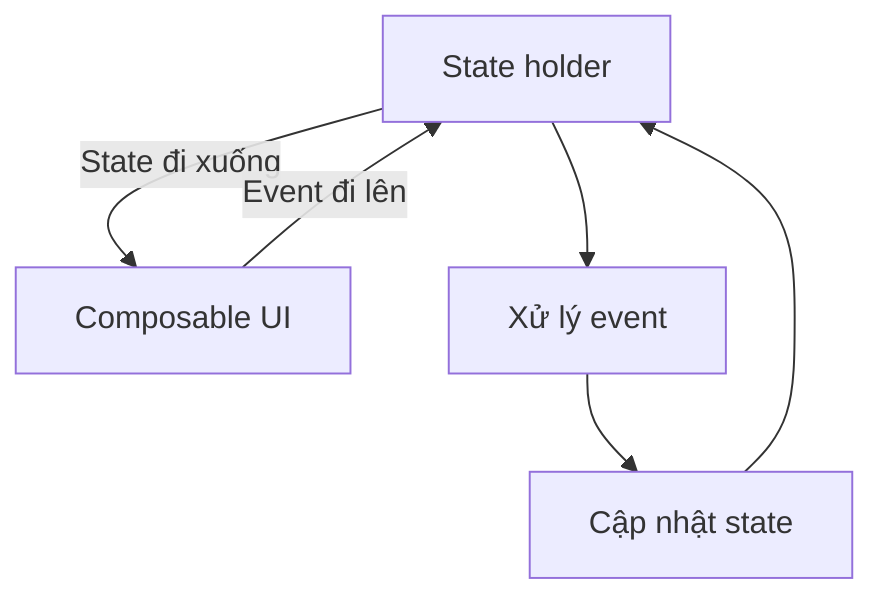
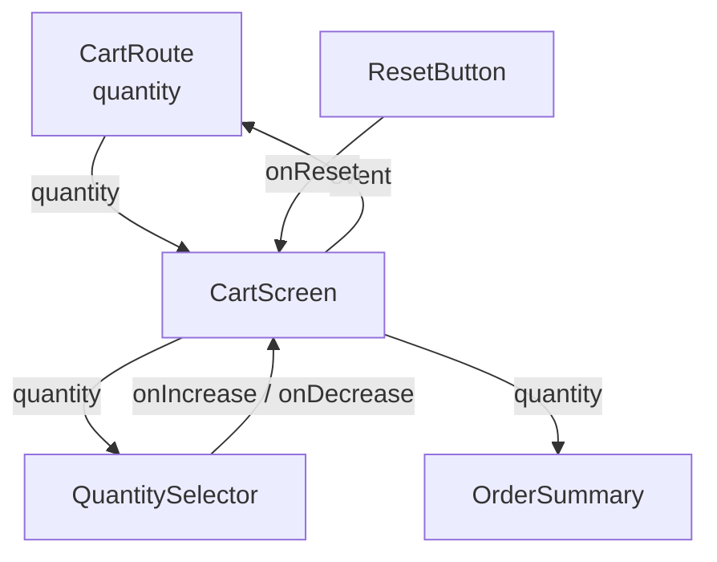
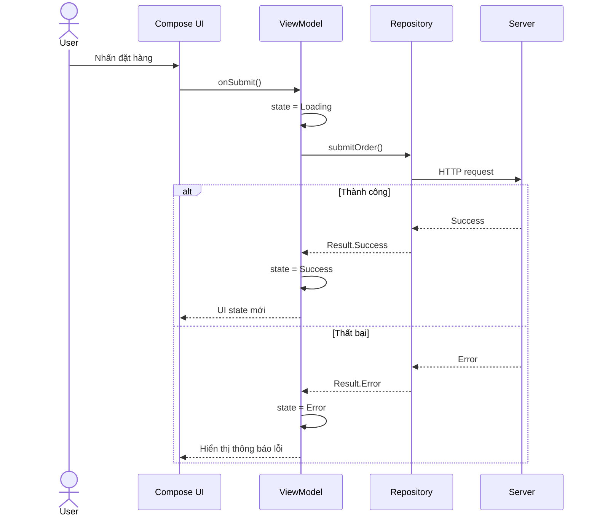

# 027 — State Hoisting trong Jetpack Compose

> **Học phần:** 02 — App Components and User Interface
> **Module:** Module 04 — Interface and Navigation
> **Nhóm nội dung:** Jetpack Compose
> **Nguồn roadmap:** Interface and Navigation / Jetpack Compose
> **Loại bài:** UI
> **Thứ tự trong module:** 027
> **Thời lượng gợi ý:** 30 phút

---

## 1. Tóm tắt


**State Hoisting** là kỹ thuật chuyển quyền sở hữu state từ một composable lên composable gọi nó. Thay vì tự lưu và tự thay đổi state, composable con nhận:

```kotlin
value: T
onValueChange: (T) -> Unit
```

hoặc những callback cụ thể hơn:

```kotlin
quantity: Int
onIncrease: () -> Unit
onDecrease: () -> Unit
```

Nhờ đó, composable con trở thành **stateless composable**:

* Chỉ hiển thị state được truyền xuống.
* Phát event lên khi người dùng tương tác.
* Không quyết định state được lưu ở đâu.
* Có thể tái sử dụng, preview và kiểm thử dễ hơn.

Mô hình này tuân theo **Unidirectional Data Flow — luồng dữ liệu một chiều**:

```text
State đi xuống ↓
Event đi lên   ↑
```

Android Developers định nghĩa State Hoisting là việc chuyển state đến caller của composable để biến composable thành stateless. State được hoist giúp duy trì một nguồn dữ liệu duy nhất, chia sẻ state giữa nhiều composable và tách phần hiển thị khỏi nơi lưu trữ state. ([Android Developers][1])

---

## 2. Mục tiêu học tập


Sau bài học, anh có thể:

* Giải thích State Hoisting bằng ngôn ngữ của mình.
* Phân biệt **stateful composable** và **stateless composable**.
* Chuyển state nội bộ thành `value` và callback.
* Xác định đúng composable nên sở hữu state.
* Chia sẻ một state cho nhiều composable.
* Kết hợp State Hoisting với `rememberSaveable` hoặc `ViewModel`.
* Viết test cho composable stateless.
* Nhận biết trường hợp không cần hoist state.
* Tạo một artifact nhỏ để đưa vào portfolio.

### Kết quả đầu ra mong đợi

Sau khoảng 30 phút, anh nên có:

```text
StateHoistingDemo/
├── CartScreen.kt
├── CartScreenTest.kt
├── screenshot.png
└── README.md
```

---

## 3. Khái niệm chính


### 3.1. State Hoisting là gì?

Giả sử một composable tự lưu giá trị số lượng:

```kotlin
@Composable
fun QuantitySelector() {
    var quantity by rememberSaveable {
        mutableIntStateOf(1)
    }

    Row {
        Button(onClick = { quantity-- }) {
            Text("-")
        }

        Text("$quantity")

        Button(onClick = { quantity++ }) {
            Text("+")
        }
    }
}
```

Đây là một **stateful composable**, bởi vì `QuantitySelector`:

* Sở hữu state `quantity`.
* Trực tiếp thay đổi state.
* Tự quyết định cách lưu state.

Vấn đề xuất hiện khi một composable khác cũng cần đọc `quantity`:

```text
CartScreen
├── QuantitySelector → cần quantity
└── OrderSummary     → cũng cần quantity
```

Nếu mỗi composable lưu một bản `quantity` riêng, hai giá trị có thể không đồng bộ.

State Hoisting giải quyết vấn đề bằng cách chuyển state lên `CartScreen`:

```text
                    quantity
                       │
                       ▼
                  CartScreen
                  /        \
                 ▼          ▼
     QuantitySelector   OrderSummary
              │
              └── event đi lên
```

Compose khuyến nghị hoist state tới **tổ tiên chung thấp nhất** của tất cả composable cần đọc hoặc thay đổi state, đồng thời giữ state gần nơi sử dụng nhất có thể. ([Android Developers][2])

---

### 3.2. Sau khi hoist state

Composable con chỉ nhận giá trị và callback:

```kotlin
@Composable
fun QuantitySelector(
    quantity: Int,
    onIncrease: () -> Unit,
    onDecrease: () -> Unit,
    modifier: Modifier = Modifier
) {
    Row(modifier = modifier) {
        Button(onClick = onDecrease) {
            Text("-")
        }

        Text(text = quantity.toString())

        Button(onClick = onIncrease) {
            Text("+")
        }
    }
}
```

Composable cha sở hữu state:

```kotlin
@Composable
fun CartRoute() {
    var quantity by rememberSaveable {
        mutableIntStateOf(1)
    }

    QuantitySelector(
        quantity = quantity,
        onIncrease = {
            quantity++
        },
        onDecrease = {
            if (quantity > 1) {
                quantity--
            }
        }
    )
}
```

Bây giờ `QuantitySelector` không cần biết:

* State nằm trong `rememberSaveable`, `ViewModel` hay `StateFlow`.
* Giá trị tối thiểu là bao nhiêu.
* Có cần gửi analytics hay không.
* Có phải lưu vào database hay không.

Nó chỉ hiển thị `quantity` và phát event.

---

### 3.3. Stateful và stateless composable

| Tiêu chí                | Stateful composable          | Stateless composable |
| ----------------------- | ---------------------------- | -------------------- |
| Tự sở hữu state         | Có                           | Không                |
| Tự thay đổi state       | Có                           | Không                |
| Nhận state từ caller    | Có thể                       | Có                   |
| Phát event qua callback | Có thể                       | Thường có            |
| Dễ tái sử dụng          | Thấp hơn                     | Cao hơn              |
| Dễ viết Preview         | Thấp hơn                     | Cao hơn              |
| Dễ unit/UI test         | Thấp hơn                     | Cao hơn              |
| Phù hợp                 | Wrapper, route, screen-level | Component hiển thị   |

Một pattern phổ biến là cung cấp cả hai phiên bản:

```kotlin
// Phiên bản stateful, thuận tiện cho caller đơn giản.
@Composable
fun QuantitySelector(
    modifier: Modifier = Modifier
) {
    var quantity by rememberSaveable {
        mutableIntStateOf(1)
    }

    QuantitySelector(
        quantity = quantity,
        onIncrease = { quantity++ },
        onDecrease = {
            if (quantity > 1) quantity--
        },
        modifier = modifier
    )
}

// Phiên bản stateless, tái sử dụng và kiểm soát được.
@Composable
fun QuantitySelector(
    quantity: Int,
    onIncrease: () -> Unit,
    onDecrease: () -> Unit,
    modifier: Modifier = Modifier
) {
    // UI
}
```

Android Developers cũng khuyến nghị cung cấp phiên bản stateful để sử dụng thuận tiện và phiên bản stateless cho caller cần kiểm soát state. ([Android Developers][1])

---

### 3.4. Ba quy tắc xác định nơi hoist state

#### Quy tắc 1: Hoist đến tổ tiên chung thấp nhất của các composable đọc state

```text
ProductScreen
├── QuantitySelector ── đọc quantity
└── PriceSummary ────── đọc quantity
```

`ProductScreen` nên sở hữu `quantity`.

#### Quy tắc 2: Hoist ít nhất đến cấp cao nhất có thể thay đổi state

Nếu cả `QuantitySelector` và nút `Reset` đều thay đổi `quantity`, state phải nằm phía trên cả hai.

```text
ProductScreen ── sở hữu quantity
├── QuantitySelector ── tăng/giảm
└── ResetButton ─────── đặt lại
```

#### Quy tắc 3: Những state thay đổi cùng một event nên được hoist cùng nhau

Ví dụ khi chọn sản phẩm:

```kotlin
selectedProductId
quantity
totalPrice
```

Nếu một event tác động đồng thời đến các state này, nên cân nhắc quản lý chúng trong cùng state holder.

Ba nguyên tắc trên được Android Developers sử dụng để xác định vị trí thích hợp của state trong cây composable. ([Android Developers][1])

---

### 3.5. Unidirectional Data Flow



Chu trình cập nhật UI:

1. Người dùng tạo event, chẳng hạn nhấn nút `+`.
2. Composable gọi callback `onIncrease`.
3. State owner xử lý event.
4. State owner cập nhật `quantity`.
5. Compose phát hiện state thay đổi.
6. Các composable đọc state được recomposition.
7. UI hiển thị giá trị mới.

UDF giúp tách composable hiển thị UI khỏi phần lưu và thay đổi state, đồng thời cải thiện khả năng kiểm thử, tính nhất quán và khả năng đóng gói state. ([Android Developers][3])

---

### 3.6. Lợi ích của State Hoisting

#### Một nguồn dữ liệu duy nhất

```text
quantity chỉ tồn tại ở CartRoute
```

Không có hai bản sao state cạnh tranh với nhau.

#### Có thể chia sẻ state

```kotlin
QuantitySelector(quantity = quantity, ...)
OrderSummary(quantity = quantity)
CartBadge(quantity = quantity)
```

Ba composable cùng sử dụng một giá trị.

#### Có thể can thiệp event

Caller có thể:

```kotlin
onIncrease = {
    analytics.logEvent("increase_quantity")
    quantity++
}
```

Composable con không cần chứa analytics.

#### Có thể kiểm tra đầu vào

```kotlin
onDecrease = {
    quantity = (quantity - 1).coerceAtLeast(1)
}
```

#### Có thể thay đổi nơi lưu state

Composable con không bị ảnh hưởng khi chuyển từ:

```kotlin
rememberSaveable
```

sang:

```kotlin
ViewModel + StateFlow
```

---

### 3.7. Không phải state nào cũng cần hoist

Một state có thể được giữ nội bộ khi:

* Chỉ một composable sử dụng.
* Không composable nào khác cần điều khiển.
* Logic rất đơn giản.
* State chỉ liên quan đến chi tiết trình bày.

Ví dụ:

```kotlin
@Composable
fun ExpandableMessage(
    message: String
) {
    var expanded by rememberSaveable {
        mutableStateOf(false)
    }

    Column(
        modifier = Modifier.clickable {
            expanded = !expanded
        }
    ) {
        Text(text = message)

        if (expanded) {
            Text(text = "Thông tin chi tiết")
        }
    }
}
```

Nếu `expanded` chỉ ảnh hưởng đến `ExpandableMessage`, việc giữ nó nội bộ là hợp lý. Android Developers lưu ý rằng state của UI element có logic đơn giản có thể nằm trong composable, đặc biệt khi phần khác của cây UI không cần đọc hoặc kiểm soát nó. ([Android Developers][2])

---

## 4. Thực hành


### 4.1. Yêu cầu bài thực hành

Xây dựng màn hình giỏ hàng nhỏ gồm:

* Tên sản phẩm.
* Bộ chọn số lượng.
* Tổng số sản phẩm.
* Tổng tiền.
* Nút đặt lại.

State `quantity` phải được dùng bởi:

```text
CartScreen
├── QuantitySelector
├── OrderSummary
└── Reset button
```

Do đó, `CartScreen` hoặc wrapper phía trên nó phải sở hữu state.

---

### 4.2. Cấu trúc đề xuất

```text
CartRoute
│
│ sở hữu quantity
│
└── CartScreen
    ├── ProductHeader
    ├── QuantitySelector
    ├── OrderSummary
    └── ResetButton
```



---

### 4.3. Mã nguồn hoàn chỉnh

```kotlin
package com.example.statehoisting

import androidx.compose.foundation.layout.Arrangement
import androidx.compose.foundation.layout.Column
import androidx.compose.foundation.layout.Row
import androidx.compose.foundation.layout.Spacer
import androidx.compose.foundation.layout.fillMaxWidth
import androidx.compose.foundation.layout.height
import androidx.compose.foundation.layout.padding
import androidx.compose.material3.Button
import androidx.compose.material3.Card
import androidx.compose.material3.MaterialTheme
import androidx.compose.material3.OutlinedButton
import androidx.compose.material3.Text
import androidx.compose.runtime.Composable
import androidx.compose.runtime.getValue
import androidx.compose.runtime.mutableIntStateOf
import androidx.compose.runtime.saveable.rememberSaveable
import androidx.compose.runtime.setValue
import androidx.compose.ui.Modifier
import androidx.compose.ui.platform.testTag
import androidx.compose.ui.tooling.preview.Preview
import androidx.compose.ui.unit.dp

private const val UNIT_PRICE = 25_000

/**
 * Stateful wrapper:
 * - Sở hữu quantity.
 * - Kiểm tra giới hạn.
 * - Xử lý các event từ UI.
 */
@Composable
fun CartRoute(
    modifier: Modifier = Modifier
) {
    var quantity by rememberSaveable {
        mutableIntStateOf(1)
    }

    CartScreen(
        productName = "Sổ tay Android",
        quantity = quantity,
        unitPrice = UNIT_PRICE,
        onIncrease = {
            quantity++
        },
        onDecrease = {
            quantity = (quantity - 1).coerceAtLeast(1)
        },
        onReset = {
            quantity = 1
        },
        modifier = modifier
    )
}

/**
 * Stateless screen:
 * - Nhận toàn bộ state cần hiển thị.
 * - Chỉ phát event cho caller.
 */
@Composable
fun CartScreen(
    productName: String,
    quantity: Int,
    unitPrice: Int,
    onIncrease: () -> Unit,
    onDecrease: () -> Unit,
    onReset: () -> Unit,
    modifier: Modifier = Modifier
) {
    Column(
        modifier = modifier.padding(16.dp),
        verticalArrangement = Arrangement.spacedBy(16.dp)
    ) {
        ProductHeader(productName = productName)

        QuantitySelector(
            quantity = quantity,
            onIncrease = onIncrease,
            onDecrease = onDecrease
        )

        OrderSummary(
            quantity = quantity,
            unitPrice = unitPrice
        )

        OutlinedButton(
            onClick = onReset,
            enabled = quantity != 1,
            modifier = Modifier.fillMaxWidth()
        ) {
            Text("Đặt lại")
        }
    }
}

@Composable
private fun ProductHeader(
    productName: String,
    modifier: Modifier = Modifier
) {
    Column(modifier = modifier) {
        Text(
            text = "Sản phẩm",
            style = MaterialTheme.typography.labelLarge
        )

        Text(
            text = productName,
            style = MaterialTheme.typography.headlineSmall
        )
    }
}

/**
 * Stateless component:
 * Không chứa remember hoặc mutableStateOf.
 */
@Composable
fun QuantitySelector(
    quantity: Int,
    onIncrease: () -> Unit,
    onDecrease: () -> Unit,
    modifier: Modifier = Modifier
) {
    Row(
        modifier = modifier.fillMaxWidth(),
        horizontalArrangement = Arrangement.SpaceBetween
    ) {
        Button(
            onClick = onDecrease,
            enabled = quantity > 1,
            modifier = Modifier.testTag("decrease_button")
        ) {
            Text("-")
        }

        Text(
            text = quantity.toString(),
            style = MaterialTheme.typography.headlineMedium,
            modifier = Modifier.testTag("quantity_text")
        )

        Button(
            onClick = onIncrease,
            modifier = Modifier.testTag("increase_button")
        ) {
            Text("+")
        }
    }
}

@Composable
fun OrderSummary(
    quantity: Int,
    unitPrice: Int,
    modifier: Modifier = Modifier
) {
    val totalPrice = quantity * unitPrice

    Card(modifier = modifier.fillMaxWidth()) {
        Column(modifier = Modifier.padding(16.dp)) {
            Text(
                text = "Tóm tắt đơn hàng",
                style = MaterialTheme.typography.titleMedium
            )

            Spacer(modifier = Modifier.height(8.dp))

            Text(
                text = "Số lượng: $quantity",
                modifier = Modifier.testTag("summary_quantity")
            )

            Text(
                text = "Tổng tiền: %,d VNĐ".format(totalPrice),
                modifier = Modifier.testTag("total_price")
            )
        }
    }
}

@Preview(showBackground = true)
@Composable
private fun CartScreenPreview() {
    MaterialTheme {
        CartScreen(
            productName = "Sổ tay Android",
            quantity = 3,
            unitPrice = UNIT_PRICE,
            onIncrease = {},
            onDecrease = {},
            onReset = {}
        )
    }
}
```

---

### 4.4. Phân tích luồng hoạt động

Khi người dùng nhấn nút `+`:

```text
1. QuantitySelector nhận thao tác nhấn.
2. QuantitySelector gọi onIncrease().
3. CartScreen chuyển event đến CartRoute.
4. CartRoute tăng quantity.
5. State quantity thay đổi.
6. CartScreen được gọi lại với quantity mới.
7. QuantitySelector và OrderSummary hiển thị giá trị mới.
```

Điểm quan trọng:

```kotlin
QuantitySelector(
    quantity = quantity,
    onIncrease = onIncrease
)
```

`QuantitySelector` không tự viết:

```kotlin
quantity++
```

Nó chỉ yêu cầu caller xử lý event.

---

### 4.5. Tại sao `OrderSummary` không cần state riêng?

Không nên viết:

```kotlin
@Composable
fun OrderSummary() {
    var quantity by remember {
        mutableIntStateOf(1)
    }
}
```

Vì đây sẽ là một bản `quantity` khác với `QuantitySelector`.

Đúng hơn:

```kotlin
@Composable
fun OrderSummary(
    quantity: Int,
    unitPrice: Int
)
```

`quantity` có một chủ sở hữu duy nhất và được truyền xuống tất cả nơi cần đọc.

---

### 4.6. Preview nhiều trạng thái

Vì `CartScreen` là stateless, anh có thể preview từng trường hợp mà không cần thao tác thủ công:

```kotlin
@Preview(
    name = "Một sản phẩm",
    showBackground = true
)
@Composable
private fun OneItemPreview() {
    MaterialTheme {
        CartScreen(
            productName = "Sổ tay Android",
            quantity = 1,
            unitPrice = 25_000,
            onIncrease = {},
            onDecrease = {},
            onReset = {}
        )
    }
}

@Preview(
    name = "Nhiều sản phẩm",
    showBackground = true
)
@Composable
private fun MultipleItemsPreview() {
    MaterialTheme {
        CartScreen(
            productName = "Sổ tay Android",
            quantity = 10,
            unitPrice = 25_000,
            onIncrease = {},
            onDecrease = {},
            onReset = {}
        )
    }
}
```

---

### 4.7. Phiên bản dùng ViewModel

Khi state liên quan tới business logic, repository, network hoặc database, state có thể được hoist ra khỏi Composition và đặt trong `ViewModel`.

```kotlin
data class CartUiState(
    val productName: String = "Sổ tay Android",
    val quantity: Int = 1,
    val unitPrice: Int = 25_000
) {
    val totalPrice: Int
        get() = quantity * unitPrice
}
```

```kotlin
class CartViewModel : ViewModel() {

    private val _uiState = MutableStateFlow(CartUiState())
    val uiState: StateFlow<CartUiState> = _uiState.asStateFlow()

    fun increaseQuantity() {
        _uiState.update { currentState ->
            currentState.copy(
                quantity = currentState.quantity + 1
            )
        }
    }

    fun decreaseQuantity() {
        _uiState.update { currentState ->
            currentState.copy(
                quantity = (currentState.quantity - 1)
                    .coerceAtLeast(1)
            )
        }
    }

    fun resetQuantity() {
        _uiState.update { currentState ->
            currentState.copy(quantity = 1)
        }
    }
}
```

Screen-level composable kết nối ViewModel với UI:

```kotlin
@Composable
fun CartRoute(
    viewModel: CartViewModel = viewModel()
) {
    val uiState by viewModel.uiState.collectAsStateWithLifecycle()

    CartScreen(
        productName = uiState.productName,
        quantity = uiState.quantity,
        unitPrice = uiState.unitPrice,
        onIncrease = viewModel::increaseQuantity,
        onDecrease = viewModel::decreaseQuantity,
        onReset = viewModel::resetQuantity
    )
}
```

Chỉ `CartRoute` biết đến `CartViewModel`. Các composable con vẫn nhận state và callback thông thường. Android Developers khuyến nghị sử dụng screen-level state holder như `ViewModel` cho screen UI state được tạo từ business logic, đồng thời không truyền trực tiếp `ViewModel` sâu xuống các composable con. ([Android Developers][2])

---

## 5. Bài tập


### Bài tập 1 — Bộ đếm cơ bản

Tạo `CounterScreen` có:

* Nút giảm.
* Giá trị hiện tại.
* Nút tăng.
* Nút đặt lại.
* Giá trị tối thiểu bằng `0`.

Yêu cầu:

```kotlin
@Composable
fun CounterContent(
    count: Int,
    onIncrease: () -> Unit,
    onDecrease: () -> Unit,
    onReset: () -> Unit
)
```

Không được đặt `remember` hoặc `mutableStateOf` trong `CounterContent`.

---

### Bài tập 2 — Form đăng ký

Xây dựng form có các state:

```kotlin
name: String
email: String
acceptedTerms: Boolean
```

Các component:

```text
RegistrationScreen
├── NameField
├── EmailField
├── TermsCheckbox
└── SubmitButton
```

Yêu cầu:

* Hoist các state lên `RegistrationRoute`.
* `SubmitButton` chỉ được bật khi dữ liệu hợp lệ.
* Callback đặt tên theo event cụ thể.

```kotlin
onNameChange: (String) -> Unit
onEmailChange: (String) -> Unit
onTermsChange: (Boolean) -> Unit
onSubmit: () -> Unit
```

---

### Bài tập 3 — Hai composable dùng chung state

Tạo màn hình chọn mức âm lượng:

```text
VolumeScreen
├── VolumeSlider
└── VolumeLabel
```

Cả hai cùng đọc `volume`.

```kotlin
@Composable
fun VolumeScreen(
    volume: Float,
    onVolumeChange: (Float) -> Unit
)
```

Khi kéo slider, label phải cập nhật ngay:

```text
Âm lượng: 70%
```

---

### Bài tập 4 — Tìm vị trí hoist phù hợp

Cho cây composable:

```text
ProfileScreen
├── ProfileHeader
├── EditProfileForm
│   ├── NameField
│   └── SaveButton
└── CharacterCounter
```

`NameField`, `SaveButton` và `CharacterCounter` đều cần `name`.

**Câu hỏi:** `name` nên được sở hữu ở đâu?

**Đáp án:** `EditProfileForm` nếu chỉ ba component bên trong cần state; `ProfileScreen` nếu `ProfileHeader` cũng cần hiển thị tên đang chỉnh sửa.

---

### Bài tập 5 — Refactor anti-pattern

Refactor đoạn mã sau:

```kotlin
@Composable
fun SearchBar() {
    var query by rememberSaveable {
        mutableStateOf("")
    }

    OutlinedTextField(
        value = query,
        onValueChange = {
            query = it
        }
    )
}
```

thành:

```kotlin
@Composable
fun SearchBar(
    query: String,
    onQueryChange: (String) -> Unit
) {
    OutlinedTextField(
        value = query,
        onValueChange = onQueryChange
    )
}
```

Sau đó tạo stateful wrapper để lưu `query`.

---

### 5.1. UI test cho composable stateless

```kotlin
package com.example.statehoisting

import androidx.compose.material3.MaterialTheme
import androidx.compose.ui.test.assertIsDisplayed
import androidx.compose.ui.test.junit4.createComposeRule
import androidx.compose.ui.test.onNodeWithTag
import androidx.compose.ui.test.performClick
import org.junit.Assert.assertEquals
import org.junit.Rule
import org.junit.Test

class QuantitySelectorTest {

    @get:Rule
    val composeRule = createComposeRule()

    @Test
    fun increaseButton_emitsIncreaseEvent() {
        var increaseEventCount = 0

        composeRule.setContent {
            MaterialTheme {
                QuantitySelector(
                    quantity = 1,
                    onIncrease = {
                        increaseEventCount++
                    },
                    onDecrease = {}
                )
            }
        }

        composeRule
            .onNodeWithTag("increase_button")
            .performClick()

        composeRule.runOnIdle {
            assertEquals(1, increaseEventCount)
        }
    }

    @Test
    fun quantitySelector_displaysProvidedQuantity() {
        composeRule.setContent {
            MaterialTheme {
                QuantitySelector(
                    quantity = 5,
                    onIncrease = {},
                    onDecrease = {}
                )
            }
        }

        composeRule
            .onNodeWithTag("quantity_text")
            .assertIsDisplayed()
    }
}
```

Test trên xác minh hai trách nhiệm của composable stateless:

```text
Input state  → được hiển thị
User action  → phát callback
```

---

### 5.2. Test cả luồng cập nhật state

```kotlin
@Test
fun increaseButton_updatesQuantityAndSummary() {
    composeRule.setContent {
        MaterialTheme {
            CartRoute()
        }
    }

    composeRule
        .onNodeWithTag("increase_button")
        .performClick()

    composeRule
        .onNodeWithTag("quantity_text")
        .assertTextEquals("2")

    composeRule
        .onNodeWithTag("summary_quantity")
        .assertTextEquals("Số lượng: 2")

    composeRule
        .onNodeWithTag("total_price")
        .assertTextEquals("Tổng tiền: 50,000 VNĐ")
}
```

---

### 5.3. Checklist kiểm thử thủ công

| Bước | Thao tác           | Kết quả mong đợi              |
| ---- | ------------------ | ----------------------------- |
| 1    | Mở màn hình        | Số lượng bằng `1`             |
| 2    | Nhấn `+`           | Số lượng thành `2`            |
| 3    | Quan sát tổng tiền | Tổng tiền thành `50.000 VNĐ`  |
| 4    | Nhấn `-`           | Số lượng trở về `1`           |
| 5    | Nhấn `-` lần nữa   | Giá trị không nhỏ hơn `1`     |
| 6    | Tăng lên `3`       | Summary hiển thị `3`          |
| 7    | Nhấn đặt lại       | Giá trị trở về `1`            |
| 8    | Xoay màn hình      | State vẫn được giữ            |
| 9    | Mở Preview         | Có thể xem UI với state tùy ý |
| 10   | Chạy UI test       | Tất cả test vượt qua          |

---

## 6. Checklist hoàn thành


### Kiến thức

* [ ] Giải thích được State Hoisting.
* [ ] Hiểu state đi xuống và event đi lên.
* [ ] Phân biệt được stateful và stateless composable.
* [ ] Biết pattern `value` và `onValueChange`.
* [ ] Biết sử dụng callback cụ thể như `onSubmit`.
* [ ] Xác định được tổ tiên chung thấp nhất.
* [ ] Hiểu trường hợp không cần hoist state.

### Code

* [ ] Composable hiển thị không tự lưu state không cần thiết.
* [ ] State chỉ có một owner.
* [ ] Không tạo hai bản sao state cho cùng một dữ liệu.
* [ ] State truyền xuống dưới dạng immutable value.
* [ ] Event truyền lên dưới dạng lambda.
* [ ] Callback có tên diễn tả ý định người dùng.
* [ ] Có tham số `Modifier`.
* [ ] Có Preview cho ít nhất hai trạng thái.
* [ ] Có `testTag` cho component cần kiểm thử.

### Lifecycle và state restoration

* [ ] Biết `remember` giữ state qua recomposition.
* [ ] Biết `rememberSaveable` phù hợp với transient UI state nhỏ.
* [ ] Đã kiểm tra xoay màn hình.
* [ ] Không lưu object lớn vào saved instance state.
* [ ] Biết khi nào state nên chuyển sang `ViewModel`.
* [ ] Biết `ViewModel` không tự vượt qua system-initiated process death.

### Testing

* [ ] Test state được hiển thị đúng.
* [ ] Test callback được gọi.
* [ ] Test giới hạn giá trị.
* [ ] Test nhiều composable cùng cập nhật.
* [ ] Test khôi phục state nếu tính năng yêu cầu.
* [ ] Có checklist kiểm thử thủ công.

### Portfolio

* [ ] Có screenshot ứng dụng.
* [ ] Có video hoặc GIF ngắn mô tả tương tác.
* [ ] Có README giải thích luồng state/event.
* [ ] Có sơ đồ cây composable.
* [ ] Có source code.
* [ ] Có ít nhất một UI test.

---

## 7. Ghi chú sản xuất


### 7.1. Chọn state owner theo loại logic

| Tình huống                                     | State owner phù hợp                        |
| ---------------------------------------------- | ------------------------------------------ |
| Animation đơn giản chỉ dùng tại một component  | Composable                                 |
| Trạng thái mở/đóng cục bộ                      | Composable                                 |
| State được nhiều sibling composable sử dụng    | Tổ tiên chung thấp nhất                    |
| UI logic phức tạp như scroll/navigation        | Plain state holder                         |
| State liên quan repository hoặc business logic | ViewModel                                  |
| Dữ liệu cần lưu lâu dài                        | Data layer/database                        |
| State nhỏ cần khôi phục sau process recreation | `rememberSaveable` hoặc `SavedStateHandle` |

State nên được hoist dựa trên nơi logic cần sử dụng nó: UI logic có thể nằm trong composable hoặc plain state holder, còn screen UI state được tạo từ business logic thường thuộc screen-level state holder như `ViewModel`. ([Android Developers][2])

---

### 7.2. `remember`, `rememberSaveable` và `ViewModel`

| API                              |  Recomposition | Configuration change |              System process death |
| -------------------------------- | -------------: | -------------------: | --------------------------------: |
| `remember`                       |             Có |                Không |                             Không |
| `rememberSaveable`               |             Có |                   Có |         Có, với dữ liệu được save |
| `ViewModel`                      |             Có |                   Có |                             Không |
| `ViewModel` + `SavedStateHandle` |             Có |                   Có | Có, với transient state được save |
| Database/DataStore               | Có thể tải lại |                   Có |                                Có |

`rememberSaveable` sử dụng cơ chế saved instance state và phù hợp với lượng nhỏ transient UI state. Không nên lưu danh sách lớn hoặc object phức tạp trong `Bundle`; thay vào đó chỉ lưu ID hoặc key cần thiết rồi tải lại dữ liệu từ data layer. ([Android Developers][4])

---

### 7.3. Không hoist mọi thứ lên ViewModel

Anti-pattern:

```kotlin
class ProductViewModel : ViewModel() {
    var isButtonPressed by mutableStateOf(false)
    var rippleProgress by mutableStateOf(0f)
    var localAnimationExpanded by mutableStateOf(false)
}
```

Các state chỉ liên quan animation hoặc trình bày cục bộ không nhất thiết phải nằm trong `ViewModel`.

Nên đặt câu hỏi:

```text
Business logic có cần đọc state này không?
Một composable khác có cần điều khiển nó không?
State có cần tồn tại ngoài lifecycle của component không?
```

Nếu câu trả lời đều là “không”, state có thể ở lại composable.

---

### 7.4. Không truyền ViewModel xuống toàn bộ cây UI

Không nên:

```kotlin
@Composable
fun ProductCard(
    viewModel: ProductViewModel
) {
    Button(
        onClick = {
            viewModel.addToCart()
        }
    ) {
        Text("Thêm vào giỏ")
    }
}
```

Nên:

```kotlin
@Composable
fun ProductCard(
    product: ProductUiModel,
    onAddToCart: () -> Unit
) {
    Button(
        onClick = onAddToCart
    ) {
        Text("Thêm vào giỏ")
    }
}
```

Kết nối với ViewModel ở screen-level:

```kotlin
ProductCard(
    product = product,
    onAddToCart = {
        viewModel.addToCart(product.id)
    }
)
```

Cách này giúp `ProductCard`:

* Không phụ thuộc Android Architecture Components.
* Dùng được trong Preview.
* Dùng được ở nhiều màn hình.
* Test được bằng callback giả.
* Hiển thị rõ trách nhiệm qua function signature.

---

### 7.5. Tránh callback quá chung chung

Kém rõ nghĩa:

```kotlin
onAction: (String) -> Unit
```

Caller phải đoán các giá trị:

```kotlin
onAction("increase")
onAction("delete")
onAction("submit")
```

Rõ nghĩa hơn:

```kotlin
onIncrease: () -> Unit
onDelete: () -> Unit
onSubmit: () -> Unit
```

Với screen phức tạp, có thể dùng sealed interface:

```kotlin
sealed interface CartAction {
    data object IncreaseQuantity : CartAction
    data object DecreaseQuantity : CartAction
    data object ResetQuantity : CartAction
    data object SubmitOrder : CartAction
}
```

```kotlin
@Composable
fun CartScreen(
    state: CartUiState,
    onAction: (CartAction) -> Unit
)
```

Không cần ép mọi component nhỏ dùng một event wrapper lớn. Component tái sử dụng thường rõ ràng hơn khi nhận callback riêng biệt.

---

### 7.6. Tránh truyền state quá lớn

Không tối ưu:

```kotlin
@Composable
fun ProductTitle(
    cartUiState: CartUiState
) {
    Text(cartUiState.product.name)
}
```

Tốt hơn:

```kotlin
@Composable
fun ProductTitle(
    title: String
) {
    Text(title)
}
```

Composable nên nhận lượng dữ liệu nhỏ nhất cần thiết. Truyền các immutable value cụ thể giúp trách nhiệm rõ ràng hơn và có thể hạn chế những lần recomposition không cần thiết khi các phần khác của object thay đổi. ([Android Developers][3])

---

### 7.7. Xử lý lỗi network

Giả sử `onSubmit` gửi đơn hàng lên server. Không nên để component nút tự gọi repository:

```kotlin
@Composable
fun SubmitButton(
    repository: OrderRepository
)
```

Nên biểu diễn trạng thái màn hình:

```kotlin
sealed interface SubmitState {
    data object Idle : SubmitState
    data object Loading : SubmitState
    data object Success : SubmitState
    data class Error(val message: String) : SubmitState
}
```

```kotlin
data class CartUiState(
    val quantity: Int = 1,
    val submitState: SubmitState = SubmitState.Idle
)
```

Composable chỉ render:

```kotlin
@Composable
fun SubmitOrderButton(
    submitState: SubmitState,
    onSubmit: () -> Unit
) {
    Button(
        onClick = onSubmit,
        enabled = submitState !is SubmitState.Loading
    ) {
        when (submitState) {
            SubmitState.Loading -> {
                CircularProgressIndicator()
            }

            else -> {
                Text("Đặt hàng")
            }
        }
    }
}
```

Luồng production:



---

### 7.8. Rủi ro production cần kiểm tra

#### UX

* Có mất dữ liệu người dùng đang nhập khi xoay màn hình không?
* Nút có bị nhấn nhiều lần khi request đang chạy không?
* State loading, success và error có hiển thị rõ không?
* Các component có hiển thị cùng một state không?

#### Maintainability

* State có một chủ sở hữu rõ ràng không?
* Có component nào tự thay đổi state không thuộc quyền sở hữu của nó không?
* Callback có diễn tả đúng ý định người dùng không?
* ViewModel có bị truyền quá sâu không?

#### Performance

* Có truyền object quá lớn vào component nhỏ không?
* State có được đọc ở cấp quá cao làm nhiều component recomposition không?
* Model truyền vào có immutable và ổn định không?
* Có tính toán nặng trực tiếp trong composable không?

#### Testing

* Callback có được kiểm thử độc lập không?
* Có test trạng thái ban đầu không?
* Có test boundary như số lượng tối thiểu không?
* Có test state restoration không?
* Có test loading và error không?

#### Release

* Có thay đổi behavior khi rotate/background không?
* Có analytics cho event quan trọng không?
* Có crash do lưu object lớn vào `Bundle` không?
* Có kiểm thử trên màn hình nhỏ, lớn và font scale cao không?

---

## README mẫu cho portfolio

```markdown
# State Hoisting Demo

Ứng dụng minh họa State Hoisting trong Jetpack Compose thông qua
màn hình chọn số lượng sản phẩm.

## Kiến trúc

- `CartRoute` là stateful composable và sở hữu `quantity`.
- `CartScreen` là stateless screen.
- `QuantitySelector` nhận state và phát event.
- `OrderSummary` đọc cùng state để tính tổng tiền.

## Luồng dữ liệu

State đi từ `CartRoute` xuống các component.
Event đi từ component lên `CartRoute`.

## Kỹ thuật sử dụng

- Jetpack Compose
- Material 3
- rememberSaveable
- Unidirectional Data Flow
- State Hoisting
- Compose UI Test

## Kết quả

- Không có state trùng lặp.
- Component có thể tái sử dụng.
- Có thể preview nhiều trạng thái.
- Callback có thể test độc lập.
```

---

## Tổng kết

```text
State Hoisting
    =
Chuyển state lên caller
    +
Truyền state xuống dưới
    +
Truyền event lên trên
```

Công thức phổ biến:

```kotlin
@Composable
fun Component(
    value: T,
    onValueChange: (T) -> Unit
)
```

Hoặc callback theo ý nghĩa nghiệp vụ:

```kotlin
@Composable
fun Component(
    state: UiState,
    onSubmit: () -> Unit,
    onRetry: () -> Unit,
    onDismiss: () -> Unit
)
```

Điểm cốt lõi cần nhớ:

1. State phải có một nguồn dữ liệu duy nhất.
2. State đi xuống, event đi lên.
3. Hoist state đến tổ tiên chung thấp nhất cần sử dụng nó.
4. Không phải state nào cũng cần đưa lên `ViewModel`.
5. Composable stateless thường dễ tái sử dụng, preview và test hơn.
6. Chỉ lưu transient state nhỏ bằng `rememberSaveable` hoặc `SavedStateHandle`.
7. Không truyền `ViewModel` sâu xuống cây component.

---

## Tài liệu tham khảo

* [State and Jetpack Compose — Android Developers](https://developer.android.com/develop/ui/compose/state)
* [Where to hoist state — Android Developers](https://developer.android.com/develop/ui/compose/state-hoisting)
* [Compose UI Architecture — Android Developers](https://developer.android.com/develop/ui/compose/architecture)
* [Save UI state in Compose — Android Developers](https://developer.android.com/develop/ui/compose/state-saving)

[1]: https://developer.android.com/develop/ui/compose/state "State and Jetpack Compose  |  Android Developers"
[2]: https://developer.android.com/develop/ui/compose/state-hoisting "Where to hoist state  |  Jetpack Compose  |  Android Developers"
[3]: https://developer.android.com/develop/ui/compose/architecture "Compose UI Architecture  |  Jetpack Compose  |  Android Developers"
[4]: https://developer.android.com/develop/ui/compose/state-saving "Save UI state in Compose  |  Jetpack Compose  |  Android Developers"
