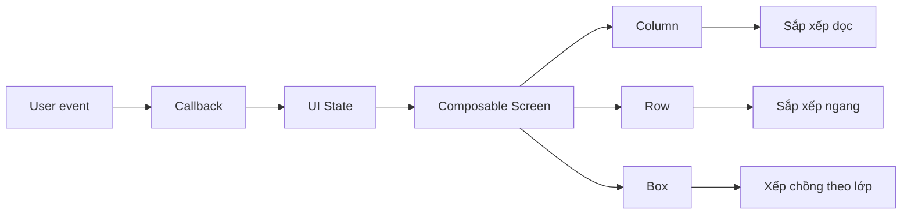
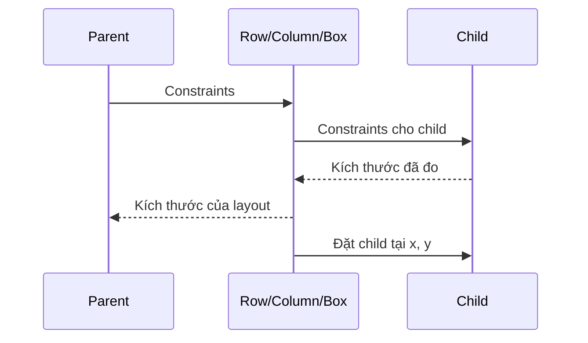
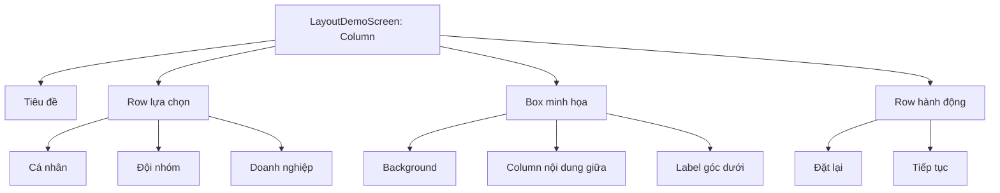
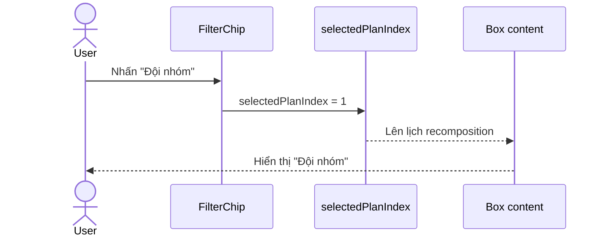
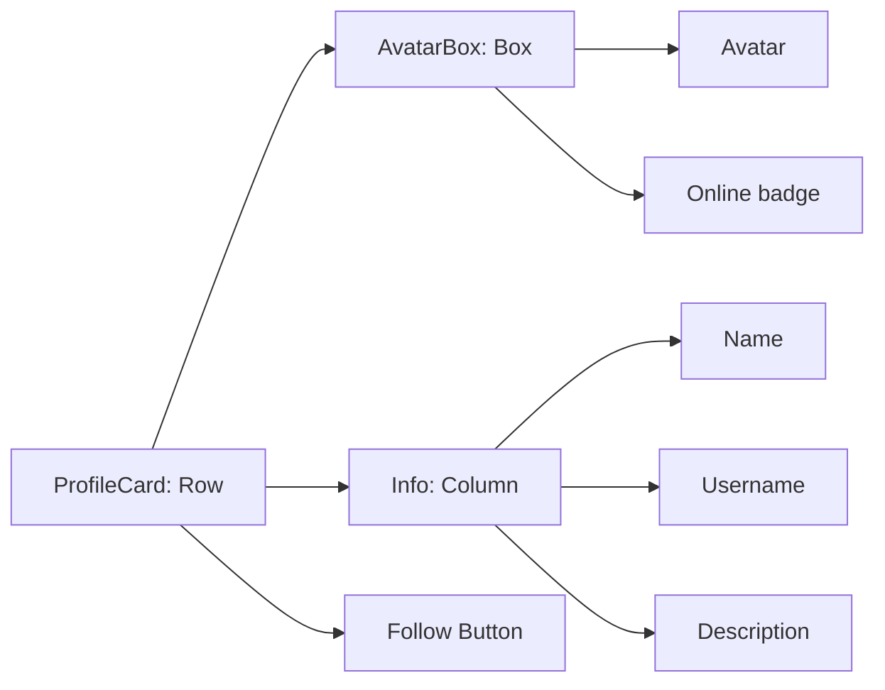
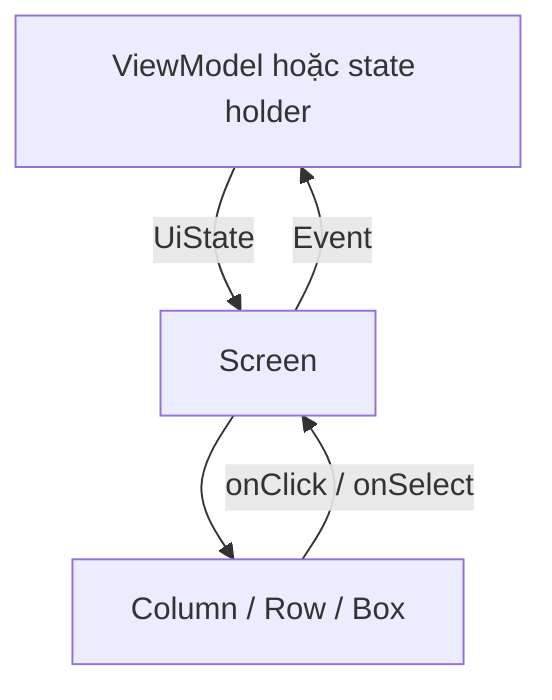

# 028 — Column, Row và Box trong Jetpack Compose

| Thuộc tính              | Nội dung                                                                 |
| ----------------------- | ------------------------------------------------------------------------ |
| **Học phần**            | 02 — App Components and User Interface                                   |
| **Module**              | Module 04 — Interface and Navigation                                     |
| **Nhóm nội dung**       | Jetpack Compose                                                          |
| **Nguồn roadmap**       | Interface and Navigation / Jetpack Compose                               |
| **Loại bài**            | UI                                                                       |
| **Thứ tự trong module** | 028                                                                      |
| **Thời lượng gợi ý**    | 30 phút                                                                  |
| **Sản phẩm đầu ra**     | Một màn hình Compose sử dụng `Column`, `Row`, `Box`, có state và UI test |

---

## 1. Tóm tắt


> **Nguồn ảnh:** Android Developers — Compose layout basics.

`Column`, `Row` và `Box` là ba layout container nền tảng trong Jetpack Compose:

* `Column` sắp xếp các thành phần theo **chiều dọc**.
* `Row` sắp xếp các thành phần theo **chiều ngang**.
* `Box` cho phép các thành phần nằm trong cùng một vùng và có thể **xếp chồng lên nhau**.

Trong Compose, state được chuyển thành giao diện thông qua ba giai đoạn chính: composition, layout và drawing. `Column`, `Row` và `Box` chủ yếu tham gia vào giai đoạn layout, nơi Compose đo kích thước và xác định vị trí của các phần tử con.

Ba container này thường được kết hợp để tạo nên hầu hết giao diện Android:

```text
Màn hình
└── Column
    ├── Tiêu đề
    ├── Row
    │   ├── Ảnh đại diện
    │   └── Column
    │       ├── Tên
    │       └── Mô tả
    └── Box
        ├── Ảnh nền
        ├── Nội dung
        └── Nhãn nổi
```

### Vị trí trong kiến trúc ứng dụng



`Column`, `Row` và `Box` không nên chứa business logic. Chúng nhận dữ liệu, bố trí UI và phát sự kiện lên composable cha thông qua callback.

---

## 2. Mục tiêu học tập


> **Nguồn ảnh:** Android Developers — Basic layouts in Compose codelab.

Sau bài học, anh có thể:

* Giải thích sự khác nhau giữa `Column`, `Row` và `Box`.
* Xác định **main axis** và **cross axis** của từng layout.
* Sử dụng đúng `Arrangement` và `Alignment`.
* Dùng `Modifier.weight()` để chia không gian còn lại.
* Đặt từng child tại vị trí riêng bằng `Modifier.align()`.
* Hiểu ảnh hưởng của thứ tự `Modifier`.
* Kết hợp cả ba layout để xây dựng một màn hình thực tế.
* Thêm state để UI tự cập nhật khi người dùng tương tác.
* Viết UI test kiểm tra trạng thái và nội dung hiển thị.
* Nhận biết khi nào cần chuyển sang `LazyColumn`, `LazyRow` hoặc `FlowRow`.

Codelab chính thức của Android sử dụng các layout container, modifier, alignment và arrangement để chuyển một thiết kế thực tế thành giao diện Compose hoàn chỉnh.

---

## 3. Khái niệm chính


> **Nguồn ảnh:** Android Developers — Constraints and modifier order.

### 3.1. Mô hình layout trong Compose

Trong giai đoạn layout, mỗi node thực hiện ba công việc:

1. **Measure children:** đo các thành phần con.
2. **Decide own size:** quyết định kích thước của chính nó.
3. **Place children:** đặt các thành phần con vào vị trí thích hợp.

Constraint được truyền từ cha xuống con. Kích thước đã đo được truyền ngược từ con lên cha. Sau đó cha xác định tọa độ của từng child.



### 3.2. Column

`Column` đặt các child liên tiếp theo chiều dọc. Theo mặc định, `Column` chỉ lớn vừa đủ để chứa nội dung nếu không bị modifier hoặc constraint của parent yêu cầu kích thước khác. `Column` không tự cuộn; màn hình dài cần dùng `verticalScroll` hoặc `LazyColumn`.

```kotlin
Column {
    Text("Họ và tên")
    Text("Trần An Khánh")
    Button(onClick = {}) {
        Text("Chỉnh sửa")
    }
}
```

#### Trục của Column

```text
             Cross axis — chiều ngang
        ◀────────────────────────────▶

        ┌─────────────────────────────┐
        │ Child 1                     │
        ├─────────────────────────────┤
        │ Child 2                     │  │
        ├─────────────────────────────┤  │ Main axis
        │ Child 3                     │  │ chiều dọc
        └─────────────────────────────┘  ▼
```

Các tham số quan trọng:

```kotlin
Column(
    verticalArrangement = Arrangement.spacedBy(12.dp),
    horizontalAlignment = Alignment.CenterHorizontally
) {
    // Children
}
```

* `verticalArrangement`: bố trí các child trên trục dọc.
* `horizontalAlignment`: căn các child trên trục ngang.

Ví dụ:

```kotlin
Column(
    modifier = Modifier.fillMaxHeight(),
    verticalArrangement = Arrangement.SpaceBetween,
    horizontalAlignment = Alignment.CenterHorizontally
) {
    Text("Đầu màn hình")
    Text("Giữa màn hình")
    Text("Cuối màn hình")
}
```

### 3.3. Row

`Row` đặt các child liên tiếp theo chiều ngang. Đây là lựa chọn phù hợp cho thanh công cụ, nhóm nút, thông tin avatar–tên người dùng hoặc các thành phần nằm cạnh nhau. API layout của Compose định nghĩa `Row` là container sắp xếp child theo chuỗi ngang.

```kotlin
Row {
    Text("Giá:")
    Text("120.000 ₫")
}
```

#### Trục của Row

```text
                    Main axis — chiều ngang
              ◀────────────────────────────▶

              ┌────────┬────────┬────────┐
              │ Child 1│ Child 2│ Child 3│
              └────────┴────────┴────────┘
                        │
                        │ Cross axis
                        ▼ chiều dọc
```

Các tham số quan trọng:

```kotlin
Row(
    horizontalArrangement = Arrangement.spacedBy(8.dp),
    verticalAlignment = Alignment.CenterVertically
) {
    // Children
}
```

* `horizontalArrangement`: bố trí child trên trục ngang.
* `verticalAlignment`: căn child trên trục dọc.

Ví dụ thanh hành động:

```kotlin
Row(
    modifier = Modifier.fillMaxWidth(),
    horizontalArrangement = Arrangement.End,
    verticalAlignment = Alignment.CenterVertically
) {
    TextButton(onClick = {}) {
        Text("Hủy")
    }

    Button(onClick = {}) {
        Text("Lưu")
    }
}
```

### 3.4. Box

`Box` đặt các child trong cùng một vùng. Các child có thể chồng lên nhau, rất phù hợp cho:

* Ảnh có chữ phủ lên trên.
* Badge thông báo.
* Loading overlay.
* Gradient phủ lên ảnh.
* Nút nổi ở góc.
* Empty state nằm giữa vùng nội dung.

`Box` có `contentAlignment` mặc định là `Alignment.TopStart`. Có thể đặt alignment chung cho tất cả child hoặc dùng `Modifier.align()` để căn riêng từng child.

```kotlin
Box(
    modifier = Modifier.size(200.dp),
    contentAlignment = Alignment.Center
) {
    Text("Nằm giữa")
}
```

Ví dụ nhiều lớp:

```kotlin
Box(
    modifier = Modifier
        .fillMaxWidth()
        .height(180.dp)
) {
    Image(
        painter = painterResource(R.drawable.banner),
        contentDescription = null,
        contentScale = ContentScale.Crop,
        modifier = Modifier.matchParentSize()
    )

    Text(
        text = "Khuyến mãi mùa hè",
        modifier = Modifier
            .align(Alignment.BottomStart)
            .padding(16.dp)
    )

    Text(
        text = "-30%",
        modifier = Modifier
            .align(Alignment.TopEnd)
            .padding(12.dp)
    )
}
```

#### Thứ tự lớp trong Box

Các child được khai báo sau thường được vẽ trên các child khai báo trước:

```text
Khai báo đầu tiên  → lớp dưới
Khai báo tiếp theo → lớp giữa
Khai báo cuối cùng → lớp trên
```

```kotlin
Box {
    Background() // Lớp dưới
    Content()    // Lớp giữa
    Badge()      // Lớp trên
}
```

Khi cần điều khiển rõ ràng hơn, có thể dùng `Modifier.zIndex()`.

### 3.5. Arrangement và Alignment


> **Nguồn ảnh:** Android Developers — Basic layouts in Compose.

#### Arrangement

`Arrangement` điều khiển cách phân bố child trên **main axis**:

* `Arrangement.Start`
* `Arrangement.End`
* `Arrangement.Top`
* `Arrangement.Bottom`
* `Arrangement.Center`
* `Arrangement.SpaceBetween`
* `Arrangement.SpaceAround`
* `Arrangement.SpaceEvenly`
* `Arrangement.spacedBy(...)`

`SpaceBetween` không tạo khoảng trống trước child đầu và sau child cuối. `SpaceEvenly` tạo khoảng trống bằng nhau ở đầu, giữa và cuối. `spacedBy()` tạo khoảng cách cố định giữa các child.

```kotlin
Row(
    modifier = Modifier.fillMaxWidth(),
    horizontalArrangement = Arrangement.SpaceBetween
) {
    Text("Trái")
    Text("Phải")
}
```

```kotlin
Column(
    verticalArrangement = Arrangement.spacedBy(16.dp)
) {
    Text("Mục 1")
    Text("Mục 2")
    Text("Mục 3")
}
```

#### Alignment

`Alignment` điều khiển vị trí của child trên **cross axis** hoặc trong không gian hai chiều của `Box`.

| Layout   | Arrangement                                 | Alignment            |
| -------- | ------------------------------------------- | -------------------- |
| `Column` | Theo chiều dọc                              | Theo chiều ngang     |
| `Row`    | Theo chiều ngang                            | Theo chiều dọc       |
| `Box`    | Không dùng Arrangement theo kiểu Row/Column | Kết hợp ngang và dọc |

Các alignment thường gặp:

```kotlin
Alignment.Start
Alignment.End
Alignment.CenterHorizontally

Alignment.Top
Alignment.Bottom
Alignment.CenterVertically

Alignment.TopStart
Alignment.TopEnd
Alignment.Center
Alignment.BottomStart
Alignment.BottomEnd
```

Trong `Column`, có thể override alignment cho một child:

```kotlin
Column(
    modifier = Modifier.fillMaxWidth(),
    horizontalAlignment = Alignment.Start
) {
    Text("Căn trái")

    Text(
        text = "Riêng tôi căn phải",
        modifier = Modifier.align(Alignment.End)
    )
}
```

Trong `Box`:

```kotlin
Box(modifier = Modifier.fillMaxSize()) {
    Text(
        text = "Góc trên trái",
        modifier = Modifier.align(Alignment.TopStart)
    )

    Text(
        text = "Chính giữa",
        modifier = Modifier.align(Alignment.Center)
    )

    Text(
        text = "Góc dưới phải",
        modifier = Modifier.align(Alignment.BottomEnd)
    )
}
```

### 3.6. Modifier.weight()

`Modifier.weight()` chia phần không gian còn lại giữa các child theo tỷ lệ. Modifier này chỉ có trong `RowScope` và `ColumnScope`.

#### Weight trong Row

```kotlin
Row(modifier = Modifier.fillMaxWidth()) {
    Text(
        text = "70%",
        modifier = Modifier.weight(7f)
    )

    Text(
        text = "30%",
        modifier = Modifier.weight(3f)
    )
}
```

#### Weight trong Column

```kotlin
Column(modifier = Modifier.fillMaxHeight()) {
    Box(
        modifier = Modifier
            .fillMaxWidth()
            .weight(2f)
    )

    Box(
        modifier = Modifier
            .fillMaxWidth()
            .weight(1f)
    )
}
```

Kết quả:

```text
Tổng weight = 2 + 1 = 3

Box đầu: 2/3 không gian còn lại
Box sau: 1/3 không gian còn lại
```

> `weight()` chỉ hoạt động khi parent cung cấp không gian hữu hạn trên trục tương ứng. Trong một `Column` nằm trong vùng cuộn dọc vô hạn, weight có thể không tạo kết quả như mong muốn.

### 3.7. Modifier có thứ tự

Hai chuỗi modifier sau có kết quả khác nhau:

```kotlin
Modifier
    .padding(16.dp)
    .background(Color.Gray)
```

```kotlin
Modifier
    .background(Color.Gray)
    .padding(16.dp)
```

Modifier đứng trước bao quanh modifier đứng sau. Vì modifier có thể thay đổi constraint, kích thước và cách vẽ, thứ tự trong chuỗi ảnh hưởng trực tiếp đến kết quả.

Ví dụ nút có vùng bấm đúng:

```kotlin
Modifier
    .fillMaxWidth()
    .clickable(onClick = onClick)
    .padding(16.dp)
```

Ở đây toàn bộ chiều rộng trở thành vùng bấm. Đặt `clickable()` sau `padding()` có thể tạo vùng tương tác nhỏ hơn.

### 3.8. Cách chọn layout

| Nhu cầu                                    | Layout nên dùng                       |
| ------------------------------------------ | ------------------------------------- |
| Các phần tử nằm từ trên xuống dưới         | `Column`                              |
| Các phần tử nằm từ trái sang phải          | `Row`                                 |
| Ảnh, chữ, badge hoặc loading chồng nhau    | `Box`                                 |
| Danh sách dọc có nhiều item                | `LazyColumn`                          |
| Danh sách ngang có nhiều item              | `LazyRow`                             |
| Item tự xuống dòng khi hết chiều rộng      | `FlowRow`                             |
| Layout phụ thuộc kích thước vùng cha       | `BoxWithConstraints`                  |
| Quan hệ vị trí phức tạp giữa nhiều phần tử | `ConstraintLayout` hoặc custom layout |

`FlowRow` và `FlowColumn` tương tự `Row` và `Column`, nhưng tự chuyển item sang dòng hoặc cột tiếp theo khi không còn đủ không gian.

### 3.9. Những lỗi thường gặp

#### Lỗi 1: Dùng Column cho danh sách rất dài

```kotlin
Column {
    products.forEach {
        ProductItem(it)
    }
}
```

Toàn bộ item sẽ được tạo cùng lúc. Với tập dữ liệu lớn, nên dùng:

```kotlin
LazyColumn {
    items(
        items = products,
        key = { product -> product.id }
    ) { product ->
        ProductItem(product)
    }
}
```

Lazy list chỉ compose và layout các item cần hiển thị trong vùng nhìn thấy.

#### Lỗi 2: Nhầm Arrangement với Alignment

```kotlin
// Sai tư duy:
// Muốn căn các item trong Row xuống giữa nhưng lại tìm horizontalArrangement.

// Đúng:
Row(
    verticalAlignment = Alignment.CenterVertically
)
```

#### Lỗi 3: Quên giới hạn kích thước Box

```kotlin
Box {
    Image(modifier = Modifier.fillMaxSize())
}
```

Nếu parent không cung cấp constraint phù hợp, kết quả có thể khác mong đợi. Nên xác định rõ kích thước:

```kotlin
Box(
    modifier = Modifier
        .fillMaxWidth()
        .aspectRatio(16f / 9f)
)
```

#### Lỗi 4: Dùng Spacer để sửa mọi khoảng cách

Không nên:

```kotlin
Column {
    Item()
    Spacer(Modifier.height(8.dp))
    Item()
    Spacer(Modifier.height(8.dp))
    Item()
}
```

Ưu tiên:

```kotlin
Column(
    verticalArrangement = Arrangement.spacedBy(8.dp)
) {
    Item()
    Item()
    Item()
}
```

#### Lỗi 5: Lạm dụng nested layout vì không tách component

Nested `Row` và `Column` không phải tự động là lỗi hiệu năng như trong một số layout View cũ, vì Compose tránh nhiều phép đo lặp. Tuy nhiên, cây UI quá phức tạp vẫn làm code khó đọc, khó test và khó tái sử dụng.

---

## 4. Thực hành


> **Nguồn ảnh:** Android Developers — Basic layouts in Compose.

### 4.1. Yêu cầu

Xây dựng một màn hình chọn gói dịch vụ:

* Toàn màn hình dùng `Column`.
* Các lựa chọn nằm trong `Row`.
* Khu vực minh họa dùng `Box`.
* Các nút hành động dùng `Row` và `weight()`.
* Khi chọn gói, nội dung trong `Box` phải cập nhật.
* State phải giữ được khi Activity được tái tạo.

### 4.2. Cấu trúc UI



### 4.3. Code hoàn chỉnh

```kotlin
package com.example.layouts

import androidx.compose.foundation.background
import androidx.compose.foundation.layout.Arrangement
import androidx.compose.foundation.layout.Box
import androidx.compose.foundation.layout.Column
import androidx.compose.foundation.layout.Row
import androidx.compose.foundation.layout.Spacer
import androidx.compose.foundation.layout.aspectRatio
import androidx.compose.foundation.layout.fillMaxSize
import androidx.compose.foundation.layout.fillMaxWidth
import androidx.compose.foundation.layout.padding
import androidx.compose.foundation.layout.width
import androidx.compose.foundation.shape.RoundedCornerShape
import androidx.compose.material3.Button
import androidx.compose.material3.FilterChip
import androidx.compose.material3.MaterialTheme
import androidx.compose.material3.OutlinedButton
import androidx.compose.material3.Text
import androidx.compose.runtime.Composable
import androidx.compose.runtime.getValue
import androidx.compose.runtime.mutableIntStateOf
import androidx.compose.runtime.saveable.rememberSaveable
import androidx.compose.runtime.setValue
import androidx.compose.ui.Alignment
import androidx.compose.ui.Modifier
import androidx.compose.ui.draw.clip
import androidx.compose.ui.platform.testTag
import androidx.compose.ui.text.font.FontWeight
import androidx.compose.ui.tooling.preview.Preview
import androidx.compose.ui.unit.dp

@Composable
fun LayoutDemoScreen(
    modifier: Modifier = Modifier
) {
    val plans = listOf(
        "Cá nhân",
        "Đội nhóm",
        "Doanh nghiệp"
    )

    var selectedPlanIndex by rememberSaveable {
        mutableIntStateOf(0)
    }

    val selectedPlan = plans[selectedPlanIndex]

    Column(
        modifier = modifier
            .fillMaxSize()
            .padding(16.dp),
        verticalArrangement = Arrangement.spacedBy(20.dp)
    ) {
        Column(
            verticalArrangement = Arrangement.spacedBy(4.dp)
        ) {
            Text(
                text = "Chọn gói phù hợp",
                style = MaterialTheme.typography.headlineSmall,
                fontWeight = FontWeight.Bold
            )

            Text(
                text = "Ví dụ kết hợp Column, Row, Box và state.",
                style = MaterialTheme.typography.bodyMedium
            )
        }

        Row(
            modifier = Modifier.fillMaxWidth(),
            horizontalArrangement = Arrangement.spacedBy(8.dp),
            verticalAlignment = Alignment.CenterVertically
        ) {
            plans.forEachIndexed { index, plan ->
                FilterChip(
                    selected = selectedPlanIndex == index,
                    onClick = {
                        selectedPlanIndex = index
                    },
                    label = {
                        Text(plan)
                    }
                )
            }
        }

        Box(
            modifier = Modifier
                .fillMaxWidth()
                .aspectRatio(16f / 9f)
                .clip(RoundedCornerShape(24.dp))
                .background(
                    MaterialTheme.colorScheme.primaryContainer
                )
        ) {
            // Nội dung chính được đặt giữa Box.
            Column(
                modifier = Modifier
                    .align(Alignment.Center)
                    .padding(24.dp),
                horizontalAlignment = Alignment.CenterHorizontally,
                verticalArrangement = Arrangement.spacedBy(8.dp)
            ) {
                Text(
                    text = selectedPlan,
                    style = MaterialTheme.typography.headlineMedium,
                    fontWeight = FontWeight.Bold
                )

                Text(
                    text = planDescription(selectedPlanIndex),
                    style = MaterialTheme.typography.bodyLarge
                )
            }

            // Child này có alignment riêng.
            Text(
                text = "Đang chọn: $selectedPlan",
                modifier = Modifier
                    .align(Alignment.BottomStart)
                    .padding(16.dp)
                    .testTag("selection_label"),
                style = MaterialTheme.typography.labelLarge
            )
        }

        Row(
            modifier = Modifier.fillMaxWidth(),
            verticalAlignment = Alignment.CenterVertically
        ) {
            OutlinedButton(
                onClick = {
                    selectedPlanIndex = 0
                },
                modifier = Modifier.weight(1f)
            ) {
                Text("Đặt lại")
            }

            Spacer(modifier = Modifier.width(12.dp))

            Button(
                onClick = {
                    // Gửi sự kiện tiếp tục lên ViewModel hoặc navigation.
                },
                modifier = Modifier.weight(1f)
            ) {
                Text("Tiếp tục")
            }
        }
    }
}

private fun planDescription(index: Int): String {
    return when (index) {
        0 -> "Dành cho một người sử dụng."
        1 -> "Phù hợp với nhóm dự án nhỏ."
        else -> "Quản lý nhiều thành viên và quyền truy cập."
    }
}

@Preview(
    showBackground = true,
    widthDp = 390,
    heightDp = 844
)
@Composable
private fun LayoutDemoScreenPreview() {
    MaterialTheme {
        LayoutDemoScreen()
    }
}
```

### 4.4. Luồng state



Khi giá trị của một `MutableState` được đọc trong composable thay đổi, Compose lên lịch recomposition cho các composable liên quan. `rememberSaveable` giữ được giá trị qua recomposition và hỗ trợ khôi phục sau khi Activity hoặc process được hệ thống tái tạo bằng saved instance state.

### 4.5. Kiểm tra thủ công

1. Mở màn hình.
2. Xác nhận mặc định đang chọn **Cá nhân**.
3. Nhấn **Đội nhóm**.
4. Kiểm tra tiêu đề giữa `Box` đổi thành **Đội nhóm**.
5. Kiểm tra mô tả cũng thay đổi.
6. Nhấn **Doanh nghiệp**.
7. Xoay màn hình.
8. Kiểm tra lựa chọn **Doanh nghiệp** vẫn được giữ.
9. Nhấn **Đặt lại**.
10. Kiểm tra state trở về **Cá nhân**.

---

## 5. Bài tập


> **Nguồn ảnh:** Android Developers — Basic layouts in Compose.

### Bài tập 1 — Thẻ hồ sơ

Tạo composable `ProfileCard` gồm:

* `Row` chứa avatar và thông tin.
* Bên trong thông tin dùng `Column`.
* `Box` đặt badge online lên góc dưới avatar.
* Nút **Theo dõi** nằm bên phải.

Cấu trúc gợi ý:



### Bài tập 2 — Thanh thống kê

Tạo một `Row` gồm ba cột:

```text
┌─────────────┬─────────────┬─────────────┐
│     128     │      24     │     4.8     │
│   Bài viết  │   Dự án     │   Đánh giá  │
└─────────────┴─────────────┴─────────────┘
```

Yêu cầu:

* Mỗi phần tử dùng `Column`.
* Ba phần tử có cùng chiều rộng bằng `weight(1f)`.
* Nội dung được căn giữa.
* Khoảng cách giữa các phần tử là `8.dp`.

### Bài tập 3 — Banner có overlay

Tạo banner bằng `Box`:

* Ảnh chiếm toàn bộ Box.
* Gradient nằm trên ảnh.
* Tiêu đề nằm góc dưới trái.
* Badge giảm giá nằm góc trên phải.
* Nút CTA nằm góc dưới phải.

### Bài tập 4 — Thay đổi layout theo state

Thêm một nút chuyển đổi:

```text
Hiển thị dạng hàng ⇄ Hiển thị dạng cột
```

Khi state thay đổi:

* Chế độ `Row`: các item nằm ngang.
* Chế độ `Column`: các item nằm dọc.

Gợi ý:

```kotlin
if (isHorizontal) {
    Row {
        items.forEach { Item(it) }
    }
} else {
    Column {
        items.forEach { Item(it) }
    }
}
```

### Bài tập 5 — Nâng cao

Xây dựng màn hình sản phẩm:

```text
Column
├── Row: nút quay lại + tiêu đề + nút yêu thích
├── Box: ảnh sản phẩm + badge giảm giá
├── Column: tên + mô tả + giá
├── Row: chọn số lượng
└── Row: thêm giỏ hàng + mua ngay
```

Yêu cầu bổ sung:

* State số lượng phải giữ khi xoay màn hình.
* Nút giảm không cho số lượng nhỏ hơn `1`.
* Viết ít nhất một UI test.
* Chụp ảnh Preview ở kích thước điện thoại.

---

## 6. Checklist hoàn thành


> **Nguồn ảnh:** Android Developers — Basic layouts in Compose.

### Kiến thức

* [ ] Giải thích được `Column` sắp xếp child theo chiều dọc.
* [ ] Giải thích được `Row` sắp xếp child theo chiều ngang.
* [ ] Giải thích được `Box` dùng để xếp chồng các child.
* [ ] Phân biệt được main axis và cross axis.
* [ ] Phân biệt được `Arrangement` và `Alignment`.
* [ ] Biết dùng `Arrangement.spacedBy()`.
* [ ] Biết dùng `Modifier.align()`.
* [ ] Biết dùng `Modifier.weight()`.
* [ ] Hiểu thứ tự modifier ảnh hưởng đến layout và drawing.
* [ ] Biết khi nào nên dùng `LazyColumn` hoặc `LazyRow`.

### Thực hành

* [ ] Có một màn hình dùng cả `Column`, `Row` và `Box`.
* [ ] Có ít nhất một state làm UI thay đổi.
* [ ] State quan trọng được giữ khi xoay màn hình.
* [ ] Có `@Preview`.
* [ ] Kiểm tra giao diện với font scale lớn.
* [ ] Kiểm tra màn hình dọc và màn hình ngang.
* [ ] Kiểm tra nội dung dài không bị tràn.
* [ ] Kiểm tra vùng bấm đủ lớn.
* [ ] Có ảnh chụp màn hình kết quả.
* [ ] Có README giải thích cấu trúc layout.

### Artifact cho portfolio

```text
compose-column-row-box-demo/
├── README.md
├── screenshots/
│   ├── personal-plan.png
│   ├── team-plan.png
│   └── landscape.png
├── app/
│   └── src/
│       ├── main/
│       │   └── LayoutDemoScreen.kt
│       └── androidTest/
│           └── LayoutDemoScreenTest.kt
└── notes/
    └── layout-diagram.md
```

README nên có:

* Mục tiêu bài tập.
* Ảnh giao diện.
* Sơ đồ cây composable.
* Giải thích nơi dùng `Column`, `Row`, `Box`.
* Giải thích cách quản lý state.
* Danh sách test đã thực hiện.
* Những vấn đề đã gặp và cách khắc phục.

---

## 7. Ghi chú sản xuất


> **Nguồn ảnh:** Android Developers — Basic layouts in Compose.

### 7.1. State và lifecycle

`Column`, `Row` và `Box` chỉ quyết định layout; chúng không tự lưu state. State nên được đặt ở nơi sở hữu phù hợp:

| Loại state                                 | Nơi lưu gợi ý                                |
| ------------------------------------------ | -------------------------------------------- |
| State UI tạm thời, mất đi không quan trọng | `remember`                                   |
| Lựa chọn, nội dung nhập cần giữ khi xoay   | `rememberSaveable`                           |
| State liên quan business logic             | `ViewModel`                                  |
| Dữ liệu cần tồn tại lâu dài                | Repository, database hoặc persistent storage |

State nên được hoist đến parent chung thấp nhất của các composable cần đọc hoặc thay đổi state. Từ state owner, nên truyền state bất biến xuống và callback sự kiện lên.

```kotlin
@Composable
fun PlanSelector(
    selectedPlan: Plan,
    onPlanSelected: (Plan) -> Unit,
    modifier: Modifier = Modifier
) {
    Row(modifier = modifier) {
        // Stateless UI
    }
}
```

Luồng dữ liệu:



### 7.2. Responsive layout

Không nên giả định mọi thiết bị đều có chiều rộng điện thoại cố định.

Kiểm tra:

* Điện thoại nhỏ.
* Điện thoại lớn.
* Màn hình ngang.
* Tablet.
* Foldable.
* Multi-window.
* Font scale lớn.
* Ngôn ngữ có chuỗi dài.

Ví dụ thay đổi layout theo chiều rộng:

```kotlin
@Composable
fun ResponsiveContent() {
    BoxWithConstraints {
        if (maxWidth < 600.dp) {
            Column {
                PrimaryPanel()
                SecondaryPanel()
            }
        } else {
            Row {
                PrimaryPanel(
                    modifier = Modifier.weight(2f)
                )
                SecondaryPanel(
                    modifier = Modifier.weight(1f)
                )
            }
        }
    }
}
```

### 7.3. Nội dung dài và text overflow

Một `Row` có nhiều text dài dễ bị tràn:

```kotlin
Row {
    Text("Tên sản phẩm rất dài...")
    Button(onClick = {}) {
        Text("Mua")
    }
}
```

Cải thiện bằng `weight()` và overflow:

```kotlin
Row(
    verticalAlignment = Alignment.CenterVertically
) {
    Text(
        text = productName,
        modifier = Modifier.weight(1f),
        maxLines = 2,
        overflow = TextOverflow.Ellipsis
    )

    Button(onClick = onBuy) {
        Text("Mua")
    }
}
```

### 7.4. Accessibility

Không nên chỉ dựa vào vị trí hoặc màu sắc để truyền đạt trạng thái.

Cần kiểm tra:

* Icon có `contentDescription` khi mang ý nghĩa.
* Thành phần có vùng bấm phù hợp.
* Thứ tự đọc hợp lý.
* Badge hoặc overlay không che nội dung quan trọng.
* Text có độ tương phản đủ.
* UI vẫn sử dụng được với font scale lớn.
* Custom component có semantics phù hợp.

Semantics cung cấp ý nghĩa cho UI và được sử dụng bởi accessibility service cũng như Compose UI test.

### 7.5. Testing

#### UI test mẫu

```kotlin
package com.example.layouts

import androidx.compose.material3.MaterialTheme
import androidx.compose.ui.test.assertTextEquals
import androidx.compose.ui.test.junit4.createComposeRule
import androidx.compose.ui.test.onNodeWithTag
import androidx.compose.ui.test.onNodeWithText
import androidx.compose.ui.test.performClick
import org.junit.Rule
import org.junit.Test

class LayoutDemoScreenTest {

    @get:Rule
    val composeRule = createComposeRule()

    @Test
    fun selectingTeamPlan_updatesDisplayedLabel() {
        composeRule.setContent {
            MaterialTheme {
                LayoutDemoScreen()
            }
        }

        composeRule
            .onNodeWithText("Đội nhóm")
            .performClick()

        composeRule
            .onNodeWithTag("selection_label")
            .assertTextEquals("Đang chọn: Đội nhóm")
    }
}
```

Compose UI test sử dụng semantics để tìm node, xác minh thuộc tính và thực hiện hành động người dùng. Các dependency cơ bản gồm `ui-test-junit4` và `ui-test-manifest` cho một số cấu hình test.

#### Test matrix gợi ý

| Trường hợp        | Kết quả mong đợi                 |
| ----------------- | -------------------------------- |
| State mặc định    | Hiển thị đúng lựa chọn ban đầu   |
| Nhấn một lựa chọn | Nội dung Box thay đổi            |
| Xoay màn hình     | State cần thiết vẫn tồn tại      |
| Font scale 200%   | Không mất nội dung quan trọng    |
| Chuỗi dịch dài    | Không tràn hoặc che nút          |
| Màn hình hẹp      | Layout không bị cắt              |
| Màn hình rộng     | Không để khoảng trống bất hợp lý |
| TalkBack          | Đọc đúng nhãn và trạng thái      |
| Dark theme        | Màu và độ tương phản phù hợp     |

### 7.6. Performance

Một số nguyên tắc:

* Dùng `Column` và `Row` cho số lượng child nhỏ, cố định.
* Dùng lazy layout cho collection lớn hoặc có khả năng tăng.
* Tránh tính toán nặng trực tiếp trong composable.
* Truyền model ổn định và immutable khi có thể.
* Không tạo lại danh sách hoặc object không cần thiết trong mỗi recomposition.
* Dùng `key` ổn định cho item trong lazy list.
* Không tối ưu dựa trên phỏng đoán; sử dụng profiler và benchmark khi có vấn đề thực tế.

### 7.7. Release checklist

Trước khi phát hành tính năng có layout mới:

* [ ] Kiểm tra điện thoại nhỏ và lớn.
* [ ] Kiểm tra portrait và landscape.
* [ ] Kiểm tra dark theme.
* [ ] Kiểm tra font scale lớn.
* [ ] Kiểm tra tiếng Việt và ngôn ngữ có chuỗi dài.
* [ ] Kiểm tra gesture navigation và system insets.
* [ ] Kiểm tra state sau khi xoay màn hình.
* [ ] Kiểm tra trở về app sau khi chạy nền.
* [ ] Kiểm tra loading, empty, error và success state.
* [ ] Kiểm tra accessibility.
* [ ] Chạy UI test.
* [ ] Kiểm tra screenshot regression nếu dự án có sử dụng.
* [ ] Kiểm tra hiệu năng trên thiết bị cấu hình thấp.

---

## 8. Tóm tắt nhanh

```text
Column
├── Sắp xếp dọc
├── verticalArrangement
└── horizontalAlignment

Row
├── Sắp xếp ngang
├── horizontalArrangement
└── verticalAlignment

Box
├── Xếp chồng child
├── contentAlignment
└── Modifier.align()
```

Quy tắc ghi nhớ:

> **Dọc dùng Column, ngang dùng Row, chồng lớp dùng Box.**

Khi xây dựng màn hình thực tế:

1. Phân tích cấu trúc thiết kế.
2. Tách thành các composable nhỏ.
3. Chọn layout theo quan hệ không gian giữa các child.
4. Dùng modifier để điều chỉnh kích thước và hành vi.
5. Đưa state lên owner phù hợp.
6. Kiểm tra nhiều kích thước màn hình.
7. Viết test dựa trên hành vi người dùng.

---

## 9. Tài liệu tham khảo

* Android Developers — Compose layout basics.
* Android Developers — Basic layouts in Compose codelab.
* Android Developers — Compose modifiers.
* Android Developers — Constraints and modifier order.
* Android Developers — `Arrangement` API.
* Android Developers — `Column` API.
* Android Developers — `Box` API.
* Android Developers — State and Jetpack Compose.
* Android Developers — Test your Compose layout.

---

# Bài luyện tập

## Mục tiêu


## Đề bài


## Yêu cầu hoàn thành

- [ ] 
- [ ] 
- [ ] 

## Kết quả / lời giải


## Ghi chú
