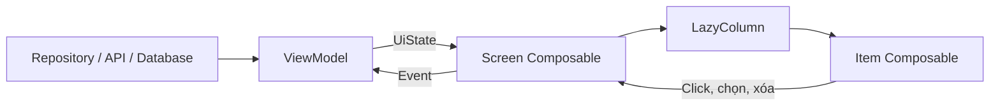
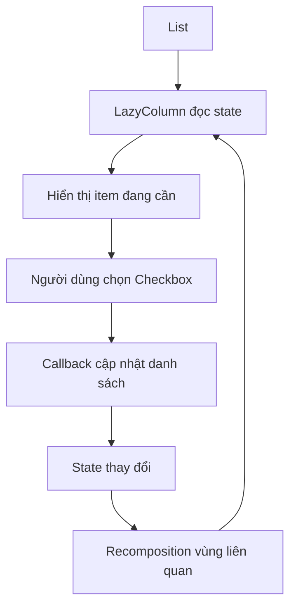
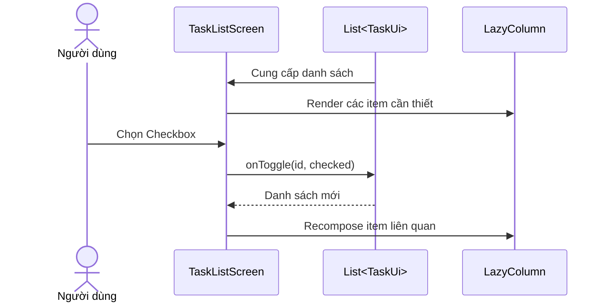
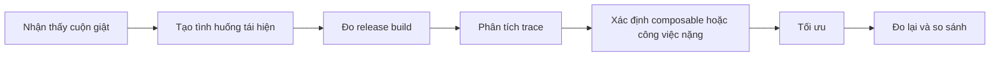

# 029 — LazyColumn trong Jetpack Compose


> **Học phần:** 02 — App Components and User Interface
> **Module:** Module 04 — Interface and Navigation
> **Nhóm nội dung:** Jetpack Compose
> **Nguồn roadmap:** Interface and Navigation / Jetpack Compose
> **Loại bài:** UI
> **Thứ tự trong module:** 029
> **Thời lượng gợi ý:** 30 phút

---

## 1. Tóm tắt


`LazyColumn` là composable dùng để hiển thị **danh sách cuộn theo chiều dọc** trong Jetpack Compose.

Khác với `Column`, vốn tạo và bố trí toàn bộ các phần tử con, `LazyColumn` chủ yếu compose và layout những item cần thiết cho vùng nội dung đang hiển thị. Vì vậy, nó phù hợp với danh sách dài, danh sách có độ dài chưa biết trước hoặc dữ liệu được tải dần. ([Android Developers][1])

Ví dụ sử dụng phổ biến:

* Danh sách bài viết.
* Danh sách sản phẩm.
* Tin nhắn trong ứng dụng chat.
* Danh sách công việc.
* Lịch sử giao dịch.
* Kết quả tìm kiếm.
* Feed mạng xã hội.
* Dữ liệu phân trang từ API hoặc cơ sở dữ liệu.

### Định nghĩa ngắn gọn

> **LazyColumn là container cuộn dọc chỉ tạo nội dung danh sách khi nội dung đó cần xuất hiện trên màn hình.**

### Vị trí của LazyColumn trong ứng dụng



`LazyColumn` nằm ở **UI layer**. Nó không nên tự gọi API, truy vấn database hoặc xử lý nghiệp vụ phức tạp. Screen nhận dữ liệu từ state holder, thường là `ViewModel`, rồi chuyển từng phần tử cho composable nhỏ hơn để hiển thị.

### Khi nào không cần LazyColumn?

Dùng `Column` khi:

* Chỉ có vài thành phần cố định.
* Nội dung không cần cuộn.
* Toàn bộ thành phần luôn phải xuất hiện cùng lúc.

Dùng `LazyColumn` khi:

* Danh sách dài hoặc thay đổi theo dữ liệu.
* Cần cuộn dọc.
* Cần theo dõi vị trí cuộn.
* Cần tải dữ liệu theo trang.
* Cần tối ưu việc compose các item.

---

## 2. Mục tiêu học tập


Sau bài học, anh có thể:

* Giải thích được mục đích của `LazyColumn`.
* Phân biệt `Column` và `LazyColumn`.
* Sử dụng được `item`, `items` và `itemsIndexed`.
* Cung cấp `key` ổn định cho từng item.
* Sử dụng `LazyListState` để đọc và điều khiển vị trí cuộn.
* Cập nhật danh sách bằng state để UI tự recomposition.
* Tách item thành composable nhỏ, dễ kiểm thử.
* Viết UI test cho thao tác cuộn và tương tác với item.
* Nhận biết các lỗi hiệu năng phổ biến.
* Tạo artifact nhỏ để đưa vào portfolio.

### Kế hoạch học trong 30 phút

| Thời gian | Nội dung                          |
| --------: | --------------------------------- |
|    5 phút | Hiểu `Column` và `LazyColumn`     |
|    5 phút | Học DSL: `item`, `items`, `key`   |
|   12 phút | Viết màn hình danh sách công việc |
|    5 phút | Kiểm thử state và cuộn            |
|    3 phút | Chụp ảnh, viết README portfolio   |

---

## 3. Khái niệm chính


### 3.1. Column và LazyColumn khác nhau như thế nào?

| Tiêu chí      | `Column`                | `LazyColumn`              |
| ------------- | ----------------------- | ------------------------- |
| Hướng bố trí  | Dọc                     | Dọc                       |
| Tự cuộn       | Không                   | Có                        |
| Cách tạo item | Tạo toàn bộ             | Tạo theo nhu cầu hiển thị |
| Danh sách dài | Không phù hợp           | Phù hợp                   |
| API nội dung  | Composable thông thường | `LazyListScope` DSL       |
| Theo dõi cuộn | `ScrollState`           | `LazyListState`           |
| Phân trang    | Tự triển khai           | Kết hợp tốt với Paging    |
| Item key      | Không có DSL riêng      | Hỗ trợ trực tiếp          |

Một `Column` có thể cuộn khi thêm `Modifier.verticalScroll()`, nhưng nó vẫn compose và layout toàn bộ nội dung. Với danh sách lớn, điều này có thể làm tăng thời gian khởi tạo và sử dụng nhiều tài nguyên hơn. `LazyColumn` được thiết kế cho trường hợp danh sách dài hoặc chưa biết trước số lượng item. ([Android Developers][1])

### 3.2. Cú pháp cơ bản

```kotlin
LazyColumn {
    item {
        Text("Tiêu đề")
    }

    items(5) { index ->
        Text("Phần tử $index")
    }

    item {
        Text("Cuối danh sách")
    }
}
```

`LazyColumn` sử dụng `LazyListScope` DSL thay vì nhận trực tiếp các composable con như `Column`. Trong DSL này:

* `item {}` thêm một item.
* `items(count) {}` thêm số lượng item xác định.
* `items(list) {}` hiển thị một collection.
* `itemsIndexed(list) { index, item -> }` cung cấp cả index và item. ([Android Developers][1])

### 3.3. Hiển thị một danh sách dữ liệu

```kotlin
data class UserUi(
    val id: Long,
    val name: String
)

@Composable
fun UserList(users: List<UserUi>) {
    LazyColumn {
        items(
            items = users,
            key = { user -> user.id }
        ) { user ->
            Text(
                text = user.name,
                modifier = Modifier.padding(16.dp)
            )
        }
    }
}
```

### 3.4. State thay đổi và recomposition

Compose theo dõi những composable đọc `State<T>`. Khi giá trị state thay đổi, Compose lên lịch recomposition cho những vùng UI có liên quan rồi cập nhật Composition. ([Android Developers][2])



Ví dụ cập nhật một item:

```kotlin
tasks = tasks.map { task ->
    if (task.id == selectedId) {
        task.copy(isCompleted = true)
    } else {
        task
    }
}
```

Không nên thay đổi trực tiếp một object mutable mà Compose không theo dõi:

```kotlin
// Không nên
task.isCompleted = true
```

Nên tạo state mới:

```kotlin
// Nên
tasks = tasks.map {
    if (it.id == task.id) {
        it.copy(isCompleted = true)
    } else {
        it
    }
}
```

### 3.5. Stable key

Theo mặc định, state của item có thể gắn với vị trí của item trong danh sách. Khi thêm, xóa hoặc sắp xếp lại dữ liệu, vị trí thay đổi có thể khiến state bên trong item bị gắn nhầm hoặc mất.

Hãy cung cấp một `key` ổn định và duy nhất:

```kotlin
LazyColumn {
    items(
        items = messages,
        key = { message -> message.id }
    ) { message ->
        MessageRow(message)
    }
}
```

Stable key giúp Compose nhận ra item nào chỉ thay đổi vị trí và mang state của item đi cùng khi danh sách được sắp xếp lại. Key dùng với state có thể khôi phục nên là kiểu được `Bundle` hỗ trợ, chẳng hạn `Int`, `Long`, `String`, enum hoặc `Parcelable`. ([Android Developers][1])

#### Không nên dùng index làm key khi danh sách có thể thay đổi thứ tự

```kotlin
// Không nên nếu danh sách có thể thêm, xóa hoặc sắp xếp
itemsIndexed(
    items = users,
    key = { index, _ -> index }
) { _, user ->
    UserRow(user)
}
```

```kotlin
// Nên
items(
    items = users,
    key = { user -> user.id }
) { user ->
    UserRow(user)
}
```

### 3.6. Content type

Với danh sách chứa nhiều kiểu item, có thể cung cấp `contentType`:

```kotlin
sealed interface FeedItem {
    val id: String

    data class Article(
        override val id: String,
        val title: String
    ) : FeedItem

    data class Advertisement(
        override val id: String,
        val imageUrl: String
    ) : FeedItem
}

LazyColumn {
    items(
        items = feedItems,
        key = { it.id },
        contentType = { item ->
            when (item) {
                is FeedItem.Article -> "article"
                is FeedItem.Advertisement -> "advertisement"
            }
        }
    ) { item ->
        when (item) {
            is FeedItem.Article -> ArticleRow(item)
            is FeedItem.Advertisement -> AdvertisementRow(item)
        }
    }
}
```

`contentType` giúp Compose chỉ tái sử dụng composition giữa những item có cấu trúc tương thích, đặc biệt hữu ích với danh sách hỗn hợp nhiều kiểu nội dung. ([Android Developers][1])

### 3.7. Padding và khoảng cách

```kotlin
LazyColumn(
    contentPadding = PaddingValues(
        horizontal = 16.dp,
        vertical = 12.dp
    ),
    verticalArrangement = Arrangement.spacedBy(8.dp)
) {
    items(tasks) { task ->
        TaskRow(task)
    }
}
```

`contentPadding` tạo khoảng cách cho nội dung bên trong danh sách. `Arrangement.spacedBy()` tạo khoảng cách giữa các item. Khi `LazyColumn` nằm trong `Scaffold`, có thể chuyển `PaddingValues` từ `Scaffold` vào danh sách để tránh nội dung bị che bởi app bar hoặc system bar. ([Android Developers][1])

### 3.8. LazyListState

`LazyListState` lưu và cung cấp thông tin về vị trí cuộn:

```kotlin
val listState = rememberLazyListState()

LazyColumn(
    state = listState
) {
    // Items
}
```

Một số giá trị quan trọng:

```kotlin
listState.firstVisibleItemIndex
listState.firstVisibleItemScrollOffset
listState.layoutInfo.visibleItemsInfo
```

Cuộn ngay đến item:

```kotlin
coroutineScope.launch {
    listState.scrollToItem(index = 20)
}
```

Cuộn có animation:

```kotlin
coroutineScope.launch {
    listState.animateScrollToItem(index = 0)
}
```

`scrollToItem()` và `animateScrollToItem()` là suspend function nên cần được gọi trong coroutine. ([Android Developers][3])

### 3.9. derivedStateOf với vị trí cuộn

Không nên khiến UI phản ứng với mọi pixel cuộn nếu chỉ cần biết người dùng đã rời item đầu tiên hay chưa.

```kotlin
val showScrollToTop by remember {
    derivedStateOf {
        listState.firstVisibleItemIndex > 0
    }
}
```

`derivedStateOf` giúp chỉ phát sinh recomposition khi kết quả điều kiện thực sự thay đổi, thay vì mỗi lần scroll offset thay đổi. ([Android Developers][4])

### 3.10. Paging

Với danh sách lớn hoặc gần như vô hạn, kết hợp `LazyColumn` với Paging:

```kotlin
val lazyPagingItems = pagerFlow.collectAsLazyPagingItems()

LazyColumn {
    items(
        count = lazyPagingItems.itemCount,
        key = lazyPagingItems.itemKey { item -> item.id }
    ) { index ->
        val item = lazyPagingItems[index]

        if (item != null) {
            ArticleRow(item)
        } else {
            ArticlePlaceholder()
        }
    }
}
```

Paging tải dữ liệu theo từng phần nhỏ thay vì tải toàn bộ ngay từ đầu, phù hợp với dữ liệu từ API hoặc database lớn. Android Developers khuyến nghị dùng Paging với lazy list cho danh sách vô hạn. ([Android Developers][5])

---

## 4. Thực hành: ứng dụng danh sách công việc


### 4.1. Yêu cầu màn hình

Xây dựng màn hình có:

* Danh sách 30 công việc.
* Checkbox đánh dấu hoàn thành.
* Nút thêm công việc mới.
* Stable key cho mỗi item.
* Nút cuộn về đầu khi người dùng đã cuộn xuống.
* Khoảng cách và padding hợp lý.
* Semantics phục vụ kiểm thử và accessibility.

### 4.2. Luồng hoạt động



### 4.3. Mã nguồn hoàn chỉnh

```kotlin
package com.example.lazycolumnlesson

import androidx.compose.foundation.layout.Arrangement
import androidx.compose.foundation.layout.Column
import androidx.compose.foundation.layout.PaddingValues
import androidx.compose.foundation.layout.Row
import androidx.compose.foundation.layout.Spacer
import androidx.compose.foundation.layout.fillMaxSize
import androidx.compose.foundation.layout.fillMaxWidth
import androidx.compose.foundation.layout.padding
import androidx.compose.foundation.layout.width
import androidx.compose.foundation.layout.weight
import androidx.compose.foundation.lazy.LazyColumn
import androidx.compose.foundation.lazy.items
import androidx.compose.foundation.lazy.rememberLazyListState
import androidx.compose.material.icons.Icons
import androidx.compose.material.icons.filled.Add
import androidx.compose.material.icons.filled.KeyboardArrowUp
import androidx.compose.material3.Card
import androidx.compose.material3.Checkbox
import androidx.compose.material3.ExperimentalMaterial3Api
import androidx.compose.material3.FloatingActionButton
import androidx.compose.material3.Icon
import androidx.compose.material3.IconButton
import androidx.compose.material3.MaterialTheme
import androidx.compose.material3.Scaffold
import androidx.compose.material3.Text
import androidx.compose.material3.TopAppBar
import androidx.compose.runtime.Composable
import androidx.compose.runtime.derivedStateOf
import androidx.compose.runtime.getValue
import androidx.compose.runtime.mutableStateOf
import androidx.compose.runtime.remember
import androidx.compose.runtime.rememberCoroutineScope
import androidx.compose.runtime.setValue
import androidx.compose.ui.Alignment
import androidx.compose.ui.Modifier
import androidx.compose.ui.platform.testTag
import androidx.compose.ui.semantics.contentDescription
import androidx.compose.ui.semantics.semantics
import androidx.compose.ui.semantics.stateDescription
import androidx.compose.ui.unit.dp
import kotlinx.coroutines.launch

data class TaskUi(
    val id: Long,
    val title: String,
    val isCompleted: Boolean
)

private fun createDemoTasks(): List<TaskUi> {
    return List(30) { index ->
        TaskUi(
            id = index.toLong() + 1L,
            title = "Công việc ${index + 1}",
            isCompleted = false
        )
    }
}

/**
 * Composable sở hữu state để phục vụ demo.
 *
 * Trong production, state danh sách thường được đưa lên ViewModel.
 */
@Composable
fun TaskListDemo() {
    var tasks by remember {
        mutableStateOf(createDemoTasks())
    }

    var nextId by remember {
        mutableStateOf(31L)
    }

    TaskListScreen(
        tasks = tasks,
        onAddTask = {
            val newTask = TaskUi(
                id = nextId,
                title = "Công việc $nextId",
                isCompleted = false
            )

            // Thêm vào đầu danh sách để kiểm tra stable key.
            tasks = listOf(newTask) + tasks
            nextId += 1L
        },
        onTaskCheckedChange = { taskId, checked ->
            tasks = tasks.map { task ->
                if (task.id == taskId) {
                    task.copy(isCompleted = checked)
                } else {
                    task
                }
            }
        }
    )
}

@OptIn(ExperimentalMaterial3Api::class)
@Composable
fun TaskListScreen(
    tasks: List<TaskUi>,
    onAddTask: () -> Unit,
    onTaskCheckedChange: (taskId: Long, checked: Boolean) -> Unit,
    modifier: Modifier = Modifier
) {
    val listState = rememberLazyListState()
    val coroutineScope = rememberCoroutineScope()

    val showScrollToTop by remember {
        derivedStateOf {
            listState.firstVisibleItemIndex > 0
        }
    }

    val completedCount = tasks.count { task ->
        task.isCompleted
    }

    Scaffold(
        modifier = modifier.fillMaxSize(),
        topBar = {
            TopAppBar(
                title = {
                    Text("Danh sách công việc")
                },
                actions = {
                    IconButton(
                        onClick = onAddTask
                    ) {
                        Icon(
                            imageVector = Icons.Default.Add,
                            contentDescription = "Thêm công việc"
                        )
                    }
                }
            )
        },
        floatingActionButton = {
            if (showScrollToTop) {
                FloatingActionButton(
                    onClick = {
                        coroutineScope.launch {
                            listState.animateScrollToItem(index = 0)
                        }
                    }
                ) {
                    Icon(
                        imageVector = Icons.Default.KeyboardArrowUp,
                        contentDescription = "Cuộn lên đầu danh sách"
                    )
                }
            }
        }
    ) { innerPadding ->
        LazyColumn(
            modifier = Modifier
                .fillMaxSize()
                .padding(innerPadding)
                .testTag("task_list"),
            state = listState,
            contentPadding = PaddingValues(
                horizontal = 16.dp,
                vertical = 12.dp
            ),
            verticalArrangement = Arrangement.spacedBy(8.dp)
        ) {
            item(
                key = "summary",
                contentType = "header"
            ) {
                Card(
                    modifier = Modifier.fillMaxWidth()
                ) {
                    Column(
                        modifier = Modifier.padding(16.dp)
                    ) {
                        Text(
                            text = "Tiến độ",
                            style = MaterialTheme.typography.titleMedium
                        )

                        Text(
                            text = "$completedCount/${tasks.size} công việc đã hoàn thành",
                            style = MaterialTheme.typography.bodyMedium
                        )
                    }
                }
            }

            items(
                items = tasks,
                key = { task -> task.id },
                contentType = { "task" }
            ) { task ->
                TaskRow(
                    task = task,
                    onCheckedChange = { checked ->
                        onTaskCheckedChange(task.id, checked)
                    }
                )
            }

            item(
                key = "footer",
                contentType = "footer"
            ) {
                Text(
                    text = "Đã hiển thị ${tasks.size} công việc",
                    modifier = Modifier
                        .fillMaxWidth()
                        .padding(vertical = 16.dp),
                    style = MaterialTheme.typography.bodySmall
                )
            }
        }
    }
}

@Composable
private fun TaskRow(
    task: TaskUi,
    onCheckedChange: (Boolean) -> Unit,
    modifier: Modifier = Modifier
) {
    Card(
        modifier = modifier.fillMaxWidth()
    ) {
        Row(
            modifier = Modifier
                .fillMaxWidth()
                .padding(16.dp),
            verticalAlignment = Alignment.CenterVertically
        ) {
            Checkbox(
                checked = task.isCompleted,
                onCheckedChange = onCheckedChange,
                modifier = Modifier.semantics {
                    contentDescription = "Hoàn thành ${task.title}"
                    stateDescription = if (task.isCompleted) {
                        "Đã hoàn thành"
                    } else {
                        "Chưa hoàn thành"
                    }
                }
            )

            Spacer(
                modifier = Modifier.width(12.dp)
            )

            Column(
                modifier = Modifier.weight(1f)
            ) {
                Text(
                    text = task.title,
                    style = MaterialTheme.typography.titleMedium
                )

                Text(
                    text = if (task.isCompleted) {
                        "Đã hoàn thành"
                    } else {
                        "Chưa hoàn thành"
                    },
                    style = MaterialTheme.typography.bodyMedium
                )
            }
        }
    }
}
```

### 4.4. Gắn vào Activity

```kotlin
class MainActivity : ComponentActivity() {

    override fun onCreate(savedInstanceState: Bundle?) {
        super.onCreate(savedInstanceState)

        setContent {
            MaterialTheme {
                TaskListDemo()
            }
        }
    }
}
```

### 4.5. Những điểm cần quan sát

1. Ban đầu chỉ một phần danh sách xuất hiện trên màn hình.
2. Có thể cuộn đến các công việc phía dưới.
3. Khi chọn checkbox, trạng thái và số lượng hoàn thành thay đổi.
4. Khi cuộn xuống, nút cuộn lên đầu xuất hiện.
5. Nhấn nút thêm sẽ chèn item mới vào đầu danh sách.
6. Các item cũ vẫn được nhận dạng bằng `task.id`.
7. Không cần gọi hàm cập nhật giao diện thủ công.

### 4.6. Tại sao tách TaskListScreen khỏi TaskListDemo?

`TaskListScreen` là composable gần như stateless:

```kotlin
fun TaskListScreen(
    tasks: List<TaskUi>,
    onAddTask: () -> Unit,
    onTaskCheckedChange: (Long, Boolean) -> Unit
)
```

Nó chỉ:

* Nhận state.
* Hiển thị state.
* Gửi event ra ngoài.

Đây là dạng API dễ:

* Preview.
* UI test.
* Tái sử dụng.
* Kết nối với ViewModel.
* Thay fake data trong test.

State nên được hoist đến ancestor chung thấp nhất của những composable cần đọc hoặc ghi state. Với state màn hình liên quan đến nghiệp vụ, `ViewModel` thường là state holder phù hợp. ([Android Developers][6])

### 4.7. Phiên bản ViewModel cho production

```kotlin
data class TaskListUiState(
    val tasks: List<TaskUi> = emptyList(),
    val isLoading: Boolean = false,
    val errorMessage: String? = null
)

class TaskListViewModel : ViewModel() {

    private val _uiState = MutableStateFlow(
        TaskListUiState(
            tasks = createDemoTasks()
        )
    )

    val uiState: StateFlow<TaskListUiState> =
        _uiState.asStateFlow()

    fun toggleTask(
        taskId: Long,
        checked: Boolean
    ) {
        _uiState.update { currentState ->
            currentState.copy(
                tasks = currentState.tasks.map { task ->
                    if (task.id == taskId) {
                        task.copy(isCompleted = checked)
                    } else {
                        task
                    }
                }
            )
        }
    }
}
```

```kotlin
@Composable
fun TaskListRoute(
    viewModel: TaskListViewModel = viewModel()
) {
    val uiState by viewModel.uiState.collectAsStateWithLifecycle()

    TaskListScreen(
        tasks = uiState.tasks,
        onAddTask = {
            // viewModel.addTask()
        },
        onTaskCheckedChange = viewModel::toggleTask
    )
}
```

> `ViewModel` giữ state qua configuration change như xoay màn hình. Với process death, chỉ nên đưa lượng state UI tối thiểu vào `SavedStateHandle`; dữ liệu lớn nên được dựng lại từ repository hoặc local storage. ([Android Developers][7])

### 4.8. Artifact cho portfolio

Thư mục đề xuất:

```text
lazycolumn-task-demo/
├── app/
├── screenshots/
│   ├── task-list-top.png
│   ├── task-list-scrolled.png
│   └── task-completed.png
├── README.md
└── docs/
    └── architecture.md
```

README có thể gồm:

```markdown
# LazyColumn Task Demo

Ứng dụng Android nhỏ minh họa:

- LazyColumn
- Stable item keys
- State hoisting
- LazyListState
- derivedStateOf
- Compose UI testing
- Accessibility semantics

## Kiểm thử

- Thêm item mới.
- Chọn và bỏ chọn checkbox.
- Cuộn đến item ngoài viewport.
- Cuộn về đầu danh sách.
- Xoay màn hình và kiểm tra state.
```

---

## 5. Bài tập


### Bài tập 1 — Cơ bản

Tạo danh sách 100 số:

```kotlin
LazyColumn {
    items(100) { index ->
        Text(
            text = "Item ${index + 1}",
            modifier = Modifier.padding(16.dp)
        )
    }
}
```

Yêu cầu:

* Cuộn được từ item 1 đến item 100.
* Mỗi item có padding.
* Các item cách nhau `8.dp`.

### Bài tập 2 — Danh sách có state

Tạo danh sách từ vựng:

```kotlin
data class VocabularyUi(
    val id: Long,
    val english: String,
    val vietnamese: String,
    val isLearned: Boolean
)
```

Mỗi item có:

* Từ tiếng Anh.
* Nghĩa tiếng Việt.
* Checkbox “Đã học”.
* Stable key là `id`.

Khi chọn checkbox:

* Cập nhật `isLearned`.
* Đổi nội dung trạng thái.
* Cập nhật tổng số từ đã học.

### Bài tập 3 — Sắp xếp danh sách

Thêm ba nút:

* Mặc định.
* A–Z.
* Chưa hoàn thành trước.

Không được sort trực tiếp bên trong `items()`:

```kotlin
// Không nên
LazyColumn {
    items(tasks.sortedBy { it.title }) {
        // ...
    }
}
```

Nên tính danh sách trước:

```kotlin
val displayedTasks = remember(tasks, sortType) {
    when (sortType) {
        SortType.Default -> tasks
        SortType.Alphabetical -> tasks.sortedBy { it.title }
        SortType.IncompleteFirst ->
            tasks.sortedBy { it.isCompleted }
    }
}

LazyColumn {
    items(
        items = displayedTasks,
        key = { it.id }
    ) { task ->
        TaskRow(task)
    }
}
```

Các phép tính tốn kém không nên chạy lại trực tiếp trong thân composable mỗi lần recomposition. Có thể cache bằng `remember` hoặc tốt hơn là xử lý trong `ViewModel`. ([Android Developers][4])

### Bài tập 4 — Nhiều kiểu item

Tạo một danh sách gồm:

* Header.
* Danh mục.
* Sản phẩm.
* Banner quảng cáo.
* Footer.

Yêu cầu:

* Dùng một `LazyColumn`.
* Dùng `item` cho header và footer.
* Dùng `items` cho sản phẩm.
* Khai báo `contentType`.
* Không bọc `LazyColumn` trong `Column.verticalScroll()`.

### Bài tập 5 — Paging

Xây dựng danh sách bài viết:

```text
API
 ↓
PagingSource
 ↓
Pager
 ↓
Flow<PagingData<Article>>
 ↓
collectAsLazyPagingItems()
 ↓
LazyColumn
```

Xử lý đủ các trạng thái:

* Initial loading.
* Append loading.
* Empty state.
* Initial error.
* Append error.
* Retry.

### Checklist kiểm thử thủ công

* [ ] Danh sách cuộn mượt.
* [ ] Item đầu và cuối không bị app bar che.
* [ ] Thêm item không làm gắn nhầm state.
* [ ] Xóa item không làm checkbox của item khác bị thay đổi.
* [ ] Sắp xếp danh sách vẫn giữ đúng state từng item.
* [ ] Nút cuộn lên đầu chỉ xuất hiện khi cần.
* [ ] Empty state được hiển thị khi danh sách rỗng.
* [ ] Loading và error state rõ ràng.
* [ ] Nội dung dài không tràn màn hình.
* [ ] Font scale lớn vẫn đọc được.
* [ ] TalkBack đọc đúng tên và trạng thái checkbox.
* [ ] Dark mode không làm mất độ tương phản.

---

## 6. Checklist hoàn thành và kiểm thử tự động


Compose UI test tương tác với **semantics tree**. Test thường gồm ba nhóm API:

1. Finder để tìm node.
2. Assertion để xác minh trạng thái.
3. Action để mô phỏng thao tác người dùng. ([Android Developers][8])

### 6.1. Dependency kiểm thử

Khi sử dụng Compose BOM, không cần ghi version riêng cho từng dependency:

```kotlin
dependencies {
    androidTestImplementation(
        "androidx.compose.ui:ui-test-junit4"
    )

    debugImplementation(
        "androidx.compose.ui:ui-test-manifest"
    )
}
```

### 6.2. Test checkbox cập nhật state

```kotlin
import androidx.compose.material3.MaterialTheme
import androidx.compose.ui.test.assertIsOff
import androidx.compose.ui.test.assertIsOn
import androidx.compose.ui.test.onNodeWithContentDescription
import androidx.compose.ui.test.performClick
import androidx.compose.ui.test.junit4.createComposeRule
import org.junit.Rule
import org.junit.Test

class TaskListScreenTest {

    @get:Rule
    val composeTestRule = createComposeRule()

    @Test
    fun clickingCheckbox_updatesTaskState() {
        composeTestRule.setContent {
            MaterialTheme {
                TaskListDemo()
            }
        }

        val checkbox = composeTestRule
            .onNodeWithContentDescription(
                "Hoàn thành Công việc 1"
            )

        checkbox.assertIsOff()
        checkbox.performClick()
        checkbox.assertIsOn()
    }
}
```

### 6.3. Test cuộn đến item ngoài viewport

```kotlin
import androidx.compose.material3.MaterialTheme
import androidx.compose.ui.test.assertIsDisplayed
import androidx.compose.ui.test.onNodeWithTag
import androidx.compose.ui.test.onNodeWithText
import androidx.compose.ui.test.performScrollToIndex
import androidx.compose.ui.test.junit4.createComposeRule
import org.junit.Rule
import org.junit.Test

class TaskListScrollTest {

    @get:Rule
    val composeTestRule = createComposeRule()

    @Test
    fun scrollToIndex_displaysRequestedItem() {
        val tasks = List(100) { index ->
            TaskUi(
                id = index.toLong() + 1L,
                title = "Công việc ${index + 1}",
                isCompleted = false
            )
        }

        composeTestRule.setContent {
            MaterialTheme {
                TaskListScreen(
                    tasks = tasks,
                    onAddTask = {},
                    onTaskCheckedChange = { _, _ -> }
                )
            }
        }

        composeTestRule
            .onNodeWithTag("task_list")
            .performScrollToIndex(80)

        composeTestRule
            .onNodeWithText("Công việc 81")
            .assertIsDisplayed()
    }
}
```

Lazy containers hỗ trợ semantics action để test có thể cuộn đến index hoặc key mà không cần mô phỏng nhiều thao tác vuốt thủ công. ([Android Developers][9])

### 6.4. Debug khi test không tìm thấy node

In semantics tree:

```kotlin
composeTestRule
    .onRoot()
    .printToLog("TASK_LIST_TEST")
```

Nếu node bị merge:

```kotlin
composeTestRule
    .onRoot(useUnmergedTree = true)
    .printToLog("TASK_LIST_TEST")
```

`printToLog()` giúp kiểm tra tên, text, role, click action và các thuộc tính semantics đang thực sự được expose. ([Android Developers][10])

### 6.5. Checklist hoàn thành bài

#### Kiến thức

* [ ] Giải thích được `LazyColumn` bằng ngôn ngữ của mình.
* [ ] Phân biệt được `Column` và `LazyColumn`.
* [ ] Biết khi nào nên sử dụng lazy list.
* [ ] Biết `item`, `items` và `itemsIndexed`.
* [ ] Hiểu mục đích của `key`.
* [ ] Biết sử dụng `LazyListState`.
* [ ] Biết khi nào dùng `derivedStateOf`.
* [ ] Biết vai trò của Paging.

#### Code

* [ ] Có ít nhất một `LazyColumn`.
* [ ] Item được tách thành composable riêng.
* [ ] Dữ liệu dùng immutable model.
* [ ] Có stable key.
* [ ] Có callback xử lý event.
* [ ] Không gọi API trực tiếp trong item composable.
* [ ] Có loading, empty hoặc error state nếu phù hợp.
* [ ] Có content description cho icon tương tác.

#### Kiểm thử

* [ ] Kiểm tra item đầu tiên.
* [ ] Kiểm tra item ngoài viewport.
* [ ] Kiểm tra thay đổi checkbox.
* [ ] Kiểm tra thêm hoặc xóa item.
* [ ] Kiểm tra sắp xếp danh sách.
* [ ] Kiểm tra rotate.
* [ ] Kiểm tra font scale.
* [ ] Kiểm tra TalkBack.
* [ ] Kiểm tra dark mode.

#### Portfolio

* [ ] Có ảnh màn hình.
* [ ] Có README.
* [ ] Có sơ đồ state flow.
* [ ] Có ít nhất một UI test.
* [ ] Có mô tả vấn đề và cách giải quyết.
* [ ] Có ghi chú về hiệu năng.

---

## 7. Ghi chú production


### 7.1. Các rủi ro thường gặp

| Rủi ro                               | Biểu hiện                                 | Cách xử lý                             |
| ------------------------------------ | ----------------------------------------- | -------------------------------------- |
| Không có stable key                  | Checkbox hoặc state chuyển sang item khác | Dùng `key = { it.id }`                 |
| Dùng index làm key                   | Sai state sau khi thêm, xóa, reorder      | Dùng ID nghiệp vụ                      |
| Sort trong `items()`                 | Tốn CPU khi recomposition                 | Sort trong ViewModel hoặc `remember`   |
| Item chứa logic nặng                 | Cuộn giật, drop frame                     | Tách xử lý khỏi main thread            |
| Item có chiều cao ban đầu bằng 0     | Compose quá nhiều item                    | Dùng placeholder có kích thước thực tế |
| Nested scroll cùng chiều             | Crash hoặc layout vô hạn                  | Dùng một `LazyColumn`                  |
| Một `item {}` chứa quá nhiều phần tử | Mất lợi ích lazy loading                  | Tách thành nhiều item                  |
| Đọc scroll offset trực tiếp          | Recompose quá thường xuyên                | Dùng `derivedStateOf`                  |
| Tải toàn bộ dữ liệu                  | Tốn RAM và thời gian chờ                  | Dùng Paging                            |
| Không xử lý insets                   | Item bị app bar hoặc system bar che       | Dùng padding từ `Scaffold`             |
| Ảnh lớn trong item                   | Main thread bị block                      | Resize, vector hoặc tải async          |
| Chỉ đo trên debug build              | Kết luận sai về hiệu năng                 | Benchmark release build                |

### 7.2. Tránh item có kích thước 0 pixel

Khi nội dung như ảnh chưa tải xong và item có chiều cao bằng 0, lazy layout có thể cho rằng rất nhiều item cùng vừa viewport rồi compose chúng trong lần đo đầu tiên.

Nên dùng placeholder có kích thước gần với nội dung thật:

```kotlin
AsyncImage(
    model = imageUrl,
    contentDescription = null,
    modifier = Modifier
        .fillMaxWidth()
        .height(180.dp)
)
```

Giữ kích thước trước và sau khi tải tương đối ổn định cũng giúp hạn chế thay đổi vị trí cuộn. ([Android Developers][3])

### 7.3. Không lồng scroll cùng chiều không giới hạn

Không nên:

```kotlin
Column(
    modifier = Modifier.verticalScroll(
        rememberScrollState()
    )
) {
    Header()

    LazyColumn {
        items(products) {
            ProductRow(it)
        }
    }
}
```

Nên:

```kotlin
LazyColumn {
    item {
        Header()
    }

    items(
        items = products,
        key = { it.id }
    ) {
        ProductRow(it)
    }

    item {
        Footer()
    }
}
```

Một `LazyColumn` có thể chứa nhiều loại nội dung thông qua DSL. Việc lồng một danh sách cuộn dọc không giới hạn bên trong container cuộn dọc khác có thể dẫn đến `IllegalStateException`. ([Android Developers][1])

### 7.4. Không gom toàn bộ danh sách vào một item

Không nên:

```kotlin
LazyColumn {
    item {
        tasks.forEach { task ->
            TaskRow(task)
        }
    }
}
```

Trong trường hợp này, toàn bộ `TaskRow` thuộc cùng một lazy item. Khi item đó xuất hiện, tất cả hàng phải được compose và đo, làm mất lợi ích của lazy layout.

Nên:

```kotlin
LazyColumn {
    items(
        items = tasks,
        key = { it.id }
    ) { task ->
        TaskRow(task)
    }
}
```

Việc đưa quá nhiều phần tử vào một item cũng khiến index của `scrollToItem()` không còn tương ứng với từng phần tử trực quan. ([Android Developers][1])

### 7.5. Không thực hiện tính toán nặng trong composable

Không nên:

```kotlin
LazyColumn {
    items(
        tasks
            .filter { it.title.contains(searchQuery) }
            .sortedBy { it.title }
    ) {
        TaskRow(it)
    }
}
```

Tạm chấp nhận với dữ liệu nhỏ:

```kotlin
val displayedTasks = remember(
    tasks,
    searchQuery
) {
    tasks
        .filter {
            it.title.contains(
                searchQuery,
                ignoreCase = true
            )
        }
        .sortedBy { it.title }
}
```

Tốt hơn trong production:

```text
Repository
   ↓
ViewModel xử lý filter/sort
   ↓
StateFlow<UiState>
   ↓
Composable chỉ render
```

### 7.6. Xử lý network state

Không chỉ truyền `List<T>` nếu màn hình có dữ liệu mạng. Nên dùng UI state rõ ràng:

```kotlin
sealed interface ProductListUiState {

    data object Loading : ProductListUiState

    data object Empty : ProductListUiState

    data class Success(
        val products: List<ProductUi>
    ) : ProductListUiState

    data class Error(
        val message: String
    ) : ProductListUiState
}
```

```kotlin
when (val state = uiState) {
    ProductListUiState.Loading -> LoadingContent()
    ProductListUiState.Empty -> EmptyContent()
    is ProductListUiState.Success -> ProductLazyColumn(
        products = state.products
    )
    is ProductListUiState.Error -> ErrorContent(
        message = state.message,
        onRetry = onRetry
    )
}
```

### 7.7. Lifecycle và state restoration

Cần phân biệt:

| State                         | Ví dụ                              | Nơi lưu phù hợp                      |
| ----------------------------- | ---------------------------------- | ------------------------------------ |
| UI element state              | Tab đang chọn, query, item đang mở | `rememberSaveable` hoặc state holder |
| Scroll state                  | Vị trí `LazyColumn`                | `rememberLazyListState()`            |
| Screen state                  | Danh sách sản phẩm, loading, error | `ViewModel`                          |
| Persistent data               | Task, bookmark, giỏ hàng           | Room, DataStore, repository          |
| Dữ liệu lớn sau process death | Danh sách từ API                   | Tải lại từ data layer                |
| ID nhỏ cần khôi phục          | `selectedProductId`                | `SavedStateHandle`                   |

Không nên lưu toàn bộ danh sách lớn hoặc object phức tạp vào `Bundle`. Bundle API phù hợp với lượng state nhỏ, đủ để tái tạo lại màn hình cùng với data layer. ([Android Developers][7])

### 7.8. Accessibility

Mỗi item cần xem xét:

* Icon có `contentDescription`.
* Checkbox hoặc switch có state description rõ ràng.
* Vùng chạm đủ lớn.
* Text không phụ thuộc hoàn toàn vào màu sắc.
* Thứ tự đọc hợp lý.
* Không có nhiều nút cùng tên nhưng không có ngữ cảnh.
* Trạng thái hoàn thành được đọc bằng TalkBack.

Compose UI test và accessibility đều dựa nhiều vào semantics tree. Kiểm thử thủ công với TalkBack nên được kết hợp với automated accessibility checks để phát hiện sớm lỗi về label, độ tương phản, kích thước vùng chạm và traversal order. ([Android Developers][11])

### 7.9. Đo hiệu năng đúng cách

Không nên kết luận danh sách chậm chỉ dựa trên debug build. Android Developers lưu ý rằng hiệu năng lazy layout nên được đo trên release build có tối ưu R8; debug build có thể cuộn chậm hơn đáng kể. ([Android Developers][1])

Công cụ nên sử dụng:

* Layout Inspector.
* Recomposition counts.
* System Trace.
* Perfetto.
* Macrobenchmark.
* Baseline Profiles.
* JankStats.
* Android Studio Profiler.

Quy trình:



### 7.10. Release checklist

#### User flow

* [ ] Người dùng xem được item đầu tiên nhanh chóng.
* [ ] Có loading indicator khi cần.
* [ ] Có empty state.
* [ ] Có retry khi API lỗi.
* [ ] Không mất vị trí cuộn ngoài ý muốn.
* [ ] Không bị duplicate item khi load trang tiếp theo.

#### State

* [ ] Stable key không trùng.
* [ ] Không dùng index làm identity.
* [ ] State được hoist đúng tầng.
* [ ] Rotate không làm mất screen state quan trọng.
* [ ] Process recreation có chiến lược khôi phục.
* [ ] Offline state được xử lý.

#### Performance

* [ ] Không sort/filter nặng trong item.
* [ ] Không có item 0 pixel.
* [ ] Không nested scroll cùng chiều không giới hạn.
* [ ] Ảnh được resize hoặc tải async.
* [ ] Có placeholder kích thước hợp lý.
* [ ] Danh sách lớn sử dụng Paging.
* [ ] Đã đo trên release build.

#### Testing

* [ ] Test item trong viewport.
* [ ] Test item ngoài viewport.
* [ ] Test click item.
* [ ] Test add, remove và reorder.
* [ ] Test loading, empty và error.
* [ ] Test accessibility.
* [ ] Test font scale và nhiều kích thước màn hình.

---

## Tổng kết

`LazyColumn` không chỉ là phiên bản ngắn gọn của `RecyclerView`. Để sử dụng tốt trong ứng dụng thực tế, cần kết hợp:

```text
LazyColumn
+ immutable UI state
+ stable key
+ small item composables
+ state hoisting
+ LazyListState
+ derivedStateOf
+ Paging
+ semantics
+ UI testing
+ performance measurement
```

Kết quả tối thiểu của bài học nên là một màn hình danh sách có thể cuộn, cập nhật state, sử dụng stable key, có ít nhất một UI test và có ảnh chụp màn hình để đưa vào portfolio.

**Tài liệu chính:** hướng dẫn Lazy lists, state hoisting, lifecycle, performance và Compose testing của Android Developers. ([Android Developers][1])

[1]: https://developer.android.com/develop/ui/compose/lists "Lazy lists and lazy grids  |  Jetpack Compose  |  Android Developers"
[2]: https://developer.android.com/develop/ui/compose/lifecycle "Lifecycle of composables  |  Jetpack Compose  |  Android Developers"
[3]: https://developer.android.com/develop/ui/compose/lists?hl=en "Lazy lists and lazy grids  |  Jetpack Compose  |  Android Developers"
[4]: https://developer.android.com/develop/ui/compose/performance/bestpractices "Follow best practices  |  Jetpack Compose  |  Android Developers"
[5]: https://developer.android.com/develop/ui/compose/quick-guides/content/lazily-load-list "Lazily load data with lists and Paging  |  Jetpack Compose  |  Android Developers"
[6]: https://developer.android.com/develop/ui/compose/state-hoisting "Where to hoist state  |  Jetpack Compose  |  Android Developers"
[7]: https://developer.android.com/develop/ui/compose/state-saving?utm_source=chatgpt.com "Save UI state in Compose"
[8]: https://developer.android.com/develop/ui/compose/testing/semantics?hl=en "Semantics  |  Jetpack Compose  |  Android Developers"
[9]: https://developer.android.com/reference/kotlin/androidx/compose/ui/test/SemanticsNodeInteraction?utm_source=chatgpt.com "SemanticsNodeInteraction  |  API reference  |  Android Developers"
[10]: https://developer.android.com/develop/ui/compose/testing/apis "Testing APIs  |  Jetpack Compose  |  Android Developers"
[11]: https://developer.android.com/develop/ui/compose/accessibility/testing "Testing  |  Jetpack Compose  |  Android Developers"

---

# Bài luyện tập

## Mục tiêu


## Đề bài


## Yêu cầu hoàn thành

- [ ] 
- [ ] 
- [ ] 

## Kết quả / lời giải


## Ghi chú
