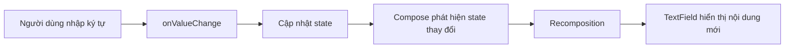
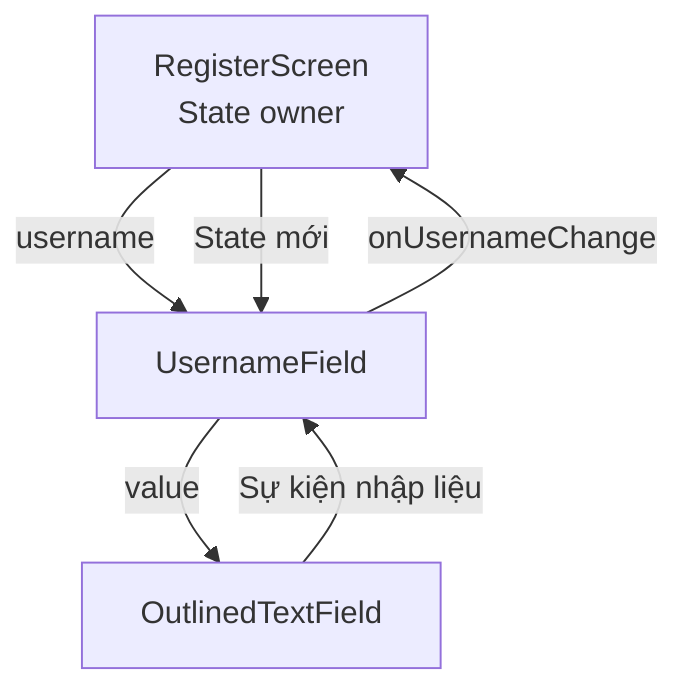
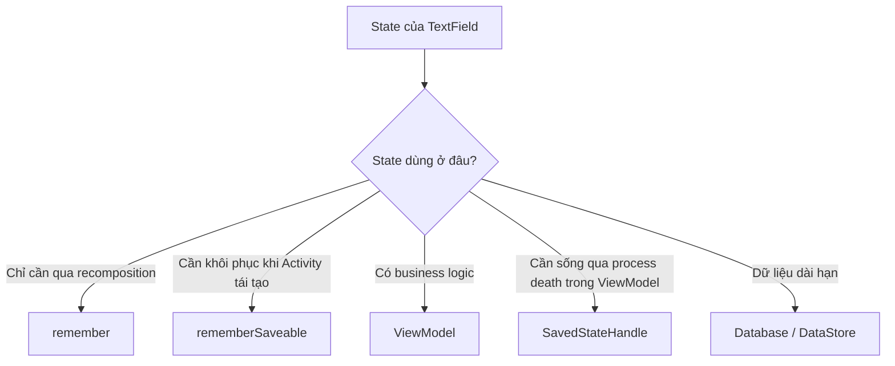
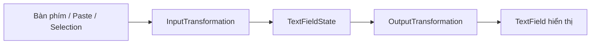
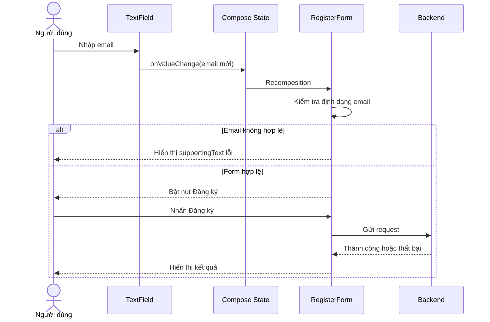
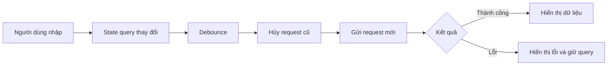

[](https://medium.com/%40ramadan123sayed/comprehensive-guide-to-textfields-in-jetpack-compose-f009c4868c54?utm_source=chatgpt.com)

# 030 — TextField trong Jetpack Compose

| Thuộc tính              | Nội dung                                   |
| ----------------------- | ------------------------------------------ |
| **Học phần**            | 02 — App Components and User Interface     |
| **Module**              | Module 04 — Interface and Navigation       |
| **Nhóm nội dung**       | Jetpack Compose                            |
| **Nguồn roadmap**       | Interface and Navigation / Jetpack Compose |
| **Loại bài**            | UI                                         |
| **Thứ tự trong module** | 030                                        |
| **Thời lượng gợi ý**    | 30 phút                                    |

---

## 1. Tóm tắt

`TextField` là thành phần giao diện cho phép người dùng nhập và chỉnh sửa văn bản trong ứng dụng Jetpack Compose. Nó thường xuất hiện trong:

* Màn hình đăng nhập, đăng ký.
* Thanh tìm kiếm.
* Biểu mẫu nhập thông tin.
* Ô nhập bình luận hoặc tin nhắn.
* Ô nhập email, số điện thoại và mật khẩu.

Jetpack Compose cung cấp ba mức triển khai chính:

| Thành phần          | Đặc điểm                              | Trường hợp sử dụng         |
| ------------------- | ------------------------------------- | -------------------------- |
| `TextField`         | Kiểu Material dạng filled             | Form thông thường          |
| `OutlinedTextField` | Có đường viền bao quanh               | Form cần ranh giới rõ ràng |
| `BasicTextField`    | Không có decoration Material mặc định | Thiết kế tùy biến cao      |

Tài liệu Android hiện khuyến nghị mô hình **state-based TextField** dùng `TextFieldState` vì quản lý cả nội dung, con trỏ, vùng chọn và composition. Tuy nhiên, tại thời điểm tài liệu được cập nhật tháng 8/2026, API Material 3 state-based vẫn phụ thuộc phiên bản alpha. Vì vậy, bài học này trình bày cả cách `value`–`onValueChange` phổ biến và hướng state-based mới. ([Android Developers][1])


> **Ý chính:** `TextField` không tự lưu dữ liệu nghiệp vụ của ứng dụng. Giao diện hiển thị giá trị từ state và phát sự kiện khi người dùng thay đổi nội dung.

---

## 2. Mục tiêu học tập

Sau bài học, anh có thể:

* Giải thích được vai trò của `TextField` trong Jetpack Compose.
* Phân biệt `TextField`, `OutlinedTextField` và `BasicTextField`.
* Quản lý nội dung bằng Compose state.
* Biết khi nào dùng `remember`, `rememberSaveable` hoặc `ViewModel`.
* Cấu hình bàn phím cho email, số điện thoại, mật khẩu và tìm kiếm.
* Hiển thị label, placeholder, icon và thông báo lỗi.
* Kiểm tra dữ liệu đầu vào mà không làm mất nội dung người dùng đã nhập.
* Viết Compose UI test cho một biểu mẫu nhỏ.
* Tạo một artifact có thể đưa vào portfolio.


---

## 3. Khái niệm chính

### 3.1. TextField là một composable có trạng thái

Ví dụ cơ bản theo API `value`–`onValueChange`:

```kotlin
@Composable
fun NameTextField() {
    var name by remember {
        mutableStateOf("")
    }

    OutlinedTextField(
        value = name,
        onValueChange = { newValue ->
            name = newValue
        },
        label = {
            Text("Họ và tên")
        }
    )
}
```

Luồng xử lý:

1. `name` chứa nội dung hiện tại.
2. `OutlinedTextField` đọc `name` thông qua tham số `value`.
3. Người dùng nhập ký tự.
4. `onValueChange` được gọi với nội dung mới.
5. State `name` thay đổi.
6. Compose recompose phần UI đang đọc state đó.



Compose khuyến khích lưu state gần nơi sử dụng nhất, nhưng state nên được đưa lên ancestor chung thấp nhất khi nhiều composable cùng đọc hoặc thay đổi nó. State owner nên truyền xuống state bất biến và callback sự kiện. ([Android Developers][2])

---

### 3.2. Cấu trúc của một TextField

Một `TextField` thường gồm các thành phần sau:

| Thành phần             | Chức năng                                    |
| ---------------------- | -------------------------------------------- |
| `value`                | Nội dung đang được hiển thị                  |
| `onValueChange`        | Callback khi nội dung thay đổi               |
| `label`                | Nhãn mô tả trường dữ liệu                    |
| `placeholder`          | Gợi ý khi trường đang trống                  |
| `leadingIcon`          | Icon ở đầu trường                            |
| `trailingIcon`         | Icon ở cuối trường                           |
| `supportingText`       | Hướng dẫn hoặc thông báo lỗi                 |
| `isError`              | Chuyển TextField sang trạng thái lỗi         |
| `enabled`              | Cho phép hoặc không cho phép nhập            |
| `readOnly`             | Chỉ đọc nhưng vẫn có thể focus/chọn nội dung |
| `singleLine`           | Giới hạn hiển thị trên một dòng              |
| `keyboardOptions`      | Cấu hình loại bàn phím và IME                |
| `keyboardActions`      | Xử lý hành động Next, Done, Search…          |
| `visualTransformation` | Biến đổi cách nội dung được hiển thị         |

Ví dụ đầy đủ hơn:

```kotlin
@Composable
fun EmailTextField(
    email: String,
    isError: Boolean,
    onEmailChange: (String) -> Unit
) {
    OutlinedTextField(
        value = email,
        onValueChange = onEmailChange,
        modifier = Modifier.fillMaxWidth(),
        label = {
            Text("Email")
        },
        placeholder = {
            Text("example@email.com")
        },
        leadingIcon = {
            Icon(
                imageVector = Icons.Default.Email,
                contentDescription = null
            )
        },
        supportingText = {
            if (isError) {
                Text("Email không đúng định dạng")
            } else {
                Text("Sử dụng email đang hoạt động")
            }
        },
        isError = isError,
        singleLine = true,
        keyboardOptions = KeyboardOptions(
            keyboardType = KeyboardType.Email,
            imeAction = ImeAction.Done
        )
    )
}
```


---

### 3.3. State hoisting

Một composable dễ tái sử dụng thường không tự sở hữu state nghiệp vụ. Nó nhận:

* Giá trị từ bên ngoài.
* Callback để báo rằng người dùng vừa tạo sự kiện.

```kotlin
@Composable
fun UsernameField(
    username: String,
    onUsernameChange: (String) -> Unit,
    modifier: Modifier = Modifier
) {
    OutlinedTextField(
        value = username,
        onValueChange = onUsernameChange,
        modifier = modifier,
        label = {
            Text("Tên người dùng")
        },
        singleLine = true
    )
}
```

Composable cha giữ state:

```kotlin
@Composable
fun RegisterScreen() {
    var username by rememberSaveable {
        mutableStateOf("")
    }

    UsernameField(
        username = username,
        onUsernameChange = { newUsername ->
            username = newUsername
        },
        modifier = Modifier.fillMaxWidth()
    )
}
```

Sơ đồ state hoisting:




State nên được đưa lên `ViewModel` khi nội dung của trường liên quan đến business logic, dữ liệu từ repository, xử lý gửi biểu mẫu hoặc cần được nhiều thành phần trong màn hình sử dụng. Không nên truyền trực tiếp `ViewModel` xuống các composable nhỏ; thay vào đó, truyền state và callback cần thiết. ([Android Developers][2])

---

### 3.4. `remember` và `rememberSaveable`

#### Dùng `remember`

```kotlin
var query by remember {
    mutableStateOf("")
}
```

`remember` duy trì giá trị qua các lần recomposition nhưng state có thể bị mất khi Activity được tạo lại, chẳng hạn khi thay đổi cấu hình.

#### Dùng `rememberSaveable`

```kotlin
var query by rememberSaveable {
    mutableStateOf("")
}
```

`rememberSaveable` phù hợp với dữ liệu UI tạm thời như:

* Nội dung người dùng đang nhập.
* ID mục đang chọn.
* Trạng thái mở hoặc đóng.
* Vị trí cuộn.
* Lựa chọn chưa gửi trong form.

Android khuyến nghị ít nhất nên bảo toàn dữ liệu nhập và state điều hướng quan trọng. `rememberSaveable` lưu state qua saved instance state, nhưng không nên dùng để chứa object lớn hoặc danh sách phức tạp vì kích thước `Bundle` bị giới hạn. ([Android Developers][3])



---

### 3.5. Kiểm tra dữ liệu đầu vào

Không nên chỉ kiểm tra khi người dùng nhấn nút gửi. Phản hồi sớm giúp người dùng phát hiện và sửa lỗi nhanh hơn. Tài liệu Android minh họa kiểm tra email trong lúc người dùng nhập để giảm lỗi và tiết kiệm thời gian. ([Android Developers][4])

Ví dụ hàm kiểm tra:

```kotlin
private fun isValidEmail(email: String): Boolean {
    return email.isBlank() ||
        android.util.Patterns.EMAIL_ADDRESS
            .matcher(email)
            .matches()
}
```

Trong composable:

```kotlin
@Composable
fun ValidatingEmailField() {
    var email by rememberSaveable {
        mutableStateOf("")
    }

    val hasError = email.isNotBlank() &&
        !android.util.Patterns.EMAIL_ADDRESS
            .matcher(email)
            .matches()

    OutlinedTextField(
        value = email,
        onValueChange = {
            email = it
        },
        modifier = Modifier.fillMaxWidth(),
        label = {
            Text("Email")
        },
        isError = hasError,
        supportingText = {
            if (hasError) {
                Text("Email không đúng định dạng")
            }
        },
        keyboardOptions = KeyboardOptions(
            keyboardType = KeyboardType.Email,
            imeAction = ImeAction.Done
        ),
        singleLine = true
    )
}
```

| Trạng thái hợp lệ                                                                                                  | Trạng thái không hợp lệ                                                                                                              |
| ------------------------------------------------------------------------------------------------------------------ | ------------------------------------------------------------------------------------------------------------------------------------ |
|  |  |

#### Lưu ý UX khi validation

Không nên:

* Hiển thị lỗi ngay khi người dùng chưa nhập gì.
* Xóa toàn bộ nội dung khi chỉ có một ký tự sai.
* Chỉ dùng màu đỏ mà không có thông báo bằng chữ.
* Chặn mọi phím bấm khiến người dùng không hiểu lý do.
* Gửi request mạng sau mỗi ký tự mà không debounce.

Nên:

* Hiển thị lỗi gần trường dữ liệu.
* Giữ lại nội dung người dùng đã nhập.
* Nêu rõ cách sửa lỗi.
* Chỉ bật nút gửi khi dữ liệu tối thiểu đã hợp lệ.
* Kiểm tra lại ở backend vì validation phía client không phải cơ chế bảo mật.

---

### 3.6. Cấu hình bàn phím và IME action

`keyboardOptions` giúp thông báo cho bàn phím loại dữ liệu đang được nhập.

```kotlin
keyboardOptions = KeyboardOptions(
    keyboardType = KeyboardType.Email,
    imeAction = ImeAction.Next
)
```

Một số giá trị phổ biến:

| Dữ liệu       | `keyboardType`          | `imeAction` gợi ý |
| ------------- | ----------------------- | ----------------- |
| Họ tên        | `KeyboardType.Text`     | `Next`            |
| Email         | `KeyboardType.Email`    | `Next`            |
| Số điện thoại | `KeyboardType.Phone`    | `Next`            |
| Mật khẩu      | `KeyboardType.Password` | `Done`            |
| Tìm kiếm      | `KeyboardType.Text`     | `Search`          |
| Số lượng      | `KeyboardType.Number`   | `Done`            |
| URL           | `KeyboardType.Uri`      | `Go`              |

Ví dụ xử lý phím Search:

```kotlin
@Composable
fun SearchField(
    query: String,
    onQueryChange: (String) -> Unit,
    onSearch: () -> Unit
) {
    val keyboardController =
        LocalSoftwareKeyboardController.current

    OutlinedTextField(
        value = query,
        onValueChange = onQueryChange,
        modifier = Modifier.fillMaxWidth(),
        label = {
            Text("Tìm kiếm")
        },
        leadingIcon = {
            Icon(
                imageVector = Icons.Default.Search,
                contentDescription = null
            )
        },
        singleLine = true,
        keyboardOptions = KeyboardOptions(
            keyboardType = KeyboardType.Text,
            imeAction = ImeAction.Search
        ),
        keyboardActions = KeyboardActions(
            onSearch = {
                keyboardController?.hide()
                onSearch()
            }
        )
    )
}
```

Android có thể hiển thị bàn phím mềm khi một trường chỉnh sửa nhận focus. Ứng dụng nên khai báo loại đầu vào và hành động IME phù hợp để tăng chất lượng trải nghiệm nhập liệu. ([Android Developers][5])


---

### 3.7. Mật khẩu

Với API value-based phổ biến, có thể dùng `PasswordVisualTransformation`:

```kotlin
@Composable
fun PasswordField(
    password: String,
    onPasswordChange: (String) -> Unit
) {
    var passwordVisible by rememberSaveable {
        mutableStateOf(false)
    }

    OutlinedTextField(
        value = password,
        onValueChange = onPasswordChange,
        modifier = Modifier.fillMaxWidth(),
        label = {
            Text("Mật khẩu")
        },
        singleLine = true,
        visualTransformation = if (passwordVisible) {
            VisualTransformation.None
        } else {
            PasswordVisualTransformation()
        },
        keyboardOptions = KeyboardOptions(
            keyboardType = KeyboardType.Password,
            imeAction = ImeAction.Done
        ),
        trailingIcon = {
            IconButton(
                onClick = {
                    passwordVisible = !passwordVisible
                }
            ) {
                Icon(
                    imageVector = if (passwordVisible) {
                        Icons.Default.VisibilityOff
                    } else {
                        Icons.Default.Visibility
                    },
                    contentDescription = if (passwordVisible) {
                        "Ẩn mật khẩu"
                    } else {
                        "Hiện mật khẩu"
                    }
                )
            }
        }
    )
}
```

Các phiên bản state-based mới còn cung cấp `SecureTextField` và `OutlinedSecureTextField`, được thiết kế riêng cho dữ liệu mật khẩu và hỗ trợ chế độ che nội dung. ([Android Developers][1])

> Không ghi mật khẩu, token hay thông tin nhạy cảm vào log, analytics hoặc crash report.

---

### 3.8. Input transformation và output transformation

Có hai nhu cầu khác nhau:

* **Input transformation:** lọc hoặc giới hạn dữ liệu trước khi lưu vào state.
* **Output transformation:** chỉ thay đổi cách dữ liệu được hiển thị mà không thay đổi giá trị gốc.

Ví dụ số điện thoại:

```text
Giá trị gốc:  3219876543
Hiển thị:     (321)987-6543
```


Luồng xử lý state-based:



Theo mô hình state-based, `InputTransformation` thay đổi nội dung trước khi commit vào `TextFieldState`, còn `OutputTransformation` chỉ định dạng kết quả hiển thị. ([Android Developers][1])

Ví dụ định dạng số điện thoại trong tài liệu:


---

### 3.9. State-based TextField trong Compose 2026

API mới sử dụng `TextFieldState`:

```kotlin
@Composable
fun StateBasedUsernameField() {
    val usernameState = rememberTextFieldState()

    TextField(
        state = usernameState,
        label = {
            Text("Tên người dùng")
        },
        lineLimits = TextFieldLineLimits.SingleLine
    )
}
```

`TextFieldState` quản lý:

* Nội dung văn bản.
* Vị trí con trỏ.
* Vùng văn bản được chọn.
* Composition từ bàn phím.
* Các thay đổi đến từ gõ phím, paste hoặc thao tác selection.

Tài liệu Android cho biết `rememberTextFieldState()` có hỗ trợ lưu và khôi phục state tích hợp. `TextFieldState` không phụ thuộc UI Material nên cũng có thể được giữ trong `ViewModel` khi phù hợp với kiến trúc ứng dụng. ([Android Developers][1])

> **Lưu ý phiên bản:** kiểm tra Compose BOM và Material 3 của dự án trước khi dùng state-based overload. Với dự án chưa sử dụng phiên bản tương thích, dùng API `value`–`onValueChange` vẫn là lựa chọn dễ triển khai.

---

## 4. Thực hành: xây dựng màn hình đăng ký nhỏ

### 4.1. Yêu cầu

Tạo màn hình gồm:

* Họ và tên.
* Email.
* Mật khẩu.
* Nút đăng ký.
* Validation email.
* Nút hiện hoặc ẩn mật khẩu.
* Giữ nội dung khi xoay màn hình.
* Ẩn bàn phím sau khi gửi thành công.


---

### 4.2. Data class biểu diễn state

```kotlin
data class RegisterUiState(
    val fullName: String = "",
    val email: String = "",
    val password: String = "",
    val isSubmitting: Boolean = false,
    val submitMessage: String? = null
) {
    val isEmailValid: Boolean
        get() = email.isBlank() ||
            android.util.Patterns.EMAIL_ADDRESS
                .matcher(email)
                .matches()

    val canSubmit: Boolean
        get() = fullName.isNotBlank() &&
            email.isNotBlank() &&
            isEmailValid &&
            password.length >= 8 &&
            !isSubmitting
}
```

---

### 4.3. Composable hoàn chỉnh

```kotlin
@Composable
fun RegisterForm(
    modifier: Modifier = Modifier
) {
    var fullName by rememberSaveable {
        mutableStateOf("")
    }

    var email by rememberSaveable {
        mutableStateOf("")
    }

    var password by rememberSaveable {
        mutableStateOf("")
    }

    var passwordVisible by rememberSaveable {
        mutableStateOf(false)
    }

    var submitMessage by rememberSaveable {
        mutableStateOf<String?>(null)
    }

    val emailHasError = email.isNotBlank() &&
        !android.util.Patterns.EMAIL_ADDRESS
            .matcher(email)
            .matches()

    val canSubmit = fullName.isNotBlank() &&
        email.isNotBlank() &&
        !emailHasError &&
        password.length >= 8

    val keyboardController =
        LocalSoftwareKeyboardController.current

    Column(
        modifier = modifier
            .fillMaxSize()
            .verticalScroll(rememberScrollState())
            .imePadding()
            .padding(24.dp),
        verticalArrangement = Arrangement.spacedBy(16.dp)
    ) {
        Text(
            text = "Tạo tài khoản",
            style = MaterialTheme.typography.headlineMedium
        )

        OutlinedTextField(
            value = fullName,
            onValueChange = {
                fullName = it
                submitMessage = null
            },
            modifier = Modifier.fillMaxWidth(),
            label = {
                Text("Họ và tên")
            },
            leadingIcon = {
                Icon(
                    imageVector = Icons.Default.Person,
                    contentDescription = null
                )
            },
            singleLine = true,
            keyboardOptions = KeyboardOptions(
                capitalization = KeyboardCapitalization.Words,
                keyboardType = KeyboardType.Text,
                imeAction = ImeAction.Next
            )
        )

        OutlinedTextField(
            value = email,
            onValueChange = {
                email = it.trim()
                submitMessage = null
            },
            modifier = Modifier.fillMaxWidth(),
            label = {
                Text("Email")
            },
            placeholder = {
                Text("example@email.com")
            },
            leadingIcon = {
                Icon(
                    imageVector = Icons.Default.Email,
                    contentDescription = null
                )
            },
            isError = emailHasError,
            supportingText = {
                if (emailHasError) {
                    Text("Email không đúng định dạng")
                }
            },
            singleLine = true,
            keyboardOptions = KeyboardOptions(
                keyboardType = KeyboardType.Email,
                imeAction = ImeAction.Next
            )
        )

        OutlinedTextField(
            value = password,
            onValueChange = {
                password = it
                submitMessage = null
            },
            modifier = Modifier.fillMaxWidth(),
            label = {
                Text("Mật khẩu")
            },
            leadingIcon = {
                Icon(
                    imageVector = Icons.Default.Lock,
                    contentDescription = null
                )
            },
            trailingIcon = {
                IconButton(
                    onClick = {
                        passwordVisible = !passwordVisible
                    }
                ) {
                    Icon(
                        imageVector = if (passwordVisible) {
                            Icons.Default.VisibilityOff
                        } else {
                            Icons.Default.Visibility
                        },
                        contentDescription = if (passwordVisible) {
                            "Ẩn mật khẩu"
                        } else {
                            "Hiện mật khẩu"
                        }
                    )
                }
            },
            supportingText = {
                Text("Mật khẩu cần ít nhất 8 ký tự")
            },
            visualTransformation = if (passwordVisible) {
                VisualTransformation.None
            } else {
                PasswordVisualTransformation()
            },
            singleLine = true,
            keyboardOptions = KeyboardOptions(
                keyboardType = KeyboardType.Password,
                imeAction = ImeAction.Done
            ),
            keyboardActions = KeyboardActions(
                onDone = {
                    keyboardController?.hide()
                }
            )
        )

        Button(
            onClick = {
                keyboardController?.hide()
                submitMessage = "Thông tin hợp lệ"
            },
            modifier = Modifier.fillMaxWidth(),
            enabled = canSubmit
        ) {
            Text("Đăng ký")
        }

        submitMessage?.let { message ->
            Text(
                text = message,
                color = MaterialTheme.colorScheme.primary
            )
        }
    }
}
```

### 4.4. Vì sao dùng `imePadding()`?

Khi bàn phím xuất hiện, nó có thể che các trường ở cuối màn hình hoặc nút gửi. `imePadding()` bổ sung khoảng trống tương ứng với vùng bàn phím; kết hợp với `verticalScroll()` giúp người dùng cuộn đến trường đang nhập.

---

### 4.5. Preview

```kotlin
@Preview(
    showBackground = true,
    showSystemUi = true
)
@Composable
private fun RegisterFormPreview() {
    MaterialTheme {
        RegisterForm()
    }
}
```

---

### 4.6. Luồng hoạt động



---

## 5. Bài tập


### Bài 1 — Thanh tìm kiếm

Tạo một `OutlinedTextField` có:

* Icon tìm kiếm.
* Nút xóa nội dung.
* `ImeAction.Search`.
* Danh sách kết quả thay đổi theo từ khóa.

```kotlin
@Composable
fun ProductSearchField(
    query: String,
    onQueryChange: (String) -> Unit,
    onSearch: () -> Unit
) {
    OutlinedTextField(
        value = query,
        onValueChange = onQueryChange,
        modifier = Modifier.fillMaxWidth(),
        label = {
            Text("Tìm sản phẩm")
        },
        leadingIcon = {
            Icon(
                imageVector = Icons.Default.Search,
                contentDescription = null
            )
        },
        trailingIcon = {
            if (query.isNotEmpty()) {
                IconButton(
                    onClick = {
                        onQueryChange("")
                    }
                ) {
                    Icon(
                        imageVector = Icons.Default.Clear,
                        contentDescription = "Xóa từ khóa"
                    )
                }
            }
        },
        keyboardOptions = KeyboardOptions(
            imeAction = ImeAction.Search
        ),
        keyboardActions = KeyboardActions(
            onSearch = {
                onSearch()
            }
        ),
        singleLine = true
    )
}
```

### Bài 2 — Ô nhập số điện thoại

Yêu cầu:

* Chỉ chấp nhận chữ số.
* Giới hạn độ dài phù hợp.
* Dùng `KeyboardType.Phone`.
* Hiển thị lỗi khi thiếu số.
* Không ghi đè state khi có lỗi.

Ví dụ lọc đầu vào theo API value-based:

```kotlin
onValueChange = { input ->
    val digits = input.filter(Char::isDigit)

    if (digits.length <= 10) {
        phoneNumber = digits
    }
}
```

### Bài 3 — Form phản hồi

Tạo form gồm:

* Tiêu đề.
* Nội dung nhiều dòng.
* Bộ đếm ký tự, ví dụ `120/500`.
* Nút gửi.
* Thông báo khi nội dung quá ngắn.
* State không bị mất khi xoay màn hình.

### Bài 4 — State hoisting

Tách màn hình thành:

```text
FeedbackScreen
├── FeedbackTitleField
├── FeedbackContentField
├── CharacterCounter
└── SubmitButton
```

`FeedbackScreen` là state owner; các composable con chỉ nhận giá trị và callback.

---

## 6. Kiểm thử và checklist hoàn thành


### 6.1. Compose UI test

Gắn `testTag`:

```kotlin
OutlinedTextField(
    value = email,
    onValueChange = onEmailChange,
    modifier = Modifier
        .fillMaxWidth()
        .testTag("email_field"),
    label = {
        Text("Email")
    }
)
```

Ví dụ test:

```kotlin
class RegisterFormTest {

    @get:Rule
    val composeRule = createComposeRule()

    @Test
    fun enteringInvalidEmail_displaysErrorMessage() {
        composeRule.setContent {
            MaterialTheme {
                RegisterForm()
            }
        }

        composeRule
            .onNodeWithTag("email_field")
            .performTextInput("email-sai")

        composeRule
            .onNodeWithText("Email không đúng định dạng")
            .assertIsDisplayed()
    }

    @Test
    fun emailField_acceptsValidInput() {
        composeRule.setContent {
            MaterialTheme {
                RegisterForm()
            }
        }

        composeRule
            .onNodeWithTag("email_field")
            .performTextInput("user@example.com")

        composeRule
            .onNodeWithText("user@example.com")
            .assertIsDisplayed()
    }
}
```

Android cung cấp `StateRestorationTester` để kiểm tra state được lưu bằng `rememberSaveable` có được phục hồi sau khi UI được tạo lại hay không. ([Android Developers][3])

---

### 6.2. Checklist thủ công

#### Kiến thức

* [ ] Giải thích được `TextField` là gì.
* [ ] Phân biệt được `TextField`, `OutlinedTextField` và `BasicTextField`.
* [ ] Hiểu luồng `state → UI → event → state`.
* [ ] Giải thích được state hoisting.
* [ ] Biết khác biệt giữa `remember` và `rememberSaveable`.
* [ ] Biết state-based `TextFieldState` là hướng API mới.

#### Giao diện

* [ ] Label không biến mất khi người dùng nhập.
* [ ] Placeholder mô tả đúng dữ liệu cần nhập.
* [ ] Trường nhập có chiều rộng phù hợp.
* [ ] Khoảng cách giữa các trường nhất quán.
* [ ] Nội dung nhiều dòng có giới hạn hợp lý.
* [ ] Dark mode không làm mất độ tương phản.

#### Validation

* [ ] Không hiển thị lỗi trước khi người dùng tương tác.
* [ ] Lỗi có thông báo bằng chữ.
* [ ] Nội dung không bị xóa khi validation thất bại.
* [ ] Nút gửi chỉ bật khi dữ liệu hợp lệ.
* [ ] Backend vẫn kiểm tra lại dữ liệu.

#### Bàn phím

* [ ] Email mở bàn phím email.
* [ ] Số điện thoại mở bàn phím số điện thoại.
* [ ] Nút Next chuyển sang trường kế tiếp.
* [ ] Nút Done hoặc Search hoạt động.
* [ ] Bàn phím không che nút gửi.
* [ ] Có thể cuộn form khi bàn phím đang mở.

#### State và lifecycle

* [ ] Nội dung còn nguyên sau khi rotate.
* [ ] State quan trọng không bị mất khi Activity tái tạo.
* [ ] Không lưu object lớn trong `rememberSaveable`.
* [ ] Business logic được đặt trong `ViewModel` hoặc tầng phù hợp.
* [ ] Dữ liệu dài hạn được lưu vào database hoặc DataStore.

#### Accessibility

* [ ] Trường nhập có label rõ ràng.
* [ ] Icon có `contentDescription` khi có chức năng tương tác.
* [ ] Trạng thái lỗi không chỉ phụ thuộc vào màu sắc.
* [ ] Kích thước vùng nhấn của icon đủ lớn.
* [ ] Screen reader đọc được tên trường và thông báo lỗi.

Semantics trong Compose cung cấp ngữ nghĩa cho accessibility service, autofill và testing; vì vậy label, content description và trạng thái lỗi cần được thiết kế rõ ràng. ([Android Developers][6])

---

## 7. Ghi chú sản xuất


### 7.1. UX

Hãy kiểm tra:

* Trường nào được focus đầu tiên?
* Người dùng có biết dữ liệu nào bắt buộc không?
* Lỗi xuất hiện vào thời điểm nào?
* Khi server trả lỗi, dữ liệu đã nhập có còn không?
* Nút gửi có hiển thị loading không?
* Người dùng có thể gửi biểu mẫu hai lần liên tiếp không?
* Bàn phím có che CTA hoặc thông báo lỗi không?

---

### 7.2. State và lifecycle

Quy tắc gợi ý:

| Loại state                  | Nơi lưu phù hợp                      |
| --------------------------- | ------------------------------------ |
| Hiện hoặc ẩn mật khẩu       | `rememberSaveable`                   |
| Nội dung form đơn giản      | `rememberSaveable` hoặc `ViewModel`  |
| Form có business logic      | `ViewModel`                          |
| State cần qua process death | `SavedStateHandle` hoặc lưu bền vững |
| Dữ liệu tài khoản đã lưu    | Repository/database                  |
| Token xác thực              | Bộ lưu trữ bảo mật phù hợp           |

`ViewModel` giữ được state qua configuration change nhưng không tự tồn tại qua system-initiated process death; trường hợp cần phục hồi state tạm thời có thể dùng `SavedStateHandle`. ([Android Developers][3])

---

### 7.3. Network

Khi TextField kích hoạt tìm kiếm hoặc gọi API:



Nên:

* Debounce truy vấn tìm kiếm.
* Hủy request cũ khi query đổi.
* Không gửi request khi query quá ngắn.
* Giữ nội dung đã nhập khi request lỗi.
* Chặn gửi form lặp lại trong lúc loading.
* Phân biệt lỗi validation và lỗi mạng.

---

### 7.4. Autofill

Compose hỗ trợ Autofill cho `BasicTextField` và các Material TextField xây dựng trên nó. Việc gắn đúng `ContentType` giúp hệ thống đề xuất username, email hoặc thông tin đăng nhập, giảm thời gian nhập và lỗi của người dùng. ([Android Developers][7])

Ví dụ:

```kotlin
OutlinedTextField(
    value = username,
    onValueChange = onUsernameChange,
    modifier = Modifier.semantics {
        contentType = ContentType.Username
    },
    label = {
        Text("Tên đăng nhập")
    }
)
```

---

### 7.5. Security

Đối với mật khẩu và dữ liệu nhạy cảm:

* Không log giá trị TextField.
* Không gửi dữ liệu qua kết nối không mã hóa.
* Không lưu mật khẩu dạng plain text.
* Không đưa nội dung nhạy cảm vào analytics.
* Không hiển thị mật khẩu trong screenshot debug.
* Không dựa hoàn toàn vào validation phía client.
* Cân nhắc `SecureTextField` khi phiên bản Compose hỗ trợ ổn định.

---

### 7.6. Performance

Mỗi ký tự có thể làm state thay đổi và gây recomposition. Thông thường đây không phải vấn đề nếu composable được chia nhỏ hợp lý.

Không nên thực hiện trực tiếp trong `onValueChange`:

```kotlin
onValueChange = { value ->
    // Không nên:
    // - Query database nặng
    // - Gửi network request ngay lập tức
    // - Parse file lớn
    // - Chạy thuật toán tốn CPU
}
```

Thay vào đó:

* Chỉ cập nhật state trong callback.
* Dùng debounce cho search.
* Dùng `derivedStateOf` cho giá trị dẫn xuất khi phù hợp.
* Chuyển business logic sang `ViewModel`.
* Để tác vụ nặng chạy ngoài main thread.
* Tách TextField khỏi phần UI không cần recompose.

---

### 7.7. Release checklist

* [ ] Test trên màn hình nhỏ.
* [ ] Test với font size lớn.
* [ ] Test light mode và dark mode.
* [ ] Test xoay màn hình.
* [ ] Test app vào background rồi quay lại.
* [ ] Test bàn phím Gboard và bàn phím khác nếu có thể.
* [ ] Test copy, paste và selection.
* [ ] Test nội dung rỗng.
* [ ] Test dữ liệu rất dài.
* [ ] Test emoji và Unicode tiếng Việt.
* [ ] Test email và số điện thoại không hợp lệ.
* [ ] Test mạng chậm, timeout và mất mạng.
* [ ] Test accessibility bằng TalkBack.
* [ ] Kiểm tra log không chứa thông tin nhạy cảm.
* [ ] Xác nhận phiên bản Compose hỗ trợ API đang sử dụng.

---

## 8. Artifact cho portfolio

Tạo một mini project có tên:

```text
ComposeTextFieldDemo
```

Cấu trúc gợi ý:

```text
ComposeTextFieldDemo/
├── app/
│   └── src/
│       ├── main/
│       │   └── java/.../
│       │       ├── RegisterScreen.kt
│       │       ├── RegisterViewModel.kt
│       │       └── RegisterUiState.kt
│       └── androidTest/
│           └── RegisterScreenTest.kt
├── screenshots/
│   ├── empty-form.png
│   ├── validation-error.png
│   ├── valid-form.png
│   └── dark-mode.png
└── README.md
```

README nên ghi:

```markdown
# Compose TextField Demo

## Mục tiêu

Minh họa cách sử dụng TextField trong Jetpack Compose với:

- State hoisting
- rememberSaveable
- Email validation
- Password visibility
- Keyboard actions
- Compose UI testing

## Kiến trúc

UI event -> ViewModel -> UiState -> Compose UI

## Kiểm thử

- Email không hợp lệ hiển thị lỗi
- Form hợp lệ bật nút đăng ký
- Nội dung được giữ khi cấu hình thay đổi

## Bài học rút ra

TextField là thành phần state-driven. Việc tách state khỏi UI giúp
composable dễ kiểm thử, tái sử dụng và bảo trì hơn.
```

---

## 9. Tổng kết

`TextField` không chỉ là một ô nhập văn bản. Khi sử dụng trong ứng dụng thật, anh cần xử lý đồng thời:

* State và recomposition.
* State hoisting.
* Validation.
* Bàn phím và focus.
* Lifecycle và state restoration.
* Accessibility.
* Autofill.
* Security.
* Network và loading.
* UI testing.

Công thức thiết kế nên ghi nhớ:

```text
State đi xuống
+
Sự kiện đi lên
+
Validation rõ ràng
+
Không làm mất dữ liệu người dùng
=
TextField tốt cho production
```

### Checklist hoàn thành bài

* [ ] Có định nghĩa ngắn gọn về `TextField`.
* [ ] Có ví dụ `TextField` và `OutlinedTextField`.
* [ ] Có quản lý state bằng `rememberSaveable`.
* [ ] Có ví dụ state hoisting.
* [ ] Có validation và thông báo lỗi.
* [ ] Có cấu hình keyboard.
* [ ] Có xử lý password.
* [ ] Có Compose UI test.
* [ ] Có screenshot hoặc README cho portfolio.
* [ ] Có ghi chú về lifecycle, accessibility, security và release.

[1]: https://developer.android.com/develop/ui/compose/text/user-input "Configure text fields  |  Jetpack Compose  |  Android Developers"
[2]: https://developer.android.com/develop/ui/compose/state-hoisting "Where to hoist state  |  Jetpack Compose  |  Android Developers"
[3]: https://developer.android.com/develop/ui/compose/state-saving "Save UI state in Compose  |  Jetpack Compose  |  Android Developers"
[4]: https://developer.android.com/develop/ui/compose/quick-guides/content/validate-input "Validate input as the user types  |  Jetpack Compose  |  Android Developers"
[5]: https://developer.android.com/develop/ui/views/touch-and-input/keyboard-input?utm_source=chatgpt.com "Handle keyboard input | Views"
[6]: https://developer.android.com/develop/ui/compose/accessibility/semantics?utm_source=chatgpt.com "Semantics | Jetpack Compose - Android Developers"
[7]: https://developer.android.com/develop/ui/compose/text/autofill "Autofill in Compose  |  Jetpack Compose  |  Android Developers"

---

# Bài luyện tập

## Mục tiêu


## Đề bài


## Yêu cầu hoàn thành

- [ ] 
- [ ] 
- [ ] 

## Kết quả / lời giải


## Ghi chú
