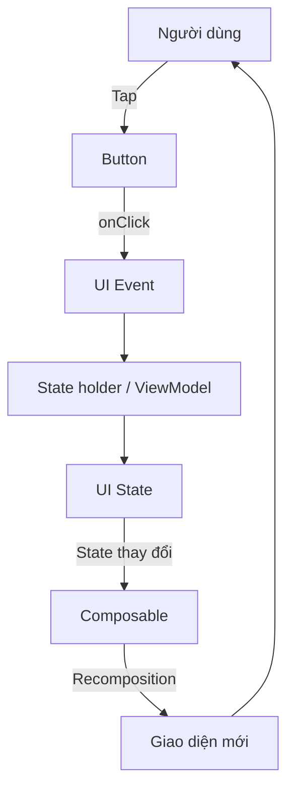
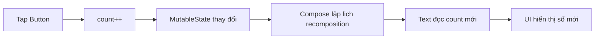
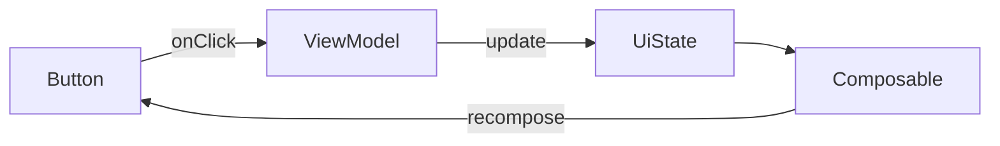
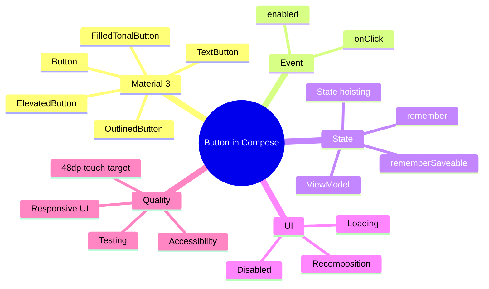

# 031 - Button trong Jetpack Compose

**Học phần:** 02 - App Components and User Interface  
**Module:** Module 04 - Interface and Navigation  
**Nhóm nội dung:** Jetpack Compose  
**Nguồn roadmap:** Interface and Navigation / Jetpack Compose  
**Loại bài:** UI  
**Thứ tự trong module:** 031  
**Thời lượng gợi ý:** 30 phút  

---

## 1. Tổng quan

`Button` là một trong những thành phần tương tác cơ bản nhất của Jetpack Compose. Nó cho phép người dùng **kích hoạt một hành động** như lưu dữ liệu, gửi biểu mẫu, đăng nhập, chuyển màn hình hoặc xác nhận thao tác.

Trong Jetpack Compose, giao diện được xây dựng theo mô hình **declarative UI**:

> UI được mô tả từ **state hiện tại**. Khi state thay đổi, Compose sẽ thực hiện **recomposition** và cập nhật phần giao diện cần thiết.

Vì vậy, học `Button` không chỉ là biết viết `Button(onClick = { ... })`, mà còn phải hiểu:

- `onClick` phát sinh **UI event** như thế nào.
- Event làm thay đổi **state** ra sao.
- State mới khiến Compose **recompose** như thế nào.
- Cách ngăn người dùng bấm lặp khi đang xử lý.
- Cách giữ state khi xoay màn hình.
- Cách viết Button có thể tái sử dụng và kiểm thử.
- Cách chọn đúng loại Button theo mức độ quan trọng của hành động.

---

## 2. Ảnh minh họa

### 2.1. Năm loại Button trong Material 3


*Nguồn ảnh: Android Developers — Button in Jetpack Compose.*

### 2.2. Mức độ nhấn mạnh của các hành động trong Material 3


*Nguồn ảnh: Android Developers — Material Design 3 in Compose.*

---

## 3. Mục tiêu học tập

Sau bài này, bạn có thể:

- Giải thích được `Button` trong Jetpack Compose là gì.
- Tạo Button bằng Material 3.
- Xử lý sự kiện bằng `onClick`.
- Sử dụng `enabled` để bật/tắt Button.
- Kết hợp Button với `State`.
- Hiểu mối quan hệ giữa **event → state → recomposition**.
- Phân biệt năm loại Button phổ biến của Material 3.
- Biết khi nào dùng `Button`, `FilledTonalButton`, `ElevatedButton`, `OutlinedButton` và `TextButton`.
- Thiết kế Button dễ tái sử dụng bằng **state hoisting**.
- Giữ UI state qua configuration change bằng `rememberSaveable`.
- Tránh gọi thao tác nặng trực tiếp trên UI thread.
- Viết kiểm thử cơ bản cho Button.
- Đưa một ví dụ Compose nhỏ vào portfolio.

---

## 4. Button nằm ở đâu trong kiến trúc Android?

Button là thành phần thuộc **UI layer**.



Luồng tư duy quan trọng:

```text
Người dùng bấm Button
        ↓
onClick được gọi
        ↓
Gửi event
        ↓
State thay đổi
        ↓
Compose phát hiện state được đọc đã thay đổi
        ↓
Recomposition
        ↓
UI hiển thị trạng thái mới
```

Đây là nền tảng của **Unidirectional Data Flow — luồng dữ liệu một chiều** trong Compose.

---

## 5. Cú pháp Button cơ bản

```kotlin
import androidx.compose.material3.Button
import androidx.compose.material3.Text
import androidx.compose.runtime.Composable

@Composable
fun SaveButton() {
    Button(
        onClick = {
            // Xử lý khi người dùng bấm
        }
    ) {
        Text("Lưu")
    }
}
```

Cấu trúc:

```text
Button(
    onClick = { ... }
) {
    Nội dung bên trong Button
}
```

Phần content của Button là một composable lambda nên có thể chứa:

- `Text`
- `Icon`
- `Row`
- hoặc nhiều composable nhỏ khác.

---

## 6. Các tham số quan trọng

### 6.1. `onClick`

`onClick` là callback được gọi khi người dùng bấm Button.

```kotlin
Button(
    onClick = {
        println("Button clicked")
    }
) {
    Text("Nhấn vào đây")
}
```

Không nên đặt quá nhiều business logic trực tiếp trong composable.

Thay vào đó:

```kotlin
Button(
    onClick = onSave
) {
    Text("Lưu")
}
```

và để caller hoặc `ViewModel` quyết định hành động thực tế.

---

### 6.2. `enabled`

Khi:

```kotlin
enabled = false
```

Button sẽ ở trạng thái disabled và không nhận thao tác click.

Ví dụ:

```kotlin
Button(
    onClick = onSubmit,
    enabled = email.isNotBlank()
) {
    Text("Đăng ký")
}
```

Ý nghĩa UX:

```text
email rỗng
    ↓
enabled = false
    ↓
Button không thể bấm

email hợp lệ
    ↓
enabled = true
    ↓
Button có thể thực hiện hành động
```

---

### 6.3. `colors`

Có thể tùy chỉnh màu bằng `ButtonDefaults.buttonColors()`.

```kotlin
Button(
    onClick = onClick,
    colors = ButtonDefaults.buttonColors(
        containerColor = MaterialTheme.colorScheme.primary,
        contentColor = MaterialTheme.colorScheme.onPrimary
    )
) {
    Text("Tiếp tục")
}
```

Trong project thực tế nên ưu tiên màu từ:

```kotlin
MaterialTheme.colorScheme
```

thay vì hard-code màu riêng ở từng Button.

---

### 6.4. `contentPadding`

Điều khiển khoảng cách giữa nội dung và biên Button.

```kotlin
Button(
    onClick = onClick,
    contentPadding = PaddingValues(
        horizontal = 24.dp,
        vertical = 12.dp
    )
) {
    Text("Xác nhận")
}
```

---

## 7. Năm loại Button trong Material 3

Material 3 cung cấp năm kiểu Button chính.

| Loại | Composable | Mức nhấn mạnh | Khi nên dùng |
|---|---|---:|---|
| Filled | `Button` | Cao | Hành động chính như Save, Submit |
| Filled tonal | `FilledTonalButton` | Cao / vừa | Hành động quan trọng nhưng mềm hơn Filled |
| Elevated | `ElevatedButton` | Cao / vừa | Khi cần Button nổi hơn khỏi background |
| Outlined | `OutlinedButton` | Trung bình | Hành động phụ, Cancel, Back |
| Text | `TextButton` | Thấp | Learn more, View details, action phụ |

---

## 8. Filled Button

Đây là Button mặc định của Material 3.


```kotlin
@Composable
fun FilledButtonExample(
    onClick: () -> Unit
) {
    Button(
        onClick = onClick
    ) {
        Text("Lưu")
    }
}
```

### Khi dùng

Phù hợp với hành động quan trọng nhất trên màn hình:

```text
Đăng nhập
Thanh toán
Đặt hàng
Lưu
Tiếp tục
Xác nhận
```

---

## 9. Filled Tonal Button


```kotlin
@Composable
fun TonalButtonExample(
    onClick: () -> Unit
) {
    FilledTonalButton(
        onClick = onClick
    ) {
        Text("Thêm vào giỏ")
    }
}
```

Tonal Button có mức nhấn mạnh rõ nhưng thường mềm hơn Filled Button.

---

## 10. Elevated Button

```kotlin
@Composable
fun ElevatedButtonExample(
    onClick: () -> Unit
) {
    ElevatedButton(
        onClick = onClick
    ) {
        Text("Mở")
    }
}
```

Button này có hiệu ứng elevation để nổi khỏi background.

Nên dùng có chủ đích, tránh biến mọi action thành Elevated Button vì sẽ làm mất hierarchy thị giác.

---

## 11. Outlined Button

```kotlin
@Composable
fun OutlinedButtonExample(
    onClick: () -> Unit
) {
    OutlinedButton(
        onClick = onClick
    ) {
        Text("Hủy")
    }
}
```

Một layout phổ biến:

```text
┌──────────────────────────────────┐
│                                  │
│       Nội dung biểu mẫu          │
│                                  │
│ [ Hủy ]        [     Lưu     ]   │
│ Outlined          Filled         │
└──────────────────────────────────┘
```

Trong ví dụ này:

- `Lưu` là primary action.
- `Hủy` là secondary action.

---

## 12. Text Button

```kotlin
@Composable
fun TextButtonExample(
    onClick: () -> Unit
) {
    TextButton(
        onClick = onClick
    ) {
        Text("Xem thêm")
    }
}
```

Phù hợp với action mức ưu tiên thấp:

- Xem thêm
- Bỏ qua
- Tìm hiểu thêm
- Chi tiết
- Hành động phụ trong dialog

---

## 13. Button kết hợp với State

Ví dụ bộ đếm số lần người dùng bấm.

```kotlin
@Composable
fun CounterExample() {
    var count by remember {
        mutableStateOf(0)
    }

    Column(
        verticalArrangement = Arrangement.spacedBy(12.dp)
    ) {
        Text(
            text = "Số lần nhấn: $count"
        )

        Button(
            onClick = {
                count++
            }
        ) {
            Text("Tăng")
        }
    }
}
```

Luồng chạy:



Điểm cần nhớ:

> Không cần tự gọi hàm kiểu `refreshUI()`.

Bạn chỉ cần cập nhật state. Compose sẽ cập nhật UI dựa trên state mới.

---

## 14. `remember` và `rememberSaveable`

### Dùng `remember`

```kotlin
var count by remember {
    mutableStateOf(0)
}
```

State tồn tại qua các lần recomposition.

Tuy nhiên nó có thể bị mất khi Activity bị recreate do configuration change.

---

### Dùng `rememberSaveable`

```kotlin
var count by rememberSaveable {
    mutableStateOf(0)
}
```

Với kiểu dữ liệu có thể lưu được, `rememberSaveable` giúp UI state tồn tại qua những trường hợp như xoay màn hình.

Ví dụ hoàn chỉnh:

```kotlin
@Composable
fun SaveableCounter() {
    var count by rememberSaveable {
        mutableStateOf(0)
    }

    Button(
        onClick = {
            count++
        }
    ) {
        Text("Đã nhấn $count lần")
    }
}
```

### So sánh nhanh

| API | Recomposition | Configuration change |
|---|---:|---:|
| `remember` | ✅ | ❌ |
| `rememberSaveable` | ✅ | ✅ với state có thể save |

Business state dài hạn thường nên được đặt trong `ViewModel` hoặc state holder phù hợp thay vì nhồi toàn bộ vào `rememberSaveable`.

---

## 15. State Hoisting với Button

Composable tốt nên nhận state và callback từ bên ngoài khi có thể.

### Không tối ưu

```kotlin
@Composable
fun SubmitButton() {
    var submitted by remember {
        mutableStateOf(false)
    }

    Button(
        onClick = {
            submitted = true
        }
    ) {
        Text("Submit")
    }
}
```

Composable vừa:

- hiển thị UI,
- vừa sở hữu state,
- vừa quyết định hành vi.

Khả năng tái sử dụng thấp hơn.

---

### Tốt hơn

```kotlin
@Composable
fun SubmitButton(
    enabled: Boolean,
    onSubmit: () -> Unit
) {
    Button(
        onClick = onSubmit,
        enabled = enabled
    ) {
        Text("Submit")
    }
}
```

Caller quản lý state:

```kotlin
@Composable
fun RegisterScreen() {
    var acceptedTerms by rememberSaveable {
        mutableStateOf(false)
    }

    SubmitButton(
        enabled = acceptedTerms,
        onSubmit = {
            // gửi event
        }
    )
}
```

Lợi ích:

- dễ test,
- dễ preview,
- dễ tái sử dụng,
- rõ ràng về data flow,
- ít coupling.

---

## 16. Button với ViewModel

Trong ứng dụng thực tế, Button thường gửi event lên `ViewModel`.



Ví dụ UI:

```kotlin
data class LoginUiState(
    val isLoading: Boolean = false,
    val errorMessage: String? = null
)
```

```kotlin
@Composable
fun LoginButton(
    uiState: LoginUiState,
    onLogin: () -> Unit
) {
    Button(
        onClick = onLogin,
        enabled = !uiState.isLoading
    ) {
        if (uiState.isLoading) {
            CircularProgressIndicator(
                modifier = Modifier.size(20.dp),
                strokeWidth = 2.dp
            )
        } else {
            Text("Đăng nhập")
        }
    }
}
```

Một cách dùng:

```kotlin
LoginButton(
    uiState = uiState,
    onLogin = viewModel::login
)
```

Điểm quan trọng:

- UI phát event.
- ViewModel xử lý logic.
- ViewModel cập nhật state.
- UI đọc state.
- Compose recompose.

---

## 17. Ngăn bấm Button nhiều lần khi đang xử lý

Một lỗi UX phổ biến:

```text
User tap
User tap
User tap
User tap
     ↓
4 request cùng lúc
```

Có thể gây:

- tạo nhiều đơn hàng,
- gửi form nhiều lần,
- gọi API trùng,
- navigation lặp,
- dữ liệu duplicate.

Cách xử lý phổ biến:

```kotlin
Button(
    onClick = onSubmit,
    enabled = !isLoading
) {
    Text(
        if (isLoading) "Đang xử lý..."
        else "Gửi"
    )
}
```

Luồng:

```text
Tap
 ↓
isLoading = true
 ↓
Button disabled
 ↓
Request chạy
 ↓
Success / Error
 ↓
isLoading = false
 ↓
Button enabled
```

---

## 18. Button có Icon

```kotlin
@Composable
fun SaveWithIconButton(
    onClick: () -> Unit
) {
    Button(
        onClick = onClick
    ) {
        Icon(
            imageVector = Icons.Default.Save,
            contentDescription = null
        )

        Spacer(
            modifier = Modifier.width(8.dp)
        )

        Text("Lưu")
    }
}
```

Nếu icon chỉ minh họa cho text `Lưu`, có thể đặt:

```kotlin
contentDescription = null
```

để tránh screen reader đọc nội dung trùng lặp.

Nếu control chỉ có icon mà không có text, hãy dùng `IconButton` và cung cấp `contentDescription` có ý nghĩa.

---

## 19. Accessibility

Button phải dễ:

- nhìn thấy,
- hiểu,
- focus,
- thao tác,
- sử dụng với TalkBack.

Android khuyến nghị vùng tương tác tối thiểu khoảng:

```text
48 dp × 48 dp
```

Các Material component chuẩn như `Button` đã hỗ trợ minimum touch target phù hợp.

Khi tự tạo clickable component bằng `Box`, `Row` hoặc custom layout, cần kiểm tra kích thước vùng bấm.

### Không nên

```kotlin
Text(
    text = "OK",
    modifier = Modifier.clickable {
        onClick()
    }
)
```

nếu vùng bấm quá nhỏ.

### Nên ưu tiên

```kotlin
Button(
    onClick = onClick
) {
    Text("OK")
}
```

hoặc thiết kế touch target đủ lớn cho custom component.

---

## 20. Responsive UI

Tránh hard-code kích thước Button không cần thiết:

```kotlin
Modifier.width(180.dp)
```

nếu layout thực tế cần linh hoạt.

Một pattern phổ biến cho CTA cuối form:

```kotlin
Button(
    onClick = onContinue,
    modifier = Modifier.fillMaxWidth()
) {
    Text("Tiếp tục")
}
```

Kết hợp với padding ở container:

```kotlin
Column(
    modifier = Modifier
        .fillMaxSize()
        .padding(16.dp)
)
```

thường dễ thích ứng hơn nhiều kích thước màn hình.

---

## 21. Không chạy công việc nặng trực tiếp trong `onClick`

Không nên:

```kotlin
Button(
    onClick = {
        // giả sử đây là xử lý nặng
        doHeavyWork()
    }
) {
    Text("Xử lý")
}
```

Nếu công việc blocking chạy trên main thread, UI có thể bị lag hoặc đứng.

Trong kiến trúc thực tế:

```text
Button.onClick
      ↓
ViewModel
      ↓
Coroutine / Repository
      ↓
Network / Database
      ↓
UiState
      ↓
Compose UI
```

Ví dụ phía UI:

```kotlin
Button(
    onClick = viewModel::save
) {
    Text("Lưu")
}
```

Business logic được giữ ngoài composable.

---

## 22. Preview Button

```kotlin
@Preview(showBackground = true)
@Composable
private fun SaveButtonPreview() {
    MaterialTheme {
        SaveButton(
            enabled = true,
            onClick = {}
        )
    }
}
```

Nên preview ít nhất:

```text
Enabled
Disabled
Loading
Light theme
Dark theme
```

nếu Button là component quan trọng trong design system.

---

## 23. Testing Button trong Compose

Compose UI test tương tác qua semantics tree.

Ví dụ:

```kotlin
@get:Rule
val composeTestRule = createComposeRule()

@Test
fun clickButton_updatesCounter() {
    composeTestRule.setContent {
        CounterExample()
    }

    composeTestRule
        .onNodeWithText("Tăng")
        .performClick()

    composeTestRule
        .onNodeWithText("Số lần nhấn: 1")
        .assertIsDisplayed()
}
```

Luồng test:

```text
Arrange
  ↓
Render Composable

Act
  ↓
Tìm Button
  ↓
performClick()

Assert
  ↓
Kiểm tra state mới được hiển thị
```

Những gì nên test:

- Button có hiển thị hay không.
- Button enabled hay disabled.
- Click có phát event hay không.
- Click có cập nhật UI hay không.
- Loading có disable Button không.
- Navigation có diễn ra đúng không.
- Error có phục hồi Button đúng không.

---

## 24. Ví dụ hoàn chỉnh — Submit Form Button

```kotlin
@Composable
fun SubmitDemo() {
    var name by rememberSaveable {
        mutableStateOf("")
    }

    var submittedName by rememberSaveable {
        mutableStateOf<String?>(null)
    }

    Column(
        modifier = Modifier
            .fillMaxSize()
            .padding(24.dp),
        verticalArrangement = Arrangement.spacedBy(16.dp)
    ) {
        OutlinedTextField(
            value = name,
            onValueChange = {
                name = it
            },
            modifier = Modifier.fillMaxWidth(),
            label = {
                Text("Tên")
            },
            singleLine = true
        )

        Button(
            onClick = {
                submittedName = name
            },
            enabled = name.isNotBlank(),
            modifier = Modifier.fillMaxWidth()
        ) {
            Text("Xác nhận")
        }

        submittedName?.let {
            Text(
                text = "Xin chào, $it!"
            )
        }
    }
}
```

### Những kiến thức được sử dụng

```text
OutlinedTextField
      ↓
State: name
      ↓
Button.enabled
      ↓
Button.onClick
      ↓
State: submittedName
      ↓
Recomposition
      ↓
Text mới xuất hiện
```

Đây là ví dụ nhỏ nhưng đã thể hiện được bản chất của Compose:

> **UI = function(state)**

---

## 25. Lỗi thường gặp

### Lỗi 1 — Nhét business logic vào Button

Không nên:

```kotlin
Button(
    onClick = {
        validate()
        queryDatabase()
        callApi()
        parseResponse()
        saveDatabase()
        navigate()
    }
)
```

Nên:

```kotlin
Button(
    onClick = onSubmit
)
```

---

### Lỗi 2 — Không disable khi loading

Có thể khiến request chạy nhiều lần.

```kotlin
enabled = !isLoading
```

---

### Lỗi 3 — Dùng `remember` cho state cần giữ khi rotate

Nếu state UI nhỏ cần tồn tại qua configuration change:

```kotlin
rememberSaveable
```

có thể phù hợp hơn.

---

### Lỗi 4 — Dùng cùng mức emphasis cho mọi Button

Ví dụ xấu:

```text
[ DELETE ] [ CANCEL ] [ SAVE ]
```

cả ba đều là Filled Button.

Hierarchy rõ hơn:

```text
[ Delete ]   [ Cancel ]   [   Save   ]
  Text        Outlined       Filled
```

---

### Lỗi 5 — Hard-code style khắp nơi

Không nên tạo mỗi màn hình một màu Button khác nhau nếu không có lý do thiết kế.

Ưu tiên:

```kotlin
MaterialTheme.colorScheme
```

và reusable component.

---

### Lỗi 6 — Vùng bấm custom quá nhỏ

Button đẹp nhưng khó chạm vẫn là UX kém.

Kiểm tra touch target, accessibility và thiết bị màn hình nhỏ.

---

## 26. Bài thực hành 30 phút

### Phần A — 5 phút

Tạo:

```kotlin
Button(
    onClick = {}
) {
    Text("Nhấn tôi")
}
```

Chạy bằng Preview hoặc emulator.

---

### Phần B — 10 phút

Tạo bộ đếm:

```text
Số lần nhấn: 0
[ Tăng ]
```

Mỗi lần tap:

```text
0 → 1 → 2 → 3 → ...
```

---

### Phần C — 5 phút

Khi đạt `5`:

```text
enabled = false
```

UI:

```text
Số lần nhấn: 5
[ Đã đạt giới hạn ]  ← disabled
```

---

### Phần D — 5 phút

Đổi `remember` thành:

```kotlin
rememberSaveable
```

Sau đó xoay màn hình và kiểm tra state.

---

### Phần E — 5 phút

Viết một Compose UI test:

```text
Tap "Tăng"
      ↓
Expected
      ↓
"Số lần nhấn: 1"
```

---

## 27. Bài tập

### Bài 1 — Counter Button

Tạo một màn hình gồm:

```text
Counter: 0

[ - ]   [ + ]

[ Reset ]
```

Yêu cầu:

- Không cho counter nhỏ hơn `0`.
- `-` disabled khi counter bằng `0`.
- `Reset` là `TextButton`.
- `+` là Filled Button.
- State không mất khi rotate.

---

### Bài 2 — Login Button

Tạo:

```text
Email
Password

[ Đăng nhập ]
```

Button chỉ enabled khi:

```text
email != rỗng
AND
password.length >= 6
```

---

### Bài 3 — Loading Button

Sau khi bấm:

```text
Đăng nhập
    ↓
Đang xử lý...
    ↓
Button disabled
    ↓
Hoàn tất
```

Có thể mô phỏng bằng delay trong ViewModel hoặc state holder.

---

## 28. Mini Project cho Portfolio

### Compose Button Playground

Tạo một màn hình thể hiện:

```text
Button Playground

[ Filled ]
[ Tonal ]
[ Elevated ]
[ Outlined ]
[ Text ]

State Demo
Count: 3
[ Increase ]

Async Demo
[ Save ]
```

### Artifact nên lưu

- Screenshot màn hình.
- File Kotlin chứa composable.
- Một Compose UI test.
- README ngắn mô tả:
  - năm loại Button,
  - state,
  - state hoisting,
  - accessibility,
  - loading state.

---

## 29. Gợi ý README cho Portfolio

```markdown
# Compose Button Playground

A small Jetpack Compose project demonstrating Material 3 buttons.

## Features

- Filled Button
- Filled Tonal Button
- Elevated Button
- Outlined Button
- Text Button
- Enabled / disabled state
- State-driven UI
- rememberSaveable
- State hoisting
- Loading state
- Compose UI testing

## Concepts

User Event → State Update → Recomposition → Updated UI
```

---

## 30. Checklist hoàn thành

### Kiến thức

- [ ] Giải thích được Button trong Compose.
- [ ] Hiểu vai trò của `onClick`.
- [ ] Hiểu `enabled`.
- [ ] Biết năm loại Button Material 3.
- [ ] Hiểu event → state → recomposition.
- [ ] Phân biệt `remember` và `rememberSaveable`.
- [ ] Hiểu state hoisting.
- [ ] Biết cách tránh double click khi loading.

### Coding

- [ ] Tạo được Button cơ bản.
- [ ] Tạo Button có state.
- [ ] Tạo Button disabled.
- [ ] Tạo Button có icon.
- [ ] Tạo reusable Button composable.
- [ ] Kết nối Button với ViewModel hoặc callback.
- [ ] Viết được UI test đơn giản.

### UX / Quality

- [ ] Chọn đúng mức emphasis.
- [ ] Touch target đủ lớn.
- [ ] Không hard-code style không cần thiết.
- [ ] Có loading feedback khi action mất thời gian.
- [ ] Không chạy blocking work trên main thread.
- [ ] Kiểm tra light/dark theme nếu cần.

### Portfolio

- [ ] Có screenshot.
- [ ] Có source code.
- [ ] Có test.
- [ ] Có README ngắn.
- [ ] Có ghi chú về state và accessibility.

---

## 31. Ghi chú production

Trước khi đưa Button vào production, hãy tự hỏi:

```text
1. Đây có phải primary action không?
2. Button có cần disabled theo validation không?
3. Người dùng có thể tap nhiều lần không?
4. Có loading state không?
5. State có cần tồn tại sau rotate không?
6. Business logic đang nằm ở UI hay ViewModel?
7. Action lỗi thì UI phục hồi thế nào?
8. Touch target có đủ lớn không?
9. TalkBack có hiểu control này không?
10. Có test bảo vệ hành vi chính không?
```

Một Button production-ready không chỉ cần **bấm được**.

Nó cần:

```text
Đúng hành động
+ đúng state
+ đúng hierarchy thị giác
+ phản hồi rõ ràng
+ chống thao tác lặp
+ accessible
+ testable
+ maintainable
```

---

## 32. Tóm tắt bài học



Công thức cần nhớ:

```text
Button
  ↓
onClick
  ↓
Event
  ↓
State thay đổi
  ↓
Recomposition
  ↓
UI mới
```

Nếu hiểu được luồng này, bạn đã nắm được phần cốt lõi của việc sử dụng Button trong Jetpack Compose thay vì chỉ học thuộc cú pháp.

---

# Bài luyện tập

## Mục tiêu


## Đề bài


## Yêu cầu hoàn thành

- [ ] 
- [ ] 
- [ ] 

## Kết quả / lời giải


## Ghi chú
