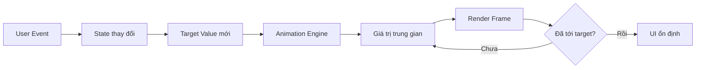
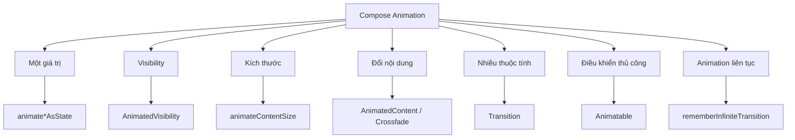
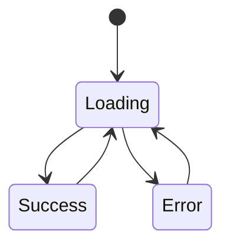
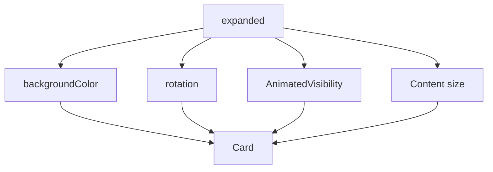
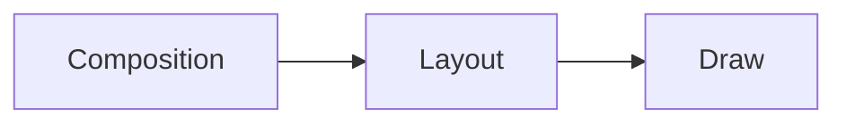
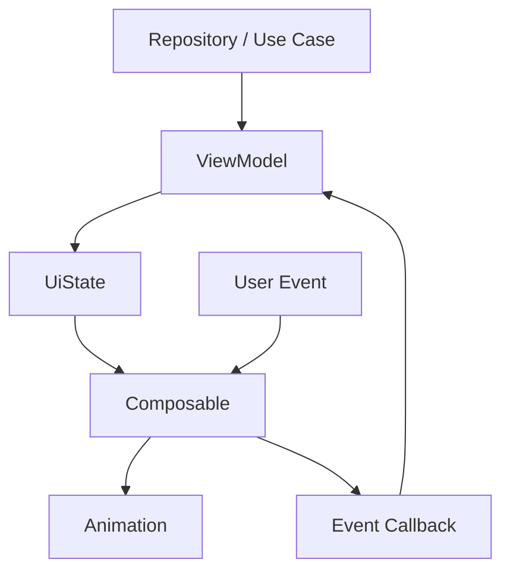
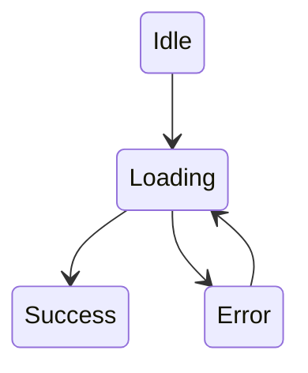

# 033 - Compose Animation

**Học phần:** 02 - App Components and User Interface
**Module:** Module 04 - Interface and Navigation
**Nhóm nội dung:** Jetpack Compose
**Nguồn roadmap:** Interface and Navigation / Jetpack Compose
**Loại bài:** UI
**Thứ tự trong module:** 033
**Thời lượng gợi ý:** 30 phút

---

## 1. Tổng quan

**Compose Animation** là hệ thống API tạo chuyển động cho giao diện Jetpack Compose.

Thay vì tự quản lý từng frame, lập trình viên thường mô tả:

1. **Trạng thái hiện tại**.
2. **Trạng thái đích**.
3. Cách chuyển động giữa hai trạng thái.

Compose sẽ tính các giá trị trung gian và cập nhật giao diện theo từng frame.

Ví dụ:

```text
collapsed → expanded
alpha 0 → 1
rotation 0° → 180°
color Blue → Green
```

Compose cung cấp nhiều API cho những tình huống khác nhau như `animate*AsState`, `AnimatedVisibility`, `animateContentSize`, `AnimatedContent`, `Transition`, `Animatable` và `InfiniteTransition`. ([Android Developers][1])

> Animation không chỉ để giao diện "đẹp hơn". Animation tốt giúp người dùng hiểu **thành phần nào vừa xuất hiện, cái gì vừa thay đổi và thao tác của họ gây ra kết quả gì**.

---

## 2. Mục tiêu học tập

Sau bài này, bạn có thể:

* Giải thích được animation trong Jetpack Compose hoạt động dựa trên **state** như thế nào.
* Sử dụng `animate*AsState` để animate một giá trị.
* Sử dụng `AnimatedVisibility` để hiện/ẩn UI.
* Sử dụng `animateContentSize()` để animate thay đổi kích thước.
* Hiểu khi nào nên dùng `AnimatedContent`.
* Hiểu khi nào nên dùng `Transition`.
* Phân biệt `spring`, `tween`, `keyframes` và animation lặp.
* Biết cách kiểm tra animation bằng **Animation Preview**.
* Nhận biết những animation có nguy cơ gây vấn đề performance.
* Xây dựng một composable nhỏ có animation để đưa vào portfolio.

---

# 3. Compose Animation hoạt động như thế nào?

Jetpack Compose là hệ thống UI **state-driven**.

Ví dụ:

```kotlin
var expanded by remember {
    mutableStateOf(false)
}
```

Khi người dùng nhấn:

```kotlin
expanded = !expanded
```

UI có trạng thái mới.

Nếu dùng:

```kotlin
val rotation by animateFloatAsState(
    targetValue = if (expanded) 180f else 0f,
    label = "arrowRotation"
)
```

Compose không chuyển từ:

```text
0°
```

sang ngay:

```text
180°
```

mà tạo nhiều giá trị trung gian:

```text
0°
 ↓
24°
 ↓
61°
 ↓
108°
 ↓
151°
 ↓
180°
```

---

## 3.1. Sơ đồ luồng animation



Ví dụ:

```text
User click
    ↓
expanded = true
    ↓
targetRotation = 180°
    ↓
animateFloatAsState()
    ↓
0 → 40 → 93 → 146 → 180
    ↓
Icon quay xuống
```

---

# 4. API quan trọng của Compose Animation

Có thể hình dung hệ thống API như sau:



### Bảng chọn nhanh

| Nhu cầu                               | API phù hợp                  |
| ------------------------------------- | ---------------------------- |
| Animate một giá trị                   | `animate*AsState`            |
| Hiện / ẩn composable                  | `AnimatedVisibility`         |
| Thay đổi kích thước                   | `animateContentSize()`       |
| Chuyển giữa các UI khác nhau          | `AnimatedContent`            |
| Chỉ cần fade giữa nội dung            | `Crossfade`                  |
| Nhiều thuộc tính phụ thuộc cùng state | `Transition`                 |
| Điều khiển animation bằng coroutine   | `Animatable`                 |
| Animation chạy liên tục               | `rememberInfiniteTransition` |

Đây cũng là cách Android Developers phân loại các animation API phổ biến. ([Android Developers][2])

---

# 5. `animate*AsState`

Đây thường là API đơn giản nhất để bắt đầu.

Nó phù hợp khi:

> **Một state → một target value**

Ví dụ:

```kotlin
val alpha by animateFloatAsState(
    targetValue = if (visible) 1f else 0f,
    label = "alpha"
)
```

Compose có nhiều biến thể:

```text
animateFloatAsState()
animateDpAsState()
animateColorAsState()
animateIntAsState()
animateIntOffsetAsState()
animateSizeAsState()
...
```

`animate*AsState` tự động animate từ giá trị hiện tại đến `targetValue` mới. ([Android Developers][3])

---

## 5.1. Ví dụ: xoay icon

```kotlin
@Composable
fun RotateArrowExample() {

    var expanded by remember {
        mutableStateOf(false)
    }

    val rotation by animateFloatAsState(
        targetValue = if (expanded) 180f else 0f,
        label = "arrowRotation"
    )

    IconButton(
        onClick = {
            expanded = !expanded
        }
    ) {

        Icon(
            imageVector = Icons.Default.KeyboardArrowDown,
            contentDescription = "Expand",
            modifier = Modifier.rotate(rotation)
        )
    }
}
```

Luồng:

```text
expanded = false
       ↓
rotation = 0°

       CLICK

expanded = true
       ↓
target = 180°
       ↓
animation
       ↓
rotation = 180°
```

---

# 6. `AnimatedVisibility`

`AnimatedVisibility` dùng cho trường hợp một composable cần **xuất hiện hoặc biến mất**.

```kotlin
AnimatedVisibility(
    visible = visible
) {
    Text("Hello Compose")
}
```

Mặc định Compose sẽ sử dụng animation khi content xuất hiện và biến mất. ([Android Developers][4])

---

## Minh họa


*Nguồn minh họa: Android Developers.* ([Android Developers][5])

---

## 6.1. Custom animation

Bạn có thể kết hợp nhiều hiệu ứng:

```kotlin
AnimatedVisibility(
    visible = visible,
    enter =
        fadeIn() +
        expandVertically(),
    exit =
        fadeOut() +
        shrinkVertically()
) {

    Text(
        text = "Nội dung chi tiết"
    )
}
```

Khi xuất hiện:

```text
alpha
0 ───────────► 1

height
0 ───────────► full size
```

Khi biến mất:

```text
alpha
1 ───────────► 0

height
full size ───► 0
```

---

# 7. `AnimatedVisibility` và alpha không giống nhau

Có thể tạo hiệu ứng "ẩn" bằng:

```kotlin
val alpha by animateFloatAsState(
    targetValue = if (visible) 1f else 0f
)
```

nhưng:

```kotlin
alpha = 0f
```

không có nghĩa composable đã bị loại khỏi layout.

Android Developers lưu ý rằng composable với alpha bằng `0` vẫn có thể tồn tại trong composition, chiếm không gian layout và có thể còn ảnh hưởng đến accessibility. `AnimatedVisibility`, ngược lại, sẽ loại content khỏi composition sau khi exit animation kết thúc. ([Android Developers][2])

### Vì vậy

Dùng:

```text
AnimatedVisibility
```

khi ý nghĩa thật sự là:

```text
Show / Hide
```

Dùng:

```text
animateFloatAsState(alpha)
```

khi đối tượng vẫn cần tồn tại nhưng chỉ thay đổi độ trong suốt.

---

# 8. `animateContentSize()`

Một tình huống rất phổ biến:

```text
Card nhỏ
   ↓
user click
   ↓
Card mở rộng
```

Nếu thay đổi kích thước ngay lập tức:

```text
200dp → 400dp
```

UI có thể trông giật.

Thêm:

```kotlin
Modifier.animateContentSize()
```

Compose sẽ tạo chuyển đổi mượt.

---

## Minh họa


*Nguồn minh họa: Android Developers.* ([Android Developers][5])

---

## Ví dụ

```kotlin
@Composable
fun ExpandableBox() {

    var expanded by remember {
        mutableStateOf(false)
    }

    Box(
        modifier = Modifier
            .fillMaxWidth()
            .animateContentSize()
            .height(
                if (expanded) {
                    300.dp
                } else {
                    120.dp
                }
            )
            .clickable {
                expanded = !expanded
            }
    )
}
```

### Chú ý thứ tự Modifier

Android Developers lưu ý vị trí của:

```kotlin
animateContentSize()
```

trong Modifier chain có ảnh hưởng đến kết quả. Với thay đổi kích thước, nó thường nên đứng **trước modifier kích thước** mà bạn muốn nó quan sát. ([Android Developers][6])

Ví dụ:

```kotlin
Modifier
    .animateContentSize()
    .height(height)
```

---

# 9. `AnimatedContent`

`AnimatedContent` phù hợp khi **nội dung của một vùng UI thay đổi hoàn toàn theo state**.

Ví dụ:

```text
Loading
   ↓
Success
```

hoặc:

```text
Loading
   ↓
Error
```

---

## Minh họa


*Nguồn minh họa: Android Developers.* ([Android Developers][5])

---

## Ví dụ

```kotlin
enum class UiState {
    Loading,
    Success,
    Error
}
```

```kotlin
AnimatedContent(
    targetState = uiState,
    label = "screenState"
) { state ->

    when (state) {

        UiState.Loading -> {
            CircularProgressIndicator()
        }

        UiState.Success -> {
            Text("Tải dữ liệu thành công")
        }

        UiState.Error -> {
            Text("Đã xảy ra lỗi")
        }
    }
}
```

Mô hình:



Thay vì:

```text
Loading → biến mất ngay → Success
```

ta có:

```text
Loading
   ↓ fade / slide
Success
```

`AnimatedContent` được thiết kế cho việc animate giữa các composable khác nhau theo target state. ([Android Developers][2])

---

# 10. `Crossfade`

Nếu chỉ cần hiệu ứng đơn giản:

```text
UI A
 ↓ fade
UI B
```

có thể dùng:

```kotlin
Crossfade(
    targetState = uiState,
    label = "screenCrossfade"
) { state ->

    when (state) {

        UiState.Loading -> {
            LoadingScreen()
        }

        UiState.Success -> {
            SuccessScreen()
        }

        UiState.Error -> {
            ErrorScreen()
        }
    }
}
```

Có thể ghi nhớ:

```text
AnimatedContent
    │
    ├── nhiều kiểu transition
    │
    └── linh hoạt hơn

Crossfade
    │
    └── fade đơn giản
```

---

# 11. Animate nhiều thuộc tính với `Transition`

Giả sử một Card khi được chọn cần thay đổi cùng lúc:

```text
Color
Scale
Elevation
Border
```

Nếu tất cả phụ thuộc cùng một state:

```kotlin
selected
```

thì `Transition` là lựa chọn phù hợp.

---

## Ví dụ

```kotlin
val transition = updateTransition(
    targetState = selected,
    label = "cardTransition"
)
```

Animate scale:

```kotlin
val scale by transition.animateFloat(
    label = "scale"
) { isSelected ->

    if (isSelected) {
        1.05f
    } else {
        1f
    }
}
```

Animate màu:

```kotlin
val color by transition.animateColor(
    label = "color"
) { isSelected ->

    if (isSelected) {
        Color.Blue
    } else {
        Color.Gray
    }
}
```

Cả hai được điều khiển bởi:

```text
selected
```

---

## Sơ đồ

```text
               selected
                   │
        ┌──────────┼──────────┐
        │          │          │
        ▼          ▼          ▼
      scale      color     elevation
        │          │          │
        └──────────┼──────────┘
                   ▼
                 Card
```

`Transition` đặc biệt hữu ích khi nhiều animated value cùng phụ thuộc vào một trạng thái. ([Android Developers][2])

---

# 12. `Animatable`

`animate*AsState` có tính **declarative**:

```text
Đây là target của tôi.
Compose hãy animate đến đó.
```

Trong một số trường hợp bạn cần kiểm soát luồng rõ hơn:

```text
Animate A
   ↓
đợi A xong
   ↓
Animate B
   ↓
đợi B xong
   ↓
Animate C
```

Lúc này có thể sử dụng:

```kotlin
Animatable
```

---

## Ví dụ

```kotlin
val alpha = remember {
    Animatable(0f)
}

LaunchedEffect(Unit) {

    alpha.animateTo(1f)

}
```

và:

```kotlin
Box(
    modifier = Modifier.graphicsLayer {
        this.alpha = alpha.value
    }
)
```

`Animatable.animateTo()` là suspend function, vì vậy có thể dễ dàng ghép các animation tuần tự bằng coroutine. ([Android Developers][2])

---

# 13. Sequential Animation

Ví dụ:

```kotlin
LaunchedEffect(Unit) {

    alpha.animateTo(1f)

    offset.animateTo(100f)

    scale.animateTo(1.2f)
}
```

Luồng:

```text
Alpha
██████████

           Offset
           ██████████

                      Scale
                      ██████████
```

---

## Minh họa


*Nguồn minh họa: Android Developers.* ([Android Developers][5])

---

# 14. Concurrent Animation

Nếu muốn nhiều animation chạy cùng lúc:

```kotlin
LaunchedEffect(Unit) {

    launch {
        alpha.animateTo(1f)
    }

    launch {
        offset.animateTo(200f)
    }
}
```

Luồng:

```text
Alpha   █████████████████

Offset  █████████████████
```

---

## Minh họa


*Nguồn minh họa: Android Developers.* ([Android Developers][5])

---

# 15. Infinite Animation

Một số animation không có trạng thái kết thúc rõ ràng:

* Loading indicator.
* Pulse.
* Glow.
* Shimmer.
* Breathing effect.
* Decorative background.

Có thể dùng:

```kotlin
rememberInfiniteTransition()
```

Ví dụ:

```kotlin
val infiniteTransition =
    rememberInfiniteTransition(
        label = "pulse"
    )

val scale by infiniteTransition.animateFloat(
    initialValue = 1f,
    targetValue = 1.1f,
    animationSpec = infiniteRepeatable(
        animation = tween(800),
        repeatMode = RepeatMode.Reverse
    ),
    label = "scale"
)
```

Kết quả:

```text
1.0
 ↓
1.02
 ↓
1.05
 ↓
1.10
 ↓
1.05
 ↓
1.02
 ↓
1.0
 ↓
repeat...
```

---

# 16. `AnimationSpec`

Animation API trả lời câu hỏi:

> **Animate cái gì?**

`AnimationSpec` trả lời:

> **Animate như thế nào?**

Một số loại quan trọng:

```text
AnimationSpec
│
├── spring
├── tween
├── keyframes
├── repeatable
├── infiniteRepeatable
└── snap
```

Android Developers liệt kê các animation spec này là những lựa chọn phổ biến trong Compose. ([Android Developers][2])

---

# 17. `spring`

`spring` mô phỏng chuyển động dựa trên vật lý.

```kotlin
animationSpec = spring()
```

Có thể điều chỉnh:

```kotlin
spring(
    dampingRatio = Spring.DampingRatioMediumBouncy,
    stiffness = Spring.StiffnessLow
)
```

Spring có cảm giác tự nhiên hơn trong nhiều interaction và là lựa chọn mặc định của nhiều animation Compose. ([Android Developers][2])

### Ý tưởng

```text
target
  │
  │        ╭─╮
  │      ╭─╯ ╰─╮
  │ ─────╯     ╰────
  │
```

Giá trị có thể hơi vượt target rồi quay trở lại.

---

# 18. `tween`

`tween` dựa trên **duration**.

```kotlin
animationSpec = tween(
    durationMillis = 300
)
```

Có thể thêm easing:

```kotlin
tween(
    durationMillis = 300,
    easing = FastOutSlowInEasing
)
```

Ví dụ:

```text
0 ms                     300 ms
│                           │
0 ───────────────────────── 1
```

Phù hợp khi designer yêu cầu:

```text
"Animation phải kéo dài 250 ms."
```

---

# 19. `keyframes`

Dùng khi animation phải đi qua những giá trị cụ thể.

Ví dụ:

```text
0 ms       150 ms      300 ms
 │            │           │
 ▼            ▼           ▼
0°          120°         90°
```

Có thể dùng:

```kotlin
animationSpec = keyframes {

    durationMillis = 300

    0f at 0

    120f at 150

    90f at 300
}
```

Phù hợp cho animation phức tạp hoặc có nhiều giai đoạn.

---

# 20. Minh họa AnimationSpec


*Nguồn minh họa: Android Developers.* ([Android Developers][5])

---

# 21. Bài thực hành: Expandable Profile Card

Ta xây dựng một component có:

```text
Click Card
   │
   ├── icon rotate
   ├── background color animate
   ├── content expand
   └── text fade in/out
```

---

## 21.1. Code hoàn chỉnh

```kotlin
@Composable
fun AnimatedProfileCard() {

    var expanded by rememberSaveable {
        mutableStateOf(false)
    }

    val backgroundColor by animateColorAsState(
        targetValue =
            if (expanded) {
                MaterialTheme.colorScheme.primaryContainer
            } else {
                MaterialTheme.colorScheme.surfaceVariant
            },
        animationSpec = tween(
            durationMillis = 300
        ),
        label = "backgroundColor"
    )

    val rotation by animateFloatAsState(
        targetValue =
            if (expanded) {
                180f
            } else {
                0f
            },
        animationSpec = tween(
            durationMillis = 300
        ),
        label = "arrowRotation"
    )

    Card(
        modifier = Modifier
            .fillMaxWidth()
            .padding(16.dp)
            .clickable {
                expanded = !expanded
            }
    ) {

        Column(
            modifier = Modifier
                .background(backgroundColor)
                .animateContentSize()
                .padding(20.dp)
        ) {

            Row(
                modifier = Modifier.fillMaxWidth(),
                verticalAlignment = Alignment.CenterVertically
            ) {

                Column(
                    modifier = Modifier.weight(1f)
                ) {

                    Text(
                        text = "Jetpack Compose",
                        style = MaterialTheme.typography.titleLarge
                    )

                    Text(
                        text = "Android UI Toolkit"
                    )
                }

                Icon(
                    imageVector =
                        Icons.Default.KeyboardArrowDown,
                    contentDescription =
                        if (expanded) {
                            "Thu gọn"
                        } else {
                            "Mở rộng"
                        },
                    modifier = Modifier.rotate(rotation)
                )
            }

            AnimatedVisibility(
                visible = expanded,
                enter =
                    fadeIn(
                        animationSpec = tween(300)
                    ) +
                    expandVertically(),
                exit =
                    fadeOut(
                        animationSpec = tween(200)
                    ) +
                    shrinkVertically()
            ) {

                Text(
                    text = """
                        Jetpack Compose sử dụng mô hình UI
                        dựa trên state. Khi state thay đổi,
                        Compose tự động cập nhật giao diện.
                    """.trimIndent(),
                    modifier = Modifier.padding(
                        top = 16.dp
                    )
                )
            }
        }
    }
}
```

---

# 22. Phân tích ví dụ

State duy nhất:

```kotlin
expanded
```

điều khiển:



Đây chính là tư duy quan trọng:

> **Không tạo animation state riêng nếu animation có thể được suy ra trực tiếp từ UI state.**

Ví dụ tốt:

```kotlin
rotation =
    if (expanded) 180f else 0f
```

thay vì quản lý thêm:

```text
expanded
rotated
animationStarted
animationFinished
...
```

một cách không cần thiết.

---

# 23. State và Configuration Change

Nếu dùng:

```kotlin
remember {
    mutableStateOf(false)
}
```

state thường không được giữ khi Activity bị recreation.

Với trạng thái UI đơn giản mà bạn muốn khôi phục:

```kotlin
rememberSaveable {
    mutableStateOf(false)
}
```

có thể phù hợp hơn.

Ví dụ:

```text
User mở Card
    ↓
expanded = true
    ↓
rotate / configuration recreation
    ↓
expanded vẫn true
```

Điều cần giữ lại thường là **state có ý nghĩa đối với UI**, không nhất thiết là:

```text
animation đang ở frame thứ 47
```

Sau khi state được phục hồi, animation/UI có thể được dựng lại từ state đó.

---

# 24. Animation khi Composable vào Composition

Một pattern phổ biến:

```kotlin
val alpha = remember {
    Animatable(0f)
}

LaunchedEffect(Unit) {

    alpha.animateTo(1f)
}
```

Luồng:

```text
Composable enters composition
          ↓
LaunchedEffect
          ↓
Animatable.animateTo()
          ↓
Animation
```

Tuy nhiên cần cẩn thận nếu pattern này nằm trong `LazyColumn` hoặc `LazyGrid`.

Item có thể:

```text
scroll khỏi màn hình
       ↓
rời composition
       ↓
scroll trở lại
       ↓
vào composition lại
       ↓
LaunchedEffect chạy lại
```

Android Developers khuyến cáo cân nhắc hoist state ra ngoài lazy item nếu không muốn animation lặp lại mỗi lần item tái xuất hiện. ([Android Developers][2])

---

# 25. Performance

Animation có thể chạy:

```text
60 FPS
90 FPS
120 FPS
```

nên code animation có thể được thực thi rất nhiều lần mỗi giây.

---

## 25.1. Ba phase quan trọng

Đơn giản hóa pipeline Compose:



Nếu animation làm thay đổi layout liên tục:

```text
Animation
  ↓
Layout
  ↓
Measure
  ↓
Placement
  ↓
Draw
```

công việc có thể nhiều hơn.

Nếu chỉ thay đổi thuộc tính draw:

```text
Animation
  ↓
Draw
```

thường rẻ hơn.

Android Developers khuyến nghị khi phù hợp nên dùng lambda modifier hoặc `graphicsLayer {}` để tránh thực hiện nhiều công việc hơn cần thiết trong composition/layout. ([Android Developers][2])

---

# 26. Ví dụ tối ưu translation

Thay vì đọc animated value quá sớm:

```kotlin
Modifier.offset(
    x = animatedOffset.dp
)
```

trong những trường hợp thích hợp có thể dùng lambda modifier:

```kotlin
Modifier.offset {
    IntOffset(
        x = animatedX,
        y = 0
    )
}
```

Hoặc với scale/rotation/alpha:

```kotlin
Modifier.graphicsLayer {

    scaleX = scale

    scaleY = scale

    rotationZ = rotation

    alpha = alphaValue
}
```

`graphicsLayer` thực hiện các transformation phù hợp ở draw layer và thường rất hữu ích cho animation. ([Android Developers][2])

---

# 27. Một lỗi UX phổ biến: Animate mọi thứ

Không phải mọi thay đổi UI đều cần animation.

### Không tốt

```text
Click
 ↓
button bounce
 ↓
text slide
 ↓
card rotate
 ↓
background flash
 ↓
icon spin
```

Animation quá nhiều có thể:

* Làm UI cảm giác chậm.
* Làm người dùng mất tập trung.
* Làm khó hiểu hierarchy.
* Gây jank trên thiết bị yếu.

---

## Nguyên tắc

Animation nên trả lời ít nhất một câu hỏi:

```text
Cái gì vừa thay đổi?
```

hoặc:

```text
Nội dung này từ đâu xuất hiện?
```

hoặc:

```text
Thao tác của tôi vừa có tác dụng gì?
```

Nếu không trả lời được câu nào, animation có thể chỉ là decoration không cần thiết.

---

# 28. Accessibility

Animation cũng liên quan đến accessibility.

Một ví dụ quan trọng:

```kotlin
alpha = 0f
```

không nhất thiết đồng nghĩa với:

```text
Không tồn tại
```

UI vẫn có thể còn trong layout hoặc semantics tree.

Vì vậy khi cần thực sự hiện/ẩn content nên cân nhắc:

```kotlin
AnimatedVisibility
```

thay vì chỉ animate alpha. ([Android Developers][2])

Ngoài ra, với production app nên tránh:

* Flash mạnh.
* Animation quá nhanh.
* Chuyển động liên tục không cần thiết.
* Animation gây khó đọc text.
* Loop vô hạn chỉ để trang trí nếu không mang giá trị UX.

---

# 29. Debug bằng Animation Preview

Android Studio có **Animation Preview** giúp inspect animation.

Có thể:

* Play / pause animation.
* Scrub timeline.
* Xem frame cụ thể.
* Quan sát giá trị animated property.
* Thay đổi initial / target state.
* Inspect nhiều animation cùng lúc.

Animation Preview hiện hỗ trợ nhiều API phổ biến như `animate*AsState`, `Crossfade`, `rememberInfiniteTransition`, `AnimatedContent`, `updateTransition` và `AnimatedVisibility`. ([Android Developers][7])

---

## Minh họa Animation Preview


*Nguồn: Android Developers.* 

---

# 30. Tại sao nên đặt `label`?

Bạn thường thấy:

```kotlin
animateFloatAsState(
    targetValue = value,
    label = "arrowRotation"
)
```

hoặc:

```kotlin
updateTransition(
    targetState = state,
    label = "profileCard"
)
```

Label giúp tooling hiển thị animation dễ hiểu hơn.

Thay vì:

```text
Animation #1
Animation #2
Animation #3
```

có thể thấy:

```text
profileCard
arrowRotation
backgroundColor
```

Điều này đặc biệt hữu ích khi debug nhiều animation. ([Android Developers][7])

---

# 31. Testing Animation

Không nên test animation bằng:

```text
Thread.sleep(300)
```

vì test sẽ:

* Chậm.
* Không deterministic.
* Có thể flaky.

Compose cung cấp test clock thông qua:

```kotlin
ComposeTestRule.mainClock
```

Bạn có thể tắt auto advance:

```kotlin
composeTestRule.mainClock.autoAdvance = false
```

và chủ động tiến thời gian:

```kotlin
composeTestRule.mainClock.advanceTimeBy(100)
```

hoặc một frame:

```kotlin
composeTestRule.mainClock.advanceTimeByFrame()
```

Điều này cho phép kiểm thử animation theo cách deterministic. ([Android Developers][8])

---

## Ví dụ cấu trúc test

```kotlin
@get:Rule
val composeRule = createComposeRule()

@Test
fun expandableCard_animation() {

    composeRule.mainClock.autoAdvance = false

    composeRule.setContent {
        AnimatedProfileCard()
    }

    composeRule
        .onNodeWithText("Jetpack Compose")
        .performClick()

    composeRule.mainClock.advanceTimeBy(
        150L
    )

    // Kiểm tra UI tại thời điểm cần thiết.
}
```

Tư duy:

```text
Start
 │
 ├── 0 ms
 │
 ├── 50 ms
 │
 ├── 150 ms  ← kiểm tra
 │
 └── 300 ms
```

---

# 32. Manual Test Checklist

Khi kiểm tra animation bằng tay:

* [ ] Animation chạy đúng khi click.
* [ ] Click nhanh nhiều lần không làm UI lỗi.
* [ ] Animation có thể bị interrupt mà không giật.
* [ ] State cuối đúng.
* [ ] Không xuất hiện content trùng nhau.
* [ ] Không có layout jump bất thường.
* [ ] Text vẫn đọc được trong transition.
* [ ] Không có thành phần invisible nhưng vẫn click được ngoài ý muốn.
* [ ] Scroll vẫn mượt khi animation chạy.
* [ ] Animation hoạt động ổn trên màn hình nhỏ.
* [ ] Rotate thiết bị không làm UI trở về state sai.
* [ ] Background/foreground app không làm state hỏng.

---

# 33. Các lỗi thường gặp

## Lỗi 1 — Animate state thay vì UI property

Không nên cố tạo:

```text
animationProgress
animationStep
isAnimating
frame
currentColor
currentRotation
```

nếu Compose có thể suy ra trực tiếp.

Ưu tiên:

```text
UI State
   ↓
Target Value
   ↓
Animation API
```

---

## Lỗi 2 — Dùng animation API quá phức tạp

Ví dụ chỉ cần:

```text
alpha 0 → 1
```

nhưng lại xây:

```text
Transition
+ Coroutine
+ Animatable
+ manual frame control
```

Không cần thiết.

Dùng:

```kotlin
animateFloatAsState()
```

là đủ.

---

## Lỗi 3 — Dùng `InfiniteTransition` cho animation có trạng thái kết thúc

Nếu animation là:

```text
Collapsed → Expanded
```

không nên dùng infinite animation.

Infinite animation phù hợp hơn với:

```text
Loading
Pulse
Shimmer
Breathing
```

---

## Lỗi 4 — Animation và business logic trộn vào nhau

Không nên:

```kotlin
if (animationFinished) {
    repository.loadData()
}
```

nếu load dữ liệu thực chất không phụ thuộc vào animation.

Nên tách:

```text
Business State
      ↓
     UI
      ↓
Animation
```

Animation thường là **cách biểu diễn state**, không phải source of truth cho business logic.

---

# 34. Production Architecture

Một cấu trúc tốt:



Ví dụ:

```kotlin
data class ProfileUiState(
    val loading: Boolean,
    val expanded: Boolean,
    val profile: Profile?
)
```

UI:

```text
loading
   ↓
AnimatedContent

expanded
   ↓
AnimatedVisibility

selected
   ↓
animateColorAsState
```

Animation trở thành **presentation detail** của state.

---

# 35. Khi nào animation liên quan đến network?

Ví dụ:

```text
User refresh
    ↓
Loading
    ↓
Network request
    ↓
Success
```

UI có thể:

```text
Loading screen
      ↓
AnimatedContent
      ↓
Content
```

Nhưng animation không được che giấu lỗi.

Nếu request lỗi:

```text
Loading
   ↓
Error
```

vẫn phải có state rõ ràng.



Animation chỉ chuyển đổi giữa các state này.

---

# 36. Bảng quyết định API

| Situation                         | API                   |
| --------------------------------- | --------------------- |
| Button đổi màu                    | `animateColorAsState` |
| Icon xoay                         | `animateFloatAsState` |
| Padding thay đổi                  | `animateDpAsState`    |
| Card mở rộng                      | `animateContentSize`  |
| Text xuất hiện                    | `AnimatedVisibility`  |
| Loading → Content                 | `AnimatedContent`     |
| Screen A → Screen B bằng fade     | `Crossfade`           |
| 4 thuộc tính cùng phụ thuộc state | `Transition`          |
| Chuỗi animation tuần tự           | `Animatable`          |
| Pulse loading vô hạn              | `InfiniteTransition`  |

---

# 37. Bài tập

## Bài tập: Animated Product Card

Tạo một Card:

```text
┌─────────────────────────────┐
│ Product                     │
│                             │
│ Android Book                │
│ $19                         │
│                         ▼   │
└─────────────────────────────┘
```

Khi nhấn:

```text
┌─────────────────────────────┐
│ Product                     │
│                             │
│ Android Book                │
│ $19                         │
│                         ▲   │
│                             │
│ Learn Jetpack Compose       │
│ Animation and Navigation.   │
└─────────────────────────────┘
```

Yêu cầu:

* `rememberSaveable` cho expanded state.
* `animateFloatAsState` cho icon.
* `animateColorAsState` cho background.
* `AnimatedVisibility` cho description.
* `animateContentSize()` cho Card.
* Animation khoảng `250–350 ms`.
* Có `contentDescription` hợp lý.
* Có `label` cho animation.

---

# 38. Bài tập nâng cao

Tạo state:

```kotlin
sealed interface ScreenState {

    data object Loading : ScreenState

    data class Success(
        val items: List<String>
    ) : ScreenState

    data class Error(
        val message: String
    ) : ScreenState
}
```

Sau đó sử dụng:

```kotlin
AnimatedContent(
    targetState = state
)
```

để animate:

```text
Loading
   ↓
Success
```

hoặc:

```text
Loading
   ↓
Error
```

---

# 39. Artifact cho Portfolio

Một artifact nhỏ nhưng tốt có thể gồm:

```text
compose-animation-demo/
│
├── AnimatedProfileCard.kt
├── AnimatedProfileCardTest.kt
├── screenshots/
│   ├── collapsed.png
│   └── expanded.png
│
├── demo.gif
└── README.md
```

README nên giải thích:

```markdown
# Compose Animation Demo

Demo sử dụng:

- animateFloatAsState
- animateColorAsState
- AnimatedVisibility
- animateContentSize
- rememberSaveable

## State

`expanded` là source of truth.

## Animation

UI animation được suy ra trực tiếp từ `expanded`.

## Testing

Animation được kiểm thử bằng Compose MainTestClock.
```

---

# 40. Checklist hoàn thành bài

## Kiến thức

* [ ] Giải thích được Compose Animation.
* [ ] Hiểu animation dựa trên state.
* [ ] Biết `animate*AsState`.
* [ ] Biết `AnimatedVisibility`.
* [ ] Biết `animateContentSize`.
* [ ] Biết `AnimatedContent`.
* [ ] Biết `Transition`.
* [ ] Biết `Animatable`.
* [ ] Biết `InfiniteTransition`.
* [ ] Hiểu `AnimationSpec`.

## Thực hành

* [ ] Có một composable animation.
* [ ] Có ít nhất một state change.
* [ ] Có `label` cho animation.
* [ ] Có animation xuất hiện / biến mất.
* [ ] Có animation một property.
* [ ] Kiểm tra click nhanh nhiều lần.
* [ ] Kiểm tra rotate.
* [ ] Kiểm tra scrolling/performance.

## Portfolio

* [ ] Có screenshot.
* [ ] Có GIF/video demo.
* [ ] Có source code.
* [ ] Có README.
* [ ] Có giải thích state → animation.

---

# 41. Ghi chú Production

Trước khi đưa animation vào production, hãy tự hỏi:

### UX

```text
Animation này giúp người dùng hiểu điều gì?
```

### State

```text
Source of truth của animation là gì?
```

### Lifecycle

```text
Rotate / recreation có làm state sai không?
```

### Performance

```text
Animation đang gây composition,
layout hay chỉ draw?
```

### Accessibility

```text
Phần tử invisible có còn tồn tại
trong semantics/layout không?
```

### Testing

```text
Có thể điều khiển animation bằng
MainTestClock không?
```

### Release

```text
Animation có gây jank trên thiết bị yếu không?
```

---

# 42. Tóm tắt

Điểm quan trọng nhất của **Compose Animation** không phải học thuộc tất cả API mà là hiểu mô hình:

```text
             UI STATE
                │
                ▼
          TARGET VALUE
                │
                ▼
         ANIMATION API
                │
                ▼
     INTERMEDIATE VALUES
                │
                ▼
              UI
```

Quy tắc chọn nhanh:

```text
Một property
→ animate*AsState

Show / Hide
→ AnimatedVisibility

Resize
→ animateContentSize

Đổi UI theo state
→ AnimatedContent

Nhiều property / cùng state
→ Transition

Animation tuần tự / imperative
→ Animatable

Loop liên tục
→ InfiniteTransition
```

Một developer Compose tốt không chỉ làm animation **chạy được**, mà còn phải đảm bảo nó:

> **có mục đích UX → phụ thuộc state rõ ràng → không gây jank → không phá accessibility → có thể debug và test.**

---

## Tài liệu tham khảo

* Android Developers — **Quick guide to Animations in Compose**. ([Android Developers][2])
* Android Developers — **Value-based animations**. ([Android Developers][3])
* Android Developers — **Animation modifiers and composables**. ([Android Developers][4])
* Android Developers — **Customize animations**. ([Android Developers][9])
* Android Developers — **Test animations**. ([Android Developers][8])
* Android Developers — **Animation tooling support**. ([Android Developers][7])

[1]: https://developer.android.com/develop/ui/compose/animation/introduction?utm_source=chatgpt.com "Animations in Compose  |  Jetpack Compose  |  Android Developers"
[2]: https://developer.android.com/develop/ui/compose/animation/quick-guide?utm_source=chatgpt.com "Quick guide to Animations in Compose  |  Jetpack Compose  |  Android Developers"
[3]: https://developer.android.com/develop/ui/compose/animation/value-based?utm_source=chatgpt.com "Value-based animations  |  Jetpack Compose  |  Android Developers"
[4]: https://developer.android.com/develop/ui/compose/animation/composables-modifiers?utm_source=chatgpt.com "Animation modifiers and composables  |  Jetpack Compose  |  Android Developers"
[5]: https://developer.android.com/develop/ui/compose/animation/quick-guide "Quick guide to Animations in Compose  |  Jetpack Compose  |  Android Developers"
[6]: https://developer.android.com/develop/ui/compose/animation/composables-modifiers?hl=en&utm_source=chatgpt.com "Animation modifiers and composables  |  Jetpack Compose  |  Android Developers"
[7]: https://developer.android.com/develop/ui/compose/animation/tooling?hl=en&utm_source=chatgpt.com "Animation tooling support  |  Jetpack Compose  |  Android Developers"
[8]: https://developer.android.com/develop/ui/compose/animation/testing?authuser=31&hl=en&utm_source=chatgpt.com "Test animations  |  Jetpack Compose  |  Android Developers"
[9]: https://developer.android.com/develop/ui/compose/animation/customize?utm_source=chatgpt.com "Customize animations  |  Jetpack Compose  |  Android Developers"
