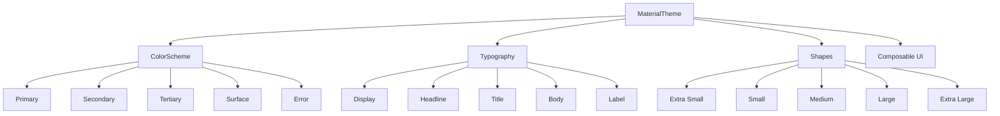
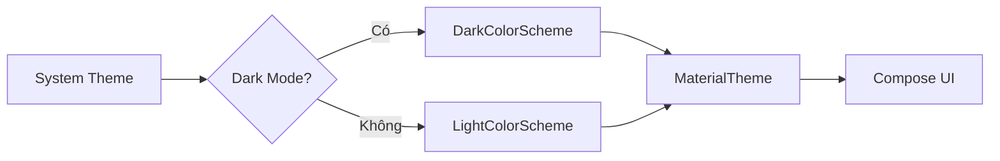
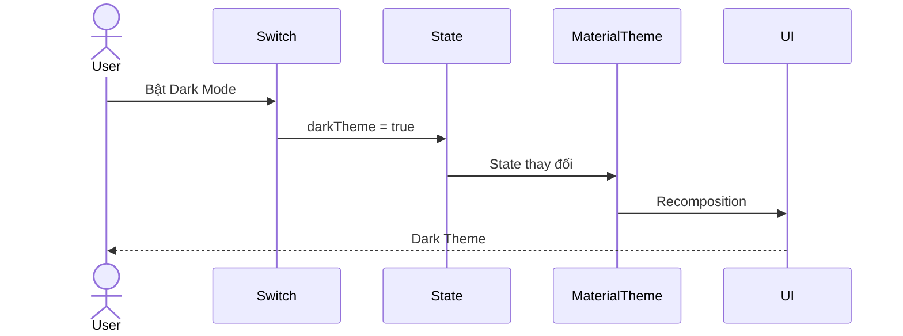
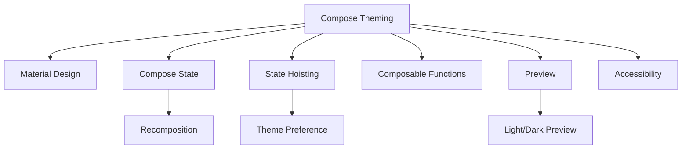

# 034 - Compose Theming

**Học phần:** 02 - App Components and User Interface
**Module:** Module 04 - Interface and Navigation
**Nhóm nội dung:** Jetpack Compose
**Nguồn roadmap:** Interface and Navigation / Jetpack Compose
**Loại bài:** UI
**Thứ tự trong module:** 034
**Thời lượng gợi ý:** 30 phút

---

## 1. Tóm tắt

**Compose Theming** là cách xây dựng một **hệ thống giao diện nhất quán** cho ứng dụng Jetpack Compose thay vì tự đặt màu sắc, font chữ và bo góc riêng cho từng `Composable`.

Trong Material Design 3, theme chủ yếu được cấu thành từ ba hệ thống:

* **Color Scheme** — hệ thống màu.
* **Typography** — hệ thống chữ.
* **Shapes** — hình dạng và độ bo góc.

Các giá trị này được truyền vào `MaterialTheme`. Những Material 3 component nằm bên trong theme có thể tự động sử dụng các giá trị tương ứng. ([Android Developers][1])

```kotlin
MaterialTheme(
    colorScheme = AppColorScheme,
    typography = AppTypography,
    shapes = AppShapes
) {
    App()
}
```

> **Ý tưởng cốt lõi:** Theme là một phần của **design system**, không chỉ đơn giản là chuyển ứng dụng từ nền sáng sang nền tối.

Trong tài liệu Android hiện tại, Material 3 còn bao gồm Material You, Dynamic Color và các mở rộng Material 3 Expressive. ([Android Developers][1])

---

## 2. Mục tiêu học tập

Sau bài này, bạn có thể:

* Giải thích được Compose Theming là gì.
* Hiểu vai trò của `MaterialTheme`.
* Phân biệt:

  * `ColorScheme`
  * `Typography`
  * `Shapes`
* Tạo Light Theme và Dark Theme.
* Đọc màu bằng `MaterialTheme.colorScheme`.
* Đọc kiểu chữ bằng `MaterialTheme.typography`.
* Đọc shape bằng `MaterialTheme.shapes`.
* Hiểu cách **Dynamic Color** hoạt động.
* Thay đổi theme dựa trên state.
* Biết cách tổ chức package `ui.theme`.
* Kiểm tra accessibility và contrast.
* Tạo một màn hình demo có thể đưa vào portfolio.

---

# 3. Compose Theming nằm ở đâu?

Một ứng dụng Compose thường có cấu trúc:

```text
Application
│
└── AppTheme
    │
    ├── ColorScheme
    │   ├── Light
    │   └── Dark
    │
    ├── Typography
    │
    ├── Shapes
    │
    └── App UI
        │
        ├── Scaffold
        ├── Navigation
        ├── Screen
        └── Components
            ├── Button
            ├── Card
            ├── Text
            └── TextField
```

Có thể hình dung:



Android mô tả chính ba subsystem của Material Theme là **color, typography và shapes**. ([Android Developers][1])

### Ảnh minh họa chính thức

Các hình trên lần lượt minh họa:

1. Material 3 theming tổng thể.
2. Dynamic Color.
3. Typography của Material 3.
4. Shape scale của Material 3.

Nguồn: [Material Design 3 trong Jetpack Compose – Android Developers](https://developer.android.com/develop/ui/compose/designsystems/material3?utm_source=chatgpt.com)

---

# 4. `MaterialTheme`

`MaterialTheme` là `Composable` cung cấp các giá trị theme cho cây Compose bên dưới nó.

Cấu trúc cơ bản:

```kotlin
@Composable
fun MyAppTheme(
    content: @Composable () -> Unit
) {
    MaterialTheme(
        colorScheme = LightColorScheme,
        typography = AppTypography,
        shapes = AppShapes,
        content = content
    )
}
```

Sau đó:

```kotlin
@Composable
fun App() {
    MyAppTheme {
        HomeScreen()
    }
}
```

Tất cả Material component bên trong:

```text
MyAppTheme
    ↓
HomeScreen
    ↓
Button
Card
Text
TextField
NavigationBar
...
```

đều có thể lấy design token từ `MaterialTheme`.

---

# 5. Ba thành phần chính của Compose Theme

## 5.1. Color Scheme

Material 3 không khuyến khích kiểu:

```kotlin
Text(
    text = "Hello",
    color = Color(0xFF6750A4)
)
```

ở khắp ứng dụng.

Thay vào đó:

```kotlin
Text(
    text = "Hello",
    color = MaterialTheme.colorScheme.primary
)
```

Lý do là component không cần biết màu cụ thể là tím, xanh hay đỏ.

Nó chỉ cần biết:

> "Đây là nội dung có vai trò `primary`."

Khi thay theme, màu UI sẽ tự thay theo.

Android Material 3 xây dựng color scheme dựa trên các color role và tonal palette thay vì sử dụng một tập màu rời rạc. ([Android Developers][1])

---

## 5.2. Các Color Role quan trọng

Một số role thường gặp:

| Role                 | Công dụng                       |
| -------------------- | ------------------------------- |
| `primary`            | Action/chức năng quan trọng     |
| `onPrimary`          | Nội dung nằm trên `primary`     |
| `primaryContainer`   | Container mang màu primary      |
| `onPrimaryContainer` | Nội dung trên primary container |
| `secondary`          | Thành phần ít nổi bật hơn       |
| `tertiary`           | Accent bổ sung                  |
| `background`         | Nền                             |
| `surface`            | Bề mặt component                |
| `onSurface`          | Nội dung trên surface           |
| `error`              | Trạng thái lỗi                  |
| `onError`            | Nội dung trên error             |

Ví dụ:

```kotlin
Button(
    onClick = {}
) {
    Text("Đăng nhập")
}
```

`Button` Material 3 đã biết nên sử dụng những role thích hợp từ `MaterialTheme`.

---

# 6. Quy tắc `color` và `onColor`

Một nguyên tắc rất quan trọng:

```text
primary
   ↓
onPrimary
```

```text
primaryContainer
   ↓
onPrimaryContainer
```

```text
surface
   ↓
onSurface
```

```text
error
   ↓
onError
```

Ví dụ:

```kotlin
Surface(
    color = MaterialTheme.colorScheme.primary
) {
    Text(
        text = "Hello",
        color = MaterialTheme.colorScheme.onPrimary
    )
}
```

Không nên tùy tiện ghép:

```text
primary
+
onTertiaryContainer
```

vì có thể tạo contrast không phù hợp.

Tài liệu Android cũng khuyến nghị ghép các role tương ứng như `primary` + `onPrimary` và `primaryContainer` + `onPrimaryContainer` để duy trì độ tương phản phù hợp. ([Android Developers][1])

---

# 7. Tạo Light Color Scheme

Thông thường project sẽ có:

```text
ui/
└── theme/
    ├── Color.kt
    ├── Theme.kt
    └── Type.kt
```

Ví dụ `Color.kt`:

```kotlin
package com.example.app.ui.theme

import androidx.compose.ui.graphics.Color

val BluePrimary = Color(0xFF415F91)
val BlueOnPrimary = Color(0xFFFFFFFF)

val BluePrimaryContainer = Color(0xFFD6E3FF)
val BlueOnPrimaryContainer = Color(0xFF001B3E)

val DarkBluePrimary = Color(0xFFAAC7FF)
val DarkBlueOnPrimary = Color(0xFF0A305F)
```

Sau đó:

```kotlin
private val LightColorScheme = lightColorScheme(
    primary = BluePrimary,
    onPrimary = BlueOnPrimary,
    primaryContainer = BluePrimaryContainer,
    onPrimaryContainer = BlueOnPrimaryContainer
)
```

---

# 8. Dark Theme

Tạo thêm:

```kotlin
private val DarkColorScheme = darkColorScheme(
    primary = DarkBluePrimary,
    onPrimary = DarkBlueOnPrimary
)
```

Sau đó kiểm tra system theme:

```kotlin
@Composable
fun MyAppTheme(
    darkTheme: Boolean = isSystemInDarkTheme(),
    content: @Composable () -> Unit
) {
    val colorScheme =
        if (darkTheme) {
            DarkColorScheme
        } else {
            LightColorScheme
        }

    MaterialTheme(
        colorScheme = colorScheme,
        typography = AppTypography,
        shapes = AppShapes,
        content = content
    )
}
```

`isSystemInDarkTheme()` giúp theme của ứng dụng phản ánh thiết lập sáng/tối của hệ thống. ([Android Developers][1])

---

# 9. Luồng Dark Mode



Component không cần tự hỏi:

```text
Điện thoại đang dark mode không?
```

Nó chỉ sử dụng:

```kotlin
MaterialTheme.colorScheme.surface
```

Theme chịu trách nhiệm quyết định `surface` thực tế là màu gì.

---

# 10. Dynamic Color

Một tính năng quan trọng của **Material You** là Dynamic Color.

Android có thể lấy màu từ wallpaper của người dùng và tạo ra color scheme phù hợp.

Ví dụ:

```text
Wallpaper
    ↓
Tonal Palette
    ↓
Dynamic Color Scheme
    ↓
MaterialTheme
    ↓
Application UI
```

Dynamic Color được Android hỗ trợ từ **Android 12 / API 31 trở lên**. ([Android Developers][1])

---

## Code Dynamic Color

```kotlin
@Composable
fun MyAppTheme(
    darkTheme: Boolean = isSystemInDarkTheme(),
    dynamicColor: Boolean = true,
    content: @Composable () -> Unit
) {

    val context = LocalContext.current

    val colorScheme = when {

        dynamicColor &&
            Build.VERSION.SDK_INT >= Build.VERSION_CODES.S &&
            darkTheme -> {
            dynamicDarkColorScheme(context)
        }

        dynamicColor &&
            Build.VERSION.SDK_INT >= Build.VERSION_CODES.S -> {
            dynamicLightColorScheme(context)
        }

        darkTheme -> DarkColorScheme

        else -> LightColorScheme
    }

    MaterialTheme(
        colorScheme = colorScheme,
        typography = AppTypography,
        shapes = AppShapes,
        content = content
    )
}
```

Tài liệu Android sử dụng cùng mô hình:

```text
Android >= 12
       │
       ├── Yes → Dynamic Color
       │
       └── No
            │
            ├── Dark → DarkColorScheme
            └── Light → LightColorScheme
```

([Android Developers][1])

---

# 11. Typography

Theme không chỉ quản lý màu sắc.

Material 3 định nghĩa một **type scale** gồm năm nhóm chính:

```text
Typography
│
├── Display
│   ├── Large
│   ├── Medium
│   └── Small
│
├── Headline
│
├── Title
│
├── Body
│
└── Label
```

Material 3 cung cấp tổng cộng các style như:

```text
displayLarge
displayMedium
displaySmall

headlineLarge
headlineMedium
headlineSmall

titleLarge
titleMedium
titleSmall

bodyLarge
bodyMedium
bodySmall

labelLarge
labelMedium
labelSmall
```

([Android Developers][1])

---

# 12. Định nghĩa Typography

Ví dụ `Type.kt`:

```kotlin
val AppTypography = Typography(

    headlineLarge = TextStyle(
        fontWeight = FontWeight.Bold,
        fontSize = 32.sp,
        lineHeight = 40.sp
    ),

    titleLarge = TextStyle(
        fontWeight = FontWeight.SemiBold,
        fontSize = 22.sp,
        lineHeight = 28.sp
    ),

    bodyLarge = TextStyle(
        fontWeight = FontWeight.Normal,
        fontSize = 16.sp,
        lineHeight = 24.sp
    ),

    labelLarge = TextStyle(
        fontWeight = FontWeight.Medium,
        fontSize = 14.sp,
        lineHeight = 20.sp
    )
)
```

Sau đó:

```kotlin
MaterialTheme(
    typography = AppTypography
) {
    App()
}
```

---

# 13. Sử dụng Typography

Không nên:

```kotlin
Text(
    text = "Profile",
    fontSize = 22.sp,
    fontWeight = FontWeight.Bold
)
```

ở hàng chục màn hình.

Nên:

```kotlin
Text(
    text = "Profile",
    style = MaterialTheme.typography.titleLarge
)
```

### Lợi ích

Nếu designer yêu cầu:

> Tất cả title đổi từ `22sp` thành `24sp`.

Bạn chỉ sửa một nơi:

```kotlin
titleLarge = TextStyle(
    fontSize = 24.sp
)
```

thay vì sửa hàng chục file.

---

# 14. Shapes

Material Theme còn quản lý **độ bo góc của component**.

Material 3 có các mức:

```text
extraSmall
small
medium
large
extraLarge
```

([Android Developers][1])

Ví dụ:

```kotlin
val AppShapes = Shapes(
    extraSmall = RoundedCornerShape(4.dp),
    small = RoundedCornerShape(8.dp),
    medium = RoundedCornerShape(12.dp),
    large = RoundedCornerShape(16.dp),
    extraLarge = RoundedCornerShape(28.dp)
)
```

---

# 15. Sử dụng Shapes

```kotlin
Card(
    shape = MaterialTheme.shapes.medium
) {
    Text("Compose")
}
```

Hoặc:

```kotlin
FloatingActionButton(
    onClick = {},
    shape = MaterialTheme.shapes.large
) {
    Icon(
        imageVector = Icons.Default.Add,
        contentDescription = "Thêm"
    )
}
```

Android cũng cho phép custom shape ở cấp toàn ứng dụng hoặc từng component riêng biệt. ([Android Developers][1])

---

# 16. Design Token

Một cách hiểu quan trọng khi làm dự án lớn:

Theme thực chất cung cấp **design token**.

Ví dụ:

```text
               Design System
                    │
          ┌─────────┼─────────┐
          ↓         ↓         ↓
        Color     Type      Shape
          │         │         │
          └─────────┼─────────┘
                    ↓
               MaterialTheme
                    ↓
              UI Components
```

Thay vì component biết:

```text
Button = #6750A4
```

component biết:

```text
Button = primary
```

Giá trị thực tế của `primary` do theme quyết định.

---

# 17. Ví dụ Component tốt

```kotlin
@Composable
fun ProfileCard(
    name: String,
    description: String,
    modifier: Modifier = Modifier
) {
    Card(
        modifier = modifier,
        shape = MaterialTheme.shapes.medium
    ) {

        Column(
            modifier = Modifier.padding(16.dp)
        ) {

            Text(
                text = name,
                style = MaterialTheme.typography.titleLarge,
                color = MaterialTheme.colorScheme.onSurface
            )

            Spacer(
                modifier = Modifier.height(4.dp)
            )

            Text(
                text = description,
                style = MaterialTheme.typography.bodyMedium,
                color = MaterialTheme.colorScheme.onSurfaceVariant
            )
        }
    }
}
```

Component này không biết:

* Dark mode hay Light mode.
* Primary là xanh hay đỏ.
* Font cụ thể của app.
* Corner radius thực tế.

Nó chỉ biết **semantic role**.

Đây là một component có khả năng tái sử dụng tốt hơn.

---

# 18. Ví dụ không tốt

```kotlin
Card(
    colors = CardDefaults.cardColors(
        containerColor = Color.White
    ),
    shape = RoundedCornerShape(13.dp)
) {

    Text(
        text = "Compose",
        color = Color.Black,
        fontSize = 19.sp
    )
}
```

### Vấn đề

```text
Color.White
Color.Black
19.sp
13.dp
```

đều là hard-code.

Khi chuyển sang dark theme:

```text
Color.White
   ↓
vẫn trắng
```

UI có thể không còn phù hợp.

---

# 19. Theme và State

Compose là state-driven.

Theme hoàn toàn có thể được xem là state:

```text
Theme State
     ↓
MaterialTheme
     ↓
Composable Tree
```

Khi state thay đổi:

```text
Light
  ↓
Dark
```

Compose recomposes những phần UI phụ thuộc vào theme.

---

# 20. Ví dụ Toggle Theme

```kotlin
@Composable
fun ThemeDemoApp() {

    var darkTheme by rememberSaveable {
        mutableStateOf(false)
    }

    MyAppTheme(
        darkTheme = darkTheme
    ) {

        DemoScreen(
            darkTheme = darkTheme,
            onThemeChange = {
                darkTheme = it
            }
        )
    }
}
```

Screen:

```kotlin
@Composable
fun DemoScreen(
    darkTheme: Boolean,
    onThemeChange: (Boolean) -> Unit
) {

    Scaffold { paddingValues ->

        Column(
            modifier = Modifier
                .fillMaxSize()
                .padding(paddingValues)
                .padding(24.dp)
        ) {

            Text(
                text = "Compose Theming",
                style = MaterialTheme.typography.headlineMedium
            )

            Spacer(
                modifier = Modifier.height(16.dp)
            )

            Row(
                verticalAlignment = Alignment.CenterVertically
            ) {

                Text(
                    text = "Dark Mode",
                    modifier = Modifier.weight(1f)
                )

                Switch(
                    checked = darkTheme,
                    onCheckedChange = onThemeChange
                )
            }
        }
    }
}
```

---

# 21. Luồng recomposition khi đổi Theme



Không cần gọi:

```text
refresh()
reload()
invalidate()
```

Compose tự theo dõi state dependency.

---

# 22. State Hoisting

Không nên để mọi component tự giữ state theme.

Ví dụ không tốt:

```text
HomeScreen → darkTheme
SettingsScreen → darkTheme
ProfileScreen → darkTheme
```

Có thể dẫn tới các state khác nhau.

Nên:

```text
               App State
                  │
            ThemePreference
                  │
                  ↓
              AppTheme
                  │
         ┌────────┼────────┐
         ↓        ↓        ↓
       Home    Settings  Profile
```

Theme state nên nằm ở cấp đủ cao.

---

# 23. Cấu trúc project đề xuất

```text
com.example.app
│
├── MainActivity.kt
│
├── App.kt
│
├── data/
│
├── domain/
│
└── ui/
    │
    ├── screen/
    │
    ├── component/
    │
    └── theme/
        ├── Color.kt
        ├── Theme.kt
        ├── Type.kt
        └── Shape.kt
```

Ví dụ:

```text
Color.kt
    ↓
LightColorScheme
DarkColorScheme

Type.kt
    ↓
AppTypography

Shape.kt
    ↓
AppShapes

        ↓

Theme.kt
    ↓
AppTheme()
```

---

# 24. Demo hoàn chỉnh

## `Color.kt`

```kotlin
val Blue = Color(0xFF415F91)
val OnBlue = Color.White

val BlueContainer = Color(0xFFD6E3FF)
val OnBlueContainer = Color(0xFF001B3E)

val DarkBlue = Color(0xFFAAC7FF)
val DarkOnBlue = Color(0xFF0A305F)
```

---

## `Shape.kt`

```kotlin
val AppShapes = Shapes(
    small = RoundedCornerShape(8.dp),
    medium = RoundedCornerShape(16.dp),
    large = RoundedCornerShape(24.dp)
)
```

---

## `Type.kt`

```kotlin
val AppTypography = Typography(

    headlineMedium = TextStyle(
        fontWeight = FontWeight.Bold,
        fontSize = 28.sp,
        lineHeight = 36.sp
    ),

    bodyLarge = TextStyle(
        fontWeight = FontWeight.Normal,
        fontSize = 16.sp,
        lineHeight = 24.sp
    )
)
```

---

## `Theme.kt`

```kotlin
private val LightColorScheme = lightColorScheme(
    primary = Blue,
    onPrimary = OnBlue,
    primaryContainer = BlueContainer,
    onPrimaryContainer = OnBlueContainer
)

private val DarkColorScheme = darkColorScheme(
    primary = DarkBlue,
    onPrimary = DarkOnBlue
)

@Composable
fun AppTheme(
    darkTheme: Boolean = isSystemInDarkTheme(),
    dynamicColor: Boolean = true,
    content: @Composable () -> Unit
) {

    val context = LocalContext.current

    val colorScheme = when {

        dynamicColor &&
            Build.VERSION.SDK_INT >= Build.VERSION_CODES.S &&
            darkTheme ->
            dynamicDarkColorScheme(context)

        dynamicColor &&
            Build.VERSION.SDK_INT >= Build.VERSION_CODES.S ->
            dynamicLightColorScheme(context)

        darkTheme ->
            DarkColorScheme

        else ->
            LightColorScheme
    }

    MaterialTheme(
        colorScheme = colorScheme,
        typography = AppTypography,
        shapes = AppShapes,
        content = content
    )
}
```

---

# 25. Thực hành 30 phút

## Bài thực hành: Theme Preview App

Tạo một màn hình gồm:

```text
┌────────────────────────────┐
│ Compose Theming            │
│                            │
│ Dark Mode            [●]   │
│                            │
│ ┌────────────────────────┐ │
│ │ Material Card          │ │
│ │                        │ │
│ │ Theme demo             │ │
│ │ Compose Material 3     │ │
│ └────────────────────────┘ │
│                            │
│       [ Primary Button ]   │
└────────────────────────────┘
```

### Yêu cầu

1. Có `AppTheme`.
2. Có Light Color Scheme.
3. Có Dark Color Scheme.
4. Có Typography.
5. Có Shapes.
6. Có switch đổi theme.
7. Button dùng Material 3.
8. Card dùng theme.
9. Không hard-code màu trong screen.

---

# 26. Bài tập

Tạo một **Profile Card** có:

* Avatar.
* Tên.
* Email.
* Button `Follow`.
* Card.
* Light theme.
* Dark theme.

### Không được

```kotlin
Color.White
Color.Black
```

trực tiếp trong component.

### Nên sử dụng

```kotlin
MaterialTheme.colorScheme.surface

MaterialTheme.colorScheme.onSurface

MaterialTheme.colorScheme.primary

MaterialTheme.typography.titleLarge

MaterialTheme.typography.bodyMedium

MaterialTheme.shapes.medium
```

---

# 27. Bài tập nâng cao

Thêm ba chế độ:

```text
Theme Mode
│
├── System
├── Light
└── Dark
```

Model:

```kotlin
enum class ThemeMode {
    SYSTEM,
    LIGHT,
    DARK
}
```

Sau đó xác định:

```kotlin
val darkTheme = when (themeMode) {

    ThemeMode.SYSTEM ->
        isSystemInDarkTheme()

    ThemeMode.LIGHT ->
        false

    ThemeMode.DARK ->
        true
}
```

---

# 28. Lifecycle

Theme UI thường không có lifecycle riêng nhưng **state xác định theme** có liên quan trực tiếp tới lifecycle.

Ví dụ:

```kotlin
var darkMode by remember {
    mutableStateOf(false)
}
```

state này có thể bị mất khi Activity được recreate.

Để demo đơn giản:

```kotlin
rememberSaveable
```

có thể phù hợp hơn.

Trong production, nếu đây là preference của người dùng, nên lưu nó ở tầng persistence như:

```text
Settings UI
    ↓
ViewModel
    ↓
Repository
    ↓
DataStore
```

Sau đó:

```text
DataStore
    ↓
Flow
    ↓
ViewModel
    ↓
UI State
    ↓
MaterialTheme
```

---

# 29. Accessibility

Theme không chỉ để ứng dụng đẹp.

Nó còn ảnh hưởng:

* Khả năng đọc text.
* Color contrast.
* Dark mode.
* Người có thị lực kém.
* Khả năng nhận biết trạng thái component.

Material 3 thiết kế hệ thống tonal palette và color role nhằm cung cấp nền tảng contrast/accessibility tốt, nhưng khi tự custom component, developer vẫn cần ghép đúng các color role. ([Android Developers][1])

### Kiểm tra

Không chỉ test:

```text
"Đẹp chưa?"
```

mà cần hỏi:

```text
Text có đọc được không?
        ↓
Contrast đủ không?
        ↓
Dark Mode còn rõ không?
        ↓
Disabled state phân biệt được không?
```

---

# 30. Testing

Theme nên được kiểm tra ít nhất ở:

| Trường hợp         | Cần kiểm tra                  |
| ------------------ | ----------------------------- |
| Light              | UI sáng                       |
| Dark               | UI tối                        |
| Dynamic Color      | Android 12+                   |
| Font scale lớn     | Text không vỡ layout          |
| Button disabled    | Vẫn nhận biết được            |
| Error state        | Contrast phù hợp              |
| Rotate             | Theme preference có giữ không |
| Process recreation | Preference có phục hồi không  |

---

# 31. Preview nhiều Theme

Compose Preview rất hữu ích cho theming.

```kotlin
@Preview(
    name = "Light Theme",
    showBackground = true
)
@Composable
fun HomeLightPreview() {

    AppTheme(
        darkTheme = false,
        dynamicColor = false
    ) {
        HomeScreen()
    }
}
```

Dark:

```kotlin
@Preview(
    name = "Dark Theme",
    showBackground = true
)
@Composable
fun HomeDarkPreview() {

    AppTheme(
        darkTheme = true,
        dynamicColor = false
    ) {
        HomeScreen()
    }
}
```

Bạn có thể so sánh:

```text
┌─────────────┐   ┌─────────────┐
│ Light       │   │ Dark        │
│             │   │             │
│   Screen    │   │   Screen    │
│             │   │             │
└─────────────┘   └─────────────┘
```

---

# 32. Những lỗi thường gặp

## ❌ 1. Hard-code Color

```kotlin
Text(
    color = Color.Black
)
```

### Nên

```kotlin
Text(
    color = MaterialTheme.colorScheme.onSurface
)
```

---

## ❌ 2. Hard-code TextStyle khắp nơi

```kotlin
fontSize = 16.sp
fontWeight = FontWeight.Bold
```

### Nên

```kotlin
style = MaterialTheme.typography.titleMedium
```

---

## ❌ 3. Mỗi component một kiểu bo góc

```text
Card A → 9 dp
Card B → 13 dp
Card C → 17 dp
```

Không có hệ thống.

### Nên

```text
small
medium
large
```

---

## ❌ 4. Chỉ test Light Mode

Ứng dụng:

```text
Light Mode
    ↓
OK
```

nhưng:

```text
Dark Mode
    ↓
text biến mất
```

---

## ❌ 5. Component tự quyết định theme

Không nên:

```kotlin
if (darkTheme) {
    Color.Black
} else {
    Color.White
}
```

ở từng component.

Nên để `MaterialTheme` xử lý.

---

# 33. Theme tốt mang lại gì?

```text
                    Compose Theme
                         │
       ┌─────────────────┼──────────────────┐
       ↓                 ↓                  ↓
    Consistency      Maintainability    Accessibility
       │                 │                  │
       ↓                 ↓                  ↓
 UI nhất quán       sửa một nơi        contrast tốt
                         │
                         ↓
                   Scale dự án tốt
```

Một ứng dụng có 100 màn hình nhưng sử dụng design system tốt thường dễ bảo trì hơn nhiều so với một ứng dụng có 10 màn hình nhưng hard-code style khắp nơi.

---

# 34. Liên hệ với các chủ đề Compose khác

Compose Theming kết nối với:



Đặc biệt:

```text
Theme State thay đổi
        ↓
Recomposition
        ↓
MaterialTheme mới
        ↓
Component nhận design token mới
        ↓
UI thay đổi
```

---

# 35. Checklist hoàn thành

## Kiến thức

* [ ] Giải thích được Compose Theming.
* [ ] Biết `MaterialTheme` làm gì.
* [ ] Biết `ColorScheme`.
* [ ] Biết `Typography`.
* [ ] Biết `Shapes`.
* [ ] Hiểu Light/Dark Theme.
* [ ] Hiểu Dynamic Color.
* [ ] Biết Dynamic Color yêu cầu Android 12+.
* [ ] Hiểu design token.
* [ ] Hiểu theme có thể thay đổi theo state.

## Code

* [ ] Có `Color.kt`.
* [ ] Có `Type.kt`.
* [ ] Có `Theme.kt`.
* [ ] Có Light Color Scheme.
* [ ] Có Dark Color Scheme.
* [ ] Có custom Typography.
* [ ] Có custom Shapes.
* [ ] Component sử dụng `MaterialTheme`.
* [ ] Không hard-code màu không cần thiết.

## Quality

* [ ] Test Light Mode.
* [ ] Test Dark Mode.
* [ ] Test font scale.
* [ ] Test contrast.
* [ ] Test rotate.
* [ ] Test theme preference.
* [ ] Preview ít nhất hai theme.

---

# 36. Artifact cho Portfolio

Sau bài này có thể tạo mini-project:

```text
Compose Theme Playground
```

### Tính năng

* Light mode.
* Dark mode.
* System mode.
* Dynamic Color.
* Card.
* Button.
* Typography showcase.
* Shape showcase.

README có thể trình bày:

```text
Compose Theme Playground
│
├── Material 3
├── Custom Color Scheme
├── Light/Dark Mode
├── Dynamic Color
├── Typography
├── Shapes
└── State-driven Theme Switching
```

Screenshot nên có:

```text
Light Theme    |    Dark Theme    |    Dynamic Theme
```

Đây là artifact nhỏ nhưng thể hiện khá rõ kiến thức về **Compose + Material 3 + State + Design System**.

---

# 37. Ghi chú Production

Khi triển khai Compose Theming trong ứng dụng thật, hãy kiểm tra:

### Theme

```text
Light
Dark
System
Dynamic
```

### State

Theme preference có được lưu không?

```text
UI
 ↓
ViewModel
 ↓
Repository
 ↓
DataStore
```

### Lifecycle

```text
Rotate
Background
Process death
Restore
```

theme có trở lại đúng trạng thái không?

### Accessibility

* Contrast.
* Font scale.
* Disabled state.
* Error state.
* Selected state.

### Maintainability

Tránh:

```text
Screen
  ↓
Hard-coded color
```

Ưu tiên:

```text
Design System
      ↓
MaterialTheme
      ↓
Reusable Component
      ↓
Screen
```

---

# 38. Ghi nhớ nhanh

```text
COMPOSE THEMING
      │
      └── MaterialTheme
             │
       ┌─────┼─────┐
       ↓     ↓     ↓
     Color  Type  Shape
       │
       ├── Light
       ├── Dark
       └── Dynamic
              │
              ↓
       Material Components
              │
              ↓
       UI nhất quán
```

> **Công thức cần nhớ**

```kotlin
MaterialTheme(
    colorScheme = ...,
    typography = ...,
    shapes = ...
) {
    App()
}
```

Và trong component:

```kotlin
MaterialTheme.colorScheme.primary

MaterialTheme.typography.titleLarge

MaterialTheme.shapes.medium
```

Nếu nắm chắc ba dòng trên và hiểu **tại sao không nên hard-code style**, bạn đã nắm được phần cốt lõi của **Compose Theming**.

---

## 39. Tài liệu tham khảo

Tài liệu Android Developers hiện tại xác định Material 3 theme gồm **color scheme, typography và shapes**; hỗ trợ Light/Dark Theme, Dynamic Color, Material You và các mở rộng Material 3 Expressive. ([Android Developers][1])

[Material Design 3 in Compose – Android Developers](https://developer.android.com/develop/ui/compose/designsystems/material3?utm_source=chatgpt.com)

[Codelab: Theming in Compose with Material 3](https://developer.android.com/codelabs/jetpack-compose-theming?utm_source=chatgpt.com)

[1]: https://developer.android.com/develop/ui/compose/designsystems/material3 "Material Design 3 in Compose  |  Jetpack Compose  |  Android Developers"
