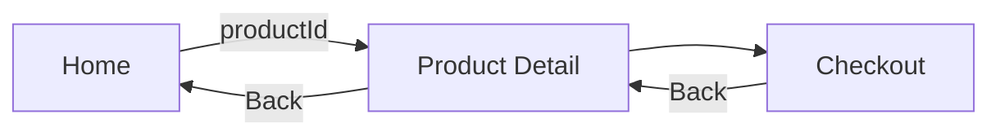
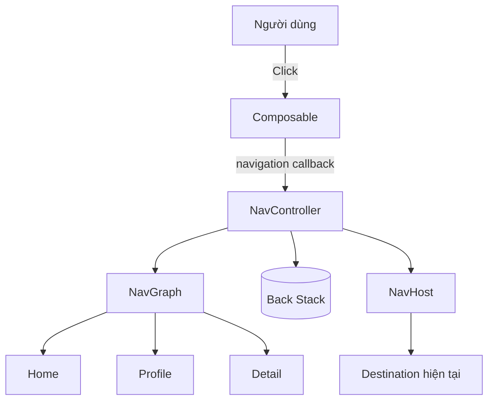
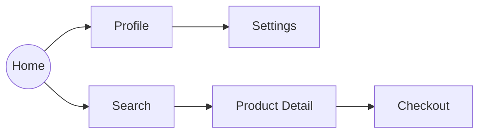
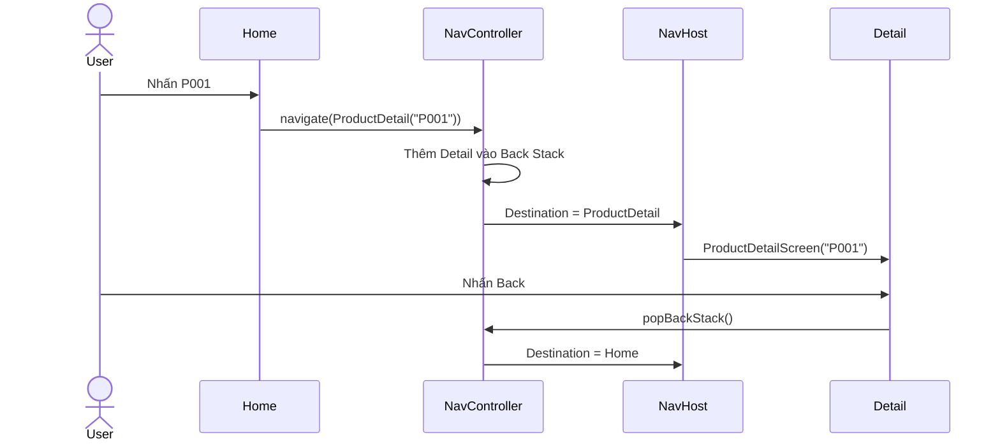
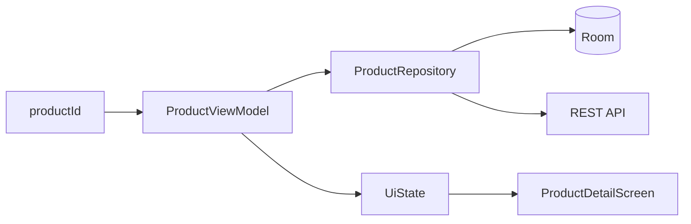
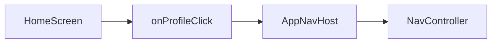
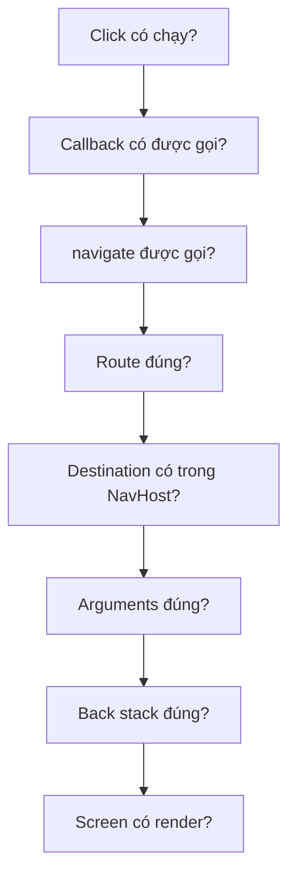
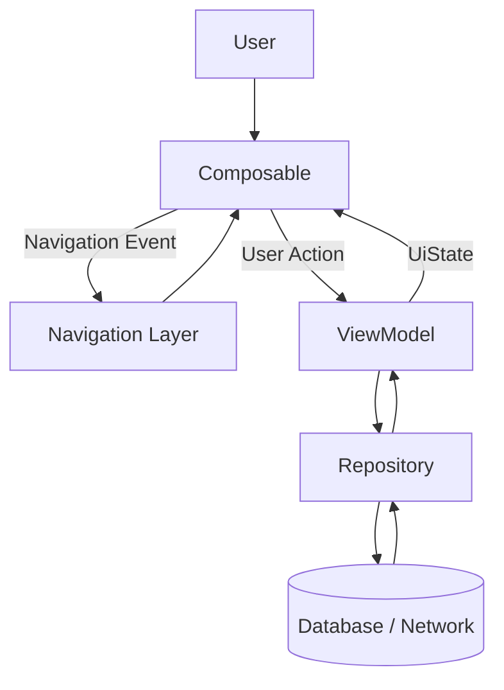
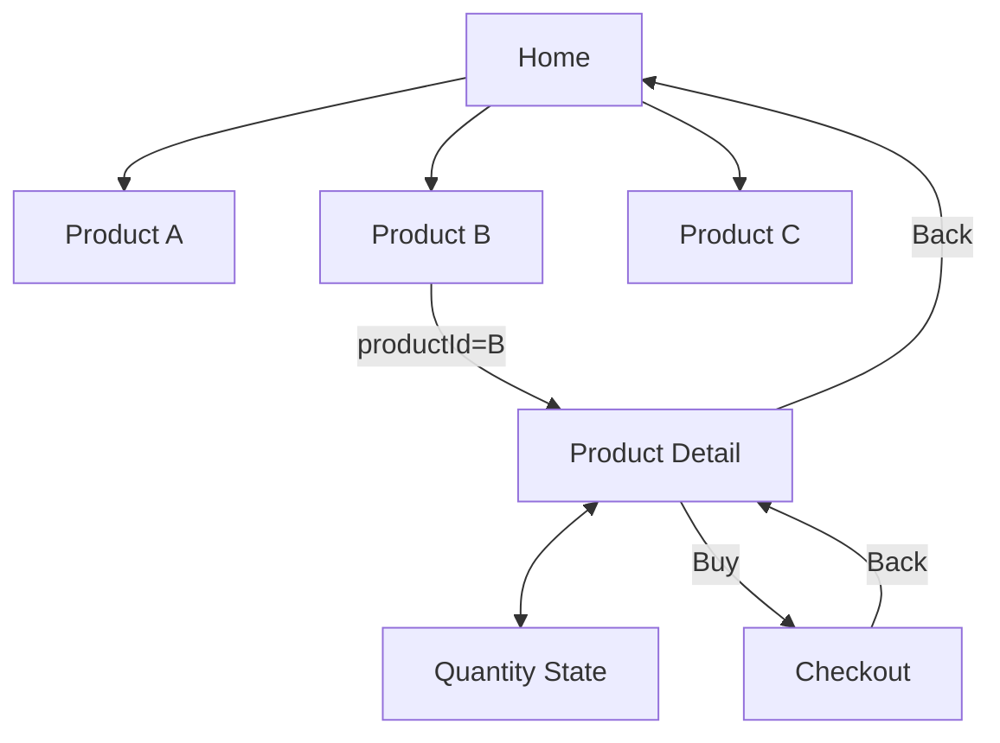
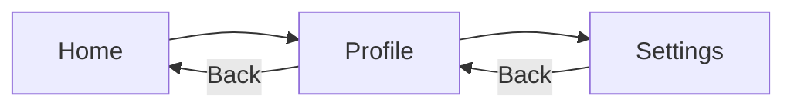

# 035 - Navigation Components

**Học phần:** 02 - App Components and User Interface
**Module:** Module 04 - Interface and Navigation
**Nhóm nội dung:** Navigation
**Nguồn roadmap:** Interface and Navigation / Navigation
**Loại bài:** UI
**Thứ tự trong module:** 035
**Thời lượng gợi ý:** 30 phút

---

## 1. Tóm tắt

**Navigation Component** là bộ thư viện của Android Jetpack giúp quản lý việc **di chuyển giữa các màn hình (destination)** trong ứng dụng.

Thay vì tự viết toàn bộ logic như:

* Mở màn hình nào?
* Quay lại màn hình nào?
* Truyền `id` sang màn hình tiếp theo ra sao?
* Deep link phải mở đúng màn hình nào?
* Back stack hiện đang chứa những màn hình nào?

Navigation Component cung cấp một hệ thống thống nhất gồm:

* `NavController`
* `NavHost`
* `NavGraph`
* `Destination`
* `Route`
* Back stack
* Navigation arguments
* Deep links

Trong ứng dụng Jetpack Compose thuần, Android khuyến nghị sử dụng **Navigation Compose**. Với ứng dụng Views hoặc đang chuyển dần từ Fragment sang Compose, Fragment Navigation vẫn phù hợp cho đến khi quá trình migration hoàn tất. ([Android Developers][1])

> **Ý tưởng quan trọng:** Navigation không chỉ là `"mở Screen B"`. Nó là việc quản lý **luồng di chuyển của người dùng và lịch sử các màn hình đã đi qua**.

---

## 2. Mục tiêu học tập

Sau bài này, bạn có thể:

* Giải thích được Navigation Component là gì.
* Phân biệt `NavController`, `NavHost`, `NavGraph`, `Destination` và `Route`.
* Tạo navigation đơn giản bằng Jetpack Compose.
* Điều hướng từ màn hình A → B.
* Truyền argument giữa các destination.
* Hiểu cách Navigation quản lý **back stack**.
* Quay lại destination trước bằng `popBackStack()`.
* Biết vai trò của deep link.
* Biết cách thiết kế navigation để dễ test.
* Nhận biết các lỗi navigation thường gặp trong production.

---

# 3. Navigation Component giải quyết vấn đề gì?

Giả sử ứng dụng bán hàng có ba màn hình:

```text
Home
  ↓
Product Detail
  ↓
Checkout
```

Nếu tự quản lý navigation, ứng dụng phải tự xử lý:

```text
Người dùng nhấn sản phẩm
        ↓
Mở Product Detail
        ↓
Truyền productId
        ↓
Người dùng nhấn Buy
        ↓
Mở Checkout
        ↓
Nhấn Back
        ↓
Quay lại Product Detail
        ↓
Nhấn Back
        ↓
Quay lại Home
```

Navigation Component gom logic này vào một hệ thống chung.



---

# 4. Các thành phần chính

Android hiện mô tả Navigation bằng các khái niệm cốt lõi như **Host, Graph, Controller, Destination và Route**. ([Android Developers][1])

| Thành phần      | Vai trò                                                       |
| --------------- | ------------------------------------------------------------- |
| `NavController` | Điều khiển việc chuyển destination và quản lý back stack      |
| `NavHost`       | Vùng UI hiển thị destination hiện tại                         |
| `NavGraph`      | Mô tả các destination có trong luồng navigation               |
| `Destination`   | Một màn hình hoặc điểm đến                                    |
| `Route`         | Định danh destination và dữ liệu cần để đi tới destination đó |
| Back stack      | Lịch sử các destination người dùng đã đi qua                  |


*Minh họa navigation graph và các destination từ tài liệu Android Developers.*

---

# 5. Mối quan hệ giữa NavController, NavGraph và NavHost

Có thể hình dung kiến trúc như sau:



Luồng hoạt động:

```text
User click
    ↓
UI phát event
    ↓
NavController.navigate(...)
    ↓
Navigation tìm Route trong NavGraph
    ↓
Cập nhật Back Stack
    ↓
NavHost
    ↓
Hiển thị Composable tương ứng
```

`NavController` chính là API trung tâm của Navigation. Trong Compose, controller thường được tạo bằng `rememberNavController()`. Mỗi `NavHost` có `NavController` tương ứng. ([Android Developers][2])

---

# 6. NavController

Trong Jetpack Compose:

```kotlin
val navController = rememberNavController()
```

Ví dụ:

```kotlin
@Composable
fun MyApp() {

    val navController = rememberNavController()

    AppNavHost(
        navController = navController
    )
}
```

`NavController` có thể:

```text
navigate()
    → đi tới destination

popBackStack()
    → quay về destination trước

navigateUp()
    → điều hướng lên cấp cha

Deep Link
    → mở destination từ bên ngoài app
```

Ví dụ:

```kotlin
navController.navigate(Profile)
```

Quay lại:

```kotlin
navController.popBackStack()
```

Navigation tự thêm destination mới vào back stack khi `navigate()` và loại bỏ destination khi `popBackStack()` hoặc khi người dùng thực hiện hành động Back tương ứng. ([Android Developers][3])

---

# 7. NavHost

`NavHost` là vùng chứa màn hình hiện tại.

Ví dụ:

```kotlin
NavHost(
    navController = navController,
    startDestination = Home
) {

    composable<Home> {
        HomeScreen()
    }

    composable<Profile> {
        ProfileScreen()
    }
}
```

Có thể hình dung:

```text
┌─────────────────────────────┐
│          Activity           │
│                             │
│  ┌───────────────────────┐  │
│  │        NavHost        │  │
│  │                       │  │
│  │     HomeScreen        │  │
│  │          ↓            │  │
│  │    ProfileScreen      │  │
│  │          ↓            │  │
│  │     DetailScreen      │  │
│  │                       │  │
│  └───────────────────────┘  │
│                             │
└─────────────────────────────┘
```

`NavHost` không hiển thị tất cả màn hình cùng lúc.

Nó hiển thị **destination hiện tại** dựa trên trạng thái của `NavController`.

---

# 8. NavGraph

Navigation Graph mô tả cấu trúc navigation của ứng dụng.

Ví dụ:



Graph giúp developer dễ trả lời:

> Người dùng có thể đi từ màn hình này đến những màn hình nào?

Với Compose, graph thường được khai báo ngay trong `NavHost` bằng Kotlin DSL. Android hiện khuyến khích route dạng object/class có thể serialize cho Navigation Compose. ([Android Developers][4])

---

# 9. Destination

Một **Destination** thường tương ứng với một màn hình.

Ví dụ:

```text
Home
Profile
Settings
ProductDetail
Checkout
```

Trong Compose:

```kotlin
composable<Home> {
    HomeScreen()
}
```

Ở đây:

```text
Home
 ↓
Route
 ↓
Destination
 ↓
HomeScreen()
```

---

# 10. Route

Route xác định **đích mà ứng dụng muốn điều hướng tới** và có thể chứa dữ liệu cần thiết cho destination.

Ngày trước bạn thường gặp:

```kotlin
composable("profile")
```

hoặc:

```kotlin
navController.navigate("profile/$userId")
```

Cách này vẫn giúp hiểu nguyên lý nhưng dễ xuất hiện lỗi:

```text
"profile"
"profiles"
"profile/"
"profile/{id}"
```

Chỉ một lỗi chính tả cũng có thể làm navigation không hoạt động.

---

# 11. Type-safe Navigation

Navigation Compose hiện hỗ trợ **type-safe routes** bằng Kotlin Serialization từ Navigation 2.8.0 trở lên. Android khuyến nghị dùng object cho route không có argument và class/data class cho route có argument. ([Android Developers][5])

Ví dụ:

```kotlin
import kotlinx.serialization.Serializable

@Serializable
data object Home

@Serializable
data class ProductDetail(
    val productId: String
)
```

Không còn cần:

```kotlin
"product/$productId"
```

Thay vào đó:

```kotlin
navController.navigate(
    ProductDetail(productId = "P001")
)
```

### Ưu điểm

```text
String Route

"product/P001"
       ↓
Có thể sai chính tả
       ↓
Lỗi runtime
```

so với:

```text
Type-safe Route

ProductDetail("P001")
       ↓
Compiler kiểm tra type
       ↓
An toàn hơn
```

---

# 12. Cài đặt Navigation Compose

Theo tài liệu Android Developers hiện tại, Navigation Jetpack đang dùng nhánh `2.9.x`; tài liệu chính thức hiện liệt kê `2.9.8`. Khi làm dự án thực tế nên đặt version trong Version Catalog thay vì rải version trực tiếp trong nhiều module. ([Android Developers][1])

Ví dụ:

```kotlin
dependencies {
    implementation("androidx.navigation:navigation-compose:2.9.8")
}
```

Nếu sử dụng type-safe route, cần Kotlin Serialization.

```kotlin
plugins {
    kotlin("plugin.serialization")
}
```

Và:

```kotlin
dependencies {
    implementation(
        "org.jetbrains.kotlinx:kotlinx-serialization-json:1.7.3"
    )
}
```

> Version cụ thể nên được kiểm tra lại khi tạo project mới vì thư viện Jetpack tiếp tục được cập nhật.

---

# 13. Ví dụ hoàn chỉnh: Home → Product Detail

## Bước 1 — Khai báo Route

```kotlin
import kotlinx.serialization.Serializable

@Serializable
data object Home

@Serializable
data class ProductDetail(
    val productId: String
)
```

---

## Bước 2 — HomeScreen

Không truyền thẳng `NavController` vào `HomeScreen`.

```kotlin
@Composable
fun HomeScreen(
    onProductClick: (String) -> Unit
) {

    Column {

        Text(
            text = "Danh sách sản phẩm"
        )

        Button(
            onClick = {
                onProductClick("P001")
            }
        ) {
            Text("Xem sản phẩm P001")
        }
    }
}
```

Đây là cách thiết kế tốt hơn:

```text
HomeScreen
   │
   └── chỉ biết:
       "user vừa click sản phẩm"

HomeScreen
   ✕ không cần biết NavController
   ✕ không cần biết route tiếp theo
```

Android cũng khuyến nghị không truyền trực tiếp `NavController` vào từng screen composable; thay vào đó truyền callback navigation để màn hình dễ test độc lập hơn. ([Android Developers][6])

---

# 14. ProductDetailScreen

```kotlin
@Composable
fun ProductDetailScreen(
    productId: String,
    onBack: () -> Unit
) {

    Column {

        Text(
            text = "Product ID: $productId"
        )

        Button(
            onClick = onBack
        ) {
            Text("Quay lại")
        }
    }
}
```

---

# 15. Tạo AppNavHost

```kotlin
@Composable
fun AppNavHost(
    navController: NavHostController
) {

    NavHost(
        navController = navController,
        startDestination = Home
    ) {

        composable<Home> {

            HomeScreen(
                onProductClick = { productId ->

                    navController.navigate(
                        ProductDetail(
                            productId = productId
                        )
                    )
                }
            )
        }

        composable<ProductDetail> { backStackEntry ->

            val route =
                backStackEntry.toRoute<ProductDetail>()

            ProductDetailScreen(
                productId = route.productId,
                onBack = {
                    navController.popBackStack()
                }
            )
        }
    }
}
```

`toRoute<T>()` tái tạo route type-safe từ argument của `NavBackStackEntry`. ([Android Developers][5])

---

# 16. App chính

```kotlin
@Composable
fun NavigationExampleApp() {

    val navController = rememberNavController()

    AppNavHost(
        navController = navController
    )
}
```

---

# 17. Luồng chạy của ví dụ



---

# 18. Back Stack

Back stack là một trong những khái niệm quan trọng nhất của Navigation.

Ban đầu:

```text
┌──────────────┐
│     Home     │ ← top
└──────────────┘
```

Người dùng mở Profile:

```text
┌──────────────┐
│   Profile    │ ← top
├──────────────┤
│     Home     │
└──────────────┘
```

Mở Settings:

```text
┌──────────────┐
│   Settings   │ ← top
├──────────────┤
│   Profile    │
├──────────────┤
│     Home     │
└──────────────┘
```

Nhấn Back:

```text
popBackStack()
```

Kết quả:

```text
┌──────────────┐
│   Profile    │ ← top
├──────────────┤
│     Home     │
└──────────────┘
```

---

# 19. Lỗi duplicate destination

Giả sử người dùng nhấn nút Home nhiều lần:

```text
Home
 ↓
Home
 ↓
Home
 ↓
Home
```

Back stack có thể trở thành:

```text
Home
Home
Home
Home
```

Sau đó user phải Back nhiều lần.

Có thể dùng:

```kotlin
navController.navigate(Home) {
    launchSingleTop = true
}
```

Ý tưởng:

```text
Nếu Home đã ở top
        ↓
Không tạo thêm Home mới
```

---

# 20. `popUpTo`

Ví dụ flow đăng nhập:

```text
Login
  ↓
OTP
  ↓
Home
```

Sau khi login thành công, thường không muốn:

```text
Home
 ↓ Back
OTP
 ↓ Back
Login
```

Có thể loại login flow khỏi back stack khi đi tới Home.

Ý tưởng:

```text
Login
OTP
 │
 └── login thành công
        ↓
      Home
```

Thay vì:

```text
Home
OTP
Login
```

back stack cuối cùng chỉ còn:

```text
Home
```

Đây là trường hợp `popUpTo` đặc biệt hữu ích.

---

# 21. Navigation Argument

Destination thường cần một số dữ liệu.

Ví dụ:

```text
ProductList
     │
     │ productId = "P001"
     ↓
ProductDetail
```

Route:

```kotlin
@Serializable
data class ProductDetail(
    val productId: String
)
```

Navigate:

```kotlin
navController.navigate(
    ProductDetail(
        productId = "P001"
    )
)
```

Nhận dữ liệu:

```kotlin
val detail =
    backStackEntry.toRoute<ProductDetail>()

val productId =
    detail.productId
```

---

# 22. Không nên truyền cả object lớn qua Navigation

Không nên làm kiểu:

```text
Product {
    name
    description
    image
    price
    reviews
    ...
}
```

rồi truyền toàn bộ object sang screen tiếp theo nếu screen có thể tải dữ liệu từ repository.

Thiết kế tốt hơn:

```text
ProductList
     │
     │ productId = "P001"
     ↓
ProductDetail
     │
     │
     ↓
ViewModel
     │
     ↓
Repository
     │
     ↓
Product
```

Ví dụ:

```kotlin
@Serializable
data class ProductDetail(
    val productId: String
)
```

Sau đó:

```kotlin
repository.getProduct(productId)
```

Cách này giúp navigation chỉ đảm nhiệm **định danh destination**, thay vì trở thành nơi vận chuyển toàn bộ state của ứng dụng.

---

# 23. Navigation + ViewModel

Trong ứng dụng production:



Ví dụ ViewModel có thể đọc argument trực tiếp từ `SavedStateHandle`:

```kotlin
class ProductViewModel(
    savedStateHandle: SavedStateHandle
) : ViewModel() {

    private val route =
        savedStateHandle.toRoute<ProductDetail>()

    private val productId =
        route.productId
}
```

Android hỗ trợ `SavedStateHandle.toRoute<T>()` cho type-safe navigation. ([Android Developers][5])

---

# 24. Navigation không phải UI State

Đây là điểm rất dễ nhầm.

Navigation state:

```text
User đang ở màn hình nào?
Back stack gồm những màn hình nào?
```

UI state:

```text
Loading?
Error?
Product nào?
TextField đang chứa gì?
Favorite hay chưa?
```

Ví dụ:

```text
NavController
     ↓
ProductDetail Destination
     ↓
ViewModel
     ↓
UiState
     ↓
ProductDetailScreen
```

Không nên sử dụng navigation graph làm nơi chứa toàn bộ state nghiệp vụ.

---

# 25. Lifecycle của destination

Mỗi destination trong navigation back stack có lifecycle riêng thông qua `NavBackStackEntry`.

Ví dụ:

```text
Home
 ACTIVE
   │
   ↓ navigate
Detail
 ACTIVE

Home
 vẫn có thể nằm trong back stack
```

Do đó các state quan trọng không nên chỉ dựa vào biến tạm thời của UI.

Ví dụ:

```kotlin
var text by remember {
    mutableStateOf("")
}
```

không phải lúc nào cũng phù hợp cho state cần tồn tại lâu.

Tùy loại state, có thể dùng:

```text
remember
       → UI state ngắn hạn

rememberSaveable
       → UI state cần phục hồi

ViewModel
       → screen/business state

Repository/Database
       → dữ liệu lâu dài
```

---

# 26. Deep Link

Deep link cho phép mở trực tiếp một destination từ bên ngoài ứng dụng.

Ví dụ người dùng mở:

```text
website
    ↓
link sản phẩm
    ↓
Android App
    ↓
ProductDetail(P001)
```

thay vì:

```text
App
 ↓
Home
 ↓
Search
 ↓
Product List
 ↓
Product Detail
```

Navigation Compose cho phép khai báo deep link ngay trên destination thông qua `deepLinks`. Deep links có thể match theo URI, action hoặc MIME type. ([Android Developers][7])

Ứng dụng thực tế:

```text
Email
Push Notification
QR Code
Website
Google Search
Advertisement
```

đều có thể dẫn thẳng đến một destination phù hợp.

---

# 27. Navigation Bar

Navigation Component thường được kết hợp với Material `NavigationBar`.

Ví dụ:

```text
┌──────────────────────────────┐
│                              │
│          Content             │
│                              │
│                              │
├──────────────────────────────┤
│  🏠 Home  🔍 Search  👤 Me   │
└──────────────────────────────┘
```

Android Material hiện khuyến nghị Navigation Bar cho khoảng **3–5 destination có mức độ quan trọng tương đương** trên màn hình compact. ([Android Developers][8])

Ví dụ:

```kotlin
NavigationBar {

    NavigationBarItem(
        selected = true,
        onClick = {
            navController.navigate(Home)
        },
        icon = {
            Icon(
                Icons.Default.Home,
                contentDescription = "Home"
            )
        },
        label = {
            Text("Home")
        }
    )
}
```

---

# 28. Navigation Rail

Trên màn hình lớn hơn:

```text
┌─────────┬──────────────────────┐
│ 🏠 Home │                      │
│         │                      │
│ 🔍 Find │       Content        │
│         │                      │
│ 👤 User │                      │
│         │                      │
└─────────┴──────────────────────┘
```

có thể chuyển từ:

```text
NavigationBar
```

sang:

```text
NavigationRail
```

Android cung cấp `NavigationRail` và `NavigationRailItem` để xây dựng kiểu navigation này. ([Android Developers][9])

Điều này đặc biệt quan trọng với:

```text
Phone → Navigation Bar

Tablet/Foldable
        ↓
Navigation Rail

Large Screen
        ↓
Navigation Drawer
```

---

# 29. Tách UI khỏi Navigation

### Không nên

```kotlin
@Composable
fun HomeScreen(
    navController: NavController
) {

    Button(
        onClick = {
            navController.navigate(Profile)
        }
    ) {
        Text("Profile")
    }
}
```

Vì:

```text
HomeScreen
    ↓
phụ thuộc trực tiếp
    ↓
NavController
```

Screen khó test và bị gắn với cấu trúc navigation.

---

## Nên

```kotlin
@Composable
fun HomeScreen(
    onProfileClick: () -> Unit
) {

    Button(
        onClick = onProfileClick
    ) {
        Text("Profile")
    }
}
```

Sau đó:

```kotlin
composable<Home> {

    HomeScreen(
        onProfileClick = {
            navController.navigate(Profile)
        }
    )
}
```

Kiến trúc trở thành:



Đây cũng là cách Android khuyến nghị để các composable destination có thể được test độc lập khỏi Navigation. ([Android Developers][6])

---

# 30. Testing Navigation

Navigation là logic quan trọng và nên được test.

Android cung cấp:

```text
androidx.navigation:navigation-testing
```

và:

```text
TestNavHostController
```

([Android Developers][10])

---

## Test start destination

Ví dụ:

```kotlin
@Test
fun startDestination_isHome() {

    composeTestRule
        .onNodeWithText("Home")
        .assertIsDisplayed()
}
```

---

## Test click → destination

```text
Given
User đang ở Home

When
Nhấn "Profile"

Then
ProfileScreen được hiển thị
```

Ví dụ:

```kotlin
@Test
fun clickProfile_navigatesToProfile() {

    composeTestRule
        .onNodeWithText("Profile")
        .performClick()

    composeTestRule
        .onNodeWithText("My Profile")
        .assertIsDisplayed()
}
```

---

## Kiểm tra route

Type-safe navigation còn cho phép kiểm tra destination bằng `hasRoute<T>()`. ([Android Developers][6])

Ví dụ:

```kotlin
assertTrue(
    navController
        .currentBackStackEntry
        ?.destination
        ?.hasRoute<Profile>()
        ?: false
)
```

---

# 31. Debug Navigation

Khi navigation lỗi, kiểm tra theo thứ tự:



Có thể log:

```kotlin
Log.d(
    "Navigation",
    "Navigate to ProductDetail: $productId"
)
```

---

# 32. Những lỗi thường gặp

## Lỗi 1 — Route String sai

```kotlin
navController.navigate("profiel")
```

trong khi destination:

```kotlin
composable("profile")
```

### Giải pháp

Ưu tiên type-safe routes:

```kotlin
navController.navigate(Profile)
```

---

## Lỗi 2 — Truyền NavController khắp ứng dụng

```text
App
 ↓
Screen
 ↓
Component
 ↓
Button
 ↓
NavController
```

Làm các composable bị phụ thuộc navigation.

### Nên dùng

```text
Screen
 ↓
onClick callback
 ↓
NavHost
 ↓
NavController
```

---

## Lỗi 3 — Back stack không đúng

Ví dụ:

```text
Login
 ↓
OTP
 ↓
Home
 ↓ Back
OTP
```

Trong khi user đã login.

Cần xem lại:

```text
popUpTo
inclusive
launchSingleTop
```

---

## Lỗi 4 — Navigate nhiều lần

User double-click:

```text
Detail
Detail
Detail
```

Có thể cần:

```text
launchSingleTop
```

hoặc khóa event trong quá trình chuyển trạng thái.

---

## Lỗi 5 — Truyền object lớn

```text
Navigation
    ↓
Object 500 KB
```

Không phải thiết kế tốt.

Nên truyền:

```text
productId
```

sau đó:

```text
ViewModel
    ↓
Repository
    ↓
Load product
```

---

# 33. Navigation Component và kiến trúc ứng dụng

Navigation nên nằm gần lớp UI/navigation coordinator:



Điểm quan trọng:

```text
Navigation
≠
Business Logic
```

Navigation chỉ nên quyết định:

> Tiếp theo user đi đâu?

Business logic quyết định:

> Điều gì xảy ra với dữ liệu?

---

# 34. Thực hành 15–20 phút

Tạo ứng dụng nhỏ:

```text
Home
 ↓
Product Detail
 ↓
Checkout
```

## Home

Hiển thị:

```text
Product A
Product B
Product C
```

Khi chọn Product B:

```kotlin
navController.navigate(
    ProductDetail(
        productId = "B"
    )
)
```

---

## Detail

Hiển thị:

```text
Product ID: B

[-] 1 [+]

[Buy]
```

`quantity` là state:

```kotlin
var quantity by rememberSaveable {
    mutableIntStateOf(1)
}
```

Nhấn `+`:

```text
1
↓
2
↓
3
```

Nhấn Buy:

```text
ProductDetail
      ↓
Checkout
```

---

# 35. Sơ đồ bài thực hành



---

# 36. Kiểm thử thủ công

| Test               | Thao tác              | Kết quả mong đợi              |
| ------------------ | --------------------- | ----------------------------- |
| Start destination  | Mở app                | Home xuất hiện                |
| Navigation         | Chọn Product B        | Detail xuất hiện              |
| Arguments          | Quan sát Detail       | `productId = B`               |
| UI state           | Nhấn `+`              | Quantity tăng                 |
| Back               | Nhấn Back             | Quay Home                     |
| Multiple click     | Click nhanh nhiều lần | Không tạo nhiều Detail        |
| Rotation           | Xoay màn hình         | State cần thiết không mất     |
| Process recreation | Restore app           | Không crash do thiếu argument |

---

# 37. Bài tập

## Bài 1 — Navigation cơ bản

Tạo ba destination:

```text
Home
Profile
Settings
```

Flow:



---

## Bài 2 — Navigation có argument

Tạo:

```kotlin
@Serializable
data class UserProfile(
    val userId: String
)
```

Từ Home:

```text
User #123
```

nhấn vào sẽ mở:

```text
Profile

User ID: 123
```

---

## Bài 3 — State + Navigation

Trong Profile thêm:

```text
Following: false

[Follow]
```

Sau khi nhấn:

```text
Following: true
```

Kiểm tra state khi:

```text
Profile
 ↓
Settings
 ↓ Back
Profile
```

---

# 38. Mini challenge

Thiết kế navigation cho app thương mại điện tử:

```text
Splash
  ↓
Login
  ↓
Home
  ├── Search
  │      ↓
  │    Detail
  │      ↓
  │     Cart
  │
  ├── Favorites
  │
  └── Profile
         ↓
      Settings
```

Yêu cầu:

* Login thành công không quay lại Login bằng Back.
* Product Detail nhận `productId`.
* Bottom Navigation không tạo destination trùng lặp.
* Deep link có thể mở Product Detail.
* State màn hình không phụ thuộc vào `NavController`.

---

# 39. Artifact cho Portfolio

Có thể tạo project:

```text
compose-navigation-demo/
│
├── navigation/
│   ├── Routes.kt
│   └── AppNavHost.kt
│
├── ui/
│   ├── HomeScreen.kt
│   ├── ProductDetailScreen.kt
│   └── CheckoutScreen.kt
│
├── viewmodel/
│   └── ProductViewModel.kt
│
└── README.md
```

README nên có:

```markdown
# Compose Navigation Demo

## Features

- Type-safe Navigation Compose
- Navigation arguments
- Back-stack handling
- State preservation
- Navigation callbacks
- Navigation testing

## Flow

Home → Product Detail → Checkout
```

Thêm ảnh:

```text
01-home.png
02-detail.png
03-checkout.png
```

và sơ đồ navigation graph sẽ tạo thành một artifact portfolio khá rõ ràng.

---

# 40. Checklist hoàn thành

* [ ] Giải thích được Navigation Component.
* [ ] Phân biệt được `NavController` và `NavHost`.
* [ ] Hiểu `NavGraph`.
* [ ] Hiểu `Destination`.
* [ ] Hiểu `Route`.
* [ ] Tạo được `rememberNavController()`.
* [ ] Tạo được `NavHost`.
* [ ] Khai báo được nhiều destination.
* [ ] Điều hướng được bằng `navigate()`.
* [ ] Quay lại bằng `popBackStack()`.
* [ ] Hiểu back stack.
* [ ] Truyền được navigation argument.
* [ ] Biết type-safe navigation.
* [ ] Không truyền `NavController` không cần thiết vào screen.
* [ ] Biết vai trò của `ViewModel` và `SavedStateHandle`.
* [ ] Hiểu deep link ở mức cơ bản.
* [ ] Có test navigation cơ bản.
* [ ] Có screenshot hoặc README để đưa vào portfolio.

---

# 41. Ghi nhớ nhanh

```text
NAVIGATION COMPONENT
        │
        ├── NavController
        │      ├── navigate()
        │      ├── popBackStack()
        │      └── Back Stack
        │
        ├── NavGraph
        │      ├── Home
        │      ├── Profile
        │      └── Detail
        │
        ├── NavHost
        │      └── Hiển thị destination hiện tại
        │
        ├── Route
        │      └── Định danh + Arguments
        │
        └── Deep Link
               └── External → Destination
```

### Công thức cần nhớ

```text
Route
  ↓
NavController.navigate(...)
  ↓
Back Stack
  ↓
NavHost
  ↓
Destination
  ↓
Composable
```

---

# 42. Ghi chú Production

Khi đưa Navigation vào ứng dụng thật, không chỉ kiểm tra việc **"bấm nút có chuyển màn hình hay không"**.

Cần quan tâm đồng thời đến:

```text
Navigation
   │
   ├── User flow
   │      └── Có đường cụt hay vòng lặp?
   │
   ├── Back Stack
   │      └── Back có về đúng nơi?
   │
   ├── State
   │      └── Rotate/background có mất dữ liệu?
   │
   ├── Arguments
   │      └── ID có hợp lệ?
   │
   ├── Deep Link
   │      └── Mở trực tiếp screen có hoạt động?
   │
   ├── Authentication
   │      └── User chưa login được đi đâu?
   │
   ├── Testing
   │      └── Các luồng quan trọng có UI test?
   │
   └── Release
          └── Link cũ có còn hoạt động?
```

Một Navigation Component được thiết kế tốt phải bảo đảm **luồng người dùng dễ hiểu, back stack đúng, screen ít phụ thuộc vào navigation framework, argument an toàn và navigation có thể kiểm thử**.

Tài liệu tham khảo chính thức: [Navigation — Android Developers](https://developer.android.com/guide/navigation?utm_source=chatgpt.com) · [Type-safe Navigation](https://developer.android.com/guide/navigation/design/type-safety?utm_source=chatgpt.com) · [Testing Navigation Compose](https://developer.android.com/guide/navigation/testing/compose?utm_source=chatgpt.com). ([Android Developers][1])

[1]: https://developer.android.com/guide/navigation?utm_source=chatgpt.com "Navigation  |  App architecture  |  Android Developers"
[2]: https://developer.android.com/guide/navigation/navcontroller?utm_source=chatgpt.com "Create a navigation controller  |  App architecture  |  Android Developers"
[3]: https://developer.android.com/jetpack/androidx/releases/navigation?utm_source=chatgpt.com "Navigation  |  Jetpack  |  Android Developers"
[4]: https://developer.android.com/guide/navigation/design?utm_source=chatgpt.com "Design your navigation graph  |  App architecture  |  Android Developers"
[5]: https://developer.android.com/guide/navigation/design/type-safety?utm_source=chatgpt.com "Type safety in Kotlin DSL and Navigation Compose  |  App architecture  |  Android Developers"
[6]: https://developer.android.com/guide/navigation/testing/compose?utm_source=chatgpt.com "Test Compose navigation  |  App architecture  |  Android Developers"
[7]: https://developer.android.com/guide/navigation/design/deep-link?hl=en&utm_source=chatgpt.com "Create a deep link for a destination  |  App architecture  |  Android Developers"
[8]: https://developer.android.com/develop/ui/compose/components/navigation-bar?utm_source=chatgpt.com "Navigation bar  |  Jetpack Compose  |  Android Developers"
[9]: https://developer.android.com/develop/ui/compose/components/navigation-rail?utm_source=chatgpt.com "Navigation rail  |  Jetpack Compose  |  Android Developers"
[10]: https://developer.android.com/reference/androidx/navigation/testing/TestNavHostController?utm_source=chatgpt.com "TestNavHostController  |  API reference  |  Android Developers"
