# 036 - Navigation Graph

> **Học phần:** 02 - App Components and User Interface
> **Module:** Module 04 - Interface and Navigation
> **Nhóm nội dung:** Navigation
> **Nguồn roadmap:** Interface and Navigation / Navigation
> **Loại bài:** UI
> **Thứ tự trong module:** 036
> **Thời lượng gợi ý:** 30 phút

---

## 1. Tóm tắt

**Navigation Graph** là cấu trúc mô tả **các màn hình/đích đến (`destination`) của ứng dụng và mối quan hệ điều hướng giữa chúng**.

Có thể hình dung Navigation Graph giống như một **bản đồ của ứng dụng**:

```text
Home
 │
 ├────→ Product List
 │          │
 │          └────→ Product Detail
 │
 ├────→ Profile
 │
 └────→ Settings
```

Android Navigation Component sử dụng Navigation Graph để mô tả những nơi người dùng có thể đi tới. Graph **không phải Back Stack**: graph mô tả các tuyến đường có thể tồn tại, còn back stack lưu những destination mà người dùng thực sự đã đi qua. ([Android Developers][1])

Trong Android hiện đại:

* **Jetpack Compose:** thường khai báo graph bằng Kotlin DSL trong `NavHost`.
* **Fragment/View:** có thể dùng Kotlin DSL hoặc file XML trong `res/navigation/`.
* **Navigation Editor:** hỗ trợ Navigation Graph XML, nhưng không dùng để chỉnh graph của Navigation Compose. ([Android Developers][1])

---

## 2. Mục tiêu học tập

Sau bài này, bạn có thể:

* Giải thích Navigation Graph bằng ngôn ngữ của mình.
* Phân biệt `NavGraph`, `NavHost`, `NavController` và Back Stack.
* Xác định `startDestination`.
* Tạo một Navigation Graph đơn giản.
* Điều hướng giữa các destination.
* Hiểu cách tổ chức graph bằng **nested graph**.
* Biết Navigation Graph ảnh hưởng như thế nào đến UX và maintainability.
* Kiểm thử một flow điều hướng cơ bản.
* Tạo artifact nhỏ để đưa vào portfolio.

---

# 3. Hình dung Navigation Graph

## 3.1. Navigation Graph trong Android Studio

Ảnh dưới đây từ tài liệu Android Developers minh họa Navigation Editor với:

1. danh sách destination;
2. graph trực quan;
3. thuộc tính destination/action.

Navigation Editor thực chất là giao diện trực quan để chỉnh file Navigation Graph XML bên dưới. ([Android Developers][2])

---

## 3.2. Ví dụ một Navigation Graph hoàn chỉnh

Một ứng dụng game có thể được biểu diễn như:

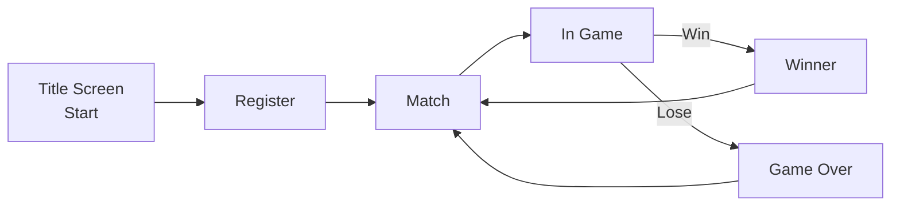

Ảnh minh họa chính thức:

Đây chính là lợi ích quan trọng của Navigation Graph: developer có thể nhìn **user flow của toàn bộ feature** thay vì lần theo từng `onClick` riêng biệt. Android Developers cũng khuyến nghị sử dụng nested graph cho các flow tự chứa như login, wizard hoặc game flow. ([Android Developers][3])

---

# 4. Ba thành phần quan trọng

Navigation Component có thể hiểu thông qua ba khái niệm:

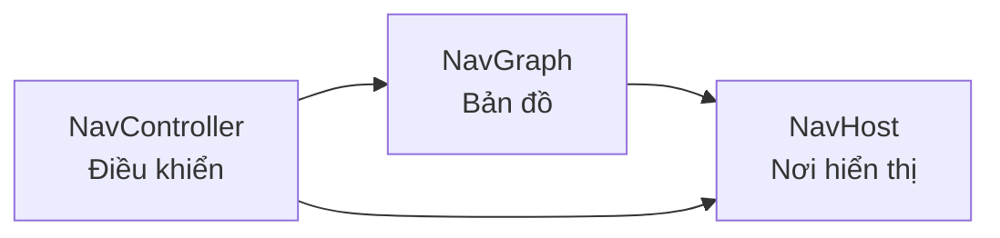

## 4.1. `NavGraph`

**NavGraph = bản đồ điều hướng.**

Nó chứa:

* destination;
* start destination;
* quan hệ giữa các destination;
* nested graph;
* arguments;
* deep links;
* action trong graph XML.

Ví dụ:

```text
NavGraph
│
├── Home
│
├── ProductList
│
├── ProductDetail
│
└── Settings
```

Android định nghĩa navigation graph là cấu trúc dữ liệu chứa các destination của ứng dụng cùng những kết nối giữa chúng. ([Android Developers][1])

---

## 4.2. `NavController`

`NavController` là thành phần **thực hiện việc điều hướng**.

Ví dụ:

```kotlin
navController.navigate(Profile)
```

Nó chịu trách nhiệm:

```text
Người dùng nhấn nút
       ↓
NavController
       ↓
Tìm destination trong NavGraph
       ↓
Cập nhật Back Stack
       ↓
NavHost hiển thị destination mới
```

`NavController` vừa giữ graph vừa theo dõi các destination người dùng đã truy cập. ([Android Developers][4])

---

## 4.3. `NavHost`

`NavHost` là **container hiển thị destination hiện tại**.

Có thể tưởng tượng:

```text
┌─────────────────────────────┐
│ MainActivity                │
│                             │
│   ┌─────────────────────┐   │
│   │       NavHost       │   │
│   │                     │   │
│   │  Destination hiện   │   │
│   │  tại được render    │   │
│   │  tại đây            │   │
│   └─────────────────────┘   │
│                             │
└─────────────────────────────┘
```

Trong Compose, đó là:

```kotlin
NavHost(...)
```

Trong Fragment/View thường là:

```text
NavHostFragment
```

Mỗi `NavHost` tương ứng với một `NavController`. ([Android Developers][4])

---

# 5. Destination là gì?

**Destination** là nơi người dùng có thể điều hướng tới.

Ví dụ:

```text
HomeScreen
ProfileScreen
SearchScreen
ProductDetailScreen
SettingsScreen
```

Android phân loại destination thành ba nhóm tổng quát:

| Destination | Ý nghĩa                         |
| ----------- | ------------------------------- |
| Hosted      | Màn hình chiếm vùng NavHost     |
| Dialog      | UI phủ lên destination hiện tại |
| Activity    | Chuyển sang Activity khác       |

Trong ứng dụng Android hiện đại, kiểu **Hosted destination** là phổ biến nhất. ([Android Developers][1])

---

# 6. Start Destination

Mỗi graph cần biết destination đầu tiên.

Ví dụ:

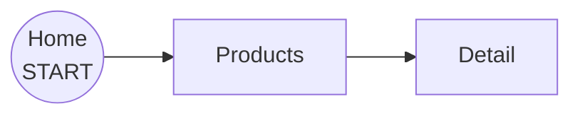

Trong trường hợp trên:

```text
startDestination = Home
```

Khi `NavHost` khởi tạo:

```text
NavGraph được load
      ↓
Xác định startDestination
      ↓
HomeScreen
      ↓
Home được đặt vào Back Stack
```

---

# 7. Navigation Graph và Back Stack khác nhau

Đây là điểm rất dễ nhầm.

## Navigation Graph

Cho biết:

> "Người dùng **có thể** đi đâu?"

```text
Home
 ├── Products
 │    └── Detail
 ├── Profile
 └── Settings
```

## Back Stack

Cho biết:

> "Người dùng **đã đi qua** đâu?"

Ví dụ người dùng thực hiện:

```text
Home → Products → Detail
```

Back stack lúc đó:

```text
TOP
┌─────────────────┐
│ Product Detail  │
├─────────────────┤
│ Product List    │
├─────────────────┤
│ Home            │
└─────────────────┘
BOTTOM
```

Nhấn Back:

```text
Product Detail
      ↓ pop
Product List
```

Navigation Graph và Navigation Back Stack là hai cấu trúc khác nhau. ([Android Developers][1])

---

# 8. Navigation Graph với Jetpack Compose

Đây là cách nên ưu tiên nếu app đang sử dụng Compose.

## 8.1. Dependency

Thêm Navigation Compose vào project thông qua dependency:

```kotlin
implementation("androidx.navigation:navigation-compose:<version>")
```

> Nên lấy version ổn định hiện tại từ AndroidX thay vì hard-code version của một bài học.

---

# 9. Ví dụ Compose hoàn chỉnh

Ta xây dựng app:

```text
Home → Profile → Settings
```

Sơ đồ:

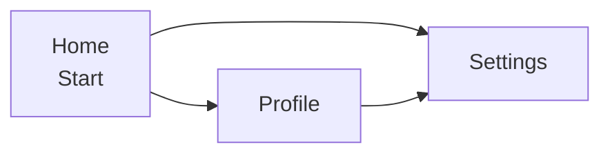

---

## 9.1. Định nghĩa route

Với API Navigation hiện đại, có thể sử dụng route có kiểu thay vì quản lý hàng loạt string thủ công.

```kotlin
import kotlinx.serialization.Serializable

@Serializable
object Home

@Serializable
object Profile

@Serializable
object Settings
```

Điểm mạnh:

```text
String route

"profile/{userId}"

        ↓

dễ typo
dễ sai argument
khó refactor
```

so với:

```text
Type-safe route

Profile

        ↓

compiler hỗ trợ
dễ refactor
rõ kiểu dữ liệu
```

Android Developers hiện khuyến nghị route/type-safe API thay vì phụ thuộc vào ID hoặc chuỗi route khi không cần thiết. ([Android Developers][1])

---

# 10. Tạo NavController

```kotlin
@Composable
fun App() {

    val navController = rememberNavController()

}
```

Ta có:

```text
App
 │
 └── NavController
```

Nhưng chưa có graph.

---

# 11. Tạo Navigation Graph bằng NavHost

```kotlin
@Composable
fun App() {

    val navController = rememberNavController()

    NavHost(
        navController = navController,
        startDestination = Home
    ) {

        composable<Home> {

        }

        composable<Profile> {

        }

        composable<Settings> {

        }
    }
}
```

Graph lúc này:

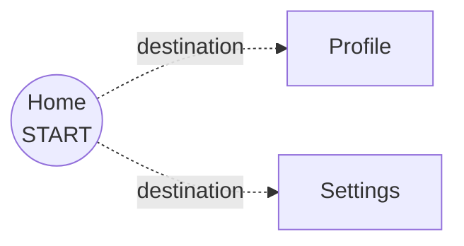

Ta mới **định nghĩa các destination**. Chưa có interaction.

---

# 12. Tạo HomeScreen

```kotlin
@Composable
fun HomeScreen(
    onProfileClick: () -> Unit,
    onSettingsClick: () -> Unit
) {

    Column {

        Text(
            text = "Home"
        )

        Button(
            onClick = onProfileClick
        ) {
            Text("Profile")
        }

        Button(
            onClick = onSettingsClick
        ) {
            Text("Settings")
        }
    }
}
```

Lưu ý:

```text
HomeScreen
     │
     ├── không cần biết NavController
     │
     ├── chỉ phát event
     │
     └── onProfileClick()
```

Cách này giúp composable dễ test hơn.

---

# 13. Kết nối UI với Navigation Graph

```kotlin
NavHost(
    navController = navController,
    startDestination = Home
) {

    composable<Home> {

        HomeScreen(
            onProfileClick = {
                navController.navigate(Profile)
            },
            onSettingsClick = {
                navController.navigate(Settings)
            }
        )
    }

    composable<Profile> {

        ProfileScreen(
            onSettingsClick = {
                navController.navigate(Settings)
            }
        )
    }

    composable<Settings> {

        SettingsScreen()
    }
}
```

Luồng thực thi:

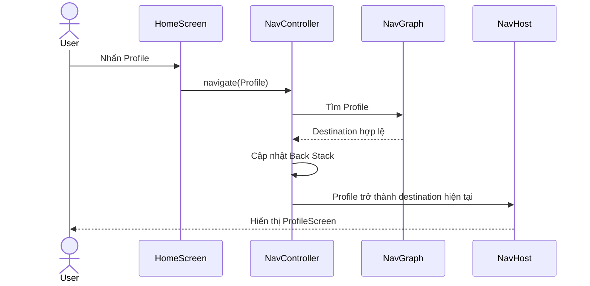

`NavController.navigate()` là API trung tâm để chuyển sang destination. ([Android Developers][5])

---

# 14. Code hoàn chỉnh

```kotlin
import androidx.compose.foundation.layout.Column
import androidx.compose.material3.Button
import androidx.compose.material3.Text
import androidx.compose.runtime.Composable
import androidx.navigation.compose.NavHost
import androidx.navigation.compose.composable
import androidx.navigation.compose.rememberNavController
import kotlinx.serialization.Serializable

@Serializable
object Home

@Serializable
object Profile

@Serializable
object Settings

@Composable
fun NavigationGraphExample() {

    val navController = rememberNavController()

    NavHost(
        navController = navController,
        startDestination = Home
    ) {

        composable<Home> {

            HomeScreen(
                onProfileClick = {
                    navController.navigate(Profile)
                },
                onSettingsClick = {
                    navController.navigate(Settings)
                }
            )
        }

        composable<Profile> {

            ProfileScreen(
                onSettingsClick = {
                    navController.navigate(Settings)
                }
            )
        }

        composable<Settings> {
            SettingsScreen()
        }
    }
}

@Composable
fun HomeScreen(
    onProfileClick: () -> Unit,
    onSettingsClick: () -> Unit
) {

    Column {

        Text("Home")

        Button(
            onClick = onProfileClick
        ) {
            Text("Open Profile")
        }

        Button(
            onClick = onSettingsClick
        ) {
            Text("Open Settings")
        }
    }
}

@Composable
fun ProfileScreen(
    onSettingsClick: () -> Unit
) {

    Column {

        Text("Profile")

        Button(
            onClick = onSettingsClick
        ) {
            Text("Settings")
        }
    }
}

@Composable
fun SettingsScreen() {
    Text("Settings")
}
```

---

# 15. Navigation Graph bằng XML

Navigation Graph cũng có thể là một resource:

```text
app
└── src
    └── main
        └── res
            └── navigation
                └── nav_graph.xml
```

Ví dụ:

```xml
<?xml version="1.0" encoding="utf-8"?>

<navigation
    xmlns:android="http://schemas.android.com/apk/res/android"
    xmlns:app="http://schemas.android.com/apk/res-auto"

    android:id="@+id/nav_graph"

    app:startDestination="@id/homeFragment">

    <fragment
        android:id="@+id/homeFragment"
        android:name="com.example.HomeFragment">

        <action
            android:id="@+id/action_home_to_profile"
            app:destination="@id/profileFragment" />

    </fragment>

    <fragment
        android:id="@+id/profileFragment"
        android:name="com.example.ProfileFragment" />

</navigation>
```

Trong XML:

```text
<navigation>
      │
      ├── <fragment>
      │       │
      │       └── <action>
      │
      └── <fragment>
```

Android Studio biểu diễn `<action>` thành các mũi tên giữa destination trong Navigation Editor. ([Android Developers][2])

---

# 16. Action trong XML Navigation Graph

Ví dụ:

```xml
<action
    android:id="@+id/action_home_to_profile"
    app:destination="@id/profileFragment" />
```

Nó mô tả:

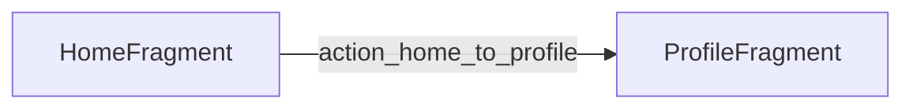

Sau đó code có thể gọi:

```kotlin
findNavController().navigate(
    R.id.action_home_to_profile
)
```

Android Developers mô tả action là kết nối logic giữa các destination và Navigation Editor hiển thị chúng dưới dạng mũi tên. ([Android Developers][2])

---

# 17. Navigation Graph với NavHostFragment

Với View/Fragment:

```xml
<androidx.fragment.app.FragmentContainerView
    android:id="@+id/nav_host_fragment"

    android:name=
        "androidx.navigation.fragment.NavHostFragment"

    android:layout_width="match_parent"
    android:layout_height="match_parent"

    app:navGraph="@navigation/nav_graph"

    app:defaultNavHost="true" />
```

Quan hệ:

```text
Activity
   │
   └── NavHostFragment
             │
             └── nav_graph.xml
                     │
                     ├── HomeFragment
                     ├── ProfileFragment
                     └── SettingsFragment
```

`app:navGraph` kết nối `NavHostFragment` với Navigation Graph. ([Android Developers][1])

---

# 18. Navigation Editor

Đối với graph XML:

```text
res/navigation/nav_graph.xml
            ↓
Android Studio
            ↓
Navigation Editor
```

Bạn có thể:

```text
┌─────────────┐
│ Home        │
└──────┬──────┘
       │
       ↓
┌─────────────┐
│ Detail      │
└─────────────┘
```

và Android Studio sinh XML tương ứng.

Navigation Editor hỗ trợ chuyển giữa:

```text
Design
  ↕

XML
```

Nhưng cần nhớ:

> **Navigation Editor không phải công cụ chỉnh Navigation Graph của Compose.**

Compose graph thường nằm trực tiếp trong Kotlin DSL. ([Android Developers][6])

---

# 19. Nested Navigation Graph

Khi app lớn:

```text
AppGraph
│
├── Home
│
├── Search
│
├── Profile
│
│
├── AuthGraph
│   ├── Login
│   ├── Register
│   └── ForgotPassword
│
└── CheckoutGraph
    ├── Cart
    ├── Address
    ├── Payment
    └── Confirmation
```

Không nên:

```text
AppGraph

Home
Login
Register
ForgotPassword
Search
Cart
Address
Payment
Confirmation
Profile
...
```

Graph sẽ ngày càng khó đọc.

---

# 20. Nested Graph trong Compose

Ví dụ:

```kotlin
@Serializable
object App

@Serializable
object Auth

@Serializable
object Login

@Serializable
object Register

@Serializable
object Home
```

Graph:

```kotlin
NavHost(
    navController = navController,
    startDestination = Auth
) {

    navigation<Auth>(
        startDestination = Login
    ) {

        composable<Login> {
            LoginScreen(
                onRegister = {
                    navController.navigate(Register)
                }
            )
        }

        composable<Register> {
            RegisterScreen()
        }
    }

    composable<Home> {
        HomeScreen()
    }
}
```

Biểu diễn:

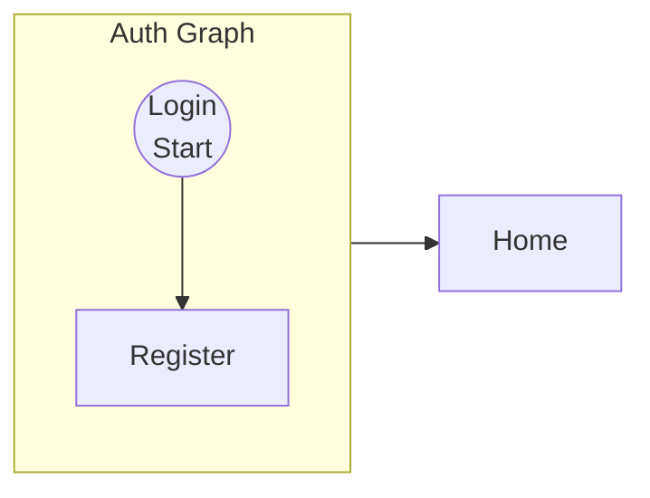

Android khuyến nghị nested graphs cho các flow tự chứa như:

* login;
* registration;
* wizard;
* checkout;
* game flow.

Chúng giúp graph chính dễ hiểu hơn, tái sử dụng tốt hơn và tạo ranh giới encapsulation giữa các flow. ([Android Developers][3])

---

# 21. Navigation Graph không nên chứa business logic

Không nên:

```kotlin
composable<Home> {

    if (repository.user.hasPaid &&
        repository.network.isAvailable &&
        repository.cart.isNotEmpty()
    ) {
        ...
    }
}
```

Navigation Graph nên chủ yếu trả lời:

```text
Destination nào tồn tại?

Destination đầu tiên là gì?

Các flow được nhóm như thế nào?

Sự kiện nào dẫn đến destination nào?
```

Business logic nên nằm ở:

```text
ViewModel
   ↓
UI State
   ↓
Composable
   ↓
Navigation event
```

---

# 22. Không truyền NavController khắp app

Một lỗi thiết kế thường gặp:

```kotlin
@Composable
fun ProfileScreen(
    navController: NavController
)
```

Nó làm UI phụ thuộc trực tiếp vào Navigation.

Tốt hơn:

```kotlin
@Composable
fun ProfileScreen(
    onSettingsClick: () -> Unit
)
```

Graph quyết định:

```kotlin
ProfileScreen(
    onSettingsClick = {
        navController.navigate(Settings)
    }
)
```

Kiến trúc:

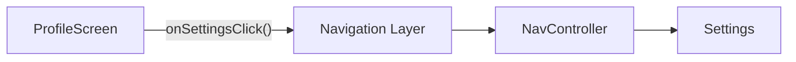

Ưu điểm:

* UI dễ preview.
* UI dễ unit/UI test.
* UI không phụ thuộc Navigation framework.
* dễ đổi destination.
* dễ tái sử dụng composable.

---

# 23. Navigation Graph và State

Navigation thường làm phát sinh câu hỏi:

> Chuyển màn hình có làm mất state không?

Ví dụ:

```text
Product List
    │
    │ user chọn Product 42
    ↓
Product Detail
    │
    │ Back
    ↓
Product List
```

Có nhiều loại state:

```text
State
│
├── Navigation state
│      └── Back Stack
│
├── Screen UI state
│      └── ViewModel
│
└── Temporary UI state
       └── remember / rememberSaveable
```

Không nên dùng Navigation Graph như nơi lưu dữ liệu nghiệp vụ.

---

# 24. Configuration Change

Ví dụ:

```text
Portrait
   ↓
Rotate
   ↓
Landscape
```

Câu hỏi cần kiểm tra:

```text
Destination hiện tại có đúng không?

State của màn hình còn không?

Arguments còn chính xác không?

Có navigate thêm destination ngoài ý muốn không?
```

Đặc biệt tránh đặt navigation side effect trực tiếp trong body của composable:

```kotlin
if (loginSuccess) {
    navController.navigate(Home)
}
```

vì recomposition có thể làm logic điều hướng khó kiểm soát.

Thường nên quản lý navigation event có chủ đích thông qua state/effect.

---

# 25. Một lỗi rất phổ biến: navigate lặp

Ví dụ:

```kotlin
if (isLoggedIn) {
    navController.navigate(Home)
}
```

Compose recomposition:

```text
Compose
   ↓
isLoggedIn = true
   ↓
navigate(Home)
   ↓
Recomposition
   ↓
navigate(Home)
   ↓
navigate(Home)
   ↓
...
```

Kết quả có thể thành:

```text
Back Stack

Home
Home
Home
Login
```

Thay vì:

```text
Home
```

Navigation phải được xem như **event/side effect**, không phải output UI đơn thuần.

---

# 26. `popUpTo`

Giả sử:

```text
Login
  ↓
OTP
  ↓
Home
```

Sau khi login thành công, người dùng nhấn Back không nên quay lại OTP/Login.

Bạn có thể điều chỉnh back stack:

```kotlin
navController.navigate(Home) {

    popUpTo(Login) {
        inclusive = true
    }
}
```

Khái niệm:

```text
TRƯỚC

Home
OTP
Login

       ↓ popUpTo

SAU

Home
```

Navigation hỗ trợ cấu hình `NavOptions` để điều khiển `popUpTo`, `launchSingleTop`, restore state và các hành vi back stack khác. ([Android Developers][7])

---

# 27. `launchSingleTop`

Ví dụ bottom navigation:

```text
Home → Search → Home → Home → Home
```

Không kiểm soát có thể tạo destination trùng lặp.

`launchSingleTop` giúp tránh tạo thêm instance khi destination tương ứng đã nằm trên top:

```kotlin
navController.navigate(Home) {
    launchSingleTop = true
}
```

---

# 28. Arguments

Một destination có thể cần dữ liệu.

Ví dụ:

```text
ProductList
      │
      │ productId = 42
      ↓
ProductDetail
```

Không nên gửi cả object lớn:

```text
❌ Product(
     id,
     title,
     price,
     image,
     description,
     reviews,
     ...
   )
```

Thường nên gửi identifier:

```text
✓ productId = 42
```

Sau đó:

```text
ProductDetail
      ↓
ViewModel
      ↓
Repository
      ↓
Product #42
```

Điều này giúp giảm coupling giữa màn hình.

---

# 29. Deep Link và Navigation Graph

Navigation Graph cũng có thể liên quan tới deep linking.

Ví dụ URL ứng dụng dẫn trực tiếp đến:

```text
ProductDetail(42)
```

thay vì:

```text
Home
 ↓
Products
 ↓
ProductDetail
```

Graph cần được thiết kế sao cho destination vẫn có thể khởi tạo đúng khi không đi qua toàn bộ flow trước đó.

Đây là lý do không nên để `ProductDetail` phụ thuộc vào state tạm chỉ tồn tại trong `ProductList`.

---

# 30. Navigation Graph ảnh hưởng UX thế nào?

Graph kém:

```text
Home → Detail → Login → Home → Detail → ???
```

Có thể dẫn đến:

* Back sai màn hình.
* loop điều hướng.
* người dùng bị đưa về Home bất ngờ.
* deep link lỗi.
* bottom navigation mất state.
* màn hình không thể mở độc lập.

Graph tốt:

```text
User intent
    ↓
Destination hợp lý
    ↓
Back predictable
    ↓
State được bảo toàn
```

---

# 31. Navigation Graph ảnh hưởng maintainability

Không tổ chức graph:

```text
Screen A
 └── navigate("screen_b")

Screen B
 └── navigate("screen_f")

Screen C
 └── navigate("screen_d")
```

Sau vài chục màn hình:

```text
💥 route nằm rải rác
💥 khó biết flow
💥 khó refactor
💥 khó test
```

Tổ chức tốt:

```text
navigation/
│
├── AppNavHost.kt
│
├── AuthNavigation.kt
├── HomeNavigation.kt
├── ProfileNavigation.kt
└── CheckoutNavigation.kt
```

---

# 32. Kiến trúc gợi ý cho project Compose

```text
app/
│
├── navigation/
│   ├── AppNavHost.kt
│   └── Routes.kt
│
├── feature/
│   │
│   ├── home/
│   │   ├── HomeScreen.kt
│   │   └── HomeViewModel.kt
│   │
│   ├── profile/
│   │   ├── ProfileScreen.kt
│   │   └── ProfileViewModel.kt
│   │
│   └── settings/
│       └── SettingsScreen.kt
│
└── MainActivity.kt
```

Graph:

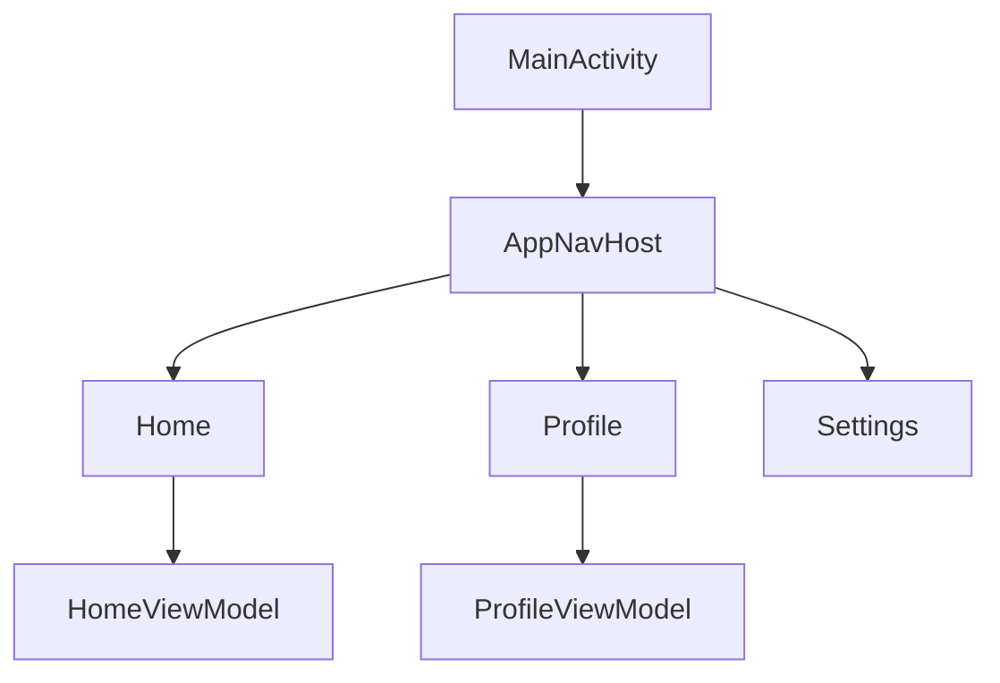

---

# 33. Một Navigation Graph thực tế hơn

Ví dụ ứng dụng mua sắm:

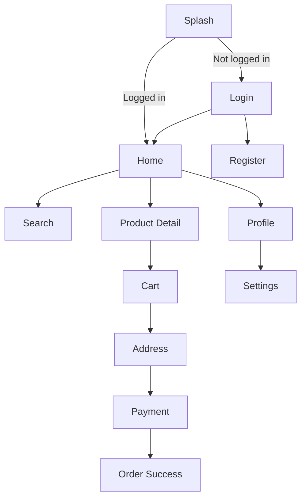

Có thể tổ chức thành:

```text
AppGraph
│
├── Splash
│
├── AuthGraph
│   ├── Login
│   └── Register
│
├── MainGraph
│   ├── Home
│   ├── Search
│   ├── Product
│   └── Profile
│
└── CheckoutGraph
    ├── Cart
    ├── Address
    ├── Payment
    └── Success
```

Đây là tình huống rất phù hợp với nested navigation graph.

---

# 34. Test Navigation Graph

Không chỉ test:

> "Screen có render hay không?"

Cần test cả **destination được điều hướng tới**.

Ví dụ:

```text
Given:
HomeScreen đang hiển thị

When:
User nhấn Profile

Then:
Current destination = Profile
```

---

## 34.1. Manual test

| Test              | Thao tác                | Kết quả                  |
| ----------------- | ----------------------- | ------------------------ |
| Start destination | mở app                  | Home xuất hiện           |
| Home → Profile    | nhấn Profile            | Profile xuất hiện        |
| Back              | nhấn Back               | trở về Home              |
| Home → Settings   | nhấn Settings           | Settings xuất hiện       |
| Rotate            | xoay thiết bị           | flow không bị reset      |
| Background        | background → foreground | destination vẫn hợp lý   |
| Double tap        | bấm nút liên tục        | không tạo navigation lỗi |

---

# 35. Test từng Screen độc lập

Vì UI nhận callback:

```kotlin
HomeScreen(
    onProfileClick = ...
)
```

nên test dễ hơn:

```kotlin
var clicked = false

composeTestRule.setContent {

    HomeScreen(
        onProfileClick = {
            clicked = true
        },
        onSettingsClick = {}
    )
}
```

Sau đó:

```text
Click "Open Profile"
       ↓
clicked == true
```

Không cần dựng toàn bộ Navigation Component chỉ để test UI.

---

# 36. Những lỗi thường gặp

## ❌ 1. Không khai báo destination

```kotlin
navController.navigate(Profile)
```

nhưng graph không có:

```kotlin
composable<Profile>
```

---

## ❌ 2. Sai `startDestination`

Ví dụ:

```text
startDestination = Checkout
```

trong khi user chưa có Cart.

UX sẽ sai ngay từ lúc mở app.

---

## ❌ 3. Route string nằm khắp project

```kotlin
navigate("profile")

navigate("Profile")

navigate("profiles")
```

Typo rất khó tìm.

---

## ❌ 4. Truyền `NavController` vào mọi composable

Làm UI phụ thuộc Navigation framework.

---

## ❌ 5. Graph quá lớn

```text
AppGraph
 ├── 01
 ├── 02
 ├── 03
 ...
 └── 70
```

Nên chia nested graph theo feature/user flow.

---

## ❌ 6. Business logic nằm trong graph

Navigation nên điều phối flow, không nên biến thành `ViewModel` thứ hai.

---

## ❌ 7. Không suy nghĩ về Back

Developer chỉ test:

```text
A → B
```

nhưng quên test:

```text
A → B → Back
```

Trong thực tế, Back Stack là một phần rất quan trọng của UX Android.

---

# 37. Navigation Graph và lifecycle

Graph không trực tiếp thay thế lifecycle.

Một destination vẫn có:

```text
Destination
    │
    ├── Lifecycle
    ├── ViewModel
    ├── UI State
    └── Saved State
```

Khi destination không còn foreground, lifecycle của nó thay đổi.

Do đó những tác vụ như:

* camera;
* location;
* sensor;
* animation;
* network observation;

vẫn phải được quản lý đúng lifecycle.

---

# 38. Navigation Graph và Network

Giả sử:

```text
ProductList
      ↓
ProductDetail(42)
      ↓
GET /products/42
```

Nếu request lỗi:

```text
ProductDetail
      ↓
Loading
      ↓
Error
      ↓
Retry
```

Không nên:

```text
Network error
      ↓
navigate(Home)
```

trừ khi đó thực sự là yêu cầu UX.

Navigation và data state nên được tách:

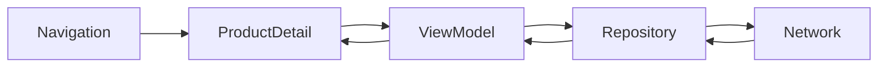

---

# 39. Ghi chú Production

Trước release, với Navigation Graph cần kiểm tra:

### Navigation

* Có destination unreachable không?
* Có navigation loop không?
* Có destination bị duplicate không?
* `startDestination` đúng không?
* Back có predictable không?

### State

* rotate có mất UI state không?
* process recreation có gây lỗi không?
* background/foreground có navigate lại không?

### Deep link

* deep link vào trực tiếp destination có hoạt động không?
* thiếu argument xử lý thế nào?
* user chưa đăng nhập thì sao?

### Authentication

Ví dụ:

```text
Deep Link → Profile
             │
             ├── Logged in
             │      ↓
             │   Profile
             │
             └── Not logged in
                    ↓
                  Login
                    ↓
                  Profile
```

### UX

Không nên để người dùng:

```text
Home
 ↓
Login
 ↓
Home
 ↓
Back
 ↓
Login  ← sai UX
```

---

# 40. Thực hành 15–20 phút

## Yêu cầu

Tạo ứng dụng gồm:

```text
Home
 │
 ├── Profile
 │
 └── Settings
```

Trong đó:

### Home

```text
HOME

[ Open Profile ]

[ Open Settings ]
```

### Profile

```text
PROFILE

[ Open Settings ]
```

### Settings

```text
SETTINGS
```

---

## Bước 1

Định nghĩa:

```kotlin
@Serializable
object Home

@Serializable
object Profile

@Serializable
object Settings
```

---

## Bước 2

Tạo:

```kotlin
val navController = rememberNavController()
```

---

## Bước 3

Tạo:

```kotlin
NavHost(...)
```

---

## Bước 4

Thêm ba:

```kotlin
composable<...>
```

---

## Bước 5

Điều hướng:

```kotlin
navController.navigate(...)
```

---

## Bước 6

Kiểm tra Back:

```text
Home
 ↓
Profile
 ↓
Settings
 ↓ Back
Profile
 ↓ Back
Home
```

---

# 41. Bài tập

Mở rộng graph thành:

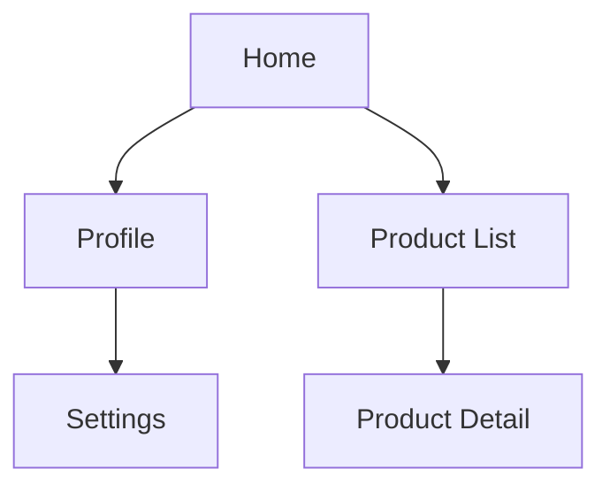

### Yêu cầu

* `Home` là start destination.
* Home mở được Product List.
* Product List mở Product Detail.
* Home mở được Profile.
* Profile mở Settings.
* Back hoạt động đúng.
* Không truyền trực tiếp `NavController` xuống từng screen.

### Nâng cao

Chia thành:

```text
AppGraph
│
├── Home
├── ShopGraph
│   ├── ProductList
│   └── ProductDetail
│
└── AccountGraph
    ├── Profile
    └── Settings
```

---

# 42. Artifact cho Portfolio

Tạo project:

```text
android-navigation-graph-demo/
```

README có:

```markdown
# Android Navigation Graph Demo

## Features

- Navigation Compose
- Type-safe destinations
- Home → Profile
- Home → Settings
- Back-stack handling
- Nested navigation graph

## Navigation

[diagram]

## Architecture

UI Event
   ↓
Navigation Host
   ↓
NavController
   ↓
Destination

## Testing

- Start destination
- Forward navigation
- Back navigation
- Rotation
- Duplicate navigation
```

Kèm:

1. screenshot Home;
2. screenshot Profile;
3. screenshot Navigation flow;
4. GIF/video ngắn thao tác;
5. Mermaid diagram trong README.

Đây sẽ là artifact rõ ràng hơn nhiều so với chỉ ghi:

> "Biết Android Navigation."

---

# 43. Checklist hoàn thành

* [ ] Giải thích được Navigation Graph.
* [ ] Biết destination là gì.
* [ ] Biết `startDestination`.
* [ ] Phân biệt `NavGraph` và Back Stack.
* [ ] Phân biệt `NavHost` và `NavController`.
* [ ] Tạo được `NavHost`.
* [ ] Tạo được ít nhất ba destination.
* [ ] Điều hướng được bằng `navigate()`.
* [ ] Back hoạt động đúng.
* [ ] Hiểu nested graph.
* [ ] Không đặt business logic trong Navigation Graph.
* [ ] Không truyền `NavController` xuống toàn bộ UI nếu không cần.
* [ ] Test được forward/back navigation.
* [ ] Có sơ đồ navigation trong README.
* [ ] Có screenshot/GIF cho portfolio.

---

# 44. Ghi nhớ nhanh

```text
Navigation Component
│
├── NavGraph
│     └── App có thể đi đâu?
│
├── NavController
│     └── Làm thế nào để đi?
│
├── NavHost
│     └── Destination hiển thị ở đâu?
│
└── Back Stack
      └── User đã đi qua đâu?
```

Công thức dễ nhớ:

```text
NAVIGATION GRAPH = BẢN ĐỒ

NAVCONTROLLER = NGƯỜI ĐIỀU KHIỂN

NAVHOST = KHUNG HIỂN THỊ

DESTINATION = ĐIỂM ĐẾN

BACK STACK = LỊCH SỬ ĐƯỜNG ĐI
```

---

# 45. Kết luận

**Navigation Graph không đơn thuần là cách chuyển từ màn hình A sang màn hình B.** Nó là mô hình hóa cấu trúc di chuyển của người dùng trong toàn bộ ứng dụng.

Một graph tốt nên có đặc điểm:

```text
Rõ destination
      +
Rõ start destination
      +
Back predictable
      +
Nested graph hợp lý
      +
UI tách khỏi navigation
      +
State được quản lý đúng
      ↓
Navigation dễ hiểu
dễ test
dễ mở rộng
ít bug UX
```

Đối với **Jetpack Compose**, tư duy quan trọng nhất là:

```kotlin
NavHost(
    navController = navController,
    startDestination = Home
) {

    composable<Home> { ... }

    composable<Profile> { ... }

    composable<Settings> { ... }
}
```

sau đó để các screen phát **event**, còn lớp navigation quyết định event đó dẫn tới destination nào.

Tài liệu Android Developers hiện tại cũng nhấn mạnh graph là cấu trúc chứa destination và kết nối giữa chúng, Compose xây graph bằng `NavHost`/Kotlin DSL, trong khi XML graph có thể được thiết kế trực quan bằng Navigation Editor. ([Android Developers][1])

**Tài liệu chính thức:** [Design your navigation graph – Android Developers](https://developer.android.com/guide/navigation/design?utm_source=chatgpt.com) · [Navigation Editor](https://developer.android.com/guide/navigation/design/editor?utm_source=chatgpt.com) · [Nested graphs](https://developer.android.com/guide/navigation/design/nested-graphs?utm_source=chatgpt.com) · [Navigate to a destination](https://developer.android.com/guide/navigation/use-graph/navigate?utm_source=chatgpt.com)

[1]: https://developer.android.com/guide/navigation/design?authuser=2&utm_source=chatgpt.com "Design your navigation graph  |  App architecture  |  Android Developers"
[2]: https://developer.android.com/guide/navigation/design/editor?hl=en "Navigation Editor  |  App architecture  |  Android Developers"
[3]: https://developer.android.com/guide/navigation/design/nested-graphs?authuser=002&utm_source=chatgpt.com "Nested graphs  |  App architecture  |  Android Developers"
[4]: https://developer.android.com/guide/navigation/navcontroller?authuser=50&utm_source=chatgpt.com "Create a navigation controller  |  App architecture  |  Android Developers"
[5]: https://developer.android.com/guide/navigation/use-graph/navigate?authuser=19&utm_source=chatgpt.com "Navigate to a destination  |  App architecture  |  Android Developers"
[6]: https://developer.android.com/guide/navigation/design/editor?hl=en&utm_source=chatgpt.com "Navigation Editor  |  App architecture  |  Android Developers"
[7]: https://developer.android.com/guide/navigation/use-graph/navoptions?utm_source=chatgpt.com "Navigate with options  |  App architecture  |  Android Developers"

---

# Bài luyện tập

## Mục tiêu


## Đề bài


## Yêu cầu hoàn thành

- [ ] 
- [ ] 
- [ ] 

## Kết quả / lời giải


## Ghi chú
