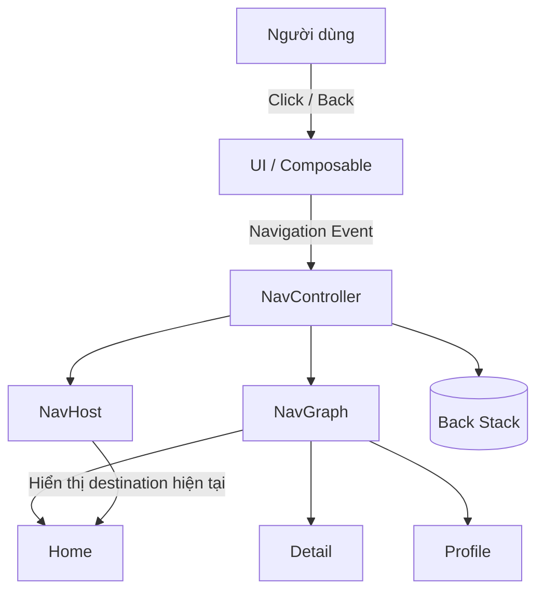
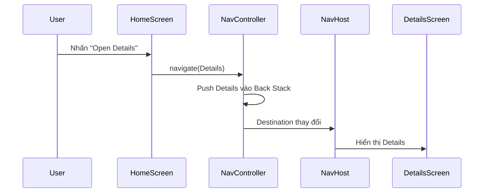
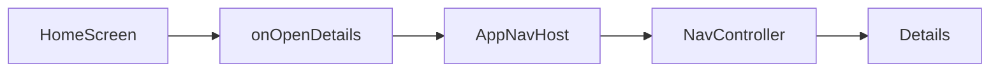
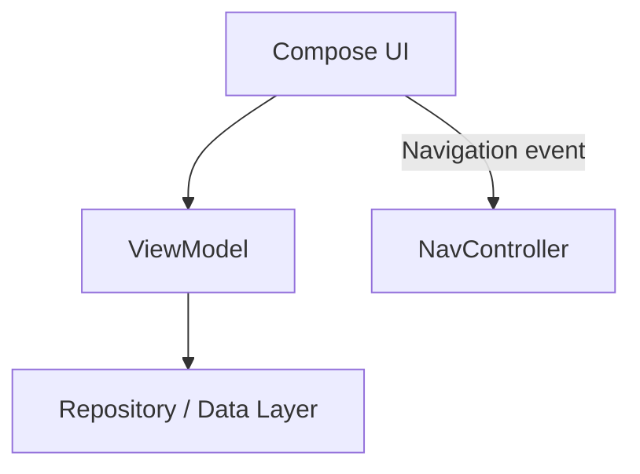
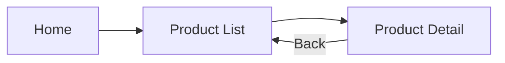

# 037 - NavController

**Học phần:** 02 - App Components and User Interface
**Module:** Module 04 - Interface and Navigation
**Nhóm nội dung:** Navigation
**Nguồn roadmap:** Interface and Navigation / Navigation
**Loại bài:** UI
**Thứ tự trong module:** 037
**Thời lượng gợi ý:** 30 phút

---

## 1. Tóm tắt

`NavController` là thành phần trung tâm điều phối việc **điều hướng giữa các màn hình** khi sử dụng Jetpack Navigation. Nó biết Navigation Graph của ứng dụng, theo dõi các destination mà người dùng đã đi qua và cung cấp các API như `navigate()`, `popBackStack()` và `navigateUp()` để thay đổi màn hình. Mỗi `NavHost` có một `NavController` tương ứng. ([Android Developers][1])

Trong Jetpack Compose, cách phổ biến để tạo controller là:

```kotlin
val navController = rememberNavController()
```

Sau đó truyền nó cho `NavHost`.

> Có thể hình dung `NavController` giống như **người điều phối giao thông** của ứng dụng: UI yêu cầu đi đâu, còn `NavController` quyết định thay đổi destination và back stack như thế nào.

---

## 2. Mục tiêu học tập

Sau bài này, bạn có thể:

* Giải thích `NavController` bằng ngôn ngữ của mình.
* Phân biệt:

  * `NavController`
  * `NavHost`
  * `NavGraph`
  * `NavDestination`
  * Back Stack
* Tạo `NavController` trong Jetpack Compose.
* Điều hướng sang màn hình khác bằng `navigate()`.
* Quay lại bằng `popBackStack()`.
* Hiểu cách `NavController` quản lý lịch sử điều hướng.
* Tránh truyền `NavController` trực tiếp vào mọi Composable.
* Viết một bài test cơ bản kiểm tra navigation.
* Debug các lỗi navigation phổ biến.

---

# 3. NavController nằm ở đâu trong Navigation?

Android Navigation có một số khái niệm chính:

| Thành phần       | Vai trò                                     |
| ---------------- | ------------------------------------------- |
| `NavHost`        | Vùng UI hiển thị destination hiện tại       |
| `NavGraph`       | Mô tả các destination và quan hệ giữa chúng |
| `NavDestination` | Một màn hình hoặc điểm đến                  |
| `NavController`  | Điều phối navigation                        |
| Route            | Định danh một destination                   |
| Back Stack       | Lịch sử các destination đã đi qua           |

Android mô tả `NavController` là **central coordinator** của hệ thống Navigation: quản lý việc chuyển destination, back stack, deep link và các hoạt động điều hướng liên quan. ([Android Developers][2])

### Sơ đồ tổng thể



Một cách nhớ đơn giản:

```text
NavGraph       = bản đồ
Destination    = địa điểm
NavController  = người điều hướng
NavHost        = nơi hiển thị địa điểm hiện tại
Back Stack     = lịch sử những nơi đã đi qua
```

---

# 4. Hình ảnh minh họa Navigation Graph

Ảnh chính thức từ Android Developers:


Trong Navigation Editor, các màn hình là **destination**, còn các đường nối thể hiện các hướng điều hướng có thể xảy ra. Navigation Editor áp dụng cho Navigation Graph dựa trên XML; Compose thường khai báo graph bằng Kotlin DSL thay vì sử dụng editor này. ([Android Developers][3])

---

# 5. Tạo NavController trong Jetpack Compose

Trong Compose:

```kotlin
@Composable
fun MyApp() {

    val navController = rememberNavController()

}
```

Android khuyến nghị tạo `NavController` đủ cao trong composable hierarchy để các thành phần cần quan sát hoặc thực hiện navigation có thể truy cập thông qua lớp điều phối thích hợp. ([Android Developers][1])

Thông thường cấu trúc sẽ là:

```text
MainActivity
    │
    ▼
MyApp
    │
    ├── rememberNavController()
    │
    ▼
AppNavHost
    │
    ├── Home
    ├── Detail
    └── Profile
```

---

# 6. NavController + NavHost

Giả sử ứng dụng có hai màn hình:

```text
Home
 │
 │ mở Details
 ▼
Details
```

Với Navigation 2.x hiện đại, Android hỗ trợ **type-safe route** bằng Kotlin type thay vì phải tự quản lý các chuỗi `"home"` hay `"details"`. API type-safe này có từ Navigation 2.8.0. ([Android Developers][4])

```kotlin
import kotlinx.serialization.Serializable

@Serializable
data object Home

@Serializable
data object Details
```

Sau đó tạo `NavHost`:

```kotlin
@Composable
fun AppNavigation() {

    val navController = rememberNavController()

    NavHost(
        navController = navController,
        startDestination = Home
    ) {

        composable<Home> {
            HomeScreen(
                onOpenDetails = {
                    navController.navigate(Details)
                }
            )
        }

        composable<Details> {
            DetailsScreen(
                onBack = {
                    navController.popBackStack()
                }
            )
        }
    }
}
```

Luồng thực thi:



---

# 7. `navigate()` — đi tới destination mới

API quan trọng nhất là:

```kotlin
navController.navigate(...)
```

Ví dụ:

```kotlin
navController.navigate(Details)
```

Android hiện khuyến khích các API type-safe như:

```kotlin
navController.navigate(route = Details)
```

thay vì phụ thuộc hoàn toàn vào chuỗi route thủ công. ([Android Developers][5])

---

# 8. Back Stack

Một trong những trách nhiệm quan trọng nhất của `NavController` là quản lý **back stack**.

Back stack hoạt động theo nguyên tắc:

```text
LIFO
Last In
First Out
```

Tức là:

> Destination được thêm cuối cùng sẽ là destination được lấy ra đầu tiên khi người dùng Back.

Android xác định back stack của `NavController` là một stack chứa các destination người dùng đã đi qua. `navigate()` thường đưa destination mới lên trên stack, còn `popBackStack()` loại destination hiện tại khỏi stack. ([Android Developers][6])

---

## Ví dụ

Ban đầu:

```text
┌──────────┐
│   Home   │ ← TOP
└──────────┘
```

Gọi:

```kotlin
navController.navigate(Details)
```

Back stack:

```text
┌──────────┐
│ Details  │ ← TOP
├──────────┤
│ Home     │
└──────────┘
```

Tiếp tục:

```kotlin
navController.navigate(Profile)
```

Ta có:

```text
┌──────────┐
│ Profile  │ ← TOP
├──────────┤
│ Details  │
├──────────┤
│ Home     │
└──────────┘
```

Nếu gọi:

```kotlin
navController.popBackStack()
```

thì:

```text
Profile
   ↓ POP
```

còn:

```text
┌──────────┐
│ Details  │ ← TOP
├──────────┤
│ Home     │
└──────────┘
```

UI quay về:

```text
Details
```

---

# 9. Các API NavController quan trọng

| API                              | Công dụng                                   |
| -------------------------------- | ------------------------------------------- |
| `navigate()`                     | Đi tới destination                          |
| `popBackStack()`                 | Xóa destination hiện tại và quay lại        |
| `navigateUp()`                   | Thực hiện Up navigation                     |
| `currentBackStackEntry`          | Back stack entry hiện tại                   |
| `previousBackStackEntry`         | Entry trước destination hiện tại            |
| `currentBackStackEntryAsState()` | Theo dõi destination hiện tại trong Compose |
| `getBackStackEntry()`            | Lấy một entry trong back stack              |
| `handleDeepLink()`               | Xử lý deep link                             |
| `graph`                          | Navigation Graph của controller             |

---

# 10. `popBackStack()` khác gì `navigate()`?

### `navigate()`

Thường thêm destination:

```text
Home
```

↓

```kotlin
navController.navigate(Details)
```

↓

```text
Home
Details
```

---

### `popBackStack()`

Loại destination hiện tại:

```text
Home
Details
```

↓

```kotlin
navController.popBackStack()
```

↓

```text
Home
```

Do đó không nên viết:

```kotlin
navController.navigate(Home)
```

chỉ để thực hiện nút Back.

Nếu làm vậy, stack có thể thành:

```text
Home
Details
Home
```

thay vì:

```text
Home
```

Đây là một nguồn phổ biến của lỗi back stack.

---

# 11. Sai lầm quan trọng: truyền NavController khắp UI

Ví dụ sau có thể chạy nhưng tạo coupling:

```kotlin
@Composable
fun HomeScreen(
    navController: NavController
) {

    Button(
        onClick = {
            navController.navigate(Details)
        }
    ) {
        Text("Details")
    }
}
```

UI giờ phải biết:

```text
NavController
Navigation
Route
Destination
```

Điều đó làm `HomeScreen` khó test và khó tái sử dụng.

Android khuyến nghị **không truyền trực tiếp `NavController` vào screen composable**. Thay vào đó, screen nên phát navigation event qua callback. ([Android Developers][5])

---

# 12. Cách tốt hơn: Navigation Callback

```kotlin
@Composable
fun HomeScreen(
    onOpenDetails: () -> Unit
) {

    Button(
        onClick = onOpenDetails
    ) {
        Text("Open Details")
    }
}
```

Navigation được xử lý bên ngoài:

```kotlin
composable<Home> {

    HomeScreen(
        onOpenDetails = {
            navController.navigate(Details)
        }
    )

}
```

Kiến trúc trở thành:



Screen chỉ biết:

```text
"Người dùng muốn mở Details"
```

chứ không cần biết:

```text
NavController thực hiện điều đó như thế nào.
```

---

# 13. State và NavController

Navigation cũng là một dạng **UI state**.

Ví dụ:

```text
Home → Details → Checkout
```

Destination hiện tại:

```text
Checkout
```

là một phần trạng thái của UI.

Compose có thể quan sát destination hiện tại:

```kotlin
val backStackEntry by
    navController.currentBackStackEntryAsState()
```

Sau đó:

```kotlin
val currentDestination =
    backStackEntry?.destination
```

Điều này hữu ích khi cần cập nhật:

```text
Bottom Navigation
TopAppBar
Navigation Drawer
Title
Selected Tab
```

theo destination hiện tại.

---

# 14. NavController không phải nơi chứa business state

Không nên làm kiểu:

```text
NavController
   ├── username
   ├── products
   ├── cart
   ├── network data
   └── database state
```

`NavController` nên tập trung vào:

```text
Navigation state
```

Business state nên đặt ở:

```text
ViewModel
Repository
Data Layer
```

Ví dụ:



Điều này giúp tách biệt:

```text
Business Logic
       ≠
Navigation Logic
```

và phù hợp với nguyên tắc separation of concerns trong kiến trúc Android. ([Android Developers][7])

---

# 15. NavController và lifecycle

Destination trong Navigation không đơn giản chỉ là một chuỗi route. Mỗi destination trên back stack được biểu diễn bởi một `NavBackStackEntry`.

Các entry có thể liên quan tới:

```text
Lifecycle
ViewModelStore
SavedState
Destination
Arguments
```

Vì vậy, một `ViewModel` được scope theo destination có thể tồn tại trong khi destination đó vẫn nằm trong back stack, thay vì bị mất ngay khi màn hình không còn ở phía trước. Navigation Compose cũng có cơ chế lưu và khôi phục trạng thái navigation/back-stack trong quá trình recreation. ([Android Developers][8])

Tuy nhiên, vẫn nên để dữ liệu ứng dụng quan trọng trong:

```text
ViewModel
Repository
Database
SavedStateHandle
```

thay vì dựa vào `NavController` như một kho dữ liệu.

---

# 16. Rotation / configuration change

Ví dụ người dùng đang ở:

```text
Home
  ↓
Product
  ↓
Checkout
```

Sau đó điện thoại xoay màn hình.

Ứng dụng không nên tự động quay lại:

```text
Home
```

một cách không mong muốn.

Navigation và Compose có cơ chế quản lý/restoration navigation state; business state của màn hình vẫn nên được thiết kế độc lập thông qua `ViewModel`, `rememberSaveable`, `SavedStateHandle` hoặc data layer tùy loại dữ liệu. ([Android Developers][8])

---

# 17. Ví dụ hoàn chỉnh nhỏ

## Route

```kotlin
@Serializable
data object Home

@Serializable
data object Details
```

---

## HomeScreen

```kotlin
@Composable
fun HomeScreen(
    onOpenDetails: () -> Unit
) {

    Column {

        Text(
            text = "Home"
        )

        Button(
            onClick = onOpenDetails
        ) {
            Text("Open Details")
        }
    }
}
```

---

## DetailsScreen

```kotlin
@Composable
fun DetailsScreen(
    onBack: () -> Unit
) {

    Column {

        Text(
            text = "Details"
        )

        Button(
            onClick = onBack
        ) {
            Text("Back")
        }
    }
}
```

---

## AppNavigation

```kotlin
@Composable
fun AppNavigation() {

    val navController =
        rememberNavController()

    NavHost(
        navController = navController,
        startDestination = Home
    ) {

        composable<Home> {

            HomeScreen(
                onOpenDetails = {
                    navController.navigate(Details)
                }
            )
        }

        composable<Details> {

            DetailsScreen(
                onBack = {
                    navController.popBackStack()
                }
            )
        }
    }
}
```

---

# 18. Luồng chạy của chương trình

Khi app mở:

```text
rememberNavController()
        │
        ▼
     NavHost
        │
        ▼
startDestination = Home
        │
        ▼
   HomeScreen
```

Người dùng nhấn:

```text
Open Details
```

thì:

```text
HomeScreen
     │
     │ onOpenDetails()
     ▼
AppNavigation
     │
     │ navController.navigate(Details)
     ▼
NavController
     │
     ├── cập nhật Back Stack
     │
     ▼
NavHost
     │
     ▼
DetailsScreen
```

---

# 19. Debug NavController

Một kỹ thuật đơn giản là theo dõi destination hiện tại:

```kotlin
navController.addOnDestinationChangedListener {
        _,
        destination,
        _ ->

    Log.d(
        "Navigation",
        "Destination = ${destination.route}"
    )
}
```

Khi chạy:

```text
Home
↓
Details
↓
Profile
```

Logcat có thể giúp phát hiện:

```text
Destination sai
navigate() bị gọi hai lần
route không như mong đợi
back stack không đúng
```

---

# 20. Lỗi phổ biến

## Lỗi 1 — navigate hai lần

```kotlin
navController.navigate(Details)
navController.navigate(Details)
```

Back stack:

```text
Home
Details
Details
```

Người dùng phải Back hai lần.

---

## Lỗi 2 — dùng navigate để thực hiện Back

Không nên:

```kotlin
navController.navigate(Home)
```

nếu mục đích thực sự chỉ là quay lại.

Nên:

```kotlin
navController.popBackStack()
```

---

## Lỗi 3 — String route bị typo

Ví dụ:

```kotlin
navController.navigate("profiel")
```

trong khi route thực sự là:

```text
profile
```

Type-safe routes giúp phát hiện nhiều lỗi kiểu này ở compile time thay vì đợi đến runtime. ([Android Developers][4])

---

## Lỗi 4 — Screen phụ thuộc NavController

Không nên:

```kotlin
fun ProfileScreen(
    navController: NavController
)
```

Ưu tiên:

```kotlin
fun ProfileScreen(
    onBack: () -> Unit,
    onOpenSettings: () -> Unit
)
```

---

# 21. Testing NavController

Android cung cấp:

```text
TestNavHostController
```

để kiểm thử Navigation. Với Compose, test thường tạo `TestNavHostController`, thêm `ComposeNavigator`, sau đó kiểm tra destination sau tương tác UI. ([Android Developers][9])

Ví dụ:

```kotlin
lateinit var navController:
    TestNavHostController
```

Khởi tạo:

```kotlin
composeTestRule.setContent {

    navController =
        TestNavHostController(
            LocalContext.current
        )

    navController
        .navigatorProvider
        .addNavigator(
            ComposeNavigator()
        )

    AppNavHost(
        navController = navController
    )
}
```

Test:

```kotlin
@Test
fun clickDetails_navigatesToDetails() {

    composeTestRule
        .onNodeWithText("Open Details")
        .performClick()

    assertTrue(
        navController
            .currentBackStackEntry
            ?.destination
            ?.hasRoute<Details>()
            ?: false
    )
}
```

Đây cũng là lý do nên truyền callback thay vì truyền `NavController` vào từng screen: mỗi screen có thể được test độc lập. ([Android Developers][9])

---

# 22. Manual Testing Checklist

Giả sử flow:

```text
Home
 ↓
Details
 ↓
Checkout
```

Kiểm tra:

```text
[ ] App mở ở Home
[ ] Home → Details đúng
[ ] Details → Checkout đúng
[ ] Back từ Checkout → Details
[ ] Back từ Details → Home
[ ] Không xuất hiện destination trùng
[ ] Xoay màn hình không làm navigation sai
[ ] Background → mở lại app không crash
[ ] Double-click button không tạo navigation ngoài ý muốn
```

---

# 23. Bài thực hành

## Mini App: Product Navigation

Tạo ứng dụng gồm:

```text
Home
 │
 ▼
Product List
 │
 ▼
Product Detail
```

Navigation Graph:



### Yêu cầu

Tạo các route:

```kotlin
@Serializable
data object Home

@Serializable
data object ProductList

@Serializable
data object ProductDetail
```

Tạo:

```text
rememberNavController()
NavHost
composable<Home>
composable<ProductList>
composable<ProductDetail>
```

Sau đó sử dụng:

```kotlin
navigate()
```

và:

```kotlin
popBackStack()
```

để hoàn thiện flow.

---

# 24. Bài tập mở rộng

Thêm Bottom Navigation gồm:

```text
Home
Search
Profile
```

Mỗi tab mở một destination.

Theo dõi destination hiện tại để highlight tab đang được chọn.

Thử flow:

```text
Home
 │
 ▼
Product
 │
 ▼
Profile
 │
 ▼
Back
```

Sau đó vẽ lại back stack sau từng thao tác.

---

# 25. Bài tập tư duy

Cho back stack:

```text
Home
ProductList
ProductDetail
Checkout
```

### Câu 1

Sau:

```kotlin
navController.popBackStack()
```

destination hiện tại là gì?

<details>
<summary>Đáp án</summary>

```text
ProductDetail
```

</details>

---

### Câu 2

Nếu gọi:

```kotlin
navController.navigate(Home)
```

thì có phải toàn bộ back stack được xóa không?

<details>
<summary>Đáp án</summary>

Không.

Thông thường destination mới được thêm vào stack nếu không có `NavOptions`, `popUpTo` hoặc hành vi đặc biệt khác.

Back stack có thể thành:

```text
Home
ProductList
ProductDetail
Checkout
Home
```

</details>

---

# 26. Artifact cho portfolio

Có thể tạo project nhỏ:

```text
NavControllerDemo/
│
├── navigation/
│   └── AppNavigation.kt
│
├── ui/
│   ├── HomeScreen.kt
│   ├── ProductScreen.kt
│   └── ProfileScreen.kt
│
└── README.md
```

README nên có:

```markdown
# NavController Demo

## Features

- Jetpack Compose
- Navigation Compose
- Type-safe routes
- NavController
- Back Stack
- Navigation callbacks
- Navigation UI test

## Navigation Flow

Home → Product → Profile

## Tested Behaviors

- Forward navigation
- Back navigation
- Back-stack behavior
- Configuration changes
```

Đây là artifact nhỏ nhưng thể hiện được:

```text
UI architecture
+
Navigation
+
State
+
Testing
```

---

# 27. Production Checklist

Trước khi đưa navigation vào production, kiểm tra:

### Navigation

* [ ] Start destination đúng.
* [ ] Không có navigation loop ngoài ý muốn.
* [ ] Không `navigate()` hai lần do double click.
* [ ] Back hoạt động đúng.
* [ ] Up navigation đúng.
* [ ] Deep link mở đúng destination.

### Architecture

* [ ] Không truyền `NavController` vào mọi screen.
* [ ] Screen sử dụng navigation callback.
* [ ] Business logic không nằm trong NavController.
* [ ] Route được tổ chức rõ ràng.

### State

* [ ] Rotation không phá flow.
* [ ] Background/foreground không gây crash.
* [ ] Process recreation được xem xét.
* [ ] ViewModel được scope đúng.

### Testing

* [ ] Test start destination.
* [ ] Test navigation event.
* [ ] Test Back.
* [ ] Test deep link nếu có.
* [ ] Test edge cases.

### UX

* [ ] Người dùng luôn hiểu mình đang ở màn hình nào.
* [ ] Back không đưa người dùng tới màn hình bất ngờ.
* [ ] Không tạo nhiều bản sao cùng destination ngoài ý muốn.

---

# 28. Ghi chú quan trọng cho Android Roadmap 2026

Bài này tập trung vào **Jetpack Navigation 2 và `NavController`**, vì đây vẫn là API trung tâm của Navigation 2 và vẫn đặc biệt quan trọng với các ứng dụng sử dụng Navigation Compose, Fragment hoặc View. Tính đến tài liệu Android hiện tại, bản Navigation 2 stable được liệt kê là **2.9.8**; nhánh 2.10 đang có bản beta. ([Android Developers][8])

Android cũng đã phát hành **Navigation 3**, một hệ thống Compose-first trong đó ứng dụng trực tiếp sở hữu navigation state/back stack. Migration guide của Android mô tả việc chuyển từ Navigation 2 sang Navigation 3 bao gồm việc thay `NavController` bằng các lớp quản lý navigation state của ứng dụng. Vì vậy:

```text
Navigation 2
     │
     └── NavController là trung tâm

Navigation 3
     │
     └── App sở hữu Back Stack / Navigation State
```

([Android Developers][10])

Đối với roadmap học Android, vẫn nên hiểu `NavController` thật chắc trước vì nó giúp nắm rõ:

```text
Destination
Route
Back Stack
Navigation State
NavHost
Deep Link
Arguments
```

những khái niệm vẫn rất quan trọng khi chuyển sang các API Navigation mới hơn.

---

# 29. Ghi nhớ nhanh

```text
                 NAVIGATION

                     │
                     ▼
              ┌─────────────┐
              │ NavController│
              └──────┬──────┘
                     │
       ┌─────────────┼─────────────┐
       │             │             │
       ▼             ▼             ▼

    NavGraph       NavHost       Back Stack
       │
       ▼

 Destination
```

### Công thức cần nhớ

```kotlin
val navController =
    rememberNavController()
```

Đi tới:

```kotlin
navController.navigate(Details)
```

Quay lại:

```kotlin
navController.popBackStack()
```

Kiến trúc tốt:

```text
Screen
  ↓
Navigation Callback
  ↓
NavHost
  ↓
NavController
```

thay vì:

```text
Screen
  ↓
NavController
```

---

# 30. Checklist hoàn thành bài học

* [ ] Giải thích được `NavController`.
* [ ] Phân biệt `NavController` và `NavHost`.
* [ ] Phân biệt `NavGraph` và Back Stack.
* [ ] Biết `rememberNavController()`.
* [ ] Biết `navigate()`.
* [ ] Biết `popBackStack()`.
* [ ] Hiểu LIFO của back stack.
* [ ] Biết sử dụng type-safe route.
* [ ] Không truyền `NavController` trực tiếp xuống mọi screen.
* [ ] Biết sử dụng navigation callback.
* [ ] Biết cách kiểm tra destination hiện tại.
* [ ] Có một mini app Navigation để đưa vào portfolio.

---

## Tài liệu chính thức

* [Create a navigation controller — Android Developers](https://developer.android.com/guide/navigation/navcontroller)
* [Navigation — Android Developers](https://developer.android.com/guide/navigation)
* [Navigation and the back stack](https://developer.android.com/guide/navigation/backstack)
* [Navigate to a destination](https://developer.android.com/guide/navigation/use-graph/navigate)
* [Type safety in Navigation Compose](https://developer.android.com/guide/navigation/design/type-safety)
* [Test Compose Navigation](https://developer.android.com/guide/navigation/testing/compose)
* [Navigation 3](https://developer.android.com/guide/navigation/navigation-3)

[1]: https://developer.android.com/guide/navigation/navcontroller "Create a navigation controller  |  App architecture  |  Android Developers"
[2]: https://developer.android.com/develop/ui/compose/navigation "Navigation  |  App architecture  |  Android Developers"
[3]: https://developer.android.com/guide/navigation/design/editor "Navigation Editor  |  App architecture  |  Android Developers"
[4]: https://developer.android.com/guide/navigation/design/type-safety?utm_source=chatgpt.com "Type safety in Kotlin DSL and Navigation Compose"
[5]: https://developer.android.com/guide/navigation/use-graph/navigate?utm_source=chatgpt.com "Navigate to a destination | App architecture"
[6]: https://developer.android.com/guide/navigation/backstack?utm_source=chatgpt.com "Navigation and the back stack | App architecture"
[7]: https://developer.android.com/topic/architecture?utm_source=chatgpt.com "Guide to app architecture"
[8]: https://developer.android.com/jetpack/androidx/releases/navigation "Navigation  |  Jetpack  |  Android Developers"
[9]: https://developer.android.com/guide/navigation/testing/compose "Test Compose navigation  |  App architecture  |  Android Developers"
[10]: https://developer.android.com/guide/navigation/navigation-3/migration-guide?utm_source=chatgpt.com "Migrate from Navigation 2 to Navigation 3 | App architecture"
