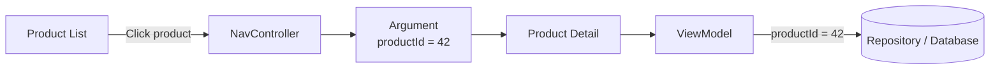
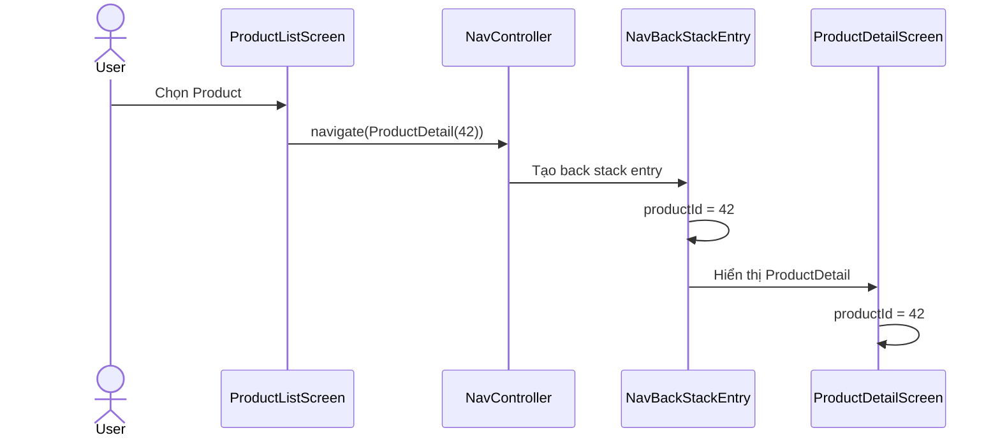
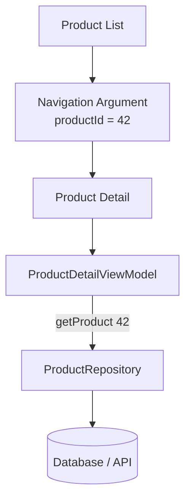
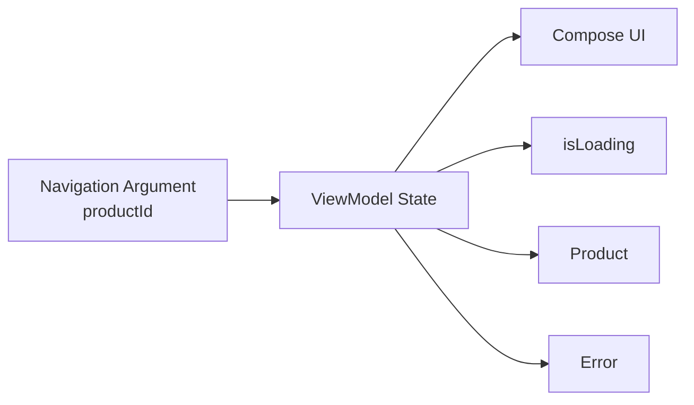
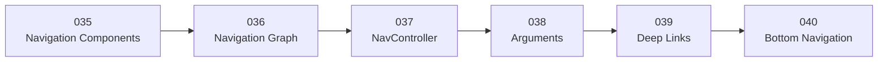

# 038 - Arguments trong Android Navigation

**Học phần:** 02 - App Components and User Interface
**Module:** Module 04 - Interface and Navigation
**Nhóm nội dung:** Navigation
**Nguồn roadmap:** Interface and Navigation / Navigation
**Loại bài:** UI
**Thứ tự trong module:** 038
**Thời lượng gợi ý:** 30 phút

---

## 1. Tóm tắt

Trong Android Navigation, **Arguments** là dữ liệu được truyền từ một destination sang destination khác trong quá trình điều hướng.

Ví dụ:

```text
Product List
     │
     │ productId = 42
     ▼
Product Detail
```

Màn hình `ProductDetail` không cần nhận toàn bộ đối tượng `Product`, mà chỉ cần:

```text
productId = 42
```

sau đó sử dụng ID này để lấy dữ liệu cần thiết từ `ViewModel`, Repository hoặc database.

Android khuyến nghị chỉ truyền **lượng dữ liệu tối thiểu cần thiết**, chẳng hạn ID của đối tượng, thay vì truyền toàn bộ object lớn giữa các destination.

Với Navigation Compose hiện đại, Android hỗ trợ **type-safe routes**: route được biểu diễn bằng các `@Serializable data class` thay vì các chuỗi như `"product/42"`. Các API này có từ Navigation `2.8.0`.

---

# 2. Mục tiêu học tập

Sau bài này, bạn có thể:

* Giải thích được Navigation Argument.
* Hiểu tại sao một destination cần argument.
* Phân biệt:

  * Route
  * Destination
  * Argument
  * Navigation state
* Truyền argument bằng Navigation Compose.
* Sử dụng type-safe route.
* Đọc argument bằng `toRoute<T>()`.
* Lấy argument trong `ViewModel` bằng `SavedStateHandle`.
* Phân biệt required argument và optional argument.
* Biết dữ liệu nào nên và không nên truyền.
* Test navigation argument.
* Xử lý các lỗi argument phổ biến.

---

# 3. Arguments giải quyết vấn đề gì?

Giả sử ứng dụng có danh sách sản phẩm:

```text
┌──────────────────────────┐
│ Product List             │
│                          │
│ Laptop       ID = 42     │
│ Keyboard     ID = 51     │
│ Mouse        ID = 72     │
└──────────────────────────┘
```

Người dùng chọn:

```text
Laptop
```

Ứng dụng cần biết:

> Màn hình Product Detail phải hiển thị sản phẩm nào?

Đây chính là nhiệm vụ của **Navigation Argument**.

```text
Product List
      │
      │ productId = 42
      ▼
Product Detail
      │
      ▼
Load Product #42
```

---

# 4. Arguments nằm ở đâu trong Navigation?



Có thể nhớ:

```text
Destination = Đi đâu?

Argument = Mang thông tin gì tới đó?
```

Ví dụ:

```text
Destination:
ProductDetail

Argument:
productId = 42
```

---

# 5. Ví dụ thực tế

Arguments xuất hiện rất nhiều trong ứng dụng.

| Destination    | Argument         |
| -------------- | ---------------- |
| Product Detail | `productId`      |
| User Profile   | `userId`         |
| Article Detail | `articleId`      |
| Chat           | `conversationId` |
| Order Detail   | `orderId`        |
| Search Result  | `query`          |
| Edit Note      | `noteId`         |
| Video Player   | `videoId`        |

Ví dụ:

```text
Chat List
   │
   ├── conversationId = 105
   │
   ▼
Chat Screen
```

hoặc:

```text
Search
   │
   │ query = "android"
   ▼
Search Results
```

---

# 6. Cách cũ: String Route

Trong các ví dụ Navigation Compose cũ, route thường được viết:

```kotlin
navController.navigate(
    "product/42"
)
```

Graph:

```kotlin
composable(
    route = "product/{productId}"
) {
    // ...
}
```

Cách này dễ hiểu nhưng có một số nhược điểm:

```text
"product/42"

↓ phụ thuộc vào String

"products/42"
"product/abc"
"prodcut/42"
```

Lỗi typo thường chỉ được phát hiện khi chạy chương trình.

Navigation Compose hiện hỗ trợ API type-safe để route và argument được biểu diễn bằng Kotlin type, giúp phát hiện nhiều lỗi ngay từ compile time.

---

# 7. Cách hiện đại: Type-safe Route

Giả sử có màn hình:

```text
ProductDetail
```

và argument:

```text
productId
```

Tạo route:

```kotlin
import kotlinx.serialization.Serializable

@Serializable
data class ProductDetail(
    val productId: Long
)
```

Ở đây:

```text
ProductDetail
     │
     └── productId: Long
```

Kotlin compiler đã biết argument phải là:

```text
Long
```

---

# 8. Navigation với argument

Khi người dùng chọn sản phẩm:

```kotlin
navController.navigate(
    ProductDetail(
        productId = 42L
    )
)
```

Luồng:

```text
Product List
     │
     │ click product #42
     ▼
navController.navigate(
    ProductDetail(42)
)
     │
     ▼
Product Detail
```

Type-safe Navigation đảm bảo dữ liệu đưa vào route phải phù hợp với kiểu đã khai báo.

---

# 9. Nhận argument trong destination

Navigation Graph:

```kotlin
NavHost(
    navController = navController,
    startDestination = ProductList
) {

    composable<ProductList> {

        ProductListScreen(
            onProductClick = { productId ->

                navController.navigate(
                    ProductDetail(
                        productId = productId
                    )
                )
            }
        )
    }

    composable<ProductDetail> { backStackEntry ->

        val route =
            backStackEntry.toRoute<ProductDetail>()

        ProductDetailScreen(
            productId = route.productId
        )
    }
}
```

`NavBackStackEntry.toRoute<T>()` tái tạo route và các argument đã được truyền vào destination.

---

# 10. Luồng dữ liệu



---

# 11. Required Argument

Ví dụ:

```kotlin
@Serializable
data class ProductDetail(
    val productId: Long
)
```

`productId` không có default value.

Nó là:

```text
Required Argument
```

Do đó:

```kotlin
ProductDetail()
```

sẽ không compile.

Phải truyền:

```kotlin
ProductDetail(
    productId = 42
)
```

---

# 12. Optional Argument

Có thể tạo argument có giá trị mặc định:

```kotlin
@Serializable
data class ProductDetail(
    val productId: Long,
    val source: String = "unknown"
)
```

Khi đó:

```kotlin
ProductDetail(
    productId = 42
)
```

tương đương:

```text
productId = 42
source = "unknown"
```

Nhưng cũng có thể:

```kotlin
ProductDetail(
    productId = 42,
    source = "search"
)
```

Kết quả:

```text
productId = 42
source = search
```

Type-safe route sử dụng class/data class cho route có argument và hỗ trợ tham số mặc định trong định nghĩa route.

---

# 13. Nullable Argument

Ví dụ:

```kotlin
@Serializable
data class ProductDetail(
    val productId: Long,
    val campaignId: String? = null
)
```

Có thể gọi:

```kotlin
ProductDetail(
    productId = 42
)
```

khi không có campaign.

Hoặc:

```kotlin
ProductDetail(
    productId = 42,
    campaignId = "summer_sale"
)
```

---

# 14. Không nên truyền toàn bộ Object

Giả sử:

```kotlin
data class Product(
    val id: Long,
    val name: String,
    val description: String,
    val imageUrls: List<String>,
    val reviews: List<Review>,
    val specifications: Map<String, String>
)
```

Không nên thiết kế navigation theo kiểu:

```text
ProductList
     │
     │ toàn bộ Product object
     ▼
ProductDetail
```

Android khuyến nghị chỉ truyền lượng dữ liệu tối thiểu; tổng dung lượng available cho saved state là hữu hạn. Với object phức tạp hoặc dữ liệu lớn, nên lưu dữ liệu ở data layer/ViewModel và chỉ truyền identifier cần thiết.

### Nên

```kotlin
ProductDetail(
    productId = product.id
)
```

Sau đó:

```text
productId
   │
   ▼
ViewModel
   │
   ▼
Repository
   │
   ▼
Product
```

---

# 15. Kiến trúc khuyến nghị



Navigation chỉ chịu trách nhiệm:

```text
Mang ID của dữ liệu
```

Data Layer chịu trách nhiệm:

```text
Cung cấp dữ liệu thực tế
```

---

# 16. Arguments với ViewModel

Trong ứng dụng thực tế, thường không cần lấy argument trong Composable rồi truyền qua nhiều tầng.

Có thể đọc route trực tiếp trong `ViewModel` thông qua:

```text
SavedStateHandle
```

Android hỗ trợ `SavedStateHandle.toRoute<T>()` để lấy type-safe route trong `ViewModel`.

Ví dụ:

```kotlin
class ProductDetailViewModel(
    savedStateHandle: SavedStateHandle,
    private val repository: ProductRepository
) : ViewModel() {

    private val route =
        savedStateHandle.toRoute<ProductDetail>()

    val product =
        repository.observeProduct(
            route.productId
        )
}
```

Kiến trúc:

```text
ProductDetail(42)
       │
       ▼
SavedStateHandle
       │
       ▼
ProductDetailViewModel
       │
       │ productId = 42
       ▼
Repository
```

---

# 17. Tại sao SavedStateHandle quan trọng?

`SavedStateHandle` cung cấp cơ chế key-value cho state của `ViewModel`. Dữ liệu thích hợp được lưu trong saved state có thể được phục hồi sau một số trường hợp process recreation do hệ thống.

Ví dụ:

```text
ProductDetail
productId = 42
       │
       ▼
App vào background
       │
       ▼
Process bị Android terminate
       │
       ▼
App được recreate
       │
       ▼
SavedStateHandle
       │
       ▼
productId = 42
```

Tuy nhiên, saved state không nên được xem như database lâu dài; lifecycle của nó gắn với task và có những trường hợp task biến mất thì saved state cũng không còn.

---

# 18. Ví dụ hoàn chỉnh

## 18.1. Routes

```kotlin
import kotlinx.serialization.Serializable

@Serializable
data object ProductList

@Serializable
data class ProductDetail(
    val productId: Long
)
```

---

## 18.2. ProductListScreen

```kotlin
@Composable
fun ProductListScreen(
    onProductClick: (Long) -> Unit
) {

    Column {

        Button(
            onClick = {
                onProductClick(42L)
            }
        ) {
            Text("Laptop")
        }

        Button(
            onClick = {
                onProductClick(51L)
            }
        ) {
            Text("Keyboard")
        }
    }
}
```

Screen không cần biết:

```text
NavController
Route
NavGraph
```

Nó chỉ phát sự kiện:

```text
onProductClick(productId)
```

---

## 18.3. ProductDetailScreen

```kotlin
@Composable
fun ProductDetailScreen(
    productId: Long,
    onBack: () -> Unit
) {

    Column {

        Text(
            text = "Product ID: $productId"
        )

        Button(
            onClick = onBack
        ) {
            Text("Back")
        }
    }
}
```

---

## 18.4. Navigation Graph

```kotlin
@Composable
fun AppNavigation() {

    val navController =
        rememberNavController()

    NavHost(
        navController = navController,
        startDestination = ProductList
    ) {

        composable<ProductList> {

            ProductListScreen(
                onProductClick = { productId ->

                    navController.navigate(
                        ProductDetail(
                            productId = productId
                        )
                    )
                }
            )
        }

        composable<ProductDetail> { entry ->

            val route =
                entry.toRoute<ProductDetail>()

            ProductDetailScreen(
                productId = route.productId,
                onBack = {
                    navController.popBackStack()
                }
            )
        }
    }
}
```

---

# 19. Luồng chương trình hoàn chỉnh

```text
App start
   │
   ▼
ProductList
   │
   │ User click Laptop
   ▼
onProductClick(42)
   │
   ▼
navController.navigate(
    ProductDetail(42)
)
   │
   ▼
BackStackEntry
   │
   │ productId = 42
   ▼
toRoute<ProductDetail>()
   │
   ▼
ProductDetailScreen
   │
   ▼
Product ID: 42
```

---

# 20. Nhiều Arguments

Một destination có thể có nhiều argument.

Ví dụ:

```kotlin
@Serializable
data class ArticleDetail(
    val articleId: Long,
    val category: String,
    val fromNotification: Boolean = false
)
```

Navigate:

```kotlin
navController.navigate(
    ArticleDetail(
        articleId = 1001,
        category = "android",
        fromNotification = true
    )
)
```

Destination nhận:

```text
articleId        = 1001
category         = android
fromNotification = true
```

---

# 21. Arguments và Deep Link

Arguments trở nên đặc biệt quan trọng khi ứng dụng hỗ trợ deep link.

Ví dụ URL:

```text
myapp://product/42
```

tương ứng:

```text
Destination = ProductDetail
Argument    = productId 42
```

Do đó route nên được thiết kế sao cho destination có đủ thông tin tối thiểu để tự tải dữ liệu của mình.

Android Navigation hỗ trợ cả deep linking và type-safe argument passing như các khả năng cốt lõi của Navigation component.

---

# 22. Arguments không phải Business State

Không nên biến route thành:

```kotlin
ProductDetail(
    productId = 42,
    productName = "...",
    productPrice = ...,
    stock = ...,
    reviews = ...,
    description = ...,
    selectedColor = ...,
    userCart = ...
)
```

Thay vào đó:

```kotlin
ProductDetail(
    productId = 42
)
```

Sau đó:

```text
ProductDetail
     │
     ▼
ViewModel
     │
     ▼
Repository
     │
     ├── Product
     ├── Price
     ├── Inventory
     └── Reviews
```

Argument là **navigation input**, không phải nơi chứa toàn bộ application state. Việc truyền identifier thay vì object lớn cũng phù hợp trực tiếp với khuyến nghị của tài liệu Navigation.

---

# 23. Encapsulate Navigation Arguments

Project lớn có thể tổ chức navigation riêng theo từng feature:

```text
feature/
└── product/
    ├── ProductScreen.kt
    ├── ProductViewModel.kt
    └── ProductNavigation.kt
```

`ProductNavigation.kt`:

```kotlin
@Serializable
internal data class ProductDetail(
    val productId: Long
)
```

Có thể tạo extension:

```kotlin
fun NavController.navigateToProduct(
    productId: Long
) {
    navigate(
        ProductDetail(
            productId = productId
        )
    )
}
```

Sau đó code bên ngoài chỉ cần:

```kotlin
navController.navigateToProduct(
    productId = 42
)
```

Android cũng hướng dẫn pattern đóng gói destination bằng `NavGraphBuilder` extension và navigation event bằng `NavController` extension để giảm coupling giữa các feature.

---

# 24. Sai lầm phổ biến

## Sai lầm 1 — truyền toàn bộ Object

Không nên:

```text
navigate(Product)
```

nếu object chứa nhiều dữ liệu.

Nên:

```text
navigate(productId)
```

---

## Sai lầm 2 — dùng String route thủ công

Ví dụ:

```kotlin
navController.navigate(
    "product/$productId"
)
```

Dễ dẫn tới:

```text
product/
products/
prodcut/
product/abc
```

Với Navigation Compose hiện đại, type-safe route giúp chuyển nhiều lỗi loại này thành lỗi compile-time.

---

## Sai lầm 3 — argument type không đúng

Route:

```kotlin
@Serializable
data class ProductDetail(
    val productId: Long
)
```

Sai:

```kotlin
ProductDetail(
    productId = "42"
)
```

Compiler sẽ báo lỗi vì:

```text
String ≠ Long
```

Đây là một lợi ích trực tiếp của type-safe routes.

---

## Sai lầm 4 — dùng Argument như database

Không nên:

```text
Route
 ├── Product
 ├── User
 ├── Cart
 └── Reviews
```

Nên:

```text
Route
 └── productId
       │
       ▼
Repository
       │
       ▼
Product Data
```

---

# 25. Debug Arguments

Có thể log argument:

```kotlin
composable<ProductDetail> { entry ->

    val route =
        entry.toRoute<ProductDetail>()

    Log.d(
        "Navigation",
        "productId=${route.productId}"
    )
}
```

Logcat:

```text
D/Navigation: productId=42
```

Nếu màn hình hiển thị sai product, kiểm tra lần lượt:

```text
Click item
   │
   ▼
productId đúng?
   │
   ▼
navigate() đúng?
   │
   ▼
toRoute() đúng?
   │
   ▼
ViewModel nhận đúng?
   │
   ▼
Repository query đúng?
```

---

# 26. Testing Arguments

Android cung cấp:

```text
TestNavHostController
```

để test Navigation Compose. Test có thể thực hiện click thật trên UI rồi kiểm tra destination hoặc route hiện tại.

Ví dụ:

```kotlin
@Test
fun clickProduct_navigatesWithCorrectId() {

    composeTestRule
        .onNodeWithText("Laptop")
        .performClick()

    val route =
        navController
            .currentBackStackEntry
            ?.toRoute<ProductDetail>()

    assertEquals(
        42L,
        route?.productId
    )
}
```

Test này bảo vệ cả:

```text
Navigation destination
+
Navigation argument
```

---

# 27. Nên test những gì?

Giả sử route:

```kotlin
@Serializable
data class ProductDetail(
    val productId: Long,
    val source: String = "unknown"
)
```

Checklist:

```text
[ ] productId đúng
[ ] source đúng
[ ] default source hoạt động
[ ] Back hoạt động
[ ] Product đúng được tải
[ ] Invalid ID được xử lý
[ ] Data không tồn tại được xử lý
[ ] Loading state hoạt động
[ ] Error state hoạt động
```

---

# 28. Arguments và UI State

Ví dụ:

```text
ProductDetail(productId = 42)
```

`productId` là:

```text
Navigation state
```

Trong khi:

```text
isLoading
product
error
selectedTab
quantity
```

thường thuộc:

```text
Screen / ViewModel state
```

Có thể hình dung:



---

# 29. Mini Project thực hành

## Product Catalog

Tạo ứng dụng:

```text
Home
 │
 ▼
Product List
 │
 │ productId
 ▼
Product Detail
```

### Route

```kotlin
@Serializable
data object Home

@Serializable
data object ProductList

@Serializable
data class ProductDetail(
    val productId: Long
)
```

---

## Yêu cầu

### Home

Có nút:

```text
Browse Products
```

Đi tới:

```text
ProductList
```

### ProductList

Hiển thị:

```text
Laptop       #42
Keyboard     #51
Mouse        #72
```

Khi chọn Laptop:

```text
ProductDetail(
    productId = 42
)
```

### ProductDetail

Hiển thị:

```text
Product ID: 42

Laptop
Price: ...
Description: ...
```

---

# 30. Bài tập mở rộng

Thêm:

```kotlin
@Serializable
data class ProductDetail(
    val productId: Long,
    val source: String = "product_list"
)
```

Nếu vào từ Search:

```kotlin
ProductDetail(
    productId = 42,
    source = "search"
)
```

Nếu vào từ Home:

```kotlin
ProductDetail(
    productId = 42,
    source = "home"
)
```

Sau đó hiển thị debug:

```text
Product #42

Opened from:
Search
```

---

# 31. Bài tập tư duy

Cho route:

```kotlin
@Serializable
data class UserProfile(
    val userId: Long,
    val showPosts: Boolean = true
)
```

### Câu 1

Đoạn nào hợp lệ?

```kotlin
UserProfile(
    userId = 10
)
```

**Đáp án:** Hợp lệ.

Kết quả:

```text
userId = 10
showPosts = true
```

---

### Câu 2

Đoạn này thì sao?

```kotlin
UserProfile(
    userId = "10"
)
```

**Đáp án:** Không hợp lệ.

Vì:

```text
String
≠
Long
```

---

### Câu 3

Nên truyền:

```text
User object 2 MB
```

hay:

```text
userId = 10
```

**Đáp án:**

```text
userId = 10
```

sau đó lấy dữ liệu từ data layer. Đây là cách phù hợp với hướng dẫn Android về việc chỉ truyền lượng dữ liệu tối thiểu giữa các destination.

---

# 32. Artifact cho Portfolio

Có thể tạo:

```text
NavigationArgumentsDemo/
│
├── navigation/
│   └── AppNavigation.kt
│
├── product/
│   ├── ProductListScreen.kt
│   ├── ProductDetailScreen.kt
│   └── ProductDetailViewModel.kt
│
├── data/
│   └── ProductRepository.kt
│
└── README.md
```

README:

```markdown
# Navigation Arguments Demo

## Topics

- Navigation Compose
- NavController
- Type-safe Routes
- Navigation Arguments
- NavBackStackEntry
- SavedStateHandle
- ViewModel
- Navigation Testing

## Flow

Product List
    ↓ productId
Product Detail

## Architecture

Navigation passes only productId.

Product data is loaded from Repository
through ProductDetailViewModel.
```

---

# 33. Production Checklist

## Route

* [ ] Route có tên rõ ràng.
* [ ] Argument có type rõ ràng.
* [ ] Required argument thực sự bắt buộc.
* [ ] Optional argument có default hợp lý.
* [ ] Ưu tiên type-safe route.

## Data

* [ ] Chỉ truyền dữ liệu tối thiểu.
* [ ] Ưu tiên ID/key.
* [ ] Không truyền object lớn.
* [ ] Business data nằm trong data layer.

## State

* [ ] Argument được đọc đúng sau recreation.
* [ ] ViewModel sử dụng `SavedStateHandle` khi phù hợp.
* [ ] Loading state được xử lý.
* [ ] Error state được xử lý.
* [ ] ID không tồn tại không làm app crash.

## Navigation

* [ ] Destination nhận đúng argument.
* [ ] Deep link truyền đúng argument nếu có.
* [ ] Back Stack hoạt động đúng.
* [ ] Không tạo destination duplicate ngoài ý muốn.

## Testing

* [ ] Test destination.
* [ ] Test argument.
* [ ] Test default argument.
* [ ] Test invalid data.
* [ ] Test UI loading/error.

---

# 34. Navigation 2 và Android Roadmap 2026

Tài liệu Android hiện tại vẫn hỗ trợ Navigation Compose với `NavController`, đồng thời type-safe APIs đã trở thành cách quan trọng để khai báo route và argument trong Navigation 2. Các tài liệu Android hiện tại minh họa Navigation Compose bằng serializable route types và `toRoute<T>()`.

Vì vậy đối với roadmap học Android:

```text
Không nên chỉ học:

"product/{id}"
       +
String manipulation
```

Mà nên ưu tiên hiểu:

```text
@Serializable
data class ProductDetail(
    val productId: Long
)
```

---

# 35. Liên hệ với các bài Navigation

Arguments nằm trong chuỗi kiến thức:



Trong đó:

```text
Navigation Graph
      ↓
Xác định các destination

NavController
      ↓
Điều hướng giữa destination

Arguments
      ↓
Mang dữ liệu cần thiết tới destination

Deep Link
      ↓
Có thể mở trực tiếp destination + arguments
```

---

# 36. Ghi nhớ nhanh

### Không argument

```kotlin
@Serializable
data object Home
```

### Có argument

```kotlin
@Serializable
data class ProductDetail(
    val productId: Long
)
```

### Navigate

```kotlin
navController.navigate(
    ProductDetail(
        productId = 42
    )
)
```

### Nhận argument

```kotlin
val route =
    backStackEntry
        .toRoute<ProductDetail>()

val productId =
    route.productId
```

### Trong ViewModel

```kotlin
val route =
    savedStateHandle
        .toRoute<ProductDetail>()
```

### Quy tắc quan trọng nhất

```text
KHÔNG:

Navigation
   ↓
Toàn bộ Object

NÊN:

Navigation
   ↓
ID
   ↓
ViewModel
   ↓
Repository
   ↓
Data
```

---

# 37. Checklist hoàn thành bài học

* [ ] Giải thích được Navigation Argument.
* [ ] Hiểu argument dùng để làm gì.
* [ ] Phân biệt Route và Argument.
* [ ] Biết required argument.
* [ ] Biết optional argument.
* [ ] Biết nullable argument.
* [ ] Biết tạo type-safe route.
* [ ] Biết `navController.navigate(Route(...))`.
* [ ] Biết `NavBackStackEntry.toRoute<T>()`.
* [ ] Biết `SavedStateHandle.toRoute<T>()`.
* [ ] Không truyền object lớn qua navigation.
* [ ] Biết ưu tiên truyền ID.
* [ ] Biết test argument.
* [ ] Có mini project để đưa vào portfolio.

---

# 38. Tổng kết

`Arguments` là cầu nối dữ liệu giữa các destination:

```text
Screen A
   │
   │ argument
   ▼
Navigation
   │
   ▼
Screen B
```

Trong Android hiện đại, cách thiết kế nên hướng tới:

```text
Type-safe Route
       +
Minimal Arguments
       +
ViewModel
       +
Repository
```

Ví dụ chuẩn:

```text
ProductList
    │
    │ productId = 42
    ▼
ProductDetail
    │
    ▼
SavedStateHandle / toRoute()
    │
    ▼
ViewModel
    │
    ▼
Repository
    │
    ▼
Product #42
```

Điểm quan trọng nhất của bài:

> **Navigation Argument nên mô tả đủ thông tin để xác định destination và dữ liệu cần tải, nhưng không nên biến Navigation thành nơi vận chuyển toàn bộ business data.** Android khuyến nghị truyền dữ liệu tối thiểu, thường là identifier/key, rồi tải dữ liệu thực tế từ data layer ở destination.

---

# Bài luyện tập

## Mục tiêu


## Đề bài


## Yêu cầu hoàn thành

- [ ] 
- [ ] 
- [ ] 

## Kết quả / lời giải


## Ghi chú
