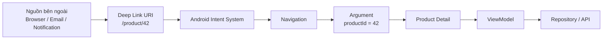
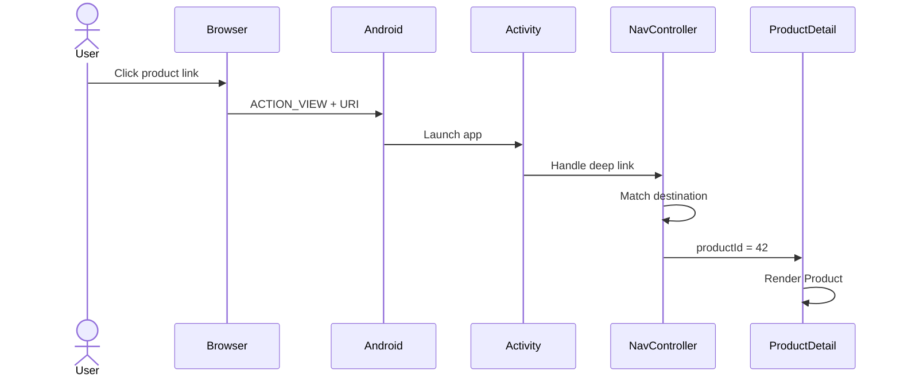
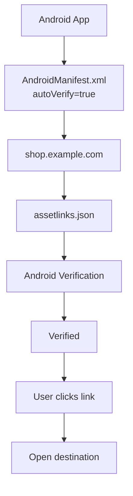
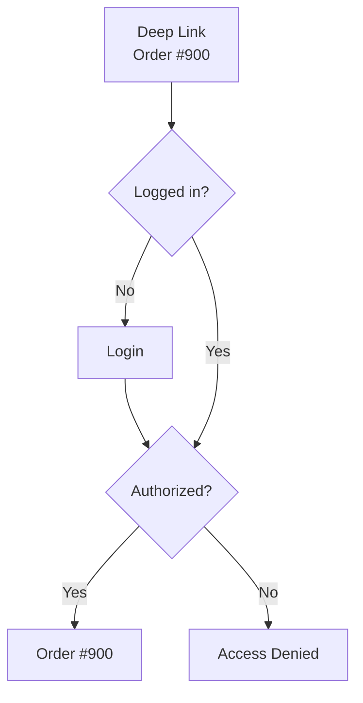
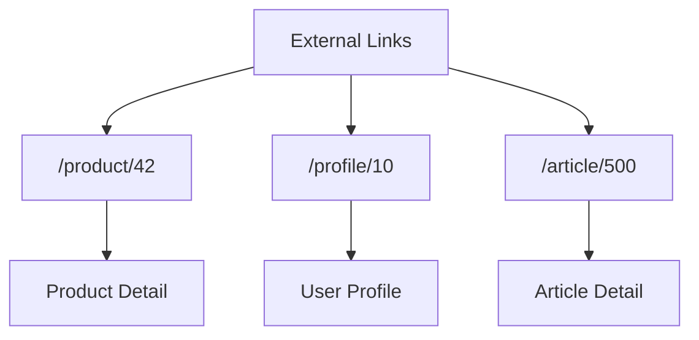
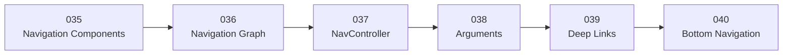

# 039 - Deep Links trong Android

**Học phần:** 02 - App Components and User Interface
**Module:** Module 04 - Interface and Navigation
**Nhóm nội dung:** Navigation
**Nguồn roadmap:** Interface and Navigation / Navigation
**Loại bài:** UI
**Thứ tự trong module:** 039
**Thời lượng gợi ý:** 30 phút

---

# 1. Tóm tắt

**Deep Link** là một liên kết cho phép người dùng đi **trực tiếp tới một destination cụ thể bên trong ứng dụng**, thay vì luôn phải bắt đầu từ màn hình Home.

Ví dụ, ứng dụng bán hàng bình thường có luồng:

```text
Home
 ↓
Product List
 ↓
Product Detail
```

Nhưng với Deep Link:

```text
https://example.com/product/42
             │
             ▼
      Product Detail #42
```

Người dùng có thể mở thẳng sản phẩm `42` từ:

* trình duyệt;
* email;
* tin nhắn;
* notification;
* mạng xã hội;
* QR code;
* ứng dụng khác.

Android định nghĩa deep linking là cơ chế đưa người dùng trực tiếp tới nội dung cụ thể trong ứng dụng. Navigation Component có hỗ trợ xử lý deep link tới các destination trong navigation graph.

---

# 2. Mục tiêu học tập

Sau bài này, bạn có thể:

* Giải thích được Deep Link là gì.
* Hiểu tại sao Deep Link quan trọng với UX.
* Phân biệt:

  * Custom Deep Link
  * Web Link
  * Android App Link
* Hiểu Explicit Deep Link và Implicit Deep Link.
* Tạo Deep Link cho Navigation Compose.
* Kết hợp Deep Link với Arguments.
* Sử dụng type-safe route.
* Khai báo `intent-filter` trong `AndroidManifest.xml`.
* Hiểu `android:autoVerify`.
* Hiểu vai trò của `assetlinks.json`.
* Test Deep Link bằng ADB.
* Kiểm tra trạng thái App Links.
* Xử lý authentication khi mở Deep Link.
* Tránh các lỗi bảo mật phổ biến.
* Xây dựng mini project có Deep Link cho portfolio.

---

# 3. Deep Link giải quyết vấn đề gì?

Giả sử người dùng nhận được đường dẫn:

```text
https://shop.example.com/products/42
```

Nếu không có Deep Link:

```text
Click link
   │
   ▼
Browser
   │
   ▼
Website
```

Nếu ứng dụng hỗ trợ Deep Link:

```text
Click link
   │
   ▼
Android
   │
   ▼
My App
   │
   ▼
Product Detail #42
```

Deep Link giúp rút ngắn user flow:

```text
Không Deep Link:

Link
 ↓
Home
 ↓
Products
 ↓
Search
 ↓
Product #42
```

thành:

```text
Deep Link:

Link
 ↓
Product #42
```

Android cho phép deep link được kích hoạt từ web browser, notification, social media và các nguồn bên ngoài khác.

---

# 4. Deep Link nằm ở đâu trong Navigation?



Có thể nhớ:

```text
Deep Link
    ↓
Xác định destination
    +
Cung cấp arguments cần thiết
```

Ví dụ:

```text
https://example.com/product/42
                           │
                           └── productId
```

---

# 5. Ví dụ Deep Link thực tế

| Ứng dụng   | Link               | Destination       |
| ---------- | ------------------ | ----------------- |
| E-commerce | `/product/42`      | Product Detail    |
| News       | `/article/1001`    | Article Detail    |
| Social     | `/user/15`         | User Profile      |
| Chat       | `/conversation/81` | Chat Screen       |
| Video      | `/watch/abc123`    | Video Player      |
| Booking    | `/booking/900`     | Booking Detail    |
| Food       | `/restaurant/21`   | Restaurant Detail |
| Learning   | `/lesson/39`       | Lesson Screen     |

Ví dụ:

```text
https://news.example.com/article/1001
```

có thể ánh xạ thành:

```text
ArticleDetail(
    articleId = 1001
)
```

---

# 6. Ba loại Deep Link quan trọng

Android phân biệt ba nhóm phổ biến:

1. **Custom Deep Links**
2. **Web Links**
3. **Android App Links**

---

# 7. Custom Deep Link

Custom Deep Link sử dụng một URI scheme riêng.

Ví dụ:

```text
myshop://product/42
```

Thành phần:

```text
myshop://product/42
│       │       │
│       │       └── argument
│       └────────── path
└────────────────── custom scheme
```

Ví dụ khác:

```text
myapp://profile/10
```

```text
spotify://...
```

```text
sampleapp://checkout/123
```

Custom schemes hữu ích với các luồng nội bộ hoặc khi bạn kiểm soát nguồn tạo link, nhưng scheme tùy chỉnh không chứng minh quyền sở hữu như Android App Links; ứng dụng khác cũng có thể đăng ký cùng scheme.

---

# 8. Web Link

Web Link dùng:

```text
http://
```

hoặc:

```text
https://
```

Ví dụ:

```text
https://example.com/product/42
```

Đây là URL web thông thường.

Trên các phiên bản Android hiện đại, đặc biệt từ Android 12, web URL không được xác minh thường được ưu tiên xử lý bởi trình duyệt thay vì tự động mở ứng dụng.

---

# 9. Android App Links

**Android App Links** là web link sử dụng HTTP/HTTPS nhưng được Android **xác minh quan hệ giữa website và ứng dụng**.

Ví dụ:

```text
https://shop.example.com/product/42
```

Sau khi domain được xác minh:

```text
User click
     │
     ▼
https://shop.example.com/product/42
     │
     ▼
Android verifies association
     │
     ▼
Shop App
     │
     ▼
Product #42
```

App Links sử dụng Digital Asset Links để thiết lập liên kết tin cậy giữa ứng dụng và website. Khi việc xác minh thành công, Android có thể chuyển URL phù hợp trực tiếp tới ứng dụng mà không cần hộp thoại chọn app.

---

# 10. Custom Deep Link vs Web Link vs App Link

| Loại             | Ví dụ                            | Domain Verification | Khuyến nghị                      |
| ---------------- | -------------------------------- | ------------------: | -------------------------------- |
| Custom Deep Link | `myapp://product/42`             |                   ❌ | Luồng đặc biệt/nội bộ            |
| Web Link         | `https://example.com/product/42` |                   ❌ | Web URL thông thường             |
| Android App Link | `https://example.com/product/42` |                   ✅ | Nên dùng với website mình sở hữu |

Nếu ứng dụng có website riêng, Android khuyến nghị dùng **App Links** để có trải nghiệm đáng tin cậy và liền mạch hơn.

---

# 11. Explicit Deep Link và Implicit Deep Link

Ở cấp Navigation, Android còn phân biệt:

```text
Deep Link
├── Explicit
└── Implicit
```

---

# 12. Explicit Deep Link

Explicit Deep Link sử dụng một `PendingIntent` đã biết chính xác destination của ứng dụng.

Trường hợp điển hình:

```text
Notification
     │
     ▼
Product #42
```

Ví dụ notification:

```text
Your order #900 has shipped
```

Người dùng nhấn notification:

```text
Notification
     │
     ▼
OrderDetail(900)
```

Android nêu notification và app widget là hai ví dụ phổ biến cho explicit deep links.

---

# 13. Implicit Deep Link

Implicit Deep Link thường bắt đầu bằng một URI:

```text
https://example.com/product/42
```

Android sử dụng Intent resolution để xác định thành phần nào có khả năng xử lý URI đó.

Ví dụ:

```text
Browser
   │
   ▼
ACTION_VIEW
   │
   ▼
https://example.com/product/42
   │
   ▼
Android Intent Resolver
   │
   ▼
My App
```

---

# 14. Deep Link với Navigation Compose

Giả sử có destination:

```text
ProductDetail
```

Argument:

```text
productId
```

Với type-safe Navigation:

```kotlin
import kotlinx.serialization.Serializable

@Serializable
data class ProductDetail(
    val productId: Long
)
```

Navigation Compose hiện hỗ trợ type-safe routes thông qua các serializable route classes.

---

# 15. Định nghĩa Deep Link cho destination

Navigation Compose cho phép khai báo Deep Link trong `composable()` thông qua:

```text
deepLinks
```

và:

```text
navDeepLink()
```

Ví dụ:

```kotlin
@Serializable
data class ProductDetail(
    val productId: Long
)

val productBaseUrl =
    "https://shop.example.com/product"

NavHost(
    navController = navController,
    startDestination = Home
) {

    composable<ProductDetail>(
        deepLinks = listOf(
            navDeepLink<ProductDetail>(
                basePath = productBaseUrl
            )
        )
    ) { backStackEntry ->

        val route =
            backStackEntry.toRoute<ProductDetail>()

        ProductDetailScreen(
            productId = route.productId
        )
    }
}
```

Với route:

```kotlin
data class ProductDetail(
    val productId: Long
)
```

argument bắt buộc có thể được đưa vào URI dưới dạng path parameter khi type-safe `navDeepLink` xây dựng URI pattern.

Kết quả về mặt khái niệm:

```text
https://shop.example.com/product/42
```

↓

```text
ProductDetail(
    productId = 42
)
```

---

# 16. Luồng xử lý Deep Link



Với launch mode mặc định `standard`, Navigation có thể tự xử lý deep link từ `Intent`. Android khuyến nghị giữ launch mode mặc định khi sử dụng Navigation; nếu dùng một launch mode như `singleTop`, việc xử lý `onNewIntent()` có thể cần thực hiện thủ công.

---

# 17. Deep Link + Arguments

Deep Link thường đi cùng với Arguments.

Ví dụ:

```text
https://example.com/users/42
```

Trong đó:

```text
42
```

là:

```text
userId
```

Route:

```kotlin
@Serializable
data class UserProfile(
    val userId: Long
)
```

Deep Link:

```text
https://example.com/users/42
```

↓

```kotlin
UserProfile(
    userId = 42
)
```

Đây chính là mối liên hệ giữa:

```text
038 - Arguments
       ↓
039 - Deep Links
```

---

# 18. Required Argument

Route:

```kotlin
@Serializable
data class ProductDetail(
    val productId: Long
)
```

`productId` là required.

Vì vậy:

```text
/product/42
```

hợp lệ.

Nhưng:

```text
/product/
```

không cung cấp argument bắt buộc cần để dựng route.

Android Navigation hỗ trợ placeholder trong URI và ánh xạ chúng tới navigation arguments của destination.

---

# 19. Optional Argument

Ví dụ:

```kotlin
@Serializable
data class ProductDetail(
    val productId: Long,
    val campaign: String = "organic"
)
```

Có thể biểu diễn dạng:

```text
/product/42
```

hoặc một URI có query parameter:

```text
/product/42?campaign=summer
```

Các argument có default value được type-safe `NavDeepLink` biểu diễn như query parameters trong URI pattern được tạo tự động.

---

# 20. AndroidManifest.xml

Chỉ khai báo Deep Link trong Navigation Graph **chưa đủ** để ứng dụng nhận URL từ ứng dụng bên ngoài khi sử dụng graph được tạo bằng code.

Programmatic graph như Navigation Compose được xây dựng runtime nên Navigation không thể tự sinh `<intent-filter>` vào Manifest; developer phải khai báo intent filter phù hợp.

Ví dụ:

```xml
<activity
    android:name=".MainActivity"
    android:exported="true">

    <intent-filter>

        <action
            android:name="android.intent.action.VIEW" />

        <category
            android:name="android.intent.category.DEFAULT" />

        <category
            android:name="android.intent.category.BROWSABLE" />

        <data
            android:scheme="https"
            android:host="shop.example.com" />

    </intent-filter>

</activity>
```

---

# 21. ACTION_VIEW

Deep Link URL thường được gửi bằng:

```text
android.intent.action.VIEW
```

Ví dụ:

```text
ACTION_VIEW
     +
https://shop.example.com/product/42
```

Android yêu cầu `ACTION_VIEW` trong intent filter dùng để xử lý các URL kiểu này.

---

# 22. CATEGORY_BROWSABLE

Manifest:

```xml
<category
    android:name="android.intent.category.BROWSABLE" />
```

`BROWSABLE` cho phép Activity được mở bởi một liên kết xuất phát từ browser.

Nếu thiếu category này, link từ trình duyệt sẽ không resolve tới Activity theo cách mong muốn.

---

# 23. CATEGORY_DEFAULT

Ngoài ra:

```xml
<category
    android:name="android.intent.category.DEFAULT" />
```

cho phép Activity tham gia xử lý implicit intents theo cơ chế thông thường của Android.

---

# 24. Android App Links với autoVerify

Đối với Android App Links:

```xml
<intent-filter
    android:autoVerify="true">

    <action
        android:name="android.intent.action.VIEW" />

    <category
        android:name="android.intent.category.DEFAULT" />

    <category
        android:name="android.intent.category.BROWSABLE" />

    <data
        android:scheme="https" />

    <data
        android:host="shop.example.com" />

</intent-filter>
```

`android:autoVerify="true"` yêu cầu Android thử xác minh quan hệ giữa app và domain được khai báo.

---

# 25. assetlinks.json

App Links cần một file:

```text
assetlinks.json
```

được host tại vị trí well-known trên website.

Về mặt khái niệm:

```text
Website
   │
   └── .well-known/
           │
           └── assetlinks.json
```

File này khai báo:

```text
Website
   │
   └── cho phép
           │
           ▼
      Android App
```

Thông tin quan trọng bao gồm:

```text
package_name

sha256_cert_fingerprints
```

Android tải Digital Asset Links file và so khớp thông tin package/signing certificate để xác minh association.

---

# 26. Quy trình xác minh App Links



Quy trình cơ bản của App Links là:

1. Manifest khai báo domain.
2. Intent filter bật `autoVerify`.
3. Website cung cấp `assetlinks.json`.
4. Android kiểm tra association.
5. Link được mở trực tiếp bằng app nếu verification thành công.

---

# 27. Dynamic App Links

Từ Android 15 trở lên, Android hỗ trợ **Dynamic App Links** trên thiết bị có Google services.

Dynamic App Links có thể cho phép thay đổi một số rule ở phía server thông qua:

```text
assetlinks.json
```

mà không cần phát hành APK mới cho mỗi thay đổi rule phù hợp.

Ví dụ:

```text
Ngày 1

/promo/summer
        ↓
SummerSaleScreen
```

Sau chiến dịch:

```text
Server cập nhật rule
        ↓
Link không còn được route như trước
```

Android 15+ có thể định kỳ lấy lại configuration này.

---

# 28. Deep Link và ViewModel

Không nên để Deep Link tải dữ liệu trực tiếp trong Navigation.

Nên:

```text
Deep Link

https://example.com/product/42
               │
               ▼
          productId
               │
               ▼
            Route
               │
               ▼
           ViewModel
               │
               ▼
          Repository
               │
               ▼
         Product Data
```

Ví dụ:

```kotlin
class ProductDetailViewModel(
    savedStateHandle: SavedStateHandle,
    private val repository: ProductRepository
) : ViewModel() {

    private val route =
        savedStateHandle
            .toRoute<ProductDetail>()

    val product =
        repository.observeProduct(
            route.productId
        )
}
```

Type-safe route arguments có thể được đọc từ `SavedStateHandle` thông qua `toRoute<T>()`.

---

# 29. Deep Link không được bỏ qua Authentication

Giả sử có Deep Link:

```text
https://example.com/orders/900
```

Nhưng order `900` yêu cầu:

```text
User logged in
```

Không được thiết kế:

```text
Deep Link
   │
   ▼
Order #900
```

mà không kiểm tra authentication.

Nên:



Android Security khuyến nghị kiểm tra authentication, authorization và validation của dữ liệu nhận từ Deep Link trước khi hiển thị nội dung nhạy cảm.

---

# 30. Deep Link là External Input

Một nguyên tắc production cực kỳ quan trọng:

> **Không được tin tưởng dữ liệu từ Deep Link.**

Ví dụ attacker có thể thử:

```text
myapp://order/-1
```

hoặc:

```text
myapp://user/admin
```

hoặc:

```text
myapp://payment?amount=-100000
```

Do đó:

```text
Deep Link
   │
   ▼
Parse
   │
   ▼
Validate
   │
   ▼
Authenticate
   │
   ▼
Authorize
   │
   ▼
Execute
```

Android Security khuyến nghị validate/sanitize toàn bộ dữ liệu từ deep links và kiểm tra trạng thái authorization trước khi thực hiện hành động nhạy cảm.

---

# 31. Không truyền dữ liệu nhạy cảm trực tiếp qua URL

Tránh thiết kế URL kiểu:

```text
https://example.com/account
    ?password=123456
```

hoặc:

```text
/payment?creditCard=...
```

Deep Link nên chủ yếu truyền các identifier hoặc token được thiết kế an toàn cho use case tương ứng.

Ví dụ:

```text
/product/42
```

tốt hơn việc đưa toàn bộ thông tin sản phẩm vào URL.

---

# 32. Deep Link với Navigation Callback

Composable không nên phải biết cách Navigation được triển khai.

Ví dụ tốt:

```kotlin
@Composable
fun ProductScreen(
    productId: Long,
    onBack: () -> Unit
) {

    // UI
}
```

Navigation layer chịu trách nhiệm:

```text
Deep Link
   ↓
NavController
   ↓
Route
   ↓
Screen
```

Screen chỉ nhận:

```text
productId
```

---

# 33. Back Stack khi mở Deep Link

Deep Link không chỉ liên quan tới destination hiện tại mà còn liên quan tới **back stack**.

Ví dụ người dùng mở:

```text
https://example.com/product/42
```

UX tốt cần xem xét:

```text
Product #42
    │
    │ Back
    ▼
???
```

Navigation có các quy tắc khác nhau tùy loại Deep Link và flags của Intent. Với implicit deep link có `FLAG_ACTIVITY_NEW_TASK`, task stack có thể được dựng lại; nếu không có flag đó, Back có thể đưa người dùng trở về ứng dụng trước đó.

Do đó production phải test:

```text
Browser
   ↓
Product Detail
   ↓ Back
Browser
```

và:

```text
Cold Start App
   ↓
Deep Link
   ↓
Product Detail
   ↓ Back
Parent Screen
```

theo UX mà ứng dụng mong muốn.

---

# 34. Deep Link từ Notification

Ví dụ notification:

```text
┌─────────────────────────────┐
│ Order shipped               │
│ Order #900 is on the way    │
└─────────────────────────────┘
```

Người dùng click:

```text
Notification
     │
     ▼
OrderDetail(
    orderId = 900
)
```

Explicit deep links dựa trên `PendingIntent` phù hợp với các use case như notification và widget. Với programmatic graph như Navigation Compose, Android hiện khuyến nghị dùng `TaskStackBuilder` khi xây dựng deep-link `PendingIntent`.

---

# 35. Ví dụ Mini App hoàn chỉnh

## Routes

```kotlin
@Serializable
data object Home

@Serializable
data class ProductDetail(
    val productId: Long
)
```

---

## Navigation

```kotlin
@Composable
fun AppNavigation() {

    val navController =
        rememberNavController()

    NavHost(
        navController = navController,
        startDestination = Home
    ) {

        composable<Home> {

            HomeScreen(
                onProductClick = { productId ->

                    navController.navigate(
                        ProductDetail(
                            productId = productId
                        )
                    )
                }
            )
        }

        composable<ProductDetail>(
            deepLinks = listOf(

                navDeepLink<ProductDetail>(
                    basePath =
                        "https://shop.example.com/product"
                )
            )
        ) { backStackEntry ->

            val route =
                backStackEntry
                    .toRoute<ProductDetail>()

            ProductDetailScreen(
                productId = route.productId,
                onBack = {
                    navController.popBackStack()
                }
            )
        }
    }
}
```

Đây là pattern type-safe Deep Link hiện được Navigation Compose hỗ trợ.

---

# 36. Manifest cho Mini App

```xml
<activity
    android:name=".MainActivity"
    android:exported="true">

    <intent-filter
        android:autoVerify="true">

        <action
            android:name="android.intent.action.VIEW" />

        <category
            android:name="android.intent.category.DEFAULT" />

        <category
            android:name="android.intent.category.BROWSABLE" />

        <data
            android:scheme="https" />

        <data
            android:host="shop.example.com" />

    </intent-filter>

</activity>
```

Đối với App Links, domain association phía server cũng phải được cấu hình đúng.

---

# 37. Luồng chương trình

```text
User clicks:

https://shop.example.com/product/42

             │
             ▼

Android Intent System

             │
             ▼

MainActivity

             │
             ▼

NavController

             │
             ▼

Match Deep Link

             │
             ▼

ProductDetail(
    productId = 42
)

             │
             ▼

ProductDetailViewModel

             │
             ▼

ProductRepository

             │
             ▼

Product #42
```

---

# 38. Test Deep Link bằng ADB

Deep Links cần được test trên emulator hoặc thiết bị thật.

Ví dụ:

```bash
adb shell am start \
    -a android.intent.action.VIEW \
    -d "https://shop.example.com/product/42"
```

ADB có thể gửi một `ACTION_VIEW` Intent với URL để mô phỏng người dùng mở link từ bên ngoài. Android cũng sử dụng cách kiểm tra này trong tài liệu kiểm thử deep links/App Links.

Kết quả mong đợi:

```text
App opens
    ↓
ProductDetail
    ↓
Product ID = 42
```

---

# 39. Kiểm tra App Link Verification

Có thể yêu cầu Android thực hiện lại việc xác minh:

```bash
adb shell pm verify-app-links \
    --re-verify com.example.app
```

Sau đó kiểm tra:

```bash
adb shell pm get-app-links \
    com.example.app
```

Kết quả có thể bao gồm:

```text
Domain verification state:

shop.example.com: verified
```

Android hỗ trợ các command này để kiểm tra trạng thái App Links trên các thiết bị hiện đại.

---

# 40. Reset App Link State

Trong quá trình debug:

```bash
adb shell pm set-app-links \
    --package com.example.app \
    0 all
```

Sau đó re-verify:

```bash
adb shell pm verify-app-links \
    --re-verify com.example.app
```

Android documentation đề xuất flow reset → verify → kiểm tra trạng thái để debug domain verification.

---

# 41. Debug Deep Link

Nếu link không mở đúng màn hình, kiểm tra theo thứ tự:

```text
URL
 ↓
Intent Filter
 ↓
Scheme
 ↓
Host
 ↓
Path
 ↓
App Links verification
 ↓
Navigation Deep Link pattern
 ↓
Arguments
 ↓
Destination
```

---

# 42. Lỗi 1 - Sai Host

Manifest:

```text
shop.example.com
```

nhưng URL:

```text
www.example.com
```

Hai hostname khác nhau.

Kết quả:

```text
Intent filter không match
```

---

# 43. Lỗi 2 - Quên BROWSABLE

Sai:

```xml
<intent-filter>

    <action
        android:name="android.intent.action.VIEW" />

</intent-filter>
```

Thiếu:

```xml
<category
    android:name=
        "android.intent.category.BROWSABLE" />
```

Link từ browser sẽ không hoạt động đúng theo deep-link intent filter mong muốn.

---

# 44. Lỗi 3 - Navigation có Deep Link nhưng Manifest không có

Ví dụ đã khai báo:

```kotlin
composable<ProductDetail>(
    deepLinks = ...
)
```

nhưng Manifest không khai báo intent filter.

Khi đó:

```text
Browser
   │
   X
   │
App
```

Programmatic Navigation Graph không thể tự thêm intent filters vào AndroidManifest; phải khai báo chúng thủ công.

---

# 45. Lỗi 4 - assetlinks.json sai

Ví dụ:

```text
Package:
com.example.shop
```

nhưng file server lại có:

```text
com.example.shopp
```

hoặc certificate fingerprint không khớp.

Kết quả:

```text
Verification failed
```

Android kiểm tra package name và SHA-256 fingerprint trong Digital Asset Links association.

---

# 46. Lỗi 5 - Không kiểm tra User Authentication

Deep Link:

```text
/orders/900
```

không có nghĩa là người mở link có quyền xem Order `900`.

Sai:

```text
orderId = 900
     ↓
Show Order
```

Đúng:

```text
orderId = 900
     ↓
Authenticated?
     ↓
Authorized?
     ↓
Show Order
```

---

# 47. Lỗi 6 - Thực hiện action nguy hiểm ngay từ Deep Link

Không nên thiết kế:

```text
myapp://delete-account
```

và ngay lập tức:

```text
Delete Account
```

Deep Link nên dẫn người dùng tới một state/màn hình phù hợp, còn các hành động nhạy cảm phải qua validation, authorization và confirmation tương ứng.

Android cảnh báo việc sử dụng Deep Links không an toàn có thể dẫn tới truy cập chức năng hoặc dữ liệu ngoài ý muốn nếu input và application state không được kiểm tra.

---

# 48. Testing Checklist

Ví dụ Deep Link:

```text
https://shop.example.com/product/42
```

Kiểm tra:

```text
[ ] App chưa mở → link hoạt động

[ ] App đang background → link hoạt động

[ ] App đang foreground → link hoạt động

[ ] productId = 42 đúng

[ ] Back hoạt động đúng

[ ] Invalid ID không crash

[ ] Product không tồn tại có Error UI

[ ] User chưa login được redirect phù hợp

[ ] User không có permission bị từ chối

[ ] Link từ Browser hoạt động

[ ] App Link domain verified

[ ] Rotation không mất UI state
```

---

# 49. Security Checklist

```text
[ ] Validate tất cả arguments

[ ] Không tin tưởng query parameters

[ ] Check authentication

[ ] Check authorization

[ ] Không thực thi action nhạy cảm tự động

[ ] Không đưa secrets vào URL

[ ] Ưu tiên HTTPS

[ ] Dùng App Links với domain sở hữu

[ ] assetlinks.json chính xác

[ ] Test malicious input
```

Android xem validation, authentication và authorization là các lớp bảo vệ quan trọng khi xử lý Deep Link.

---

# 50. Production Checklist

## Navigation

* [ ] Destination chính xác.
* [ ] Deep Link pattern chính xác.
* [ ] Arguments đúng kiểu.
* [ ] Back Stack đúng.
* [ ] Deep Link hoạt động khi cold start.
* [ ] Deep Link hoạt động khi app đang chạy.

## Manifest

* [ ] Có `ACTION_VIEW`.
* [ ] Có `DEFAULT`.
* [ ] Có `BROWSABLE`.
* [ ] Scheme chính xác.
* [ ] Host chính xác.
* [ ] `android:exported` phù hợp.

## App Links

* [ ] `android:autoVerify="true"`.
* [ ] Domain thuộc quyền kiểm soát.
* [ ] `assetlinks.json` tồn tại.
* [ ] Package name đúng.
* [ ] SHA-256 signing fingerprint đúng.
* [ ] Verification state là `verified`.

## State

* [ ] ViewModel load data từ ID.
* [ ] Loading state hoạt động.
* [ ] Error state hoạt động.
* [ ] Process recreation được xem xét.
* [ ] Rotation không phá user flow.

## Security

* [ ] Validate arguments.
* [ ] Authenticate user.
* [ ] Authorize resource.
* [ ] Không tin tưởng Deep Link input.
* [ ] Không truyền secrets qua URL.

---

# 51. Bài thực hành

## Mini Project - Deep Link Product Catalog

Tạo ứng dụng:

```text
Home
 │
 ▼
Product List
 │
 ▼
Product Detail
```

Deep Link:

```text
https://shop.example.com/product/{productId}
```

Ví dụ:

```text
https://shop.example.com/product/42
```

phải mở:

```text
ProductDetail(
    productId = 42
)
```

---

## Yêu cầu

### Route

```kotlin
@Serializable
data class ProductDetail(
    val productId: Long
)
```

### Navigation

Sử dụng:

```text
navDeepLink<ProductDetail>()
```

### Manifest

Khai báo:

```text
ACTION_VIEW
DEFAULT
BROWSABLE
HTTPS
HOST
```

### ViewModel

Sử dụng:

```text
SavedStateHandle
      ↓
toRoute<ProductDetail>()
      ↓
productId
```

### Data

```text
productId
   ↓
Repository
   ↓
Product
```

---

# 52. Bài tập mở rộng

Thêm ba Deep Links:

```text
/product/{id}

/profile/{id}

/article/{id}
```

Navigation:



---

# 53. Bài tập nâng cao - Authentication

Deep Link:

```text
/orders/900
```

Nếu chưa login:

```text
Deep Link
   ↓
Login
   ↓
Order #900
```

Nếu đã login:

```text
Deep Link
   ↓
Order #900
```

Viết logic sao cho destination mục tiêu vẫn được giữ lại sau quá trình authentication.

---

# 54. Bài tập Debug

Cho Manifest:

```xml
<data
    android:scheme="https"
    android:host="shop.example.com" />
```

Nhưng test bằng:

```text
https://store.example.com/product/42
```

### Câu hỏi

Tại sao app không mở?

### Đáp án

Host không match:

```text
shop.example.com

≠

store.example.com
```

---

# 55. Artifact cho Portfolio

Có thể xây dựng:

```text
DeepLinkDemo/
│
├── navigation/
│   ├── Routes.kt
│   └── AppNavigation.kt
│
├── product/
│   ├── ProductListScreen.kt
│   ├── ProductDetailScreen.kt
│   └── ProductDetailViewModel.kt
│
├── data/
│   └── ProductRepository.kt
│
├── AndroidManifest.xml
│
└── README.md
```

README:

```markdown
# Android Deep Link Demo

## Features

- Jetpack Compose
- Navigation Compose
- Type-safe routes
- Deep Links
- Navigation Arguments
- Android App Links
- SavedStateHandle
- ViewModel
- Deep Link validation

## Deep Link

https://shop.example.com/product/42

## Flow

External Link
    ↓
Android
    ↓
NavController
    ↓
ProductDetail(productId)
    ↓
ViewModel
    ↓
Repository

## Testing

Deep links tested using ADB.
```

---

# 56. Liên hệ với các bài Navigation



Có thể hiểu chuỗi kiến thức:

```text
Navigation Graph
      ↓
App có những destination nào?

NavController
      ↓
Đi tới destination như thế nào?

Arguments
      ↓
Mang dữ liệu gì tới destination?

Deep Links
      ↓
Làm sao đi thẳng tới destination
từ bên ngoài ứng dụng?
```

---

# 57. Android Roadmap 2026

Tính đến tài liệu Android hiện tại năm 2026, Navigation vẫn coi Deep Linking là khả năng cốt lõi; Navigation Compose hỗ trợ khai báo Deep Links trực tiếp trên destination và hỗ trợ type-safe route APIs.

Song song với Navigation 2, Android hiện cũng phát triển **Navigation 3** dành riêng cho Compose, với mô hình app sở hữu back stack trực tiếp và hiện cũng có các recipe riêng cho Deep Link.

Đối với roadmap, vẫn cần hiểu chắc các khái niệm:

```text
URI
Intent
Intent Filter
Destination
Arguments
NavController
Back Stack
App Links
Domain Verification
Authentication
Authorization
```

---

# 58. Ghi nhớ nhanh

```text
Deep Link
   │
   ▼
External URI
   │
   ▼
Android Intent
   │
   ▼
Intent Filter
   │
   ▼
NavController
   │
   ▼
Destination
   │
   ▼
Arguments
```

---

## Navigation Compose

```kotlin
@Serializable
data class ProductDetail(
    val productId: Long
)
```

```kotlin
composable<ProductDetail>(
    deepLinks = listOf(

        navDeepLink<ProductDetail>(
            basePath =
                "https://shop.example.com/product"
        )
    )
) { entry ->

    val route =
        entry.toRoute<ProductDetail>()
}
```

---

## Manifest

```text
ACTION_VIEW
+
DEFAULT
+
BROWSABLE
+
scheme
+
host
```

---

## App Links

```text
Manifest
   │
   │ autoVerify
   ▼
Domain
   │
   ▼
assetlinks.json
   │
   ▼
Android Verification
   │
   ▼
Verified App Link
```

---

# 59. Quy tắc quan trọng nhất

Không nên nghĩ:

```text
Deep Link
   =
Một URL mở màn hình
```

Mà nên nghĩ:

```text
Deep Link
     │
     ▼
External Navigation Request
     │
     ▼
Validation
     │
     ▼
Authentication
     │
     ▼
Authorization
     │
     ▼
Destination
     │
     ▼
Arguments
     │
     ▼
ViewModel
     │
     ▼
Repository
     │
     ▼
UI State
```

---

# 60. Checklist hoàn thành bài học

* [ ] Giải thích được Deep Link.
* [ ] Hiểu mục đích của Deep Link.
* [ ] Phân biệt Custom Deep Link.
* [ ] Phân biệt Web Link.
* [ ] Phân biệt Android App Link.
* [ ] Hiểu Explicit Deep Link.
* [ ] Hiểu Implicit Deep Link.
* [ ] Biết Deep Link kết hợp Arguments.
* [ ] Biết tạo type-safe route.
* [ ] Biết `navDeepLink<T>()`.
* [ ] Biết khai báo `intent-filter`.
* [ ] Hiểu `ACTION_VIEW`.
* [ ] Hiểu `BROWSABLE`.
* [ ] Hiểu `DEFAULT`.
* [ ] Hiểu `android:autoVerify`.
* [ ] Hiểu `assetlinks.json`.
* [ ] Biết test bằng ADB.
* [ ] Biết kiểm tra App Link verification.
* [ ] Biết validate Deep Link input.
* [ ] Biết kiểm tra authentication.
* [ ] Biết kiểm tra authorization.
* [ ] Có mini project Deep Link để đưa vào portfolio.

---

# 61. Tổng kết

Deep Link cho phép:

```text
BÊN NGOÀI APP
      │
      ▼
     LINK
      │
      ▼
ANDROID INTENT
      │
      ▼
NAVIGATION
      │
      ▼
DESTINATION
      │
      ▼
ARGUMENT
```

Ví dụ:

```text
https://shop.example.com/product/42
                         │
                         ▼
                  productId = 42
                         │
                         ▼
                   ProductDetail
                         │
                         ▼
                     ViewModel
                         │
                         ▼
                    Repository
```

Với website thuộc quyền kiểm soát của ứng dụng, kiến trúc production nên ưu tiên:

```text
HTTPS
  +
Android App Links
  +
Domain Verification
  +
Type-safe Routes
  +
Minimal Arguments
  +
Input Validation
  +
Authentication
  +
Authorization
```

Điểm quan trọng nhất của bài:

> **Deep Link không chỉ là một URL mở màn hình. Nó là một entry point từ bên ngoài ứng dụng, vì vậy phải được thiết kế như một phần của Navigation Architecture và đồng thời được xem như external input cần validation, authentication và authorization trước khi truy cập dữ liệu hoặc thực hiện hành động nhạy cảm.**
