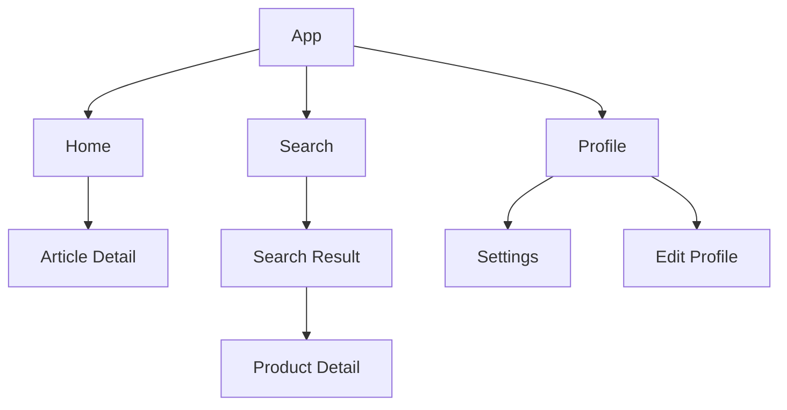
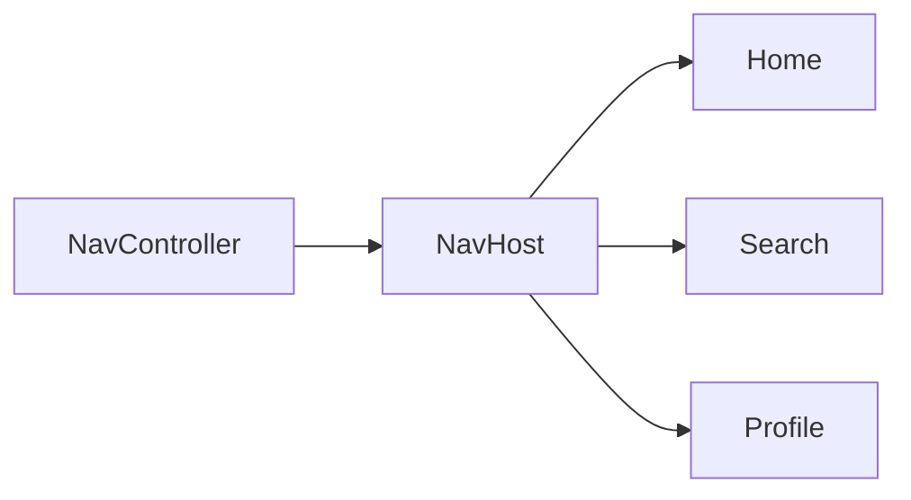
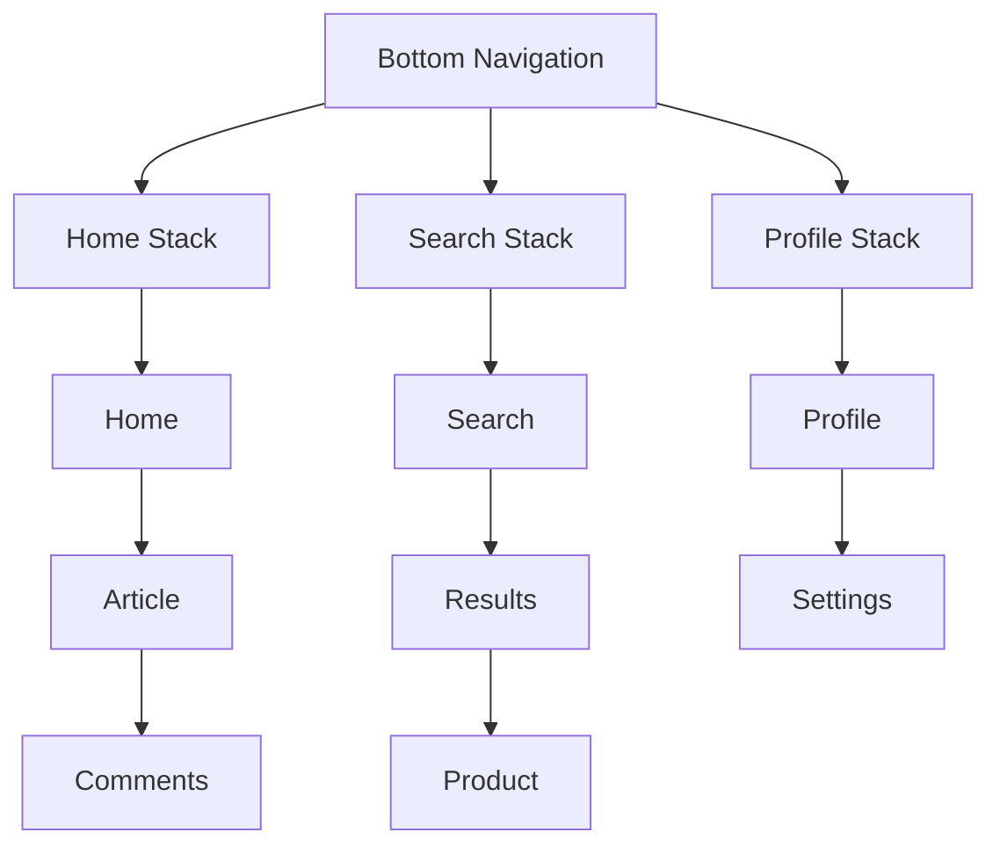
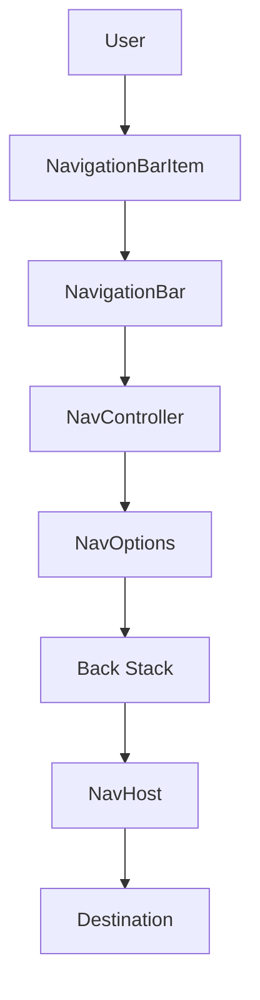
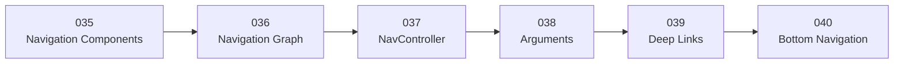

[](https://developer.android.com/develop/ui/compose/components/navigation-bar?utm_source=chatgpt.com)

# 040 - Bottom Navigation

**Học phần:** 02 - App Components and User Interface
**Module:** Module 04 - Interface and Navigation
**Nhóm nội dung:** Navigation
**Nguồn roadmap:** Interface and Navigation / Navigation
**Loại bài:** UI
**Thứ tự trong module:** 040
**Thời lượng gợi ý:** 30 phút

---

## 1. Tóm tắt

**Bottom Navigation** là kiểu điều hướng chính đặt ở cạnh dưới màn hình, cho phép người dùng chuyển nhanh giữa một số **top-level destinations** có mức độ quan trọng tương đương.

Trong Material 3 với Jetpack Compose, component tương ứng là:

```kotlin
NavigationBar
```

và từng mục bên trong là:

```kotlin
NavigationBarItem
```

Android hiện khuyến nghị Navigation Bar cho khoảng **3–5 destination quan trọng ngang nhau**, đặc biệt trên cửa sổ compact như điện thoại. ([Android Developers][1])

Ví dụ:

```text
┌────────────────────────────────────┐
│                                    │
│             Nội dung               │
│                                    │
│                                    │
├────────────────────────────────────┤
│   🏠          🔍          👤        │
│  Home       Search      Profile    │
└────────────────────────────────────┘
```

---

# 2. Mục tiêu học tập

Sau bài này, bạn có thể:

* Giải thích Bottom Navigation bằng ngôn ngữ của mình.
* Hiểu khái niệm **top-level destination**.
* Biết khi nào nên và không nên dùng Navigation Bar.
* Tạo Bottom Navigation bằng Material 3 Compose.
* Sử dụng `NavigationBar`.
* Sử dụng `NavigationBarItem`.
* Kết nối Navigation Bar với `NavController`.
* Xác định tab hiện tại từ Navigation state.
* Tránh tạo destination trùng trong Back Stack.
* Sử dụng:

  * `launchSingleTop`
  * `restoreState`
  * `saveState`
  * `popUpTo`
* Hiểu multiple back stacks.
* Giữ trạng thái khi chuyển tab.
* Test Bottom Navigation.
* Biết cách chuyển sang `NavigationRail` trên tablet/large screen.

---

# 3. Bottom Navigation giải quyết vấn đề gì?

Giả sử ứng dụng có ba khu vực chính:

```text
Home
Search
Profile
```

Nếu không có Navigation Bar, người dùng có thể phải đi:

```text
Home
 ↓
Menu
 ↓
Search
```

sau đó:

```text
Search
 ↓
Menu
 ↓
Profile
```

Bottom Navigation rút ngắn thành:

```text
       ┌──────── Search
       │
Home ──┼──────── Profile
       │
       └──────── Home
```

Người dùng có thể chuyển trực tiếp giữa những khu vực chính của ứng dụng.

Android mô tả Navigation Bar là thành phần dùng để chuyển giữa các destination chính và nhất quán trong ứng dụng. ([Android Developers][1])

---

# 4. Top-Level Destination là gì?

**Top-level destination** là destination ở cấp cao nhất của một nhóm màn hình có quan hệ phân cấp.

Ví dụ:

```text
Home
 ├── News Detail
 └── Category

Search
 └── Search Result
      └── Product Detail

Profile
 ├── Settings
 └── Edit Profile
```

Trong đó:

```text
Home
Search
Profile
```

là các **top-level destinations**.

Còn:

```text
News Detail
Search Result
Product Detail
Settings
Edit Profile
```

là destination con.

Android định nghĩa top-level destination là root hoặc cấp cao nhất trong một nhóm destination có quan hệ phân cấp. ([Android Developers][2])

---

# 5. Cấu trúc Navigation phổ biến



Navigation Bar chỉ nên chứa:

```text
Home
Search
Profile
```

không nên chứa:

```text
Product Detail
Settings
Article Detail
```

---

# 6. Bottom Navigation trong Material 3

Material 3 Compose sử dụng:

```kotlin
NavigationBar {
    NavigationBarItem(...)
}
```

Ví dụ đơn giản:

```kotlin
NavigationBar {

    NavigationBarItem(
        selected = true,
        onClick = { },
        icon = {
            Icon(
                Icons.Default.Home,
                contentDescription = "Home"
            )
        },
        label = {
            Text("Home")
        }
    )
}
```

`NavigationBarItem` cung cấp các tham số quan trọng như `selected`, `onClick`, `icon` và `label`. ([Android Developers][1])

---

# 7. Khi nào nên dùng Bottom Navigation?

Bottom Navigation phù hợp khi ứng dụng có:

```text
3 → 5
```

destination cấp cao có mức độ quan trọng tương đương.

Ví dụ tốt:

```text
YouTube-like app

Home
Shorts
Subscriptions
Library
```

hoặc:

```text
Shopping App

Home
Search
Cart
Profile
```

Navigation Bar đặc biệt phù hợp với compact window sizes, chẳng hạn điện thoại. ([Android Developers][1])

---

# 8. Khi nào không nên dùng?

Không nên dùng Navigation Bar cho:

```text
10 destination
```

Ví dụ:

```text
Home
Products
Search
Orders
Messages
Cart
Favorites
Settings
Profile
Help
```

Navigation Bar sẽ quá tải.

Cũng không nên đặt các **action** vào Navigation Bar.

Ví dụ:

```text
Home
Search
Create Order
Delete
Logout
```

Trong đó:

```text
Delete
Logout
```

không phải destination chính.

Navigation Bar nên đại diện cho các destination ổn định, không phải danh sách button hành động.

---

# 9. Navigation Bar khác Button như thế nào?

Button:

```text
Save
Delete
Send
Buy
Retry
```

thực hiện **action**.

Navigation Bar Item:

```text
Home
Search
Cart
Profile
```

chuyển sang **destination**.

Có thể nhớ:

```text
Button
   ↓
Do something

Navigation Item
   ↓
Go somewhere
```

---

# 10. Routes cho Bottom Navigation

Với Navigation Compose hiện đại, có thể sử dụng type-safe routes.

```kotlin
import kotlinx.serialization.Serializable

@Serializable
data object Home

@Serializable
data object Search

@Serializable
data object Profile
```

Navigation Compose hiện hỗ trợ strongly typed/type-safe destinations thay vì bắt buộc quản lý toàn bộ route bằng chuỗi. ([Android Developers][3])

---

# 11. Navigation Graph

```kotlin
@Composable
fun AppNavHost(
    navController: NavHostController,
    modifier: Modifier = Modifier
) {

    NavHost(
        navController = navController,
        startDestination = Home,
        modifier = modifier
    ) {

        composable<Home> {
            HomeScreen()
        }

        composable<Search> {
            SearchScreen()
        }

        composable<Profile> {
            ProfileScreen()
        }
    }
}
```

Sơ đồ:



---

# 12. Tạo Navigation Bar hoàn chỉnh

```kotlin
@Composable
fun MainScreen() {

    val navController =
        rememberNavController()

    Scaffold(
        bottomBar = {

            AppBottomNavigation(
                navController = navController
            )
        }
    ) { innerPadding ->

        AppNavHost(
            navController = navController,
            modifier = Modifier.padding(innerPadding)
        )
    }
}
```

`rememberNavController()` tạo và nhớ `NavHostController`, còn `Scaffold` có thể đặt `NavigationBar` trong `bottomBar`. Đây cũng là cấu trúc được tài liệu Compose sử dụng cho Navigation Bar. ([Android Developers][1])

---

# 13. AppBottomNavigation

```kotlin
@Composable
fun AppBottomNavigation(
    navController: NavHostController
) {

    val backStackEntry by
        navController.currentBackStackEntryAsState()

    val currentDestination =
        backStackEntry?.destination

    NavigationBar {

        NavigationBarItem(
            selected =
                currentDestination
                    ?.hierarchy
                    ?.any {
                        it.hasRoute<Home>()
                    } == true,

            onClick = {
                navController.navigate(Home)
            },

            icon = {
                Icon(
                    Icons.Default.Home,
                    contentDescription = "Home"
                )
            },

            label = {
                Text("Home")
            }
        )

        NavigationBarItem(
            selected =
                currentDestination
                    ?.hierarchy
                    ?.any {
                        it.hasRoute<Search>()
                    } == true,

            onClick = {
                navController.navigate(Search)
            },

            icon = {
                Icon(
                    Icons.Default.Search,
                    contentDescription = "Search"
                )
            },

            label = {
                Text("Search")
            }
        )

        NavigationBarItem(
            selected =
                currentDestination
                    ?.hierarchy
                    ?.any {
                        it.hasRoute<Profile>()
                    } == true,

            onClick = {
                navController.navigate(Profile)
            },

            icon = {
                Icon(
                    Icons.Default.Person,
                    contentDescription = "Profile"
                )
            },

            label = {
                Text("Profile")
            }
        )
    }
}
```

`currentBackStackEntryAsState()` được thiết kế để kết nối `NavController` với các composable bên ngoài `NavHost`, ví dụ chính xác như Bottom Navigation. ([Android Developers][4])

---

# 14. Selected State

Một Navigation Bar cần biết:

```text
Tab nào đang được chọn?
```

Ví dụ:

```text
Home

┌──────────────────────────┐
│  ●          ○         ○  │
│ Home      Search    Profile
└──────────────────────────┘
```

Khi vào Search:

```text
┌──────────────────────────┐
│  ○          ●         ○  │
│ Home      Search    Profile
└──────────────────────────┘
```

Không nên chỉ suy luận selected state từ lần click gần nhất nếu Navigation state có thể thay đổi từ Back, Deep Link hoặc code khác.

Cách mạnh hơn là lấy destination thực tế từ:

```kotlin
navController.currentBackStackEntryAsState()
```

rồi xác định route hiện tại. Navigation cung cấp helper này để UI bên ngoài `NavHost`, như Bottom Navigation, có thể quan sát destination đang hoạt động. ([Android Developers][4])

---

# 15. Tại sao dùng `hierarchy`?

Giả sử:

```text
Home
 └── ArticleDetail
```

Người dùng đang ở:

```text
ArticleDetail
```

nhưng về mặt navigation hierarchy, màn hình đó vẫn thuộc:

```text
Home
```

Ta muốn Bottom Navigation vẫn highlight:

```text
Home
```

Do đó có thể kiểm tra:

```kotlin
currentDestination
    ?.hierarchy
    ?.any {
        it.hasRoute<Home>()
    }
```

Android sử dụng pattern kiểm tra destination hierarchy cùng `hasRoute()` khi xác định một top-level route có đang được chọn hay không. ([Android Developers][5])

---

# 16. Vấn đề khi chỉ gọi `navigate()`

Nếu người dùng liên tục click:

```text
Home
Search
Home
Search
Home
```

và code chỉ là:

```kotlin
navController.navigate(Home)
```

Back Stack có thể tích lũy các destination không cần thiết.

Ví dụ:

```text
Home
Search
Home
Search
Home
```

Khi người dùng nhấn Back:

```text
Home
 ↓
Search
 ↓
Home
 ↓
Search
```

UX này thường không phải điều người dùng mong đợi ở top-level navigation.

---

# 17. `launchSingleTop`

Một option quan trọng là:

```kotlin
launchSingleTop = true
```

Ví dụ:

```kotlin
navController.navigate(Home) {
    launchSingleTop = true
}
```

Ý tưởng:

```text
Nếu Home đã ở trên cùng
        ↓
Không tạo thêm Home mới
```

Navigation documentation sử dụng `launchSingleTop = true` trong pattern chuyển giữa Bottom Navigation destinations cùng các option quản lý back stack khác. ([Android Developers][6])

---

# 18. `popUpTo`

Một pattern phổ biến:

```kotlin
navController.navigate(destination) {

    popUpTo(
        navController.graph
            .findStartDestination()
            .id
    ) {
        saveState = true
    }

    launchSingleTop = true

    restoreState = true
}
```

Đây chính là pattern Navigation documentation đưa ra khi chuyển giữa Bottom Navigation routes và cần lưu/phục hồi Back Stack. ([Android Developers][6])

---

# 19. `saveState`

```kotlin
saveState = true
```

cho Navigation biết rằng state của destinations bị pop nên được lưu để có thể phục hồi sau đó.

Ví dụ:

```text
Home
 ↓
Article 10
 ↓
Article Comments
```

chuyển sang:

```text
Profile
```

Ta muốn state của nhánh Home có thể được giữ:

```text
Home
 └── Article 10
      └── Comments
```

Navigation hỗ trợ cơ chế save/restore Back Stack cho các trường hợp multiple back stacks. ([Android Developers][6])

---

# 20. `restoreState`

Khi quay lại tab:

```text
Home
```

ta có:

```kotlin
restoreState = true
```

để Navigation phục hồi state/back stack đã lưu nếu tồn tại.

Luồng:

```text
Home
 ↓
Article
 ↓
Comments

       chuyển tab

Profile
 ↓
Settings

       quay lại Home

Home
 ↓
Article
 ↓
Comments
```

thay vì:

```text
Home
```

bị reset hoàn toàn.

Navigation Component hỗ trợ multiple back stacks thông qua `saveState` và `restoreState`. ([Android Developers][6])

---

# 21. Multiple Back Stacks

Bottom Navigation thường được hiểu tốt nhất như nhiều nhánh Navigation.

```text
HOME STACK

Home
 ↓
Article
 ↓
Comments
```

```text
SEARCH STACK

Search
 ↓
Results
 ↓
Product
```

```text
PROFILE STACK

Profile
 ↓
Settings
```

Tổng thể:



Navigation Component có hỗ trợ multiple back stacks, đặc biệt hữu ích với Bottom Navigation và Navigation Drawer. ([Android Developers][6])

---

# 22. Hàm điều hướng Top-Level chuẩn hơn

Ta có thể đóng gói logic:

```kotlin
fun NavHostController.navigateToTopLevel(
    route: Any
) {

    navigate(route) {

        popUpTo(
            graph.findStartDestination().id
        ) {
            saveState = true
        }

        launchSingleTop = true

        restoreState = true
    }
}
```

Ý tưởng kiến trúc:

```text
NavigationBarItem
       │
       ▼
navigateToTopLevel()
       │
       ├── popUpTo
       ├── saveState
       ├── restoreState
       └── launchSingleTop
```

Đối với project thật, nên giữ type-safe route thay vì làm mất kiểu bằng `Any`; đoạn trên chủ yếu minh họa nhóm `NavOptions`. Pattern các option là pattern chính thức Android dùng cho multiple back stacks. ([Android Developers][6])

---

# 23. Ví dụ cụ thể cho Home

```kotlin
onClick = {

    navController.navigate(Home) {

        popUpTo(
            navController.graph
                .findStartDestination()
                .id
        ) {
            saveState = true
        }

        launchSingleTop = true

        restoreState = true
    }
}
```

Tương tự với:

```kotlin
Search
```

và:

```kotlin
Profile
```

---

# 24. Không nên lưu `selectedTab` tách rời Navigation một cách tùy tiện

Một thiết kế dễ gặp:

```kotlin
var selectedTab by remember {
    mutableStateOf(0)
}
```

Sau đó:

```text
selectedTab
```

và:

```text
NavController destination
```

trở thành hai nguồn state khác nhau.

Có thể xảy ra:

```text
selectedTab = Home
```

nhưng:

```text
NavController = ProductDetail thuộc Search
```

Nếu ứng dụng sử dụng Navigation Compose, thường nên lấy selected state từ Navigation state khi cần phản ánh đúng destination thực tế. `currentBackStackEntryAsState()` tồn tại chính để UI Compose bên ngoài `NavHost` có thể quan sát thay đổi này. ([Android Developers][4])

---

# 25. Single Source of Truth

Kiến trúc tốt:

```text
NavController
      │
      ▼
Current Destination
      │
      ▼
NavigationBar selected state
```

thay vì:

```text
NavController ─────────┐
                       ├── không đồng bộ
selectedTab ───────────┘
```

---

# 26. Có nên hiện Bottom Navigation ở mọi màn hình?

Không nhất thiết.

Ví dụ:

```text
Home
Search
Profile
```

có thể hiển thị Navigation Bar.

Nhưng:

```text
Login
Onboarding
Camera full-screen
Checkout
Full-screen video
```

có thể cần ẩn nó tùy UX.

Ví dụ:

```kotlin
val showBottomBar =
    currentDestination
        ?.hierarchy
        ?.any {
            it.hasRoute<Home>() ||
            it.hasRoute<Search>() ||
            it.hasRoute<Profile>()
        } == true
```

Sau đó:

```kotlin
Scaffold(
    bottomBar = {

        if (showBottomBar) {
            AppBottomNavigation(
                navController
            )
        }
    }
)
```

Việc hiện hay ẩn bar phải dựa trên thiết kế navigation hierarchy của ứng dụng.

---

# 27. Bottom Navigation và Arguments

Giả sử:

```text
Search
 ↓
ProductDetail(productId = 42)
```

Bottom Navigation không nên chứa:

```text
Product #42
```

Thay vào đó:

```text
Search
```

vẫn là top-level destination.

Route con:

```kotlin
@Serializable
data class ProductDetail(
    val productId: Long
)
```

Kiến trúc:

```text
Search
  │
  └── ProductDetail(42)
```

Điều này nối trực tiếp kiến thức của bài **038 - Arguments** với Bottom Navigation.

---

# 28. Bottom Navigation và Deep Links

Giả sử người dùng mở:

```text
https://example.com/product/42
```

Deep Link đưa tới:

```text
ProductDetail(42)
```

Nếu `ProductDetail` thuộc nhánh Search:

```text
Search
 └── ProductDetail(42)
```

Navigation Bar có thể cần highlight:

```text
Search
```

thay vì không chọn tab nào.

Đây là một lý do quan trọng để xác định selected state dựa trên **navigation hierarchy**, thay vì chỉ dựa vào button gần nhất mà người dùng click.

---

# 29. Bottom Navigation và State

Ví dụ người dùng nhập:

```text
Search query = "Laptop"
```

sau đó chuyển:

```text
Search
 ↓
Profile
 ↓
Search
```

UX tốt thường mong Search vẫn còn:

```text
Laptop
```

State có thể nằm ở:

```text
rememberSaveable
ViewModel
SavedStateHandle
Repository
```

tùy loại dữ liệu.

Navigation Component cũng hỗ trợ lưu/phục hồi state của destination/back stack khi chuyển giữa các stack. ([Android Developers][6])

---

# 30. Bottom Navigation không phải nơi chứa Business State

Không nên:

```text
NavigationBar
 ├── products
 ├── cart data
 ├── user profile data
 └── network response
```

Navigation Bar chỉ cần biết:

```text
Destination
Selected state
Navigation event
```

Business state vẫn nên nằm ở:

```text
ViewModel
 ↓
Repository
 ↓
Data Source
```

---

# 31. Adaptive Navigation

Bottom Navigation rất phù hợp với điện thoại nhỏ, nhưng chưa chắc phù hợp với tablet hoặc desktop window.

Android hiện khuyến nghị primary navigation thích ứng theo kích thước cửa sổ:

```text
Compact
   ↓
Navigation Bar

Expanded
   ↓
Navigation Rail
```

`NavigationSuiteScaffold` có thể tự động chọn Navigation Bar hoặc Navigation Rail theo Window Size Class và thay đổi khi kích thước cửa sổ thay đổi. ([Android Developers][7])

---

# 32. NavigationSuiteScaffold

Ví dụ ý tưởng:

```kotlin
NavigationSuiteScaffold(
    navigationSuiteItems = {

        // Home
        // Search
        // Profile

    }
) {

    AppContent()
}
```

Trên phone:

```text
┌────────────────────┐
│                    │
│      Content       │
│                    │
├────────────────────┤
│ Home Search Profile│
└────────────────────┘
```

Trên tablet:

```text
┌───────┬───────────────────────┐
│ Home  │                       │
│       │                       │
│Search │        Content        │
│       │                       │
│Profile│                       │
└───────┴───────────────────────┘
```

Android's adaptive navigation API sử dụng Navigation Bar trong compact windows và Navigation Rail cho nhiều trường hợp rộng hơn. ([Android Developers][7])

---

# 33. Bottom Navigation và Landscape

Một điện thoại xoay ngang có thể có chiều rộng lớn hơn đáng kể.

Thay vì cố giữ:

```text
Bottom Navigation
```

ở mọi kích thước, ứng dụng adaptive có thể chuyển thành:

```text
Navigation Rail
```

Điều này cải thiện khả năng sử dụng diện tích màn hình và reachability trên thiết bị lớn. ([Android Developers][7])

---

# 34. Accessibility

Icon nên có:

```kotlin
contentDescription = "Home"
```

Ví dụ:

```kotlin
Icon(
    imageVector = Icons.Default.Home,
    contentDescription = "Home"
)
```

Nếu có text label:

```text
Home
Search
Profile
```

người dùng cũng dễ hiểu destination hơn.

Ngoài ra, selected state phải được truyền đúng:

```kotlin
selected = ...
```

để component thể hiện trạng thái hiện tại qua semantics và giao diện Material.

`NavigationBarItem` cung cấp trực tiếp `selected`, `label` và `icon` cho mục đích này. ([Android Developers][1])

---

# 35. Sai lầm 1 - Có quá nhiều tab

Không nên:

```text
Home
Search
Cart
Orders
Messages
Favorites
Settings
Profile
News
Help
```

Navigation Bar được thiết kế chủ yếu cho **3–5 destination** có mức quan trọng tương đương. ([Android Developers][1])

---

# 36. Sai lầm 2 - Tạo Back Stack vô hạn

Không nên chỉ:

```kotlin
navController.navigate(Home)
```

mỗi lần click.

Cần cân nhắc:

```kotlin
launchSingleTop
restoreState
saveState
popUpTo
```

khi thực hiện top-level navigation. Android đưa chính pattern này trong hướng dẫn multiple back stacks. ([Android Developers][6])

---

# 37. Sai lầm 3 - Selected tab sai

Ví dụ UI:

```text
Home được highlight
```

nhưng thực tế:

```text
currentDestination = Profile
```

Nguyên nhân:

```text
selectedIndex
```

không đồng bộ với:

```text
NavController
```

Cách xử lý:

```text
NavController
 ↓
currentBackStackEntryAsState()
 ↓
currentDestination
 ↓
selected
```

`currentBackStackEntryAsState()` là API Compose dành cho trường hợp kết nối navigation state với UI như Bottom Navigation. ([Android Developers][4])

---

# 38. Sai lầm 4 - Reset tab mỗi lần chuyển

Ví dụ:

```text
Search
 ↓
Results
 ↓
Product
```

chuyển sang Profile rồi quay lại Search nhưng nhận:

```text
Search root
```

thay vì:

```text
Product
```

Nếu UX muốn giữ mỗi tab như một stack riêng, cần support multiple back stacks thông qua save/restore state hoặc kiến trúc back stack tương ứng. ([Android Developers][6])

---

# 39. Sai lầm 5 - Đặt màn hình con vào Navigation Bar

Sai:

```text
Home
Product Detail
Search
Settings
Profile
```

Nên:

```text
Home
Search
Profile
```

và:

```text
Search
 └── Product Detail
```

```text
Profile
 └── Settings
```

Top-level destination là cấp root của một hierarchy, không phải mọi màn hình đều là top-level destination. ([Android Developers][2])

---

# 40. Ví dụ hoàn chỉnh

```kotlin
@Serializable
data object Home

@Serializable
data object Search

@Serializable
data object Profile
```

```kotlin
@Composable
fun MainScreen() {

    val navController =
        rememberNavController()

    val backStackEntry by
        navController.currentBackStackEntryAsState()

    val currentDestination =
        backStackEntry?.destination

    Scaffold(
        bottomBar = {

            NavigationBar {

                NavigationBarItem(
                    selected =
                        currentDestination
                            ?.hierarchy
                            ?.any {
                                it.hasRoute<Home>()
                            } == true,

                    onClick = {

                        navController.navigate(Home) {

                            popUpTo(
                                navController.graph
                                    .findStartDestination()
                                    .id
                            ) {
                                saveState = true
                            }

                            launchSingleTop = true
                            restoreState = true
                        }
                    },

                    icon = {
                        Icon(
                            Icons.Default.Home,
                            contentDescription = "Home"
                        )
                    },

                    label = {
                        Text("Home")
                    }
                )

                NavigationBarItem(
                    selected =
                        currentDestination
                            ?.hierarchy
                            ?.any {
                                it.hasRoute<Search>()
                            } == true,

                    onClick = {

                        navController.navigate(Search) {

                            popUpTo(
                                navController.graph
                                    .findStartDestination()
                                    .id
                            ) {
                                saveState = true
                            }

                            launchSingleTop = true
                            restoreState = true
                        }
                    },

                    icon = {
                        Icon(
                            Icons.Default.Search,
                            contentDescription = "Search"
                        )
                    },

                    label = {
                        Text("Search")
                    }
                )

                NavigationBarItem(
                    selected =
                        currentDestination
                            ?.hierarchy
                            ?.any {
                                it.hasRoute<Profile>()
                            } == true,

                    onClick = {

                        navController.navigate(Profile) {

                            popUpTo(
                                navController.graph
                                    .findStartDestination()
                                    .id
                            ) {
                                saveState = true
                            }

                            launchSingleTop = true
                            restoreState = true
                        }
                    },

                    icon = {
                        Icon(
                            Icons.Default.Person,
                            contentDescription = "Profile"
                        )
                    },

                    label = {
                        Text("Profile")
                    }
                )
            }
        }
    ) { innerPadding ->

        NavHost(
            navController = navController,
            startDestination = Home,
            modifier =
                Modifier.padding(innerPadding)
        ) {

            composable<Home> {
                HomeScreen()
            }

            composable<Search> {
                SearchScreen()
            }

            composable<Profile> {
                ProfileScreen()
            }
        }
    }
}
```

Cách sử dụng `NavigationBar`, `NavigationBarItem`, `rememberNavController()` và Navigation state phù hợp với API Material 3/Navigation Compose hiện tại; phần `saveState`, `restoreState`, `popUpTo` và `launchSingleTop` dựa trên pattern multiple-back-stack chính thức của Navigation. ([Android Developers][1])

---

# 41. Luồng chương trình



---

# 42. Testing Bottom Navigation

Android cung cấp:

```text
TestNavHostController
```

để kiểm thử Navigation Compose. Test nên thực hiện tương tác UI thật và xác minh destination sau click. ([Android Developers][8])

Ví dụ:

```kotlin
@Test
fun clickProfile_navigatesToProfile() {

    composeTestRule
        .onNodeWithText("Profile")
        .performClick()

    assertTrue(
        navController
            .currentBackStackEntry
            ?.destination
            ?.hasRoute<Profile>()
            ?: false
    )
}
```

`hasRoute<T>()` được tài liệu Navigation testing sử dụng để kiểm tra type-safe destination hiện tại. ([Android Developers][8])

---

# 43. Nên test những gì?

### Navigation

* [ ] App mở ở Home.
* [ ] Home → Search.
* [ ] Search → Profile.
* [ ] Profile → Home.
* [ ] Tab hiện tại được highlight đúng.

### Back Stack

* [ ] Click tab hiện tại nhiều lần không tạo duplicate ngoài ý muốn.
* [ ] Back hoạt động đúng.
* [ ] Nested screen quay về đúng parent.
* [ ] Chuyển tab không làm stack sai.

### State

* [ ] Search query được giữ khi phù hợp.
* [ ] Scroll position được giữ khi phù hợp.
* [ ] Tab state được restore.
* [ ] Rotation không reset navigation ngoài ý muốn.

### Adaptive UI

* [ ] Phone hiển thị Navigation Bar.
* [ ] Tablet/expanded layout hiển thị Navigation Rail nếu app hỗ trợ adaptive navigation.

---

# 44. Manual Test Scenario

Test flow:

```text
1. Open App

Home
```

```text
2. Click Search

Search
```

```text
3. Search "Laptop"

Search Results
```

```text
4. Open Product #42

Product Detail
```

```text
5. Click Profile

Profile
```

```text
6. Click Search
```

Nếu thiết kế multiple back stacks:

```text
Expected:

Product Detail #42
```

thay vì:

```text
Search root
```

Navigation's save/restore back-stack APIs được thiết kế chính cho những flow kiểu này. ([Android Developers][6])

---

# 45. Artifact cho Portfolio

Có thể tạo project:

```text
BottomNavigationDemo/
│
├── navigation/
│   ├── Routes.kt
│   └── AppNavHost.kt
│
├── ui/
│   ├── MainScreen.kt
│   ├── AppNavigationBar.kt
│   │
│   ├── home/
│   │   └── HomeScreen.kt
│   │
│   ├── search/
│   │   └── SearchScreen.kt
│   │
│   └── profile/
│       └── ProfileScreen.kt
│
└── README.md
```

README:

```markdown
# Bottom Navigation Demo

## Features

- Jetpack Compose
- Material 3
- NavigationBar
- NavigationBarItem
- Navigation Compose
- Type-safe routes
- NavController
- Multiple back stacks
- State restoration
- Adaptive navigation

## Top-Level Destinations

Home
Search
Profile

## Navigation

Home
 └── Article Detail

Search
 └── Product Detail

Profile
 └── Settings
```

---

# 46. Production Checklist

## UX

* [ ] Có khoảng 3–5 top-level destinations.
* [ ] Các destination có tầm quan trọng tương đương.
* [ ] Icon dễ hiểu.
* [ ] Có label khi cần.
* [ ] Selected state rõ ràng.
* [ ] Không đặt action vào Navigation Bar.

## Navigation

* [ ] `NavController` là nguồn Navigation state.
* [ ] Không tạo duplicate destination.
* [ ] Có `launchSingleTop` khi phù hợp.
* [ ] Có `saveState`.
* [ ] Có `restoreState`.
* [ ] `popUpTo` đúng start destination.
* [ ] Nested destination highlight đúng top-level tab.

## State

* [ ] Tab state được phục hồi.
* [ ] Scroll state được giữ khi UX yêu cầu.
* [ ] Search state không mất ngoài ý muốn.
* [ ] Rotation không phá Navigation.

## Testing

* [ ] Test từng tab.
* [ ] Test Back.
* [ ] Test reselect tab.
* [ ] Test nested destination.
* [ ] Test Deep Link.
* [ ] Test configuration change.

## Large Screens

* [ ] Kiểm tra portrait.
* [ ] Kiểm tra landscape.
* [ ] Kiểm tra tablet.
* [ ] Cân nhắc `NavigationSuiteScaffold`.

---

# 47. Android Roadmap 2026

Trong Navigation 2/Navigation Compose hiện tại, `NavController`, `NavHost`, `NavigationBar` và multiple-back-stack APIs vẫn là kiến thức quan trọng. Tài liệu Android hiện liệt kê Navigation Compose 2.9.8 trong hướng dẫn setup Navigation. ([Android Developers][3])

Android đồng thời đã phát hành **Navigation 3** dành riêng cho Compose. Navigation 3 thay mô hình `NavController` bằng navigation state/back stacks do ứng dụng trực tiếp sở hữu. Migration guide của Android cũng lấy trường hợp nhiều top-level routes hiển thị trong Bottom Navigation và mỗi route giữ stack riêng làm một mô hình ứng dụng điển hình. ([Android Developers][5])

Vì vậy roadmap nên hiểu:

```text
Navigation 2

NavigationBar
     ↓
NavController
     ↓
NavHost
     ↓
Back Stack
```

và sau đó mở rộng sang:

```text
Navigation 3

NavigationBar
     ↓
App-owned Navigation State
     ↓
Top-Level Back Stacks
     ↓
NavDisplay
```

---

# 48. Liên hệ toàn bộ nhóm Navigation



Có thể hiểu:

```text
Navigation Components
       ↓
Hệ thống Navigation gồm gì?

Navigation Graph
       ↓
Có destination nào?

NavController
       ↓
Điều hướng như thế nào?

Arguments
       ↓
Mang dữ liệu gì?

Deep Links
       ↓
Đi vào app từ bên ngoài thế nào?

Bottom Navigation
       ↓
Chuyển giữa các top-level
destination thế nào?
```

---

# 49. Ghi nhớ nhanh

### Component

```kotlin
NavigationBar
```

### Item

```kotlin
NavigationBarItem
```

### Controller

```kotlin
val navController =
    rememberNavController()
```

### Quan sát destination

```kotlin
val backStackEntry by
    navController
        .currentBackStackEntryAsState()
```

### Navigation

```kotlin
navController.navigate(Home) {

    popUpTo(
        navController.graph
            .findStartDestination()
            .id
    ) {
        saveState = true
    }

    launchSingleTop = true

    restoreState = true
}
```

Pattern save/restore này là pattern Android Navigation chính thức cho multiple back stacks. ([Android Developers][6])

---

# 50. Công thức tư duy quan trọng

Không nên nghĩ Bottom Navigation đơn giản là:

```text
3 Buttons ở dưới màn hình
```

Mà nên hiểu:

```text
Navigation Bar
      │
      ▼
Top-Level Destinations
      │
      ▼
Navigation State
      │
      ▼
NavController
      │
      ▼
Multiple Back Stacks
      │
      ▼
State Restoration
```

---

# 51. Checklist hoàn thành bài học

* [ ] Giải thích được Bottom Navigation.
* [ ] Hiểu top-level destination.
* [ ] Biết khi nào dùng Navigation Bar.
* [ ] Biết quy tắc khoảng 3–5 destinations.
* [ ] Biết `NavigationBar`.
* [ ] Biết `NavigationBarItem`.
* [ ] Biết `selected`.
* [ ] Biết `currentBackStackEntryAsState()`.
* [ ] Hiểu navigation hierarchy.
* [ ] Biết `hasRoute<T>()`.
* [ ] Biết `launchSingleTop`.
* [ ] Biết `popUpTo`.
* [ ] Biết `saveState`.
* [ ] Biết `restoreState`.
* [ ] Hiểu multiple back stacks.
* [ ] Biết giữ state khi đổi tab.
* [ ] Biết test Bottom Navigation.
* [ ] Hiểu adaptive navigation.
* [ ] Biết khi nào cân nhắc `NavigationRail`.
* [ ] Có mini project để đưa vào portfolio.

---

# 52. Tổng kết

Bottom Navigation là UI cho các **khu vực chính** của ứng dụng:

```text
             APP
              │
      ┌───────┼───────┐
      ▼       ▼       ▼
    Home    Search   Profile
      │       │        │
      ▼       ▼        ▼
   Stack    Stack     Stack
```

Một implementation tốt trong Navigation Compose không chỉ dừng ở:

```kotlin
NavigationBarItem(
    onClick = {
        navController.navigate(...)
    }
)
```

mà cần suy nghĩ tới:

```text
Top-Level Destination
        +
Selected State
        +
Back Stack
        +
launchSingleTop
        +
saveState
        +
restoreState
        +
Adaptive Navigation
```

Android hiện hỗ trợ trực tiếp các pattern này thông qua Material 3 `NavigationBar`, Navigation Compose và multiple-back-stack APIs. Trên thiết bị lớn, `NavigationSuiteScaffold` còn cho phép primary navigation thích ứng từ Navigation Bar sang Navigation Rail. ([Android Developers][1])

[1]: https://developer.android.com/develop/ui/compose/components/navigation-bar "Navigation bar  |  Jetpack Compose  |  Android Developers"
[2]: https://developer.android.com/guide/navigation/integrations/ui "Connect UI components to NavController using NavigationUI  |  App architecture  |  Android Developers"
[3]: https://developer.android.com/guide/navigation?utm_source=chatgpt.com "Navigation | App architecture"
[4]: https://developer.android.com/jetpack/androidx/releases/navigation?utm_source=chatgpt.com "Navigation | Jetpack"
[5]: https://developer.android.com/guide/navigation/navigation-3/migration-guide?utm_source=chatgpt.com "Migrate from Navigation 2 to Navigation 3 | App architecture"
[6]: https://developer.android.com/guide/navigation/backstack/multi-back-stacks "Support multiple back stacks  |  App architecture  |  Android Developers"
[7]: https://developer.android.com/develop/ui/compose/layouts/adaptive/build-adaptive-navigation "Build adaptive navigation  |  Jetpack Compose  |  Android Developers"
[8]: https://developer.android.com/guide/navigation/testing/compose?utm_source=chatgpt.com "Test Compose navigation | App architecture"

---

# Bài luyện tập

## Mục tiêu


## Đề bài


## Yêu cầu hoàn thành

- [ ] 
- [ ] 
- [ ] 

## Kết quả / lời giải


## Ghi chú
