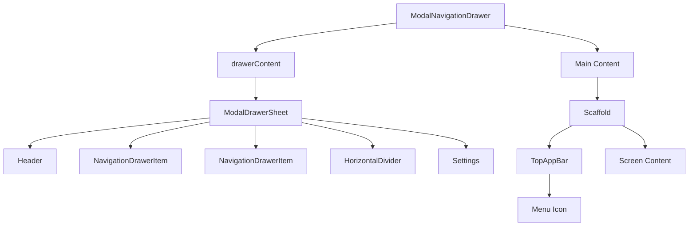
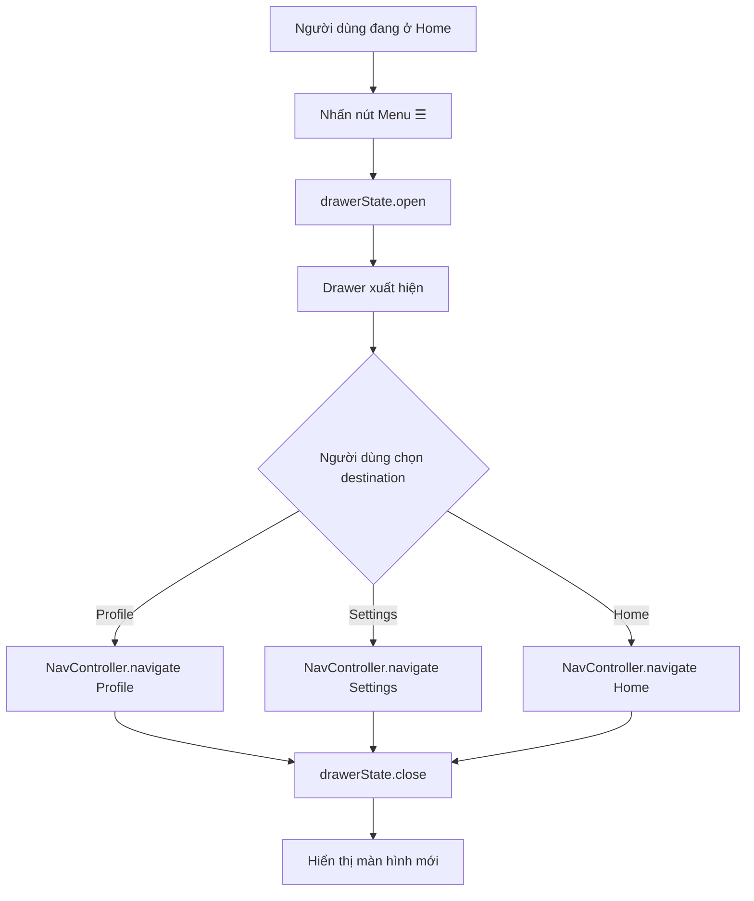
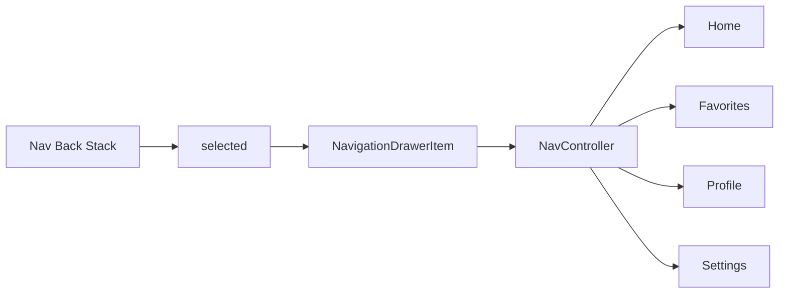
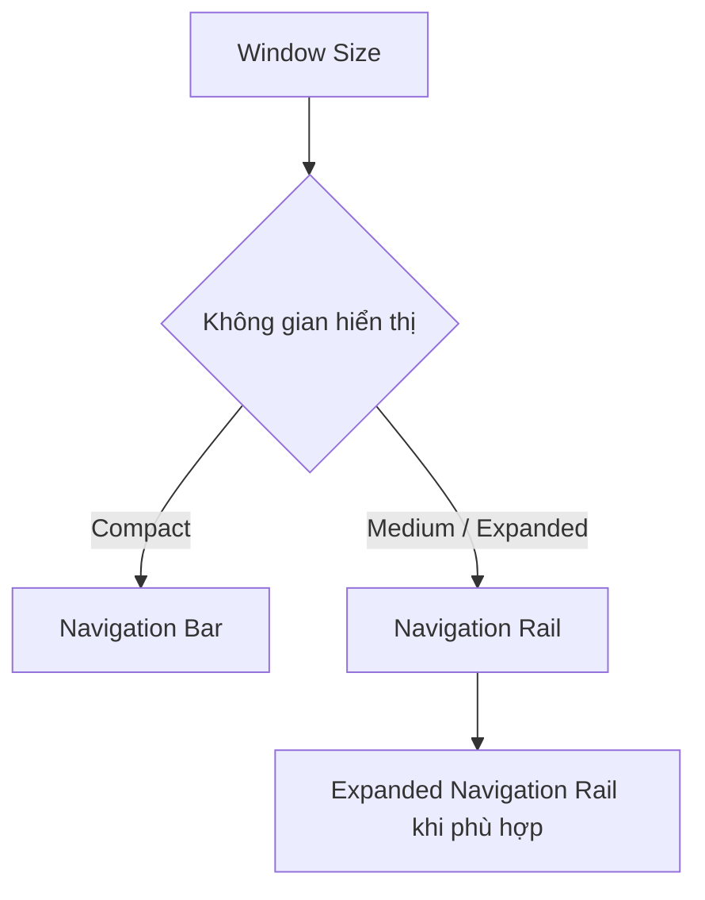
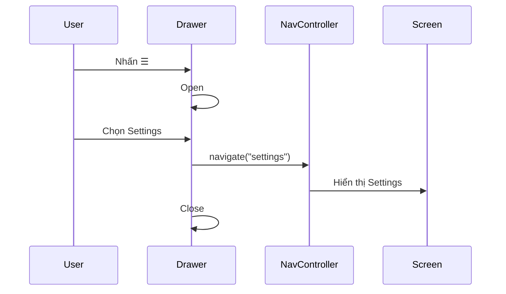
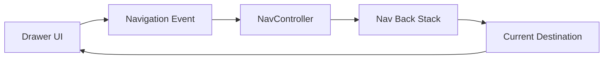
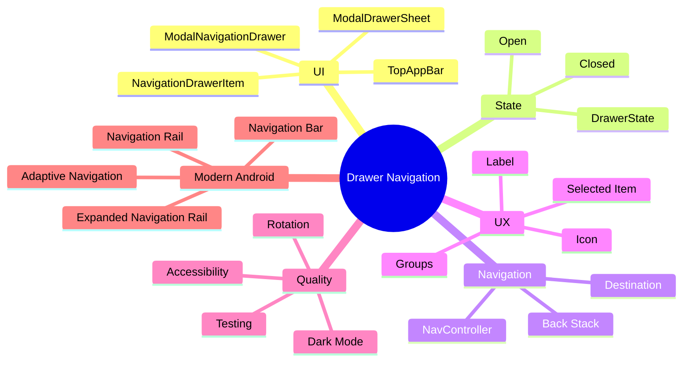

# 041 - Drawer Navigation

**Học phần:** 02 - App Components and User Interface
**Module:** Module 04 - Interface and Navigation
**Nhóm nội dung:** Navigation
**Nguồn roadmap:** Interface and Navigation / Navigation
**Loại bài:** UI
**Thứ tự trong module:** 041
**Thời lượng gợi ý:** 30 phút

---

## 1. Tóm tắt

**Drawer Navigation** hay **Navigation Drawer** là một thành phần điều hướng xuất hiện từ cạnh màn hình, cho phép người dùng truy cập các khu vực khác nhau của ứng dụng.

Trên Android với **Jetpack Compose + Material 3**, drawer có thể được xây dựng bằng các thành phần như:

* `ModalNavigationDrawer`
* `ModalDrawerSheet`
* `NavigationDrawerItem`
* `DrawerState`
* `rememberDrawerState()`

Drawer thường được mở bằng:

* nút **☰ Menu** trên `TopAppBar`;
* thao tác vuốt từ cạnh màn hình nếu gesture được bật.

Android hiện mô tả hai dạng drawer chính: **Standard** và **Modal**. `ModalNavigationDrawer` hiển thị drawer phủ lên nội dung phía sau, trong khi Standard Drawer chia sẻ không gian với nội dung. ([Android Developers][1])

> **Lưu ý cho Android 2026:** Drawer vẫn có API chính thức trong Jetpack Compose. Tuy nhiên, hướng thiết kế Material 3 Expressive mới đang ưu tiên **expanded navigation rail** thay cho navigation drawer trong nhiều giao diện mới, đặc biệt trên màn hình lớn. Android cũng khuyến nghị xây dựng navigation thích ứng bằng `NavigationSuiteScaffold`, thường dùng Navigation Bar trên cửa sổ compact và Navigation Rail trên cửa sổ lớn hơn. ([Material Design][2])

---

## 2. Mục tiêu học tập

Sau bài học này, bạn có thể:

* Giải thích được **Drawer Navigation là gì**.
* Phân biệt Drawer với Bottom Navigation và Navigation Rail.
* Hiểu cấu trúc của một Drawer trong Jetpack Compose.
* Điều khiển trạng thái mở/đóng bằng `DrawerState`.
* Kết hợp Drawer với `NavController`.
* Hiển thị đúng item đang được chọn.
* Biết cách đóng Drawer sau khi chuyển màn hình.
* Nhận biết ảnh hưởng của Drawer đến UX và responsive/adaptive UI.
* Viết checklist kiểm thử cho Drawer.
* Tạo một ứng dụng nhỏ có thể đưa vào portfolio.

---

# 3. Drawer Navigation là gì?

Navigation Drawer là một **menu điều hướng theo chiều dọc nằm ở cạnh màn hình**.

Khi đóng:

```text
┌──────────────────────────────────┐
│ ☰  My App                        │
├──────────────────────────────────┤
│                                  │
│                                  │
│          Nội dung chính          │
│                                  │
│                                  │
└──────────────────────────────────┘
```

Khi mở:

```text
┌──────────────────┬───────────────┐
│ My App           │               │
│                  │               │
│ 🏠 Home          │ Nội dung      │
│ ❤️ Favorites    │ phía sau      │
│ 👤 Profile       │               │
│ ⚙ Settings      │               │
│                  │               │
└──────────────────┴───────────────┘
```

Navigation Drawer thích hợp khi ứng dụng có nhiều nhóm tính năng hoặc cần gom các destination, profile, settings và các chức năng phụ vào một vùng điều hướng. Android nêu các trường hợp phổ biến như tổ chức nội dung, quản lý tài khoản và giúp người dùng khám phá tính năng. ([Android Developers][1])

---

## 4. Hình ảnh minh họa

### 4.1 Navigation Drawer theo Material 3


*Hình: Navigation Drawer Material 3 ở chế độ sáng và tối — Android Developers.* 

Một drawer thông thường có thể bao gồm:

```text
Navigation Drawer
│
├── Header
│
├── Navigation Item
│   ├── Icon
│   ├── Label
│   └── Selected state
│
├── Navigation Item
│
├── Divider
│
├── Settings
│
└── Help
```

---

### 4.2 Drawer có nhiều nhóm nội dung


*Hình: Drawer có nhiều section, divider, icon và badge — Android Developers.* 

Android sử dụng chính các thành phần `ModalDrawerSheet`, `NavigationDrawerItem`, `HorizontalDivider`, `Scaffold` và `TopAppBar` trong ví dụ Drawer chi tiết của tài liệu Compose. ([Android Developers][1])

---

# 5. Cấu trúc Drawer trong Jetpack Compose

Có thể hình dung cấu trúc như sau:



Trong đó:

| Component               | Vai trò                                    |
| ----------------------- | ------------------------------------------ |
| `ModalNavigationDrawer` | Container chính của Drawer                 |
| `ModalDrawerSheet`      | Giao diện phần menu                        |
| `NavigationDrawerItem`  | Một destination trong menu                 |
| `DrawerState`           | Trạng thái mở/đóng Drawer                  |
| `rememberDrawerState()` | Tạo và giữ `DrawerState`                   |
| `TopAppBar`             | Thanh trên cùng của màn hình               |
| `IconButton`            | Nút ☰ mở Drawer                            |
| `Scaffold`              | Tổ chức cấu trúc màn hình                  |
| `NavController`         | Điều khiển navigation giữa các destination |

Đây cũng là cấu trúc được sử dụng trong ví dụ chính thức của Android Developers. ([Android Developers][1])

---

# 6. Modal Drawer và Standard Drawer

Android phân biệt hai dạng navigation drawer. ([Android Developers][1])

### Modal Drawer

Drawer **phủ lên trên nội dung**.

```text
Đóng
────────────────────────

        Content


Mở
────────────────────────

┌─────────────┐░░░░░░░░░
│ Home        │░ Content
│ Favorites   │░
│ Settings    │░
└─────────────┘░░░░░░░░░
```

Phù hợp với những trường hợp Drawer chỉ xuất hiện khi người dùng yêu cầu.

Trong Compose:

```kotlin
ModalNavigationDrawer(...)
```

### Standard Drawer

Drawer tồn tại song song với nội dung:

```text
┌──────────────┬─────────────────────┐
│ Navigation   │                     │
│              │                     │
│ Home         │       Content       │
│ Profile      │                     │
│ Settings     │                     │
│              │                     │
└──────────────┴─────────────────────┘
```

Standard Drawer đặc biệt liên quan đến giao diện có nhiều không gian hiển thị hơn.

---

# 7. DrawerState

Drawer không chỉ là UI tĩnh mà có **state**.

Trạng thái cơ bản:

```text
DrawerState
    │
    ├── Closed
    │
    └── Open
```

Tạo state:

```kotlin
val drawerState = rememberDrawerState(
    initialValue = DrawerValue.Closed
)
```

Android cung cấp `open()` và `close()` trên `DrawerState`. Đây là các **suspending functions**, vì vậy chúng thường được gọi từ một coroutine. ([Android Developers][1])

Ví dụ:

```kotlin
val drawerState = rememberDrawerState(
    initialValue = DrawerValue.Closed
)

val scope = rememberCoroutineScope()

IconButton(
    onClick = {
        scope.launch {
            drawerState.open()
        }
    }
) {
    Icon(
        imageVector = Icons.Default.Menu,
        contentDescription = "Mở menu"
    )
}
```

Đóng Drawer:

```kotlin
scope.launch {
    drawerState.close()
}
```

---

# 8. Luồng hoạt động của Drawer



Điểm quan trọng:

```text
Click item
   ↓
navigate(...)
   ↓
close drawer
   ↓
màn hình mới
```

Không nên để Drawer tiếp tục mở sau khi destination đã được chọn nếu đó không phải chủ ý UX.

---

# 9. Ví dụ Jetpack Compose cơ bản

Android khuyến nghị `ModalNavigationDrawer` cho triển khai modal drawer trong Compose. Nội dung Drawer được đặt trong `drawerContent`, thường sử dụng `ModalDrawerSheet` và các `NavigationDrawerItem`. ([Android Developers][1])

```kotlin
@Composable
fun SimpleDrawerExample() {

    val drawerState = rememberDrawerState(
        initialValue = DrawerValue.Closed
    )

    val scope = rememberCoroutineScope()

    ModalNavigationDrawer(
        drawerState = drawerState,

        drawerContent = {

            ModalDrawerSheet {

                Text(
                    text = "My Application",
                    modifier = Modifier.padding(16.dp),
                    style = MaterialTheme.typography.titleLarge
                )

                HorizontalDivider()

                NavigationDrawerItem(
                    label = {
                        Text("Home")
                    },
                    selected = true,
                    icon = {
                        Icon(
                            Icons.Default.Home,
                            contentDescription = null
                        )
                    },
                    onClick = {
                        scope.launch {
                            drawerState.close()
                        }
                    }
                )

                NavigationDrawerItem(
                    label = {
                        Text("Settings")
                    },
                    selected = false,
                    icon = {
                        Icon(
                            Icons.Default.Settings,
                            contentDescription = null
                        )
                    },
                    onClick = {
                        scope.launch {
                            drawerState.close()
                        }
                    }
                )
            }
        }
    ) {

        Scaffold(
            topBar = {

                TopAppBar(
                    title = {
                        Text("Home")
                    },

                    navigationIcon = {

                        IconButton(
                            onClick = {
                                scope.launch {
                                    drawerState.open()
                                }
                            }
                        ) {

                            Icon(
                                imageVector = Icons.Default.Menu,
                                contentDescription = "Mở menu"
                            )
                        }
                    }
                )
            }
        ) { innerPadding ->

            Box(
                modifier = Modifier
                    .fillMaxSize()
                    .padding(innerPadding),
                contentAlignment = Alignment.Center
            ) {

                Text("Home Screen")
            }
        }
    }
}
```

---

# 10. Drawer kết hợp với NavController

Trong ứng dụng thật, Drawer thường không trực tiếp chứa toàn bộ màn hình mà sẽ điều khiển **navigation state**.

Kiến trúc:



Ví dụ destination:

```kotlin
sealed class DrawerScreen(
    val route: String,
    val title: String,
    val icon: ImageVector
) {

    data object Home : DrawerScreen(
        route = "home",
        title = "Trang chủ",
        icon = Icons.Default.Home
    )

    data object Favorites : DrawerScreen(
        route = "favorites",
        title = "Yêu thích",
        icon = Icons.Default.Favorite
    )

    data object Profile : DrawerScreen(
        route = "profile",
        title = "Hồ sơ",
        icon = Icons.Default.Person
    )

    data object Settings : DrawerScreen(
        route = "settings",
        title = "Cài đặt",
        icon = Icons.Default.Settings
    )
}
```

Danh sách menu:

```kotlin
val drawerItems = listOf(
    DrawerScreen.Home,
    DrawerScreen.Favorites,
    DrawerScreen.Profile,
    DrawerScreen.Settings
)
```

---

# 11. Ví dụ hoàn chỉnh: Drawer + Navigation

```kotlin
@Composable
fun DrawerNavigationApp() {

    val navController = rememberNavController()

    val drawerState = rememberDrawerState(
        initialValue = DrawerValue.Closed
    )

    val scope = rememberCoroutineScope()

    val drawerItems = listOf(
        DrawerScreen.Home,
        DrawerScreen.Favorites,
        DrawerScreen.Profile,
        DrawerScreen.Settings
    )

    val navBackStackEntry by navController.currentBackStackEntryAsState()

    val currentRoute =
        navBackStackEntry?.destination?.route

    ModalNavigationDrawer(

        drawerState = drawerState,

        drawerContent = {

            ModalDrawerSheet {

                Text(
                    text = "My Application",
                    modifier = Modifier.padding(24.dp),
                    style = MaterialTheme.typography.titleLarge
                )

                HorizontalDivider()

                drawerItems.forEach { item ->

                    NavigationDrawerItem(

                        label = {
                            Text(item.title)
                        },

                        icon = {
                            Icon(
                                imageVector = item.icon,
                                contentDescription = null
                            )
                        },

                        selected =
                            currentRoute == item.route,

                        onClick = {

                            if (currentRoute != item.route) {

                                navController.navigate(item.route) {

                                    launchSingleTop = true
                                }
                            }

                            scope.launch {
                                drawerState.close()
                            }
                        },

                        modifier = Modifier.padding(
                            horizontal = 12.dp
                        )
                    )
                }
            }
        }
    ) {

        Scaffold(

            topBar = {

                TopAppBar(

                    title = {

                        val title =
                            drawerItems
                                .find {
                                    it.route == currentRoute
                                }
                                ?.title
                                ?: "My Application"

                        Text(title)
                    },

                    navigationIcon = {

                        IconButton(

                            onClick = {

                                scope.launch {

                                    if (drawerState.isClosed) {
                                        drawerState.open()
                                    } else {
                                        drawerState.close()
                                    }
                                }
                            }
                        ) {

                            Icon(
                                Icons.Default.Menu,
                                contentDescription = "Menu"
                            )
                        }
                    }
                )
            }

        ) { innerPadding ->

            NavHost(
                navController = navController,
                startDestination = DrawerScreen.Home.route,
                modifier = Modifier.padding(innerPadding)
            ) {

                composable(DrawerScreen.Home.route) {
                    HomeScreen()
                }

                composable(DrawerScreen.Favorites.route) {
                    FavoritesScreen()
                }

                composable(DrawerScreen.Profile.route) {
                    ProfileScreen()
                }

                composable(DrawerScreen.Settings.route) {
                    SettingsScreen()
                }
            }
        }
    }
}
```

---

# 12. State đúng trong Drawer

Có ít nhất hai loại state khác nhau:

```text
DrawerNavigationApp
│
├── UI State
│     └── Drawer đang Open / Closed
│
└── Navigation State
      └── Destination hiện tại
```

Không nên nhầm hai loại state này.

Ví dụ:

```kotlin
drawerState.isOpen
```

trả lời câu hỏi:

> Drawer đang mở không?

Trong khi:

```kotlin
currentRoute
```

trả lời câu hỏi:

> Người dùng đang ở màn hình nào?

---

## 12.1 Không tạo state selected riêng cho từng item

Cách dễ gây lỗi:

```kotlin
NavigationDrawerItem(
    selected = remember {
        mutableStateOf(false)
    }.value
)
```

Nếu mỗi item tự giữ một `selected` riêng, có thể xảy ra tình trạng:

```text
Home       ← selected
Favorites  ← selected
Profile
Settings
```

trong khi thực tế chỉ nên có:

```text
Home
Favorites  ← selected
Profile
Settings
```

Cách tốt hơn là dùng **một nguồn sự thật duy nhất**:

```text
NavController
      │
      ↓
currentRoute
      │
      ├── Home selected?
      ├── Favorites selected?
      ├── Profile selected?
      └── Settings selected?
```

Ví dụ:

```kotlin
selected = currentRoute == item.route
```

---

# 13. Drawer và Lifecycle

Drawer là UI state, vì vậy cần hiểu trạng thái nào quan trọng khi Activity bị:

```text
Running
   │
   ├── Rotation
   │
   ├── Window resize
   │
   ├── Background
   │
   └── Recreation
```

Destination hiện tại không nên được xác định bằng những biến Boolean rời rạc như:

```kotlin
var homeSelected = false
var profileSelected = false
var settingsSelected = false
```

Trong ứng dụng dùng Navigation, trạng thái destination nên được suy ra từ navigation state.

Đối với các trường hợp navigation UI đơn giản không dùng navigation library, Android cũng minh họa việc giữ destination bằng `rememberSaveable`. ([Android Developers][3])

Ví dụ:

```kotlin
var currentDestination by rememberSaveable {
    mutableStateOf(AppDestination.Home)
}
```

---

# 14. Drawer và State Hoisting

Drawer cũng là ví dụ tốt để áp dụng **State Hoisting**.

Thay vì:

```text
Drawer tự quản lý:
- item
- destination
- navigation
- state
- screen
```

có thể tổ chức:

```text
App
│
├── Navigation state
│
├── Drawer state
│
└── DrawerContent
       │
       ├── currentDestination
       └── onDestinationClick()
```

Ví dụ:

```kotlin
@Composable
fun DrawerContent(
    currentRoute: String?,
    onDestinationClick: (DrawerScreen) -> Unit
) {

    drawerItems.forEach { item ->

        NavigationDrawerItem(
            selected = item.route == currentRoute,
            label = {
                Text(item.title)
            },
            icon = {
                Icon(
                    item.icon,
                    contentDescription = null
                )
            },
            onClick = {
                onDestinationClick(item)
            }
        )
    }
}
```

Ưu điểm:

* dễ test;
* giảm coupling;
* dễ tái sử dụng;
* navigation logic không nằm rải rác trong UI.

---

# 15. Drawer, Bottom Navigation và Navigation Rail

Không phải ứng dụng nào cũng nên dùng Drawer.

| Thành phần               | Hình thức               | Trường hợp thường gặp                    |
| ------------------------ | ----------------------- | ---------------------------------------- |
| Navigation Bar           | Nằm dưới màn hình       | Phone / compact                          |
| Navigation Rail          | Thanh dọc cạnh màn hình | Tablet / màn hình rộng                   |
| Navigation Drawer        | Menu cạnh màn hình      | Nhiều destination hoặc menu phụ          |
| Expanded Navigation Rail | Rail mở rộng có label   | Giao diện Material mới trên màn hình lớn |

Android hiện khuyến nghị adaptive navigation thay đổi navigation component dựa vào không gian cửa sổ. `NavigationSuiteScaffold` mặc định sử dụng Navigation Bar trong compact window và Navigation Rail ở các trường hợp rộng hơn. ([Android Developers][3])

---

# 16. Adaptive Navigation

Một ứng dụng Android hiện đại có thể thay đổi navigation UI dựa vào kích thước cửa sổ:



Android cung cấp `NavigationSuiteScaffold` để đơn giản hóa việc chuyển đổi navigation UI khi kích thước cửa sổ thay đổi trong runtime. ([Android Developers][3])

### Phone / compact


### Tablet / expanded


Điều này đặc biệt quan trọng khi phát triển cho:

```text
Phone
   ↓
Tablet
   ↓
Foldable
   ↓
Desktop window
```

---

# 17. Lưu ý Material 3 Expressive năm 2026

Đây là điểm cần đặc biệt chú ý nếu học theo **Android Developer Roadmap 2026**.

Navigation Drawer vẫn tồn tại và Android Developers vẫn có tài liệu Compose dành riêng cho `ModalNavigationDrawer`; trang tài liệu được cập nhật ngày **07/08/2026**. ([Android Developers][1])

Tuy nhiên, hướng dẫn Material 3 Expressive hiện ghi rằng Navigation Drawer **không còn là lựa chọn được khuyến nghị trong thiết kế Expressive mới**, và Expanded Navigation Rail được định hướng làm thành phần thay thế. ([Material Design][2])

Vì vậy:

```text
Học Drawer
   │
   ├── Cần thiết để:
   │     ├── hiểu codebase hiện tại
   │     ├── maintain app cũ
   │     ├── hiểu navigation pattern
   │     └── xử lý dự án vẫn dùng drawer
   │
   └── Khi xây app mới
         ↓
   xem xét adaptive navigation
         ↓
   Navigation Bar / Rail / Expanded Rail
```

---

# 18. UX của Drawer Navigation

Một Drawer tốt nên giúp người dùng trả lời được ngay:

> Tôi đang ở đâu?

> Tôi có thể đi đâu?

> Mục nào hiện đang được chọn?

Ví dụ:

```text
┌─────────────────────────┐
│ My App                  │
│                         │
│ ┌─────────────────────┐ │
│ │ 🏠 Trang chủ        │ │ ← selected
│ └─────────────────────┘ │
│                         │
│   ❤️ Yêu thích          │
│                         │
│   👤 Hồ sơ              │
│                         │
│ ─────────────────────── │
│                         │
│   ⚙ Cài đặt            │
│                         │
└─────────────────────────┘
```

Nên có:

```text
Icon + Label + Selected state
```

thay vì chỉ có:

```text
Icon
Icon
Icon
Icon
```

khi người dùng cần xác định nhanh destination.

---

# 19. Nhóm các destination

Không nhất thiết mọi item đều nằm chung một danh sách.

Ví dụ:

```text
My Application

MAIN
──────────────────────

🏠 Home
❤️ Favorites
📨 Messages

ACCOUNT
──────────────────────

👤 Profile
⚙ Settings

SUPPORT
──────────────────────

❓ Help
```

Compose cung cấp `HorizontalDivider` để chia các nhóm và Android cũng minh họa mô hình Drawer có nhiều section trong tài liệu chính thức. ([Android Developers][1])

---

# 20. Badge trong Drawer

Một destination có thể chứa badge:

```text
Messages                   12
Notifications               5
Downloads                   2
```

Ví dụ:

```kotlin
NavigationDrawerItem(

    label = {
        Text("Thông báo")
    },

    icon = {
        Icon(
            Icons.Default.Notifications,
            contentDescription = null
        )
    },

    badge = {
        Text("5")
    },

    selected = false,

    onClick = {
        // Navigate
    }
)
```

Android cũng sử dụng thuộc tính `badge` trong ví dụ Drawer chi tiết chính thức. ([Android Developers][1])

---

# 21. Gesture

`ModalNavigationDrawer` hỗ trợ điều khiển gesture.

Ví dụ:

```kotlin
ModalNavigationDrawer(
    drawerState = drawerState,
    gesturesEnabled = true,
    drawerContent = {
        // Drawer
    }
) {
    // Content
}
```

Có thể vô hiệu hóa:

```kotlin
gesturesEnabled = false
```

Android ghi nhận `gesturesEnabled` là tham số để kiểm soát việc Drawer có phản hồi với thao tác kéo hay không. ([Android Developers][1])

---

# 22. Accessibility

Nút menu cần có `contentDescription` phù hợp:

```kotlin
Icon(
    imageVector = Icons.Default.Menu,
    contentDescription = "Mở menu điều hướng"
)
```

Không nên:

```kotlin
contentDescription = null
```

đối với icon có chức năng tương tác độc lập.

Với icon chỉ mang tính trang trí bên cạnh label:

```kotlin
NavigationDrawerItem(
    label = {
        Text("Trang chủ")
    },
    icon = {
        Icon(
            Icons.Default.Home,
            contentDescription = null
        )
    }
)
```

thì label đã truyền đạt ý nghĩa của destination.

---

# 23. Những lỗi thường gặp

## Lỗi 1 — Không đóng Drawer sau navigation

```kotlin
onClick = {
    navController.navigate("profile")
}
```

Kết quả:

```text
Click Profile
      ↓
Navigate
      ↓
Drawer vẫn mở
```

Nên:

```kotlin
onClick = {

    navController.navigate("profile")

    scope.launch {
        drawerState.close()
    }
}
```

---

## Lỗi 2 — Selected item không theo destination

Sai:

```kotlin
selected = false
```

cho tất cả các item.

Đúng hơn:

```kotlin
selected = currentRoute == item.route
```

---

## Lỗi 3 — Navigate lặp lại destination hiện tại

Người dùng:

```text
Home
↓
Home
↓
Home
↓
Home
```

có thể khiến back stack không đúng như mong muốn.

Có thể kiểm tra:

```kotlin
if (currentRoute != item.route) {
    navController.navigate(item.route)
}
```

và sử dụng các navigation option thích hợp với kiến trúc của ứng dụng.

---

## Lỗi 4 — Business logic nằm trong Drawer

Không nên:

```text
Drawer click
    ↓
Call API
    ↓
Save database
    ↓
Navigate
```

Drawer chủ yếu nên phát ra **navigation intent**:

```text
Drawer
   ↓
onDestinationClick
   ↓
Navigation layer
```

---

# 24. Testing Drawer Navigation

Drawer cần được kiểm thử như một phần của **user flow**, không chỉ kiểm tra nó có hiển thị hay không.

Ví dụ checklist thủ công:

```text
App mở
 ↓
Home hiển thị
 ↓
Nhấn ☰
 ↓
Drawer mở
 ↓
Nhấn Profile
 ↓
Profile xuất hiện
 ↓
Drawer đóng
 ↓
Profile được highlight
 ↓
Nhấn Back
 ↓
Back stack hoạt động đúng
```

---

## 24.1 Checklist Manual Testing

* [ ] App khởi động ở destination đúng.
* [ ] Nút ☰ mở được Drawer.
* [ ] Drawer có thể đóng.
* [ ] Gesture hoạt động nếu được bật.
* [ ] Mỗi item có icon và label đúng.
* [ ] Destination hiện tại có selected state.
* [ ] Click `Home` mở Home.
* [ ] Click `Favorites` mở Favorites.
* [ ] Click `Profile` mở Profile.
* [ ] Click `Settings` mở Settings.
* [ ] Drawer đóng sau khi chọn item.
* [ ] Không tạo destination trùng không cần thiết.
* [ ] Back navigation hoạt động đúng.
* [ ] Dark Mode hiển thị đúng.
* [ ] Landscape không làm vỡ layout.
* [ ] Tablet/foldable có navigation pattern phù hợp.
* [ ] TalkBack có thể hiểu nút mở Drawer.

---

# 25. Debugging

Khi Drawer hoạt động sai, có thể log các state quan trọng:

```kotlin
Log.d(
    "DrawerNavigation",
    "route=$currentRoute drawer=${drawerState.currentValue}"
)
```

Ví dụ:

```text
route=home
drawer=Closed
```

sau khi mở:

```text
route=home
drawer=Open
```

sau khi chọn Settings:

```text
route=settings
drawer=Closed
```

Luồng mong muốn:



---

# 26. Ảnh hưởng đến performance

Drawer bản thân không phải thành phần có logic đặc biệt nặng, nhưng có thể gặp vấn đề khi:

```text
Drawer mở
   ↓
DrawerContent recomposition
   ↓
item recomposition
   ↓
load image / network / database
```

Không nên thực hiện network request trực tiếp chỉ vì Drawer recomposition.

Ví dụ không tốt:

```kotlin
@Composable
fun DrawerContent() {

    fetchUserFromServer()

    ...
}
```

Tốt hơn:

```text
Repository
    ↓
ViewModel
    ↓
UI State
    ↓
DrawerContent
```

Drawer chỉ render state nhận được.

---

# 27. Kiến trúc production

Một cấu trúc dễ maintain có thể là:

```text
App
│
├── Navigation
│     ├── AppNavHost
│     ├── Routes
│     └── Destinations
│
├── Drawer
│     ├── DrawerContent
│     ├── DrawerItem
│     └── DrawerHeader
│
├── Screens
│     ├── Home
│     ├── Favorites
│     ├── Profile
│     └── Settings
│
└── ViewModel
      └── UI State
```

Luồng:



Điểm quan trọng là tạo được:

```text
Single Source of Truth
```

cho destination hiện tại.

---

# 28. Thực hành

## Mini Project: Drawer Navigation App

Tạo ứng dụng có bốn màn hình:

```text
My App
│
├── 🏠 Trang chủ
├── ❤️ Yêu thích
├── 👤 Hồ sơ
└── ⚙ Cài đặt
```

### Yêu cầu

1. Tạo `ModalNavigationDrawer`.
2. Tạo `DrawerState`.
3. Thêm nút ☰ vào `TopAppBar`.
4. Tạo bốn `NavigationDrawerItem`.
5. Tạo `NavHost`.
6. Kết nối mỗi item với một destination.
7. Item hiện tại phải được highlight.
8. Sau khi chọn destination, Drawer phải đóng.
9. Kiểm tra landscape.
10. Chụp screenshot khi Drawer mở.

---

# 29. Bài tập mở rộng

### Bài 1 — Badge

Thêm:

```text
🔔 Notifications         5
```

---

### Bài 2 — Header

Thêm header:

```text
┌─────────────────────────┐
│        Avatar           │
│                         │
│     Trần An Khánh       │
│     user@example.com    │
├─────────────────────────┤
│ 🏠 Home                 │
│ ❤️ Favorites            │
└─────────────────────────┘
```

---

### Bài 3 — Dark Mode

Kiểm tra drawer ở:

```text
Light Theme
     ↕
Dark Theme
```

---

### Bài 4 — Adaptive Navigation

Nâng cấp ứng dụng:

```text
Compact
    ↓
Navigation Bar

Expanded
    ↓
Navigation Rail / Expanded Rail
```

Android cung cấp `NavigationSuiteScaffold` cho mô hình adaptive navigation này. ([Android Developers][3])

---

# 30. Artifact cho Portfolio

Có thể tạo một project:

```text
compose-drawer-navigation-demo/
│
├── app/
│
├── screenshots/
│     ├── home.png
│     ├── drawer-open.png
│     ├── profile.png
│     └── dark-mode.png
│
└── README.md
```

README:

```markdown
# Compose Drawer Navigation Demo

Android demo demonstrating:

- Jetpack Compose
- Material 3
- ModalNavigationDrawer
- NavigationDrawerItem
- DrawerState
- Navigation Compose
- NavController
- State-driven selected destination
- Dark mode
- Adaptive navigation considerations
```

Portfolio artifact này chứng minh bạn hiểu không chỉ cách vẽ Drawer mà còn:

```text
UI
+
State
+
Navigation
+
Lifecycle awareness
+
Testing
+
Adaptive Design
```

---

# 31. Câu hỏi tự kiểm tra

### Câu 1

Navigation Drawer dùng để làm gì?

**Đáp án:** Cho phép người dùng truy cập các destination hoặc nhóm chức năng của ứng dụng thông qua menu nằm ở cạnh màn hình.

---

### Câu 2

Composable chính để tạo Modal Drawer là gì?

```kotlin
ModalNavigationDrawer
```

---

### Câu 3

Composable nào thường chứa các item của Drawer?

```kotlin
ModalDrawerSheet
```

---

### Câu 4

Một item được tạo bằng gì?

```kotlin
NavigationDrawerItem
```

---

### Câu 5

State mở/đóng được quản lý bằng gì?

```kotlin
DrawerState
```

---

### Câu 6

Mở Drawer bằng gì?

```kotlin
drawerState.open()
```

---

### Câu 7

Đóng Drawer bằng gì?

```kotlin
drawerState.close()
```

---

### Câu 8

Tại sao không nên có Boolean `selected` riêng cho từng item?

Vì có thể tạo nhiều item được chọn đồng thời. Selected state nên được suy ra từ một nguồn trạng thái chung, chẳng hạn destination hiện tại.

---

# 32. Checklist hoàn thành bài học

## Kiến thức

* [ ] Giải thích được Drawer Navigation.
* [ ] Biết Modal Drawer là gì.
* [ ] Biết Standard Drawer là gì.
* [ ] Biết `ModalNavigationDrawer`.
* [ ] Biết `ModalDrawerSheet`.
* [ ] Biết `NavigationDrawerItem`.
* [ ] Biết `DrawerState`.
* [ ] Hiểu `open()` và `close()`.

## State

* [ ] Phân biệt Drawer state với Navigation state.
* [ ] Selected state dựa trên destination.
* [ ] Không tạo selected state rời rạc cho từng item.
* [ ] Hiểu State Hoisting.

## Navigation

* [ ] Kết hợp được `NavController`.
* [ ] Drawer chuyển được destination.
* [ ] Drawer đóng sau navigation.
* [ ] Back stack hoạt động hợp lý.

## UX

* [ ] Destination hiện tại được highlight.
* [ ] Label dễ hiểu.
* [ ] Icon phù hợp.
* [ ] Section được nhóm hợp lý.
* [ ] Accessibility được kiểm tra.

## Quality

* [ ] Test mở Drawer.
* [ ] Test đóng Drawer.
* [ ] Test từng destination.
* [ ] Test rotate/resize.
* [ ] Test Dark Mode.
* [ ] Test tablet/foldable nếu app hỗ trợ.

## Portfolio

* [ ] Có source code.
* [ ] Có screenshot.
* [ ] Có README.
* [ ] Có mô tả state/navigation architecture.

---

# 33. Ghi chú Production

Khi sử dụng Drawer Navigation trong production, cần đặt các câu hỏi:

```text
Navigation
│
├── Destination nào thực sự cần nằm trong primary navigation?
├── Back stack hoạt động thế nào?
├── Click item hiện tại có navigate lại không?
└── Deep Link có cập nhật selected item không?

State
│
├── Destination hiện tại lấy từ đâu?
├── State có Single Source of Truth không?
└── Rotate / resize có làm UI sai không?

UX
│
├── Người dùng có nhận biết destination hiện tại không?
├── Drawer có quá nhiều item không?
├── Có cần grouping không?
└── Drawer còn phù hợp với thiết kế mới không?

Responsive
│
├── Phone dùng gì?
├── Tablet dùng gì?
├── Foldable dùng gì?
└── Có nên chuyển sang NavigationSuiteScaffold không?

Quality
│
├── Có UI test không?
├── Có accessibility test không?
├── Có Dark Mode test không?
└── Có regression test cho navigation không?
```

Đặc biệt với ứng dụng Android mới trong năm 2026, đừng mặc định rằng **Drawer luôn là navigation pattern tốt nhất**. Hãy xem xét kích thước cửa sổ và adaptive navigation; tài liệu Android hiện hướng `NavigationSuiteScaffold` tới Navigation Bar cho compact UI và Navigation Rail cho các kích thước khác, trong khi Material 3 Expressive định hướng Expanded Navigation Rail thay cho Drawer trong thiết kế mới. ([Android Developers][3])

---

# 34. Tổng kết



Công thức cần ghi nhớ:

```text
Drawer Navigation
      =
Drawer UI
    +
DrawerState
    +
Navigation State
    +
NavController
    +
Selected Destination
    +
Adaptive UX
```

**Drawer Navigation không chỉ là một menu trượt từ cạnh màn hình.** Trong một ứng dụng Android được thiết kế tốt, nó phải đồng bộ với navigation state, back stack, lifecycle, accessibility và chiến lược adaptive UI của toàn ứng dụng. ([Android Developers][1])

[1]: https://developer.android.com/develop/ui/compose/components/drawer "Navigation drawer  |  Jetpack Compose  |  Android Developers"
[2]: https://m3.material.io/components/navigation-drawer/guidelines?utm_source=chatgpt.com "Navigation drawer – Material Design 3"
[3]: https://developer.android.com/develop/ui/compose/layouts/adaptive/build-adaptive-navigation "Build adaptive navigation  |  Jetpack Compose  |  Android Developers"
