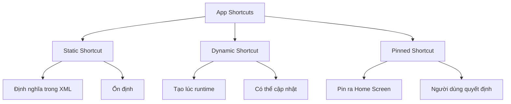
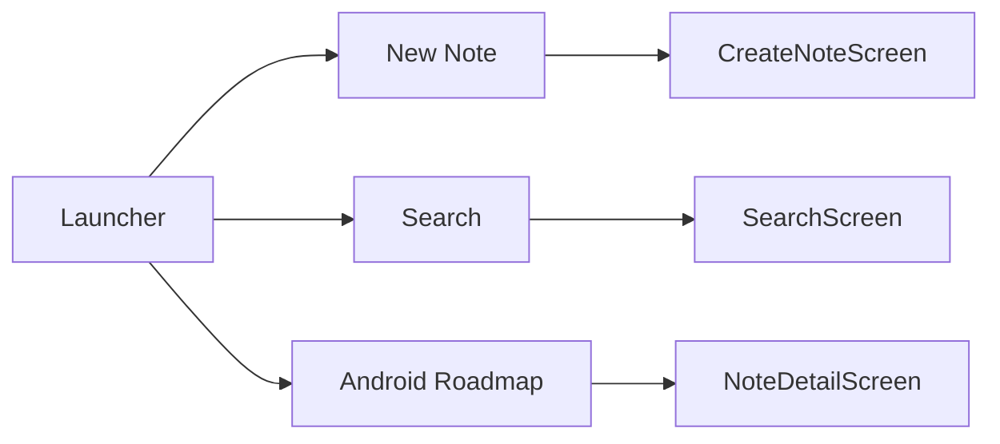
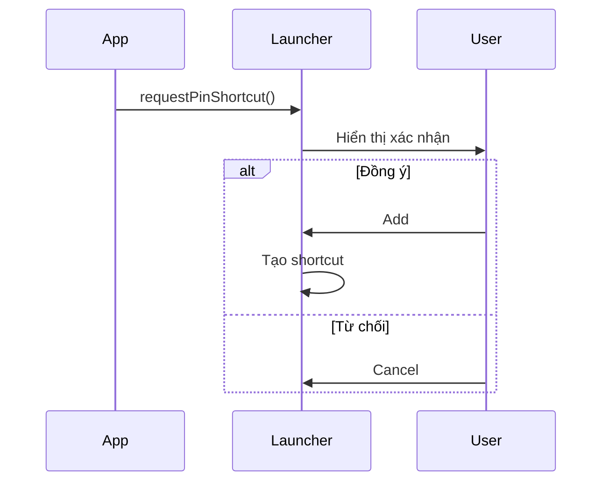
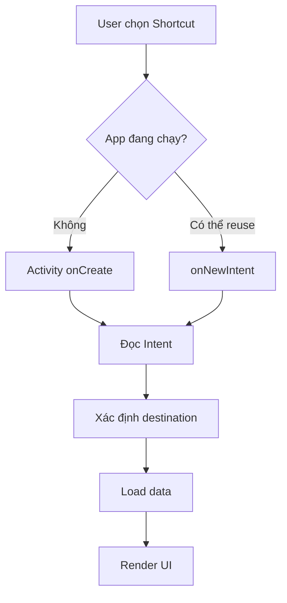
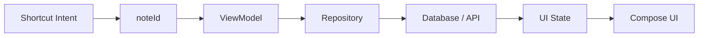
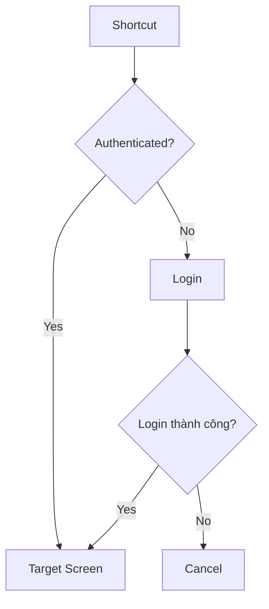
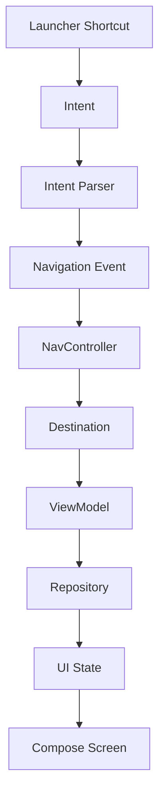
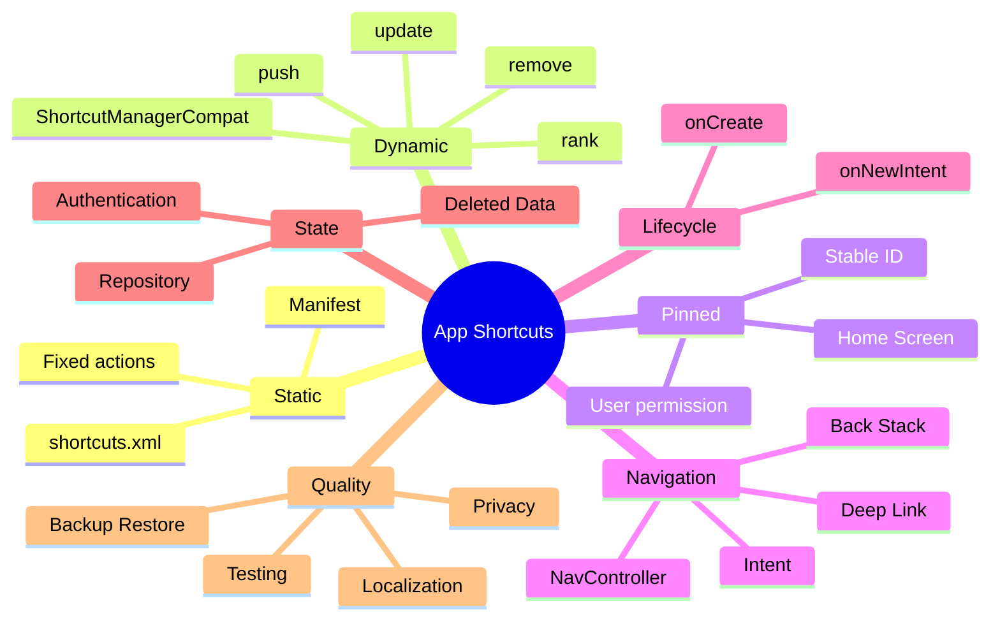

[](https://developer.android.com/develop/ui/compose/system/shortcuts/creating-shortcuts?utm_source=chatgpt.com)

# 042 - App Shortcuts

**Học phần:** 02 - App Components and User Interface
**Module:** Module 04 - Interface and Navigation
**Nhóm nội dung:** Navigation
**Nguồn roadmap:** Interface and Navigation / Navigation
**Loại bài:** UI
**Thứ tự trong module:** 042
**Thời lượng gợi ý:** 30 phút

---

## 1. Tóm tắt

**App Shortcuts** là các lối tắt giúp người dùng truy cập trực tiếp vào một **tính năng, nội dung hoặc hành động cụ thể bên trong ứng dụng** mà không cần mở app rồi điều hướng qua nhiều màn hình.

Ví dụ, thay vì:

```text
Mở ứng dụng
    ↓
Mở Messages
    ↓
Nhấn New Message
    ↓
Bắt đầu soạn
```

người dùng có thể:

```text
Nhấn giữ icon ứng dụng
    ↓
Chọn "New Message"
    ↓
Mở thẳng màn hình soạn tin
```

Android cho phép shortcut trỏ tới một hoặc nhiều `Intent`, nhờ đó shortcut có thể mở trực tiếp một hành động sâu bên trong ứng dụng. Các ví dụ chính thức gồm soạn email mới, điều hướng đến một vị trí, gửi tin cho một người, mở tập phim tiếp theo hoặc tiếp tục màn chơi gần nhất. ([Android Developers][1])

App Shortcuts thuộc nhóm **Navigation** vì nó tạo một entry point mới vào navigation graph:

```text
Launcher
   │
   ├── App icon
   │       ↓
   │      Home
   │
   └── Shortcut
           ↓
      Destination cụ thể
```

---

# 2. Mục tiêu học tập

Sau bài này, bạn có thể:

* Giải thích App Shortcuts bằng ngôn ngữ của mình.
* Phân biệt **Static**, **Dynamic** và **Pinned Shortcut**.
* Tạo static shortcut bằng `shortcuts.xml`.
* Tạo dynamic shortcut bằng `ShortcutManagerCompat`.
* Yêu cầu người dùng pin shortcut ra Home Screen.
* Kết nối shortcut với `Intent`, Deep Link hoặc Navigation.
* Xử lý shortcut khi app chưa chạy và khi app đang chạy.
* Hiểu ảnh hưởng của shortcut đến lifecycle và back stack.
* Quản lý việc cập nhật, xóa hoặc vô hiệu hóa shortcut.
* Biết giới hạn số lượng shortcut.
* Viết checklist kiểm thử shortcut.
* Tạo một mini project làm portfolio.

---

# 3. App Shortcut trông như thế nào?

Trên launcher hỗ trợ App Shortcuts, người dùng thường **nhấn giữ icon ứng dụng** để hiển thị các hành động nhanh. Static và dynamic shortcuts có thể xuất hiện trong menu này. ([Android Developers][2])

Ví dụ:

```text
             My App
                │
        nhấn giữ icon
                ↓

       ┌────────────────────┐
       │ ＋ New Note        │
       ├────────────────────┤
       │ 🔍 Search          │
       ├────────────────────┤
       │ ⭐ Favorites       │
       └────────────────────┘
                │
               icon
```

### Ảnh minh họa chính thức


*Hình: App Shortcuts xuất hiện khi nhấn giữ icon ứng dụng trên Android.* 

---

# 4. Ba loại App Shortcuts

Android chia shortcut thành ba nhóm chính:



Android định nghĩa:

* **Static shortcuts:** khai báo trong resource được đóng gói cùng APK/App Bundle.
* **Dynamic shortcuts:** ứng dụng tạo, cập nhật và xóa trong runtime.
* **Pinned shortcuts:** shortcut được thêm trực tiếp vào launcher nếu người dùng đồng ý. ([Android Developers][1])

---

# 5. So sánh Static, Dynamic và Pinned

| Loại             | Tạo ở đâu?     | Thay đổi runtime? | Xuất hiện ở đâu? | Ví dụ            |
| ---------------- | -------------- | ----------------: | ---------------- | ---------------- |
| Static           | XML            |   Không linh hoạt | Menu shortcut    | New Note         |
| Dynamic          | Kotlin/runtime |                Có | Menu shortcut    | Recent Chat      |
| Pinned           | Runtime + user |   Có thể cập nhật | Home Screen      | Chat với An      |
| Static → Pinned  | Người dùng pin |           Hạn chế | Home Screen      | Search           |
| Dynamic → Pinned | Người dùng pin |   Có thể cập nhật | Home Screen      | Project hiện tại |

Static shortcut phù hợp với hành động có ý nghĩa tương đối cố định. Dynamic shortcut phù hợp với nội dung phụ thuộc context của người dùng. Pinned shortcut phù hợp khi người dùng muốn giữ một hành động cụ thể trên launcher. ([Android Developers][3])

---

# 6. Ví dụ thực tế

Giả sử chúng ta có ứng dụng ghi chú:

```text
Note App
│
├── Home
├── Create Note
├── Search
├── Favorites
└── Recent Notes
```

Có thể thiết kế:

```text
STATIC
├── New Note
└── Search

DYNAMIC
├── Note: Android Roadmap
└── Note: Project Report

PINNED
└── Note: Android Roadmap
```

Điều này tạo ra các đường điều hướng:



---

# 7. Shortcut và Navigation

Điểm quan trọng nhất cần hiểu:

> **Shortcut không chỉ là icon. Shortcut là một entry point vào ứng dụng.**

Luồng bình thường:

```text
Launcher
   ↓
MainActivity
   ↓
Home
   ↓
Search
   ↓
Detail
```

Shortcut có thể bỏ qua Home:

```text
Launcher
   ↓
Shortcut
   ↓
Intent
   ↓
MainActivity
   ↓
Detail
```

Do đó shortcut liên quan trực tiếp tới:

* `Intent`
* Deep Link
* Navigation Graph
* Back Stack
* Activity lifecycle
* Authentication state
* dữ liệu của destination

Mỗi shortcut tham chiếu tới một hoặc nhiều `Intent` để thực thi hành động tương ứng trong app. ([Android Developers][1])

---

# 8. Static Shortcut

## 8.1 Khi nào nên dùng?

Ví dụ:

```text
Email App
├── Compose Email
└── Search

Fitness App
├── Start Workout
└── Today's Activity

Note App
├── New Note
└── Search
```

Các hành động này ít thay đổi theo thời gian nên phù hợp với static shortcut.

---

# 9. Khai báo Static Shortcut

Static shortcut được khai báo trong:

```text
app/
└── src/
    └── main/
        └── res/
            └── xml/
                └── shortcuts.xml
```

---

## 9.1 AndroidManifest.xml

Tìm Activity có:

```xml
<intent-filter>
    <action android:name="android.intent.action.MAIN" />

    <category
        android:name="android.intent.category.LAUNCHER" />
</intent-filter>
```

Sau đó thêm:

```xml
<meta-data
    android:name="android.app.shortcuts"
    android:resource="@xml/shortcuts" />
```

Ví dụ:

```xml
<activity
    android:name=".MainActivity"
    android:exported="true">

    <intent-filter>

        <action
            android:name="android.intent.action.MAIN" />

        <category
            android:name="android.intent.category.LAUNCHER" />

    </intent-filter>

    <meta-data
        android:name="android.app.shortcuts"
        android:resource="@xml/shortcuts" />

</activity>
```

Android yêu cầu metadata shortcut được đặt trên main launcher activity tương ứng. ([Android Developers][1])

---

# 10. Tạo `shortcuts.xml`

```xml
<?xml version="1.0" encoding="utf-8"?>

<shortcuts
    xmlns:android="http://schemas.android.com/apk/res/android">

    <shortcut
        android:shortcutId="new_note"
        android:enabled="true"
        android:icon="@drawable/ic_add"
        android:shortcutShortLabel="@string/shortcut_new_note"
        android:shortcutLongLabel="@string/shortcut_new_note_long">

        <intent
            android:action="android.intent.action.VIEW"
            android:targetPackage="com.example.notes"
            android:targetClass="com.example.notes.MainActivity"
            android:data="notes://new" />

    </shortcut>

    <shortcut
        android:shortcutId="search"
        android:enabled="true"
        android:icon="@drawable/ic_search"
        android:shortcutShortLabel="@string/shortcut_search"
        android:shortcutLongLabel="@string/shortcut_search_long">

        <intent
            android:action="android.intent.action.VIEW"
            android:targetPackage="com.example.notes"
            android:targetClass="com.example.notes.MainActivity"
            android:data="notes://search" />

    </shortcut>

</shortcuts>
```

Luồng:

```text
new_note
   ↓
notes://new
   ↓
MainActivity
   ↓
NewNoteScreen
```

---

# 11. Không hard-code label

Nên dùng:

```xml
android:shortcutShortLabel="@string/shortcut_new_note"
```

thay vì:

```xml
android:shortcutShortLabel="New Note"
```

`strings.xml`:

```xml
<string name="shortcut_new_note">
    Ghi chú mới
</string>

<string name="shortcut_new_note_long">
    Tạo ghi chú mới
</string>
```

Điều này giúp localization dễ dàng hơn.

Dynamic và pinned shortcuts cũng cần được cập nhật nếu system locale thay đổi; Android gửi `ACTION_LOCALE_CHANGED` để ứng dụng có thể cập nhật nội dung shortcut tương ứng. ([Android Developers][2])

---

# 12. Dynamic Shortcut

Static shortcut:

```text
Build APK
   ↓
shortcuts.xml
   ↓
Shortcut cố định
```

Dynamic shortcut:

```text
App Runtime
   ↓
User State / Data
   ↓
ShortcutManagerCompat
   ↓
Shortcut động
```

Ví dụ chat app:

```text
Recent chats

An
Bình
Huy
Lan
```

Khi người dùng chat nhiều với Bình:

```text
Bình trở thành recent
        ↓
update dynamic shortcut
        ↓
Bình xuất hiện cao hơn
```

Dynamic shortcut có thể được push, cập nhật và xóa trong runtime. `ShortcutManagerCompat` cung cấp API để thực hiện các thao tác này. ([Android Developers][4])

---

# 13. Tạo Dynamic Shortcut

Có thể sử dụng AndroidX:

```kotlin
import androidx.core.content.pm.ShortcutInfoCompat
import androidx.core.content.pm.ShortcutManagerCompat
import androidx.core.graphics.drawable.IconCompat
```

Ví dụ:

```kotlin
fun publishDynamicShortcut(context: Context) {

    val intent = Intent(
        context,
        MainActivity::class.java
    ).apply {

        action = Intent.ACTION_VIEW

        data = Uri.parse(
            "notes://note/android-roadmap"
        )
    }

    val shortcut =
        ShortcutInfoCompat.Builder(
            context,
            "note_android_roadmap"
        )
            .setShortLabel("Android")
            .setLongLabel("Mở Android Roadmap")
            .setIcon(
                IconCompat.createWithResource(
                    context,
                    R.drawable.ic_note
                )
            )
            .setIntent(intent)
            .build()

    ShortcutManagerCompat.pushDynamicShortcut(
        context,
        shortcut
    )
}
```

`pushDynamicShortcut()` được Android khuyến nghị để publish hoặc cập nhật dynamic shortcut. Shortcut mutable có cùng ID có thể được cập nhật khi push lại. ([Android Developers][4])

---

# 14. Shortcut ID rất quan trọng

Ví dụ:

```text
ID
note_android_roadmap
```

không nên thay đổi ngẫu nhiên thành:

```text
shortcut_928182
```

Ở pinned shortcuts, Android đặc biệt khuyến cáo ID phải ổn định vì hệ thống có thể backup và restore shortcut sang thiết bị khác. ID nên dựa trên chuỗi cố định hoặc server-side identifier có ý nghĩa. ([Android Developers][4])

Ví dụ tốt:

```text
conversation_user_129
project_android_course
note_8bca4
```

---

# 15. Cập nhật Dynamic Shortcut

Giả sử:

```text
Android Roadmap
```

đổi tên thành:

```text
Android Developer Roadmap 2026
```

Có thể push lại cùng ID:

```kotlin
val shortcut =
    ShortcutInfoCompat.Builder(
        context,
        "note_android_roadmap"
    )
        .setShortLabel("Android 2026")
        .setIntent(intent)
        .build()

ShortcutManagerCompat.pushDynamicShortcut(
    context,
    shortcut
)
```

Nếu shortcut giữ nguyên **ý nghĩa**, Android cho phép cập nhật thông tin. Nếu hành động đã trở thành một nội dung hoàn toàn khác, nên tạo shortcut mới thay vì tái sử dụng ID cũ. ([Android Developers][5])

---

# 16. Xóa Dynamic Shortcut

Một shortcut:

```text
Recent Project
```

không còn cần nữa:

```kotlin
ShortcutManagerCompat.removeDynamicShortcuts(
    context,
    listOf("recent_project")
)
```

Xóa toàn bộ dynamic shortcuts:

```kotlin
ShortcutManagerCompat
    .removeAllDynamicShortcuts(context)
```

Các API quản lý dynamic shortcut bao gồm push/update, remove một nhóm và remove toàn bộ shortcut động. ([Android Developers][4])

---

# 17. Pinned Shortcut

Pinned shortcut khác với menu shortcut.

```text
Static / Dynamic Shortcut

       nhấn giữ icon
            ↓
      shortcut menu
```

Trong khi:

```text
Pinned Shortcut

Home Screen
    │
    ├── My App
    ├── Camera
    ├── Android Note ← shortcut riêng
    └── Chrome
```

Pinned shortcut xuất hiện như một icon riêng trên launcher được hỗ trợ. Trên Android 8.0/API 26 trở lên, ứng dụng có thể yêu cầu launcher pin shortcut. Người dùng phải xác nhận yêu cầu đó. ([Android Developers][4])

---

# 18. Ảnh minh họa Pinned Shortcut


*Ví dụ giao diện yêu cầu người dùng thêm shortcut vào Home Screen.* 

Luồng:



---

# 19. Kiểm tra launcher có hỗ trợ pin hay không

```kotlin
val supported =
    ShortcutManagerCompat
        .isRequestPinShortcutSupported(context)
```

Sau đó:

```kotlin
if (supported) {
    // request pin
}
```

Android khuyến nghị kiểm tra launcher có hỗ trợ in-app pinning trước khi gửi yêu cầu. ([Android Developers][4])

---

# 20. Tạo Pinned Shortcut

```kotlin
fun pinNoteShortcut(
    context: Context,
    noteId: String
) {

    if (!ShortcutManagerCompat
            .isRequestPinShortcutSupported(context)
    ) {
        return
    }

    val intent =
        Intent(
            context,
            MainActivity::class.java
        ).apply {

            action = Intent.ACTION_VIEW

            data = Uri.parse(
                "notes://note/$noteId"
            )
        }

    val shortcut =
        ShortcutInfoCompat.Builder(
            context,
            "note_$noteId"
        )
            .setShortLabel("Ghi chú")
            .setLongLabel(
                "Mở ghi chú"
            )
            .setIcon(
                IconCompat.createWithResource(
                    context,
                    R.drawable.ic_note
                )
            )
            .setIntent(intent)
            .build()

    ShortcutManagerCompat
        .requestPinShortcut(
            context,
            shortcut,
            null
        )
}
```

Sau khi người dùng xác nhận:

```text
Home Screen
     │
     └── 📄 Android Note
             │
             ↓
       NoteDetailScreen
```

---

# 21. Shortcut + Deep Link

Đây là cách tổ chức khá tự nhiên:

```text
Shortcut
    ↓
Intent
    ↓
URI / Deep Link
    ↓
Navigation
    ↓
Destination
```

Ví dụ URI:

```text
notes://new

notes://search

notes://note/123
```

Mapping:

```text
notes://new
       ↓
NewNoteScreen

notes://search
       ↓
SearchScreen

notes://note/123
       ↓
NoteDetailScreen(123)
```

---

# 22. Shortcut + Navigation Compose

Navigation graph:

```kotlin
NavHost(
    navController = navController,
    startDestination = "home"
) {

    composable("home") {
        HomeScreen()
    }

    composable("new") {
        NewNoteScreen()
    }

    composable("search") {
        SearchScreen()
    }

    composable(
        route = "note/{id}"
    ) { backStackEntry ->

        val id =
            backStackEntry.arguments
                ?.getString("id")

        NoteDetailScreen(
            noteId = id
        )
    }
}
```

Shortcut:

```text
notes://note/123
```

sẽ cần được chuyển thành:

```text
note/123
```

trong navigation layer.

---

# 23. Xử lý Intent trong Activity

Shortcut có thể khởi động app từ hai trạng thái khác nhau.

### Trường hợp A

```text
App chưa chạy
     ↓
Shortcut
     ↓
onCreate()
```

### Trường hợp B

```text
App đang chạy
     ↓
Shortcut
     ↓
Activity được reuse
     ↓
onNewIntent()
```

Đây là điểm rất quan trọng đối với Single Activity Architecture.

Android khuyến nghị dynamic shortcuts có thể dùng tổ hợp `FLAG_ACTIVITY_SINGLE_TOP` và `FLAG_ACTIVITY_CLEAR_TOP`; khi Activity đang tồn tại, intent mới có thể được chuyển tới `onNewIntent()` thay vì phá hủy rồi tạo lại Activity. ([Android Developers][2])

---

# 24. Ví dụ xử lý cả `onCreate()` và `onNewIntent()`

```kotlin
class MainActivity : ComponentActivity() {

    override fun onCreate(
        savedInstanceState: Bundle?
    ) {
        super.onCreate(savedInstanceState)

        handleShortcutIntent(intent)

        setContent {
            App()
        }
    }

    override fun onNewIntent(
        intent: Intent
    ) {
        super.onNewIntent(intent)

        setIntent(intent)

        handleShortcutIntent(intent)
    }

    private fun handleShortcutIntent(
        intent: Intent
    ) {

        val uri = intent.data

        Log.d(
            "AppShortcut",
            "Shortcut URI = $uri"
        )
    }
}
```

Nếu chỉ xử lý:

```kotlin
onCreate()
```

thì shortcut có thể hoạt động khi app bị đóng nhưng không xử lý đúng khi Activity đang được reuse.

---

# 25. Lifecycle của App Shortcuts

Shortcut bản thân không phải lifecycle component.

Nhưng nó **ảnh hưởng cách Activity được khởi tạo hoặc reuse**.



Do đó khi thiết kế shortcut phải nghĩ tới:

* Activity mới hay Activity hiện tại?
* navigation stack hiện tại?
* dữ liệu destination có tồn tại?
* user có đăng nhập?
* network có khả dụng?
* shortcut có quá cũ?

---

# 26. Shortcut và State

Giả sử shortcut trỏ tới:

```text
Note ID = 123
```

Đừng đưa toàn bộ dữ liệu note vào shortcut:

```text
title
content
author
updated time
...
```

Tốt hơn:

```text
Shortcut
   ↓
noteId=123
   ↓
Repository
   ↓
Load note
   ↓
UI State
```

Kiến trúc:



Điều này tránh shortcut chứa state cũ.

Ngoài ra Android cảnh báo launcher có thể truy cập metadata của shortcut; vì vậy không nên đưa thông tin nhạy cảm vào shortcut metadata. ([Android Developers][1])

---

# 27. Authentication

Giả sử shortcut:

```text
Open Bank Transfer
```

Người dùng đã logout.

Không nên:

```text
Shortcut
    ↓
TransferScreen
```

mà nên:



Shortcut là entry point bên ngoài luồng điều hướng thông thường nên mọi guard như authentication, permission và dữ liệu hợp lệ vẫn phải được kiểm tra.

---

# 28. Shortcut trỏ tới dữ liệu đã bị xóa

Ví dụ:

```text
Pinned Shortcut
      ↓
Conversation #381
```

Sau vài tháng:

```text
Conversation #381
      ↓
deleted
```

Ứng dụng phải tránh crash.

Ví dụ:

```text
Shortcut
    ↓
Lookup conversation
    ↓
Exists?
   /    \
 Yes     No
 ↓       ↓
Chat   Error/Inbox
```

Pinned shortcut cũ có thể tiếp tục tồn tại ngay cả sau khi một shortcut dynamic không còn được publish nữa. Android cung cấp `disableShortcuts()` để vô hiệu hóa shortcut không còn hợp lệ. ([Android Developers][2])

---

# 29. Disable Shortcut

Ví dụ:

```kotlin
ShortcutManagerCompat.disableShortcuts(
    context,
    listOf("conversation_381"),
    "Cuộc trò chuyện không còn tồn tại"
)
```

Concept:

```text
Data deleted
    ↓
disableShortcut
    ↓
Pinned shortcut không còn thực thi action cũ
```

Ứng dụng không thể chủ động xóa pinned shortcut khỏi launcher của người dùng như xóa dynamic shortcut, nhưng có thể disable shortcut đó. ([Android Developers][1])

---

# 30. Giới hạn số Shortcut

Không nên tạo:

```text
Shortcut 1
Shortcut 2
Shortcut 3
...
Shortcut 30
```

Android cho biết đa số launcher chỉ hiển thị khoảng **4 shortcut** cùng lúc cho static và dynamic shortcut. Giới hạn thực tế trên thiết bị có thể được kiểm tra bằng `getMaxShortcutCountPerActivity()`. ([Android Developers][1])

Best practices của Android cũng khuyến nghị chỉ publish khoảng **4 shortcut riêng biệt** để giao diện launcher rõ ràng hơn, dù API có thể hỗ trợ nhiều hơn. ([Android Developers][5])

Do đó:

```text
Không phải:

20 actions
    ↓
20 shortcuts
```

Mà:

```text
20 actions
    ↓
chọn 3–4 hành động giá trị nhất
    ↓
App Shortcuts
```

---

# 31. Chọn shortcut nào?

Một cách đánh giá:

```text
Action
 │
 ├── Có được dùng thường xuyên?
 │
 ├── Có tiết kiệm nhiều bước?
 │
 ├── Có destination rõ ràng?
 │
 ├── Có thể dùng ngay?
 │
 └── Có ý nghĩa khi mở app từ launcher?
```

Nếu hầu hết câu trả lời là **Có**, action đó là ứng viên tốt.

Ví dụ:

| Action         |          Shortcut? |
| -------------- | -----------------: |
| New Message    |                  ✅ |
| Search         |                  ✅ |
| Continue Game  |                  ✅ |
| Open Settings  |             Có thể |
| Privacy Policy | ❌ thường không cần |
| About App      |                  ❌ |
| Logout         |                  ❌ |

---

# 32. Shortcut Rank

Dynamic shortcuts có thể có `rank`:

```text
rank 0 → ưu tiên cao
rank 1
rank 2
rank 3
```

Ví dụ:

```kotlin
ShortcutInfoCompat.Builder(
    context,
    "chat_an"
)
    .setShortLabel("An")
    .setRank(0)
```

Trong từng loại shortcut, Android sử dụng rank để sắp xếp thứ tự; rank thấp hơn có ưu tiên vị trí cao hơn. ([Android Developers][2])

---

# 33. Shortcut Usage

Android cũng cho phép báo rằng một shortcut/action vừa được sử dụng.

Ví dụ:

```kotlin
ShortcutManagerCompat.reportShortcutUsed(
    context,
    "new_note"
)
```

Luồng:

```text
User tạo note
      ↓
reportShortcutUsed("new_note")
      ↓
Launcher có usage signal
```

Không chỉ báo usage khi người dùng bấm shortcut.

Nếu người dùng mở app bình thường rồi cũng thực hiện cùng hành động:

```text
Home
 ↓
New Note
 ↓
reportShortcutUsed()
```

thì đây cũng là tín hiệu usage có giá trị. Android khuyến nghị duy trì lịch sử sử dụng shortcut/action chính xác. ([Android Developers][5])

---

# 34. Rate Limiting

Dynamic shortcut không nên được cập nhật liên tục vô nghĩa:

```text
mỗi 100 ms
    ↓
updateShortcut()
```

Một số API quản lý dynamic shortcut bị **rate limiting** khi app chạy background nhằm hạn chế tiêu thụ tài nguyên. Android cung cấp `isRateLimitingActive` để kiểm tra trạng thái này. ([Android Developers][2])

Ví dụ logic tốt:

```text
User data thực sự thay đổi
        ↓
Có cần shortcut mới?
        ↓
       Yes
        ↓
update
```

---

# 35. Debug Rate Limit

Trong quá trình development, Android cung cấp lệnh:

```bash
adb shell cmd shortcut reset-throttling
```

hoặc:

```bash
adb shell cmd shortcut reset-throttling --user <user-id>
```

để reset ShortcutManager rate limiting khi kiểm thử. ([Android Developers][2])

---

# 36. Backup và Restore

Đây là khác biệt quan trọng:

```text
STATIC
   ↓
được publish lại sau reinstall

DYNAMIC
   ↓
không được backup
   ↓
app phải publish lại

PINNED
   ↓
system có thể restore
```

Android khuyến nghị kiểm tra dynamic shortcuts khi app được mở và publish lại nếu cần sau quá trình restore. ([Android Developers][2])

Ví dụ:

```kotlin
if (
    ShortcutManagerCompat
        .getDynamicShortcuts(this)
        .isEmpty()
) {

    publishShortcuts()
}
```

---

# 37. Localization

Giả sử shortcut hiện tại:

```text
New Note
```

User đổi ngôn ngữ:

```text
English
   ↓
Vietnamese
```

Shortcut nên trở thành:

```text
Ghi chú mới
```

Dynamic và pinned shortcut cần được ứng dụng cập nhật sau system locale change. ([Android Developers][2])

---

# 38. Thiết kế label

Launcher có không gian rất hạn chế.

Không tốt:

```text
Create a completely new note
```

Tốt hơn:

```text
New Note
```

Hoặc:

```text
Ghi chú mới
```

Android khuyến nghị label ngắn; best practices hiện đề xuất cố gắng giữ short description khoảng 10 ký tự và long description khoảng 25 ký tự khi có thể. ([Android Developers][5])

---

# 39. Kiến trúc Production

Không nên:

```text
Shortcut
   ↓
Activity
   ↓
if/else khổng lồ
   ↓
database
   ↓
network
   ↓
UI
```

Có thể tổ chức:

```text
app/
│
├── navigation/
│   ├── AppNavHost.kt
│   ├── Routes.kt
│   └── ShortcutNavigator.kt
│
├── shortcuts/
│   ├── ShortcutIds.kt
│   ├── ShortcutPublisher.kt
│   └── ShortcutIntentParser.kt
│
├── feature/
│   ├── home/
│   ├── notes/
│   └── search/
│
└── data/
    ├── repository/
    └── database/
```

---

# 40. Shortcut Intent Parser

Ví dụ:

```kotlin
sealed interface ShortcutDestination {

    data object NewNote :
        ShortcutDestination

    data object Search :
        ShortcutDestination

    data class NoteDetail(
        val id: String
    ) : ShortcutDestination
}
```

Parser:

```kotlin
fun parseShortcut(
    uri: Uri?
): ShortcutDestination? {

    if (uri == null) {
        return null
    }

    return when (uri.host) {

        "new" ->
            ShortcutDestination.NewNote

        "search" ->
            ShortcutDestination.Search

        "note" -> {

            val id =
                uri.pathSegments
                    .firstOrNull()
                    ?: return null

            ShortcutDestination.NoteDetail(id)
        }

        else -> null
    }
}
```

Sau đó:

```text
Intent
 ↓
Parser
 ↓
ShortcutDestination
 ↓
NavController
```

UI không cần biết shortcut đến từ launcher hay từ nơi khác.

---

# 41. State flow tốt hơn



Điều này tách rõ:

```text
Shortcut infrastructure
        ≠
Business logic
```

---

# 42. Testing App Shortcuts

Shortcut cần test ít nhất ba tầng:

```text
Shortcut
│
├── Publication
│
├── Intent / Navigation
│
└── Destination behavior
```

---

# 43. Manual Test — Static Shortcut

```text
1. Install app
2. Trở về launcher
3. Nhấn giữ app icon
4. Shortcut xuất hiện
5. Chọn "New Note"
6. App mở
7. NewNoteScreen xuất hiện
8. Back hoạt động đúng
```

Checklist:

* [ ] Shortcut xuất hiện.
* [ ] Icon đúng.
* [ ] Label đúng.
* [ ] Chọn shortcut mở app.
* [ ] Destination đúng.
* [ ] Không crash.
* [ ] Back hoạt động hợp lý.

---

# 44. Manual Test — Dynamic Shortcut

```text
1. Login
2. Tạo / sử dụng Note A
3. App publish dynamic shortcut
4. Trở về launcher
5. Nhấn giữ icon
6. Note A xuất hiện
7. Chọn Note A
8. NoteDetailScreen mở
```

Checklist:

* [ ] Dynamic shortcut được publish.
* [ ] ID ổn định.
* [ ] Label đúng.
* [ ] Rank đúng.
* [ ] Intent đúng.
* [ ] Update hoạt động.
* [ ] Remove hoạt động.

---

# 45. Manual Test — Pinned Shortcut

```text
App
 ↓
"Pin to Home"
 ↓
System confirmation
 ↓
Accept
 ↓
Home Screen
 ↓
shortcut icon
 ↓
tap
 ↓
target screen
```

Checklist:

* [ ] Kiểm tra launcher support.
* [ ] System confirmation xuất hiện.
* [ ] Cancel hoạt động.
* [ ] Accept hoạt động.
* [ ] Shortcut xuất hiện trên Home Screen.
* [ ] Shortcut mở đúng destination.

---

# 46. Lifecycle Test

Kiểm tra hai tình huống.

### Test A — App bị đóng

```text
Force stop / app không chạy
      ↓
tap shortcut
      ↓
destination đúng
```

### Test B — App đang mở

```text
Home đang mở
     ↓
Home button
     ↓
tap shortcut
     ↓
onNewIntent / navigation
     ↓
destination đúng
```

Nếu A chạy mà B không chạy:

```text
khả năng cao cần kiểm tra
onNewIntent()
```

---

# 47. Test dữ liệu không tồn tại

```text
Pin Note #10
      ↓
Delete Note #10
      ↓
Tap shortcut
```

Expected:

```text
Không crash
   ↓
Hiện thông báo
hoặc
Navigate Home
```

Không nên:

```text
NullPointerException
```

---

# 48. Test Authentication

```text
Login
 ↓
Pin shortcut
 ↓
Logout
 ↓
Tap shortcut
```

Expected:

```text
Login screen
    ↓
login
    ↓
target destination
```

nếu sản phẩm yêu cầu quay lại destination ban đầu.

---

# 49. Debugging

Một số log hữu ích:

```kotlin
Log.d(
    "AppShortcut",
    """
    action=${intent.action}
    data=${intent.data}
    """.trimIndent()
)
```

Ví dụ:

```text
action=android.intent.action.VIEW
data=notes://note/123
```

Tiếp tục:

```text
Shortcut received
↓
URI parsed?
↓
Destination exists?
↓
Navigation fired?
↓
Repository returned data?
↓
UI rendered?
```

---

# 50. Các lỗi thường gặp

## Lỗi 1 — Shortcut chỉ mở Home

```text
Shortcut
 ↓
MainActivity
 ↓
Home
```

thay vì:

```text
Shortcut
 ↓
MainActivity
 ↓
Target
```

Nguyên nhân thường là Activity không đọc `Intent.data`.

---

## Lỗi 2 — Chỉ xử lý `onCreate`

```kotlin
override fun onCreate(...) {
    handleIntent(intent)
}
```

nhưng không xử lý:

```kotlin
override fun onNewIntent(intent: Intent) {
    ...
}
```

App có thể hoạt động khác nhau tùy trạng thái lifecycle.

---

## Lỗi 3 — Shortcut trỏ tới dữ liệu cũ

```text
shortcut:
conversation_12

database:
conversation_12 deleted
```

Phải có fallback hoặc disable shortcut.

---

## Lỗi 4 — Shortcut chứa dữ liệu nhạy cảm

Không nên:

```text
shortcut label:
Transfer $50,000 to Account 123456
```

Launcher có thể đọc shortcut metadata; Android khuyến nghị không đưa thông tin nhạy cảm vào metadata shortcut. ([Android Developers][1])

---

## Lỗi 5 — Quá nhiều shortcut

```text
10–20 shortcut
```

không đồng nghĩa UX tốt hơn.

Nên ưu tiên vài hành động quan trọng nhất. Android khuyến nghị khoảng bốn shortcut distinct cho launcher. ([Android Developers][5])

---

# 51. App Shortcut không phải Home Screen Widget

Đừng nhầm:

```text
App Shortcut
```

với:

```text
Widget
```

### Shortcut

```text
Tap
 ↓
Perform action / Open destination
```

### Widget

```text
Home Screen UI
 ↓
Hiển thị dữ liệu
 ↓
Có thể tương tác trực tiếp
```

Ví dụ:

```text
Shortcut:
"New Note"

Widget:
Danh sách 5 ghi chú gần nhất
```

---

# 52. App Shortcut không phải Keyboard Shortcut

Hai khái niệm khác nhau:

```text
App Shortcut
    ↓
Launcher / Assistant
```

và:

```text
Keyboard Shortcut
    ↓
Ctrl / Alt / Meta + key
```

Ở Android, Keyboard Shortcuts Helper là API riêng dành cho các phím tắt bàn phím. ([Android Developers][6])

---

# 53. App Shortcut và Deep Link

Có thể hình dung:

```text
             External Entry Points
                     │
          ┌──────────┼──────────┐
          │          │          │
       Shortcut   Web Link   Notification
          │          │          │
          └──────────┼──────────┘
                     ↓
                   URI
                     ↓
                Navigation
                     ↓
                 Screen
```

Đây là lý do thiết kế destination bằng URI/deep-link rõ ràng giúp kiến trúc dễ mở rộng.

---

# 54. Mini Project thực hành

## `QuickNotes`

Tạo app:

```text
QuickNotes
│
├── Home
├── New Note
├── Search
├── Favorites
└── Note Detail
```

Shortcut:

```text
Static
├── New Note
└── Search

Dynamic
├── Recent Note #1
└── Recent Note #2

Pinned
└── Favorite Note
```

---

# 55. Yêu cầu thực hành

### Phần 1

Tạo static shortcuts:

```text
New Note
Search
```

### Phần 2

Tạo dynamic shortcut cho:

```text
Ghi chú vừa xem gần nhất
```

### Phần 3

Thêm nút:

```text
Pin to Home Screen
```

trên `NoteDetailScreen`.

### Phần 4

Khi click pinned shortcut:

```text
Home Screen
 ↓
Note Detail
```

### Phần 5

Xóa note và kiểm tra shortcut cũ không làm app crash.

---

# 56. Bài tập mở rộng

## Bài 1 — Recent Notes

Dynamic shortcuts:

```text
Android Course
Game Design
Project Report
```

Khi người dùng mở note mới:

```text
new recent
    ↓
update shortcuts
```

---

## Bài 2 — Localization

Hỗ trợ:

```text
English
Vietnamese
```

Shortcut:

```text
New Note
   ↕

Ghi chú mới
```

---

## Bài 3 — Authentication

Tạo shortcut:

```text
My Private Note
```

Sau logout:

```text
Shortcut
 ↓
Login
 ↓
Private Note
```

---

## Bài 4 — Error Handling

Shortcut:

```text
note/123
```

Nếu note không tồn tại:

```text
Snackbar:
"Ghi chú không còn tồn tại"
```

và điều hướng về:

```text
Home
```

---

# 57. Artifact cho Portfolio

Có thể tạo repository:

```text
android-app-shortcuts-demo/
│
├── app/
│
├── screenshots/
│   ├── shortcut-menu.png
│   ├── pinned-shortcut.png
│   ├── new-note.png
│   └── note-detail.png
│
└── README.md
```

README:

```markdown
# Android App Shortcuts Demo

Demo ứng dụng Android sử dụng:

- Jetpack Compose
- Navigation Compose
- Static App Shortcuts
- Dynamic App Shortcuts
- Pinned Shortcuts
- ShortcutManagerCompat
- Intent handling
- Deep Links
- onNewIntent
- Shortcut lifecycle handling
```

---

# 58. Artifact này chứng minh điều gì?

```text
App Shortcuts Demo
       │
       ├── Android Launcher Integration
       ├── Intent
       ├── Navigation
       ├── Deep Link
       ├── Lifecycle
       ├── State
       ├── Error Handling
       └── Testing
```

Đây là artifact tốt hơn một UI demo thuần túy vì nó chứng minh ứng dụng biết xử lý **entry point từ bên ngoài app**.

---

# 59. Câu hỏi tự kiểm tra

### Câu 1

App Shortcut dùng để làm gì?

**Đáp án:** Cho phép người dùng truy cập nhanh vào một action hoặc destination cụ thể trong ứng dụng.

---

### Câu 2

Có ba loại shortcut chính nào?

```text
Static
Dynamic
Pinned
```

([Android Developers][1])

---

### Câu 3

Static shortcut được định nghĩa ở đâu?

```text
res/xml/shortcuts.xml
```

và được đăng ký qua metadata trong launcher activity. ([Android Developers][3])

---

### Câu 4

Dynamic shortcut được tạo lúc nào?

```text
Runtime
```

---

### Câu 5

API AndroidX thường dùng để quản lý shortcut?

```kotlin
ShortcutManagerCompat
```

---

### Câu 6

API push dynamic shortcut?

```kotlin
ShortcutManagerCompat
    .pushDynamicShortcut(...)
```

([Android Developers][4])

---

### Câu 7

API yêu cầu pin shortcut?

```kotlin
ShortcutManagerCompat
    .requestPinShortcut(...)
```

---

### Câu 8

Tại sao cần xử lý `onNewIntent()`?

Vì khi Activity hiện tại được reuse, shortcut có thể gửi Intent mới vào Activity đang tồn tại thay vì tạo Activity mới. ([Android Developers][2])

---

# 60. Checklist hoàn thành

## Kiến thức

* [ ] Giải thích được App Shortcuts.
* [ ] Phân biệt Static Shortcut.
* [ ] Phân biệt Dynamic Shortcut.
* [ ] Phân biệt Pinned Shortcut.
* [ ] Hiểu `ShortcutManagerCompat`.
* [ ] Hiểu shortcut ID.
* [ ] Hiểu shortcut rank.

## Static Shortcut

* [ ] Có `shortcuts.xml`.
* [ ] Có metadata trong Manifest.
* [ ] Có icon.
* [ ] Có short label.
* [ ] Có Intent.
* [ ] Mở đúng destination.

## Dynamic Shortcut

* [ ] Publish được runtime.
* [ ] Update được shortcut.
* [ ] Remove được shortcut.
* [ ] ID ổn định.
* [ ] Không update quá mức cần thiết.

## Pinned Shortcut

* [ ] Kiểm tra launcher support.
* [ ] Gửi pin request.
* [ ] User confirmation hoạt động.
* [ ] Shortcut xuất hiện trên Home Screen.
* [ ] Shortcut mở đúng dữ liệu.

## Lifecycle

* [ ] Test khi app chưa chạy.
* [ ] Test khi app đang chạy.
* [ ] Xử lý `onCreate`.
* [ ] Xử lý `onNewIntent`.
* [ ] Back stack hợp lý.

## State

* [ ] Shortcut chỉ chứa identifier cần thiết.
* [ ] Data thật lấy từ Repository.
* [ ] Handle dữ liệu bị xóa.
* [ ] Handle logout.
* [ ] Handle network error.

## Quality

* [ ] Test launcher thực tế.
* [ ] Test label.
* [ ] Test icon.
* [ ] Test localization.
* [ ] Test update/remove.
* [ ] Test pinned shortcut cũ.
* [ ] Không chứa metadata nhạy cảm.

## Portfolio

* [ ] Có screenshot launcher.
* [ ] Có screenshot pinned shortcut.
* [ ] Có source code.
* [ ] Có README.
* [ ] Có sơ đồ navigation.

---

# 61. Ghi chú Production

Khi đưa App Shortcuts vào production, nên kiểm tra theo sơ đồ:

```text
App Shortcut Production Review
│
├── Navigation
│   ├── Shortcut mở destination nào?
│   ├── Deep Link có hợp lệ?
│   ├── Back stack đúng?
│   └── onNewIntent được xử lý?
│
├── State
│   ├── Data còn tồn tại?
│   ├── User còn login?
│   ├── Permission còn hợp lệ?
│   └── Có fallback?
│
├── Shortcut Management
│   ├── ID ổn định?
│   ├── Rank hợp lý?
│   ├── Dynamic shortcut có stale?
│   ├── Shortcut cũ có cần disable?
│   └── Có rate limiting?
│
├── UX
│   ├── Action có thực sự hữu ích?
│   ├── Có quá nhiều shortcut?
│   ├── Label có ngắn?
│   └── Icon có dễ hiểu?
│
├── Privacy
│   ├── Metadata có dữ liệu nhạy cảm?
│   └── Locked state có an toàn?
│
└── Release
    ├── Static shortcuts vẫn đúng?
    ├── IDs có bị thay đổi?
    ├── Deep links có regression?
    └── Backup/restore có hoạt động?
```

Android lưu thông tin shortcut trong credential-encrypted storage nên app không thể truy cập shortcut của người dùng trước khi thiết bị được unlock. Pinned shortcuts cũng có vòng đời khác static/dynamic shortcuts, vì vậy logic production cần tính đến unlock, backup/restore và dữ liệu bị stale. ([Android Developers][2])

---

# 62. Những nguyên tắc nên nhớ

```text
1. Shortcut phải tiết kiệm bước cho user.

2. Chỉ publish một số action thật sự quan trọng.

3. Static = action ổn định.

4. Dynamic = action thay đổi theo context.

5. Pinned = user muốn giữ action trên Home Screen.

6. Shortcut là navigation entry point.

7. Luôn kiểm tra destination/data còn hợp lệ.

8. Xử lý cả onCreate và onNewIntent.

9. Không lưu thông tin nhạy cảm trong metadata.

10. Shortcut ID phải ổn định.
```

---

# 63. Tổng kết



Công thức quan trọng nhất:

```text
App Shortcut
      =
Fast Entry Point
      +
Intent
      +
Navigation
      +
Lifecycle Handling
      +
Valid Application State
```

**App Shortcuts không đơn thuần là thêm vài lựa chọn khi nhấn giữ icon ứng dụng.** Một triển khai tốt phải đưa người dùng tới đúng destination, hoạt động chính xác dù app đang đóng hay đang chạy, xử lý dữ liệu đã thay đổi và duy trì shortcut theo vòng đời của ứng dụng. Android hiện vẫn hỗ trợ đầy đủ Static, Dynamic và Pinned Shortcuts, đồng thời khuyến nghị chỉ đưa những hành động thực sự có giá trị lên launcher. ([Android Developers][1])

[1]: https://developer.android.com/develop/ui/compose/system/shortcuts "App shortcuts overview  |  Jetpack Compose  |  Android Developers"
[2]: https://developer.android.com/develop/ui/compose/system/shortcuts/managing-shortcuts "Manage shortcuts  |  Jetpack Compose  |  Android Developers"
[3]: https://developer.android.com/develop/ui/compose/system/shortcuts/creating-shortcuts?utm_source=chatgpt.com "Create shortcuts | Jetpack Compose"
[4]: https://developer.android.com/develop/ui/compose/system/shortcuts/creating-shortcuts "Create shortcuts  |  Jetpack Compose  |  Android Developers"
[5]: https://developer.android.com/develop/ui/compose/system/shortcuts/best-practices "Create shortcuts  |  Jetpack Compose  |  Android Developers"
[6]: https://developer.android.com/develop/ui/compose/touch-input/keyboard-input/keyboard-shortcuts-helper?utm_source=chatgpt.com "Keyboard Shortcuts Helper | Jetpack Compose"

---

# Bài luyện tập

## Mục tiêu


## Đề bài


## Yêu cầu hoàn thành

- [ ] 
- [ ] 
- [ ] 

## Kết quả / lời giải


## Ghi chú
