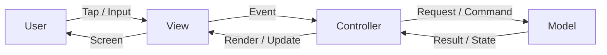
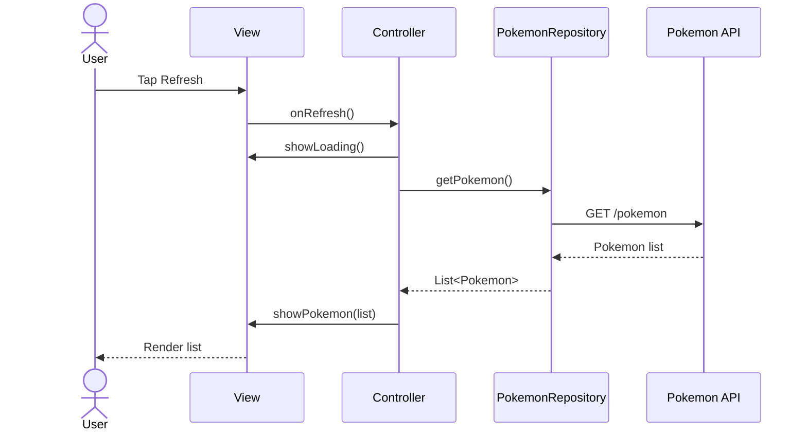
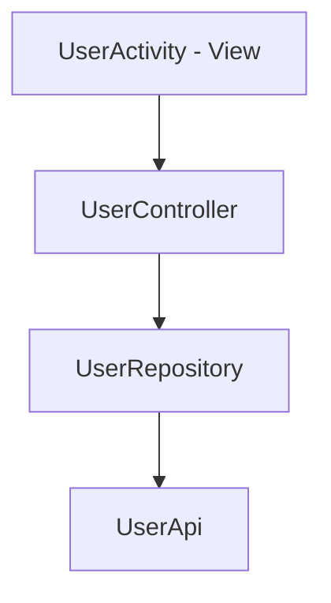
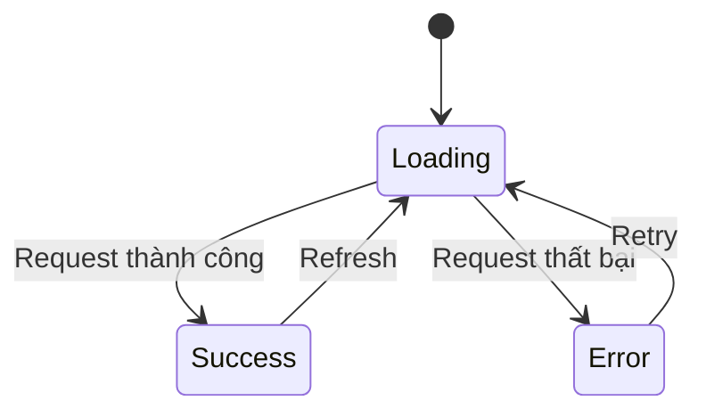
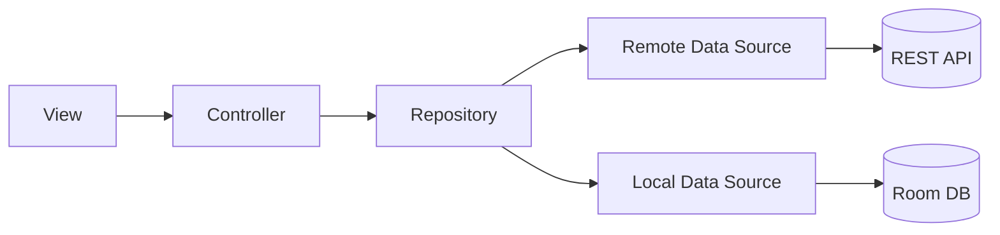
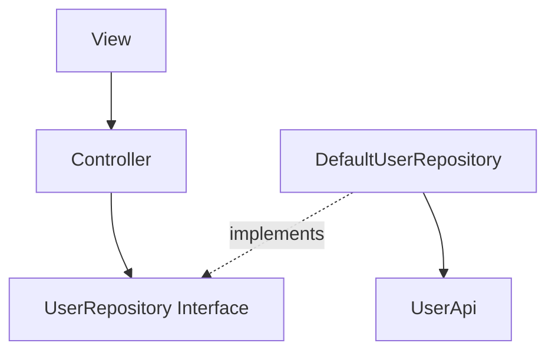
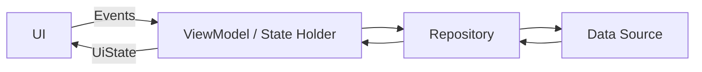
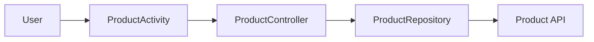

# 001 - MVC

| Trường | Nội dung |
| --- | --- |
| Học phần | 03 - Architecture, State and Data |
| Module | Module 05 - Design and Architecture |
| Nhóm nội dung | Architectural Patterns |
| Nguồn roadmap | Design and Architecture / Architectural Patterns |
| Loại bài | Architecture |
| Thứ tự trong module | 001 |
| Thời lượng gợi ý | 34 phút |

---

## 1. Tóm tắt

**MVC - Model View Controller** là một architectural pattern chia ứng dụng thành ba nhóm trách nhiệm:

* **Model:** dữ liệu và các quy tắc xử lý dữ liệu.
* **View:** những gì người dùng nhìn thấy và tương tác.
* **Controller:** tiếp nhận hành động từ View, điều phối Model và quyết định View cần cập nhật như thế nào.

Mục đích quan trọng nhất của MVC không phải là tạo thêm nhiều class, mà là **separation of concerns**: tránh để UI, business logic và data access nằm lẫn trong một `Activity` hoặc `Fragment`.

Trong Android hiện đại, MVC vẫn hữu ích để học tư duy phân chia trách nhiệm, nhưng **không phải kiến trúc mặc định được Android Developers khuyến nghị cho app mới**. Hướng dẫn Android năm 2026 ưu tiên kiến trúc phân lớp gồm **UI layer + Data layer**, có thể thêm **Domain layer**, kết hợp ViewModel, repository và Unidirectional Data Flow. ([Android Developers][1])


*Sơ đồ trên minh họa luồng cơ bản User → Controller → Model → View.*

---

## 2. Mục tiêu học tập

Sau bài này, bạn có thể:

* Giải thích được MVC bằng ngôn ngữ của mình.
* Phân biệt trách nhiệm của **Model**, **View** và **Controller**.
* Nhận biết tình trạng `Activity` hoặc `Fragment` đang làm quá nhiều việc.
* Thiết kế một screen Android nhỏ theo tư duy MVC.
* Tách network/database khỏi UI.
* Tạo interface để thay implementation thật bằng fake khi test.
* Giải thích MVC ảnh hưởng như thế nào đến:

  * lifecycle;
  * UI state;
  * configuration changes;
  * network errors;
  * testing;
  * debugging;
  * maintainability.
* Hiểu vì sao Android hiện đại thường chuyển từ MVC thuần sang ViewModel + Repository + UDF.

---

## 3. MVC là gì?

MVC viết tắt của:

```text
Model
View
Controller
```

Có thể hiểu đơn giản:

```text
          thao tác
User ───────────────► View
                       │
                       │ event
                       ▼
                  Controller
                       │
                       │ command/query
                       ▼
                     Model
                       │
                       │ result/state
                       ▼
                     View
                       │
                       ▼
                     User
```

Hoặc bằng Mermaid:



MVC giải quyết câu hỏi:

> **Code nào chịu trách nhiệm cho dữ liệu, code nào hiển thị UI và code nào điều phối hai phần đó?**

---

## 4. Ba thành phần của MVC

### 4.1. Model

**Model** đại diện cho dữ liệu và logic liên quan đến dữ liệu của ứng dụng.

Ví dụ trong app mua sắm:

```kotlin
data class Product(
    val id: Long,
    val name: String,
    val price: Double
)
```

Nhưng Model không nhất thiết chỉ là `data class`.

Một Model layer thực tế có thể gồm:

```text
Model
├── Product
├── ProductRepository
├── ProductApi
├── ProductDao
└── Business rules
```

Ví dụ:

```kotlin
interface ProductRepository {
    suspend fun getProducts(): List<Product>
}
```

Implementation:

```kotlin
class DefaultProductRepository(
    private val api: ProductApi
) : ProductRepository {

    override suspend fun getProducts(): List<Product> {
        return api.getProducts()
    }
}
```

Điểm quan trọng:

```text
View không nên gọi Retrofit/Room trực tiếp.
```

Trong kiến trúc Android hiện đại, Google cũng khuyến nghị các UI component và ViewModel không truy cập trực tiếp data source; repository là entry point vào data layer. ([Android Developers][2])

#### Model chịu trách nhiệm

* dữ liệu;
* repository;
* network;
* database;
* cache;
* validation liên quan đến dữ liệu;
* business rules;
* chuyển đổi dữ liệu khi cần.

#### Model không nên chịu trách nhiệm

```text
setText()
showDialog()
navigate()
Toast.makeText()
findViewById()
```

Đây là những concern của UI/controller.

---

### 4.2. View

**View** chịu trách nhiệm trình bày thông tin cho user.

Trong Android Views:

```text
activity_main.xml
fragment_product.xml
RecyclerView
TextView
Button
ProgressBar
```

Ví dụ:

```xml
<TextView
    android:id="@+id/productName"
    android:layout_width="wrap_content"
    android:layout_height="wrap_content" />

<Button
    android:id="@+id/reloadButton"
    android:layout_width="wrap_content"
    android:layout_height="wrap_content"
    android:text="Reload" />
```

Trong Jetpack Compose:

```kotlin
@Composable
fun ProductScreen(
    products: List<Product>,
    loading: Boolean,
    onReload: () -> Unit
) {
    // Render UI
}
```

View lý tưởng nên chủ yếu làm:

```text
State → UI
```

và:

```text
User action → Event
```

Không nên biến View thành nơi thực hiện network request hoặc chứa hàng trăm dòng business logic.

Android hiện đại mô tả UI layer là nơi chuyển application data thành thông tin có thể hiển thị và cập nhật giao diện khi state thay đổi. ([Android Developers][3])

---

### 4.3. Controller

Controller là thành phần **điều phối**.

Controller:

1. nhận event từ View;
2. yêu cầu Model thực hiện tác vụ;
3. nhận kết quả;
4. quyết định state/UI cần thay đổi như thế nào.

Ví dụ:

```text
User nhấn Reload
       │
       ▼
Controller
       │
       ├── showLoading()
       │
       ▼
Repository.getProducts()
       │
       ▼
Controller
       │
       ├── success → showProducts()
       │
       └── error   → showError()
```

Trong ví dụ Android MVC cổ điển dùng Views, `Activity` hoặc `Fragment` thường được sử dụng như Controller:

```kotlin
class ProductActivity : AppCompatActivity() {

    private lateinit var repository: ProductRepository

    override fun onCreate(savedInstanceState: Bundle?) {
        super.onCreate(savedInstanceState)

        repository = DefaultProductRepository(...)
    }
}
```

Đây là mapping dễ học:

```text
Model      → Repository / entities / data access
View       → XML + Android Views
Controller → Activity / Fragment
```

Nhưng đây cũng là nơi MVC trên Android dễ gặp vấn đề.

---

## 5. Luồng MVC trong một app Android

Giả sử có màn hình:

```text
Danh sách Pokémon
```

User nhấn:

```text
Refresh
```

Luồng:



Có thể đọc thành:

```text
User
 ↓
View
 ↓
Controller
 ↓
Model / Repository
 ↓
Network / Database
 ↑
Model
 ↑
Controller
 ↑
View
 ↑
User
```

---

## 6. Ví dụ MVC Android hoàn chỉnh

Giả sử chúng ta xây một màn hình hiển thị profile.

---

### 6.1. Model

```kotlin
data class User(
    val id: Long,
    val name: String,
    val email: String
)
```

Repository:

```kotlin
interface UserRepository {

    suspend fun getUser(): User
}
```

Implementation:

```kotlin
class DefaultUserRepository(
    private val api: UserApi
) : UserRepository {

    override suspend fun getUser(): User {
        return api.getUser()
    }
}
```

---

### 6.2. View contract

Có thể tạo một interface để Controller không phụ thuộc quá chặt vào `Activity`.

```kotlin
interface UserView {

    fun showLoading()

    fun hideLoading()

    fun showUser(user: User)

    fun showError(message: String)
}
```

---

### 6.3. Controller

```kotlin
class UserController(
    private val repository: UserRepository,
    private val view: UserView,
    private val scope: CoroutineScope
) {

    fun loadUser() {

        view.showLoading()

        scope.launch {
            try {

                val user = repository.getUser()

                view.hideLoading()
                view.showUser(user)

            } catch (e: Exception) {

                view.hideLoading()
                view.showError(
                    e.message ?: "Unknown error"
                )
            }
        }
    }
}
```

Controller không cần biết:

```text
TextView nào đang tồn tại
ProgressBar nằm ở đâu
Retrofit được cấu hình thế nào
Database sử dụng Room hay SQLite
```

Đó là lợi ích của việc chia responsibility.

---

### 6.4. Activity đóng vai trò View

```kotlin
class UserActivity :
    AppCompatActivity(),
    UserView {

    private lateinit var controller: UserController

    override fun onCreate(
        savedInstanceState: Bundle?
    ) {
        super.onCreate(savedInstanceState)

        setContentView(R.layout.activity_user)

        val repository = DefaultUserRepository(
            api = createUserApi()
        )

        controller = UserController(
            repository = repository,
            view = this,
            scope = lifecycleScope
        )

        findViewById<Button>(R.id.reloadButton)
            .setOnClickListener {

                controller.loadUser()
            }

        controller.loadUser()
    }

    override fun showLoading() {
        findViewById<ProgressBar>(
            R.id.progressBar
        ).isVisible = true
    }

    override fun hideLoading() {
        findViewById<ProgressBar>(
            R.id.progressBar
        ).isVisible = false
    }

    override fun showUser(user: User) {

        findViewById<TextView>(
            R.id.nameText
        ).text = user.name
    }

    override fun showError(message: String) {

        Toast.makeText(
            this,
            message,
            Toast.LENGTH_SHORT
        ).show()
    }
}
```

Dependency flow:



Điểm quan trọng:

```text
Activity
   │
   ▼
Controller
   │
   ▼
Repository
   │
   ▼
API / Database
```

Không phải:

```text
Activity
 ├── Retrofit
 ├── SQL
 ├── JSON parsing
 ├── validation
 ├── business logic
 ├── UI
 ├── navigation
 └── everything else
```

---

## 7. Vấn đề "God Activity"

Một trong những lỗi dễ gặp khi áp dụng MVC đơn giản trên Android là biến `Activity` thành:

```text
View + Controller + Business Logic + Data Access
```

Ví dụ xấu:

```kotlin
class MainActivity : AppCompatActivity() {

    fun onLoginClicked() {

        if (email.isEmpty()) {
            // validation
        }

        retrofit.login(...)
        // network

        database.userDao().insert(...)
        // persistence

        calculateSubscription(...)
        // business logic

        textView.text = ...
        // rendering

        startActivity(...)
        // navigation
    }
}
```

Kết quả:

```text
MainActivity
     │
     ├── UI
     ├── Networking
     ├── Database
     ├── State
     ├── Validation
     ├── Navigation
     └── Business logic
```

Khi file này tăng lên:

```text
1000+
2000+
3000+ lines
```

việc test và maintain trở nên khó khăn.

Kiến trúc nên giúp giảm coupling chứ không chỉ đổi tên class.

---

## 8. MVC và Android Lifecycle

Đây là vấn đề cực kỳ quan trọng.

Một `Activity` có thể bị destroy và tạo lại khi:

```text
Portrait
   │
rotate
   ▼
Landscape
```

Lifecycle có thể diễn ra:

```text
Activity A
onCreate()
onStart()
onResume()
    │
    │ rotate
    ▼
onPause()
onStop()
onDestroy()

Activity B
onCreate()
onStart()
onResume()
```

Nếu Controller và state được giữ trực tiếp trong Activity:

```text
Activity destroyed
      │
      ▼
Controller destroyed
      │
      ▼
state có thể bị mất
```

Đây là điểm MVC cổ điển không tự giải quyết cho Android.

Android `ViewModel` được thiết kế đặc biệt để giữ screen state và các pipeline xử lý qua configuration changes; asynchronous work trong ViewModel có thể tiếp tục khi host Activity bị recreate. ([Android Developers][4])


Nguồn: [Android Developers - ViewModel](https://developer.android.com/topic/libraries/architecture/viewmodel)

---

## 9. State trong MVC

Một screen thường có nhiều state hơn chỉ là dữ liệu.

Ví dụ:

```kotlin
sealed interface ScreenState {

    data object Loading : ScreenState

    data class Success(
        val users: List<User>
    ) : ScreenState

    data class Error(
        val message: String
    ) : ScreenState
}
```

Luồng:



Một UI tốt phải biết nó đang ở state nào:

```text
Loading
Success
Empty
Error
Offline
```

chứ không chỉ:

```text
"data có null không?"
```

---

## 10. MVC với Network

Giả sử Controller gọi API.

Không nên:

```kotlin
class UserActivity : AppCompatActivity() {

    fun loadUser() {

        Retrofit.Builder()
            .build()
            .create(UserApi::class.java)
            .getUser()
    }
}
```

Nên:

```text
Activity
   │
   ▼
Controller
   │
   ▼
UserRepository
   │
   ▼
UserRemoteDataSource
   │
   ▼
REST API
```



Repository giúp che giấu nguồn dữ liệu phía dưới.

Android architecture guidance hiện cũng định nghĩa repository là thành phần cung cấp application data cho phần còn lại của app và làm việc với các data source phía dưới. ([Android Developers][5])

---

## 11. Error Handling

Network luôn có thể thất bại.

Ví dụ:

```text
No internet
Timeout
HTTP 401
HTTP 404
HTTP 500
Invalid JSON
Database error
```

Không nên để tất cả exception đi thẳng tới UI.

Ví dụ:

```kotlin
sealed interface LoadUserResult {

    data class Success(
        val user: User
    ) : LoadUserResult

    data object NetworkError :
        LoadUserResult

    data object Unauthorized :
        LoadUserResult

    data object UnknownError :
        LoadUserResult
}
```

Sau đó Controller có thể map:

```text
NetworkError
      ↓
"Không có kết nối mạng"

Unauthorized
      ↓
"Phiên đăng nhập đã hết hạn"
```

UI không cần hiểu Retrofit exception.

---

## 12. Testing MVC

Một kiến trúc tốt phải tạo được **test seam**.

Thay vì Controller phụ thuộc:

```text
RealUserApi
```

nó phụ thuộc:

```text
UserRepository
```

Do đó test có thể dùng:

```text
FakeUserRepository
```

---

### 12.1. Fake Repository

```kotlin
class FakeUserRepository :
    UserRepository {

    override suspend fun getUser(): User {

        return User(
            id = 1,
            name = "An",
            email = "an@example.com"
        )
    }
}
```

---

### 12.2. Fake View

```kotlin
class FakeUserView : UserView {

    var loadingShown = false

    var renderedUser: User? = null

    var error: String? = null

    override fun showLoading() {
        loadingShown = true
    }

    override fun hideLoading() {
        loadingShown = false
    }

    override fun showUser(user: User) {
        renderedUser = user
    }

    override fun showError(message: String) {
        error = message
    }
}
```

---

### 12.3. Test Controller

```kotlin
@Test
fun loadUser_success_rendersUser() = runTest {

    val repository =
        FakeUserRepository()

    val view =
        FakeUserView()

    val controller =
        UserController(
            repository = repository,
            view = view,
            scope = this
        )

    controller.loadUser()

    advanceUntilIdle()

    assertEquals(
        "An",
        view.renderedUser?.name
    )
}
```

Ta không cần:

```text
real server
real database
real Activity
real device
```

để test business flow.

Android architecture recommendations cũng khuyến nghị unit test state holders/data layer và ưu tiên **fake implementations** khi phù hợp. ([Android Developers][2])

---

## 13. Dependency Direction

Một nguyên tắc quan trọng hơn tên MVC chính là **dependency direction**.

Ví dụ:



Controller biết:

```text
UserRepository
```

nhưng không cần biết:

```text
RetrofitUserRepository
FirebaseUserRepository
RoomUserRepository
FakeUserRepository
```

Nhờ đó implementation có thể thay thế.

---

## 14. MVC và Separation of Concerns

Hãy nhìn hai cách tổ chức.

### Không chia architecture

```text
MainActivity
 ├── UI
 ├── state
 ├── API
 ├── database
 ├── validation
 ├── business rules
 └── navigation
```

### Có phân tách

```text
View
 │
 ▼
Controller
 │
 ▼
Model
 │
 ├── Repository
 ├── API
 └── Database
```

Mục tiêu không phải:

> "Project của tôi có MVC."

Mà là:

> "Một thay đổi ở database không buộc tôi sửa toàn bộ UI."

---

## 15. MVC so với kiến trúc Android hiện đại

Đây là phần rất quan trọng nếu học Android Developer Roadmap 2026.

Android Developers hiện mô tả architecture điển hình như sau:


Nguồn: [Android Developers - Guide to app architecture](https://developer.android.com/topic/architecture)

Architecture gồm tối thiểu:

```text
UI Layer
   │
   ▼
Data Layer
```

và có thể thêm:

```text
UI Layer
   │
   ▼
Domain Layer
   │
   ▼
Data Layer
```

Google hiện khuyến nghị rõ **UI layer**, **data layer**, repository, UDF và ViewModel; domain layer là tùy chọn khi cần tái sử dụng hoặc giảm complexity. ([Android Developers][1])

---

### 15.1. UI layer hiện đại


Có thể hình dung:

```text
Composable / Views
       │
       ▼
   ViewModel
       │
       ▼
 Repository
```

ViewModel cung cấp UI state và là nơi thích hợp cho screen-level state/business logic thuộc UI layer. ([Android Developers][4])

---

### 15.2. Data layer hiện đại


```text
Repository
    │
    ├── Remote Data Source
    │        │
    │        ▼
    │       API
    │
    └── Local Data Source
             │
             ▼
          Room DB
```

Repository có trách nhiệm abstract data sources và làm entry point cho data layer. ([Android Developers][5])

---

## 16. MVC và UDF khác nhau như thế nào?

MVC thường mô tả interaction kiểu:

```text
View
 ↓
Controller
 ↓
Model
 ↓
View
```

Trong UDF:

```text
          Event
UI ─────────────────► State Holder
                       │
                       │
                       ▼
                   Repository
                       │
                       ▼
                      Data
                       │
                       ▼
                    UiState
                       │
                       ▼
                       UI
```

Mermaid:



Android architecture guidance năm 2026 khuyến nghị UDF để state đi xuống UI và user events đi ngược lên nơi xử lý state, giúp luồng dữ liệu dễ theo dõi hơn. ([Android Developers][1])

---

## 17. MVC vs MVP vs MVVM

| Pattern        | Thành phần trung tâm | UI giao tiếp với | State thường nằm ở |
| -------------- | -------------------- | ---------------- | ------------------ |
| MVC            | Controller           | Controller       | Model / Controller |
| MVP            | Presenter            | Presenter        | Presenter          |
| MVVM           | ViewModel            | ViewModel        | ViewModel          |
| Modern Android | ViewModel + UDF      | State holder     | `UiState`          |

Có thể hình dung:

```text
MVC

View
 │
 ▼
Controller
 │
 ▼
Model
```

```text
MVP

View
 ⇅
Presenter
 │
 ▼
Model
```

```text
MVVM

View
 │ events
 ▼
ViewModel
 │
 │ state
 ▼
View
```

MVC rất tốt để học:

```text
separation of concerns
```

nhưng khi phát triển app Android hiện đại, ViewModel + Repository + UDF thường giải quyết lifecycle và state tự nhiên hơn. ([Android Developers][2])

---

## 18. Khi nào MVC vẫn phù hợp?

MVC có thể phù hợp với:

* project học tập;
* prototype nhỏ;
* ứng dụng rất đơn giản;
* project legacy đã dùng MVC;
* module nhỏ không có state phức tạp;
* trường hợp mục tiêu chính là học separation of concerns.

Ví dụ:

```text
Calculator
Todo prototype
Simple form
Static catalog
Small offline demo
```

Không cần biến một app 2 màn hình thành:

```text
50 interfaces
40 use cases
10 modules
```

chỉ để trông "enterprise".

Architecture nên giảm complexity, không tạo thêm complexity.

---

## 19. Khi MVC bắt đầu gặp khó khăn

Hãy cân nhắc kiến trúc khác khi screen có:

```text
Multiple API calls
      +
Room
      +
offline cache
      +
pagination
      +
authentication
      +
complex state
      +
configuration changes
      +
multiple screens
```

Lúc này Controller có thể bắt đầu trở thành:

```text
Massive Controller
```

Ví dụ:

```text
ProductController
├── loadProducts()
├── searchProducts()
├── filterProducts()
├── sortProducts()
├── loadRecommendations()
├── retry()
├── saveFavorite()
├── loadCart()
├── restoreState()
├── handleDeepLink()
└── ...
```

Đây là dấu hiệu architecture cần được chia nhỏ hơn.

---

## 20. Lifecycle checklist

Khi thiết kế một screen MVC Android, hãy hỏi:

### Rotation

```text
Nếu Activity recreate thì state nằm ở đâu?
```

### Background

```text
Nếu app vào background thì request có tiếp tục không?
```

### Process death

```text
Nếu Android kill process thì state nào cần restore?
```

### Navigation

```text
Quay lại screen có phải request toàn bộ dữ liệu lại không?
```

### Concurrency

```text
Hai request cùng lúc thì kết quả nào thắng?
```

### Cancellation

```text
Screen đã đóng nhưng network request vẫn chạy thì sao?
```

Những vấn đề này là lý do state holder như ViewModel rất quan trọng trong architecture Android hiện đại. ([Android Developers][6])

---

## 21. Debugging theo layer

Khi xảy ra bug:

```text
"User list không hiển thị"
```

Nếu architecture rõ ràng, có thể debug lần lượt:

```text
View
 │
 │ nhận state chưa?
 ▼
Controller
 │
 │ gọi repository chưa?
 ▼
Repository
 │
 │ response đúng chưa?
 ▼
API
```

Thay vì debug:

```text
MainActivity.kt
3000 lines
```

Dependency flow rõ giúp khoanh vùng lỗi nhanh hơn.

---

## 22. Production considerations

Trước khi đưa feature lên production, hãy kiểm tra:

```text
User action
   │
   ▼
UI Event
   │
   ▼
Controller / State Holder
   │
   ▼
Repository
   │
   ├── Network
   │
   └── Database
   │
   ▼
UI State
   │
   ▼
User feedback
```

Các câu hỏi cần trả lời:

* Loading state được hiển thị chưa?
* Empty state có không?
* Network error hiển thị thế nào?
* Retry có hoạt động không?
* State có mất khi rotate không?
* Double tap có gửi request hai lần không?
* Request có được cancel đúng lifecycle không?
* Repository có thể fake khi test không?
* Business logic có đang nằm trong Activity không?
* Có log đủ để debug production không?
* UI có phụ thuộc trực tiếp Retrofit/Room không?

---

## 23. Thực hành

### Bài thực hành: Product List MVC

Tạo app có màn hình:

```text
Products
```

UI:

```text
┌─────────────────────────────┐
│ Products                    │
├─────────────────────────────┤
│                             │
│ Laptop                      │
│ $1200                       │
│                             │
│ Keyboard                    │
│ $80                         │
│                             │
│ Mouse                       │
│ $45                         │
│                             │
├─────────────────────────────┤
│          Refresh            │
└─────────────────────────────┘
```

Tổ chức:

```text
app/
│
├── model/
│   ├── Product.kt
│   ├── ProductRepository.kt
│   └── DefaultProductRepository.kt
│
├── controller/
│   └── ProductController.kt
│
└── view/
    └── ProductActivity.kt
```

---

### Task 1 - Model

```kotlin
data class Product(
    val id: Long,
    val name: String,
    val price: Double
)
```

---

### Task 2 - Repository interface

```kotlin
interface ProductRepository {

    suspend fun getProducts():
        List<Product>
}
```

---

### Task 3 - Fake repository

```kotlin
class FakeProductRepository :
    ProductRepository {

    override suspend fun getProducts() =
        listOf(
            Product(
                1,
                "Laptop",
                1200.0
            ),
            Product(
                2,
                "Keyboard",
                80.0
            )
        )
}
```

---

### Task 4 - Controller

Controller cần xử lý:

```text
loadProducts()
retry()
```

và các state:

```text
Loading
Success
Error
```

---

### Task 5 - View

View chỉ:

```text
renderLoading()
renderProducts()
renderError()
```

Không gọi repository trực tiếp.

---

## 24. Bài tập refactor

Cho đoạn code:

```kotlin
class ProductActivity :
    AppCompatActivity() {

    fun loadProducts() {

        lifecycleScope.launch {

            val response =
                retrofit
                    .create(ProductApi::class.java)
                    .getProducts()

            val products =
                response.filter {
                    it.price > 0
                }

            recyclerView.adapter =
                ProductAdapter(products)
        }
    }
}
```

Hãy refactor thành:

```text
View
 ↓
Controller
 ↓
Repository
 ↓
API
```

với:

```text
ProductActivity
ProductController
ProductRepository
DefaultProductRepository
ProductApi
```

Sau đó tạo:

```text
FakeProductRepository
```

để test Controller mà không cần Internet.

---

## 25. Portfolio artifact

Một artifact tốt cho portfolio có thể là repository:

```text
android-mvc-product-demo/
│
├── app/
│
├── screenshots/
│   ├── product-list.png
│   ├── loading.png
│   └── error-state.png
│
├── docs/
│   └── architecture.md
│
└── README.md
```

Trong README thêm:



Và giải thích:

```text
Why MVC?
How is data access separated?
How are errors handled?
How can the repository be replaced with a fake?
What happens during Activity recreation?
What would I change when migrating to ViewModel + UDF?
```

Phần cuối đặc biệt hữu ích vì chứng minh bạn không chỉ biết áp dụng pattern mà còn hiểu giới hạn của nó.

---

## 26. Những lỗi thường gặp

### Sai 1 - Model chỉ là data class

```text
Model = User.kt
```

Không hoàn toàn đúng.

Model có thể bao gồm:

```text
Entities
Repositories
Data sources
Business rules
```

---

### Sai 2 - Controller làm mọi thứ

```text
Controller
├── API
├── SQL
├── JSON
├── validation
├── state
└── UI rendering
```

Đây chỉ là chuyển `God Activity` thành `God Controller`.

---

### Sai 3 - View gọi repository trực tiếp

```text
View
  └── Repository
```

thay vì:

```text
View
 ↓
Controller
 ↓
Repository
```

---

### Sai 4 - Architecture chỉ là package

Có:

```text
model/
view/
controller/
```

không có nghĩa project thực sự sử dụng MVC.

Quan trọng là:

```text
dependency
responsibility
data flow
```

---

### Sai 5 - Bỏ qua lifecycle

Một kiến trúc chạy được lúc đầu nhưng mất dữ liệu khi rotate vẫn là một kiến trúc có vấn đề trên Android.

---

## 27. Mental model cần nhớ

Không cần thuộc hàng trăm định nghĩa.

Hãy nhớ:

```text
MVC
```

=

```text
Model
"What data and rules exist?"

View
"What does the user see?"

Controller
"What should happen after an event?"
```

Với Android:

```text
Tap button
    ↓
Controller
    ↓
Repository
    ↓
API / DB
    ↓
Result
    ↓
Controller
    ↓
View
```

Và khi chuyển sang Android architecture hiện đại:

```text
User Event
    ↓
ViewModel
    ↓
Repository
    ↓
Data source
    ↓
UiState
    ↓
UI
```

---

## 28. Checklist hoàn thành

### Kiến thức

* [ ] Giải thích được MVC là gì.
* [ ] Phân biệt Model, View và Controller.
* [ ] Vẽ được dependency flow.
* [ ] Giải thích được separation of concerns.
* [ ] Nhận biết được `God Activity`.
* [ ] Biết hạn chế của MVC với Android lifecycle.

### Code

* [ ] Có `Model`.
* [ ] Có repository interface.
* [ ] Có Controller.
* [ ] View không truy cập API/database trực tiếp.
* [ ] Có loading state.
* [ ] Có success state.
* [ ] Có error state.
* [ ] Có fake repository.

### Testing

* [ ] Test Controller mà không cần Android UI.
* [ ] Test success case.
* [ ] Test error case.
* [ ] Test retry nếu có.

### Production

* [ ] Rotation không làm hỏng user flow.
* [ ] Network error được xử lý.
* [ ] Loading state rõ ràng.
* [ ] Không thực hiện network trên UI thread.
* [ ] Không để Activity chứa toàn bộ business logic.
* [ ] Dependency direction dễ hiểu.

### Portfolio

* [ ] Có architecture diagram.
* [ ] Có README.
* [ ] Có screenshot.
* [ ] Có ít nhất một unit test.
* [ ] Giải thích vì sao chọn MVC.
* [ ] Ghi rõ hạn chế và hướng migrate sang ViewModel/UDF.

---

## 29. Câu hỏi tự kiểm tra

1. MVC viết tắt của ba thành phần nào?
2. Repository nên thuộc phía View hay Model?
3. Tại sao Activity làm cả UI, network và database là vấn đề?
4. Controller có nên biết Retrofit implementation cụ thể không?
5. Fake repository giúp testing như thế nào?
6. Điều gì xảy ra với Activity khi configuration change?
7. MVC cổ điển tự giải quyết configuration changes hay không?
8. ViewModel giải quyết vấn đề lifecycle/state nào?
9. Repository giúp tách UI khỏi data source như thế nào?
10. Tại sao Android hiện đại thường ưu tiên UDF thay vì MVC thuần?

---

## 30. Kết luận

MVC là một pattern rất tốt để bắt đầu học **software architecture** vì nó buộc developer suy nghĩ về ba câu hỏi:

```text
Dữ liệu nằm ở đâu?
UI nằm ở đâu?
Ai điều phối luồng xử lý?
```

Điều quan trọng không phải cố ép mọi Android app thành MVC, mà là hiểu nguyên tắc phía sau:

```text
Separation of Concerns
        +
Clear Dependencies
        +
Testability
        +
Predictable State
```

Khi chuyển sang Android hiện đại, tư duy đó tiếp tục được áp dụng nhưng thường có dạng:

```text
UI
 │
 ▼
ViewModel
 │
 ▼
Domain (optional)
 │
 ▼
Repository
 │
 ▼
Data Sources
```

Theo tài liệu Android Developers cập nhật năm 2026, app hiện đại nên có ít nhất UI layer và Data layer; repository được dùng làm entry point cho data layer, ViewModel được dùng khi lợi ích của state holder áp dụng, và UDF được khuyến nghị mạnh cho luồng state/event. ([Android Developers][1])

---

## 31. Tài liệu và ảnh tham khảo

* [Android Developers - Guide to app architecture](https://developer.android.com/topic/architecture)
* [Android Developers - Architecture recommendations](https://developer.android.com/topic/architecture/recommendations)
* [Android Developers - UI layer](https://developer.android.com/topic/architecture/ui-layer)
* [Android Developers - Data layer](https://developer.android.com/topic/architecture/data-layer)
* [Android Developers - ViewModel](https://developer.android.com/topic/libraries/architecture/viewmodel)
* [Wikimedia Commons - MVC Diagram](https://commons.wikimedia.org/wiki/File:MVC_Diagram_%28Model-View-Controller%29.svg)

Ảnh MVC trên Wikimedia Commons có giấy phép CC BY-SA; các hình về kiến trúc Android phía trên lấy trực tiếp từ tài liệu Android Developers. ([commons.wikimedia.org][7])

[1]: https://developer.android.com/topic/architecture "Guide to app architecture  |  App architecture  |  Android Developers"
[2]: https://developer.android.com/topic/architecture/recommendations "Recommendations for Android architecture  |  App architecture  |  Android Developers"
[3]: https://developer.android.com/topic/architecture/ui-layer?utm_source=chatgpt.com "UI layer | App architecture"
[4]: https://developer.android.com/topic/libraries/architecture/viewmodel "ViewModel overview  |  App architecture  |  Android Developers"
[5]: https://developer.android.com/topic/architecture/data-layer "Data layer  |  App architecture  |  Android Developers"
[6]: https://developer.android.com/topic/architecture/ui-layer/stateholders?utm_source=chatgpt.com "State holders and UI state | App architecture"
[7]: https://commons.wikimedia.org/wiki/File%3AMVC_Diagram_%28Model-View-Controller%29.svg?utm_source=chatgpt.com "File:MVC Diagram (Model-View-Controller).svg"

---

# Bài luyện tập

## Mục tiêu


## Đề bài


## Yêu cầu hoàn thành

- [ ] 
- [ ] 
- [ ] 

## Kết quả / lời giải


## Ghi chú
