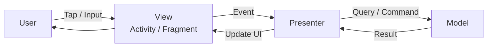
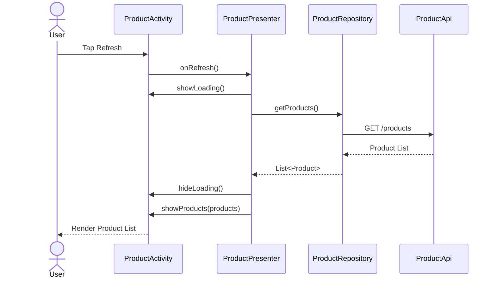
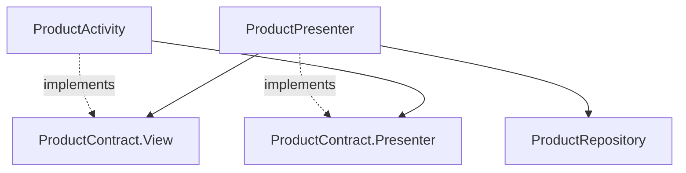
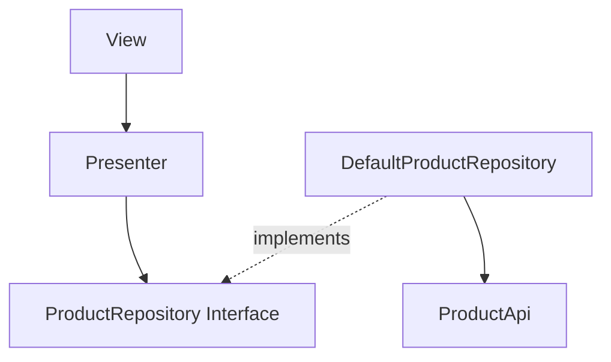
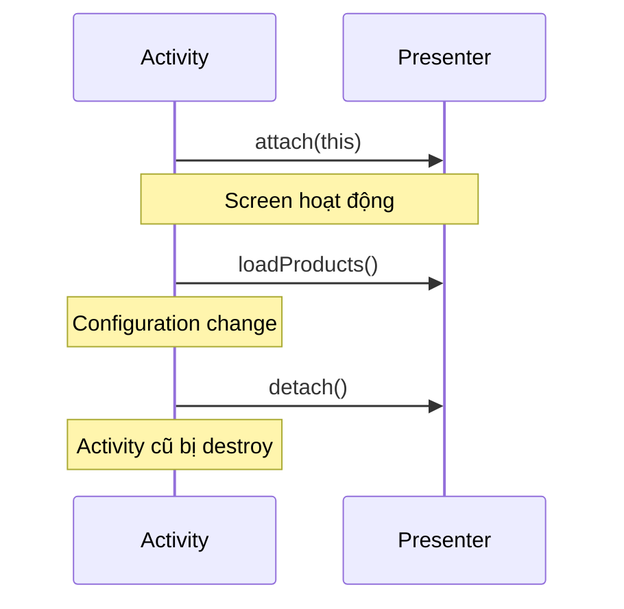
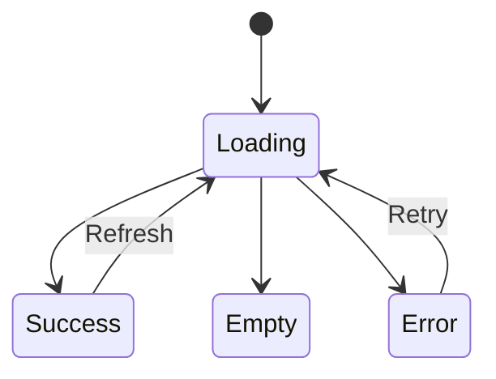
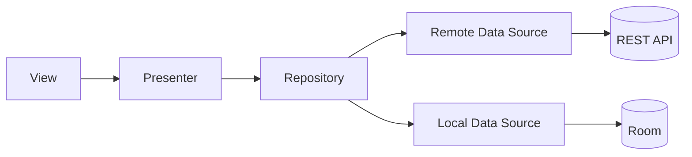
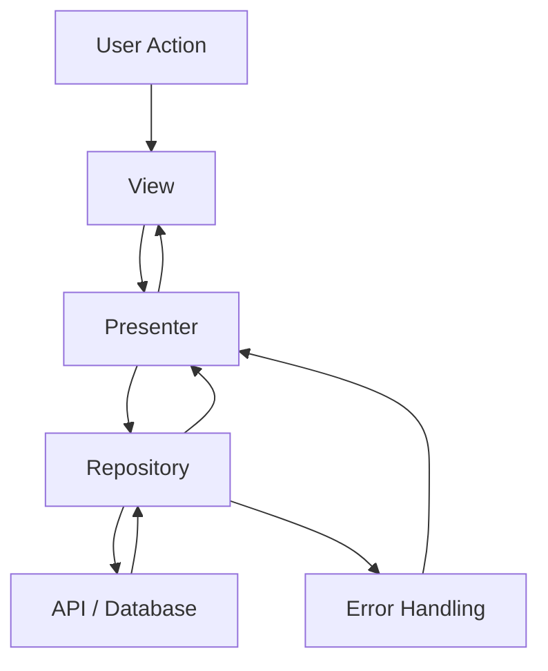
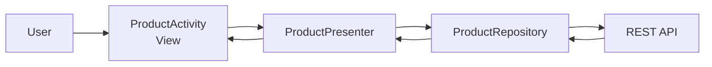

# 002 - MVP

| Metadata                | Giá trị                                          |
| ----------------------- | ------------------------------------------------ |
| **Học phần**            | 03 - Architecture, State and Data                |
| **Module**              | Module 05 - Design and Architecture              |
| **Nhóm nội dung**       | Architectural Patterns                           |
| **Nguồn roadmap**       | Design and Architecture / Architectural Patterns |
| **Loại bài**            | Architecture                                     |
| **Thứ tự trong module** | 002                                              |
| **Thời lượng gợi ý**    | 34 phút                                          |

---

## 1. Tóm tắt

**MVP - Model View Presenter** là một architectural pattern dùng để tách phần giao diện khỏi presentation logic và data/business logic.

Ba thành phần chính:

* **Model:** dữ liệu, repository, business rules và data source.
* **View:** hiển thị UI và chuyển hành động của người dùng cho Presenter.
* **Presenter:** xử lý presentation logic, gọi Model và yêu cầu View cập nhật giao diện.

Mental model cơ bản:

```text
User
 │
 ▼
View
 │ event
 ▼
Presenter
 │
 ▼
Model
 │ result
 ▼
Presenter
 │ render
 ▼
View
```

Một lý do quan trọng khiến các biến thể MVP như **Passive View** trở nên phổ biến là khả năng đưa phần lớn logic ra khỏi UI để Presenter có thể được unit test bằng View giả mà không cần UI framework. ([martinfowler.com][1])

MVP đặc biệt hữu ích để học:

* Separation of Concerns.
* Dependency inversion.
* UI contracts.
* Test doubles.
* Presentation logic.
* Lifecycle coupling.
* State management.

Tuy nhiên, với Android hiện đại, tài liệu chính thức hiện tập trung vào kiến trúc phân lớp gồm **UI layer + Data layer**, có thể thêm Domain layer; screen-level state thường được quản lý bởi `ViewModel`, kết hợp repository và Unidirectional Data Flow thay vì MVP truyền thống. ([Android Developers][2])

---

## 2. Mục tiêu học tập

Sau bài này, bạn có thể:

* Giải thích được MVP bằng ngôn ngữ của mình.
* Phân biệt Model, View và Presenter.
* Giải thích Presenter khác Controller trong MVC như thế nào.
* Tạo `View Contract` để tách Presenter khỏi `Activity` hoặc `Fragment`.
* Tách data access khỏi UI.
* Dùng Repository để Presenter không phụ thuộc trực tiếp Retrofit hoặc Room.
* Viết unit test cho Presenter bằng:

  * Fake View.
  * Fake Repository.
  * Fake API nếu cần.
* Nhận biết vấn đề MVP liên quan đến:

  * Activity recreation;
  * configuration changes;
  * memory leak;
  * asynchronous work;
  * state restoration.
* So sánh MVP với MVC, MVVM và kiến trúc Android hiện đại.
* Refactor một screen Android sang MVP.
* Tạo một artifact MVP nhỏ cho portfolio.

---

## 3. MVP là gì?

MVP viết tắt của:

```text
M = Model
V = View
P = Presenter
```

MVP thuộc nhóm **Separated Presentation**: cố gắng tách phần khó test như UI framework khỏi logic điều khiển màn hình. Trong các biến thể kiểu Passive View, View được giữ rất "mỏng", còn Presenter quyết định cách phản ứng với event và cách cập nhật View. ([martinfowler.com][1])

### Sơ đồ tổng quát



### Ảnh minh họa MVP


*Ảnh minh họa một cách tổ chức MVP trong ứng dụng có data source từ API và database.*

Điểm cần nhớ:

```text
View
  không tự quyết định business flow

Presenter
  không nên trực tiếp biết TextView, RecyclerView,
  Retrofit hoặc Room implementation

Model
  không nên biết UI đang hiển thị như thế nào
```

---

## 4. Ba thành phần của MVP

### 4.1. Model

Model đại diện cho dữ liệu và logic liên quan đến dữ liệu.

Ví dụ:

```kotlin
data class Product(
    val id: Long,
    val name: String,
    val price: Double
)
```

Trong ứng dụng Android thực tế, phía Model có thể bao gồm:

```text
Model
├── Entities
├── Repository
├── Remote Data Source
├── Local Data Source
├── API
├── DAO
└── Business Rules
```

Ví dụ repository:

```kotlin
interface ProductRepository {

    suspend fun getProducts(): List<Product>
}
```

Implementation:

```kotlin
class DefaultProductRepository(
    private val api: ProductApi
) : ProductRepository {

    override suspend fun getProducts(): List<Product> {
        return api.getProducts()
    }
}
```

Repository là một cách rất phù hợp để Presenter không phụ thuộc trực tiếp vào data source. Trong kiến trúc Android hiện tại, data layer cũng được tổ chức quanh repository và các data source bên dưới. ([Android Developers][3])

---

### 4.2. View

View chịu trách nhiệm:

* Hiển thị dữ liệu.
* Hiển thị loading.
* Hiển thị error.
* Nhận input.
* Forward event sang Presenter.
* Thực hiện các thao tác UI được Presenter yêu cầu.

Trong Android Views, View thường là:

```text
Activity
Fragment
Custom View
XML Layout
```

Ví dụ:

```kotlin
interface ProductView {

    fun showLoading()

    fun hideLoading()

    fun showProducts(
        products: List<Product>
    )

    fun showError(
        message: String
    )
}
```

View không nên làm:

```kotlin
retrofit.getProducts()
```

hoặc:

```kotlin
database.productDao().query()
```

hay chứa business rule như:

```kotlin
if (
    user.age >= 18 &&
    user.subscription == "premium" &&
    product.stock > 0
) {
    // ...
}
```

Những logic như vậy nên được đẩy ra khỏi UI.

---

### 4.3. Presenter

Presenter đứng giữa View và Model.

Presenter nhận:

```text
UI Event
```

ví dụ:

```text
onRefreshClicked()
onLoginClicked()
onProductSelected()
onRetryClicked()
```

sau đó:

1. quyết định cần làm gì;
2. gọi repository/use case;
3. xử lý kết quả;
4. yêu cầu View render.

```text
View
 │
 │ onRefresh()
 ▼
Presenter
 │
 │ getProducts()
 ▼
Repository
 │
 ▼
API
```

Sau khi có kết quả:

```text
API
 │
 ▼
Repository
 │
 ▼
Presenter
 │
 │ showProducts()
 ▼
View
```

Các cách triển khai MVP khác nhau có thể để View tự xử lý một số synchronization đơn giản hoặc đẩy gần như toàn bộ presentation behavior vào Presenter; Fowler phân biệt các hướng như **Supervising Controller** và **Passive View**. ([martinfowler.com][4])

---

## 5. MVP khác MVC ở đâu?

MVC:

```text
View
 ↓
Controller
 ↓
Model
```

MVP:

```text
View
 ⇅
Presenter
 ↓
Model
```

Điểm khác đáng chú ý là trong MVP kiểu Passive View, Presenter thường giao tiếp với View thông qua một **View interface**.

Ví dụ:

```kotlin
interface LoginView {

    fun showLoading()

    fun showLoginSuccess()

    fun showInvalidCredentials()

    fun showNetworkError()
}
```

Presenter chỉ biết:

```text
LoginView
```

thay vì:

```text
LoginActivity
```

Điều này tạo ra một test seam rất rõ:

```text
Production

LoginPresenter
      │
      ▼
LoginActivity
```

```text
Unit Test

LoginPresenter
      │
      ▼
FakeLoginView
```

Khả năng thay UI thật bằng Test Double là một trong những động lực quan trọng của Passive View và Supervising Controller. ([martinfowler.com][1])

---

## 6. Luồng MVP trong Android

Giả sử có màn hình:

```text
Product List
```

User nhấn:

```text
Refresh
```

### Sequence diagram



Điểm quan trọng:

```text
Activity không gọi API.

API không cập nhật RecyclerView.

Repository không biết Activity.

Presenter không cần biết Retrofit implementation.
```

---

## 7. Thiết kế MVP bằng Contract

Một cách tổ chức phổ biến là gom View và Presenter interface vào một contract.

```kotlin
interface ProductContract {

    interface View {

        fun showLoading()

        fun hideLoading()

        fun showProducts(
            products: List<Product>
        )

        fun showError(
            message: String
        )
    }

    interface Presenter {

        fun attach(
            view: View
        )

        fun detach()

        fun loadProducts()

        fun retry()
    }
}
```

Dependency:



Presenter không cần dependency trực tiếp:

```text
ProductActivity
```

mà chỉ cần:

```text
ProductContract.View
```

---

## 8. Ví dụ MVP Android hoàn chỉnh

### 8.1. Model

```kotlin
data class Product(
    val id: Long,
    val name: String,
    val price: Double
)
```

---

### 8.2. Repository

```kotlin
interface ProductRepository {

    suspend fun getProducts(): List<Product>
}
```

Implementation:

```kotlin
class DefaultProductRepository(
    private val api: ProductApi
) : ProductRepository {

    override suspend fun getProducts(): List<Product> {
        return api.getProducts()
    }
}
```

---

### 8.3. Contract

```kotlin
interface ProductContract {

    interface View {

        fun showLoading()

        fun hideLoading()

        fun showProducts(
            products: List<Product>
        )

        fun showError(
            message: String
        )
    }

    interface Presenter {

        fun attach(
            view: View
        )

        fun detach()

        fun loadProducts()
    }
}
```

---

### 8.4. Presenter

```kotlin
class ProductPresenter(
    private val repository: ProductRepository,
    private val scope: CoroutineScope
) : ProductContract.Presenter {

    private var view:
        ProductContract.View? = null

    override fun attach(
        view: ProductContract.View
    ) {
        this.view = view
    }

    override fun detach() {
        view = null
    }

    override fun loadProducts() {

        view?.showLoading()

        scope.launch {

            try {

                val products =
                    repository.getProducts()

                view?.hideLoading()

                view?.showProducts(
                    products
                )

            } catch (exception: Exception) {

                view?.hideLoading()

                view?.showError(
                    exception.message
                        ?: "Đã xảy ra lỗi"
                )
            }
        }
    }
}
```

Presenter không import:

```text
Activity
Fragment
TextView
RecyclerView
Retrofit
Room
```

Đây là đặc điểm giúp presentation logic dễ test hơn.

---

### 8.5. Activity đóng vai trò View

```kotlin
class ProductActivity :
    AppCompatActivity(),
    ProductContract.View {

    private lateinit var presenter:
        ProductContract.Presenter

    override fun onCreate(
        savedInstanceState: Bundle?
    ) {
        super.onCreate(savedInstanceState)

        setContentView(
            R.layout.activity_product
        )

        val repository =
            DefaultProductRepository(
                api = createProductApi()
            )

        presenter =
            ProductPresenter(
                repository = repository,
                scope = lifecycleScope
            )

        presenter.attach(this)

        findViewById<Button>(
            R.id.refreshButton
        ).setOnClickListener {

            presenter.loadProducts()
        }

        presenter.loadProducts()
    }

    override fun onDestroy() {

        presenter.detach()

        super.onDestroy()
    }

    override fun showLoading() {

        findViewById<ProgressBar>(
            R.id.progressBar
        ).isVisible = true
    }

    override fun hideLoading() {

        findViewById<ProgressBar>(
            R.id.progressBar
        ).isVisible = false
    }

    override fun showProducts(
        products: List<Product>
    ) {

        // Submit data to adapter.
    }

    override fun showError(
        message: String
    ) {

        Toast.makeText(
            this,
            message,
            Toast.LENGTH_SHORT
        ).show()
    }
}
```

---

## 9. Dependency Direction

Một implementation tốt nên hướng tới:

```text
View
 │
 ▼
Presenter
 │
 ▼
Repository Interface
 ▲
 │ implements
 │
Repository Implementation
 │
 ▼
Data Source
```

Mermaid:



Presenter chỉ phụ thuộc vào abstraction:

```kotlin
ProductRepository
```

nên có thể dùng:

```text
DefaultProductRepository
FakeProductRepository
CachedProductRepository
OfflineProductRepository
```

mà không cần thay Presenter.

---

## 10. MVP và Testability

Đây là một trong những điểm mạnh nhất của MVP.

Fowler mô tả testability là lý do chính để cân nhắc Passive View: khi phần behavior được chuyển ra khỏi View, Presenter có thể chạy test bên ngoài UI environment bằng View Test Double. ([martinfowler.com][1])

### 10.1. Fake Repository

```kotlin
class FakeProductRepository :
    ProductRepository {

    override suspend fun getProducts():
        List<Product> {

        return listOf(
            Product(
                id = 1,
                name = "Laptop",
                price = 1200.0
            )
        )
    }
}
```

---

### 10.2. Fake View

```kotlin
class FakeProductView :
    ProductContract.View {

    var loading = false

    var products:
        List<Product> = emptyList()

    var error:
        String? = null

    override fun showLoading() {
        loading = true
    }

    override fun hideLoading() {
        loading = false
    }

    override fun showProducts(
        products: List<Product>
    ) {
        this.products = products
    }

    override fun showError(
        message: String
    ) {
        error = message
    }
}
```

---

### 10.3. Unit test Presenter

```kotlin
@Test
fun loadProducts_success_rendersProducts() =
    runTest {

        val repository =
            FakeProductRepository()

        val view =
            FakeProductView()

        val presenter =
            ProductPresenter(
                repository = repository,
                scope = this
            )

        presenter.attach(view)

        presenter.loadProducts()

        advanceUntilIdle()

        assertEquals(
            1,
            view.products.size
        )

        assertEquals(
            "Laptop",
            view.products.first().name
        )

        assertFalse(
            view.loading
        )
    }
```

Test này không cần:

```text
Emulator
Activity
Fragment
RecyclerView
Retrofit server
Room database
```

---

## 11. Testing Error State

Tạo repository lỗi:

```kotlin
class ErrorProductRepository :
    ProductRepository {

    override suspend fun getProducts():
        List<Product> {

        throw IOException(
            "Network unavailable"
        )
    }
}
```

Test:

```kotlin
@Test
fun loadProducts_error_showsError() =
    runTest {

        val view =
            FakeProductView()

        val presenter =
            ProductPresenter(
                repository =
                    ErrorProductRepository(),
                scope = this
            )

        presenter.attach(view)

        presenter.loadProducts()

        advanceUntilIdle()

        assertNotNull(
            view.error
        )

        assertFalse(
            view.loading
        )
    }
```

Một Presenter tốt nên có thể test các flow:

```text
Loading → Success

Loading → Error

Error → Retry → Success

Empty result → Empty UI
```

---

## 12. MVP và Android Lifecycle

Đây là một trong những vấn đề quan trọng nhất khi dùng MVP trên Android.

Giả sử:

```text
Activity A
   │
   │ rotate
   ▼
destroy
   │
   ▼
Activity B
```

Nếu Presenter giữ:

```kotlin
private val view: ProductActivity
```

Presenter có thể giữ reference tới Activity cũ lâu hơn cần thiết.

Cách tốt hơn:

```kotlin
private var view:
    ProductContract.View? = null
```

và:

```text
onCreate / onStart
       │
       ▼
presenter.attach(view)

onStop / onDestroy
       │
       ▼
presenter.detach()
```

### Sơ đồ



Việc attach/detach giảm coupling lifecycle với View, nhưng **MVP tự thân không cung cấp cơ chế giữ screen state qua Activity recreation**.

Android hiện dùng các business-logic state holder như `ViewModel` để giữ state và state-processing pipeline qua Activity recreation, giúp screen tái tạo mà không phải tự xây toàn bộ cơ chế retention của Presenter. ([Android Developers][5])

---

## 13. Configuration Change

Giả sử screen đang:

```text
Loading products...
```

User xoay màn hình:

```text
Portrait
   │
   ▼
Landscape
```

Nếu Presenter được tạo trong Activity:

```text
Old Activity
    │
    └── Old Presenter
             │
             X

New Activity
    │
    └── New Presenter
```

Một số vấn đề có thể xuất hiện:

* Request bị gọi lại.
* Loading state bị mất.
* Error state bị mất.
* Data vừa tải xong không còn.
* Presenter cũ gọi lại View đã bị destroy nếu detach không đúng.
* Hai request chạy song song.

MVP không tự quyết định cách giải quyết vấn đề này.

Developer phải lựa chọn:

```text
SavedInstanceState

Retained component

Custom state holder

Presenter store

ViewModel

Repository cache
```

Đây là một trong những lý do `ViewModel` phù hợp với Android lifecycle hơn Presenter truyền thống. ([Android Developers][6])

---

## 14. State trong MVP

MVP truyền thống thường có View contract kiểu:

```text
showLoading()

hideLoading()

showContent()

showError()
```

Nhưng nếu screen phức tạp, có thể gặp:

```text
showLoading()
hideLoading()
showProducts()
hideProducts()
showEmpty()
hideEmpty()
showError()
hideError()
enableButton()
disableButton()
...
```

Presenter bắt đầu phải điều khiển UI theo kiểu imperative.

Một cải tiến là sử dụng một `UiState`:

```kotlin
sealed interface ProductUiState {

    data object Loading :
        ProductUiState

    data class Success(
        val products: List<Product>
    ) : ProductUiState

    data object Empty :
        ProductUiState

    data class Error(
        val message: String
    ) : ProductUiState
}
```

View:

```kotlin
interface ProductView {

    fun render(
        state: ProductUiState
    )
}
```

Luồng:



Cách này đã bắt đầu tiến gần hơn tới tư duy **state-driven UI** của Android hiện đại.

---

## 15. MVP với Network và Database

Không nên thiết kế:

```text
Activity
 │
 ▼
Presenter
 │
 ├── Retrofit
 ├── Room
 └── SharedPreferences
```

Presenter lúc này biết quá nhiều implementation detail.

Nên:

```text
View
 │
 ▼
Presenter
 │
 ▼
Repository
 │
 ├── Remote Data Source
 │       │
 │       ▼
 │      API
 │
 └── Local Data Source
         │
         ▼
       Room
```



Kiểu phân tách repository/data source này cũng phù hợp với kiến trúc data layer hiện được Android Developers khuyến nghị. ([Android Developers][3])

---

## 16. Error Handling

Không nên để Presenter phụ thuộc vào Retrofit-specific exception:

```kotlin
catch (
    exception: HttpException
)
```

ở mọi nơi.

Có thể map lỗi ở data layer:

```kotlin
sealed interface ProductResult {

    data class Success(
        val products: List<Product>
    ) : ProductResult

    data object Offline :
        ProductResult

    data object Unauthorized :
        ProductResult

    data object ServerError :
        ProductResult
}
```

Presenter xử lý:

```kotlin
when (
    val result =
        repository.getProducts()
) {

    is ProductResult.Success -> {
        view?.showProducts(
            result.products
        )
    }

    ProductResult.Offline -> {
        view?.showError(
            "Không có kết nối mạng"
        )
    }

    ProductResult.Unauthorized -> {
        view?.showError(
            "Phiên đăng nhập đã hết hạn"
        )
    }

    ProductResult.ServerError -> {
        view?.showError(
            "Máy chủ đang gặp sự cố"
        )
    }
}
```

View không cần biết:

```text
HTTP 500
SocketTimeoutException
Retrofit
JSON parsing
```

---

## 17. Massive Presenter

MVP giải quyết `God Activity`, nhưng nếu thiết kế không tốt, vấn đề có thể chỉ chuyển sang:

```text
God Presenter
```

Ví dụ:

```text
ProductPresenter
├── loadProducts()
├── refreshProducts()
├── searchProducts()
├── filterProducts()
├── sortProducts()
├── saveFavorite()
├── removeFavorite()
├── loadCart()
├── updateCart()
├── restoreState()
├── navigateToDetail()
├── checkSubscription()
├── validateCoupon()
└── handleDeepLink()
```

Presenter lúc này trở thành:

```text
1000+ lines
```

Giải pháp không phải tạo thêm pattern tùy tiện.

Hãy xem xét tách:

```text
Presenter
 │
 ├── Repository
 │
 └── Use Cases
       ├── SearchProducts
       ├── AddFavorite
       └── ApplyCoupon
```

Domain layer trong kiến trúc Android hiện đại cũng là layer **tùy chọn**, phù hợp khi business logic phức tạp hoặc cần tái sử dụng giữa nhiều state holder. ([Android Developers][7])

---

## 18. MVP với Jetpack Compose

MVP truyền thống thường được minh họa tốt nhất với:

```text
Activity
Fragment
XML Views
```

vì Presenter có thể gọi:

```text
showLoading()
showProducts()
showError()
```

trên View interface.

Với Compose, UI phù hợp tự nhiên hơn với:

```text
State down
Events up
```

Ví dụ:

```kotlin
@Composable
fun ProductScreen(
    state: ProductUiState,
    onRefresh: () -> Unit
) {
    // Render state.
}
```

Thay vì Presenter điều khiển trực tiếp UI:

```text
Presenter
    │
    ├── showLoading()
    ├── hideLoading()
    ├── enableButton()
    └── showProducts()
```

Android Developers hiện hướng dẫn Compose theo Unidirectional Data Flow, trong đó state đi xuống UI và event đi lên state holder. ([Android Developers][8])

---

## 19. MVP so với Android Architecture hiện đại

Kiến trúc Android hiện tại thường được hình dung:

```text
UI
 │ events
 ▼
ViewModel
 │
 ▼
Repository
 │
 ▼
Data Sources

Data Sources
 │
 ▼
Repository
 │
 ▼
ViewModel
 │ UiState
 ▼
UI
```

Android hiện khuyến nghị UDF cho UI architecture; ViewModel expose UI state và nhận event từ UI, trong khi data layer sử dụng repositories và data sources. ([Android Developers][9])

### Ảnh minh họa UDF Android hiện đại


*Nguồn hình: Android Developers.*

Sơ đồ trên cho thấy luồng:

```text
UI Event
   │
   ▼
ViewModel
   │
   ▼
Data Layer
   │
   ▼
New Data
   │
   ▼
ViewModel
   │
   ▼
New UiState
   │
   ▼
UI
```

Đây là hướng kiến trúc được tài liệu Android hiện tại nhấn mạnh. ([Android Developers][10])

---

## 20. MVP vs MVC vs MVVM

| Đặc điểm                             | MVC                 | MVP                           | MVVM / Modern Android    |
| ------------------------------------ | ------------------- | ----------------------------- | ------------------------ |
| Thành phần trung gian                | Controller          | Presenter                     | ViewModel                |
| UI gửi event tới                     | Controller          | Presenter                     | ViewModel / State holder |
| Logic UI                             | Controller/View     | Presenter                     | ViewModel + UI state     |
| Presenter/ViewModel biết View cụ thể | Có thể              | Thường qua interface          | Không nên                |
| View interface                       | Không bắt buộc      | Rất phổ biến                  | Thường không cần         |
| Test presentation logic              | Có thể              | Rất thuận tiện                | Rất thuận tiện           |
| Lifecycle Android                    | Không tự giải quyết | Không tự giải quyết           | ViewModel hỗ trợ tốt hơn |
| State-driven UI                      | Không bắt buộc      | Có thể áp dụng                | Là hướng chính           |
| Compose                              | Không tự nhiên      | Không phải lựa chọn điển hình | Phù hợp hơn              |

### MVC

```text
View
 ↓
Controller
 ↓
Model
```

### MVP

```text
View
 ⇅
Presenter
 ↓
Model
```

### Modern Android

```text
UI Event
   ↓
ViewModel
   ↓
Repository
   ↓
Data

Data
   ↓
ViewModel
   ↓
UiState
   ↓
UI
```

ViewModel hiện được Android định nghĩa như một screen-level state holder có nhiệm vụ expose state cho UI và encapsulate business logic liên quan. ([Android Developers][6])

---

## 21. Khi nào MVP phù hợp?

MVP vẫn hữu ích khi:

* Học architectural patterns.
* Học separation of concerns.
* Học dependency inversion.
* Muốn thực hành Test Double.
* Dự án legacy đã dùng MVP.
* App dùng XML Views.
* Screen tương đối độc lập.
* Team đã có convention MVP rõ ràng.

Ví dụ:

```text
Login Screen

Product List

Profile Screen

Simple Form

Legacy Banking Screen
```

---

## 22. Khi nào nên cân nhắc kiến trúc khác?

Hãy cân nhắc ViewModel/UDF hoặc kiến trúc phân lớp hiện đại khi app có:

```text
Compose
+
complex UI state
+
configuration changes
+
offline cache
+
multiple data streams
+
Flow / StateFlow
+
navigation
+
pagination
+
process restoration
```

Đặc biệt với app mới, tài liệu Android hiện ưu tiên architecture có:

```text
UI Layer

Data Layer

Optional Domain Layer

ViewModel

Repository

UDF
```

thay vì yêu cầu MVP. ([Android Developers][2])

---

## 23. Debugging theo MVP

Giả sử bug:

```text
"Nhấn Refresh nhưng danh sách
không được cập nhật."
```

Có thể debug theo flow:

```text
View
 │
 │ onRefresh được gọi?
 ▼
Presenter
 │
 │ repository được gọi?
 ▼
Repository
 │
 │ API trả dữ liệu?
 ▼
API
```

Sau đó kiểm tra đường ngược lại:

```text
API Response
 │
 ▼
Repository Result
 │
 ▼
Presenter
 │
 │ showProducts()?
 ▼
View
```

Nếu dependency rõ ràng, bạn có thể nhanh chóng xác định lỗi nằm ở:

```text
UI event

Presentation logic

Data layer

Mapping

Network

Rendering
```

thay vì tìm trong một `Activity` vài nghìn dòng.

---

## 24. Production Considerations

Trước khi đưa một MVP screen lên production, hãy kiểm tra toàn bộ flow:



### Lifecycle

Hỏi:

* Presenter attach View ở đâu?
* Presenter detach khi nào?
* Có giữ Activity reference sau `onDestroy()` không?
* Configuration change có tạo request mới không?
* State hiện tại được restore bằng cách nào?
* Process death có ảnh hưởng dữ liệu quan trọng không?

### State

Kiểm tra:

```text
Loading
Success
Empty
Error
Offline
```

### Network

Kiểm tra:

* Timeout.
* Không có Internet.
* API 401.
* API 404.
* API 500.
* Invalid response.
* Retry.
* Double request.

### Concurrency

Hỏi:

```text
User nhấn Refresh 5 lần thì sao?
```

```text
Request cũ về sau request mới thì sao?
```

```text
Activity đã đóng nhưng request
vẫn trả kết quả thì sao?
```

### Testing

Tối thiểu nên có:

```text
Presenter success test

Presenter error test

Presenter retry test

Repository test
```

---

## 25. Thực hành

### Bài thực hành: Login Screen bằng MVP

UI:

```text
┌─────────────────────────────┐
│ Login                       │
├─────────────────────────────┤
│                             │
│ Email                       │
│ [________________________]  │
│                             │
│ Password                    │
│ [________________________]  │
│                             │
│         [ Login ]           │
│                             │
└─────────────────────────────┘
```

Tạo:

```text
login/
├── LoginContract.kt
├── LoginActivity.kt
├── LoginPresenter.kt
└── LoginRepository.kt
```

---

### Task 1 - View Contract

```kotlin
interface LoginView {

    fun showLoading()

    fun hideLoading()

    fun showEmailError()

    fun showPasswordError()

    fun showLoginSuccess()

    fun showLoginError()
}
```

---

### Task 2 - Presenter API

```kotlin
interface LoginPresenter {

    fun attach(
        view: LoginView
    )

    fun detach()

    fun login(
        email: String,
        password: String
    )
}
```

---

### Task 3 - Repository

```kotlin
interface LoginRepository {

    suspend fun login(
        email: String,
        password: String
    ): Boolean
}
```

---

### Task 4 - Validation

Presenter kiểm tra:

```text
email empty?
password empty?
```

sau đó:

```text
Repository.login()
```

---

### Task 5 - Unit Tests

Viết test:

```text
empty email
    ↓
showEmailError()
```

```text
empty password
    ↓
showPasswordError()
```

```text
valid credentials
    ↓
showLoginSuccess()
```

```text
invalid credentials
    ↓
showLoginError()
```

---

## 26. Bài tập Refactor

Code ban đầu:

```kotlin
class LoginActivity :
    AppCompatActivity() {

    fun login() {

        val email =
            emailEditText.text.toString()

        val password =
            passwordEditText.text.toString()

        if (email.isEmpty()) {
            emailEditText.error =
                "Email required"
            return
        }

        lifecycleScope.launch {

            val response =
                loginApi.login(
                    email,
                    password
                )

            database
                .userDao()
                .insert(
                    response.user
                )

            startActivity(
                Intent(
                    this@LoginActivity,
                    HomeActivity::class.java
                )
            )
        }
    }
}
```

Hãy refactor thành:

```text
LoginActivity
      │
      ▼
LoginPresenter
      │
      ▼
LoginRepository
      │
      ├── LoginApi
      │
      └── UserDao
```

Mục tiêu:

```text
Activity
    = View

Presenter
    = presentation logic

Repository
    = data access
```

---

## 27. Cấu trúc project gợi ý

```text
app/
└── src/main/java/
    └── com/example/app/
        │
        ├── data/
        │   ├── model/
        │   │   └── Product.kt
        │   │
        │   ├── remote/
        │   │   └── ProductApi.kt
        │   │
        │   └── repository/
        │       ├── ProductRepository.kt
        │       └── DefaultProductRepository.kt
        │
        └── feature/
            └── products/
                ├── ProductContract.kt
                ├── ProductActivity.kt
                └── ProductPresenter.kt
```

Test:

```text
src/test/
└── products/
    ├── ProductPresenterTest.kt
    ├── FakeProductView.kt
    └── FakeProductRepository.kt
```

---

## 28. Portfolio Artifact

Một project portfolio nhỏ có thể có:

```text
android-mvp-demo/
│
├── app/
│
├── docs/
│   ├── architecture.md
│   └── diagrams.md
│
├── screenshots/
│   ├── product-list.png
│   ├── loading-state.png
│   ├── empty-state.png
│   └── error-state.png
│
└── README.md
```

Trong `README.md`, thêm architecture diagram:



Giải thích:

```text
Why MVP?

Why does Presenter use a View interface?

Why does Presenter depend on Repository interface?

How is the Presenter unit tested?

What happens when Activity rotates?

How is View detached?

What are the limitations of MVP?

How would this screen migrate to
ViewModel + UiState + UDF?
```

Phần cuối giúp chứng minh bạn hiểu **lý do** dùng pattern chứ không chỉ biết tạo package `model/view/presenter`.

---

## 29. Những lỗi thường gặp

### 29.1. Presenter phụ thuộc Activity cụ thể

Không nên:

```kotlin
class ProductPresenter(
    private val activity:
        ProductActivity
)
```

Nên:

```kotlin
class ProductPresenter(
    ...
) {

    private var view:
        ProductContract.View? = null
}
```

---

### 29.2. Quên detach View

Sai:

```text
Activity destroyed

Presenter
   │
   └── Activity reference
```

Nguy cơ:

```text
Lifecycle bug
Unexpected callback
Memory retention
```

---

### 29.3. Presenter gọi Retrofit trực tiếp

Không nên:

```text
Presenter
   │
   ▼
Retrofit
```

Nên:

```text
Presenter
   │
   ▼
Repository
   │
   ▼
Data Source
```

---

### 29.4. View chứa business logic

Không nên:

```kotlin
if (
    cart.total > 100 &&
    user.isPremium &&
    coupon.isActive
) {
    // ...
}
```

trực tiếp trong Activity chỉ vì Activity là View.

---

### 29.5. Presenter trở thành God Object

Tách Activity thành Presenter không có nghĩa architecture tự động tốt.

Nếu:

```text
Activity: 200 lines

Presenter: 2500 lines
```

thì complexity chỉ được chuyển vị trí.

---

### 29.6. Không xử lý rotation

App chạy tốt khi test nhanh chưa có nghĩa architecture đúng.

Luôn thử:

```text
Load screen
   ↓
Start request
   ↓
Rotate
   ↓
Background
   ↓
Return
```

---

### 29.7. Ép MVP vào Compose

Không cần chọn MVP chỉ để:

```text
"project có architecture"
```

Với Compose, state-driven UI và UDF thường tự nhiên hơn; tài liệu Compose hiện mô tả trực tiếp mô hình state đi xuống và events đi lên. ([Android Developers][8])

---

## 30. Mental Model cần nhớ

### Model

```text
"Dữ liệu và business rule nằm ở đâu?"
```

### View

```text
"User nhìn thấy gì?"
```

### Presenter

```text
"Sau khi user thực hiện event,
screen cần làm gì?"
```

Toàn bộ MVP:

```text
User
 │
 ▼
View
 │
 │ event
 ▼
Presenter
 │
 │ request
 ▼
Model
 │
 │ result
 ▼
Presenter
 │
 │ presentation decision
 ▼
View
 │
 ▼
User
```

Điểm quan trọng nhất:

> **Presenter chứa presentation behavior; View càng mỏng thì phần behavior càng dễ kiểm thử mà không phụ thuộc Android UI framework.** ([martinfowler.com][1])

---

## 31. Checklist hoàn thành

### Kiến thức

* [ ] Giải thích được MVP.
* [ ] Phân biệt Model, View và Presenter.
* [ ] Phân biệt MVP và MVC.
* [ ] Hiểu View Contract.
* [ ] Hiểu dependency direction.
* [ ] Hiểu Passive View.
* [ ] Nhận biết Massive Presenter.

### Code

* [ ] Có Model.
* [ ] Có Repository interface.
* [ ] Có View interface.
* [ ] Có Presenter.
* [ ] Activity/Fragment implement View.
* [ ] View không gọi API trực tiếp.
* [ ] Presenter không phụ thuộc Retrofit implementation.
* [ ] Presenter không phụ thuộc Activity cụ thể.

### State

* [ ] Có Loading state.
* [ ] Có Success state.
* [ ] Có Empty state nếu cần.
* [ ] Có Error state.
* [ ] Có Retry flow.

### Lifecycle

* [ ] View được attach đúng lúc.
* [ ] View được detach.
* [ ] Không callback vào Activity đã destroy.
* [ ] Đã kiểm tra rotation.
* [ ] Biết state nào cần restore.
* [ ] Biết giới hạn của MVP với process death.

### Testing

* [ ] Có Fake View.
* [ ] Có Fake Repository.
* [ ] Test success.
* [ ] Test error.
* [ ] Test validation.
* [ ] Test retry nếu có.

### Production

* [ ] Network error có UX phù hợp.
* [ ] Không gọi request lặp ngoài ý muốn.
* [ ] Async work được quản lý đúng lifecycle.
* [ ] Không có God Activity.
* [ ] Không có God Presenter.
* [ ] Dependency rõ ràng.

### Portfolio

* [ ] Có architecture diagram.
* [ ] Có README.
* [ ] Có screenshot.
* [ ] Có unit test.
* [ ] Giải thích được lý do chọn MVP.
* [ ] Ghi rõ hạn chế của MVP.
* [ ] Có ghi chú cách migrate sang ViewModel/UDF.

---

## 32. Câu hỏi tự kiểm tra

1. MVP viết tắt của ba thành phần nào?
2. Presenter chịu trách nhiệm gì?
3. View trong MVP nên chứa bao nhiêu logic?
4. Tại sao Presenter nên sử dụng View interface?
5. Fake View giúp unit test như thế nào?
6. Tại sao Presenter không nên gọi Retrofit trực tiếp?
7. Repository nằm ở đâu trong flow MVP?
8. Điều gì xảy ra nếu Presenter giữ Activity sau `onDestroy()`?
9. MVP tự xử lý configuration change hay không?
10. Vì sao `ViewModel` phù hợp với Android lifecycle hơn Presenter truyền thống?
11. Massive Presenter là gì?
12. Passive View có lợi gì cho testing?
13. MVP khác MVC như thế nào?
14. MVP khác MVVM như thế nào?
15. Tại sao UDF phù hợp với Compose?

---

## 33. Bài tập nâng cao

Chuyển một screen MVP:

```text
View
 ⇅
Presenter
 ↓
Repository
```

thành:

```text
Composable
   │ events
   ▼
ViewModel
   │
   ▼
Repository
   │
   ▼
Data Sources

ViewModel
   │ UiState
   ▼
Composable
```

Sau đó so sánh:

| Tiêu chí                | MVP                 | ViewModel + UDF                      |
| ----------------------- | ------------------- | ------------------------------------ |
| View interface          | Có                  | Không cần                            |
| `attach()` / `detach()` | Thường có           | Không cần theo cách MVP              |
| UI update               | Presenter gọi View  | UI render từ state                   |
| Rotation                | Phải thiết kế riêng | ViewModel hỗ trợ                     |
| Compose                 | Ít tự nhiên hơn     | Phù hợp                              |
| Test presentation logic | Tốt                 | Tốt                                  |
| Explicit UI contract    | Rất rõ              | State + events đóng vai trò contract |

Mục tiêu không phải kết luận:

```text
MVP xấu
MVVM tốt
```

mà phải hiểu:

```text
Architecture
    ↓
giải quyết vấn đề gì?
    ↓
đổi lại complexity nào?
```

---

## 34. Kết luận

MVP là một pattern rất hữu ích để học cách đưa logic ra khỏi Android UI:

```text
Activity / Fragment
        │
        ▼
      View

       ⇅

    Presenter

       ↓

      Model
```

Giá trị cốt lõi của MVP là:

```text
Separation of Concerns
        +
Explicit View Contract
        +
Testable Presenter
        +
Replaceable Dependencies
```

MVP giúp tránh:

```text
Massive Activity
```

nhưng nếu thiết kế không cẩn thận có thể tạo:

```text
Massive Presenter
```

và Presenter truyền thống vẫn cần giải quyết riêng các vấn đề Android-specific như:

```text
Lifecycle
Configuration Changes
State Restoration
Async Work
View References
```

Vì vậy trong lộ trình Android 2026, nên học MVP để hiểu **presentation architecture, interface boundaries và testability**, sau đó liên hệ nó với kiến trúc Android hiện đại:

```text
UI
 │
 ▼
ViewModel
 │
 ▼
Domain - optional
 │
 ▼
Repository
 │
 ▼
Data Sources
```

Tài liệu Android hiện khuyến nghị layered architecture, repositories, state holders như ViewModel và UDF; domain layer chỉ nên thêm khi complexity hoặc nhu cầu reuse thực sự cần thiết. ([Android Developers][2])

---

## 35. Tài liệu tham khảo

* [Android Developers - Guide to app architecture](https://developer.android.com/topic/architecture)
* [Android Developers - Architecture recommendations](https://developer.android.com/topic/architecture/recommendations)
* [Android Developers - UI layer](https://developer.android.com/topic/architecture/ui-layer)
* [Android Developers - Data layer](https://developer.android.com/topic/architecture/data-layer)
* [Android Developers - ViewModel](https://developer.android.com/topic/libraries/architecture/viewmodel)
* [Android Developers - Compose UI Architecture](https://developer.android.com/develop/ui/compose/architecture)
* [Martin Fowler - GUI Architectures](https://martinfowler.com/eaaDev/uiArchs.html)
* [Martin Fowler - Passive View](https://martinfowler.com/eaaDev/PassiveScreen.html)
* [Martin Fowler - Supervising Controller](https://martinfowler.com/eaaDev/SupervisingPresenter.html)

Các khuyến nghị Android về UDF, repository, ViewModel và layered architecture ở trên được đối chiếu với tài liệu Android Developers cập nhật trong năm 2026. ([Android Developers][9])

[1]: https://martinfowler.com/eaaDev/PassiveScreen.html?utm_source=chatgpt.com "Passive View"
[2]: https://developer.android.com/topic/architecture?utm_source=chatgpt.com "Guide to app architecture"
[3]: https://developer.android.com/topic/architecture/data-layer?utm_source=chatgpt.com "Data layer | App architecture"
[4]: https://martinfowler.com/eaaDev/SupervisingPresenter.html?utm_source=chatgpt.com "Supervising Controller"
[5]: https://developer.android.com/topic/architecture/ui-layer/stateholders?utm_source=chatgpt.com "State holders and UI state | App architecture"
[6]: https://developer.android.com/topic/libraries/architecture/viewmodel?utm_source=chatgpt.com "ViewModel overview | App architecture"
[7]: https://developer.android.com/topic/architecture/domain-layer?utm_source=chatgpt.com "Domain layer | App architecture"
[8]: https://developer.android.com/develop/ui/compose/architecture?utm_source=chatgpt.com "Compose UI Architecture | Jetpack Compose"
[9]: https://developer.android.com/topic/architecture/recommendations?utm_source=chatgpt.com "Recommendations for Android architecture"
[10]: https://developer.android.com/topic/architecture/ui-layer?utm_source=chatgpt.com "UI layer | App architecture"

---

# Bài luyện tập

## Mục tiêu


## Đề bài


## Yêu cầu hoàn thành

- [ ] 
- [ ] 
- [ ] 

## Kết quả / lời giải


## Ghi chú
