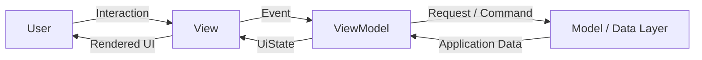
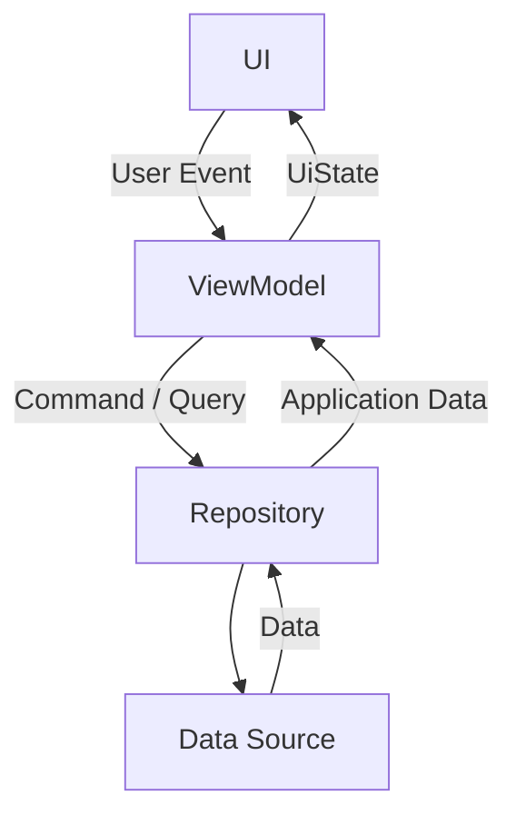
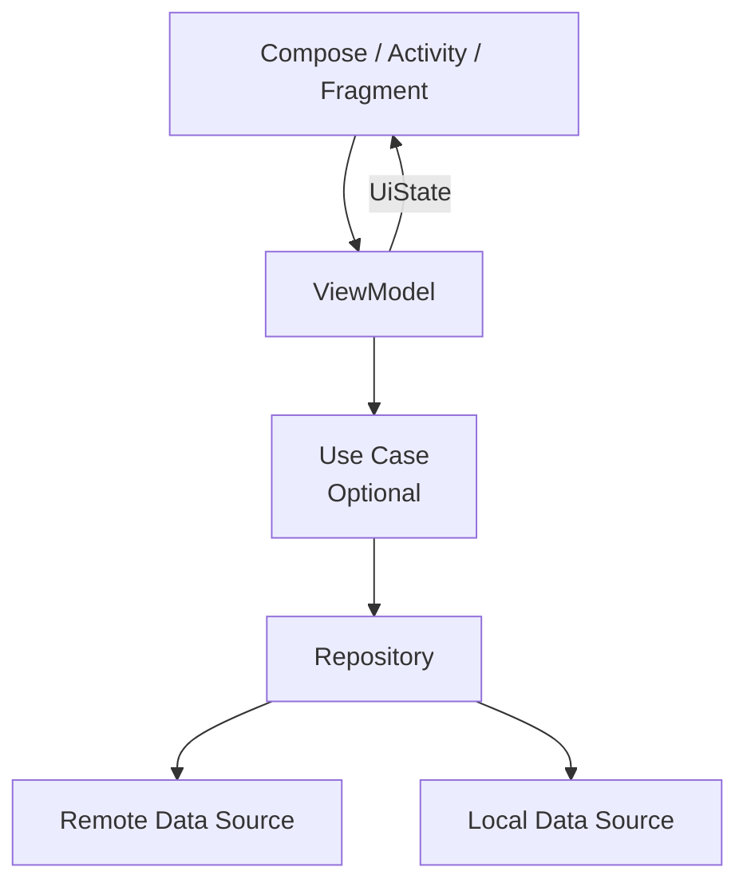
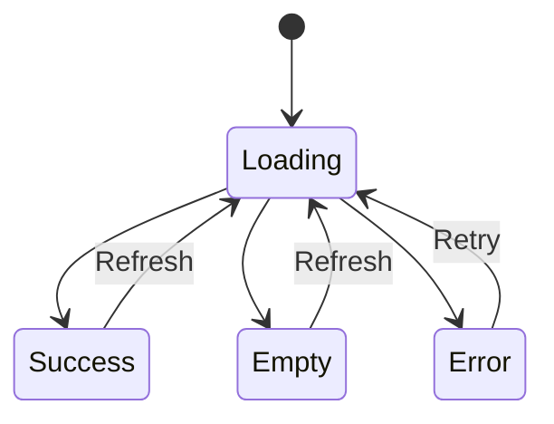
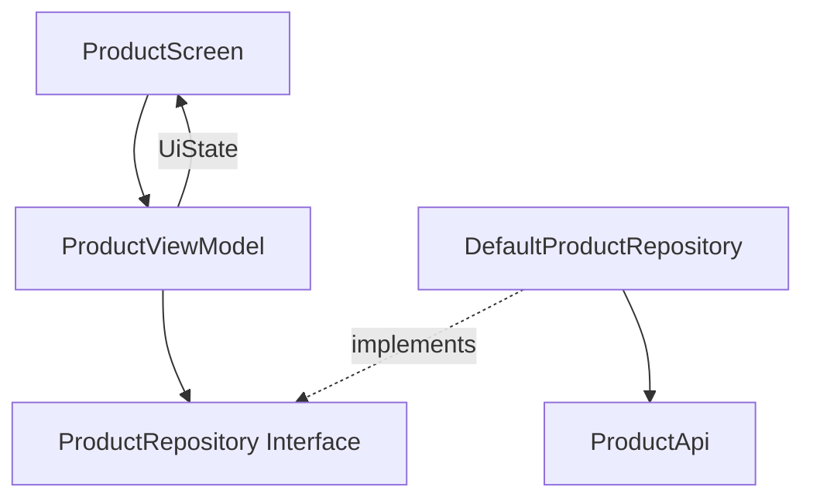
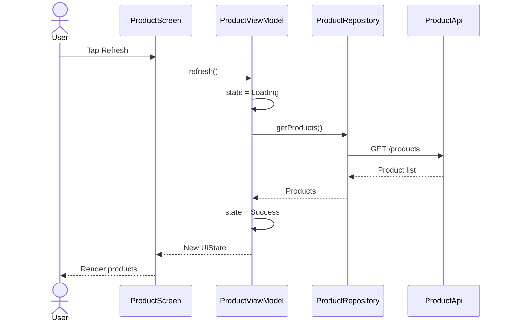
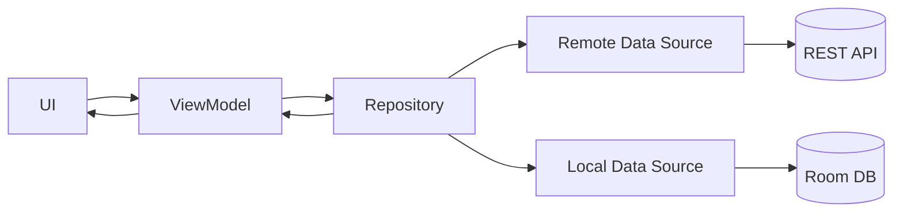
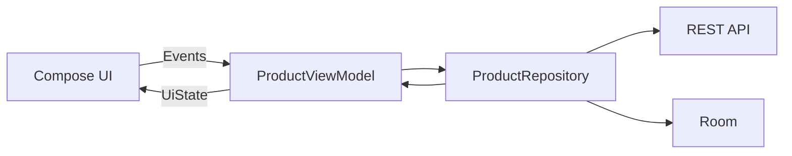

# 003 - MVVM

| Metadata                | Giá trị                                          |
| ----------------------- | ------------------------------------------------ |
| **Học phần**            | 03 - Architecture, State and Data                |
| **Module**              | Module 05 - Design and Architecture              |
| **Nhóm nội dung**       | Architectural Patterns                           |
| **Nguồn roadmap**       | Design and Architecture / Architectural Patterns |
| **Loại bài**            | Architecture                                     |
| **Thứ tự trong module** | 003                                              |
| **Thời lượng gợi ý**    | 34 phút                                          |

---

## 1. Tóm tắt

**MVVM - Model View ViewModel** là một architectural pattern tách giao diện khỏi state và logic xử lý của màn hình.

Trong cách triển khai Android hiện đại:

* **Model** đại diện cho application data, repository, data source và phần lớn business logic.
* **View** là `Activity`, `Fragment`, XML Views hoặc Jetpack Compose.
* **ViewModel** là screen-level state holder: lấy dữ liệu từ data/domain layer, xử lý các event liên quan đến màn hình và tạo **UI state** để View render.

Android Developers hiện khuyến nghị kiến trúc phân lớp với **UI layer**, **Data layer**, domain layer tùy chọn; đồng thời khuyến nghị `ViewModel`, repository và **Unidirectional Data Flow - UDF** khi các lợi ích của chúng phù hợp. Vì vậy, với Android 2026, nên hiểu "MVVM" theo hướng **ViewModel + UiState + Repository + UDF**, thay vì chỉ học sơ đồ MVVM cổ điển. ([Android Developers][1])

```text
Model
   │
   │ application data
   ▼
ViewModel
   │
   │ UiState
   ▼
View
   │
   │ User Event
   └──────────────► ViewModel
```

Android Developers định nghĩa `ViewModel` là một **business logic hoặc screen-level state holder**; lợi ích chính là giữ state qua configuration changes và cung cấp state cho UI. ([Android Developers][2])

---

## 2. Mục tiêu học tập

Sau bài này, bạn có thể:

* Giải thích được MVVM bằng ngôn ngữ của mình.
* Phân biệt Model, View và ViewModel.
* Hiểu ViewModel không phải là View.
* Hiểu `UiState` và **single source of truth**.
* Hiểu luồng:

  * state đi xuống;
  * event đi lên.
* Biết dùng `StateFlow` để expose UI state.
* Biết dùng `collectAsStateWithLifecycle()` trong Compose.
* Tách UI khỏi Retrofit, Room hoặc Firebase.
* Dùng Repository làm abstraction cho data layer.
* Viết unit test cho ViewModel bằng Fake Repository.
* Hiểu ViewModel xử lý configuration change như thế nào.
* Phân biệt configuration change và process death.
* Biết khi nào cần `SavedStateHandle`.
* Nhận biết `God ViewModel`.
* So sánh MVC, MVP và MVVM.
* Áp dụng MVVM vào một Android screen nhỏ.
* Tạo artifact có thể đưa vào portfolio.

---

## 3. MVVM là gì?

MVVM viết tắt của:

```text
M  = Model
V  = View
VM = ViewModel
```

Mental model đơn giản:



Điểm khác quan trọng so với MVP là ViewModel thường **không gọi trực tiếp các hàm của View** như:

```text
showLoading()
showProducts()
showError()
```

Thay vào đó, ViewModel expose:

```text
UiState
```

và View tự render theo state.

Ví dụ:

```text
Loading
   ↓
Success
   ↓
Error
```

UI chỉ cần trả lời:

> Với state hiện tại, màn hình phải trông như thế nào?

Đây cũng là hướng được Android UI architecture hiện tại khuyến nghị: UI state nên là snapshot mà UI có thể render, và với screen-level state cần data layer thì `ViewModel` là implementation được khuyến nghị. ([Android Developers][3])

---

## 4. Ba thành phần của MVVM

### 4.1. Model

Trong MVVM, **Model không chỉ là một `data class`**.

Model có thể bao gồm:

```text
Data Layer
├── Models
├── Repository
├── Remote Data Source
│   └── REST API
├── Local Data Source
│   └── Room
└── Business Logic
```

Ví dụ model:

```kotlin
data class Product(
    val id: Long,
    val name: String,
    val price: Double
)
```

Repository:

```kotlin
interface ProductRepository {

    suspend fun getProducts(): List<Product>
}
```

Implementation:

```kotlin
class DefaultProductRepository(
    private val api: ProductApi
) : ProductRepository {

    override suspend fun getProducts(): List<Product> {
        return api.getProducts()
    }
}
```

Android architecture recommendations hiện yêu cầu UI layer và ViewModel không truy cập trực tiếp data source như database, Firebase hay network provider; application data nên được expose thông qua repository. ([Android Developers][1])

---

### 4.2. View

View chịu trách nhiệm:

* hiển thị state;
* nhận interaction từ user;
* gửi event lên ViewModel;
* xử lý các chi tiết UI thuần túy.

View có thể là:

```text
Activity
Fragment
XML View
Composable
```

Ví dụ Compose:

```kotlin
@Composable
fun ProductScreen(
    state: ProductUiState,
    onRefresh: () -> Unit,
    onProductClick: (Long) -> Unit
) {
    // Render UI from state.
}
```

View không nên:

```kotlin
retrofit.getProducts()
```

hoặc:

```kotlin
room.productDao().getAll()
```

hoặc chứa quá nhiều business rule.

Với Compose, composable nhận **state** và expose **events**, nên UDF phù hợp tự nhiên với cách Compose hoạt động. ([Android Developers][4])

---

### 4.3. ViewModel

ViewModel nằm giữa UI và phần data/domain.

Nó thường chịu trách nhiệm:

* lấy application data;
* kết hợp data từ repository;
* chuyển data thành UI state;
* xử lý user event có business logic;
* giữ screen-level state;
* chạy asynchronous work bằng `viewModelScope`.

Android Developers mô tả ViewModel là nơi phù hợp để xử lý business logic thuộc UI layer và xử lý event trước khi delegate xuống các layer khác. ([Android Developers][2])

Ví dụ:

```kotlin
class ProductViewModel(
    private val repository: ProductRepository
) : ViewModel() {

    private val _uiState =
        MutableStateFlow<ProductUiState>(
            ProductUiState.Loading
        )

    val uiState: StateFlow<ProductUiState> =
        _uiState.asStateFlow()

    fun refresh() {
        loadProducts()
    }

    private fun loadProducts() {

        viewModelScope.launch {

            _uiState.value =
                ProductUiState.Loading

            try {

                val products =
                    repository.getProducts()

                _uiState.value =
                    ProductUiState.Success(
                        products
                    )

            } catch (exception: Exception) {

                _uiState.value =
                    ProductUiState.Error(
                        message =
                            exception.message
                                ?: "Đã xảy ra lỗi"
                    )
            }
        }
    }
}
```

---

## 5. MVVM và Unidirectional Data Flow

Một implementation MVVM Android hiện đại thường kết hợp **UDF**.

Nguyên tắc:

```text
State flows down
Events flow up
```


*Nguồn hình: Android Developers - Compose UI Architecture.*

Luồng:



Android Developers mô tả UDF theo vòng:

1. UI tạo event.
2. Event được xử lý.
3. State thay đổi.
4. State mới được đưa xuống UI.
5. UI render lại.

([Android Developers][3])

---

## 6. MVVM Android hiện đại trông như thế nào?

Một cấu trúc phổ biến:

```text
UI Layer
│
├── ProductScreen
│
└── ProductViewModel
        │
        ▼
Domain Layer       ← optional
│
└── GetProductsUseCase
        │
        ▼
Data Layer
│
├── ProductRepository
├── ProductApi
└── ProductDao
```

Sơ đồ:



Domain layer hiện được Android xem là **optional** và phù hợp khi cần reuse business logic giữa nhiều ViewModel hoặc khi muốn giảm complexity trong một ViewModel. ([Android Developers][5])

---

## 7. Sơ đồ Android Architecture chính thức


*Nguồn hình: Android Developers - UI layer.*

Hình này cho thấy:

```text
Data Layer
    │
    │ Application Data
    ▼
ViewModel
    │
    │ UI State
    ▼
UI Elements

UI Elements
    │
    │ Events
    ▼
ViewModel
```

Đây gần như là mental model quan trọng nhất khi học MVVM Android hiện đại.

---

## 8. UI State

Một trong những khái niệm quan trọng nhất của MVVM là **UI state**.

Ví dụ một product screen có thể có:

```text
Loading
Success
Empty
Error
```

Ta có thể model bằng:

```kotlin
sealed interface ProductUiState {

    data object Loading :
        ProductUiState

    data object Empty :
        ProductUiState

    data class Success(
        val products: List<Product>
    ) : ProductUiState

    data class Error(
        val message: String
    ) : ProductUiState
}
```

State machine:



UI không tự sửa data trong state.

Ví dụ không nên:

```text
UI nhận ProductUiState
       │
       └── tự sửa products
```

Android UI architecture hiện khuyến nghị UI state nên immutable; nguồn sở hữu data phải chịu trách nhiệm cập nhật data được expose. ([Android Developers][3])

---

## 9. StateFlow

Một pattern phổ biến:

```kotlin
private val _uiState =
    MutableStateFlow(
        ProductUiState()
    )

val uiState:
    StateFlow<ProductUiState> =
    _uiState.asStateFlow()
```

Ý nghĩa:

```text
MutableStateFlow
      │
      │ ViewModel có quyền mutate
      ▼
ViewModel

StateFlow
      │
      │ UI chỉ observe
      ▼
UI
```

Không nên expose:

```kotlin
val uiState:
    MutableStateFlow<ProductUiState>
```

vì UI lúc đó có thể mutate state từ bên ngoài.

Android UI guidance khuyến nghị expose UI state thông qua observable state holder như `StateFlow`, cho phép UI phản ứng khi state thay đổi. ([Android Developers][3])

---

## 10. Ví dụ MVVM hoàn chỉnh

Giả sử xây màn hình:

```text
Product List
```

### 10.1. Model

```kotlin
data class Product(
    val id: Long,
    val name: String,
    val price: Double
)
```

---

### 10.2. Repository

```kotlin
interface ProductRepository {

    suspend fun getProducts():
        List<Product>
}
```

Implementation:

```kotlin
class DefaultProductRepository(
    private val api: ProductApi
) : ProductRepository {

    override suspend fun getProducts():
        List<Product> {

        return api.getProducts()
    }
}
```

---

### 10.3. UI State

```kotlin
data class ProductUiState(
    val isLoading: Boolean = false,
    val products: List<Product> =
        emptyList(),
    val errorMessage: String? = null
)
```

---

### 10.4. ViewModel

```kotlin
class ProductViewModel(
    private val repository:
        ProductRepository
) : ViewModel() {

    private val _uiState =
        MutableStateFlow(
            ProductUiState()
        )

    val uiState:
        StateFlow<ProductUiState> =
        _uiState.asStateFlow()

    init {
        loadProducts()
    }

    fun refresh() {
        loadProducts()
    }

    private fun loadProducts() {

        viewModelScope.launch {

            _uiState.update {
                it.copy(
                    isLoading = true,
                    errorMessage = null
                )
            }

            try {

                val products =
                    repository.getProducts()

                _uiState.update {
                    it.copy(
                        isLoading = false,
                        products = products
                    )
                }

            } catch (
                exception: Exception
            ) {

                _uiState.update {
                    it.copy(
                        isLoading = false,
                        errorMessage =
                            exception.message
                                ?: "Đã xảy ra lỗi"
                    )
                }
            }
        }
    }
}
```

`viewModelScope` gắn với lifecycle của ViewModel và được hủy khi ViewModel được clear. ([Android Developers][2])

---

### 10.5. Compose View

```kotlin
@Composable
fun ProductRoute(
    viewModel: ProductViewModel
) {

    val uiState by
        viewModel.uiState
            .collectAsStateWithLifecycle()

    ProductScreen(
        state = uiState,
        onRefresh = viewModel::refresh
    )
}
```

Android architecture recommendations hiện **strongly recommend** lifecycle-aware collection; với Compose, ví dụ chính thức sử dụng `collectAsStateWithLifecycle()`. ([Android Developers][1])

---

### 10.6. Stateless Screen

```kotlin
@Composable
fun ProductScreen(
    state: ProductUiState,
    onRefresh: () -> Unit
) {

    when {

        state.isLoading -> {

            CircularProgressIndicator()
        }

        state.errorMessage != null -> {

            Column {

                Text(
                    state.errorMessage
                )

                Button(
                    onClick = onRefresh
                ) {
                    Text("Retry")
                }
            }
        }

        else -> {

            LazyColumn {

                items(
                    state.products
                ) { product ->

                    Text(
                        product.name
                    )
                }
            }
        }
    }
}
```

Điểm hay:

```text
ProductScreen
```

không cần biết:

```text
Retrofit
Room
Repository
ViewModel implementation
Coroutine
```

Nó chỉ nhận:

```text
State
+
Events
```

---

## 11. Dependency Direction

Một dependency graph tốt:



Điểm quan trọng:

```text
ViewModel
   │
   ▼
Repository abstraction
```

thay vì:

```text
ViewModel
   │
   ▼
Retrofit.Builder()
```

Android 2026 strongly recommends repository abstraction và constructor dependency injection khi có thể. ([Android Developers][1])

---

## 12. User Event

Giả sử user nhấn:

```text
Refresh
```

UI:

```kotlin
Button(
    onClick = {
        viewModel.refresh()
    }
) {
    Text("Refresh")
}
```

Luồng:



Đây chính là UDF:

```text
Event ↑
State ↓
```

([Android Developers][4])

---

## 13. ViewModel không nên giữ View

MVP thường có:

```text
Presenter
   │
   ▼
View Interface
```

MVVM không cần:

```kotlin
private var activity:
    ProductActivity? = null
```

hoặc:

```kotlin
private var view:
    ProductView? = null
```

ViewModel expose state:

```kotlin
val uiState:
    StateFlow<ProductUiState>
```

View observe state.

Điều này tránh nhiều vấn đề attach/detach View của MVP.

Android cũng khuyến nghị ViewModel không giữ reference đến lifecycle-related APIs như `Context` hoặc `Resources`, vì ViewModel có thể sống lâu hơn UI host và reference như vậy có nguy cơ gây memory leak. ([Android Developers][2])

---

## 14. Lifecycle của ViewModel

Một lợi ích lớn của ViewModel là:

```text
Activity recreation
≠
ViewModel recreation
```


*Nguồn hình: Android Developers - ViewModel overview.*

Ví dụ:

```text
Activity A
onCreate()
onStart()
onResume()

      rotate
        │
        ▼

Activity A
onPause()
onStop()
onDestroy()

Activity B
onCreate()
onStart()
onResume()
```

Trong khi đó:

```text
        ViewModel
┌─────────────────────────────┐
│ vẫn tồn tại                 │
│ state vẫn được giữ          │
│ async work có thể tiếp tục  │
└─────────────────────────────┘
```

ViewModel chỉ bị clear khi `ViewModelStoreOwner` thực sự kết thúc scope, ví dụ Activity finish hoặc navigation entry bị remove khỏi back stack. ([Android Developers][2])

---

## 15. Configuration Change

Giả sử screen đang tải:

```text
Loading...
```

User xoay:

```text
Portrait
   │
   ▼
Landscape
```

Không dùng ViewModel:

```text
Activity destroyed
      │
      ▼
state mất
      │
      ▼
request lại?
```

Dùng ViewModel:

```text
Old Activity
      │
      X

ViewModel
      │
      │ retained
      ▼

New Activity
      │
      ▼
observe same state
```

ViewModel được thiết kế để giữ state và asynchronous work qua configuration changes. ([Android Developers][2])

---

## 16. ViewModel không đồng nghĩa với Persistent Storage

Một lỗi hiểu rất phổ biến:

> "Dùng ViewModel thì state không bao giờ mất."

Sai.

ViewModel giúp với:

```text
Configuration change
```

nhưng nếu process bị Android kill:

```text
App Process
    │
    X
```

ViewModel cũng biến mất.

Nếu state quan trọng cần restore:

```text
SavedStateHandle
Database
DataStore
Repository
Server
```

tùy loại dữ liệu.

---

## 17. SavedStateHandle

`SavedStateHandle` hữu ích cho các transient UI state cần khôi phục sau system-initiated process death.

Ví dụ:

```text
search query
selected product ID
filter
form input
scroll-related state
```

Android Developers mô tả `SavedStateHandle` là key-value map cho ViewModel, có thể lưu state qua process death trong điều kiện saved-state mechanism còn hiệu lực. ([Android Developers][6])

Ví dụ:

```kotlin
class SearchViewModel(
    private val savedStateHandle:
        SavedStateHandle
) : ViewModel() {

    val query =
        savedStateHandle
            .getStateFlow(
                key = "query",
                initialValue = ""
            )

    fun updateQuery(
        value: String
    ) {
        savedStateHandle["query"] =
            value
    }
}
```

Mental model:

```text
Configuration change
        │
        ▼
ViewModel

System process death
        │
        ▼
SavedStateHandle

Persistent application data
        │
        ▼
Repository / DB / Server
```

Không nên nhét toàn bộ database vào `SavedStateHandle`.

Android guidance coi saved state chủ yếu là **transient state**, ví dụ query, selected ID hoặc input đang nhập. ([Android Developers][6])

---

## 18. MVVM với Repository

Không nên:

```text
Composable
    │
    ▼
Retrofit
```

Không nên:

```text
ViewModel
    │
    ▼
Room DAO
```

Nên:

```text
UI
 │
 ▼
ViewModel
 │
 ▼
Repository
 │
 ├── Remote
 └── Local
```



Repository là entry point chính để UI layer tiếp cận application data trong kiến trúc Android được khuyến nghị. ([Android Developers][1])

---

## 19. MVVM với Domain Layer

App nhỏ:

```text
ViewModel
    │
    ▼
Repository
```

hoàn toàn hợp lý.

Không cần:

```text
ViewModel
    │
    ▼
UseCase
    │
    ▼
Interactor
    │
    ▼
Service
    │
    ▼
Repository
```

chỉ để architecture trông phức tạp.

Khi business logic phức tạp:

```text
ViewModel
    │
    ▼
CheckoutUseCase
    │
    ├── CartRepository
    ├── CouponRepository
    └── UserRepository
```

Domain layer được Android xem là optional và nên thêm khi complexity hoặc reuse thực sự cần nó. ([Android Developers][5])

---

## 20. Error Handling

Một screen thực tế phải xử lý:

```text
Offline
Timeout
Unauthorized
Server Error
Invalid Data
Empty Data
```

Có thể định nghĩa:

```kotlin
sealed interface LoadProductsResult {

    data class Success(
        val products: List<Product>
    ) : LoadProductsResult

    data object Offline :
        LoadProductsResult

    data object Unauthorized :
        LoadProductsResult

    data object ServerError :
        LoadProductsResult
}
```

ViewModel map thành state:

```text
Offline
   ↓
ProductUiState.Error(
    "Không có kết nối mạng"
)
```

View không cần biết:

```text
SocketTimeoutException
HttpException
Retrofit
Room SQLiteException
```

---

## 21. One-off Events và UI State

Một pattern cũ thường làm:

```text
ViewModel
    │
    ▼
SingleLiveEvent
    │
    ▼
UI
```

hoặc gửi:

```text
NavigateNow
ShowToast
ShowSnackbar
```

như event riêng từ ViewModel.

Android architecture recommendations năm 2026 **strongly recommend không gửi event từ ViewModel xuống UI theo kiểu fire-and-forget**; thay vào đó event nên được xử lý và kết quả được phản ánh vào state khi phù hợp. ([Android Developers][1])

Ví dụ checkout:

Không nên chỉ:

```text
ViewModel
    ↓
"PaymentSuccessEvent"
```

Có thể model:

```kotlin
data class CheckoutUiState(
    val isLoading: Boolean = false,
    val orderId: String? = null,
    val errorMessage: String? = null
)
```

Sau thanh toán:

```text
orderId != null
```

UI có thể dựa vào state để tiếp tục flow.

Điểm này giúp giảm nguy cơ mất event khi UI recreate.

---

## 22. UI Logic và Business Logic

Không phải mọi logic đều nên nhét vào ViewModel.

Ví dụ logic UI:

```text
Scroll list
Focus TextField
Animation
Open drawer
Visual expansion
```

thường nên ở UI hoặc UI state holder phù hợp.

Business logic:

```text
Bookmark article
Calculate discount
Submit payment
Sync profile
```

nằm ở ViewModel, domain hoặc data layer tùy phạm vi.

Android UI architecture khuyến nghị giữ UI behavior logic trong UI, đặc biệt nếu cần các type như `Context`; business logic không nên nằm trực tiếp trong UI. ([Android Developers][3])

---

## 23. MVVM với Jetpack Compose

Compose rất phù hợp với MVVM + UDF vì:

```text
Composable
=
function(state) → UI
```

Conceptually:

```kotlin
UI = f(state)
```

State thay đổi:

```text
Old State
   │
   ▼
New State
   │
   ▼
Recomposition
   │
   ▼
New UI
```

Compose UI là immutable; khi state thay đổi, Compose cập nhật những phần UI cần thiết. UDF vì vậy phù hợp trực tiếp với cách Compose thiết kế state/event. ([Android Developers][4])

---

## 24. Route và Screen

Một pattern hữu ích:

```text
ProductRoute
    │
    ├── lấy ViewModel
    ├── collect state
    └── gửi callbacks
          │
          ▼
ProductScreen
```

### Route

```kotlin
@Composable
fun ProductRoute(
    viewModel: ProductViewModel
) {

    val state by
        viewModel.uiState
            .collectAsStateWithLifecycle()

    ProductScreen(
        state = state,
        onRefresh =
            viewModel::refresh
    )
}
```

### Screen

```kotlin
@Composable
fun ProductScreen(
    state: ProductUiState,
    onRefresh: () -> Unit
) {

    // Pure UI.
}
```

Ưu điểm:

```text
ProductScreen
```

có thể preview và UI test mà không cần ViewModel thật.

---

## 25. ViewModel không nên truyền xuống toàn bộ UI tree

Không nên:

```kotlin
@Composable
fun ProductCard(
    viewModel: ProductViewModel
)
```

rồi mọi component gọi ViewModel trực tiếp.

Nên:

```kotlin
@Composable
fun ProductCard(
    product: ProductUiModel,
    onClick: () -> Unit
)
```

ViewModel nên ở gần screen-level destination thay vì bị truyền sâu xuống reusable UI components. Android ViewModel best practices cũng khuyến nghị giữ ViewModel gần screen-level UI hoặc navigation destination. ([Android Developers][2])

---

## 26. Testing ViewModel

MVVM tạo một test seam rõ:

```text
ProductViewModel
      │
      ▼
ProductRepository
```

Trong production:

```text
DefaultProductRepository
```

Trong test:

```text
FakeProductRepository
```

---

### 26.1. Fake Repository

```kotlin
class FakeProductRepository :
    ProductRepository {

    override suspend fun getProducts():
        List<Product> {

        return listOf(
            Product(
                id = 1,
                name = "Laptop",
                price = 1200.0
            )
        )
    }
}
```

---

### 26.2. Test ViewModel

```kotlin
@Test
fun loadProducts_success_updatesState() =
    runTest {

        val repository =
            FakeProductRepository()

        val viewModel =
            ProductViewModel(
                repository
            )

        advanceUntilIdle()

        val state =
            viewModel.uiState.value

        assertEquals(
            1,
            state.products.size
        )

        assertEquals(
            "Laptop",
            state.products
                .first()
                .name
        )
    }
```

Android architecture recommendations hiện yêu cầu tối thiểu nên có unit test cho ViewModels, Flows và data layer; đồng thời **prefer fakes to mocks**. ([Android Developers][1])

---

## 27. Testing Error

```kotlin
class ErrorProductRepository :
    ProductRepository {

    override suspend fun getProducts():
        List<Product> {

        throw IOException(
            "No Internet"
        )
    }
}
```

Test:

```kotlin
@Test
fun loadProducts_error_updatesErrorState() =
    runTest {

        val viewModel =
            ProductViewModel(
                ErrorProductRepository()
            )

        advanceUntilIdle()

        val state =
            viewModel.uiState.value

        assertFalse(
            state.isLoading
        )

        assertNotNull(
            state.errorMessage
        )
    }
```

Test quan trọng:

```text
Initial
Loading
Success
Empty
Error
Retry
Refresh
```

---

## 28. God ViewModel

MVVM không có nghĩa:

```text
Activity
  100 lines

ViewModel
  3000 lines
```

Nếu ViewModel chứa:

```text
ProductViewModel
├── Search
├── Filtering
├── Checkout
├── Authentication
├── Payment
├── Analytics
├── Notifications
├── Navigation
├── Date Formatting
└── Database Mapping
```

thì complexity chỉ được chuyển khỏi Activity.

Giải pháp có thể là:

```text
ViewModel
 │
 ├── ProductRepository
 │
 ├── SearchProductsUseCase
 │
 ├── AddToCartUseCase
 │
 └── GetRecommendationsUseCase
```

nhưng chỉ tách khi có lý do thực tế.

Domain layer được khuyến nghị trong app lớn khi business logic cần reuse giữa nhiều ViewModel hoặc ViewModel đã quá phức tạp. ([Android Developers][1])

---

## 29. MVC vs MVP vs MVVM

| Đặc điểm              | MVC                 | MVP                 | MVVM / Modern Android |
| --------------------- | ------------------- | ------------------- | --------------------- |
| Thành phần trung gian | Controller          | Presenter           | ViewModel             |
| UI gửi event tới      | Controller          | Presenter           | ViewModel             |
| UI nhận cập nhật      | Controller/View     | Presenter gọi View  | Observe `UiState`     |
| View interface        | Không bắt buộc      | Phổ biến            | Thường không cần      |
| Attach/detach UI      | Tùy implementation  | Thường cần          | Không theo kiểu MVP   |
| Screen state          | Controller/Model    | Presenter           | ViewModel             |
| Configuration change  | Không tự giải quyết | Không tự giải quyết | ViewModel hỗ trợ      |
| UDF                   | Không bắt buộc      | Không bắt buộc      | Rất phù hợp           |
| Compose               | Không tự nhiên      | Ít tự nhiên hơn     | Phù hợp               |
| Testability           | Có thể tốt          | Tốt                 | Tốt                   |

### MVC

```text
View
 ↓
Controller
 ↓
Model
```

### MVP

```text
View
 ⇅
Presenter
 ↓
Model
```

### MVVM

```text
View
 │ Event
 ▼
ViewModel
 │
 ▼
Model

Model
 │
 ▼
ViewModel
 │ UiState
 ▼
View
```

---

## 30. MVVM và Data Binding

Tên **MVVM** trong lịch sử thường gắn với View binding trực tiếp vào properties của ViewModel.

Trong Android cũ, bạn có thể gặp:

```text
XML
 │
 ▼
Data Binding
 │
 ▼
LiveData
 │
 ▼
ViewModel
```

Nhưng với Android hiện đại, không cần hiểu MVVM là:

```text
MVVM = XML Data Binding
```

Một Compose app dùng:

```text
ViewModel
+
StateFlow
+
UiState
+
UDF
```

vẫn thể hiện các nguyên tắc chính thường được gọi là MVVM.

Quan trọng hơn tên pattern là:

```text
clear layers
single source of truth
state ownership
UDF
testability
```

Đây cũng là cách Android architecture guidance hiện được trình bày. ([Android Developers][1])

---

## 31. Một flow hoàn chỉnh

Ví dụ user bookmark một article:


*Nguồn hình: Android Developers - UI Layer.*

Flow:

```text
0. Application Data
       │
       ▼
1. ViewModel tạo UiState
       │
       ▼
2. UI render
       │
       │ User clicks Bookmark
       ▼
3. ViewModel nhận event
       │
       ▼
4. Data layer persist change
       │
       ▼
5. Data mới được emit
       │
       ▼
6. ViewModel tạo UiState mới
       │
       ▼
7. UI render lại
```

Điểm quan trọng:

```text
UI không phải source of truth
```

Data owner mới là nơi thực sự thay đổi application data. ([Android Developers][3])

---

## 32. Debugging theo MVVM

Bug:

```text
"Product không xuất hiện."
```

Debug:

```text
UI
 │
 │ state nhận được?
 ▼
ViewModel
 │
 │ repository trả data?
 ▼
Repository
 │
 │ data source đúng?
 ▼
API / DB
```

Đường ngược:

```text
API
 ↓
Repository
 ↓
ViewModel
 ↓
UiState
 ↓
UI
```

Nếu API trả đúng nhưng UI state sai:

```text
bug = ViewModel / mapping
```

Nếu UI state đúng nhưng UI sai:

```text
bug = rendering
```

Kiến trúc rõ giúp thu hẹp phạm vi debug.

---

## 33. Performance Considerations

MVVM không tự động khiến app nhanh hơn.

Bạn vẫn cần tránh:

```text
heavy computation
      ↓
Main Thread
```

ViewModel không phải "background thread".

Ví dụ:

```kotlin
viewModelScope.launch {

    // Coroutine starts in Main by default.
}
```

Blocking work phải được data source hoặc layer chịu trách nhiệm chuyển sang dispatcher phù hợp.

Architecture tốt chủ yếu giúp:

```text
maintainability
testability
predictability
state ownership
```

chứ không phải phép tối ưu performance tự động.

---

## 34. Khi nào MVVM phù hợp?

MVVM/ViewModel + UDF phù hợp với hầu hết Android app có:

* nhiều screen;
* API;
* database;
* asynchronous data;
* loading/error state;
* configuration changes;
* Compose;
* Flow/StateFlow;
* unit testing;
* navigation.

Ví dụ:

```text
Shopping App
Social App
Weather App
Finance App
News App
Fitness App
Streaming App
```

Android 2026 strongly recommends UDF, AAC ViewModels khi lợi ích phù hợp, repository, lifecycle-aware state collection và Compose cho app mới. ([Android Developers][1])

---

## 35. Khi nào không cần ViewModel?

Không phải composable nào cũng cần ViewModel.

Ví dụ:

```text
Dropdown expanded state
Button pressed state
Animation progress
Temporary tab selection
```

nếu chỉ có ý nghĩa ngắn hạn trong UI:

```kotlin
var expanded by
    remember {
        mutableStateOf(false)
    }
```

có thể đủ.

Android guidance khuyến nghị giữ state **càng thấp càng tốt nhưng vẫn ở đúng owner**; ViewModel phù hợp cho screen-level state cần business logic hoặc data layer, còn simple UI state có thể ở plain UI state holder. ([Android Developers][7])

---

## 36. Cấu trúc project gợi ý

Một app nhỏ:

```text
com.example.shop/
│
├── data/
│   │
│   ├── model/
│   │   └── Product.kt
│   │
│   ├── remote/
│   │   └── ProductApi.kt
│   │
│   └── repository/
│       ├── ProductRepository.kt
│       └── DefaultProductRepository.kt
│
└── ui/
    └── products/
        ├── ProductUiState.kt
        ├── ProductViewModel.kt
        └── ProductScreen.kt
```

App lớn hơn:

```text
app/
│
├── data/
│
├── domain/
│   └── usecase/
│
├── feature/
│   ├── products/
│   ├── cart/
│   └── checkout/
│
└── core/
```

Không cần ép mọi app vào cấu trúc enterprise ngay từ đầu.

---

## 37. Thực hành

### Bài thực hành: Product List bằng MVVM

Tạo UI:

```text
┌──────────────────────────────┐
│ Products                     │
├──────────────────────────────┤
│                              │
│ Laptop                       │
│ $1200                        │
│                              │
│ Keyboard                     │
│ $80                          │
│                              │
│ Mouse                        │
│ $45                          │
│                              │
├──────────────────────────────┤
│          Refresh             │
└──────────────────────────────┘
```

---

### 37.1. Task 1 - Repository

Tạo:

```text
ProductRepository
FakeProductRepository
DefaultProductRepository
```

---

### 37.2. Task 2 - UiState

Có ít nhất:

```text
Loading
Success
Error
```

Khuyến khích thêm:

```text
Empty
```

---

### 37.3. Task 3 - ViewModel

ViewModel:

```text
ProductViewModel
├── uiState
├── refresh()
└── loadProducts()
```

---

### 37.4. Task 4 - Compose UI

UI chỉ nhận:

```text
ProductUiState
```

và callback:

```text
onRefresh
```

---

### 37.5. Task 5 - Test

Test:

```text
Success
Error
Retry
Empty
```

bằng Fake Repository.

---

## 38. Bài tập Refactor

Code ban đầu:

```kotlin
class ProductActivity :
    AppCompatActivity() {

    override fun onCreate(
        savedInstanceState: Bundle?
    ) {

        super.onCreate(
            savedInstanceState
        )

        lifecycleScope.launch {

            progressBar.isVisible =
                true

            try {

                val products =
                    retrofit
                        .create(
                            ProductApi::class.java
                        )
                        .getProducts()

                recyclerView.adapter =
                    ProductAdapter(
                        products
                    )

            } catch (
                exception: Exception
            ) {

                Toast.makeText(
                    this@ProductActivity,
                    exception.message,
                    Toast.LENGTH_SHORT
                ).show()

            } finally {

                progressBar.isVisible =
                    false
            }
        }
    }
}
```

Refactor thành:

```text
ProductScreen
      │
      ▼
ProductViewModel
      │
      ▼
ProductRepository
      │
      ▼
ProductApi
```

UI không được gọi:

```text
Retrofit
Room
Repository
```

trực tiếp.

---

## 39. Artifact cho Portfolio

Project:

```text
android-mvvm-products/
│
├── app/
│
├── screenshots/
│   ├── loading.png
│   ├── products.png
│   ├── empty.png
│   └── error.png
│
├── docs/
│   └── architecture.md
│
└── README.md
```

Trong README thêm:



Giải thích:

```text
Why ViewModel?

Why StateFlow?

Where is the source of truth?

How does rotation affect state?

What survives process death?

Why does UI not access Retrofit?

How is ViewModel tested?

Why is Domain layer optional?
```

---

## 40. Những lỗi thường gặp

### 40.1. ViewModel chứa Context

Không nên:

```kotlin
class ProductViewModel(
    private val activity:
        Activity
) : ViewModel()
```

ViewModel có lifecycle dài hơn UI host; giữ lifecycle-related reference có thể gây leak. ([Android Developers][2])

---

### 40.2. UI gọi Repository trực tiếp

Không nên:

```text
Composable
   │
   ▼
Repository
```

Nên:

```text
Composable
   │
   ▼
ViewModel
   │
   ▼
Repository
```

([Android Developers][1])

---

### 40.3. ViewModel expose mutable state

Không nên:

```kotlin
val uiState =
    MutableStateFlow(...)
```

public.

Nên expose read-only abstraction:

```kotlin
private val _uiState =
    MutableStateFlow(...)

val uiState =
    _uiState.asStateFlow()
```

---

### 40.4. Dùng ViewModel cho mọi thứ

Không cần:

```text
ButtonViewModel
TextFieldViewModel
DropdownViewModel
CardViewModel
```

State ngắn hạn có thể nằm ở UI.

---

### 40.5. ViewModel = Repository

Sai:

```text
ViewModel
├── Retrofit
├── Room
├── SQL
├── cache
├── networking
└── everything
```

Data access nên được encapsulate trong data layer/repository. ([Android Developers][1])

---

### 40.6. ViewModel = persistent storage

ViewModel không thay thế:

```text
Room
DataStore
File
Server
```

Nó giữ state theo ViewModel scope.

---

### 40.7. Không xử lý process death

Rotation chạy tốt chưa đủ.

Test thêm:

```text
Open screen
   ↓
Enter query
   ↓
Background app
   ↓
System kills process
   ↓
Restore app
```

State transient quan trọng có thể cần `SavedStateHandle`. ([Android Developers][6])

---

### 40.8. God ViewModel

Nếu `ViewModel` vài nghìn dòng, cần xem lại responsibility thay vì chỉ tự hào rằng app "đã dùng MVVM".

---

## 41. Mental Model cần nhớ

### Model

```text
Application data
+
Business rules
+
Repositories
+
Data sources
```

### View

```text
Render state
+
Emit events
```

### ViewModel

```text
Receive events
+
Access data/domain
+
Produce UiState
```

Toàn flow:

```text
User
 │
 ▼
View
 │
 │ Event
 ▼
ViewModel
 │
 ▼
Repository
 │
 ▼
API / DB

API / DB
 │
 ▼
Repository
 │
 ▼
ViewModel
 │
 │ UiState
 ▼
View
 │
 ▼
User
```

Hoặc nhớ ngắn nhất:

```text
State ↓

UI

Events ↑
```

---

## 42. Checklist hoàn thành

### Kiến thức

* [ ] Giải thích được MVVM.
* [ ] Phân biệt Model, View, ViewModel.
* [ ] Hiểu ViewModel là screen-level state holder.
* [ ] Hiểu UI state.
* [ ] Hiểu UDF.
* [ ] Hiểu single source of truth.
* [ ] Phân biệt MVVM với MVP và MVC.

### Code

* [ ] Có Repository.
* [ ] ViewModel không gọi Retrofit trực tiếp.
* [ ] UI không gọi Repository trực tiếp.
* [ ] Có `UiState`.
* [ ] Có `StateFlow`.
* [ ] Mutable state được encapsulate.
* [ ] Có `viewModelScope`.
* [ ] UI collect state theo lifecycle.

### State

* [ ] Loading.
* [ ] Success.
* [ ] Empty nếu cần.
* [ ] Error.
* [ ] Retry.
* [ ] Refresh.

### Lifecycle

* [ ] Hiểu ViewModel survive configuration changes.
* [ ] Không giữ Activity trong ViewModel.
* [ ] Không giữ Fragment trong ViewModel.
* [ ] Phân biệt configuration change và process death.
* [ ] Biết khi nào dùng `SavedStateHandle`.

### Data

* [ ] Repository là data entry point.
* [ ] Data source nằm dưới repository.
* [ ] Business logic đặt đúng layer.
* [ ] Domain layer chỉ thêm khi cần.

### Testing

* [ ] Có Fake Repository.
* [ ] Test ViewModel.
* [ ] Test Success.
* [ ] Test Error.
* [ ] Test Retry.
* [ ] Test StateFlow khi phù hợp.

### Production

* [ ] Lifecycle-aware collection.
* [ ] Network error có UX phù hợp.
* [ ] Không duplicate request ngoài ý muốn.
* [ ] Không có God ViewModel.
* [ ] Không mutate state từ UI.
* [ ] Không coi ViewModel là persistent storage.

### Portfolio

* [ ] Có architecture diagram.
* [ ] Có screenshot.
* [ ] Có README.
* [ ] Có unit test.
* [ ] Giải thích được UDF.
* [ ] Giải thích được lifecycle.
* [ ] Có Fake Repository.
* [ ] Có error/loading state.

---

## 43. Câu hỏi tự kiểm tra

1. MVVM viết tắt của gì?
2. ViewModel khác View như thế nào?
3. `UiState` dùng để làm gì?
4. UDF nghĩa là gì?
5. State đi theo hướng nào?
6. Event đi theo hướng nào?
7. Tại sao UI không nên gọi Retrofit trực tiếp?
8. Repository có vai trò gì?
9. `StateFlow` giúp gì cho ViewModel?
10. Vì sao không nên expose `MutableStateFlow`?
11. ViewModel survive rotation bằng cách nào?
12. ViewModel có survive process death không?
13. `SavedStateHandle` dùng khi nào?
14. Vì sao ViewModel không nên giữ `Activity`?
15. `viewModelScope` dùng để làm gì?
16. Domain layer có bắt buộc không?
17. God ViewModel là gì?
18. MVVM khác MVP ở điểm nào?
19. Tại sao Compose phù hợp với UDF?
20. Fake Repository giúp test như thế nào?

---

## 44. Bài tập nâng cao

Chuyển màn hình:

```text
Activity
├── Retrofit
├── Room
├── validation
├── loading
├── error
└── rendering
```

thành:

```text
Compose UI
     │
     │ Event
     ▼
ViewModel
     │
     ▼
Use Case - optional
     │
     ▼
Repository
     │
     ├── API
     └── Room

Repository
     │
     ▼
ViewModel
     │
     │ UiState
     ▼
Compose UI
```

Yêu cầu thêm:

1. Dùng `StateFlow`.
2. Dùng `collectAsStateWithLifecycle()`.
3. Có Fake Repository.
4. Có test Success.
5. Có test Error.
6. Có loading state.
7. Rotate màn hình và xác minh không mất state.
8. Thêm search query dùng `SavedStateHandle`.
9. Giải thích trong README state nào cần database và state nào chỉ cần saved state.

---

## 45. Kết luận

MVVM là pattern rất quan trọng với Android vì nó giúp tách:

```text
UI Rendering
       │
       ▼
Screen State / Logic
       │
       ▼
Application Data
```

Nhưng khi học Android năm 2026, không nên chỉ nhớ:

```text
Model
View
ViewModel
```

Mental model thực tế hơn là:

```text
UI
 │
 │ Events
 ▼
ViewModel
 │
 ▼
Repository / Use Case
 │
 ▼
Data Sources

Data
 │
 ▼
ViewModel
 │
 │ UiState
 ▼
UI
```

Các nguyên tắc cần giữ lại:

```text
Separation of Concerns

Single Source of Truth

Unidirectional Data Flow

Immutable UI State

Lifecycle-aware State

Repository Abstraction

Testable ViewModel
```

Android Developers hiện strongly recommend một data layer rõ ràng, UI layer rõ ràng, repository, UDF, lifecycle-aware state collection và ViewModel khi lợi ích của nó áp dụng; Compose là toolkit được khuyến nghị cho UI mới. ([Android Developers][1])

Vì vậy, với project Android junior hoặc portfolio, một baseline rất tốt là:

```text
Compose
   +
ViewModel
   +
UiState
   +
StateFlow
   +
Repository
   +
Coroutines
   +
UDF
   +
Unit Tests
```

Sau đó chỉ thêm:

```text
Domain Layer
Use Cases
Multiple Modules
Complex DI
```

khi complexity của project thực sự yêu cầu.

---

## 46. Tài liệu tham khảo

* **Android Developers - Guide to app architecture.** ([Android Developers][8])
* **Android Developers - Recommendations for Android architecture.** Tài liệu được cập nhật ngày 26/04/2026. ([Android Developers][1])
* **Android Developers - UI layer.** ([Android Developers][3])
* **Android Developers - ViewModel overview.** ([Android Developers][2])
* **Android Developers - Compose UI Architecture.** ([Android Developers][4])
* **Android Developers - Saved State module for ViewModel.** ([Android Developers][6])
* **Android Developers - Domain layer.** ([Android Developers][5])
* **Android Developers - State holders and UI state.** ([Android Developers][7])

[1]: https://developer.android.com/topic/architecture/recommendations "Recommendations for Android architecture  |  App architecture  |  Android Developers"
[2]: https://developer.android.com/topic/libraries/architecture/viewmodel "ViewModel overview  |  App architecture  |  Android Developers"
[3]: https://developer.android.com/topic/architecture/ui-layer "UI layer  |  App architecture  |  Android Developers"
[4]: https://developer.android.com/develop/ui/compose/architecture "Compose UI Architecture  |  Jetpack Compose  |  Android Developers"
[5]: https://developer.android.com/topic/architecture/domain-layer "Domain layer  |  App architecture  |  Android Developers"
[6]: https://developer.android.com/topic/libraries/architecture/viewmodel/viewmodel-savedstate "Saved State module for ViewModel  |  App architecture  |  Android Developers"
[7]: https://developer.android.com/topic/architecture/ui-layer/stateholders?utm_source=chatgpt.com "State holders and UI state | App architecture"
[8]: https://developer.android.com/topic/architecture?utm_source=chatgpt.com "Guide to app architecture"
