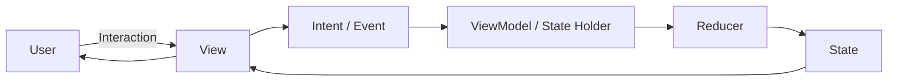
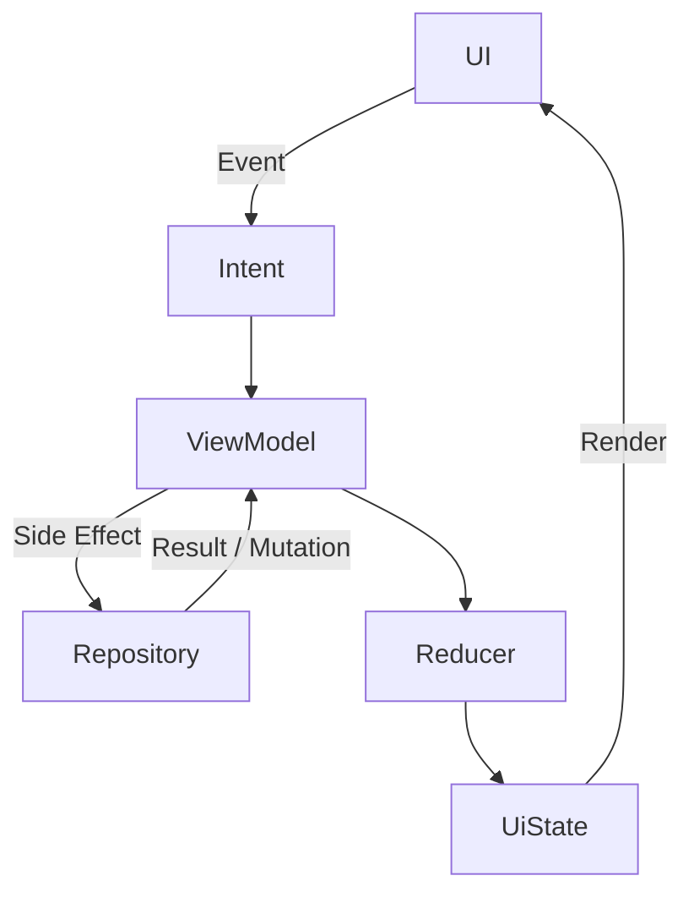
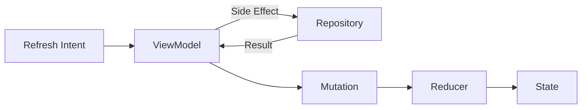
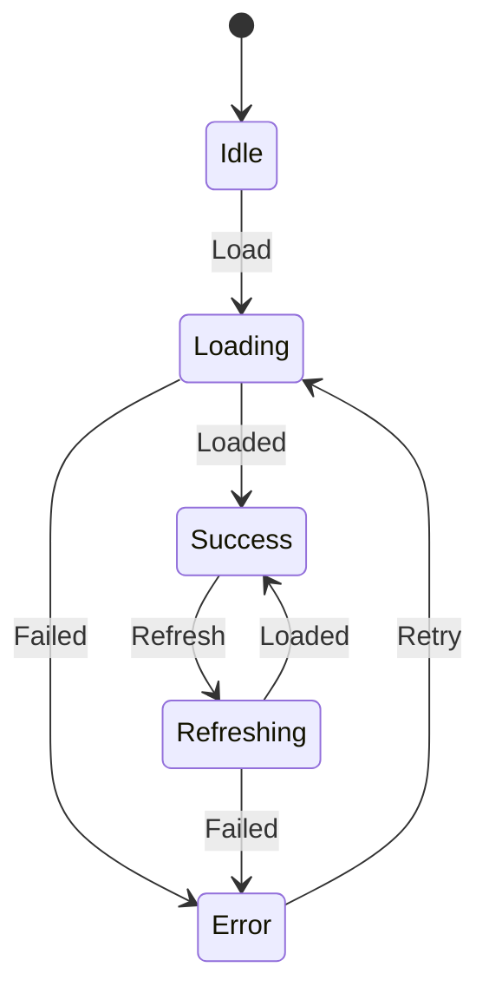
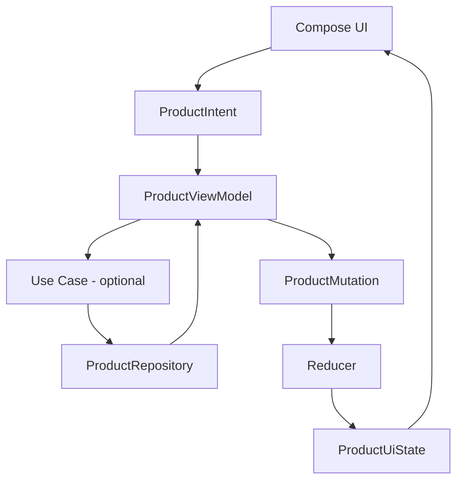
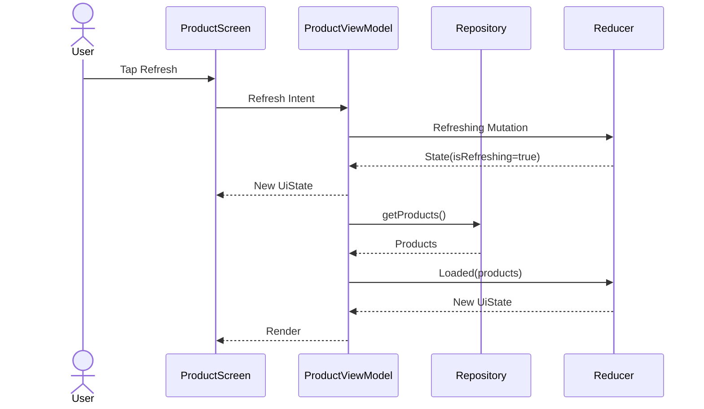
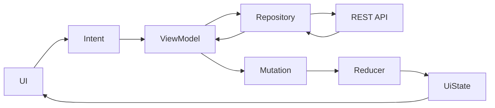
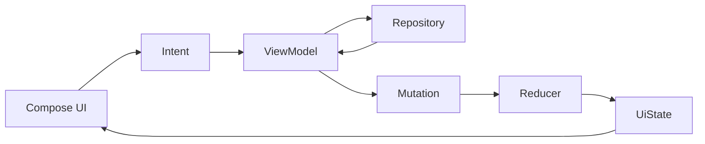
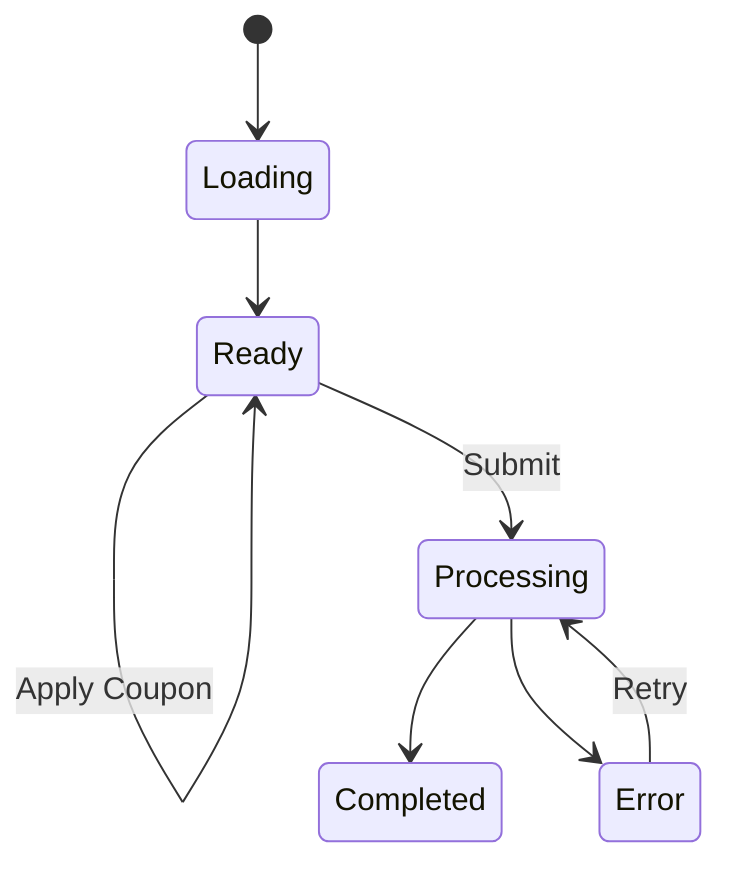

# 004 - MVI

| Metadata                | Giá trị                                          |
| ----------------------- | ------------------------------------------------ |
| **Học phần**            | 03 - Architecture, State and Data                |
| **Module**              | Module 05 - Design and Architecture              |
| **Nhóm nội dung**       | Architectural Patterns                           |
| **Nguồn roadmap**       | Design and Architecture / Architectural Patterns |
| **Loại bài**            | Architecture                                     |
| **Thứ tự trong module** | 004                                              |
| **Thời lượng gợi ý**    | 34 phút                                          |

---

## 1. Tóm tắt

**MVI - Model View Intent** là một architectural pattern tập trung vào việc quản lý màn hình như một **state machine có luồng dữ liệu một chiều**.

Một mental model đơn giản:

```text
User
 │
 │ Intent / Event
 ▼
View
 │
 ▼
State Holder / ViewModel
 │
 ├── xử lý Intent
 ├── gọi Repository / Use Case
 ├── tạo State mới
 └── xử lý Side Effect
 │
 ▼
State
 │
 ▼
View
```

Trong Android hiện đại, MVI thường được triển khai bằng:

```text
Jetpack Compose
+
ViewModel
+
Immutable UiState
+
Intent / Action
+
StateFlow
+
Repository
+
Unidirectional Data Flow
```

Điều quan trọng là Android Developers **không bắt buộc app phải sử dụng pattern có tên "MVI"**. Tài liệu chính thức nhấn mạnh **Unidirectional Data Flow - UDF**, nơi state đi xuống UI và events đi ngược lên state holder. MVI có thể được xem là một cách triển khai nghiêm ngặt hơn của các nguyên tắc này. ([Android Developers][1])

```text
           Intent
UI ─────────────────► ViewModel
                       │
                       │
                       ▼
                    Reducer
                       │
                       ▼
                     State
                       │
                       ▼
UI ◄───────────────────┘
```

MVI đặc biệt hữu ích khi:

* màn hình có nhiều state;
* nhiều user actions;
* nhiều request bất đồng bộ;
* cần state transition dễ dự đoán;
* cần debug rõ "event nào tạo ra state nào";
* muốn reducer có thể unit test độc lập.

Tuy nhiên:

> **Đừng thêm Intent, Action, Mutation, Result, Effect và Reducer chỉ vì muốn project trông "architecture-heavy".**

Mục tiêu vẫn là **clarity**, không phải số lượng abstraction.

---

## 2. Mục tiêu học tập

Sau bài này, bạn có thể:

* Giải thích được MVI bằng ngôn ngữ của mình.
* Phân biệt:

  * Model;
  * View;
  * Intent.
* Hiểu MVI liên quan thế nào tới UDF.
* Hiểu:

  * State;
  * Intent/Event;
  * Mutation;
  * Reducer;
  * Side Effect.
* Thiết kế một `UiState` immutable.
* Gửi user event từ Compose lên ViewModel.
* Expose state bằng `StateFlow`.
* Sử dụng reducer để tạo state mới.
* Tách network/database khỏi reducer.
* Hiểu reducer nên là pure function khi có thể.
* Test state transition mà không cần Android UI.
* Biết xử lý loading, error, retry và refresh.
* Hiểu vấn đề one-off event.
* Phân biệt MVI và MVVM.
* Biết khi nào MVI có ích.
* Nhận biết "ceremonial MVI" có quá nhiều boilerplate.
* Tạo một artifact MVI nhỏ cho portfolio.

---

## 3. MVI là gì?

MVI viết tắt của:

```text
M = Model
V = View
I = Intent
```

Tuy nhiên, cách hiểu thực tế trong Android thường rộng hơn ba chữ này.

Một screen MVI thường có:

```text
State
Intent / Event
Reducer
Side Effects
View
```

Luồng cơ bản:



Nếu event cần network/database:



Đây là một biểu hiện của **Unidirectional Data Flow**.

Android Developers mô tả UDF theo nguyên tắc: **state đi xuống UI, còn events gây thay đổi state đi theo hướng ngược lại**. ([Android Developers][2])

---

## 4. MVI và UDF

### 4.1. Luồng hai chiều dễ gây khó hiểu

Giả sử nhiều component có thể thay đổi state:

```text
UI ─────► ViewModel
▲            │
│            ▼
│         Repository
│            │
└────────────┘
```

Nếu nhiều object cùng mutate state:

```text
Activity
Fragment
Repository
Callback
Observer
Adapter
```

developer rất khó trả lời:

> State hiện tại được tạo ra từ đâu?

---

### 4.2. UDF

Với UDF:

```text
Events
  │
  ▼
State Owner
  │
  ▼
State
  │
  ▼
UI
```


*Nguồn hình: Android Developers - Compose UI Architecture.*

Android Developers sử dụng chính mô hình **state down, events up** cho Compose và state management. ([Android Developers][1])

---

### 4.3. MVI làm UDF explicit hơn

MVI thường formalize UDF thành:

```text
Intent
   │
   ▼
Processor
   │
   ▼
Mutation / Result
   │
   ▼
Reducer
   │
   ▼
State
   │
   ▼
View
```

Điểm mạnh:

```text
Previous State
      +
Mutation
      =
New State
```

State transition trở nên rõ ràng và dễ test.

---

## 5. Các thành phần chính

### 5.1. View

View:

* render state;
* phát user event;
* không sở hữu business logic;
* không truy cập Retrofit/Room trực tiếp.

Ví dụ Compose:

```kotlin
@Composable
fun ProductScreen(
    state: ProductUiState,
    onIntent: (ProductIntent) -> Unit
) {
    // Render state.
}
```

View chỉ cần biết:

```text
State
+
Intent callback
```

Không cần biết:

```text
Retrofit
Room
Repository
Use Case
Coroutine implementation
```

---

### 5.2. Intent

**Intent** trong MVI không phải `android.content.Intent`.

Đây là một điểm rất dễ nhầm.

MVI Intent có nghĩa:

> Ý định hoặc hành động mà user/UI muốn thực hiện.

Ví dụ:

```kotlin
sealed interface ProductIntent {

    data object Load :
        ProductIntent

    data object Refresh :
        ProductIntent

    data object Retry :
        ProductIntent

    data class SearchChanged(
        val query: String
    ) : ProductIntent

    data class ProductClicked(
        val productId: Long
    ) : ProductIntent
}
```

User:

```text
nhấn Refresh
```

được chuyển thành:

```kotlin
ProductIntent.Refresh
```

User nhập:

```text
keyboard
```

có thể thành:

```kotlin
ProductIntent.SearchChanged(
    query = "laptop"
)
```

---

### 5.3. State

State đại diện cho **toàn bộ dữ liệu cần thiết để render screen tại một thời điểm**.

Ví dụ:

```kotlin
data class ProductUiState(
    val isLoading: Boolean = false,
    val products: List<ProductUiModel> =
        emptyList(),
    val query: String = "",
    val errorMessage: String? = null,
    val isRefreshing: Boolean = false
)
```

Mental model:

```text
UiState
=
snapshot của screen
```

View chỉ cần state để biết:

```text
loading?
products?
query?
error?
refreshing?
```

Android UI architecture cũng định nghĩa UI state là dữ liệu mà UI cần để render đầy đủ và khuyến nghị state owner tạo state từ application data. ([Android Developers][3])

---

### 5.4. Reducer

Reducer nhận:

```text
Old State
+
Mutation
```

và trả:

```text
New State
```

Ví dụ:

```kotlin
fun reduce(
    state: ProductUiState,
    mutation: ProductMutation
): ProductUiState {

    return when (mutation) {

        ProductMutation.Loading -> {
            state.copy(
                isLoading = true,
                errorMessage = null
            )
        }

        is ProductMutation.Loaded -> {
            state.copy(
                isLoading = false,
                products = mutation.products,
                errorMessage = null
            )
        }

        is ProductMutation.Failed -> {
            state.copy(
                isLoading = false,
                errorMessage = mutation.message
            )
        }
    }
}
```

Reducer lý tưởng:

```text
Input giống nhau
      ↓
Output giống nhau
```

và không thực hiện:

```text
Network call
Database write
Navigation
Toast
Logging analytics
```

---

### 5.5. Mutation

Mutation mô tả **state cần thay đổi theo cách nào**.

Ví dụ:

```kotlin
sealed interface ProductMutation {

    data object Loading :
        ProductMutation

    data class Loaded(
        val products: List<ProductUiModel>
    ) : ProductMutation

    data class Failed(
        val message: String
    ) : ProductMutation

    data class QueryChanged(
        val query: String
    ) : ProductMutation
}
```

Flow:

```text
Intent
   ↓
logic / side effect
   ↓
Mutation
   ↓
Reducer
   ↓
New State
```

Mutation không phải bắt buộc trong mọi implementation MVI.

Một implementation nhỏ có thể đi thẳng:

```text
Intent
 ↓
ViewModel
 ↓
State
```

và vẫn giữ UDF rõ ràng.

---

## 6. Side Effect là gì?

Reducer nên chỉ biến đổi state.

Nhưng app thực tế phải làm:

```text
HTTP request
Room query
Save DataStore
Analytics
Navigation
Snackbar
```

Đây là những công việc không thể biểu diễn chỉ bằng:

```text
state.copy(...)
```

Chúng thường được gọi chung là **side effects**.

Ví dụ:

```text
Refresh Intent
      │
      ▼
ViewModel
      │
      ├── Repository.getProducts()
      │
      ▼
Result
      │
      ▼
Mutation
      │
      ▼
Reducer
```



---

## 7. Side Effect và UI Effect không hoàn toàn giống nhau

Có thể phân biệt:

### Business side effect

Ví dụ:

```text
Call API
Write database
Update bookmark
Upload file
```

Những thao tác này thường nằm ở:

```text
Repository
Use Case
Data Source
```

---

### UI effect

Ví dụ:

```text
Open keyboard
Scroll list
Show Snackbar
Navigate
Launch system picker
```

Những thao tác này phụ thuộc UI.

Không nên nhét mọi UI action vào reducer.

Android UI architecture hiện phân biệt **business logic** và **UI behavior logic**; các hành vi phụ thuộc trực tiếp UI như navigation hoặc snackbar thường thuộc UI layer. ([Android Developers][4])

---

## 8. One-off Effect cần cẩn thận

Một implementation MVI thường định nghĩa:

```kotlin
sealed interface ProductEffect {

    data class ShowMessage(
        val message: String
    ) : ProductEffect

    data class NavigateToProduct(
        val productId: Long
    ) : ProductEffect
}
```

và expose:

```text
Effect Flow
```

Tuy nhiên, không nên biến mọi business result thành event kiểu:

```text
PaymentSucceededEvent
```

rồi hy vọng UI đang active đúng lúc để nhận nó.

Android architecture recommendations hiện ưu tiên **đưa kết quả của business operation trở lại UI state** thay vì phát ViewModel-to-UI event dễ bị mất khi lifecycle thay đổi. ([Android Developers][5])

Ví dụ tốt hơn:

```kotlin
data class CheckoutUiState(
    val isSubmitting: Boolean = false,
    val completedOrderId: String? = null,
    val errorMessage: String? = null
)
```

Khi thanh toán thành công:

```text
completedOrderId != null
```

UI có state đáng tin cậy để phản ứng.

---

## 9. State Machine

Một lợi ích lớn của MVI là dễ nhìn screen như state machine.

Ví dụ Product List:



Điều này giúp trả lời:

```text
Screen hiện ở state nào?

Event nào hợp lệ?

Event nào làm state thay đổi?

Request lỗi sẽ đi đâu?

Retry quay về state nào?
```

---

## 10. Immutable State

State nên được xem là immutable.

Không nên:

```kotlin
uiState.products.add(product)
```

Nên:

```kotlin
_uiState.update { state ->

    state.copy(
        products =
            state.products + product
    )
}
```

Mental model:

```text
State A
   │
   │ event
   ▼
State B
   │
   │ event
   ▼
State C
```

thay vì:

```text
Object X
 ├── chỗ này mutate
 ├── chỗ kia mutate
 └── không biết state đổi lúc nào
```

Immutable state làm state transition dễ trace hơn.

---

## 11. Single Source of Truth

Một screen không nên có:

```text
ViewModel.isLoading

Fragment.loading

Adapter.loading

Repository.loading

Composable.localLoading
```

cùng đại diện cho một trạng thái.

Nên có một owner rõ ràng:

```text
ProductUiState
      │
      ▼
   ViewModel
```

Android architecture khuyến nghị **single source of truth** kết hợp UDF để quyền sở hữu data và state rõ ràng. ([Android Developers][6])

---

## 12. MVI Android hiện đại

Một implementation thực tế có thể là:

```text
Compose
   │
   │ ProductIntent
   ▼
ProductViewModel
   │
   ├── Repository / Use Case
   │
   ├── ProductMutation
   │
   └── Reducer
   │
   ▼
StateFlow<ProductUiState>
   │
   ▼
Compose
```



---

## 13. Android chính thức khuyến nghị gì?


*Nguồn hình: Android Developers - UI Layer.*

Android Developers hiện khuyến nghị:

```text
UI
 │
 │ Events
 ▼
ViewModel
 │
 ▼
Data Layer

Data Layer
 │
 ▼
ViewModel
 │
 │ UI State
 ▼
UI
```

([Android Developers][3])

Điểm rất quan trọng:

> Android khuyến nghị **UDF**, không yêu cầu bạn phải tạo class tên `Intent`, `Mutation`, `Reducer` hay `Effect`.

MVI là lựa chọn thiết kế để làm các state transition này rõ hơn.

---

## 14. Intent trong Compose

Ta định nghĩa:

```kotlin
sealed interface ProductIntent {

    data object InitialLoad :
        ProductIntent

    data object Refresh :
        ProductIntent

    data object Retry :
        ProductIntent

    data class QueryChanged(
        val value: String
    ) : ProductIntent

    data class ProductClicked(
        val id: Long
    ) : ProductIntent
}
```

Composable:

```kotlin
@Composable
fun ProductScreen(
    state: ProductUiState,
    onIntent: (ProductIntent) -> Unit
) {

    Button(
        onClick = {
            onIntent(
                ProductIntent.Refresh
            )
        }
    ) {
        Text("Refresh")
    }
}
```

User action luôn đi qua:

```text
onIntent(...)
```

nên có một đường vào state holder rõ ràng.

---

## 15. UiState

```kotlin
data class ProductUiState(
    val isLoading: Boolean = false,
    val isRefreshing: Boolean = false,
    val products: List<ProductUiModel> =
        emptyList(),
    val query: String = "",
    val errorMessage: String? = null
)
```

Không nhất thiết phải có:

```text
LoadingState
SuccessState
ErrorState
```

thành sealed class.

Hai cách đều hợp lệ.

### Dạng data class

Phù hợp khi screen có state có thể tồn tại đồng thời:

```text
products vẫn hiển thị
+
refreshing
+
query
```

### Dạng sealed interface

Phù hợp khi các state mutually exclusive:

```text
Loading
Success
Error
```

Chọn theo bài toán, không theo trend.

---

## 16. Mutation

```kotlin
sealed interface ProductMutation {

    data object Loading :
        ProductMutation

    data object Refreshing :
        ProductMutation

    data class Loaded(
        val products:
            List<ProductUiModel>
    ) : ProductMutation

    data class Failed(
        val message: String
    ) : ProductMutation

    data class QueryChanged(
        val query: String
    ) : ProductMutation
}
```

---

## 17. Pure Reducer

```kotlin
fun reduce(
    state: ProductUiState,
    mutation: ProductMutation
): ProductUiState {

    return when (mutation) {

        ProductMutation.Loading -> {

            state.copy(
                isLoading = true,
                errorMessage = null
            )
        }

        ProductMutation.Refreshing -> {

            state.copy(
                isRefreshing = true,
                errorMessage = null
            )
        }

        is ProductMutation.Loaded -> {

            state.copy(
                isLoading = false,
                isRefreshing = false,
                products = mutation.products,
                errorMessage = null
            )
        }

        is ProductMutation.Failed -> {

            state.copy(
                isLoading = false,
                isRefreshing = false,
                errorMessage =
                    mutation.message
            )
        }

        is ProductMutation.QueryChanged -> {

            state.copy(
                query =
                    mutation.query
            )
        }
    }
}
```

Reducer:

```text
không coroutine
không API
không DAO
không Context
không Activity
```

Do đó rất dễ test.

---

## 18. Repository

```kotlin
interface ProductRepository {

    suspend fun getProducts():
        List<Product>
}
```

Implementation:

```kotlin
class DefaultProductRepository(
    private val api: ProductApi,
    private val dao: ProductDao
) : ProductRepository {

    override suspend fun getProducts():
        List<Product> {

        return api.getProducts()
    }
}
```

Không nên:

```text
Reducer
   ↓
Retrofit
```

Nên:

```text
ViewModel / Use Case
        ↓
Repository
        ↓
Data Sources
```

Android architecture recommendations yêu cầu data layer expose application data qua repository thay vì để UI/ViewModel truy cập trực tiếp data source. ([Android Developers][5])

---

## 19. ViewModel hoàn chỉnh

```kotlin
class ProductViewModel(
    private val repository:
        ProductRepository
) : ViewModel() {

    private val _uiState =
        MutableStateFlow(
            ProductUiState()
        )

    val uiState:
        StateFlow<ProductUiState> =
        _uiState.asStateFlow()

    fun onIntent(
        intent: ProductIntent
    ) {

        when (intent) {

            ProductIntent.InitialLoad -> {
                loadProducts()
            }

            ProductIntent.Refresh -> {
                refreshProducts()
            }

            ProductIntent.Retry -> {
                loadProducts()
            }

            is ProductIntent.QueryChanged -> {

                dispatch(
                    ProductMutation.QueryChanged(
                        intent.value
                    )
                )
            }

            is ProductIntent.ProductClicked -> {
                // UI/navigation handling
                // depending on architecture.
            }
        }
    }

    private fun loadProducts() {

        viewModelScope.launch {

            dispatch(
                ProductMutation.Loading
            )

            try {

                val products =
                    repository
                        .getProducts()
                        .map {
                            it.toUiModel()
                        }

                dispatch(
                    ProductMutation.Loaded(
                        products
                    )
                )

            } catch (
                exception: Exception
            ) {

                dispatch(
                    ProductMutation.Failed(
                        message =
                            exception.message
                                ?: "Đã xảy ra lỗi"
                    )
                )
            }
        }
    }

    private fun refreshProducts() {

        viewModelScope.launch {

            dispatch(
                ProductMutation.Refreshing
            )

            try {

                val products =
                    repository
                        .getProducts()
                        .map {
                            it.toUiModel()
                        }

                dispatch(
                    ProductMutation.Loaded(
                        products
                    )
                )

            } catch (
                exception: Exception
            ) {

                dispatch(
                    ProductMutation.Failed(
                        message =
                            exception.message
                                ?: "Không thể làm mới"
                    )
                )
            }
        }
    }

    private fun dispatch(
        mutation: ProductMutation
    ) {

        _uiState.update { state ->

            reduce(
                state = state,
                mutation = mutation
            )
        }
    }
}
```

Flow:

```text
Intent
  ↓
onIntent()
  ↓
Side Effect
  ↓
Mutation
  ↓
Reducer
  ↓
StateFlow
  ↓
Compose
```

---

## 20. Compose Route

```kotlin
@Composable
fun ProductRoute(
    viewModel: ProductViewModel
) {

    val state by
        viewModel.uiState
            .collectAsStateWithLifecycle()

    ProductScreen(
        state = state,
        onIntent =
            viewModel::onIntent
    )
}
```

Android Developers hiện khuyến nghị lifecycle-aware collection; với Compose, `collectAsStateWithLifecycle()` là lựa chọn được khuyến nghị cho Flow từ ViewModel. ([Android Developers][5])

---

## 21. Stateless Screen

```kotlin
@Composable
fun ProductScreen(
    state: ProductUiState,
    onIntent:
        (ProductIntent) -> Unit
) {

    Column {

        TextField(
            value = state.query,
            onValueChange = {
                onIntent(
                    ProductIntent
                        .QueryChanged(it)
                )
            }
        )

        when {

            state.isLoading -> {

                CircularProgressIndicator()
            }

            state.errorMessage != null -> {

                Column {

                    Text(
                        state.errorMessage
                    )

                    Button(
                        onClick = {
                            onIntent(
                                ProductIntent.Retry
                            )
                        }
                    ) {
                        Text("Thử lại")
                    }
                }
            }

            else -> {

                LazyColumn {

                    items(
                        state.products
                    ) { product ->

                        Text(
                            product.name
                        )
                    }
                }
            }
        }
    }
}
```

`ProductScreen` không biết implementation phía sau.

Nó chỉ có:

```text
State
+
Intent
```

---

## 22. Flow của một lần Refresh


*Nguồn hình: Android Developers - UI Layer.*

Có thể biểu diễn MVI tương ứng:



Đây là lý do MVI dễ debug:

```text
Refresh
   ↓
Refreshing
   ↓
Loaded
   ↓
Success State
```

---

## 23. MVI với Search

User nhập:

```text
"lap"
```

Intent:

```kotlin
ProductIntent.SearchChanged(
    "lap"
)
```

Reducer:

```text
query = "lap"
```

Nếu filtering local:

```text
Intent
   ↓
Reducer
   ↓
New State
```

Nếu search từ API:

```text
Intent
   ↓
ViewModel
   ↓
Repository
   ↓
API
   ↓
Mutation
   ↓
Reducer
   ↓
State
```

Đây là ví dụ rất tốt để phân biệt:

```text
Pure state transition
```

và:

```text
Side effect
```

---

## 24. MVI với Network



Không nên:

```text
Composable
   ↓
API
```

và cũng không nên:

```text
Reducer
   ↓
API
```

---

## 25. MVI với Room và Offline-first

Một app phức tạp hơn:

```text
UI
 ↓
Intent
 ↓
ViewModel
 ↓
Repository
 ├── Network
 └── Room
      │
      ▼
Flow<Application Data>
      │
      ▼
ViewModel
      │
      ▼
Reducer / UiState
      │
      ▼
UI
```

Android hướng dẫn offline-first cũng sử dụng ViewModel làm cầu nối giữa data layer và UI, thường chuyển `Flow` thành `StateFlow`, rồi UI collect lifecycle-aware. ([Android Developers][7])

---

## 26. MVI và Lifecycle

Nếu MVI dùng:

```text
ViewModel
+
StateFlow
```

thì phần state holder có lợi ích lifecycle tương tự MVVM hiện đại.

```text
Activity A
    │
    │ rotate
    ▼
destroy

ViewModel
    │
    │ vẫn tồn tại
    ▼

Activity B
    │
    ▼
collect same state
```

MVI bản thân không tạo ra khả năng này.

Khả năng giữ screen state qua configuration change đến từ:

```text
Android ViewModel
```

không phải từ chữ "MVI".

Android hiện xem ViewModel là implementation được khuyến nghị cho screen-level state holder có access tới data layer. ([Android Developers][3])

---

## 27. Process Death

Cũng như MVVM:

```text
ViewModel
≠
Persistent Storage
```

Nếu process chết:

```text
App Process
     X
```

ViewModel và MVI state trong RAM cũng mất.

State quan trọng có thể cần:

```text
SavedStateHandle
Room
DataStore
Server
Repository
```

Ví dụ:

```text
Search query
   → SavedStateHandle

Product catalog
   → Repository / DB

Authentication session
   → persistent data source
```

---

## 28. MVI vs MVVM

Đây là chỗ dễ nhầm nhất.

### MVVM

```text
UI
 │ event
 ▼
ViewModel
 │
 ▼
Repository

ViewModel
 │ UiState
 ▼
UI
```

### MVI

```text
UI
 │ Intent
 ▼
ViewModel
 │
 ├── Effects
 ├── Mutations
 └── Reducer
 │
 ▼
State
 │
 ▼
UI
```

MVI thường formalize state transition mạnh hơn.

---

### 28.1. So sánh

| Đặc điểm              | MVVM           | MVI                   |
| --------------------- | -------------- | --------------------- |
| ViewModel             | Phổ biến       | Phổ biến trên Android |
| State                 | Có             | Thường rất explicit   |
| User Event            | Methods/Event  | Intent/Action         |
| UDF                   | Khuyến nghị    | Cốt lõi               |
| Reducer               | Không bắt buộc | Thường có             |
| Immutable state       | Khuyến nghị    | Gần như cốt lõi       |
| Side effect model     | Tùy thiết kế   | Thường explicit       |
| Boilerplate           | Thấp hơn       | Có thể cao hơn        |
| State transition test | Tốt            | Rất rõ                |
| Compose               | Rất phù hợp    | Rất phù hợp           |

Trong thực tế:

```text
MVVM + UDF
```

và:

```text
MVI nhẹ
```

có thể trông gần như giống nhau.

Tên pattern ít quan trọng hơn data flow thực tế.

---

## 29. MVC vs MVP vs MVVM vs MVI

| Pattern | Input       | State/UI update      | Thành phần trung gian |
| ------- | ----------- | -------------------- | --------------------- |
| MVC     | User action | Controller/View      | Controller            |
| MVP     | User event  | Presenter gọi View   | Presenter             |
| MVVM    | Event       | Observable `UiState` | ViewModel             |
| MVI     | Intent      | Reducer → State      | State holder          |

### MVC

```text
View
 ↓
Controller
 ↓
Model
```

### MVP

```text
View
 ⇅
Presenter
 ↓
Model
```

### MVVM

```text
View
 │ Event
 ▼
ViewModel
 │ State
 ▼
View
```

### MVI

```text
View
 │ Intent
 ▼
Processor
 │
 ▼
Reducer
 │
 ▼
State
 │
 ▼
View
```

---

## 30. Reducer Test

Reducer là phần đặc biệt dễ test.

```kotlin
@Test
fun loadingMutation_setsLoading() {

    val initial =
        ProductUiState(
            isLoading = false
        )

    val result =
        reduce(
            state = initial,
            mutation =
                ProductMutation.Loading
        )

    assertTrue(
        result.isLoading
    )
}
```

Không cần:

```text
Android
Coroutine
Repository
Retrofit
Room
Emulator
```

---

## 31. Loaded Test

```kotlin
@Test
fun loadedMutation_updatesProducts() {

    val initial =
        ProductUiState(
            isLoading = true
        )

    val products =
        listOf(
            ProductUiModel(
                id = 1,
                name = "Laptop",
                price = "$1200"
            )
        )

    val result =
        reduce(
            state = initial,
            mutation =
                ProductMutation.Loaded(
                    products
                )
        )

    assertFalse(
        result.isLoading
    )

    assertEquals(
        1,
        result.products.size
    )
}
```

Pure reducer giúp test theo mô hình:

```text
Given State
+
When Mutation
+
Then State
```

---

## 32. ViewModel Test

Fake repository:

```kotlin
class FakeProductRepository :
    ProductRepository {

    override suspend fun getProducts():
        List<Product> {

        return listOf(
            Product(
                id = 1,
                name = "Laptop",
                price = 1200.0
            )
        )
    }
}
```

Test ViewModel:

```kotlin
@Test
fun refresh_success_producesProducts() =
    runTest {

        val viewModel =
            ProductViewModel(
                FakeProductRepository()
            )

        viewModel.onIntent(
            ProductIntent.Refresh
        )

        advanceUntilIdle()

        val state =
            viewModel.uiState.value

        assertEquals(
            "Laptop",
            state.products
                .first()
                .name
        )
    }
```

Android architecture recommendations hiện yêu cầu test ViewModel/Flows và ưu tiên fake implementation khi phù hợp. ([Android Developers][5])

---

## 33. Error Test

```kotlin
class ErrorProductRepository :
    ProductRepository {

    override suspend fun getProducts():
        List<Product> {

        throw IOException(
            "No Internet"
        )
    }
}
```

Test:

```kotlin
@Test
fun refresh_failure_producesError() =
    runTest {

        val viewModel =
            ProductViewModel(
                ErrorProductRepository()
            )

        viewModel.onIntent(
            ProductIntent.Refresh
        )

        advanceUntilIdle()

        val state =
            viewModel.uiState.value

        assertNotNull(
            state.errorMessage
        )
    }
```

---

## 34. State Transition Testing

MVI cho phép kiểm tra một chuỗi:

```text
Initial State

↓ Refresh

Refreshing

↓ Loaded

Success
```

Ví dụ test specification:

```text
Given:
    products = old products
    isRefreshing = false

When:
    Refresh

Expect:
    old products vẫn hiển thị
    isRefreshing = true

When:
    Loaded(newProducts)

Expect:
    products = newProducts
    isRefreshing = false
```

Loại test này rất hữu ích với screen nhiều trạng thái.

---

## 35. Debugging với MVI

Giả sử bug:

```text
Nhấn Retry nhưng UI vẫn Error.
```

Ta trace:

```text
Retry Intent
     │
     ▼
onIntent()
     │
     ▼
Repository
     │
     ▼
Loaded Mutation?
     │
     ▼
Reducer
     │
     ▼
New State
```

Nếu log:

```text
Intent: Retry

Mutation: Loading

Mutation: Loaded(products=10)

State: Success
```

nhưng UI vẫn Error:

```text
bug nhiều khả năng nằm ở UI render
```

Nếu không có:

```text
Loaded Mutation
```

bug nằm sớm hơn trong flow.

Đây là một trong những lý do state machine và UDF giúp debug dễ hơn.

---

## 36. Event Logging

MVI có thể tạo timeline:

```text
12:01:00 InitialLoad

12:01:00 Loading

12:01:01 Loaded(20)

12:01:05 SearchChanged("lap")

12:01:06 ProductClicked(42)

12:01:10 Refresh

12:01:10 Refreshing

12:01:11 Loaded(21)
```

Điều này rất hữu ích khi debug:

```text
state trước bug là gì?

event nào xảy ra?

state sau event là gì?
```

Không nhất thiết production phải log toàn bộ state vì có thể chứa dữ liệu nhạy cảm.

---

## 37. Race Condition

Giả sử:

```text
Request A
    │
    │ chậm
    ▼

Request B
    │
    │ nhanh
    ▼
Result B
    │
    ▼
UI

Result A
    │
    ▼
UI bị dữ liệu cũ ghi đè
```

MVI không tự động giải quyết concurrency.

Bạn vẫn cần:

* cancel job cũ;
* `flatMapLatest`;
* request ID;
* repository source-of-truth;
* debounce;
* serialization phù hợp.

Ví dụ search:

```text
"L"
 ↓
"La"
 ↓
"Lap"
 ↓
"Lapt"
 ↓
"Laptop"
```

không nên tạo sáu request độc lập rồi xử lý kết quả tùy thứ tự về.

---

## 38. Performance

MVI không làm app nhanh hơn một cách tự động.

Nếu state rất lớn:

```text
UiState
├── 10,000 products
├── multiple lists
├── large maps
└── frequently changing fields
```

mỗi update có thể tạo nhiều object mới.

Nhưng immutable copy thông thường không phải vấn đề cần tối ưu sớm.

Hãy đo trước khi tối ưu.

Với Compose, cần chú ý:

* stable data;
* chỉ đọc state nơi cần;
* tránh calculation nặng trong composition;
* `derivedStateOf` khi thực sự phù hợp;
* không biến mọi pixel movement thành global MVI Intent.

Android Compose performance guidance khuyến nghị trì hoãn state reads khi phù hợp để giảm phần composition phải chạy lại. ([Android Developers][8])

---

## 39. Không gửi mọi UI interaction thành Intent

Không cần biến:

```text
button pressed state
ripple
animation frame
scroll offset từng pixel
cursor blink
```

thành global:

```text
MviIntent
```

Ví dụ dropdown:

```kotlin
var expanded by remember {
    mutableStateOf(false)
}
```

có thể hoàn toàn đủ.

MVI nên tập trung vào state có ý nghĩa với screen/business flow.

Android state-hoisting guidance cũng khuyến nghị đặt state ở owner thấp nhất phù hợp thay vì đẩy tất cả state lên ViewModel. ([Android Developers][9])

---

## 40. Ceremonial MVI

Một anti-pattern phổ biến:

```text
Intent
 ↓
Action
 ↓
Command
 ↓
Result
 ↓
Mutation
 ↓
Reducer
 ↓
State
 ↓
ViewData
```

cho một màn hình:

```text
Hello World
```

Nếu một button chỉ làm:

```text
counter + 1
```

thì không nhất thiết cần bảy lớp abstraction.

MVI tốt:

```text
Intent
 ↓
ViewModel
 ↓
State
```

cũng có thể hoàn toàn hợp lệ.

Chỉ thêm:

```text
Mutation
Reducer
Effect Handler
Use Case
```

khi chúng giải quyết complexity thực tế.

---

## 41. Lightweight MVI

Một implementation nhỏ:

```kotlin
sealed interface CounterIntent {

    data object Increment :
        CounterIntent

    data object Decrement :
        CounterIntent
}
```

State:

```kotlin
data class CounterState(
    val count: Int = 0
)
```

ViewModel:

```kotlin
class CounterViewModel :
    ViewModel() {

    private val _state =
        MutableStateFlow(
            CounterState()
        )

    val state =
        _state.asStateFlow()

    fun onIntent(
        intent: CounterIntent
    ) {

        _state.update { old ->

            when (intent) {

                CounterIntent.Increment ->
                    old.copy(
                        count =
                            old.count + 1
                    )

                CounterIntent.Decrement ->
                    old.copy(
                        count =
                            old.count - 1
                    )
            }
        }
    }
}
```

Đây vẫn thể hiện:

```text
Intent
 ↓
State transition
 ↓
New State
 ↓
UI
```

không cần class Reducer riêng.

---

## 42. Khi nào nên dùng Reducer riêng?

Reducer riêng có ích khi:

```text
Screen state phức tạp

nhiều mutation

nhiều branch

state transitions cần test độc lập

nhiều developer làm cùng feature
```

Ví dụ:

```text
CheckoutState
├── cart
├── address
├── delivery
├── voucher
├── payment
├── processing
├── stock errors
└── final order
```

Ở đây:

```text
Reducer
```

có thể giúp state transition rất rõ.

---

## 43. Khi nào MVI phù hợp?

MVI đặc biệt hữu ích cho:

* checkout;
* payment;
* authentication;
* onboarding nhiều bước;
* media playback;
* chat;
* complex forms;
* filters/search;
* offline synchronization;
* editor;
* multiplayer/game state;
* màn hình nhiều async source.

Ví dụ:

```text
Checkout

Cart Loaded
     ↓
Address Selected
     ↓
Delivery Selected
     ↓
Payment Selected
     ↓
Processing
     ↓
Success / Failure
```

State machine rõ ràng mang lại giá trị thực.

---

## 44. Khi nào MVI có thể quá mức?

Một screen:

```text
About App
```

chỉ có:

```text
App Name
Version
Privacy Link
```

không nhất thiết cần:

```text
AboutIntent
AboutMutation
AboutReducer
AboutEffect
AboutStateMachine
```

Một:

```text
AboutUiState
```

hoặc thậm chí dữ liệu static là đủ.

Architecture phải giảm complexity.

---

## 45. Cấu trúc project gợi ý

### Cấu trúc lightweight

```text
feature/
└── products/
    ├── ProductIntent.kt
    ├── ProductUiState.kt
    ├── ProductViewModel.kt
    └── ProductScreen.kt
```

---

### Cấu trúc đầy đủ hơn

```text
feature/
└── products/
    │
    ├── presentation/
    │   ├── ProductIntent.kt
    │   ├── ProductMutation.kt
    │   ├── ProductReducer.kt
    │   ├── ProductUiState.kt
    │   ├── ProductViewModel.kt
    │   └── ProductScreen.kt
    │
    ├── domain/
    │   └── GetProductsUseCase.kt
    │
    └── data/
        ├── ProductRepository.kt
        ├── DefaultProductRepository.kt
        └── ProductApi.kt
```

Không cần dùng cấu trúc thứ hai nếu feature quá nhỏ.

---

## 46. Thực hành

### Bài thực hành: Product Search bằng MVI

UI:

```text
┌──────────────────────────────┐
│ Products                     │
├──────────────────────────────┤
│ Search                       │
│ [ laptop________________ ]   │
│                              │
│ Laptop Pro                   │
│ $1200                        │
│                              │
│ Laptop Air                   │
│ $900                         │
│                              │
│            Refresh           │
└──────────────────────────────┘
```

---

### 46.1. Intent

Tạo:

```text
InitialLoad

Refresh

Retry

SearchChanged

ProductClicked
```

---

### 46.2. State

Tạo:

```text
isLoading

isRefreshing

products

query

errorMessage
```

---

### 46.3. Mutation

Tạo:

```text
Loading

Refreshing

Loaded

Failed

QueryChanged
```

---

### 46.4. Reducer

Viết:

```text
Old State
+
Mutation
=
New State
```

---

### 46.5. Repository

Tạo:

```text
ProductRepository
DefaultProductRepository
FakeProductRepository
```

---

### 46.6. Tests

Test ít nhất:

```text
Initial → Loading

Loading → Success

Loading → Error

Error → Retry → Loading

Success → Refreshing

QueryChanged → State.query
```

---

## 47. Bài tập Refactor

Code ban đầu:

```kotlin
class ProductViewModel(
    private val repository:
        ProductRepository
) : ViewModel() {

    var loading = false

    var products =
        emptyList<Product>()

    var error:
        String? = null

    fun load() {

        viewModelScope.launch {

            loading = true

            try {

                products =
                    repository
                        .getProducts()

            } catch (
                e: Exception
            ) {

                error =
                    e.message

            } finally {

                loading = false
            }
        }
    }
}
```

Refactor thành:

```text
ProductIntent
      │
      ▼
ProductViewModel
      │
      ├── Repository
      │
      ▼
ProductMutation
      │
      ▼
ProductReducer
      │
      ▼
ProductUiState
      │
      ▼
Compose
```

Mục tiêu:

* một immutable `UiState`;
* user action đi qua Intent;
* state transition đi qua reducer;
* API nằm ngoài reducer;
* UI chỉ render state.

---

## 48. Portfolio Artifact

Project:

```text
android-mvi-products/
│
├── app/
│
├── screenshots/
│   ├── loading.png
│   ├── products.png
│   ├── refreshing.png
│   ├── search.png
│   └── error.png
│
├── docs/
│   ├── architecture.md
│   └── state-machine.md
│
└── README.md
```

Trong README:



Giải thích:

```text
Why MVI?

Why immutable state?

Why one-way data flow?

Why reducer?

Which operations are side effects?

Why does reducer not access Repository?

How do configuration changes work?

How is process death handled?

How are state transitions tested?

Why was MVI chosen over simpler MVVM?
```

---

## 49. Những lỗi thường gặp

### 49.1. Nhầm MVI Intent với Android Intent

Hai khái niệm khác nhau:

```text
MVI Intent
=
user/application intention
```

```text
android.content.Intent
=
Android inter-component messaging
```

---

### 49.2. Reducer có side effect

Không nên:

```kotlin
fun reduce(...) {

    api.getProducts()

    database.save()

    context.startActivity(...)
}
```

Reducer lúc này khó test và state transition không còn predictable.

---

### 49.3. Mutable state ở nhiều nơi

Không nên:

```text
Composable.state

ViewModel.state

Repository.uiState

Adapter.state
```

cùng sở hữu một state.

---

### 49.4. Effect chứa business result quan trọng

Nếu:

```text
PaymentSucceeded
```

chỉ tồn tại dưới dạng transient event, UI recreate có thể khiến flow khó phục hồi.

Business outcome quan trọng nên được phản ánh vào state/data source phù hợp. ([Android Developers][4])

---

### 49.5. Mọi interaction đều thành Intent

Không cần đưa:

```text
animation frame
local popup state
ripple
hover
cursor
```

lên global ViewModel.

---

### 49.6. MVI quá nhiều lớp

Nếu mỗi event cần:

```text
Intent
Action
Command
Result
Mutation
Reducer
Effect
```

hãy hỏi:

> Mỗi abstraction này đang giải quyết vấn đề cụ thể nào?

Nếu không trả lời được, có thể bỏ bớt.

---

### 49.7. State chứa object Android

Không nên:

```kotlin
data class UiState(
    val activity: Activity,
    val context: Context
)
```

State nên ưu tiên pure data có thể test và serialize/inspect dễ dàng.

---

### 49.8. ViewModel truy cập UI trực tiếp

Không nên:

```text
ViewModel
   ↓
Activity
```

hoặc:

```text
ViewModel
   ↓
Composable
```

ViewModel expose state và xử lý event; UI render state. ([Android Developers][3])

---

## 50. Production Considerations

Trước release, kiểm tra:

### State

* [ ] Có single source of truth.
* [ ] State immutable.
* [ ] Loading rõ ràng.
* [ ] Refresh khác initial loading nếu UX cần.
* [ ] Empty state được xử lý.
* [ ] Error state được xử lý.

### Intent

* [ ] Không xử lý cùng intent hai lần ngoài ý muốn.
* [ ] Double tap có được kiểm soát.
* [ ] Search có debounce nếu cần.
* [ ] Retry không tạo duplicate work.

### Reducer

* [ ] Không network.
* [ ] Không database.
* [ ] Không Android UI dependency.
* [ ] Có unit test cho state transition quan trọng.

### Side Effects

* [ ] Side effect nằm đúng layer.
* [ ] Async operation được cancel hợp lý.
* [ ] Race condition được xử lý.
* [ ] Business result quan trọng không phụ thuộc transient event.

### Lifecycle

* [ ] Collect state lifecycle-aware.
* [ ] Rotation không làm hỏng flow.
* [ ] ViewModel không giữ Activity/Fragment.
* [ ] Process death đã được cân nhắc.

### Testing

* [ ] Reducer test.
* [ ] ViewModel test.
* [ ] Repository fake.
* [ ] Error test.
* [ ] Retry test.

---

## 51. Mental Model cần nhớ

Đừng bắt đầu bằng:

```text
MVI cần bao nhiêu class?
```

Hãy bắt đầu bằng:

```text
Screen có state gì?

User có thể làm gì?

Event nào thay đổi state?

State transition xảy ra ở đâu?

Side effect nằm ở đâu?
```

Mental model:

```text
Intent
  │
  ▼
Logic
  │
  ├── Side Effect
  │
  ▼
Mutation
  │
  ▼
Reducer
  │
  ▼
New State
  │
  ▼
View
```

Phiên bản ngắn:

```text
Event ↑

   UI

State ↓
```

Đây cũng chính là cốt lõi UDF mà Android Developers khuyến nghị. ([Android Developers][1])

---

## 52. Checklist hoàn thành

### Kiến thức

* [ ] Giải thích được MVI.
* [ ] Phân biệt Model, View và Intent.
* [ ] Hiểu UDF.
* [ ] Hiểu immutable state.
* [ ] Hiểu reducer.
* [ ] Hiểu mutation.
* [ ] Hiểu side effect.
* [ ] Phân biệt MVI và MVVM.

### State

* [ ] Có `UiState`.
* [ ] State có một owner rõ ràng.
* [ ] Không mutate state tùy tiện.
* [ ] Có Loading.
* [ ] Có Success.
* [ ] Có Error.
* [ ] Có Empty nếu cần.
* [ ] Có Refresh state nếu cần.

### Intent

* [ ] User action được model rõ.
* [ ] Không nhầm với Android `Intent`.
* [ ] Intent naming dễ hiểu.
* [ ] Không đưa mọi local UI interaction vào ViewModel.

### Reducer

* [ ] Reducer deterministic.
* [ ] Reducer không truy cập network.
* [ ] Reducer không truy cập database.
* [ ] Reducer không giữ Context.
* [ ] Reducer có unit test.

### Data

* [ ] ViewModel dùng Repository.
* [ ] UI không gọi Repository trực tiếp.
* [ ] Repository encapsulate data source.
* [ ] Side effects nằm đúng layer.

### Lifecycle

* [ ] Dùng ViewModel cho screen state.
* [ ] UI collect state lifecycle-aware.
* [ ] Hiểu configuration change.
* [ ] Hiểu process death.
* [ ] Không giữ Activity/Fragment trong ViewModel.

### Testing

* [ ] Fake Repository.
* [ ] Reducer test.
* [ ] ViewModel test.
* [ ] Loading test.
* [ ] Success test.
* [ ] Error test.
* [ ] Retry test.

### Production

* [ ] Xử lý double event.
* [ ] Xử lý request race.
* [ ] Xử lý network error.
* [ ] Không có lost critical event.
* [ ] State dễ debug.
* [ ] Không over-engineer MVI.

### Portfolio

* [ ] Có architecture diagram.
* [ ] Có state-machine diagram.
* [ ] Có README.
* [ ] Có screenshot.
* [ ] Có reducer tests.
* [ ] Giải thích được lý do chọn MVI.

---

## 53. Câu hỏi tự kiểm tra

1. MVI viết tắt của gì?
2. MVI Intent khác Android `Intent` như thế nào?
3. UDF là gì?
4. State đi theo hướng nào?
5. Event đi theo hướng nào?
6. `UiState` đại diện cho gì?
7. Vì sao state nên immutable?
8. Reducer có trách nhiệm gì?
9. Reducer có nên gọi API không?
10. Mutation có mục đích gì?
11. Mutation có bắt buộc trong mọi MVI implementation không?
12. Side effect là gì?
13. Network request thuộc reducer hay effect processing?
14. Vì sao reducer dễ unit test?
15. MVI khác MVVM như thế nào?
16. `StateFlow` có vai trò gì?
17. Vì sao UI không nên mutate state?
18. Single source of truth nghĩa là gì?
19. MVI có tự xử lý configuration change không?
20. Vai trò của Android `ViewModel` là gì?
21. Process death ảnh hưởng state thế nào?
22. Vì sao không nên đưa mọi interaction thành Intent?
23. Khi nào nên tách reducer riêng?
24. Ceremonial MVI là gì?
25. Khi nào MVVM + UDF đơn giản hơn MVI đầy đủ?

---

## 54. Bài tập nâng cao

Thiết kế một **Checkout Screen** bằng MVI.

State:

```text
Cart

Address

Delivery

Coupon

Payment Method

isProcessing

Order Result

Error
```

Intents:

```text
LoadCheckout

SelectAddress

SelectDelivery

ApplyCoupon

SelectPayment

SubmitOrder

Retry
```

Mutations:

```text
Loading

CheckoutLoaded

AddressSelected

DeliverySelected

CouponApplied

ProcessingOrder

OrderCompleted

Failed
```

Flow:



Yêu cầu:

1. `UiState` immutable.
2. Intent model rõ.
3. Reducer pure.
4. Repository fake.
5. Có ít nhất 8 reducer tests.
6. Có test submit success.
7. Có test submit error.
8. Không dùng transient effect làm source of truth cho kết quả order.
9. Rotate màn hình trong lúc processing.
10. Ghi lại architecture decision trong README.

---

## 55. Kết luận

MVI có thể được hiểu đơn giản là:

```text
User Intent
     │
     ▼
State Processing
     │
     ▼
New State
     │
     ▼
UI
```

Điểm mạnh chính:

```text
Predictable State

Unidirectional Data Flow

Explicit Events

Immutable State

Testable State Transitions

Clear Debugging
```

Một implementation Android thực tế thường là:

```text
Compose
   │
   │ Intent
   ▼
ViewModel
   │
   ├── Use Case - optional
   ├── Repository
   ├── Mutation
   └── Reducer
   │
   ▼
StateFlow<UiState>
   │
   ▼
Compose
```

Nhưng Android Developers không yêu cầu bạn phải gọi kiến trúc này là MVI hay bắt buộc có reducer. Điều được tài liệu chính thức nhấn mạnh là:

```text
UI Layer
+
ViewModel / State Holder
+
Unidirectional Data Flow
+
Single Source of Truth
+
Repository / Data Layer
+
Lifecycle-aware State
```

([Android Developers][5])

Vì vậy, với project Android junior hoặc portfolio, baseline hợp lý có thể bắt đầu bằng:

```text
Compose
+
ViewModel
+
UiState
+
StateFlow
+
UDF
+
Repository
```

Sau đó chỉ thêm:

```text
Intent class
Mutation
Reducer
Effect handler
```

khi screen đủ phức tạp để chúng thực sự làm code **dễ hiểu hơn**.

---

## 56. Tài liệu tham khảo

* **Android Developers - Guide to app architecture:** mô tả layered architecture, single source of truth và UDF. ([Android Developers][6])
* **Android Developers - Recommendations for Android architecture:** khuyến nghị UDF, ViewModel, repositories và lifecycle-aware collection; tài liệu được cập nhật trong năm 2026. ([Android Developers][5])
* **Android Developers - UI layer:** mô tả UI state, state production, events và vòng UDF giữa UI, ViewModel và data layer. ([Android Developers][3])
* **Android Developers - Compose UI Architecture:** mô tả trực tiếp nguyên tắc state đi xuống và events đi lên trong Compose. ([Android Developers][1])
* **Android Developers - State in Compose:** giải thích state hoisting và UDF trong Compose. ([Android Developers][2])
* **Android Developers - UI Events:** phân biệt user events, UI behavior và cách state holder xử lý event. ([Android Developers][4])
* **Android Developers - State holders and UI state:** hướng dẫn chọn nơi sở hữu state và sử dụng state holder phù hợp. ([Android Developers][10])
* **Android Developers - Offline-first architecture:** ví dụ ViewModel chuyển Flow từ data layer thành StateFlow và UI collect lifecycle-aware. ([Android Developers][7])

[1]: https://developer.android.com/develop/ui/compose/architecture?utm_source=chatgpt.com "Compose UI Architecture | Jetpack Compose"
[2]: https://developer.android.com/develop/ui/compose/state?utm_source=chatgpt.com "State and Jetpack Compose"
[3]: https://developer.android.com/topic/architecture/ui-layer?utm_source=chatgpt.com "UI layer | App architecture"
[4]: https://developer.android.com/topic/architecture/ui-layer/events?utm_source=chatgpt.com "UI events | App architecture"
[5]: https://developer.android.com/topic/architecture/recommendations?utm_source=chatgpt.com "Recommendations for Android architecture"
[6]: https://developer.android.com/topic/architecture?utm_source=chatgpt.com "Guide to app architecture"
[7]: https://developer.android.com/topic/architecture/data-layer/offline-first?utm_source=chatgpt.com "Build an offline-first app | App architecture"
[8]: https://developer.android.com/develop/ui/compose/performance/bestpractices?utm_source=chatgpt.com "Follow best practices | Jetpack Compose"
[9]: https://developer.android.com/develop/ui/compose/state-hoisting?utm_source=chatgpt.com "Where to hoist state | Jetpack Compose"
[10]: https://developer.android.com/topic/architecture/ui-layer/stateholders?utm_source=chatgpt.com "State holders and UI state | App architecture"

---

# Bài luyện tập

## Mục tiêu


## Đề bài


## Yêu cầu hoàn thành

- [ ] 
- [ ] 
- [ ] 

## Kết quả / lời giải


## Ghi chú
