# 005 - Unidirectional Data Flow

| Metadata                | Nội dung                                         |
| ----------------------- | ------------------------------------------------ |
| **Học phần**            | 03 - Architecture, State and Data                |
| **Module**              | Module 05 - Design and Architecture              |
| **Nhóm nội dung**       | Architectural Patterns                           |
| **Nguồn roadmap**       | Design and Architecture / Architectural Patterns |
| **Loại bài**            | Async                                            |
| **Thứ tự trong module** | 005                                              |
| **Thời lượng gợi ý**    | 34 phút                                          |

---

## 1. Tóm tắt

**Unidirectional Data Flow (UDF)** hay **Luồng dữ liệu một chiều** là một pattern quản lý state trong đó:

* **State đi xuống** từ nơi quản lý state tới UI.
* **Event đi lên** từ UI tới nơi xử lý logic.
* Event được xử lý để tạo ra **state mới**.
* UI render lại dựa trên state mới.

```text
State ↓
State Holder / ViewModel
        │
        ▼
       UI
        │
        ▲
      Event
```

Trong kiến trúc Android hiện đại, Google xếp UDF vào nhóm khuyến nghị mạnh cho UI layer. `ViewModel` thường expose UI state, trong khi UI gửi hành động của người dùng về `ViewModel`. ([Android Developers][1])

### Hình minh họa: UDF cơ bản


*Nguồn: Android Developers - Compose UI Architecture.*

Ý tưởng quan trọng nhất có thể nhớ bằng một câu:

> **UI không tự ý thay đổi application state. UI gửi intent/event; state holder xử lý và trả lại state mới.**

---

## 2. Mục tiêu học tập

Sau bài này, bạn có thể:

* Giải thích được **Unidirectional Data Flow** bằng ngôn ngữ của mình.
* Phân biệt được **State**, **Event** và **State Holder**.
* Hiểu nguyên tắc **State down - Events up**.
* Biết vai trò của `ViewModel` trong UDF.
* Sử dụng `StateFlow` để expose UI state.
* Sử dụng `collectAsStateWithLifecycle()` trong Jetpack Compose.
* Biết cách biểu diễn `Loading`, `Success` và `Error`.
* Biết UDF kết hợp với coroutine và tác vụ bất đồng bộ như thế nào.
* Xử lý retry và cancellation hợp lý.
* Hiểu UDF liên quan tới lifecycle và configuration change.
* Viết được unit test cho các state transition.
* Xây dựng được một màn hình Android nhỏ theo UDF để đưa vào portfolio.

---

# 3. Unidirectional Data Flow là gì?

## 3.1. Luồng cơ bản

Android mô tả vòng lặp UDF bằng ba bước:

1. **Event** xảy ra.
2. State holder xử lý event và **update state**.
3. UI nhận state mới và **display state**. ([Android Developers][2])

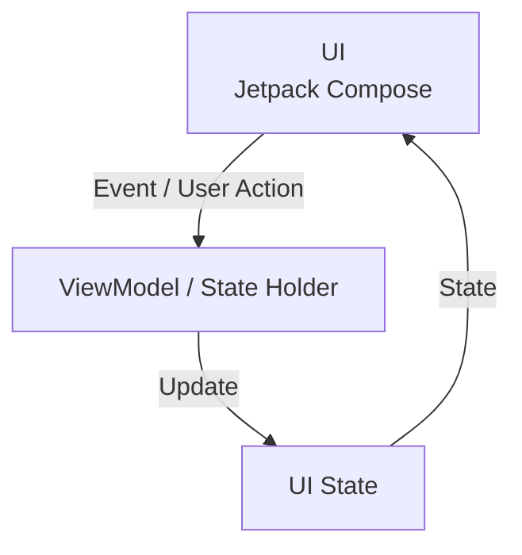

Ví dụ:

```text
User nhấn "Refresh"
        │
        ▼
onRefresh()
        │
        ▼
ViewModel
        │
        ▼
Repository.loadArticles()
        │
        ▼
UiState.Loading
        │
        ▼
UiState.Success(...)
        │
        ▼
Compose render danh sách mới
```

---

## 3.2. State đi xuống

Giả sử màn hình đang có:

```kotlin
data class ProfileUiState(
    val username: String = "",
    val isLoading: Boolean = false,
    val errorMessage: String? = null
)
```

`ViewModel` giữ state:

```text
ProfileViewModel
       │
       │ ProfileUiState
       ▼
ProfileScreen
       │
       ▼
Text / Button / ProgressIndicator
```

UI chỉ đọc state để quyết định:

* Hiện tên nào.
* Hiện loading hay không.
* Có hiện error hay không.
* Button có enable hay không.

---

## 3.3. Event đi lên

Người dùng có thể:

```text
Tap Refresh
Tap Save
Type text
Select item
Delete item
Retry
```

Các thao tác này trở thành event hoặc lời gọi hàm:

```text
UI
│
├── onRefresh()
├── onSave()
├── onSearchQueryChanged()
└── onRetry()
       │
       ▼
   ViewModel
```

UI không trực tiếp gọi database hay API.

---

# 4. Các thành phần chính của UDF

## 4.1. UI

UI có nhiệm vụ:

* Render state.
* Nhận input từ người dùng.
* Chuyển input thành event/action.
* Thực hiện UI logic đơn giản như scroll, focus hoặc animation.

Ví dụ:

```kotlin
Button(
    onClick = onRetry
) {
    Text("Thử lại")
}
```

Button không cần biết:

* API nào được gọi.
* Repository nào được sử dụng.
* Có cache hay không.
* Retry hoạt động như thế nào.

---

## 4.2. State

**State** mô tả UI **đang ở trạng thái nào tại thời điểm hiện tại**.

Ví dụ màn hình tải danh sách:

```kotlin
sealed interface ArticlesUiState {

    data object Loading : ArticlesUiState

    data class Success(
        val articles: List<Article>
    ) : ArticlesUiState

    data class Error(
        val message: String
    ) : ArticlesUiState
}
```

Các state này loại trừ nhau:

```text
Loading
   │
   ├── success ─────► Success
   │
   └── failure ─────► Error
                         │
                         └── Retry ─► Loading
```

Android hiện cũng khuyến nghị ViewModel expose UI state, thường bằng `StateFlow`; một `UiState` có thể dùng data class hoặc sealed hierarchy tùy các state có độc lập hay loại trừ nhau. ([Android Developers][1])

---

# 5. State và Event khác nhau như thế nào?

Đây là phần rất quan trọng khi học UDF.

| State                          | Event                         |
| ------------------------------ | ----------------------------- |
| Tồn tại tại một thời điểm      | Xảy ra tại một thời điểm      |
| UI có thể đọc lại              | Thường mang tính tức thời     |
| Là output của state production | Là input của state production |
| `Loading`                      | User nhấn Refresh             |
| `Error("Network error")`       | Request thất bại              |
| `query = "Android"`            | User nhập `"Android"`         |
| `isBookmarked = true`          | User nhấn Bookmark            |

Android mô tả ngắn gọn rằng **state luôn tồn tại, còn event xảy ra và làm state thay đổi**. ([Android Developers][3])

Ví dụ:

```text
EVENT
User clicks Bookmark
       │
       ▼
ViewModel xử lý
       │
       ▼
STATE
isBookmarked = true
```

---

# 6. UDF trong kiến trúc Android

Một màn hình thực tế thường không chỉ có:

```text
UI ↔ ViewModel
```

Mà có thể gồm:

```text
UI
↓ ↑
ViewModel
↓ ↑
Use Case
↓ ↑
Repository
↓ ↑
API / Room / DataStore
```

### Hình minh họa: UDF giữa UI layer và Data layer


*Nguồn: Android Developers - UI Layer.*

Android khuyến nghị UI hoặc `ViewModel` không truy cập trực tiếp data source như database, DataStore, Firebase API hay network provider; data nên được expose thông qua repository. ([Android Developers][1])

---

## 6.1. Luồng hoàn chỉnh

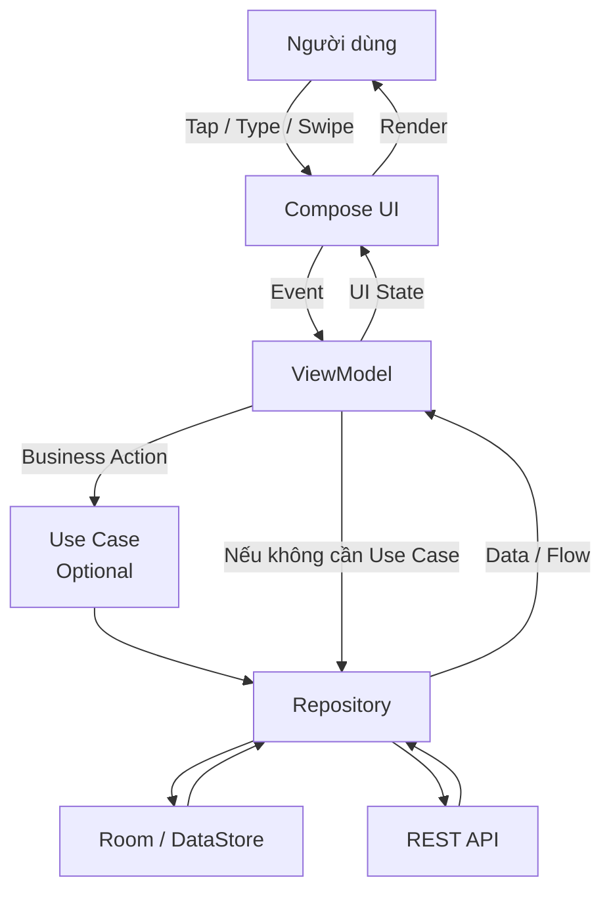

Domain/use-case layer là **tùy chọn**, phù hợp khi business logic phức tạp hoặc cần tái sử dụng giữa nhiều ViewModel. ([Android Developers][1])

---

# 7. Ví dụ thực tế: Bookmark bài viết

Một ví dụ rất trực quan:

```text
User
 │
 │ Tap bookmark
 ▼
UI
 │
 │ Event
 ▼
ViewModel
 │
 │ bookmarkArticle()
 ▼
Repository
 │
 │ Save
 ▼
Database
 │
 │ New application data
 ▼
Repository
 │
 ▼
ViewModel
 │
 │ New UiState
 ▼
UI
```

### Hình minh họa


*Nguồn: Android Developers - UI Layer.*

Luồng trong hình có thể hiểu là:

```text
0. Data layer đang có Article A: bookmarked = false

1. ViewModel tạo UI state
               ↓
2. User nhấn Bookmark
               ↓
3. ViewModel yêu cầu data layer thay đổi dữ liệu
               ↓
4. Repository lưu thay đổi
               ↓
5. Data mới quay trở lại ViewModel
               ↓
6. ViewModel tạo UI state mới
               ↓
7. UI render bookmarked = true
```

Đây chính là **một vòng UDF hoàn chỉnh**. ([Android Developers][4])

---

# 8. UDF với Jetpack Compose

Compose rất phù hợp với UDF vì Composable có thể:

```text
Nhận State
   ↓
Render UI
   ↓
Phát Event
```

Android mô tả Compose UI là immutable theo cách tiếp cận này: khi state thay đổi, Compose tái tạo các phần UI cần thiết thay vì bạn imperative "sửa" View đang tồn tại. ([Android Developers][2])

---

## 8.1. Stateful và Stateless Composable

### Stateful

```kotlin
@Composable
fun SearchBox() {

    var query by remember {
        mutableStateOf("")
    }

    TextField(
        value = query,
        onValueChange = {
            query = it
        }
    )
}
```

Component tự giữ state.

---

### Stateless

```kotlin
@Composable
fun SearchBox(
    query: String,
    onQueryChange: (String) -> Unit
) {

    TextField(
        value = query,
        onValueChange = onQueryChange
    )
}
```

Luồng:

```text
query
 ↓
SearchBox
 ↓
User nhập text
 ↓
onQueryChange()
 ↑
```

Cách thứ hai dễ:

* Preview.
* Unit/UI testing.
* Reuse.
* Hoist state.
* Kết nối ViewModel.

State hoisting nên giữ state ở nơi thấp nhất có thể nhưng đủ cao để tất cả component cần đọc hoặc thay đổi nó cùng truy cập được; khi business logic cần state, screen-level `ViewModel` thường là lựa chọn phù hợp. ([Android Developers][5])

---

# 9. Ví dụ hoàn chỉnh: Article Screen

Giả sử cần xây dựng màn hình:

```text
┌───────────────────────────┐
│        Articles           │
├───────────────────────────┤
│ Kotlin Coroutines         │
│ Android Architecture      │
│ Jetpack Compose           │
│                           │
│          Refresh          │
└───────────────────────────┘
```

Ứng dụng cần:

* Load dữ liệu bất đồng bộ.
* Hiện Loading.
* Hiện danh sách.
* Hiện Error.
* Cho phép Retry.
* Không block main thread.

---

## 9.1. UI State

```kotlin
sealed interface ArticlesUiState {

    data object Loading : ArticlesUiState

    data class Success(
        val articles: List<Article>
    ) : ArticlesUiState

    data class Error(
        val message: String
    ) : ArticlesUiState
}
```

---

## 9.2. Repository

```kotlin
interface ArticlesRepository {

    suspend fun loadArticles(): List<Article>
}
```

Ví dụ implementation với blocking I/O:

```kotlin
class ArticlesRepositoryImpl(
    private val api: ArticlesApi,
    private val ioDispatcher: CoroutineDispatcher
) : ArticlesRepository {

    override suspend fun loadArticles(): List<Article> =
        withContext(ioDispatcher) {
            api.getArticles()
        }
}
```

Một nguyên tắc coroutine quan trọng của Android là **suspend function nên main-safe**: class thực hiện blocking work phải chịu trách nhiệm chuyển công việc khỏi Main dispatcher. Android cũng khuyến nghị inject dispatcher để code dễ test hơn. ([Android Developers][6])

---

# 10. ViewModel quản lý state

```kotlin
class ArticlesViewModel(
    private val repository: ArticlesRepository
) : ViewModel() {

    private val _uiState =
        MutableStateFlow<ArticlesUiState>(
            ArticlesUiState.Loading
        )

    val uiState: StateFlow<ArticlesUiState> =
        _uiState.asStateFlow()

    init {
        loadArticles()
    }

    fun loadArticles() {

        viewModelScope.launch {

            _uiState.value =
                ArticlesUiState.Loading

            try {

                val articles =
                    repository.loadArticles()

                _uiState.value =
                    ArticlesUiState.Success(
                        articles = articles
                    )

            } catch (e: IOException) {

                _uiState.value =
                    ArticlesUiState.Error(
                        message = "Không thể tải dữ liệu"
                    )
            }
        }
    }

    fun retry() {
        loadArticles()
    }
}
```

Ở đây có một chiều rất rõ:

```text
UI
 │
 │ retry()
 ▼
ViewModel
 │
 │ repository.loadArticles()
 ▼
Repository
 │
 ▼
Data
 │
 ▼
ViewModel
 │
 │ ArticlesUiState
 ▼
UI
```

Android khuyến nghị để ViewModel tạo coroutine cho business logic và expose observable state thay vì để UI trực tiếp điều khiển coroutine cho business operation. ([Android Developers][6])

---

# 11. Compose nhận state

```kotlin
@Composable
fun ArticlesRoute(
    viewModel: ArticlesViewModel
) {

    val uiState by
        viewModel.uiState
            .collectAsStateWithLifecycle()

    ArticlesScreen(
        uiState = uiState,
        onRetry = viewModel::retry
    )
}
```

`collectAsStateWithLifecycle()` là cách Android hiện khuyến nghị để Compose collect UI state theo lifecycle. ([Android Developers][1])

---

## 11.1. Render state

```kotlin
@Composable
fun ArticlesScreen(
    uiState: ArticlesUiState,
    onRetry: () -> Unit
) {

    when (uiState) {

        ArticlesUiState.Loading -> {

            CircularProgressIndicator()
        }

        is ArticlesUiState.Success -> {

            LazyColumn {

                items(uiState.articles) { article ->

                    Text(
                        text = article.title
                    )
                }
            }
        }

        is ArticlesUiState.Error -> {

            Column {

                Text(
                    text = uiState.message
                )

                Button(
                    onClick = onRetry
                ) {
                    Text("Thử lại")
                }
            }
        }
    }
}
```

UI không biết:

```text
Retrofit?
Room?
Firebase?
Cache?
Dispatcher?
Retry implementation?
```

UI chỉ biết:

```text
State
+
Callback/Event
```

Đây là một trong những lợi ích lớn nhất của UDF.

---

# 12. State Machine của màn hình

Màn hình trên có thể biểu diễn như một state machine.

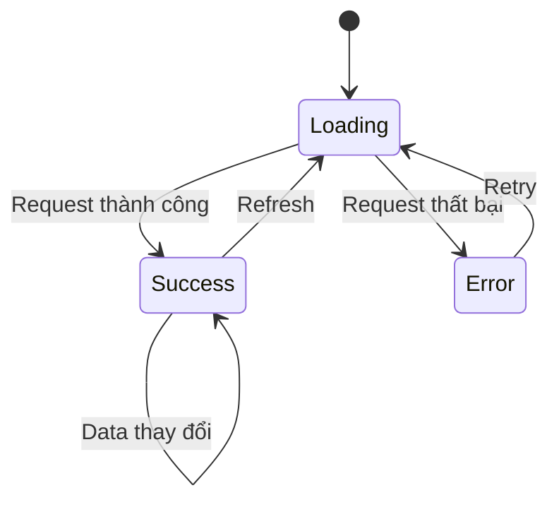

State machine giúp phát hiện các trường hợp khó hiểu như:

```text
isLoading = true
error != null
data != null
```

Nếu ba biến boolean/string độc lập không được quản lý tốt, UI có thể rơi vào trạng thái không hợp lệ.

Dùng sealed state:

```text
Loading
OR
Success
OR
Error
```

giúp mô hình hóa các state loại trừ nhau rõ hơn.

---

# 13. Async + UDF

UDF đặc biệt hữu ích với tác vụ async.

Ví dụ request API:

```text
Idle
 │
 │ Load
 ▼
Loading
 │
 ├──────── Success ───────► Content
 │
 └──────── Error ─────────► Error
                              │
                              │ Retry
                              ▼
                           Loading
```

Không nên nghĩ:

```text
Coroutine = architecture
```

Coroutine chỉ giải quyết:

```text
Asynchronous execution
Concurrency
Cancellation
```

Trong khi UDF giải quyết:

```text
Ai sở hữu state?
Ai thay đổi state?
UI nhận state như thế nào?
Event đi đâu?
```

Hai khái niệm bổ sung cho nhau.

---

# 14. Cancellation

Giả sử:

```text
ArticlesScreen
    │
    ▼
ArticlesViewModel
    │
    ▼
viewModelScope.launch
```

Coroutine trong `viewModelScope` được tự động cancel khi `ViewModel` bị clear. ([Android Developers][7])

```text
User mở screen
      │
      ▼
ViewModel created
      │
      ▼
Coroutine running
      │
      ▼
User rời destination
      │
      ▼
ViewModel cleared
      │
      ▼
Coroutine cancelled
```

Điều này phù hợp khi công việc **chỉ có ý nghĩa trong vòng đời của ViewModel**.

Android cũng lưu ý rằng nếu một operation cần tiếp tục ngay cả khi screen/ViewModel biến mất, công việc đó nên thuộc scope sống lâu hơn thay vì buộc vào `viewModelScope`. ([Android Developers][6])

---

# 15. Lifecycle và UDF

## 15.1. Rotate màn hình

Ví dụ:

```text
Portrait
   │
   │ Rotate
   ▼
Landscape
```

Activity có thể bị recreate.

`ViewModel` được thiết kế để giữ screen-level state qua configuration change như xoay màn hình. ([Android Developers][8])

```text
Activity A
   │
   │ Configuration change
   ▼
Activity B
       ▲
       │
same ViewModel
```

Do đó state như:

```text
Loading
Article list
Search query
Selected filter
```

có thể tiếp tục được quản lý ở screen state holder thay vì bị buộc vào một Activity instance.

---

## 15.2. Process death

Cần phân biệt:

```text
Configuration change
        ≠
Process death
```

`ViewModel` **không sống qua system-initiated process death**. Với state nhỏ cần tái tạo màn hình, có thể dùng `SavedStateHandle`; application data quan trọng thường nên được lưu ở persistence/data layer. ([Android Developers][9])

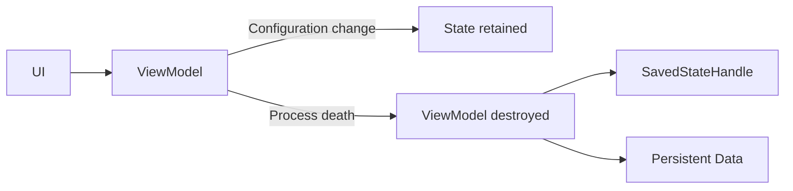

---

# 16. State nên đặt ở đâu?

Không phải state nào cũng phải đưa vào ViewModel.

Ví dụ:

```kotlin
var isExpanded by rememberSaveable {
    mutableStateOf(false)
}
```

Nếu `isExpanded` chỉ phục vụ một UI component:

```text
UI element state
      │
      ▼
Composable
```

thì có thể giữ gần UI.

Nhưng:

```text
Search Query
     │
     ├── gọi repository
     ├── thay đổi kết quả
     └── business logic phụ thuộc
```

thì việc đưa state lên screen-level state holder có thể phù hợp hơn.

Android khuyến nghị hoist state lên **lowest common ancestor** cần đọc và ghi state, đồng thời giữ state gần nơi sử dụng nhất có thể. ([Android Developers][5])

---

# 17. State ownership

Một nguyên tắc hữu ích:

> **Một state nên có một owner rõ ràng.**

Không nên:

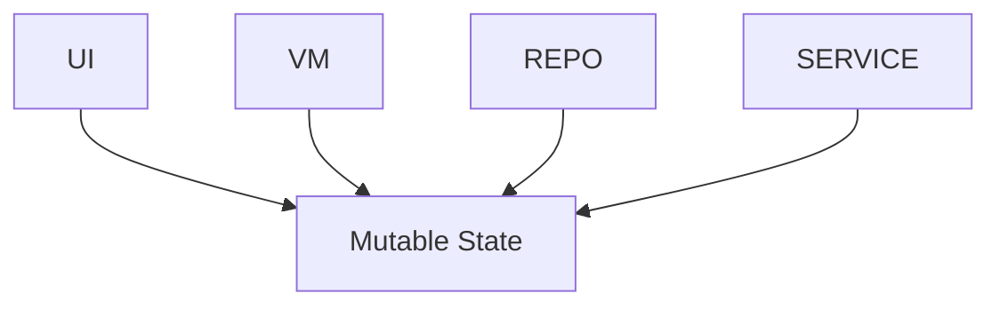

Vì khi xảy ra bug:

```text
isLoading = false
```

rất khó biết:

```text
Ai thay đổi?
Tại sao?
Khi nào?
```

Nên:

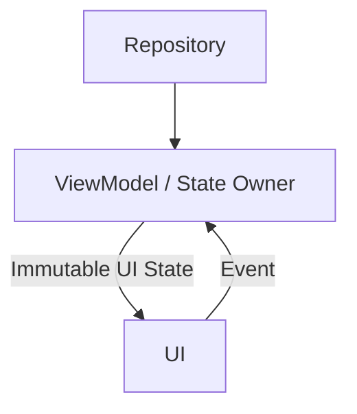

UDF giúp tập trung mutation và tạo single source of truth rõ ràng hơn, nhờ đó cải thiện consistency, testability và maintainability. ([Android Developers][4])

---

# 18. Không expose MutableStateFlow

### Không nên

```kotlin
class ProfileViewModel : ViewModel() {

    val uiState =
        MutableStateFlow(ProfileUiState())
}
```

UI có thể làm:

```kotlin
viewModel.uiState.value =
    ProfileUiState(...)
```

Khi đó UI có khả năng sửa state trực tiếp.

---

### Nên

```kotlin
class ProfileViewModel : ViewModel() {

    private val _uiState =
        MutableStateFlow(ProfileUiState())

    val uiState: StateFlow<ProfileUiState> =
        _uiState.asStateFlow()
}
```

```text
                    Write
                     ▲
                     │
                 ViewModel
                     │
                     │ Read only
                     ▼
                     UI
```

Android coroutine guidance cũng khuyến nghị expose immutable type thay vì mutable state để mutation được tập trung tại một nơi. ([Android Developers][6])

---

# 19. One-off event và một lỗi kiến trúc phổ biến

Một pattern cũ dễ gặp:

```text
ViewModel
   │
   └── emit ShowSnackbar event
             │
             ▼
             UI
```

Vấn đề:

```text
Event được emit
       │
       ▼
UI đang STOPPED
       │
       ▼
Event không được xử lý
```

Android Architecture guidance hiện khuyến nghị mạnh rằng `ViewModel` không nên gửi event ngược sang UI theo kiểu one-off event; thay vào đó, xử lý input event và biểu diễn kết quả cần thiết dưới dạng state mà UI có thể quan sát. ([Android Developers][1])

Ví dụ thay vì:

```text
LoginSuccessEvent
```

có thể có:

```kotlin
data class LoginUiState(
    val isLoggedIn: Boolean = false,
    val isLoading: Boolean = false,
    val errorMessage: String? = null
)
```

Sau login:

```text
isLoggedIn = true
```

UI đọc state và thực hiện UI behavior phù hợp.

---

# 20. UDF không có nghĩa là phải tạo một `Event` class khổng lồ

Có thể gặp implementation như:

```kotlin
sealed interface ProfileEvent {

    data object Refresh : ProfileEvent

    data object Save : ProfileEvent

    data class ChangeName(
        val name: String
    ) : ProfileEvent
}
```

và:

```kotlin
fun onEvent(
    event: ProfileEvent
)
```

Cách này **có thể dùng**, đặc biệt với MVI/reducer architecture.

Nhưng UDF không bắt buộc phải như vậy.

Một ViewModel đơn giản hoàn toàn có thể dùng:

```kotlin
fun refresh()

fun save()

fun changeName(
    value: String
)
```

Điều quan trọng là:

```text
Event
 ↓
State Owner
 ↓
State Mutation
 ↓
State
 ↓
UI
```

chứ không phải số lượng interface hoặc sealed class.

Android hiện mô tả phổ biến UDF bằng việc ViewModel nhận action từ UI thông qua method call và expose observable state. ([Android Developers][1])

---

# 21. UDF và MVI

Hai khái niệm có liên quan nhưng không đồng nhất.

```text
UDF
│
├── State down
├── Event up
└── Single state ownership
```

MVI thường xây thêm:

```text
Intent
 ↓
Reducer / Processor
 ↓
State
 ↓
View
```

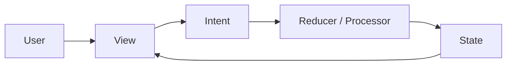

Có thể xem:

```text
UDF = nguyên tắc luồng dữ liệu

MVI = một kiến trúc/pattern có thể triển khai UDF rất chặt chẽ
```

Một app Android không cần triển khai full MVI mới có UDF.

---

# 22. UDF và MVVM

MVVM rất thường được kết hợp với UDF:

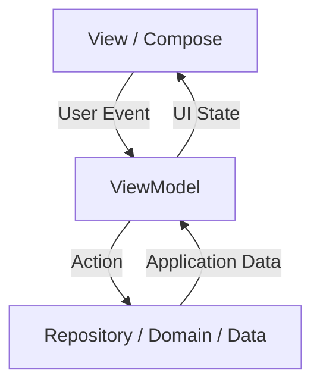

Ở đây:

```text
MVVM
+
StateFlow
+
State Hoisting
+
Events up
+
State down
```

tạo ra một implementation UDF quen thuộc trong Android.

---

# 23. Testing UDF

UDF làm testing thuận lợi vì có thể test:

```text
Input Event
     │
     ▼
ViewModel
     │
     ▼
Expected State
```

không nhất thiết phải render UI.

Android testing guidance cho Flow khuyến nghị có thể thay producer thật bằng fake dependency rồi kiểm tra các giá trị Flow được emit. ([Android Developers][10])

---

## 23.1. Test cases

Ví dụ:

```text
Given
Repository trả về articles

When
loadArticles()

Then
Loading
  ↓
Success
```

---

### Trường hợp lỗi

```text
Given
Repository throw IOException

When
loadArticles()

Then
Loading
  ↓
Error
```

---

### Retry

```text
Initial:
Error

User:
Retry

Expected:
Error
 ↓
Loading
 ↓
Success
```

---

# 24. Fake Repository

```kotlin
class FakeArticlesRepository(
    private val result: Result<List<Article>>
) : ArticlesRepository {

    override suspend fun loadArticles(): List<Article> {
        return result.getOrThrow()
    }
}
```

Có thể test:

```text
Fake Success Repository
        │
        ▼
ViewModel
        │
        ▼
Success State
```

và:

```text
Fake Error Repository
       │
       ▼
ViewModel
       │
       ▼
Error State
```

Không cần API thật.

---

# 25. Debugging UDF

Một lợi ích thực tế của UDF là bạn có thể log state transition.

```text
ArticlesUiState.Loading
        ↓
ArticlesUiState.Success
```

hoặc:

```text
LoginUiState.Idle
      ↓
LoginUiState.Loading
      ↓
LoginUiState.Error
```

Ví dụ log:

```kotlin
Log.d(
    "ArticlesViewModel",
    "State: Loading -> Success"
)
```

Khi production, tránh log:

```text
Password
Token
Personal information
Payment data
```

---

## 25.1. Debug bằng state timeline

```text
10:31:01  Screen opened
10:31:01  Loading
10:31:02  Request started
10:31:03  IOException
10:31:03  Error
10:31:06  Retry clicked
10:31:06  Loading
10:31:08  Success
```

Timeline kiểu này giúp debug tốt hơn so với việc state có thể bị mutate từ nhiều nơi không rõ nguồn gốc.

---

# 26. Các lỗi thường gặp

## 26.1. UI gọi Repository trực tiếp

### Không nên

```text
Composable
    │
    ▼
Repository
    │
    ▼
API
```

Ví dụ:

```kotlin
Button(
    onClick = {
        repository.loadArticles()
    }
)
```

UI đang biết quá nhiều về data layer.

---

### Nên

```text
Composable
    │ Event
    ▼
ViewModel
    │
    ▼
Repository
```

---

## 26.2. Mutable state có nhiều owner

```text
Activity ─┐
Fragment ─┼──► Mutable State
ViewModel ┤
Service ──┘
```

Kết quả:

```text
Who changed it?
```

không rõ.

---

## 26.3. Duplicate state

Ví dụ:

```kotlin
var articleCount = 10

var articles = listOf(...)
```

Nếu:

```text
articles.size = 9
articleCount = 10
```

state mâu thuẫn.

Tốt hơn:

```kotlin
val articleCount
    get() = articles.size
```

hoặc derive khi tạo `UiState`.

---

# 27. Derived State

Không phải dữ liệu nào cũng cần lưu thành state riêng.

Ví dụ:

```kotlin
data class CartUiState(
    val products: List<CartProduct>
) {

    val totalPrice: Long
        get() = products.sumOf {
            it.price * it.quantity
        }
}
```

Luồng:

```text
products
   │
   ▼
derive totalPrice
   │
   ▼
UI
```

Thay vì:

```text
products state
+
totalPrice state
```

rồi phải luôn đồng bộ hai giá trị.

---

# 28. Single Source of Truth

UDF thường đi cùng nguyên tắc:

**Single Source of Truth — SSOT**

Ví dụ bookmark:

```text
Database
   │
   ▼
Repository
   │
   ▼
ViewModel
   │
   ▼
UI
```

Không nên:

```text
Database bookmark = true

ViewModel bookmark = false

Composable bookmark = true
```

Ba nguồn state khác nhau rất dễ gây bug.

Android architecture guidance nhấn mạnh UI được drive từ data model và layered architecture tuân theo cả single-source-of-truth lẫn UDF principles. ([Android Developers][1])

---

# 29. Khi nào nên dùng UDF?

UDF đặc biệt hữu ích khi màn hình có:

* Network request.
* Database.
* Loading state.
* Error state.
* Retry.
* Search.
* Filters.
* Pagination.
* Authentication.
* Cart.
* Checkout.
* Form validation.
* Offline cache.
* User settings.
* Navigation phụ thuộc business state.

Ví dụ:

```text
Login Screen
    │
    ├── username
    ├── password
    ├── loading
    ├── error
    ├── validation
    └── authentication result
```

Nếu tất cả state được mutate ở nhiều nơi, màn hình nhanh chóng khó kiểm soát.

---

# 30. Khi nào không cần làm UDF quá phức tạp?

Một UI rất đơn giản:

```kotlin
@Composable
fun ExpandableText(
    text: String
) {

    var expanded by rememberSaveable {
        mutableStateOf(false)
    }

    Text(
        text = text,
        modifier = Modifier.clickable {
            expanded = !expanded
        }
    )
}
```

không nhất thiết phải tạo:

```text
ExpandableTextViewModel
ExpandableTextRepository
ToggleExpandedUseCase
ExpandableTextReducer
ExpandableTextEventProcessor
```

Android cũng lưu ý state holder không bắt buộc cho mọi UI; logic đơn giản có thể nằm trực tiếp gần presentation code. ([Android Developers][11])

Mục tiêu của architecture là:

> **giảm complexity**, không phải tạo thêm complexity.

---

# 31. Thực hành

## Mini Project: UDF Article Browser

Tạo app gồm:

```text
ArticleScreen
       │
       ├── Loading
       ├── Article List
       ├── Error
       ├── Refresh
       └── Retry
```

Cấu trúc:

```text
app/
│
├── data/
│   ├── ArticlesRepository.kt
│   └── ArticlesRepositoryImpl.kt
│
└── ui/
    └── articles/
        ├── ArticlesScreen.kt
        ├── ArticlesUiState.kt
        └── ArticlesViewModel.kt
```

---

## Yêu cầu 1 - UI State

Tạo:

```text
Loading
Success
Error
```

---

## Yêu cầu 2 - StateFlow

Expose:

```kotlin
val uiState: StateFlow<ArticlesUiState>
```

không expose:

```kotlin
MutableStateFlow
```

ra UI.

---

## Yêu cầu 3 - Async

Load data bằng:

```kotlin
viewModelScope.launch
```

Tác vụ blocking phải được chuyển khỏi main thread ở layer chịu trách nhiệm thực hiện tác vụ. ([Android Developers][6])

---

## Yêu cầu 4 - Lifecycle

Compose collect:

```kotlin
collectAsStateWithLifecycle()
```

---

## Yêu cầu 5 - Retry

```text
Error
 │
 │ Retry
 ▼
Loading
 │
 ▼
Success
```

---

## Yêu cầu 6 - Logging

Log:

```text
Loading -> Success

Loading -> Error

Error -> Loading
```

---

# 32. Bài tập

## Bài tập chính

Refactor một màn hình hiện tại từ:

```text
Composable
    │
    ├── API
    ├── Mutable variables
    ├── Database
    └── Business logic
```

thành:

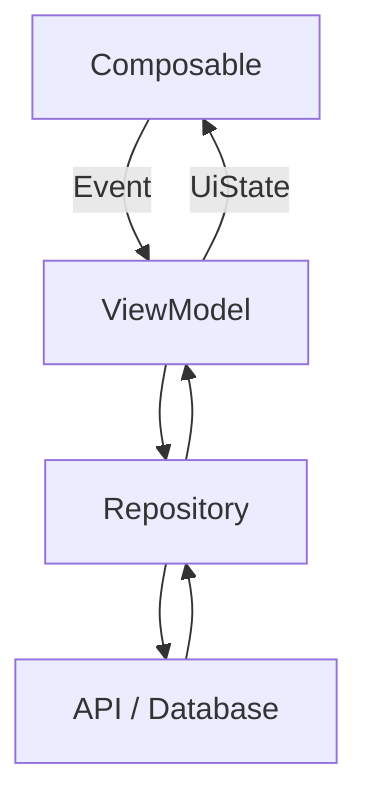

Sau đó giải thích:

1. Ai sở hữu state?
2. State đi theo hướng nào?
3. Event đi theo hướng nào?
4. Business logic ở đâu?
5. Async operation được chạy ở đâu?
6. Khi request lỗi thì state nào xuất hiện?
7. Retry hoạt động như thế nào?
8. Khi rotate màn hình điều gì xảy ra?
9. Khi process bị kill thì state nào cần restore?
10. Unit test sẽ fake dependency nào?

---

# 33. Artifact cho portfolio

Một artifact tốt có thể gồm:

```text
udf-demo/
│
├── README.md
├── screenshots/
│   ├── loading.png
│   ├── success.png
│   └── error.png
│
├── diagrams/
│   └── udf-flow.md
│
└── app/
```

README nên giải thích:

```markdown
## Architecture

The screen follows Unidirectional Data Flow:

UI Event
→ ViewModel
→ Repository
→ State Update
→ UI

The ViewModel is the screen state holder and exposes
immutable UI state through StateFlow.
```

Kèm sơ đồ:

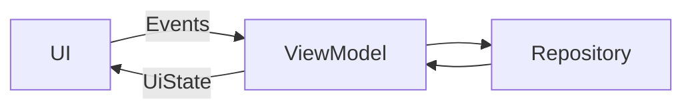

---

# 34. Checklist hoàn thành

## Kiến thức

* [ ] Giải thích được UDF.
* [ ] Hiểu **State down - Events up**.
* [ ] Phân biệt được State và Event.
* [ ] Biết State Holder là gì.
* [ ] Hiểu Single Source of Truth.
* [ ] Biết UDF khác MVI như thế nào.

## Android

* [ ] Biết dùng `ViewModel`.
* [ ] Biết dùng `StateFlow`.
* [ ] Không expose `MutableStateFlow` cho UI.
* [ ] Biết dùng `collectAsStateWithLifecycle()`.
* [ ] Biết `viewModelScope`.
* [ ] Biết xử lý Loading / Success / Error.
* [ ] Biết retry.
* [ ] Biết cancellation.

## Lifecycle

* [ ] Hiểu configuration change.
* [ ] Hiểu ViewModel giữ state qua Activity recreation.
* [ ] Hiểu ViewModel không sống qua process death.
* [ ] Biết khi nào dùng `SavedStateHandle`.
* [ ] Phân biệt screen state và local UI state.

## Quality

* [ ] Có Fake Repository.
* [ ] Test được state transition.
* [ ] Log được state transition.
* [ ] Không log dữ liệu nhạy cảm.
* [ ] UI không gọi trực tiếp database/API.

## Portfolio

* [ ] Có demo chạy được.
* [ ] Có README.
* [ ] Có sơ đồ UDF.
* [ ] Có ảnh Loading.
* [ ] Có ảnh Success.
* [ ] Có ảnh Error.
* [ ] Có ít nhất một unit test.

---

# 35. Ghi chú production

Khi đưa UDF vào production, nên kiểm tra toàn bộ vòng đời của một state:

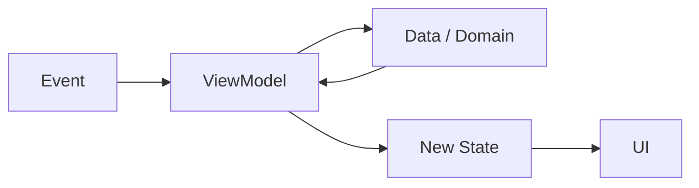

Đặt các câu hỏi:

### State

* Ai sở hữu state?
* Có bao nhiêu source of truth?
* Có state nào đang bị duplicate?
* Có state combination nào không hợp lệ?

### Lifecycle

* Rotate có mất state không?
* Rời screen có cần cancel request không?
* Process death có cần restore dữ liệu gì?
* State nào thuộc `ViewModel`?
* State nào chỉ nên dùng `rememberSaveable`?

### Async

* Có blocking main thread không?
* Coroutine thuộc scope nào?
* Cancellation có hoạt động không?
* Exception có được xử lý không?
* Retry có tạo request trùng không?

### Testing

* Có Fake Repository không?
* Có test Loading → Success không?
* Có test Loading → Error không?
* Có test Retry không?
* Có test state restoration nếu cần không?

### UX

* Loading có rõ ràng không?
* Khi network lỗi user làm gì tiếp?
* Retry có dễ tìm không?
* Dữ liệu cũ có nên tiếp tục hiển thị trong lúc refresh không?

---

# 36. Mental Model

Khi quên UDF, chỉ cần nhớ sơ đồ này:

```text
             ┌──────────────────────────┐
             │                          │
             │          STATE           │
             │                          │
             └────────────┬─────────────┘
                          │
                          │ State down
                          ▼
             ┌──────────────────────────┐
             │                          │
             │            UI            │
             │                          │
             └────────────┬─────────────┘
                          │
                          │ Event up
                          ▼
             ┌──────────────────────────┐
             │                          │
             │     STATE HOLDER         │
             │       ViewModel          │
             │                          │
             └────────────┬─────────────┘
                          │
                          │ Business action
                          ▼
             ┌──────────────────────────┐
             │ Repository / Use Case    │
             └────────────┬─────────────┘
                          │
                          ▼
                     Data Source
```

Hay rút gọn thành:

```text
USER ACTION
     ↓
   EVENT
     ↓
 VIEWMODEL
     ↓
 BUSINESS LOGIC
     ↓
 NEW STATE
     ↓
     UI
     ↓
 USER SEES RESULT
```

---

# 37. Kết luận

**Unidirectional Data Flow** không chỉ là một pattern để tổ chức code. Nó tạo ra một quy tắc rõ ràng cho việc dữ liệu thay đổi trong ứng dụng:

```text
Events go up
     ↑
     UI
     ↓
State goes down
```

Trong Android hiện đại, một implementation phổ biến là:

```text
Jetpack Compose
       │
       │ Event
       ▼
ViewModel
       │
       ▼
Repository / Use Case
       │
       ▼
Data Layer
       │
       ▼
ViewModel
       │
       │ StateFlow<UiState>
       ▼
Jetpack Compose
```

Android hiện khuyến nghị mạnh UDF cho UI layer, cùng với screen-level `ViewModel`, lifecycle-aware state collection, coroutines/Flow và việc expose UI state thay vì cho UI trực tiếp thao tác data source. ([Android Developers][1])

Mục tiêu cuối cùng không phải là có thật nhiều class, mà là khi xảy ra một bug bạn có thể trả lời rất nhanh:

```text
Event nào xảy ra?
        ↓
Ai xử lý event?
        ↓
State nào đã thay đổi?
        ↓
Tại sao UI render như vậy?
```

Nếu bốn câu hỏi này có câu trả lời rõ ràng, kiến trúc UDF của màn hình đang đi đúng hướng.

---

## Tài liệu và hình minh họa chính thức

* [Android Developers - Compose UI Architecture](https://developer.android.com/develop/ui/compose/architecture) ([Android Developers][2])
* [Android Developers - UI Layer](https://developer.android.com/topic/architecture/ui-layer) ([Android Developers][4])
* [Android Developers - Where to hoist state](https://developer.android.com/develop/ui/compose/state-hoisting) ([Android Developers][5])
* [Android Developers - Architecture recommendations](https://developer.android.com/topic/architecture/recommendations) ([Android Developers][1])
* [Android Developers - UI State production](https://developer.android.com/topic/architecture/ui-layer/state-production) ([Android Developers][3])
* [Android Developers - Saving UI state](https://developer.android.com/topic/libraries/architecture/saving-states) ([Android Developers][9])
* [Android Developers - Coroutines best practices](https://developer.android.com/kotlin/coroutines/coroutines-best-practices) ([Android Developers][6])
* [Android Developers - Testing Kotlin Flow](https://developer.android.com/kotlin/flow/test) ([Android Developers][10])

[1]: https://developer.android.com/topic/architecture/recommendations "Recommendations for Android architecture  |  App architecture  |  Android Developers"
[2]: https://developer.android.com/develop/ui/compose/architecture "Compose UI Architecture  |  Jetpack Compose  |  Android Developers"
[3]: https://developer.android.com/topic/architecture/ui-layer/state-production?utm_source=chatgpt.com "UI State production | App architecture"
[4]: https://developer.android.com/topic/architecture/ui-layer "UI layer  |  App architecture  |  Android Developers"
[5]: https://developer.android.com/develop/ui/compose/state-hoisting "Where to hoist state  |  Jetpack Compose  |  Android Developers"
[6]: https://developer.android.com/kotlin/coroutines/coroutines-best-practices?authuser=19&hl=en&utm_source=chatgpt.com "Best practices for coroutines in Android  |  Kotlin  |  Android Developers"
[7]: https://developer.android.com/topic/libraries/architecture/views/coroutines-views?utm_source=chatgpt.com "Use Kotlin coroutines with lifecycle-aware components (Views)  |  Android Developers"
[8]: https://developer.android.com/topic/libraries/architecture/viewmodel?utm_source=chatgpt.com "ViewModel overview | App architecture"
[9]: https://developer.android.com/topic/libraries/architecture/saving-states?utm_source=chatgpt.com "Save UI states | App architecture"
[10]: https://developer.android.com/kotlin/flow/test?utm_source=chatgpt.com "Testing Kotlin flows on Android"
[11]: https://developer.android.com/topic/architecture/ui-layer/stateholders?utm_source=chatgpt.com "State holders and UI state | App architecture"
