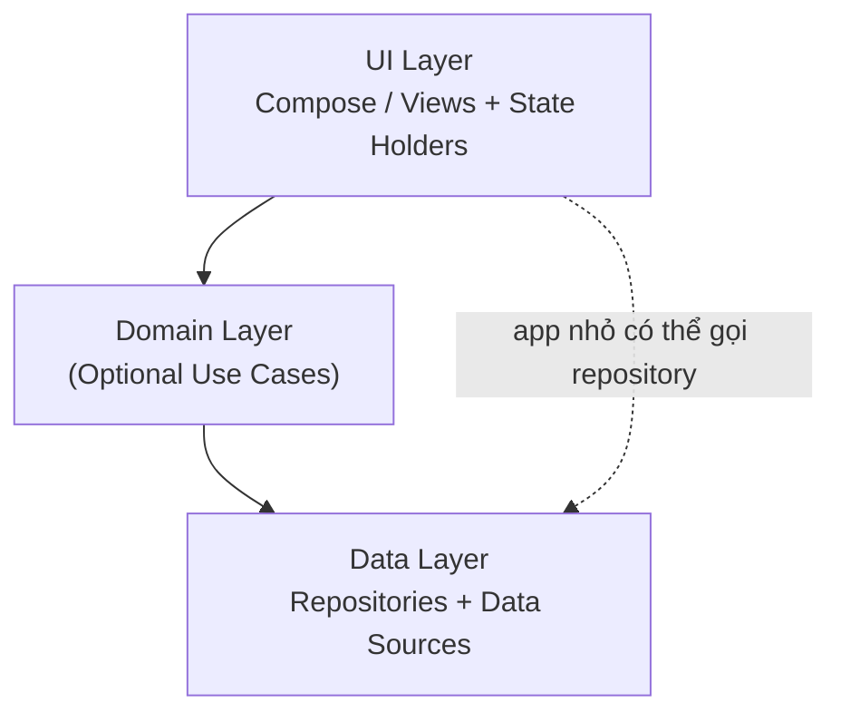
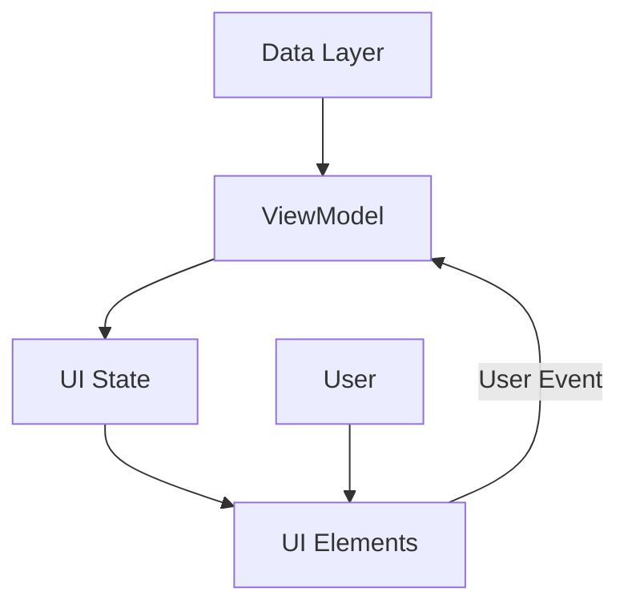
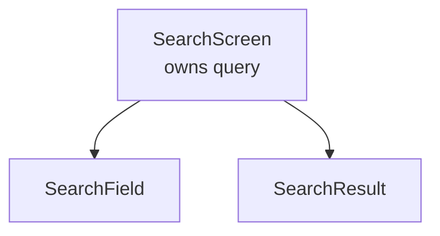
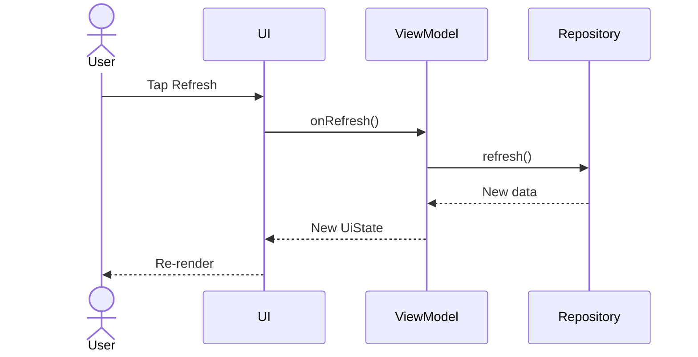
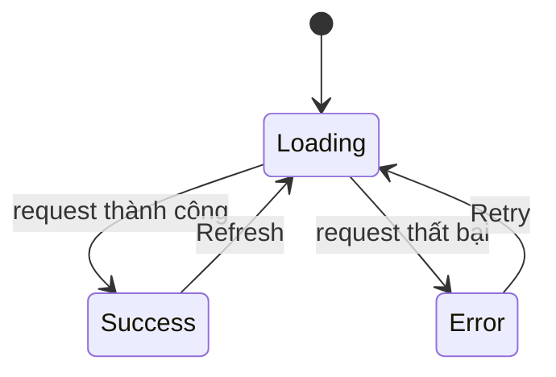
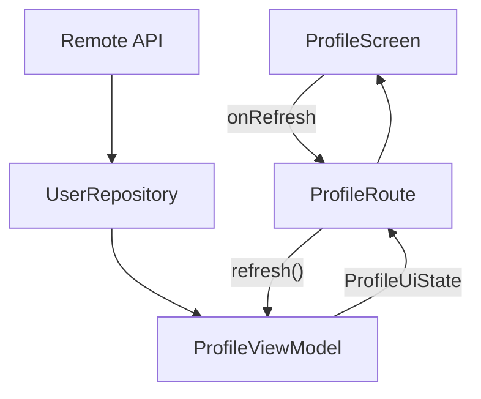
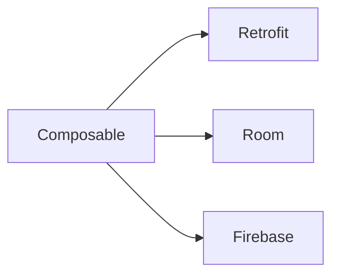
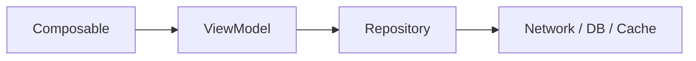

# 006 - UI Layer

| Metadata                | Nội dung                                         |
| ----------------------- | ------------------------------------------------ |
| **Học phần**            | 03 - Architecture, State and Data                |
| **Module**              | Module 05 - Design and Architecture              |
| **Nhóm nội dung**       | Architectural Patterns                           |
| **Nguồn roadmap**       | Design and Architecture / Architectural Patterns |
| **Loại bài**            | UI / Architecture                                |
| **Thứ tự trong module** | 006                                              |
| **Thời lượng gợi ý**    | 30-45 phút                                       |

---

## 1. Tóm tắt

**UI Layer** là tầng chịu trách nhiệm biến trạng thái của ứng dụng thành những gì người dùng nhìn thấy trên màn hình, đồng thời tiếp nhận các thao tác của người dùng như nhấn nút, nhập văn bản, kéo danh sách hoặc chọn một mục.

Trong kiến trúc Android hiện đại, UI Layer thường gồm hai thành phần lớn:

* **UI Elements**: `Composable`, `Activity`, `Fragment`, `View`...
* **State Holders**: `ViewModel` hoặc các class quản lý UI state/UI logic.

UI Layer không nên tự truy cập trực tiếp database, Retrofit API, Firebase hoặc các data source khác. Thay vào đó, dữ liệu thường đi qua `Repository`, có thể qua `UseCase`, rồi được chuyển thành **UI State** trước khi hiển thị.


*Nguồn ảnh: Android Developers - App Architecture / UI Layer.*

Một cách nhìn đơn giản:

```text
Data Layer
    ↓
Domain Layer (optional)
    ↓
ViewModel / State Holder
    ↓
UI State
    ↓
Compose / Views
    ↓
Người dùng
```

---

## 2. Mục tiêu học tập

Sau bài này, bạn có thể:

* Giải thích được vai trò của **UI Layer** trong kiến trúc Android.
* Phân biệt:

  * UI Elements
  * UI State
  * UI Logic
  * Business Logic
  * State Holder
* Hiểu cách `ViewModel` kết nối Data Layer với màn hình.
* Hiểu **Unidirectional Data Flow - UDF**.
* Biết khi nào state nên nằm trong:

  * `Composable`
  * plain state holder
  * `ViewModel`
* Sử dụng `StateFlow` để expose trạng thái màn hình.
* Thu thập state trong Compose bằng `collectAsStateWithLifecycle()`.
* Biết cách xử lý:

  * loading
  * success
  * error
  * user events
  * configuration change
  * process recreation
* Tách UI khỏi data access để tăng khả năng test và maintain.
* Xây dựng được một màn hình Compose nhỏ theo kiến trúc UI Layer chuẩn.

---

## 3. UI Layer nằm ở đâu trong kiến trúc Android?

Một ứng dụng Android có thể được hình dung theo ba tầng:



### Trách nhiệm từng tầng

| Layer            | Trách nhiệm chính                             |
| ---------------- | --------------------------------------------- |
| **UI Layer**     | Hiển thị dữ liệu và nhận tương tác người dùng |
| **Domain Layer** | Business logic phức tạp hoặc được tái sử dụng |
| **Data Layer**   | Quản lý dữ liệu và truy cập data source       |

Ví dụ:

```text
ProfileScreen
      ↓
ProfileViewModel
      ↓
GetProfileUseCase
      ↓
UserRepository
      ↓
Retrofit / Room
```

Hoặc trong app nhỏ:

```text
ProfileScreen
      ↓
ProfileViewModel
      ↓
UserRepository
      ↓
Retrofit
```

### Nguyên tắc quan trọng

UI không nên làm như sau:

```kotlin
@Composable
fun ProfileScreen() {
    val response = retrofitService.getUser()
}
```

UI đang phụ thuộc trực tiếp vào network layer.

Nên tách thành:

```text
Compose
   ↓
ViewModel
   ↓
Repository
   ↓
Network / Database
```

Nhờ vậy UI không cần biết dữ liệu đến từ:

* REST API
* Room
* Firebase
* cache
* file
* Bluetooth
* DataStore

---

## 4. Hai thành phần chính của UI Layer

Android Architecture có thể mô hình hóa UI Layer như:

```text
UI Layer
├── UI Elements
└── State Holders
```

### 4.1. UI Elements

UI Elements là những thành phần trực tiếp render giao diện.

Với Jetpack Compose:

```kotlin
@Composable
fun ProfileScreen() {
    // Render UI
}
```

Với Android Views:

```text
Activity
Fragment
RecyclerView
TextView
Button
...
```

UI Elements nên tập trung vào:

* đọc UI state;
* render giao diện;
* nhận input;
* gửi event;
* thực hiện UI logic đơn giản.

Không nên chứa quá nhiều business logic.

---

### 4.2. State Holders

State Holder là object chịu trách nhiệm quản lý state cho một phần UI.

Có thể là:

```text
State Holder
├── ViewModel
└── Plain Kotlin class
```

Ví dụ:

```kotlin
class ProfileViewModel : ViewModel()
```

Hoặc:

```kotlin
@Stable
class SearchBarState {
    // UI element state + UI logic
}
```

State holder nào phù hợp phụ thuộc vào:

* phạm vi của state;
* lifecycle;
* UI logic hay business logic;
* state có cần tồn tại qua Activity recreation hay không.


*Nguồn ảnh: Android Developers - State holders and UI state.*

---

## 5. UI State là gì?

**UI State** mô tả toàn bộ thông tin UI cần để render tại một thời điểm.

Có thể hiểu:

```text
UI Elements + UI State = UI mà người dùng nhìn thấy
```


*Nguồn ảnh: Android Developers.*

Ví dụ màn hình profile:

```kotlin
data class ProfileUiState(
    val isLoading: Boolean = false,
    val username: String = "",
    val email: String = "",
    val errorMessage: String? = null
)
```

UI có thể dựa hoàn toàn vào object này để quyết định hiển thị gì.

```text
ProfileUiState
│
├── isLoading = true
│      ↓
│   CircularProgressIndicator
│
├── errorMessage != null
│      ↓
│   Error UI
│
└── username + email
       ↓
    Profile Content
```

---

## 6. UI là hàm của State

Một mental model rất hữu ích:

```text
UI = f(State)
```

Ví dụ:

```kotlin
@Composable
fun ProfileContent(
    state: ProfileUiState
) {
    when {
        state.isLoading -> {
            CircularProgressIndicator()
        }

        state.errorMessage != null -> {
            Text(state.errorMessage)
        }

        else -> {
            Column {
                Text(state.username)
                Text(state.email)
            }
        }
    }
}
```

State thay đổi:

```text
State A
↓
UI A

State B
↓
UI B

State C
↓
UI C
```

UI không cần tự đoán ứng dụng đang ở trạng thái nào.

---

## 7. Immutable UI State

UI State nên ưu tiên **immutable**.

Ví dụ:

```kotlin
data class ProfileUiState(
    val username: String,
    val isLoading: Boolean
)
```

Thay vì cho UI sửa state trực tiếp:

```kotlin
uiState.username = "Khanh"
```

state holder tạo state mới:

```kotlin
_uiState.update {
    it.copy(username = "Khanh")
}
```

### Lợi ích

* State tại mỗi thời điểm rõ ràng.
* Dễ debug.
* Dễ test.
* Tránh nhiều nơi cùng sửa một giá trị.
* Phù hợp với Compose recomposition.
* Hỗ trợ Single Source of Truth.

---

## 8. Unidirectional Data Flow - UDF

Một trong những pattern quan trọng nhất của UI Layer hiện đại là:

**Unidirectional Data Flow - Luồng dữ liệu một chiều.**


*Nguồn ảnh: Android Developers - UI Layer.*

Luồng cơ bản:



Hai chiều logic tồn tại nhưng **mỗi loại dữ liệu chỉ đi theo một hướng**.

### State đi xuống

```text
Data Layer
    ↓
ViewModel
    ↓
UI State
    ↓
UI
```

### Event đi lên

```text
User
 ↓
UI
 ↓
Event
 ↓
ViewModel
```

Sau khi ViewModel xử lý:

```text
Event
 ↓
ViewModel
 ↓
Repository
 ↓
New Data
 ↓
New UI State
 ↓
UI Re-render
```

---

## 9. Ví dụ vòng đời đầy đủ của một event

Giả sử màn hình có nút:

```text
★ Bookmark
```

Người dùng nhấn Bookmark.


*Nguồn ảnh: Android Developers.*

Quá trình:

```text
1. UI đang hiển thị bài viết chưa bookmark

             ↓

2. User nhấn Bookmark

             ↓

3. UI gọi ViewModel

             ↓

4. ViewModel gọi Repository

             ↓

5. Repository lưu thay đổi

             ↓

6. Data Layer phát dữ liệu mới

             ↓

7. ViewModel tạo UI State mới

             ↓

8. Compose nhận state mới

             ↓

9. Icon Bookmark được cập nhật
```

Điểm quan trọng:

> UI không tự sửa trạng thái business của bookmark.

Data Layer vẫn là nguồn dữ liệu đáng tin cậy cho trạng thái của bài viết.

---

## 10. ViewModel trong UI Layer

`ViewModel` thường đóng vai trò **screen-level state holder**.

Ví dụ:

```text
ProfileScreen
      ↓
ProfileViewModel
```

ViewModel có thể:

* nhận dữ liệu từ Repository;
* gọi UseCase;
* xử lý event có liên quan đến business logic;
* chuyển domain/data model thành UI model;
* expose UI State cho màn hình.

Ví dụ:

```kotlin
class ProfileViewModel(
    private val repository: UserRepository
) : ViewModel() {

    private val _uiState =
        MutableStateFlow(ProfileUiState())

    val uiState: StateFlow<ProfileUiState> =
        _uiState.asStateFlow()
}
```

UI chỉ nhìn thấy:

```kotlin
StateFlow<ProfileUiState>
```

nhưng không thể:

```kotlin
_uiState.value = ...
```

vì mutable state được giữ private.

---

## 11. StateFlow trong UI Layer

Một pattern phổ biến là:

```text
Repository Flow
       ↓
ViewModel
       ↓
StateFlow<UiState>
       ↓
Compose
```

Ví dụ:

```kotlin
data class User(
    val id: Long,
    val name: String
)
```

Repository:

```kotlin
interface UserRepository {
    fun observeUser(): Flow<User>
}
```

ViewModel:

```kotlin
class ProfileViewModel(
    repository: UserRepository
) : ViewModel() {

    val uiState: StateFlow<ProfileUiState> =
        repository
            .observeUser()
            .map { user ->
                ProfileUiState(
                    username = user.name
                )
            }
            .stateIn(
                scope = viewModelScope,
                started = SharingStarted.WhileSubscribed(5_000),
                initialValue = ProfileUiState(
                    isLoading = true
                )
            )
}
```

Compose:

```kotlin
@Composable
fun ProfileRoute(
    viewModel: ProfileViewModel
) {
    val uiState by viewModel.uiState
        .collectAsStateWithLifecycle()

    ProfileScreen(
        uiState = uiState
    )
}
```

Luồng dữ liệu:

```text
Repository
    │
    │ Flow<User>
    ▼
ViewModel
    │
    │ StateFlow<ProfileUiState>
    ▼
ProfileRoute
    │
    ▼
ProfileScreen
```

---

## 12. Lifecycle-aware state collection

Android UI có lifecycle.

Ví dụ:

```text
Created
  ↓
Started
  ↓
Resumed
  ↓
Paused
  ↓
Stopped
  ↓
Destroyed
```

UI không nhất thiết phải tiếp tục collect tất cả Flow khi màn hình không còn active.

Với Compose trên Android, thường sử dụng:

```kotlin
collectAsStateWithLifecycle()
```

Ví dụ:

```kotlin
val uiState by viewModel.uiState
    .collectAsStateWithLifecycle()
```

Thay vì trực tiếp:

```kotlin
collectAsState()
```

trong trường hợp state đến từ `Flow`/`StateFlow` trên Android và cần lifecycle awareness.

Mental model:

```text
StateFlow
   ↓
Lifecycle aware collector
   ↓
Compose State
   ↓
Recomposition
```

---

## 13. Route và Screen

Một pattern rất hữu ích khi viết Compose là tách:

```text
Route
└── Screen
```

### Route

Biết về:

* ViewModel
* lifecycle
* navigation
* UI state collection

### Screen

Chỉ nhận:

* data
* callback

Ví dụ:

```kotlin
@Composable
fun ProfileRoute(
    viewModel: ProfileViewModel
) {
    val uiState by viewModel.uiState
        .collectAsStateWithLifecycle()

    ProfileScreen(
        uiState = uiState,
        onRetry = viewModel::retry
    )
}
```

UI thuần:

```kotlin
@Composable
fun ProfileScreen(
    uiState: ProfileUiState,
    onRetry: () -> Unit
) {
    // Render UI
}
```

Ưu điểm:

```text
ProfileScreen
├── không phụ thuộc ViewModel
├── dễ @Preview
├── dễ screenshot test
├── dễ Compose UI test
└── dễ tái sử dụng
```

---

## 14. Không truyền ViewModel xuống toàn bộ cây UI

Không nên:

```kotlin
@Composable
fun ProfileScreen(
    viewModel: ProfileViewModel
) {
    ProfileHeader(viewModel)

    ProfileDetails(viewModel)

    ProfileActions(viewModel)
}
```

Cấu trúc lúc đó thành:

```text
ViewModel
├── ProfileScreen
├── ProfileHeader
├── ProfileDetails
└── ProfileActions
```

Các composable bị coupling vào ViewModel.

Nên chuyển thành:

```kotlin
ProfileScreen(
    uiState = uiState,
    onEditClick = viewModel::onEditClick
)
```

rồi truyền đúng dữ liệu từng component cần:

```kotlin
ProfileHeader(
    username = uiState.username
)
```

```kotlin
ProfileActions(
    onEditClick = onEditClick
)
```

Kết quả:

```text
ViewModel
   ↓
Route
   ↓
Screen
   ↓
Reusable Composables
```

---

## 15. State Hoisting

**State Hoisting** là việc chuyển state lên component sở hữu phù hợp thay vì để state nằm sâu trong UI.

Ví dụ state nằm trong component:

```kotlin
@Composable
fun SearchField() {
    var query by remember {
        mutableStateOf("")
    }

    TextField(
        value = query,
        onValueChange = {
            query = it
        }
    )
}
```

State:

```text
SearchField
└── query
```

Nếu parent cũng cần query:

```text
SearchScreen
├── SearchField
└── SearchResult

Cả hai cần query
```

ta có thể hoist:

```kotlin
@Composable
fun SearchScreen() {
    var query by rememberSaveable {
        mutableStateOf("")
    }

    SearchField(
        query = query,
        onQueryChange = {
            query = it
        }
    )

    SearchResult(query)
}
```

---

## 16. State nên được hoist tới đâu?

Nguyên tắc:

> Đưa state tới **lowest common ancestor** của những component cần đọc hoặc thay đổi nó.



Không cần đưa mọi state vào ViewModel.

Ví dụ:

```text
Dropdown đang mở?
→ Local UI state

Animation progress?
→ Local UI state

Scroll position?
→ UI / plain state holder

Search query dùng để gọi API?
→ Có thể ViewModel

Danh sách sản phẩm từ repository?
→ ViewModel
```

---

## 17. ViewModel và Composition

Khi state có business logic và được hoist vào ViewModel, nó nằm ngoài Composition.


*Nguồn ảnh: Android Developers - Where to hoist state.*

Điều này tạo ra ranh giới:

```text
           ViewModel
               │
            UI State
               │
---------------│----------------
        Compose Composition
               │
         Composable Tree
```

Không phải mọi state đều cần vượt qua ranh giới này.

---

## 18. Khi nào dùng ViewModel?

### Nên cân nhắc ViewModel khi state

* thuộc toàn bộ screen/navigation destination;
* cần dữ liệu từ Repository;
* liên quan business logic;
* cần tồn tại khi `Activity` bị recreate;
* được nhiều composable trong màn hình sử dụng;
* cần tạo UI State từ nhiều data source.

Ví dụ:

```text
CheckoutUiState
├── cart
├── subtotal
├── shipping
├── discount
├── total
└── paymentStatus
```

Đây là screen state phù hợp để ViewModel quản lý.

---

## 19. Khi nào không cần ViewModel?

Ví dụ:

```kotlin
var expanded by rememberSaveable {
    mutableStateOf(false)
}
```

State chỉ dùng để biết:

```text
Card mở hay đóng?
```

Không cần:

```text
ExpandableCardViewModel
```

cho một boolean nhỏ.

Tương tự:

* animation;
* local dropdown;
* component focus;
* temporary UI selection;
* local component interaction.

Có thể quản lý ngay trong Composition.

---

## 20. Plain State Holder

Khi UI logic phức tạp nhưng không phải business logic, có thể tạo **plain state holder**.

Ví dụ:

```kotlin
@Stable
class AppUiState(
    val navController: NavHostController
) {

    fun navigateToProfile() {
        navController.navigate("profile")
    }
}
```

Tạo trong Compose:

```kotlin
@Composable
fun rememberAppUiState(
    navController: NavHostController =
        rememberNavController()
): AppUiState {

    return remember(navController) {
        AppUiState(navController)
    }
}
```

Plain state holder hữu ích với:

* Navigation state
* Drawer state
* Bottom sheet
* Window size
* LazyList state
* Search bar
* Chip group
* Complex UI-only logic

---

## 21. Phân biệt UI Logic và Business Logic

Đây là ranh giới rất quan trọng.

### UI Logic

Liên quan đến **cách giao diện hoạt động**.

Ví dụ:

```text
Cuộn LazyColumn xuống cuối
Mở Drawer
Đóng BottomSheet
Chuyển màn hình
Hiển thị Snackbar
Thay layout theo kích thước màn hình
```

Có thể nằm trong:

```text
Composable
hoặc
Plain State Holder
```

---

### Business Logic

Liên quan đến **quy tắc của sản phẩm và dữ liệu**.

Ví dụ:

```text
Bookmark article
Đặt hàng
Tính giá sau discount
Đăng nhập
Thanh toán
Lưu task
Delete account
```

Thông thường đi qua:

```text
ViewModel
    ↓
UseCase / Repository
    ↓
Data Layer
```

Không nên nhét business logic trực tiếp vào Composable.

---

## 22. UI Events

UI Event có thể xuất phát từ:

```text
Tap
Swipe
Text input
Refresh
Back
Select
Submit
```

Ví dụ:

```kotlin
Button(
    onClick = {
        viewModel.onRefresh()
    }
) {
    Text("Refresh")
}
```

Luồng:



---

## 23. Event API đơn giản hay UiAction?

Với màn hình nhỏ:

```kotlin
viewModel.retry()
viewModel.refresh()
viewModel.save()
```

rất dễ đọc.

Với màn hình phức tạp có nhiều action, có thể gom thành:

```kotlin
sealed interface ProfileAction {

    data object Retry : ProfileAction

    data object Refresh : ProfileAction

    data object EditProfile : ProfileAction
}
```

ViewModel:

```kotlin
fun onAction(action: ProfileAction) {
    when (action) {
        ProfileAction.Retry -> retry()
        ProfileAction.Refresh -> refresh()
        ProfileAction.EditProfile -> editProfile()
    }
}
```

Không nên tạo abstraction chỉ vì muốn kiến trúc nhìn "phức tạp".

Mục đích của architecture là:

```text
reduce complexity
```

không phải:

```text
increase ceremony
```

---

## 24. Loading, Success và Error State

Một màn hình thực tế hiếm khi chỉ có data.

Thường có:

```text
Loading
Success
Error
Empty
```

Một cách mô hình hóa:

```kotlin
sealed interface ProfileUiState {

    data object Loading : ProfileUiState

    data class Success(
        val username: String,
        val email: String
    ) : ProfileUiState

    data class Error(
        val message: String
    ) : ProfileUiState
}
```

Render:

```kotlin
when (val state = uiState) {

    ProfileUiState.Loading -> {
        CircularProgressIndicator()
    }

    is ProfileUiState.Success -> {
        ProfileContent(
            username = state.username,
            email = state.email
        )
    }

    is ProfileUiState.Error -> {
        ErrorScreen(
            message = state.message,
            onRetry = onRetry
        )
    }
}
```

Luồng:



---

## 25. Configuration Change

Một tình huống phổ biến:

```text
Portrait
   ↓
Rotate
   ↓
Landscape
```

`Activity` có thể bị destroy và recreate.

Nếu screen UI state được quản lý bởi ViewModel:

```text
Old Activity
     │
     X

ViewModel vẫn tồn tại

     │
     ▼

New Activity
```

Vì vậy ViewModel phù hợp cho state của screen khi kiến trúc cần state đó tồn tại qua configuration change.

---

## 26. ViewModel không giải quyết mọi kiểu state restoration

Cần phân biệt:

```text
Configuration Change
≠
Process Death
```

### Configuration Change

Ví dụ:

```text
Rotate
Theme change
Configuration update
```

ViewModel có thể tồn tại.

### Process Death

Android có thể kill process để thu hồi memory.

Khi đó:

```text
App Process
    X

ViewModel
    X
```

Muốn phục hồi một số transient state có thể cần:

* `rememberSaveable`
* `SavedStateHandle`
* persistent storage

---

## 27. remember, rememberSaveable và ViewModel

Một mental model hữu ích:

| Công cụ            | Phù hợp                                              |
| ------------------ | ---------------------------------------------------- |
| `remember`         | State tạm trong Composition                          |
| `rememberSaveable` | UI element state nhỏ cần phục hồi                    |
| Plain state holder | UI logic phức tạp                                    |
| `ViewModel`        | Screen state + business/data interaction             |
| `SavedStateHandle` | Một số state nhỏ cần phục hồi sau process recreation |
| Database/DataStore | Dữ liệu cần tồn tại thực sự                          |

Không nên lưu cả object lớn vào `SavedStateHandle`.

Ví dụ tốt:

```text
productId = 123
```

thay vì:

```text
Product(
    hundredsOfFields = ...
)
```

Sau khi restore:

```text
productId
   ↓
Repository
   ↓
Load Product again
```

---

## 28. Ví dụ hoàn chỉnh: Profile UI Layer

Giả sử app có màn hình:

```text
┌─────────────────────────┐
│ Profile                 │
├─────────────────────────┤
│ Trần An Khánh           │
│ khanh@example.com       │
│                         │
│        Refresh          │
└─────────────────────────┘
```

Architecture:



---

## 29. UI State

```kotlin
data class ProfileUiState(
    val isLoading: Boolean = false,
    val username: String = "",
    val email: String = "",
    val errorMessage: String? = null
)
```

---

## 30. Repository

```kotlin
interface UserRepository {

    fun observeUser(): Flow<User>

    suspend fun refresh()
}
```

Repository che giấu implementation:

```text
UserRepository
├── Retrofit
├── Room
└── Cache
```

ViewModel không cần biết chi tiết bên dưới.

---

## 31. ViewModel

```kotlin
class ProfileViewModel(
    private val repository: UserRepository
) : ViewModel() {

    val uiState: StateFlow<ProfileUiState> =
        repository
            .observeUser()
            .map { user ->
                ProfileUiState(
                    username = user.name,
                    email = user.email
                )
            }
            .stateIn(
                scope = viewModelScope,
                started = SharingStarted.WhileSubscribed(5_000),
                initialValue = ProfileUiState(
                    isLoading = true
                )
            )

    fun refresh() {
        viewModelScope.launch {
            repository.refresh()
        }
    }
}
```

---

## 32. Route

```kotlin
@Composable
fun ProfileRoute(
    viewModel: ProfileViewModel
) {

    val uiState by viewModel.uiState
        .collectAsStateWithLifecycle()

    ProfileScreen(
        uiState = uiState,
        onRefresh = viewModel::refresh
    )
}
```

Route chịu trách nhiệm wiring.

```text
ViewModel
   ↓
Route
   ↓
Screen
```

---

## 33. Screen

```kotlin
@Composable
fun ProfileScreen(
    uiState: ProfileUiState,
    onRefresh: () -> Unit,
    modifier: Modifier = Modifier
) {

    Column(
        modifier = modifier.padding(16.dp),
        verticalArrangement =
            Arrangement.spacedBy(12.dp)
    ) {

        if (uiState.isLoading) {
            CircularProgressIndicator()
        }

        Text(
            text = uiState.username,
            style = MaterialTheme.typography.headlineSmall
        )

        Text(uiState.email)

        Button(
            onClick = onRefresh
        ) {
            Text("Làm mới")
        }

        uiState.errorMessage?.let {
            Text(it)
        }
    }
}
```

Điểm quan trọng:

`ProfileScreen` không biết:

```text
Retrofit
Room
Repository
ViewModel
```

Nó chỉ biết:

```text
ProfileUiState
onRefresh()
```

---

## 34. Vì sao cách tách này dễ test?

Có thể test `ProfileScreen` bằng fake state:

```kotlin
val fakeState = ProfileUiState(
    username = "Nguyễn Văn A",
    email = "a@example.com"
)
```

Không cần:

```text
Network
Database
Real Repository
```

Có thể Preview trực tiếp:

```kotlin
@Preview
@Composable
private fun ProfileScreenPreview() {
    ProfileScreen(
        uiState = ProfileUiState(
            username = "Nguyễn Văn A",
            email = "a@example.com"
        ),
        onRefresh = {}
    )
}
```

---

## 35. Test ViewModel

Fake Repository:

```kotlin
class FakeUserRepository : UserRepository {

    private val user =
        MutableStateFlow(
            User(
                id = 1,
                name = "Test User",
                email = "test@example.com"
            )
        )

    override fun observeUser(): Flow<User> =
        user

    override suspend fun refresh() {
        // Fake implementation
    }
}
```

Test có thể kiểm tra:

```text
Repository emits User
        ↓
ViewModel transforms
        ↓
ProfileUiState
```

Không cần mở Emulator để kiểm tra business/state transformation.

---

## 36. UI Test cần kiểm tra gì?

Ví dụ checklist:

```text
Given:
ProfileUiState(isLoading = true)

Expect:
ProgressIndicator visible
```

```text
Given:
ProfileUiState(
    username = "Khanh"
)

Expect:
"Khanh" visible
```

```text
When:
User presses Refresh

Expect:
onRefresh called
```

---

## 37. Accessibility trong UI Layer

UI Layer là nơi trực tiếp ảnh hưởng accessibility.

Cần kiểm tra:

* semantic labels;
* `contentDescription`;
* touch target;
* font scaling;
* contrast;
* keyboard navigation;
* TalkBack;
* trạng thái loading/error có được thông báo rõ hay không.

Ví dụ:

```kotlin
Icon(
    imageVector = Icons.Default.Refresh,
    contentDescription = "Làm mới dữ liệu"
)
```

Không nên:

```kotlin
contentDescription = null
```

nếu icon là control có ý nghĩa mà người dùng cần nhận biết.

---

## 38. Responsive UI

UI State và UI Layout không hoàn toàn giống nhau.

Ví dụ cùng:

```text
ProfileUiState
```

nhưng UI có thể render khác trên:

```text
Phone
Tablet
Foldable
Desktop window
```

Ví dụ:

```text
Compact
┌──────────────┐
│ Profile      │
│ Details      │
└──────────────┘
```

Expanded:

```text
┌──────────────┬──────────────────┐
│ Profile      │ Details          │
│ Navigation   │                  │
│              │                  │
└──────────────┴──────────────────┘
```

Dữ liệu không nhất thiết phải đổi.

Chỉ UI presentation thay đổi.

---

## 39. Performance và Recomposition

Compose recompose khi state mà Composable đang đọc thay đổi.

Ví dụ:

```text
StateFlow emits
      ↓
Compose State changes
      ↓
Composable reads changed state
      ↓
Recomposition
```

Một UI Layer tốt nên:

* tránh làm computation nặng trong Composable;
* tránh gọi network trong quá trình render;
* tránh tạo state source trùng lặp;
* chỉ truyền dữ liệu component thực sự cần;
* dùng model ổn định khi phù hợp;
* dùng `LazyColumn` cho danh sách lớn;
* giữ business/data work ngoài UI.

Không nên:

```kotlin
@Composable
fun ProductScreen(products: List<Product>) {

    val result =
        extremelyExpensiveCalculation(products)

    ...
}
```

Nếu đây là computation business phức tạp, nên xử lý ở layer phù hợp trước khi render.

---

## 40. Anti-pattern: UI truy cập Data Source trực tiếp

### Không nên



Vấn đề:

* UI coupling với infrastructure.
* khó unit test.
* lifecycle khó kiểm soát.
* dễ tạo request lại khi recomposition.
* business logic bị phân tán.
* khó thay data source.

---

### Nên



---

## 41. Anti-pattern: God ViewModel

Tách UI khỏi business logic không có nghĩa là chuyển toàn bộ code vào ViewModel.

Không nên:

```text
MainViewModel
├── authentication
├── profile
├── payment
├── search
├── notification
├── analytics
├── navigation
├── settings
└── 4,000 lines
```

Nên chia trách nhiệm:

```text
UI
 ↓
ViewModel
 ↓
UseCases / Repositories
 ↓
Data Sources
```

ViewModel chủ yếu:

```text
Coordinate
Transform
Expose State
Handle Screen Events
```

---

## 42. Anti-pattern: State duplication

Ví dụ:

```text
Database:
isBookmarked = true

ViewModel:
isBookmarked = true

Activity:
isBookmarked = false

Composable:
remember { false }
```

Có bốn nguồn state.

Bug sẽ rất khó tìm.

Thay vào đó:

```text
Database / Repository
        ↓
    ViewModel
        ↓
     UiState
        ↓
       UI
```

Một nguồn đáng tin cậy.

---

## 43. Single Source of Truth

**Single Source of Truth - SSOT** nghĩa là một loại dữ liệu nên có một owner rõ ràng.

Ví dụ bookmark:

```text
Repository / Database
       ↓
    Article
       ↓
   ViewModel
       ↓
ArticleUiState
       ↓
      UI
```

UI không tự tạo một biến bookmark khác.

---

## 44. UI State Production Pipeline

Có thể nhìn UI Layer như một pipeline:

```text
Data
 ↓
Business Logic
 ↓
Screen UI State
 ↓
UI Logic
 ↓
UI Element State
 ↓
Compose / Views
```

Ảnh kiến trúc chính thức:


Pipeline này giúp phân biệt:

```text
Business state
vs
Screen state
vs
UI element state
```

---

## 45. Mapping model giữa các layer

Không phải mọi object từ API đều nên đi thẳng tới UI.

Ví dụ API:

```kotlin
data class UserResponse(
    val firstName: String?,
    val lastName: String?,
    val avatarUrl: String?,
    val subscriptionCode: Int
)
```

UI lại muốn:

```kotlin
data class ProfileUiModel(
    val displayName: String,
    val avatarUrl: String?,
    val isPremium: Boolean
)
```

Mapping:

```text
UserResponse
    ↓
Domain/Data Model
    ↓
ProfileUiModel
    ↓
UI
```

UI nhận đúng dữ liệu cần render thay vì phải biết:

```text
subscriptionCode = 4 có nghĩa gì?
```

---

## 46. Navigation thuộc đâu?

Navigation thường được xem là **UI logic**.

Ví dụ:

```kotlin
Button(
    onClick = {
        navController.navigate("profile")
    }
)
```

Nếu đơn giản, UI có thể xử lý trực tiếp.

Với app lớn:

```text
Composable
      ↓
App State Holder
      ↓
NavController
```

giúp giảm logic navigation trong root composable.

Không nên đưa `NavController` xuống Data Layer.

```text
Repository
   X
NavController
```

---

## 47. Snackbar và Toast

Các hành động như:

```text
Show Snackbar
Open Drawer
Scroll List
Navigate
```

là UI behavior.

Nếu một kết quả business cần làm UI thay đổi, nên ưu tiên chuyển kết quả thành state rõ ràng.

Ví dụ:

```text
User presses Save
       ↓
ViewModel saves data
       ↓
UiState.saveStatus = Success
       ↓
UI observes
       ↓
UI decides presentation
```

Thay vì tạo quá nhiều cơ chế one-shot event khó theo dõi.

---

## 48. UI Layer và MVI/MVVM

UI Layer không bắt buộc phải mang tên:

```text
MVVM
MVI
MVP
```

Các tên pattern khác nhau có thể triển khai cùng nguyên tắc:

```text
State
  ↓
UI

UI Event
  ↓
State Holder
  ↓
New State
```

Quan trọng hơn tên gọi là:

* state ownership rõ ràng;
* UDF rõ ràng;
* separation of concerns;
* UI không truy cập data source trực tiếp;
* lifecycle được xử lý đúng;
* code test được.

---

## 49. Cấu trúc package tham khảo

App nhỏ:

```text
com.example.app
│
├── data
│   ├── UserRepository.kt
│   └── UserRepositoryImpl.kt
│
└── ui
    └── profile
        ├── ProfileScreen.kt
        ├── ProfileUiState.kt
        └── ProfileViewModel.kt
```

App lớn hơn:

```text
feature/
└── profile/
    ├── data/
    ├── domain/
    └── presentation/
        ├── ProfileRoute.kt
        ├── ProfileScreen.kt
        ├── ProfileUiState.kt
        └── ProfileViewModel.kt
```

Không có một cấu trúc package duy nhất bắt buộc cho tất cả dự án.

Mục tiêu là dependency direction rõ ràng.

---

## 50. Dependency Direction

Một rule hữu ích:

```text
UI
↓
Domain
↓
Data abstraction
```

UI không nên phụ thuộc trực tiếp vào implementation như:

```text
RetrofitService
RoomDao
FirebaseReference
SQLiteDatabase
```

UI nên làm việc thông qua abstraction/state holder phù hợp.

---

## 51. Thực hành

Xây dựng một màn hình **User Profile**.

### Yêu cầu

UI có:

```text
Profile
├── Loading indicator
├── Username
├── Email
├── Refresh button
└── Error message
```

Architecture:

```text
ProfileScreen
       ↑
ProfileUiState
       ↑
ProfileViewModel
       ↑
UserRepository
```

### Bước 1 - Tạo UI State

```kotlin
data class ProfileUiState(
    val isLoading: Boolean = false,
    val username: String = "",
    val email: String = "",
    val errorMessage: String? = null
)
```

### Bước 2 - Tạo ViewModel

ViewModel phải expose:

```kotlin
StateFlow<ProfileUiState>
```

### Bước 3 - Collect state trong Compose

```kotlin
val uiState by viewModel.uiState
    .collectAsStateWithLifecycle()
```

### Bước 4 - Render state

Kiểm tra:

```text
Loading → Spinner
Success → Profile
Error   → Error message + Retry
```

### Bước 5 - Thêm event

```text
Refresh button
      ↓
viewModel.refresh()
```

### Bước 6 - Fake Repository

Không dùng API thật trong lần thực hành đầu tiên.

Tạo:

```text
FakeUserRepository
```

để kiểm soát trạng thái.

---

## 52. Bài tập mở rộng

### Bài tập 1 - Loading

Khi request bắt đầu:

```text
isLoading = true
```

Hiển thị:

```text
CircularProgressIndicator
```

---

### Bài tập 2 - Error

Giả lập:

```text
Network error
```

UI phải hiển thị:

```text
Không thể tải dữ liệu
[Thử lại]
```

---

### Bài tập 3 - Rotation

Mở app:

```text
Portrait
```

Sau đó xoay:

```text
Landscape
```

Kiểm tra state có bị mất hay không.

---

### Bài tập 4 - Preview

Tạo ít nhất ba preview:

```text
ProfileLoadingPreview

ProfileSuccessPreview

ProfileErrorPreview
```

---

### Bài tập 5 - UI Test

Test ít nhất:

```text
Loading indicator appears.

Username appears.

Retry button calls callback.
```

---

## 53. Mini project portfolio

Có thể biến bài này thành project:

**Android UI Layer Architecture Demo**

README có cấu trúc:

```text
# Android UI Layer Demo

## Architecture

Compose
↓
ViewModel
↓
Repository

## Concepts

- UI State
- StateFlow
- UDF
- ViewModel
- State Hoisting
- Lifecycle-aware collection

## States

- Loading
- Success
- Error

## Testing

- ViewModel test
- Compose UI test

## Screenshots

/screenshots/loading.png
/screenshots/success.png
/screenshots/error.png
```

Đây là artifact tốt hơn việc chỉ viết:

```text
"I know MVVM."
```

vì repository cho thấy bạn thực sự hiểu luồng state.

---

## 54. Checklist debug UI Layer

Khi UI hiển thị sai, kiểm tra theo thứ tự:

```text
1. Data Layer có dữ liệu đúng không?
             ↓
2. Repository có emit dữ liệu không?
             ↓
3. ViewModel có nhận được không?
             ↓
4. UiState có thay đổi không?
             ↓
5. UI có collect UiState không?
             ↓
6. Lifecycle có active không?
             ↓
7. Composable có đọc đúng state không?
             ↓
8. Component có render đúng branch không?
```

Cách này thường hiệu quả hơn debug ngẫu nhiên.

---

## 55. Checklist production

### Architecture

* [ ] UI Layer có trách nhiệm rõ ràng.
* [ ] UI không truy cập data source trực tiếp.
* [ ] Screen state có owner rõ ràng.
* [ ] Repository là abstraction của Data Layer.
* [ ] Không có God ViewModel.

### State

* [ ] UI State ưu tiên immutable.
* [ ] Có Single Source of Truth.
* [ ] Không duplicate state không cần thiết.
* [ ] State được hoist đúng phạm vi.
* [ ] Local UI state không bị đẩy lên ViewModel vô lý.

### Compose

* [ ] Screen có thể Preview độc lập.
* [ ] Không truyền ViewModel sâu xuống cây composable.
* [ ] StateFlow được collect lifecycle-aware.
* [ ] Không thực hiện network request trong render.
* [ ] Không computation nặng trong Composable.

### Lifecycle

* [ ] Rotate màn hình không làm hỏng user flow.
* [ ] Background/foreground hoạt động đúng.
* [ ] State quan trọng được restore đúng.
* [ ] Phân biệt configuration change với process death.

### Error handling

* [ ] Có loading state.
* [ ] Có error state.
* [ ] Có empty state nếu cần.
* [ ] Có Retry khi phù hợp.
* [ ] Network failure không làm app crash.

### Accessibility

* [ ] Icon quan trọng có content description.
* [ ] Text scale hoạt động.
* [ ] Touch target đủ lớn.
* [ ] TalkBack có thể hiểu luồng chính.
* [ ] Error/loading feedback rõ ràng.

### Testing

* [ ] Có ViewModel/state test.
* [ ] Có fake repository.
* [ ] Có ít nhất một Compose UI test.
* [ ] Có test loading/success/error.
* [ ] Navigation quan trọng được kiểm tra.

---

## 56. Những lỗi thường gặp

| Lỗi                                 | Hậu quả               | Hướng sửa                         |
| ----------------------------------- | --------------------- | --------------------------------- |
| API gọi trực tiếp trong Composable  | Coupling, request lặp | Repository + ViewModel            |
| Mutable state ở nhiều nơi           | State không đồng bộ   | Single Source of Truth            |
| Mọi state đều cho vào ViewModel     | ViewModel phình to    | Giữ state gần nơi sử dụng         |
| Truyền ViewModel cho mọi composable | Coupling              | Truyền state + callback           |
| Không xử lý loading/error           | UX kém                | Model đầy đủ UiState              |
| Không quan tâm lifecycle            | Collect dư thừa       | Lifecycle-aware collection        |
| Logic business trong UI             | Khó test              | Chuyển sang ViewModel/Domain/Data |
| Navigation trong Repository         | Sai responsibility    | Giữ navigation ở UI               |
| Một ViewModel cho toàn app          | God object            | Scope theo screen/feature         |
| Dùng architecture quá phức tạp      | Boilerplate           | Chỉ abstraction khi có giá trị    |

---

## 57. Mental model cần nhớ

Nếu chỉ nhớ một sơ đồ từ bài này, hãy nhớ:

```text
               STATE
Data Layer ───────────────► ViewModel
                               │
                               │ UiState
                               ▼
                              UI
                               │
                               │ Event
                               ▼
                           ViewModel
```

Hay ngắn hơn:

```text
State ↓

UI

Events ↑
```

Đó là cốt lõi của **Unidirectional Data Flow**.

---

## 58. Checklist hoàn thành bài

* [ ] Giải thích được UI Layer là gì.
* [ ] Phân biệt UI Elements và State Holders.
* [ ] Giải thích được UI State.
* [ ] Hiểu immutable state.
* [ ] Hiểu Single Source of Truth.
* [ ] Giải thích được UDF.
* [ ] Biết state đi xuống và event đi lên.
* [ ] Biết vai trò của ViewModel.
* [ ] Biết khi nào dùng plain state holder.
* [ ] Biết khi nào để state trong Composable.
* [ ] Biết State Hoisting.
* [ ] Dùng được `StateFlow`.
* [ ] Dùng được `collectAsStateWithLifecycle()`.
* [ ] Hiểu configuration change.
* [ ] Hiểu giới hạn của ViewModel đối với process death.
* [ ] Có loading/success/error state.
* [ ] Có fake repository.
* [ ] Có UI test hoặc ViewModel test.
* [ ] Có screenshot hoặc README để đưa vào portfolio.

---

## 59. Ghi chú sản xuất

Khi đưa một screen vào production, hãy đặt các câu hỏi:

```text
State của màn hình thuộc về ai?

↓


Data đến từ đâu?

↓


UI có đang gọi data source trực tiếp không?

↓


Khi user thao tác, event đi đâu?

↓


Event có tạo state mới rõ ràng không?

↓


Rotate màn hình có làm mất state không?

↓


Process death có cần restore dữ liệu nào không?

↓


Network/storage error được biểu diễn thế nào?

↓


UI có usable khi loading/error không?

↓


Composable có thể Preview và test độc lập không?

↓


Accessibility có được kiểm tra không?

↓


Có state hoặc abstraction nào đang phức tạp hơn cần thiết không?
```

Một UI Layer tốt không phải UI Layer có nhiều class nhất.

Một UI Layer tốt là UI Layer mà:

```text
State ownership rõ ràng
+
Dependency rõ ràng
+
User event rõ ràng
+
Lifecycle đúng
+
Dễ test
+
Dễ thay đổi
```

---

## 60. Tài liệu và ảnh tham khảo

### Android Developers - UI Layer

https://developer.android.com/topic/architecture/ui-layer

### Android Developers - State holders and UI state

https://developer.android.com/topic/architecture/ui-layer/stateholders

### Android Developers - UI State production

https://developer.android.com/topic/architecture/ui-layer/state-production

### Android Developers - UI Events

https://developer.android.com/topic/architecture/ui-layer/events

### Android Developers - Architecture Recommendations

https://developer.android.com/topic/architecture/recommendations

### Android Developers - State in Jetpack Compose

https://developer.android.com/develop/ui/compose/state

### Android Developers - Where to hoist state

https://developer.android.com/develop/ui/compose/state-hoisting

### Android Developers - Save UI state in Compose

https://developer.android.com/develop/ui/compose/state-saving

---

## 61. Ảnh minh họa sử dụng trong bài

### UI Layer trong tổng thể architecture

```markdown

```

### UI Elements + UI State

```markdown

```

### Unidirectional Data Flow

```markdown

```

### UDF khi xử lý một event

```markdown

```

### State holder hierarchy

```markdown

```

### State hoisting vào ViewModel

```markdown

```
