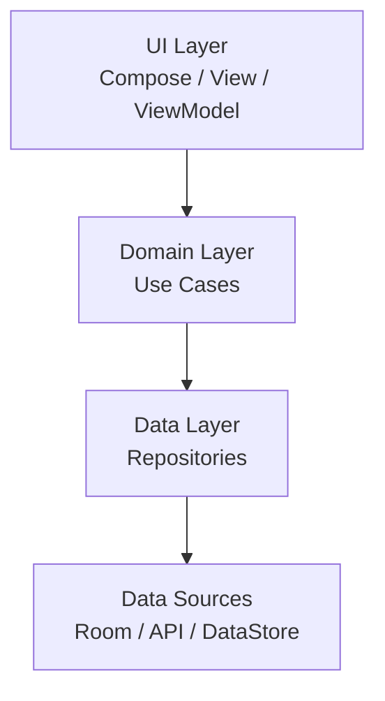
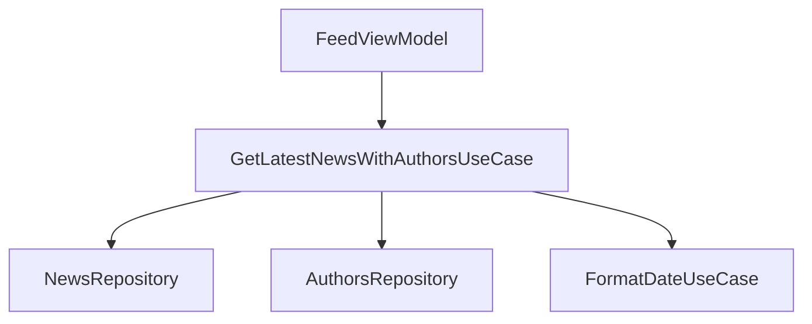
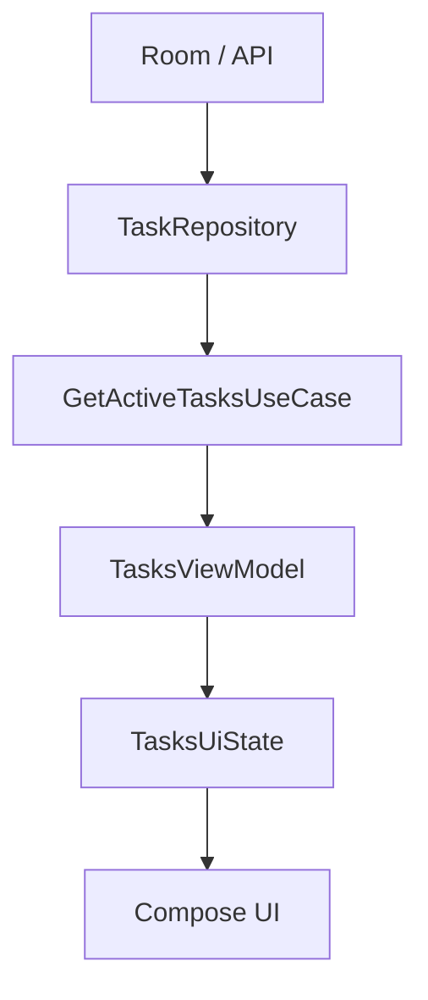
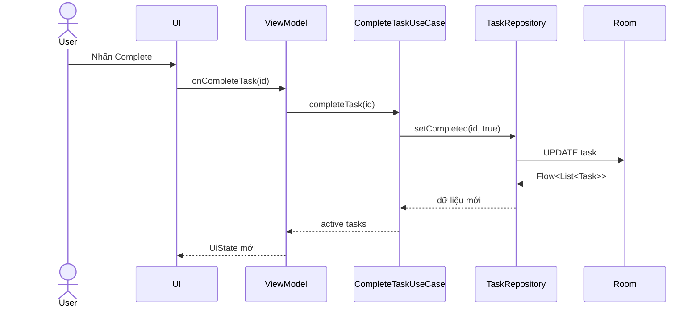
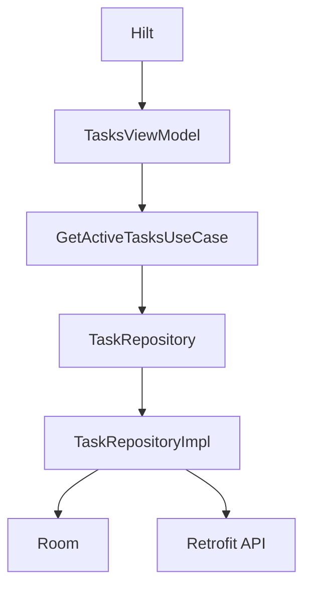
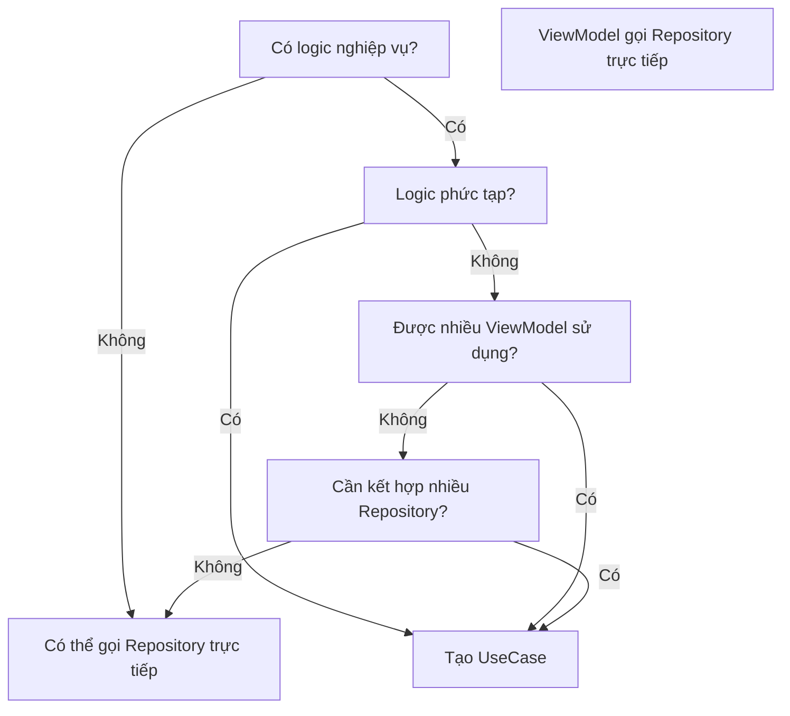

# 007 - Domain Layer

| Thuộc tính              | Nội dung                                         |
| ----------------------- | ------------------------------------------------ |
| **Học phần**            | 03 - Architecture, State and Data                |
| **Module**              | Module 05 - Design and Architecture              |
| **Nhóm nội dung**       | Architectural Patterns                           |
| **Nguồn roadmap**       | Design and Architecture / Architectural Patterns |
| **Loại bài**            | Architecture                                     |
| **Thứ tự trong module** | 007                                              |
| **Thời lượng gợi ý**    | 34 phút                                          |

---

## 1. Tóm tắt

**Domain Layer** là lớp kiến trúc **tùy chọn** nằm giữa **UI Layer** và **Data Layer** trong kiến trúc Android được Google khuyến nghị.

Vai trò chính của Domain Layer là:

* Đóng gói **business logic phức tạp**.
* Đóng gói logic đơn giản nhưng được **nhiều `ViewModel` tái sử dụng**.
* Kết hợp dữ liệu từ nhiều repository.
* Làm `ViewModel` nhỏ và dễ đọc hơn.
* Tạo ra các đơn vị logic độc lập, dễ kiểm thử.

Android không yêu cầu mọi ứng dụng phải có Domain Layer. Kiến trúc cơ bản chỉ cần **UI Layer + Data Layer**; Domain Layer chỉ nên được thêm khi nó thực sự giúp giảm độ phức tạp hoặc tăng khả năng tái sử dụng. ([Android Developers][1])


*Nguồn ảnh: Android Developers.*

---

## 2. Mục tiêu học tập

Sau bài này, bạn có thể:

* Giải thích **Domain Layer** bằng ngôn ngữ của mình.
* Phân biệt trách nhiệm của:

  * UI Layer
  * Domain Layer
  * Data Layer
* Hiểu tại sao Domain Layer là **optional layer**.
* Biết khi nào nên tạo `UseCase`.
* Biết khi nào **không cần** tạo `UseCase`.
* Thiết kế dependency theo hướng rõ ràng:

```text
UI
 ↓
Domain
 ↓
Data
```

* Sử dụng `UseCase` từ `ViewModel`.
* Kết hợp nhiều repository trong một use case.
* Viết unit test cho Domain Layer bằng fake repository.
* Hiểu Domain Layer liên quan đến:

  * lifecycle
  * state
  * coroutine
  * threading
  * error handling
  * testability
* Refactor một màn hình Android đang chứa quá nhiều business logic.

---

# 3. Domain Layer nằm ở đâu?

Kiến trúc Android thường có dạng:



Có thể hình dung:

```text
┌───────────────────────────────┐
│           UI Layer            │
│                               │
│ Compose / Fragment / ViewModel│
└───────────────┬───────────────┘
                │
                ▼
┌───────────────────────────────┐
│         Domain Layer          │
│                               │
│ Use Cases / Interactors       │
│ Business Rules                │
└───────────────┬───────────────┘
                │
                ▼
┌───────────────────────────────┐
│          Data Layer           │
│                               │
│ Repository                    │
│ Local / Remote Data Sources   │
└───────────────────────────────┘
```


Domain Layer thường nhận yêu cầu từ `ViewModel`, thực thi một **use case**, sau đó lấy hoặc thay đổi dữ liệu thông qua repository thuộc Data Layer. ([Android Developers][1])

---

# 4. Ba layer khác nhau như thế nào?

| Layer            | Trách nhiệm chính                | Ví dụ                                 |
| ---------------- | -------------------------------- | ------------------------------------- |
| **UI Layer**     | Hiển thị state, nhận interaction | Compose, Fragment, ViewModel          |
| **Domain Layer** | Thực hiện nghiệp vụ/use case     | `LoginUseCase`, `GetFeedUseCase`      |
| **Data Layer**   | Quản lý dữ liệu và nguồn dữ liệu | Repository, Room, Retrofit, DataStore |

Ví dụ người dùng nhấn **Mua hàng**:

```text
User
 │
 ▼
Compose UI
 │
 │ onBuyClicked()
 ▼
CheckoutViewModel
 │
 ▼
PlaceOrderUseCase
 │
 ├── kiểm tra giỏ hàng
 ├── tính giá
 ├── áp voucher
 └── yêu cầu đặt hàng
 │
 ▼
OrderRepository
 │
 ├── API
 └── Database
```

Điểm quan trọng:

> Domain Layer trả lời câu hỏi **"Ứng dụng phải làm gì theo nghiệp vụ?"**, còn Data Layer chịu trách nhiệm **"Dữ liệu đó lấy, lưu và đồng bộ như thế nào?"**

---

# 5. Domain Layer không bắt buộc

Đây là một điểm rất quan trọng trong kiến trúc Android hiện đại.

Không phải:

```text
Android app
   ↓
BẮT BUỘC có
UI → Domain → Data
```

Mà có thể chỉ là:

```text
UI
 ↓
Data
```

Nếu logic bắt đầu phức tạp:

```text
UI
 ↓
Domain
 ↓
Data
```

Android Developers khuyến nghị sử dụng Domain Layer khi business logic phức tạp hoặc cần tái sử dụng giữa nhiều `ViewModel`; ép tất cả thao tác dữ liệu phải đi qua UseCase dù chỉ là một lời gọi đơn giản có thể tạo thêm boilerplate mà không đem lại nhiều lợi ích. ([Android Developers][1])

---

## 5.1 Khi nào chưa cần Domain Layer?

Ví dụ:

```kotlin
class ProfileViewModel(
    private val userRepository: UserRepository
) : ViewModel() {

    val user = userRepository.observeCurrentUser()
}
```

Nếu đây chỉ là:

```text
Repository
    ↓
ViewModel
    ↓
UI
```

và không có business logic đáng kể thì việc tạo thêm:

```text
ObserveCurrentUserUseCase
```

chỉ để gọi:

```kotlin
userRepository.observeCurrentUser()
```

có thể chưa đem lại lợi ích.

---

## 5.2 Khi nào nên thêm Domain Layer?

Giả sử nhiều màn hình đều cần:

```text
Lấy danh sách bài viết
        +
Lấy thông tin tác giả
        +
Kiểm tra trạng thái premium
        +
Lọc nội dung bị block
        +
Sắp xếp
```

Nếu toàn bộ logic nằm trong `ViewModel`:

```text
FeedViewModel
 ├── NewsRepository
 ├── AuthorRepository
 ├── UserRepository
 ├── filter()
 ├── sort()
 ├── premium logic
 └── mapping
```

`ViewModel` sẽ ngày càng lớn.

Ta có thể tách thành:

```text
FeedViewModel
      │
      ▼
GetPersonalizedFeedUseCase
      │
      ├───────────────┐
      ▼               ▼
NewsRepository   UserRepository
      │
      ▼
AuthorRepository
```

---

# 6. Use Case là gì?

Các class trong Domain Layer thường được gọi là:

* **Use Case**
* **Interactor**

Mỗi UseCase nên biểu diễn **một hành động cụ thể của ứng dụng**. Android Developers cũng khuyến nghị giữ chúng nhỏ, tập trung vào một chức năng và không giữ mutable state riêng. ([Android Developers][1])

Ví dụ:

```text
LoginUseCase

GetUserProfileUseCase

ObserveCartUseCase

CalculateOrderTotalUseCase

PlaceOrderUseCase

GetLatestArticlesUseCase

ToggleBookmarkUseCase
```

---

# 7. Quy tắc đặt tên UseCase

Một convention dễ đọc là:

```text
Động từ + đối tượng + UseCase
```

Ví dụ:

```kotlin
GetUserUseCase
GetLatestNewsUseCase
DeleteTaskUseCase
UpdateProfileUseCase
CalculateOrderTotalUseCase
ToggleBookmarkUseCase
PlaceOrderUseCase
```

Android Developers sử dụng convention tương tự:

```text
verb + noun + UseCase
```

Ví dụ trong tài liệu chính thức có `FormatDateUseCase` và `GetLatestNewsWithAuthorsUseCase`. ([Android Developers][1])

---

# 8. Dependency Direction

Domain Layer thường **phụ thuộc vào Data Layer**.




Một UseCase cũng có thể sử dụng một UseCase khác.

Ví dụ:

```kotlin
class GetArticleUiModelsUseCase(
    private val articleRepository: ArticleRepository,
    private val getAuthorUseCase: GetAuthorUseCase,
    private val formatDateUseCase: FormatDateUseCase
)
```

---

# 9. Ví dụ thực tế: Task Manager

Giả sử chúng ta xây dựng app quản lý công việc.

Người dùng muốn xem:

> Các task chưa hoàn thành, đúng với bộ lọc hiện tại và được sắp xếp theo độ ưu tiên.

Business logic này phù hợp với Domain Layer.

---

## 9.1 Model

```kotlin
data class Task(
    val id: String,
    val title: String,
    val completed: Boolean,
    val priority: Int
)
```

---

## 9.2 Repository contract

```kotlin
interface TaskRepository {

    fun observeTasks(): Flow<List<Task>>

    suspend fun setCompleted(
        taskId: String,
        completed: Boolean
    )
}
```

Repository thuộc Data Layer.

---

## 9.3 UseCase

```kotlin
class GetActiveTasksUseCase(
    private val taskRepository: TaskRepository,
    private val defaultDispatcher: CoroutineDispatcher
) {

    operator fun invoke(): Flow<List<Task>> {
        return taskRepository
            .observeTasks()
            .map { tasks ->
                withContext(defaultDispatcher) {
                    tasks
                        .filterNot { it.completed }
                        .sortedByDescending { it.priority }
                }
            }
    }
}
```

UseCase chịu trách nhiệm:

```text
Tasks
 │
 ├── loại task completed
 │
 ├── sort priority
 │
 ▼
Active Tasks
```

UI không cần biết thuật toán này.

---

# 10. `operator fun invoke()`

Một pattern phổ biến cho UseCase Kotlin là khai báo:

```kotlin
operator fun invoke()
```

Thay vì:

```kotlin
getActiveTasksUseCase.execute()
```

ta có thể viết:

```kotlin
getActiveTasksUseCase()
```

Ví dụ:

```kotlin
class GetTaskUseCase(
    private val repository: TaskRepository
) {

    suspend operator fun invoke(id: String): Task {
        return repository.getTask(id)
    }
}
```

Sử dụng:

```kotlin
val task = getTaskUseCase(taskId)
```

Cách này khiến UseCase trông giống một thao tác nghiệp vụ thay vì một service nhiều method. Android Developers cũng sử dụng `operator fun invoke()` trong hướng dẫn Domain Layer. ([Android Developers][1])

---

# 11. Kết nối Domain Layer với ViewModel

```kotlin
class TasksViewModel(
    getActiveTasks: GetActiveTasksUseCase
) : ViewModel() {

    val uiState: StateFlow<TasksUiState> =
        getActiveTasks()
            .map { tasks ->
                TasksUiState.Success(tasks)
            }
            .stateIn(
                scope = viewModelScope,
                started = SharingStarted.WhileSubscribed(5_000),
                initialValue = TasksUiState.Loading
            )
}
```

Luồng dữ liệu:



---

# 12. User Event đi theo hướng ngược lại

State thường đi:

```text
Data
 ↓
Domain
 ↓
ViewModel
 ↓
UI
```

Event của người dùng đi theo hướng ngược lại:

```text
User
 ↓
UI
 ↓
ViewModel
 ↓
Domain
 ↓
Data
```

Ví dụ:



Đây phù hợp với tư tưởng **Unidirectional Data Flow** được kiến trúc Android hiện đại sử dụng. ([Android Developers][2])

---

# 13. Domain Layer và nhiều Repository

Domain Layer đặc biệt hữu ích khi một nghiệp vụ cần dữ liệu từ nhiều repository.

Ví dụ trang tin cần:

```text
NewsRepository
       +
AuthorsRepository
       ↓
GetLatestNewsWithAuthorsUseCase
       ↓
FeedViewModel
```


Ví dụ Kotlin:

```kotlin
class GetLatestNewsWithAuthorsUseCase(
    private val newsRepository: NewsRepository,
    private val authorsRepository: AuthorsRepository
) {

    suspend operator fun invoke(): List<ArticleWithAuthor> {

        val articles = newsRepository.getLatestNews()

        return articles.map { article ->

            val author = authorsRepository.getAuthor(
                article.authorId
            )

            ArticleWithAuthor(
                article = article,
                author = author
            )
        }
    }
}
```

Nếu logic này nằm trong `ViewModel`, `ViewModel` sẽ phải biết quá nhiều về cách các nguồn dữ liệu liên kết với nhau. Đây chính là một trong những trường hợp Android Developers dùng để minh họa giá trị của Domain Layer. ([Android Developers][1])

---

# 14. Một UseCase có thể gọi UseCase khác

Ví dụ:

```text
GetArticleDetailsUseCase
 │
 ├── GetArticleUseCase
 │
 ├── GetAuthorUseCase
 │
 └── FormatDateUseCase
```

Code:

```kotlin
class GetArticleDetailsUseCase(
    private val articleRepository: ArticleRepository,
    private val authorRepository: AuthorRepository,
    private val formatDate: FormatDateUseCase
) {

    suspend operator fun invoke(
        articleId: String
    ): ArticleDetails {

        val article =
            articleRepository.getArticle(articleId)

        val author =
            authorRepository.getAuthor(article.authorId)

        return ArticleDetails(
            title = article.title,
            author = author.name,
            publishedDate = formatDate(article.date)
        )
    }
}
```

Điều này cho phép tái sử dụng business rule:

```text
FormatDateUseCase
```

ở nhiều màn hình khác nhau.

---

# 15. Domain Layer không nên giữ mutable state

Không nên:

```kotlin
class ShoppingCartUseCase {

    val items = mutableListOf<CartItem>()

    fun add(item: CartItem) {
        items += item
    }
}
```

Vấn đề:

```text
UseCase
  ↓
trở thành nơi chứa state
  ↓
lifetime khó kiểm soát
  ↓
logic khó test
  ↓
có thêm nguồn dữ liệu thật thứ hai
```

Tốt hơn:

```text
CartRepository
    ↓
Single Source of Truth
```

và:

```kotlin
class AddCartItemUseCase(
    private val cartRepository: CartRepository
) {

    suspend operator fun invoke(
        productId: String
    ) {
        cartRepository.add(productId)
    }
}
```

Android Developers khuyến nghị UseCase giữ đơn giản, tập trung vào một functionality và không tự chứa mutable data. ([Android Developers][1])

---

# 16. Domain Layer và Lifecycle

Một UseCase thông thường **không có lifecycle riêng**.

```text
Activity / Compose
      │
      ▼
ViewModel
      │
      ▼
UseCase
```

Lifetime của công việc thường được quyết định bởi consumer.

Ví dụ:

```kotlin
viewModelScope.launch {
    refreshFeedUseCase()
}
```

Khi `ViewModel` bị clear:

```text
viewModelScope
    ↓
cancel coroutine
```

Domain Layer không nên tự tạo lifecycle phức tạp chỉ để chạy tác vụ.

Theo hướng dẫn chính thức, UseCase không sở hữu lifecycle độc lập; nó được sử dụng trong scope của thành phần gọi nó. ([Android Developers][3])

---

# 17. Rotate màn hình thì sao?

Giả sử:

```text
Compose Screen
      ↓
ViewModel
      ↓
UseCase
      ↓
Repository
```

Khi rotate:

```text
Activity cũ
   X
   │
   ▼
Activity mới
```

`ViewModel` có thể tiếp tục tồn tại qua configuration change.

Domain Layer:

```text
không cần biết
"thiết bị vừa rotate"
```

Đó là điều tốt.

Business rule như:

```text
Tính tổng tiền
Kiểm tra voucher
Lọc task
Lấy feed
```

không nên phụ thuộc vào:

```kotlin
Activity
Fragment
Configuration
View
```

Android architecture cũng tách business logic khỏi UI lifecycle; configuration changes tác động tới UI nhưng không làm thay đổi tính hợp lệ của business data. ([Android Developers][2])

---

# 18. Domain Layer và Android Framework

Một UseCase lý tưởng thường không cần:

```kotlin
Activity
Fragment
View
Toast
NavController
```

Ví dụ không tốt:

```kotlin
class LoginUseCase(
    private val context: Context
) {

    fun login() {

        Toast.makeText(
            context,
            "Login success",
            Toast.LENGTH_SHORT
        ).show()
    }
}
```

`Toast` là vấn đề của UI.

Tốt hơn:

```text
LoginUseCase
     ↓
LoginResult.Success
     ↓
ViewModel
     ↓
UiState
     ↓
UI
     ↓
Hiển thị thông báo
```

---

# 19. Threading và Main Safety

Domain Layer phải an toàn khi được gọi từ Main Thread. Nếu bản thân UseCase thực hiện tính toán blocking hoặc CPU-heavy, nó phải chuyển tác vụ đó sang dispatcher thích hợp hoặc xem xét liệu công việc đó hợp lý hơn ở Data Layer. ([Android Developers][1])

Ví dụ:

```kotlin
class GenerateRecommendationUseCase(
    private val defaultDispatcher: CoroutineDispatcher
) {

    suspend operator fun invoke(
        items: List<Item>
    ): List<Item> {

        return withContext(defaultDispatcher) {
            expensiveRecommendationAlgorithm(items)
        }
    }
}
```

Luồng:

```text
Main Thread
    │
    ▼
UseCase
    │
    ├──────────────► Dispatchers.Default
    │                    │
    │                 CPU work
    │                    │
    ◄────────────────────┘
    │
    ▼
UI State
```

---

# 20. Error Handling

Không nên để mọi lỗi từ network tràn thẳng tới UI:

```text
Retrofit Exception
       ↓
Compose
```

Có thể chuẩn hóa chúng thành domain result.

```kotlin
sealed interface LoginResult {

    data class Success(
        val user: User
    ) : LoginResult

    data object InvalidCredentials : LoginResult

    data object NetworkUnavailable : LoginResult
}
```

UseCase:

```kotlin
class LoginUseCase(
    private val repository: AuthRepository
) {

    suspend operator fun invoke(
        email: String,
        password: String
    ): LoginResult {

        if (email.isBlank() || password.isBlank()) {
            return LoginResult.InvalidCredentials
        }

        return repository.login(
            email,
            password
        )
    }
}
```

ViewModel chuyển kết quả thành UI state:

```text
LoginResult
     ↓
ViewModel
     ↓
LoginUiState
     ↓
Compose
```

---

# 21. Data Model và UI Model

Không phải mọi object từ Data Layer đều nên được UI sử dụng trực tiếp.

Ví dụ:

```text
UserEntity
```

từ database có thể chứa:

```text
id
firstName
lastName
birthTimestamp
subscriptionId
internalFlags
```

UI chỉ cần:

```text
displayName
age
premium
```

Domain có thể xử lý business transformation:

```text
UserEntity
    ↓
Domain Logic
    ↓
User
    ↓
ViewModel
    ↓
UserUiState
```

Tuy nhiên, mapping chỉ phục vụ cách **hiển thị** như màu sắc, resource string hoặc kích thước UI thường nên ở UI Layer thay vì Domain Layer.

---

# 22. Domain Layer và Single Source of Truth

Domain Layer **không nhất thiết là nơi lưu dữ liệu**.

Ví dụ:

```text
Room Database
     │
     │ SSOT
     ▼
Repository
     │
     ▼
UseCase
     │
     ▼
ViewModel
```

UseCase chỉ:

```text
đọc
+
kết hợp
+
áp dụng business rule
```

Nó không nên tạo thêm một bản mutable state riêng và biến mình thành nguồn dữ liệu thứ hai.

Kiến trúc Android khuyến nghị xác định một **Single Source of Truth** cho mỗi loại dữ liệu quan trọng và để các layer khác tiêu thụ dữ liệu từ đó. ([Android Developers][2])

---

# 23. Có bắt buộc UI → Domain → Data không?

Không.

Có hai cách.

### Cách linh hoạt

```text
             ┌──► UseCase ──► Repository
ViewModel ───┤
             └──────────────► Repository
```

Logic đơn giản:

```text
ViewModel → Repository
```

Logic phức tạp:

```text
ViewModel → UseCase → Repository
```

---

### Cách strict

```text
ViewModel
    │
    ▼
UseCase
    │
    ▼
Repository
```

Không cho phép:

```text
ViewModel ─────► Repository
```


Cách strict có ưu điểm là đảm bảo mọi truy cập đều đi qua business rules, nhưng Android Developers cũng cảnh báo nó có thể buộc bạn tạo nhiều UseCase rất đơn giản và tăng complexity không cần thiết. ([Android Developers][1])

---

# 24. Ví dụ về over-engineering

Giả sử repository:

```kotlin
interface ThemeRepository {
    fun observeTheme(): Flow<Theme>
}
```

Sau đó tạo:

```kotlin
class ObserveThemeUseCase(
    private val repository: ThemeRepository
) {

    operator fun invoke(): Flow<Theme> {
        return repository.observeTheme()
    }
}
```

Nếu UseCase:

```text
không có business logic
không tái sử dụng đáng kể
không kết hợp dữ liệu
không tạo abstraction có giá trị
```

thì layer này chưa chắc cần thiết.

Kiến trúc tốt không phải:

```text
càng nhiều class càng tốt
```

mà là:

```text
ít coupling
+
trách nhiệm rõ
+
dễ thay đổi
+
dễ kiểm thử
```

---

# 25. Ví dụ Domain Layer có giá trị

Giả sử tính giá đơn hàng:

```text
Cart items
    │
    ├── subtotal
    │
    ├── member discount
    │
    ├── voucher
    │
    ├── shipping
    │
    └── tax
    ▼
Final price
```

Đây là business logic rõ ràng.

```kotlin
class CalculateOrderTotalUseCase {

    operator fun invoke(
        cart: Cart,
        customer: Customer,
        voucher: Voucher?
    ): Money {

        var total = cart.items.sumOf {
            it.price * it.quantity
        }

        if (customer.isPremium) {
            total *= 0.9
        }

        if (voucher != null) {
            total -= voucher.discount
        }

        return total.coerceAtLeast(0.0)
    }
}
```

Logic này có thể được dùng bởi:

```text
CartViewModel
CheckoutViewModel
OrderPreviewViewModel
```

Thay vì copy cùng một công thức ba lần.

---

# 26. Testing Domain Layer

Một ưu điểm lớn của Domain Layer là business logic có thể được kiểm thử mà không cần chạy UI Android.

Ví dụ:

```kotlin
class FakeTaskRepository : TaskRepository {

    private val tasks =
        MutableStateFlow<List<Task>>(emptyList())

    override fun observeTasks(): Flow<List<Task>> =
        tasks

    override suspend fun setCompleted(
        taskId: String,
        completed: Boolean
    ) {
        tasks.update { current ->

            current.map { task ->

                if (task.id == taskId) {
                    task.copy(completed = completed)
                } else {
                    task
                }
            }
        }
    }

    fun setTasks(value: List<Task>) {
        tasks.value = value
    }
}
```

---

## 26.1 Unit test UseCase

```kotlin
@Test
fun `completed tasks are removed`() = runTest {

    val repository = FakeTaskRepository()

    repository.setTasks(
        listOf(
            Task(
                id = "1",
                title = "Learn Domain Layer",
                completed = false,
                priority = 2
            ),
            Task(
                id = "2",
                title = "Old task",
                completed = true,
                priority = 1
            )
        )
    )

    val useCase = GetActiveTasksUseCase(
        taskRepository = repository,
        defaultDispatcher = testDispatcher
    )

    val result = useCase().first()

    assertEquals(1, result.size)

    assertEquals(
        "Learn Domain Layer",
        result.first().title
    )
}
```

Sơ đồ test:

```text
                  Production
                     │
UseCase ───────── Repository
                     │
                  Room/API


                    Test
                     │
UseCase ─────── FakeRepository
```

Android Developers cũng khuyến nghị fake repository khi kiểm thử Domain Layer. ([Android Developers][1])

---

# 27. Dependency Injection

Domain Layer kết hợp tốt với dependency injection.

Ví dụ Hilt:

```kotlin
class GetActiveTasksUseCase @Inject constructor(
    private val taskRepository: TaskRepository,
    @DefaultDispatcher
    private val defaultDispatcher: CoroutineDispatcher
)
```

ViewModel:

```kotlin
@HiltViewModel
class TasksViewModel @Inject constructor(
    private val getActiveTasks: GetActiveTasksUseCase
) : ViewModel()
```

Dependency graph:



---

# 28. Package Structure

Một project nhỏ có thể tổ chức:

```text
com.example.tasks
│
├── data
│   ├── local
│   │   ├── TaskDao.kt
│   │   └── TaskEntity.kt
│   │
│   ├── remote
│   │   └── TaskApi.kt
│   │
│   └── repository
│       └── TaskRepositoryImpl.kt
│
├── domain
│   ├── model
│   │   └── Task.kt
│   │
│   ├── repository
│   │   └── TaskRepository.kt
│   │
│   └── usecase
│       ├── GetActiveTasksUseCase.kt
│       ├── CompleteTaskUseCase.kt
│       └── CreateTaskUseCase.kt
│
└── ui
    └── tasks
        ├── TasksScreen.kt
        ├── TasksViewModel.kt
        └── TasksUiState.kt
```

Với dự án lớn hơn, có thể tổ chức theo feature thay vì tạo một package `domain` khổng lồ:

```text
feature
│
├── tasks
│   ├── data
│   ├── domain
│   └── ui
│
├── profile
│   ├── data
│   ├── domain
│   └── ui
│
└── checkout
    ├── data
    ├── domain
    └── ui
```

---

# 29. Domain Layer và Clean Architecture

Cần cẩn thận ở điểm này.

```text
Android Domain Layer
```

không nhất thiết có ý nghĩa hoàn toàn giống:

```text
Clean Architecture Domain Layer
```

Trong Android Architecture Guide, Domain Layer là lớp **optional** dùng để chứa business logic phức tạp hoặc logic tái sử dụng.

Trong các biến thể Clean Architecture, Domain có thể còn chứa:

```text
Entities
Enterprise Business Rules
Repository interfaces
Use Cases
```

Vì vậy không nên áp dụng một sơ đồ Clean Architecture từ blog bất kỳ rồi mặc định đó chính xác là mô hình Android Developers đang mô tả. Google cũng lưu ý rõ rằng khái niệm Domain Layer trong hướng dẫn Android có thể khác với cách thuật ngữ này được dùng trong các kiến trúc phần mềm khác. ([Android Developers][1])

---

# 30. Những lỗi thiết kế thường gặp

## 30.1 God UseCase

Không nên:

```text
AppUseCase
 ├── login
 ├── logout
 ├── getProfile
 ├── changePassword
 ├── getFeed
 ├── bookmark
 ├── deleteArticle
 └── updateSettings
```

Tốt hơn:

```text
LoginUseCase
LogoutUseCase
GetProfileUseCase
UpdatePasswordUseCase
GetFeedUseCase
ToggleBookmarkUseCase
```

---

## 30.2 Business logic trong Compose

Không nên:

```kotlin
Button(
    onClick = {

        val total =
            items.sumOf { it.price } * 0.9

        // save order
    }
)
```

Tốt hơn:

```text
Button
   ↓
ViewModel
   ↓
CalculateOrderTotalUseCase
```

---

## 30.3 ViewModel quá lớn

Dấu hiệu:

```text
TasksViewModel
  800 lines
```

và chứa:

```text
sorting
filtering
validation
discount rules
permissions
API orchestration
mapping
database logic
```

Đây là dấu hiệu cần đánh giá lại boundary giữa:

```text
UI
Domain
Data
```

---

## 30.4 UseCase truy cập trực tiếp Retrofit

Không nên:

```text
UseCase
   ↓
Retrofit API
```

Thông thường nên là:

```text
UseCase
   ↓
Repository
   ↓
RemoteDataSource
   ↓
Retrofit
```

Domain không nên cần biết dữ liệu đến từ:

```text
REST API
Room
Firebase
file
cache
```

---

## 30.5 Domain phụ thuộc UI

Không nên:

```text
Domain
 ↓
Compose
```

hoặc:

```kotlin
class CheckoutUseCase(
    private val navController: NavController
)
```

Dependency hợp lý hơn:

```text
UI
 ↓
Domain
 ↓
Data
```

---

# 31. Quyết định có cần UseCase hay không

Có thể dùng decision tree:



Đây là guideline, không phải luật cứng.

---

# 32. So sánh trước và sau khi refactor

## Trước

```text
TasksScreen
    │
    ▼
TasksViewModel
    │
    ├── filter completed
    ├── sort priority
    ├── validate task
    ├── repository
    ├── analytics
    └── mapping
```

`ViewModel` biết quá nhiều.

---

## Sau

```text
TasksScreen
      │
      ▼
TasksViewModel
      │
      ├── GetActiveTasksUseCase
      ├── CreateTaskUseCase
      └── CompleteTaskUseCase
                 │
                 ▼
           TaskRepository
```

Kết quả:

```text
UI
 │
 ├── render state
 └── emit event

ViewModel
 │
 ├── coordinate
 └── produce UI state

Domain
 │
 └── business rules

Data
 │
 └── data management
```

---

# 33. Domain Layer ảnh hưởng UX như thế nào?

Người dùng không nhìn thấy Domain Layer trực tiếp nhưng nó ảnh hưởng mạnh tới trải nghiệm.

Ví dụ checkout:

```text
Voucher logic nằm 3 nơi
        ↓
Mỗi màn hình tính khác nhau
        ↓
Giá checkout ≠ giá cart
        ↓
User mất niềm tin
```

Nếu business rule được tập trung:

```text
CalculateOrderTotalUseCase
        ↓
Một rule duy nhất
        ↓
Cart / Checkout / Preview
cùng kết quả
```

Domain Layer vì vậy có thể cải thiện:

* tính nhất quán;
* khả năng sửa lỗi;
* maintainability;
* testability;
* độ tin cậy của business rule.

---

# 34. Domain Layer và Performance

Domain Layer bản thân không khiến app nhanh hơn.

Ngược lại, nếu thiết kế kém:

```text
ViewModel
   ↓
UseCase A
   ↓
UseCase B
   ↓
UseCase C
   ↓
Repository
```

mà mỗi layer chỉ forward function thì code sẽ phức tạp hơn mà không có lợi ích.

Domain Layer nên tồn tại vì nó có:

```text
business meaning
```

chứ không phải chỉ để tăng số lượng class.

---

# 35. Bài thực hành

## Yêu cầu

Xây dựng màn hình:

```text
TasksScreen
```

hiển thị:

```text
Active Tasks
```

Task có:

```kotlin
data class Task(
    val id: String,
    val title: String,
    val priority: Int,
    val completed: Boolean
)
```

---

## Bước 1 - Data Layer

Tạo:

```text
TaskRepository
FakeTaskRepository
```

---

## Bước 2 - Domain Layer

Tạo:

```text
GetActiveTasksUseCase
```

Rule:

```text
1. Loại completed task.
2. Sắp xếp priority giảm dần.
```

---

## Bước 3 - UI Layer

```text
TasksScreen
    ↓
TasksViewModel
    ↓
GetActiveTasksUseCase
```

---

## Bước 4 - State

```kotlin
sealed interface TasksUiState {

    data object Loading : TasksUiState

    data class Success(
        val tasks: List<Task>
    ) : TasksUiState

    data class Error(
        val message: String
    ) : TasksUiState
}
```

---

## Bước 5 - Test

Test ít nhất:

```text
✓ completed tasks không xuất hiện

✓ priority cao đứng trước

✓ empty repository trả empty list
```

---

# 36. Bài tập mở rộng

Refactor một màn hình đang có cấu trúc:

```text
ViewModel
 ├── API call
 ├── sorting
 ├── filtering
 ├── validation
 └── calculation
```

thành:

```text
UI Layer
    ↓
ViewModel
    ↓
Domain Layer
    ↓
Repository
    ↓
Data Sources
```

Yêu cầu tạo ít nhất:

```text
1 Repository
2 UseCases
1 ViewModel
1 UiState
3 Unit Tests
```

---

# 37. Artifact cho Portfolio

Có thể tạo mini project:

```text
android-domain-layer-demo/
│
├── README.md
│
├── architecture.png
│
├── app/
│
├── domain/
│
├── data/
└── screenshots/
```

README nên có:

```text
Architecture

UI
 ↓
Domain
 ↓
Data

Domain Use Cases

- GetActiveTasksUseCase
- CompleteTaskUseCase
- CreateTaskUseCase

Testing

- Fake repository
- Domain unit tests
- ViewModel tests
```

Một screenshot test:

```text
GetActiveTasksUseCaseTest

✓ excludes completed task
✓ sorts by priority
✓ handles empty list
```

sẽ có giá trị portfolio hơn việc chỉ ghi:

> "I know Clean Architecture."

---

# 38. Checklist hoàn thành

* [ ] Giải thích được Domain Layer là gì.
* [ ] Biết Domain Layer là **optional** trong kiến trúc Android.
* [ ] Phân biệt UI, Domain và Data Layer.
* [ ] Hiểu UseCase/Interactor.
* [ ] Biết đặt tên UseCase.
* [ ] Một UseCase chỉ có một trách nhiệm rõ ràng.
* [ ] Không lưu mutable application state trong UseCase.
* [ ] Biết UseCase có thể phụ thuộc Repository.
* [ ] Biết UseCase có thể sử dụng UseCase khác.
* [ ] Biết cách kết hợp nhiều Repository.
* [ ] Biết `operator fun invoke()`.
* [ ] Biết Domain Layer không nên phụ thuộc UI.
* [ ] Hiểu lifecycle của UseCase.
* [ ] Đảm bảo blocking work không chặn Main Thread.
* [ ] Có fake repository cho unit test.
* [ ] Test business rule độc lập với Android UI.
* [ ] Không tạo UseCase chỉ để tăng số lượng class.
* [ ] Có architecture diagram trong README.
* [ ] Có ít nhất một artifact để đưa vào portfolio.

---

# 39. Ghi chú Production

Trước khi đưa một feature sử dụng Domain Layer vào production, nên kiểm tra:

```text
Business Rule
    │
    ├── Có một source of truth?
    │
    ├── Có bị duplicate ở ViewModel khác?
    │
    ├── Có thể test độc lập?
    │
    ├── Có main-safe?
    │
    ├── Error có được chuẩn hóa?
    │
    ├── Có phụ thuộc Android UI không?
    │
    └── Có thật sự cần UseCase?
```

Đặc biệt hãy hỏi:

### State

```text
Domain có đang giữ state không cần thiết?
```

### Lifecycle

```text
Coroutine có được gắn vào scope hợp lý?
```

### Network

```text
UseCase có biết Retrofit implementation không?
```

Nếu có, nên xem lại abstraction.

### Error

```text
NetworkException
      ↓
Repository
      ↓
Domain result
      ↓
UiState
```

### Testing

```text
UseCase có chạy được với FakeRepository không?
```

### Release

Các business rule quan trọng như:

```text
payment
discount
subscription
authentication
data deletion
```

nên có test bảo vệ trước khi release.

---

# 40. Ghi nhớ nhanh

```text
UI Layer
"Hiển thị gì?"
        │
        ▼
Domain Layer
"Ứng dụng phải làm gì?"
        │
        ▼
Data Layer
"Dữ liệu lấy và lưu như thế nào?"
```

Và quy tắc quan trọng nhất:

> **Đừng thêm Domain Layer để kiến trúc trông phức tạp hơn. Hãy thêm nó khi business logic cần được tách, tái sử dụng hoặc kiểm thử độc lập.**

Kiến trúc tốt không phải kiến trúc có nhiều layer nhất.

Kiến trúc tốt là kiến trúc giúp:

```text
Developer
   ↓
dễ hiểu code
   ↓
dễ thay đổi
   ↓
dễ test
   ↓
ít bug hơn
   ↓
User experience ổn định hơn
```

---

## 41. Tài liệu tham khảo

* [Android Developers - Guide to app architecture](https://developer.android.com/topic/architecture)
* [Android Developers - Domain layer](https://developer.android.com/topic/architecture/domain-layer)
* [Android Developers - UI layer](https://developer.android.com/topic/architecture/ui-layer)
* [Android Developers - Data layer](https://developer.android.com/topic/architecture/data-layer)
* [Android Developers - Recommendations for Android architecture](https://developer.android.com/topic/architecture/recommendations)

Các điểm quan trọng trong bài — Domain Layer là tùy chọn, UseCase nên có một trách nhiệm rõ ràng, có thể kết hợp repository/use case khác, không nên giữ mutable state và cần main-safe — đều phù hợp với hướng dẫn Android Developers hiện hành. ([Android Developers][1])

[1]: https://developer.android.com/topic/architecture/domain-layer?utm_source=chatgpt.com "Domain layer  |  App architecture  |  Android Developers"
[2]: https://developer.android.com/topic/architecture?utm_source=chatgpt.com "Guide to app architecture  |  App architecture  |  Android Developers"
[3]: https://developer.android.com/topic/architecture/domain-layer?hl=es-419 "Capa de dominio  |  App architecture  |  Android Developers"
