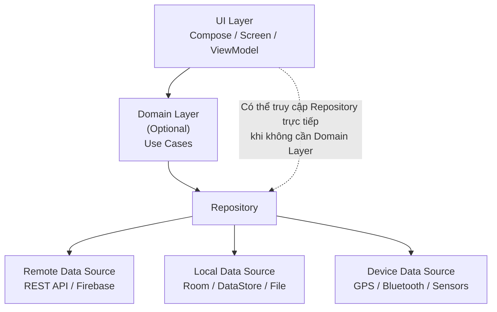
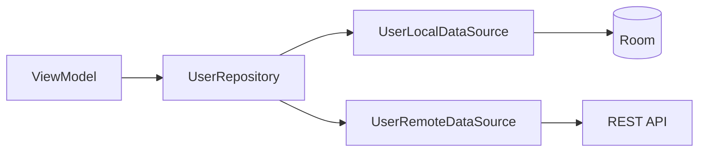
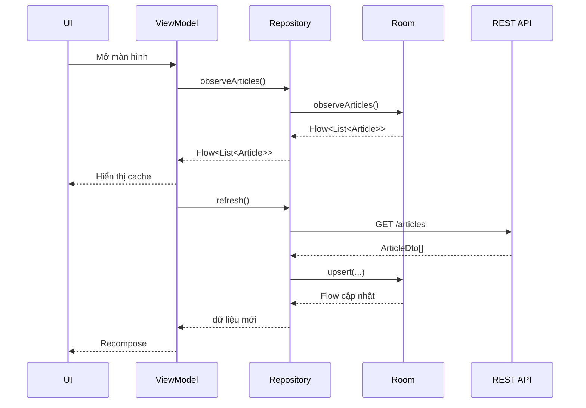
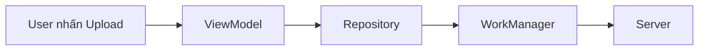
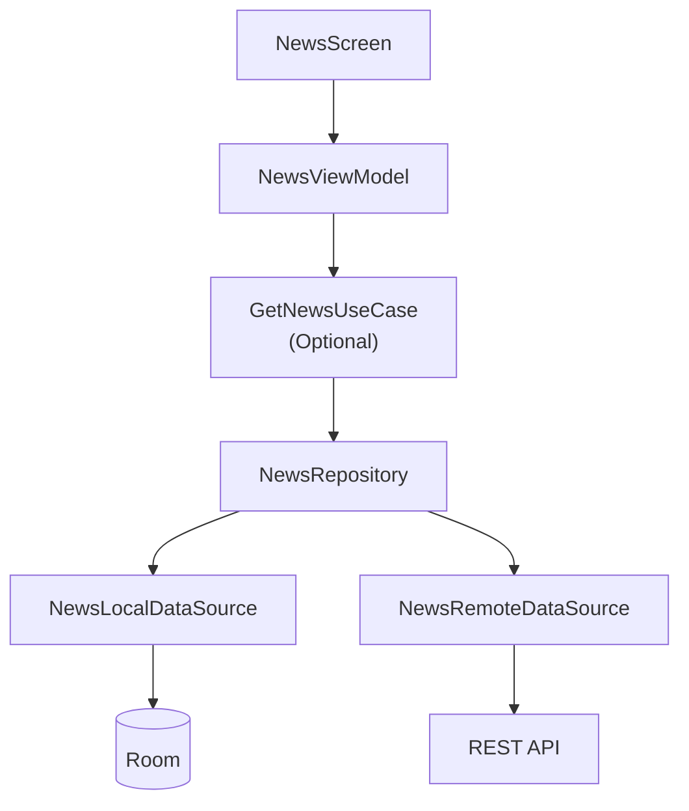
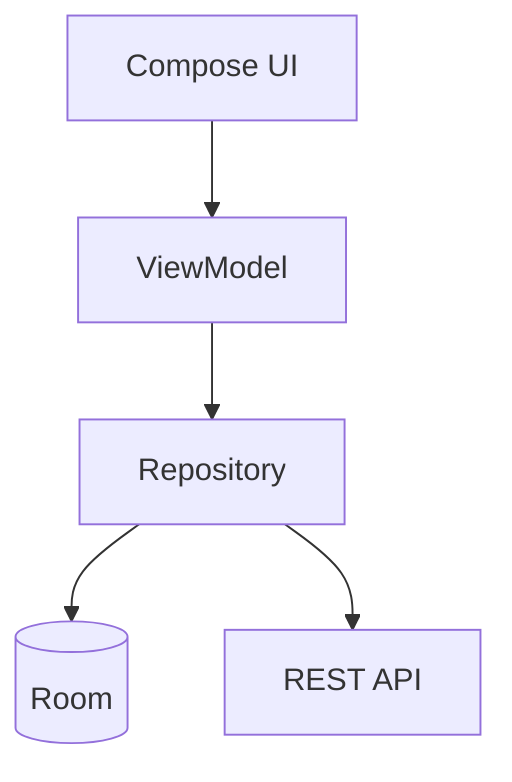
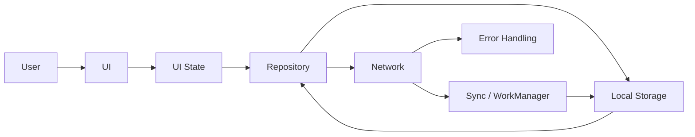

# 008 - Data Layer

| Thuộc tính              | Nội dung                                         |
| ----------------------- | ------------------------------------------------ |
| **Học phần**            | 03 - Architecture, State and Data                |
| **Module**              | Module 05 - Design and Architecture              |
| **Nhóm nội dung**       | Architectural Patterns                           |
| **Nguồn roadmap**       | Design and Architecture / Architectural Patterns |
| **Loại bài**            | Architecture                                     |
| **Thứ tự trong module** | 008                                              |
| **Thời lượng gợi ý**    | 34 phút                                          |

---

## 1. Tóm tắt

**Data Layer** là tầng chịu trách nhiệm quản lý dữ liệu của ứng dụng và chứa phần lớn business logic liên quan đến cách dữ liệu được tạo, lưu trữ, thay đổi, đồng bộ và cung cấp cho các tầng phía trên.

Trong kiến trúc Android được khuyến nghị, Data Layer được tổ chức chủ yếu quanh:

* **Repository** — điểm truy cập dữ liệu của các tầng khác.
* **Data Source** — làm việc trực tiếp với một nguồn dữ liệu cụ thể như REST API, Room, DataStore, file, Firebase hoặc thiết bị.
* **Model / Mapper** — biểu diễn và chuyển đổi dữ liệu giữa network, local database và model mà ứng dụng sử dụng.

Android Developers khuyến nghị UI hoặc ViewModel không truy cập trực tiếp database, network API hay các data provider mà nên đi qua Repository. ([Android Developers][1])


*Nguồn ảnh: Android Developers — Data Layer.*

---

## 2. Mục tiêu học tập

Sau bài học, bạn có thể:

* Giải thích được **Data Layer** bằng ngôn ngữ của mình.
* Phân biệt được **Repository** và **Data Source**.
* Thiết kế dependency direction giữa UI, Domain và Data Layer.
* Biết khi nào nên sử dụng Local Data Source và Remote Data Source.
* Hiểu khái niệm **Single Source of Truth**.
* Sử dụng `suspend` cho thao tác một lần và `Flow` cho dữ liệu thay đổi theo thời gian.
* Thiết kế Data Layer để hỗ trợ cache và offline-first.
* Xử lý lỗi network/storage mà không làm UI phụ thuộc trực tiếp vào Retrofit hoặc Room.
* Tạo được **Fake Repository** để unit test.
* Refactor một màn hình Android để tách UI khỏi data access.

---

## 3. Data Layer nằm ở đâu trong ứng dụng?

Kiến trúc Android điển hình có thể hình dung như sau:



Domain Layer là **optional**. Với một ứng dụng nhỏ, dependency hoàn toàn có thể là:

```text
UI / ViewModel
      │
      ▼
 Repository
      │
 ┌────┴─────┐
 ▼          ▼
Room      Network
```

Với ứng dụng lớn hoặc business logic phức tạp:

```text
UI
 │
 ▼
ViewModel
 │
 ▼
Use Case
 │
 ▼
Repository
 │
 ├── Local Data Source
 │
 └── Remote Data Source
```

Android hiện khuyến nghị tối thiểu ứng dụng nên có một **UI Layer** và một **Data Layer**; Domain Layer chỉ nên được thêm khi cần tái sử dụng hoặc cô lập business logic phức tạp. ([Android Developers][2])

---

## 4. Ba thành phần quan trọng của Data Layer

### 4.1. Repository

Repository là **cổng vào của Data Layer**.

Ví dụ:

```text
NewsRepository
UserRepository
MovieRepository
PaymentRepository
SettingsRepository
```

Theo Android Developers, Repository thường chịu trách nhiệm:

* Cung cấp dữ liệu cho phần còn lại của ứng dụng.
* Tập trung các thao tác thay đổi dữ liệu.
* Che giấu chi tiết nguồn dữ liệu.
* Kết hợp nhiều Data Source.
* Giải quyết xung đột giữa các Data Source.
* Chứa business logic liên quan đến dữ liệu. ([Android Developers][1])

Ví dụ:

```kotlin
interface UserRepository {

    fun observeUser(): Flow<User?>

    suspend fun refreshUser()

    suspend fun updateProfile(
        name: String,
        avatarUrl: String
    )
}
```

ViewModel chỉ biết:

```text
"Tôi cần User."
```

ViewModel không cần biết User được lấy từ:

```text
Room?
Retrofit?
Firebase?
Cache?
File JSON?
```

Đó chính là giá trị của Repository.

---

### 4.2. Data Source

Data Source làm việc với **một nguồn dữ liệu cụ thể**.

Ví dụ:

```text
UserRemoteDataSource
UserLocalDataSource

NewsRemoteDataSource
NewsLocalDataSource

SettingsLocalDataSource
```

Mỗi Data Source nên tập trung vào một nguồn như network, database hoặc file. Các tầng bên ngoài Data Layer không nên truy cập Data Source trực tiếp. ([Android Developers][1])

Ví dụ:

```kotlin
class UserRemoteDataSource(
    private val api: UserApi
) {

    suspend fun getUser(): UserDto {
        return api.getUser()
    }
}
```

Local:

```kotlin
class UserLocalDataSource(
    private val userDao: UserDao
) {

    fun observeUser(): Flow<UserEntity?> {
        return userDao.observeUser()
    }

    suspend fun saveUser(user: UserEntity) {
        userDao.upsert(user)
    }
}
```

Repository kết hợp cả hai:



---

### 4.3. Data Model

Cùng một dữ liệu có thể có nhiều representation.

Ví dụ một bài viết:

```text
Network

ArticleDto
    │
    ▼
Local

ArticleEntity
    │
    ▼
Application

Article
```

Không nhất thiết phải dùng cùng một class cho mọi tầng.

Ví dụ dữ liệu server:

```kotlin
data class ArticleDto(
    val id: Long,
    val headline: String,
    val body: String,
    val author_name: String,
    val created_at: String
)
```

Database:

```kotlin
@Entity(tableName = "articles")
data class ArticleEntity(
    @PrimaryKey
    val id: Long,
    val title: String,
    val content: String,
    val author: String
)
```

Model được Data Layer cung cấp ra ngoài:

```kotlin
data class Article(
    val id: Long,
    val title: String,
    val content: String,
    val author: String
)
```

Mapper:

```kotlin
fun ArticleDto.toEntity(): ArticleEntity {
    return ArticleEntity(
        id = id,
        title = headline,
        content = body,
        author = author_name
    )
}
```

```kotlin
fun ArticleEntity.toArticle(): Article {
    return Article(
        id = id,
        title = title,
        content = content,
        author = author
    )
}
```

Cách này giúp thay đổi API hoặc database mà không buộc toàn bộ UI phải thay đổi theo. Android cũng khuyến nghị cân nhắc model riêng cho từng layer/component trong những ứng dụng phức tạp. ([Android Developers][3])

---

## 5. Repository Pattern

Ví dụ một ứng dụng đọc tin tức.

### Cách không nên làm

```kotlin
class NewsViewModel(
    private val api: NewsApi
) : ViewModel() {

    fun loadNews() {
        viewModelScope.launch {
            val articles = api.getArticles()
        }
    }
}
```

Dependency lúc này:

```text
ViewModel
   │
   ▼
Retrofit API
```

ViewModel bị gắn chặt vào Retrofit/network.

Nếu sau này cần thêm:

```text
Room cache
Offline mode
Firebase
Mock API
Pagination cache
```

ViewModel sẽ ngày càng phức tạp.

---

### Cách tốt hơn

```text
ViewModel
   │
   ▼
NewsRepository
   │
   ├── NewsRemoteDataSource
   │
   └── NewsLocalDataSource
```

```kotlin
interface NewsRepository {

    fun observeArticles(): Flow<List<Article>>

    suspend fun refresh()
}
```

ViewModel chỉ phụ thuộc:

```kotlin
NewsRepository
```

chứ không phụ thuộc vào:

```kotlin
Retrofit
Room
SQLite
Firebase
```

Android hiện xem Repository là entry point chính của Data Layer và khuyến nghị UI/ViewModel không làm việc trực tiếp với data source. ([Android Developers][1])

---

## 6. Single Source of Truth

Một nguyên tắc rất quan trọng là:

> Một repository nên xác định rõ nguồn dữ liệu nào được xem là **Source of Truth**.

Ví dụ ứng dụng offline-first:

```text
Server
  │
  │ synchronize
  ▼
Room Database
  │
  │ Flow
  ▼
Repository
  │
  ▼
ViewModel
  │
  ▼
UI
```

UI **không** lúc thì đọc server, lúc thì đọc Room.

Nó luôn quan sát một nguồn nhất quán.

Trong ứng dụng offline-first, Android khuyến nghị Local Data Source như Room có thể đóng vai trò source of truth mà phần còn lại của app đọc dữ liệu từ đó. Repository lấy dữ liệu network rồi cập nhật Local Data Source. ([Android Developers][4])

---

## 7. Offline-first Data Layer

Một Repository offline-first thường có ít nhất:

```text
Local Data Source

+

Network Data Source
```


*Nguồn ảnh: Android Developers — Build an offline-first app.*

Android mô tả mô hình offline-first với local và network data source; dữ liệu local thường được dùng làm nguồn đọc chính của tầng phía trên. ([Android Developers][4])

### Luồng đọc dữ liệu



Điểm đáng chú ý:

```text
Network
    │
    ▼
update local database
    │
    ▼
Room Flow emits
    │
    ▼
Repository
    │
    ▼
ViewModel
    │
    ▼
UI update
```

Không cần:

```text
Network → UI trực tiếp
```

---

## 8. `suspend` và `Flow`

Android Developers khuyến nghị Data Layer thường:

* Dùng `suspend` cho thao tác **one-shot**.
* Dùng `Flow` khi cần quan sát dữ liệu **thay đổi theo thời gian**. ([Android Developers][1])

### One-shot operation

Ví dụ:

```kotlin
suspend fun refreshArticles()
```

```kotlin
suspend fun login(
    username: String,
    password: String
): User
```

```kotlin
suspend fun deleteArticle(id: Long)
```

---

### Observable data

```kotlin
fun observeArticles(): Flow<List<Article>>
```

Hoặc:

```kotlin
val user: Flow<User?>
```

Luồng thường là:

```text
Room
 │
 ▼
Flow
 │
 ▼
Repository
 │
 ▼
ViewModel
 │
 ▼
StateFlow
 │
 ▼
Compose
```

---

## 9. Ví dụ Data Layer hoàn chỉnh

Giả sử xây dựng app:

> **Mini News**

Cấu trúc:

```text
data/
├── local/
│   ├── ArticleDao.kt
│   └── ArticleEntity.kt
│
├── remote/
│   ├── NewsApi.kt
│   └── ArticleDto.kt
│
├── mapper/
│   └── ArticleMapper.kt
│
└── repository/
    ├── NewsRepository.kt
    └── OfflineFirstNewsRepository.kt
```

---

### 9.1. Network API

```kotlin
interface NewsApi {

    @GET("articles")
    suspend fun getArticles(): List<ArticleDto>
}
```

---

### 9.2. Room Entity

```kotlin
@Entity(tableName = "articles")
data class ArticleEntity(
    @PrimaryKey
    val id: Long,
    val title: String,
    val content: String
)
```

---

### 9.3. DAO

```kotlin
@Dao
interface ArticleDao {

    @Query("SELECT * FROM articles ORDER BY id DESC")
    fun observeArticles(): Flow<List<ArticleEntity>>

    @Upsert
    suspend fun upsertAll(
        articles: List<ArticleEntity>
    )
}
```

---

### 9.4. Repository interface

```kotlin
interface NewsRepository {

    fun observeArticles(): Flow<List<Article>>

    suspend fun refresh()
}
```

---

### 9.5. Repository implementation

```kotlin
class OfflineFirstNewsRepository(
    private val api: NewsApi,
    private val dao: ArticleDao
) : NewsRepository {

    override fun observeArticles(): Flow<List<Article>> {
        return dao
            .observeArticles()
            .map { entities ->
                entities.map { entity ->
                    entity.toArticle()
                }
            }
    }

    override suspend fun refresh() {
        val remoteArticles = api.getArticles()

        dao.upsertAll(
            remoteArticles.map {
                it.toEntity()
            }
        )
    }
}
```

Điểm quan trọng là ViewModel không cần biết `refresh()` bên trong đang sử dụng Retrofit, còn `observeArticles()` đang lấy dữ liệu từ Room.

---

## 10. Kết nối với UI Layer

ViewModel:

```kotlin
class NewsViewModel(
    private val repository: NewsRepository
) : ViewModel() {

    val articles: StateFlow<List<Article>> =
        repository
            .observeArticles()
            .stateIn(
                scope = viewModelScope,
                started = SharingStarted.WhileSubscribed(5_000),
                initialValue = emptyList()
            )

    init {
        refresh()
    }

    fun refresh() {
        viewModelScope.launch {
            repository.refresh()
        }
    }
}
```

Compose:

```kotlin
@Composable
fun NewsScreen(
    viewModel: NewsViewModel
) {
    val articles by viewModel.articles.collectAsStateWithLifecycle()

    LazyColumn {
        items(articles) { article ->
            Text(article.title)
        }
    }
}
```

Dependency direction vẫn là:

```text
Compose
   ↓
ViewModel
   ↓
Repository
   ↓
Data Sources
```

không phải:

```text
Compose
   ↓
Retrofit
```

hay:

```text
Compose
   ↓
Room DAO
```

---

## 11. Dependency Injection

Repository nên nhận dependency qua constructor.

```kotlin
class NewsRepositoryImpl(
    private val api: NewsApi,
    private val dao: ArticleDao
)
```

Thay vì tự tạo dependency:

```kotlin
class NewsRepository {

    // Không nên hard-code dependency như thế này.
    private val api = Retrofit
        .Builder()
        .build()
        .create(NewsApi::class.java)
}
```

Constructor injection làm dependency rõ ràng hơn và cho phép thay thế implementation trong test. Android khuyến nghị dependency injection, đặc biệt constructor injection khi có thể; tài liệu Android cũng khuyến nghị Hilt thay cho manual DI trong những trường hợp phù hợp. ([Android Developers][3])


*Nguồn ảnh: Android Developers — Dependency Injection.*

---

## 12. Data Layer và Lifecycle

Một lỗi dễ hiểu sai là:

> Repository có lifecycle giống Activity.

Không nhất thiết.

Lifetime của Repository phụ thuộc vào cách dependency được scope.

Ví dụ:

```text
Application scope
      │
      ▼
NewsRepository

→ tồn tại gần như toàn bộ vòng đời process
```

Trong khi:

```text
Login Navigation Flow
      │
      ▼
RegistrationRepository

→ chỉ tồn tại trong flow đăng nhập
```

Android lưu ý rằng lifecycle của object trong Data Layer phụ thuộc vào việc object đó còn được tham chiếu và cách dependency được scope. Nếu repository chứa in-memory cache, việc chọn scope phù hợp đặc biệt quan trọng. ([Android Developers][1])

### Rotate màn hình

Nếu dữ liệu quan trọng được lưu trong:

```text
Room
DataStore
File
```

thì việc Activity bị recreate không làm mất dữ liệu đó.

---

### Process death

In-memory cache:

```kotlin
private var cachedArticles:
    List<Article>? = null
```

có thể mất khi process bị kill.

Dữ liệu quan trọng nên được persist nếu sản phẩm yêu cầu khôi phục sau process death.

---

## 13. Main-safe và threading

Một API của Data Layer nên đủ an toàn để tầng gọi nó không phải tự đoán:

> Tôi có cần chuyển sang `Dispatchers.IO` hay không?

Android khuyến nghị Repository và Data Source cung cấp API **main-safe**; nếu có thao tác blocking dài, chính Data Layer nên chuyển execution sang dispatcher phù hợp. Nhiều API `suspend` của Room hoặc network library hiện đã cung cấp API thuận tiện cho coroutines. ([Android Developers][1])

Ví dụ với một API blocking:

```kotlin
class FileDataSource(
    private val ioDispatcher: CoroutineDispatcher
) {

    suspend fun loadFile(): String =
        withContext(ioDispatcher) {
            readLargeFile()
        }
}
```

Thay vì:

```kotlin
class MyViewModel : ViewModel() {

    fun load() {
        viewModelScope.launch(Dispatchers.IO) {
            repository.loadFile()
        }
    }
}
```

Quyết định implementation nên nằm càng gần nơi thực hiện I/O càng tốt.

---

## 14. Error Handling

Các lỗi phổ biến trong Data Layer:

```text
No Internet
Timeout
HTTP 401
HTTP 500
Database error
Invalid response
Serialization error
Permission denied
Authentication expired
```

Repository có thể chuyển lỗi kỹ thuật:

```text
HTTP 401
```

thành lỗi có ý nghĩa với ứng dụng:

```text
UserNotAuthenticatedException
```

Android hướng dẫn có thể dùng cơ chế exception của Kotlin với coroutine/Flow hoặc mô hình hóa kết quả bằng kiểu như `Result<T>` tùy kiến trúc ứng dụng. ([Android Developers][1])

Ví dụ:

```kotlin
sealed interface DataError {

    data object NetworkUnavailable : DataError

    data object Unauthorized : DataError

    data object ServerError : DataError

    data class Unknown(
        val throwable: Throwable
    ) : DataError
}
```

Kết quả:

```kotlin
sealed interface DataResult<out T> {

    data class Success<T>(
        val data: T
    ) : DataResult<T>

    data class Failure(
        val error: DataError
    ) : DataResult<Nothing>
}
```

Repository:

```kotlin
suspend fun refresh(): DataResult<Unit>
```

UI lúc này không cần xử lý:

```text
IOException
HttpException
SQLiteException
```

một cách rải rác trên từng màn hình.

---

## 15. Business operation sống lâu hơn màn hình

Không phải mọi công việc đều nên phụ thuộc lifecycle của màn hình.

Ví dụ user nhấn:

```text
Upload ảnh
```

rồi thoát màn hình.

Nếu yêu cầu nghiệp vụ là:

> Upload vẫn phải hoàn thành.

thì operation đó không nên chỉ sống trong:

```kotlin
viewModelScope
```

Android khuyến nghị những business-oriented operation cần sống lâu và thậm chí phải tiếp tục sau process death nên cân nhắc **WorkManager**. ([Android Developers][1])



---

## 16. Testing Data Layer

Một lợi ích lớn của Repository interface là tạo **test seam**.

Production:

```text
ViewModel
    │
    ▼
OfflineFirstNewsRepository
```

Test:

```text
ViewModel
    │
    ▼
FakeNewsRepository
```

Dependency injection cho phép thay implementation thật bằng fake/mock khi test. ([Android Developers][5])

### Fake Repository

```kotlin
class FakeNewsRepository : NewsRepository {

    private val articles =
        MutableStateFlow<List<Article>>(emptyList())

    override fun observeArticles(): Flow<List<Article>> {
        return articles
    }

    override suspend fun refresh() {
        articles.value = listOf(
            Article(
                id = 1,
                title = "Android Architecture",
                content = "Data Layer example",
                author = "Android Dev"
            )
        )
    }
}
```

Test:

```kotlin
@Test
fun refresh_emitsArticles() = runTest {

    val repository = FakeNewsRepository()

    repository.refresh()

    val result =
        repository.observeArticles().first()

    assertEquals(
        1,
        result.size
    )
}
```

Ta không cần:

```text
Internet thật
Server thật
Room database thật
```

để test logic phía trên Repository.

---

## 17. Những anti-pattern thường gặp

| Anti-pattern                           | Vấn đề                               | Hướng sửa                           |
| -------------------------------------- | ------------------------------------ | ----------------------------------- |
| Compose gọi Retrofit trực tiếp         | UI phụ thuộc network                 | Đi qua ViewModel → Repository       |
| ViewModel gọi DAO trực tiếp            | UI Layer biết implementation storage | Đưa DAO xuống Data Layer            |
| Một `AppRepository` chứa mọi dữ liệu   | Dễ thành God Object                  | Repository theo loại dữ liệu        |
| Trả `MutableList` ra ngoài             | Tầng khác có thể sửa state           | Expose immutable model              |
| API và Room cùng được UI đọc trực tiếp | Nhiều source of truth                | Repository xác định source of truth |
| Network failure trả `null` cho mọi lỗi | Không biết nguyên nhân               | Model error rõ ràng                 |
| Blocking I/O chạy Main Thread          | UI lag / ANR                         | Làm API main-safe                   |
| Repository biết Composable             | Dependency ngược                     | Data Layer không phụ thuộc UI       |
| Dùng Domain Layer cho mọi hàm 1 dòng   | Architecture ceremony                | Chỉ thêm Domain khi thực sự cần     |

---

## 18. Cách đặt tên

Android Developers sử dụng convention:

```text
<data type> + Repository
```

Ví dụ:

```text
NewsRepository
MoviesRepository
PaymentsRepository
UserRepository
```

Data Source:

```text
<data type> + <source type> + DataSource
```

Ví dụ:

```text
NewsRemoteDataSource
NewsLocalDataSource

UserRemoteDataSource
UserLocalDataSource
```

Android khuyên tránh gắn abstraction quá chặt với implementation nếu technology có thể thay đổi. Chẳng hạn `UserLocalDataSource` linh hoạt hơn một tên buộc toàn hệ thống phải biết đang sử dụng một storage technology cụ thể. ([Android Developers][1])

---

## 19. Thực hành

### Bài thực hành: Offline News

Xây dựng:

```text
NewsScreen
    │
    ▼
NewsViewModel
    │
    ▼
NewsRepository
    │
 ┌──┴───────┐
 ▼          ▼
Room     REST API
```

### Yêu cầu

1. Tạo `NewsRepository`.
2. Tạo `NewsApi`.
3. Tạo `ArticleDao`.
4. Network trả `ArticleDto`.
5. Database lưu `ArticleEntity`.
6. Repository expose `Flow<List<Article>>`.
7. `refresh()` lấy dữ liệu network.
8. Repository lưu kết quả vào Room.
9. UI chỉ quan sát dữ liệu từ Repository.
10. Tạo `FakeNewsRepository` cho unit test.

---

## 20. Sơ đồ dependency cần tự vẽ lại



Sau đó thử bỏ Domain Layer:



Hãy tự trả lời:

> App hiện tại có thực sự cần Use Case không?

Nếu:

```text
Không có logic phức tạp
Không tái sử dụng logic giữa nhiều ViewModel
```

thì có thể chưa cần Domain Layer.

---

## 21. Bài tập

Refactor một màn hình đang có kiến trúc:

```text
ViewModel
 ├── Retrofit
 └── Room DAO
```

thành:

```text
ViewModel
    │
    ▼
Repository
    │
 ┌──┴────────┐
 ▼           ▼
Remote      Local
DataSource  DataSource
```

### Trước refactor

```kotlin
class ProductViewModel(
    private val api: ProductApi,
    private val dao: ProductDao
)
```

### Sau refactor

```kotlin
class ProductViewModel(
    private val repository: ProductRepository
)
```

Mục tiêu cuối cùng:

```text
ViewModel không biết:

Retrofit là gì.
Room là gì.
SQLite là gì.
Endpoint nằm đâu.
Cache lưu bằng công nghệ gì.
```

Nó chỉ biết:

```text
ProductRepository
```

---

## 22. Artifact cho portfolio

Sau bài này có thể tạo một mini-project:

```text
android-offline-news/
├── README.md
├── architecture/
│   └── data-layer.md
├── app/
└── screenshots/
```

README nên có:

### Architecture

```text
Compose
   ↓
ViewModel
   ↓
Repository
   ↓
Room ← synchronization → REST API
```

### Features

```text
✓ Repository Pattern
✓ Room cache
✓ Retrofit API
✓ Kotlin Flow
✓ Coroutines
✓ Offline reading
✓ Dependency Injection
✓ Fake Repository
✓ Unit Test
```

### Screenshot nên có

```text
1. App có Internet
2. App sau khi tải dữ liệu
3. Tắt Internet
4. Mở lại app
5. Dữ liệu cache vẫn hiển thị
```

Đây là artifact có giá trị hơn việc chỉ ghi trong CV:

```text
"Biết MVVM / Clean Architecture"
```

vì repository cho thấy bạn thực sự hiểu dependency và data flow.

---

## 23. Checklist hoàn thành

* [ ] Giải thích được Data Layer trong 1–2 câu.
* [ ] Phân biệt được Repository và Data Source.
* [ ] Biết UI không nên gọi Retrofit/DAO trực tiếp.
* [ ] Biết Repository là entry point vào Data Layer.
* [ ] Biết cách xác định Single Source of Truth.
* [ ] Hiểu Local Data Source và Remote Data Source.
* [ ] Biết `suspend` dùng cho one-shot operation.
* [ ] Biết `Flow` dùng cho dữ liệu thay đổi theo thời gian.
* [ ] Có mapper giữa DTO, Entity và application model khi cần.
* [ ] Biết cách xử lý network/storage error.
* [ ] Hiểu ảnh hưởng của lifecycle và process death.
* [ ] Data Layer không thực hiện blocking work trên Main Thread.
* [ ] Có Fake Repository.
* [ ] Có ít nhất một unit test.
* [ ] Có sơ đồ architecture.
* [ ] Có README hoặc screenshot cho portfolio.

---

## 24. Câu hỏi tự kiểm tra

### Câu 1

Tại sao không nên để ViewModel gọi Retrofit trực tiếp?

<details>
<summary>Đáp án</summary>

Vì ViewModel sẽ bị phụ thuộc vào implementation của network. Khi cần thêm Room, cache, fake API hoặc thay network client, ViewModel phải thay đổi. Repository tạo abstraction giữa UI và nguồn dữ liệu.

</details>

### Câu 2

Repository và Data Source khác nhau thế nào?

<details>
<summary>Đáp án</summary>

Data Source giao tiếp với một nguồn dữ liệu cụ thể. Repository điều phối một hoặc nhiều Data Source và expose API dữ liệu cho các tầng khác.

</details>

### Câu 3

Trong offline-first architecture, UI nên đọc dữ liệu từ API hay database?

<details>
<summary>Đáp án</summary>

Một kiến trúc phổ biến là dùng local database làm source of truth. Network cập nhật database, sau đó UI nhận thay đổi thông qua Flow.

</details>

### Câu 4

Khi nào dùng `Flow`?

<details>
<summary>Đáp án</summary>

Khi consumer cần được thông báo mỗi khi dữ liệu thay đổi theo thời gian.

</details>

### Câu 5

Khi nào dùng `suspend`?

<details>
<summary>Đáp án</summary>

Cho những operation bất đồng bộ dạng one-shot như refresh, login, update hoặc delete.

</details>

---

## 25. Ghi chú production

Khi Data Layer được đưa vào ứng dụng thực tế, không chỉ hỏi:

```text
"API có trả dữ liệu không?"
```

Mà cần kiểm tra toàn bộ luồng:



Trước release hãy kiểm tra:

* User còn xem được dữ liệu hữu ích khi mạng chậm hoặc mất mạng không?
* Data Layer có một source of truth rõ ràng không?
* Khi API đổi schema thì những layer nào bị ảnh hưởng?
* Khi rotate màn hình có phát sinh network request thừa không?
* Process death có làm mất dữ liệu quan trọng không?
* Repository có bị scope sai gây giữ cache hoặc object quá lâu không?
* Network/storage error có được chuyển thành trạng thái UI có ý nghĩa không?
* Có blocking operation nào chạy trên Main Thread không?
* Đồng bộ có gây duplicate dữ liệu không?
* Nhiều thiết bị cùng sửa dữ liệu thì conflict được giải quyết thế nào?
* Có test cho success, empty, offline và error state không?

Các vấn đề về source of truth, lifecycle, main-safety, offline synchronization và error handling đều được nhấn mạnh trong hướng dẫn Data Layer hiện tại của Android Developers. ([Android Developers][1])

---

## 26. Ghi nhớ nhanh

```text
DATA LAYER
│
├── Repository
│   ├── Expose data
│   ├── Business rules
│   ├── Coordinate sources
│   └── Resolve conflicts
│
├── Remote Data Source
│   └── API / Firebase / Network
│
├── Local Data Source
│   └── Room / DataStore / File
│
├── Models
│   ├── DTO
│   ├── Entity
│   └── Application Model
│
└── Common concerns
    ├── Cache
    ├── Offline
    ├── Sync
    ├── Error handling
    ├── Threading
    └── Testing
```

Câu ngắn gọn cần nhớ:

> **UI yêu cầu dữ liệu, Repository quyết định lấy dữ liệu từ đâu và quản lý nó như thế nào.**

---

## 27. Tài liệu tham khảo

* [Android Developers — Data layer](https://developer.android.com/topic/architecture/data-layer)
* [Android Developers — Guide to app architecture](https://developer.android.com/topic/architecture)
* [Android Developers — Recommendations for Android architecture](https://developer.android.com/topic/architecture/recommendations)
* [Android Developers — Build an offline-first app](https://developer.android.com/topic/architecture/data-layer/offline-first)
* [Android Developers — Add repository and Manual DI Codelab](https://developer.android.com/codelabs/basic-android-kotlin-compose-add-repository)
* [Android Developers — Manual dependency injection](https://developer.android.com/training/dependency-injection/manual)

Các khuyến nghị Android Architecture được cập nhật trong tài liệu chính thức năm 2026 tiếp tục nhấn mạnh Data Layer rõ ràng, Repository làm abstraction cho application data, coroutines/Flow giữa các layer và dependency injection để tăng khả năng bảo trì, mở rộng và kiểm thử. ([Android Developers][3])

[1]: https://developer.android.com/topic/architecture/data-layer "Data layer  |  App architecture  |  Android Developers"
[2]: https://developer.android.com/topic/architecture "Guide to app architecture  |  App architecture  |  Android Developers"
[3]: https://developer.android.com/topic/architecture/recommendations "Recommendations for Android architecture  |  App architecture  |  Android Developers"
[4]: https://developer.android.com/topic/architecture/data-layer/offline-first "Build an offline-first app  |  App architecture  |  Android Developers"
[5]: https://developer.android.com/training/dependency-injection/manual "Manual dependency injection  |  App architecture  |  Android Developers"
