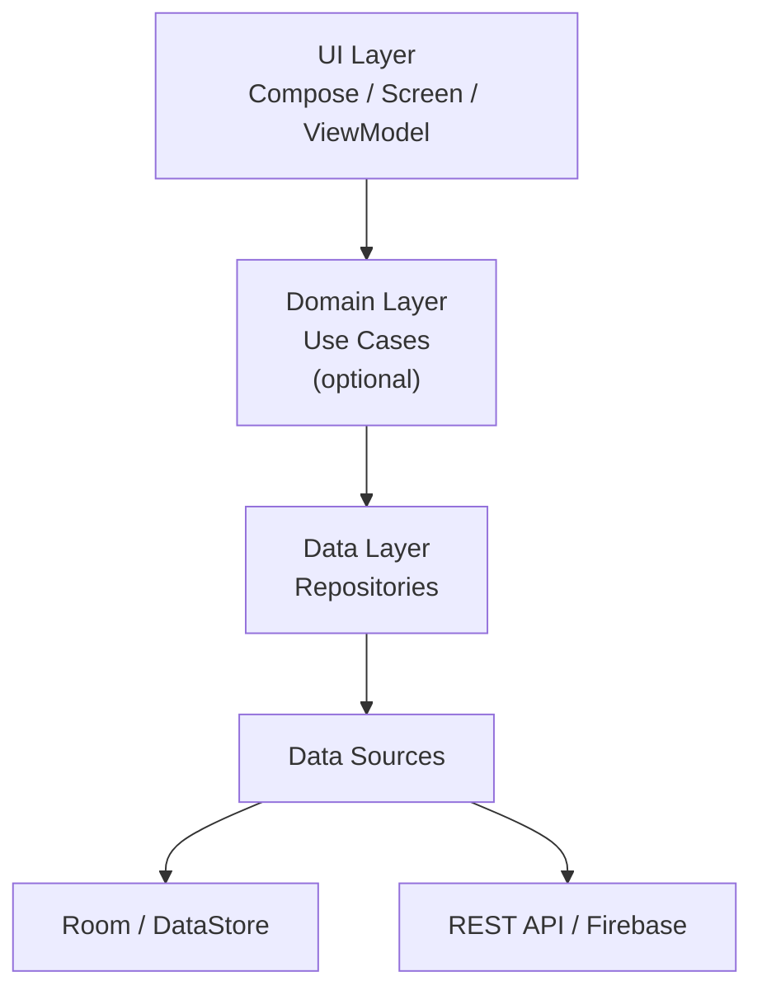
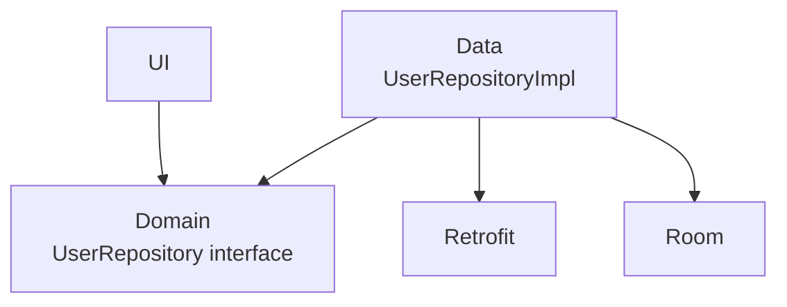
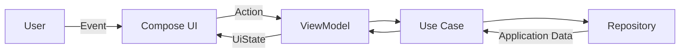
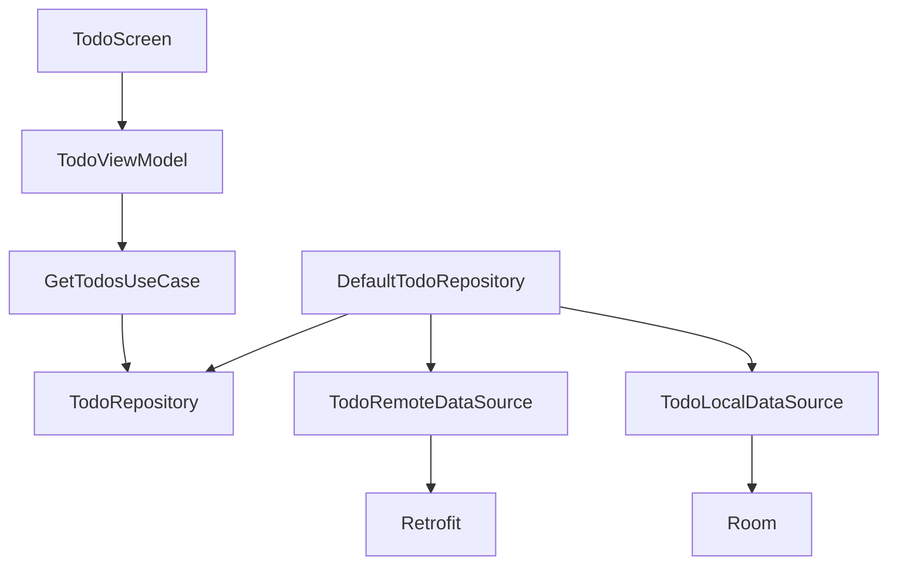
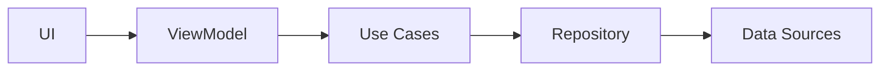

[](https://developer.android.com/topic/architecture/data-layer?utm_source=chatgpt.com)

# 009 - Clean Architecture Boundaries

| Thuộc tính              | Nội dung                                         |
| ----------------------- | ------------------------------------------------ |
| **Học phần**            | 03 - Architecture, State and Data                |
| **Module**              | Module 05 - Design and Architecture              |
| **Nhóm nội dung**       | Architectural Patterns                           |
| **Nguồn roadmap**       | Design and Architecture / Architectural Patterns |
| **Loại bài**            | Architecture                                     |
| **Thứ tự trong module** | 009                                              |
| **Thời lượng gợi ý**    | 34 phút                                          |

---

## 1. Tóm tắt

**Clean Architecture Boundaries** là cách đặt ra các **ranh giới trách nhiệm và phụ thuộc** giữa những phần khác nhau của ứng dụng.

Trong Android hiện đại, cách tư duy này thường được áp dụng bằng cách tách ứng dụng thành:

* **UI Layer** — hiển thị `UiState`, nhận thao tác người dùng.
* **Domain Layer** — chứa use case/business rule phức tạp hoặc cần tái sử dụng; đây là lớp **không bắt buộc**.
* **Data Layer** — quản lý dữ liệu thông qua repository và data source.
* **Infrastructure** — Room, Retrofit, Firebase, DataStore, Android Framework và các dịch vụ bên ngoài.

Android hiện khuyến nghị ứng dụng có ranh giới rõ ràng giữa **UI Layer** và **Data Layer**, trong khi Domain Layer nên được thêm khi business logic đủ phức tạp hoặc cần dùng lại ở nhiều ViewModel. ([Android Developers][1])

Mục tiêu không phải là tạo càng nhiều lớp càng tốt. Mục tiêu là:

> **Một thay đổi ở database, API hoặc UI không nên kéo theo việc phải sửa toàn bộ ứng dụng.**

---

## 2. Mục tiêu học tập

Sau bài này, bạn có thể:

* Giải thích được **architecture boundary** là gì.
* Phân biệt trách nhiệm của UI, Domain và Data.
* Biết thành phần nào **được phép** phụ thuộc vào thành phần nào.
* Tránh để `Activity`, `Composable` hoặc `ViewModel` truy cập Retrofit/Room trực tiếp.
* Thiết kế repository/use case sao cho có thể thay implementation.
* Tạo **test seam** bằng fake repository hoặc fake use case.
* Hiểu mối liên hệ giữa architecture boundary với lifecycle, state và UDF.
* Refactor một màn hình Android thành cấu trúc có ranh giới rõ ràng.

---

# 3. Clean Architecture Boundary là gì?

Một **boundary** có thể hiểu là đường ranh giới quy định:

1. Thành phần nào chịu trách nhiệm cho việc gì.
2. Thành phần nào được gọi thành phần nào.
3. Kiểu dữ liệu nào được phép đi qua ranh giới.
4. Chi tiết implementation nào không được phép rò rỉ sang layer khác.

Ví dụ:

```text
UI
│
│ UiEvent / UiState
▼
ViewModel
│
│ gọi business operation
▼
Use Case
│
│ gọi abstraction
▼
Repository
│
├── Local Data Source
│   └── Room / DataStore
│
└── Remote Data Source
    └── Retrofit / HTTP API
```

Android khuyến nghị UI không truy cập trực tiếp các nguồn dữ liệu như database, Firebase, GPS hoặc network provider; repository nên là entry point vào data layer. ([Android Developers][1])

---

## 4. Kiến trúc tổng thể


*Nguồn: Android Developers — Domain layer.*

Android mô tả Domain Layer là lớp **tùy chọn**, nằm giữa UI và Data. Nó hữu ích khi cần đóng gói business logic phức tạp hoặc logic được nhiều ViewModel sử dụng lại. ([Android Developers][2])

### Cách hiểu đơn giản



Với ứng dụng nhỏ:

```text
UI
 ↓
Repository
 ↓
Data Source
```

Với ứng dụng lớn hơn:

```text
UI
 ↓
Use Cases
 ↓
Repositories
 ↓
Data Sources
```

Không nên thêm Domain Layer chỉ để kiến trúc trông "chuyên nghiệp". Android cũng xem Domain Layer là optional và khuyến nghị nó chủ yếu khi complexity/reuse thực sự xuất hiện. ([Android Developers][1])

---

# 5. Boundary của UI Layer

UI Layer chịu trách nhiệm biến application data thành thứ người dùng có thể nhìn thấy và tương tác.


*Nguồn: Android Developers — UI Layer.*

Thông thường:

```text
UI Layer
├── Screen / Composable
├── UI components
├── UiState
├── UiEvent / actions
└── ViewModel / State Holder
```

### UI được phép làm

* Render `UiState`.
* Gửi action/event.
* Xử lý UI logic.
* Navigation.
* Animation.
* Hiển thị Snackbar/Dialog.
* Format những thứ gắn trực tiếp với Android UI resource.

### UI không nên làm

```kotlin
@Composable
fun ProfileScreen() {
    // ❌ UI gọi API trực tiếp
    retrofit.create(UserApi::class.java)
        .getUser()
}
```

Hoặc:

```kotlin
class ProfileViewModel : ViewModel() {

    // ❌ ViewModel tự tạo database
    private val db =
        Room.databaseBuilder(...).build()
}
```

Android khuyến nghị ViewModel/state holder lấy application data thông qua repository hoặc use case thay vì làm việc trực tiếp với data source. ([Android Developers][3])

---

# 6. Boundary của Domain Layer

Domain Layer tập trung vào **use case**.

Ví dụ:

```text
LoginUseCase
CreateOrderUseCase
GetUserProfileUseCase
CalculateCartTotalUseCase
BookmarkArticleUseCase
```

Một use case nên mô tả một hành động có ý nghĩa trong domain:

```kotlin
class GetUserProfileUseCase(
    private val repository: UserRepository
) {
    suspend operator fun invoke(
        userId: String
    ): User {
        return repository.getUser(userId)
    }
}
```

Thay vì ViewModel chứa:

```text
fetch user
+ check subscription
+ calculate permission
+ combine preferences
+ transform profile
```

ta có thể chuyển sang:

```text
ViewModel
    │
    ▼
GetUserProfileUseCase
    │
    ├── UserRepository
    ├── SubscriptionRepository
    └── PreferencesRepository
```

Use case đặc biệt hữu ích khi cần kết hợp nhiều repository hoặc tái sử dụng cùng business logic ở nhiều consumer. ([Android Developers][4])

---

## 6.1 Domain không phải nơi chứa mọi function

Không cần tạo:

```text
GetNameUseCase
GetAgeUseCase
GetEmailUseCase
SetButtonTextUseCase
ShowToastUseCase
```

chỉ để có "Clean Architecture".

Domain Layer đáng dùng khi boundary mang lại lợi ích thực:

```text
Business logic phức tạp
        │
        ├── Có
        │   ↓
        │ Use Case
        │
        └── Không
            ↓
      ViewModel → Repository
```

---

# 7. Boundary của Data Layer

Data Layer quản lý **application data**.


*Nguồn: Android Developers — Data Layer.*

Cấu trúc phổ biến:

```text
Data Layer
│
├── Repository
│
├── RemoteDataSource
│   └── Retrofit / Firebase
│
└── LocalDataSource
    ├── Room
    └── DataStore
```

Repository có thể:

* cung cấp dữ liệu cho layer phía trên;
* che giấu nguồn dữ liệu thực sự;
* phối hợp local + remote;
* xử lý conflict;
* quản lý mutation;
* chứa business logic liên quan trực tiếp đến dữ liệu.

Đây cũng là các trách nhiệm Android hiện mô tả cho repository. ([Android Developers][3])

---

## 7.1 Không để data source xuyên qua boundary

Không nên:

```text
ViewModel
   │
   ├──────────────→ Retrofit API
   │
   └──────────────→ Room DAO
```

Nên:

```text
ViewModel
   │
   ▼
Repository
   │
   ├──────────────→ RemoteDataSource
   │                    │
   │                    ▼
   │                  Retrofit
   │
   └──────────────→ LocalDataSource
                        │
                        ▼
                       Room
```

Android khuyến nghị các layer khác không truy cập data source trực tiếp; repository là entry point của Data Layer. ([Android Developers][3])

---

# 8. Hai loại dependency dễ bị nhầm

Đây là một phần quan trọng khi học Clean Architecture.

## Runtime flow

Khi app chạy:

```text
User
 ↓
UI
 ↓
ViewModel
 ↓
UseCase
 ↓
Repository
 ↓
API / Database
```

Sau đó dữ liệu quay trở lại:

```text
Database/API
 ↑
Repository
 ↑
UseCase
 ↑
ViewModel
 ↑
UiState
 ↑
UI
```

---

## Source-code dependency với Dependency Inversion

Một biến thể Clean Architecture nghiêm ngặt hơn có thể đặt repository **contract** ở Domain:



Ví dụ:

```kotlin
interface UserRepository {
    suspend fun getUser(id: String): User
}
```

Data Layer:

```kotlin
class DefaultUserRepository(
    private val remote: UserRemoteDataSource,
    private val local: UserLocalDataSource
) : UserRepository {

    override suspend fun getUser(
        id: String
    ): User {
        return local.getUser(id)
            ?: remote.getUser(id)
    }
}
```

Điểm quan trọng:

```text
Domain biết UserRepository

Domain KHÔNG cần biết:

Retrofit
Room
Firebase
SQLite
HTTP
JSON
Android Context
```

Đây là một cách áp dụng **Dependency Inversion** để boundary mạnh hơn. Nó không có nghĩa mọi dự án Android bắt buộc phải tổ chức repository interface theo đúng cách này.

---

# 9. Ví dụ hoàn chỉnh — Profile Screen

Giả sử ứng dụng có màn hình:

```text
ProfileScreen
```

yêu cầu:

1. Lấy profile từ server.
2. Cache xuống database.
3. Hiển thị loading.
4. Hiển thị profile.
5. Retry nếu lỗi.

---

## 9.1 Cấu trúc

```text
feature/profile/
│
├── ui/
│   ├── ProfileScreen.kt
│   ├── ProfileViewModel.kt
│   └── ProfileUiState.kt
│
├── domain/
│   ├── GetProfileUseCase.kt
│   ├── User.kt
│   └── UserRepository.kt
│
└── data/
    ├── DefaultUserRepository.kt
    ├── UserRemoteDataSource.kt
    ├── UserLocalDataSource.kt
    ├── UserDto.kt
    └── UserEntity.kt
```

---

# 10. Model boundary

Trong app phức tạp, không nhất thiết phải dùng cùng một model xuyên suốt mọi layer. Android hiện cũng khuyến nghị cân nhắc **model riêng cho từng layer** khi độ phức tạp của ứng dụng yêu cầu. ([Android Developers][1])

Ví dụ:

```text
Network
   │
   ▼
UserDto
   │ map
   ▼
User
   │ map
   ▼
UserUiModel
```

### Network model

```kotlin
data class UserDto(
    val user_id: String,
    val display_name: String?,
    val avatar_url: String?
)
```

### Domain model

```kotlin
data class User(
    val id: String,
    val name: String,
    val avatarUrl: String?
)
```

### UI model

```kotlin
data class UserUiModel(
    val displayName: String,
    val avatarUrl: String?,
    val initials: String
)
```

Boundary giúp ngăn kiểu:

```text
Retrofit DTO
 ↓
Room
 ↓
Domain
 ↓
ViewModel
 ↓
Compose
```

dùng chung một object cho mọi thứ.

---

# 11. Repository contract

```kotlin
interface UserRepository {

    suspend fun getUser(
        id: String
    ): User

    fun observeUser(
        id: String
    ): Flow<User>
}
```

Android khuyến nghị data layer thường expose:

* `suspend` function cho operation một lần;
* `Flow` cho dữ liệu thay đổi theo thời gian. ([Android Developers][3])

---

# 12. Repository implementation

```kotlin
class DefaultUserRepository(
    private val remoteDataSource: UserRemoteDataSource,
    private val localDataSource: UserLocalDataSource
) : UserRepository {

    override suspend fun getUser(
        id: String
    ): User {
        val cached = localDataSource.getUser(id)

        if (cached != null) {
            return cached.toDomain()
        }

        val remote = remoteDataSource.getUser(id)

        localDataSource.saveUser(
            remote.toEntity()
        )

        return remote.toDomain()
    }

    override fun observeUser(
        id: String
    ): Flow<User> {
        return localDataSource
            .observeUser(id)
            .map { entity ->
                entity.toDomain()
            }
    }
}
```

ViewModel không cần biết dữ liệu đến từ:

```text
Room?

Retrofit?

Firebase?

Memory cache?

File?

GraphQL?
```

Đó chính là giá trị của boundary.

---

# 13. Use Case

```kotlin
class GetProfileUseCase(
    private val repository: UserRepository
) {

    suspend operator fun invoke(
        userId: String
    ): User {
        require(userId.isNotBlank())

        return repository.getUser(userId)
    }
}
```

Domain use case nên có thể được gọi an toàn từ main thread; nếu bản thân use case thực hiện tác vụ blocking dài, nó phải chuyển công việc sang dispatcher phù hợp hoặc xem xét liệu operation đó có thuộc Data Layer hay không. ([Android Developers][4])

---

# 14. ViewModel

```kotlin
sealed interface ProfileUiState {

    data object Loading : ProfileUiState

    data class Success(
        val user: User
    ) : ProfileUiState

    data class Error(
        val message: String
    ) : ProfileUiState
}
```

```kotlin
class ProfileViewModel(
    private val getProfile: GetProfileUseCase
) : ViewModel() {

    private val _uiState =
        MutableStateFlow<ProfileUiState>(
            ProfileUiState.Loading
        )

    val uiState: StateFlow<ProfileUiState> =
        _uiState.asStateFlow()

    fun load(userId: String) {

        viewModelScope.launch {

            _uiState.value =
                ProfileUiState.Loading

            _uiState.value =
                runCatching {
                    getProfile(userId)
                }.fold(
                    onSuccess = {
                        ProfileUiState.Success(it)
                    },
                    onFailure = {
                        ProfileUiState.Error(
                            it.message
                                ?: "Đã xảy ra lỗi"
                        )
                    }
                )
        }
    }
}
```

---

# 15. Compose UI

```kotlin
@Composable
fun ProfileRoute(
    viewModel: ProfileViewModel
) {
    val uiState by viewModel.uiState
        .collectAsStateWithLifecycle()

    ProfileScreen(
        uiState = uiState,
        onRetry = {
            viewModel.load("123")
        }
    )
}
```

Android hiện khuyến nghị collect UI state theo lifecycle, chẳng hạn bằng `collectAsStateWithLifecycle()` trong Compose. ([Android Developers][1])

---

# 16. Boundary + Unidirectional Data Flow


*Nguồn: Android Developers — UI Layer.*

UDF có thể được hình dung:



Android mô tả UDF theo nguyên tắc:

```text
State ↓

ViewModel
    ↓
UiState
    ↓
UI

Event ↑

UI
    ↑
User interaction
```

ViewModel nhận action, cập nhật state và UI render state mới. ([Android Developers][5])

---

# 17. Boundary giúp xử lý lifecycle như thế nào?

Một kiến trúc xấu:

```text
Activity
 │
 ├── Network Request
 ├── Database
 ├── Business Logic
 └── UI State
```

Khi:

```text
Rotate screen
     ↓
Activity destroyed
     ↓
Activity recreated
```

nhiều trách nhiệm bị gắn trực tiếp với lifecycle của Activity.

Cách tốt hơn:

```text
Composable / Activity
       │
       ▼
   ViewModel
       │
       ▼
    UseCase
       │
       ▼
 Repository
```

`ViewModel` là state holder được Android khuyến nghị cho screen-level UI state và có thể tồn tại qua configuration changes. ([Android Developers][5])

Điều này không có nghĩa ViewModel tự động giải quyết mọi dạng process death; persistent application data vẫn cần được quản lý đúng ở Data Layer.

---

# 18. Boundary và Dependency Injection

Không nên:

```kotlin
class ProfileViewModel : ViewModel() {

    private val repository =
        DefaultUserRepository(
            RetrofitDataSource(),
            RoomDataSource()
        )
}
```

Vì ViewModel đang biết:

```text
implementation
+ network
+ database
+ construction
```

Nên dùng constructor injection:

```kotlin
class ProfileViewModel(
    private val getProfile:
        GetProfileUseCase
) : ViewModel()
```

Sau đó composition root/DI container chịu trách nhiệm nối:

```text
UserRepository
        │
        ▼
DefaultUserRepository
```

Constructor injection hiện cũng nằm trong nhóm recommendation chính thức về dependency management của Android. ([Android Developers][1])

---

# 19. Boundary tạo ra Test Seam

Một trong những lợi ích lớn nhất của ranh giới architecture là có thể thay implementation thật bằng implementation test.

Production:

```text
ViewModel
   │
   ▼
UserRepository
   │
   ▼
DefaultUserRepository
   │
   ├── Room
   └── Retrofit
```

Test:

```text
ViewModel
   │
   ▼
UserRepository
   │
   ▼
FakeUserRepository
```

---

## 19.1 Fake Repository

```kotlin
class FakeUserRepository :
    UserRepository {

    var user = User(
        id = "1",
        name = "An",
        avatarUrl = null
    )

    override suspend fun getUser(
        id: String
    ): User {
        return user
    }

    override fun observeUser(
        id: String
    ): Flow<User> {
        return flowOf(user)
    }
}
```

---

## 19.2 Test Use Case

```kotlin
@Test
fun `get profile returns user`() =
    runTest {

        val repository =
            FakeUserRepository()

        val useCase =
            GetProfileUseCase(repository)

        val result =
            useCase("1")

        assertEquals(
            "An",
            result.name
        )
    }
```

Android hiện khuyến nghị tối thiểu nên có test cho ViewModel, repository/data source và các navigation flow cần regression protection; tài liệu cũng ưu tiên **fakes** hơn mocks trong nhiều trường hợp. ([Android Developers][1])

---

# 20. Ví dụ boundary tốt và xấu

## ❌ Boundary bị phá

```text
ProfileScreen
     │
     ▼
ProfileViewModel
     │
     ├────→ Retrofit
     │
     ├────→ Room DAO
     │
     └────→ SharedPreferences
```

ViewModel biết quá nhiều implementation detail.

---

## ✅ Boundary rõ ràng

```text
ProfileScreen
     │
     ▼
ProfileViewModel
     │
     ▼
GetProfileUseCase
     │
     ▼
UserRepository
     │
     ▼
DefaultUserRepository
     │
     ├────→ UserLocalDataSource
     │          └── Room
     │
     └────→ UserRemoteDataSource
                └── Retrofit
```

---

# 21. Quy tắc kiểm tra boundary

Khi review code, có thể hỏi:

### UI Layer

```text
Composable có gọi Retrofit không?
```

Nếu có:

```text
❌ Boundary violation
```

### ViewModel

```text
ViewModel có gọi DAO trực tiếp không?
```

```text
❌ Boundary violation
```

### Domain

```text
UseCase có import Retrofit / Room / Android View không?
```

```text
⚠️ Kiểm tra lại thiết kế
```

### Data

```text
Repository có che giấu chi tiết remote/local không?
```

```text
✅ Good boundary
```

---

# 22. Architecture Dependency Test bằng tư duy import

Một mẹo rất hữu ích:

> **Nhìn vào `import` để kiểm tra kiến trúc.**

Ví dụ trong Domain:

```kotlin
import retrofit2.Retrofit
```

hoặc:

```kotlin
import androidx.room.Dao
```

có thể là dấu hiệu implementation detail đang xuyên qua boundary.

Domain lý tưởng thường chỉ cần những thứ dạng:

```kotlin
import kotlinx.coroutines.flow.Flow
```

và các model/contract thuần Kotlin của ứng dụng.

---

# 23. Package không đồng nghĩa với boundary

Có cấu trúc:

```text
ui/
domain/
data/
```

chưa chắc đã là Clean Architecture.

Ví dụ:

```text
ui/ProfileViewModel.kt
        │
        ▼
data/UserApi.kt
```

vẫn phá boundary.

Boundary thực sự nằm ở:

```text
Dependency
+
Responsibility
+
Data ownership
+
API exposed between layers
```

chứ không chỉ ở tên folder.

---

# 24. Package-by-layer và Package-by-feature

## Package-by-layer

```text
app/
├── ui/
├── domain/
└── data/
```

Dễ hiểu với project nhỏ.

---

## Package-by-feature

```text
app/
├── profile/
│   ├── ui/
│   ├── domain/
│   └── data/
│
├── cart/
│   ├── ui/
│   ├── domain/
│   └── data/
│
└── checkout/
    ├── ui/
    ├── domain/
    └── data/
```

Thường dễ scale theo feature hơn khi codebase lớn.

---

# 25. Multi-module Architecture

Khi project lớn hơn:

```text
:app
│
├── :feature:profile
│      ├── :profile:ui
│      ├── :profile:domain
│      └── :profile:data
│
├── :feature:cart
│
└── :core
       ├── :core:network
       ├── :core:database
       ├── :core:model
       └── :core:designsystem
```

Module boundary còn mạnh hơn package boundary vì Gradle có thể ngăn dependency không hợp lệ ngay ở build time.

Ví dụ:

```text
:profile:domain

KHÔNG dependency

:core:network
```

thì developer không thể vô tình import Retrofit implementation vào domain module.

---

# 26. Boundary và lỗi network

Boundary tốt giúp lỗi network được biến đổi theo từng tầng.

Ví dụ:

```text
HTTP 401
   ↓
Network exception
   ↓
Repository
   ↓
Authentication error
   ↓
UseCase
   ↓
UiState.RequiresLogin
   ↓
UI
```

Thay vì:

```text
Composable
    ↓
if (response.code() == 401)
```

UI chỉ cần biết:

```kotlin
sealed interface ProfileUiState {
    data object Loading : ProfileUiState

    data class Success(
        val user: User
    ) : ProfileUiState

    data object RequiresLogin :
        ProfileUiState

    data object NetworkError :
        ProfileUiState
}
```

UI không cần biết HTTP code, Retrofit exception hoặc database implementation.

---

# 27. Single Source of Truth

Một boundary tốt cũng giúp xác định:

```text
Ai thực sự sở hữu dữ liệu này?
```

Ví dụ offline-first:

```text
Network
   │
   ▼
Repository
   │
   ▼
Room
   │
   ▼
Flow<User>
   │
   ▼
ViewModel
   │
   ▼
UI
```

Thay vì:

```text
Network ───→ UI
Room ──────→ UI
Cache ─────→ UI
ViewModel ─→ UI
```

khiến UI nhận nhiều phiên bản khác nhau của cùng một state.

Android nhấn mạnh data ownership, immutable state và tránh nhiều nguồn cùng cạnh tranh quyền sở hữu cùng một dữ liệu. ([Android Developers][3])

---

# 28. Những lỗi phổ biến

## 28.1 God ViewModel

```text
ProfileViewModel
├── HTTP
├── database
├── analytics
├── validation
├── navigation
├── formatting
├── permissions
├── business rules
└── caching
```

ViewModel trở thành nơi chứa mọi logic.

---

## 28.2 Repository chỉ làm proxy vô nghĩa

```kotlin
class UserRepository(
    private val api: UserApi
) {
    suspend fun getUser() =
        api.getUser()
}
```

Điều này đôi khi vẫn chấp nhận được, đặc biệt khi boundary cần cho khả năng phát triển sau này, nhưng không nên tiếp tục tạo hàng loạt abstraction không mang lại giá trị thực.

Android hiện vẫn strongly recommend repository làm API của Data Layer, kể cả khi hiện tại repository chỉ có một data source. ([Android Developers][1])

---

## 28.3 Use Case Explosion

```text
GetUsernameUseCase
GetUserEmailUseCase
GetUserAgeUseCase
GetUserAvatarUseCase
```

cho một màn hình rất đơn giản.

Kết quả:

```text
100 business operations
→ 300 class
→ architecture khó đọc hơn business
```

Architecture phải giảm complexity, không tạo thêm complexity.

---

## 28.4 Framework leakage

```text
Domain
 ↓
android.content.Context
```

hoặc:

```text
Domain
 ↓
Retrofit Response<UserDto>
```

hoặc:

```text
UI
 ↓
Room Entity
```

Đây thường là tín hiệu boundary đang bị rò rỉ.

---

# 29. Khi nào nên dùng Clean Architecture đầy đủ?

### App đơn giản

```text
UI
 ↓
Repository
 ↓
DataSource
```

có thể đã đủ.

### App trung bình

```text
UI
 ↓
ViewModel
 ↓
UseCases quan trọng
 ↓
Repository
```

### App lớn

```text
Feature UI
    ↓
Domain
    ↓
Contracts
    ↑
Data implementations

+ DI
+ modules
+ independent tests
```

Mức độ architecture nên tăng cùng complexity của sản phẩm, thay vì mặc định tạo toàn bộ ceremony ngay từ đầu.

---

# 30. Thực hành

Giả sử project hiện tại:

```text
TodoScreen
    │
    ▼
TodoViewModel
    │
    ├── TodoApi
    └── TodoDao
```

Hãy refactor thành:



---

# 31. Bài tập

## Yêu cầu

Refactor một màn hình Android hiện có sao cho:

```text
UI
 ↓
ViewModel
 ↓
UseCase
 ↓
Repository
 ↓
DataSource
```

### Bước 1 — tìm boundary violation

Tìm các dependency:

```text
UI → Retrofit
UI → Room
ViewModel → Retrofit
ViewModel → DAO
```

---

### Bước 2 — tạo Repository

```kotlin
interface ProductRepository {
    suspend fun getProducts():
        List<Product>
}
```

---

### Bước 3 — tạo Fake

```kotlin
class FakeProductRepository :
    ProductRepository {

    override suspend fun getProducts() =
        listOf(
            Product(
                id = "1",
                name = "Keyboard"
            )
        )
}
```

---

### Bước 4 — viết test

```text
FakeRepository
      ↓
UseCase
      ↓
ViewModel
      ↓
UiState.Success
```

---

### Bước 5 — kiểm tra lifecycle

Xoay màn hình:

```text
Portrait
 ↓
Landscape
```

Kiểm tra:

* state có bị mất không;
* request có bị gọi thừa không;
* UI có render lại đúng state không.

---

# 32. Artifact cho portfolio

Một artifact tốt cho bài này có thể gồm:

```text
clean-architecture-demo/
│
├── README.md
├── architecture.md
├── screenshots/
├── app/
├── domain/
├── data/
└── tests/
```

Trong `README.md`, thêm diagram:



và mô tả ngắn:

> UI không biết dữ liệu được lấy bằng Retrofit hay Room.
> Domain làm việc với abstraction.
> Data Layer chịu trách nhiệm implementation.
> Các dependency được inject để có thể thay bằng fake trong unit test.

Artifact như vậy thể hiện khả năng thiết kế kiến trúc rõ hơn nhiều so với chỉ viết `"Used Clean Architecture"` trong CV.

---

# 33. Checklist hoàn thành

## Kiến thức

* [ ] Giải thích được architecture boundary.
* [ ] Phân biệt UI / Domain / Data.
* [ ] Biết Domain Layer là optional.
* [ ] Phân biệt runtime flow với source dependency.
* [ ] Hiểu Dependency Inversion.
* [ ] Hiểu Repository boundary.

## Code

* [ ] UI không gọi API trực tiếp.
* [ ] UI không gọi DAO trực tiếp.
* [ ] ViewModel không tạo Retrofit.
* [ ] ViewModel không tạo Room database.
* [ ] Data source được ẩn sau repository.
* [ ] Business rule phức tạp được tách hợp lý.
* [ ] Dependency được constructor-inject.
* [ ] Có fake repository.

## State & lifecycle

* [ ] `UiState` có owner rõ ràng.
* [ ] State được expose theo UDF.
* [ ] Compose collect state lifecycle-aware.
* [ ] Rotation không làm application data mất vô lý.
* [ ] Network result không phụ thuộc trực tiếp vào lifecycle của Composable.

## Testing

* [ ] Repository test.
* [ ] Use case test nếu có.
* [ ] ViewModel test.
* [ ] Có fake thay implementation thật.
* [ ] Error state được test.

## Production

* [ ] Network error có mapping.
* [ ] Authentication error có mapping.
* [ ] Local/remote conflict có policy rõ.
* [ ] Không expose DTO/Entity tùy tiện sang UI.
* [ ] Logging không phá abstraction.
* [ ] Có release regression test cho user flow quan trọng.

---

# 34. Ghi chú production

Khi đưa architecture này vào production, hãy luôn đặt các câu hỏi:

```text
Ai sở hữu state?
        │
        ▼
Ai được phép thay đổi state?
        │
        ▼
Ai xử lý business rule?
        │
        ▼
Ai truy cập network/database?
        │
        ▼
Layer phía trên biết bao nhiêu
implementation detail?
```

Và tiếp tục với:

```text
User Flow
   │
   ├── Loading?
   ├── Success?
   ├── Empty?
   ├── Offline?
   ├── Retry?
   ├── Authentication expired?
   └── Process recreated?
```

Boundary tốt không chỉ giúp code "đẹp".

Nó trực tiếp ảnh hưởng tới:

```text
Maintainability
      +
Testability
      +
Debugging
      +
State consistency
      +
Ability to replace technology
      +
Release confidence
```

---

# 35. Ghi nhớ nhanh

```text
UI
│
│ "Hiển thị gì?"
▼
ViewModel
│
│ "State hiện tại là gì?"
▼
Domain
│
│ "Business rule là gì?"
▼
Repository
│
│ "Lấy/lưu dữ liệu bằng cách nào?"
▼
Data Sources
│
├── Network
├── Database
├── DataStore
└── External services
```

Quy tắc quan trọng nhất:

> **Layer phía trên nên biết càng ít implementation detail của layer phía dưới càng tốt.**

Và với Android hiện đại:

> **UI không truy cập data source trực tiếp; repository là boundary chính của Data Layer. Domain Layer chỉ nên được thêm khi complexity hoặc reuse thực sự cần nó.** ([Android Developers][3])

---

## Tài liệu tham khảo

* [Guide to app architecture — Android Developers](https://developer.android.com/topic/architecture)
* [Recommendations for Android architecture — Android Developers](https://developer.android.com/topic/architecture/recommendations)
* [UI Layer — Android Developers](https://developer.android.com/topic/architecture/ui-layer)
* [Domain Layer — Android Developers](https://developer.android.com/topic/architecture/domain-layer)
* [Data Layer — Android Developers](https://developer.android.com/topic/architecture/data-layer)

Các recommendation architecture của Android được cập nhật trong năm 2026 và hiện nhấn mạnh rõ UI/Data boundaries, repository, UDF, lifecycle-aware state collection, constructor injection và testing bằng fakes. ([Android Developers][1])

[1]: https://developer.android.com/topic/architecture/recommendations "Recommendations for Android architecture  |  App architecture  |  Android Developers"
[2]: https://developer.android.com/topic/architecture "Guide to app architecture  |  App architecture  |  Android Developers"
[3]: https://developer.android.com/topic/architecture/data-layer "Data layer  |  App architecture  |  Android Developers"
[4]: https://developer.android.com/topic/architecture/domain-layer "Domain layer  |  App architecture  |  Android Developers"
[5]: https://developer.android.com/topic/architecture/ui-layer "UI layer  |  App architecture  |  Android Developers"
