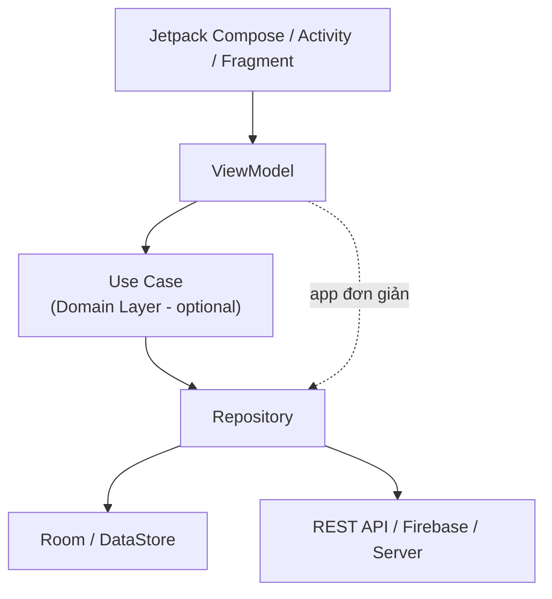
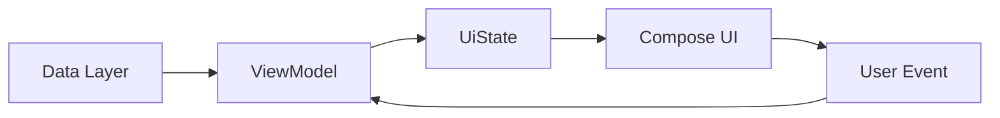
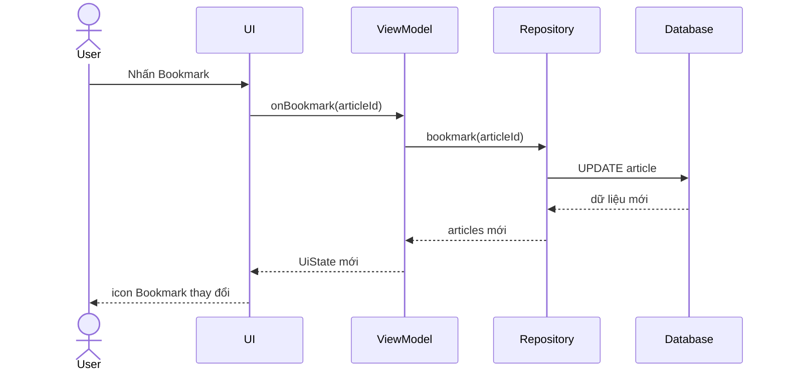
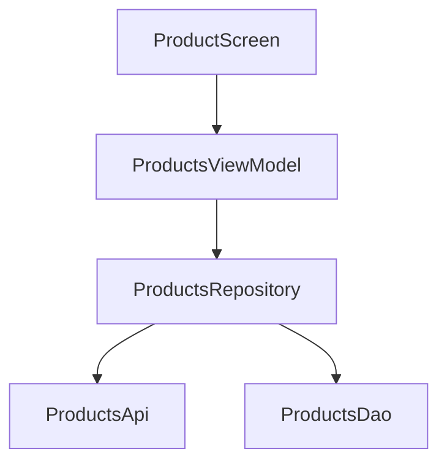
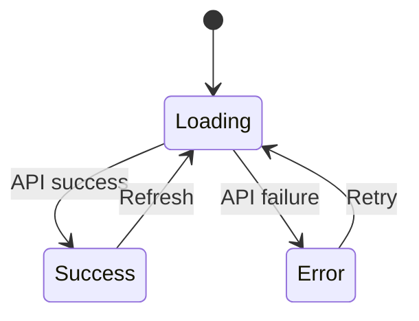
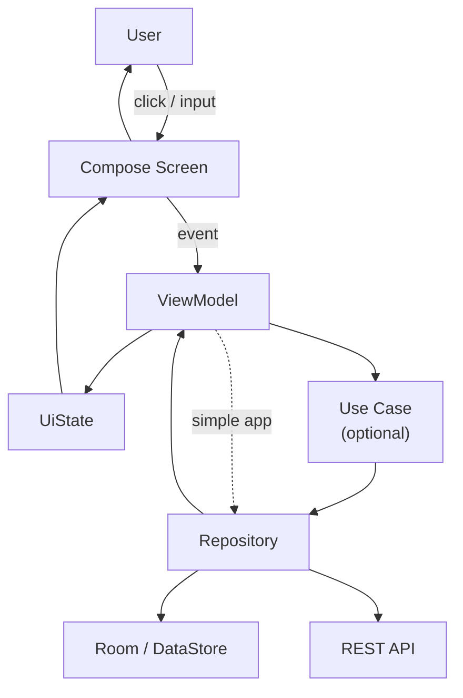

[](https://developer.android.com/topic/libraries/architecture/viewmodel?utm_source=chatgpt.com)

# 010 - ViewModel

| Thuộc tính              | Nội dung                                                  |
| ----------------------- | --------------------------------------------------------- |
| **Học phần**            | 03 - Architecture, State and Data                         |
| **Module**              | Module 05 - Design and Architecture                       |
| **Nhóm nội dung**       | Android Architecture Components                           |
| **Nguồn roadmap**       | Design and Architecture / Android Architecture Components |
| **Loại bài**            | UI / Architecture                                         |
| **Thứ tự trong module** | 010                                                       |
| **Thời lượng gợi ý**    | 30 phút                                                   |

---

## 1. Tóm tắt

**ViewModel** là một thành phần của Android Jetpack dùng làm **screen-level state holder**: nó giữ và cung cấp trạng thái cho UI, xử lý các sự kiện liên quan đến màn hình và kết nối UI với domain/data layer.

Lợi ích quan trọng nhất của `ViewModel` là trạng thái mà nó đang giữ có thể tiếp tục tồn tại qua các **configuration change**, ví dụ xoay màn hình làm `Activity` bị hủy rồi tạo lại. Android hiện khuyến nghị dùng `ViewModel` để quản lý state ở cấp màn hình, thay vì nhét state và logic trực tiếp vào `Activity`, `Fragment` hoặc composable. ([Android Developers][1])

> Ý tưởng cốt lõi:
>
> **UI không nên tự quản lý toàn bộ dữ liệu của màn hình. UI hiển thị `UiState`, gửi event lên `ViewModel`; `ViewModel` xử lý event và tạo ra state mới.**

---

## 2. Mục tiêu học tập

Sau bài này, bạn có thể:

* Giải thích `ViewModel` là gì và nó nằm ở đâu trong kiến trúc Android.
* Phân biệt state trong composable với state nên được đưa lên `ViewModel`.
* Hiểu vòng đời của `ViewModel`.
* Biết tại sao state trong `ViewModel` không mất khi xoay màn hình.
* Phân biệt:

  * configuration change;
  * process death;
  * `ViewModel`;
  * `SavedStateHandle`.
* Kết hợp `ViewModel` với:

  * `StateFlow`;
  * `collectAsStateWithLifecycle()`;
  * `viewModelScope`;
  * Repository;
  * Jetpack Compose.
* Viết unit test đơn giản cho `ViewModel`.
* Nhận biết các anti-pattern phổ biến.

---

# 3. ViewModel là gì?

Theo Android Developers, `ViewModel` là một **business-logic hoặc screen-level state holder** có nhiệm vụ cung cấp state cho UI và đóng gói logic liên quan tới việc tạo state của màn hình. ([Android Developers][1])

Một màn hình thông thường có thể được hình dung như sau:

```text
User
 │
 │ interaction
 ▼
UI / Compose
 │
 │ event
 ▼
ViewModel
 │
 │ request / command
 ▼
Repository / Use Case
 │
 ▼
Database / Network / Cache
```

Dữ liệu quay ngược trở lại:

```text
Database / Network
        │
        ▼
    Repository
        │
        ▼
     ViewModel
        │
        │ UiState
        ▼
       UI
```

`ViewModel` vì vậy đóng vai trò như cầu nối giữa **UI** và phần còn lại của ứng dụng.

---

# 4. ViewModel nằm ở đâu trong kiến trúc Android?

Android hiện khuyến nghị kiến trúc tối thiểu gồm:

```text
UI Layer
   ↓
Data Layer
```

và có thể thêm:

```text
UI Layer
   ↓
Domain Layer
   ↓
Data Layer
```

Trong đó `ViewModel` thuộc **UI Layer**, thường đứng giữa UI element và domain/data layer. ([Android Developers][2])


*Nguồn ảnh: Android Developers.*

Chi tiết hơn:


*Nguồn ảnh: Android Developers.*

### Sơ đồ kiến trúc



### Trách nhiệm nên phân chia

| Thành phần  | Trách nhiệm                                             |
| ----------- | ------------------------------------------------------- |
| UI          | Render state, nhận thao tác người dùng                  |
| ViewModel   | Tạo `UiState`, xử lý screen event                       |
| Use Case    | Logic nghiệp vụ cần tái sử dụng hoặc tương đối phức tạp |
| Repository  | Quản lý và cung cấp application data                    |
| Data Source | Room, Retrofit, DataStore, file, API...                 |

Không nên để UI trực tiếp gọi Retrofit/Room nếu ứng dụng đã sử dụng kiến trúc phân lớp.

---

# 5. ViewModel và Unidirectional Data Flow

Một mô hình rất quan trọng khi sử dụng `ViewModel` là **Unidirectional Data Flow — UDF**.

Android mô tả luồng cơ bản như sau:

* application data đi từ data layer → `ViewModel`;
* `ViewModel` tạo `UiState`;
* `UiState` đi xuống UI;
* event của người dùng đi từ UI → `ViewModel`;
* `ViewModel` xử lý event và tạo state tiếp theo. ([Android Developers][3])


*Nguồn ảnh: Android Developers.*

Có thể biểu diễn bằng Mermaid:



Hay rút gọn thành:

```text
State ↓
ViewModel ─────────► UI

Event ↑
ViewModel ◄───────── UI
```

### Ví dụ

Người dùng nhấn:

```text
[ Bookmark ]
```

Luồng xử lý:



Android minh họa chính luồng này trong kiến trúc UI chính thức: ([Android Developers][3])


*Nguồn ảnh: Android Developers.*

---

# 6. UI State

`ViewModel` thường không nên cung cấp hàng loạt biến rời rạc cho UI.

Thay vào đó, có thể gom dữ liệu cần render vào một immutable `UiState`.

Ví dụ:

```kotlin
data class ProfileUiState(
    val name: String = "",
    val avatarUrl: String = "",
    val isLoading: Boolean = false,
    val errorMessage: String? = null
)
```

UI chỉ cần nhận:

```kotlin
ProfileUiState
```

và quyết định render:

```text
isLoading = true
        ↓
ProgressIndicator

errorMessage != null
        ↓
Error message

name + avatarUrl
        ↓
Profile content
```

Android khuyến nghị state được UI sử dụng nên được quản lý sao cho UI tập trung vào nhiệm vụ **đọc state và render**, đồng thời tránh việc có nhiều nguồn cùng sửa một state gây ra dữ liệu không nhất quán. ([Android Developers][3])

---

# 7. Ví dụ ViewModel cơ bản

Ta xây dựng một màn hình counter:

```text
┌──────────────────────┐
│       Counter        │
│                      │
│          12          │
│                      │
│   [-]          [+]   │
│                      │
│        Reset         │
└──────────────────────┘
```

## 7.1 Định nghĩa `UiState`

```kotlin
data class CounterUiState(
    val count: Int = 0
)
```

---

## 7.2 Tạo `CounterViewModel`

```kotlin
import androidx.lifecycle.ViewModel
import kotlinx.coroutines.flow.MutableStateFlow
import kotlinx.coroutines.flow.StateFlow
import kotlinx.coroutines.flow.asStateFlow
import kotlinx.coroutines.flow.update

class CounterViewModel : ViewModel() {

    private val _uiState = MutableStateFlow(
        CounterUiState()
    )

    val uiState: StateFlow<CounterUiState> =
        _uiState.asStateFlow()

    fun increment() {
        _uiState.update { currentState ->
            currentState.copy(
                count = currentState.count + 1
            )
        }
    }

    fun decrement() {
        _uiState.update { currentState ->
            currentState.copy(
                count = currentState.count - 1
            )
        }
    }

    fun reset() {
        _uiState.value = CounterUiState()
    }
}
```

Điểm đáng chú ý:

```text
MutableStateFlow
```

chỉ nằm bên trong `ViewModel`.

UI chỉ nhận:

```text
StateFlow
```

Do đó UI có thể **đọc state nhưng không trực tiếp sửa state**.

```text
private MutableStateFlow
          │
          ▼
      ViewModel
          │
          ▼
 public StateFlow
          │
          ▼
          UI
```

Cách làm này phù hợp với nguyên tắc UI state có một owner rõ ràng và UI không trực tiếp sửa state do state holder cung cấp. ([Android Developers][3])

---

# 8. Kết nối ViewModel với Jetpack Compose

Tạo composable ở cấp route:

```kotlin
import androidx.compose.runtime.Composable
import androidx.compose.runtime.getValue
import androidx.lifecycle.compose.collectAsStateWithLifecycle
import androidx.lifecycle.viewmodel.compose.viewModel

@Composable
fun CounterRoute(
    viewModel: CounterViewModel = viewModel()
) {
    val uiState by
        viewModel.uiState.collectAsStateWithLifecycle()

    CounterScreen(
        uiState = uiState,
        onIncrement = viewModel::increment,
        onDecrement = viewModel::decrement,
        onReset = viewModel::reset
    )
}
```

Đối với Android Compose, `collectAsStateWithLifecycle()` hiện là API được Android khuyến nghị để collect `Flow` theo lifecycle của UI. Khi UI không còn ở lifecycle thích hợp, việc collection có thể được dừng để tránh sử dụng tài nguyên không cần thiết. ([Android Developers][4])

---

# 9. Tách Route và Screen

Một pattern hữu ích là:

```text
CounterRoute
     │
     │ ViewModel
     ▼
CounterScreen
     │
     │ state + callbacks
     ▼
Reusable UI
```

### `CounterRoute`

Biết về:

```text
ViewModel
StateFlow
Lifecycle
```

### `CounterScreen`

Không cần biết `ViewModel` tồn tại.

```kotlin
@Composable
fun CounterScreen(
    uiState: CounterUiState,
    onIncrement: () -> Unit,
    onDecrement: () -> Unit,
    onReset: () -> Unit
) {
    Column {

        Text(
            text = uiState.count.toString()
        )

        Row {
            Button(onClick = onDecrement) {
                Text("-")
            }

            Button(onClick = onIncrement) {
                Text("+")
            }
        }

        Button(onClick = onReset) {
            Text("Reset")
        }
    }
}
```

Lợi ích:

```text
ViewModel
   │
   ▼
Route
   │
   ├── state
   └── callback
         │
         ▼
      Screen
```

`CounterScreen` trở thành một composable gần như stateless và có thể Preview/test dễ hơn.

---

# 10. Điều gì xảy ra khi xoay màn hình?

Giả sử:

```text
Count = 15
```

Người dùng xoay:

```text
Portrait
   ↓
Landscape
```

Android có thể:

```text
Activity cũ
    │
    ▼
onDestroy()

Activity mới
    │
    ▼
onCreate()
```

Nhưng nếu Activity vẫn thuộc cùng logical scope, `ViewModel` được giữ lại qua configuration change. ([Android Developers][1])

Do đó:

```text
Before rotation
Activity A
   │
   └── ViewModel(count = 15)

        ROTATE
          │
          ▼

After rotation
Activity B
   │
   └── same ViewModel
        count = 15
```

---

# 11. Lifecycle của ViewModel

Đây là sơ đồ chính thức từ Android Developers:


*Nguồn ảnh: Android Developers.*

Điểm quan trọng là:

```text
Activity created
      │
      ▼
ViewModel created
      │
      │
      ├── Activity rotate
      │
      │   Activity instance bị recreate
      │
      │   ViewModel vẫn tồn tại
      │
      ▼
Activity finish()
      │
      ▼
ViewModel cleared
      │
      ▼
onCleared()
```

Một `ViewModel` tồn tại đến khi `ViewModelStoreOwner` tương ứng biến mất thực sự. Với Activity, điều này thường là khi Activity kết thúc; với Navigation destination, khi entry bị xóa khỏi back stack. ([Android Developers][1])

---

# 12. `onCleared()`

Khi `ViewModel` không còn cần thiết:

```kotlin
override fun onCleared() {
    super.onCleared()

    // cleanup nếu cần
}
```

`onCleared()` không phải:

```text
onDestroy() của Activity
```

Hai lifecycle này khác nhau.

```text
Activity onDestroy()
        │
        ├── configuration change
        │       │
        │       └── ViewModel vẫn tồn tại
        │
        └── Activity thực sự kết thúc
                │
                └── ViewModel onCleared()
```

`viewModelScope` cũng được gắn với lifecycle của `ViewModel`; khi ViewModel bị clear, coroutine scope đó được hủy. ([Android Developers][1])

---

# 13. ViewModel không phải persistent storage

Một nhầm lẫn rất phổ biến:

```text
ViewModel = lưu dữ liệu vĩnh viễn
```

**Sai.**

`ViewModel` chủ yếu giúp giữ state khi UI controller bị recreate do configuration change.

Nếu Android giết **toàn bộ process**, instance `ViewModel` cũng mất. Android khuyến nghị dùng `SavedStateHandle` cho một lượng nhỏ state cần phục hồi sau system-initiated process death, và dùng data layer/persistent storage cho dữ liệu lớn hoặc dữ liệu nghiệp vụ. ([Android Developers][5])

### So sánh

| Trường hợp                |         ViewModel |         SavedStateHandle | Room/DataStore |
| ------------------------- | ----------------: | -----------------------: | -------------: |
| Recomposition             |                 ✅ |                        ✅ |              ✅ |
| Rotate màn hình           |                 ✅ |                        ✅ |              ✅ |
| Configuration change      |                 ✅ |                        ✅ |              ✅ |
| System process recreation | ❌ instance cũ mất |              ✅ state nhỏ |              ✅ |
| App khởi động lại lâu dài |                 ❌ | Không phải storage chính |              ✅ |
| Lưu dữ liệu lớn           |                 ❌ |                        ❌ |              ✅ |

---

# 14. SavedStateHandle

Ví dụ một màn hình tìm kiếm.

Người dùng nhập:

```text
"android architecture"
```

Nếu đây là state nhỏ cần phục hồi sau process recreation, có thể lưu query bằng `SavedStateHandle`.

```kotlin
import androidx.lifecycle.SavedStateHandle
import androidx.lifecycle.ViewModel
import kotlinx.coroutines.flow.StateFlow

class SearchViewModel(
    private val savedStateHandle: SavedStateHandle
) : ViewModel() {

    val query: StateFlow<String> =
        savedStateHandle.getStateFlow(
            key = "query",
            initialValue = ""
        )

    fun onQueryChange(newQuery: String) {
        savedStateHandle["query"] = newQuery
    }
}
```

Luồng:

```text
User nhập query
      │
      ▼
ViewModel
      │
      ▼
SavedStateHandle
      │
      ├── configuration change
      │
      └── process recreation
              │
              ▼
          restore query
```

Android khuyến nghị `SavedStateHandle` chỉ nên lưu **state nhỏ cần thiết để phục hồi UI**, ví dụ ID, filter hoặc query; không nên nhét object lớn hay danh sách dữ liệu lớn vào Bundle. ([Android Developers][5])

---

# 15. ViewModel + Repository

Ứng dụng thực tế thường có:



Ví dụ:

```kotlin
interface ProductRepository {
    suspend fun getProducts(): List<Product>
}
```

ViewModel:

```kotlin
data class ProductsUiState(
    val products: List<Product> = emptyList(),
    val isLoading: Boolean = false,
    val errorMessage: String? = null
)
```

```kotlin
class ProductsViewModel(
    private val repository: ProductRepository
) : ViewModel() {

    private val _uiState =
        MutableStateFlow(ProductsUiState())

    val uiState =
        _uiState.asStateFlow()

    fun loadProducts() {
        viewModelScope.launch {

            _uiState.update {
                it.copy(
                    isLoading = true,
                    errorMessage = null
                )
            }

            runCatching {
                repository.getProducts()
            }.onSuccess { products ->

                _uiState.update {
                    it.copy(
                        products = products,
                        isLoading = false
                    )
                }

            }.onFailure { throwable ->

                _uiState.update {
                    it.copy(
                        isLoading = false,
                        errorMessage =
                            throwable.message
                                ?: "Unknown error"
                    )
                }
            }
        }
    }
}
```

`ViewModel` có thể dùng `viewModelScope` cho công việc coroutine gắn với lifecycle của màn hình. Android đồng thời khuyến nghị công việc ở ViewModel phải **main-safe**, còn data/domain layer chịu trách nhiệm chuyển những công việc blocking sang dispatcher phù hợp. ([Android Developers][3])

---

# 16. State machine của một màn hình thực tế

Một màn hình network thường không chỉ có:

```text
data
```

mà có nhiều trạng thái:



Có thể model bằng sealed interface:

```kotlin
sealed interface ProductsUiState {

    data object Loading : ProductsUiState

    data class Success(
        val products: List<Product>
    ) : ProductsUiState

    data class Error(
        val message: String
    ) : ProductsUiState
}
```

UI:

```kotlin
when (val state = uiState) {

    ProductsUiState.Loading -> {
        CircularProgressIndicator()
    }

    is ProductsUiState.Success -> {
        ProductList(state.products)
    }

    is ProductsUiState.Error -> {
        ErrorContent(
            message = state.message,
            onRetry = viewModel::loadProducts
        )
    }
}
```

Đây là một cách làm rất phù hợp với UDF:

```text
Event
  ↓
ViewModel
  ↓
New UiState
  ↓
Compose
  ↓
Render
```

---

# 17. Dependency Injection với ViewModel

Khi `ViewModel` có dependency:

```kotlin
class ProductsViewModel(
    private val repository: ProductRepository
) : ViewModel()
```

không nên để `ViewModel` tự tạo:

```kotlin
class ProductsViewModel : ViewModel() {

    // Không nên
    private val repository =
        ProductsRepositoryImpl(
            Retrofit.Builder()
                // ...
                .build()
        )
}
```

Thay vào đó dependency nên được inject:

```text
DI Container
     │
     ├── Repository
     │
     └── ViewModel
```

Android hỗ trợ tạo ViewModel có constructor dependencies thông qua `ViewModelProvider.Factory`; với Hilt, factory cần thiết được generate cho ViewModel được quản lý bởi Hilt. ([Android Developers][6])

---

# 18. Scope của ViewModel

Một ViewModel luôn gắn với một `ViewModelStoreOwner`. Android hỗ trợ nhiều scope khác nhau như Activity hoặc Navigation back stack entry. ([Android Developers][1])

Ví dụ:

```text
Activity
│
├── HomeScreen
├── SearchScreen
└── ProfileScreen
```

Một Activity-scoped ViewModel có thể sống lâu hơn một screen.

Trong Navigation:

```text
NavHost
 │
 ├── Home
 │     └── HomeViewModel
 │
 ├── Search
 │     └── SearchViewModel
 │
 └── Detail/{id}
       └── DetailViewModel
```

Thông thường nên đặt ViewModel gần **screen/navigation destination** mà nó quản lý.

---

# 19. Không đặt ViewModel vào mọi Composable

Không phải composable nào cũng cần ViewModel.

Ví dụ:

```kotlin
@Composable
fun QuantitySelector(
    quantity: Int,
    onIncrease: () -> Unit,
    onDecrease: () -> Unit
)
```

tốt hơn:

```kotlin
@Composable
fun QuantitySelector(
    viewModel: CartViewModel
)
```

nếu component chỉ cần một phần nhỏ state.

Android khuyến nghị dùng ViewModel ở mức **screen-level state holder**, không dùng nó làm state holder mặc định cho các reusable UI component. ([Android Developers][1])

Sơ đồ tốt:

```text
CartViewModel
      │
      ▼
  CartRoute
      │
      ├── quantity
      ├── onIncrease
      └── onDecrease
             │
             ▼
      QuantitySelector
```

---

# 20. Không giữ Activity, View hoặc Context trong ViewModel

Một anti-pattern nguy hiểm:

```kotlin
class BadViewModel(
    private val activity: Activity
) : ViewModel()
```

hoặc:

```kotlin
class BadViewModel : ViewModel() {

    lateinit var textView: TextView
}
```

`ViewModel` có thể sống lâu hơn instance Activity/View cũ.

Kết quả có nguy cơ:

```text
Old Activity
     ▲
     │ reference
ViewModel
     │
     ▼
New Activity
```

Activity cũ không được giải phóng đúng lúc:

```text
Memory Leak
```

Android hướng dẫn không giữ những tham chiếu lifecycle-related như `Context` hoặc `Resources` trong `ViewModel`; UI-specific logic nên nằm ở UI. ([Android Developers][1])

---

# 21. ViewModel không nên điều khiển UI trực tiếp

Không nên:

```kotlin
fun showError() {
    Toast.makeText(
        context,
        "Network error",
        Toast.LENGTH_SHORT
    ).show()
}
```

Thay vào đó:

```kotlin
data class UiState(
    val errorMessage: String? = null
)
```

ViewModel:

```kotlin
_uiState.update {
    it.copy(
        errorMessage = "Network error"
    )
}
```

UI:

```kotlin
uiState.errorMessage?.let {
    Text(it)
}
```

Tư duy:

```text
ViewModel
   │
   │ describes state
   ▼
UI
   │
   └── quyết định cách hiển thị
```

Điều này giúp ViewModel ít phụ thuộc vào Android UI implementation và dễ test hơn. ([Android Developers][1])

---

# 22. ViewModel và Navigation

Không nên truyền:

```text
NavController
```

xuống sâu vào ViewModel chỉ để ViewModel tự gọi:

```kotlin
navController.navigate(...)
```

Có thể để state hoặc event từ ViewModel làm tín hiệu:

```text
Login success
      │
      ▼
ViewModel state
isLoggedIn = true
      │
      ▼
UI / Navigation layer
      │
      ▼
navigate(Home)
```

Android hiện mô tả thay đổi navigation thường được thúc đẩy bởi state/event từ state holder, nhưng phần thực thi navigation thuộc UI/navigation layer. ([Android Developers][3])

---

# 23. Testing ViewModel

Một ưu điểm lớn của `ViewModel` là logic tạo state có thể test mà không cần render UI. UDF cũng cải thiện khả năng test vì nguồn state được tách khỏi UI. ([Android Developers][3])

Ví dụ:

```kotlin
class CounterViewModelTest {

    @Test
    fun increment_increasesCount() {

        val viewModel =
            CounterViewModel()

        viewModel.increment()

        assertEquals(
            1,
            viewModel.uiState.value.count
        )
    }

    @Test
    fun reset_setsCountToZero() {

        val viewModel =
            CounterViewModel()

        viewModel.increment()
        viewModel.increment()

        viewModel.reset()

        assertEquals(
            0,
            viewModel.uiState.value.count
        )
    }
}
```

Sơ đồ test:

```text
Test
 │
 ├── event
 ▼
ViewModel
 │
 └── UiState
       │
       ▼
    assertEquals()
```

Không cần:

```text
Emulator
Activity
Button click
Pixel rendering
```

để kiểm tra logic counter.

---

# 24. Test ViewModel có Repository

Giả sử:

```kotlin
interface UserRepository {
    suspend fun getUser(): User
}
```

Tạo fake:

```kotlin
class FakeUserRepository : UserRepository {

    override suspend fun getUser(): User {
        return User(
            id = 1,
            name = "An"
        )
    }
}
```

Test:

```text
Fake Repository
       │
       ▼
   ViewModel
       │
       ▼
    UiState
       │
       ▼
     Assert
```

Đây cũng là lý do nên inject Repository thay vì ViewModel tự tạo Retrofit/Room. Android lưu ý dependency injection cho phép thay implementation thật bằng fake/mock khi kiểm thử.

---

# 25. Các lỗi thường gặp

### Sai: giữ state trực tiếp trong Activity

```kotlin
class MainActivity : ComponentActivity() {

    var count = 0
}
```

Có nguy cơ phải tự xử lý recreation.

### Tốt hơn

```text
Activity / Compose
       │
       ▼
    ViewModel
       │
       ▼
      state
```

---

### Sai: expose MutableStateFlow

```kotlin
val uiState =
    MutableStateFlow(UiState())
```

UI có thể:

```kotlin
viewModel.uiState.value =
    UiState(...)
```

làm mất quyền sở hữu state rõ ràng.

### Tốt hơn

```kotlin
private val _uiState =
    MutableStateFlow(UiState())

val uiState =
    _uiState.asStateFlow()
```

---

### Sai: ViewModel chứa View

```kotlin
class MyViewModel : ViewModel() {

    lateinit var button: Button
}
```

### Tốt hơn

```text
ViewModel
   │
   └── State

UI
   │
   └── Button
```

---

### Sai: lưu API response khổng lồ trong `SavedStateHandle`

```text
SavedStateHandle
└── 5,000 Product objects
```

### Tốt hơn

```text
SavedStateHandle
└── categoryId = 12
```

Sau recreation:

```text
categoryId
    │
    ▼
Repository
    │
    ▼
load products again
```

Android khuyến nghị chỉ lưu lượng state nhỏ cần thiết trong Bundle-based APIs. ([Android Developers][5])

---

# 26. ViewModel vs `remember`

Trong Compose:

```kotlin
var count by remember {
    mutableIntStateOf(0)
}
```

`remember` chủ yếu giữ state qua recomposition.

```text
Recomposition
     │
     └── remember ✓
```

Nhưng khi composable rời Composition:

```text
Composable destroyed
      │
      └── remember state mất
```

---

# 27. ViewModel vs `rememberSaveable`

Có thể hình dung:

| API                | Phù hợp                                                      |
| ------------------ | ------------------------------------------------------------ |
| `remember`         | UI state cục bộ, ngắn hạn                                    |
| `rememberSaveable` | UI element state nhỏ cần save/restore                        |
| `ViewModel`        | screen state + screen-level logic                            |
| `SavedStateHandle` | state nhỏ trong ViewModel cần restore sau process recreation |
| Room/DataStore     | persistent application data                                  |

Android nhấn mạnh không nên chọn `ViewModel` chỉ vì muốn sống qua rotate; state nên được hoist lên ViewModel khi **vị trí đó đúng về mặt kiến trúc và business/screen logic**. ([Android Developers][5])

---

# 28. Mô hình hoàn chỉnh nên hướng tới



Có thể ghi nhớ bằng công thức:

```text
UI
=
render(UiState)
```

và:

```text
NewState
=
ViewModel(
    OldState,
    UserEvent,
    ApplicationData
)
```

---

# 29. Thực hành

Xây dựng app nhỏ:

```text
Product Browser
```

Màn hình:

```text
┌────────────────────────────┐
│ Products                   │
│                            │
│ Search: [______________]   │
│                            │
│ ┌────────────────────────┐ │
│ │ Pixel Phone            │ │
│ │ $799                   │ │
│ └────────────────────────┘ │
│                            │
│ ┌────────────────────────┐ │
│ │ Tablet                 │ │
│ │ $499                   │ │
│ └────────────────────────┘ │
└────────────────────────────┘
```

Triển khai:

```text
ProductScreen
     │
     ▼
ProductViewModel
     │
     ▼
ProductRepository
```

`ProductUiState`:

```kotlin
data class ProductUiState(
    val products: List<Product> = emptyList(),
    val query: String = "",
    val isLoading: Boolean = false,
    val errorMessage: String? = null
)
```

Các event:

```text
onSearchQueryChanged()
onRefresh()
onProductClicked()
onRetry()
```

---

# 30. Bài tập

## Bài tập chính

Tạo một màn hình:

```text
Todo List
```

Yêu cầu:

```text
TodoScreen
     │
     ▼
TodoViewModel
     │
     ▼
TodoUiState
```

`TodoUiState` chứa:

```kotlin
data class TodoUiState(
    val todos: List<TodoItem> = emptyList(),
    val newTodoText: String = "",
    val isLoading: Boolean = false
)
```

Các event:

```text
onTodoTextChanged()
onAddTodo()
onToggleTodo()
onDeleteTodo()
```

Sau đó kiểm tra:

1. Thêm 3 todo.
2. Xoay màn hình.
3. Kiểm tra danh sách không tự mất chỉ vì configuration change.
4. Tách UI thành `TodoRoute` và `TodoScreen`.
5. Viết ít nhất một unit test cho `TodoViewModel`.
6. Nếu `newTodoText` cần phục hồi sau process recreation, thử `SavedStateHandle`.

---

# 31. Portfolio artifact

Sau bài này có thể tạo một thư mục:

```text
viewmodel-demo/
│
├── README.md
├── screenshots/
│   ├── todo-list.png
│   └── landscape.png
│
├── architecture/
│   └── viewmodel-flow.md
│
└── app/
    └── src/
```

Trong README ghi:

```markdown
## Architecture

TodoScreen
    ↓
TodoViewModel
    ↓
TodoRepository

## State management

- StateFlow
- immutable UiState
- collectAsStateWithLifecycle
- SavedStateHandle for transient state

## Testing

- ViewModel unit test
- configuration-change manual test
```

Artifact này thể hiện rõ hơn việc chỉ nói:

> "Tôi biết ViewModel."

---

# 32. Checklist hoàn thành

* [ ] Giải thích được `ViewModel` bằng ngôn ngữ của mình.
* [ ] Biết `ViewModel` thuộc UI Layer.
* [ ] Hiểu `ViewModel` là screen-level state holder.
* [ ] Hiểu UDF: state đi xuống, event đi lên.
* [ ] Biết tạo immutable `UiState`.
* [ ] Biết dùng `MutableStateFlow` private.
* [ ] Biết expose `StateFlow` read-only.
* [ ] Biết dùng `collectAsStateWithLifecycle()`.
* [ ] Biết dùng `viewModelScope`.
* [ ] Biết ViewModel sống qua configuration change.
* [ ] Biết ViewModel không phải persistent storage.
* [ ] Hiểu mục đích của `SavedStateHandle`.
* [ ] Không giữ `Activity`, `View`, `Context` trong ViewModel.
* [ ] Không truyền cả ViewModel xuống reusable composable.
* [ ] Biết inject Repository vào ViewModel.
* [ ] Viết được ít nhất một ViewModel unit test.
* [ ] Có diagram hoặc README làm portfolio artifact.

---

# 33. Ghi chú khi đưa vào production

Khi review một ViewModel production, nên kiểm tra toàn bộ luồng:

```text
User Event
    ↓
UI
    ↓
ViewModel
    ↓
Use Case / Repository
    ↓
Data Source
    ↓
Repository
    ↓
ViewModel
    ↓
UiState
    ↓
UI
```

Đặt các câu hỏi:

* State nào thực sự là screen state?
* State nào chỉ là local UI state?
* State có bị mất khi configuration change không?
* State nào cần phục hồi sau process recreation?
* Có đang nhét dữ liệu quá lớn vào `SavedStateHandle` không?
* `MutableStateFlow` có bị expose ra ngoài không?
* UI có đang sửa state trực tiếp không?
* ViewModel có giữ `Context`, `Activity`, `View` hoặc `NavController` không?
* Network/database errors có được chuyển thành state mà UI có thể xử lý không?
* Loading state có rõ ràng không?
* `Flow` có được collect lifecycle-aware không?
* Repository có thể thay bằng fake trong unit test không?
* Coroutine có được gắn đúng lifecycle không?
* Màn hình có còn responsive khi network chậm không?

---

# 34. Ghi nhớ nhanh

```text
ViewModel
│
├── giữ screen-level state
├── xử lý screen events
├── tạo UiState
├── kết nối UI với Repository / Use Case
├── sống qua configuration changes
├── hỗ trợ viewModelScope
└── dễ unit test
```

Nhưng:

```text
ViewModel
│
├── ✗ không phải database
├── ✗ không tự sống qua process death
├── ✗ không nên giữ Activity/View
├── ✗ không nên chứa UI implementation detail
└── ✗ không cần đặt vào mọi composable
```

Mô hình nên nhớ:

```text
             STATE
ViewModel ─────────────► UI
    ▲                     │
    │                     │
    └──────── EVENT ──────┘
```

---

## Tài liệu tham khảo

* [ViewModel overview — Android Developers](https://developer.android.com/topic/libraries/architecture/viewmodel) ([Android Developers][1])
* [Guide to app architecture — Android Developers](https://developer.android.com/topic/architecture) ([Android Developers][2])
* [UI layer — Android Developers](https://developer.android.com/topic/architecture/ui-layer) ([Android Developers][3])
* [State and Jetpack Compose — Android Developers](https://developer.android.com/develop/ui/compose/state) ([Android Developers][4])
* [Save UI state in Compose — Android Developers](https://developer.android.com/develop/ui/compose/state-saving) ([Android Developers][5])
* [ViewModel Scoping APIs — Android Developers](https://developer.android.com/topic/libraries/architecture/viewmodel/viewmodel-apis) ([Android Developers][7])
* [Create ViewModels with dependencies — Android Developers](https://developer.android.com/topic/libraries/architecture/viewmodel/viewmodel-factories) ([Android Developers][6])

[1]: https://developer.android.com/topic/libraries/architecture/viewmodel "ViewModel overview  |  App architecture  |  Android Developers"
[2]: https://developer.android.com/topic/architecture "Guide to app architecture  |  App architecture  |  Android Developers"
[3]: https://developer.android.com/topic/architecture/ui-layer "UI layer  |  App architecture  |  Android Developers"
[4]: https://developer.android.com/develop/ui/compose/state "State and Jetpack Compose  |  Android Developers"
[5]: https://developer.android.com/develop/ui/compose/state-saving "Save UI state in Compose  |  Jetpack Compose  |  Android Developers"
[6]: https://developer.android.com/topic/libraries/architecture/viewmodel/viewmodel-factories?utm_source=chatgpt.com "Create ViewModels with dependencies | App architecture"
[7]: https://developer.android.com/topic/libraries/architecture/viewmodel/viewmodel-apis?utm_source=chatgpt.com "ViewModel Scoping APIs | App architecture"

---

# Bài luyện tập

## Mục tiêu


## Đề bài


## Yêu cầu hoàn thành

- [ ] 
- [ ] 
- [ ] 

## Kết quả / lời giải


## Ghi chú
