# 011 - SavedStateHandle

| Metadata                | Nội dung                                                  |
| ----------------------- | --------------------------------------------------------- |
| **Học phần**            | 03 - Architecture, State and Data                         |
| **Module**              | Module 05 - Design and Architecture                       |
| **Nhóm nội dung**       | Android Architecture Components                           |
| **Nguồn roadmap**       | Design and Architecture / Android Architecture Components |
| **Loại bài**            | Architecture                                              |
| **Thứ tự trong module** | 011                                                       |
| **Thời lượng gợi ý**    | 34 phút                                                   |
| **Trọng tâm**           | ViewModel, UI State, Process Death, State Restoration     |

---

## 1. Tóm tắt

`SavedStateHandle` là API thuộc Android Jetpack, thường được cung cấp cho `ViewModel` để lưu một lượng nhỏ state cần thiết nhằm **khôi phục lại màn hình sau khi process của ứng dụng bị hệ thống hủy và sau đó được tạo lại**.

Có thể hiểu ngắn gọn:

> **ViewModel giúp state sống qua configuration change; SavedStateHandle bổ sung khả năng khôi phục state sau system-initiated process death.**

`SavedStateHandle` hoạt động giống một **key-value map**. State được ghi vào đây có thể được Android đưa vào cơ chế saved state để khôi phục khi `ViewModel` được tạo lại. ([Android Developers][1])

Một nguyên tắc quan trọng là:

* `SavedStateHandle` **không phải database**;
* không nên lưu danh sách lớn, bitmap hoặc object phức tạp;
* nên lưu **state nhỏ nhất có thể**, ví dụ `query`, `itemId`, `filter`, tab đang chọn;
* dữ liệu lớn hoặc dữ liệu nghiệp vụ lâu dài nên được lấy lại từ Repository, Room, DataStore hoặc server. ([Android Developers][2])

---

## 2. SavedStateHandle nằm ở đâu trong kiến trúc Android?

Trong kiến trúc Android hiện đại, `ViewModel` thường đóng vai trò **screen-level state holder**. UI gửi event lên `ViewModel`, còn `ViewModel` tạo `UI State` để UI render. ([Android Developers][3])


*Nguồn hình: Android Developers — UI State / Unidirectional Data Flow.* 

Có thể mở rộng sơ đồ trên để thấy vị trí của `SavedStateHandle`:

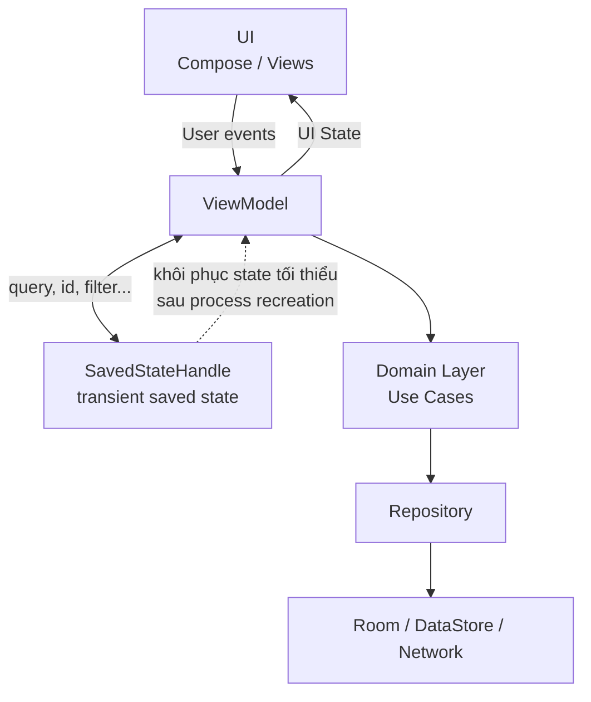

Điểm cần nhớ:

```text
SavedStateHandle
      ↓
khôi phục "đầu mối"
      ↓
ViewModel
      ↓
Repository / Domain
      ↓
tải lại dữ liệu thật
      ↓
UI State
```

Ví dụ thay vì lưu cả:

```kotlin
Product(
    id = 42,
    name = "...",
    description = "...",
    images = ...
)
```

hãy lưu:

```kotlin
productId = 42
```

Sau đó dùng `productId` để Repository tải lại `Product`.

---

## 3. Vấn đề SavedStateHandle giải quyết

Giả sử người dùng đang tìm kiếm:

```text
Query = "android architecture"
Filter = FAVORITE
```

Ứng dụng bị đưa xuống background.

Một lúc sau Android cần RAM và kill process.

Khi người dùng quay lại:

```text
Process cũ
   ❌ đã chết

ViewModel cũ
   ❌ đã mất

RAM
   ❌ state đã mất
```

Nếu state chỉ nằm trong biến của `ViewModel`:

```kotlin
class SearchViewModel : ViewModel() {

    var query = "android architecture"
}
```

thì state đó không còn sau process death.

Android documentation hiện tại nhấn mạnh rằng `ViewModel` tự xử lý configuration changes nhưng **không sống qua system-initiated process death**; trường hợp đó cần Saved State APIs như `SavedStateHandle`. ([Android Developers][2])

### Với SavedStateHandle

```text
Người dùng nhập query
        ↓
ViewModel
        ↓
SavedStateHandle
        ↓
Android saved-state mechanism
        ↓
process bị kill
        ↓
process được recreate
        ↓
SavedStateHandle được restore
        ↓
ViewModel đọc query
        ↓
Repository chạy search lại
        ↓
UI trở về gần trạng thái trước đó
```

---

## 4. Configuration Change khác Process Death như thế nào?

Đây là phần quan trọng nhất của bài.

| Tình huống                             |       Activity |  ViewModel |      SavedStateHandle |
| -------------------------------------- | -------------: | ---------: | --------------------: |
| Recomposition Compose                  |            Giữ |        Giữ |                   Giữ |
| Rotate màn hình                        |        Tạo lại | Thường giữ |                   Giữ |
| Dark/Light configuration change        | Có thể tạo lại | Thường giữ |                   Giữ |
| Process bị hệ thống kill               |            Mất |    **Mất** |        Có thể restore |
| Người dùng nhập lại app sau recreation |            Mới |        Mới |   Restore state trước |
| Dữ liệu lâu dài sau nhiều phiên app    |  Không đảm bảo |      Không | **Không nên dựa vào** |

Android khuyến nghị coi saved state là nơi chứa lượng nhỏ **transient UI state** cần thiết để dựng lại màn hình chứ không phải nơi lưu application data lâu dài. ([Android Developers][4])

---

## 5. So sánh `remember`, `rememberSaveable`, `ViewModel` và `SavedStateHandle`

| API                | Recomposition | Configuration Change | Process Death | Phù hợp                           |
| ------------------ | ------------: | -------------------: | ------------: | --------------------------------- |
| `remember`         |             ✅ |                    ❌ |             ❌ | State Compose rất ngắn hạn        |
| `rememberSaveable` |             ✅ |                    ✅ |            ✅* | UI element state                  |
| `ViewModel`        |             ✅ |                    ✅ |             ❌ | Screen state + business logic     |
| `SavedStateHandle` |             ✅ |                    ✅ |            ✅* | State trong ViewModel cần restore |
| Room / DataStore   |             ✅ |                    ✅ |             ✅ | Persistent application data       |

`*` trong phạm vi state được Android save/restore và các loại dữ liệu phù hợp với saved-state mechanism.

Theo hướng dẫn Compose hiện tại:

```text
UI logic
    → rememberSaveable

Business logic / state đã hoist vào ViewModel
    → SavedStateHandle
```

([Android Developers][2])

---

## 6. State nào nên lưu trong SavedStateHandle?

### Nên lưu

Các giá trị nhỏ giúp tái tạo màn hình:

```text
searchQuery
productId
selectedCategoryId
selectedFilter
pageNumber
sortOrder
draftText
selectedTab
```

Ví dụ:

```kotlin
savedStateHandle["productId"] = 42L
```

hoặc:

```kotlin
savedStateHandle["query"] = "kotlin"
```

### Không nên lưu

```text
Bitmap
List<Product> rất lớn
Response API đầy đủ
Entity graph lớn
File
Video
Repository
Context
Database
Network client
```

Android cảnh báo rằng saved state dựa trên `Bundle`; lưu object lớn có thể gây chi phí serialization và thậm chí `TransactionTooLargeException`. ([Android Developers][2])

### Quy tắc thực tế

Thay vì:

```kotlin
savedStateHandle["products"] = hugeProductList
```

hãy:

```kotlin
savedStateHandle["categoryId"] = categoryId
```

sau đó:

```text
categoryId
    ↓
Repository
    ↓
Database / API
    ↓
List<Product>
```

---

## 7. API cơ bản của SavedStateHandle

`SavedStateHandle` hoạt động giống key-value storage. Android cung cấp các thao tác như đọc, ghi, kiểm tra key và xóa state. ([Android Developers][1])

### Ghi state

```kotlin
savedStateHandle["query"] = "android"
```

### Đọc state

```kotlin
val query: String? = savedStateHandle["query"]
```

Có thể đặt default:

```kotlin
val query = savedStateHandle["query"] ?: ""
```

### Kiểm tra key

```kotlin
if (savedStateHandle.contains("query")) {
    // ...
}
```

### Xóa state

```kotlin
savedStateHandle.remove<String>("query")
```

---

# 8. Cách 1 — SavedStateHandle với StateFlow

Một trong những cách rất phù hợp với kiến trúc Compose + UDF là sử dụng:

```kotlin
getStateFlow()
```

Android hỗ trợ `getStateFlow()` để quan sát giá trị trong `SavedStateHandle` dưới dạng `StateFlow`. ([Android Developers][5])

Ví dụ ứng dụng tìm kiếm.

```kotlin
class SearchViewModel(
    private val savedStateHandle: SavedStateHandle,
    private val repository: ProductRepository
) : ViewModel() {

    companion object {
        private const val QUERY_KEY = "search_query"
    }

    val query: StateFlow<String> =
        savedStateHandle.getStateFlow(
            key = QUERY_KEY,
            initialValue = ""
        )

    fun onQueryChanged(newQuery: String) {
        savedStateHandle[QUERY_KEY] = newQuery
    }
}
```

Luồng dữ liệu:

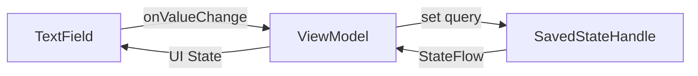

---

## 9. Kết hợp SavedStateHandle với Repository

Chỉ giữ query trong saved state.

Dữ liệu kết quả vẫn thuộc Data Layer.

```kotlin
class SearchViewModel(
    private val savedStateHandle: SavedStateHandle,
    private val repository: ProductRepository
) : ViewModel() {

    companion object {
        private const val QUERY_KEY = "query"
    }

    private val query =
        savedStateHandle.getStateFlow(
            key = QUERY_KEY,
            initialValue = ""
        )

    val uiState: StateFlow<SearchUiState> =
        query
            .debounce(300)
            .flatMapLatest { keyword ->

                if (keyword.isBlank()) {
                    flowOf(SearchUiState.Empty)
                } else {
                    repository
                        .search(keyword)
                        .map<SearchResult, SearchUiState> {
                            SearchUiState.Success(it.products)
                        }
                }
            }
            .stateIn(
                scope = viewModelScope,
                started = SharingStarted.WhileSubscribed(5_000),
                initialValue = SearchUiState.Empty
            )

    fun onQueryChanged(value: String) {
        savedStateHandle[QUERY_KEY] = value
    }
}
```

State:

```kotlin
sealed interface SearchUiState {

    data object Empty : SearchUiState

    data object Loading : SearchUiState

    data class Success(
        val products: List<Product>
    ) : SearchUiState

    data class Error(
        val message: String
    ) : SearchUiState
}
```

Kiến trúc lúc này:

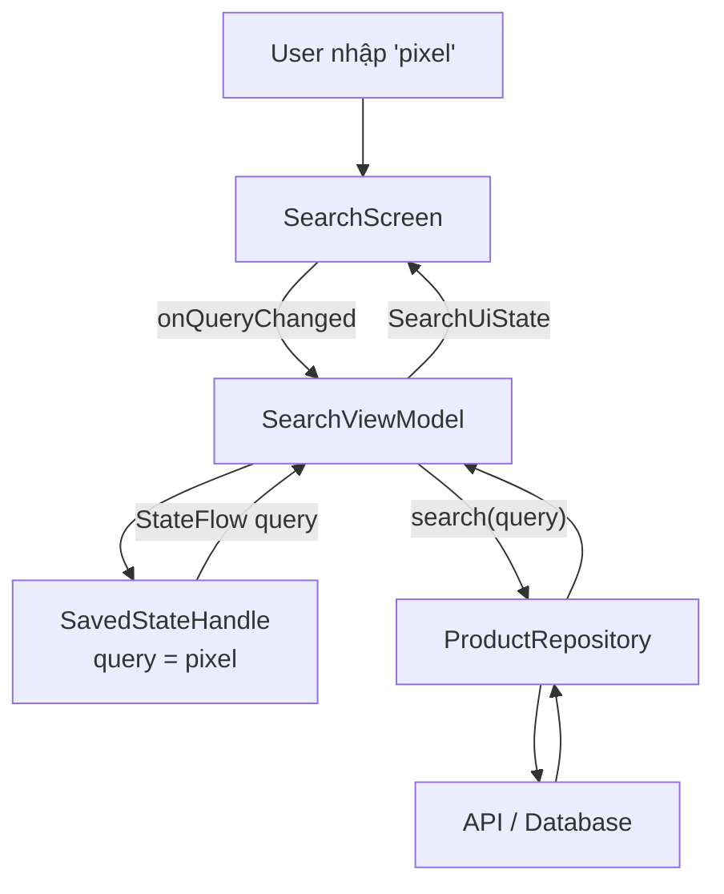

Đây là pattern quan trọng:

> **SavedStateHandle giữ input tối thiểu để tái tạo state; Repository giữ hoặc tải lại application data.**

Android cũng khuyến nghị ViewModel/state holder sử dụng Data/Domain layer để sản xuất screen UI state thay vì nhét toàn bộ dữ liệu vào saved state. ([Android Developers][3])

---

# 10. Kết nối với Jetpack Compose

Composable chỉ cần collect `uiState` và gửi event.

```kotlin
@Composable
fun SearchRoute(
    viewModel: SearchViewModel
) {
    val uiState by viewModel.uiState.collectAsStateWithLifecycle()
    val query by viewModel.query.collectAsStateWithLifecycle()

    SearchScreen(
        query = query,
        uiState = uiState,
        onQueryChanged = viewModel::onQueryChanged
    )
}
```

UI:

```kotlin
@Composable
fun SearchScreen(
    query: String,
    uiState: SearchUiState,
    onQueryChanged: (String) -> Unit
) {
    Column {

        OutlinedTextField(
            value = query,
            onValueChange = onQueryChanged,
            label = {
                Text("Tìm kiếm")
            }
        )

        when (uiState) {

            SearchUiState.Empty -> {
                Text("Nhập từ khóa để tìm kiếm")
            }

            SearchUiState.Loading -> {
                CircularProgressIndicator()
            }

            is SearchUiState.Success -> {
                ProductList(
                    products = uiState.products
                )
            }

            is SearchUiState.Error -> {
                Text(uiState.message)
            }
        }
    }
}
```

Hình dưới mô tả vai trò của state holder trong UI Layer:


*Nguồn hình: Android Developers — State holders and UI state.* 

---

# 11. Cách 2 — `saveable()` với Compose State

Nếu state được hoist vào `ViewModel` nhưng bạn muốn thao tác trực tiếp dưới dạng Compose `MutableState`, `SavedStateHandle` cũng có API `saveable()`.

Android documentation hiện tại liệt kê `saveable()` và `getStateFlow()` là hai cách quan trọng để kết nối `SavedStateHandle` với Compose state. ([Android Developers][2])

Ví dụ:

```kotlin
class MessageViewModel(
    savedStateHandle: SavedStateHandle
) : ViewModel() {

    var message by savedStateHandle.saveable {
        mutableStateOf("")
    }
        private set

    fun onMessageChanged(value: String) {
        message = value
    }
}
```

Compose:

```kotlin
@Composable
fun MessageScreen(
    viewModel: MessageViewModel
) {
    OutlinedTextField(
        value = viewModel.message,
        onValueChange = viewModel::onMessageChanged
    )
}
```

Nếu process được recreate, text có thể được restore thay vì quay lại `""`.

---

# 12. SavedStateHandle với Navigation Arguments

Một trường hợp rất phổ biến:

```text
ProductList
     ↓
navigate("product/42")
     ↓
ProductDetail
```

Màn hình detail thực tế chỉ cần:

```text
productId = 42
```

sau đó lấy Product từ Repository.

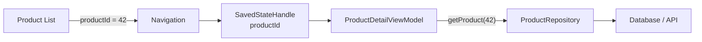

Ví dụ đơn giản:

```kotlin
class ProductDetailViewModel(
    savedStateHandle: SavedStateHandle,
    repository: ProductRepository
) : ViewModel() {

    private val productId: Long =
        checkNotNull(savedStateHandle["productId"])

    val product =
        repository
            .observeProduct(productId)
            .stateIn(
                scope = viewModelScope,
                started = SharingStarted.WhileSubscribed(5_000),
                initialValue = null
            )
}
```

Điều này tốt hơn việc truyền:

```text
Product + Images + Reviews + Seller + Metadata
```

qua navigation.

---

# 13. Một ví dụ hoàn chỉnh

## Use case

Ứng dụng shopping có màn hình:

```text
Product Search
```

User đã nhập:

```text
"mechanical keyboard"
```

và chọn:

```text
Sort = PRICE_LOW_TO_HIGH
```

Ta chỉ cần restore:

```text
query
sortOrder
```

---

## ViewModel

```kotlin
class ProductSearchViewModel(
    private val savedStateHandle: SavedStateHandle,
    private val repository: ProductRepository
) : ViewModel() {

    companion object {
        private const val QUERY_KEY = "query"
        private const val SORT_KEY = "sort"
    }

    val query =
        savedStateHandle.getStateFlow(
            QUERY_KEY,
            ""
        )

    val sort =
        savedStateHandle.getStateFlow(
            SORT_KEY,
            SortOrder.RELEVANCE
        )

    val uiState =
        combine(
            query,
            sort
        ) { query, sort ->

            SearchParams(
                query = query,
                sort = sort
            )

        }.flatMapLatest { params ->

            repository.search(
                query = params.query,
                sort = params.sort
            )

        }.map { products ->

            ProductSearchUiState(
                products = products
            )

        }.stateIn(
            scope = viewModelScope,
            started = SharingStarted.WhileSubscribed(5_000),
            initialValue = ProductSearchUiState()
        )

    fun updateQuery(value: String) {
        savedStateHandle[QUERY_KEY] = value
    }

    fun updateSort(value: SortOrder) {
        savedStateHandle[SORT_KEY] = value
    }
}
```

---

## UI

```kotlin
@Composable
fun ProductSearchRoute(
    viewModel: ProductSearchViewModel
) {
    val query by viewModel.query.collectAsStateWithLifecycle()
    val sort by viewModel.sort.collectAsStateWithLifecycle()
    val uiState by viewModel.uiState.collectAsStateWithLifecycle()

    ProductSearchScreen(
        query = query,
        sort = sort,
        products = uiState.products,
        onQueryChanged = viewModel::updateQuery,
        onSortChanged = viewModel::updateSort
    )
}
```

---

# 14. Process Death diễn ra như thế nào?

Một misunderstanding phổ biến:

```text
ViewModel
    ↓
"ViewModel sống mãi"
```

Sai.

ViewModel chỉ giúp tránh mất state khi owner được recreate trong các tình huống như configuration change. Khi toàn bộ process chết, instance ViewModel trong RAM cũng biến mất. ([Android Developers][2])

Luồng thực tế:

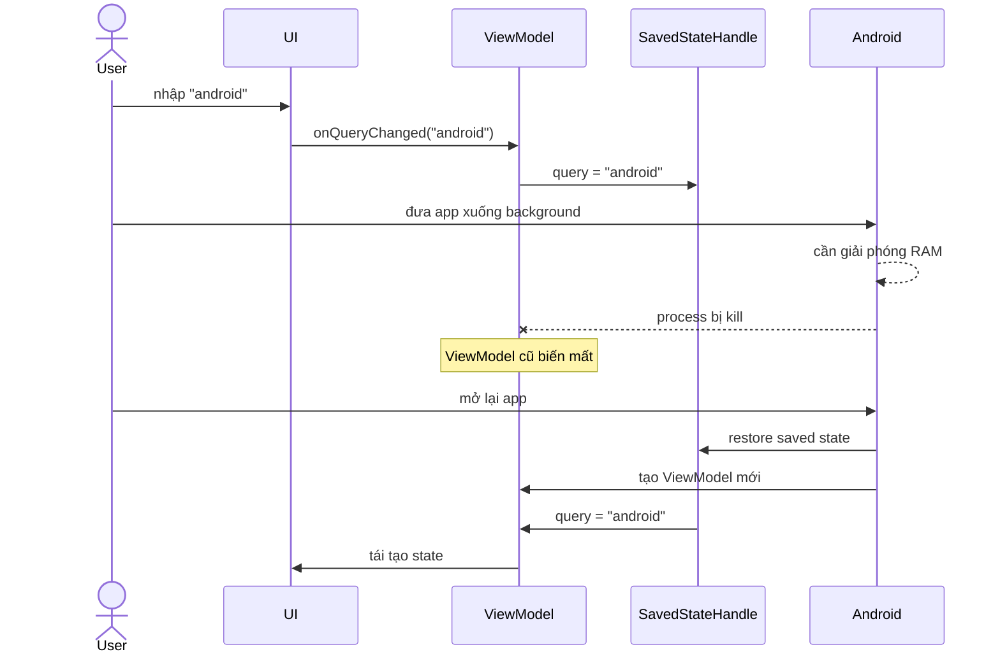

Một chi tiết lifecycle cần chú ý: tài liệu Saved State module hiện tại lưu ý state ghi vào `SavedStateHandle` được commit thông qua lifecycle của host; việc ghi state trong khi `Activity` đã stopped có những giới hạn và cần lifecycle quay lại `onStart` rồi `onStop` để được saved lại. ([Android Developers][1])

---

# 15. SavedStateHandle không phải Single Source of Truth cho application data

Sai:

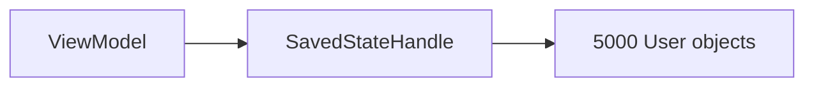

Đúng:

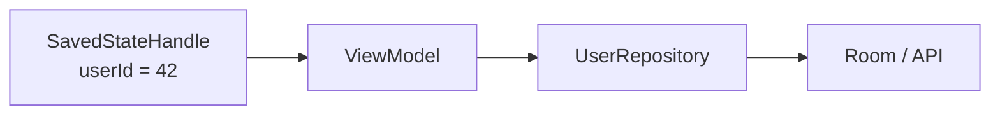

State quan trọng lâu dài nên thuộc:

```text
Data Layer
```

Ví dụ:

```text
Cart
Favorites
Profile
Messages
Orders
Game Save
Authentication
```

không nên phụ thuộc vào SavedStateHandle để tồn tại.

---

# 16. Khi nào dùng `rememberSaveable`, khi nào dùng `SavedStateHandle`?

Đặt câu hỏi:

> State này do ai sở hữu?

### Nếu chỉ là UI logic

Ví dụ:

```text
dialog mở hay đóng
expand/collapse
scroll position
tab UI cục bộ
```

thường có thể dùng:

```kotlin
rememberSaveable
```

### Nếu state đã được hoist lên ViewModel vì business logic cần nó

Ví dụ:

```text
search query
selected category
filter ảnh hưởng tới repository query
item id dùng để load dữ liệu
```

dùng:

```kotlin
SavedStateHandle
```

Android mô tả lựa chọn này dựa trên **state ownership và loại logic sử dụng state**, thay vì dùng `SavedStateHandle` cho mọi state. ([Android Developers][2])

---

# 17. State ownership

Một nguyên tắc quan trọng của Compose:

> State nên được giữ càng gần nơi sử dụng càng tốt, nhưng vẫn phải đặt tại nơi có đủ quyền sở hữu để xử lý logic cần thiết.

Android gọi nguyên tắc này là **state hoisting**. Khi state liên quan đến business logic cấp màn hình, ViewModel thường là state holder phù hợp. ([Android Developers][6])

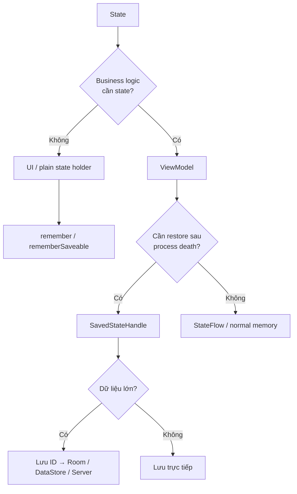

---

# 18. Anti-pattern 1 — Lưu toàn bộ UI State

Không nên:

```kotlin
data class ProductDetailUiState(
    val product: Product,
    val reviews: List<Review>,
    val recommendations: List<Product>,
    val seller: Seller
)
```

rồi:

```kotlin
savedStateHandle["uiState"] = uiState
```

Vấn đề:

```text
object lớn
   ↓
serialization
   ↓
Bundle lớn
   ↓
tốn memory / thời gian
   ↓
TransactionTooLargeException
```

Android khuyến nghị chỉ lưu minimum state cần thiết để dựng lại UI. ([Android Developers][2])

---

# 19. Anti-pattern 2 — Dùng SavedStateHandle như database

```kotlin
savedStateHandle["cart"] = allCartItems
savedStateHandle["profile"] = profile
savedStateHandle["messages"] = messages
```

Sai kiến trúc.

Nên là:

```text
SavedStateHandle
    │
    ├── selectedProductId
    ├── searchQuery
    └── filter

Data Layer
    │
    ├── Cart
    ├── Profile
    ├── Messages
    └── Products
```

---

# 20. Anti-pattern 3 — Duplicate state

Ví dụ:

```kotlin
private val _query = MutableStateFlow("")

private val savedQuery =
    savedStateHandle.getStateFlow("query", "")
```

Sau đó update cả hai:

```kotlin
_query.value = value
savedStateHandle["query"] = value
```

Ta đã tạo:

```text
2 source of truth
```

Dễ xảy ra:

```text
_query = "android"
savedStateHandle = "kotlin"
```

Tốt hơn:

```kotlin
val query =
    savedStateHandle.getStateFlow(
        "query",
        ""
    )

fun setQuery(value: String) {
    savedStateHandle["query"] = value
}
```

`SavedStateHandle` trở thành source of truth cho transient state đó.

---

# 21. Test SavedStateHandle

Một lợi ích lớn là `SavedStateHandle` có thể được tạo với initial state khi unit test.

Ví dụ ViewModel:

```kotlin
class DetailViewModel(
    savedStateHandle: SavedStateHandle
) : ViewModel() {

    val productId: Long =
        checkNotNull(
            savedStateHandle["productId"]
        )
}
```

Test:

```kotlin
@Test
fun productId_isReadFromSavedState() {

    val savedStateHandle =
        SavedStateHandle(
            mapOf(
                "productId" to 42L
            )
        )

    val viewModel =
        DetailViewModel(
            savedStateHandle
        )

    assertEquals(
        42L,
        viewModel.productId
    )
}
```

---

# 22. Test state restoration logic

Ví dụ:

```kotlin
class SearchViewModel(
    private val savedStateHandle: SavedStateHandle
) : ViewModel() {

    val query =
        savedStateHandle.getStateFlow(
            "query",
            ""
        )

    fun updateQuery(value: String) {
        savedStateHandle["query"] = value
    }
}
```

Test:

```kotlin
@Test
fun initialQuery_isRestored() = runTest {

    val handle =
        SavedStateHandle(
            mapOf(
                "query" to "android"
            )
        )

    val viewModel =
        SearchViewModel(handle)

    assertEquals(
        "android",
        viewModel.query.value
    )
}
```

Test event:

```kotlin
@Test
fun updateQuery_updatesSavedState() = runTest {

    val handle =
        SavedStateHandle()

    val viewModel =
        SearchViewModel(handle)

    viewModel.updateQuery("compose")

    assertEquals(
        "compose",
        handle["query"]
    )
}
```

---

# 23. Test seam với Repository

Kiến trúc:

```text
SearchViewModel
      ↓
ProductRepository interface
      ↓
FakeProductRepository
```

Interface:

```kotlin
interface ProductRepository {

    fun search(
        query: String
    ): Flow<List<Product>>
}
```

Fake:

```kotlin
class FakeProductRepository :
    ProductRepository {

    override fun search(
        query: String
    ): Flow<List<Product>> {

        return flowOf(
            listOf(
                Product(
                    id = 1,
                    name = query
                )
            )
        )
    }
}
```

Nhờ vậy ta có thể kiểm tra:

```text
SavedStateHandle restored query
             ↓
ViewModel
             ↓
Repository nhận đúng query
             ↓
UI state được tạo lại
```

Đây cũng phù hợp với lợi ích testability của state-holder architecture mà Android architecture guide mô tả. ([Android Developers][3])

---

# 24. Thực hành

## Bài thực hành: Search Screen có khả năng phục hồi state

Xây dựng màn hình:

```text
┌───────────────────────────────┐
│ 🔍 Search                     │
│                               │
│ mechanical keyboard           │
│                               │
│ Sort: Price ↑                 │
├───────────────────────────────┤
│ Keyboard A                    │
│ Keyboard B                    │
│ Keyboard C                    │
└───────────────────────────────┘
```

Yêu cầu:

1. `SearchScreen` không gọi Repository trực tiếp.
2. `SearchViewModel` nhận `SavedStateHandle`.
3. Lưu:

   * `query`;
   * `sortOrder`.
4. Không lưu `List<Product>` vào `SavedStateHandle`.
5. Dùng query + sort để gọi Repository.
6. Repository trả dữ liệu.
7. ViewModel tạo `SearchUiState`.
8. Compose collect state bằng lifecycle-aware API.
9. Viết unit test cho state restore.

Kiến trúc mong muốn:

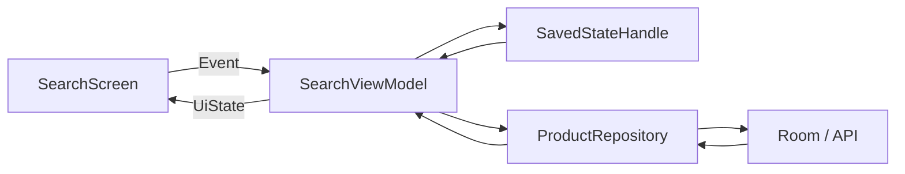

---

# 25. Bài tập

Refactor một màn hình đang chứa state trong Composable hoặc ViewModel thuần.

Ví dụ ban đầu:

```kotlin
class SearchViewModel : ViewModel() {

    var query = MutableStateFlow("")

    var selectedCategory =
        MutableStateFlow("all")
}
```

Refactor sang:

```kotlin
class SearchViewModel(
    private val savedStateHandle: SavedStateHandle
) : ViewModel() {

    val query =
        savedStateHandle.getStateFlow(
            "query",
            ""
        )

    val selectedCategory =
        savedStateHandle.getStateFlow(
            "category",
            "all"
        )

    fun updateQuery(value: String) {
        savedStateHandle["query"] = value
    }

    fun selectCategory(value: String) {
        savedStateHandle["category"] = value
    }
}
```

Sau đó kiểm tra app trong các trường hợp:

```text
Rotate screen
     ↓
State còn?

Background → system recreation
     ↓
State khôi phục?

Navigate sang màn hình khác → quay lại
     ↓
State đúng?

Repository reload
     ↓
UI vẫn đúng?
```

---

# 26. Artifact cho portfolio

Có thể tạo một mini project:

```text
saved-state-demo/
│
├── ui/
│   ├── SearchScreen.kt
│   └── SearchUiState.kt
│
├── viewmodel/
│   └── SearchViewModel.kt
│
├── data/
│   ├── ProductRepository.kt
│   └── FakeProductRepository.kt
│
├── test/
│   └── SearchViewModelTest.kt
│
└── README.md
```

README nên có sơ đồ:

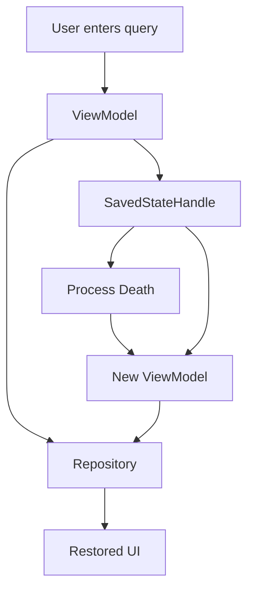

Và giải thích:

```text
SavedStateHandle stores only:

- query
- sort option
- selected category

Products themselves are reloaded
from the Repository.
```

---

# 27. Debugging

Khi state không restore, kiểm tra theo thứ tự:

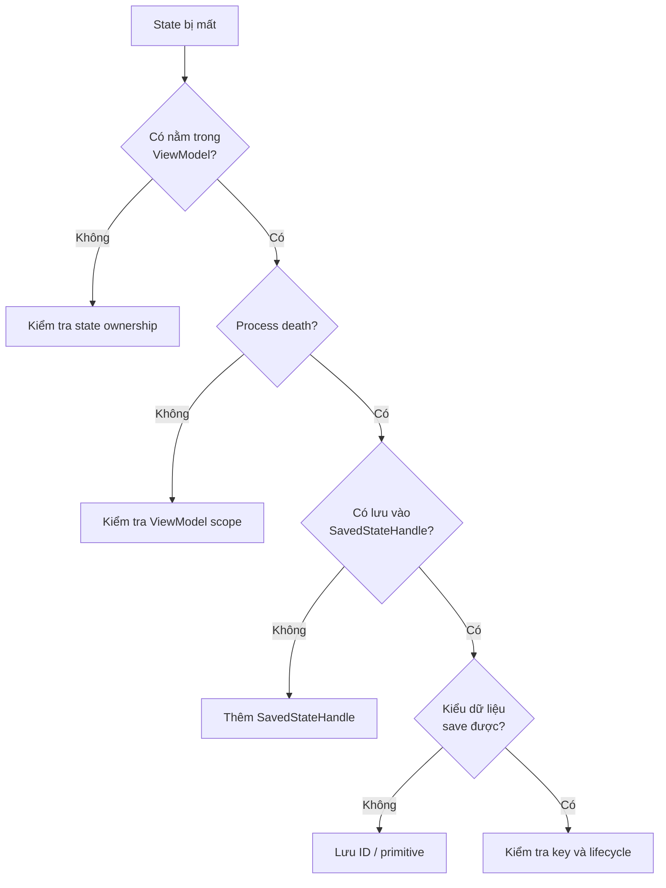

Đặc biệt kiểm tra typo:

```kotlin
savedStateHandle["search_query"] = query
```

nhưng đọc:

```kotlin
savedStateHandle["searchQuery"]
```

Hai key này hoàn toàn khác nhau.

Nên dùng constant:

```kotlin
private companion object {
    const val QUERY_KEY = "search_query"
}
```

---

# 28. Production checklist

### State ownership

* [ ] Xác định rõ UI nào sở hữu state.
* [ ] Không đưa mọi state vào ViewModel.
* [ ] Không đưa mọi state vào `SavedStateHandle`.

### Process death

* [ ] State quan trọng với UX có thể được restore.
* [ ] ViewModel có thể dựng lại `UiState` từ state tối thiểu.
* [ ] Không giả định ViewModel sống qua process death.

### Data size

* [ ] Không lưu Bitmap.
* [ ] Không lưu list lớn.
* [ ] Không lưu API response lớn.
* [ ] Ưu tiên ID, key, query, enum nhỏ.

### Architecture

* [ ] Application data nằm trong Data Layer.
* [ ] ViewModel gọi Repository/UseCase.
* [ ] UI không truy cập trực tiếp `SavedStateHandle`.
* [ ] UI chỉ gửi event và render state.

### Testing

* [ ] Test initial restored state.
* [ ] Test update state.
* [ ] Test Repository nhận đúng restored parameter.
* [ ] Test UI state được sản xuất lại.

### UX

* [ ] Search query không biến mất bất ngờ.
* [ ] User không bị quay về tab/filter mặc định.
* [ ] Detail screen có thể tải lại item từ ID.
* [ ] Form đang nhập được restore nếu sản phẩm yêu cầu.

---

# 29. Sai lầm thường gặp

| Sai lầm                      | Hậu quả                             | Cách sửa              |
| ---------------------------- | ----------------------------------- | --------------------- |
| Chỉ dựa vào ViewModel        | Mất state khi process death         | `SavedStateHandle`    |
| Lưu object lớn               | Bundle lớn, crash/performance       | Lưu ID                |
| Dùng như database            | Data persistence không đáng tin cậy | Room/DataStore        |
| Duplicate state              | Hai source of truth                 | Chọn một owner        |
| UI thao tác handle trực tiếp | Coupling UI với persistence         | Qua ViewModel         |
| Lưu toàn bộ `UiState`        | Serialization lớn                   | Rebuild từ Data Layer |
| String key rải rác           | Typo khó debug                      | Constant/typed state  |

---

# 30. Mô hình ghi nhớ

Hãy nhớ công thức:

```text
ViewModel
=
Screen State Holder
+
Business Logic Coordinator
```

```text
SavedStateHandle
=
Minimum Restorable State
```

```text
Repository / Database
=
Application Data
```

Hoặc:

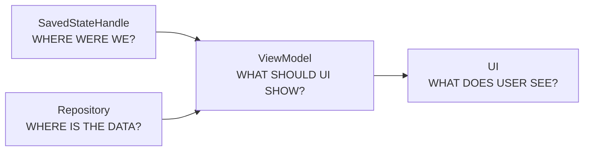

---

# 31. Tóm tắt nhanh

`SavedStateHandle` là công cụ giúp một `ViewModel` lưu và khôi phục **một lượng nhỏ transient state** sau khi Android hủy process và sau đó recreate component. Nó sử dụng saved-state mechanism và phù hợp với những giá trị nhỏ như `query`, `id`, `filter`, selection hoặc một phần input của người dùng. ([Android Developers][1])

Pattern nên nhớ là:

```text
SavedStateHandle
      │
      │ ID / Query / Filter
      ↓
ViewModel
      │
      │ gọi lại
      ↓
Repository
      │
      ↓
Room / API / DataStore
      │
      ↓
ViewModel tạo UiState
      │
      ↓
UI
```

Không nên coi `SavedStateHandle` là database. Android khuyến nghị saved state chỉ lưu **minimum information needed to restore the UI**, còn dữ liệu lớn hoặc phức tạp nên nằm trong persistent storage/data layer. ([Android Developers][4])

---

# 32. Checklist hoàn thành bài

* [ ] Giải thích được `SavedStateHandle` là gì.
* [ ] Phân biệt được configuration change và process death.
* [ ] Biết `ViewModel` không sống qua process death.
* [ ] Biết khi nào dùng `rememberSaveable`.
* [ ] Biết khi nào dùng `SavedStateHandle`.
* [ ] Sử dụng được `getStateFlow()`.
* [ ] Sử dụng được `saveable()`.
* [ ] Biết lưu ID thay vì object lớn.
* [ ] Biết kết hợp `SavedStateHandle` + Repository.
* [ ] Viết được unit test với initial saved state.
* [ ] Có sơ đồ state restoration.
* [ ] Có mini project hoặc README đưa vào portfolio.

---

## 33. Ghi chú sản xuất

Khi đưa `SavedStateHandle` vào production, hãy đặt câu hỏi:

> **Nếu Android kill process ngay lúc người dùng đang ở màn hình này, đâu là lượng thông tin nhỏ nhất tôi cần để đưa họ trở lại đúng ngữ cảnh?**

Nếu câu trả lời là:

```text
productId
query
filter
selectedTab
draft text
```

thì đó thường là ứng viên tốt cho `SavedStateHandle`.

Nếu câu trả lời là:

```text
toàn bộ database
1000 products
bitmap
API response
toàn bộ domain model
```

thì dữ liệu đang được lưu sai tầng kiến trúc.

Mục tiêu cuối cùng không phải là **“save everything”**, mà là:

> **Save enough information to reconstruct everything.**

Đó chính là tư duy quan trọng nhất khi sử dụng `SavedStateHandle` trong Android Architecture.

[1]: https://developer.android.com/topic/libraries/architecture/viewmodel/viewmodel-savedstate "Saved State module for ViewModel  |  App architecture  |  Android Developers"
[2]: https://developer.android.com/develop/ui/compose/state-saving "Save UI state in Compose  |  Jetpack Compose  |  Android Developers"
[3]: https://developer.android.com/topic/architecture/ui-layer/stateholders "State holders and UI state  |  App architecture  |  Android Developers"
[4]: https://developer.android.com/topic/libraries/architecture/saving-states "Save UI states  |  App architecture  |  Android Developers"
[5]: https://developer.android.com/jetpack/androidx/releases/lifecycle?utm_source=chatgpt.com "Lifecycle | Jetpack"
[6]: https://developer.android.com/develop/ui/compose/state-hoisting?utm_source=chatgpt.com "Where to hoist state | Jetpack Compose"
