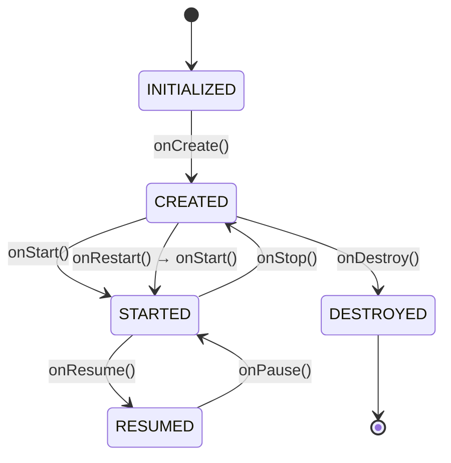
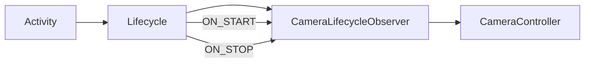
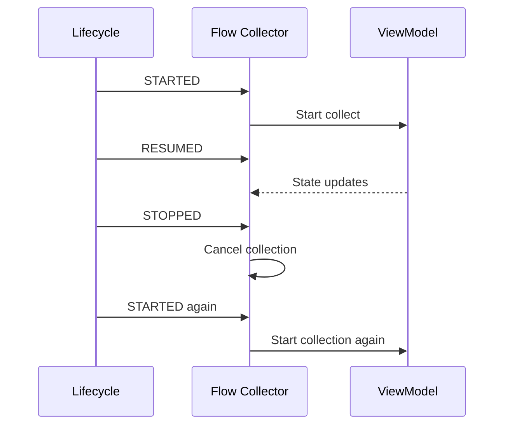
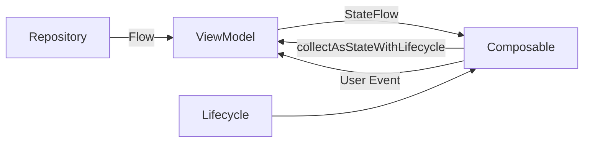
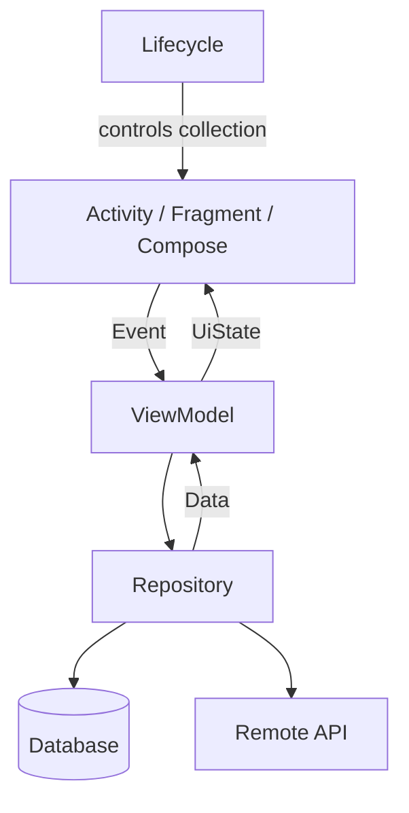
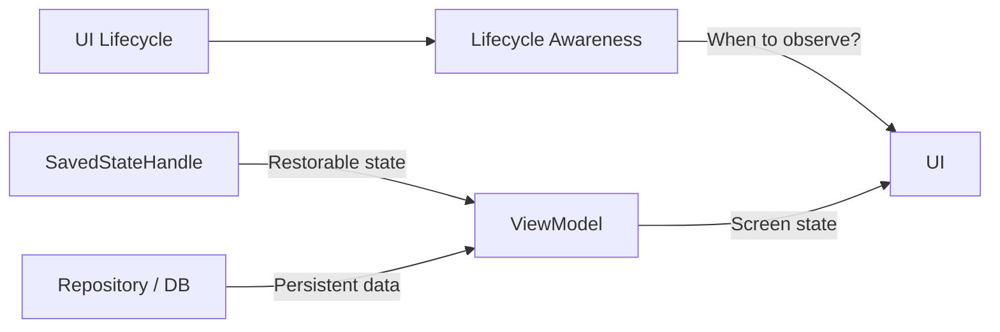
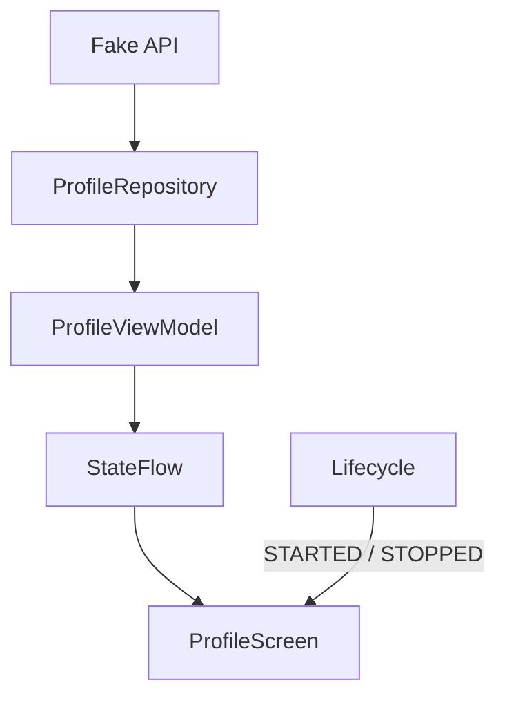
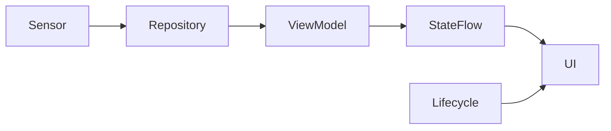
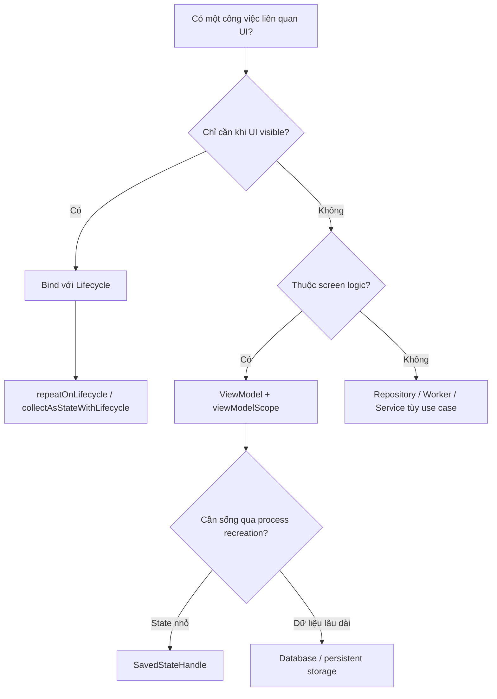

[](https://developer.android.com/codelabs/basic-android-kotlin-compose-activity-lifecycle?utm_source=chatgpt.com)

# 012 — Lifecycle Awareness

| Thuộc tính              | Nội dung                                                                                                      |
| ----------------------- | ------------------------------------------------------------------------------------------------------------- |
| **Học phần**            | 03 — Architecture, State and Data                                                                             |
| **Module**              | Module 05 — Design and Architecture                                                                           |
| **Nhóm nội dung**       | Android Architecture Components                                                                               |
| **Nguồn roadmap**       | Design and Architecture / Android Architecture Components                                                     |
| **Loại bài**            | Architecture                                                                                                  |
| **Thứ tự trong module** | 012                                                                                                           |
| **Thời lượng gợi ý**    | 34 phút                                                                                                       |
| **Kiến thức liên quan** | Activity Lifecycle, Fragment Lifecycle, ViewModel, SavedStateHandle, Kotlin Flow, Coroutines, Jetpack Compose |

---

## 1. Tóm tắt

**Lifecycle Awareness** là khả năng để một component biết và phản ứng đúng với trạng thái vòng đời của `Activity`, `Fragment`, màn hình Compose hoặc một `LifecycleOwner` khác.

Thay vì viết hàng loạt logic trực tiếp trong:

```text
onStart()
onResume()
onPause()
onStop()
onDestroy()
```

ta có thể xây dựng các component **lifecycle-aware** để chúng tự bắt đầu, tạm dừng hoặc giải phóng tài nguyên theo trạng thái UI. Android cung cấp `Lifecycle`, `LifecycleOwner` và các API tích hợp với coroutines/Compose cho mục đích này. ([Android Developers][1])

Ví dụ:

```text
User mở màn hình
        ↓
STARTED
        ↓
Bắt đầu collect dữ liệu
        ↓
RESUMED
        ↓
User tương tác
        ↓
STOPPED
        ↓
Dừng collect / camera / location...
```

Mục tiêu chính là:

> **Chỉ chạy công việc khi lifecycle phù hợp, và tự dừng công việc khi màn hình không còn cần nó.**

Điều này đặc biệt quan trọng với:

* `Flow`;
* coroutine;
* camera;
* GPS/location;
* animation;
* sensor;
* media playback;
* network streaming;
* observer/listener.

Android cũng khuyến nghị UI thu thập state theo cách lifecycle-aware thay vì để collector chạy bất kể màn hình đang hiển thị hay không. ([Android Developers][2])

---

## 2. Mục tiêu học tập

Sau bài này, bạn nên có thể:

* [ ] Giải thích được **Lifecycle Awareness** bằng ngôn ngữ của mình.
* [ ] Phân biệt `Lifecycle`, `LifecycleOwner` và lifecycle event.
* [ ] Hiểu các trạng thái `CREATED`, `STARTED`, `RESUMED`, `DESTROYED`.
* [ ] Biết khi nào nên bắt đầu và dừng một resource.
* [ ] Dùng `repeatOnLifecycle()` để collect `Flow`.
* [ ] Dùng `collectAsStateWithLifecycle()` trong Jetpack Compose.
* [ ] Hiểu quan hệ giữa Lifecycle Awareness, `ViewModel` và `SavedStateHandle`.
* [ ] Tránh memory leak hoặc background work không cần thiết.
* [ ] Kiểm tra ứng dụng qua rotation, navigation và background/foreground.
* [ ] Tạo được một ví dụ lifecycle-aware cho portfolio.

---

# 3. Lifecycle Awareness là gì?

Một `Activity` hoặc `Fragment` không tồn tại mãi mãi.

Trong quá trình sử dụng app, Android liên tục chuyển chúng qua nhiều trạng thái:



Một `Activity` ở `STARTED` đã hiển thị cho người dùng; khi đạt `RESUMED`, nó ở foreground và có thể tương tác. Khi không còn hiển thị, nó chuyển về trạng thái thấp hơn và cuối cùng có thể bị destroy. ([Android Developers][3])

### Ảnh minh họa — Activity Lifecycle


*Nguồn: Android Developers — Activity Lifecycle.* 

---

## 3.1 Nếu không lifecycle-aware

Giả sử màn hình sử dụng GPS:

```kotlin
locationClient.startLocationUpdates()
```

Nếu không dừng nó khi user rời màn hình:

```text
User mở Screen
      ↓
GPS START
      ↓
User sang màn hình khác
      ↓
GPS vẫn chạy ❌
      ↓
Tốn pin / callback dư thừa
```

Một ví dụ khác:

```kotlin
someFlow.collect {
    updateUi(it)
}
```

Nếu collector tồn tại dù màn hình đã `STOPPED`, dữ liệu có thể tiếp tục được xử lý khi UI không còn cần nó.

Android đưa ra nhiều use case cho lifecycle-aware components như thay đổi mức cập nhật location, quản lý video buffering, streaming network hoặc animation dựa trên foreground/background. ([Android Developers][1])

---

# 4. Các thành phần cốt lõi

## 4.1 `LifecycleOwner`

`LifecycleOwner` là object có một `Lifecycle`.

Ví dụ phổ biến:

```text
ComponentActivity
      │
      └── LifecycleOwner

Fragment
      │
      └── LifecycleOwner
```

Ta có thể lấy:

```kotlin
lifecycle
```

hoặc với Fragment View:

```kotlin
viewLifecycleOwner.lifecycle
```

`Activity` và `Fragment` là những lifecycle owner phổ biến, cho phép các component khác quan sát vòng đời của chúng. ([Android Developers][4])

---

## 4.2 `Lifecycle`

`Lifecycle` đại diện cho trạng thái hiện tại của owner:

```text
LifecycleOwner
      │
      ▼
   Lifecycle
      │
      ├── CREATED
      ├── STARTED
      ├── RESUMED
      └── DESTROYED
```

Ví dụ:

```kotlin
val state = lifecycle.currentState
```

Ta có thể kiểm tra:

```kotlin
if (lifecycle.currentState.isAtLeast(Lifecycle.State.STARTED)) {
    // Screen đang ở ít nhất trạng thái STARTED.
}
```

---

## 4.3 Lifecycle Event

State và event không hoàn toàn giống nhau.

Ví dụ:

| Event        | State liên quan |
| ------------ | --------------- |
| `ON_CREATE`  | `CREATED`       |
| `ON_START`   | `STARTED`       |
| `ON_RESUME`  | `RESUMED`       |
| `ON_PAUSE`   | rời `RESUMED`   |
| `ON_STOP`    | rời `STARTED`   |
| `ON_DESTROY` | `DESTROYED`     |

Có thể hình dung:

```text
ON_START
   ↓
STARTED
   ↓
ON_RESUME
   ↓
RESUMED
```

---

# 5. Tư duy quan trọng: Resource phải đi theo Lifecycle

Không phải mọi resource đều nên tồn tại cùng khoảng thời gian.

Ví dụ:

| Resource              | Khi bắt đầu                          | Khi dừng        |
| --------------------- | ------------------------------------ | --------------- |
| UI Flow collection    | `STARTED`                            | dưới `STARTED`  |
| Camera preview        | `STARTED` hoặc `RESUMED` tùy yêu cầu | state tương ứng |
| Fine GPS updates      | UI visible/foreground                | background      |
| Animation             | visible                              | hidden          |
| UI observer           | `STARTED`                            | dưới `STARTED`  |
| View binding Fragment | `onCreateView`                       | `onDestroyView` |

Android mô tả `STARTED` là trạng thái Activity đã visible và `RESUMED` là khi nó ở foreground, có focus/tương tác; vì vậy lựa chọn state phải dựa trên resource thực sự cần **visibility** hay **focus**. ([Android Developers][3])

---

# 6. `DefaultLifecycleObserver`

Ta có thể chuyển logic lifecycle ra khỏi `Activity` hoặc `Fragment`.

Ví dụ một camera controller:

```kotlin
class CameraLifecycleObserver(
    private val cameraController: CameraController
) : DefaultLifecycleObserver {

    override fun onStart(owner: LifecycleOwner) {
        cameraController.start()
    }

    override fun onStop(owner: LifecycleOwner) {
        cameraController.stop()
    }
}
```

Trong Activity:

```kotlin
class CameraActivity : ComponentActivity() {

    private val cameraLifecycleObserver =
        CameraLifecycleObserver(
            cameraController = CameraController()
        )

    override fun onCreate(savedInstanceState: Bundle?) {
        super.onCreate(savedInstanceState)

        lifecycle.addObserver(cameraLifecycleObserver)
    }
}
```

Kiến trúc trở thành:



### Không nên

```kotlin
override fun onStart() {
    super.onStart()

    camera.start()
    location.start()
    socket.start()
    analytics.start()
    player.start()
}
```

Khi `Activity` phải tự quản lý quá nhiều resource, lifecycle code nhanh chóng trở nên khó bảo trì.

`@OnLifecycleEvent` từng được dùng cho observer nhưng hiện đã deprecated; Android khuyến nghị sử dụng `DefaultLifecycleObserver` hoặc `LifecycleEventObserver`. ([Android Developers][5])

---

# 7. Lifecycle Awareness với Kotlin Coroutines

Một lỗi rất phổ biến là:

```kotlin
lifecycleScope.launch {
    viewModel.uiState.collect {
        render(it)
    }
}
```

Đoạn code nhìn có vẻ hợp lý nhưng đối với UI state, ta thường muốn collection chỉ tồn tại khi lifecycle đạt một state nhất định.

Android khuyến nghị UI dùng lifecycle-aware collection như `repeatOnLifecycle()`. ([Android Developers][2])

---

## 7.1 `repeatOnLifecycle()`

Ví dụ trong Fragment:

```kotlin
override fun onViewCreated(
    view: View,
    savedInstanceState: Bundle?
) {
    super.onViewCreated(view, savedInstanceState)

    viewLifecycleOwner.lifecycleScope.launch {

        viewLifecycleOwner.repeatOnLifecycle(
            Lifecycle.State.STARTED
        ) {

            viewModel.uiState.collect { uiState ->
                render(uiState)
            }
        }
    }
}
```

Luồng hoạt động:



`repeatOnLifecycle` chạy block khi lifecycle đạt ít nhất state yêu cầu, dừng block khi xuống dưới state đó và chạy lại khi lifecycle trở lại. ([Android Developers][5])

---

# 8. Lifecycle Awareness trong Jetpack Compose

Với Compose, cách phổ biến để collect `Flow` từ `ViewModel` là:

```kotlin
@Composable
fun ProfileRoute(
    viewModel: ProfileViewModel
) {

    val uiState by viewModel.uiState
        .collectAsStateWithLifecycle()

    ProfileScreen(
        uiState = uiState
    )
}
```

Import:

```kotlin
import androidx.lifecycle.compose.collectAsStateWithLifecycle
```

`collectAsStateWithLifecycle()` thu thập `Flow` theo lifecycle và hiện được Android khuyến nghị cho việc collect Flow trong ứng dụng Android sử dụng Compose. ([Android Developers][6])

Luồng kiến trúc:



---

## 8.1 Compose lifecycle không giống Composition lifecycle

Một điểm dễ nhầm:

```text
Android Lifecycle
STARTED / RESUMED / STOPPED
```

khác với:

```text
Compose Composition
Enter Composition
Recompose
Leave Composition
```

Ví dụ:

```kotlin
LaunchedEffect(Unit) {
    // ...
}
```

`LaunchedEffect` gắn với **Composition**, không trực tiếp với `Activity Lifecycle`. Một composable thậm chí có thể còn nằm trong Composition dù chưa thực sự visible, chẳng hạn các page được compose trước. Android vì vậy cung cấp các Lifecycle API riêng cho những side effect thực sự phụ thuộc foreground/visibility. ([Android Developers][7])

---

# 9. Lifecycle Awareness + ViewModel

Một mô hình Android phổ biến:



Điểm quan trọng:

```text
Lifecycle
    ↓
quản lý WHEN UI collect data

ViewModel
    ↓
quản lý WHAT state UI cần
```

Không nên để `ViewModel` tự biết:

```text
Activity đang onStart?
Fragment đang onPause?
UI đang RESUMED?
```

Android Architecture Recommendations hiện khuyến nghị ViewModel nên độc lập với Android lifecycle types, còn UI chịu trách nhiệm lifecycle-aware collection. ([Android Developers][2])

---

# 10. Rotation và ViewModel

Khi xoay màn hình:

```text
Activity #1
   │
   ├── onPause
   ├── onStop
   └── onDestroy
          │
          ▼
       Rotation
          │
          ▼
Activity #2
   │
   ├── onCreate
   ├── onStart
   └── onResume
```

Nhưng `ViewModel` có thể được giữ lại qua configuration change và kết nối với Activity mới. ([Android Developers][4])

### Ảnh minh họa — ViewModel qua rotation


*Nguồn: Android Developers — Lifecycle-aware Components Codelab.* 

Có thể hình dung:

```text
Activity #1 ───────┐
                   │
               ViewModel
                   │
Activity #2 ───────┘
```

---

# 11. Lifecycle Awareness không phải State Persistence

Đây là một phân biệt rất quan trọng.

## Lifecycle Awareness

Trả lời câu hỏi:

> **Khi nào code nên chạy?**

Ví dụ:

```text
STARTED → collect Flow
STOPPED → ngừng collect
```

---

## ViewModel

Trả lời câu hỏi:

> **State và logic của màn hình nên sống ở đâu qua configuration change?**

```text
Activity destroyed do rotation
          ↓
ViewModel vẫn tồn tại
```

---

## SavedStateHandle

Trả lời câu hỏi:

> **State nhỏ nào cần khôi phục nếu process bị Android tạo lại?**

Ví dụ:

```text
searchQuery
selectedTab
productId
filterType
draftId
```

Codelab Lifecycle của Android phân biệt việc `ViewModel` tồn tại trong memory qua configuration change với saved state dùng để khôi phục dữ liệu sau process death. ([Android Developers][4])

### Tổng hợp



---

# 12. `viewModelScope` và Lifecycle

`viewModelScope` có lifecycle khác UI collector.

Ví dụ:

```kotlin
class ProfileViewModel(
    private val repository: ProfileRepository
) : ViewModel() {

    fun refresh() {
        viewModelScope.launch {
            repository.refreshProfile()
        }
    }
}
```

Coroutine trong `viewModelScope` được tự động cancel khi `ViewModel` bị clear. ([Android Developers][7])

Do đó:

```text
UI lifecycle
      │
      └── repeatOnLifecycle()

ViewModel lifecycle
      │
      └── viewModelScope
```

Không nên nghĩ:

```text
viewModelScope == Activity lifecycle
```

Hai scope giải quyết hai vấn đề khác nhau.

---

# 13. Ví dụ hoàn chỉnh

Giả sử có màn hình:

```text
WeatherScreen
```

cần hiển thị thời tiết realtime.

---

## 13.1 Repository

```kotlin
interface WeatherRepository {

    fun observeWeather(): Flow<Weather>
}
```

---

## 13.2 UI State

```kotlin
data class WeatherUiState(
    val temperature: Double = 0.0,
    val loading: Boolean = true
)
```

---

## 13.3 ViewModel

```kotlin
class WeatherViewModel(
    repository: WeatherRepository
) : ViewModel() {

    val uiState: StateFlow<WeatherUiState> =
        repository
            .observeWeather()
            .map { weather ->
                WeatherUiState(
                    temperature = weather.temperature,
                    loading = false
                )
            }
            .stateIn(
                scope = viewModelScope,
                started = SharingStarted.WhileSubscribed(5_000),
                initialValue = WeatherUiState()
            )
}
```

---

## 13.4 Compose UI

```kotlin
@Composable
fun WeatherRoute(
    viewModel: WeatherViewModel
) {

    val uiState by viewModel.uiState
        .collectAsStateWithLifecycle()

    WeatherScreen(
        uiState = uiState
    )
}
```

Khi lifecycle phù hợp:

```text
Repository
    │
    ▼
StateFlow
    │
    ▼
ViewModel
    │
    ▼
collectAsStateWithLifecycle()
    │
    ▼
Compose UI
```

Khi màn hình không còn ở state cần thiết:

```text
UI không active
      ↓
collector lifecycle-aware ngừng
      ↓
không cần render state mới
```

`collectAsStateWithLifecycle()` là API được Android khuyến nghị cho Flow → Compose State trên Android. ([Android Developers][6])

---

# 14. Những lỗi thường gặp

## 14.1 Collect Flow không theo lifecycle

### Không nên

```kotlin
lifecycleScope.launch {
    viewModel.uiState.collect {
        render(it)
    }
}
```

### Tốt hơn

```kotlin
viewLifecycleOwner.lifecycleScope.launch {

    viewLifecycleOwner.repeatOnLifecycle(
        Lifecycle.State.STARTED
    ) {

        viewModel.uiState.collect {
            render(it)
        }
    }
}
```

Android Architecture Recommendations đánh dấu lifecycle-aware UI state collection với `repeatOnLifecycle` là strongly recommended cho Views. ([Android Developers][2])

---

## 14.2 Đưa toàn bộ logic vào Activity

### Không nên

```kotlin
override fun onStart() {
    startGps()
    connectSocket()
    startPlayer()
    startSensor()
    startAnalytics()
}
```

Lifecycle-aware components giúp chuyển trách nhiệm lifecycle ra khỏi UI controller và giảm lượng lifecycle management thủ công trong Activity/Fragment. ([Android Developers][1])

---

## 14.3 Giữ Activity trong ViewModel

### Không nên

```kotlin
class MyViewModel(
    private val activity: Activity
) : ViewModel()
```

Hoặc:

```kotlin
class MyViewModel : ViewModel() {

    lateinit var view: View
}
```

Một ViewModel có thể sống lâu hơn Activity cũ sau configuration change; giữ reference tới `Activity` hoặc `View` có nguy cơ làm đối tượng UI không được giải phóng. Android cũng khuyến nghị ViewModel không phụ thuộc vào lifecycle-related Android UI types. ([Android Developers][1])

---

## 14.4 Dùng API lifecycle cũ

### Tránh code mới kiểu

```kotlin
@OnLifecycleEvent(Lifecycle.Event.ON_START)
fun start() {
}
```

`@OnLifecycleEvent` đã deprecated.

Thay vào đó:

```kotlin
class MyObserver : DefaultLifecycleObserver {

    override fun onStart(owner: LifecycleOwner) {
    }
}
```

([Android Developers][5])

---

# 15. Lifecycle và User Experience

Lifecycle bug thường không chỉ là vấn đề kiến trúc.

Nó có thể trực tiếp ảnh hưởng người dùng:

```text
Lifecycle sai
   │
   ├── camera chạy khi không cần
   ├── GPS tiếp tục update
   ├── animation vẫn chạy
   ├── stream không được dừng
   ├── observer trùng
   └── UI update sai thời điểm
           │
           ▼
       UX kém hơn
```

Android lưu ý rằng việc không tôn trọng lifecycle có thể dẫn tới resource usage không cần thiết, memory leak hoặc crash; lifecycle-aware components được thiết kế để giảm lượng lifecycle code thủ công này. ([Android Developers][1])

---

# 16. Debug Lifecycle bằng Logcat

Một kỹ thuật đơn giản:

```kotlin
override fun onStart() {
    super.onStart()

    Log.d("Lifecycle", "onStart")
}

override fun onResume() {
    super.onResume()

    Log.d("Lifecycle", "onResume")
}

override fun onStop() {
    super.onStop()

    Log.d("Lifecycle", "onStop")
}
```

Thử:

```text
Launch
↓
Home
↓
Return
↓
Rotate
↓
Navigate
↓
Back
```

Sau đó quan sát Logcat.

Android cũng dùng chính phương pháp này trong Activity Lifecycle codelab để quan sát trình tự callback. ([Android Developers][8])

---

# 17. Các tình huống cần kiểm thử

Lifecycle Awareness không nên chỉ test happy path.

### Case 1 — Mở app

```text
Create
→ Start
→ Resume
```

Kiểm tra:

* state hiển thị đúng;
* collector chỉ có một;
* resource bắt đầu đúng thời điểm.

---

### Case 2 — Nhấn Home

```text
RESUMED
   ↓
PAUSED
   ↓
STOPPED
```

Kiểm tra:

* camera/location có dừng không;
* UI collector có tạm dừng không;
* không có crash.

---

### Case 3 — Quay lại app

```text
STOPPED
   ↓
STARTED
   ↓
RESUMED
```

Kiểm tra:

```text
collector restart?
resource restart?
state còn đúng?
```

---

### Case 4 — Rotate

```text
Activity #1
   ↓
Destroy

ViewModel survives

Activity #2
   ↓
Create
```

Kiểm tra:

* không gọi API lặp không cần thiết;
* không tạo nhiều observer;
* state không reset sai;
* Activity cũ được giải phóng.

---

### Case 5 — Process recreation

Kiểm tra riêng:

```text
ViewModel memory state
        ≠
Saved persistent/restorable state
```

Nếu state thật sự cần tồn tại sau process recreation, xem xét `SavedStateHandle`, saved instance state hoặc persistent storage tùy loại dữ liệu. ([Android Developers][4])

---

# 18. Thực hành — Lifecycle-aware Profile Screen

## Yêu cầu

Tạo:

```text
ProfileScreen
```

với:

```text
ProfileRepository
      ↓
ProfileViewModel
      ↓
StateFlow<ProfileUiState>
      ↓
ProfileScreen
```

Sơ đồ:



---

## Bước 1 — Repository

```kotlin
interface ProfileRepository {

    fun observeProfile(): Flow<UserProfile>
}
```

---

## Bước 2 — ViewModel

Expose:

```kotlin
val uiState: StateFlow<ProfileUiState>
```

Không truyền:

```kotlin
Activity
Fragment
View
LifecycleOwner
```

vào ViewModel.

---

## Bước 3 — UI

### Compose

```kotlin
val uiState by viewModel.uiState
    .collectAsStateWithLifecycle()
```

hoặc với Views:

```kotlin
viewLifecycleOwner.lifecycleScope.launch {

    viewLifecycleOwner.repeatOnLifecycle(
        Lifecycle.State.STARTED
    ) {

        viewModel.uiState.collect {
            render(it)
        }
    }
}
```

---

## Bước 4 — Test lifecycle

Thử:

```text
1. Launch
2. Rotate
3. Home
4. Return
5. Navigate sang màn hình khác
6. Back
```

Ghi Logcat:

```text
ProfileCollector START
ProfileCollector STOP
```

Kết quả mong muốn:

```text
STARTED
  ↓
START collector

STOPPED
  ↓
STOP collector

STARTED
  ↓
START collector
```

---

# 19. Artifact cho Portfolio

Có thể tạo một mini project:

```text
LifecycleAwareDemo/
│
├── data/
│   └── FakeLocationRepository.kt
│
├── ui/
│   ├── LocationScreen.kt
│   ├── LocationUiState.kt
│   └── LocationViewModel.kt
│
└── README.md
```

README nên có:

```markdown
# Lifecycle Aware Demo

## Demonstrates

- LifecycleOwner
- StateFlow
- ViewModel
- collectAsStateWithLifecycle
- repeatOnLifecycle
- rotation handling
- foreground/background handling
```

Kèm một sơ đồ:



Và screenshot:

```text
App foreground
App background
Logcat lifecycle events
Rotation state preserved
```

Đây là một artifact nhỏ nhưng thể hiện được cả:

```text
Architecture
+
State Management
+
Lifecycle
+
Coroutines
+
Testing
```

---

# 20. Checklist hoàn thành

## Kiến thức

* [ ] Giải thích được Lifecycle Awareness.
* [ ] Biết `LifecycleOwner` là gì.
* [ ] Biết `Lifecycle` là gì.
* [ ] Phân biệt lifecycle state và lifecycle event.
* [ ] Hiểu `STARTED` và `RESUMED`.

## Code

* [ ] Dùng `repeatOnLifecycle()`.
* [ ] Dùng `collectAsStateWithLifecycle()` với Compose.
* [ ] Không giữ Activity/View trong ViewModel.
* [ ] Không dùng `@OnLifecycleEvent` cho code mới.
* [ ] Resource được start/stop đúng lifecycle.

## State

* [ ] Hiểu ViewModel qua configuration change.
* [ ] Hiểu ViewModel không phải persistent storage.
* [ ] Hiểu vai trò của `SavedStateHandle`.

## Testing

* [ ] Test rotation.
* [ ] Test background → foreground.
* [ ] Test navigation.
* [ ] Test quay lại màn hình.
* [ ] Kiểm tra duplicate observer/collector.
* [ ] Kiểm tra process recreation nếu state quan trọng.

---

# 21. Ghi chú khi đưa vào Production

Trước khi release một màn hình có lifecycle-sensitive resource, nên tự hỏi:

```text
1. Resource bắt đầu ở state nào?
2. Nó dừng ở state nào?
3. Khi user nhấn Home thì chuyện gì xảy ra?
4. Khi quay lại app có tạo collector thứ hai không?
5. Rotate có làm request chạy lại không cần thiết không?
6. Activity/Fragment cũ có được giải phóng không?
7. ViewModel có reference tới UI không?
8. State nào chỉ cần qua rotation?
9. State nào phải sống qua process recreation?
10. State nào phải lưu thật sự vào database?
```

Có thể dùng decision tree sau:



---

# 22. Ghi nhớ nhanh

```text
Lifecycle Awareness
        │
        ├── WHEN should UI work run?
        │
        ├── STARTED → start
        │
        └── STOPPED → stop
```

```text
ViewModel
        │
        └── WHAT state does the screen need?
```

```text
SavedStateHandle
        │
        └── WHAT small state should be restored?
```

Với UI hiện đại:

```text
Compose
   ↓
collectAsStateWithLifecycle()

Views
   ↓
repeatOnLifecycle()

Background screen logic
   ↓
ViewModel + viewModelScope
```

Đây là cách ghép ba bài **ViewModel → SavedStateHandle → Lifecycle Awareness** thành một hệ thống quản lý state và vòng đời hoàn chỉnh trong kiến trúc Android. `repeatOnLifecycle` được khuyến nghị cho lifecycle-aware UI collection ở Views, còn `collectAsStateWithLifecycle()` là API được Android khuyến nghị khi thu thập Flow trong Compose. ([Android Developers][2])

---

## Tài liệu Android chính thức

* **Activity Lifecycle** — vòng đời và các callback của Activity. ([Android Developers][3])
* **Handling lifecycles with lifecycle-aware components** — `Lifecycle`, lifecycle-aware architecture và các use case. ([Android Developers][1])
* **Kotlin coroutines + Lifecycle** — `viewModelScope` và coroutine lifecycle. ([Android Developers][7])
* **Android Architecture Recommendations** — lifecycle-aware UI state collection bằng `repeatOnLifecycle`. ([Android Developers][2])
* **State and Jetpack Compose** — `collectAsStateWithLifecycle()`. ([Android Developers][6])
* **Lifecycle in Jetpack Compose** — Lifecycle state/effect APIs dành cho Compose. ([Android Developers][9])

[1]: https://developer.android.com/topic/architecture/views/lifecycle-views "Handling lifecycles with lifecycle-aware components (Views)  |  Android Developers"
[2]: https://developer.android.com/topic/architecture/views/recommendations-views "Recommendations for Android architecture (Views)  |  Android Developers"
[3]: https://developer.android.com/guide/components/activities/activity-lifecycle "The activity lifecycle  |  App architecture  |  Android Developers"
[4]: https://developer.android.com/codelabs/android-lifecycles "Incorporate Lifecycle-Aware Components  |  Android Developers"
[5]: https://developer.android.com/jetpack/androidx/releases/lifecycle?utm_source=chatgpt.com "Lifecycle | Jetpack"
[6]: https://developer.android.com/develop/ui/compose/state "State and Jetpack Compose  |  Android Developers"
[7]: https://developer.android.com/topic/libraries/architecture/coroutines "Use Kotlin coroutines with lifecycle-aware components  |  App architecture  |  Android Developers"
[8]: https://developer.android.com/codelabs/basic-android-kotlin-compose-activity-lifecycle "Stages of the Activity lifecycle  |  Android Developers"
[9]: https://developer.android.com/topic/libraries/architecture/lifecycle "Lifecycle in Jetpack Compose  |  App architecture  |  Android Developers"

---

# Bài luyện tập

## Mục tiêu


## Đề bài


## Yêu cầu hoàn thành

- [ ] 
- [ ] 
- [ ] 

## Kết quả / lời giải


## Ghi chú
