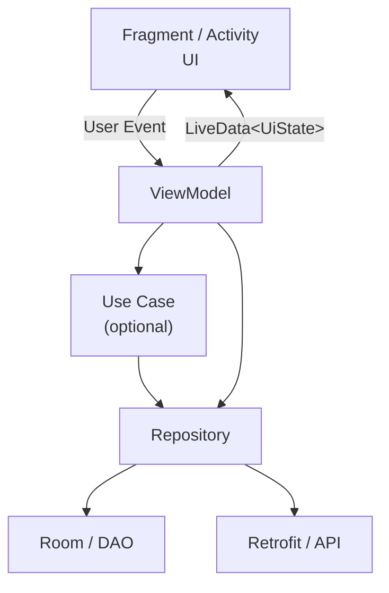
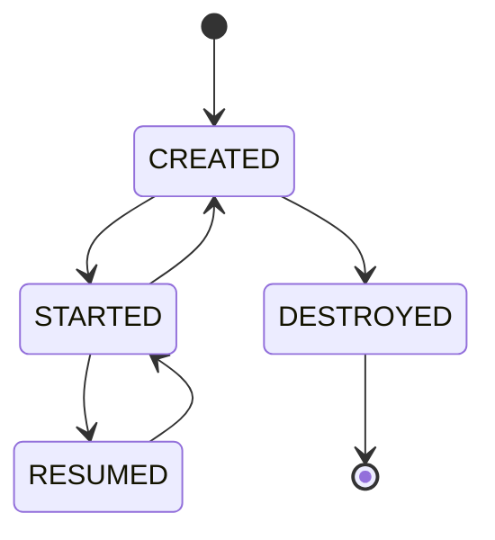
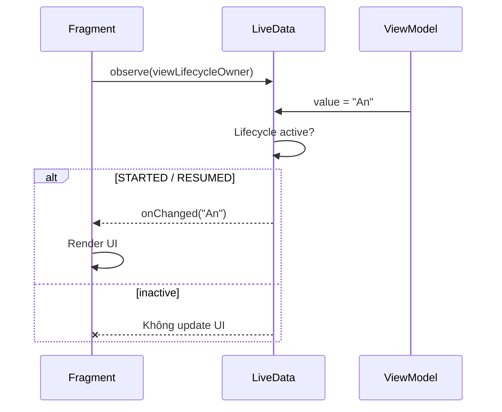
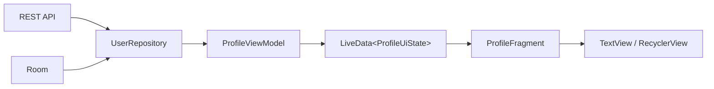
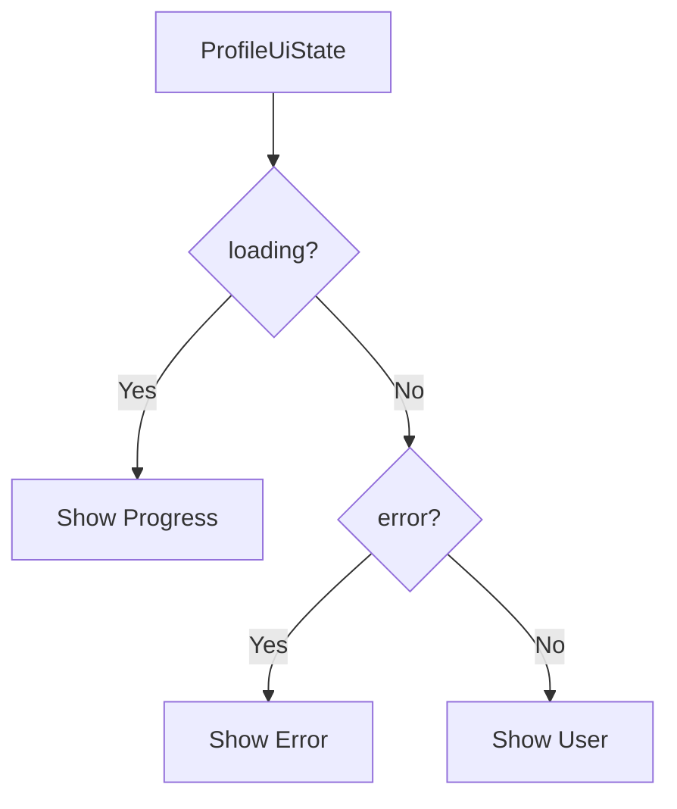
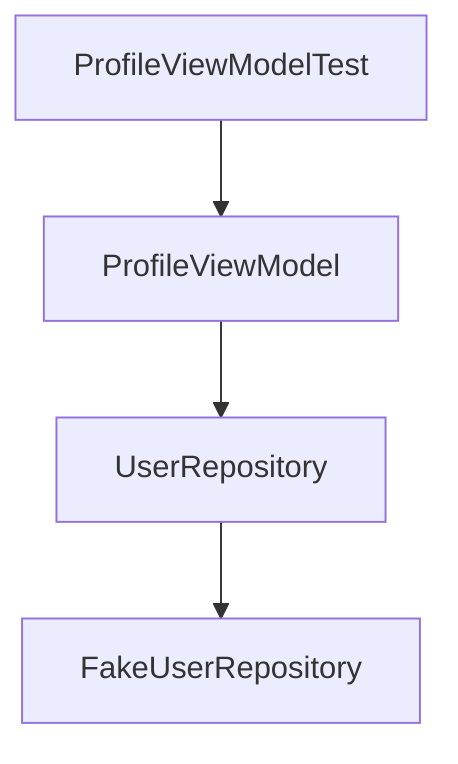
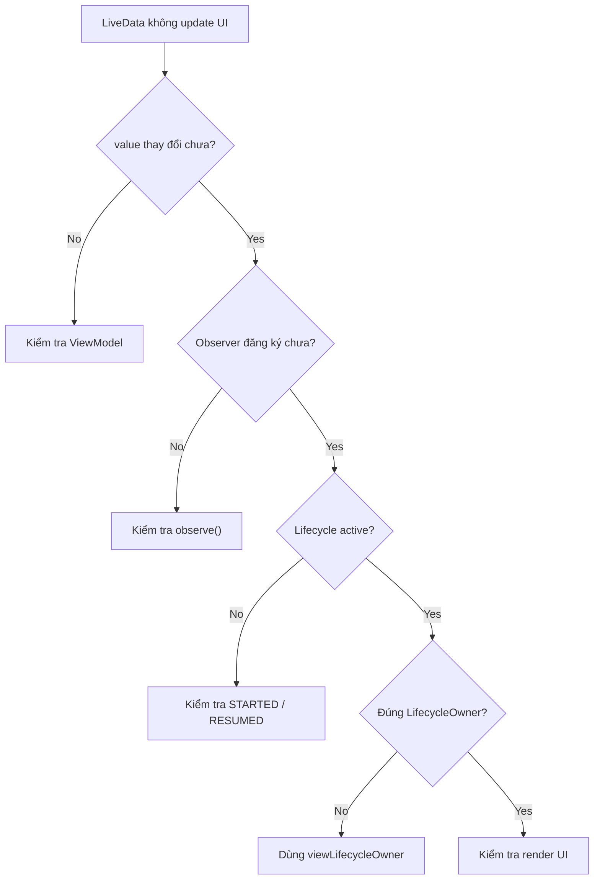
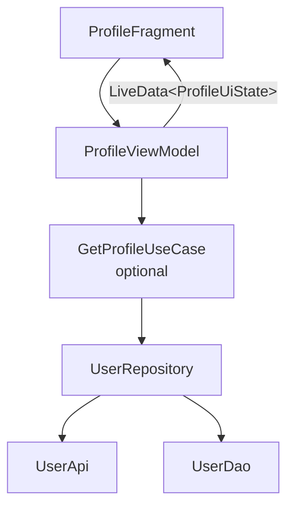

[](https://developer.android.com/training/dependency-injection/manual?utm_source=chatgpt.com)

# 013 - LiveData

| Thuộc tính              | Nội dung                                                     |
| ----------------------- | ------------------------------------------------------------ |
| **Học phần**            | 03 - Architecture, State and Data                            |
| **Module**              | Module 05 - Design and Architecture                          |
| **Nhóm nội dung**       | Android Architecture Components                              |
| **Nguồn roadmap**       | Design and Architecture / Android Architecture Components    |
| **Loại bài**            | Architecture                                                 |
| **Thứ tự trong module** | 013                                                          |
| **Thời lượng gợi ý**    | 34 phút                                                      |
| **Công nghệ chính**     | `LiveData`, `MutableLiveData`, `ViewModel`, `LifecycleOwner` |
| **Mức độ**              | Cơ bản → Trung cấp                                           |

---

## 1. Tóm tắt

**LiveData** là một **observable data holder** thuộc Android Jetpack. Điểm đặc biệt của nó so với một observable thông thường là khả năng **nhận biết lifecycle** của `Activity`, `Fragment` hoặc các `LifecycleOwner` khác. Observer chỉ được thông báo khi lifecycle đang ở trạng thái hoạt động, cụ thể là `STARTED` hoặc `RESUMED`. ([Android Developers][1])

Có thể hiểu đơn giản:

> **LiveData = dữ liệu có thể được quan sát + biết UI đang sống hay đã dừng.**

Một mô hình phổ biến:

```text
Repository
    ↓
ViewModel
    ↓
LiveData<UiState>
    ↓
Fragment / Activity
    ↓
Render UI
```

`ViewModel` thường giữ `LiveData` và cung cấp state cho UI thay vì để `Activity` hoặc `Fragment` tự giữ dữ liệu. Cách tổ chức này giúp UI controller tập trung vào việc render giao diện và giúp state không bị gắn trực tiếp với một instance của Fragment/Activity. ([Android Developers][1])

> [!IMPORTANT]
> Trong kiến trúc Android Kotlin hiện đại, tài liệu Android hiện khuyến nghị **coroutines + Flow/StateFlow** cho luồng dữ liệu và UI state mới. `LiveData` vẫn tồn tại và hữu ích, đặc biệt trong codebase sử dụng Views hoặc Java, nhưng không nhất thiết là lựa chọn mặc định cho mọi dự án mới. ([Android Developers][2])

---

## 2. Mục tiêu học tập

Sau bài này, bạn nên có thể:

* [ ] Giải thích được `LiveData` là gì.
* [ ] Phân biệt `LiveData` và `MutableLiveData`.
* [ ] Hiểu mối quan hệ giữa `LiveData`, `ViewModel` và `LifecycleOwner`.
* [ ] Biết observer hoạt động ở lifecycle state nào.
* [ ] Biết sử dụng `observe()` trong `Fragment`.
* [ ] Biết sử dụng backing property để không cho UI chỉnh sửa state.
* [ ] Phân biệt `value` / `setValue()` và `postValue()`.
* [ ] Biết vị trí thích hợp của LiveData trong kiến trúc Android.
* [ ] Biết khi nào nên cân nhắc `StateFlow` thay cho `LiveData`.
* [ ] Viết được unit test cơ bản cho ViewModel chứa LiveData.
* [ ] Tránh các anti-pattern thường gặp trong production.

---

# 3. LiveData nằm ở đâu trong Android Architecture?

Kiến trúc Android hiện đại thường tối thiểu gồm **UI Layer** và **Data Layer**, đồng thời có thể thêm **Domain Layer** khi business logic đủ phức tạp hoặc cần tái sử dụng. ([Android Developers][3])


*Nguồn: Android Developers — Guide to app architecture*

LiveData chủ yếu liên quan đến **UI Layer**, đặc biệt ở ranh giới:

```text
ViewModel
    ↓
UI
```

Một cấu trúc thực tế có thể là:



Hình kiến trúc UI Layer chính thức:


*Nguồn: Android Developers — Guide to app architecture*

Trong UI Layer, `ViewModel` đóng vai trò **state holder** và UI element phụ thuộc vào state holder để lấy dữ liệu hiển thị. ([Android Developers][3])

---

# 4. Vấn đề mà LiveData giải quyết

Giả sử màn hình profile cần hiển thị username.

Không sử dụng observable:

```kotlin
class ProfileFragment : Fragment() {

    private fun loadProfile() {
        val user = repository.getUser()

        binding.username.text = user.name
    }
}
```

Khi dữ liệu thay đổi:

```text
Database thay đổi
      ↓

Fragment không biết

      ↓

UI vẫn hiển thị dữ liệu cũ
```

Developer phải chủ động:

```text
load data
    ↓
update UI
    ↓
reload
    ↓
update UI
    ↓
reload...
```

LiveData chuyển tư duy sang:

```text
UI Observe State
      │
      ▼
LiveData<User>
      │
      ▼
State thay đổi
      │
      ▼
Observer được thông báo
      │
      ▼
Render UI
```

---

# 5. Observable là gì?

Một observable là đối tượng có thể được **quan sát**.

Ví dụ:

```text
          Observer A
             ▲
             │
             │
        ┌───────────┐
        │ LiveData  │
        │ User      │
        └───────────┘
             │
             ├──────────► Observer B
             │
             └──────────► Observer C
```

Khi:

```kotlin
user.value = newUser
```

LiveData có thể thông báo các observer đang active.

Điểm làm LiveData đặc biệt chính là:

```text
Observable
    +
Lifecycle Awareness
```

Android mô tả LiveData là data holder có thể quan sát và nhận biết lifecycle. ([Android Developers][1])

---

# 6. Lifecycle-aware nghĩa là gì?

Đây là phần quan trọng nhất của LiveData.

Giả sử:

```text
Fragment
   │
   │ observe()
   ▼
LiveData<User>
```

LiveData biết lifecycle của `Fragment`.



LiveData coi observer là **active** khi lifecycle đang ở:

```text
STARTED
RESUMED
```

Android xác nhận observer ở hai trạng thái này mới nhận update; observer được liên kết với `LifecycleOwner` cũng sẽ tự được loại bỏ khi lifecycle đi tới `DESTROYED`. ([Android Developers][1])

---

## 6.1 Lifecycle và LiveData

| Lifecycle state | Observer nhận update? |
| --------------- | --------------------: |
| `INITIALIZED`   |                     ❌ |
| `CREATED`       |                     ❌ |
| `STARTED`       |                     ✅ |
| `RESUMED`       |                     ✅ |
| `DESTROYED`     |                     ❌ |

Ví dụ:

```text
LiveData = "A"

Fragment RESUMED
      ↓
UI nhận "A"

Fragment STOPPED
      ↓

LiveData = "B"
LiveData = "C"

      ↓

Fragment STARTED lại
      ↓
UI nhận state mới nhất "C"
```

Khi một lifecycle trở lại active, LiveData cung cấp giá trị mới nhất phù hợp cho observer. Đây là một trong các lợi ích lifecycle-aware được Android Developers mô tả. ([Android Developers][1])

---

# 7. LiveData và MutableLiveData

Có hai khái niệm thường gặp nhất.

## `LiveData<T>`

Dùng để **đọc và observe** dữ liệu.

```kotlin
LiveData<User>
```

UI có thể:

```text
READ
OBSERVE
```

nhưng không nên tự thay đổi state.

---

## `MutableLiveData<T>`

Cho phép:

```text
READ
OBSERVE
WRITE
```

Ví dụ:

```kotlin
private val _username =
    MutableLiveData<String>()
```

Có thể update:

```kotlin
_username.value = "An"
```

---

# 8. Backing Property Pattern

Một pattern rất phổ biến:

```kotlin
class ProfileViewModel : ViewModel() {

    private val _username =
        MutableLiveData<String>()

    val username: LiveData<String>
        get() = _username

    fun changeUsername(name: String) {
        _username.value = name
    }
}
```

Kiến trúc:

```text
                ViewModel
        ┌─────────────────────┐
        │                     │
        │ MutableLiveData     │
        │ _username           │
        │                     │
        │       │             │
        │       ▼             │
        │ LiveData            │
        │ username            │
        │                     │
        └──────────┬──────────┘
                   │
                   ▼
                  UI
```

UI chỉ nhìn thấy:

```kotlin
LiveData<String>
```

nên không thể làm:

```kotlin
viewModel.username.value = "Hack"
```

Android cũng mô tả pattern thông thường là giữ `MutableLiveData` bên trong `ViewModel` rồi expose ra ngoài dưới dạng `LiveData` immutable. ([Android Developers][1])

---

# 9. Observe LiveData trong Fragment

Ví dụ:

```kotlin
class ProfileFragment : Fragment(R.layout.fragment_profile) {

    private val viewModel: ProfileViewModel by viewModels()

    override fun onViewCreated(
        view: View,
        savedInstanceState: Bundle?
    ) {
        super.onViewCreated(view, savedInstanceState)

        viewModel.username.observe(viewLifecycleOwner) { username ->
            binding.usernameTextView.text = username
        }
    }
}
```

Điểm quan trọng:

```kotlin
viewLifecycleOwner
```

thay vì:

```kotlin
this
```

khi observe dữ liệu gắn với **view của Fragment**.

Có thể hình dung:



---

# 10. Luồng dữ liệu hoàn chỉnh

Ví dụ ứng dụng hiển thị User Profile.



Dependency direction:

```text
UI
↓
ViewModel
↓
Repository
↓
Data Sources
```

Data đi ngược lại:

```text
API / Room
    ↓
Repository
    ↓
ViewModel
    ↓
LiveData
    ↓
UI
```

Android khuyến nghị data thường đi từ nguồn dữ liệu về UI trong khi user event đi theo chiều ngược lại tới nơi sở hữu state, phù hợp với nguyên tắc **Unidirectional Data Flow**. ([Android Developers][3])

---

# 11. Ví dụ hoàn chỉnh

## 11.1 Model

```kotlin
data class User(
    val id: Long,
    val name: String,
    val email: String
)
```

---

## 11.2 Repository

Với ứng dụng Kotlin hiện đại, data layer nên ưu tiên `Flow` thay vì ép toàn bộ repository sử dụng LiveData.

```kotlin
interface UserRepository {

    fun observeUser(): Flow<User>

    suspend fun refreshUser()
}
```

Android hiện lưu ý rằng LiveData không được thiết kế làm abstraction chính cho asynchronous stream ở data layer; với stream ở các layer khác nên cân nhắc Kotlin `Flow`, sau đó chuyển thành LiveData tại `ViewModel` khi cần. ([Android Developers][1])

---

## 11.3 ViewModel

```kotlin
class ProfileViewModel(
    repository: UserRepository
) : ViewModel() {

    val user: LiveData<User> =
        repository
            .observeUser()
            .asLiveData()

    fun refresh() {
        viewModelScope.launch {
            repository.refreshUser()
        }
    }
}
```

Kiến trúc lúc này:

```text
Repository
   │
   │ Flow<User>
   ▼
ViewModel
   │
   │ asLiveData()
   ▼
LiveData<User>
   │
   ▼
Fragment
```

---

## 11.4 Fragment

```kotlin
class ProfileFragment :
    Fragment(R.layout.fragment_profile) {

    private val viewModel: ProfileViewModel by viewModels()

    override fun onViewCreated(
        view: View,
        savedInstanceState: Bundle?
    ) {
        super.onViewCreated(view, savedInstanceState)

        viewModel.user.observe(viewLifecycleOwner) { user ->
            binding.nameTextView.text = user.name
            binding.emailTextView.text = user.email
        }

        binding.refreshButton.setOnClickListener {
            viewModel.refresh()
        }
    }
}
```

---

# 12. UI State thay vì nhiều LiveData rời rạc

Một màn hình có thể có:

```text
user
loading
error
isRefreshing
```

Không nên vội tạo:

```kotlin
LiveData<User>
LiveData<Boolean>
LiveData<String?>
LiveData<Boolean>
```

Có thể gom thành:

```kotlin
data class ProfileUiState(
    val user: User? = null,
    val loading: Boolean = false,
    val error: String? = null
)
```

Sau đó:

```kotlin
private val _uiState =
    MutableLiveData(ProfileUiState())

val uiState: LiveData<ProfileUiState>
    get() = _uiState
```

Kiến trúc:

```text
ProfileUiState
│
├── user
├── loading
└── error
```

thay vì:

```text
userLiveData
loadingLiveData
errorLiveData
refreshLiveData
permissionLiveData
...
```

Cách tiếp cận một UI state rõ ràng cũng phù hợp với hướng kiến trúc Android hiện tại; tài liệu Views hiện khuyến nghị ViewModel expose UI state rõ ràng, mặc dù với code mới họ ưu tiên `StateFlow` cho state đó. ([Android Developers][2])

---

# 13. Rendering theo UI State

```kotlin
viewModel.uiState.observe(viewLifecycleOwner) { state ->

    binding.progressBar.isVisible =
        state.loading

    binding.contentGroup.isVisible =
        !state.loading && state.user != null

    binding.errorTextView.isVisible =
        state.error != null

    binding.nameTextView.text =
        state.user?.name.orEmpty()
}
```

Luồng:



---

# 14. `value` và `postValue()`

`MutableLiveData` cung cấp hai cách update thường gặp.

## `value`

Kotlin:

```kotlin
_username.value = "An"
```

tương đương về ý nghĩa với:

```kotlin
_username.setValue("An")
```

Nên sử dụng khi đang ở:

```text
Main Thread
```

---

## `postValue()`

```kotlin
_username.postValue("An")
```

Có thể dùng khi giá trị được gửi từ worker/background thread.

Theo Android Developers, `setValue()` phải được gọi trên main thread, còn `postValue()` có thể được sử dụng để cập nhật LiveData từ worker thread. ([Android Developers][1])

---

# 15. Transform LiveData

Giả sử có:

```kotlin
val user: LiveData<User>
```

nhưng UI chỉ cần:

```text
User
 ↓
fullName
```

Có thể transform:

```kotlin
val userName: LiveData<String> =
    user.map { user ->
        user.name
    }
```

Luồng:

```text
LiveData<User>
      │
      │ map
      ▼
LiveData<String>
```

Android cung cấp các transformation để thay đổi dữ liệu trước khi dispatch cho observer. ([Android Developers][1])

---

# 16. MediatorLiveData

`MediatorLiveData` có thể observe nhiều LiveData.

```text
LiveData A ──┐
             │
             ▼
       MediatorLiveData
             ▲
             │
LiveData B ──┘
```

Ví dụ:

```kotlin
val result =
    MediatorLiveData<String>()

result.addSource(userName) { name ->
    result.value = name
}

result.addSource(userStatus) { status ->
    result.value = status
}
```

Android mô tả `MediatorLiveData` là subclass có khả năng merge nhiều LiveData source và kích hoạt observer khi một nguồn thay đổi. ([Android Developers][1])

Tuy nhiên với data stream phức tạp:

```text
combine
zip
debounce
retry
flatMapLatest
buffer
```

`Flow` thường phù hợp hơn.

---

# 17. LiveData + Room

Room có thể trả về LiveData trực tiếp.

Ví dụ:

```kotlin
@Dao
interface UserDao {

    @Query(
        """
        SELECT *
        FROM users
        WHERE id = :id
        """
    )
    fun observeUser(
        id: Long
    ): LiveData<User>
}
```

Khi database thay đổi:

```text
SQLite
  ↓
Room
  ↓
LiveData
  ↓
Observer
  ↓
UI update
```

Room hỗ trợ observable query trả về LiveData và có thể cập nhật LiveData khi dữ liệu database liên quan thay đổi. ([Android Developers][1])

Với kiến trúc Kotlin mới, một lựa chọn thường linh hoạt hơn là:

```kotlin
fun observeUser(id: Long): Flow<User>
```

và để ViewModel quyết định representation dùng cho UI.

---

# 18. LiveData không nên trở thành Repository API mặc định

Một anti-pattern:

```kotlin
class UserRepository {

    fun users(): LiveData<List<User>> {
        // ...
    }
}
```

Sau đó tiếp tục thực hiện transform phức tạp:

```kotlin
users.map {
    expensiveOperation(it)
}
```

Vấn đề là LiveData transformation hoạt động gắn với main thread và khả năng composition stream hạn chế hơn `Flow`.

Android Developers hiện cảnh báo không nên để LiveData trở thành abstraction stream chính trong repository và khuyên cân nhắc Kotlin Flow ở các layer khác. ([Android Developers][1])

Thiết kế tốt hơn:

```text
DATA LAYER
    │
    │ Flow
    ▼
VIEWMODEL
    │
    │ LiveData / StateFlow
    ▼
UI
```

---

# 19. LiveData và Configuration Change

LiveData thường được giữ trong `ViewModel`.

```text
        Rotation
           │
           ▼

Fragment A ─────X destroyed

        ViewModel
           │
           │ survives configuration recreation
           ▼

Fragment B created
           │
           │ observe()
           ▼

       LiveData
           │
           ▼
    latest state
```

Điều quan trọng là:

> LiveData không phải thứ tự mình làm state sống qua rotation.

Vai trò giữ state qua configuration recreation chủ yếu đến từ **ViewModel scope**; LiveData cung cấp cơ chế observable lifecycle-aware để UI nhận state đó. Android cũng hướng dẫn đặt LiveData cập nhật UI trong ViewModel thay vì Activity/Fragment. ([Android Developers][1])

---

# 20. LiveData không phải persistent storage

Đừng nhầm:

```text
LiveData
```

với:

```text
Room
DataStore
SavedStateHandle
File
Database
```

LiveData không nhằm mục đích lưu dữ liệu bền vững.

```text
LiveData
   =
Observe current state

Room
   =
Persistent application data

SavedStateHandle
   =
Restore small UI/navigation state

DataStore
   =
Persistent preferences/settings
```

---

# 21. LiveData vs StateFlow

Đây là câu hỏi rất quan trọng khi học Android hiện đại.

| Tiêu chí                  | LiveData              | StateFlow          |
| ------------------------- | --------------------- | ------------------ |
| Observable                | ✅                     | ✅                  |
| Giữ current value         | ✅                     | ✅                  |
| Lifecycle-aware trực tiếp | ✅                     | ❌                  |
| Kotlin Coroutines         | Tích hợp              | Native             |
| Operators                 | Ít hơn                | Rất mạnh           |
| Data Layer                | Không nên là mặc định | ✅ Phù hợp          |
| Views                     | ✅ Rất tiện            | ✅                  |
| Compose                   | Có thể dùng           | ✅ Rất phù hợp      |
| Java codebase             | ✅ Thuận tiện          | Kém thuận tiện hơn |
| Kiến trúc Kotlin mới      | Có thể dùng           | **Thường ưu tiên** |

StateFlow không tự lifecycle-aware như LiveData:

```text
StateFlow
   +
repeatOnLifecycle()
```

hoặc các API lifecycle-aware thích hợp mới tạo hành vi collection theo lifecycle trong Views.

Tài liệu Android cho Views hiện **strongly recommends coroutines and flows** và khuyến nghị ViewModel dùng `StateFlow` cho UI state mới. ([Android Developers][2])

---

# 22. Khi nào vẫn nên dùng LiveData?

LiveData vẫn hợp lý khi:

### 1. Codebase cũ đang sử dụng LiveData rộng rãi

```text
Existing Architecture
        ↓
LiveData everywhere
```

Không cần rewrite chỉ để chạy theo trend.

### 2. Ứng dụng Views đơn giản

```text
XML
+
Fragment
+
ViewModel
+
LiveData
```

rất dễ hiểu.

### 3. Project Java

LiveData có API thuận tiện cho Java.

### 4. API hiện tại đã cung cấp LiveData

Ví dụ một số codebase Room/Jetpack cũ.

---

# 23. Khi nào nên cân nhắc StateFlow?

Ưu tiên cân nhắc StateFlow khi:

```text
Kotlin
+
Coroutines
+
Flow
+
Modern Android Architecture
```

đặc biệt khi cần:

```text
combine()
map()
filter()
debounce()
flatMapLatest()
retry()
catch()
```

hoặc khi data layer đã sử dụng:

```kotlin
Flow<T>
```

---

# 24. LiveData với Jetpack Compose

Nếu project vẫn expose LiveData:

```kotlin
val user: LiveData<User>
```

Compose có thể bridge sang state để render.

Kiến trúc:

```text
LiveData
   ↓
Compose State
   ↓
Recomposition
```

Tuy vậy, với dự án Kotlin + Compose mới:

```text
ViewModel
   ↓
StateFlow<UiState>
   ↓
collectAsStateWithLifecycle()
   ↓
Composable
```

thường phù hợp hơn với kiến trúc Android hiện tại, vốn nhấn mạnh coroutines, flows và lifecycle-aware collection. ([Android Developers][2])

---

# 25. Anti-pattern: Cho UI sửa MutableLiveData

Không nên:

```kotlin
class ProfileViewModel : ViewModel() {

    val username =
        MutableLiveData<String>()
}
```

UI có thể:

```kotlin
viewModel.username.value = "Something"
```

Khi đó:

```text
UI
│
├── render state
└── modify state ❌
```

State ownership không rõ ràng.

Tốt hơn:

```kotlin
private val _username =
    MutableLiveData<String>()

val username: LiveData<String>
    get() = _username
```

---

# 26. Anti-pattern: Business logic trong Fragment observer

Không nên:

```kotlin
viewModel.user.observe(viewLifecycleOwner) { user ->

    val tax = calculateTax(user)

    saveUser(user)

    repository.sync(user)

    analytics.track(user)

    binding.text.text = user.name
}
```

Observer UI nên chủ yếu:

```text
State
 ↓
Render
```

Business logic nên nằm ở:

```text
ViewModel
Domain Layer
Data Layer
```

---

# 27. Anti-pattern: Dùng LiveData làm global event bus

Ví dụ không nên:

```text
GlobalLiveData
    │
    ├── Activity
    ├── Fragment
    ├── Service
    └── Repository
```

Hệ quả:

```text
Hidden dependencies
        +
Hard to test
        +
Difficult debugging
```

LiveData nên có **ownership và scope rõ ràng**.

---

# 28. Anti-pattern: `observeForever()`

Có API:

```kotlin
liveData.observeForever(observer)
```

Observer này được xem là **luôn active**.

Nếu sử dụng, developer phải chủ động:

```kotlin
liveData.removeObserver(observer)
```

Android Developers lưu ý observer đăng ký bằng `observeForever()` luôn active và phải được remove thủ công. ([Android Developers][1])

Do đó:

```text
observe(viewLifecycleOwner)
```

thường an toàn hơn cho UI.

---

# 29. Testing LiveData

Một `ViewModel` tốt nên test được mà không cần Fragment thật.

Ví dụ:

```kotlin
class CounterViewModel : ViewModel() {

    private val _count =
        MutableLiveData(0)

    val count: LiveData<Int>
        get() = _count

    fun increment() {
        _count.value =
            (_count.value ?: 0) + 1
    }
}
```

---

## 29.1 InstantTaskExecutorRule

Trong host-side test có thể sử dụng:

```kotlin
@get:Rule
val instantExecutorRule =
    InstantTaskExecutorRule()
```

`InstantTaskExecutorRule` thay executor của Architecture Components bằng executor chạy task đồng bộ, giúp việc test LiveData dễ kiểm soát hơn. API này hiện nằm trong:

```text
androidx.arch.core:core-testing
```

([Android Developers][4])

---

## 29.2 Test ví dụ

```kotlin
class CounterViewModelTest {

    @get:Rule
    val instantExecutorRule =
        InstantTaskExecutorRule()

    @Test
    fun increment_increasesCount() {

        val viewModel =
            CounterViewModel()

        viewModel.increment()

        assertEquals(
            1,
            viewModel.count.value
        )
    }
}
```

---

# 30. Fake Repository

Thay vì ViewModel tự tạo repository:

```kotlin
class ProfileViewModel : ViewModel() {

    private val repository =
        UserRepository()
}
```

hãy inject dependency:

```kotlin
class ProfileViewModel(
    private val repository: UserRepository
) : ViewModel()
```

Sau đó test bằng:

```kotlin
class FakeUserRepository : UserRepository {

    override fun observeUser(): Flow<User> {
        return flowOf(
            User(
                id = 1,
                name = "Test User",
                email = "test@example.com"
            )
        )
    }

    override suspend fun refreshUser() {
    }
}
```

Dependency graph:



Tư tưởng dependency injection cho phép thay implementation bằng fake/mock để test cũng được Android Developers sử dụng trong hướng dẫn kiến trúc. ([Android Developers][5])

---

# 31. Minh họa dependency graph


*Nguồn: Android Developers — Manual Dependency Injection*

Ví dụ này thể hiện dependency direction tương tự:

```text
Activity
   ↓
ViewModel
   ↓
Repository
   ↓
Data Sources
```


---

# 32. Debugging LiveData

Khi UI không update, kiểm tra theo thứ tự:



Checklist:

```text
LiveData value
      ↓
Observer
      ↓
LifecycleOwner
      ↓
Lifecycle state
      ↓
Render
```

---

# 33. Lỗi thường gặp

## Lỗi 1 — Observe sai LifecycleOwner

```kotlin
viewModel.user.observe(this) {
}
```

trong một số tình huống Fragment có thể không phải owner phù hợp cho lifecycle của view.

Ưu tiên:

```kotlin
viewModel.user.observe(viewLifecycleOwner) {
}
```

---

## Lỗi 2 — Expose MutableLiveData

```kotlin
val state =
    MutableLiveData<State>()
```

Tốt hơn:

```kotlin
private val _state =
    MutableLiveData<State>()

val state: LiveData<State>
    get() = _state
```

---

## Lỗi 3 — Repository chứa quá nhiều LiveData

```text
Repository
 ↓
LiveData
 ↓
Transformation
 ↓
MediatorLiveData
 ↓
Transformation
 ↓
MediatorLiveData
```

Khi stream trở nên phức tạp:

```text
Flow
```

thường phù hợp hơn. ([Android Developers][1])

---

## Lỗi 4 — Gọi `value` từ worker thread

Không nên:

```text
Worker Thread
     ↓
setValue()
```

Thay bằng:

```text
Worker Thread
     ↓
postValue()
```

hoặc tốt hơn trong kiến trúc coroutine:

```text
Repository Flow
      ↓
ViewModel
      ↓
Main-safe state update
```

([Android Developers][1])

---

# 34. Thực hành — Mini Profile App

Xây một màn hình:

```text
┌─────────────────────────────┐
│          PROFILE            │
│                             │
│       [ Avatar ]            │
│                             │
│ Name: An                    │
│ Email: an@example.com       │
│                             │
│        [ Refresh ]          │
│                             │
└─────────────────────────────┘
```

Architecture:



---

# 35. Yêu cầu bài thực hành

## Repository

```kotlin
interface UserRepository {

    fun observeProfile(): Flow<User>

    suspend fun refresh()
}
```

---

## UI State

```kotlin
data class ProfileUiState(
    val user: User? = null,
    val isLoading: Boolean = false,
    val errorMessage: String? = null
)
```

---

## ViewModel

Expose:

```kotlin
LiveData<ProfileUiState>
```

UI không được truy cập:

```kotlin
MutableLiveData
```

trực tiếp.

---

## Fragment

Observe:

```kotlin
viewModel.uiState.observe(
    viewLifecycleOwner
) { state ->

    render(state)
}
```

---

# 36. Bài tập nâng cao

Mở rộng ứng dụng bằng các trạng thái:

```text
Loading
    ↓
Success
    ↓
Error
```

Ví dụ sealed state:

```kotlin
sealed interface ProfileUiState {

    data object Loading :
        ProfileUiState

    data class Success(
        val user: User
    ) : ProfileUiState

    data class Error(
        val message: String
    ) : ProfileUiState
}
```

Sau đó render:

```kotlin
when (val state = state) {

    ProfileUiState.Loading -> {
        showLoading()
    }

    is ProfileUiState.Success -> {
        showUser(state.user)
    }

    is ProfileUiState.Error -> {
        showError(state.message)
    }
}
```

---

# 37. Bài tập so sánh LiveData và StateFlow

Triển khai cùng một feature hai lần.

### Version A

```text
ViewModel
   ↓
LiveData<UiState>
   ↓
Fragment.observe()
```

### Version B

```text
ViewModel
   ↓
StateFlow<UiState>
   ↓
repeatOnLifecycle()
   ↓
Fragment
```

Sau đó so sánh:

| Tiêu chí               | LiveData | StateFlow |
| ---------------------- | -------: | --------: |
| Code đơn giản          |          |           |
| Lifecycle              |          |           |
| Operators              |          |           |
| Testing                |          |           |
| Data layer integration |          |           |
| Compose integration    |          |           |

Bài tập này giúp hiểu **tại sao LiveData từng là lựa chọn trung tâm và tại sao Flow/StateFlow hiện được ưu tiên hơn trong nhiều kiến trúc Kotlin mới**. ([Android Developers][2])

---

# 38. Production Checklist

Trước khi release feature dùng LiveData, kiểm tra:

### Architecture

* [ ] `MutableLiveData` là `private`.
* [ ] UI chỉ nhận `LiveData`.
* [ ] Activity/Fragment không chứa business logic.
* [ ] Repository không phụ thuộc LiveData nếu không có lý do rõ ràng.
* [ ] Dependency direction rõ ràng.

### Lifecycle

* [ ] Fragment dùng `viewLifecycleOwner`.
* [ ] Không lạm dụng `observeForever()`.
* [ ] Observer không giữ reference tới View đã bị destroy.
* [ ] Rotate màn hình không làm mất UI state cần thiết.

### State

* [ ] Loading được biểu diễn rõ ràng.
* [ ] Error được biểu diễn rõ ràng.
* [ ] Empty state được xử lý.
* [ ] Không có nhiều nguồn cùng tùy tiện sửa một state.

### Threading

* [ ] `value` / `setValue()` chạy đúng thread.
* [ ] Background operation không block main thread.
* [ ] Heavy transformations không được đặt tùy tiện trên LiveData.

### Testing

* [ ] ViewModel có unit test.
* [ ] Repository có fake/test double.
* [ ] Success case được test.
* [ ] Error case được test.
* [ ] Loading state được test.

### UX

* [ ] UI không hiển thị dữ liệu cũ sai ngữ cảnh.
* [ ] Loading không bị treo.
* [ ] Error có retry nếu phù hợp.
* [ ] Rotate/background/foreground không gây UI nhảy bất thường.

---

# 39. Artifact cho Portfolio

Một artifact tốt cho bài LiveData có thể là:

```text
live-data-profile/
│
├── README.md
│
├── architecture.png
│
├── screenshots/
│   ├── loading.png
│   ├── success.png
│   └── error.png
│
├── ui/
│   ├── ProfileFragment.kt
│   └── ProfileViewModel.kt
│
├── data/
│   ├── UserRepository.kt
│   └── FakeUserRepository.kt
│
└── test/
    └── ProfileViewModelTest.kt
```

README nên mô tả:

```text
Problem
  ↓
Architecture
  ↓
LiveData lifecycle behavior
  ↓
Implementation
  ↓
Testing
  ↓
Trade-offs
  ↓
LiveData vs StateFlow
```

---

# 40. Câu hỏi phỏng vấn

### Câu 1

**LiveData là gì?**

LiveData là observable data holder thuộc Android Jetpack có khả năng nhận biết lifecycle của observer.

---

### Câu 2

**LiveData khác MutableLiveData như thế nào?**

```text
LiveData
    ↓
observe/read

MutableLiveData
    ↓
observe/read/write
```

---

### Câu 3

**Khi nào LiveData gửi update cho observer?**

Khi `LifecycleOwner` đang ở trạng thái:

```text
STARTED
hoặc
RESUMED
```

([Android Developers][1])

---

### Câu 4

**Tại sao MutableLiveData thường private?**

Để chỉ ViewModel sở hữu quyền chỉnh sửa state.

```text
UI → events → ViewModel

ViewModel → state → UI
```

---

### Câu 5

**LiveData có giữ state qua rotate không?**

Không nên nói đơn giản là:

> LiveData tự giữ state qua rotate.

Câu trả lời chính xác hơn:

> LiveData thường được đặt trong ViewModel; ViewModel giữ state qua configuration recreation còn LiveData giúp UI observe state theo lifecycle.

---

### Câu 6

**LiveData hay StateFlow cho app Kotlin mới?**

Với Android Kotlin hiện đại:

```text
Flow / StateFlow
```

thường được ưu tiên cho stream và UI state mới; LiveData vẫn hữu ích trong Views/Java hoặc codebase hiện hữu. ([Android Developers][2])

---

# 41. Mental Model

Hãy nhớ LiveData bằng công thức:

```text
LiveData
=
Observable State
+
Lifecycle Awareness
```

Và pattern:

```text
              Event
UI ─────────────────────────► ViewModel

                                 │
                                 │ State
                                 ▼

UI ◄───────────────────────── LiveData
```

Hoặc ngắn hơn:

```text
UI observes state.

UI does not own state.
```

---

# 42. Tổng kết

LiveData giải quyết ba vấn đề quan trọng:

```text
              LiveData

       ┌────────┼────────┐
       │        │        │
       ▼        ▼        ▼

 Observable  Lifecycle   UI State
   Data       Aware     Delivery
```

Các nguyên tắc quan trọng nhất cần nhớ:

1. `LiveData` là observable data holder nhận biết lifecycle. ([Android Developers][1])
2. Observer active khi lifecycle ở `STARTED` hoặc `RESUMED`. ([Android Developers][1])
3. Thường giữ LiveData trong `ViewModel`, không phải Activity/Fragment. ([Android Developers][1])
4. Giữ `MutableLiveData` private và expose `LiveData`.
5. `value`/`setValue()` dùng trên main thread; `postValue()` hỗ trợ update từ worker thread. ([Android Developers][1])
6. Không biến LiveData thành abstraction chính cho stream phức tạp trong repository; cân nhắc `Flow`. ([Android Developers][1])
7. Với Android Kotlin hiện đại, `StateFlow` thường là lựa chọn ưu tiên cho UI state mới. ([Android Developers][2])
8. LiveData vẫn là kiến thức quan trọng để hiểu Android Architecture Components và duy trì các codebase sử dụng Views/Java.

---

# 43. Checklist hoàn thành bài

* [ ] Tôi giải thích được LiveData bằng lời của mình.
* [ ] Tôi hiểu observable data holder là gì.
* [ ] Tôi hiểu lifecycle-aware là gì.
* [ ] Tôi biết `STARTED` và `RESUMED` là active state.
* [ ] Tôi phân biệt `LiveData` và `MutableLiveData`.
* [ ] Tôi biết backing property pattern.
* [ ] Tôi biết `observe(viewLifecycleOwner)`.
* [ ] Tôi hiểu `value` và `postValue()`.
* [ ] Tôi biết LiveData nên nằm ở đâu trong kiến trúc.
* [ ] Tôi biết tại sao không nên lạm dụng LiveData trong Repository.
* [ ] Tôi phân biệt được LiveData và StateFlow.
* [ ] Tôi viết được ViewModel test.
* [ ] Tôi hoàn thành mini Profile App.
* [ ] Tôi có diagram + screenshot + README để đưa vào portfolio.

---

## Tài liệu tham khảo

* **LiveData Overview — Android Developers:**
  [https://developer.android.com/topic/libraries/architecture/livedata](https://developer.android.com/topic/libraries/architecture/livedata)
* **Guide to App Architecture — Android Developers:**
  [https://developer.android.com/topic/architecture](https://developer.android.com/topic/architecture)
* **Architecture Recommendations for Views — Android Developers:**
  [https://developer.android.com/topic/architecture/views/recommendations-views](https://developer.android.com/topic/architecture/views/recommendations-views)
* **LiveData API Reference:**
  [https://developer.android.com/reference/androidx/lifecycle/LiveData](https://developer.android.com/reference/androidx/lifecycle/LiveData)
* **InstantTaskExecutorRule:**
  [https://developer.android.com/reference/androidx/arch/core/executor/testing/InstantTaskExecutorRule](https://developer.android.com/reference/androidx/arch/core/executor/testing/InstantTaskExecutorRule)

> **Ghi chú cho roadmap 2026:** LiveData nên được học kỹ để hiểu lifecycle-aware observable state và các codebase Android truyền thống, nhưng khi thiết kế ứng dụng Kotlin mới, cần học song song `Flow`, `StateFlow`, `repeatOnLifecycle()` và `collectAsStateWithLifecycle()` vì đây là hướng kiến trúc hiện được Android Developers khuyến nghị. ([Android Developers][2])

[1]: https://developer.android.com/topic/libraries/architecture/livedata "LiveData overview  |  Views  |  Android Developers"
[2]: https://developer.android.com/topic/architecture/views/recommendations-views "Recommendations for Android architecture (Views)  |  Android Developers"
[3]: https://developer.android.com/topic/architecture "Guide to app architecture  |  App architecture  |  Android Developers"
[4]: https://developer.android.com/reference/androidx/arch/core/executor/testing/InstantTaskExecutorRule?utm_source=chatgpt.com "InstantTaskExecutorRule | API reference"
[5]: https://developer.android.com/training/dependency-injection/manual "Manual dependency injection  |  App architecture  |  Android Developers"
