[](https://developer.android.com/topic/architecture/ui-layer?utm_source=chatgpt.com)

# 014 - StateFlow

| Thông tin               | Nội dung                                                  |
| ----------------------- | --------------------------------------------------------- |
| **Học phần**            | 03 - Architecture, State and Data                         |
| **Module**              | Module 05 - Design and Architecture                       |
| **Nhóm nội dung**       | Android Architecture Components                           |
| **Nguồn roadmap**       | Design and Architecture / Android Architecture Components |
| **Loại bài**            | Async / State Management                                  |
| **Thứ tự trong module** | 014                                                       |
| **Thời lượng gợi ý**    | 34 phút                                                   |

---

## 1. Tóm tắt

**StateFlow** là một API thuộc Kotlin Coroutines dùng để biểu diễn **trạng thái có thể thay đổi theo thời gian** dưới dạng một `Flow`.

Điểm quan trọng nhất:

> `StateFlow` luôn có một **giá trị hiện tại**, và các collector mới có thể nhận ngay trạng thái mới nhất.

Trong Android hiện đại, `StateFlow` thường được đặt trong `ViewModel` để cung cấp **UI State** cho `Activity`, `Fragment` hoặc Jetpack Compose. Android Developers khuyến nghị mô hình UI theo **Unidirectional Data Flow — UDF**, trong đó `ViewModel` tạo state, UI quan sát state và gửi user event ngược lại `ViewModel`. ([Android Developers][1])

Một kiến trúc phổ biến:

```text
Repository
    ↓
Flow / suspend function
    ↓
ViewModel
    ↓
StateFlow<UiState>
    ↓
Compose / Fragment
```

Cần lưu ý rằng **StateFlow không phải API riêng của Android Architecture Components**. Nó thuộc `kotlinx.coroutines`, nhưng được sử dụng rất rộng rãi cùng `ViewModel`, lifecycle và Android Architecture. ([Kotlin][2])

---

## 2. StateFlow giải quyết vấn đề gì?

Giả sử màn hình cần tải danh sách sản phẩm.

Trong quá trình chạy, màn hình có thể ở nhiều trạng thái:

```text
Loading
   ↓
Success
```

hoặc:

```text
Loading
   ↓
Error
   ↓
Retry
   ↓
Loading
   ↓
Success
```

UI cần biết trạng thái hiện tại để quyết định nên hiển thị:

* Progress Indicator;
* danh sách sản phẩm;
* thông báo lỗi;
* nút Retry;
* empty state.

Thay vì để UI tự quản lý nhiều biến rời rạc:

```kotlin
var loading = false
var products = emptyList<Product>()
var error: String? = null
```

ta có thể đóng gói chúng thành một **UI State duy nhất**.

```kotlin
data class ProductUiState(
    val isLoading: Boolean = false,
    val products: List<Product> = emptyList(),
    val errorMessage: String? = null
)
```

Sau đó `ViewModel` expose:

```kotlin
StateFlow<ProductUiState>
```

Android Architecture Guide khuyến nghị UI state nên mô tả đầy đủ dữ liệu cần thiết để render màn hình và thường nên được expose bằng một observable state holder như `StateFlow`. ([Android Developers][1])

---

## 3. StateFlow nằm ở đâu trong Android Architecture?


*Nguồn hình: Android Developers — UI Layer / UDF.* 

Một kiến trúc phổ biến:

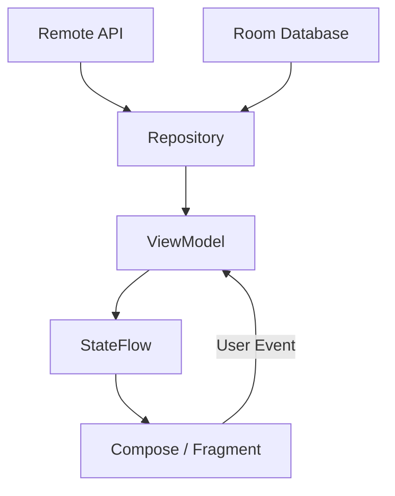

Luồng dữ liệu chủ yếu đi theo một chiều:

```text
Data Layer
     │
     ▼
Repository
     │
     ▼
ViewModel
     │
     ▼
StateFlow<UiState>
     │
     ▼
UI
```

User action đi ngược lại:

```text
UI
 │
 │ onRetry()
 │ onFavorite()
 │ onSearch()
 ▼
ViewModel
```

Sau khi xử lý event:

```text
ViewModel
   ↓
new UiState
   ↓
StateFlow
   ↓
UI render lại
```

Đây chính là tư tưởng **Unidirectional Data Flow** được Android Architecture Guide sử dụng cho UI layer. ([Android Developers][1])

---

# 4. StateFlow hoạt động như thế nào?

## 4.1 `MutableStateFlow`

State thường được tạo bên trong `ViewModel` bằng:

```kotlin
private val _uiState = MutableStateFlow(ProductUiState())
```

`MutableStateFlow` cho phép thay đổi state.

Ví dụ:

```kotlin
_uiState.value = ProductUiState(
    isLoading = true
)
```

Hoặc cách thường thuận tiện hơn:

```kotlin
_uiState.update { currentState ->
    currentState.copy(
        isLoading = true
    )
}
```

`MutableStateFlow` sử dụng equality để conflation các giá trị tương đương, vì vậy việc dùng immutable `data class` cho UI state đặc biệt phù hợp. ([Kotlin][3])

---

## 4.2 Không expose MutableStateFlow trực tiếp

Không nên:

```kotlin
val uiState = MutableStateFlow(ProductUiState())
```

vì UI có thể sửa:

```kotlin
viewModel.uiState.value = ...
```

UI lúc này trở thành một nguồn thay đổi state khác.

Thay vào đó:

```kotlin
private val _uiState = MutableStateFlow(ProductUiState())

val uiState: StateFlow<ProductUiState> =
    _uiState.asStateFlow()
```

Kiến trúc trở thành:

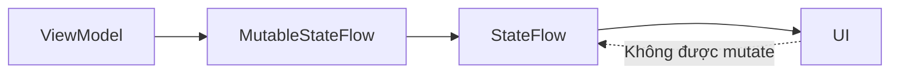

Android Developers cũng sử dụng pattern **private mutable backing property + public read-only StateFlow** trong hướng dẫn StateFlow. ([Android Developers][4])

---

# 5. Ví dụ hoàn chỉnh với ViewModel

Giả sử chúng ta xây dựng màn hình:

```text
ProductScreen
```

có nhiệm vụ tải sản phẩm từ server.

## 5.1 UI State

```kotlin
data class ProductUiState(
    val isLoading: Boolean = false,
    val products: List<Product> = emptyList(),
    val errorMessage: String? = null
)
```

---

## 5.2 Repository

```kotlin
interface ProductRepository {

    suspend fun getProducts(): List<Product>
}
```

Một fake repository:

```kotlin
class FakeProductRepository : ProductRepository {

    override suspend fun getProducts(): List<Product> {
        delay(500)

        return listOf(
            Product(
                id = 1,
                name = "Laptop"
            ),
            Product(
                id = 2,
                name = "Keyboard"
            )
        )
    }
}
```

---

## 5.3 ViewModel

```kotlin
class ProductViewModel(
    private val repository: ProductRepository
) : ViewModel() {

    private val _uiState =
        MutableStateFlow(ProductUiState())

    val uiState: StateFlow<ProductUiState> =
        _uiState.asStateFlow()

    init {
        loadProducts()
    }

    fun loadProducts() {

        viewModelScope.launch {

            _uiState.update {
                it.copy(
                    isLoading = true,
                    errorMessage = null
                )
            }

            try {

                val products =
                    repository.getProducts()

                _uiState.update {
                    it.copy(
                        isLoading = false,
                        products = products
                    )
                }

            } catch (e: CancellationException) {

                throw e

            } catch (e: IOException) {

                _uiState.update {
                    it.copy(
                        isLoading = false,
                        errorMessage = "Không thể tải dữ liệu"
                    )
                }
            }
        }
    }
}
```

State transition:

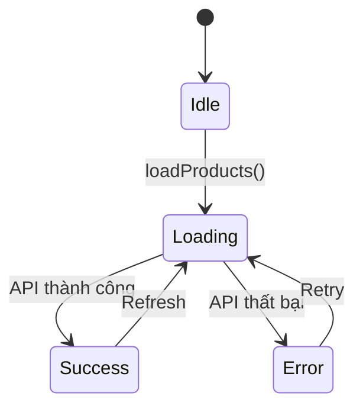

`viewModelScope` giúp coroutine gắn với lifecycle của `ViewModel`; khi `ViewModel` bị clear, công việc trong scope sẽ được hủy. Android cũng khuyến nghị sử dụng coroutine trong state holder cho những thay đổi state phụ thuộc vào asynchronous result. ([Android Developers][5])

---

# 6. StateFlow + Jetpack Compose

Trong Compose, không nên collect thủ công:

```kotlin
viewModel.uiState.collect { ... }
```

Cách phù hợp với lifecycle:

```kotlin
@Composable
fun ProductRoute(
    viewModel: ProductViewModel
) {

    val uiState by
        viewModel.uiState.collectAsStateWithLifecycle()

    ProductScreen(
        uiState = uiState,
        onRetry = viewModel::loadProducts
    )
}
```

Sau đó:

```kotlin
@Composable
fun ProductScreen(
    uiState: ProductUiState,
    onRetry: () -> Unit
) {

    when {

        uiState.isLoading -> {
            CircularProgressIndicator()
        }

        uiState.errorMessage != null -> {
            Column {

                Text(
                    text = uiState.errorMessage
                )

                Button(
                    onClick = onRetry
                ) {
                    Text("Retry")
                }
            }
        }

        else -> {

            LazyColumn {

                items(uiState.products) { product ->

                    Text(
                        text = product.name
                    )
                }
            }
        }
    }
}
```

`collectAsStateWithLifecycle()` chuyển `Flow`/`StateFlow` thành Compose `State` theo lifecycle, giúp UI cập nhật phản ứng theo dữ liệu mà không tiếp tục collect không cần thiết khi UI không hoạt động. Đây là API Android hiện khuyến nghị cho Compose. ([Android Developers][6])

Luồng:

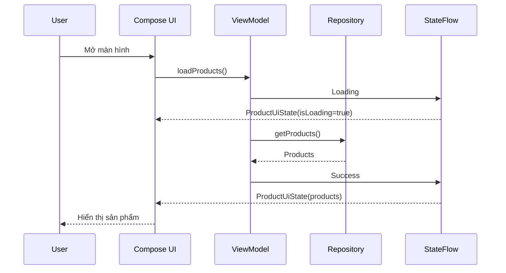

---

# 7. StateFlow + Fragment / View System

Nếu chưa dùng Compose, có thể collect với `repeatOnLifecycle`.

```kotlin
viewLifecycleOwner.lifecycleScope.launch {

    viewLifecycleOwner.repeatOnLifecycle(
        Lifecycle.State.STARTED
    ) {

        viewModel.uiState.collect { state ->

            render(state)
        }
    }
}
```

Ví dụ:

```kotlin
private fun render(
    state: ProductUiState
) {

    binding.progressBar.isVisible =
        state.isLoading

    binding.errorText.isVisible =
        state.errorMessage != null

    binding.errorText.text =
        state.errorMessage

    adapter.submitList(
        state.products
    )
}
```

Lifecycle-aware collection giúp tránh việc UI tiếp tục xử lý stream khi view không còn ở trạng thái phù hợp. ([Android Developers][7])

---

# 8. StateFlow và UI State Pipeline


*Nguồn hình: Android Developers — UI State Production.* 

Có thể hiểu pipeline StateFlow như sau:

```text
INPUT
│
├── User Event
├── API
├── Database
├── Preferences
└── Other Flow
        │
        ▼
   State Holder
    ViewModel
        │
        ▼
 StateFlow<UiState>
        │
        ▼
       UI
```

Android phân biệt rõ:

```text
Input                Processor             Output

User Event ───────┐
Repository Flow ──┼──► ViewModel ───────► UI State
suspend API ──────┘
```

Trong pipeline này, Coroutine/Flow thường xử lý nguồn dữ liệu bất đồng bộ, còn `StateFlow` đóng vai trò observable output cho UI. ([Android Developers][5])

---

# 9. Chuyển Flow thành StateFlow với `stateIn()`

Không phải lúc nào ta cũng cần tự tạo:

```kotlin
MutableStateFlow
```

Giả sử repository đã trả về:

```kotlin
Flow<List<Product>>
```

```kotlin
interface ProductRepository {

    fun observeProducts(): Flow<List<Product>>
}
```

Ta có thể transform trực tiếp:

```kotlin
val uiState: StateFlow<ProductUiState> =
    repository
        .observeProducts()
        .map { products ->

            ProductUiState(
                products = products
            )
        }
        .stateIn(
            scope = viewModelScope,
            started = SharingStarted.WhileSubscribed(5_000),
            initialValue = ProductUiState(
                isLoading = true
            )
        )
```

Kiến trúc:

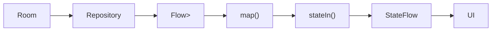

`stateIn()` biến một `Flow` thành hot `StateFlow` bên trong một `CoroutineScope`; `SharingStarted` kiểm soát thời điểm upstream bắt đầu hoặc dừng được share. ([Kotlin][8])

---

# 10. `SharingStarted.WhileSubscribed(5_000)` nghĩa là gì?

Một pattern rất thường gặp:

```kotlin
.stateIn(
    scope = viewModelScope,
    started = SharingStarted.WhileSubscribed(5_000),
    initialValue = UiState()
)
```

Có thể hình dung:

```text
UI subscribe
     │
     ▼
Flow bắt đầu hoạt động
     │
     ▼
UI nhận State
```

Khi UI tạm ngừng collect:

```text
Collector = 0
     │
     ▼
đợi khoảng timeout
     │
     ▼
upstream có thể dừng
```

Android Architecture Guide hiện cũng sử dụng `SharingStarted.WhileSubscribed(5_000)` trong ví dụ state-production với `stateIn()`. ([Android Developers][5])

Điều này đặc biệt hữu ích với các upstream có chi phí như:

```text
Database observer
Network stream
Location updates
Sensor stream
```

---

# 11. StateFlow là Hot Flow

Một điểm quan trọng:

```text
Flow
```

có thể là **cold flow**:

```text
Collector A
   ↓
khởi chạy producer A

Collector B
   ↓
khởi chạy producer B
```

Trong khi:

```text
StateFlow
```

là hot flow:

```text
             StateFlow
            state = X
           /    |     \
          /     |      \
Collector A Collector B Collector C
```

`StateFlow` giữ một state hiện tại và collector mới có thể nhận giá trị hiện tại đó. Kotlin mô tả `StateFlow` là một dạng `SharedFlow` chuyên dùng để biểu diễn state thay đổi theo thời gian. ([Kotlin][2])

---

# 12. StateFlow không tự chuyển công việc sang background

Một lỗi hiểu khá phổ biến là:

> Dùng StateFlow → code tự chạy background.

Điều này **không đúng**.

Ví dụ:

```kotlin
viewModelScope.launch {

    expensiveBlockingOperation()
}
```

`viewModelScope.launch` thường bắt đầu trên Main dispatcher.

Nếu `expensiveBlockingOperation()` thực sự blocking, UI vẫn có thể bị giật.

Với blocking I/O do bạn trực tiếp thực hiện, repository nên trở thành **main-safe**:

```kotlin
class ProductRepositoryImpl(
    private val ioDispatcher: CoroutineDispatcher =
        Dispatchers.IO
) : ProductRepository {

    override suspend fun getProducts(): List<Product> =
        withContext(ioDispatcher) {

            blockingDataSource.loadProducts()
        }
}
```

Pipeline:

```text
Main Thread
    │
    ▼
ViewModel
    │
    ▼
Repository
    │
    ├── withContext(IO)
    │        │
    │        ▼
    │    Blocking I/O
    │
    ▼
Result
    │
    ▼
StateFlow
```

Android UI-state guidance phân biệt rõ **async input APIs** như Coroutines/Flow với observable output như `StateFlow`; StateFlow không phải một thread scheduler. ([Android Developers][5])

---

# 13. Cancellation

Coroutine mang lại structured cancellation.

Ví dụ:

```kotlin
private var searchJob: Job? = null

fun search(query: String) {

    searchJob?.cancel()

    searchJob = viewModelScope.launch {

        val result =
            repository.search(query)

        _uiState.update {
            it.copy(
                products = result
            )
        }
    }
}
```

Nếu user nhập:

```text
lap
lapt
lapto
laptop
```

ta không nhất thiết phải chờ từng request cũ hoàn thành.

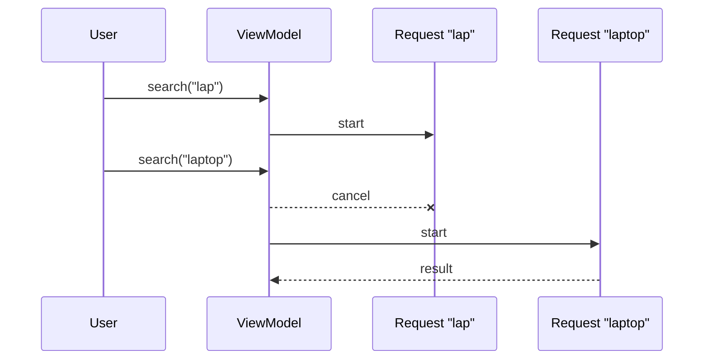

Khi bắt `CancellationException`, nên để cancellation tiếp tục propagate:

```kotlin
catch (e: CancellationException) {
    throw e
}
```

---

# 14. Retry

Flow hỗ trợ operator dành cho retry.

Ví dụ:

```kotlin
repository
    .observeProducts()
    .retryWhen { cause, attempt ->

        if (
            cause is IOException &&
            attempt < 3
        ) {

            delay(1_000)

            true

        } else {

            false
        }
    }
```

Flow:

```text
Request
   │
   ├── Error
   │
   ▼
 Retry #1
   │
   ├── Error
   │
   ▼
 Retry #2
   │
   ▼
 Success
```

Không nên retry vô hạn cho mọi exception. Retry policy cần phụ thuộc loại lỗi và user flow.

---

# 15. Log State Transition để debug

Thay vì chỉ log:

```text
API failed
```

có thể log state transition:

```text
ProductState:
Idle
 → Loading
 → Success(items=20)
```

hoặc:

```text
Idle
 → Loading
 → Error(NetworkUnavailable)
 → Loading
 → Success(items=20)
```

Ví dụ:

```kotlin
_uiState
    .onEach { state ->
        Log.d(
            "ProductState",
            state.toString()
        )
    }
    .launchIn(viewModelScope)
```

Tuy nhiên trong production cần tránh log:

* access token;
* password;
* dữ liệu cá nhân;
* nội dung nhạy cảm;
* object quá lớn.

---

# 16. StateFlow và Configuration Change

Kiến trúc thường là:

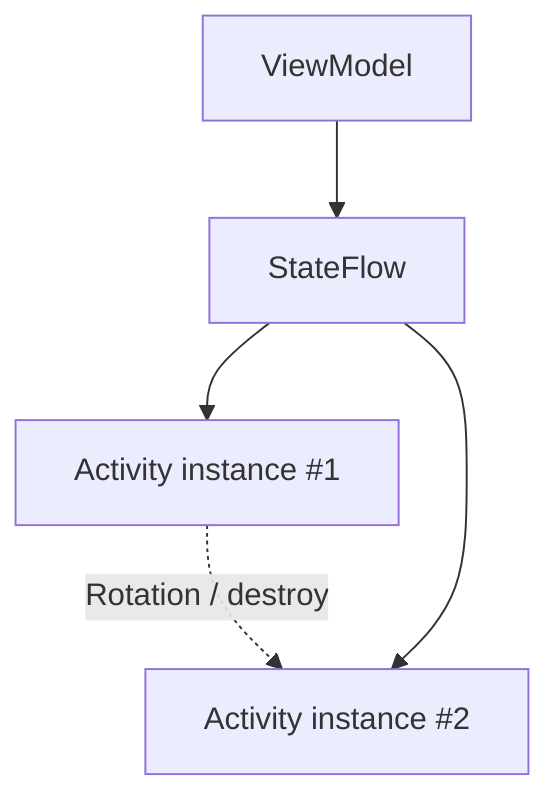

Khi configuration change:

```text
Activity #1 destroyed
        │
        ▼
ViewModel vẫn tồn tại
        │
        ▼
StateFlow vẫn nằm trong ViewModel
        │
        ▼
Activity #2 collect
        │
        ▼
nhận state hiện tại
```

Điểm cần phân biệt:

> Không phải bản thân `StateFlow` tự động sống qua rotation.

Nó thường sống qua configuration change vì nó được giữ bởi một `ViewModel`, mà `ViewModel` được thiết kế để sống qua việc recreation của Activity/Fragment trong configuration changes. ([Android Developers][4])

---

# 17. Nhưng StateFlow không giải quyết Process Death

Trường hợp:

```text
App
 │
 ▼
Background
 │
 ▼
OS kill process
 │
 ▼
ViewModel mất
 │
 ▼
StateFlow mất
```

Khi process được tạo lại:

```text
ViewModel mới
StateFlow mới
```

Vì vậy state quan trọng phải có thể được phục hồi từ:

```text
SavedStateHandle
Room
DataStore
Repository
Network
```

Không nên xem:

```text
StateFlow
```

như persistent storage.

---

# 18. State và Event không giống nhau

Android Architecture Guide phân biệt:

```text
STATE
"đang là gì?"

EVENT
"đã xảy ra chuyện gì?"
```

State luôn tồn tại tại một thời điểm, trong khi event thường mang tính tạm thời và là input gây thay đổi state. ([Android Developers][5])

Ví dụ state:

```kotlin
data class UiState(
    val products: List<Product>,
    val isLoading: Boolean
)
```

Ví dụ event:

```text
UserClickedRetry
UserSelectedProduct
RefreshRequested
```

Luồng:

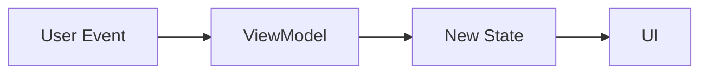

---

# 19. Không dùng StateFlow như Event Bus một cách máy móc

Ví dụ:

```kotlin
MutableStateFlow(
    "Show snackbar"
)
```

Collector mới vẫn có khả năng nhìn thấy **state hiện tại** đó.

Nhưng Snackbar thường mang ý nghĩa:

```text
Something happened
```

chứ không phải:

```text
Screen currently is Snackbar
```

Do đó trước tiên nên hỏi:

```text
Thông tin này là STATE
hay là EVENT?
```

StateFlow phù hợp nhất khi câu trả lời là:

> Đây là trạng thái hiện tại mà UI cần render.

Nếu thật sự cần một stream broadcast cho event, `SharedFlow` là API được thiết kế cho việc broadcast giá trị tới nhiều subscriber; tuy nhiên kiến trúc UI vẫn nên tránh biến mọi hành động thành một event bus toàn cục. ([Kotlin][9])

---

# 20. StateFlow vs SharedFlow vs LiveData

| Đặc điểm                | StateFlow         | SharedFlow               | LiveData                   |
| ----------------------- | ----------------- | ------------------------ | -------------------------- |
| Mục tiêu chính          | State             | Event / broadcast stream | Observable data            |
| Thuộc                   | Kotlin Coroutines | Kotlin Coroutines        | Android Jetpack            |
| Có giá trị hiện tại     | Có                | Không bắt buộc           | Có thể                     |
| Cần initial value       | Có                | Không                    | Không                      |
| Hot stream              | Có                | Có                       | Observable lifecycle-aware |
| Lifecycle-aware tự thân | Không             | Không                    | Có                         |
| Compose                 | Rất phù hợp       | Dùng khi cần             | Hỗ trợ                     |
| Coroutine operators     | Có                | Có                       | Hạn chế hơn                |
| `map/combine/filter`    | Có                | Có                       | Có nhưng hệ sinh thái khác |

Trong Android hiện đại, StateFlow đặc biệt phù hợp với screen-level UI state, còn lifecycle awareness khi collect thường được cung cấp bởi `collectAsStateWithLifecycle()` hoặc lifecycle coroutine APIs. ([Android Developers][4])

---

# 21. `combine()` nhiều nguồn state

Một UI thường phụ thuộc nhiều nguồn:

```text
Products
User
Filter
Cart
```

Có thể combine:

```kotlin
val uiState =
    combine(
        productsFlow,
        userFlow,
        filterFlow
    ) { products, user, filter ->

        ProductUiState(
            products = products.filter {
                it.name.contains(
                    filter,
                    ignoreCase = true
                )
            },
            username = user.name
        )
    }
    .stateIn(
        scope = viewModelScope,
        started =
            SharingStarted.WhileSubscribed(5_000),
        initialValue =
            ProductUiState()
    )
```

Sơ đồ:

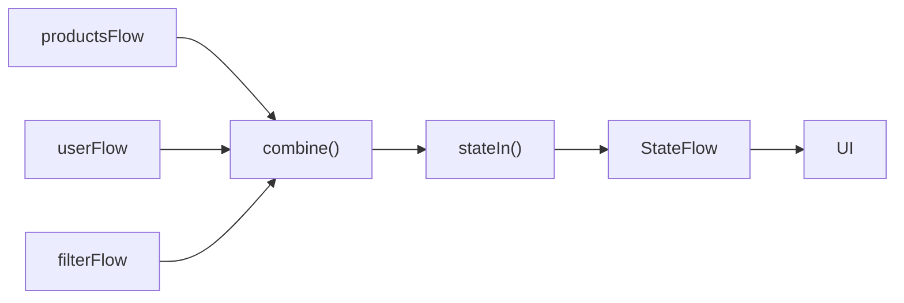

Kotlin đặc biệt đề cập `combine` như một cách hữu ích để tạo state dẫn xuất từ nhiều StateFlow. ([Kotlin][2])

---

# 22. Một UI State hay nhiều StateFlow?

### Cách 1

```kotlin
val loading: StateFlow<Boolean>

val products: StateFlow<List<Product>>

val error: StateFlow<String?>
```

UI phải combine nhiều state.

### Cách 2

```kotlin
val uiState: StateFlow<ProductUiState>
```

với:

```kotlin
data class ProductUiState(
    val loading: Boolean,
    val products: List<Product>,
    val error: String?
)
```

Thông thường, nếu các giá trị cùng mô tả **một màn hình**, một `UiState` duy nhất giúp giữ state nhất quán hơn.

```text
ProductUiState
│
├── loading
├── products
├── error
├── searchQuery
└── selectedCategory
```

Android Architecture Guide cũng khuyến nghị cân nhắc single UI-state object cho các state có quan hệ với nhau để giảm inconsistency, mặc dù state độc lập hoàn toàn vẫn có thể được expose thành các stream riêng. ([Android Developers][1])

---

# 23. StateFlow trong UDF thực tế


*Nguồn hình: Android Developers — chu kỳ UI Event → ViewModel → Data Layer → UI State.* 

Có thể chuyển hình trên thành pipeline:

```text
1. UI hiện state hiện tại

        ↓

2. User tạo event

        ↓

3. ViewModel xử lý event

        ↓

4. Repository cập nhật Data Layer

        ↓

5. Data Layer phát dữ liệu mới

        ↓

6. ViewModel tạo UiState mới

        ↓

7. StateFlow emit

        ↓

8. UI render lại
```

Đây là vòng lặp cốt lõi của UDF. ([Android Developers][1])

---

# 24. Anti-pattern cần tránh

## 24.1 Expose MutableStateFlow

Không nên:

```kotlin
val uiState =
    MutableStateFlow(UiState())
```

Nên:

```kotlin
private val _uiState =
    MutableStateFlow(UiState())

val uiState =
    _uiState.asStateFlow()
```

---

## 24.2 UI trực tiếp gọi Repository

Không nên:

```text
Compose
   ↓
Repository
```

Nên:

```text
Compose
   ↓
ViewModel
   ↓
Repository
```

đối với screen-level business state.

---

## 24.3 State chứa mutable collection

Tránh:

```kotlin
data class UiState(
    val products:
        MutableList<Product>
)
```

Ưu tiên:

```kotlin
data class UiState(
    val products:
        List<Product>
)
```

---

## 24.4 Thay đổi list tại chỗ

Tránh:

```kotlin
_uiState.value.products.add(
    product
)
```

Ưu tiên tạo state mới:

```kotlin
_uiState.update { state ->

    state.copy(
        products =
            state.products + product
    )
}
```

Immutable UI state giúp giảm nhiều nguồn mutation và giữ quá trình render dễ dự đoán hơn. ([Android Developers][1])

---

# 25. Testing StateFlow

Một lợi ích lớn của việc đưa state vào `ViewModel` là có thể test state transition mà không cần chạy UI.

Fake Repository:

```kotlin
class FakeProductRepository :
    ProductRepository {

    var result: List<Product> =
        emptyList()

    override suspend fun getProducts():
        List<Product> {

        return result
    }
}
```

Test:

```kotlin
@Test
fun loadProducts_success_updatesState() =
    runTest {

        val repository =
            FakeProductRepository().apply {

                result = listOf(
                    Product(
                        id = 1,
                        name = "Laptop"
                    )
                )
            }

        val viewModel =
            ProductViewModel(repository)

        advanceUntilIdle()

        val state =
            viewModel.uiState.value

        assertFalse(
            state.isLoading
        )

        assertEquals(
            1,
            state.products.size
        )

        assertNull(
            state.errorMessage
        )
    }
```

Ta đang kiểm tra:

```text
Input
  │
  ▼
ViewModel
  │
  ▼
StateFlow
  │
  ▼
Expected UiState
```

Mà không cần:

```text
Activity
Fragment
Compose UI test
```

Việc tách state producer khỏi UI là một trong những lợi ích về testability của UDF được Android Architecture Guide nhấn mạnh. ([Android Developers][1])

---

# 26. Debug state transition

Một cách tư duy hữu ích khi debug:

```text
User reports:
"Loading mãi không hết"
```

Thay vì chỉ kiểm tra UI:

```text
ProgressBar
```

hãy lần theo:

```text
User Action
    │
    ▼
ViewModel function
    │
    ▼
Repository call
    │
    ▼
Result / Exception
    │
    ▼
_uiState.update()
    │
    ▼
StateFlow emission
    │
    ▼
Collector
    │
    ▼
Compose render
```

Nếu log cho thấy:

```text
Idle
Loading
Success
```

nhưng UI vẫn loading:

```text
→ kiểm tra collector/lifecycle/render logic
```

Nếu chỉ có:

```text
Idle
Loading
```

thì kiểm tra:

```text
Repository
Coroutine
Network
Cancellation
Exception
```

---

# 27. Bài thực hành

Xây dựng màn hình:

```text
GitHub Repository Search
```

UI gồm:

```text
┌───────────────────────────────────────┐
│ Search repositories...               │
├───────────────────────────────────────┤
│                                       │
│ android                               │
│                                       │
│ ┌─────────────────────────────────┐   │
│ │ architecture-samples            │   │
│ │ ⭐ 45K                           │   │
│ └─────────────────────────────────┘   │
│                                       │
│ ┌─────────────────────────────────┐   │
│ │ compose-samples                 │   │
│ │ ⭐ 20K                           │   │
│ └─────────────────────────────────┘   │
└───────────────────────────────────────┘
```

Định nghĩa:

```kotlin
data class SearchUiState(
    val query: String = "",
    val isLoading: Boolean = false,
    val repositories: List<RepositoryUi> =
        emptyList(),
    val errorMessage: String? = null
)
```

ViewModel expose:

```kotlin
val uiState:
    StateFlow<SearchUiState>
```

Yêu cầu:

1. Search chạy trong coroutine.
2. State bắt đầu bằng `Loading`.
3. Có `Success`.
4. Có `Error`.
5. Request cũ có thể bị cancel.
6. Có nút Retry.
7. UI collect bằng `collectAsStateWithLifecycle()`.
8. Log state transition.
9. Có fake repository.
10. Có ít nhất một unit test.

---

# 28. Artifact portfolio

Sau bài này có thể tạo một mini-project:

```text
stateflow-demo/
│
├── data/
│   ├── ProductRepository.kt
│   └── FakeProductRepository.kt
│
├── ui/
│   ├── ProductUiState.kt
│   ├── ProductViewModel.kt
│   └── ProductScreen.kt
│
├── test/
│   └── ProductViewModelTest.kt
│
└── README.md
```

README nên có sơ đồ:

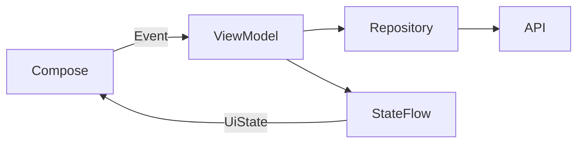

Kèm screenshot:

```text
01-loading.png
02-success.png
03-error.png
04-retry-success.png
```

Đây là một artifact portfolio tốt vì nó chứng minh không chỉ biết syntax `StateFlow`, mà còn hiểu:

```text
Architecture
Lifecycle
Coroutines
State Management
Error Handling
Testing
```

---

# 29. Bài tập

Refactor một màn hình đang dùng các biến rời rạc:

```kotlin
var loading: Boolean
var data: List<Item>
var error: String?
```

thành:

```kotlin
StateFlow<ScreenUiState>
```

Sau đó giải thích dependency:

```text
UI
  ↓ event

ViewModel
  ↓ request

Repository
  ↓

Data source
```

và state quay trở lại:

```text
Data source
     ↓
Repository
     ↓
ViewModel
     ↓
StateFlow
     ↓
UI
```

Cuối cùng kiểm tra:

```text
Normal load
Network error
Retry
Rotation
Background → foreground
Cancellation
Process recreation
```

---

# 30. Checklist hoàn thành

* [ ] Giải thích được `StateFlow` là gì.
* [ ] Phân biệt được `StateFlow` và `MutableStateFlow`.
* [ ] Hiểu StateFlow là **hot flow**.
* [ ] Hiểu StateFlow luôn có initial/current state.
* [ ] Biết pattern `_uiState` → `uiState`.
* [ ] Biết dùng `asStateFlow()`.
* [ ] Biết dùng `update`.
* [ ] Biết expose `StateFlow<UiState>` từ `ViewModel`.
* [ ] Biết collect bằng `collectAsStateWithLifecycle()`.
* [ ] Biết dùng `repeatOnLifecycle()` cho View system.
* [ ] Biết chuyển `Flow` thành `StateFlow` bằng `stateIn()`.
* [ ] Hiểu `SharingStarted.WhileSubscribed()`.
* [ ] Không nhầm StateFlow với background thread.
* [ ] Hiểu cancellation.
* [ ] Biết triển khai retry phù hợp.
* [ ] Phân biệt **state** với **event**.
* [ ] Không expose `MutableStateFlow` ra UI.
* [ ] Dùng immutable `UiState`.
* [ ] Có fake repository.
* [ ] Có unit test ViewModel.
* [ ] Có sơ đồ UDF trong README.

---

# 31. Ghi chú production

Trước khi release một màn hình sử dụng StateFlow, nên kiểm tra toàn bộ chuỗi:

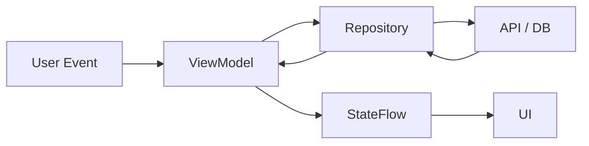

Đặc biệt cần hỏi:

| Kiểm tra            | Câu hỏi                                                    |
| ------------------- | ---------------------------------------------------------- |
| **Lifecycle**       | UI có collect khi không cần thiết không?                   |
| **Rotation**        | State có phục hồi đúng sau configuration change không?     |
| **Process death**   | State quan trọng có nguồn để dựng lại không?               |
| **Concurrency**     | Hai coroutine có thể update cùng state không?              |
| **Cancellation**    | Request cũ có được hủy đúng không?                         |
| **Threading**       | Có blocking work chạy trên Main không?                     |
| **Error**           | Network/database exception có thành UI state hợp lý không? |
| **Retry**           | Có retry vô hạn không?                                     |
| **State ownership** | UI có mutate state trực tiếp không?                        |
| **Security**        | Log có chứa token hoặc dữ liệu nhạy cảm không?             |
| **Testing**         | Loading/Success/Error/Retry có unit test không?            |

---

# 32. Ghi nhớ nhanh

```text
MutableStateFlow
      │
      │ mutate
      ▼
  ViewModel
      │
      │ expose
      ▼
   StateFlow
      │
      │ collect
      ▼
      UI
```

Công thức ngắn:

```text
StateFlow
=
current state
+
observable updates
+
Flow operators
```

Và trong Android:

```text
Repository
    ↓
ViewModel
    ↓
StateFlow<UiState>
    ↓
collectAsStateWithLifecycle()
    ↓
Compose
```

> **State flows down — Events flow up.**

Đó là ý tưởng quan trọng nhất cần nhớ khi sử dụng `StateFlow` trong Android Architecture hiện đại. ([Android Developers][1])

---

## Tài liệu tham khảo

* **Android Developers — StateFlow and SharedFlow:** định nghĩa `StateFlow`, backing property và cách dùng trong `ViewModel`. ([Android Developers][4])
* **Android Developers — UI Layer:** UI State, UDF, ViewModel và cách expose state. ([Android Developers][1])
* **Android Developers — UI State Production:** pipeline tạo state, Coroutines, `stateIn()` và `SharingStarted`. ([Android Developers][5])
* **Android Developers — Lifecycle-aware Coroutines:** `collectAsStateWithLifecycle()`. ([Android Developers][6])
* **Kotlin Coroutines — StateFlow:** semantics chính thức của `StateFlow`. ([Kotlin][2])

[1]: https://developer.android.com/topic/architecture/ui-layer "UI layer  |  App architecture  |  Android Developers"
[2]: https://kotlinlang.org/api/kotlinx.coroutines/kotlinx-coroutines-core/kotlinx.coroutines.flow/-state-flow/?utm_source=chatgpt.com "StateFlow | kotlinx.coroutines"
[3]: https://kotlinlang.org/api/kotlinx.coroutines/kotlinx-coroutines-core/kotlinx.coroutines.flow/-mutable-state-flow/?utm_source=chatgpt.com "MutableStateFlow | kotlinx.coroutines"
[4]: https://developer.android.com/kotlin/flow/stateflow-and-sharedflow "StateFlow and SharedFlow  |  Kotlin  |  Android Developers"
[5]: https://developer.android.com/topic/architecture/ui-layer/state-production "UI State production  |  App architecture  |  Android Developers"
[6]: https://developer.android.com/topic/libraries/architecture/coroutines "Use Kotlin coroutines with lifecycle-aware components  |  App architecture  |  Android Developers"
[7]: https://developer.android.com/topic/libraries/architecture/coroutines?utm_source=chatgpt.com "Use Kotlin coroutines with lifecycle-aware components"
[8]: https://kotlinlang.org/api/kotlinx.coroutines/kotlinx-coroutines-core/kotlinx.coroutines.flow/state-in.html?utm_source=chatgpt.com "stateIn | kotlinx.coroutines"
[9]: https://kotlinlang.org/api/kotlinx.coroutines/kotlinx-coroutines-core/kotlinx.coroutines.flow/-shared-flow/?utm_source=chatgpt.com "SharedFlow | kotlinx.coroutines"
