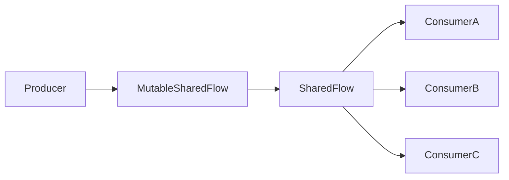
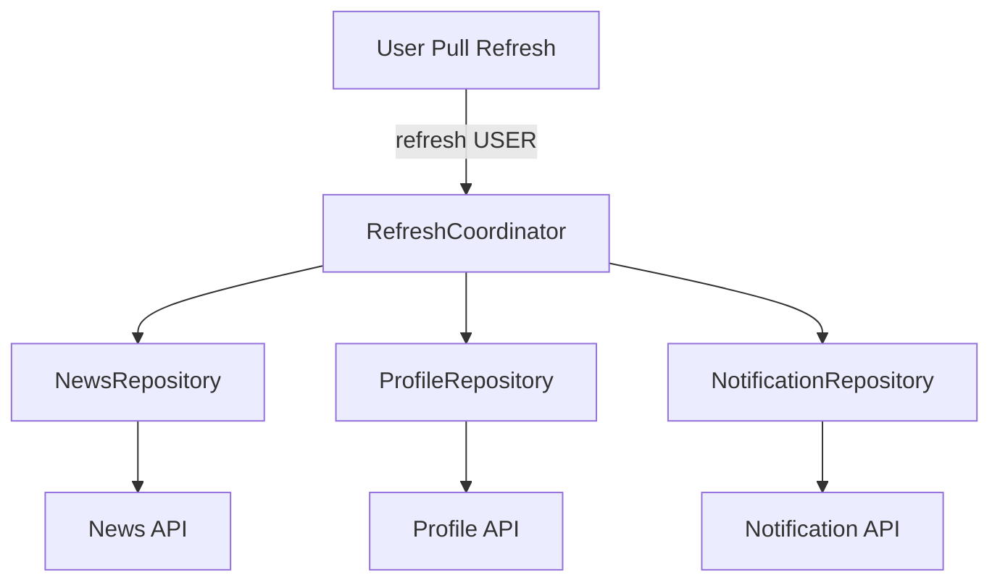
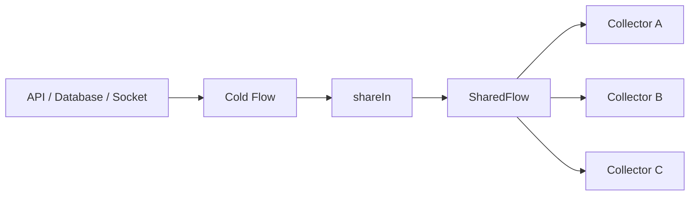
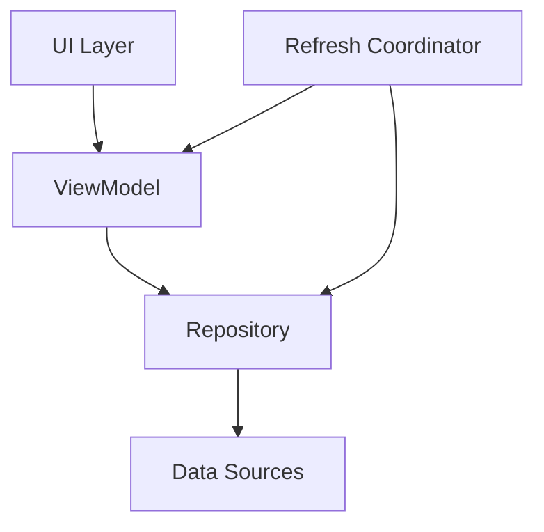
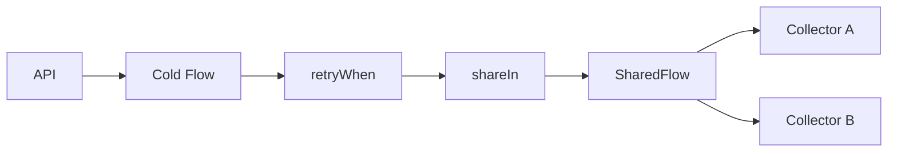
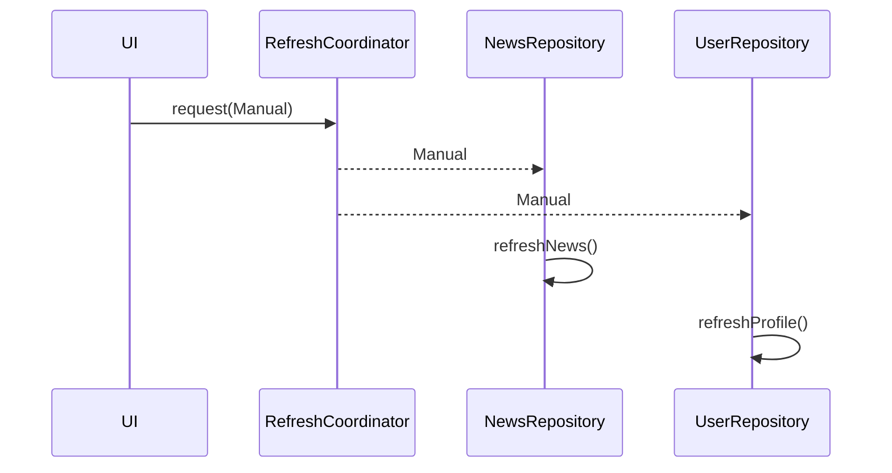
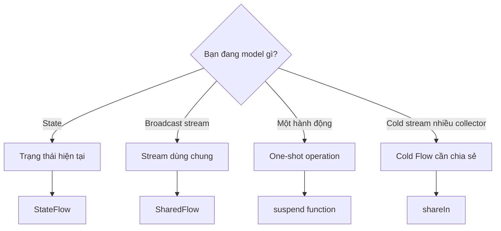
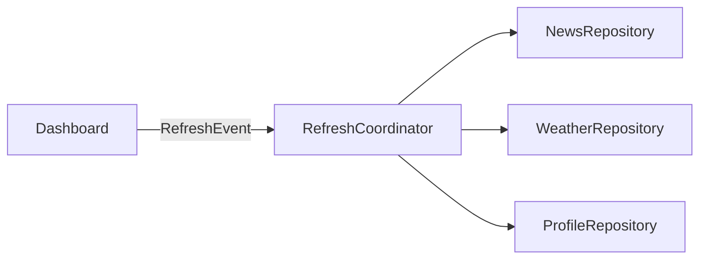

[](https://developer.android.com/topic/architecture/ui-layer?utm_source=chatgpt.com)

# 015 — SharedFlow

| Thuộc tính              | Nội dung                                                  |
| ----------------------- | --------------------------------------------------------- |
| **Học phần**            | 03 — Architecture, State and Data                         |
| **Module**              | Module 05 — Design and Architecture                       |
| **Nhóm nội dung**       | Android Architecture Components                           |
| **Nguồn roadmap**       | Design and Architecture / Android Architecture Components |
| **Loại bài**            | Async                                                     |
| **Thứ tự trong module** | 015                                                       |
| **Thời lượng gợi ý**    | 34 phút                                                   |
| **Kiến thức liên quan** | Kotlin Coroutines, Flow, StateFlow, ViewModel, Lifecycle  |

---

## 1. Tóm tắt

**SharedFlow** là một API thuộc Kotlin Coroutines Flow dùng để **phát cùng một luồng dữ liệu tới nhiều collector**.

Khác với một `Flow` thông thường thường là **cold flow**, `SharedFlow` là **hot flow**: đối tượng flow tồn tại độc lập với collector và có thể broadcast cùng một emission cho nhiều subscriber đang lắng nghe. Android Developers mô tả `SharedFlow` là một dạng tổng quát, có khả năng cấu hình cao hơn của `StateFlow`. ([Android Developers][1])

Ví dụ phù hợp:

* một tín hiệu yêu cầu nhiều repository refresh;
* stream cập nhật dùng chung cho nhiều consumer;
* notification nội bộ giữa nhiều thành phần;
* biến một cold `Flow` đắt đỏ thành stream dùng chung bằng `shareIn()`;
* event bus có phạm vi được kiểm soát.

> **Điểm quan trọng:** `SharedFlow` không đồng nghĩa với "`one-shot UI event`". Với các event từ `ViewModel` dẫn tới navigation, snackbar hoặc thay đổi UI quan trọng, hướng dẫn kiến trúc Android hiện tại khuyến nghị ưu tiên **biểu diễn kết quả thành UI state** để tránh mất sự kiện khi configuration change hoặc UI không active. ([Android Developers][2])

---

## 2. Mục tiêu học tập

Sau bài này, anh nên có thể:

* giải thích `SharedFlow` bằng ngôn ngữ của mình;
* phân biệt `Flow`, `StateFlow` và `SharedFlow`;
* hiểu hot flow và broadcast;
* hiểu `replay`;
* hiểu `extraBufferCapacity`;
* hiểu `BufferOverflow`;
* phân biệt `emit()` và `tryEmit()`;
* tạo `MutableSharedFlow` nhưng chỉ expose `SharedFlow`;
* biến cold flow thành hot flow bằng `shareIn()`;
* collect flow theo lifecycle Android;
* xác định trường hợp **không nên** dùng SharedFlow;
* viết một test nhỏ kiểm tra emission;
* giải thích nguy cơ mất event khi `replay = 0`.

---

# 3. SharedFlow là gì?

Một cách ghi nhớ đơn giản:

> **SharedFlow = một đài phát sóng mà nhiều collector có thể cùng nghe.**

Ví dụ có ba component:

```text
             ┌───────────────┐
             │ SharedFlow<T> │
             └───────┬───────┘
                     │ emit(Event)
           ┌─────────┼─────────┐
           ▼         ▼         ▼
      Collector A Collector B Collector C
```

Khi producer emit:

```kotlin
_sharedFlow.emit(Event.Refresh)
```

các collector đang subscribe có thể nhận cùng emission đó.

Kotlin mô tả `SharedFlow` là một broadcast hot flow; subscriber có thể xuất hiện hoặc rời đi trong quá trình flow vẫn tồn tại. ([Kotlin][3])

---

## 4. Cold Flow và Hot Flow

Đây là phần quan trọng nhất trước khi học SharedFlow.

### Cold Flow

```kotlin
val numbers = flow {
    println("Producer started")

    emit(1)
    emit(2)
    emit(3)
}
```

Collector A:

```kotlin
numbers.collect()
```

Producer chạy.

Collector B:

```kotlin
numbers.collect()
```

Producer **chạy lại từ đầu**.

```text
Collector A ──► Producer #1
Collector B ──► Producer #2
Collector C ──► Producer #3
```

Điều này có thể không mong muốn nếu producer là một nguồn dữ liệu đắt đỏ.

Ví dụ:

```text
Firestore listener
WebSocket
Sensor
database observation
remote API polling
```

---

### Hot Flow

Với SharedFlow:

```text
                 Producer
                    │
                    ▼
              SharedFlow
             /     |      \
            /      |       \
           ▼       ▼        ▼
       Screen A Screen B Repository
```

Một stream có thể được dùng chung bởi nhiều subscriber.

Android hướng dẫn sử dụng `shareIn()` để chuyển một cold flow thành `SharedFlow` khi cần chia sẻ cùng một nguồn dữ liệu cho nhiều collector. ([Android Developers][1])

---

# 5. Tạo MutableSharedFlow

Cách cơ bản:

```kotlin
private val _events = MutableSharedFlow<AppEvent>()

val events: SharedFlow<AppEvent> = _events
```

Producer:

```kotlin
suspend fun sendEvent(event: AppEvent) {
    _events.emit(event)
}
```

Consumer:

```kotlin
events.collect { event ->
    println(event)
}
```

### Vì sao dùng `_events`?

Không nên expose:

```kotlin
val events = MutableSharedFlow<AppEvent>()
```

vì bất kỳ class nào có reference cũng có thể:

```kotlin
events.emit(...)
```

Thay vào đó:

```kotlin
private val _events = MutableSharedFlow<AppEvent>()

val events: SharedFlow<AppEvent> =
    _events.asSharedFlow()
```

Sơ đồ dependency:



Producer có quyền:

```text
emit
tryEmit
```

Consumer chỉ được:

```text
collect
```

Đây cũng là pattern backing property được Android Developers minh họa khi expose `SharedFlow`. ([Android Developers][1])

---

# 6. Ví dụ thực tế: RefreshCoordinator

Giả sử ứng dụng có:

```text
NewsRepository
ProfileRepository
NotificationRepository
```

Khi người dùng pull-to-refresh, cả ba phần có thể cần cập nhật.

Ta có thể tạo một coordinator:

```kotlin
enum class RefreshReason {
    USER,
    PERIODIC,
    CONNECTION_RESTORED
}
```

```kotlin
class RefreshCoordinator {

    private val _refreshEvents =
        MutableSharedFlow<RefreshReason>()

    val refreshEvents: SharedFlow<RefreshReason> =
        _refreshEvents.asSharedFlow()

    suspend fun refresh(reason: RefreshReason) {
        _refreshEvents.emit(reason)
    }
}
```

Các repository subscribe:

```kotlin
class NewsRepository(
    refreshCoordinator: RefreshCoordinator,
    scope: CoroutineScope
) {

    init {
        scope.launch {
            refreshCoordinator.refreshEvents.collect {
                refreshNews()
            }
        }
    }

    private suspend fun refreshNews() {
        // Update news
    }
}
```

```kotlin
class ProfileRepository(
    refreshCoordinator: RefreshCoordinator,
    scope: CoroutineScope
) {

    init {
        scope.launch {
            refreshCoordinator.refreshEvents.collect {
                refreshProfile()
            }
        }
    }

    private suspend fun refreshProfile() {
        // Update profile
    }
}
```

Kết quả:



Đây là loại **broadcast signal** phù hợp với bản chất của SharedFlow. Android Developers cũng sử dụng ví dụ một `SharedFlow<Unit>` phát tick để nhiều thành phần refresh nội dung theo cùng một thời điểm. ([Android Developers][1])

---

# 7. `replay` — khái niệm quan trọng nhất

Constructor:

```kotlin
MutableSharedFlow<T>(
    replay = ...
)
```

`replay` xác định số emission gần nhất mà subscriber mới sẽ được nhận lại. ([Kotlin][3])

---

## 7.1 `replay = 0`

```kotlin
val events =
    MutableSharedFlow<String>(
        replay = 0
    )
```

Giả sử:

```text
10:00 emit A
10:01 emit B
10:02 Collector X subscribe
10:03 emit C
```

Collector X nhận:

```text
C
```

Không nhận:

```text
A
B
```

Sơ đồ:

```text
time ───────────────────────────────►

emit        A       B            C
            │       │            │
            ▼       ▼            ▼

Collector             subscribe ──► C
```

Phù hợp với tín hiệu chỉ có ý nghĩa **ở thời điểm hiện tại**.

---

## 7.2 `replay = 1`

```kotlin
MutableSharedFlow<String>(
    replay = 1
)
```

```text
emit A
emit B

        Collector subscribe
                │
                ▼
          receive B

emit C
                │
                ▼
          receive C
```

Emission gần nhất được giữ lại.

---

## 7.3 `replay = 3`

```kotlin
MutableSharedFlow<String>(
    replay = 3
)
```

Đã emit:

```text
A
B
C
D
E
```

Subscriber mới có thể nhận:

```text
C
D
E
```

sau đó tiếp tục nhận emission mới.

Kotlin gọi vùng này là **replay cache**. ([Kotlin][3])

---

# 8. Replay cache

Có thể kiểm tra:

```kotlin
sharedFlow.replayCache
```

Ví dụ:

```kotlin
val flow =
    MutableSharedFlow<Int>(
        replay = 2
    )

flow.emit(10)
flow.emit(20)
flow.emit(30)
```

Replay cache tương ứng:

```text
[20, 30]
```

Có thể reset cache của `MutableSharedFlow` khi thực sự cần:

```kotlin
flow.resetReplayCache()
```

`replayCache`, `resetReplayCache()` và `subscriptionCount` đều là các khả năng mà `MutableSharedFlow` cung cấp. ([Android Developers][1])

---

# 9. Buffer trong SharedFlow

SharedFlow còn có:

```kotlin
MutableSharedFlow<T>(
    replay,
    extraBufferCapacity,
    onBufferOverflow
)
```

Có thể hình dung:

```text
                  SharedFlow buffer

          replay                extra
     ┌───────────────────┬─────────────────┐
     │ values giữ replay │ buffer bổ sung  │
     └───────────────────┴─────────────────┘
```

`extraBufferCapacity` giúp producer có thêm không gian trước khi phải chờ collector chậm. Nó **không phải replay cho subscriber xuất hiện sau này**. Khi không có subscriber, SharedFlow chỉ giữ số phần tử được cấu hình bởi `replay`; phần `extraBufferCapacity` không trở thành một lịch sử sự kiện cho collector tương lai. ([Kotlin][3])

---

## Ví dụ

```kotlin
private val _events =
    MutableSharedFlow<AppEvent>(
        replay = 0,
        extraBufferCapacity = 16
    )
```

Có thể hình dung:

```text
Producer
   │
   │ Event 1
   │ Event 2
   │ Event 3
   ▼
┌─────────────────────────┐
│        BUFFER           │
│ E1 E2 E3 ...            │
└─────────────────────────┘
               │
               ▼
          Slow collector
```

---

# 10. Buffer overflow

Có ba strategy chính:

```kotlin
BufferOverflow.SUSPEND
BufferOverflow.DROP_OLDEST
BufferOverflow.DROP_LATEST
```

Android và Kotlin docs xác nhận `SUSPEND` là mặc định; có thể chọn `DROP_OLDEST` hoặc `DROP_LATEST` khi cấu hình buffer phù hợp. ([Android Developers][1])

---

## 10.1 SUSPEND

```text
Buffer full

Producer
   │
   ▼
 WAIT
   │
   ▼
Collector frees slot
   │
   ▼
Producer continues
```

Phù hợp khi:

```text
không được phép bỏ dữ liệu
```

---

## 10.2 DROP_OLDEST

```text
Buffer:

A B C D

new E

↓ drop A

B C D E
```

Ví dụ:

```kotlin
MutableSharedFlow<SensorData>(
    replay = 0,
    extraBufferCapacity = 10,
    onBufferOverflow = BufferOverflow.DROP_OLDEST
)
```

Có thể phù hợp khi **dữ liệu mới quan trọng hơn dữ liệu cũ**.

---

## 10.3 DROP_LATEST

```text
Buffer:

A B C D

new E

↓ drop E

A B C D
```

Có thể phù hợp khi dữ liệu đang chờ xử lý cần được giữ và emission mới có thể bỏ.

---

# 11. Cấu hình mặc định có một điểm dễ gây bug

Constructor:

```kotlin
MutableSharedFlow<Event>()
```

tương đương về mặt replay/buffer với:

```text
replay = 0
extraBufferCapacity = 0
```

Đây là SharedFlow không buffer.

Nếu có collector đang chờ nhận:

```text
emit
 ↓
đợi subscriber nhận
```

Nhưng nếu **không có subscriber**, `emit()` hoàn tất ngay và emission không được lưu do `replay = 0`. Kotlin docs cũng chỉ rõ ở cấu hình mặc định, `tryEmit()` có thể thành công khi không có subscriber nhưng giá trị đó sẽ bị mất. ([Kotlin][3])

Đây là một trong những lỗi cần nhớ nhất khi dùng SharedFlow cho event.

---

# 12. `emit()` và `tryEmit()`

## `emit()`

```kotlin
_events.emit(event)
```

Là:

```kotlin
suspend fun
```

Có thể suspend nếu SharedFlow cần chờ buffer/collector.

Ví dụ:

```kotlin
viewModelScope.launch {
    _events.emit(AppEvent.Refresh)
}
```

---

## `tryEmit()`

```kotlin
val emitted =
    _events.tryEmit(event)
```

Không suspend.

Trả về:

```text
true
false
```

tùy vào khả năng chấp nhận emission của cấu hình hiện tại.

Ví dụ thường thấy:

```kotlin
private val _events =
    MutableSharedFlow<AppEvent>(
        extraBufferCapacity = 1
    )

fun refresh() {
    _events.tryEmit(AppEvent.Refresh)
}
```

Không nên hiểu:

```text
tryEmit() == đảm bảo event đã được consumer xử lý
```

Hai khái niệm hoàn toàn khác nhau.

---

# 13. SharedFlow không tự chuyển công việc khỏi Main Thread

Đây là phần cần sửa so với bài khung ban đầu.

SharedFlow là cơ chế:

```text
stream
broadcast
buffer
subscription
```

Nó **không phải thread scheduler**.

Ví dụ này vẫn có vấn đề:

```kotlin
viewModelScope.launch {
    val data = blockingNetworkCall()

    _events.emit(data)
}
```

nếu `blockingNetworkCall()` thực sự block Main Thread.

Nên để data source sử dụng API suspend đúng cách hoặc chuyển blocking work sang dispatcher phù hợp:

```kotlin
viewModelScope.launch {

    val result = withContext(Dispatchers.IO) {
        blockingRepositoryCall()
    }

    _events.emit(result)
}
```

Đặc biệt, Kotlin docs ghi rõ việc áp dụng `flowOn` trực tiếp lên một `SharedFlow` không làm thay đổi SharedFlow theo cách ta thường dùng với cold flow. ([Kotlin][3])

Do đó hãy suy nghĩ:

```text
Dispatcher
    ↓
Producer work
    ↓
emit
    ↓
SharedFlow
```

chứ không phải:

```text
SharedFlow
    ↓
tự chạy background
```

---

# 14. `shareIn()` — biến Cold Flow thành SharedFlow

Đây là một use case rất mạnh.

Giả sử:

```kotlin
fun observeNews(): Flow<List<Article>>
```

Nếu mỗi collector đều kích hoạt nguồn dữ liệu đắt đỏ:

```text
Screen A ──► network listener
Screen B ──► network listener
Widget   ──► network listener
```

Có thể biến nó thành flow dùng chung:

```kotlin
val news =
    repository.observeNews()
        .shareIn(
            scope = applicationScope,
            started = SharingStarted.WhileSubscribed(),
            replay = 1
        )
```

Sơ đồ:



Android Developers khuyến nghị scope truyền cho `shareIn()` phải tồn tại đủ lâu so với các consumer, bởi scope đó quyết định lifetime của flow được chia sẻ. ([Android Developers][1])

---

# 15. `SharingStarted`

Ví dụ:

```kotlin
.shareIn(
    scope = externalScope,
    started = SharingStarted.WhileSubscribed(),
    replay = 1
)
```

Có ba policy thường gặp.

### `WhileSubscribed()`

```text
Collector = 0
    ↓
upstream có thể dừng

Collector > 0
    ↓
upstream hoạt động
```

Phù hợp khi không muốn giữ producer đắt đỏ chạy vô ích.

---

### `Eagerly`

```text
create SharedFlow
       ↓
upstream start immediately
```

Producer bắt đầu ngay.

---

### `Lazily`

```text
create
  │
  │ chưa có collector
  ▼
WAIT

first collector
      ↓
START
```

Android Developers mô tả `Eagerly`, `Lazily` và `WhileSubscribed` với những semantics này khi sử dụng `shareIn()`. ([Android Developers][1])

---

# 16. SharedFlow trong kiến trúc Android

SharedFlow có thể xuất hiện ở:



Một kiến trúc hợp lý có thể sử dụng:

```text
StateFlow
    → trạng thái màn hình

SharedFlow
    → shared stream / broadcast signal

suspend function
    → one-shot operation

Flow
    → cold stream

shareIn()
    → chia sẻ cold stream cho nhiều consumer
```

---

# 17. SharedFlow và StateFlow khác nhau thế nào?

| Tiêu chí              | `StateFlow`                            | `SharedFlow`                        |
| --------------------- | -------------------------------------- | ----------------------------------- |
| Hot Flow              | ✅                                      | ✅                                   |
| Nhiều collector       | ✅                                      | ✅                                   |
| Có current value      | ✅                                      | Không bắt buộc                      |
| Có `.value`           | ✅                                      | ❌                                   |
| Yêu cầu initial value | ✅                                      | ❌                                   |
| Replay                | hành vi hướng tới latest state         | tùy cấu hình                        |
| Buffer tùy chỉnh      | hạn chế                                | mạnh                                |
| Broadcast event       | có thể nhưng không phải mục tiêu chính | ✅                                   |
| UI State              | **Rất phù hợp**                        | thường không phải lựa chọn đầu tiên |
| `shareIn()` trả về    | ❌                                      | ✅                                   |
| `stateIn()` trả về    | ✅                                      | ❌                                   |

Android Developers mô tả `StateFlow` là observable state holder và `SharedFlow` là dạng tổng quát có khả năng cấu hình cao hơn; khi màn hình cần một UI state luôn có giá trị hiện tại, hướng dẫn kiến trúc Android ưu tiên `StateFlow`. ([Android Developers][1])

---

# 18. Quy tắc nhớ nhanh

```text
Có phải STATE không?
        │
     YES│
        ▼
   StateFlow


Cần broadcast cùng stream
cho nhiều collector?
        │
     YES│
        ▼
   SharedFlow


Là cold stream nhưng muốn
nhiều consumer dùng chung?
        │
     YES│
        ▼
      shareIn()
```

---

# 19. Cạm bẫy: dùng SharedFlow cho mọi UI event

Một pattern rất thường thấy:

```kotlin
sealed interface UiEvent {
    data object NavigateToHome : UiEvent
    data class ShowSnackbar(
        val message: String
    ) : UiEvent
}

private val _events =
    MutableSharedFlow<UiEvent>()
```

Sau đó:

```kotlin
_events.emit(
    UiEvent.NavigateToHome
)
```

Pattern này **có thể hoạt động**, nhưng cần hiểu lifecycle.

Giả sử:

```text
ViewModel
   │
   │ NavigateToHome
   ▼
SharedFlow replay = 0

             UI đang STOPPED
                    X

event lost
```

Đây là lý do Android architecture guidance hiện tại khuyến nghị các event bắt nguồn từ `ViewModel` và có ý nghĩa đối với UI nên được chuyển thành **UI state update**, giúp hành vi tái tạo được qua configuration changes thay vì phụ thuộc vào collector có đang active đúng thời điểm hay không. ([Android Developers][2])

---

# 20. Ví dụ: login nên ưu tiên StateFlow

Không nên mặc định thiết kế:

```text
login success
      ↓
SharedFlow
      ↓
Navigate
```

Thay vào đó:

```kotlin
data class LoginUiState(
    val loading: Boolean = false,
    val loggedIn: Boolean = false,
    val error: String? = null
)
```

```kotlin
private val _uiState =
    MutableStateFlow(LoginUiState())

val uiState =
    _uiState.asStateFlow()
```

Khi login thành công:

```kotlin
_uiState.update {
    it.copy(
        loading = false,
        loggedIn = true
    )
}
```

UI:

```text
loggedIn = true
      │
      ▼
navigate
```

Nếu màn hình rotate:

```text
StateFlow
   │
   └── loggedIn = true
```

state vẫn có thể được quan sát lại.

Đó chính là hướng tiếp cận Android Developers dùng để minh họa login/navigation dựa trên UI state. ([Android Developers][2])

---

# 21. Khi nào SharedFlow thực sự phù hợp?

### Rất phù hợp

```text
Refresh bus

Application tick

Telemetry stream

Sensor broadcast

Shared socket stream

Repository updates cho nhiều consumer

System/app-wide signals

Cold Flow → shareIn()
```

### Cần suy nghĩ kỹ

```text
Snackbar

Toast

Navigation

Payment success

Login success

Critical error
```

Nếu việc bỏ lỡ emission có thể khiến UI trở thành trạng thái sai, hãy cân nhắc:

```text
StateFlow
database
SavedStateHandle
persistent state
```

thay vì chỉ `SharedFlow(replay = 0)`.

---

# 22. Lifecycle Awareness

Hot flow không đồng nghĩa với:

```text
tự động lifecycle-aware
```

Khi UI dừng:

```text
Activity STOPPED
```

collector không nên tiếp tục update View UI không còn visible.

Đối với View-based UI, Android khuyến nghị sử dụng:

```kotlin
viewLifecycleOwner.lifecycleScope.launch {

    viewLifecycleOwner.repeatOnLifecycle(
        Lifecycle.State.STARTED
    ) {

        flow.collect {
            // Update UI
        }
    }
}
```

Android cảnh báo không nên đơn giản collect một Flow cập nhật UI bằng `launch`/`launchIn` mà không gắn lifecycle, vì collection có thể tiếp tục khi View không còn visible. ([Android Developers][1])

---

# 23. SharedFlow + Fragment

Ví dụ:

```kotlin
override fun onViewCreated(
    view: View,
    savedInstanceState: Bundle?
) {

    viewLifecycleOwner.lifecycleScope.launch {

        viewLifecycleOwner.repeatOnLifecycle(
            Lifecycle.State.STARTED
        ) {

            refreshCoordinator
                .refreshEvents
                .collect { reason ->

                    Log.d(
                        "Refresh",
                        "reason=$reason"
                    )

                }
        }
    }
}
```

Lifecycle:

```text
CREATED
   │
STARTED ─────► collect
   │
RESUMED
   │
STARTED
   │
STOPPED ─────► collection cancelled
   │
STARTED ─────► collection restarted
```

Đây chính là ý nghĩa thực tế của lifecycle-aware Flow collection. ([Android Developers][4])

---

# 24. SharedFlow + Jetpack Compose

Đối với **state**, Compose nên ưu tiên:

```kotlin
val uiState by
    viewModel.uiState.collectAsStateWithLifecycle()
```

Android hiện khuyến nghị `collectAsStateWithLifecycle()` để collect `Flow`/`StateFlow` thành Compose `State` theo lifecycle. Mặc định collection hoạt động từ `STARTED` và dừng khi lifecycle xuống dưới mức đó. ([Android Developers][4])

Nhưng SharedFlow dùng như **effect stream** không nhất thiết nên chuyển thành Compose `State`.

Có thể:

```kotlin
@Composable
fun Screen(
    events: SharedFlow<AppEvent>
) {

    val lifecycleOwner =
        LocalLifecycleOwner.current

    LaunchedEffect(events, lifecycleOwner) {

        lifecycleOwner.lifecycle
            .repeatOnLifecycle(
                Lifecycle.State.STARTED
            ) {

                events.collect { event ->

                    when (event) {

                        AppEvent.Refresh -> {
                            // Handle live signal
                        }

                    }
                }
            }
    }
}
```

---

# 25. Cancellation

Collector của SharedFlow có thể bị cancel cùng coroutine scope chứa nó. Kotlin docs xác nhận subscriber của SharedFlow là cancellable và kiểm tra cancellation giữa các emission. ([Kotlin][3])

Ví dụ:

```kotlin
val job = scope.launch {

    events.collect { event ->
        handle(event)
    }
}
```

Sau:

```kotlin
job.cancel()
```

Collector dừng.

Sơ đồ:

```text
Coroutine Scope
     │
     ├── Collector
     │
     ▼
   cancel()
     │
     ▼
Collector terminated
```

---

# 26. Retry nên đặt ở đâu?

Một SharedFlow bản thân nó không đại diện cho:

```text
SUCCESS
ERROR
COMPLETE
```

và không thể được "close" theo kiểu channel cũ; nếu cần biểu diễn lỗi hoặc hoàn thành, chúng phải được model hóa thành data/event. ([Kotlin][3])

Nếu source là cold flow từ network:

```kotlin
api.observeUpdates()
```

có thể retry **trước khi share**:

```kotlin
val updates =
    api.observeUpdates()

        .retryWhen { cause, attempt ->

            if (attempt < 3) {
                delay(1000)
                true
            } else {
                false
            }
        }

        .shareIn(
            scope = applicationScope,
            started =
                SharingStarted.WhileSubscribed(),
            replay = 1
        )
```

Pipeline:



---

# 27. Debug SharedFlow

Một SharedFlow lỗi thường khó debug vì timing.

Nên log:

```text
producer
subscriber count
emission
collector start
collector stop
event type
timestamp
```

Ví dụ:

```kotlin
suspend fun emitRefresh(
    reason: RefreshReason
) {

    Log.d(
        "RefreshFlow",
        """
        emit=$reason
        subscribers=${_refreshEvents.subscriptionCount.value}
        """.trimIndent()
    )

    _refreshEvents.emit(reason)
}
```

`subscriptionCount` cho biết số collector đang active và có thể hỗ trợ việc tối ưu hoặc debug logic producer. ([Android Developers][1])

---

# 28. Debug timeline

Giả sử event biến mất:

```text
12:00:00 Screen STOPPED

12:00:01
emit Refresh

subscribers = 0

replay = 0

12:00:03
Screen STARTED

collector subscribe

Result:
Refresh không được nhận
```

Nhìn timeline sẽ thấy đây không phải:

```text
Coroutine bug
```

mà là:

```text
SharedFlow semantics
```

---

# 29. Thực hành — xây dựng Refresh Bus

## Bước 1 — Event

```kotlin
sealed interface RefreshEvent {

    data object Manual :
        RefreshEvent

    data object Periodic :
        RefreshEvent

    data object ConnectionRestored :
        RefreshEvent
}
```

---

## Bước 2 — Coordinator

```kotlin
class RefreshCoordinator {

    private val _events =
        MutableSharedFlow<RefreshEvent>(
            replay = 0,
            extraBufferCapacity = 1,
            onBufferOverflow =
                BufferOverflow.DROP_OLDEST
        )

    val events: SharedFlow<RefreshEvent> =
        _events.asSharedFlow()

    fun request(
        event: RefreshEvent
    ) {

        _events.tryEmit(event)
    }
}
```

---

## Bước 3 — Repository A

```kotlin
class NewsRepository(
    coordinator: RefreshCoordinator,
    scope: CoroutineScope
) {

    init {

        scope.launch {

            coordinator.events.collect {

                refreshNews()
            }
        }
    }

    private suspend fun refreshNews() {
        // API / DB
    }
}
```

---

## Bước 4 — Repository B

```kotlin
class UserRepository(
    coordinator: RefreshCoordinator,
    scope: CoroutineScope
) {

    init {

        scope.launch {

            coordinator.events.collect {

                refreshProfile()
            }
        }
    }

    private suspend fun refreshProfile() {
        // API / DB
    }
}
```

---

## Kết quả



Một emission:

```text
Manual
```

được broadcast cho:

```text
NewsRepository
UserRepository
```

---

# 30. Thực hành `shareIn()`

Giả sử repository:

```kotlin
class LocationRepository(
    locationDataSource: LocationDataSource,
    applicationScope: CoroutineScope
) {

    val locations: SharedFlow<Location> =
        locationDataSource
            .observeLocation()
            .shareIn(
                scope = applicationScope,
                started =
                    SharingStarted
                        .WhileSubscribed(),
                replay = 1
            )
}
```

Thay vì:

```text
Screen A ─── GPS listener #1

Screen B ─── GPS listener #2

Service  ─── GPS listener #3
```

ta có thể hướng tới:

```text
GPS listener
     │
     ▼
SharedFlow
  /   |   \
 A    B    C
```

Đây chính là bài toán `shareIn()` được thiết kế để giải quyết: chia sẻ một upstream cold flow giữa nhiều subscriber. ([Android Developers][1])

---

# 31. Test SharedFlow

Điểm đặc biệt:

```text
SharedFlow không tự complete
```

Vì vậy test thường cần giới hạn collection.

Kotlin docs lưu ý các terminal operator chờ completion có thể không bao giờ kết thúc với SharedFlow; những operator như `take()` có thể được dùng để tạo một flow hữu hạn phục vụ xử lý/test. ([Kotlin][3])

Ví dụ ý tưởng:

```kotlin
@Test
fun refresh_event_is_emitted() = runTest {

    val coordinator =
        RefreshCoordinator()

    val result = async {
        coordinator.events
            .take(1)
            .first()
    }

    coordinator.request(
        RefreshEvent.Manual
    )

    assertEquals(
        RefreshEvent.Manual,
        result.await()
    )
}
```

Trong dự án thực, cần chú ý collector phải subscribe đúng thời điểm khi test `replay = 0`.

---

# 32. Test nhiều collector

Điều ta muốn chứng minh:

```text
             SharedFlow

           /            \
          ▼              ▼

    Collector A      Collector B

          │              │
          └──── Event ────┘
```

Test concept:

```kotlin
val a = mutableListOf<RefreshEvent>()
val b = mutableListOf<RefreshEvent>()
```

Sau đó chạy hai collector trước khi emit.

Expected:

```text
A = [Manual]

B = [Manual]
```

Đây mới là đặc tính quan trọng cần test của broadcast flow.

---

# 33. Những lỗi phổ biến

## Lỗi 1 — dùng SharedFlow cho state

```kotlin
MutableSharedFlow<User>(
    replay = 0
)
```

UI rotate và subscriber mới không biết current user.

Nếu thứ cần biểu diễn thực sự là:

```text
"User hiện tại là ai?"
```

thì:

```kotlin
StateFlow<User>
```

thường phù hợp hơn.

---

## Lỗi 2 — nghĩ `extraBufferCapacity` là replay

Sai:

```text
extraBufferCapacity = 10

→ subscriber mới sẽ nhận 10 event trước
```

Không đúng.

Subscriber mới nhận history dựa vào:

```text
replay
```

không phải toàn bộ extra buffer. ([Kotlin][3])

---

## Lỗi 3 — `replay = 1` cho navigation event

```text
NavigateCheckout
```

được replay sau rotation:

```text
Screen recreation
      ↓
new collector
      ↓
NavigateCheckout AGAIN
```

Có thể tạo duplicate navigation.

---

## Lỗi 4 — `replay = 0` cho critical event

```text
PaymentCompleted
```

emit khi UI STOPPED.

```text
event lost
```

UI có thể không phản ánh đúng trạng thái nghiệp vụ.

Critical outcome nên được lưu thành:

```text
StateFlow
database state
persistent state
```

---

## Lỗi 5 — collect không theo lifecycle

Không nên:

```kotlin
lifecycleScope.launch {

    flow.collect {
        updateViews()
    }
}
```

nếu collection cần dừng khi View không visible.

Android khuyến nghị `repeatOnLifecycle()` trong trường hợp này. ([Android Developers][1])

---

## Lỗi 6 — coi SharedFlow là EventBus toàn ứng dụng

Không nên tạo:

```text
GlobalSharedFlow<Any>
```

rồi mọi module:

```text
emit bất kỳ thứ gì
collect bất kỳ thứ gì
```

Kiến trúc sẽ biến thành:

```text
A ─┐
B ─┼──► GLOBAL BUS ───► ???
C ─┘
```

Dependency trở nên ẩn và khó debug.

Nên giới hạn:

```text
ownership
event type
scope
lifetime
responsibility
```

---

# 34. Quyết định nhanh trong project



---

# 35. SharedFlow trong UDF

Trong kiến trúc Android:

```text
              USER EVENT
                  │
                  ▼
┌─────────────────────────────────┐
│              UI                 │
└─────────────────┬───────────────┘
                  │
                  ▼
┌─────────────────────────────────┐
│           ViewModel             │
│                                 │
│       StateFlow<UiState>        │
└─────────────────┬───────────────┘
                  │
                  ▼
┌─────────────────────────────────┐
│ Repository / Domain / Data      │
│                                 │
│ SharedFlow có thể dùng cho      │
│ shared stream / coordination    │
└─────────────────────────────────┘
```

Trong UDF, Android mô tả **state đi xuống UI và events từ người dùng đi lên state holder**; screen-level UI state thường được ViewModel quản lý. ([Android Developers][2])

---

# 36. Bài tập

## Bài tập chính

Tạo một mini app:

```text
News Dashboard
```

có ba consumer:

```text
News
Weather
Profile
```

Tạo:

```kotlin
RefreshCoordinator
```

với:

```kotlin
SharedFlow<RefreshEvent>
```

Khi nhấn:

```text
REFRESH ALL
```

emit:

```kotlin
RefreshEvent.Manual
```

và cả ba data source đều nhận được event.

---

## Yêu cầu

Phải chứng minh:

```text
1 producer

3 collectors

1 emission

3 consumers receive
```

Sau đó thử:

```text
replay = 0
```

và:

```text
replay = 1
```

rồi ghi lại khác biệt khi collector subscribe muộn.

---

# 37. Bài tập nâng cao

Cho một cold flow:

```kotlin
fun observePrices(): Flow<Price>
```

Giả sử ba màn hình cần collect nó.

Refactor thành:

```kotlin
observePrices()
    .shareIn(...)
```

Sau đó giải thích:

```text
scope nào sở hữu SharedFlow?

producer start lúc nào?

producer stop lúc nào?

replay bao nhiêu?

có chấp nhận mất emission không?

nếu upstream lỗi thì retry ở đâu?
```

---

# 38. Artifact cho portfolio

Có thể tạo project:

```text
shared-flow-demo/
```

Cấu trúc:

```text
shared-flow-demo/

├── app/
│
├── data/
│   ├── NewsRepository.kt
│   ├── ProfileRepository.kt
│   └── WeatherRepository.kt
│
├── coordination/
│   ├── RefreshCoordinator.kt
│   └── RefreshEvent.kt
│
├── ui/
│   ├── DashboardScreen.kt
│   └── DashboardViewModel.kt
│
└── README.md
```

README nên có sơ đồ:



Và giải thích ngắn:

```text
Why SharedFlow?

Why replay = 0?

What happens when no subscriber exists?

Why not StateFlow?

How is lifecycle handled?

How is the flow tested?
```

---

# 39. Checklist production

### Architecture

* [ ] SharedFlow thực sự biểu diễn stream/event thay vì state.
* [ ] `MutableSharedFlow` được giữ private.
* [ ] Consumer chỉ thấy `SharedFlow`.
* [ ] Không dùng global event bus không kiểm soát.
* [ ] Scope sở hữu SharedFlow rõ ràng.

### Replay

* [ ] Đã quyết định `replay` theo semantics.
* [ ] Biết subscriber mới có cần history hay không.
* [ ] Đã kiểm tra duplicate event khi recreate UI.

### Buffer

* [ ] Hiểu `extraBufferCapacity`.
* [ ] Chọn overflow strategy rõ ràng.
* [ ] Biết có được phép drop dữ liệu hay không.

### Lifecycle

* [ ] UI collection lifecycle-aware.
* [ ] View system dùng `repeatOnLifecycle()` khi thích hợp.
* [ ] Compose state dùng `collectAsStateWithLifecycle()` khi thích hợp. ([Android Developers][4])

### Error

* [ ] Upstream error được model hoặc xử lý.
* [ ] Retry được đặt ở source/cold-flow pipeline phù hợp.
* [ ] Không kỳ vọng SharedFlow tự biểu diễn failure/completion. ([Kotlin][3])

### Testing

* [ ] Có test emission.
* [ ] Có test nhiều collector.
* [ ] Có test subscriber muộn.
* [ ] Có test replay.
* [ ] Có test lifecycle/recreation cho luồng UI quan trọng.

### Debugging

* [ ] Log emission.
* [ ] Log collector start/stop.
* [ ] Theo dõi `subscriptionCount` khi cần.
* [ ] Có thể xác định event bị mất ở producer, buffer hay lifecycle.

---

# 40. Ghi chú sản xuất

Trước khi dùng SharedFlow trong production, nên tự hỏi:

> **Nếu UI không collect đúng khoảnh khắc emission xảy ra thì chuyện gì sẽ xảy ra?**

Nếu câu trả lời là:

```text
"Không sao, event này chỉ có ý nghĩa realtime."
```

`SharedFlow(replay = 0)` có thể rất phù hợp.

Nếu câu trả lời là:

```text
"Người dùng sẽ mất trạng thái,
sai navigation,
không biết payment thành công,
hoặc app trở nên không nhất quán."
```

thì event đó có khả năng nên được model thành:

```text
StateFlow
UiState
SavedStateHandle
database/persistent state
```

thay vì chỉ là transient SharedFlow emission. Quan điểm này phù hợp với Android architecture guidance hiện tại: event bắt nguồn từ ViewModel và ảnh hưởng UI nên được chuyển thành trạng thái có thể tái tạo. ([Android Developers][2])

---

# 41. Công thức ghi nhớ

```text
StateFlow
=
"What is true NOW?"


SharedFlow
=
"What is being BROADCAST?"


Flow
=
"What stream should START
when I collect it?"


shareIn()
=
"Make this cold stream
SHARED by many collectors."
```

Và quy tắc quan trọng nhất:

```text
SharedFlow
      ≠
State storage

SharedFlow
      ≠
Background thread

SharedFlow
      ≠
Guaranteed delivery
with replay = 0
```

---

# 42. Checklist hoàn thành bài

* [ ] Giải thích được SharedFlow.
* [ ] Hiểu hot flow.
* [ ] Phân biệt cold và hot flow.
* [ ] Phân biệt StateFlow và SharedFlow.
* [ ] Hiểu `MutableSharedFlow`.
* [ ] Hiểu `asSharedFlow()`.
* [ ] Hiểu `replay`.
* [ ] Hiểu replay cache.
* [ ] Hiểu `extraBufferCapacity`.
* [ ] Hiểu `SUSPEND`.
* [ ] Hiểu `DROP_OLDEST`.
* [ ] Hiểu `DROP_LATEST`.
* [ ] Phân biệt `emit()` và `tryEmit()`.
* [ ] Biết SharedFlow không tự chuyển sang background thread.
* [ ] Biết dùng `shareIn()`.
* [ ] Hiểu `SharingStarted`.
* [ ] Collect theo lifecycle.
* [ ] Biết nguy cơ mất event.
* [ ] Không mặc định dùng SharedFlow cho navigation/snackbar.
* [ ] Có test SharedFlow.
* [ ] Hoàn thành mini project RefreshCoordinator.

---

## 43. Kết luận

**SharedFlow là công cụ để chia sẻ một hot stream cho nhiều consumer, không phải là nơi mặc định lưu UI state.** Nó đặc biệt mạnh khi cần broadcast tín hiệu giữa nhiều subscriber hoặc dùng `shareIn()` để biến một cold stream thành nguồn dữ liệu dùng chung. `replay`, buffer và lifecycle quyết định trực tiếp việc consumer nhận hay bỏ lỡ dữ liệu. ([Android Developers][1])

Trong Android architecture hiện đại, có thể ghi nhớ:

```text
UI State
   ↓
StateFlow


Shared stream / broadcast
   ↓
SharedFlow


Cold expensive stream
   ↓
shareIn()
   ↓
SharedFlow
```

Và đối với navigation, snackbar hay business outcome quan trọng từ `ViewModel`, trước khi tạo `MutableSharedFlow<UiEvent>`, hãy kiểm tra xem kết quả đó có nên được **model thành UI state** hay không. Đây là điểm giúp code ổn định hơn khi rotate, background/foreground và recreation. ([Android Developers][2])

[1]: https://developer.android.com/kotlin/flow/stateflow-and-sharedflow "StateFlow and SharedFlow  |  Kotlin  |  Android Developers"
[2]: https://developer.android.com/topic/architecture/ui-layer/events "UI events  |  App architecture  |  Android Developers"
[3]: https://kotlinlang.org/api/kotlinx.coroutines/kotlinx-coroutines-core/kotlinx.coroutines.flow/-shared-flow/ "SharedFlow | kotlinx.coroutines – Kotlin Programming Language"
[4]: https://developer.android.com/topic/libraries/architecture/coroutines "Use Kotlin coroutines with lifecycle-aware components  |  App architecture  |  Android Developers"

---

# Bài luyện tập

## Mục tiêu


## Đề bài


## Yêu cầu hoàn thành

- [ ] 
- [ ] 
- [ ] 

## Kết quả / lời giải


## Ghi chú
