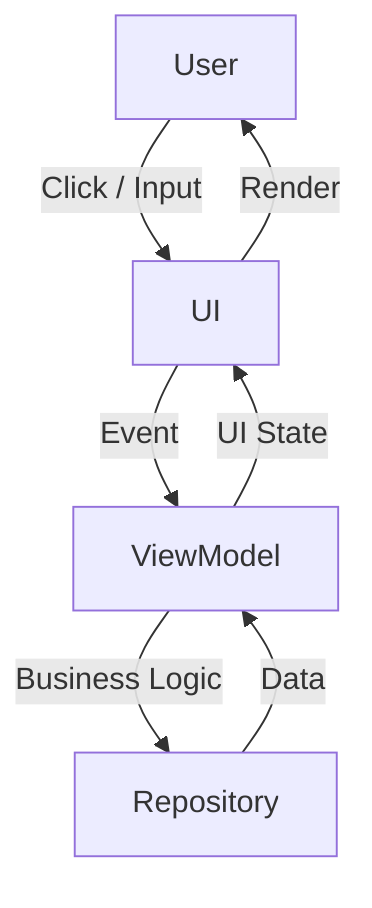
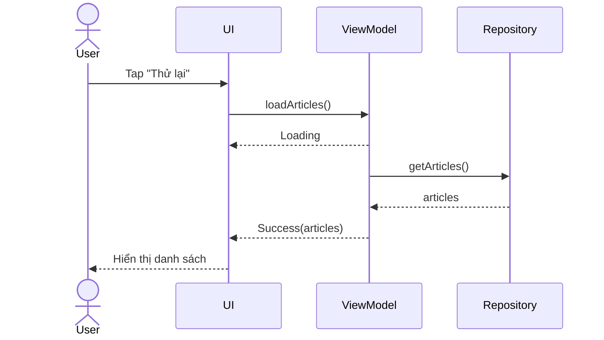
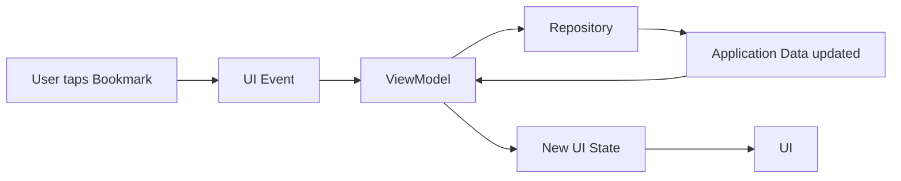
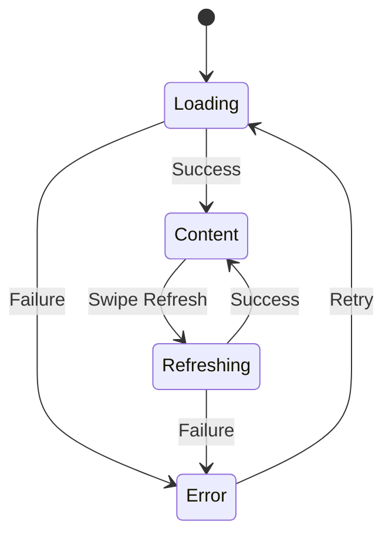

# 016 - UI State

[](https://developer.android.com/develop/ui/compose/architecture?utm_source=chatgpt.com)

> **Học phần:** 03 - Architecture, State and Data
> **Module:** Module 05 - Design and Architecture
> **Nhóm nội dung:** Android Architecture Components
> **Nguồn roadmap:** Design and Architecture / Android Architecture Components
> **Loại bài:** UI
> **Thứ tự trong module:** 016
> **Thời lượng gợi ý:** 30 phút

---

## 1. Tóm tắt

**UI State** là toàn bộ dữ liệu cần thiết để giao diện có thể quyết định **phải hiển thị gì tại một thời điểm cụ thể**.

Ví dụ màn hình danh sách bài viết có thể ở các trạng thái:

* đang tải dữ liệu;
* tải thành công và có danh sách;
* danh sách rỗng;
* xảy ra lỗi;
* người dùng đang nhập từ khóa tìm kiếm;
* một bài viết đang được đánh dấu;
* cần hiển thị thông báo cho người dùng.

Trong kiến trúc Android hiện đại, UI thường **không tự đi lấy dữ liệu rồi tự thay đổi nhiều biến rời rạc**. Thay vào đó, một **state holder** như `ViewModel` tạo ra UI State, còn UI quan sát state đó và render giao diện tương ứng. Android hiện khuyến nghị kiến trúc **Unidirectional Data Flow — UDF**, trong đó **state đi xuống UI và event đi ngược lên state holder**. ([Android Developers][1])

Có thể hình dung:

```text
Repository / UseCase
        │
        │ data
        ▼
   ┌───────────┐
   │ ViewModel │
   └─────┬─────┘
         │
         │ UI State
         ▼
   ┌───────────┐
   │    UI     │
   └─────┬─────┘
         │
         │ User Event
         └──────────────► ViewModel
```

---

## 2. Mục tiêu học tập

Sau bài này, bạn nên có thể:

* giải thích được **UI State là gì**;
* phân biệt **Screen UI State** và **UI Element State**;
* hiểu quan hệ giữa `ViewModel`, `StateFlow`, Compose và UI State;
* hiểu **State Hoisting**;
* triển khai UI theo mô hình **State down — Events up**;
* biết state nào nên nằm trong `remember`, `rememberSaveable`, `ViewModel` hoặc `SavedStateHandle`;
* xử lý các trạng thái `Loading`, `Success`, `Empty`, `Error`;
* kiểm tra UI khi rotate, background/foreground và process recreation;
* viết được một màn hình Compose nhỏ theo kiến trúc production.

---

# 3. Khái niệm chính

## 3.1. UI State là gì?

Giả sử màn hình Profile hiển thị:

```text
Tên: Nguyễn Văn A
Avatar: user.jpg
Followers: 120
Following: 80
Loading: false
Error: null
```

Tập hợp những giá trị mà UI cần để render màn hình chính là **UI State**.

Có thể biểu diễn bằng Kotlin:

```kotlin
data class ProfileUiState(
    val name: String = "",
    val avatarUrl: String = "",
    val followers: Int = 0,
    val following: Int = 0,
    val isLoading: Boolean = false,
    val errorMessage: String? = null
)
```

UI không cần biết dữ liệu đến từ:

```text
REST API
Room
DataStore
Firebase
Cache
Repository
```

UI chỉ cần biết:

```text
ProfileUiState hiện tại là gì?
```

Đây chính là một trong những mục tiêu quan trọng của UI layer: chuyển dữ liệu ứng dụng thành **trạng thái mà UI có thể trực tiếp render**. ([Android Developers][2])

---

## 3.2. State → UI

Một nguyên tắc rất quan trọng:

> **UI nên là kết quả của State hiện tại.**

Ví dụ:

```text
State = Loading
       ↓
CircularProgressIndicator

State = Success
       ↓
LazyColumn

State = Empty
       ↓
"No articles"

State = Error
       ↓
ErrorMessage + Retry Button
```

Có thể hình dung như một hàm:

```text
UI = render(UIState)
```

Nếu UI State thay đổi:

```text
Loading
   │
   ▼
Success(data)
```

Compose quan sát state và thực hiện **recomposition** cho những phần UI phụ thuộc vào state đó. Android mô tả Compose theo mô hình state/event này và khuyến khích UI đọc state thay vì để composable tự quản lý business state. ([Android Developers][3])

---

# 4. Hai loại UI State quan trọng

## 4.1. Screen UI State

Đây là state của **toàn bộ màn hình**.

Ví dụ:

```kotlin
data class HomeUiState(
    val username: String,
    val articles: List<Article>,
    val notifications: Int,
    val isLoading: Boolean
)
```

Screen UI State thường:

```text
Repository
     ↓
ViewModel
     ↓
HomeUiState
     ↓
HomeScreen
```

`ViewModel` đặc biệt phù hợp với state cấp màn hình vì nó có thể giữ state qua configuration change và làm cầu nối tới business/data layer. ([Android Developers][4])

---

## 4.2. UI Element State

Đây là state của một thành phần UI nhỏ.

Ví dụ:

```text
TextField đang chứa gì?
Dropdown đang mở hay đóng?
Tab nào đang được chọn?
Password đang hiển thị hay ẩn?
Dialog đang mở hay đóng?
```

Ví dụ:

```kotlin
var showPassword by rememberSaveable {
    mutableStateOf(false)
}
```

State này không nhất thiết phải đưa vào `ViewModel`.

Android khuyến nghị giữ state **gần nơi sử dụng nhất có thể** và chỉ hoist nó lên ancestor chung thấp nhất khi nhiều thành phần cần đọc hoặc sửa state đó. ([Android Developers][5])

---

# 5. State Hoisting

## 5.1. Composable tự giữ state

Ví dụ:

```kotlin
@Composable
fun SearchBox() {

    var query by remember {
        mutableStateOf("")
    }

    TextField(
        value = query,
        onValueChange = {
            query = it
        }
    )
}
```

Composable này là **stateful**.

---

## 5.2. Hoist state ra ngoài

Có thể đổi thành:

```kotlin
@Composable
fun SearchBox(
    query: String,
    onQueryChange: (String) -> Unit
) {
    TextField(
        value = query,
        onValueChange = onQueryChange
    )
}
```

Bây giờ:

```text
SearchBox
   │
   ├── nhận query
   │
   └── phát onQueryChange
```

Composable không còn sở hữu state.

Nó trở thành:

```text
Stateless Composable
```

Mô hình state hoisting phổ biến của Compose chính là:

```text
value: T

onValueChange: (T) -> Unit
```

Cách này làm UI dễ tái sử dụng và test hơn. ([Android Developers][3])

---

# 6. Unidirectional Data Flow

UI State thường được kết hợp với **UDF — Unidirectional Data Flow**.

Luồng tổng quát:



Android mô tả UDF theo chu trình:

```text
EVENT
  ↓
UPDATE STATE
  ↓
DISPLAY STATE
  ↓
EVENT
```

State chỉ đi:

```text
ViewModel
    ↓
   UI
```

Event đi:

```text
UI
 ↓
ViewModel
```

Cách tổ chức này giúp giảm trường hợp nhiều thành phần cùng sửa trực tiếp một state và tạo ra UI không nhất quán. ([Android Developers][6])

---

# 7. Mô hình UI State nên dùng

Giả sử app hiển thị danh sách bài viết.

Ta có thể tạo:

```kotlin
sealed interface ArticleUiState {

    data object Loading : ArticleUiState

    data class Success(
        val articles: List<Article>
    ) : ArticleUiState

    data class Error(
        val message: String
    ) : ArticleUiState
}
```

Cách này rất phù hợp khi các trạng thái **loại trừ lẫn nhau**:

```text
Loading
   OR
Success
   OR
Error
```

Thay vì có:

```kotlin
data class UiState(
    val loading: Boolean,
    val error: String?,
    val articles: List<Article>
)
```

rồi vô tình tạo state vô lý:

```text
loading = true
error = "Network error"
articles = [1, 2, 3]
```

và UI không biết nên hiển thị trạng thái nào trước.

---

# 8. ViewModel giữ UI State bằng StateFlow

`StateFlow` là một observable state holder có một **giá trị hiện tại** và phát các state mới cho collector, nên nó phù hợp để ViewModel expose UI State. ([Android Developers][7])

Ví dụ:

```kotlin
class ArticleViewModel(
    private val repository: ArticleRepository
) : ViewModel() {

    private val _uiState =
        MutableStateFlow<ArticleUiState>(
            ArticleUiState.Loading
        )

    val uiState: StateFlow<ArticleUiState> =
        _uiState.asStateFlow()

    init {
        loadArticles()
    }

    fun loadArticles() {
        viewModelScope.launch {

            _uiState.value =
                ArticleUiState.Loading

            try {

                val articles =
                    repository.getArticles()

                _uiState.value =
                    ArticleUiState.Success(
                        articles = articles
                    )

            } catch (e: Exception) {

                _uiState.value =
                    ArticleUiState.Error(
                        message = "Không thể tải dữ liệu"
                    )
            }
        }
    }
}
```

Điểm đáng chú ý:

```text
private MutableStateFlow
        ↓
ViewModel được quyền sửa

public StateFlow
        ↓
UI chỉ được đọc
```

Tức là:

```kotlin
private val _uiState
val uiState
```

Không nên cho UI làm:

```kotlin
viewModel.uiState.value = ...
```

---

# 9. Compose quan sát UI State

Màn hình:

```kotlin
@Composable
fun ArticleScreen(
    viewModel: ArticleViewModel
) {

    val uiState by
        viewModel.uiState.collectAsStateWithLifecycle()

    ArticleContent(
        uiState = uiState,
        onRetry = viewModel::loadArticles
    )
}
```

Trên Android, `collectAsStateWithLifecycle()` là API được khuyến nghị để collect `Flow` trong Compose theo lifecycle; collection được quản lý theo trạng thái lifecycle thay vì tiếp tục thu thập dữ liệu không cần thiết khi UI không active. ([Android Developers][8])

---

# 10. Render UI từ State

Ta tách phần render:

```kotlin
@Composable
fun ArticleContent(
    uiState: ArticleUiState,
    onRetry: () -> Unit
) {

    when (uiState) {

        ArticleUiState.Loading -> {

            CircularProgressIndicator()
        }

        is ArticleUiState.Success -> {

            if (uiState.articles.isEmpty()) {

                Text(
                    text = "Chưa có bài viết"
                )

            } else {

                LazyColumn {

                    items(uiState.articles) { article ->

                        Text(
                            text = article.title
                        )
                    }
                }
            }
        }

        is ArticleUiState.Error -> {

            Column {

                Text(
                    text = uiState.message
                )

                Button(
                    onClick = onRetry
                ) {
                    Text("Thử lại")
                }
            }
        }
    }
}
```

Ta có:

```text
               ArticleUiState
                      │
        ┌─────────────┼─────────────┐
        ▼             ▼             ▼
     Loading       Success         Error
        │             │             │
        ▼             ▼             ▼
 ProgressBar       Content       Error UI
                      │
              ┌───────┴───────┐
              ▼               ▼
            Empty           List
```

UI lúc này hầu như chỉ làm hai việc:

```text
1. đọc state
2. phát event
```

---

# 11. State thay đổi như thế nào?

Ví dụ người dùng nhấn:

```text
[ Thử lại ]
```

Luồng chạy:



Điều quan trọng ở đây là UI **không trực tiếp thay đổi trạng thái business**.

UI chỉ phát:

```text
Retry
```

ViewModel quyết định:

```text
Retry
 ↓
Loading
 ↓
Repository
 ↓
Success / Error
```

---

# 12. UI State và lifecycle

Đây là phần rất quan trọng khi đưa app lên production.

## Trường hợp 1 — Recomposition

```kotlin
remember
```

giữ state qua recomposition.

Ví dụ:

```kotlin
var expanded by remember {
    mutableStateOf(false)
}
```

---

## Trường hợp 2 — Configuration Change

Ví dụ:

```text
Portrait
   ↓
Rotate
   ↓
Landscape
```

Activity có thể bị tạo lại.

`ViewModel` được thiết kế để giữ dữ liệu qua những configuration change kiểu này. ([Android Developers][4])

---

## Trường hợp 3 — Process Death

Hệ điều hành có thể kill process:

```text
App background
      ↓
Low memory
      ↓
Process killed
      ↓
User quay lại app
```

Không nên coi `ViewModel` đơn thuần là persistent storage.

Với state nhỏ cần khôi phục như:

```text
searchQuery
selectedTab
articleId
filter
```

có thể dùng:

```kotlin
SavedStateHandle
```

Android cung cấp Saved State support cho `ViewModel` để phục hồi state cần thiết khi process bị tạo lại. ([Android Developers][9])

Dữ liệu lớn hoặc dữ liệu ứng dụng quan trọng vẫn nên đến từ:

```text
Room
DataStore
Database
Repository
Server
```

rồi **tạo lại Screen UI State**.

---

# 13. Chọn nơi lưu state

Có thể dùng quy tắc thực hành sau:

| State                             | Nơi phù hợp                               |
| --------------------------------- | ----------------------------------------- |
| Dropdown mở/đóng                  | `remember`                                |
| Input cần giữ khi rotate          | `rememberSaveable`                        |
| Password visibility               | `rememberSaveable`                        |
| Danh sách bài viết                | `ViewModel`                               |
| Loading/Error của screen          | `ViewModel`                               |
| Search query ảnh hưởng repository | `ViewModel` / `SavedStateHandle`          |
| ID màn hình đang xem              | `SavedStateHandle` / navigation arguments |
| Dữ liệu cần tồn tại lâu dài       | Repository / Room / DataStore             |

Nguyên tắc state hoisting của Compose là giữ state càng gần nơi sử dụng càng tốt, nhưng nếu business logic cần nó thì screen-level state holder như `ViewModel` thường là nơi phù hợp hơn. ([Android Developers][5])

---

# 14. UI State không giống UI Event

Ví dụ:

```text
articles
username
isLoading
selectedTab
```

là **state**.

Trong khi:

```text
user click Retry
user type text
user click Bookmark
user dismiss Snackbar
```

là **event**.

Luồng:

```text
Event
  │
  ▼
ViewModel
  │
  ▼
State thay đổi
  │
  ▼
UI render lại
```

Các khuyến nghị kiến trúc Android hiện tại ưu tiên việc ViewModel **xử lý event rồi cập nhật state**, thay vì xây dựng một luồng “one-off event” tùy ý từ ViewModel sang UI cho mọi tình huống. ([Android Developers][6])

---

# 15. Ví dụ Bookmark

Ban đầu:

```text
Article
♡ Bookmark
```

State:

```kotlin
data class ArticleUiModel(
    val id: Long,
    val title: String,
    val bookmarked: Boolean
)
```

Người dùng:

```text
Tap Bookmark
```

Luồng:



Đây cũng là ví dụ được Android dùng để minh họa vòng lặp giữa UI event, ViewModel, data layer và UI State trong UDF. ([Android Developers][1])

---

# 16. Sai lầm phổ biến

## ❌ Sai 1 — UI tự gọi Repository

```kotlin
@Composable
fun HomeScreen() {

    repository.getArticles()
}
```

Kiến trúc sẽ trở thành:

```text
UI
 ↓
Repository
```

UI vừa render vừa chứa data/business logic.

Nên chuyển thành:

```text
UI
 ↓ Event

ViewModel
 ↓

Repository
```

---

## ❌ Sai 2 — Có quá nhiều state rời rạc

```kotlin
val loading: StateFlow<Boolean>

val articles: StateFlow<List<Article>>

val error: StateFlow<String?>

val refreshing: StateFlow<Boolean>
```

Không phải lúc nào cách này cũng sai, nhưng screen phức tạp rất dễ xuất hiện nhiều tổ hợp state khó kiểm soát.

Thường có thể gom thành:

```kotlin
data class HomeUiState(
    val articles: List<Article>,
    val isLoading: Boolean,
    val isRefreshing: Boolean,
    val error: String?
)
```

hoặc dùng:

```text
sealed interface
```

nếu các trạng thái loại trừ nhau.

---

## ❌ Sai 3 — UI trực tiếp sửa ViewModel state

Không nên:

```kotlin
viewModel.uiState.value =
    ...
```

Nên:

```kotlin
viewModel.onRetry()
```

hoặc:

```kotlin
viewModel.onSearchChanged(query)
```

---

## ❌ Sai 4 — Lưu cả database trong SavedStateHandle

Không nên coi:

```text
SavedStateHandle
```

là database.

Hãy ưu tiên lưu **thông tin tối thiểu để khôi phục màn hình**, rồi dựng lại state từ data layer.

---

# 17. State machine cho màn hình

Một cách suy nghĩ rất tốt khi thiết kế UI State là xem màn hình như **state machine**.

Ví dụ:



Từ sơ đồ này có thể xác định trước:

```text
State nào tồn tại?
Event nào làm state thay đổi?
Transition nào hợp lệ?
UI nào tương ứng với từng state?
```

Điều này đặc biệt hữu ích với những màn hình như:

```text
Login
Checkout
Payment
Upload
Download
Booking
Authentication
```

---

# 18. Kiến trúc hoàn chỉnh

Một screen Android hiện đại có thể được tổ chức:

```text
┌─────────────────────────────────────────┐
│                  UI                     │
│                                         │
│      HomeScreen / HomeContent           │
│                                         │
│ State ↓                       Event ↑    │
└────────────────────┬────────────────────┘
                     │
                     ▼
┌─────────────────────────────────────────┐
│               ViewModel                 │
│                                         │
│            HomeUiState                  │
│            StateFlow                    │
│                                         │
│     onRetry()                           │
│     onBookmark()                        │
│     onSearch()                          │
└────────────────────┬────────────────────┘
                     │
                     ▼
┌─────────────────────────────────────────┐
│              Domain Layer               │
│                                         │
│               UseCase                   │
└────────────────────┬────────────────────┘
                     │
                     ▼
┌─────────────────────────────────────────┐
│               Data Layer                │
│                                         │
│              Repository                 │
│                                         │
│         ┌─────────┬──────────┐           │
│         ▼         ▼          ▼           │
│        API       Room     DataStore      │
└─────────────────────────────────────────┘
```

Android Architecture Guide mô tả UI elements phụ thuộc vào state holder, và state holder tiếp tục phụ thuộc vào data layer hoặc domain layer nếu ứng dụng có domain layer. ([Android Developers][10])

---

# 19. Thực hành

## Bài thực hành: Article Screen

Hãy tạo màn hình có 4 trạng thái:

```text
Loading
Success
Empty
Error
```

Cấu trúc:

```text
ArticleScreen
│
├── LoadingContent
│
├── ArticleList
│
├── EmptyContent
│
└── ErrorContent
```

### Yêu cầu

Tạo:

```kotlin
sealed interface ArticleUiState
```

Tạo:

```kotlin
ArticleViewModel
```

Expose:

```kotlin
val uiState: StateFlow<ArticleUiState>
```

Compose collect:

```kotlin
val uiState by
    viewModel.uiState.collectAsStateWithLifecycle()
```

Sau đó render:

```kotlin
when (uiState) {

    Loading -> ...

    Success -> ...

    Error -> ...
}
```

---

# 20. Fake Repository để test

Tạo interface:

```kotlin
interface ArticleRepository {

    suspend fun getArticles(): List<Article>
}
```

Fake:

```kotlin
class FakeArticleRepository(
    private val articles: List<Article>
) : ArticleRepository {

    override suspend fun getArticles(): List<Article> {
        return articles
    }
}
```

Bây giờ `ViewModel` không phụ thuộc trực tiếp vào:

```text
Retrofit
Room
Firebase
```

nên có thể test riêng.

---

# 21. Các case cần test

### Case 1 — Loading

```text
Given
Screen vừa mở

Expect
Progress indicator xuất hiện
```

### Case 2 — Success

```text
Repository trả 10 bài

Expect
LazyColumn hiển thị 10 bài
```

### Case 3 — Empty

```text
Repository trả emptyList()

Expect
"Chưa có bài viết"
```

### Case 4 — Error

```text
Repository throw exception

Expect
Thông báo lỗi
+
Retry Button
```

### Case 5 — Retry

```text
Error
 ↓
Tap Retry
 ↓
Loading
 ↓
Success
```

### Case 6 — Rotation

```text
Load Success
 ↓
Rotate device
 ↓
Không quay lại trạng thái sai
```

### Case 7 — Background / Foreground

```text
Open app
 ↓
Background
 ↓
Foreground
 ↓
UI vẫn nhất quán
```

---

# 22. Checklist manual

```markdown
- [ ] Loading state hiển thị đúng.
- [ ] Success state hiển thị đúng.
- [ ] Empty state có feedback cho người dùng.
- [ ] Error state có thông báo dễ hiểu.
- [ ] Retry hoạt động.
- [ ] Không có hai state mâu thuẫn cùng xuất hiện.
- [ ] Rotate màn hình không gây mất screen state không cần thiết.
- [ ] Background → foreground không làm UI lỗi.
- [ ] UI không gọi Repository trực tiếp.
- [ ] Mutable state không được expose ra ngoài ViewModel.
- [ ] StateFlow được collect theo lifecycle.
- [ ] Composable con ưu tiên stateless khi phù hợp.
```

---

# 23. Artifact cho portfolio

Có thể biến bài này thành một mini project:

```text
ui-state-demo/
│
├── data/
│   ├── ArticleRepository.kt
│   └── FakeArticleRepository.kt
│
├── ui/
│   ├── ArticleUiState.kt
│   ├── ArticleViewModel.kt
│   └── ArticleScreen.kt
│
└── README.md
```

README nên có:

```markdown
# Android UI State Demo

## Features

- StateFlow
- ViewModel
- Jetpack Compose
- UI State
- Unidirectional Data Flow
- Loading / Success / Empty / Error
- Retry
- Lifecycle-aware state collection

## Architecture

Repository
    ↓
ViewModel
    ↓
UI State
    ↓
Compose UI

User Event
    ↑
ViewModel
```

Chụp 4 screenshot:

```text
01-loading.png
02-success.png
03-empty.png
04-error.png
```

Đây là artifact nhỏ nhưng thể hiện khá rõ kiến thức về:

```text
Architecture
State management
Compose
Lifecycle
Testing
UX
```

---

# 24. Bài tập

## Bài tập chính

Xây dựng một màn hình:

```text
Search Products
```

UI gồm:

```text
┌───────────────────────────┐
│ Search                    │
│ ┌───────────────────────┐ │
│ │ keyboard              │ │
│ └───────────────────────┘ │
│                           │
│ Product A                 │
│ Product B                 │
│ Product C                 │
└───────────────────────────┘
```

Tạo:

```kotlin
data class ProductUiState(
    val query: String = "",
    val products: List<Product> = emptyList(),
    val isLoading: Boolean = false,
    val errorMessage: String? = null
)
```

Triển khai event:

```text
onQueryChanged()
onSearch()
onRetry()
```

Luồng:

```text
User types
   ↓
onQueryChanged
   ↓
ViewModel
   ↓
UI State
   ↓
TextField + List update
```

---

# 25. Checklist hoàn thành bài

* [ ] Giải thích được UI State bằng ngôn ngữ của mình.
* [ ] Phân biệt được UI State và UI Event.
* [ ] Phân biệt Screen UI State và UI Element State.
* [ ] Hiểu state hoisting.
* [ ] Hiểu nguyên tắc State Down — Events Up.
* [ ] Tạo được `UiState`.
* [ ] Biết dùng `StateFlow`.
* [ ] ViewModel expose immutable state.
* [ ] Compose dùng `collectAsStateWithLifecycle()`.
* [ ] Xử lý Loading.
* [ ] Xử lý Success.
* [ ] Xử lý Empty.
* [ ] Xử lý Error.
* [ ] Có Retry.
* [ ] Kiểm tra rotation.
* [ ] Kiểm tra background/foreground.
* [ ] Hiểu vai trò của `SavedStateHandle`.
* [ ] Có fake repository hoặc test seam.
* [ ] Có screenshot hoặc README cho portfolio.

---

# 26. Ghi chú sản xuất

Khi đưa UI State vào production, nên tự hỏi:

### State

```text
Màn hình có bao nhiêu state?
```

### Invalid state

```text
Có thể xuất hiện state mâu thuẫn không?
```

Ví dụ:

```text
Loading + Error + Success
```

cùng lúc có hợp lý không?

### Lifecycle

```text
Rotate có mất state không?
Background → foreground thì sao?
Process bị kill thì sao?
```

### Error

```text
Network timeout thì UI hiển thị gì?
Server lỗi thì sao?
Không có Internet thì sao?
```

### UX

```text
Loading có feedback không?
Empty có giải thích không?
Error có Retry không?
Button có bị click nhiều lần không?
```

### Accessibility

```text
Loading indicator có semantics phù hợp không?
Error message có được đọc bởi screen reader không?
Button Retry có label rõ ràng không?
```

### Testing

```text
State nào chưa được test?
Transition nào chưa được test?
```

---

# 27. Ghi nhớ nhanh

```text
UI STATE
    │
    ▼
"UI cần biết gì để render?"
```

```text
STATE
  ↓
 UI
  ↑
EVENT
```

```text
Repository
    ↓
ViewModel
    ↓
StateFlow<UiState>
    ↓
collectAsStateWithLifecycle()
    ↓
Compose
```

Và nguyên tắc quan trọng nhất của bài:

> **Đừng ra lệnh cho UI phải biến đổi thành cái gì. Hãy thay đổi State, rồi để UI render từ State đó.**

Mô hình này chính là nền tảng để kết nối các bài **ViewModel → SavedStateHandle → Lifecycle Awareness → LiveData/StateFlow → SharedFlow → UI State**, đồng thời chuẩn bị cho các chủ đề kiến trúc Android phức tạp hơn về **UDF, state production, testing và screen architecture**. ([Android Developers][11])

[1]: https://developer.android.com/topic/architecture/ui-layer?utm_source=chatgpt.com "UI layer | App architecture"
[2]: https://developer.android.com/topic/architecture/ui-layer/state-production?utm_source=chatgpt.com "UI State production | App architecture"
[3]: https://developer.android.com/develop/ui/compose/state?utm_source=chatgpt.com "State and Jetpack Compose"
[4]: https://developer.android.com/topic/libraries/architecture/viewmodel?utm_source=chatgpt.com "ViewModel overview | App architecture"
[5]: https://developer.android.com/develop/ui/compose/state-hoisting?utm_source=chatgpt.com "Where to hoist state | Jetpack Compose"
[6]: https://developer.android.com/topic/architecture/recommendations?utm_source=chatgpt.com "Recommendations for Android architecture"
[7]: https://developer.android.com/kotlin/flow/stateflow-and-sharedflow?utm_source=chatgpt.com "StateFlow and SharedFlow | Kotlin"
[8]: https://developer.android.com/topic/libraries/architecture/lifecycle?utm_source=chatgpt.com "Lifecycle in Jetpack Compose | App architecture"
[9]: https://developer.android.com/topic/libraries/architecture/viewmodel/viewmodel-savedstate?utm_source=chatgpt.com "Saved State module for ViewModel | App architecture"
[10]: https://developer.android.com/topic/architecture?utm_source=chatgpt.com "Guide to app architecture"
[11]: https://developer.android.com/topic/architecture/ui-layer/stateholders?utm_source=chatgpt.com "State holders and UI state | App architecture"

---

# Bài luyện tập

## Mục tiêu


## Đề bài


## Yêu cầu hoàn thành

- [ ] 
- [ ] 
- [ ] 

## Kết quả / lời giải


## Ghi chú
