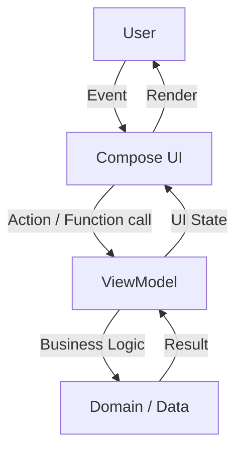
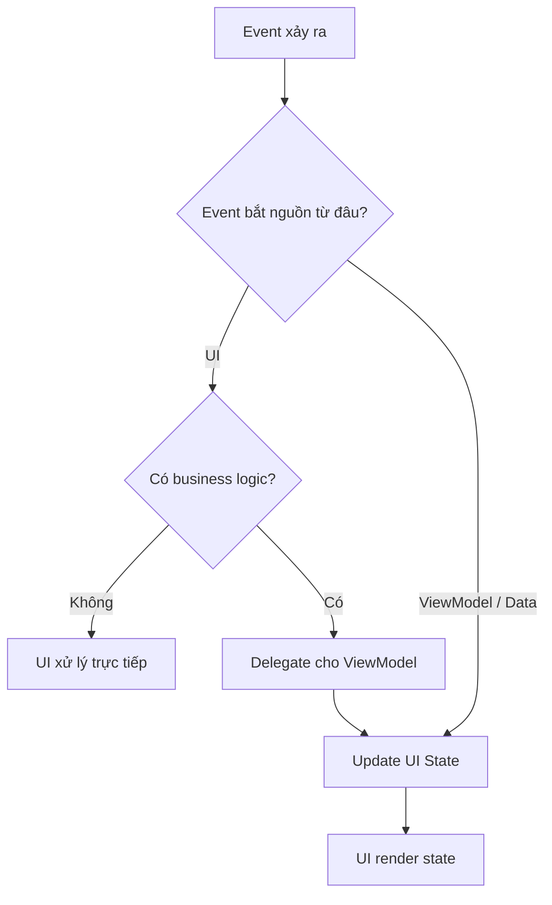
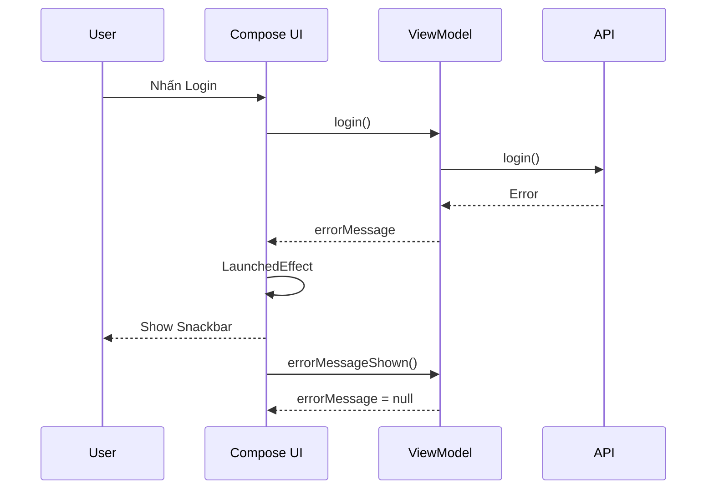
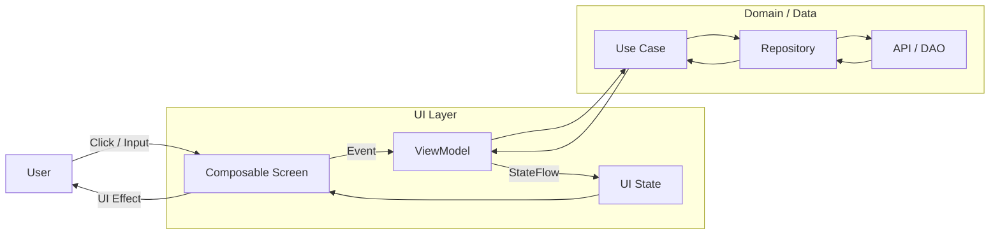
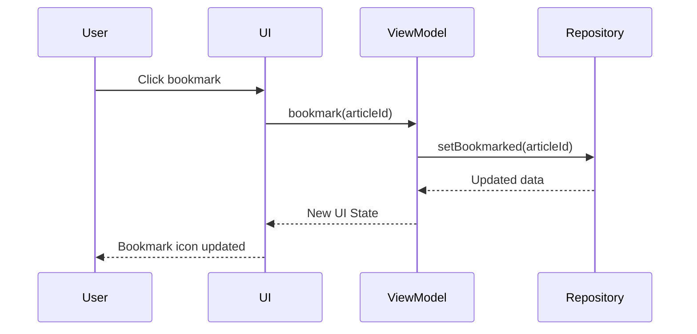
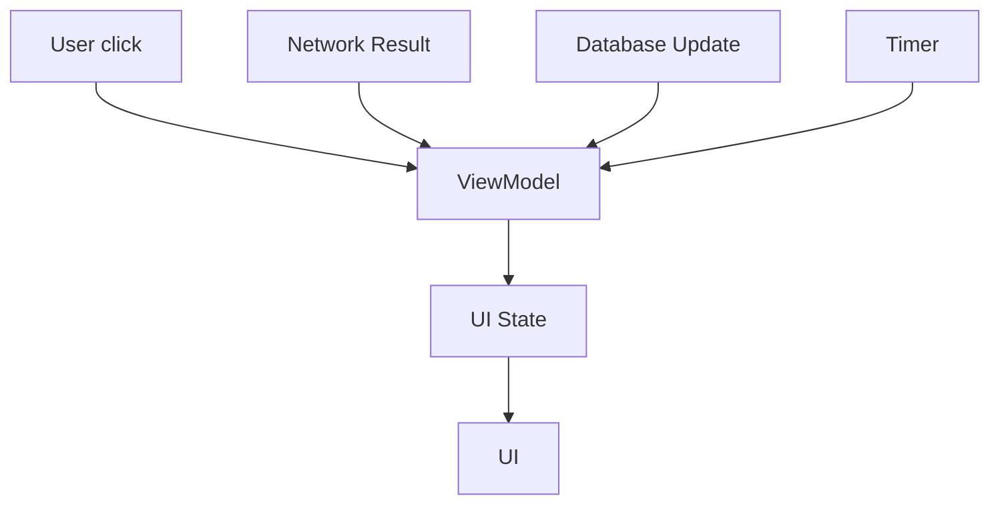
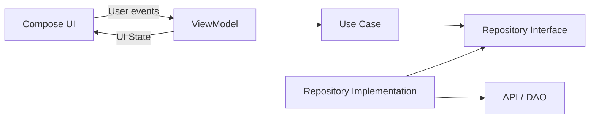
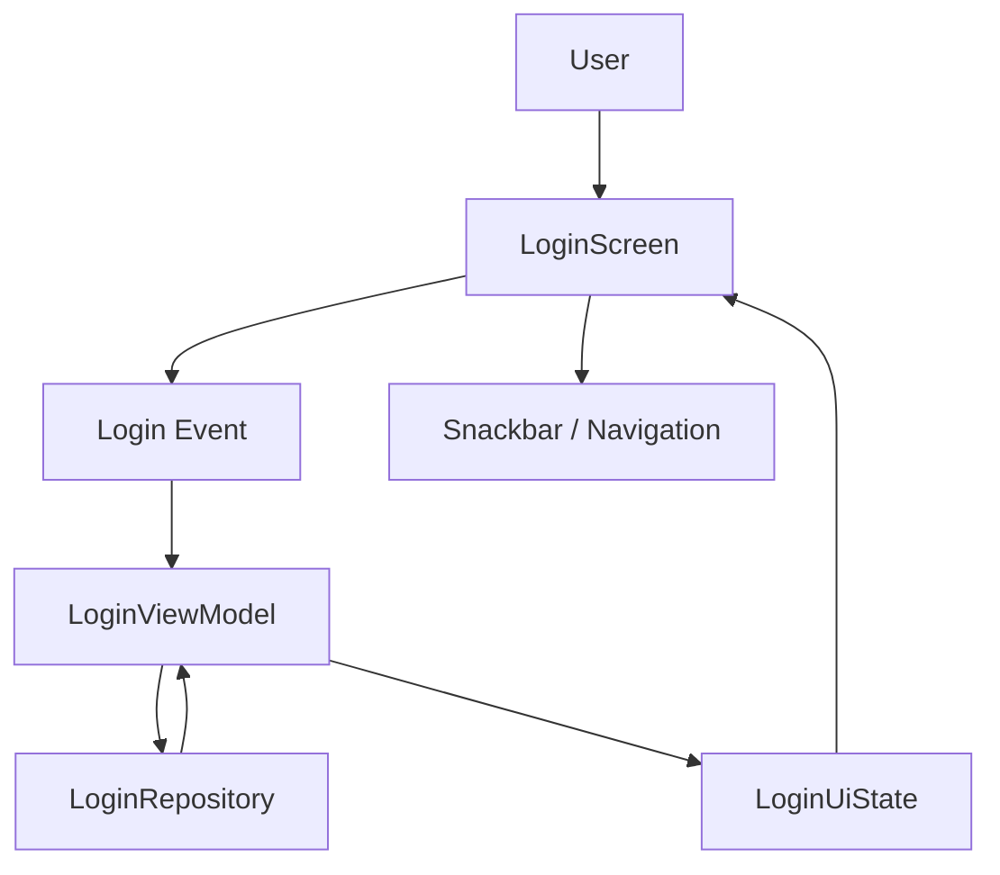

[](https://developer.android.com/topic/architecture/ui-layer/events?utm_source=chatgpt.com)

# 017 — Events and Effects

> **Học phần:** 03 — Architecture, State and Data
> **Module:** Module 05 — Design and Architecture
> **Nhóm nội dung:** Android Architecture Components
> **Nguồn roadmap:** Design and Architecture / Android Architecture Components
> **Loại bài:** Architecture
> **Thứ tự trong module:** 017
> **Thời lượng gợi ý:** 34 phút

---

## 1. Tóm tắt

Trong Android, **Events and Effects** giúp chúng ta trả lời ba câu hỏi rất quan trọng:

1. **Chuyện gì vừa xảy ra?** → `Event`
2. **Ứng dụng hiện đang ở trạng thái nào?** → `State`
3. **UI cần thực hiện hành động phụ nào do trạng thái đó?** → `Effect`

Ví dụ người dùng nhấn nút **Đăng nhập**:

```text
User nhấn Login
      ↓
    Event
      ↓
  ViewModel
      ↓
Business Logic
      ↓
 UI State thay đổi
      ↓
UI render
      ↓
Snackbar / Navigation nếu cần
```

Trong kiến trúc Android hiện đại, Google khuyến nghị theo **Unidirectional Data Flow — UDF**: UI gửi hành động lên trên, state được tạo ra và chảy xuống UI. Khi một sự kiện từ ViewModel ảnh hưởng đến UI, hướng dẫn Android hiện tại ưu tiên **chuyển kết quả đó thành UI State** thay vì phụ thuộc vào các "one-shot event" có thể bị mất khi lifecycle thay đổi. ([Android Developers][1])

---

# 2. Mục tiêu học tập

Sau bài này, anh nên có thể:

* giải thích được `Event`, `State` và `Effect`;
* phân biệt **UI Event** với **business event**;
* biết event nào UI tự xử lý và event nào phải gửi cho `ViewModel`;
* hiểu quan hệ giữa Events/Effects với **UDF**;
* xử lý Snackbar, navigation và các UI side effect đúng lifecycle;
* hiểu `LaunchedEffect`, `DisposableEffect`, `rememberCoroutineScope`;
* biết vì sao không nên phát mọi thứ từ ViewModel bằng `SharedFlow`, `Channel` hoặc `SingleLiveEvent`;
* test được luồng:

```text
Event → Logic → State → UI
```

Android Architecture hiện khuyến nghị ViewModel nhận các hành động từ UI và expose UI state trở lại UI; state nên được collect theo lifecycle. ([Android Developers][2])

---

# 3. Ba khái niệm quan trọng nhất

## 3.1. Event là gì?

**Event** là một sự việc vừa xảy ra và cần được xử lý.

Ví dụ:

```text
User nhấn Login
User nhấn Refresh
User nhập text
User chọn một sản phẩm
User kéo Refresh
User nhấn Retry
User đóng Snackbar
```

Trong Android Architecture, loại phổ biến nhất là **User Event**: hành động do người dùng tạo ra khi tương tác với UI. UI nhận chúng thông qua callback như `onClick`, `onValueChange`, gesture callback... ([Android Developers][1])

Ví dụ Compose:

```kotlin
Button(
    onClick = {
        viewModel.login()
    }
) {
    Text("Đăng nhập")
}
```

Ở đây:

```text
onClick
   ↓
Login Event
   ↓
ViewModel.login()
```

---

# 4. State là gì?

**State** mô tả:

> UI hiện tại phải trông như thế nào.

Ví dụ:

```kotlin
data class LoginUiState(
    val username: String = "",
    val password: String = "",
    val isLoading: Boolean = false,
    val errorMessage: String? = null,
    val isLoggedIn: Boolean = false
)
```

Một state có thể biểu diễn:

```text
isLoading = true

→ hiện ProgressIndicator
```

hoặc:

```text
errorMessage = "Sai mật khẩu"

→ hiện lỗi
```

hoặc:

```text
isLoggedIn = true

→ UI biết đăng nhập đã thành công
```

State holder như ViewModel chịu trách nhiệm xử lý user events, lấy dữ liệu từ domain/data layer và tạo ra screen UI state. ([Android Developers][3])

---

# 5. Effect là gì?

Đây là phần dễ gây nhầm nhất.

Có thể hiểu **Effect** là:

> Một hành động xảy ra bên ngoài quá trình render UI thuần túy.

Ví dụ:

```text
Show Snackbar
Navigate
Request permission
Mở browser
Mở camera
Scroll tới item
Focus TextField
Khởi chạy animation
Đăng ký / hủy listener
```

Jetpack Compose định nghĩa side effect là thay đổi xảy ra ngoài phạm vi của một composable thuần túy. Vì recomposition có thể xảy ra nhiều lần, bị hủy hoặc chạy theo thứ tự không nên dựa vào, side effect phải được thực hiện thông qua các Effect API thích hợp. ([Android Developers][4])

---

## 5.1. Cực kỳ quan trọng: hai nghĩa của "Effect"

Trong Android/Compose có hai khái niệm thường bị gọi chung là Effect.

### Effect trong kiến trúc

Ví dụ:

```text
Login thành công
      ↓
Navigate Home
```

hoặc:

```text
Refresh thất bại
       ↓
Show Snackbar
```

### Compose Effect API

Là API cụ thể:

```kotlin
LaunchedEffect(...)
DisposableEffect(...)
SideEffect(...)
rememberCoroutineScope()
```

Compose cung cấp các API này để thực hiện side effect trong môi trường được kiểm soát theo lifecycle của Composition. ([Android Developers][4])

---

# 6. Event — State — Effect khác nhau thế nào?

| Thành phần         | Ý nghĩa                        | Ví dụ              |
| ------------------ | ------------------------------ | ------------------ |
| **Event**          | Điều vừa xảy ra                | User nhấn Login    |
| **State**          | UI hiện đang ở trạng thái gì   | `isLoading = true` |
| **Effect**         | Hành động UI phụ cần thực hiện | Show Snackbar      |
| **Business Logic** | Xử lý nghiệp vụ                | Validate login     |
| **Data**           | Dữ liệu lâu dài                | User, database     |

Ví dụ đầy đủ:

```text
[User]
   │
   │ click Login
   ▼
[Event]
   │
   ▼
[ViewModel]
   │
   │ loginRepository.login()
   ▼
[Repository]
   │
   ▼
[API]
   │
   │ success
   ▼
[ViewModel]
   │
   │ UiState.isLoggedIn = true
   ▼
[UI]
   │
   │ observe state
   ▼
Navigate Home
```

---

# 7. Events trong Unidirectional Data Flow

Android Architecture đặt Events rất tự nhiên trong **UDF**.



Ta có hai hướng chính:

```text
Events
UI ───────────────► ViewModel

State
UI ◄────────────── ViewModel
```

Android mô tả UDF theo chu kỳ: event xảy ra → event handler cập nhật state → state được đưa xuống UI để render. Cách này giúp state mutation tập trung hơn và UI dễ test hơn. ([Android Developers][5])

---

# 8. Event nên được xử lý ở đâu?

Đây là nguyên tắc quan trọng nhất của bài.

Android đưa ra một decision tree khá rõ ràng. ([Android Developers][1])



---

# 9. Event chỉ liên quan tới UI

Ví dụ nút:

```text
Show details / Hide details
```

State này chỉ có ý nghĩa với component.

UI có thể tự giữ:

```kotlin
@Composable
fun ProductCard() {

    var expanded by remember {
        mutableStateOf(false)
    }

    Button(
        onClick = {
            expanded = !expanded
        }
    ) {
        Text(
            if (expanded) "Thu gọn"
            else "Xem thêm"
        )
    }

    if (expanded) {
        Text("Thông tin chi tiết")
    }
}
```

Không cần:

```text
ProductCard
    ↓
ViewModel
    ↓
Repository
```

chỉ để xử lý:

```text
expanded = true
```

Android cũng dùng trường hợp mở rộng/thu gọn UI element làm ví dụ về event có thể được UI xử lý trực tiếp. ([Android Developers][1])

---

# 10. Event có business logic

Ví dụ:

```text
User nhấn Refresh
```

Refresh có thể cần:

```text
Network
Cache
Repository
Error Handling
Authentication
```

Vì vậy:

```kotlin
Button(
    onClick = {
        viewModel.refresh()
    }
) {
    Text("Refresh")
}
```

ViewModel:

```kotlin
class NewsViewModel(
    private val repository: NewsRepository
) : ViewModel() {

    fun refresh() {
        viewModelScope.launch {
            repository.refresh()
        }
    }
}
```

Android khuyến nghị event cần business logic — ví dụ refresh data — nên được chuyển tới ViewModel xử lý. ([Android Developers][1])

---

# 11. Không truyền ViewModel sâu xuống UI tree

### Không nên

```kotlin
@Composable
fun NewsList(
    viewModel: NewsViewModel
) {
    LazyColumn {
        items(...) { news ->
            NewsItem(
                onClick = {
                    viewModel.openArticle(news.id)
                }
            )
        }
    }
}
```

`NewsList` bị phụ thuộc trực tiếp vào:

```text
NewsViewModel
```

---

## Nên

```kotlin
@Composable
fun NewsList(
    news: List<News>,
    onNewsClick: (News) -> Unit
) {
    LazyColumn {
        items(news) { item ->
            NewsItem(
                news = item,
                onClick = {
                    onNewsClick(item)
                }
            )
        }
    }
}
```

Ở Screen:

```kotlin
NewsList(
    news = uiState.news,
    onNewsClick = { news ->
        viewModel.selectNews(news.id)
    }
)
```

Kiến trúc:

```text
NewsList
   │
   │ onNewsClick
   ▼
Screen
   │
   ▼
ViewModel
```

Android cũng khuyến nghị reusable composables expose event qua lambda thay vì nhận ViewModel trực tiếp, giúp component ít coupling hơn. ([Android Developers][1])

---

# 12. Naming convention cho Events

Tên callback nên mô tả rõ:

```text
on + Action
```

Ví dụ:

```kotlin
onLoginClick
onRefreshClick
onRetryClick
onItemClick
onValueChange
onDismiss
onConfirm
```

Ví dụ:

```kotlin
@Composable
fun LoginButton(
    onLoginClick: () -> Unit
) {
    Button(
        onClick = onLoginClick
    ) {
        Text("Login")
    }
}
```

Android documentation cũng sử dụng convention dạng `onExpandClicked`, `onValueChange`, còn hàm ViewModel thường đặt tên theo hành động như `login()`, `validateInput()` hoặc `refreshNews()`. ([Android Developers][1])

---

# 13. Có nên tạo một `UiEvent` sealed interface không?

Trong MVI hoặc UDF có thể gặp:

```kotlin
sealed interface LoginEvent {

    data class UsernameChanged(
        val value: String
    ) : LoginEvent

    data class PasswordChanged(
        val value: String
    ) : LoginEvent

    data object LoginClicked : LoginEvent
}
```

ViewModel:

```kotlin
fun onEvent(event: LoginEvent) {
    when (event) {

        is LoginEvent.UsernameChanged -> {
            // update state
        }

        is LoginEvent.PasswordChanged -> {
            // update state
        }

        LoginEvent.LoginClicked -> {
            login()
        }
    }
}
```

Luồng:

```text
UI
 │
 ├── UsernameChanged
 ├── PasswordChanged
 └── LoginClicked
        │
        ▼
     onEvent()
        │
        ▼
    ViewModel
```

Cách này hữu ích khi:

```text
Screen có nhiều event
MVI architecture
Muốn reducer tập trung
Muốn log/debug event
```

Nhưng không bắt buộc.

Với screen nhỏ:

```kotlin
viewModel.login()
viewModel.refresh()
viewModel.retry()
```

thường đơn giản hơn. Hướng dẫn Android hiện tại chủ yếu mô tả ViewModel nhận action từ UI thông qua các lời gọi hàm. ([Android Developers][2])

---

# 14. Ví dụ hoàn chỉnh — Login Screen

Giả sử kiến trúc:

```text
LoginScreen
      │
      ▼
LoginViewModel
      │
      ▼
LoginRepository
      │
      ▼
AuthApi
```

---

## 14.1. UI State

```kotlin
data class LoginUiState(
    val username: String = "",
    val password: String = "",
    val isLoading: Boolean = false,
    val isLoggedIn: Boolean = false,
    val errorMessage: String? = null
)
```

---

## 14.2. Repository

```kotlin
interface LoginRepository {

    suspend fun login(
        username: String,
        password: String
    ): Result<Unit>
}
```

---

## 14.3. ViewModel

```kotlin
class LoginViewModel(
    private val repository: LoginRepository
) : ViewModel() {

    private val _uiState =
        MutableStateFlow(LoginUiState())

    val uiState =
        _uiState.asStateFlow()

    fun onUsernameChange(value: String) {
        _uiState.update {
            it.copy(username = value)
        }
    }

    fun onPasswordChange(value: String) {
        _uiState.update {
            it.copy(password = value)
        }
    }

    fun login() {

        val username = _uiState.value.username
        val password = _uiState.value.password

        viewModelScope.launch {

            _uiState.update {
                it.copy(
                    isLoading = true,
                    errorMessage = null
                )
            }

            repository
                .login(
                    username,
                    password
                )
                .onSuccess {

                    _uiState.update {
                        it.copy(
                            isLoading = false,
                            isLoggedIn = true
                        )
                    }
                }
                .onFailure { error ->

                    _uiState.update {
                        it.copy(
                            isLoading = false,
                            errorMessage =
                                error.message ?: "Đăng nhập thất bại"
                        )
                    }
                }
        }
    }

    fun errorMessageShown() {
        _uiState.update {
            it.copy(errorMessage = null)
        }
    }
}
```

---

# 15. Compose UI

```kotlin
@Composable
fun LoginScreen(
    viewModel: LoginViewModel,
    onLoginSuccess: () -> Unit
) {

    val uiState by viewModel.uiState
        .collectAsStateWithLifecycle()

    val snackbarHostState =
        remember { SnackbarHostState() }

    Scaffold(
        snackbarHost = {
            SnackbarHost(snackbarHostState)
        }
    ) { padding ->

        Column(
            modifier = Modifier.padding(padding)
        ) {

            TextField(
                value = uiState.username,
                onValueChange =
                    viewModel::onUsernameChange
            )

            TextField(
                value = uiState.password,
                onValueChange =
                    viewModel::onPasswordChange
            )

            Button(
                enabled = !uiState.isLoading,
                onClick = viewModel::login
            ) {
                Text("Đăng nhập")
            }
        }
    }
}
```

UI state được collect bằng API nhận biết lifecycle là cách Android Architecture khuyến nghị cho Compose. ([Android Developers][2])

---

# 16. Error message → Effect

Giả sử:

```text
Login API
    ↓
Failure
    ↓
errorMessage state
```

Ta không viết:

```kotlin
if (uiState.errorMessage != null) {
    snackbarHostState.showSnackbar(...)
}
```

ngay trong thân composable.

Lý do:

```text
Recomposition #1 → show snackbar
Recomposition #2 → show snackbar
Recomposition #3 → show snackbar
```

Composable nên càng side-effect free càng tốt vì recomposition không nên được coi như một lần chạy tuần tự kiểu imperative. ([Android Developers][4])

---

## Đúng hơn: `LaunchedEffect`

```kotlin
uiState.errorMessage?.let { message ->

    LaunchedEffect(message) {

        snackbarHostState.showSnackbar(message)

        viewModel.errorMessageShown()
    }
}
```

Luồng:



Android documentation hiện cũng dùng mô hình `userMessage` nằm trong UI state, UI dùng `LaunchedEffect` để hiển thị Snackbar rồi báo lại ViewModel rằng message đã được xử lý. ([Android Developers][1])

---

# 17. Vì sao cần `errorMessageShown()`?

Nếu không clear:

```text
errorMessage = "No Internet"
```

vẫn nằm trong state.

UI có thể quay trở lại:

```text
Screen recreated
      ↓
collect state
      ↓
errorMessage vẫn tồn tại
      ↓
Snackbar lại xuất hiện
```

Vì vậy:

```text
UI render message
      ↓
UI thông báo consumed
      ↓
ViewModel
      ↓
errorMessage = null
```

Đây là một ví dụ thú vị:

> Việc "effect đã được người dùng/UI xử lý" lại trở thành một event mới gửi về ViewModel.

Android docs mô tả việc message được dismiss hoặc hiển thị xong như một input khiến ViewModel cập nhật UI state để clear message. ([Android Developers][1])

---

# 18. Navigation cũng là UI Effect

Ví dụ:

```text
Login successful
      ↓
Navigate Home
```

Không nên để ViewModel phụ thuộc vào:

```kotlin
NavController
```

Ví dụ không nên:

```kotlin
class LoginViewModel(
    private val navController: NavController
)
```

Thay vào đó:

```text
ViewModel
   ↓
UI State
   ↓
UI
   ↓
Navigation
```

Navigation là UI behavior logic; Android hướng dẫn để UI thực hiện navigation, còn business validation có thể được ViewModel xử lý trước. ([Android Developers][1])

---

## Ví dụ

```kotlin
if (uiState.isLoggedIn) {

    LaunchedEffect(uiState.isLoggedIn) {
        onLoginSuccess()
    }
}
```

Trong trường hợp screen đăng nhập được loại khỏi back stack sau khi thành công, pattern này khá đơn giản.

Nếu destination vẫn được giữ trong back stack, cần thêm state phía UI để tránh tự động navigate lại khi người dùng quay về screen cũ. Android documentation đặc biệt lưu ý trường hợp này. ([Android Developers][1])

---

# 19. Event trực tiếp dẫn đến Navigation

Nếu không cần business logic:

```text
User click Help
      ↓
Navigate Help
```

Có thể xử lý trực tiếp:

```kotlin
@Composable
fun LoginScreen(
    onHelpClick: () -> Unit
) {

    Button(
        onClick = onHelpClick
    ) {
        Text("Trợ giúp")
    }
}
```

Không cần vòng:

```text
UI
 ↓
ViewModel
 ↓
UI
 ↓
Navigation
```

nếu ViewModel thực tế không phải quyết định gì.

Android phân biệt rất rõ business logic với UI behavior logic như navigation và Snackbar. ([Android Developers][1])

---

# 20. Compose Effect APIs

## 20.1. `LaunchedEffect`

Dùng khi cần chạy coroutine phụ thuộc vào lifecycle của composable.

```kotlin
LaunchedEffect(userId) {
    loadSomething(userId)
}
```

Khi key thay đổi:

```text
userId = 1
  ↓
Effect 1

userId = 2
  ↓
cancel Effect 1
  ↓
start Effect 2
```

Khi composable rời Composition, coroutine của `LaunchedEffect` bị cancel. ([Android Developers][4])

---

## 20.2. `rememberCoroutineScope`

Hữu ích khi một UI event trực tiếp cần chạy coroutine.

Ví dụ Snackbar:

```kotlin
val scope = rememberCoroutineScope()

Button(
    onClick = {

        scope.launch {
            snackbarHostState
                .showSnackbar(
                    "Đã lưu"
                )
        }
    }
) {
    Text("Save")
}
```

Scope này gắn với Composition và bị cancel khi vị trí composable tương ứng rời Composition. ([Android Developers][4])

---

## 20.3. `DisposableEffect`

Dùng khi cần:

```text
register
   ↓
use
   ↓
unregister
```

Ví dụ:

```kotlin
DisposableEffect(lifecycleOwner) {

    val observer =
        LifecycleEventObserver { _, event ->

            // Handle lifecycle event
        }

    lifecycleOwner.lifecycle
        .addObserver(observer)

    onDispose {

        lifecycleOwner.lifecycle
            .removeObserver(observer)
    }
}
```

`DisposableEffect` phù hợp với side effect cần cleanup khi key thay đổi hoặc composable rời Composition. ([Android Developers][4])

---

# 21. Bảng chọn Effect API

| Nhu cầu                                        | Công cụ                  |
| ---------------------------------------------- | ------------------------ |
| Chạy coroutine khi state/key thay đổi          | `LaunchedEffect`         |
| Coroutine do click trực tiếp từ UI             | `rememberCoroutineScope` |
| Register/unregister listener                   | `DisposableEffect`       |
| Publish Compose state ra object bên ngoài      | `SideEffect`             |
| Giữ callback mới nhất bên trong effect dài hạn | `rememberUpdatedState`   |

Các API Compose Effect tồn tại nhằm giữ side effects trong môi trường có kiểm soát và tránh phá vỡ UDF. ([Android Developers][4])

---

# 22. `SharedFlow<UiEffect>` có nên dùng không?

Có thể anh từng thấy kiến trúc:

```kotlin
sealed interface UiEffect {

    data class ShowSnackbar(
        val message: String
    ) : UiEffect

    data object NavigateHome : UiEffect
}
```

ViewModel:

```kotlin
private val _effect =
    MutableSharedFlow<UiEffect>()

val effect =
    _effect.asSharedFlow()
```

và:

```kotlin
_effect.emit(
    UiEffect.NavigateHome
)
```

UI:

```kotlin
LaunchedEffect(Unit) {

    viewModel.effect.collect { effect ->

        when (effect) {

            UiEffect.NavigateHome ->
                onNavigateHome()

            is UiEffect.ShowSnackbar ->
                snackbarHostState
                    .showSnackbar(effect.message)
        }
    }
}
```

Pattern này rất phổ biến trong các implementation MVI.

---

# 23. Nhưng có một vấn đề quan trọng

Giả sử:

```text
ViewModel còn sống

UI đang STOPPED / bị recreate

       ↓

ViewModel emit NavigateHome

       ↓

Không có consumer phù hợp

       ↓

Event có thể không được xử lý
```

Đây là lý do Android Architecture hiện khuyến nghị cẩn thận với ViewModel → UI one-off event thông qua Channel hoặc reactive stream: khi producer sống lâu hơn consumer, việc delivery và processing không được đảm bảo như một UI state có thể quan sát lại. ([Android Developers][1])

---

# 24. State-first approach

Thay vì:

```text
ViewModel
   ↓
emit NavigateHome
```

ưu tiên suy nghĩ:

```text
Điều gì đã thay đổi trong application state?
```

Ví dụ:

```text
User login thành công
```

thì:

```kotlin
isLoggedIn = true
```

Sau đó:

```text
UI observes isLoggedIn
       ↓
UI decides navigation
```

Android gọi đây là việc **reduce event thành UI State**. ([Android Developers][1])

---

# 25. So sánh hai cách

## Cách A — One-shot Effect Stream

```text
ViewModel
   │
   └── NavigateHome
             ↓
             UI
```

Ưu điểm:

```text
đơn giản
rõ kiểu MVI
```

Nhược điểm:

```text
lifecycle phức tạp
có thể mất event
exactly-once khó đảm bảo
```

---

## Cách B — State Driven

```text
ViewModel
     │
     └── isLoggedIn = true
                  ↓
                  UI
                  ↓
             Navigate
```

Ưu điểm:

```text
reproducible
dễ test
dễ inspect
phù hợp UDF
```

Đây là hướng Android Architecture hiện ưu tiên cho ViewModel-originated UI actions. ([Android Developers][1])

---

# 26. Đừng nhầm `SharedFlow` là sai

`SharedFlow` bản thân không sai.

Nó rất phù hợp cho nhiều loại stream.

Vấn đề là khi ta yêu cầu:

```text
"UI event này bắt buộc phải được xử lý đúng một lần,
không được mất,
dù lifecycle thay đổi"
```

thì một transient event stream giữa producer có lifecycle dài hơn và UI consumer có lifecycle ngắn hơn trở nên khó đảm bảo. Android docs lưu ý đặc biệt về vấn đề "exactly once" khi có nhiều consumer hoặc lifecycle khác nhau. ([Android Developers][1])

---

# 27. Events và Lifecycle

Đây là phần rất quan trọng trong production.

Giả sử:

```text
User click Pay
      ↓
API payment success
      ↓
App background
      ↓
Effect emitted
      ↓
UI collector không active
```

Nếu:

```text
payment success
```

chỉ tồn tại dưới dạng:

```text
NavigateReceipt
```

thì thông tin có nguy cơ bị mất khỏi luồng UI.

Nhưng nếu:

```kotlin
PaymentUiState(
    paymentStatus = PaymentStatus.Success(...)
)
```

thì UI sau khi active trở lại vẫn đọc được:

```text
PaymentStatus.Success
```

Đó là một lý do state thường mạnh hơn transient event với những dữ liệu quan trọng. Android Architecture cũng khuyến nghị suy nghĩ về UI state thay vì chỉ nghĩ UI "phải thực hiện action nào". ([Android Developers][1])

---

# 28. Configuration change

Ví dụ xoay màn hình:

```text
Portrait
   ↓
Activity recreated
   ↓
Landscape
```

Nếu ViewModel vẫn tồn tại:

```text
UiState
```

được giữ qua configuration change.

UI mới:

```text
collect state
   ↓
render state hiện tại
```

State holder cho business logic được thiết kế để có lifetime phù hợp với screen và ViewModel thường tồn tại cho đến khi destination bị loại khỏi back stack. ([Android Developers][6])

---

# 29. Process death

ViewModel không phải persistent storage.

Nếu state cần khôi phục sau process death:

```text
Process killed
   ↓
Process recreated
```

thì có thể cần:

```text
SavedStateHandle
Database
DataStore
Repository
```

Tùy loại state.

Android guidance cũng cho phép state cần thiết được phục hồi thông qua saved state khi cần khả năng tái tạo hành vi sau process death. ([Android Developers][1])

---

# 30. Kiến trúc tổng thể nên hướng tới



Nhớ công thức:

```text
              Event
UI ─────────────────────────► ViewModel

              State
UI ◄───────────────────────── ViewModel
```

Effect thường nằm phía UI:

```text
State
  ↓
UI
  ↓
Effect
```

---

# 31. Ví dụ thực tế — Bookmark Article

Giả sử:

```text
User click bookmark
```

Event:

```text
BookmarkClicked(articleId)
```

Luồng:



Đây gần như chính xác là kiểu ví dụ Android dùng để minh họa event gây state mutation trong UDF. ([Android Developers][5])

---

# 32. Ví dụ không tốt

```kotlin
@Composable
fun LoginScreen(
    viewModel: LoginViewModel
) {

    if (viewModel.loginSuccess) {

        navController.navigate("home")
    }
}
```

Vấn đề:

```text
Composable recomposes
        ↓
navigate()
        ↓
recompose
        ↓
navigate() ?
```

Side effect không nên được gọi tùy tiện trong composable body. Compose cung cấp Effect APIs chính vì composable có thể recompose nhiều lần và side effect cần lifecycle kiểm soát. ([Android Developers][4])

---

# 33. Cách tốt hơn

```kotlin
if (uiState.isLoggedIn) {

    LaunchedEffect(
        uiState.isLoggedIn
    ) {
        onLoginSuccess()
    }
}
```

Hoặc thiết kế navigation flow sao cho:

```text
Authentication State
         ↓
Navigation graph
         ↓
Destination
```

---

# 34. Anti-pattern — ViewModel điều khiển UI framework

Không nên:

```kotlin
class LoginViewModel(
    private val navController: NavController,
    private val context: Context
)
```

rồi:

```kotlin
Toast.makeText(...)
navController.navigate(...)
```

Architecture sẽ trở thành:

```text
ViewModel
 ├─ Domain Logic
 ├─ Navigation
 ├─ Toast
 ├─ Context
 └─ Data
```

Thay vào đó:

```text
ViewModel
   │
   └── Business State
             ↓
             UI
       ├── Navigation
       ├── Snackbar
       └── Animation
```

Android phân loại navigation và Snackbar là UI behavior logic, còn ViewModel xử lý business logic và tạo UI state. ([Android Developers][1])

---

# 35. Anti-pattern — `SingleLiveEvent`

Trong code Android cũ có thể gặp:

```kotlin
val navigateEvent =
    SingleLiveEvent<Unit>()
```

hoặc:

```kotlin
Event<T>
ConsumableEvent
EventWrapper
```

Mục tiêu thường là:

```text
"chỉ consume một lần"
```

Nhưng kiến trúc hiện đại ưu tiên đặt câu hỏi:

```text
Event này thực chất biểu diễn state nào?
```

Ví dụ:

```text
NavigateToHome
```

có thể thực chất là:

```text
AuthenticationState.Authenticated
```

Android Architecture hiện khuyến nghị ViewModel-originated event nên tạo state update và cảnh báo về one-off event streams có producer sống lâu hơn UI consumer. ([Android Developers][1])

---

# 36. Test Events and Effects

Mục tiêu không nên chỉ test:

```text
ViewModel gọi function X
```

Mà nên test:

```text
Input Event
    ↓
Expected State
```

---

# 37. Fake Repository

```kotlin
class FakeLoginRepository :
    LoginRepository {

    var shouldSucceed = true

    override suspend fun login(
        username: String,
        password: String
    ): Result<Unit> {

        return if (shouldSucceed) {

            Result.success(Unit)

        } else {

            Result.failure(
                Exception("Invalid login")
            )
        }
    }
}
```

---

# 38. ViewModel test

Ý tưởng:

```text
Given
Repository success

When
login()

Then
isLoggedIn == true
```

Ví dụ:

```kotlin
@Test
fun login_success_updates_state() =
    runTest {

        val repository =
            FakeLoginRepository()

        val viewModel =
            LoginViewModel(repository)

        viewModel.onUsernameChange("khanh")
        viewModel.onPasswordChange("123456")

        viewModel.login()

        advanceUntilIdle()

        assertTrue(
            viewModel.uiState.value.isLoggedIn
        )
    }
```

---

# 39. Test failure

```kotlin
@Test
fun login_failure_exposes_error() =
    runTest {

        val repository =
            FakeLoginRepository().apply {
                shouldSucceed = false
            }

        val viewModel =
            LoginViewModel(repository)

        viewModel.login()

        advanceUntilIdle()

        assertNotNull(
            viewModel
                .uiState
                .value
                .errorMessage
        )
    }
```

---

# 40. Test consume message

```kotlin
@Test
fun messageShown_clears_error() =
    runTest {

        val repository =
            FakeLoginRepository().apply {
                shouldSucceed = false
            }

        val viewModel =
            LoginViewModel(repository)

        viewModel.login()

        advanceUntilIdle()

        viewModel.errorMessageShown()

        assertNull(
            viewModel
                .uiState
                .value
                .errorMessage
        )
    }
```

Khi ViewModel biến event thành state, test thường trở thành bài toán rất đơn giản:

```text
Event → State
```

Đây cũng là một trong những lợi ích Android nêu khi khuyến nghị xử lý ViewModel events thông qua UI state. ([Android Developers][1])

---

# 41. Debugging Events

Một cách debug rất hữu ích:

```text
Event
  ↓
Reducer / Handler
  ↓
Old State
  ↓
New State
  ↓
Effect
```

Ví dụ log:

```text
EVENT:
LoginClicked

OLD STATE:
isLoading=false
isLoggedIn=false

NEW STATE:
isLoading=true
isLoggedIn=false
```

Sau API:

```text
OLD STATE:
isLoading=true
isLoggedIn=false

NEW STATE:
isLoading=false
isLoggedIn=true
```

Cách này rất phù hợp với:

```text
UDF
MVI
StateFlow
Reducer architecture
```

---

# 42. Event reducer pattern

Ở app lớn có thể dùng:

```kotlin
fun onEvent(event: LoginEvent) {

    when (event) {

        is LoginEvent.UsernameChanged -> {
            reduce {
                copy(username = event.value)
            }
        }

        is LoginEvent.PasswordChanged -> {
            reduce {
                copy(password = event.value)
            }
        }

        LoginEvent.LoginClicked -> {
            login()
        }
    }
}
```

Helper:

```kotlin
private inline fun reduce(
    transform:
        LoginUiState.() -> LoginUiState
) {

    _uiState.update {
        it.transform()
    }
}
```

Luồng trở nên rõ:

```text
Event
  ↓
Reducer
  ↓
State
  ↓
Render
```

---

# 43. Quan hệ với bài StateFlow

Anh có thể liên kết bài trước:

```text
Events
   │
   ▼
ViewModel
   │
   ▼
MutableStateFlow
   │
   ▼
StateFlow<UiState>
   │
   ▼
Compose
```

Ví dụ:

```kotlin
private val _uiState =
    MutableStateFlow(HomeUiState())

val uiState =
    _uiState.asStateFlow()
```

Event:

```kotlin
fun retry() {
    ...
}
```

State:

```kotlin
_uiState.update {
    it.copy(isLoading = true)
}
```

---

# 44. Quan hệ với SharedFlow

Một cách nhớ rất hữu ích:

```text
StateFlow
→ What is the state NOW?
```

Ví dụ:

```text
loading
logged in
items
error state
selected tab
```

Còn `SharedFlow`:

```text
→ stream/broadcast các giá trị theo thời gian
```

Nhưng không nên suy luận đơn giản:

```text
StateFlow = State
SharedFlow = Effect
```

vì yêu cầu lifecycle và delivery của event quan trọng hơn tên abstraction. Với ViewModel-originated UI actions quan trọng, Android hiện ưu tiên state-driven design. ([Android Developers][1])

---

# 45. Events có phải chỉ từ User không?

Không.

State có thể thay đổi vì:

```text
User Event
System Event
Timer
Network response
Database update
Repository update
Authentication expired
Location update
```

Android UI state production mô tả source of state change có thể đến từ UI, từ data/domain layer hoặc kết hợp nhiều nguồn. ([Android Developers][7])

Ví dụ:



---

# 46. Effect không phải Business Logic

Ví dụ:

```text
Payment
```

Business logic:

```text
validate cart
calculate amount
submit transaction
save receipt
```

Effect:

```text
show snackbar
navigate receipt screen
play success animation
```

Do đó:

```text
ViewModel / Domain
        ↓
Business result
        ↓
UI state
        ↓
UI
        ↓
Visual / navigation effect
```

Android Architecture phân biệt business logic và UI behavior logic theo chính nguyên tắc này. ([Android Developers][1])

---

# 47. Folder structure gợi ý

```text
feature/
└── login/
    ├── LoginScreen.kt
    ├── LoginViewModel.kt
    ├── LoginUiState.kt
    ├── LoginEvent.kt
    └── components/
        ├── LoginForm.kt
        └── LoginButton.kt

domain/
└── LoginUseCase.kt

data/
├── LoginRepository.kt
├── LoginRepositoryImpl.kt
└── AuthApi.kt
```

Nếu không dùng sealed events:

```text
login/
├── LoginScreen.kt
├── LoginViewModel.kt
└── LoginUiState.kt
```

hoàn toàn ổn.

---

# 48. Dependency direction

Bài thực hành yêu cầu:

> Draw the dependency direction.

Sơ đồ nên là:



Điểm đáng chú ý:

```text
UI không gọi API trực tiếp
UI không gọi DAO trực tiếp
Composable con không cần biết ViewModel
```

---

# 49. Refactor một screen

Giả sử code ban đầu:

```kotlin
@Composable
fun ProductScreen() {

    Button(
        onClick = {

            api.buyProduct()

            Toast.makeText(
                context,
                "Success",
                Toast.LENGTH_SHORT
            ).show()
        }
    ) {
        Text("Buy")
    }
}
```

Architecture:

```text
Composable
 ├─ Network
 ├─ Business logic
 └─ Effect
```

---

## Sau refactor

```text
Composable
    │
    │ BuyClicked
    ▼
ViewModel
    │
    ▼
Repository
    │
    ▼
API

API Result
    │
    ▼
ViewModel
    │
    ▼
UiState
    │
    ▼
Composable
    │
    ▼
Snackbar
```

---

# 50. Artifact để đưa vào portfolio

Anh có thể làm mini project:

## `EventDrivenLogin`

Bao gồm:

```text
LoginScreen
LoginViewModel
LoginUiState
LoginRepository
FakeLoginRepository
ViewModel tests
README
Architecture diagram
```

README nên giải thích:

```markdown
## Architecture

The screen uses unidirectional data flow.

User events flow from Compose to ViewModel.

The ViewModel processes business logic and produces
immutable UI state through StateFlow.

Transient UI messages are represented in UI state and
consumed by Compose using LaunchedEffect.
```

---

# 51. README diagram

Có thể dùng:



Diagram này rất tốt để chứng minh anh hiểu:

```text
Architecture
Lifecycle
State
UDF
Testing
```

thay vì chỉ biết gọi API.

---

# 52. Những lỗi thường gặp

| Lỗi                                       | Hậu quả                                  |
| ----------------------------------------- | ---------------------------------------- |
| Gọi side effect trong composable body     | Có thể chạy lại do recomposition         |
| ViewModel chứa `NavController`            | Coupling UI framework                    |
| ViewModel chứa Toast logic                | Trộn UI logic                            |
| Dùng transient stream cho critical result | Có nguy cơ lifecycle/delivery            |
| Truyền ViewModel xuống mọi composable     | Coupling cao                             |
| Event xử lý API trực tiếp trong UI        | Vi phạm separation                       |
| Không clear transient message state       | Snackbar xuất hiện lại                   |
| Mọi click đều đưa vào ViewModel           | ViewModel chứa UI detail không cần thiết |
| Dùng một `UiEvent` khổng lồ               | Reducer khó maintain                     |

Các lỗi liên quan lifecycle và transient events là lý do Android hiện nhấn mạnh UDF, state-driven UI và việc mỗi lớp chỉ đảm nhiệm trách nhiệm của mình. ([Android Developers][1])

---

# 53. Mental model cần nhớ

Nếu chỉ nhớ một sơ đồ của bài này, hãy nhớ:

```text
           ┌──────────────────┐
           │       USER       │
           └────────┬─────────┘
                    │
                  Event
                    │
                    ▼
           ┌──────────────────┐
           │        UI        │
           └────────┬─────────┘
                    │
                 Action
                    │
                    ▼
           ┌──────────────────┐
           │    ViewModel     │
           └────────┬─────────┘
                    │
              Business Logic
                    │
                    ▼
           ┌──────────────────┐
           │  Repository /    │
           │     Domain       │
           └────────┬─────────┘
                    │
                  Result
                    │
                    ▼
           ┌──────────────────┐
           │     UI State     │
           └────────┬─────────┘
                    │
                  Render
                    ▼
           ┌──────────────────┐
           │        UI        │
           └────────┬─────────┘
                    │
             UI Side Effect
                    ▼
           Snackbar / Navigate
```

---

# 54. Quy tắc chọn nhanh

Khi một event xảy ra, hãy tự hỏi:

```text
Event này chỉ thay đổi UI local?
        │
        ├── YES → UI xử lý
        │
        └── NO
             │
             ▼
Có business logic?
        │
        ├── YES → ViewModel
        │
        └── NO → UI
```

Nếu ViewModel xử lý xong:

```text
Có thể biểu diễn kết quả bằng state?
        │
        ├── YES → UI State
        │
        └── Hãy xem lại architecture
```

Đây rất gần với decision tree chính thức của Android dành cho UI events. ([Android Developers][1])

---

# 55. Bài thực hành

## Bài 1 — Event

Tạo màn hình:

```text
Counter
```

Event:

```text
IncrementClicked
DecrementClicked
ResetClicked
```

State:

```kotlin
data class CounterUiState(
    val count: Int = 0
)
```

---

## Bài 2 — Network Event

Tạo:

```text
NewsScreen
```

Events:

```text
Refresh
Retry
ArticleClick
```

State:

```text
NewsUiState(
    isLoading,
    articles,
    errorMessage
)
```

---

## Bài 3 — Effect

Khi network fail:

```text
ViewModel
    ↓
userMessage
    ↓
UI State
    ↓
LaunchedEffect
    ↓
Snackbar
```

Sau đó:

```text
Snackbar dismissed
    ↓
messageShown()
    ↓
userMessage = null
```

---

# 56. Bài tập chính

> **Refactor một screen để UI, state/business logic và data access được tách rõ ràng.**

Trước:

```text
Activity / Composable
 ├── Retrofit
 ├── Validation
 ├── State
 ├── Toast
 ├── Navigation
 └── UI
```

Sau:

```text
UI
 │
 │ Event
 ▼
ViewModel
 │
 ▼
UseCase / Repository
 │
 ▼
API / DAO

API / DAO
 │
 ▼
Repository
 │
 ▼
ViewModel
 │
 │ State
 ▼
UI
 │
 ▼
Effect
```

---

# 57. Checklist hoàn thành

## Kiến thức

* [ ] Giải thích được Event là gì.
* [ ] Giải thích được State là gì.
* [ ] Giải thích được Effect là gì.
* [ ] Phân biệt Event với State.
* [ ] Phân biệt Effect kiến trúc với Compose Effect API.
* [ ] Hiểu UDF.
* [ ] Biết event nào UI xử lý.
* [ ] Biết event nào ViewModel xử lý.

## Compose

* [ ] Biết dùng `LaunchedEffect`.
* [ ] Biết dùng `rememberCoroutineScope`.
* [ ] Hiểu mục đích `DisposableEffect`.
* [ ] Không gọi side effect tùy tiện trong composable body.
* [ ] Collect state theo lifecycle.

## Architecture

* [ ] UI không gọi Repository/API trực tiếp.
* [ ] ViewModel không chứa `NavController`.
* [ ] ViewModel không quyết định chi tiết Toast/Snackbar UI.
* [ ] Composable con nhận callback thay vì ViewModel khi có thể.
* [ ] Critical UI result ưu tiên biểu diễn bằng state.

## Testing

* [ ] Có fake repository.
* [ ] Test Event → State.
* [ ] Test success.
* [ ] Test failure.
* [ ] Test transient message được clear.
* [ ] Có ít nhất một UI test cho callback/event.

## Portfolio

* [ ] Có architecture diagram.
* [ ] Có README.
* [ ] Có code sample.
* [ ] Có unit test.
* [ ] Có screenshot hoặc GIF demo.

---

# 58. Ghi chú production

Khi đưa Events and Effects vào production, nên kiểm tra đặc biệt các tình huống:

```text
Rotate screen
App background
App foreground
Process recreation
Double click
Slow network
Request timeout
Navigation back
Multiple collectors
User spam button
Snackbar đang hiển thị
```

Đặc biệt hãy hỏi:

> Nếu event xảy ra trong lúc UI không active thì sao?

Nếu câu trả lời là:

```text
"không được phép mất"
```

thì dữ liệu đó thường nên được biểu diễn thành một dạng **state bền vững hơn** thay vì chỉ tồn tại dưới dạng transient one-shot event. Đây chính là điểm mà hướng dẫn Android hiện tại nhấn mạnh khi cảnh báo về Channel/reactive streams cho ViewModel events có producer sống lâu hơn UI consumer. ([Android Developers][1])

---

# 59. Tóm tắt nhanh

```text
EVENT
=
Điều vừa xảy ra.

STATE
=
UI hiện đang như thế nào.

EFFECT
=
Hành động bên ngoài render UI thuần túy.
```

Và kiến trúc nên ưu tiên:

```text
User
 ↓
Event
 ↓
UI
 ↓
ViewModel
 ↓
Business Logic
 ↓
UI State
 ↓
UI
 ↓
Effect nếu cần
```

Công thức quan trọng nhất:

```text
Events go UP.

State goes DOWN.

Effects belong at the UI boundary.
```

Trong Android Architecture hiện đại, ViewModel nên **xử lý event rồi tạo UI state**, còn UI chịu trách nhiệm render state và thực hiện các UI behavior như navigation hoặc Snackbar theo lifecycle thích hợp. ([Android Developers][1])

[1]: https://developer.android.com/topic/architecture/ui-layer/events?utm_source=chatgpt.com "UI events | App architecture"
[2]: https://developer.android.com/topic/architecture/recommendations?hl=fr&utm_source=chatgpt.com "Recommandations pour l'architecture Android"
[3]: https://developer.android.com/topic/architecture/ui-layer/stateholders?utm_source=chatgpt.com "State holders and UI state | App architecture - Android Developers"
[4]: https://developer.android.com/develop/ui/compose/side-effects?utm_source=chatgpt.com "Side-effects in Compose"
[5]: https://developer.android.com/topic/architecture/ui-layer?utm_source=chatgpt.com "UI layer | App architecture - Android Developers"
[6]: https://developer.android.com/topic/architecture?utm_source=chatgpt.com "Guide to app architecture"
[7]: https://developer.android.com/topic/architecture/ui-layer/state-production?utm_source=chatgpt.com "UI State production | App architecture - Android Developers"

---

# Bài luyện tập

## Mục tiêu


## Đề bài


## Yêu cầu hoàn thành

- [ ] 
- [ ] 
- [ ] 

## Kết quả / lời giải


## Ghi chú
