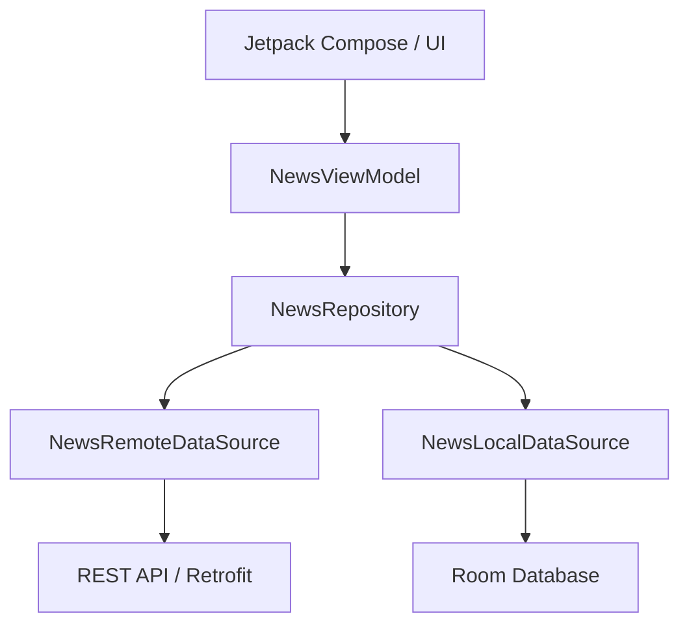
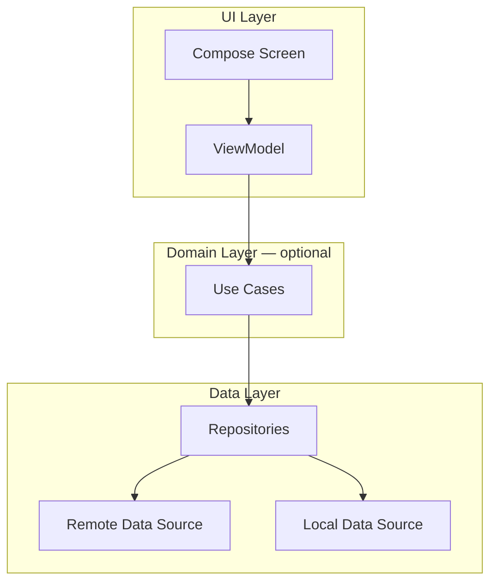
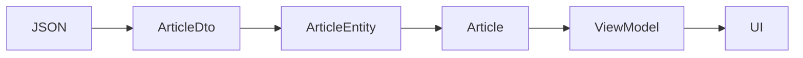
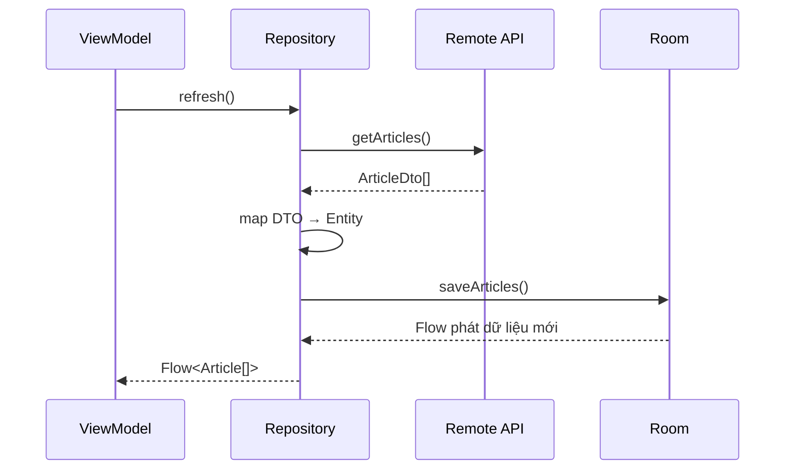
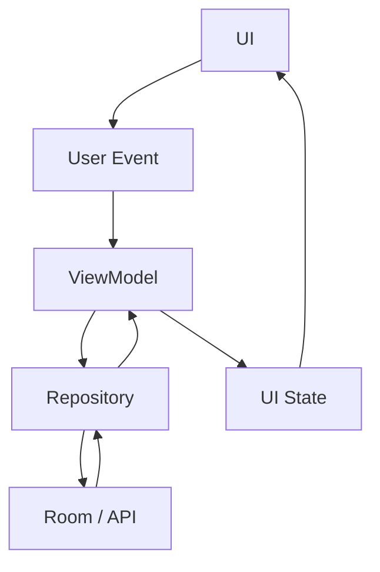
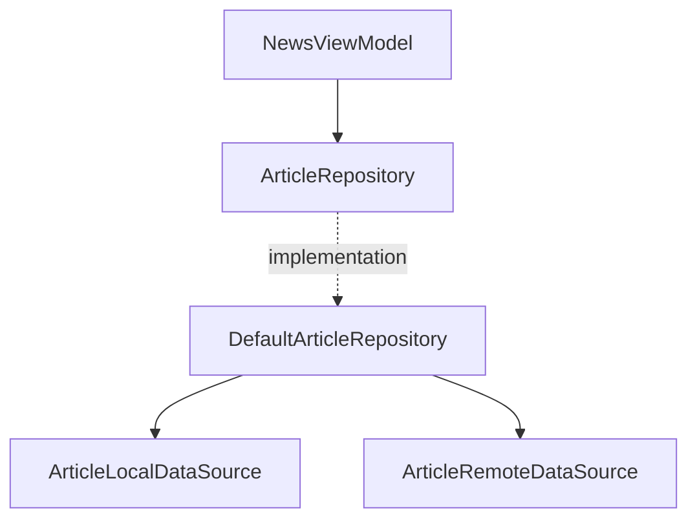
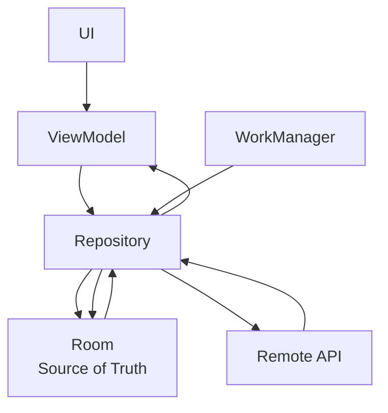
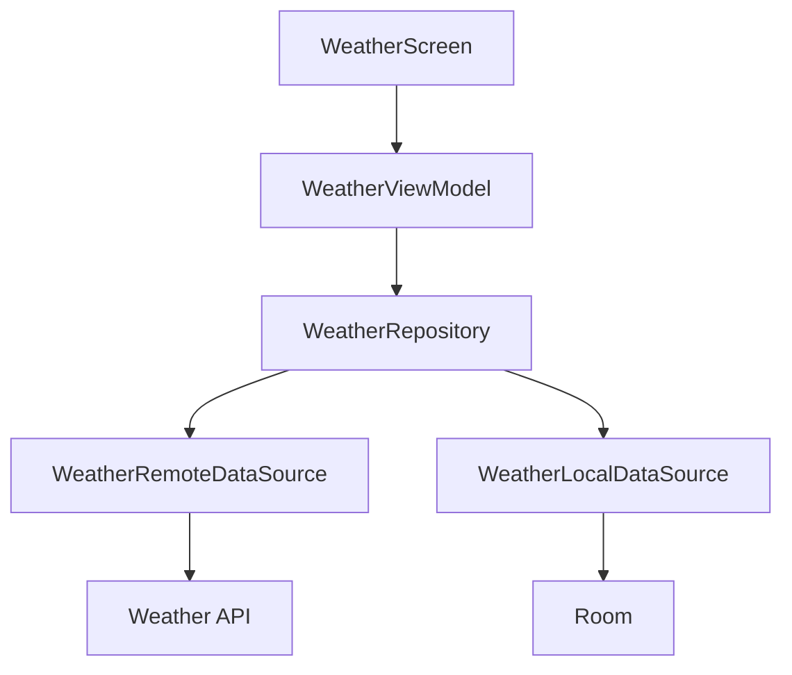

[](https://developer.android.com/topic/architecture/data-layer?utm_source=chatgpt.com)

# 018 — Repository Pattern

| Metadata                | Nội dung                                  |
| ----------------------- | ----------------------------------------- |
| **Học phần**            | 03 — Architecture, State and Data         |
| **Module**              | Module 05 — Design and Architecture       |
| **Nhóm nội dung**       | Design Patterns                           |
| **Nguồn roadmap**       | Design and Architecture / Design Patterns |
| **Loại bài**            | Architecture                              |
| **Thứ tự trong module** | 018                                       |
| **Thời lượng gợi ý**    | 34 phút                                   |

---

## 1. Tóm tắt

**Repository Pattern** là một pattern kiến trúc dùng để tạo ra một **điểm truy cập thống nhất vào dữ liệu của ứng dụng**.

Thay vì để `ViewModel` biết dữ liệu đến từ:

* Retrofit API;
* Room Database;
* DataStore;
* Firebase;
* cache trong RAM;
* file trên thiết bị;

`ViewModel` chỉ giao tiếp với một đối tượng như:

```kotlin
ArticleRepository
```

Repository chịu trách nhiệm quyết định:

```text
Dữ liệu lấy ở đâu?
Có cần gọi API không?
Có dữ liệu cache không?
Nguồn nào là source of truth?
Có cần đồng bộ network → database không?
Dữ liệu DTO/Entity chuyển thành model của app như thế nào?
```

Trong kiến trúc Android được Google khuyến nghị hiện nay, **repository là entry point của Data Layer**; UI layer hoặc Domain Layer không nên truy cập trực tiếp `DAO`, network API hay data source. ([Android Developers][1])

> **Ý tưởng quan trọng nhất**
>
> UI không cần biết **dữ liệu được lưu ở đâu**.
> UI chỉ cần biết **làm thế nào để yêu cầu dữ liệu**.

---

## 2. Mục tiêu học tập

Sau bài này, bạn nên có thể:

* giải thích Repository Pattern bằng ngôn ngữ của mình;
* xác định Repository nằm ở đâu trong Android Architecture;
* phân biệt `Repository`, `DataSource`, `DAO`, `API Service` và `ViewModel`;
* hiểu vì sao ViewModel không nên gọi Retrofit/Room trực tiếp;
* thiết kế Repository có nhiều nguồn dữ liệu;
* sử dụng `Flow` và `suspend` để expose dữ liệu;
* áp dụng **Single Source of Truth**;
* viết `FakeRepository` để unit test ViewModel;
* hiểu vai trò Repository trong offline-first architecture;
* tạo một mini-project Repository Pattern để đưa vào portfolio.

---

# 3. Repository Pattern là gì?

Có thể hiểu Repository như một **trung gian giữa phần sử dụng dữ liệu và nơi dữ liệu thực sự tồn tại**.

Ví dụ app đọc tin tức.

Không sử dụng Repository:

```text
NewsScreen
    ↓
NewsViewModel
    ├── Retrofit API
    ├── Room DAO
    └── SharedPreferences
```

ViewModel bắt đầu phải biết quá nhiều thứ.

Ví dụ:

```kotlin
class NewsViewModel(
    private val api: NewsApi,
    private val dao: NewsDao
) : ViewModel()
```

ViewModel phải tự quyết định:

```text
API thành công?
        ↓
Lưu Room
        ↓
Đọc Room
        ↓
Map dữ liệu
        ↓
Đưa lên UI
```

Đây là trách nhiệm của Data Layer chứ không phải UI Layer.

---

## 4. Khi có Repository

Kiến trúc trở thành:



Android Architecture Guide mô tả Data Layer gồm các Repository; mỗi Repository có thể làm việc với **0 đến nhiều Data Source**. Repository có nhiệm vụ expose dữ liệu, tập trung các thao tác thay đổi dữ liệu, giải quyết xung đột giữa nhiều nguồn và che giấu chi tiết data source khỏi những layer phía trên. ([Android Developers][1])

Dependency direction:

```text
UI
↓
ViewModel
↓
UseCase       ← optional
↓
Repository
↓
DataSource
↓
Room / Retrofit / Firebase / DataStore...
```

Không nên:

```text
ViewModel ───────→ DAO
ViewModel ───────→ Retrofit
Composable ──────→ Repository
Composable ──────→ Database
```

---

# 5. Repository nằm ở đâu trong Android Architecture?

Một kiến trúc phổ biến:



Domain Layer **không bắt buộc** trong mọi ứng dụng. Android hiện khuyến nghị thêm Use Case khi logic cần tái sử dụng giữa nhiều ViewModel hoặc khi ViewModel trở nên phức tạp. ([Android Developers][2])

Với app nhỏ, kiến trúc hoàn toàn có thể chỉ là:

```text
UI
 ↓
ViewModel
 ↓
Repository
 ↓
DataSource
```

Không cần ép thành:

```text
UI
↓
ViewModel
↓
UseCase
↓
Interactor
↓
Gateway
↓
Repository
↓
DataSource
```

nếu các lớp đó chỉ chuyển tiếp một function mà không tạo thêm giá trị.

---

# 6. Repository làm những việc gì?

Theo Android Architecture Guide, Repository thường chịu trách nhiệm cho các nhóm công việc sau. ([Android Developers][1])

### 6.1 Expose dữ liệu

Ví dụ:

```kotlin
interface ArticleRepository {

    fun observeArticles(): Flow<List<Article>>

}
```

UI không quan tâm `Article` đến từ API hay database.

---

### 6.2 Thay đổi dữ liệu

Ví dụ:

```kotlin
suspend fun bookmarkArticle(
    articleId: String,
    bookmarked: Boolean
)
```

ViewModel chỉ gọi:

```kotlin
repository.bookmarkArticle(
    articleId = id,
    bookmarked = true
)
```

Repository quyết định phải:

```text
update database
       +
sync server
       +
update cache
```

hay không.

---

### 6.3 Kết hợp nhiều Data Source

Ví dụ:

```text
              ┌─ REST API
              │
Repository ───┼─ Room
              │
              ├─ DataStore
              │
              └─ Memory Cache
```

Repository có thể quyết định:

```text
Nếu database có dữ liệu
        ↓
trả dữ liệu ngay

Đồng thời
        ↓
refresh API

API trả dữ liệu mới
        ↓
update database

Room phát Flow mới
        ↓
UI tự cập nhật
```

---

### 6.4 Mapping dữ liệu

Network thường trả:

```kotlin
data class ArticleDto(
    val article_id: Long,
    val article_title: String,
    val image_url: String?
)
```

Room có thể lưu:

```kotlin
@Entity
data class ArticleEntity(
    @PrimaryKey
    val id: Long,
    val title: String,
    val imageUrl: String?
)
```

Trong app muốn dùng:

```kotlin
data class Article(
    val id: Long,
    val title: String,
    val imageUrl: String?
)
```

Repository/Data Layer có thể chịu trách nhiệm chuyển đổi:

```text
ArticleDto
    ↓
ArticleEntity
    ↓
Article
```

Việc giữ network model và database model bên trong Data Layer giúp các layer bên ngoài ít bị ảnh hưởng khi cấu trúc API hoặc storage thay đổi. Đây cũng là cách Android mô tả kiến trúc offline-first. ([Android Developers][3])

---

# 7. Repository và Data Source khác nhau như thế nào?

Đây là phần rất dễ nhầm.

| Thành phần      | Trách nhiệm                   |
| --------------- | ----------------------------- |
| **ViewModel**   | Tạo và quản lý UI State       |
| **Use Case**    | Business operation cụ thể     |
| **Repository**  | Điều phối và cung cấp dữ liệu |
| **DataSource**  | Truy cập một nguồn dữ liệu    |
| **DAO**         | Giao tiếp database            |
| **API Service** | Giao tiếp network             |

Ví dụ:

```text
ArticleRepository
│
├── ArticleLocalDataSource
│       ↓
│     ArticleDao
│       ↓
│      Room
│
└── ArticleRemoteDataSource
        ↓
      ArticleApi
        ↓
       HTTP
```

Android Architecture Guide khuyến nghị một Data Source chỉ nên tập trung vào **một nguồn dữ liệu**, chẳng hạn network, database hoặc file. Repository đứng phía trên để phối hợp những nguồn đó. ([Android Developers][1])

---

# 8. Ví dụ thực tế — News App

Giả sử chúng ta xây dựng:

```text
MyNews
```

Màn hình:

```text
NewsScreen
```

Yêu cầu:

1. hiển thị danh sách bài viết;
2. lấy bài mới từ server;
3. lưu bài xuống Room;
4. vẫn đọc được bài cũ khi mất mạng;
5. cho phép bookmark.

---

## 8.1 Model của app

```kotlin
data class Article(
    val id: Long,
    val title: String,
    val description: String,
    val bookmarked: Boolean
)
```

Đây là model mà UI/Domain hiểu.

---

# 9. Remote Data Source

Retrofit service:

```kotlin
interface NewsApi {

    @GET("articles")
    suspend fun getArticles(): List<ArticleDto>
}
```

Network model:

```kotlin
data class ArticleDto(
    val id: Long,
    val title: String,
    val description: String
)
```

Remote Data Source:

```kotlin
class ArticleRemoteDataSource(
    private val api: NewsApi
) {

    suspend fun getArticles(): List<ArticleDto> {
        return api.getArticles()
    }
}
```

Trách nhiệm của nó rất rõ:

```text
ArticleRemoteDataSource
        ↓
      Network
```

Nó không nên quan tâm Compose hay `NewsUiState`.

---

# 10. Local Data Source

Entity:

```kotlin
@Entity(tableName = "articles")
data class ArticleEntity(

    @PrimaryKey
    val id: Long,

    val title: String,

    val description: String,

    val bookmarked: Boolean
)
```

DAO:

```kotlin
@Dao
interface ArticleDao {

    @Query("SELECT * FROM articles")
    fun observeArticles(): Flow<List<ArticleEntity>>

    @Insert(onConflict = OnConflictStrategy.REPLACE)
    suspend fun insertArticles(
        articles: List<ArticleEntity>
    )

    @Query(
        """
        UPDATE articles
        SET bookmarked = :bookmarked
        WHERE id = :articleId
        """
    )
    suspend fun updateBookmark(
        articleId: Long,
        bookmarked: Boolean
    )
}
```

Local Data Source:

```kotlin
class ArticleLocalDataSource(
    private val dao: ArticleDao
) {

    fun observeArticles(): Flow<List<ArticleEntity>> {
        return dao.observeArticles()
    }

    suspend fun saveArticles(
        articles: List<ArticleEntity>
    ) {
        dao.insertArticles(articles)
    }

    suspend fun updateBookmark(
        id: Long,
        bookmarked: Boolean
    ) {
        dao.updateBookmark(id, bookmarked)
    }
}
```

---

# 11. Mapping Model

```kotlin
fun ArticleDto.toEntity(): ArticleEntity {

    return ArticleEntity(
        id = id,
        title = title,
        description = description,
        bookmarked = false
    )
}
```

Entity → domain/app model:

```kotlin
fun ArticleEntity.toArticle(): Article {

    return Article(
        id = id,
        title = title,
        description = description,
        bookmarked = bookmarked
    )
}
```

Architecture:



---

# 12. Repository Interface

Ta tạo boundary:

```kotlin
interface ArticleRepository {

    fun observeArticles(): Flow<List<Article>>

    suspend fun refresh()

    suspend fun setBookmarked(
        articleId: Long,
        bookmarked: Boolean
    )
}
```

ViewModel chỉ cần biết interface này.

```text
NewsViewModel
      ↓
ArticleRepository
```

ViewModel không biết:

```text
Retrofit?
Room?
Firebase?
Mock?
File?
Memory?
```

Đây chính là **abstraction** mà Repository Pattern mang lại.

---

# 13. Repository Implementation

```kotlin
class DefaultArticleRepository(
    private val remoteDataSource: ArticleRemoteDataSource,
    private val localDataSource: ArticleLocalDataSource
) : ArticleRepository {

    override fun observeArticles(): Flow<List<Article>> {

        return localDataSource
            .observeArticles()
            .map { entities ->
                entities.map {
                    it.toArticle()
                }
            }
    }

    override suspend fun refresh() {

        val remoteArticles =
            remoteDataSource.getArticles()

        val entities =
            remoteArticles.map {
                it.toEntity()
            }

        localDataSource.saveArticles(
            entities
        )
    }

    override suspend fun setBookmarked(
        articleId: Long,
        bookmarked: Boolean
    ) {
        localDataSource.updateBookmark(
            articleId,
            bookmarked
        )
    }
}
```

Bây giờ Repository đang điều phối:



---

# 14. Vì sao đọc từ Room thay vì trả thẳng API?

Một kiến trúc offline-first phổ biến là:

```text
API
 ↓
Repository
 ↓
Room
 ↓
Repository Flow
 ↓
ViewModel
 ↓
UI
```

thay vì:

```text
API ──────────────→ UI
       +
Room ─────────────→ UI
```

Khi local storage được chọn làm **canonical source of truth**, higher layers chỉ đọc từ local source. Network dùng để cập nhật local storage; sau đó Room phát dữ liệu mới cho repository và UI. Android sử dụng chính mô hình này trong hướng dẫn offline-first. ([Android Developers][3])

---

# 15. Single Source of Truth

Giả sử API trả:

```text
100 articles
```

Room đang có:

```text
95 articles
```

Nếu ViewModel đọc đồng thời cả hai:

```text
ViewModel
 ├─ API
 └─ Room
```

ta phải xử lý câu hỏi:

```text
API đúng hay Room đúng?
Nếu API lỗi thì sao?
Bookmark local có bị mất không?
Data nào hiển thị trước?
```

Single Source of Truth giúp xác định rõ:

```text
             NETWORK
                │
                │ refresh/sync
                ▼
        ┌──────────────┐
        │ ROOM DATABASE│
        └──────┬───────┘
               │
          Source of Truth
               │
               ▼
          Repository
               │
               ▼
           ViewModel
               │
               ▼
               UI
```

Điều này đặc biệt hữu ích với các ứng dụng cần hoạt động khi mạng yếu hoặc mất mạng. ([Android Developers][3])

---

# 16. Repository + ViewModel

ViewModel:

```kotlin
class NewsViewModel(
    private val repository: ArticleRepository
) : ViewModel() {

    val articles: StateFlow<List<Article>> =
        repository
            .observeArticles()
            .stateIn(
                scope = viewModelScope,
                started =
                    SharingStarted.WhileSubscribed(5_000),
                initialValue = emptyList()
            )

    fun refresh() {

        viewModelScope.launch {

            repository.refresh()
        }
    }

    fun bookmark(
        articleId: Long,
        bookmarked: Boolean
    ) {

        viewModelScope.launch {

            repository.setBookmarked(
                articleId,
                bookmarked
            )
        }
    }
}
```

Luồng trở thành:

```text
UI event
   ↓
ViewModel
   ↓
Repository
   ↓
Data source
   ↓
Repository
   ↓
Flow
   ↓
ViewModel StateFlow
   ↓
Compose
```

Android hiện khuyến nghị Coroutines/Flow để giao tiếp giữa các layer; các thao tác one-shot thường được expose dưới dạng `suspend`, còn dữ liệu thay đổi theo thời gian có thể được expose bằng `Flow`. ([Android Developers][1])

---

# 17. Compose thu thập state

```kotlin
@Composable
fun NewsRoute(
    viewModel: NewsViewModel
) {

    val articles by
        viewModel
            .articles
            .collectAsStateWithLifecycle()

    NewsScreen(
        articles = articles,
        onRefresh = viewModel::refresh
    )
}
```

Compose chỉ biết:

```text
articles
onRefresh()
```

Compose không biết:

```text
Room
Retrofit
SQL
HTTP
JSON
Cache
```

Đó là separation of concerns.

Trong hướng dẫn kiến trúc hiện tại, Android cũng khuyến nghị thu thập UI state theo cách lifecycle-aware như `collectAsStateWithLifecycle()`. ([Android Developers][2])

---

# 18. Repository và Unidirectional Data Flow

Repository Pattern rất phù hợp với **UDF — Unidirectional Data Flow**.



Có thể ghi nhớ:

```text
Events ↓

UI
↓
ViewModel
↓
Repository
↓
Data

State ↑

Data
↑
Repository
↑
ViewModel
↑
UI
```

---

# 19. Repository không phải Database Wrapper

Sai lầm phổ biến:

```kotlin
class UserRepository(
    private val dao: UserDao
) {

    fun getUsers() =
        dao.getUsers()

    fun getUser(id: Long) =
        dao.getUser(id)

    fun deleteUser(id: Long) =
        dao.deleteUser(id)
}
```

Repository lúc này gần như chỉ đổi tên DAO.

Điều đó không phải lúc nào cũng sai, đặc biệt với app nhỏ, nhưng giá trị thực sự của Repository xuất hiện khi nó trở thành **boundary của Data Layer**.

Ví dụ:

```kotlin
suspend fun login(
    email: String,
    password: String
): LoginResult {

    val response =
        remote.login(
            email,
            password
        )

    local.saveUser(
        response.user
    )

    tokenStore.save(
        response.token
    )

    return response.toResult()
}
```

Một operation:

```text
login()
```

ẩn phía sau:

```text
Network
+
Database
+
Token Storage
+
Mapping
```

---

# 20. Repository không phải Use Case

Ví dụ:

```text
Repository
```

trả lời:

> Làm thế nào để lấy và thay đổi dữ liệu?

Trong khi:

```text
Use Case
```

trả lời:

> Business operation mà người dùng đang thực hiện là gì?

Ví dụ:

```kotlin
class PurchaseProductUseCase(
    private val productRepository: ProductRepository,
    private val orderRepository: OrderRepository,
    private val paymentRepository: PaymentRepository
)
```

Use case:

```text
Purchase Product
      ↓
check stock
      ↓
create order
      ↓
payment
      ↓
update inventory
```

Trong khi các repository có thể là:

```text
ProductRepository
OrderRepository
PaymentRepository
```

---

# 21. Naming Convention

Repository nên được đặt theo **loại dữ liệu mà nó quản lý**.

Ví dụ:

```text
UserRepository
ArticleRepository
MovieRepository
PaymentRepository
ProductRepository
OrderRepository
SettingsRepository
```

Thay vì:

```text
NetworkRepository
RoomRepository
RetrofitRepository
DatabaseRepository
```

Bởi vì Repository thể hiện abstraction của **application data**, không phải abstraction của công nghệ lưu trữ. Android Architecture Guide cũng sử dụng quy ước kiểu `NewsRepository`, `MoviesRepository`, `PaymentsRepository`. ([Android Developers][1])

---

# 22. Folder Structure

Một app nhỏ:

```text
com.example.news
│
├── data
│   │
│   ├── local
│   │   ├── ArticleDao.kt
│   │   ├── ArticleEntity.kt
│   │   └── ArticleLocalDataSource.kt
│   │
│   ├── remote
│   │   ├── NewsApi.kt
│   │   ├── ArticleDto.kt
│   │   └── ArticleRemoteDataSource.kt
│   │
│   ├── mapper
│   │   └── ArticleMapper.kt
│   │
│   └── repository
│       └── DefaultArticleRepository.kt
│
├── domain
│   │
│   ├── model
│   │   └── Article.kt
│   │
│   └── repository
│       └── ArticleRepository.kt
│
└── ui
    └── news
        ├── NewsScreen.kt
        ├── NewsUiState.kt
        └── NewsViewModel.kt
```

Nếu không cần Domain Layer riêng:

```text
data/
├── repository/
│   ├── ArticleRepository.kt
│   └── DefaultArticleRepository.kt
├── local/
└── remote/

ui/
└── news/
```

Không cần tạo nhiều module chỉ để “trông giống Clean Architecture”.

---

# 23. Repository và Dependency Injection

Thay vì:

```kotlin
class NewsViewModel : ViewModel() {

    private val repository =
        DefaultArticleRepository(
            ArticleRemoteDataSource(...),
            ArticleLocalDataSource(...)
        )
}
```

nên inject dependency:

```kotlin
class NewsViewModel(
    private val repository: ArticleRepository
) : ViewModel()
```

Dependency graph:



Dependency Injection giúp thay thế implementation thật bằng fake/mock trong test. Tài liệu Android cũng sử dụng ví dụ `ViewModel → Repository` để giải thích lợi ích này và khuyến nghị Hilt khi phù hợp thay vì tự quản lý dependency graph lớn bằng tay. ([Android Developers][4])

---

# 24. Ví dụ với Hilt

```kotlin
@Module
@InstallIn(SingletonComponent::class)
abstract class RepositoryModule {

    @Binds
    @Singleton
    abstract fun bindArticleRepository(
        implementation:
            DefaultArticleRepository
    ): ArticleRepository
}
```

Implementation:

```kotlin
@Singleton
class DefaultArticleRepository @Inject constructor(
    private val remoteDataSource:
        ArticleRemoteDataSource,
    private val localDataSource:
        ArticleLocalDataSource
) : ArticleRepository
```

ViewModel:

```kotlin
@HiltViewModel
class NewsViewModel @Inject constructor(
    private val repository:
        ArticleRepository
) : ViewModel()
```

---

# 25. Testing — lợi ích lớn của Repository

Giả sử ViewModel gọi trực tiếp Retrofit:

```kotlin
class NewsViewModel(
    private val api: NewsApi
)
```

Test có thể bị phụ thuộc vào:

```text
HTTP
network
JSON
server
```

Nhưng nếu ViewModel phụ thuộc:

```kotlin
ArticleRepository
```

ta có thể tạo:

```kotlin
class FakeArticleRepository :
    ArticleRepository {

    private val articles =
        MutableStateFlow<List<Article>>(
            emptyList()
        )

    override fun observeArticles():
        Flow<List<Article>> {
        return articles
    }

    override suspend fun refresh() {

        articles.value =
            listOf(
                Article(
                    id = 1,
                    title = "Repository Pattern",
                    description =
                        "Android architecture",
                    bookmarked = false
                )
            )
    }

    override suspend fun setBookmarked(
        articleId: Long,
        bookmarked: Boolean
    ) {

        articles.update { current ->

            current.map { article ->

                if (article.id == articleId) {
                    article.copy(
                        bookmarked = bookmarked
                    )
                } else {
                    article
                }
            }
        }
    }
}
```

Test:

```kotlin
@Test
fun refresh_updatesArticles() = runTest {

    val repository =
        FakeArticleRepository()

    val viewModel =
        NewsViewModel(repository)

    viewModel.refresh()

    advanceUntilIdle()

    assertEquals(
        "Repository Pattern",
        viewModel.articles.value.first().title
    )
}
```

Dependency injection cho phép test ViewModel bằng repository giả thay cho implementation thực, chính là một trong những lợi ích được Android Architecture Guide nhấn mạnh. ([Android Developers][4])

---

# 26. Test Repository riêng

Ngoài ViewModel, Repository cũng cần test.

Ta có thể fake Data Source:

```text
FakeRemoteDataSource
        ↓
DefaultArticleRepository
        ↓
FakeLocalDataSource
```

Test:

```text
Given:
Remote trả 3 articles

When:
repository.refresh()

Then:
LocalDataSource phải nhận 3 articles
```

Ví dụ:

```kotlin
@Test
fun refresh_savesRemoteArticlesLocally() =
    runTest {

        val remote =
            FakeRemoteDataSource(
                articles =
                    listOf(
                        ArticleDto(
                            id = 1,
                            title = "Android",
                            description = "..."
                        )
                    )
            )

        val local =
            FakeLocalDataSource()

        val repository =
            DefaultArticleRepository(
                remote,
                local
            )

        repository.refresh()

        assertEquals(
            1,
            local.savedArticles.size
        )
    }
```

---

# 27. Error Handling

Repository cũng là nơi phù hợp để chuyển lỗi infrastructure thành lỗi mà app hiểu được.

Ví dụ:

```text
SocketTimeoutException
HttpException
IOException
SQLiteException
```

không nhất thiết phải rò rỉ lên UI.

Có thể tạo:

```kotlin
sealed interface DataError {

    data object Network :
        DataError

    data object Server :
        DataError

    data object Storage :
        DataError

    data object Unknown :
        DataError
}
```

Repository:

```kotlin
suspend fun refresh():
    Result<Unit>
```

hoặc custom type:

```kotlin
sealed interface RefreshResult {

    data object Success :
        RefreshResult

    data class Error(
        val error: DataError
    ) : RefreshResult
}
```

Sau đó ViewModel chuyển:

```text
DataError.Network
```

thành:

```text
NewsUiState.NoInternet
```

UI không cần biết:

```text
java.net.UnknownHostException
```

là gì.

---

# 28. Repository và Offline-first

Repository Pattern cực kỳ quan trọng khi app cần hoạt động offline.

Kiến trúc:



Ví dụ người dùng đang đi tàu và mất mạng:

```text
Network unavailable
       ↓
Repository không lấy được API
       ↓
Room vẫn có cache
       ↓
Flow vẫn emit
       ↓
UI vẫn hiển thị dữ liệu
```

Khi có mạng:

```text
Internet restored
      ↓
Repository refresh/sync
      ↓
API
      ↓
Room
      ↓
Flow
      ↓
UI update
```

Android mô tả offline-first repository với ít nhất local và network source cho repository cần network, đồng thời khuyến nghị local source đóng vai trò canonical source of truth cho việc đọc. ([Android Developers][3])

---

# 29. Repository có liên quan Lifecycle không?

Repository **không nên phụ thuộc vào lifecycle của Activity/Fragment**.

Không nên:

```kotlin
class UserRepository(
    private val activity: Activity
)
```

hoặc:

```kotlin
class NewsRepository(
    private val fragment: Fragment
)
```

Repository thuộc Data Layer.

Lifecycle UI nên được xử lý ở:

```text
Composable
Activity
Fragment
ViewModel
```

Ví dụ:

```text
Repository
    ↓ Flow

ViewModel
    ↓ StateFlow

Composable
    ↓ collectAsStateWithLifecycle()
```

Do đó rotate screen không làm Repository phải biết:

```text
Activity destroyed
Activity recreated
Fragment stopped
```

---

# 30. Repository có giữ State không?

Có thể, nhưng phải phân biệt loại state.

### Application/Data state

Có thể nằm ở:

```text
Repository
Room
DataStore
Memory cache
```

Ví dụ:

```text
CurrentUser
Cart
CachedArticles
Authentication token
```

### UI state

Nên nằm ở ViewModel/state holder.

Ví dụ:

```text
Loading spinner
Selected tab
Search query
Dialog visibility
Validation error
```

Không nên biến Repository thành:

```kotlin
class ArticleRepository {

    var showLoadingDialog = false

    var selectedTab = 1

    var showSnackbar = false
}
```

Đây là UI state, không phải data state.

---

# 31. Repository có phải luôn cần Interface?

Không có quy tắc rằng mọi Repository bắt buộc phải có:

```text
Interface
+
Implementation
```

Một project nhỏ hoàn toàn có thể bắt đầu bằng:

```kotlin
class ArticleRepository(...)
```

Khi cần:

```text
nhiều implementation
testing boundary
module boundary
dependency inversion
```

thì tạo:

```text
ArticleRepository
        ↑
DefaultArticleRepository
        ↑
FakeArticleRepository
```

Điều quan trọng là **boundary rõ**, không phải số lượng file.

---

# 32. Sai lầm thường gặp

## 32.1 ViewModel gọi Retrofit trực tiếp

```kotlin
class ViewModel(
    private val api: NewsApi
)
```

Dẫn đến:

```text
UI Layer
   ↓
Infrastructure
```

Boundary bị phá vỡ.

---

## 32.2 ViewModel gọi DAO trực tiếp

```kotlin
class ViewModel(
    private val dao: ArticleDao
)
```

Sau này thêm network:

```text
ViewModel
├── DAO
└── API
```

ViewModel nhanh chóng trở thành nơi điều phối toàn bộ app.

---

## 32.3 Repository trả DTO lên UI

Không nên:

```kotlin
Flow<List<ArticleDto>>
```

UI lúc này phụ thuộc network model.

Nên:

```kotlin
Flow<List<Article>>
```

---

## 32.4 Một Repository quản lý mọi thứ

Ví dụ:

```text
AppRepository
├── Login
├── Product
├── Cart
├── Payment
├── News
├── Profile
├── Settings
└── Analytics
```

Đây gần như là một **God Object**.

Nên tách:

```text
AuthRepository
ProductRepository
CartRepository
PaymentRepository
UserRepository
SettingsRepository
```

---

## 32.5 Repository chứa UI logic

Không nên:

```kotlin
repository.showSnackbar()
```

hoặc:

```kotlin
repository.navigateToLogin()
```

Navigation và UI effect thuộc UI Layer.

---

## 32.6 Repository biết Activity

Không nên:

```kotlin
class Repository(
    val activity: MainActivity
)
```

Data Layer không nên phụ thuộc UI Layer.

---

# 33. Repository Pattern ảnh hưởng gì đến UX?

Repository Pattern nghe có vẻ chỉ là architecture, nhưng nó ảnh hưởng trực tiếp UX.

Ví dụ với app không cache:

```text
Open screen
    ↓
Loading
    ↓
Wait API
    ↓
5 seconds
    ↓
Show content
```

Với Repository + Room cache:

```text
Open screen
    ↓
Room
    ↓
Show cached content ngay
    ↓
Refresh network background
    ↓
Update content
```

Offline-first architecture có thể giúp app hiển thị local data ngay cả khi mạng chậm hoặc gián đoạn, thay vì luôn buộc người dùng chờ request đầu tiên. ([Android Developers][3])

---

# 34. Repository Pattern ảnh hưởng maintainability thế nào?

Giả sử ban đầu dùng:

```text
Retrofit
```

Sau này chuyển:

```text
GraphQL
```

Nếu UI gọi Retrofit trực tiếp:

```text
20 ViewModels
     ↓
Retrofit
```

có thể phải sửa rất nhiều nơi.

Nếu có:

```text
20 ViewModels
     ↓
Repository
     ↓
Retrofit
```

thì chủ yếu thay đổi phía sau boundary:

```text
Repository
   ↓
GraphQL
```

ViewModel vẫn gọi:

```kotlin
repository.observeArticles()
```

---

# 35. Repository và Performance

Repository cũng là nơi có thể áp dụng:

```text
Memory cache
Disk cache
Network cache
Deduplicate request
Pagination
Synchronization
Batch update
```

Ví dụ:

```text
Screen A ──┐
           │
Screen B ──┼── Repository ── Cache
           │
Screen C ──┘
```

thay vì mỗi màn hình tự gọi:

```text
API
API
API
```

Tuy nhiên không nên biến Repository thành “nơi nhét mọi optimization”. Optimization vẫn cần trách nhiệm và measurement rõ ràng.

---

# 36. Repository và Paging 3

Với danh sách rất lớn:

```text
Repository
    ↓
Pager
    ↓
PagingData
    ↓
ViewModel
    ↓
LazyColumn
```

Với network + Room:

```text
API
 ↓
RemoteMediator
 ↓
Room
 ↓
PagingSource
 ↓
Repository
 ↓
ViewModel
 ↓
UI
```

Android Paging cũng được thiết kế theo các layer Repository → ViewModel → UI. ([Android Developers][5])

---

# 37. Mental Model cần nhớ

Hãy tưởng tượng Repository như **quầy lễ tân của kho dữ liệu**.

UI nói:

```text
"Tôi cần danh sách bài viết."
```

Repository trả:

```text
"Được."
```

UI không cần chạy xuống hỏi:

```text
Server ở đâu?
SQL table tên gì?
Cache còn hạn không?
API endpoint nào?
JSON field tên gì?
```

Repository xử lý các chi tiết đó.

```text
             ┌───────────────┐
             │      UI       │
             └───────┬───────┘
                     │
             "Get articles"
                     │
                     ▼
             ┌───────────────┐
             │  Repository   │
             └───┬───────┬───┘
                 │       │
            Network     Local
                 │       │
               API      Room
```

---

# 38. Thực hành

## Bài thực hành — Weather Repository

Tạo app:

```text
Weather App
```

Yêu cầu:

```text
WeatherScreen
     ↓
WeatherViewModel
     ↓
WeatherRepository
     ↓
┌──────────────┬──────────────┐
│              │              │
WeatherApi     Room        DataStore
```

Repository API:

```kotlin
interface WeatherRepository {

    fun observeWeather():
        Flow<Weather>

    suspend fun refreshWeather()

    suspend fun setCity(
        city: String
    )
}
```

---

## Bước 1 — Vẽ dependency graph



---

## Bước 2 — Refactor

Tìm code kiểu:

```kotlin
viewModelScope.launch {

    val response =
        weatherApi.getWeather()

    weatherDao.insert(
        response.toEntity()
    )
}
```

và chuyển thành:

```kotlin
repository.refreshWeather()
```

---

## Bước 3 — Fake Repository

Tạo:

```kotlin
FakeWeatherRepository
```

cho test.

---

## Bước 4 — Offline test

Thử:

```text
1. Có mạng → tải weather.
2. Tắt mạng.
3. Kill app.
4. Mở lại.
5. Weather cũ vẫn xuất hiện.
```

Nếu làm được bước này, bạn đã hiểu khá rõ giá trị thực tế của Repository Pattern.

---

# 39. Bài tập

## Bài 1 — Basic

Tạo:

```text
TodoRepository
```

với:

```kotlin
fun observeTasks():
    Flow<List<Task>>

suspend fun addTask(
    task: Task
)

suspend fun deleteTask(
    id: Long
)
```

Data source:

```text
Room
```

---

## Bài 2 — Intermediate

Thêm:

```text
Remote API
```

Architecture:

```text
TodoRepository
├── TodoLocalDataSource
└── TodoRemoteDataSource
```

---

## Bài 3 — Advanced

Implement:

```text
Offline-first
```

Flow:

```text
Network
 ↓
Room
 ↓
Repository
 ↓
ViewModel
 ↓
UI
```

Yêu cầu:

```text
✓ offline read
✓ refresh
✓ loading
✓ error
✓ retry
✓ fake repository
✓ unit test
```

---

# 40. Artifact để đưa vào Portfolio

Một artifact tốt cho bài này có thể là:

```text
repository-pattern-demo/
│
├── README.md
│
├── architecture.png
│
├── app/
│
│   └── data/
│       ├── local/
│       ├── remote/
│       └── repository/
│
└── screenshots/
    ├── online.png
    └── offline.png
```

README nên trình bày:

```markdown
## Architecture

UI
↓
ViewModel
↓
Repository
↓
Local / Remote Data Source

## Features

- Repository Pattern
- Room
- Retrofit
- Flow
- StateFlow
- Dependency Injection
- Offline cache
- Fake Repository
- Unit Tests
```

Một demo **online → cache → offline** thuyết phục hơn nhiều so với chỉ tạo interface `Repository` nhưng không chứng minh nó giải quyết vấn đề gì.

---

# 41. Checklist hoàn thành

### Kiến thức

* [ ] Giải thích được Repository Pattern.
* [ ] Biết Repository nằm trong Data Layer.
* [ ] Phân biệt Repository và DataSource.
* [ ] Phân biệt Repository và UseCase.
* [ ] Hiểu Single Source of Truth.
* [ ] Hiểu Repository + UDF.

### Code

* [ ] ViewModel không gọi Retrofit trực tiếp.
* [ ] ViewModel không gọi Room DAO trực tiếp.
* [ ] Repository expose model phù hợp cho app.
* [ ] One-shot operation dùng API bất đồng bộ như `suspend`.
* [ ] Reactive data có thể expose bằng `Flow`.
* [ ] Mapping DTO / Entity / application model rõ ràng.

### Testing

* [ ] Có `FakeRepository`.
* [ ] Test được ViewModel không cần network.
* [ ] Repository có thể test bằng fake DataSource.
* [ ] Có test error case.

### Production

* [ ] Network error được xử lý.
* [ ] Storage error được xử lý.
* [ ] Có chiến lược cache rõ ràng.
* [ ] Xác định source of truth.
* [ ] Không giữ `Activity`/`Fragment` trong Repository.
* [ ] Kiểm tra behavior khi offline.
* [ ] Kiểm tra refresh và retry.
* [ ] Không để một Repository trở thành God Object.

---

# 42. Câu hỏi phỏng vấn

### Repository Pattern dùng để làm gì?

Repository tạo abstraction giữa phần sử dụng dữ liệu và các nguồn dữ liệu cụ thể, giúp UI/Domain không phụ thuộc trực tiếp database, network hay storage implementation.

### ViewModel có nên gọi Retrofit trực tiếp không?

Trong kiến trúc Android phân tầng được khuyến nghị, không. ViewModel nên truy cập application data thông qua Data Layer/Repository thay vì phụ thuộc trực tiếp vào network data source. ([Android Developers][2])

### Repository và DAO khác nhau thế nào?

```text
DAO
↓
Database access

Repository
↓
Application data abstraction
↓
Có thể phối hợp DAO + API + cache + mapping
```

### Một Repository có thể có nhiều DataSource không?

Có.

```text
UserRepository
├── UserRemoteDataSource
├── UserLocalDataSource
└── UserPreferencesDataSource
```

Repository trong Android Data Layer được thiết kế để có thể quản lý từ không đến nhiều data source tùy loại dữ liệu. ([Android Developers][1])

### Repository có phải luôn dùng Room + Retrofit không?

Không.

Có thể chỉ có:

```text
SettingsRepository
    ↓
DataStore
```

hoặc:

```text
LocationRepository
    ↓
LocationProvider
```

Android hiện thậm chí khuyến nghị tạo repository ngay cả khi repository chỉ có một data source, nhằm giữ boundary của Data Layer rõ ràng. ([Android Developers][2])

---

# 43. Ghi nhớ nhanh

```text
┌─────────────────────────────┐
│             UI              │
│       Compose Screen        │
└──────────────┬──────────────┘
               │
               ▼
┌─────────────────────────────┐
│         ViewModel           │
│          UI State           │
└──────────────┬──────────────┘
               │
               ▼
┌─────────────────────────────┐
│         Repository          │
│  "Dữ liệu lấy từ đâu?"      │
└───────┬─────────────┬───────┘
        │             │
        ▼             ▼
┌─────────────┐ ┌─────────────┐
│ Local Data  │ │ Remote Data │
│   Source    │ │   Source    │
└──────┬──────┘ └──────┬──────┘
       │               │
       ▼               ▼
     Room            Retrofit
```

Công thức cần nhớ:

```text
UI
không biết
database/network

        ↓

ViewModel
không biết
database/network

        ↓

Repository
che giấu và điều phối
database/network

        ↓

DataSource
truy cập nguồn dữ liệu thật
```

> **Repository Pattern = một API dữ liệu sạch ở phía trước, nhiều chi tiết implementation được che giấu ở phía sau.**

Đây là lý do pattern này trở thành một trong những thành phần trung tâm của **Data Layer trong kiến trúc Android hiện đại**. ([Android Developers][1])

[1]: https://developer.android.com/topic/architecture/data-layer "Data layer  |  App architecture  |  Android Developers"
[2]: https://developer.android.com/topic/architecture/recommendations "Recommendations for Android architecture  |  App architecture  |  Android Developers"
[3]: https://developer.android.com/topic/architecture/data-layer/offline-first "Build an offline-first app  |  App architecture  |  Android Developers"
[4]: https://developer.android.com/training/dependency-injection/manual "Manual dependency injection  |  App architecture  |  Android Developers"
[5]: https://developer.android.com/topic/libraries/architecture/paging/v3-overview?utm_source=chatgpt.com "Paging library overview | App architecture - Android Developers"
