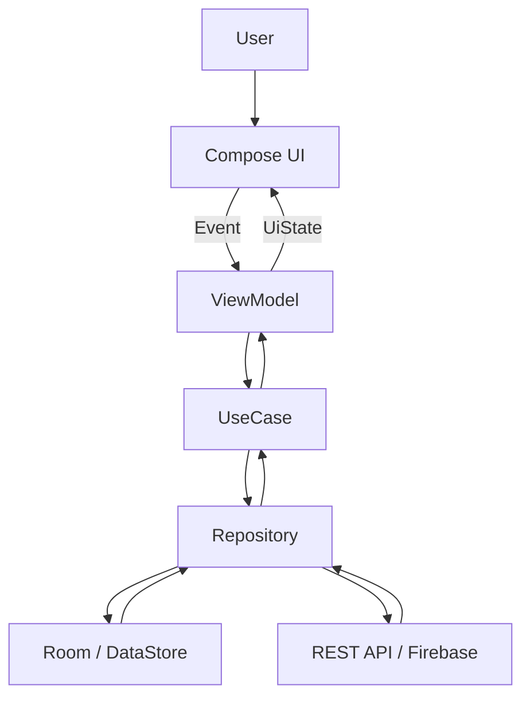
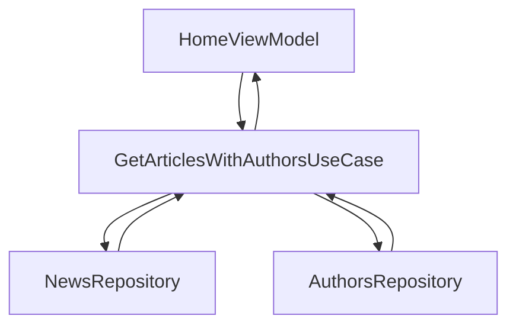
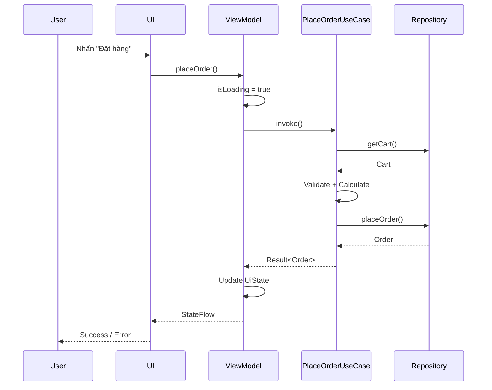
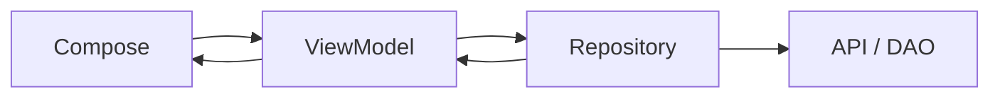
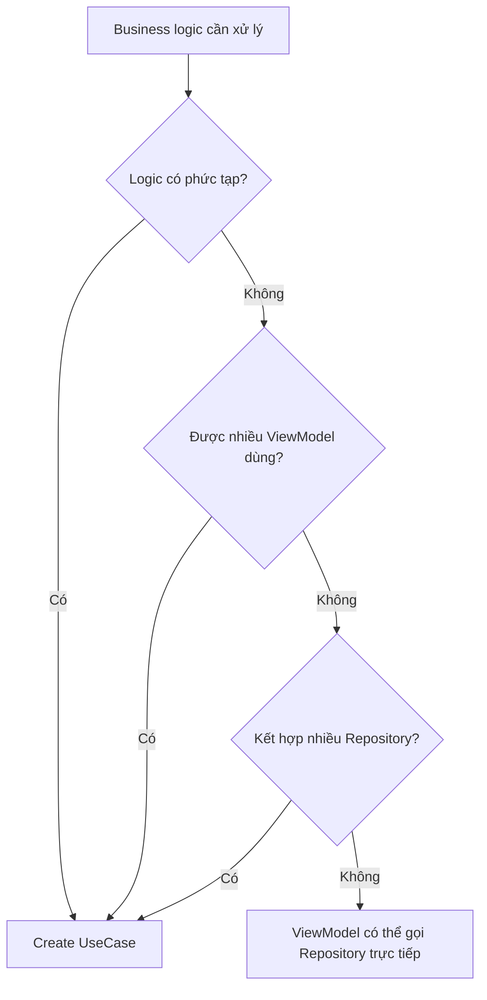
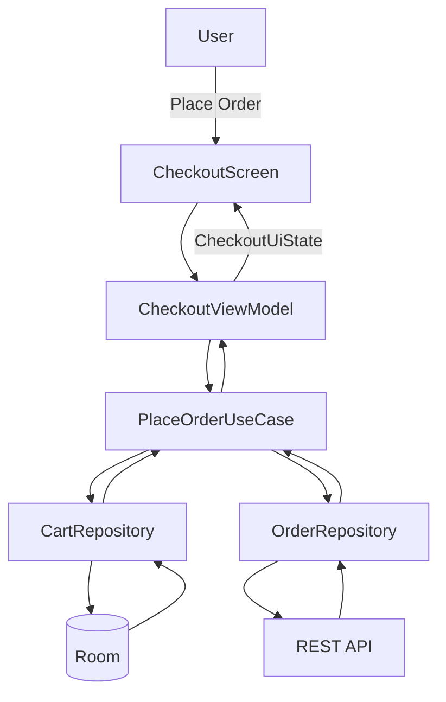

[](https://developer.android.com/topic/architecture/domain-layer?utm_source=chatgpt.com)

# 019 — UseCase Pattern

> **Học phần:** 03 — Architecture, State and Data
> **Module:** Module 05 — Design and Architecture
> **Nhóm nội dung:** Design Patterns
> **Nguồn roadmap:** Design and Architecture / Design Patterns
> **Loại bài:** Architecture
> **Thứ tự trong module:** 019
> **Thời lượng gợi ý:** 34 phút

---

## 1. Tóm tắt

**UseCase Pattern** là cách đóng gói một **hành động nghiệp vụ cụ thể** của ứng dụng thành một class riêng.

Ví dụ:

```text
Đăng nhập
Đăng xuất
Đặt hàng
Bookmark bài viết
Lấy danh sách tin mới nhất
Tính giá sau khuyến mãi
Kiểm tra người dùng có Premium hay không
```

Trong kiến trúc Android, UseCase thường nằm trong **Domain Layer**, ở giữa `ViewModel` và `Repository`:

```text
UI
 ↓
ViewModel
 ↓
UseCase
 ↓
Repository
 ↓
API / DAO / DataStore
```

Tuy nhiên, **Domain Layer và UseCase không bắt buộc phải có trong mọi ứng dụng**. Android hiện khuyến nghị thêm domain layer khi business logic đủ phức tạp hoặc cần được tái sử dụng giữa nhiều ViewModel. Một ứng dụng đơn giản hoàn toàn có thể dùng trực tiếp `ViewModel → Repository`. ([Android Developers][1])

---

# 2. Mục tiêu học tập

Sau bài này, anh nên có thể:

* giải thích UseCase bằng ngôn ngữ của mình;
* hiểu UseCase nằm ở đâu trong kiến trúc Android;
* phân biệt `ViewModel`, `UseCase` và `Repository`;
* biết **khi nào nên** tạo UseCase;
* biết **khi nào không nên** tạo UseCase;
* áp dụng Single Responsibility cho UseCase;
* dùng `operator fun invoke()` trong Kotlin;
* kết hợp nhiều Repository trong một UseCase;
* xử lý coroutine, Flow và threading đúng tầng;
* viết unit test cho UseCase bằng Fake Repository;
* tránh tạo hàng chục UseCase chỉ làm nhiệm vụ chuyển tiếp;
* xây dựng một artifact kiến trúc nhỏ để đưa vào portfolio.

Android định nghĩa domain layer là một tầng tùy chọn, chủ yếu để đóng gói logic nghiệp vụ phức tạp hoặc logic đơn giản nhưng được nhiều ViewModel tái sử dụng. ([Android Developers][1])

---

# 3. UseCase là gì?

Một định nghĩa ngắn gọn:

> **UseCase là một class đại diện cho một hành động hoặc một quy tắc nghiệp vụ mà ứng dụng có thể thực hiện.**

Ví dụ ứng dụng thương mại điện tử:

```text
LoginUseCase
GetProductsUseCase
AddProductToCartUseCase
ApplyCouponUseCase
PlaceOrderUseCase
CancelOrderUseCase
```

Mỗi class trả lời một câu hỏi:

```text
Ứng dụng đang muốn làm gì?
```

Ví dụ:

```kotlin
class AddProductToCartUseCase(
    private val cartRepository: CartRepository
) {

    suspend operator fun invoke(
        productId: String
    ) {
        cartRepository.addProduct(productId)
    }
}
```

UI không cần biết:

```text
Cart lưu bằng Room?
Cart nằm trên server?
Có cache không?
API endpoint nào?
```

Nó chỉ biết:

```text
Add product to cart
```

---

# 4. Vị trí của UseCase trong kiến trúc

Kiến trúc thường gặp:



Android mô tả kiến trúc cơ bản tối thiểu gồm **UI Layer + Data Layer**. Domain Layer có thể được thêm vào giữa chúng khi cần giảm độ phức tạp hoặc tái sử dụng logic. ([Android Developers][2])

---

# 5. Dependency direction

Nếu sử dụng UseCase:

```text
Presentation
     │
     ▼
Domain
     │
     ▼
Data
```

Chi tiết:

```text
Composable
     │
     ▼
ViewModel
     │
     ▼
UseCase
     │
     ▼
Repository
     │
     ├── API
     │
     ├── Room
     │
     └── DataStore
```

UseCase thông thường **phụ thuộc vào Repository**, còn `ViewModel` phụ thuộc vào UseCase. Android cũng cho phép một UseCase sử dụng UseCase khác khi logic đó thực sự có khả năng tái sử dụng. ([Android Developers][1])

---

# 6. Mental model quan trọng

Hãy nhớ ba câu hỏi:

```text
ViewModel
→ UI cần trạng thái gì?

UseCase
→ Nghiệp vụ cần thực hiện điều gì?

Repository
→ Dữ liệu lấy/lưu ở đâu?
```

Ví dụ chức năng:

> Người dùng đặt hàng.

### ViewModel

Quan tâm:

```text
Loading?
Success?
Error?
Button enabled?
```

### UseCase

Quan tâm:

```text
Có sản phẩm không?
Người dùng đăng nhập chưa?
Coupon hợp lệ không?
Có đủ điều kiện đặt hàng không?
Thực hiện quy trình đặt hàng như thế nào?
```

### Repository

Quan tâm:

```text
Cart lấy từ đâu?
Order lưu ở đâu?
API gọi endpoint nào?
Có cache không?
```

---

# 7. UseCase không phải Repository

Đây là điểm rất dễ nhầm.

## Repository

Repository quản lý **data**.

Ví dụ:

```kotlin
interface UserRepository {

    suspend fun getUser(): User

    suspend fun login(
        email: String,
        password: String
    ): User

    suspend fun logout()
}
```

Repository có thể quản lý:

```text
Network
Database
Cache
DataStore
Synchronization
Source of Truth
```

Android khuyến nghị các thành phần UI hoặc ViewModel không truy cập trực tiếp data source như database, Firebase, DataStore hoặc network provider mà nên thông qua repository. ([Android Developers][3])

---

## UseCase

UseCase mô tả **một nghiệp vụ**.

```kotlin
class LoginUseCase(
    private val userRepository: UserRepository
) {

    suspend operator fun invoke(
        email: String,
        password: String
    ): User {

        require(email.isNotBlank()) {
            "Email cannot be empty"
        }

        return userRepository.login(
            email = email.trim(),
            password = password
        )
    }
}
```

---

# 8. So sánh ViewModel — UseCase — Repository

| Thành phần   | Trách nhiệm chính                  |
| ------------ | ---------------------------------- |
| `Composable` | Hiển thị UI                        |
| `ViewModel`  | Quản lý và tạo UI State            |
| `UseCase`    | Thực thi một nghiệp vụ             |
| `Repository` | Quản lý application data           |
| `DataSource` | Làm việc trực tiếp với API/DB/file |

Có thể hình dung:

```text
ViewModel
    ↓
"What should the screen show?"

UseCase
    ↓
"What business action should happen?"

Repository
    ↓
"How do I get/change the data?"

DataSource
    ↓
"Talk to the actual system"
```

---

# 9. Một UseCase chỉ nên làm một việc

Android hướng dẫn mỗi UseCase nên chịu trách nhiệm cho **một functionality duy nhất** và không nên chứa mutable state. ([Android Developers][1])

### Tốt

```text
LoginUseCase
LogoutUserUseCase
GetLatestNewsUseCase
BookmarkArticleUseCase
CalculateShippingUseCase
```

### Không tốt

```text
UserUseCase
AppUseCase
CommonUseCase
EverythingUseCase
```

Ví dụ class này có dấu hiệu sai:

```kotlin
class UserUseCase {

    fun login() {}

    fun logout() {}

    fun register() {}

    fun updateProfile() {}

    fun deleteAccount() {}

    fun changePassword() {}

    fun uploadAvatar() {}
}
```

Nó đang trở thành:

```text
God Object
```

thay vì một UseCase.

---

# 10. Naming convention

Android documentation sử dụng convention:

```text
Verb + Noun + UseCase
```

Ví dụ chính thức:

```text
FormatDateUseCase
LogOutUserUseCase
GetLatestNewsWithAuthorsUseCase
MakeLoginRequestUseCase
```

([Android Developers][1])

Trong project thực tế có thể dùng:

```text
GetProductsUseCase
ObserveCartUseCase
PlaceOrderUseCase
DeleteAccountUseCase
CalculateDiscountUseCase
SearchProductsUseCase
```

Tên class nhìn vào là biết:

> Nghiệp vụ này thực hiện việc gì?

---

# 11. `operator fun invoke()`

Một convention rất phổ biến với UseCase Kotlin là định nghĩa:

```kotlin
operator fun invoke()
```

Ví dụ:

```kotlin
class GetUserUseCase(
    private val repository: UserRepository
) {

    suspend operator fun invoke(): User {
        return repository.getUser()
    }
}
```

Thay vì:

```kotlin
getUserUseCase.execute()
```

ta viết:

```kotlin
getUserUseCase()
```

Android documentation cũng minh họa UseCase theo cách này. `invoke()` có thể nhận nhiều parameter và trả bất kỳ kiểu dữ liệu phù hợp nào. ([Android Developers][1])

---

# 12. UseCase có thể là `suspend`

Ví dụ một action:

```kotlin
class LogoutUseCase(
    private val repository: UserRepository
) {

    suspend operator fun invoke() {
        repository.logout()
    }
}
```

ViewModel:

```kotlin
fun logout() {
    viewModelScope.launch {

        logoutUseCase()

    }
}
```

Luồng:

```text
User click Logout
       ↓
ViewModel
       ↓
LogoutUseCase
       ↓
UserRepository
       ↓
Data source
```

---

# 13. UseCase cũng có thể trả `Flow`

Không phải UseCase nào cũng chỉ trả một giá trị.

Ví dụ:

```kotlin
class ObserveCartUseCase(
    private val cartRepository: CartRepository
) {

    operator fun invoke(): Flow<Cart> {
        return cartRepository.observeCart()
    }
}
```

ViewModel:

```kotlin
val cartUiState =
    observeCartUseCase()
        .map { cart ->
            CartUiState.Success(cart)
        }
        .stateIn(
            scope = viewModelScope,
            started = SharingStarted.WhileSubscribed(5_000),
            initialValue = CartUiState.Loading
        )
```

Hướng dẫn kiến trúc Android hiện khuyến nghị `Flow` cho dữ liệu stream giữa ViewModel và data/domain layer, còn `suspend` functions phù hợp với các action. ([Android Developers][3])

---

# 14. Khi UseCase thực sự có giá trị

Một trong những trường hợp mạnh nhất là:

> **Kết hợp nhiều Repository.**

Ví dụ màn Home cần:

```text
Article
+
Author
+
Bookmark status
```

Ta có:

```text
NewsRepository
AuthorsRepository
BookmarksRepository
```

Không nên nhét toàn bộ orchestration vào ViewModel:

```text
HomeViewModel
 ├── get news
 ├── get authors
 ├── match author
 ├── get bookmark
 ├── merge result
 └── create UI state
```

---

# 15. Dùng UseCase để orchestration

```kotlin
class GetArticlesWithAuthorsUseCase(
    private val newsRepository: NewsRepository,
    private val authorsRepository: AuthorsRepository
) {

    suspend operator fun invoke():
        List<ArticleWithAuthor> {

        val articles =
            newsRepository.getLatestArticles()

        return articles.map { article ->

            val author =
                authorsRepository.getAuthor(
                    article.authorId
                )

            ArticleWithAuthor(
                article = article,
                author = author
            )
        }
    }
}
```

Kiến trúc:



Android chính thức sử dụng trường hợp kết hợp `NewsRepository` và `AuthorsRepository` như một ví dụ điển hình cho domain/use-case layer. ([Android Developers][1])

---

# 16. UseCase giúp ViewModel nhỏ hơn

Không có UseCase:

```kotlin
class CheckoutViewModel(
    private val cartRepository: CartRepository,
    private val userRepository: UserRepository,
    private val couponRepository: CouponRepository,
    private val orderRepository: OrderRepository
) : ViewModel() {

    fun checkout() {

        // validate user

        // get cart

        // validate cart

        // validate coupon

        // calculate price

        // create order

        // save order

        // update UI
    }
}
```

ViewModel dần trở thành:

```text
ViewModel
 ├── UI state
 ├── User logic
 ├── Cart logic
 ├── Coupon logic
 ├── Payment logic
 └── Order logic
```

---

# 17. Sau khi tách UseCase

```kotlin
class CheckoutViewModel(
    private val placeOrderUseCase:
        PlaceOrderUseCase
) : ViewModel() {

    fun checkout() {

        viewModelScope.launch {

            val result =
                placeOrderUseCase()

            // update UI state
        }
    }
}
```

ViewModel chỉ cần quan tâm:

```text
Loading
Success
Failure
```

UseCase chịu trách nhiệm cho nghiệp vụ.

Đây chính là một trong những trường hợp Android khuyến nghị domain layer: giảm complexity của ViewModel hoặc tái sử dụng business logic giữa nhiều ViewModel. ([Android Developers][3])

---

# 18. Ví dụ hoàn chỉnh — Place Order

Giả sử app có màn Checkout.

Kiến trúc:

```text
CheckoutScreen
      ↓
CheckoutViewModel
      ↓
PlaceOrderUseCase
      ↓
 ┌────┴────────────┐
 ↓                 ↓
CartRepository   OrderRepository
 ↓                 ↓
Room            REST API
```

---

## 18.1. Domain Model

```kotlin
data class Cart(
    val items: List<CartItem>
)

data class CartItem(
    val productId: String,
    val quantity: Int,
    val price: Double
)

data class Order(
    val id: String,
    val total: Double
)
```

---

# 19. Repository interfaces

```kotlin
interface CartRepository {

    suspend fun getCart(): Cart
}
```

```kotlin
interface OrderRepository {

    suspend fun placeOrder(
        cart: Cart,
        total: Double
    ): Order
}
```

---

# 20. PlaceOrderUseCase

```kotlin
class PlaceOrderUseCase(
    private val cartRepository: CartRepository,
    private val orderRepository: OrderRepository
) {

    suspend operator fun invoke(): Result<Order> {

        return runCatching {

            val cart =
                cartRepository.getCart()

            require(cart.items.isNotEmpty()) {
                "Cart cannot be empty"
            }

            val total =
                cart.items.sumOf {
                    it.price * it.quantity
                }

            require(total > 0.0) {
                "Invalid order total"
            }

            orderRepository.placeOrder(
                cart = cart,
                total = total
            )
        }
    }
}
```

Đây là business flow:

```text
Get cart
   ↓
Validate cart
   ↓
Calculate total
   ↓
Create order
   ↓
Return result
```

---

# 21. ViewModel

```kotlin
data class CheckoutUiState(
    val isLoading: Boolean = false,
    val orderId: String? = null,
    val errorMessage: String? = null
)
```

```kotlin
class CheckoutViewModel(
    private val placeOrderUseCase:
        PlaceOrderUseCase
) : ViewModel() {

    private val _uiState =
        MutableStateFlow(
            CheckoutUiState()
        )

    val uiState =
        _uiState.asStateFlow()

    fun placeOrder() {

        viewModelScope.launch {

            _uiState.update {
                it.copy(
                    isLoading = true,
                    errorMessage = null
                )
            }

            placeOrderUseCase()
                .onSuccess { order ->

                    _uiState.update {
                        it.copy(
                            isLoading = false,
                            orderId = order.id
                        )
                    }
                }
                .onFailure { error ->

                    _uiState.update {
                        it.copy(
                            isLoading = false,
                            errorMessage =
                                error.message
                        )
                    }
                }
        }
    }
}
```

---

# 22. Compose UI

```kotlin
@Composable
fun CheckoutScreen(
    viewModel: CheckoutViewModel
) {

    val uiState by
        viewModel.uiState
            .collectAsStateWithLifecycle()

    Button(
        enabled = !uiState.isLoading,
        onClick = viewModel::placeOrder
    ) {

        if (uiState.isLoading) {

            CircularProgressIndicator()

        } else {

            Text("Đặt hàng")
        }
    }
}
```

Luồng đầy đủ:



---

# 23. Event → UseCase → State

Bài **Events and Effects** trước có thể kết nối trực tiếp với UseCase:

```text
User Event
     ↓
Composable
     ↓
ViewModel
     ↓
UseCase
     ↓
Repository
     ↓
Result
     ↓
ViewModel
     ↓
UI State
     ↓
Compose
```

Công thức:

```text
Event
  ↓
Business UseCase
  ↓
State
```

---

# 24. UseCase không nên chứa UI State

### Không nên

```kotlin
class LoginUseCase {

    val isLoading =
        MutableStateFlow(false)

    val snackbarMessage =
        MutableStateFlow<String?>(null)

    suspend fun login() {
        ...
    }
}
```

Đây là dấu hiệu UseCase đang làm việc của:

```text
ViewModel / UI State Holder
```

Android khuyến nghị các UseCase nên nhẹ, tập trung vào một functionality và **không chứa mutable data**; mutable state thuộc UI hoặc data layer tùy ý nghĩa của state. ([Android Developers][1])

---

# 25. UseCase và Lifecycle

Một UseCase thông thường không nên biết:

```text
Activity
Fragment
LifecycleOwner
Compose lifecycle
onStart()
onStop()
onDestroy()
```

Android documentation nêu rằng UseCase **không có lifecycle riêng**; lifetime của nó phụ thuộc vào component đang sử dụng nó. Đồng thời UseCase nên stateless. ([Android Developers][1])

Vì vậy tránh:

```kotlin
class LocationUseCase(
    private val activity: Activity
)
```

hoặc:

```kotlin
class MyUseCase(
    private val lifecycleOwner:
        LifecycleOwner
)
```

---

# 26. Rotate màn hình có ảnh hưởng UseCase không?

Ví dụ:

```text
Activity recreate
      ↓
ViewModel được giữ
      ↓
ViewModel vẫn gọi UseCase
```

UseCase không nên tự quản lý:

```text
rotation
configuration
screen lifecycle
```

Lifecycle concern nằm phía UI/ViewModel.

```text
UI Lifecycle
     │
     ▼
ViewModel
     │
     ▼
UseCase
     │
     ▼
Repository
```

UseCase tập trung vào nghiệp vụ.

---

# 27. UseCase phải Main-safe

Đây là một yêu cầu production quan trọng.

Android hướng dẫn domain-layer UseCase phải **main-safe**: gọi từ main thread không được làm UI bị block. Nếu UseCase có CPU-heavy hoặc blocking work, nó phải chuyển công việc đó sang dispatcher thích hợp; đồng thời nên xem xét logic đó có phù hợp hơn với data layer hay không. ([Android Developers][1])

Ví dụ:

```kotlin
class CalculateStatisticsUseCase(
    private val defaultDispatcher:
        CoroutineDispatcher =
            Dispatchers.Default
) {

    suspend operator fun invoke(
        values: List<Double>
    ): Statistics =
        withContext(defaultDispatcher) {

            // CPU intensive calculation

            calculateStatistics(values)
        }
}
```

---

# 28. Không cần đổi thread cho mọi UseCase

Không nên mặc định:

```kotlin
withContext(Dispatchers.IO)
```

trong tất cả UseCase.

Ví dụ Repository đã main-safe:

```kotlin
suspend fun getUser(): User
```

thì UseCase đơn giản:

```kotlin
class GetUserUseCase(
    private val repository:
        UserRepository
) {

    suspend operator fun invoke(): User {
        return repository.getUser()
    }
}
```

là đủ.

---

# 29. UseCase có thể gọi UseCase khác

Ví dụ:

```text
GetHomeFeedUseCase
       │
       ├── GetArticlesUseCase
       │
       └── FormatDateUseCase
```

Code:

```kotlin
class GetHomeFeedUseCase(
    private val articleRepository:
        ArticleRepository,
    private val formatDateUseCase:
        FormatDateUseCase
) {

    suspend operator fun invoke():
        List<HomeArticle> {

        return articleRepository
            .getArticles()
            .map { article ->

                HomeArticle(
                    title = article.title,
                    formattedDate =
                        formatDateUseCase(
                            article.date
                        )
                )
            }
    }
}
```

Android cho phép UseCase phụ thuộc vào UseCase khác khi logic đó có tính tái sử dụng. ([Android Developers][1])

---

# 30. Khi nào NÊN tạo UseCase?

### 1. Business logic phức tạp

```text
Validate
  ↓
Combine
  ↓
Calculate
  ↓
Persist
```

---

### 2. Logic được nhiều ViewModel sử dụng

Ví dụ:

```text
ProfileViewModel
SettingsViewModel
HomeViewModel
        │
        ▼
IsPremiumUserUseCase
```

---

### 3. Cần kết hợp nhiều Repository

```text
NewsRepository ─┐
                │
                ▼
         GetHomeFeedUseCase
                ▲
                │
AuthorRepository┘
```

---

### 4. ViewModel quá lớn

Ví dụ ViewModel có:

```text
700 lines
15 dependencies
20 private functions
```

UseCase có thể giúp chia responsibility.

---

### 5. Muốn test business rule độc lập

Ví dụ:

```text
Coupon 20%
+
max discount 100k
+
order minimum 500k
```

Đây là logic tuyệt vời để đưa vào:

```text
CalculateDiscountUseCase
```

Android khuyến nghị domain layer trong các ứng dụng lớn khi cần tái sử dụng business logic giữa nhiều ViewModel hoặc giảm complexity của ViewModel. ([Android Developers][3])

---

# 31. Khi nào KHÔNG nên tạo UseCase?

Giả sử ViewModel chỉ cần:

```kotlin
repository.getProducts()
```

Nếu tạo:

```kotlin
class GetProductsUseCase(
    private val repository:
        ProductRepository
) {

    operator fun invoke() =
        repository.getProducts()
}
```

và UseCase không:

```text
validate
transform
combine
reuse
enforce rule
```

thì nó có thể chỉ tạo thêm boilerplate.

Android cũng cảnh báo việc ép mọi data access phải đi qua UseCase có thể khiến ta tạo hàng loạt class chỉ chuyển tiếp một lời gọi, tăng complexity mà không mang lại lợi ích đáng kể. ([Android Developers][1])

---

# 32. Kiến trúc đơn giản vẫn đúng

Hoàn toàn hợp lệ:



Không phải:

```text
Không có UseCase
=
Sai Clean Architecture
```

Trong hướng dẫn Android hiện tại, UI + Data là hai layer nền tảng; Domain là optional. ([Android Developers][2])

---

# 33. Khi app phát triển

Ban đầu:

```text
ViewModel
    ↓
Repository
```

Sau đó logic tăng:

```text
ViewModel
 ├── validate
 ├── combine repository
 ├── calculate
 ├── transform
 └── business rules
```

Refactor thành:

```text
ViewModel
    ↓
UseCase
    ↓
Repository
```

Đây thường là hướng phát triển tự nhiên hơn việc tạo hàng chục UseCase ngay ngày đầu tiên.

---

# 34. Anti-pattern — Pass-through UseCase explosion

Giả sử:

```text
GetUserUseCase
GetUserNameUseCase
GetUserAvatarUseCase
GetUserEmailUseCase
SaveUserUseCase
UpdateUserUseCase
RefreshUserUseCase
```

và tất cả chỉ:

```kotlin
return repository.someFunction()
```

Ta sẽ có:

```text
30 Repository functions
        ↓
30 UseCase classes
```

nhưng không có thêm:

```text
Business abstraction
Reusability
Testing benefit
Complexity reduction
```

Đây là **accidental complexity**.

---

# 35. Anti-pattern — Mega UseCase

Ngược lại:

```kotlin
class AppUseCase(
    ...
) {

    fun login() {}

    fun order() {}

    fun bookmark() {}

    fun payment() {}

    fun search() {}

    fun logout() {}
}
```

cũng sai.

Mental model:

```text
1 UseCase
=
1 Business capability
```

---

# 36. Anti-pattern — gọi API trực tiếp

Không nên:

```kotlin
class GetProductsUseCase(
    private val api: ProductApi
) {

    suspend operator fun invoke() =
        api.getProducts()
}
```

Kiến trúc trở thành:

```text
UseCase
   ↓
Retrofit
```

Thay vào đó:

```text
UseCase
   ↓
Repository
   ↓
RemoteDataSource
   ↓
Retrofit
```

Repository là boundary chịu trách nhiệm expose application data và abstract data sources; UI/domain không nên giao tiếp trực tiếp với network layer. ([Android Developers][3])

---

# 37. Interface cho UseCase có cần không?

Không nhất thiết.

Ví dụ này thường là đủ:

```kotlin
class LoginUseCase(
    private val repository:
        UserRepository
)
```

Không nhất thiết tạo thêm:

```kotlin
interface LoginUseCase
class LoginUseCaseImpl
```

trừ khi codebase thực sự cần:

```text
Multiple implementations
Module boundary
Dependency inversion requirement
Plugin architecture
```

Để test ViewModel, ta cũng có thể fake repository phía dưới hoặc mock/use fake cho UseCase tùy thiết kế.

---

# 38. Dependency Injection với Hilt

Ví dụ:

```kotlin
class PlaceOrderUseCase @Inject constructor(
    private val cartRepository:
        CartRepository,
    private val orderRepository:
        OrderRepository
)
```

ViewModel:

```kotlin
@HiltViewModel
class CheckoutViewModel @Inject constructor(
    private val placeOrderUseCase:
        PlaceOrderUseCase
) : ViewModel()
```

Dependency graph:

```text
CheckoutViewModel
       ↓
PlaceOrderUseCase
       ↓
OrderRepository
       ↓
OrderRepositoryImpl
       ↓
OrderApi
```

Android khuyến nghị Dependency Injection để các class khai báo dependencies thay vì tự tạo dependency; hướng dẫn kiến trúc cũng đề xuất Hilt cho Android apps. ([Android Developers][2])

---

# 39. Test UseCase

Một lợi ích lớn của UseCase:

```text
Không cần Activity
Không cần Fragment
Không cần Compose
Không cần Emulator
```

Ta chỉ test:

```text
Input
 ↓
UseCase
 ↓
Output
```

---

# 40. Fake CartRepository

```kotlin
class FakeCartRepository(
    private val cart: Cart
) : CartRepository {

    override suspend fun getCart(): Cart {
        return cart
    }
}
```

---

# 41. Fake OrderRepository

```kotlin
class FakeOrderRepository :
    OrderRepository {

    var receivedTotal: Double? = null

    override suspend fun placeOrder(
        cart: Cart,
        total: Double
    ): Order {

        receivedTotal = total

        return Order(
            id = "order-001",
            total = total
        )
    }
}
```

Android testing guidance cho domain layer cũng khuyến nghị sử dụng fake repositories. ([Android Developers][1])

---

# 42. Unit test — success

```kotlin
@Test
fun placeOrder_calculatesCorrectTotal() =
    runTest {

        val cartRepository =
            FakeCartRepository(
                Cart(
                    items = listOf(
                        CartItem(
                            productId = "A",
                            quantity = 2,
                            price = 100.0
                        ),
                        CartItem(
                            productId = "B",
                            quantity = 1,
                            price = 50.0
                        )
                    )
                )
            )

        val orderRepository =
            FakeOrderRepository()

        val useCase =
            PlaceOrderUseCase(
                cartRepository,
                orderRepository
            )

        val result = useCase()

        assertTrue(
            result.isSuccess
        )

        assertEquals(
            250.0,
            orderRepository.receivedTotal
        )
    }
```

Test đang chứng minh:

```text
100 × 2
+
50 × 1
=
250
```

---

# 43. Unit test — empty cart

```kotlin
@Test
fun placeOrder_emptyCart_returnsFailure() =
    runTest {

        val cartRepository =
            FakeCartRepository(
                Cart(
                    items = emptyList()
                )
            )

        val orderRepository =
            FakeOrderRepository()

        val useCase =
            PlaceOrderUseCase(
                cartRepository,
                orderRepository
            )

        val result = useCase()

        assertTrue(
            result.isFailure
        )
    }
```

Không cần:

```text
Compose test
Retrofit
Room
Network
```

để test business rule này.

---

# 44. Test seam

Đây chính là **test seam** mà roadmap yêu cầu:

```text
Real production

UseCase
   ↓
OrderRepositoryImpl
   ↓
API
```

Trong test:

```text
UseCase
   ↓
FakeOrderRepository
```

UseCase không biết implementation đã thay đổi.

---

# 45. Error handling

Một UseCase có thể trả:

```kotlin
Result<T>
```

hoặc domain-specific result:

```kotlin
sealed interface PlaceOrderResult {

    data class Success(
        val order: Order
    ) : PlaceOrderResult

    data object EmptyCart :
        PlaceOrderResult

    data object PaymentRequired :
        PlaceOrderResult

    data object OutOfStock :
        PlaceOrderResult
}
```

Ví dụ:

```kotlin
class PlaceOrderUseCase(...) {

    suspend operator fun invoke():
        PlaceOrderResult {

        val cart =
            cartRepository.getCart()

        if (cart.items.isEmpty()) {
            return PlaceOrderResult.EmptyCart
        }

        // ...

        return PlaceOrderResult.Success(
            order
        )
    }
}
```

ViewModel có thể chuyển domain result thành UI state:

```text
OutOfStock
      ↓
CheckoutUiState
      ↓
"Some products are unavailable"
```

---

# 46. Domain error khác UI message

Không nên:

```kotlin
PlaceOrderResult.Error(
    "Sản phẩm hết hàng, vui lòng thử lại"
)
```

nếu UseCase phải biết chính xác text UI.

Tốt hơn:

```kotlin
PlaceOrderResult.OutOfStock
```

UI layer quyết định:

```text
Tiếng Việt
"Không đủ hàng"

English
"Item out of stock"
```

Giữ dependency:

```text
Domain
   ✕
Android Resources
```

---

# 47. Folder structure gợi ý

Ứng dụng nhỏ:

```text
com.example.shop/

├── ui/
│   └── checkout/
│       ├── CheckoutScreen.kt
│       ├── CheckoutViewModel.kt
│       └── CheckoutUiState.kt
│
├── domain/
│   ├── model/
│   │   ├── Cart.kt
│   │   └── Order.kt
│   │
│   └── usecase/
│       └── PlaceOrderUseCase.kt
│
└── data/
    ├── repository/
    │   ├── CartRepository.kt
    │   ├── OrderRepository.kt
    │   └── OrderRepositoryImpl.kt
    │
    └── remote/
        └── OrderApi.kt
```

---

# 48. Multi-module app

Với app lớn có thể:

```text
:feature:checkout
       │
       ▼
:domain
       │
       ▼
:data
```

hoặc tổ chức theo feature:

```text
:feature:checkout
 ├── presentation
 ├── domain
 └── data
```

Không có một modularization strategy duy nhất phù hợp mọi dự án; Android khuyến nghị lựa chọn boundaries theo codebase và trách nhiệm thực tế. ([Android Developers][4])

---

# 49. UseCase và Repository Pattern

Hai bài liên hệ rất chặt:

```text
Repository Pattern
=
Che giấu cách lấy/lưu data
```

```text
UseCase Pattern
=
Che giấu cách thực thi nghiệp vụ
```

Ví dụ:

```text
PlaceOrderUseCase
        │
        ▼
OrderRepository
        │
        ├── OrderApi
        └── OrderDao
```

Mental model:

```text
UseCase
=
WHY / WHAT BUSINESS ACTION

Repository
=
HOW DATA IS MANAGED
```

---

# 50. UseCase và Clean Architecture

Trong Clean Architecture truyền thống thường thấy:

```text
Presentation
      ↓
Domain
      ↓
Data
```

Nhưng cần lưu ý rằng Android documentation sử dụng khái niệm **Domain Layer** theo hướng dẫn riêng của Android và chính tài liệu Android cảnh báo rằng định nghĩa này không nhất thiết giống hoàn toàn với mọi biến thể của Clean Architecture ngoài Android. ([Android Developers][1])

Do đó không nên học theo công thức:

```text
Clean Architecture
=
bắt buộc 3 layer
+
bắt buộc UseCase cho mọi function
```

---

# 51. Một decision tree rất hữu ích

Khi định tạo UseCase:



Cách này phù hợp với hướng dẫn Android rằng domain layer nên được thêm **khi cần**, không phải theo nghi thức kiến trúc. ([Android Developers][1])

---

# 52. Refactor bài thực hành

Giả sử ban đầu:

```kotlin
class CheckoutViewModel(
    private val cartRepository:
        CartRepository,
    private val orderRepository:
        OrderRepository
) : ViewModel() {

    fun checkout() {

        viewModelScope.launch {

            val cart =
                cartRepository.getCart()

            if (cart.items.isEmpty()) {
                return@launch
            }

            val total =
                cart.items.sumOf {
                    it.price * it.quantity
                }

            orderRepository.placeOrder(
                cart,
                total
            )
        }
    }
}
```

---

# 53. Vấn đề

ViewModel đang làm:

```text
UI State
+
Cart validation
+
Price calculation
+
Order orchestration
```

Nếu logic này cần ở:

```text
CheckoutScreen
BuyAgainScreen
QuickBuyScreen
```

ta sẽ duplicate code.

---

# 54. Sau refactor

```text
CheckoutViewModel ─┐
                   │
BuyAgainViewModel ─┼──► PlaceOrderUseCase
                   │
QuickBuyViewModel ─┘
                         │
                         ▼
                    Repositories
```

Đây là use case lý tưởng vì:

```text
✓ reusable
✓ business-oriented
✓ testable
✓ reduces ViewModel complexity
```

---

# 55. Debugging

Khi lỗi xảy ra:

```text
User nhấn Order
       ↓
ViewModel
       ↓
PlaceOrderUseCase
       ↓
OrderRepository
       ↓
OrderApi
```

Log/debug theo từng boundary:

```text
[ViewModel]
EVENT = PlaceOrder

[UseCase]
Cart items = 3
Calculated total = 450000

[Repository]
Creating order

[API]
HTTP 500
```

Nhờ separation, dễ xác định:

```text
UI bug?
Business rule bug?
Data bug?
Network bug?
```

---

# 56. Performance

Không phải thêm UseCase thì app sẽ chạy nhanh hơn.

UseCase chủ yếu mang lại:

```text
Maintainability
Testability
Reuse
Separation of concerns
Readable business logic
```

Nếu UseCase thực hiện tính toán lớn:

```text
Sort 1,000,000 records
Image processing
Large JSON transformation
Complex statistics
```

thì cần đảm bảo main-safe hoặc cân nhắc chuyển responsibility xuống data layer nếu kết quả cần cache/tái sử dụng. Android đặc biệt lưu ý điểm này trong hướng dẫn domain layer. ([Android Developers][1])

---

# 57. Production checklist

Trước khi thêm một UseCase, hỏi:

```text
Logic này thực sự là business logic?

Có được tái sử dụng không?

Có làm ViewModel đơn giản hơn không?

Có kết hợp nhiều repository không?

Có business rule cần unit test độc lập không?

UseCase có mutable state không?

Có phụ thuộc Activity/Context không?

Có block main thread không?

Có chỉ là wrapper cho một repository function không?
```

Nếu câu trả lời cuối cùng là:

```text
UseCase chỉ gọi repository rồi return
```

hãy cân nhắc bỏ nó.

---

# 58. Artifact cho portfolio

Có thể tạo project nhỏ:

## `CleanCheckout`

Cấu trúc:

```text
CleanCheckout/

├── presentation/
│   └── CheckoutViewModel
│
├── domain/
│   └── PlaceOrderUseCase
│
├── data/
│   ├── CartRepository
│   ├── OrderRepository
│   └── FakeOrderRepository
│
└── test/
    └── PlaceOrderUseCaseTest
```

README nên có:

```markdown
## Architecture

Checkout follows a layered architecture:

UI
↓
ViewModel
↓
PlaceOrderUseCase
↓
Repository
↓
Data Source

The UseCase contains reusable checkout business rules
and can be unit-tested independently from Android UI.
```

---

# 59. Architecture diagram cho README



---

# 60. Các lỗi thường gặp

| Sai lầm                                 | Vấn đề                      |
| --------------------------------------- | --------------------------- |
| Tạo UseCase cho mọi Repository function | Boilerplate                 |
| Một UseCase chứa 20 action              | Vi phạm SRP                 |
| UseCase chứa UI State                   | Sai responsibility          |
| UseCase chứa `Activity`                 | Coupling Android            |
| UseCase gọi Retrofit trực tiếp          | Bypass Repository           |
| UseCase chứa `NavController`            | UI logic lọt vào domain     |
| UseCase chứa localized strings          | Domain phụ thuộc UI         |
| Blocking work trên Main                 | Jank / ANR                  |
| Không test business rules               | Mất lợi ích lớn của UseCase |
| `FooUseCaseImpl` + interface vô lý do   | Over-engineering            |

---

# 61. Checklist hoàn thành bài

### Kiến thức

* [ ] Định nghĩa được UseCase Pattern.
* [ ] Biết UseCase thường nằm trong Domain Layer.
* [ ] Hiểu Domain Layer là optional.
* [ ] Phân biệt ViewModel / UseCase / Repository.
* [ ] Hiểu mỗi UseCase nên có một responsibility.
* [ ] Biết naming convention.
* [ ] Biết `operator fun invoke()`.

### Architecture

* [ ] Vẽ được dependency direction.
* [ ] UI không truy cập data source trực tiếp.
* [ ] UseCase phụ thuộc Repository.
* [ ] ViewModel có thể phụ thuộc UseCase.
* [ ] Biết khi nào ViewModel có thể gọi Repository trực tiếp.
* [ ] Không tạo UseCase chỉ vì “Clean Architecture bảo thế”.

### Coroutine & Lifecycle

* [ ] UseCase không giữ UI lifecycle.
* [ ] UseCase không giữ mutable UI state.
* [ ] UseCase main-safe.
* [ ] Hiểu khi nào dùng `suspend`.
* [ ] Hiểu khi nào trả `Flow`.

### Testing

* [ ] Tạo Fake Repository.
* [ ] Test UseCase success.
* [ ] Test failure.
* [ ] Test business rules.
* [ ] Không cần Android framework để test domain logic.

### Portfolio

* [ ] Có architecture diagram.
* [ ] Có ít nhất một UseCase thực tế.
* [ ] Có Fake Repository.
* [ ] Có unit test.
* [ ] Có README giải thích vì sao cần UseCase.

---

# 62. Ghi chú production

Trong production, UseCase nên được đánh giá theo **giá trị kiến trúc** thay vì số lượng class.

Một flow tốt:

```text
User Action
     ↓
ViewModel
     ↓
UseCase
     ↓
Business rules
     ↓
Repository
     ↓
Data
     ↓
Result
     ↓
ViewModel
     ↓
UiState
     ↓
UI
```

Nhưng với chức năng đơn giản:

```text
ViewModel
     ↓
Repository
```

cũng hoàn toàn hợp lý.

Android hiện khuyến nghị domain/use-case layer chủ yếu cho hai trường hợp: **business logic cần tái sử dụng giữa nhiều ViewModel** hoặc **ViewModel đang chứa quá nhiều business complexity**. ([Android Developers][3])

---

# 63. Tóm tắt nhanh

```text
Repository
=
Quản lý dữ liệu
```

```text
UseCase
=
Thực thi một nghiệp vụ
```

```text
ViewModel
=
Biến kết quả nghiệp vụ thành UI State
```

Sơ đồ cần nhớ:

```text
┌───────────────┐
│      UI       │
└───────┬───────┘
        │ Event
        ▼
┌───────────────┐
│   ViewModel   │
└───────┬───────┘
        │
        ▼
┌───────────────┐
│    UseCase    │
│ Business Rule │
└───────┬───────┘
        │
        ▼
┌───────────────┐
│  Repository   │
└───────┬───────┘
        │
   ┌────┴────┐
   ▼         ▼
  API       DAO
```

Và nguyên tắc quan trọng nhất:

> **Không phải cứ có `ViewModel → Repository` là phải chèn thêm UseCase. UseCase chỉ đáng tồn tại khi nó tạo ra một abstraction nghiệp vụ có ý nghĩa: giảm complexity, tái sử dụng logic, kết hợp nhiều nguồn dữ liệu hoặc tạo boundary dễ kiểm thử.** Đây cũng là tinh thần của hướng dẫn Android Architecture hiện tại. ([Android Developers][1])

[1]: https://developer.android.com/topic/architecture/domain-layer "Domain layer  |  App architecture  |  Android Developers"
[2]: https://developer.android.com/topic/architecture "Guide to app architecture  |  App architecture  |  Android Developers"
[3]: https://developer.android.com/topic/architecture/recommendations "Recommendations for Android architecture  |  App architecture  |  Android Developers"
[4]: https://developer.android.com/topic/modularization/patterns?utm_source=chatgpt.com "Common modularization patterns | App architecture"
