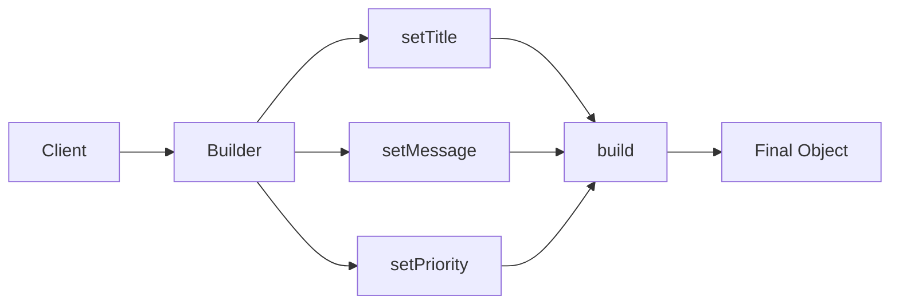
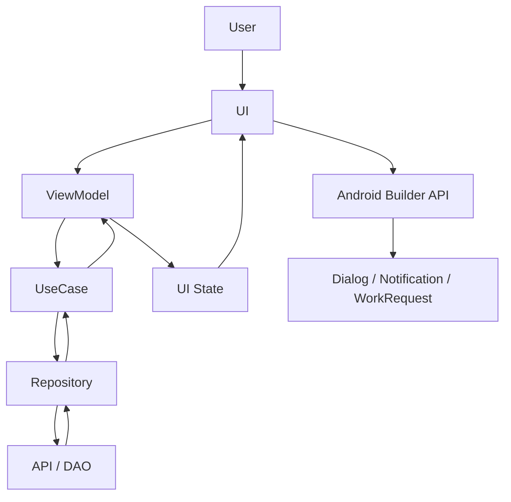
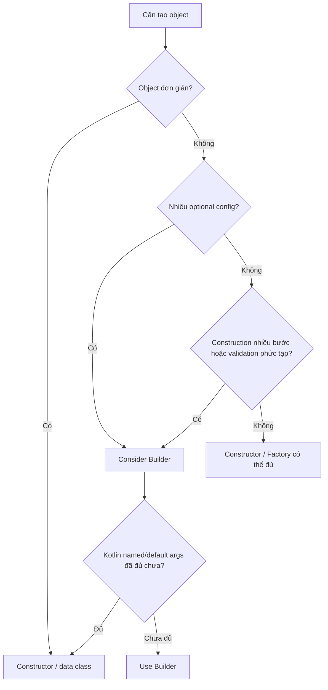
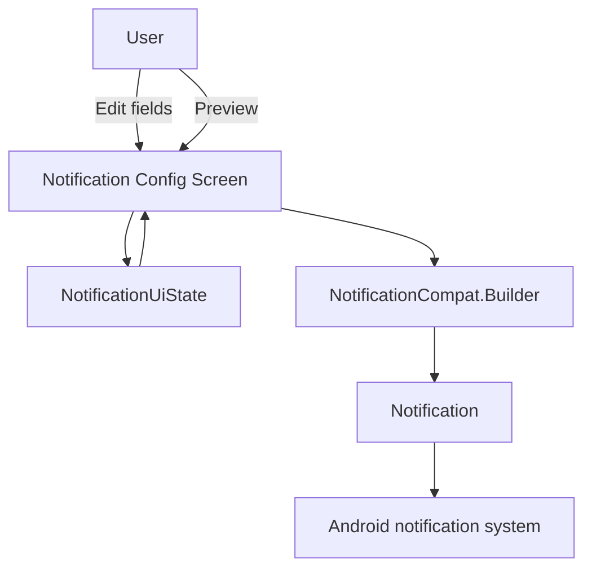
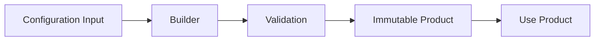

[](https://cdaelementary.org/android-alertdialogbuilder-alertdialog-builder/?utm_source=chatgpt.com)

# 020 — Builder Pattern

> **Học phần:** 03 — Architecture, State and Data
> **Module:** Module 05 — Design and Architecture
> **Nhóm nội dung:** Design Patterns
> **Nguồn roadmap:** Design and Architecture / Design Patterns
> **Loại bài:** UI / Design Pattern
> **Thứ tự trong module:** 020
> **Thời lượng gợi ý:** 30 phút

---

## 1. Tóm tắt

**Builder Pattern** là một **Creational Design Pattern** dùng để tạo ra một object phức tạp theo từng bước thay vì truyền một danh sách constructor parameter dài và khó đọc.

Mental model:

```text
Không có Builder

Object(
    a,
    b,
    true,
    null,
    30,
    false,
    ...
)
```

với Builder:

```text
Builder
   ↓
setA(...)
   ↓
setB(...)
   ↓
setSomething(...)
   ↓
build()
   ↓
Object hoàn chỉnh
```

Trong Android, Builder xuất hiện ở nhiều API quen thuộc như:

```text
AlertDialog.Builder
NotificationCompat.Builder
WorkRequest.Builder
```

`AlertDialog.Builder`, chẳng hạn, cho phép cấu hình title, message, button, item... rồi tạo dialog; các setter trả lại chính Builder để hỗ trợ method chaining. ([Android Developers][1])

Tuy nhiên với **Kotlin + Jetpack Compose**, không nên nghĩ rằng mọi class đều cần Builder. Named arguments, default parameters và declarative composables thường đã giải quyết nhiều vấn đề mà Builder từng được dùng để xử lý.

---

# 2. Mục tiêu học tập

Sau bài này, anh nên:

* giải thích được Builder Pattern;
* hiểu vấn đề Builder giải quyết;
* nhận biết Builder trong Android Framework và Jetpack;
* phân biệt Builder với constructor, Factory và Kotlin DSL;
* tự viết một Builder bằng Kotlin;
* hiểu `build()` và method chaining;
* biết khi nào Builder hữu ích;
* biết khi nào Builder gây over-engineering;
* áp dụng Builder trong một màn hình Android nhỏ;
* kiểm tra state/lifecycle liên quan tới UI được tạo;
* viết unit test cho một custom Builder;
* tạo được artifact nhỏ cho portfolio.

---

# 3. Vấn đề Builder giải quyết

Giả sử cần tạo một object:

```kotlin
val notification = NotificationConfig(
    "Tin nhắn mới",
    "Bạn có một tin nhắn",
    R.drawable.ic_message,
    true,
    false,
    5,
    null
)
```

Nhìn code rất khó biết:

```text
true  = gì?
false = gì?
5     = gì?
null  = gì?
```

Đây thường được gọi là vấn đề constructor có quá nhiều tham số.

---

## 3.1. Builder làm code dễ đọc hơn

```kotlin
val notification =
    NotificationConfig.Builder()
        .setTitle("Tin nhắn mới")
        .setMessage("Bạn có một tin nhắn")
        .setIcon(R.drawable.ic_message)
        .setAutoCancel(true)
        .setPriority(5)
        .build()
```

Bây giờ từng lựa chọn đều có ý nghĩa rõ ràng.

---

# 4. Cấu trúc cơ bản của Builder Pattern



Mental model:

```text
Client
   ↓
Builder
   ↓
Configure
   ↓
Configure
   ↓
Configure
   ↓
build()
   ↓
Product
```

---

# 5. Các thành phần của Builder Pattern

Builder cổ điển thường có:

| Thành phần        | Vai trò                   |
| ----------------- | ------------------------- |
| `Product`         | Object cuối cùng          |
| `Builder`         | API xây dựng object       |
| `ConcreteBuilder` | Implementation cụ thể     |
| `Director`        | Điều phối quá trình build |
| `Client`          | Code sử dụng Builder      |

Trong Android thực tế, rất thường thấy phiên bản đơn giản:

```text
Client
  ↓
Builder
  ↓
Product
```

Không nhất thiết phải có `Director`.

---

# 6. Ví dụ Builder đơn giản bằng Kotlin

Giả sử app cần cấu hình một card sản phẩm.

```kotlin
data class ProductCardConfig(
    val title: String,
    val subtitle: String?,
    val showPrice: Boolean,
    val showFavorite: Boolean,
    val maxLines: Int
)
```

Ta có thể tự tạo Builder.

```kotlin
class ProductCardConfigBuilder {

    private var title: String = ""

    private var subtitle: String? = null

    private var showPrice: Boolean = true

    private var showFavorite: Boolean = false

    private var maxLines: Int = 2

    fun setTitle(
        value: String
    ) = apply {
        title = value
    }

    fun setSubtitle(
        value: String?
    ) = apply {
        subtitle = value
    }

    fun setShowPrice(
        value: Boolean
    ) = apply {
        showPrice = value
    }

    fun setShowFavorite(
        value: Boolean
    ) = apply {
        showFavorite = value
    }

    fun setMaxLines(
        value: Int
    ) = apply {
        maxLines = value
    }

    fun build(): ProductCardConfig {

        require(title.isNotBlank()) {
            "Title cannot be empty"
        }

        require(maxLines > 0) {
            "maxLines must be greater than 0"
        }

        return ProductCardConfig(
            title = title,
            subtitle = subtitle,
            showPrice = showPrice,
            showFavorite = showFavorite,
            maxLines = maxLines
        )
    }
}
```

---

# 7. Sử dụng Builder

```kotlin
val config =
    ProductCardConfigBuilder()
        .setTitle("Pixel Phone")
        .setSubtitle("128 GB")
        .setShowPrice(true)
        .setShowFavorite(true)
        .setMaxLines(2)
        .build()
```

Luồng:

```text
ProductCardConfigBuilder()
           ↓
setTitle()
           ↓
setSubtitle()
           ↓
setShowPrice()
           ↓
setShowFavorite()
           ↓
build()
           ↓
ProductCardConfig
```

---

# 8. Vì sao `apply` hữu ích?

Trong Kotlin:

```kotlin
fun setTitle(value: String) = apply {
    title = value
}
```

`apply` trả lại:

```text
this
```

tức chính Builder.

Do đó:

```kotlin
builder
    .setTitle(...)
    .setSubtitle(...)
    .setMaxLines(...)
```

hoạt động được.

Đây là:

> **Method chaining / Fluent API**

---

# 9. `build()` là bước quan trọng nhất

Builder có thể ở trạng thái chưa hoàn chỉnh:

```text
Builder
title = ?
message = ?
priority = ?
```

Nhưng sau:

```kotlin
build()
```

ta nên đảm bảo Product hợp lệ.

Ví dụ:

```kotlin
fun build(): ProductCardConfig {

    require(title.isNotBlank())

    require(maxLines in 1..10)

    return ProductCardConfig(
        ...
    )
}
```

Kiến trúc:

```text
Mutable Builder
       ↓
validate
       ↓
build()
       ↓
Immutable Product
```

Đây là một pattern rất hữu ích:

> Cho phép cấu hình linh hoạt trong Builder nhưng trả ra object ổn định sau khi build.

---

# 10. Ví dụ thực tế Android — `AlertDialog.Builder`

Một ví dụ rất điển hình trong Android Views là:

```kotlin
AlertDialog.Builder(context)
    .setTitle("Xóa dữ liệu?")
    .setMessage(
        "Hành động này không thể hoàn tác."
    )
    .setPositiveButton(
        "Xóa"
    ) { _, _ ->

        deleteData()
    }
    .setNegativeButton(
        "Hủy",
        null
    )
    .show()
```

`AlertDialog.Builder` hỗ trợ cấu hình title, message, buttons, items và nhiều callback khác trước khi tạo/hiển thị dialog. Các method setter của Builder trả lại chính Builder để tiếp tục chaining. ([Android Developers][2])

Luồng:

```text
AlertDialog.Builder
        ↓
setTitle
        ↓
setMessage
        ↓
setPositiveButton
        ↓
setNegativeButton
        ↓
show / create
        ↓
AlertDialog
```

---

# 11. Tại sao AlertDialog phù hợp với Builder?

Dialog có rất nhiều option:

```text
Title
Message
Icon

Positive button
Negative button
Neutral button

List
Single choice
Multi choice

Cancelable
Listeners
Custom View
Theme
```

Nếu tất cả nằm trong constructor:

```kotlin
AlertDialog(
    context,
    title,
    message,
    icon,
    positiveButton,
    negativeButton,
    neutralButton,
    ...
)
```

API sẽ rất khó sử dụng.

Builder giải quyết vấn đề này rất tốt.

---

# 12. Ví dụ Android — Notification Builder

AndroidX cung cấp:

```kotlin
NotificationCompat.Builder(
    context,
    CHANNEL_ID
)
    .setSmallIcon(
        R.drawable.ic_notification
    )
    .setContentTitle(
        "Tin nhắn mới"
    )
    .setContentText(
        "Bạn vừa nhận được một tin nhắn."
    )
    .setPriority(
        NotificationCompat.PRIORITY_DEFAULT
    )
    .build()
```

Tài liệu Android hiện vẫn hướng dẫn tạo notification bằng `NotificationCompat.Builder`; icon nhỏ là phần nội dung hiển thị bắt buộc, sau đó có thể cấu hình title, text và nhiều thuộc tính khác. ([Android Developers][3])

Builder đặc biệt phù hợp ở đây vì `Notification` có rất nhiều cấu hình tùy chọn.

---

# 13. Notification Builder có thể rất phức tạp

Ví dụ:

```text
Notification
 ├── Small icon
 ├── Large icon
 ├── Title
 ├── Text
 ├── Priority
 ├── Category
 ├── Actions
 ├── Progress
 ├── Sound
 ├── Group
 ├── Style
 └── PendingIntent
```

Builder cho phép:

```text
Chỉ chọn những gì cần
```

thay vì bắt người dùng truyền tất cả vào constructor.

---

# 14. Ví dụ Android — WorkManager

WorkManager cũng sử dụng API mang phong cách Builder khi cấu hình một `WorkRequest`.

Ví dụ:

```kotlin
val constraints =
    Constraints.Builder()
        .setRequiredNetworkType(
            NetworkType.CONNECTED
        )
        .build()

val request =
    OneTimeWorkRequestBuilder<UploadWorker>()
        .setConstraints(constraints)
        .setInputData(inputData)
        .build()
```

WorkManager cho phép cấu hình constraints, input data, delay, tags và nhiều thông tin scheduling trước khi tạo request hoàn chỉnh. ([Android Developers][4])

---

# 15. Builder xuất hiện ở đâu trong Android?

Một cách nhớ:

```text
Android API có object:

- nhiều optional configuration
- nhiều combination
- cần validate trước khi tạo
- muốn fluent API

        ↓

Builder thường là lựa chọn phù hợp
```

Các ví dụ tiêu biểu:

```text
AlertDialog.Builder

NotificationCompat.Builder

Constraints.Builder

WorkRequest.Builder
```

---

# 16. Builder khác Factory Pattern như thế nào?

Đây là điểm rất hay bị nhầm.

## Factory

Factory trả lời:

> **Tạo object loại nào?**

Ví dụ:

```text
ShapeFactory
     ↓
Circle
Rectangle
Triangle
```

---

## Builder

Builder trả lời:

> **Cấu hình object này như thế nào?**

```text
Notification Builder
       ↓
Title
Text
Icon
Action
Priority
Style
       ↓
Notification
```

---

## So sánh

| Pattern    | Trọng tâm               |
| ---------- | ----------------------- |
| Factory    | Chọn object cần tạo     |
| Builder    | Xây một object phức tạp |
| Repository | Truy cập/quản lý data   |
| UseCase    | Thực hiện nghiệp vụ     |

---

# 17. Builder và Constructor

Constructor phù hợp với object đơn giản.

Ví dụ:

```kotlin
data class User(
    val id: String,
    val name: String
)
```

Không cần:

```text
UserBuilder
```

Chỉ cần:

```kotlin
User(
    id = "1",
    name = "Khanh"
)
```

---

# 18. Khi constructor bắt đầu khó đọc

Ví dụ:

```kotlin
CameraConfig(
    1920,
    1080,
    60,
    true,
    false,
    0.8f,
    4,
    null
)
```

Nhìn vào gần như không biết:

```text
60 là FPS?
4 là zoom?
0.8 là quality?
```

Builder:

```kotlin
CameraConfigBuilder()
    .setResolution(
        width = 1920,
        height = 1080
    )
    .setFps(60)
    .setAutoFocus(true)
    .setQuality(0.8f)
    .build()
```

rõ ràng hơn nhiều.

---

# 19. Nhưng Kotlin đã giải quyết một phần vấn đề

Kotlin có **named arguments**:

```kotlin
CameraConfig(
    width = 1920,
    height = 1080,
    fps = 60,
    autoFocus = true,
    stabilization = false,
    quality = 0.8f
)
```

và default parameters:

```kotlin
data class CameraConfig(
    val width: Int = 1920,
    val height: Int = 1080,
    val fps: Int = 30,
    val autoFocus: Boolean = true
)
```

Sau đó:

```kotlin
val config =
    CameraConfig(
        fps = 60
    )
```

Vì vậy trong Kotlin:

> **Builder không còn cần thiết chỉ vì constructor có optional arguments.**

Builder đáng dùng hơn khi việc **xây dựng object bản thân nó là một quá trình**.

---

# 20. Khi nào Builder thực sự có lợi?

Builder đặc biệt hữu ích khi có:

### Nhiều tùy chọn

```text
10–20 configuration properties
```

### Chỉ một số thuộc tính bắt buộc

```text
required + optional + optional...
```

### Validation phức tạp

```text
A yêu cầu B

C không thể dùng cùng D
```

### Construction nhiều bước

```text
Step A
 ↓
Step B
 ↓
Step C
 ↓
Product
```

### Muốn API dễ đọc

```kotlin
.setTitle(...)
.setAction(...)
.setPriority(...)
```

### Object cuối nên immutable

```text
Mutable Builder
     ↓
Immutable Product
```

---

# 21. Khi KHÔNG nên dùng Builder

Đừng tạo:

```text
UserBuilder
```

cho:

```kotlin
data class User(
    val id: String,
    val name: String
)
```

vì:

```kotlin
User(
    id = "...",
    name = "..."
)
```

đã quá đơn giản.

---

# 22. Anti-pattern — Builder cho mọi class

Không nên biến:

```text
User
Product
Category
Article
Token
Address
Profile
```

thành:

```text
UserBuilder
ProductBuilder
CategoryBuilder
ArticleBuilder
TokenBuilder
AddressBuilder
ProfileBuilder
```

nếu chúng chỉ có vài thuộc tính.

Kết quả:

```text
Nhiều class hơn
     ↓
Nhiều code hơn
     ↓
Nhiều test hơn
     ↓
Không thêm abstraction có giá trị
```

---

# 23. Builder Pattern trong Jetpack Compose

Đây là điểm đặc biệt quan trọng với Android hiện đại.

Trong Views có thể gặp:

```kotlin
AlertDialog.Builder(context)
    .setTitle(...)
    .setMessage(...)
    .show()
```

Trong Compose, Android cung cấp một API declarative:

```kotlin
AlertDialog(
    onDismissRequest = onDismiss,
    title = {
        Text("Xóa dữ liệu?")
    },
    text = {
        Text(
            "Hành động này không thể hoàn tác."
        )
    },
    confirmButton = {
        TextButton(
            onClick = onConfirm
        ) {
            Text("Xóa")
        }
    },
    dismissButton = {
        TextButton(
            onClick = onDismiss
        ) {
            Text("Hủy")
        }
    }
)
```

Android hiện hướng dẫn Compose dialog bằng `AlertDialog` và `Dialog` composables thay vì `AlertDialog.Builder`. ([Android Developers][5])

---

# 24. Vì sao Compose không cần Builder ở đây?

Compose đã dùng:

```text
Function parameters
+
Named arguments
+
Default arguments
+
Composable lambdas
```

Ví dụ:

```text
AlertDialog(
    title = {...},
    text = {...},
    confirmButton = {...}
)
```

Nó đã có tính chất giống một configuration DSL.

Có thể xem mental model:

```text
Views

Builder
 ↓
configure
 ↓
build object
 ↓
show
```

so với:

```text
Compose

State
 ↓
Composable parameters
 ↓
UI description
 ↓
Compose renders
```

---

# 25. Builder vs Declarative UI

### Views

```kotlin
AlertDialog.Builder(context)
    .setTitle("Delete?")
    .setMessage("Are you sure?")
    .show()
```

### Compose

```kotlin
if (showDialog) {

    AlertDialog(
        ...
    )
}
```

Compose quan tâm nhiều hơn tới:

```text
State
 ↓
Describe UI
```

thay vì:

```text
Construct UI object
 ↓
Show object
```

Android's Compose guidance dùng state để quyết định dialog có hiện hay không và truyền callbacks vào composable dialog. ([Android Developers][5])

---

# 26. Builder và UI State

Builder **không phải State Holder**.

Không nên:

```kotlin
class DialogBuilder {

    var isDialogVisible = false

    var selectedProduct: Product? = null

    var isLoading = false

    ...
}
```

rồi dùng Builder như ViewModel.

Vai trò đúng:

```text
ViewModel / UI
     ↓
State
     ↓
UI decides what should happen
     ↓
Builder constructs object if necessary
```

---

# 27. Ví dụ màn hình Compose

State:

```kotlin
data class DeleteUiState(
    val showConfirmation: Boolean = false,
    val isDeleting: Boolean = false
)
```

ViewModel:

```kotlin
class DeleteViewModel :
    ViewModel() {

    private val _uiState =
        MutableStateFlow(
            DeleteUiState()
        )

    val uiState =
        _uiState.asStateFlow()

    fun requestDelete() {
        _uiState.update {
            it.copy(
                showConfirmation = true
            )
        }
    }

    fun cancelDelete() {
        _uiState.update {
            it.copy(
                showConfirmation = false
            )
        }
    }
}
```

---

# 28. Compose UI

```kotlin
@Composable
fun DeleteScreen(
    viewModel: DeleteViewModel
) {

    val state by
        viewModel.uiState
            .collectAsStateWithLifecycle()

    Button(
        onClick =
            viewModel::requestDelete
    ) {
        Text("Xóa")
    }

    if (state.showConfirmation) {

        AlertDialog(
            onDismissRequest =
                viewModel::cancelDelete,

            title = {
                Text("Xóa dữ liệu?")
            },

            text = {
                Text(
                    "Hành động này không thể hoàn tác."
                )
            },

            confirmButton = {
                TextButton(
                    onClick = {
                        // Delete event
                    }
                ) {
                    Text("Xóa")
                }
            },

            dismissButton = {
                TextButton(
                    onClick =
                        viewModel::cancelDelete
                ) {
                    Text("Hủy")
                }
            }
        )
    }
}
```

Ở đây:

```text
State
 ↓
showConfirmation
 ↓
Compose
 ↓
AlertDialog
```

chứ không cần giữ một `AlertDialog.Builder` trong ViewModel.

---

# 29. Lifecycle concern

Builder thường là object **tạm thời để cấu hình**.

Nó không nên trở thành nơi lưu:

```text
Screen State
User Session
Navigation State
Loading State
Repository State
```

Với UI truyền thống, `AlertDialog.Builder` nhận `Context`, vì vậy cũng không nên vô tình giữ Builder/context giao diện lâu hơn vòng đời cần thiết. API Builder của AlertDialog sử dụng parent context/theme để tạo dialog. ([Android Developers][6])

Mental model:

```text
Builder
 ↓
short-lived configuration
 ↓
build()
 ↓
Product
```

---

# 30. Builder và Configuration Change

Sai mental model:

```text
Builder
=
state
```

Ví dụ:

```text
Rotate device
 ↓
Activity recreated
 ↓
Builder cũ sẽ khôi phục toàn bộ UI
```

không phải cách nên thiết kế.

Thay vào đó:

```text
UiState
 ↓
ViewModel / Saved State
 ↓
new UI
 ↓
reconstruct if needed
```

Builder chỉ giúp **construct**, không phải persistence mechanism.

---

# 31. Builder và Navigation

Không nên để một custom Builder:

```kotlin
class ScreenBuilder(
    private val navController:
        NavController
)
```

vừa:

```text
build object
+
navigate
+
update state
+
call repository
```

Đó không còn là Builder Pattern nữa.

Builder nên tập trung:

```text
Construction responsibility
```

---

# 32. Builder và Repository/UseCase

Các bài trước có thể kết hợp thành:



Builder không thay thế:

```text
ViewModel
UseCase
Repository
```

Nó giải quyết một vấn đề khác:

> **Object construction**

---

# 33. Builder trong notification flow

Ví dụ:

```text
Repository
   ↓
Có tin nhắn mới
   ↓
UseCase / Worker
   ↓
Notification configuration
   ↓
NotificationCompat.Builder
   ↓
Notification
   ↓
NotificationManager
```

`NotificationCompat.Builder` là API cấu hình `Notification`; sau `build()` object notification mới được tạo để gửi tới hệ thống. ([Android Developers][3])

---

# 34. Builder trong WorkManager flow

```text
Need background upload
        ↓
Constraints.Builder
        ↓
Constraints
        ↓
OneTimeWorkRequestBuilder
        ↓
WorkRequest
        ↓
WorkManager.enqueue()
```

Builder giúp tách:

```text
Configuration
```

khỏi:

```text
Execution
```

WorkManager hiện cho phép cấu hình WorkRequest như constraints và input data trước khi enqueue. ([Android Developers][4])

---

# 35. Một custom Builder tốt

Ví dụ tạo search request.

```kotlin
data class SearchRequest(
    val query: String,
    val page: Int,
    val pageSize: Int,
    val sort: SortType,
    val filters: Set<String>
)
```

Builder:

```kotlin
class SearchRequestBuilder {

    private var query = ""

    private var page = 1

    private var pageSize = 20

    private var sort =
        SortType.RELEVANCE

    private val filters =
        mutableSetOf<String>()

    fun query(
        value: String
    ) = apply {
        query = value
    }

    fun page(
        value: Int
    ) = apply {
        page = value
    }

    fun pageSize(
        value: Int
    ) = apply {
        pageSize = value
    }

    fun sort(
        value: SortType
    ) = apply {
        sort = value
    }

    fun addFilter(
        value: String
    ) = apply {
        filters += value
    }

    fun build(): SearchRequest {

        require(query.isNotBlank())

        require(page >= 1)

        require(pageSize in 1..100)

        return SearchRequest(
            query = query.trim(),
            page = page,
            pageSize = pageSize,
            sort = sort,
            filters = filters.toSet()
        )
    }
}
```

---

# 36. Sử dụng

```kotlin
val request =
    SearchRequestBuilder()
        .query("Android")
        .page(1)
        .pageSize(30)
        .sort(
            SortType.NEWEST
        )
        .addFilter("Kotlin")
        .addFilter("Compose")
        .build()
```

Rất dễ đọc:

```text
Search Android
Page 1
30 results
Newest first
Filter Kotlin
Filter Compose
```

---

# 37. Một lợi thế lớn: validation tập trung

Không có Builder:

```text
Client A
 ├── validate page
 └── create request

Client B
 ├── validate page
 └── create request

Client C
 ├── validate page
 └── create request
```

Có Builder:

```text
Client A ─┐
Client B ─┼── Builder → validation → Product
Client C ─┘
```

Tất cả construction rules nằm ở một boundary.

---

# 38. Builder có nên mutable?

Thông thường:

```text
Builder
=
mutable
```

vì quá trình configure cần thay đổi giá trị.

Nhưng object cuối nên ưu tiên:

```text
Product
=
immutable
```

Ví dụ:

```kotlin
data class SearchRequest(
    val query: String,
    val page: Int
)
```

Sau `build()`:

```text
Builder mutable
     ↓
build
     ↓
immutable SearchRequest
```

---

# 39. Không reuse Builder bừa bãi

Ví dụ:

```kotlin
val builder =
    SearchRequestBuilder()
```

sau đó liên tục dùng:

```kotlin
val request1 =
    builder
        .query("Android")
        .build()

val request2 =
    builder
        .addFilter("Compose")
        .build()
```

`request2` có thể vô tình kế thừa configuration trước.

An toàn hơn thường là:

```kotlin
SearchRequestBuilder()
    ...
    .build()
```

cho từng product độc lập.

---

# 40. Builder và thread safety

Một mutable Builder thông thường:

```text
không nên mặc định coi là thread-safe
```

Không nên:

```text
Thread A ─┐
          ├── same Builder
Thread B ─┘
```

nếu Builder đang thay đổi internal state.

Pattern phổ biến hơn:

```text
Thread / operation
       ↓
create builder
       ↓
configure
       ↓
build
       ↓
discard builder
```

---

# 41. Builder hay Kotlin DSL?

Kotlin cho phép thiết kế API kiểu:

```kotlin
val request =
    searchRequest {

        query = "Android"

        page = 1

        pageSize = 30

        filter("Kotlin")

        filter("Compose")
    }
```

Đây có thể dùng một Builder bên trong:

```kotlin
fun searchRequest(
    block:
        SearchRequestBuilder.() -> Unit
): SearchRequest {

    return SearchRequestBuilder()
        .apply(block)
        .build()
}
```

---

# 42. Kết quả

Thay vì:

```kotlin
SearchRequestBuilder()
    .query("Android")
    .page(1)
    .pageSize(30)
    .addFilter("Kotlin")
    .build()
```

có thể có:

```kotlin
searchRequest {

    query("Android")

    page(1)

    pageSize(30)

    addFilter("Kotlin")
}
```

Builder Pattern và Kotlin DSL có thể kết hợp rất tốt.

---

# 43. Decision tree — Có nên dùng Builder?



---

# 44. Builder vs các lựa chọn khác

| Tình huống                | Nên cân nhắc                    |
| ------------------------- | ------------------------------- |
| Object 2–4 field đơn giản | Constructor                     |
| Nhiều optional field      | Named/default args hoặc Builder |
| Nhiều bước construction   | Builder                         |
| Cần chọn implementation   | Factory                         |
| Configuration giống DSL   | Kotlin DSL                      |
| UI Compose                | Declarative composable          |
| Business logic            | UseCase                         |
| Data access               | Repository                      |

---

# 45. Lỗi phổ biến — Builder chứa business logic

Không nên:

```kotlin
class OrderBuilder(
    private val repository:
        OrderRepository
) {

    suspend fun pay() {}

    suspend fun uploadOrder() {}

    fun navigateSuccess() {}
}
```

Builder này đang làm:

```text
Builder
+
UseCase
+
Repository
+
Navigation
```

Đúng hơn:

```text
OrderBuilder
     ↓
Order

PlaceOrderUseCase
     ↓
OrderRepository
```

---

# 46. Lỗi phổ biến — Builder trả object không hợp lệ

Không nên:

```kotlin
fun build() =
    SearchRequest(
        query = query,
        page = -50
    )
```

Builder là vị trí rất hợp lý để bảo vệ construction invariant:

```kotlin
require(page >= 1)
```

---

# 47. Lỗi phổ biến — 100 setter

Nếu class có:

```text
100 configurable properties
```

thì Builder có thể chỉ che giấu một thiết kế domain quá phức tạp.

Cần cân nhắc chia thành:

```text
NotificationConfig
 ├── AppearanceConfig
 ├── BehaviorConfig
 └── ActionConfig
```

thay vì:

```text
NotificationBuilder
    .setA()
    .setB()
    ...
    .setZ123()
```

---

# 48. Test Builder

Custom Builder rất dễ unit test vì thường không cần Android framework.

Ví dụ:

```kotlin
@Test
fun build_validConfig_returnsRequest() {

    val request =
        SearchRequestBuilder()
            .query("Android")
            .page(2)
            .pageSize(30)
            .build()

    assertEquals(
        "Android",
        request.query
    )

    assertEquals(
        2,
        request.page
    )

    assertEquals(
        30,
        request.pageSize
    )
}
```

---

# 49. Test default value

```kotlin
@Test
fun build_usesDefaultPageSize() {

    val request =
        SearchRequestBuilder()
            .query("Compose")
            .build()

    assertEquals(
        20,
        request.pageSize
    )
}
```

---

# 50. Test validation

```kotlin
@Test
fun emptyQuery_throwsException() {

    assertFailsWith<
        IllegalArgumentException
    > {

        SearchRequestBuilder()
            .query("")
            .build()
    }
}
```

Test seam:

```text
Input configuration
       ↓
Builder
       ↓
Product
       ↓
Assertions
```

---

# 51. Testing Android Builder APIs

Với API Android thật, test tùy đối tượng:

```text
Pure configuration logic
→ local unit test nếu tách khỏi framework

UI rendering
→ instrumentation / Compose UI test

Notification behavior
→ integration/manual test thích hợp

WorkManager
→ WorkManager testing APIs
```

Điểm cần test không phải:

> Builder có gọi từng setter không?

mà là:

> Object/configuration cuối có đúng yêu cầu user flow không?

---

# 52. Bài thực hành — Tiny UI

Tạo một màn hình:

```text
Notification Preview
```

User có thể:

```text
Nhập title
Nhập message
Bật/tắt auto cancel
Chọn priority
Nhấn Preview
```

State:

```kotlin
data class NotificationUiState(
    val title: String = "",
    val message: String = "",
    val autoCancel: Boolean = true
)
```

---

# 53. Flow bài thực hành



---

# 54. Điểm cần quan sát về State

Builder không giữ:

```text
title người dùng đang nhập
message người dùng đang nhập
switch state
selected priority
```

Các giá trị này thuộc:

```text
UI State
```

Khi nhấn:

```text
Create Notification
```

mới dùng state hiện tại để cấu hình Builder.

```text
UiState
   ↓
Builder
   ↓
Notification
```

---

# 55. Manual checklist cho demo

Sau khi làm mini app:

* [ ] Nhập title.
* [ ] Nhập message.
* [ ] Thay đổi option.
* [ ] UI phản ánh state ngay.
* [ ] Rotate màn hình.
* [ ] State cần thiết vẫn đúng.
* [ ] Nhấn tạo Notification.
* [ ] Notification được build đúng.
* [ ] Không giữ Builder trong ViewModel.
* [ ] Không giữ `Activity` lâu dài trong Builder.
* [ ] Invalid input được xử lý trước `build()`.

---

# 56. Accessibility

Builder Pattern bản thân không tự đảm bảo accessibility.

Ví dụ một dialog được build đúng về code nhưng vẫn có thể có:

```text
Title không rõ
Button mơ hồ
Content quá dài
Touch target khó sử dụng
```

Trong Compose hoặc Views, UI cuối cùng vẫn cần tuân thủ quy tắc accessibility tương ứng.

Builder chỉ giải quyết:

```text
construction
```

không giải quyết:

```text
UX correctness
```

---

# 57. Debugging

Khi Builder tạo object sai, log theo ba bước:

```text
INPUT
 ↓
BUILDER CONFIGURATION
 ↓
FINAL PRODUCT
```

Ví dụ:

```text
INPUT STATE
title = Download
networkOnly = true

BUILDER
NetworkType = CONNECTED

PRODUCT
WorkRequest constraints = CONNECTED
```

Nếu sai:

```text
UI state sai?
      ↓
mapping state → Builder sai?
      ↓
Builder config sai?
      ↓
Android API behavior?
```

---

# 58. Production considerations

Builder Pattern hiếm khi trực tiếp gây ra lifecycle bug.

Lỗi production thường đến từ cách sử dụng:

```text
Giữ Context lâu
Reuse mutable Builder
Không validate config
Build object sai state
Builder chứa business logic
Builder được share giữa threads
Over-engineering
```

Đối với UI, đặc biệt Compose, nên giữ source of truth ở state rồi tạo/render UI từ state thay vì dùng Builder như một state container. Compose's dialog APIs hiện cũng đi theo declarative approach này. ([Android Developers][5])

---

# 59. Artifact cho portfolio

Có thể tạo project:

## `BuilderPatternDemo`

```text
BuilderPatternDemo/

├── ui/
│   ├── NotificationScreen.kt
│   ├── NotificationViewModel.kt
│   └── NotificationUiState.kt
│
├── builder/
│   └── SearchRequestBuilder.kt
│
├── model/
│   └── SearchRequest.kt
│
└── test/
    └── SearchRequestBuilderTest.kt
```

README nên giải thích:

```markdown
## Builder Pattern

Builder is used when creating objects that require
multiple optional configuration steps.

The demo contains:

- a custom SearchRequest Builder;
- validation inside build();
- an Android NotificationCompat.Builder example;
- unit tests for valid/default/invalid configurations.

UI state remains separate from Builder state.
```

---

# 60. Sơ đồ cho README



Với Android:

```text
UiState
   ↓
NotificationCompat.Builder
   ↓
Notification
   ↓
Android System
```

---

# 61. Các lỗi thường gặp

| Sai lầm                                 | Hậu quả                         |
| --------------------------------------- | ------------------------------- |
| Builder cho object rất đơn giản         | Boilerplate                     |
| Builder chứa UI state                   | Sai responsibility              |
| Builder chứa ViewModel/Repository logic | Coupling                        |
| Không validate `build()`                | Product không hợp lệ            |
| Reuse mutable Builder                   | Config bị rò từ lần build trước |
| Share Builder giữa threads              | Race condition tiềm ẩn          |
| Builder giữ `Activity` lâu              | Lifecycle/coupling problem      |
| Dùng Builder khi named args đã đủ       | Over-engineering                |
| Mang tư duy View Builder sang Compose   | Không tận dụng declarative UI   |

---

# 62. Checklist hoàn thành bài

### Kiến thức

* [ ] Định nghĩa được Builder Pattern.
* [ ] Hiểu Builder thuộc nhóm Creational Pattern.
* [ ] Hiểu mục đích của `build()`.
* [ ] Hiểu method chaining.
* [ ] Phân biệt Builder với Product.
* [ ] Phân biệt Builder với Factory.
* [ ] Biết Kotlin named/default arguments có thể thay Builder trong trường hợp đơn giản.

### Android

* [ ] Nhận biết `AlertDialog.Builder`.
* [ ] Nhận biết `NotificationCompat.Builder`.
* [ ] Nhận biết Builder-style API của WorkManager.
* [ ] Hiểu Compose thường dùng declarative API thay Builder cho UI.
* [ ] Không dùng Builder làm UI State Holder.

### Code

* [ ] Viết được custom Builder.
* [ ] Có default values.
* [ ] Có validation.
* [ ] Product cuối immutable.
* [ ] Không chứa business logic ngoài construction.

### Testing

* [ ] Test valid configuration.
* [ ] Test default values.
* [ ] Test invalid configuration.
* [ ] Test object cuối thay vì chỉ test setter.

### Portfolio

* [ ] Có mini demo.
* [ ] Có screenshot.
* [ ] Có architecture diagram.
* [ ] Có README.
* [ ] Có unit test.

---

# 63. Ghi chú sản xuất

Khi gặp một class mới, **đừng bắt đầu bằng việc tạo Builder**.

Hãy hỏi theo thứ tự:

```text
Object có đơn giản không?
        ↓
YES → Constructor / data class
        ↓ NO

Kotlin named + default args có đủ không?
        ↓
YES → dùng chúng
        ↓ NO

Có nhiều configuration / validation /
construction steps không?
        ↓
YES → Builder đáng cân nhắc
```

Đặc biệt trong UI Android hiện đại:

```text
Views
→ Builder API vẫn rất phổ biến

Compose
→ State + declarative composable
   thường tự nhiên hơn
```

Android hiện vẫn duy trì Builder APIs mạnh cho các object cấu hình phức tạp như notifications và work requests, trong khi Compose dialogs được mô tả trực tiếp thông qua composable parameters. ([Android Developers][7])

---

# 64. Tóm tắt nhanh

Hãy nhớ công thức:

```text
BUILDER
=
Xây một object phức tạp từng bước
```

```text
Builder
   ↓
configure
   ↓
configure
   ↓
validate
   ↓
build()
   ↓
Product
```

Trong Android:

```text
AlertDialog.Builder
        ↓
AlertDialog

NotificationCompat.Builder
        ↓
Notification

WorkRequest Builder
        ↓
WorkRequest
```

Nhưng với Kotlin:

```text
Object đơn giản
       ↓
data class
+
named arguments
+
default parameters
```

thường đã đủ.

Và với Compose:

```text
State
   ↓
Composable parameters
   ↓
Declarative UI
```

là mental model quan trọng hơn việc cố tạo UI bằng Builder.

> **Quy tắc cần nhớ:** Builder có giá trị khi **quá trình xây dựng object thực sự phức tạp**. Nếu Builder chỉ biến `Foo(a, b)` thành `FooBuilder().setA(a).setB(b).build()`, anh chỉ đang thêm code chứ chưa thêm giá trị kiến trúc.

[1]: https://developer.android.com/reference/android/app/AlertDialog.Builder?utm_source=chatgpt.com "AlertDialog.Builder | API reference"
[2]: https://developer.android.com/develop/ui/views/components/dialogs?utm_source=chatgpt.com "Dialogs | Views"
[3]: https://developer.android.com/reference/androidx/core/app/NotificationCompat.Builder?utm_source=chatgpt.com "NotificationCompat.Builder | API reference"
[4]: https://developer.android.com/develop/background-work/background-tasks/persistent/getting-started/define-work?utm_source=chatgpt.com "Define work requests | Background work"
[5]: https://developer.android.com/develop/ui/compose/components/dialog?utm_source=chatgpt.com "Dialog | Jetpack Compose"
[6]: https://developer.android.com/reference/kotlin/android/app/AlertDialog.Builder?utm_source=chatgpt.com "AlertDialog.Builder | API reference"
[7]: https://developer.android.com/develop/ui/compose/notifications/create-notification?utm_source=chatgpt.com "Create a notification | Jetpack Compose"
