[](https://developer.android.com/training/dependency-injection/manual?utm_source=chatgpt.com)

# 021 - Factory Pattern

| Thuộc tính              | Nội dung                                           |
| ----------------------- | -------------------------------------------------- |
| **Học phần**            | 03 - Architecture, State and Data                  |
| **Module**              | Module 05 - Design and Architecture                |
| **Nhóm nội dung**       | Design Patterns                                    |
| **Nguồn roadmap**       | Design and Architecture / Design Patterns          |
| **Loại bài**            | Architecture                                       |
| **Thứ tự trong module** | 021                                                |
| **Thời lượng gợi ý**    | 34 phút                                            |
| **Ngôn ngữ ví dụ**      | Kotlin                                             |
| **Bối cảnh**            | Android / Jetpack Compose / ViewModel / Repository |

---

## 1. Tóm tắt

**Factory Pattern** là nhóm kỹ thuật thiết kế dùng để **tách quá trình tạo object khỏi nơi sử dụng object**.

Thay vì một `ViewModel`, `Activity`, `UseCase` hay class nghiệp vụ tự viết:

```kotlin
val repository = OfflineFirstNewsRepository(
    api = RetrofitNewsApi(),
    dao = RoomNewsDao(...)
)
```

ta chuyển trách nhiệm tạo object sang một thành phần khác:

```kotlin
val repository = NewsRepositoryFactory.create(...)
```

hoặc trong kiến trúc Android hiện đại:

```text
Application / DI Container
        ↓
Factory / Provider
        ↓
Concrete dependency
        ↓
ViewModel
        ↓
UI
```

Điểm quan trọng không phải là viết một class có tên `Factory`, mà là:

> **Object sử dụng dependency không cần biết chi tiết dependency đó được tạo ra như thế nào.**

Trong Android, một ví dụ rất thực tế là `ViewModelProvider.Factory`: khi `ViewModel` có dependency trong constructor, Android cần một cơ chế để biết cách khởi tạo `ViewModel` đúng scope. AndroidX cung cấp `ViewModelProvider.Factory` cho mục đích này. ([Android Developers][1])

---

# 2. Mục tiêu học tập

Sau bài này, bạn nên có thể:

* giải thích Factory Pattern bằng ngôn ngữ của mình;
* hiểu vấn đề Factory giải quyết;
* phân biệt **Factory**, **Factory Method**, **Abstract Factory** ở mức cơ bản;
* áp dụng Factory với `Repository`, `DataSource`, `ViewModel`;
* biết khi nào Factory kết hợp với Dependency Injection;
* biết khi nào Factory làm code phức tạp không cần thiết;
* tạo được fake implementation phục vụ unit test;
* hiểu ảnh hưởng của Factory tới lifecycle, state và object scope;
* đưa một ví dụ Factory Pattern hoàn chỉnh vào portfolio Android.

---

# 3. Khái niệm chính

## 3.1. Vấn đề khi tạo object trực tiếp

Giả sử màn hình danh sách bài viết cần một repository.

```kotlin
class ArticleViewModel : ViewModel() {

    private val repository =
        OfflineFirstArticleRepository(
            api = RetrofitArticleApi(),
            dao = RoomArticleDao()
        )
}
```

Ở đây `ArticleViewModel` đang làm hai việc:

```text
1. Quản lý state / business logic của màn hình
2. Biết cách xây dựng toàn bộ data layer
```

Điều này tạo coupling:

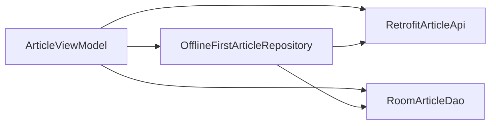

Nếu sau này muốn thay:

```text
Retrofit API
     ↓
Firebase API
```

hoặc:

```text
OfflineFirstRepository
        ↓
RemoteOnlyRepository
```

`ViewModel` cũng phải thay đổi.

Trong Android architecture được Google khuyến nghị, UI layer nên lấy application data thông qua state holder như `ViewModel`, còn data layer được tổ chức quanh repository và data source. UI/ViewModel không nên truy cập trực tiếp data source. ([Android Developers][2])

---

# 4. Ý tưởng của Factory Pattern

Ta đưa quá trình tạo object ra khỏi consumer.

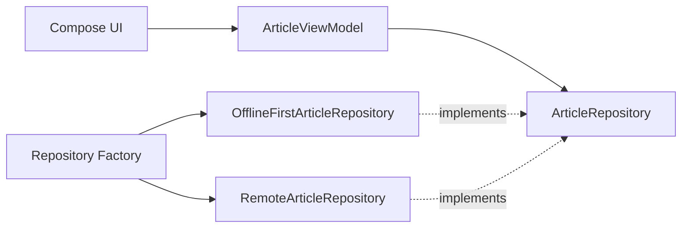

`ArticleViewModel` chỉ cần:

```kotlin
class ArticleViewModel(
    private val repository: ArticleRepository
) : ViewModel()
```

Nó không quan tâm repository thực tế là:

```text
OfflineFirstArticleRepository
RemoteArticleRepository
FakeArticleRepository
CachedArticleRepository
```

---

# 5. Cấu trúc cơ bản

Một Factory thường có ba thành phần quan trọng:

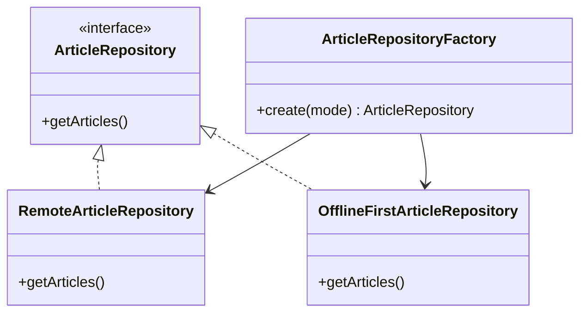

### Product

Interface hoặc abstraction mà consumer sử dụng:

```kotlin
interface ArticleRepository {

    suspend fun getArticles(): List<Article>
}
```

### Concrete Product

Các implementation cụ thể:

```kotlin
class RemoteArticleRepository(
    private val api: ArticleApi
) : ArticleRepository {

    override suspend fun getArticles(): List<Article> {
        return api.getArticles()
    }
}
```

và:

```kotlin
class OfflineFirstArticleRepository(
    private val api: ArticleApi,
    private val dao: ArticleDao
) : ArticleRepository {

    override suspend fun getArticles(): List<Article> {
        // Ví dụ đơn giản
        return dao.getArticles()
    }
}
```

### Factory

Factory quyết định implementation nào sẽ được tạo:

```kotlin
enum class RepositoryMode {
    REMOTE_ONLY,
    OFFLINE_FIRST
}
```

```kotlin
class ArticleRepositoryFactory(
    private val api: ArticleApi,
    private val dao: ArticleDao
) {

    fun create(
        mode: RepositoryMode
    ): ArticleRepository {

        return when (mode) {

            RepositoryMode.REMOTE_ONLY ->
                RemoteArticleRepository(
                    api = api
                )

            RepositoryMode.OFFLINE_FIRST ->
                OfflineFirstArticleRepository(
                    api = api,
                    dao = dao
                )
        }
    }
}
```

---

# 6. Luồng hoạt động

Giả sử ứng dụng chọn repository dựa trên cấu hình.

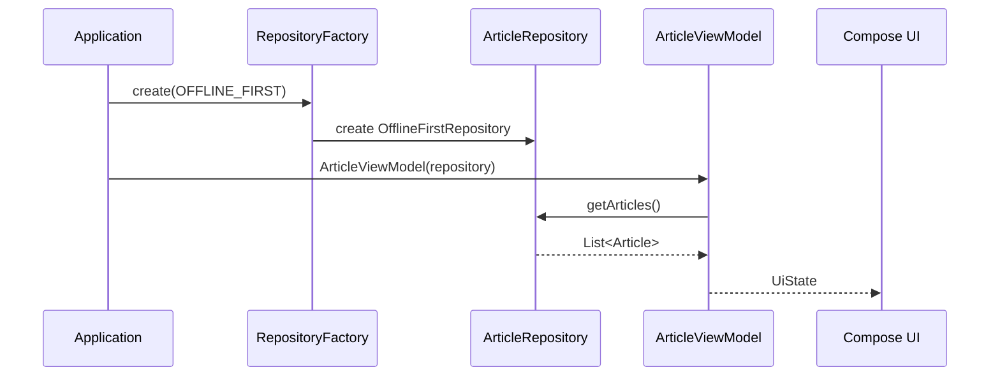

Điều quan trọng:

```text
UI
 ↓
ViewModel
 ↓
ArticleRepository
```

không cần biết:

```text
Retrofit
Room
SQLite
Firebase
Cache
```

đang được dùng bên dưới.

Android architecture hiện tại của Google mô tả data layer theo hướng repository → data source; repository là entry point cho dữ liệu và có nhiệm vụ che giấu chi tiết nguồn dữ liệu khỏi các layer phía trên. ([Android Developers][3])

---

# 7. Factory Pattern trong Android

Factory có thể xuất hiện ở nhiều vị trí.

| Thành phần   | Factory có thể tạo                   |
| ------------ | ------------------------------------ |
| ViewModel    | `ViewModel` với repository/use case  |
| Repository   | Remote / cached / offline repository |
| DataSource   | REST / Firebase / Room datasource    |
| Parser       | JSON / XML parser                    |
| Payment      | Stripe / Google Pay implementation   |
| Logger       | Debug / Production logger            |
| Notification | Loại notification khác nhau          |
| Worker       | Worker theo loại job                 |
| UseCase      | Use case có dependency phức tạp      |

Một trong những ví dụ rõ nhất trong Android framework là:

```text
ViewModelProvider.Factory
```

---

# 8. Ví dụ thực tế: `ViewModelProvider.Factory`

Giả sử:

```kotlin
class ArticleViewModel(
    private val repository: ArticleRepository
) : ViewModel()
```

Framework không thể đơn giản gọi:

```kotlin
ArticleViewModel()
```

vì constructor cần:

```text
ArticleRepository
```

AndroidX vì vậy cung cấp `ViewModelProvider.Factory`; tài liệu hiện tại cũng hỗ trợ DSL `viewModelFactory { initializer { ... } }`. ([Android Developers][1])

---

## 8.1. Cách viết hiện đại

```kotlin
class ArticleViewModel(
    private val repository: ArticleRepository
) : ViewModel() {

    companion object {

        val Factory: ViewModelProvider.Factory =
            viewModelFactory {

                initializer {

                    val application =
                        this[
                            ViewModelProvider
                                .AndroidViewModelFactory
                                .APPLICATION_KEY
                        ] as MyApplication

                    ArticleViewModel(
                        repository =
                            application
                                .appContainer
                                .articleRepository
                    )
                }
            }
    }
}
```

Trong Compose:

```kotlin
@Composable
fun ArticleRoute(
    viewModel: ArticleViewModel =
        viewModel(
            factory = ArticleViewModel.Factory
        )
) {

    ArticleScreen(
        viewModel = viewModel
    )
}
```

AndroidX hiện khuyến nghị dùng `ViewModelProvider.Factory` khi `ViewModel` cần dependency mà framework không thể tự tạo; `CreationExtras` cũng có thể cung cấp `Application`, `SavedStateHandle` và custom values cho quá trình khởi tạo. ([Android Developers][1])

---

# 9. Factory + SavedStateHandle

Factory cũng có thể tạo `ViewModel` cần cả repository lẫn saved state.

```kotlin
class DetailViewModel(
    private val repository: ArticleRepository,
    private val savedStateHandle: SavedStateHandle
) : ViewModel() {

    val articleId: String? =
        savedStateHandle["articleId"]

    companion object {

        val Factory =
            viewModelFactory {

                initializer {

                    val application =
                        this[
                            ViewModelProvider
                                .AndroidViewModelFactory
                                .APPLICATION_KEY
                        ] as MyApplication

                    DetailViewModel(
                        repository =
                            application
                                .appContainer
                                .articleRepository,

                        savedStateHandle =
                            createSavedStateHandle()
                    )
                }
            }
    }
}
```

`CreationExtras.createSavedStateHandle()` là cơ chế AndroidX hiện tại để Factory lấy `SavedStateHandle` khi khởi tạo ViewModel theo cách này. ([Android Developers][1])

---

# 10. Factory không giống Dependency Injection

Hai khái niệm liên quan nhưng không hoàn toàn giống nhau.

```text
Factory
    ↓
tập trung vào việc tạo object

Dependency Injection
    ↓
tập trung vào việc cung cấp dependency
cho object từ bên ngoài
```

Ví dụ Factory:

```kotlin
val repository =
    repositoryFactory.create()
```

Consumer vẫn chủ động yêu cầu object.

Constructor Injection:

```kotlin
class ArticleViewModel(
    private val repository: ArticleRepository
)
```

`ArticleViewModel` hoàn toàn không tạo repository.

Android architecture hiện khuyến nghị constructor injection khi có thể và khuyến nghị Hilt cho ứng dụng đủ phức tạp. DI giúp thay implementation dễ hơn và tạo test double thuận tiện hơn. ([Android Developers][4])

---

# 11. Factory + DI Container

Hai pattern có thể kết hợp:

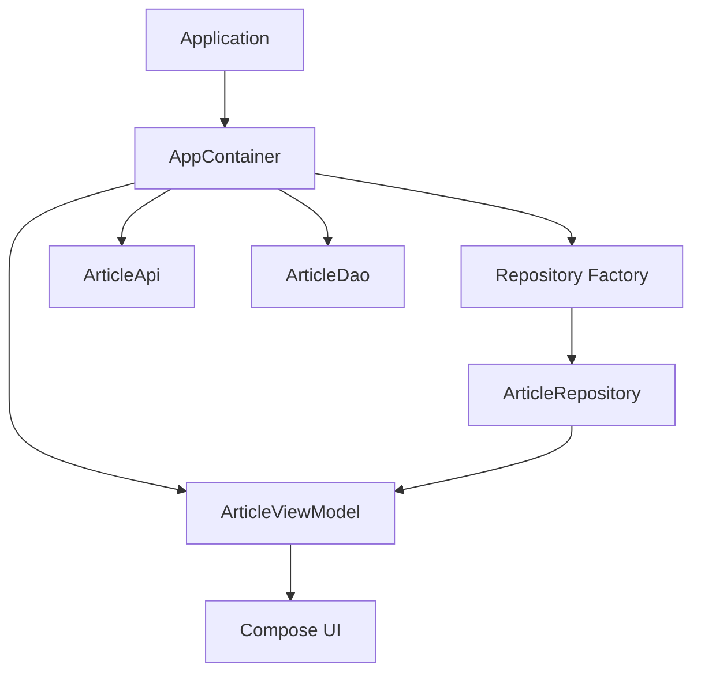

Một manual DI container:

```kotlin
class AppContainer {

    private val api: ArticleApi =
        RetrofitArticleApi()

    private val dao: ArticleDao =
        RoomArticleDao()

    private val repositoryFactory =
        ArticleRepositoryFactory(
            api = api,
            dao = dao
        )

    val articleRepository: ArticleRepository =
        repositoryFactory.create(
            RepositoryMode.OFFLINE_FIRST
        )
}
```

Android Developers dùng **application graph** để mô tả mạng lưới dependency giữa các object và giải thích rằng DI cho phép thay implementation production bằng fake/mock trong testing. ([Android Developers][5])

---

# 12. Factory Pattern với Hilt

Khi sử dụng Hilt, trong rất nhiều trường hợp bạn **không cần tự viết Factory**.

Ví dụ:

```kotlin
@HiltViewModel
class ArticleViewModel @Inject constructor(
    private val repository: ArticleRepository
) : ViewModel()
```

Hilt có thể tạo factory cần thiết cho `@HiltViewModel` ở compile time. ([Android Developers][1])

Dependency binding:

```kotlin
@Module
@InstallIn(SingletonComponent::class)
abstract class RepositoryModule {

    @Binds
    abstract fun bindArticleRepository(
        implementation:
            OfflineFirstArticleRepository
    ): ArticleRepository
}
```

Sau đó:

```kotlin
@Composable
fun ArticleRoute(
    viewModel: ArticleViewModel =
        hiltViewModel()
) {
    // ...
}
```

Hilt là giải pháp DI được Android Developers khuyến nghị cho Android và quản lý dependency container/lifecycle của nhiều Android component. ([Android Developers][5])

---

# 13. Factory Method là gì?

Một biến thể phổ biến là **Factory Method**.

Thay vì một factory riêng:

```text
RepositoryFactory
```

class cha định nghĩa một method tạo object, class con quyết định implementation.

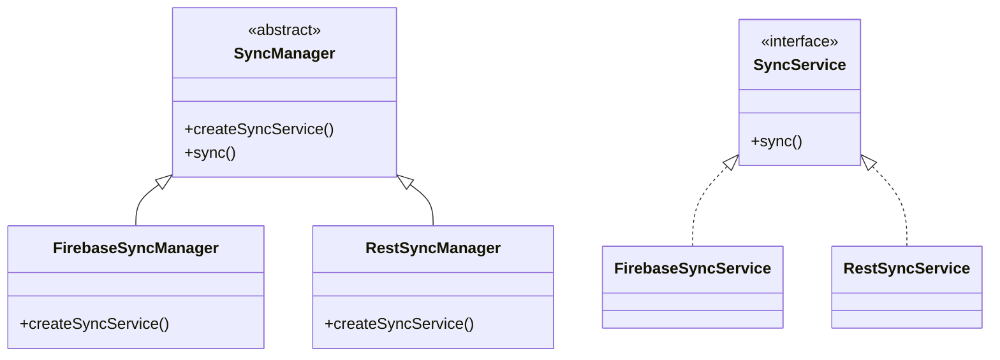

Ví dụ:

```kotlin
abstract class SyncManager {

    abstract fun createService(): SyncService

    suspend fun sync() {
        val service = createService()

        service.sync()
    }
}
```

Implementation:

```kotlin
class FirebaseSyncManager :
    SyncManager() {

    override fun createService(): SyncService {
        return FirebaseSyncService()
    }
}
```

---

# 14. Abstract Factory

**Abstract Factory** hữu ích khi cần tạo **một họ object liên quan với nhau**.

Ví dụ ứng dụng có hai môi trường:

```text
Production

Api      → RetrofitApi
Database → RoomDatabase
Logger   → FirebaseLogger
```

và:

```text
Testing

Api      → FakeApi
Database → InMemoryDatabase
Logger   → FakeLogger
```

Ta có thể biểu diễn:

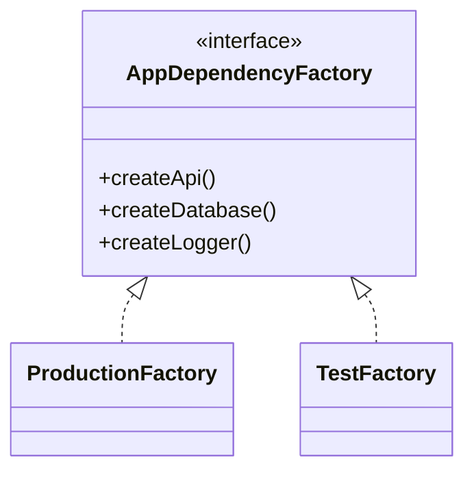

Interface:

```kotlin
interface AppDependencyFactory {

    fun createApi(): ArticleApi

    fun createDatabase(): ArticleDatabase

    fun createLogger(): Logger
}
```

Production:

```kotlin
class ProductionDependencyFactory :
    AppDependencyFactory {

    override fun createApi(): ArticleApi {
        return RetrofitArticleApi()
    }

    override fun createDatabase(): ArticleDatabase {
        return RoomArticleDatabase()
    }

    override fun createLogger(): Logger {
        return ProductionLogger()
    }
}
```

Testing:

```kotlin
class TestDependencyFactory :
    AppDependencyFactory {

    override fun createApi(): ArticleApi {
        return FakeArticleApi()
    }

    override fun createDatabase(): ArticleDatabase {
        return FakeArticleDatabase()
    }

    override fun createLogger(): Logger {
        return FakeLogger()
    }
}
```

---

# 15. Simple Factory, Factory Method và Abstract Factory

| Pattern              | Ý tưởng                                          |
| -------------------- | ------------------------------------------------ |
| **Simple Factory**   | Một object/function quyết định class nào cần tạo |
| **Factory Method**   | Subclass quyết định object cần tạo               |
| **Abstract Factory** | Tạo cả một nhóm object tương thích               |

Có thể nhớ:

```text
Simple Factory
      │
      └── tạo một loại object

Factory Method
      │
      └── subclass quyết định object

Abstract Factory
      │
      └── tạo một "gia đình" object
```

Trong Android thực tế, không phải lúc nào cũng cần phân loại học thuật tuyệt đối. Quan trọng hơn là hiểu:

> **Ai chịu trách nhiệm tạo dependency, và consumer biết bao nhiêu về concrete implementation?**

---

# 16. Ảnh minh họa — Android Architecture

Hình chính thức của Android Developers ở đầu bài thể hiện cấu trúc điển hình:

```text
UI Layer
    ↓
Domain Layer
   (optional)
    ↓
Data Layer
    ↓
Repository
    ↓
Data Sources
```

Đây là môi trường rất phù hợp để áp dụng Factory/DI vì implementation của repository và data source có thể được thay mà UI không cần biết. Android hiện khuyến nghị tối thiểu phân chia UI layer và data layer; domain layer được thêm khi cần tái sử dụng hoặc xử lý business logic phức tạp. ([Android Developers][2])

---

# 17. Ví dụ hoàn chỉnh: News App

Giả sử app có:

```text
NewsScreen
NewsViewModel
NewsRepository
NewsApi
NewsDao
```

Kiến trúc:

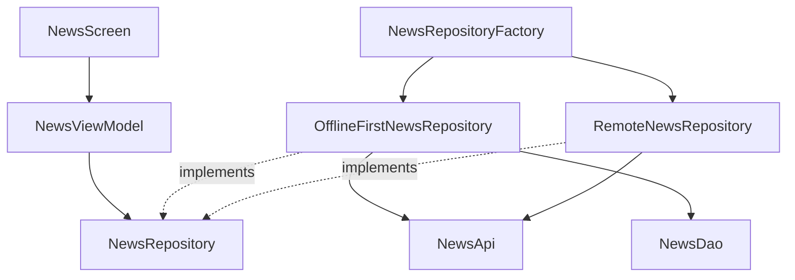

---

## 17.1. Repository interface

```kotlin
interface NewsRepository {

    suspend fun getNews(): List<News>
}
```

---

## 17.2. Remote implementation

```kotlin
class RemoteNewsRepository(
    private val api: NewsApi
) : NewsRepository {

    override suspend fun getNews(): List<News> {
        return api.getNews()
    }
}
```

---

## 17.3. Offline-first implementation

```kotlin
class OfflineFirstNewsRepository(
    private val api: NewsApi,
    private val dao: NewsDao
) : NewsRepository {

    override suspend fun getNews(): List<News> {

        val localNews =
            dao.getNews()

        if (localNews.isNotEmpty()) {
            return localNews
        }

        val remoteNews =
            api.getNews()

        dao.insertAll(remoteNews)

        return remoteNews
    }
}
```

Repository là vị trí phù hợp để điều phối các data source; Android Developers mô tả repository là thành phần chịu trách nhiệm expose data, điều phối nguồn dữ liệu và che giấu data source khỏi các layer phía trên. ([Android Developers][2])

---

# 18. Factory

```kotlin
enum class NewsMode {

    ONLINE_ONLY,

    OFFLINE_FIRST
}
```

```kotlin
class NewsRepositoryFactory(
    private val api: NewsApi,
    private val dao: NewsDao
) {

    fun create(
        mode: NewsMode
    ): NewsRepository {

        return when (mode) {

            NewsMode.ONLINE_ONLY -> {
                RemoteNewsRepository(
                    api = api
                )
            }

            NewsMode.OFFLINE_FIRST -> {
                OfflineFirstNewsRepository(
                    api = api,
                    dao = dao
                )
            }
        }
    }
}
```

Consumer:

```kotlin
val repository =
    repositoryFactory.create(
        NewsMode.OFFLINE_FIRST
    )
```

---

# 19. ViewModel không biết implementation

```kotlin
class NewsViewModel(
    private val repository: NewsRepository
) : ViewModel() {

    private val _uiState =
        MutableStateFlow<NewsUiState>(
            NewsUiState.Loading
        )

    val uiState:
        StateFlow<NewsUiState> =
        _uiState.asStateFlow()

    fun loadNews() {

        viewModelScope.launch {

            _uiState.value =
                NewsUiState.Loading

            runCatching {
                repository.getNews()
            }
                .onSuccess {

                    _uiState.value =
                        NewsUiState.Success(it)
                }
                .onFailure {

                    _uiState.value =
                        NewsUiState.Error(
                            it.message ?: "Unknown error"
                        )
                }
        }
    }
}
```

Dependency:

```text
NewsViewModel
       ↓
NewsRepository
```

không phải:

```text
NewsViewModel
       ↓
OfflineFirstNewsRepository
       ↓
Retrofit
       ↓
Room
```

---

# 20. Factory và UI State

Factory thường **không trực tiếp quản lý UI state**.

Factory chỉ có trách nhiệm:

```text
Create dependency
```

Sau khi dependency được tạo:

```text
Repository
    ↓
ViewModel
    ↓
StateFlow<UiState>
    ↓
Compose
```

Ví dụ:

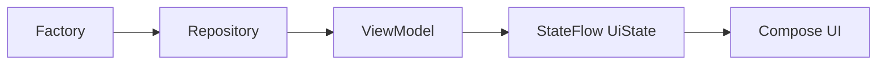

Android architecture khuyến nghị UI được điều khiển bởi UI state và UDF; `ViewModel` là một state holder phổ biến cho screen-level UI. ([Android Developers][2])

---

# 21. Factory và Lifecycle

Đây là phần rất quan trọng trong Android.

Không phải object nào Factory tạo ra cũng nên có cùng lifecycle.

Ví dụ:

```text
Application
│
├── Database
├── Retrofit
└── Repository
```

có thể tồn tại lâu.

Trong khi:

```text
Screen
   ↓
ViewModel
```

có scope gắn với destination/screen.

AndroidX `ViewModelProvider` tồn tại chính xác để lấy hoặc tạo `ViewModel` trong `ViewModelStoreOwner` thích hợp; factory chỉ tham gia khi một instance mới cần được tạo. ([Android Developers][6])

### Không nên

```kotlin
fun createRepository(): Repository {
    return Repository()
}
```

ở mọi recomposition của Compose.

Ví dụ nguy hiểm:

```kotlin
@Composable
fun Screen() {

    val repository =
        RepositoryFactory.create()

    // ...
}
```

vì việc tạo dependency trong UI làm ownership và lifetime của dependency khó kiểm soát hơn.

---

# 22. Factory và Configuration Change

Rotate màn hình:

```text
Activity bị recreate
        ↓
Compose UI được dựng lại
        ↓
ViewModel có thể được giữ
```

Factory không nên được hiểu là:

```text
rotate
  ↓
tạo lại ViewModel bắt buộc
```

`ViewModelProvider` trước tiên làm việc với scope/ViewModelStore; Factory là cơ chế tạo instance khi instance phù hợp chưa tồn tại. ([Android Developers][6])

---

# 23. Testing — lợi ích lớn của Factory

Ta có production dependency:

```text
NewsViewModel
     ↓
NewsRepository
```

Trong production:

```text
NewsRepository
     ↓
OfflineFirstNewsRepository
```

Trong test:

```text
NewsRepository
     ↓
FakeNewsRepository
```

---

## Fake repository

```kotlin
class FakeNewsRepository(
    private val news:
        List<News> = emptyList()
) : NewsRepository {

    override suspend fun getNews():
        List<News> {

        return news
    }
}
```

Test:

```kotlin
@Test
fun loadNews_success() = runTest {

    val fakeRepository =
        FakeNewsRepository(
            news = listOf(
                News(
                    id = "1",
                    title = "Android"
                )
            )
        )

    val viewModel =
        NewsViewModel(
            repository = fakeRepository
        )

    viewModel.loadNews()

    advanceUntilIdle()

    val state =
        viewModel.uiState.value

    assertTrue(
        state is NewsUiState.Success
    )
}
```

Android architecture hiện khuyến nghị unit test ViewModel và data layer, đồng thời ưu tiên **fake** hơn mock trong nhiều trường hợp. ([Android Developers][4])

---

# 24. Test Factory riêng

Nếu Factory chứa logic:

```text
ONLINE_ONLY
OFFLINE_FIRST
```

thì bản thân Factory cũng nên được test.

```kotlin
@Test
fun offlineMode_returnsOfflineRepository() {

    val factory =
        NewsRepositoryFactory(
            api = FakeNewsApi(),
            dao = FakeNewsDao()
        )

    val repository =
        factory.create(
            NewsMode.OFFLINE_FIRST
        )

    assertTrue(
        repository
            is OfflineFirstNewsRepository
    )
}
```

Test tương tự:

```kotlin
@Test
fun onlineMode_returnsRemoteRepository() {
    // ...
}
```

---

# 25. Dependency direction đúng

Mục tiêu bài thực hành ban đầu yêu cầu:

> Draw the dependency direction for this concept.

Một cấu trúc tốt:

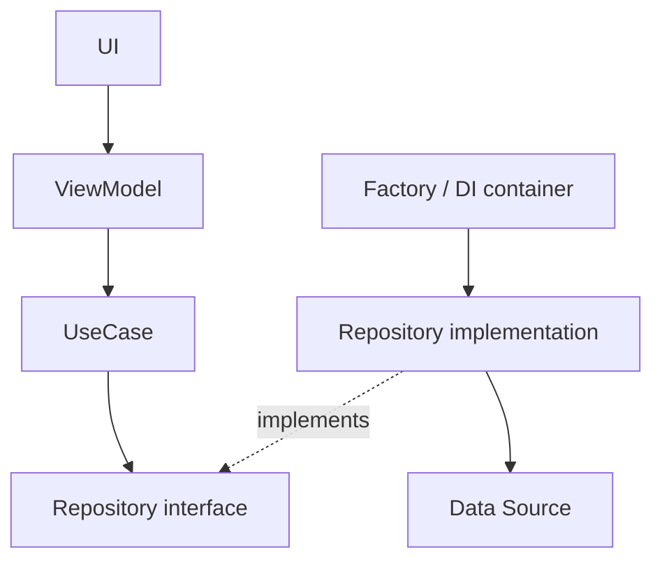

Điểm đáng chú ý:

```text
ViewModel
   ↓
Repository abstraction
```

thay vì:

```text
ViewModel
   ↓
Retrofit
```

Android Developers cũng khuyến nghị ViewModel/UI không tương tác trực tiếp với database, DataStore, Firebase API hay các data source tương tự mà nên đi qua repository. ([Android Developers][4])

---

# 26. Factory Pattern ảnh hưởng gì tới maintainability?

### Không dùng abstraction

```text
ViewModel
 ├── Retrofit
 ├── Room
 ├── Firebase
 └── SharedPreferences
```

Một thay đổi ở infrastructure có thể lan tới UI/business code.

### Có abstraction + factory/DI

```text
ViewModel
    ↓
Repository
    ↑
Factory
    ↓
Implementation
```

Implementation được cô lập tốt hơn.

---

# 27. Factory Pattern và Open/Closed Principle

Giả sử ban đầu:

```text
RemoteRepository
```

sau này thêm:

```text
OfflineFirstRepository
```

Consumer vẫn chỉ dùng:

```kotlin
NewsRepository
```

Factory hoặc dependency graph chịu trách nhiệm lựa chọn implementation.

```text
Consumer
   ↓
Interface
   ↑
 ┌─┴─────────────┐
 │               │
Remote        OfflineFirst
```

Điều này giảm lý do khiến UI/business consumer phải thay đổi khi chiến lược khởi tạo dependency thay đổi.

---

# 28. Factory Pattern và Single Responsibility

Không Factory:

```kotlin
class ViewModel {

    // UI/business logic

    // tạo Retrofit

    // tạo database

    // tạo repository
}
```

Có Factory/DI:

```text
ViewModel
    → state + business interaction

Factory
    → object creation

Repository
    → data operations

DataSource
    → source-specific operations
```

Đây cũng phù hợp với separation of concerns trong kiến trúc Android nhiều layer. ([Android Developers][2])

---

# 29. Khi nào nên sử dụng Factory?

Factory đặc biệt hữu ích khi:

```text
Việc tạo object phức tạp
        │
        ├── nhiều dependencies
        │
        ├── nhiều implementations
        │
        ├── runtime configuration
        │
        ├── build variant
        │
        ├── test / production
        │
        └── object cần construction rules
```

Ví dụ:

```kotlin
when (environment) {

    Environment.DEV ->
        FakePaymentService()

    Environment.PROD ->
        RealPaymentService()
}
```

Thay vì để logic này nằm rải rác ở:

```text
Activity
ViewModel
Service
Worker
```

ta gom nó vào composition/factory layer.

---

# 30. Khi nào KHÔNG nên dùng Factory?

Không cần:

```kotlin
class Formatter
```

mà lại viết:

```kotlin
class FormatterFactory {

    fun create(): Formatter {
        return Formatter()
    }
}
```

nếu:

```text
chỉ có 1 implementation
+
constructor đơn giản
+
không có dependency đặc biệt
+
không cần thay implementation
```

thì:

```kotlin
Formatter()
```

có thể rõ ràng hơn.

Factory là công cụ để giảm complexity ở consumer, không phải để tạo thêm boilerplate.

---

# 31. Một anti-pattern thường gặp

## Factory khổng lồ

```kotlin
class AppFactory {

    fun createUserRepository()

    fun createPaymentRepository()

    fun createNewsRepository()

    fun createProfileViewModel()

    fun createHomeViewModel()

    fun createLogger()

    fun createDatabase()

    fun createApi()

    fun createWorker()

    fun createAnalytics()

    // ...
}
```

Khi factory biết mọi thứ:

```text
God Factory
```

nó có thể trở thành dependency hub rất khó bảo trì.

Trong ứng dụng lớn, dependency graph/DI framework như Hilt thường phù hợp hơn việc tự duy trì một factory khổng lồ. Android hiện khuyến nghị Hilt khi ứng dụng có nhiều screen/ViewModel hoặc dependency graph phức tạp. ([Android Developers][4])

---

# 32. Factory không nên chứa business logic

Không nên:

```kotlin
class PaymentFactory {

    fun create(
        user: User
    ): PaymentService {

        if (user.balance < 100000) {
            // business rule
        }

        // ...
    }
}
```

Factory nên tập trung vào:

```text
Object creation
Object configuration
Implementation selection
Dependency assembly
```

Business rule nên thuộc:

```text
UseCase
Domain
Repository
```

tùy kiến trúc.

---

# 33. Debugging với Factory

Khi debug hãy theo dõi:

```text
Factory được gọi ở đâu?
        ↓
Implementation nào được chọn?
        ↓
Dependency nào được truyền vào?
        ↓
Object có đúng scope không?
```

Ví dụ:

```kotlin
class NewsRepositoryFactory {

    fun create(
        mode: NewsMode
    ): NewsRepository {

        Log.d(
            "RepositoryFactory",
            "Creating repository: $mode"
        )

        // ...
    }
}
```

Trong production, logging phải tránh đưa thông tin nhạy cảm của user vào log.

---

# 34. Production considerations

## Lifecycle

Kiểm tra:

```text
Factory có tạo object quá nhiều lần không?
```

Đặc biệt với:

```text
Database
Retrofit
Repository
Cache
```

---

## State

Factory không nên trở thành nơi lưu UI state.

Không nên:

```kotlin
object ViewModelFactory {

    var selectedArticleId: String? = null
}
```

State nên ở nơi có ownership/lifecycle rõ ràng như:

```text
ViewModel
SavedStateHandle
Repository
database
```

tùy loại state.

---

## Network

Factory có thể lựa chọn implementation:

```text
Production API
Mock API
Offline API
```

nhưng retry/error handling không nên tự động bị nhồi hết vào Factory.

---

## Testing

Cần kiểm tra:

```text
Factory mapping

ONLINE → RemoteRepository

OFFLINE → OfflineRepository
```

và test business code thông qua fake dependency.

---

## Release

Nếu Factory chọn implementation dựa trên:

```text
BuildConfig
Feature flag
Environment
```

release checklist cần kiểm tra đúng implementation production.

Ví dụ lỗi nguy hiểm:

```text
Release APK
    ↓
Factory
    ↓
FakePaymentService
```

---

# 35. So sánh trước và sau refactor

## Trước

```kotlin
class ProfileViewModel : ViewModel() {

    private val api =
        RetrofitProfileApi()

    private val dao =
        RoomProfileDao()

    private val repository =
        ProfileRepositoryImpl(
            api,
            dao
        )
}
```

Dependency:

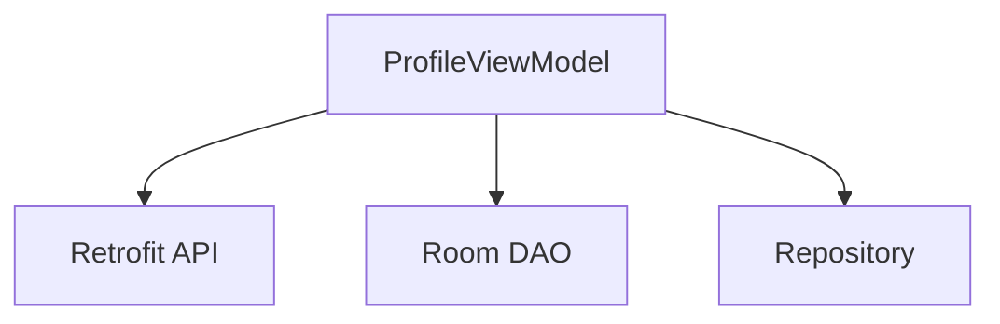

---

## Sau

```kotlin
class ProfileViewModel(
    private val repository:
        ProfileRepository
) : ViewModel()
```

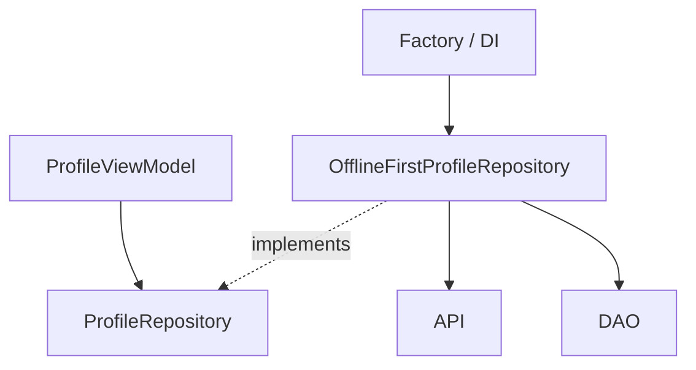

Kết quả là trách nhiệm tạo dependency đã rời khỏi `ViewModel`.

---

# 36. Bài thực hành

## Yêu cầu

Xây dựng màn hình:

```text
ProductScreen
```

hiển thị danh sách sản phẩm.

Architecture:

```text
ProductScreen
      ↓
ProductViewModel
      ↓
ProductRepository
      ↓
ProductApi
```

Tạo hai implementation:

```text
RemoteProductRepository

FakeProductRepository
```

Sau đó tạo:

```text
ProductRepositoryFactory
```

---

## Folder structure gợi ý

```text
com.example.shop
│
├── data
│   ├── remote
│   │   └── ProductApi.kt
│   │
│   └── repository
│       ├── ProductRepository.kt
│       ├── RemoteProductRepository.kt
│       └── ProductRepositoryFactory.kt
│
├── ui
│   └── product
│       ├── ProductScreen.kt
│       ├── ProductUiState.kt
│       └── ProductViewModel.kt
│
└── di
    └── AppContainer.kt
```

---

# 37. Bài tập refactor

Cho code:

```kotlin
class ProductViewModel : ViewModel() {

    private val api =
        RetrofitProductApi()

    private val repository =
        RemoteProductRepository(api)

    fun loadProducts() {
        // ...
    }
}
```

Hãy refactor thành:

```text
ProductViewModel
       ↓
ProductRepository
```

và đưa creation logic ra:

```text
AppContainer
      ↓
RepositoryFactory
```

Mục tiêu cuối:

```kotlin
class ProductViewModel(
    private val repository:
        ProductRepository
) : ViewModel()
```

---

# 38. Bài tập nâng cao

Tạo ba mode:

```kotlin
enum class DataMode {

    REMOTE,

    OFFLINE_FIRST,

    FAKE
}
```

Factory:

```text
REMOTE
    ↓
RemoteProductRepository

OFFLINE_FIRST
    ↓
OfflineFirstProductRepository

FAKE
    ↓
FakeProductRepository
```

Viết unit test đảm bảo Factory trả đúng implementation.

---

# 39. Artifact portfolio nên tạo

Một mini project:

```text
factory-pattern-android/
│
├── app/
├── screenshots/
│   └── product-screen.png
│
├── diagrams/
│   └── architecture.md
│
├── README.md
└── tests/
```

README nên trình bày:

```text
Problem
   ↓
Factory Pattern
   ↓
Architecture
   ↓
Implementation
   ↓
Testing
   ↓
Trade-offs
```

---

# 40. README mẫu

```markdown
# Factory Pattern Android Demo

## Problem

ProductViewModel originally created
its Repository and API directly.

## Solution

Object creation was moved into
a Factory / composition layer.

## Architecture

UI
↓
ViewModel
↓
Repository
↓
DataSource

Factory creates the concrete Repository.

## Benefits

- Lower coupling
- Easier testing
- Replaceable implementations
- Clear dependency construction

## Testing

FakeProductRepository is injected
into ProductViewModel for unit tests.
```

---

# 41. Checklist hoàn thành

* [ ] Giải thích được Factory Pattern.
* [ ] Hiểu vấn đề direct instantiation gây ra.
* [ ] Biết Product và Concrete Product.
* [ ] Viết được Simple Factory.
* [ ] Hiểu Factory Method ở mức cơ bản.
* [ ] Hiểu Abstract Factory ở mức cơ bản.
* [ ] Biết `ViewModelProvider.Factory`.
* [ ] Biết dùng `viewModelFactory`.
* [ ] Biết Factory liên quan thế nào đến DI.
* [ ] Biết Hilt có thể sinh ViewModel factory.
* [ ] UI không trực tiếp tạo Repository/API/DAO.
* [ ] Có Repository interface.
* [ ] Có Fake Repository.
* [ ] Có unit test ViewModel.
* [ ] Có test Factory nếu Factory chứa selection logic.
* [ ] Hiểu lifecycle/scope của object.
* [ ] Không lưu UI state trong Factory.
* [ ] Có diagram dependency.
* [ ] Có README hoặc demo cho portfolio.

---

# 42. Câu hỏi tự kiểm tra

### Câu 1

Factory Pattern giải quyết vấn đề gì?

**Trả lời ngắn:**

> Tách logic tạo object khỏi nơi sử dụng object.

---

### Câu 2

Tại sao đoạn này không tốt?

```kotlin
class ViewModel {

    val repository =
        Repository(
            RetrofitApi(),
            RoomDao()
        )
}
```

Vì `ViewModel` bị coupling với cả construction logic và concrete infrastructure.

---

### Câu 3

Factory có phải Dependency Injection không?

**Không hoàn toàn.**

```text
Factory → cơ chế tạo object.

DI → cơ chế cung cấp dependency từ bên ngoài.
```

Chúng thường được dùng cùng nhau.

---

### Câu 4

Ví dụ Factory quan trọng trong Android?

```text
ViewModelProvider.Factory
```

AndroidX dùng cơ chế này để tạo `ViewModel` có dependency trong scope thích hợp. ([Android Developers][1])

---

### Câu 5

Dùng Hilt rồi có cần tự tạo `ViewModelProvider.Factory`?

Thông thường **không** đối với `@HiltViewModel`; Hilt có thể sinh factory cần thiết. Một số trường hợp runtime-assisted dependency vẫn có cơ chế assisted factory riêng. ([Android Developers][1])

---

# 43. Ghi nhớ nhanh

```text
             FACTORY PATTERN

                    │
                    ▼
         Tách object creation
         khỏi object usage
                    │
          ┌─────────┼─────────┐
          ▼         ▼         ▼
       Factory    Product   Concrete
                    │       Product
                    │
                    ▼
              Abstraction
                    │
          ┌─────────┴─────────┐
          ▼                   ▼
      Production             Fake
          │                   │
          └─────────┬─────────┘
                    ▼
               Consumer
                    │
                    ▼
             ViewModel / UseCase
```

---

# 44. Factory Pattern trong tổng thể Android Architecture

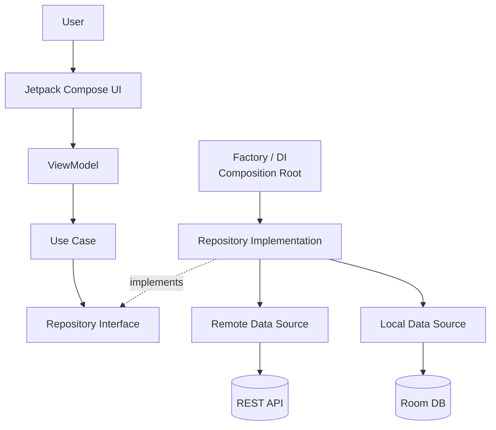

Kiến trúc Android hiện tại của Google khuyến nghị separation of concerns, UI/data layers rõ ràng, repository làm ranh giới data layer và dependency injection để quản lý dependency. ([Android Developers][2])

---

# 45. Tổng kết

**Factory Pattern** không đơn giản là tạo một class có hậu tố `Factory`.

Giá trị thật của pattern nằm ở việc thay đổi dependency:

```text
Consumer
   ↓
Concrete Implementation
```

thành:

```text
Consumer
   ↓
Abstraction

Factory / DI
   ↓
Concrete Implementation
```

Trong Android, tư duy này xuất hiện rất rõ ở:

```text
ViewModelProvider.Factory
Repository abstraction
Manual Dependency Injection
AppContainer
Hilt
Fake implementations
```

`ViewModelProvider.Factory` là ví dụ trực tiếp về object-creation abstraction trong AndroidX, trong khi kiến trúc Android hiện đại ưu tiên constructor injection và có thể dùng Hilt để tự động quản lý dependency graph và sinh factory cho `@HiltViewModel`. ([Android Developers][1])

Cách học hiệu quả nhất cho bài **021 - Factory Pattern** là tự refactor một màn hình từ:

```text
UI/ViewModel
    ↓
new Repository(...)
```

sang:

```text
UI
 ↓
ViewModel
 ↓
Repository abstraction

Factory / DI
 ↓
Repository implementation
 ↓
API / DAO
```

Sau đó thay production repository bằng `FakeRepository` trong unit test. Khi làm được bước đó, Factory Pattern không còn chỉ là một design pattern lý thuyết mà đã trở thành một phần của tư duy thiết kế architecture Android.

[1]: https://developer.android.com/topic/libraries/architecture/viewmodel/viewmodel-factories "Create ViewModels with dependencies  |  App architecture  |  Android Developers"
[2]: https://developer.android.com/topic/architecture "Guide to app architecture  |  App architecture  |  Android Developers"
[3]: https://developer.android.com/topic/architecture/data-layer?utm_source=chatgpt.com "Data layer | App architecture"
[4]: https://developer.android.com/topic/architecture/recommendations "Recommendations for Android architecture  |  App architecture  |  Android Developers"
[5]: https://developer.android.com/training/dependency-injection "Dependency injection in Android  |  App architecture  |  Android Developers"
[6]: https://developer.android.com/topic/libraries/architecture/views/viewmodel/viewmodel-apis-views?utm_source=chatgpt.com "ViewModel Scoping APIs (Views)"

---

# Bài luyện tập

## Mục tiêu


## Đề bài


## Yêu cầu hoàn thành

- [ ] 
- [ ] 
- [ ] 

## Kết quả / lời giải


## Ghi chú
