# 022 - Observer Pattern

| Thuộc tính              | Nội dung                                                     |
| ----------------------- | ------------------------------------------------------------ |
| **Học phần**            | 03 - Architecture, State and Data                            |
| **Module**              | Module 05 - Design and Architecture                          |
| **Nhóm nội dung**       | Design Patterns                                              |
| **Nguồn roadmap**       | Design and Architecture / Design Patterns                    |
| **Loại bài**            | Architecture                                                 |
| **Thứ tự trong module** | 022                                                          |
| **Thời lượng gợi ý**    | 34 phút                                                      |
| **Ngôn ngữ ví dụ**      | Kotlin                                                       |
| **Bối cảnh**            | Android / Jetpack Compose / ViewModel / StateFlow / LiveData |

---

## 1. Tóm tắt

**Observer Pattern** là một design pattern trong đó một object giữ trạng thái — thường gọi là **Subject**, **Publisher** hoặc **Observable** — cho phép nhiều object khác đăng ký theo dõi.

Khi trạng thái của Subject thay đổi:

```text
Subject thay đổi
      ↓
Thông báo
      ↓
Observer A
Observer B
Observer C
```

Các Observer không cần liên tục hỏi:

```kotlin
while (true) {
    val value = repository.getValue()
}
```

mà chỉ phản ứng khi có dữ liệu mới.

Trong Android, tư duy này xuất hiện rất nhiều ở:

```text
LiveData
StateFlow
SharedFlow
Compose State
Room Flow
Lifecycle observer
callbacks/listeners
```

Trong đó, `LiveData` là một ví dụ rất trực tiếp: đây là một observable data holder có nhận biết lifecycle, và Android chỉ thông báo cho Observer khi `LifecycleOwner` đang ở trạng thái hoạt động phù hợp. ([Android Developers][1])

---

## 2. Mục tiêu học tập

Sau bài này, bạn nên:

* giải thích được Observer Pattern bằng ngôn ngữ của mình;
* hiểu `Subject`, `Observer`, `subscribe`, `unsubscribe`, `notify`;
* tự viết được Observer Pattern bằng Kotlin;
* hiểu Observer Pattern xuất hiện như thế nào trong Android;
* phân biệt Observer Pattern với polling;
* hiểu `LiveData`, `StateFlow` và Compose State dưới góc nhìn reactive/observable;
* biết cách collect `StateFlow` theo lifecycle;
* tránh memory leak do observer/listener không được hủy;
* hiểu Observer liên quan thế nào đến UDF;
* biết test state stream;
* refactor một màn hình Android sang kiến trúc reactive;
* tạo được artifact nhỏ cho portfolio.

---

# 3. Vấn đề Observer Pattern giải quyết

Giả sử ứng dụng hiển thị số lượng sản phẩm trong giỏ hàng ở nhiều nơi:

```text
CartScreen
Toolbar badge
CheckoutScreen
MiniCart
```

Khi user thêm sản phẩm:

```text
Cart count: 2 → 3
```

Ta muốn tất cả nơi đang quan tâm tự cập nhật.

### Cách không tốt

Mỗi component tự hỏi:

```kotlin
val count = cartRepository.getCartCount()
```

rồi lặp lại liên tục:

```text
UI ── hỏi ──> Repository
UI ── hỏi ──> Repository
UI ── hỏi ──> Repository
UI ── hỏi ──> Repository
```

Đây là **polling**.

Nó có thể:

* gây nhiều truy vấn không cần thiết;
* tạo coupling;
* khó đồng bộ;
* tốn tài nguyên;
* khiến UI dễ hiển thị state cũ.

---

# 4. Ý tưởng của Observer Pattern

Thay vì Observer đi hỏi Subject:

```text
Observer → Subject
```

Subject sẽ chủ động phát thông báo:

```text
Subject
   │
   ├──→ Observer A
   ├──→ Observer B
   └──→ Observer C
```

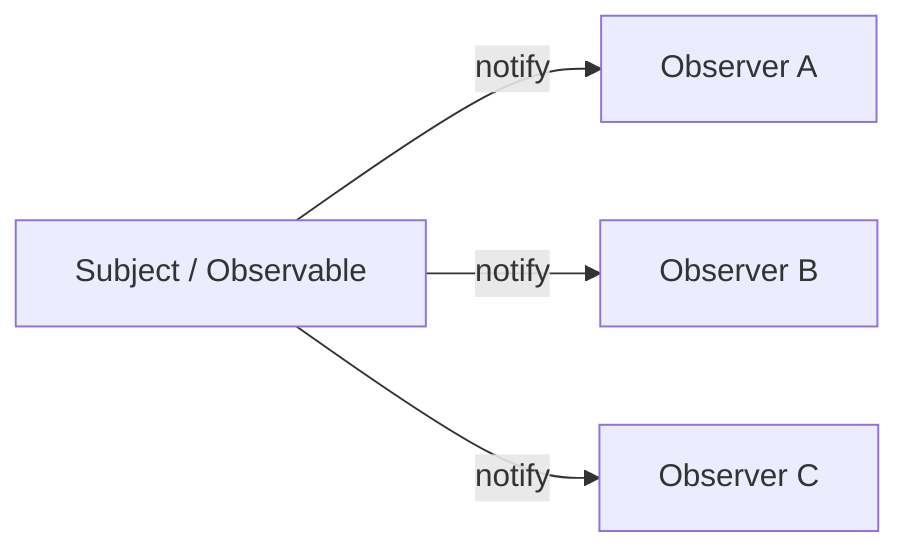

---

# 5. Thành phần của Observer Pattern

Pattern cơ bản gồm:

```text
Subject
 ├── subscribe()
 ├── unsubscribe()
 └── notifyObservers()

Observer
 └── update()
```

Sơ đồ:

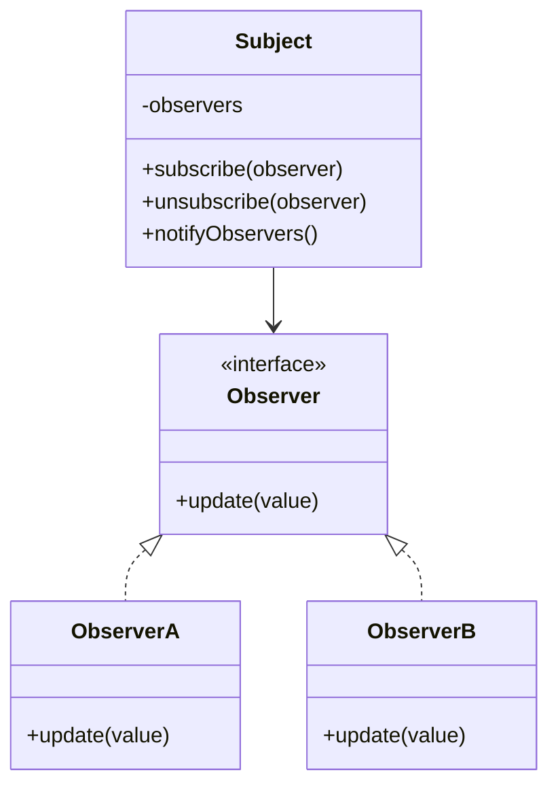

---

# 6. Observer Pattern thuần Kotlin

Trước khi dùng Android API, hãy tự xây một phiên bản đơn giản.

## Observer

```kotlin
fun interface Observer<T> {

    fun onChanged(value: T)
}
```

## Subject

```kotlin
class ObservableData<T>(
    initialValue: T
) {

    private val observers =
        mutableSetOf<Observer<T>>()

    private var value: T = initialValue

    fun subscribe(
        observer: Observer<T>
    ) {
        observers += observer

        observer.onChanged(value)
    }

    fun unsubscribe(
        observer: Observer<T>
    ) {
        observers -= observer
    }

    fun setValue(
        newValue: T
    ) {
        value = newValue

        notifyObservers()
    }

    private fun notifyObservers() {

        observers.forEach {
            it.onChanged(value)
        }
    }
}
```

---

# 7. Sử dụng

```kotlin
val cartCount =
    ObservableData(0)
```

Observer thứ nhất:

```kotlin
val toolbarObserver =
    Observer<Int> { count ->

        println(
            "Toolbar: $count"
        )
    }
```

Observer thứ hai:

```kotlin
val checkoutObserver =
    Observer<Int> { count ->

        println(
            "Checkout: $count"
        )
    }
```

Đăng ký:

```kotlin
cartCount.subscribe(
    toolbarObserver
)

cartCount.subscribe(
    checkoutObserver
)
```

Thay đổi:

```kotlin
cartCount.setValue(3)
```

Kết quả:

```text
Toolbar: 3
Checkout: 3
```

---

# 8. Luồng Observer

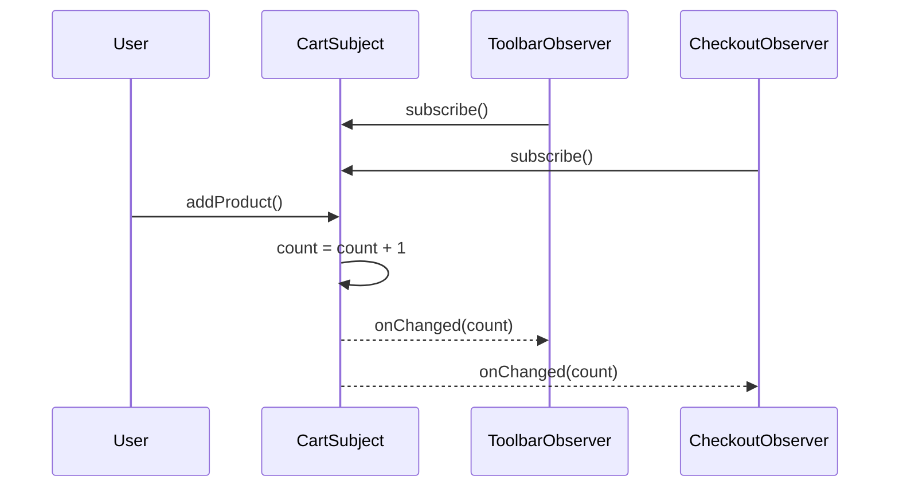

Subject không cần biết:

```text
Toolbar làm gì
Checkout hiển thị gì
UI render thế nào
```

Nó chỉ biết:

> Có những Observer muốn nhận state mới.

---

# 9. Observer Pattern trong Android

Trong Android hiện đại, ta hiếm khi tự viết `Subject` như ví dụ trên.

Framework/library đã cung cấp nhiều primitive tương tự:

| Android/Kotlin API              | Vai trò                            |
| ------------------------------- | ---------------------------------- |
| `LiveData<T>`                   | Observable state holder            |
| `Observer<T>`                   | Observer của LiveData              |
| `StateFlow<T>`                  | State stream có giá trị hiện tại   |
| `SharedFlow<T>`                 | Stream chia sẻ cho nhiều collector |
| `Flow<T>`                       | Stream dữ liệu bất đồng bộ         |
| Compose `State<T>`              | Observable state cho Compose       |
| `collectAsStateWithLifecycle()` | Collect Flow theo lifecycle        |
| Room `Flow<T>`                  | Theo dõi thay đổi dữ liệu DB       |
| Listener/callback               | Observer dạng callback             |

`StateFlow` giữ state hiện tại và phát giá trị hiện tại/các state mới cho collector; `SharedFlow` hỗ trợ phát dữ liệu tới nhiều consumer. ([Android Developers][2])

---

# 10. Observer Pattern và Android Architecture

Trong Android Architecture hiện đại:

```text
Data Layer
     ↓
ViewModel
     ↓
Observable UI State
     ↓
UI
```

Android hiện khuyến nghị UI state được expose thông qua observable state holder như `StateFlow`, để UI phản ứng với state mới thay vì tự pull dữ liệu từ `ViewModel`. ([Android Developers][3])

### Ảnh minh họa chính thức — UDF Android


Trong hình:

```text
Application data
      ↓
ViewModel
      ↓
UI State
      ↓
UI

UI event
      ↑
ViewModel
```

Đây là nền tảng rất quan trọng để hiểu Observer trong Android hiện đại. ([Android Developers][3])

---

# 11. Observer Pattern và Unidirectional Data Flow

Observer chỉ giải quyết:

```text
State thay đổi
      ↓
Consumer biết state mới
```

Trong Android, nó thường kết hợp với **UDF — Unidirectional Data Flow**:

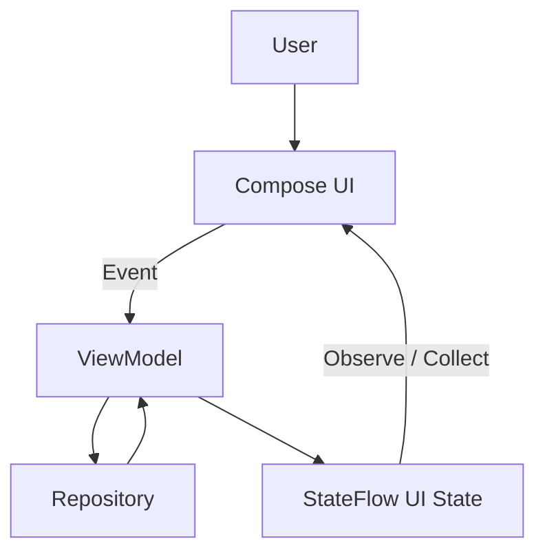

Android mô tả UDF theo chu trình:

1. UI gửi event lên `ViewModel`.
2. `ViewModel` xử lý.
3. State thay đổi.
4. State mới được đưa xuống UI.
5. UI render lại. ([Android Developers][3])

---

# 12. Ảnh minh họa — Observer trong chu trình UI


Ví dụ trong tài liệu Android:

```text
User bookmark article
        ↓
ViewModel
        ↓
Data layer cập nhật
        ↓
Application data mới
        ↓
ViewModel tạo UI state mới
        ↓
UI quan sát state
        ↓
UI cập nhật
```

Đây là ví dụ điển hình về kiến trúc reactive dựa trên observable state. ([Android Developers][3])

---

# 13. Observer với LiveData

`LiveData` thể hiện Observer Pattern khá trực tiếp.

ViewModel:

```kotlin
class ProfileViewModel :
    ViewModel() {

    private val _username =
        MutableLiveData<String>()

    val username:
        LiveData<String> =
        _username

    fun changeUsername(
        value: String
    ) {
        _username.value = value
    }
}
```

Fragment đăng ký observer:

```kotlin
viewModel.username.observe(
    viewLifecycleOwner
) { username ->

    binding.username.text =
        username
}
```

Có thể ánh xạ:

```text
MutableLiveData
      │
      └── Subject

Observer lambda
      │
      └── Observer

observe()
      │
      └── Subscribe
```

`LiveData` có nhận biết lifecycle và chỉ gửi update tới các observer đang active; observer gắn với `LifecycleOwner` cũng được tự động loại bỏ khi lifecycle đạt `DESTROYED`. ([Android Developers][1])

---

# 14. Lifecycle-aware Observer

Đây là điểm rất quan trọng trên Android.

Observer cổ điển:

```text
subscribe
   ↓
phải tự unsubscribe
```

Nếu quên:

```text
Subject
   ↓
giữ reference tới Activity
   ↓
Activity đã destroy
   ↓
memory leak
```

Ví dụ:

```kotlin
eventBus.register(this)
```

nhưng quên:

```kotlin
eventBus.unregister(this)
```

có thể tạo ra vòng đời dependency không đúng.

---

# 15. LiveData giải quyết lifecycle thế nào?

Ví dụ:

```kotlin
viewModel.user.observe(
    viewLifecycleOwner
) {
    render(it)
}
```

Luồng:

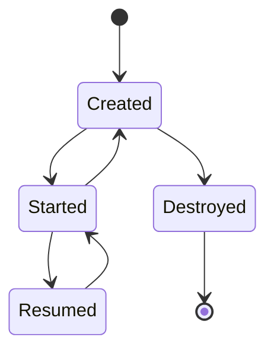

Với `LiveData`, observer được coi là active khi lifecycle ở `STARTED` hoặc `RESUMED`. Khi owner bị `DESTROYED`, subscription được gỡ tương ứng. ([Android Developers][1])

---

# 16. Observer với StateFlow

Trong ứng dụng Kotlin/Compose hiện đại, `StateFlow` rất thường được dùng để expose UI state.

```kotlin
data class ProfileUiState(
    val username: String = "",
    val loading: Boolean = false,
    val error: String? = null
)
```

ViewModel:

```kotlin
class ProfileViewModel(
    private val repository:
        ProfileRepository
) : ViewModel() {

    private val _uiState =
        MutableStateFlow(
            ProfileUiState()
        )

    val uiState:
        StateFlow<ProfileUiState> =
        _uiState.asStateFlow()

    fun updateUsername(
        username: String
    ) {

        _uiState.update {
            it.copy(
                username = username
            )
        }
    }
}
```

`StateFlow` là observable state holder: nó có state hiện tại và gửi state mới cho các collector. ([Android Developers][2])

---

# 17. Compose quan sát StateFlow

```kotlin
@Composable
fun ProfileRoute(
    viewModel: ProfileViewModel
) {

    val uiState by
        viewModel.uiState
            .collectAsStateWithLifecycle()

    ProfileScreen(
        state = uiState
    )
}
```

Khi:

```kotlin
_uiState.update {
    it.copy(
        username = "Khánh"
    )
}
```

luồng sẽ là:

```text
MutableStateFlow thay đổi
          ↓
StateFlow phát state mới
          ↓
collectAsStateWithLifecycle
          ↓
Compose State thay đổi
          ↓
Composable đọc state bị recompose
```

Tài liệu Android hiện khuyến nghị `collectAsStateWithLifecycle()` để collect Flow an toàn trong Compose; mặc định việc collect được quản lý theo lifecycle và bắt đầu ở `STARTED`. ([Android Developers][4])

---

# 18. Observer → StateFlow → Compose

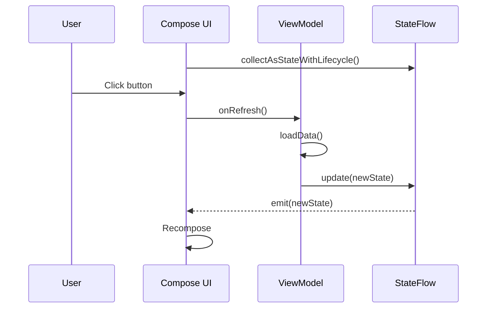

Đây là một biến thể reactive hiện đại của tư duy Observer.

---

# 19. Không mutate StateFlow từ UI

Không nên:

```kotlin
class ProfileViewModel :
    ViewModel() {

    val uiState =
        MutableStateFlow(
            ProfileUiState()
        )
}
```

UI có thể làm:

```kotlin
viewModel.uiState.value =
    ProfileUiState(...)
```

Lúc này UI trở thành một nguồn mutate state.

Nên:

```kotlin
private val _uiState =
    MutableStateFlow(
        ProfileUiState()
    )

val uiState =
    _uiState.asStateFlow()
```

UI chỉ:

```text
observe
```

ViewModel:

```text
mutate
```

Android khuyến nghị state owner là nơi chịu trách nhiệm cập nhật state mà nó expose, nhằm tránh nhiều nguồn sự thật cho cùng dữ liệu. ([Android Developers][3])

---

# 20. Observer + Repository

Ví dụ app theo dõi giỏ hàng:

```kotlin
interface CartRepository {

    val cart:
        Flow<List<CartItem>>

    suspend fun addProduct(
        productId: String
    )
}
```

Repository implementation:

```kotlin
class OfflineCartRepository(
    private val dao: CartDao
) : CartRepository {

    override val cart:
        Flow<List<CartItem>> =
        dao.observeCart()

    override suspend fun addProduct(
        productId: String
    ) {
        dao.addProduct(productId)
    }
}
```

ViewModel:

```kotlin
class CartViewModel(
    repository: CartRepository
) : ViewModel() {

    val uiState =
        repository.cart
            .map { items ->

                CartUiState(
                    items = items,
                    totalItems =
                        items.size
                )
            }
            .stateIn(
                scope = viewModelScope,
                started =
                    SharingStarted
                        .WhileSubscribed(5_000),
                initialValue =
                    CartUiState()
            )
}
```

---

# 21. Dependency Direction

Bài thực hành yêu cầu:

> Draw the dependency direction for this concept.

Ta có:

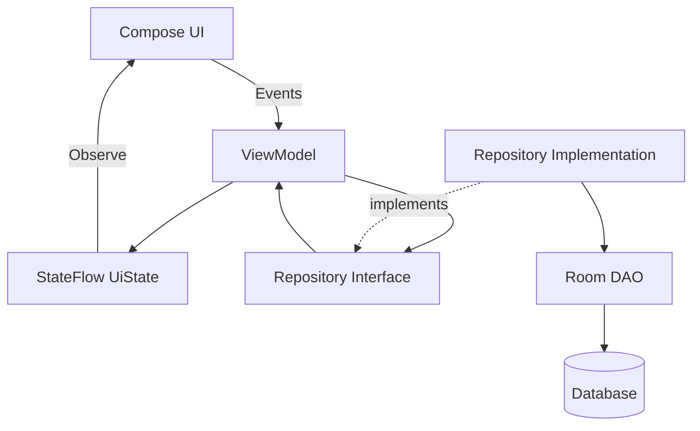

Điểm quan trọng:

```text
UI không observe database trực tiếp
```

mà:

```text
Data
 ↓
Repository
 ↓
ViewModel
 ↓
UI State
 ↓
UI
```

Android Architecture Guide khuyến nghị `ViewModel` làm screen-level state holder, lấy dữ liệu thông qua data/domain layer rồi expose state để UI consume. ([Android Developers][3])

---

# 22. Observer và State Holder

Trong Android:

```text
Subject
```

không nhất thiết là một class tên `Subject`.

Nó có thể là:

```text
StateFlow<UiState>
LiveData<UiState>
State<T>
Flow<T>
```

Observer có thể là:

```text
Fragment
Activity
Composable
ViewModel
Repository
service
```

Ví dụ:

```text
Repository Flow
      ↓
ViewModel collects
      ↓
StateFlow
      ↓
Compose collects
```

Có thể có nhiều tầng observer.

---

# 23. Observer Pattern và Compose State

Compose cũng sử dụng mô hình observable state.

```kotlin
var count by remember {
    mutableIntStateOf(0)
}
```

UI:

```kotlin
Text(
    text = "$count"
)
```

Khi:

```kotlin
count++
```

Compose phát hiện state đọc bởi composable đã thay đổi và schedule recomposition thích hợp. Android yêu cầu các loại observable bên ngoài, chẳng hạn `LiveData`, được chuyển thành Compose `State` trước khi đọc trong composable. ([Android Developers][5])

---

# 24. Observer Pattern và LiveData khác StateFlow thế nào?

|                         | LiveData           | StateFlow                       |
| ----------------------- | ------------------ | ------------------------------- |
| Observable              | Có                 | Có                              |
| Có state hiện tại       | Có                 | Có                              |
| Lifecycle-aware tự thân | Có                 | Không trực tiếp                 |
| Kotlin Flow API         | Không              | Có                              |
| Coroutine integration   | Hạn chế hơn        | Tốt                             |
| Compose                 | `observeAsState()` | `collectAsStateWithLifecycle()` |
| Views                   | Rất phù hợp        | `repeatOnLifecycle()`           |
| Multi-platform Kotlin   | Không              | Có                              |

`LiveData` tự hiểu `LifecycleOwner`; `StateFlow` bản thân không biết Activity/Fragment lifecycle, vì vậy phía Android UI cần collect bằng lifecycle-aware APIs. ([Android Developers][1])

---

# 25. StateFlow không hoàn toàn giống GoF Observer

Cần phân biệt:

```text
Classic Observer Pattern
```

thường có:

```kotlin
subject.subscribe(observer)
subject.unsubscribe(observer)
observer.update()
```

Trong khi:

```text
StateFlow / Flow
```

sử dụng:

```kotlin
flow.collect {
    ...
}
```

Do đó:

> `StateFlow` không phải bản sao từng class của GoF Observer, nhưng cùng áp dụng tư tưởng reactive: producer phát thay đổi và consumer phản ứng với dữ liệu mới.

Đây là cách hiểu thực tế hơn khi học Android.

---

# 26. Observer và SharedFlow

`StateFlow` phù hợp với:

```text
STATE
```

ví dụ:

```text
Loading
Success
Error
User profile
Cart
Screen configuration
```

`SharedFlow` là stream chia sẻ có thể phục vụ nhiều consumer và hỗ trợ cấu hình replay/buffering. ([Android Developers][2])

Ví dụ:

```kotlin
private val _analytics =
    MutableSharedFlow<
        AnalyticsEvent
    >()

val analytics =
    _analytics.asSharedFlow()
```

Tuy nhiên với trạng thái màn hình, một `UiState` rõ ràng thường dễ reasoning hơn việc tạo quá nhiều event streams.

---

# 27. State và Event không giống nhau

Một lỗi phổ biến:

```text
State
=
Event
```

Thực tế:

### State

```text
Màn hình hiện tại là gì?
```

Ví dụ:

```kotlin
data class LoginUiState(
    val loading: Boolean,
    val username: String,
    val error: String?
)
```

### Event

```text
Điều gì vừa xảy ra?
```

Ví dụ:

```text
User clicked Login
User entered username
Retry clicked
```

Trong UDF:

```text
Event
  ↑
  UI
  ↓
State
```

Android hiện nhấn mạnh xử lý event trong `ViewModel` và phản ánh kết quả của event vào state thay vì xây dựng luồng event ViewModel→UI tùy tiện cho mọi trường hợp. ([Android Developers][6])

---

# 28. Ví dụ hoàn chỉnh — Product Screen

## UI State

```kotlin
data class ProductUiState(

    val loading: Boolean = false,

    val products:
        List<Product> =
        emptyList(),

    val error:
        String? = null
)
```

---

## Repository

```kotlin
interface ProductRepository {

    fun observeProducts():
        Flow<List<Product>>

    suspend fun refresh()
}
```

---

## ViewModel

```kotlin
class ProductViewModel(
    private val repository:
        ProductRepository
) : ViewModel() {

    val uiState:
        StateFlow<ProductUiState> =

        repository
            .observeProducts()
            .map { products ->

                ProductUiState(
                    products = products
                )
            }
            .catch {

                emit(
                    ProductUiState(
                        error =
                            it.message
                    )
                )
            }
            .stateIn(
                scope = viewModelScope,

                started =
                    SharingStarted
                        .WhileSubscribed(
                            5_000
                        ),

                initialValue =
                    ProductUiState(
                        loading = true
                    )
            )

    fun refresh() {

        viewModelScope.launch {
            repository.refresh()
        }
    }
}
```

---

# 29. Compose UI

```kotlin
@Composable
fun ProductRoute(
    viewModel:
        ProductViewModel
) {

    val state by
        viewModel.uiState
            .collectAsStateWithLifecycle()

    ProductScreen(
        state = state,
        onRefresh =
            viewModel::refresh
    )
}
```

Render:

```kotlin
@Composable
fun ProductScreen(
    state: ProductUiState,
    onRefresh: () -> Unit
) {

    when {

        state.loading -> {
            CircularProgressIndicator()
        }

        state.error != null -> {
            Text(
                state.error
            )
        }

        else -> {
            ProductList(
                products =
                    state.products
            )
        }
    }
}
```

---

# 30. Luồng toàn bộ Product App

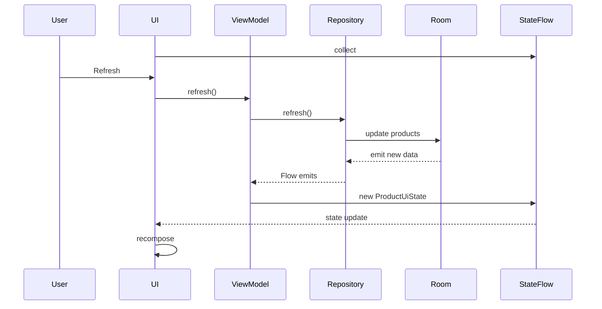

Observer không chỉ xuất hiện giữa:

```text
ViewModel → UI
```

mà còn:

```text
Room → Repository
Repository → ViewModel
ViewModel → UI
```

---

# 31. Lifecycle — phần quan trọng nhất khi dùng Observer

Một Observer tồn tại quá lâu có thể giữ:

```text
Activity
Fragment
View
Context
```

sau khi UI đã biến mất.

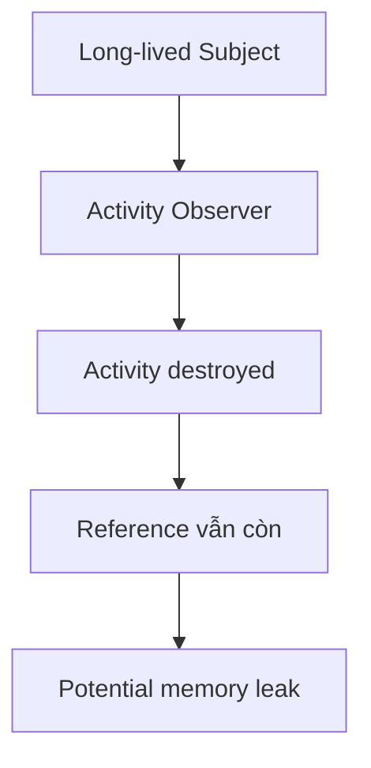

Các API lifecycle-aware giúp giảm rủi ro này. Android nhấn mạnh rằng việc không tôn trọng lifecycle có thể gây leak hoặc crash. ([Android Developers][7])

---

# 32. Compose: dùng `collectAsStateWithLifecycle`

Không nên đơn giản collect screen state bằng coroutine không gắn đúng lifecycle nếu điều đó làm collection tiếp tục khi UI không còn cần dữ liệu.

Ưu tiên:

```kotlin
val state by
    viewModel.uiState
        .collectAsStateWithLifecycle()
```

Android hiện khuyến nghị API này cho Compose Flow collection. ([Android Developers][8])

---

# 33. Views: dùng `repeatOnLifecycle`

Với Fragment/View system:

```kotlin
viewLifecycleOwner
    .lifecycleScope
    .launch {

        viewLifecycleOwner
            .repeatOnLifecycle(
                Lifecycle.State.STARTED
            ) {

                viewModel
                    .uiState
                    .collect {
                        render(it)
                    }
            }
    }
```

`repeatOnLifecycle` bắt đầu block khi lifecycle đạt state yêu cầu và hủy/relaunch collection khi lifecycle đi ra/vào state đó. ([Android Developers][9])

---

# 34. Anti-pattern: `GlobalScope.collect`

Không nên:

```kotlin
GlobalScope.launch {

    viewModel.uiState.collect {
        binding.text.text =
            it.title
    }
}
```

Vì coroutine không gắn lifecycle của Fragment.

Thay bằng:

```text
LifecycleOwner
      ↓
lifecycleScope
      ↓
repeatOnLifecycle
      ↓
collect
```

---

# 35. Anti-pattern: Observer chứa quá nhiều business logic

Không nên:

```kotlin
viewModel.products.observe(
    viewLifecycleOwner
) { products ->

    calculateDiscount()

    saveProducts()

    callApi()

    updateDatabase()

    calculateTax()

    // cuối cùng render
}
```

UI observer nên tập trung chủ yếu vào:

```text
State
  ↓
Render
```

Business logic nên nằm ở:

```text
ViewModel
UseCase
Repository
Data layer
```

tùy trách nhiệm.

Android Architecture Guide yêu cầu UI tập trung consume/display UI state và giữ business logic ngoài UI layer. ([Android Developers][3])

---

# 36. Anti-pattern: Observer chain quá sâu

Ví dụ:

```text
A observes B
B observes C
C observes D
D observes E
E observes F
```

Có thể dẫn tới:

```text
Ai update state?
↓
Khó biết

State phát từ đâu?
↓
Khó debug

Tại sao UI đổi?
↓
Khó trace
```

Nên duy trì dependency rõ:

```text
Repository
    ↓
ViewModel
    ↓
UiState
    ↓
UI
```

---

# 37. Anti-pattern: Circular Update

Ví dụ:

```text
Observer A
   ↓
updates B

Observer B
   ↓
updates A
```

có thể tạo:

```text
A → B → A → B → A ...
```

Ví dụ code:

```kotlin
flowA.collect {
    flowB.value = it
}

flowB.collect {
    flowA.value = it
}
```

Nếu không có guard, ta có thể tạo vòng update không mong muốn.

---

# 38. Anti-pattern: quá nhiều observable state

Ví dụ:

```kotlin
val loading: StateFlow<Boolean>

val products:
    StateFlow<List<Product>>

val error:
    StateFlow<String?>

val selected:
    StateFlow<Product?>

val count:
    StateFlow<Int>
```

Các stream có thể bị lệch thời điểm.

Nếu chúng mô tả cùng một màn hình, có thể gom:

```kotlin
data class ProductUiState(

    val loading: Boolean,

    val products:
        List<Product>,

    val error:
        String?,

    val selected:
        Product?,

    val count:
        Int
)
```

và:

```kotlin
val uiState:
    StateFlow<ProductUiState>
```

Android khuyến nghị cân nhắc một UI state stream duy nhất cho những giá trị có quan hệ với nhau để tăng tính nhất quán. ([Android Developers][3])

---

# 39. Observer và Configuration Change

`ViewModel` sống qua configuration changes của Activity/Fragment trong scope phù hợp.

Ví dụ:

```text
Rotate
  ↓
Activity recreate
  ↓
ViewModel được giữ
  ↓
StateFlow vẫn có current state
  ↓
UI mới subscribe
  ↓
Nhận state hiện tại
```

`StateFlow` giữ giá trị state hiện tại; Android cũng dùng nó làm observable state holder phù hợp cho screen state. ([Android Developers][2])

Tuy nhiên:

```text
ViewModel survival
≠
process death survival
```

State quan trọng cần phục hồi sau process recreation vẫn phải cân nhắc:

```text
SavedStateHandle
Room
DataStore
server
```

tùy loại dữ liệu.

---

# 40. Observer và Network

Một pipeline điển hình:

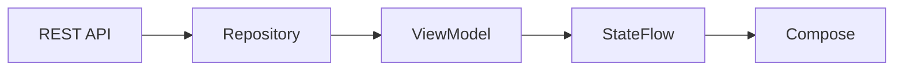

Nhưng error cũng cần được chuyển thành state:

```kotlin
sealed interface ProductsUiState {

    data object Loading :
        ProductsUiState

    data class Success(
        val products:
            List<Product>
    ) : ProductsUiState

    data class Error(
        val message: String
    ) : ProductsUiState
}
```

---

# 41. Observer và Testing

Lợi ích lớn của kiến trúc reactive là:

```text
Input
 ↓
ViewModel
 ↓
State emission
 ↓
Assert
```

Ví dụ:

```kotlin
@Test
fun refresh_updatesState() =
    runTest {

        val repository =
            FakeProductRepository()

        val viewModel =
            ProductViewModel(
                repository
            )

        repository.emitProducts(
            listOf(
                Product(
                    id = "1",
                    name = "Phone"
                )
            )
        )

        val state =
            viewModel.uiState
                .first {
                    it.products
                        .isNotEmpty()
                }

        assertEquals(
            1,
            state.products.size
        )
    }
```

---

# 42. Fake Repository

```kotlin
class FakeProductRepository :
    ProductRepository {

    private val products =
        MutableStateFlow<
            List<Product>
        >(emptyList())

    override fun observeProducts():
        Flow<List<Product>> =
        products

    fun emitProducts(
        value: List<Product>
    ) {
        products.value = value
    }

    override suspend fun refresh() {
        // fake
    }
}
```

Điều này tạo **test seam** rõ ràng:

```text
ViewModel
    ↓
ProductRepository
    ↑
ProductionRepository
    hoặc
FakeRepository
```

---

# 43. Test Observer thuần Kotlin

```kotlin
@Test
fun observer_receivesUpdate() {

    val subject =
        ObservableData(0)

    var received = -1

    val observer =
        Observer<Int> {
            received = it
        }

    subject.subscribe(
        observer
    )

    subject.setValue(10)

    assertEquals(
        10,
        received
    )
}
```

Test unsubscribe:

```kotlin
@Test
fun removedObserver_doesNotReceiveUpdate() {

    val subject =
        ObservableData(0)

    var received = 0

    val observer =
        Observer<Int> {
            received = it
        }

    subject.subscribe(observer)

    subject.unsubscribe(observer)

    subject.setValue(100)

    assertEquals(
        0,
        received
    )
}
```

---

# 44. Observer Pattern ảnh hưởng UX thế nào?

Nếu triển khai tốt:

```text
Database thay đổi
     ↓
State mới
     ↓
UI tự cập nhật
```

User nhận được UI nhất quán hơn.

Ví dụ:

```text
User Favorite bài viết

♡

↓ click

♥
```

Các khu vực khác theo dõi cùng nguồn state cũng có thể phản ánh thay đổi mà không cần user refresh thủ công.

---

# 45. Observer Pattern ảnh hưởng performance thế nào?

Observer không tự động có nghĩa là hiệu năng tốt.

Ví dụ:

```kotlin
flow.collect { data ->

    performVeryExpensiveCalculation(
        data
    )
}
```

nếu state emit rất thường xuyên có thể gây công việc dư thừa.

Cần xem xét các operator phù hợp như:

```text
distinctUntilChanged
map
combine
debounce
sample
```

tùy semantics.

Không nên thêm operator chỉ để "tối ưu" nếu làm thay đổi hành vi nghiệp vụ không mong muốn.

---

# 46. Khi nào nên dùng Observer Pattern?

Rất phù hợp khi:

```text
Một nguồn dữ liệu
      ↓
nhiều consumer

hoặc

Dữ liệu thay đổi theo thời gian
      ↓
consumer cần phản ứng
```

Ví dụ Android:

```text
Database changes

Authentication state

Download progress

Network status

Player state

Cart state

UI State

Settings

Location updates

Sensor values
```

---

# 47. Khi nào không cần Observer?

Nếu chỉ cần:

```text
Request
   ↓
Result duy nhất
```

thì:

```kotlin
suspend fun getUser():
    User
```

có thể đơn giản hơn:

```text
Flow<User>
```

Không nên biến tất cả API thành observable stream.

Ví dụ:

```text
Delete account
Upload avatar một lần
Submit form
Fetch một lần
```

có thể phù hợp với `suspend` function hơn, tùy yêu cầu.

---

# 48. Observer Pattern so với Polling

| Observer                                  | Polling                              |
| ----------------------------------------- | ------------------------------------ |
| Producer thông báo                        | Consumer liên tục hỏi                |
| Reactive                                  | Pull định kỳ                         |
| Ít query dư thừa hơn trong nhiều use case | Có thể request dù không thay đổi     |
| Phù hợp state stream                      | Phù hợp một số API không hỗ trợ push |
| Cần quản lý subscription                  | Cần quản lý interval                 |

Sơ đồ:

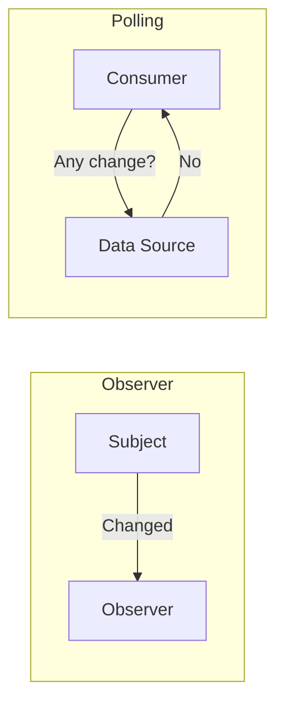

---

# 49. Observer Pattern so với Publisher–Subscriber

Hai pattern gần nhau nhưng không hoàn toàn giống nhau.

### Observer

```text
Subject
  ↓
biết danh sách observers
```

### Pub/Sub

```text
Publisher
   ↓
Message Broker/Event Bus
   ↓
Subscriber
```

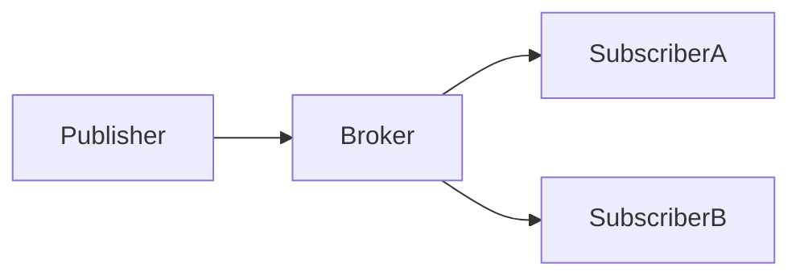

Pub/Sub thường có một lớp trung gian giúp publisher và subscriber tách rời hơn.

---

# 50. Observer Pattern và MVC/MVVM

Observer đặc biệt quan trọng trong MVVM:

```text
Model / Repository
        ↓
ViewModel
        ↓
Observable State
        ↓
View
```

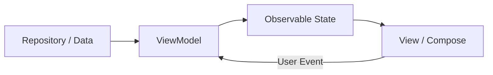

`ViewModel` trong Android được dùng như screen-level state holder và expose state cho UI. ([Android Developers][10])

---

# 51. Production checklist

Khi đưa Observer-based architecture vào production, cần kiểm tra:

### Lifecycle

```text
Observer có được stop khi UI không còn active?
```

### Memory

```text
Subject có giữ Activity/Fragment quá lâu?
```

### State

```text
Observer mới có nhận current state?
```

### Thread

```text
Update được thực hiện trên dispatcher/thread phù hợp?
```

### Error

```text
Flow lỗi thì UI chuyển thành state gì?
```

### Retry

```text
Retry nằm ở UI, ViewModel hay Repository?
```

### Performance

```text
State có emit quá nhiều?
```

### Testing

```text
State transitions đã được test?
```

### Release

```text
Lifecycle bug có xuất hiện khi:
rotate
background
foreground
process recreation
navigation
multi-window
không?
```

---

# 52. Debugging Observer

Khi UI không cập nhật, debug theo đường:

```text
1. Data source có thay đổi?
        ↓
2. Repository có emit?
        ↓
3. ViewModel có collect?
        ↓
4. UiState có đổi?
        ↓
5. StateFlow có emit?
        ↓
6. UI có đang collect?
        ↓
7. Lifecycle có STARTED?
        ↓
8. Composable có đọc đúng state?
```

Sơ đồ:

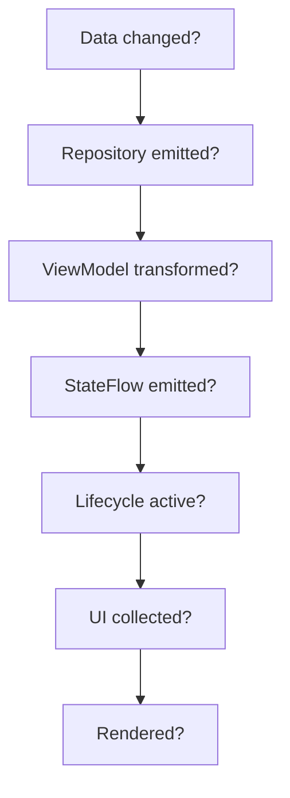

---

# 53. Bài thực hành

Xây màn hình:

```text
FavoriteScreen
```

Architecture:

```text
Room
 ↓
FavoriteRepository
 ↓
FavoriteViewModel
 ↓
StateFlow<FavoriteUiState>
 ↓
FavoriteScreen
```

Yêu cầu:

1. `FavoriteRepository` trả về `Flow<List<Favorite>>`.
2. `ViewModel` chuyển Flow thành `StateFlow`.
3. Compose dùng `collectAsStateWithLifecycle()`.
4. Thêm/xóa favorite làm UI tự cập nhật.
5. Không gọi `reload()` thủ công sau mỗi thay đổi.
6. Viết fake repository.
7. Test state emission.

---

# 54. Folder structure gợi ý

```text
com.example.observerdemo
│
├── data
│   ├── local
│   │   ├── FavoriteDao.kt
│   │   └── FavoriteEntity.kt
│   │
│   └── repository
│       ├── FavoriteRepository.kt
│       └── OfflineFavoriteRepository.kt
│
├── ui
│   └── favorite
│       ├── FavoriteScreen.kt
│       ├── FavoriteRoute.kt
│       ├── FavoriteUiState.kt
│       └── FavoriteViewModel.kt
│
└── test
    └── FakeFavoriteRepository.kt
```

---

# 55. Bài tập refactor

### Trước

```kotlin
class ProductActivity :
    AppCompatActivity() {

    override fun onCreate(
        savedInstanceState:
            Bundle?
    ) {
        super.onCreate(
            savedInstanceState
        )

        lifecycleScope.launch {

            while (true) {

                val products =
                    repository
                        .getProducts()

                render(products)

                delay(5_000)
            }
        }
    }
}
```

Đây là polling.

---

## Sau

Repository:

```kotlin
interface ProductRepository {

    fun observeProducts():
        Flow<List<Product>>
}
```

ViewModel:

```kotlin
class ProductViewModel(
    repository:
        ProductRepository
) : ViewModel() {

    val products =
        repository
            .observeProducts()
            .stateIn(
                scope = viewModelScope,

                started =
                    SharingStarted
                        .WhileSubscribed(
                            5_000
                        ),

                initialValue =
                    emptyList()
            )
}
```

Compose:

```kotlin
val products by
    viewModel
        .products
        .collectAsStateWithLifecycle()
```

---

# 56. Artifact portfolio nên tạo

Một project nhỏ:

```text
observer-pattern-android/
│
├── app/
│
├── docs/
│   ├── observer-pattern.md
│   └── architecture.md
│
├── screenshots/
│   ├── products.png
│   └── favorite-update.png
│
├── tests/
│
└── README.md
```

README nên có:

```text
Problem
 ↓
Polling implementation
 ↓
Observer / StateFlow refactor
 ↓
Architecture
 ↓
Lifecycle handling
 ↓
Testing
 ↓
Trade-offs
```

---

# 57. README mẫu

```markdown
# Observer Pattern Android Demo

## Problem

The UI previously pulled data manually
from the repository.

## Solution

The repository exposes a Flow.

The ViewModel converts application data
into StateFlow<UiState>.

Compose observes UiState using
collectAsStateWithLifecycle().

## Architecture

Room
↓
Repository
↓
ViewModel
↓
StateFlow
↓
Compose UI

## Benefits

- Reactive UI
- Clear state ownership
- Lifecycle-aware collection
- Easier testing
- Less manual refresh logic

## Testing

A FakeRepository emits controlled values
and ViewModel state transitions are asserted.
```

---

# 58. Checklist hoàn thành

* [ ] Giải thích được Observer Pattern.
* [ ] Biết Subject là gì.
* [ ] Biết Observer là gì.
* [ ] Biết `subscribe`.
* [ ] Biết `unsubscribe`.
* [ ] Tự viết được Observer bằng Kotlin.
* [ ] Phân biệt Observer với polling.
* [ ] Hiểu `LiveData`.
* [ ] Hiểu `StateFlow`.
* [ ] Hiểu `SharedFlow` ở mức cơ bản.
* [ ] Biết Observer liên quan Compose State thế nào.
* [ ] Dùng được `collectAsStateWithLifecycle()`.
* [ ] Biết `repeatOnLifecycle()`.
* [ ] Biết lifecycle ảnh hưởng subscription thế nào.
* [ ] Biết nguy cơ memory leak.
* [ ] Không expose `MutableStateFlow` trực tiếp cho UI.
* [ ] Có `UiState`.
* [ ] Có fake repository.
* [ ] Có test state emission.
* [ ] Có dependency diagram.
* [ ] Có README hoặc demo portfolio.

---

# 59. Câu hỏi tự kiểm tra

### Câu 1 — Observer Pattern giải quyết vấn đề gì?

> Cho phép các consumer phản ứng khi state của producer thay đổi mà không cần liên tục polling producer.

---

### Câu 2 — Hai thành phần chính?

```text
Subject / Observable

Observer
```

---

### Câu 3 — `LiveData` có liên quan Observer Pattern không?

Có.

```kotlin
liveData.observe(
    lifecycleOwner
) {
    ...
}
```

`LiveData` là observable data holder và sử dụng `Observer` gắn với lifecycle. ([Android Developers][1])

---

### Câu 4 — `StateFlow` có phải chính xác GoF Observer không?

Không theo cấu trúc class truyền thống.

Nhưng nó cung cấp cùng tư tưởng cốt lõi:

```text
producer
 ↓
state emission
 ↓
collector
 ↓
reaction
```

---

### Câu 5 — Compose nên collect Flow như thế nào?

Thông thường:

```kotlin
val state by
    viewModel.uiState
        .collectAsStateWithLifecycle()
```

để việc subscription tuân theo lifecycle. ([Android Developers][4])

---

### Câu 6 — Tại sao không expose `MutableStateFlow`?

Vì:

```text
UI
```

có thể trở thành nơi mutate state.

Nên:

```text
ViewModel
    ↓
MutableStateFlow
    ↓
StateFlow
    ↓
UI
```

---

### Câu 7 — StateFlow và LiveData khác nhau quan trọng ở đâu?

Một khác biệt quan trọng:

```text
LiveData
→ lifecycle-aware trực tiếp

StateFlow
→ cần lifecycle-aware collection
  ở Android UI
```

([Android Developers][1])

---

# 60. Sơ đồ ghi nhớ nhanh

```text
                  OBSERVER PATTERN

                        │
                        ▼

                  ┌───────────┐
                  │  Subject  │
                  │ Observable│
                  └─────┬─────┘
                        │
                     notify
                        │
             ┌──────────┼──────────┐
             ▼          ▼          ▼

         Observer A Observer B Observer C


                TRONG ANDROID

                 Repository
                     │
                     ▼
                    Flow
                     │
                     ▼
                 ViewModel
                     │
                     ▼
                  StateFlow
                     │
               collect / observe
                     │
                     ▼
                 Compose UI
```

---

# 61. Sơ đồ Observer Pattern trong Android hoàn chỉnh

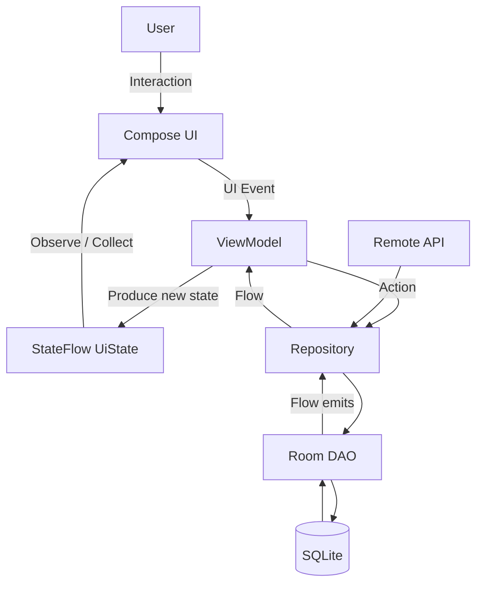

---

# 62. Tổng kết

**Observer Pattern** là một trong những pattern quan trọng nhất để hiểu kiến trúc Android reactive.

Pattern cổ điển:

```text
Subject
   ↓ notify
Observer
```

Trong Android hiện đại, tư duy này thường trở thành:

```text
Repository
     ↓
Flow
     ↓
ViewModel
     ↓
StateFlow<UiState>
     ↓
collectAsStateWithLifecycle()
     ↓
Compose UI
```

Android Architecture hiện hướng UI theo mô hình **UDF**, trong đó `ViewModel` tạo UI state và UI phản ứng với observable state thay vì tự kéo dữ liệu liên tục. `StateFlow` là lựa chọn phù hợp để giữ observable state; với Compose, Android khuyến nghị collect bằng `collectAsStateWithLifecycle()` để subscription tuân theo lifecycle. ([Android Developers][3])

Điều quan trọng nhất khi học **Observer Pattern trên Android** không phải chỉ nhớ:

```text
Subject + Observer
```

mà phải hiểu cả chuỗi:

```text
Data thay đổi
      ↓
Producer phát state
      ↓
ViewModel biến đổi state
      ↓
UI quan sát
      ↓
UI render
      ↓
Lifecycle kiểm soát subscription
```

Khi làm được một màn hình sử dụng `Repository → Flow → ViewModel → StateFlow → Compose`, có lifecycle-aware collection và fake repository để test, thì anh đã áp dụng Observer Pattern vào kiến trúc Android thực tế chứ không còn chỉ học pattern ở mức lý thuyết.

[1]: https://developer.android.com/topic/libraries/architecture/livedata "LiveData overview  |  Views  |  Android Developers"
[2]: https://developer.android.com/kotlin/flow/stateflow-and-sharedflow "StateFlow and SharedFlow  |  Kotlin  |  Android Developers"
[3]: https://developer.android.com/topic/architecture/ui-layer "UI layer  |  App architecture  |  Android Developers"
[4]: https://developer.android.com/topic/libraries/architecture/coroutines "Use Kotlin coroutines with lifecycle-aware components  |  App architecture  |  Android Developers"
[5]: https://developer.android.com/develop/ui/compose/state?utm_source=chatgpt.com "State and Jetpack Compose"
[6]: https://developer.android.com/topic/architecture/recommendations?utm_source=chatgpt.com "Recommendations for Android architecture"
[7]: https://developer.android.com/topic/architecture/views/lifecycle-views?utm_source=chatgpt.com "Handling lifecycles with lifecycle-aware components (Views)"
[8]: https://developer.android.com/topic/architecture/recommendations "Recommendations for Android architecture  |  App architecture  |  Android Developers"
[9]: https://developer.android.com/jetpack/androidx/releases/lifecycle?utm_source=chatgpt.com "Lifecycle | Jetpack"
[10]: https://developer.android.com/topic/libraries/architecture/viewmodel?utm_source=chatgpt.com "ViewModel overview | App architecture"
