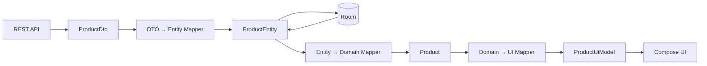
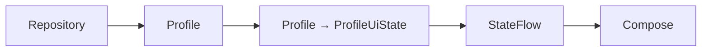
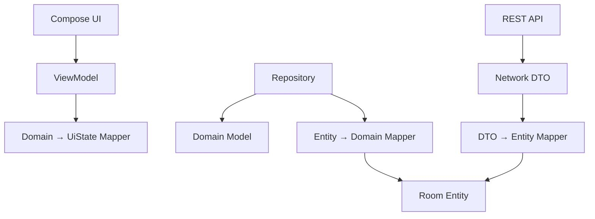
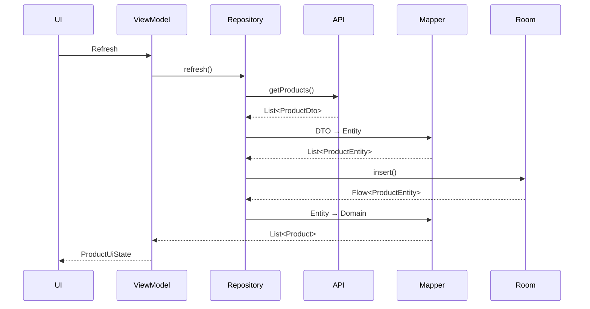
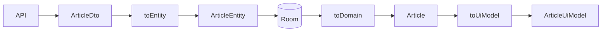
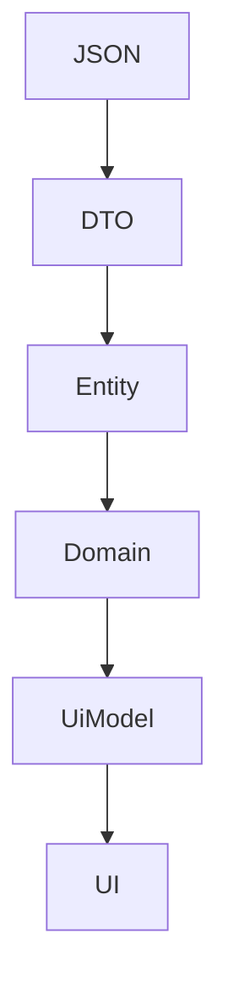
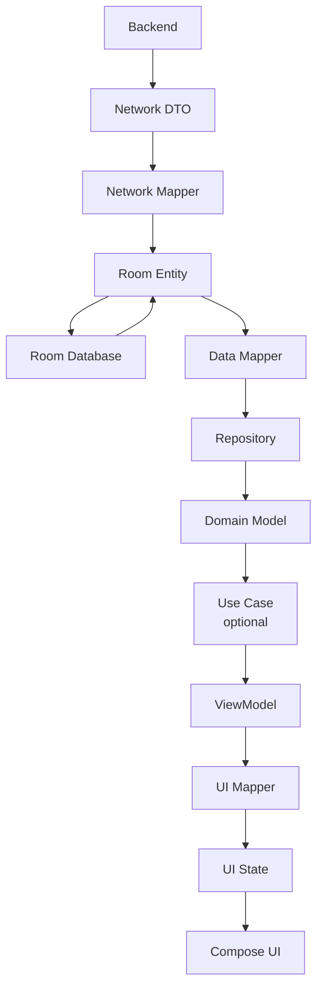

# 023 - Mapper Pattern

| Thuộc tính              | Nội dung                                                     |
| ----------------------- | ------------------------------------------------------------ |
| **Học phần**            | 03 - Architecture, State and Data                            |
| **Module**              | Module 05 - Design and Architecture                          |
| **Nhóm nội dung**       | Design Patterns                                              |
| **Nguồn roadmap**       | Design and Architecture / Design Patterns                    |
| **Loại bài**            | Architecture                                                 |
| **Thứ tự trong module** | 023                                                          |
| **Thời lượng gợi ý**    | 34 phút                                                      |
| **Ngôn ngữ ví dụ**      | Kotlin                                                       |
| **Bối cảnh**            | Android / Retrofit / Room / Repository / ViewModel / Compose |

---

## 1. Tóm tắt

**Mapper Pattern** là cách tổ chức code dùng để **chuyển đổi một representation của dữ liệu sang representation khác**.

Trong một Android app thực tế, cùng một đối tượng `User` có thể xuất hiện dưới nhiều dạng:

```text
JSON từ Server
      ↓
UserDto
      ↓
UserEntity
      ↓
User
      ↓
UserUiModel
```

Ví dụ:

```text
Network Model
     ↓ Mapper
Database Model
     ↓ Mapper
Domain Model
     ↓ Mapper
UI Model
```

Mục tiêu là tránh việc:

```text
UI biết cấu trúc JSON
Domain biết @Entity của Room
Database phụ thuộc format API
Network model đi thẳng tới Compose
```

Android Architecture hiện khuyến nghị data layer được tổ chức quanh `Repository` và `DataSource`; các layer phía trên không nên phụ thuộc trực tiếp vào data source. Tài liệu Android cũng lưu ý rằng application data thường không có đúng định dạng UI cần, vì vậy UI layer cần chuyển đổi dữ liệu thành dạng có thể render. ([Android Developers][1])

> Trong roadmap này, Mapper được học như một **architectural/data-transformation pattern**. Nó không nằm trong bộ 23 GoF Design Patterns cổ điển.

---

# 2. Mục tiêu học tập

Sau bài này, anh nên:

* giải thích được Mapper Pattern;
* hiểu tại sao một app có nhiều model cho cùng một business concept;
* phân biệt `DTO`, `Entity`, `Domain Model`, `UI Model`;
* map `DTO → Entity`;
* map `Entity → Domain`;
* map `Domain → UI`;
* map ngược khi cần ghi dữ liệu;
* biết Mapper nên đặt ở đâu;
* biết khi nào dùng extension function;
* biết khi nào dùng class `Mapper`;
* xử lý nullable, enum, date, default value;
* viết unit test cho Mapper;
* tránh để mapping logic rải rác trong ViewModel/Composable;
* hiểu Mapper liên quan đến Repository, Room, Retrofit và UI state;
* biết cân nhắc performance khi map danh sách lớn.

---

# 3. Mapper Pattern giải quyết vấn đề gì?

Giả sử API trả về:

```json
{
  "id": 12,
  "full_name": "Nguyen Van An",
  "avatar_url": null,
  "created_at": "2026-08-10T08:30:00Z",
  "status": "active"
}
```

Nếu dùng model này trực tiếp ở mọi nơi:

```kotlin
data class User(
    @SerializedName("full_name")
    val fullName: String,

    @SerializedName("avatar_url")
    val avatarUrl: String?,

    @SerializedName("created_at")
    val createdAt: String
)
```

thì business model đang phụ thuộc vào:

```text
JSON
Serialization library
Tên field của backend
Format timestamp của backend
Nullable convention của backend
```

Nếu backend đổi:

```text
full_name
    ↓
display_name
```

rất nhiều code có thể bị ảnh hưởng.

Mapper tạo một ranh giới:

```text
Backend model
     │
     X
     │
   Mapper
     │
     ▼
Application model
```

---

# 4. Ảnh minh họa — vị trí Data Layer


Android mô tả data layer gồm các repository và data source; repository là entry point mà các layer phía trên sử dụng thay vì truy cập data source trực tiếp. ([Android Developers][1])

Đây cũng chính là một vị trí rất tự nhiên cho Mapper:

```text
Network Data Source
       ↓
Network Model
       ↓
     Mapper
       ↓
Repository
       ↓
Application Model
```

---

# 5. Một business concept — nhiều representation

Ví dụ `Product`.

## Network model

```kotlin
data class ProductDto(
    val id: Long,
    val product_name: String,
    val price_cents: Long,
    val image_url: String?,
    val available: Boolean
)
```

## Database model

```kotlin
@Entity(
    tableName = "products"
)
data class ProductEntity(

    @PrimaryKey
    val id: Long,

    val name: String,

    val priceInCents: Long,

    val imageUrl: String?,

    val isAvailable: Boolean
)
```

## Domain model

```kotlin
data class Product(
    val id: Long,
    val name: String,
    val price: Money,
    val imageUrl: String?,
    val availability:
        ProductAvailability
)
```

## UI model

```kotlin
data class ProductUiModel(
    val id: Long,
    val title: String,
    val priceText: String,
    val imageUrl: String?,
    val availabilityText: String
)
```

Cả bốn đều nói về:

```text
Product
```

nhưng phục vụ bốn mục đích khác nhau.

---

# 6. Sơ đồ Mapper hoàn chỉnh



---

# 7. Tại sao không dùng một model cho tất cả?

Ví dụ:

```kotlin
@Entity
data class User(

    @PrimaryKey
    @SerializedName("user_id")
    val id: Long,

    @SerializedName("full_name")
    val name: String
)
```

Model này đồng thời phụ thuộc:

```text
Room
+
Serialization
+
Backend API
+
Application model
```

Nếu đổi database:

```text
Room → DataStore
```

hoặc API:

```text
REST → GraphQL
```

model chung có thể trở thành điểm coupling lớn.

Trong một codelab data-layer của Android, Google minh họa ba model cho cùng một `Task`: external `Task`, local `LocalTask`, và network `NetworkTask`, đồng thời repository chịu trách nhiệm map internal models sang model mà data layer expose. ([Android Developers][2])

---

# 8. Ảnh minh họa — Data Models trong Data Layer


Hình minh họa cho thấy:

```text
Repository
   ↓
Data Source

Repository ──→ Data Models
Data Source ─→ Data Models
```

Một representation không nhất thiết phù hợp với tất cả boundary.

---

# 9. DTO là gì?

DTO thường được hiểu là:

**Data Transfer Object**

Nó mô tả dữ liệu trao đổi với nguồn bên ngoài.

Ví dụ API:

```kotlin
@Serializable
data class ArticleDto(

    val id: String,

    @SerialName("article_title")
    val title: String,

    @SerialName("publish_time")
    val publishedAt: String,

    @SerialName("author_id")
    val authorId: String?
)
```

DTO nên phản ánh:

```text
API contract
```

chứ không nhất thiết phản ánh hoàn toàn business model.

---

# 10. Entity là gì?

Với Room:

```kotlin
@Entity(
    tableName = "articles"
)
data class ArticleEntity(

    @PrimaryKey
    val id: String,

    val title: String,

    val publishedAtMillis: Long,

    val authorId: String?
)
```

`Entity` phản ánh:

```text
Database schema
```

Android Room sử dụng `@Entity` để định nghĩa dữ liệu được lưu trong database. ([Android Developers][3])

---

# 11. Domain Model

Domain model phản ánh ý nghĩa của dữ liệu trong ứng dụng.

```kotlin
data class Article(

    val id: ArticleId,

    val title: String,

    val publishedAt: Instant,

    val authorId: AuthorId?
)
```

Không cần biết:

```text
JSON field name
Room annotation
SQLite
Retrofit
Compose
```

Domain model hướng về:

```text
Business meaning
```

---

# 12. UI Model

UI không phải lúc nào cũng cần toàn bộ domain model.

Domain:

```kotlin
data class Product(
    val id: Long,
    val name: String,
    val priceInCents: Long,
    val currency: Currency,
    val available: Boolean,
    val stock: Int,
    val createdAt: Instant
)
```

UI chỉ cần:

```kotlin
data class ProductCardUiModel(
    val title: String,
    val price: String,
    val badge: String?
)
```

Android mô tả UI layer như một pipeline chuyển application data sang dạng mà UI có thể trình bày. ([Android Developers][4])

---

# 13. Mapper cơ bản bằng Extension Function

Một cách rất phổ biến trong Kotlin:

```kotlin
fun ProductDto.toEntity():
    ProductEntity {

    return ProductEntity(
        id = id,
        name = product_name,
        priceInCents =
            price_cents,
        imageUrl =
            image_url,
        isAvailable =
            available
    )
}
```

Sử dụng:

```kotlin
val dto =
    api.getProduct()

val entity =
    dto.toEntity()
```

---

# 14. Entity → Domain

```kotlin
fun ProductEntity.toDomain():
    Product {

    return Product(
        id = id,

        name = name,

        price = Money(
            cents = priceInCents
        ),

        imageUrl =
            imageUrl,

        availability =
            if (isAvailable) {
                ProductAvailability
                    .AVAILABLE
            } else {
                ProductAvailability
                    .UNAVAILABLE
            }
    )
}
```

---

# 15. Domain → UI

```kotlin
fun Product.toUiModel():
    ProductUiModel {

    return ProductUiModel(

        id = id,

        title = name,

        priceText =
            price.format(),

        imageUrl =
            imageUrl,

        availabilityText =
            when (availability) {

                ProductAvailability
                    .AVAILABLE ->
                    "Còn hàng"

                ProductAvailability
                    .UNAVAILABLE ->
                    "Hết hàng"
            }
    )
}
```

---

# 16. Pipeline hoàn chỉnh

```kotlin
val dto =
    api.getProduct()
```

```text
ProductDto
```

↓

```kotlin
val entity =
    dto.toEntity()
```

```text
ProductEntity
```

↓

```kotlin
dao.insert(entity)
```

Sau đó:

```kotlin
val product =
    dao.getProduct(id)
        .toDomain()
```

↓

```kotlin
val uiModel =
    product.toUiModel()
```

↓

```text
Compose UI
```

---

# 17. Mapper cho List

Không nên lặp:

```kotlin
products.map {
    Product(
        id = it.id,
        name = it.name,
        // ...
    )
}
```

ở nhiều nơi.

Có thể tạo:

```kotlin
fun List<ProductEntity>
    .toDomain():
    List<Product> =
    map(ProductEntity::toDomain)
```

hoặc:

```kotlin
fun List<ProductDto>
    .toEntity():
    List<ProductEntity> =
    map(ProductDto::toEntity)
```

Sử dụng:

```kotlin
val products =
    entities.toDomain()
```

---

# 18. Ví dụ từ Android Developers

Trong codelab data layer, Android dùng kiểu mapping:

```kotlin
fun LocalTask.toExternal() =
    Task(
        id = id,
        title = title,
        description =
            description,
        isCompleted =
            isCompleted
    )
```

và:

```kotlin
fun List<LocalTask>
    .toExternal() =
    map(
        LocalTask::toExternal
    )
```

Điểm đáng chú ý là tài liệu đặt mapping function **gần boundary/model nơi mapping được sử dụng**, nhằm giữ logic chuyển đổi tập trung thay vì rải khắp ứng dụng. ([Android Developers][2])

---

# 19. Mapping hai chiều

Không phải mapping nào cũng chỉ một chiều.

Ví dụ:

```text
Entity → Domain
Domain → Entity
```

Ta có:

```kotlin
fun ProductEntity.toDomain() =
    Product(
        id = id,
        name = name
    )
```

và:

```kotlin
fun Product.toEntity() =
    ProductEntity(
        id = id,
        name = name
    )
```

Android codelab cũng minh họa mapping hai chiều như:

```text
NetworkTask
    ↕
LocalTask
```

để đồng bộ local và network representations. ([Android Developers][2])

---

# 20. Ảnh minh họa — Offline-first Repository


Một offline-first repository có thể có:

```text
NetworkDataSource
        ↓
      Mapper
        ↓
LocalDataSource
        ↓
      Mapper
        ↓
Repository API
```

Android lưu ý rằng local và network data source có thể có cách đọc/ghi rất khác nhau, nên mỗi data source có thể cần representation riêng. ([Android Developers][5])

---

# 21. DTO → Entity trong Offline-first App

Ví dụ API:

```kotlin
data class NewsDto(
    val id: String,
    val headline: String,
    val timestamp: String
)
```

Room:

```kotlin
@Entity(
    tableName = "news"
)
data class NewsEntity(

    @PrimaryKey
    val id: String,

    val title: String,

    val publishedAt:
        Long
)
```

Mapper:

```kotlin
fun NewsDto.toEntity():
    NewsEntity {

    return NewsEntity(
        id = id,
        title = headline,

        publishedAt =
            Instant
                .parse(timestamp)
                .toEpochMilli()
    )
}
```

Ở đây Mapper không chỉ copy field:

```text
headline → title

ISO timestamp
      ↓
epoch milliseconds
```

---

# 22. Mapper có thể chứa transformation

Ví dụ API:

```json
{
  "price": 599900,
  "currency": "VND"
}
```

Domain:

```kotlin
data class Money(
    val amount: Long,
    val currency: Currency
)
```

Mapper:

```kotlin
fun PriceDto.toDomain() =
    Money(
        amount = price,
        currency =
            Currency.valueOf(
                currency
            )
    )
```

Mapper có thể:

* đổi tên field;
* convert type;
* convert enum;
* parse date;
* xử lý nullable;
* tạo nested objects;
* flatten object;
* combine fields;
* bỏ field không cần thiết.

---

# 23. Mapping Nullable

API:

```kotlin
data class UserDto(
    val avatarUrl:
        String?
)
```

Application muốn non-null:

```kotlin
data class User(
    val avatarUrl:
        String
)
```

Mapper:

```kotlin
fun UserDto.toDomain() =
    User(
        avatarUrl =
            avatarUrl
                ?: DEFAULT_AVATAR
    )
```

Nhưng cần cẩn thận.

Mapper không nên vô tình che giấu lỗi dữ liệu:

```kotlin
name ?: ""
```

nếu business rule thực sự yêu cầu tên luôn tồn tại.

---

# 24. Mapping Enum

Network:

```kotlin
enum class NetworkStatus {
    active,
    banned,
    deleted
}
```

Domain:

```kotlin
enum class UserStatus {
    ACTIVE,
    BLOCKED,
    REMOVED
}
```

Mapper:

```kotlin
fun NetworkStatus.toDomain() =
    when (this) {

        NetworkStatus.active ->
            UserStatus.ACTIVE

        NetworkStatus.banned ->
            UserStatus.BLOCKED

        NetworkStatus.deleted ->
            UserStatus.REMOVED
    }
```

Đây là lợi ích lớn:

```text
Backend terminology
       X
       │ Mapper
       ▼
Domain terminology
```

---

# 25. Xử lý Enum mới từ Server

Một vấn đề production:

Backend thêm:

```text
"suspended"
```

nhưng app cũ chưa biết.

Nếu serialization cho phép unknown value, Mapper có thể quyết định:

```kotlin
fun NetworkStatus?.toDomain() =
    when (this) {

        NetworkStatus.ACTIVE ->
            UserStatus.ACTIVE

        NetworkStatus.BANNED ->
            UserStatus.BLOCKED

        null ->
            UserStatus.UNKNOWN
    }
```

Đây là nơi cần xác định rõ:

```text
fallback policy
```

thay vì để UI tự đoán.

---

# 26. Mapping Date/Time

Network:

```text
2026-08-10T05:30:00Z
```

Domain:

```kotlin
Instant
```

Mapper:

```kotlin
fun ArticleDto.toDomain() =
    Article(
        id = id,

        publishedAt =
            Instant.parse(
                publishedAt
            )
    )
```

UI:

```text
Instant
   ↓ UI Mapper
"10/08/2026"
```

Không nên để Composable parse ISO date ở mỗi recomposition.

---

# 27. Mapping Domain → UI State

Domain model:

```kotlin
data class Profile(
    val firstName: String,
    val lastName: String,
    val followers: Int
)
```

UI:

```kotlin
data class ProfileUiState(
    val displayName: String,
    val followersText: String
)
```

Mapper:

```kotlin
fun Profile.toUiState() =
    ProfileUiState(

        displayName =
            "$firstName $lastName",

        followersText =
            "$followers người theo dõi"
    )
```

Android UI layer được thiết kế để nhận application data, transform nó thành UI-renderable data và render kết quả. ([Android Developers][4])

---

# 28. Ảnh minh họa — UI Layer


Có thể hình dung Mapper ở boundary:

```text
Domain/Data Layer
       ↓
  UI Mapper
       ↓
UiState
       ↓
State Holder
       ↓
Compose
```

---

# 29. Mapper trong ViewModel

Ví dụ đơn giản:

```kotlin
class ProfileViewModel(
    repository:
        ProfileRepository
) : ViewModel() {

    val uiState =
        repository
            .observeProfile()
            .map {
                it.toUiState()
            }
            .stateIn(
                scope =
                    viewModelScope,

                started =
                    SharingStarted
                        .WhileSubscribed(
                            5_000
                        ),

                initialValue =
                    ProfileUiState()
            )
}
```

Luồng:



---

# 30. Mapper không phải Repository

Hai khái niệm khác nhau.

### Repository

Quản lý:

```text
Nguồn dữ liệu
Caching
Synchronization
Business/data logic
Source of truth
```

### Mapper

Quản lý:

```text
Model A
   ↓
Model B
```

Android định nghĩa repository là thành phần expose data, centralize data changes, giải quyết conflict giữa data source và che giấu nguồn dữ liệu khỏi các layer còn lại. ([Android Developers][1])

---

# 31. Mapper không phải Use Case

Mapper:

```text
ProductEntity
      ↓
Product
```

Use Case:

```text
CalculateProductDiscount
GetRecommendedProducts
CheckoutCart
```

Use Case tập trung vào reusable business logic; Android đặt domain layer tùy chọn giữa UI và data layer khi cần tái sử dụng hoặc giảm complexity của ViewModel. ([Android Developers][6])

---

# 32. Mapper nên đặt ở đâu?

Không có một folder duy nhất bắt buộc.

Một cách đơn giản:

```text
data/
├── remote/
│   ├── ProductDto.kt
│   └── ProductDtoMapper.kt
│
├── local/
│   ├── ProductEntity.kt
│   └── ProductEntityMapper.kt
│
└── repository/
```

Hoặc extension gần model:

```text
ProductDto.kt

data class ProductDto(...)

fun ProductDto.toEntity() ...
```

Codelab Android khuyên mapping function nên sống ở boundary nơi nó được dùng và minh họa đặt `LocalTask.toExternal()` gần `LocalTask`. ([Android Developers][2])

---

# 33. Extension Function hay Mapper Class?

## Extension Function

```kotlin
fun UserDto.toDomain():
    User
```

Phù hợp khi:

```text
mapping nhỏ
stateless
không có dependency
logic đơn giản
```

---

## Mapper Class

```kotlin
class UserMapper(
    private val dateParser:
        DateParser
) {

    fun map(
        source: UserDto
    ): User {

        return User(
            id = source.id,

            createdAt =
                dateParser.parse(
                    source.createdAt
                )
        )
    }
}
```

Phù hợp khi mapper cần:

```text
Formatter
Parser
Locale
Configuration
Feature flag
khác dependency
```

---

# 34. Generic Mapper Interface

Có thể tạo:

```kotlin
fun interface Mapper<I, O> {

    fun map(
        input: I
    ): O
}
```

Implementation:

```kotlin
class UserDtoMapper :
    Mapper<UserDto, User> {

    override fun map(
        input: UserDto
    ): User {

        return User(
            id = input.id,
            name = input.name
        )
    }
}
```

Inject:

```kotlin
class UserRepository(
    private val mapper:
        Mapper<UserDto, User>
)
```

Tuy nhiên đừng tạo abstraction chỉ vì có thể.

Nếu:

```kotlin
fun UserDto.toDomain()
```

đã đủ rõ thì generic mapper có thể chỉ tăng boilerplate.

---

# 35. Mapper và Dependency Direction

Một kiến trúc:



Boundary quan trọng:

```text
UI
│
├── UiState
│
X
│
Domain
│
X
│
Entity
│
X
│
DTO
```

`X` chính là vị trí transformation.

---

# 36. Ví dụ Repository hoàn chỉnh

```kotlin
class OfflineProductRepository(
    private val api:
        ProductApi,

    private val dao:
        ProductDao
) : ProductRepository {

    override fun
        observeProducts():
        Flow<List<Product>> {

        return dao
            .observeProducts()
            .map {
                entities ->
                entities
                    .map {
                        it.toDomain()
                    }
            }
    }

    override suspend fun
        refresh() {

        val remote =
            api.getProducts()

        val entities =
            remote.map {
                it.toEntity()
            }

        dao.replaceAll(
            entities
        )
    }
}
```

Luồng read:

```text
Room
 ↓
ProductEntity
 ↓ mapper
Product
 ↓
ViewModel
```

Luồng refresh:

```text
API
 ↓
ProductDto
 ↓ mapper
ProductEntity
 ↓
Room
```

---

# 37. Offline-first và Mapper

Android hiện hướng dẫn rằng trong offline-first architecture, local và network source có thể có representation khác nhau, và repository chịu trách nhiệm điều phối chúng. ([Android Developers][5])

Ví dụ:



---

# 38. Mapping trong `Flow`

Ví dụ:

```kotlin
dao.observeProducts()
    .map { entities ->

        entities.map(
            ProductEntity::toDomain
        )
    }
```

Có thể viết helper:

```kotlin
fun List<ProductEntity>
    .toDomain() =
    map(
        ProductEntity::toDomain
    )
```

Sau đó:

```kotlin
dao.observeProducts()
    .map(
        List<ProductEntity>
            ::toDomain
    )
```

Hoặc đơn giản:

```kotlin
dao.observeProducts()
    .map { it.toDomain() }
```

---

# 39. Performance khi Mapping

Mapping:

```text
10 objects
```

thường không đáng lo.

Nhưng:

```text
100,000 objects
+
date parsing
+
image metadata
+
sorting
+
aggregation
```

có thể tốn CPU.

Codelab Android minh họa việc chuyển bulk network/local models trên dispatcher phù hợp khi số lượng item không biết trước và mapping có thể tốn tài nguyên. ([Android Developers][2])

Ví dụ:

```kotlin
withContext(
    Dispatchers.Default
) {

    networkProducts
        .map(
            ProductDto::toEntity
        )
}
```

Không phải mapper nào cũng cần `withContext`.

Chỉ làm khi profiling hoặc đặc tính workload cho thấy mapping đủ nặng.

---

# 40. Không map trong Composable

Không nên:

```kotlin
@Composable
fun ProductScreen(
    products:
        List<Product>
) {

    val uiProducts =
        products.map {
            ProductUiModel(
                title = it.name,

                priceText =
                    expensiveFormat(
                        it.price
                    )
            )
        }

    // ...
}
```

Mapping có thể chạy lại khi recomposition.

Tốt hơn:

```text
ViewModel
   ↓
UI Mapper
   ↓
UiState
   ↓
Composable
```

Composable tập trung vào:

```text
render state
```

---

# 41. Mapper và Lifecycle

Mapper bản thân thường nên là:

```text
stateless
```

Nó không nên giữ:

```text
Activity
Fragment
View
LifecycleOwner
```

Ví dụ tốt:

```kotlin
class ProductMapper {

    fun map(
        source: ProductEntity
    ): Product
}
```

Không nên:

```kotlin
class ProductMapper(
    val activity:
        Activity
)
```

ViewModel theo khuyến nghị Android cũng nên độc lập khỏi lifecycle types như `Activity`, `Context` hay `Resources` khi chúng không thuộc trách nhiệm phù hợp. ([Android Developers][7])

---

# 42. Mapper và Configuration Change

Mapper không quản lý:

```text
rotation
background
foreground
```

Mapper chỉ:

```text
A → B
```

State ownership vẫn thuộc:

```text
ViewModel
SavedStateHandle
Repository
database
```

Do mapper stateless, configuration change thông thường không phải vấn đề của Mapper.

---

# 43. Mapper và Error Handling

Giả sử backend gửi:

```json
{
  "birth_date": "invalid-date"
}
```

Không nên:

```kotlin
LocalDate.parse(
    birthDate
)
```

rồi để exception phát sinh ngẫu nhiên ở UI.

Có thể định nghĩa:

```kotlin
sealed interface
    MappingResult<out T> {

    data class Success<T>(
        val value: T
    ) : MappingResult<T>

    data class Error(
        val reason: String
    ) : MappingResult<Nothing>
}
```

Hoặc để repository xử lý exception mapping và chuyển nó thành lỗi data layer phù hợp.

Điểm quan trọng:

```text
invalid external data
       ↓
được xử lý ở boundary
```

---

# 44. Mapper không nên che giấu business rule

Ví dụ:

```kotlin
fun OrderDto.toDomain():
    Order {

    val total =
        items.sumOf {
            it.price
        }

    val discount =
        calculateBlackFridayDiscount(
            total
        )

    // ...
}
```

Nếu:

```text
Black Friday discount
```

là business rule quan trọng thì nên cân nhắc đặt ở:

```text
Domain / UseCase / Repository
```

thay vì giấu trong mapper.

Mapper nên tập trung vào:

```text
representation transformation
```

---

# 45. Mapper và Formatting

Có hai dạng transformation:

### Data mapping

```text
"ACTIVE"
   ↓
UserStatus.ACTIVE
```

### Presentation formatting

```text
599900
   ↓
"599.900 ₫"
```

Presentation formatting thường hợp lý hơn ở:

```text
UI mapper
UI layer
formatter
```

thay vì network mapper.

---

# 46. Mapper giúp chống thay đổi API

Backend ban đầu:

```json
{
  "name": "Android Phone"
}
```

Phiên bản mới:

```json
{
  "product_name": "Android Phone"
}
```

Chỉ network model/mapper cần thay:

```text
ProductDto
   ↓
Mapper
   ↓
Product
```

Các lớp:

```text
ViewModel
Compose
UseCase
Domain
```

có thể giữ nguyên nếu external contract của data layer không đổi.

---

# 47. Mapper giúp chống thay đổi Database

Ban đầu:

```kotlin
ProductEntity(
    price: Long
)
```

Sau migration:

```kotlin
ProductEntity(
    priceValue: Long,
    currencyCode: String
)
```

Mapper mới:

```kotlin
fun ProductEntity.toDomain() =
    Product(
        price =
            Money(
                amount =
                    priceValue,

                currency =
                    Currency.valueOf(
                        currencyCode
                    )
            )
    )
```

Domain vẫn:

```kotlin
Product(
    price = Money(...)
)
```

---

# 48. Mapper và Separation of Concerns

Không Mapper:

```text
ViewModel
 ├── parse JSON fields
 ├── convert timestamps
 ├── convert enums
 ├── build Room models
 └── format UI
```

Có Mapper:

```text
Network Mapper
    → network transformation

Database Mapper
    → persistence transformation

Domain
    → business meaning

UI Mapper
    → presentation transformation
```

---

# 49. Anti-pattern: Mapper khổng lồ

Không nên:

```kotlin
class AppMapper {

    fun mapUser()

    fun mapProduct()

    fun mapOrder()

    fun mapPayment()

    fun mapArticle()

    fun mapMessage()

    fun mapProfile()

    // 300 functions...
}
```

Dễ biến thành:

```text
God Mapper
```

Tốt hơn tách theo domain hoặc boundary:

```text
UserMapper
ProductMapper
OrderMapper
```

hoặc extension functions gần model tương ứng.

---

# 50. Anti-pattern: Mapper chain không cần thiết

Không phải app nào cũng cần:

```text
DTO
 ↓
Entity
 ↓
DataModel
 ↓
DomainModel
 ↓
PresentationModel
 ↓
UiModel
```

Một app nhỏ có thể chỉ cần:

```text
DTO
 ↓
Domain
 ↓
UiState
```

Android cũng coi domain layer là optional; thêm layer chỉ nên khi complexity/use case thực sự cần. ([Android Developers][6])

---

# 51. Anti-pattern: Mapping everywhere

Không nên có:

```kotlin
Product(
    dto.id,
    dto.name,
    dto.price
)
```

ở:

```text
Repository
ViewModel
Worker
Service
Activity
Composable
```

Nếu transformation giống nhau, gom lại thành:

```kotlin
dto.toDomain()
```

để có một nơi duy nhất định nghĩa conversion.

---

# 52. Anti-pattern: mapper phụ thuộc UI framework

Không nên:

```kotlin
class ProductEntityMapper(
    private val navController:
        NavController
)
```

Mapper nên có dependency phù hợp với transformation:

```text
DateParser
Formatter
Configuration
Clock
```

không phải navigation/lifecycle/UI controller.

---

# 53. Testing Mapper

Mapper rất phù hợp với unit test vì thường là pure function.

Ví dụ:

```kotlin
@Test
fun productDto_mapsToDomain() {

    val dto =
        ProductDto(
            id = 1,
            product_name =
                "Pixel",
            price_cents =
                100_000,
            image_url =
                null,
            available =
                true
        )

    val result =
        dto.toEntity()

    assertEquals(
        1,
        result.id
    )

    assertEquals(
        "Pixel",
        result.name
    )

    assertTrue(
        result.isAvailable
    )
}
```

---

# 54. Test Enum Mapping

```kotlin
@Test
fun activeStatus_mapsToActive() {

    val result =
        NetworkStatus.ACTIVE
            .toDomain()

    assertEquals(
        UserStatus.ACTIVE,
        result
    )
}
```

---

# 55. Test Nullable Mapping

```kotlin
@Test
fun nullAvatar_usesDefaultAvatar() {

    val dto =
        UserDto(
            avatarUrl = null
        )

    val result =
        dto.toDomain()

    assertEquals(
        DEFAULT_AVATAR,
        result.avatarUrl
    )
}
```

---

# 56. Test Date Mapping

```kotlin
@Test
fun isoDate_mapsToInstant() {

    val dto =
        ArticleDto(
            publishedAt =
                "2026-08-10T08:00:00Z"
        )

    val result =
        dto.toDomain()

    assertEquals(
        Instant.parse(
            "2026-08-10T08:00:00Z"
        ),
        result.publishedAt
    )
}
```

---

# 57. Test Seam

Bài roadmap yêu cầu:

> Write one test seam: fake repository, fake API, fake DAO or fake use case.

Ta có thể tạo:

```kotlin
class FakeProductApi :
    ProductApi {

    var products:
        List<ProductDto> =
        emptyList()

    override suspend fun
        getProducts():
        List<ProductDto> {

        return products
    }
}
```

Sau đó kiểm tra:

```text
Fake API
   ↓
DTO Mapper
   ↓
Repository
   ↓
Entity
```

hoặc test mapper riêng như pure function.

---

# 58. Refactor một màn hình

## Trước

```kotlin
class ProductViewModel(
    private val api:
        ProductApi
) : ViewModel() {

    fun load() {

        viewModelScope.launch {

            val result =
                api.getProducts()

            val uiModels =
                result.map {

                    ProductUiModel(
                        id = it.id,

                        title =
                            it.product_name,

                        priceText =
                            "${it.price_cents} VND"
                    )
                }

            // expose state
        }
    }
}
```

ViewModel đang biết:

```text
Network field names
Network model
Presentation formatting
```

---

# 59. Sau khi Refactor

```text
API
 ↓
ProductDto
 ↓
Mapper
 ↓
Product
 ↓
Repository
 ↓
ViewModel
 ↓
UiMapper
 ↓
ProductUiState
```

ViewModel:

```kotlin
class ProductViewModel(
    repository:
        ProductRepository
) : ViewModel() {

    val uiState =
        repository
            .observeProducts()
            .map { products ->

                ProductUiState(
                    products =
                        products.map(
                            Product::toUiModel
                        )
                )
            }
            .stateIn(
                scope =
                    viewModelScope,

                started =
                    SharingStarted
                        .WhileSubscribed(
                            5_000
                        ),

                initialValue =
                    ProductUiState()
            )
}
```

---

# 60. Folder Structure gợi ý

```text
com.example.shop
│
├── data
│   │
│   ├── remote
│   │   ├── ProductApi.kt
│   │   ├── ProductDto.kt
│   │   └── ProductDtoMapper.kt
│   │
│   ├── local
│   │   ├── ProductDao.kt
│   │   ├── ProductEntity.kt
│   │   └── ProductEntityMapper.kt
│   │
│   └── repository
│       └── ProductRepositoryImpl.kt
│
├── domain
│   └── model
│       └── Product.kt
│
└── ui
    └── product
        ├── ProductUiModel.kt
        ├── ProductUiMapper.kt
        ├── ProductUiState.kt
        ├── ProductViewModel.kt
        └── ProductScreen.kt
```

Với app nhỏ hơn có thể đơn giản:

```text
data/
ui/
```

không bắt buộc tạo `domain/`.

---

# 61. Bài thực hành

Xây dựng:

```text
WeatherScreen
```

API trả:

```kotlin
WeatherDto(
    temperatureKelvin,
    weatherCode,
    timestamp
)
```

Domain:

```kotlin
Weather(
    temperatureCelsius,
    condition,
    time
)
```

UI:

```kotlin
WeatherUiModel(
    temperatureText,
    conditionText,
    timeText
)
```

Yêu cầu:

1. Tạo `WeatherDto`.
2. Tạo `Weather`.
3. Tạo `WeatherUiModel`.
4. Viết `WeatherDto.toDomain()`.
5. Convert Kelvin → Celsius.
6. Convert weather code → enum.
7. Viết `Weather.toUiModel()`.
8. Format nhiệt độ.
9. Viết unit test.
10. Không để Compose biết `WeatherDto`.

---

# 62. Bài tập nâng cao — Offline-first

Tạo:

```text
ArticleDto
ArticleEntity
Article
ArticleUiModel
```

Pipeline:



Test ít nhất:

* `DTO → Entity`;
* `Entity → Domain`;
* `Domain → UiModel`;
* null handling;
* enum mapping;
* date conversion.

---

# 63. Production Checklist

### API

```text
Backend đổi field?
```

Mapper có bảo vệ phần còn lại của app không?

### Database

```text
Schema migration?
```

Domain có cần thay theo không?

### Nullability

```text
Backend null bất ngờ?
```

Có fallback hay fail-fast rõ ràng?

### Enum

```text
Server thêm value mới?
```

App cũ xử lý thế nào?

### Date

```text
Timezone có bị mất?
```

### Precision

```text
Float → Double?
Money → floating point?
```

### Performance

```text
Map hàng chục nghìn records?
```

### Threading

Mapping nặng có chạy đúng dispatcher?

### Testing

Tất cả transformation quan trọng có test?

### Logging

Có log mapping error đủ để debug nhưng không rò rỉ dữ liệu nhạy cảm?

---

# 64. Debugging Mapper

Khi UI hiển thị sai dữ liệu, trace:

```text
1. Server trả gì?
       ↓
2. DTO parse đúng?
       ↓
3. DTO mapper đúng?
       ↓
4. Entity lưu đúng?
       ↓
5. Entity mapper đúng?
       ↓
6. Domain đúng?
       ↓
7. UI mapper đúng?
       ↓
8. UI render đúng?
```



Debug từng boundary giúp xác định lỗi nhanh hơn.

---

# 65. Mapper Pattern ảnh hưởng UX thế nào?

Mapper không trực tiếp vẽ UI nhưng có thể ảnh hưởng mạnh.

Ví dụ sai conversion:

```text
599.000 ₫
     ↓
59.900 ₫
```

hoặc:

```text
UTC 12:00
   ↓
hiển thị local sai
```

hoặc:

```text
AVAILABLE
   ↓
"Hết hàng"
```

đều trở thành lỗi người dùng nhìn thấy.

Mapper vì vậy là phần cần test kỹ khi liên quan đến:

```text
Money
Date/time
Units
Enums
Permissions/status
Localization
```

---

# 66. Mapper Pattern ảnh hưởng Maintainability

Không Mapper:

```text
API format
   ↓
ViewModel
   ↓
UI
```

API thay đổi dễ lan lên UI.

Có Mapper:

```text
API format
   ↓
DTO
   ↓
Mapper
   ↓
Stable application model
   ↓
UI
```

Ranh giới tốt hơn giúp các layer thay đổi độc lập hơn, phù hợp với mục tiêu separation of concerns trong Android architecture. ([Android Developers][1])

---

# 67. Mapper Pattern và Testing

Mapper tốt thường là:

```text
Input xác định
      ↓
Pure transformation
      ↓
Output xác định
```

Ví dụ:

```text
NetworkTask.ACTIVE
        ↓
      Mapper
        ↓
Task(isCompleted = false)
```

Đây là một trong những class dễ unit test nhất của architecture.

---

# 68. Mapper Pattern và Release Risk

Các lỗi Mapper thường xuất hiện khi:

```text
API version thay đổi
DB migration
Timezone khác
Locale khác
Currency khác
Backend thêm enum
Null data
Large dataset
```

Release checklist có thể thêm:

```markdown
- [ ] Test API model mapping.
- [ ] Test enum unknown values.
- [ ] Test nullable fields.
- [ ] Test currency formatting.
- [ ] Test date/timezone mapping.
- [ ] Test Room migration mapping.
- [ ] Test offline synchronization.
```

---

# 69. Artifact Portfolio nên tạo

Project:

```text
mapper-pattern-android/
│
├── app/
│
├── docs/
│   ├── architecture.md
│   └── mapper-flow.md
│
├── screenshots/
│   └── product-screen.png
│
├── tests/
│   ├── ProductDtoMapperTest.kt
│   └── ProductEntityMapperTest.kt
│
└── README.md
```

---

# 70. README mẫu

```markdown
# Mapper Pattern Android Demo

## Problem

Network, database and UI layers require
different representations of Product.

## Solution

Separate models are used:

ProductDto
↓
ProductEntity
↓
Product
↓
ProductUiModel

Mapper functions convert data at
architecture boundaries.

## Benefits

- Data-source isolation
- Better separation of concerns
- Easier API changes
- Easier database changes
- Easier unit testing
- Cleaner ViewModels
- Cleaner Compose UI

## Testing

Every important mapper has unit tests
covering normal, nullable and edge cases.
```

---

# 71. Checklist hoàn thành

* [ ] Giải thích được Mapper Pattern.
* [ ] Biết DTO là gì.
* [ ] Biết Entity là gì.
* [ ] Biết Domain Model là gì.
* [ ] Biết UI Model là gì.
* [ ] Viết được `DTO → Entity`.
* [ ] Viết được `Entity → Domain`.
* [ ] Viết được `Domain → UI`.
* [ ] Biết mapping hai chiều.
* [ ] Biết map list.
* [ ] Biết map enum.
* [ ] Biết xử lý nullable.
* [ ] Biết convert- [ ] Biết xử lý nullable.
* [ ] Biết convert date/time.
* [ ] Phân biệt Mapper với Repository.
* [ ] Phân biệt Mapper với Use Case.
* [ ] Không map network models trong Composable.
* [ ] Mapper không phụ thuộc lifecycle.
* [ ] Có unit test mapper.
* [ ] Có dependency diagram.
* [ ] Có README hoặc demo portfolio.

---

# 72. Câu hỏi tự kiểm tra

### Câu 1 — Mapper Pattern làm gì?

> Chuyển một representation của dữ liệu sang representation khác tại boundary giữa các phần của hệ thống.

---

### Câu 2 — Tại sao không dùng `ProductDto` trực tiếp trong Compose?

Vì UI sẽ bị coupling với:

```text
API contract
JSON structure
network terminology
```

Khi backend thay đổi, UI có thể bị ảnh hưởng không contract
JSON structure
network terminology

````

Khi backend thay đổi, UI có thể bị ảnh hưởng không cần thiết.

---

### Câu 3 — Mapper có phải Repository không?

Không.

```text
Mapper
→ chuyển model

Repository
→ quản lý và expose application data
````

---

### Câu 4 — Mapper nên có lifecycle không?

Thông thường không.

Mapper nên ưu tiên:

```text
stateless
deterministic
easy to test
```

---

### Câu 5 — Khi nào nên dùng Mapper class thay extension?

Khi mapping cần dependency hoặc logic đủ phức tạp:

```text
DateParser
Formatter
Clock
Locale
Configuration
```

---

### Câu 6 — Có bắt buộc phải có DTO + Entity + Domain + UI model không?

Không.

Architecture nên phù hợp complexity.

App nhỏ:

```text
DTO
 ↓
UiState
```

có thể đã đủ.

App lớn/offline-first:

```text
DTO
 ↓
Entity
 ↓
Domain
 ↓
UiModel
```

có thể giúp boundary rõ ràng hơn.

---

# 73. Sơ đồ ghi nhớ nhanh

```text
                 MAPPER PATTERN

                       │
                       ▼

                Model A
                   │
                   │ Mapper
                   ▼
                Model B


            TRONG ANDROID APP

 REST API
    │
    ▼
 ProductDto
    │
    │ Network Mapper
    ▼
 ProductEntity
    │
    │ Persistence Mapper
    ▼
 Product
    │
    │ UI Mapper
    ▼
 ProductUiModel
    │
    ▼
 Compose UI
```

---

# 74. Sơ đồ kiến trúc tổng thể



> Với app không có domain layer, `Repository` có thể đưa application model trực t([Android Developers][6])n layer là tùy chọn và khuyến nghị chỉ thêm khi complexity hoặc nhu cầu tái sử dụng business logic đủ lớn. citeturn348290view3turn348290view4

---

# 75. Tổng kết

**Mapper Pattern** tạo ra các boundary rõ ràng giữa các representation của dữ liệu.

Thay vì:

```text
JSON
 ↓
Network Model
 ↓
ViewModel
 ↓
Compose
```

ta có thể xây:

```text
Network
    ↓
DTO
    ↓
Mapper
    ↓
Entity
    ↓
Mapper
    ↓
Domain
    ↓
Mapper
    ↓
UiState
    ↓
UI
```

Giá trị lớn nhất không nằm ở việc tạo nhiều `data class`, mà ở khả năng giữ cho mỗi layer chỉ biết representation phù hợp với trách nhiệm của nó.

Android Developers cũng minh họa([Android Developers][2])ocalTask`và external`Task`, rồi map các model tại boundary thay vì expose model nội bộ ra toàn ứng dụng. citeturn966281view0turn966281view1

Khi làm bài **023 - Mapper Pattern**, artifact tốt nhất là một mini app có:

```text
Retrofit
 ↓
DTO
 ↓
Mapper
 ↓
Room Entity
 ↓
Mapper
 ↓
Domain
 ↓
ViewModel
 ↓
UI Mapper
 ↓
Compose
```

kèm unit test cho các trường hợp **normal, null, enum, date và mapping ỗi**. Khi làm được pipeline này, anh đã sử dụng Mapper như một công cụ kiến trúc thực tế thay vì chỉ xem nó là một hàm `copy field A → field B`.

[1]: https://developer.android.com/topic/architecture/data-layer "Data layer  |  App architecture  |  Android Developers"
[2]: https://developer.android.com/codelabs/building-a-data-layer "(Deprecated) Building a Data Layer  |  Android Developers"
[3]: https://developer.android.com/training/data-storage/room?utm_source=chatgpt.com "Save data in a local database using Room"
[4]: https://developer.android.com/topic/architecture/ui-layer "UI layer  |  App architecture  |  Android Developers"
[5]: https://developer.android.com/topic/architecture/data-layer/offline-first "Build an offline-first app  |  App architecture  |  Android Developers"
[6]: https://developer.android.com/topic/architecture/domain-layer "Domain layer  |  App architecture  |  Android Developers"
[7]: https://developer.android.com/topic/architecture/recommendations "Recommendations for Android architecture  |  App architecture  |  Android Developers"
