[](https://developer.android.com/training/dependency-injection/manual?utm_source=chatgpt.com)

# 024 - Result Wrapper

| Thuộc tính              | Nội dung                                                            |
| ----------------------- | ------------------------------------------------------------------- |
| **Học phần**            | 03 - Architecture, State and Data                                   |
| **Module**              | Module 05 - Design and Architecture                                 |
| **Nhóm nội dung**       | Design Patterns                                                     |
| **Nguồn roadmap**       | Design and Architecture / Design Patterns                           |
| **Loại bài**            | Architecture                                                        |
| **Thứ tự trong module** | 024                                                                 |
| **Thời lượng gợi ý**    | 34 phút                                                             |
| **Ngôn ngữ ví dụ**      | Kotlin                                                              |
| **Bối cảnh**            | Android / Repository / Coroutines / ViewModel / StateFlow / Compose |

---

## 1. Tóm tắt

**Result Wrapper** là cách đóng gói kết quả của một operation để caller không chỉ nhận dữ liệu khi thành công mà còn biết operation đã:

```text
Thành công
hoặc
Thất bại
```

Ví dụ thay vì:

```kotlin
suspend fun getUser(): User
```

và để mọi exception tự bay lên caller, ta có thể expose:

```kotlin
suspend fun getUser(): AppResult<User>
```

với:

```text
AppResult
├── Success<User>
└── Error<AppError>
```

Luồng điển hình:

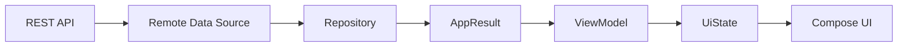

Kotlin standard library cũng có `Result<T>`, là kiểu đại diện cho một trong hai khả năng: **success chứa `T` hoặc failure chứa `Throwable`**. ([Kotlin][1])

> Trong bài này, **Result Wrapper** được hiểu như một architectural convention để biểu diễn outcome của operation. Nó không phải một trong 23 GoF Design Patterns cổ điển.

---

# 2. Mục tiêu học tập

Sau bài này, anh nên:

* giải thích được Result Wrapper;
* hiểu tại sao chỉ `try/catch` trong UI chưa đủ tốt;
* xây được `Success` và `Error`;
* phân biệt **operation result** và **UI state**;
* hiểu `kotlin.Result<T>`;
* biết khi nào cần custom `AppResult<T>`;
* tạo typed error thay vì đưa `Throwable` thẳng lên UI;
* xử lý network/storage/domain error;
* dùng Result Wrapper trong Repository;
* map Result sang `UiState`;
* kết hợp với `StateFlow`;
* giữ coroutine cancellation hoạt động đúng;
* viết fake repository;
* test success/error/loading;
* tránh nested Result và wrapper quá phức tạp;
* đưa một mini project vào portfolio.

---

# 3. Vấn đề khi không có Result Wrapper

Giả sử:

```kotlin
interface UserRepository {

    suspend fun getUser(
        id: String
    ): User
}
```

Implementation:

```kotlin
override suspend fun getUser(
    id: String
): User {

    return api.getUser(id)
        .toDomain()
}
```

Có rất nhiều thứ có thể xảy ra:

```text
HTTP 200
HTTP 401
HTTP 404
HTTP 500

No Internet

Timeout

JSON malformed

Database error

Mapping error
```

Nếu Repository chỉ expose:

```text
User
```

caller phải hiểu exception nào có thể xuất hiện từ implementation bên dưới.

---

# 4. Cách xử lý dễ trở nên rối

```kotlin
viewModelScope.launch {

    try {

        val user =
            repository.getUser(
                userId
            )

        // success

    } catch (
        exception: IOException
    ) {

        // network error

    } catch (
        exception: HttpException
    ) {

        // server error

    } catch (
        exception: SQLException
    ) {

        // database error
    }
}
```

Nếu nhiều ViewModel đều làm như vậy:

```text
ProfileViewModel
    ├── IOException
    ├── HttpException
    └── SQLException

HomeViewModel
    ├── IOException
    ├── HttpException
    └── SQLException

CartViewModel
    ├── IOException
    ├── HttpException
    └── SQLException
```

error-handling policy bị lặp lại khắp app.

Android khuyến nghị separation of concerns giữa UI và data layer; repository là entry point của data layer và che giấu chi tiết data source khỏi phần còn lại của ứng dụng. ([Android Developers][2])

---

# 5. Ý tưởng Result Wrapper

Ta chuyển từ:

```text
Repository
   ↓
Data hoặc Exception
```

thành:

```text
Repository
   ↓
Result Wrapper
   │
   ├── Success(data)
   │
   └── Error(error)
```

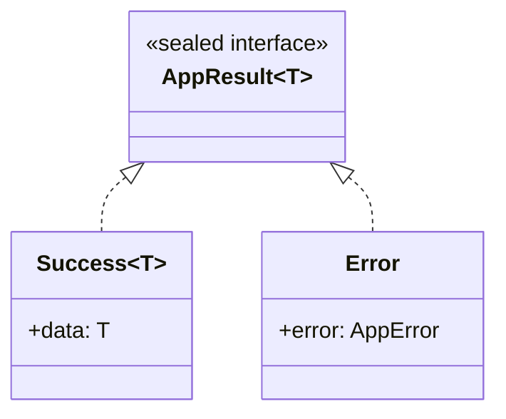

Caller xử lý:

```kotlin
when (val result =
    repository.getUser(id)
) {

    is AppResult.Success -> {
        // use result.data
    }

    is AppResult.Error -> {
        // use result.error
    }
}
```

---

# 6. Result Wrapper cơ bản bằng Kotlin

```kotlin
sealed interface AppResult<out T> {

    data class Success<T>(
        val data: T
    ) : AppResult<T>

    data class Error(
        val error: AppError
    ) : AppResult<Nothing>
}
```

Error:

```kotlin
sealed interface AppError {

    data object Network :
        AppError

    data object Unauthorized :
        AppError

    data object NotFound :
        AppError

    data object Server :
        AppError

    data object Database :
        AppError

    data class Unknown(
        val cause: Throwable? = null
    ) : AppError
}
```

Ta có:

```text
AppResult<User>
│
├── Success(User)
│
└── Error(AppError)
```

---

# 7. Tại sao dùng `Nothing`?

```kotlin
data class Error(
    val error: AppError
) : AppResult<Nothing>
```

`Nothing` cho phép cùng một `Error` hoạt động với:

```text
AppResult<User>
AppResult<Product>
AppResult<Order>
```

do `AppResult` được khai báo:

```kotlin
AppResult<out T>
```

Ví dụ:

```kotlin
val result:
    AppResult<User> =
    AppResult.Error(
        AppError.Network
    )
```

---

# 8. Result Wrapper khác UI State

Đây là điểm quan trọng nhất của bài.

## Operation Result

Trả lời câu hỏi:

> Operation vừa thực thi thành công hay thất bại?

```text
AppResult<User>
├── Success
└── Error
```

## UI State

Trả lời:

> Màn hình hiện phải hiển thị gì?

```text
ProfileUiState
├── Loading
├── Content
└── Error
```

Android mô tả UI layer như pipeline chuyển application data thành state mà UI có thể render; state holder như `ViewModel` chịu trách nhiệm sản xuất screen UI state. ([Android Developers][3])

---

# 9. Không nhất thiết đưa `Loading` vào Result

Có hai cách phổ biến.

### Cách A — Result chỉ là outcome

```text
AppResult<T>
├── Success<T>
└── Error
```

và:

```text
UiState
├── Loading
├── Content
└── Error
```

Đây thường là thiết kế rõ ràng cho one-shot operation.

### Cách B — Resource wrapper

```text
Resource<T>
├── Loading
├── Success<T>
└── Error
```

phù hợp hơn khi wrapper đại diện cho **một stream trạng thái asynchronous**.

Không nên mặc định coi hai loại này là một khái niệm.

---

# 10. Ví dụ UI State

```kotlin
sealed interface ProfileUiState {

    data object Loading :
        ProfileUiState

    data class Success(
        val user: UserUiModel
    ) : ProfileUiState

    data class Error(
        val message: String
    ) : ProfileUiState
}
```

Now in Android, sample chính thức của Google cũng sử dụng sealed UI-state hierarchies với các trạng thái như `Loading` và `Success` cho screen state. ([GitHub][4])

---

# 11. Luồng Result → UiState

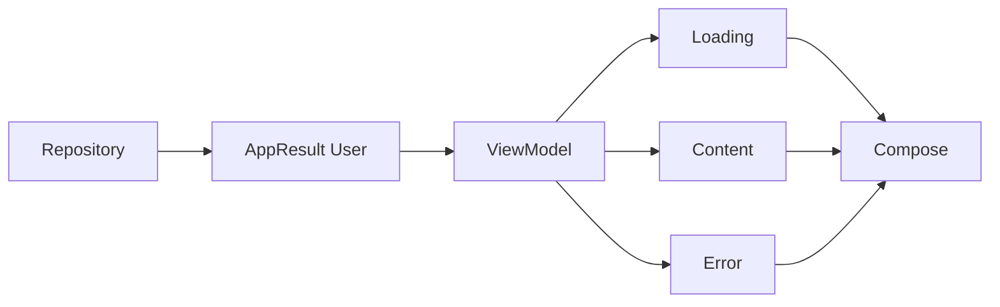

Repository không cần biết:

```text
CircularProgressIndicator
Snackbar
ErrorScreen
RetryButton
```

UI không cần biết:

```text
IOException
Retrofit
Room
SQL
HTTP response
```

---

# 12. Repository sử dụng Result Wrapper

```kotlin
interface UserRepository {

    suspend fun getUser(
        id: String
    ): AppResult<User>
}
```

Implementation:

```kotlin
class UserRepositoryImpl(
    private val api: UserApi
) : UserRepository {

    override suspend fun getUser(
        id: String
    ): AppResult<User> {

        return try {

            val dto =
                api.getUser(id)

            AppResult.Success(
                dto.toDomain()
            )

        } catch (
            exception: IOException
        ) {

            AppResult.Error(
                AppError.Network
            )
        }
    }
}
```

---

# 13. Không expose infrastructure error lên UI

Không nên để UI phải viết:

```kotlin
when (exception) {

    is UnknownHostException -> {
        // ...
    }

    is SocketTimeoutException -> {
        // ...
    }

    is HttpException -> {
        // ...
    }
}
```

Có thể map:

```text
UnknownHostException
SocketTimeoutException
       ↓
AppError.Network
```

```text
HTTP 401
    ↓
AppError.Unauthorized
```

```text
HTTP 404
    ↓
AppError.NotFound
```

UI chỉ hiểu error ở cấp ứng dụng:

```kotlin
when (error) {

    AppError.Network -> {
        // "Không có kết nối mạng"
    }

    AppError.Unauthorized -> {
        // chuyển login
    }

    AppError.NotFound -> {
        // user không tồn tại
    }

    else -> {
        // generic error
    }
}
```

---

# 14. Sơ đồ Error Mapping

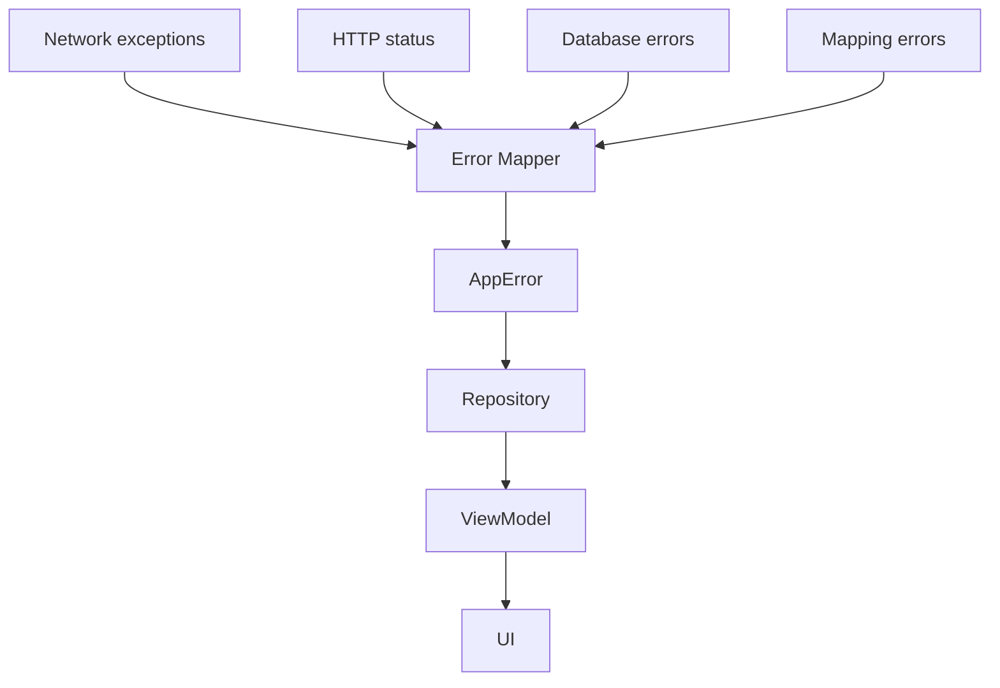

---

# 15. Tạo Error Mapper

```kotlin
fun Throwable.toAppError():
    AppError {

    return when (this) {

        is IOException ->
            AppError.Network

        else ->
            AppError.Unknown(this)
    }
}
```

Repository:

```kotlin
override suspend fun getUser(
    id: String
): AppResult<User> {

    return try {

        AppResult.Success(
            api.getUser(id)
                .toDomain()
        )

    } catch (
        exception: IOException
    ) {

        AppResult.Error(
            exception.toAppError()
        )
    }
}
```

---

# 16. Cẩn thận với coroutine cancellation

Một lỗi nghiêm trọng là:

```kotlin
try {
    repositoryCall()
} catch (
    exception: Throwable
) {
    AppResult.Error(...)
}
```

hoặc:

```kotlin
try {
    repositoryCall()
} catch (
    exception: Exception
) {
    AppResult.Error(...)
}
```

vì coroutine cancellation dựa trên `CancellationException`. Android hiện khuyến nghị **không nuốt `CancellationException`**; nếu bắt nó thì phải rethrow và nên ưu tiên catch những exception cụ thể như `IOException`. ([Android Developers][5])

---

# 17. Phiên bản an toàn hơn

```kotlin
override suspend fun getUser(
    id: String
): AppResult<User> {

    return try {

        AppResult.Success(
            api.getUser(id)
                .toDomain()
        )

    } catch (
        exception:
            CancellationException
    ) {

        throw exception

    } catch (
        exception: IOException
    ) {

        AppResult.Error(
            AppError.Network
        )
    }
}
```

Hoặc tốt hơn nữa:

```text
Catch đúng loại lỗi
mà boundary đó thực sự có trách nhiệm xử lý
```

thay vì bắt mọi `Throwable`.

---

# 18. `runCatching` và điểm cần chú ý

Kotlin có:

```kotlin
runCatching {
    api.getUser(id)
}
```

`runCatching` trả về `Result<T>` và **bắt mọi `Throwable`** được ném ra trong block. ([Kotlin][6])

Do đó:

```kotlin
runCatching {
    suspendCall()
}
```

cần được sử dụng cẩn thận trong coroutine code vì nó cũng có thể capture cancellation exception.

Android khuyến nghị không consume `CancellationException`. ([Android Developers][5])

---

# 19. Kotlin có sẵn `Result<T>`

Kotlin standard library định nghĩa:

```kotlin
Result<T>
```

đại diện cho:

```text
Success(T)

hoặc

Failure(Throwable)
```

([Kotlin][1])

Ví dụ:

```kotlin
fun loadConfig():
    Result<Config> {

    return Result.success(
        Config(...)
    )
}
```

Failure:

```kotlin
return Result.failure(
    IOException()
)
```

Kotlin cung cấp `Result.success()` và `Result.failure()` để tạo hai outcome này. ([Kotlin][7])

---

# 20. Sử dụng `kotlin.Result`

```kotlin
val result:
    Result<User> =
    repository.getUser()
```

Kiểm tra:

```kotlin
if (result.isSuccess) {

    val user =
        result.getOrNull()
}
```

`getOrNull()` trả giá trị khi success hoặc `null` nếu failure. ([Kotlin][8])

---

# 21. Dùng `fold`

```kotlin
result.fold(

    onSuccess = { user ->

        // success
    },

    onFailure = { throwable ->

        // failure
    }
)
```

`Result.fold()` chọn `onSuccess` hoặc `onFailure` dựa trên outcome hiện tại. ([Kotlin][9])

---

# 22. `kotlin.Result` hay Custom Result?

## `kotlin.Result<T>`

Phù hợp khi:

```text
Success(T)
vs
Throwable
```

là đủ.

Ví dụ:

```kotlin
Result<User>
```

---

## Custom `AppResult<T>`

Phù hợp khi cần:

```text
typed errors
domain errors
error metadata
retry policy
application semantics
```

Ví dụ:

```text
AppResult<User>

Error:
├── Network
├── Unauthorized
├── UserNotFound
└── AccountSuspended
```

---

# 23. So sánh

|                            | `kotlin.Result<T>` | `AppResult<T>` |
| -------------------------- | ------------------ | -------------- |
| Success value              | Có                 | Có             |
| Failure                    | `Throwable`        | Tùy thiết kế   |
| Typed domain error         | Không trực tiếp    | Có             |
| Boilerplate                | Thấp               | Cao hơn        |
| Custom metadata            | Hạn chế            | Dễ             |
| Standard Kotlin API        | Có                 | Không          |
| `fold`, `map`, `getOrNull` | Có                 | Phải tự thêm   |

`Result<T>` của Kotlin chỉ mô hình hóa success hoặc failure bằng `Throwable`; custom wrapper hữu ích khi application muốn chuyển infrastructure exceptions thành một error vocabulary riêng. ([Kotlin][1])

---

# 24. Typed Error

Thay vì:

```kotlin
AppResult.Error(
    Throwable()
)
```

ta có thể dùng:

```kotlin
sealed interface LoginError {

    data object InvalidCredentials :
        LoginError

    data object Network :
        LoginError

    data object AccountLocked :
        LoginError

    data object Unknown :
        LoginError
}
```

Một Result generic hai tham số:

```kotlin
sealed interface AppResult<
    out T,
    out E
> {

    data class Success<T>(
        val data: T
    ) : AppResult<T, Nothing>

    data class Error<E>(
        val error: E
    ) : AppResult<Nothing, E>
}
```

Sử dụng:

```kotlin
suspend fun login(
    username: String,
    password: String
): AppResult<
    User,
    LoginError
>
```

---

# 25. Result Wrapper theo từng feature

Không nhất thiết cần:

```text
GlobalAppError
```

chứa 100 error types.

Có thể dùng:

```text
LoginError
CheckoutError
ProfileError
UploadError
```

Ví dụ:

```kotlin
sealed interface CheckoutError {

    data object PaymentDeclined :
        CheckoutError

    data object ProductOutOfStock :
        CheckoutError

    data object Network :
        CheckoutError
}
```

Điều này khiến API của use case rõ hơn:

```kotlin
suspend fun checkout():
    AppResult<
        Order,
        CheckoutError
    >
```

---

# 26. Result Wrapper trong Data Layer

Android architecture đặt repository ở data layer và xem repository như nơi expose application data cũng như che giấu chi tiết các data source. ([Android Developers][2])

Một thiết kế:

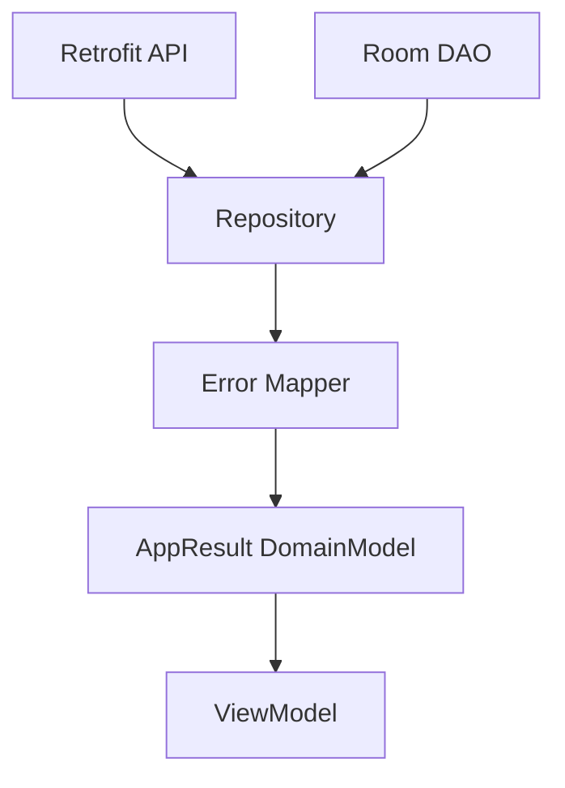

Repository có thể biến:

```text
HTTP / IO / DB exceptions
```

thành:

```text
application-level result
```

---

# 27. Result Wrapper trong Domain Layer

Nếu có Use Case:

```text
Repository
    ↓
Result<User>
    ↓
UseCase
    ↓
Result<Profile>
```

Ví dụ:

```kotlin
class GetProfileUseCase(
    private val repository:
        UserRepository
) {

    suspend operator fun invoke():
        AppResult<Profile> {

        return when (
            val result =
                repository.getUser()
        ) {

            is AppResult.Success -> {

                AppResult.Success(
                    result.data
                        .toProfile()
                )
            }

            is AppResult.Error -> {

                result
            }
        }
    }
}
```

---

# 28. Tạo `map()` cho Result Wrapper

Ta có thể tránh viết `when` nhiều lần:

```kotlin
inline fun <T, R>
    AppResult<T>.map(
        transform: (T) -> R
    ): AppResult<R> {

    return when (this) {

        is AppResult.Success ->
            AppResult.Success(
                transform(data)
            )

        is AppResult.Error ->
            this
    }
}
```

Sử dụng:

```kotlin
repository.getUser()
    .map {
        it.toProfile()
    }
```

---

# 29. `mapError()`

```kotlin
inline fun <
    T,
    E,
    R
> AppResult<T, E>.mapError(
    transform: (E) -> R
): AppResult<T, R> {

    return when (this) {

        is AppResult.Success ->
            this

        is AppResult.Error ->
            AppResult.Error(
                transform(error)
            )
    }
}
```

Ví dụ:

```text
NetworkError
     ↓
Domain LoginError
```

---

# 30. Result → ViewModel

```kotlin
class ProfileViewModel(
    private val repository:
        UserRepository
) : ViewModel() {

    private val _uiState =
        MutableStateFlow<
            ProfileUiState
        >(
            ProfileUiState.Loading
        )

    val uiState =
        _uiState.asStateFlow()

    fun loadProfile() {

        viewModelScope.launch {

            _uiState.value =
                ProfileUiState.Loading

            when (
                val result =
                    repository.getUser()
            ) {

                is AppResult.Success -> {

                    _uiState.value =
                        ProfileUiState
                            .Success(
                                result.data
                                    .toUiModel()
                            )
                }

                is AppResult.Error -> {

                    _uiState.value =
                        ProfileUiState
                            .Error(
                                result.error
                                    .toMessage()
                            )
                }
            }
        }
    }
}
```

---

# 31. UI chỉ render state

```kotlin
@Composable
fun ProfileScreen(
    state: ProfileUiState,
    onRetry: () -> Unit
) {

    when (state) {

        ProfileUiState.Loading -> {

            CircularProgressIndicator()
        }

        is ProfileUiState.Success -> {

            ProfileContent(
                user = state.user
            )
        }

        is ProfileUiState.Error -> {

            ErrorContent(
                message =
                    state.message,
                onRetry =
                    onRetry
            )
        }
    }
}
```

Android khuyến nghị UI được dẫn dắt bởi UI state, trong khi state holder như ViewModel xử lý logic để tạo state mà UI cần render. ([Android Developers][3])

---

# 32. Luồng hoàn chỉnh

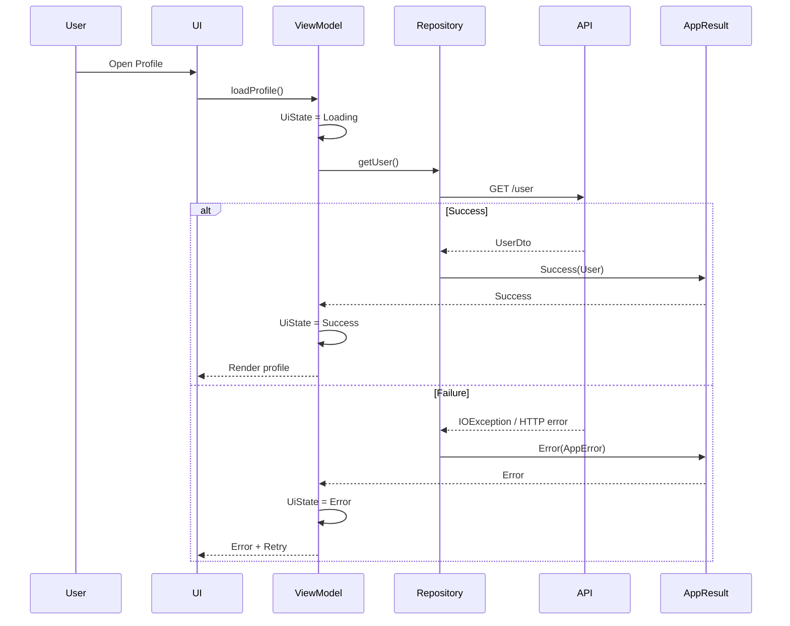

---

# 33. Result Wrapper + StateFlow

Một Result Wrapper không thay thế `StateFlow`.

Hai khái niệm giải quyết hai vấn đề khác nhau:

```text
Result
→ outcome của operation

StateFlow
→ stream/state holder phát state theo thời gian
```

Có thể dùng:

```text
Repository
    ↓
AppResult<User>
    ↓
ViewModel
    ↓
StateFlow<ProfileUiState>
    ↓
Compose
```

---

# 34. Result Wrapper + Flow

Repository có thể expose:

```kotlin
Flow<AppResult<List<Article>>>
```

Ví dụ:

```kotlin
fun observeArticles():
    Flow<AppResult<List<Article>>> {

    return dao
        .observeArticles()
        .map { entities ->

            AppResult.Success(
                entities.map(
                    ArticleEntity::toDomain
                )
            )
        }
}
```

Tuy nhiên cần hỏi:

> Stream này thực sự có cần Result wrapper không?

Nếu Room `Flow` đại diện source of truth lâu dài, đôi khi:

```kotlin
Flow<List<Article>>
```

và xử lý lỗi ở boundary thích hợp sẽ đơn giản hơn.

Không phải mọi `Flow<T>` đều cần thành:

```text
Flow<Result<T>>
```

---

# 35. Offline-first App

Trong offline-first architecture, Android khuyến nghị repository có local và network data source, và higher layers không giao tiếp trực tiếp với network layer. ([Android Developers][10])

Một refresh operation có thể dùng Result rất tốt:

```kotlin
suspend fun refreshArticles():
    AppResult<Unit>
```

Trong khi việc đọc:

```kotlin
fun observeArticles():
    Flow<List<Article>>
```

có thể lấy từ local source of truth.

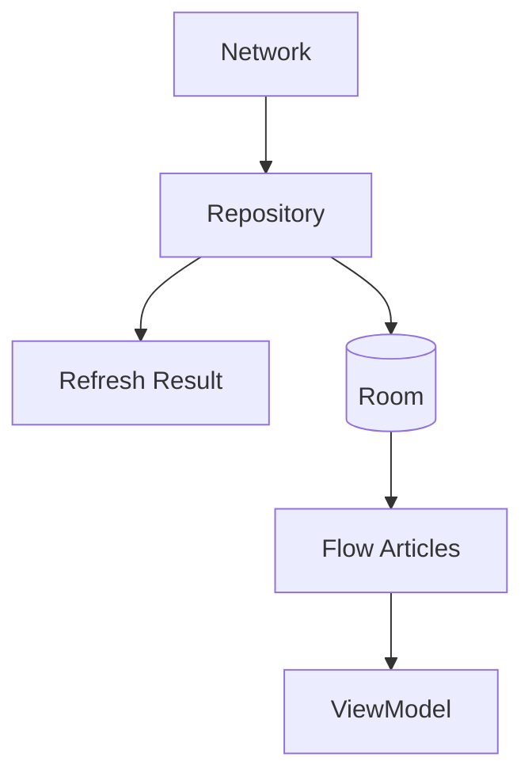

---

# 36. Ví dụ Offline-first

```kotlin
interface ArticleRepository {

    fun observeArticles():
        Flow<List<Article>>

    suspend fun refresh():
        AppResult<Unit>
}
```

Refresh:

```kotlin
override suspend fun refresh():
    AppResult<Unit> {

    return try {

        val remote =
            api.getArticles()

        dao.replaceAll(
            remote.map(
                ArticleDto::toEntity
            )
        )

        AppResult.Success(
            Unit
        )

    } catch (
        exception: IOException
    ) {

        AppResult.Error(
            AppError.Network
        )
    }
}
```

---

# 37. Không dùng Result để biểu diễn mọi thứ

Ví dụ này có thể quá mức:

```kotlin
fun getUsername():
    AppResult<String>
```

nếu function đơn giản chỉ đọc giá trị chắc chắn trong memory.

Result Wrapper đáng giá khi caller cần biết outcome:

```text
network
database
filesystem
authentication
payment
upload
sync
validation
```

---

# 38. Domain validation cũng có thể dùng Result

Ví dụ đăng ký tài khoản:

```kotlin
sealed interface
    RegistrationError {

    data object InvalidEmail :
        RegistrationError

    data object WeakPassword :
        RegistrationError

    data object EmailTaken :
        RegistrationError
}
```

Use case:

```kotlin
suspend fun register(
    email: String,
    password: String
): AppResult<
    User,
    RegistrationError
>
```

Lúc này Result không chỉ biểu diễn:

```text
technical failure
```

mà còn:

```text
expected business failure
```

---

# 39. Expected Error vs Programming Bug

Không nên biến mọi exception thành:

```text
Result.Error
```

Ví dụ:

```text
IllegalStateException do code bug
NullPointerException do bug
AssertionError
```

không nhất thiết nên bị che thành:

```text
"Đã xảy ra lỗi"
```

ở tầng quá thấp.

Result Wrapper phù hợp nhất với **failure mà application có chiến lược xử lý rõ ràng**.

Android cũng khuyến nghị catch exception cụ thể thay vì catch `Exception`/`Throwable` quá rộng, vì có thể che giấu bug hoặc phá coroutine cancellation. ([Android Developers][5])

---

# 40. Anti-pattern: trả exception message trực tiếp cho user

Không nên:

```kotlin
Text(
    throwable.message
        ?: "Error"
)
```

Có thể tạo:

```text
SocketTimeoutException:
"failed to connect to api.foo.com
after 10000ms..."
```

UI nên map:

```text
AppError.Network
        ↓
UI message
        ↓
"Không thể kết nối. Vui lòng thử lại."
```

Infrastructure detail không cần trở thành UX copy.

---

# 41. Anti-pattern: Result Wrapper lồng nhau

Không nên:

```kotlin
AppResult<
    AppResult<
        User
    >
>
```

hoặc:

```kotlin
Flow<
    Result<
        Resource<
            User
        >
    >
>
```

Điều này gây:

```text
wrapper
 ↓
wrapper
 ↓
wrapper
 ↓
actual data
```

Nếu gặp cấu trúc này, nên xem lại ownership:

```text
Ai quản lý loading?
Ai quản lý errors?
Ai quản lý asynchronous stream?
```

---

# 42. Anti-pattern: Generic `Resource` cho toàn bộ app

Ví dụ:

```kotlin
sealed class Resource<T> {

    Loading

    Success<T>

    Error<T>

    Empty<T>

    Cached<T>

    Offline<T>

    Retrying<T>

    Partial<T>

    Refreshing<T>

    Stale<T>

    // ...
}
```

Wrapper càng ngày càng cố biểu diễn mọi state của mọi feature.

Tốt hơn có thể là:

```text
Data layer
→ Result<T, E>

UI
→ feature-specific UiState
```

Ví dụ:

```kotlin
data class FeedUiState(

    val articles:
        List<ArticleUiModel>,

    val refreshing:
        Boolean,

    val refreshError:
        Boolean
)
```

Một màn hình hoàn toàn có thể:

```text
đang có content
+
đang refresh
```

nên `Loading | Success | Error` đơn giản đôi khi không đủ diễn đạt UI thực tế.

---

# 43. Loading không phải lúc nào cũng full-screen state

Ví dụ user đang nhìn:

```text
20 articles
```

sau đó pull-to-refresh.

UI lúc này:

```text
Content vẫn tồn tại
+
Refreshing = true
```

không phải:

```text
Loading
```

toàn màn hình.

Do đó:

```kotlin
data class FeedUiState(

    val articles:
        List<ArticleUiModel> =
        emptyList(),

    val isLoading:
        Boolean = true,

    val isRefreshing:
        Boolean = false,

    val error:
        UiError? = null
)
```

có thể chính xác hơn sealed `Loading/Success/Error`, tùy UX.

Android khuyến nghị model UI state dựa trên dữ liệu thực tế mà UI cần trình bày, thay vì buộc mọi screen vào một hình thức duy nhất. ([Android Developers][3])

---

# 44. Result Wrapper và lifecycle

Result Wrapper bản thân:

```text
không có lifecycle
```

Nó chỉ là value:

```text
Success(data)
hoặc
Error(error)
```

Lifecycle thuộc về:

```text
ViewModel
StateFlow
CoroutineScope
Compose
Activity / Fragment
```

State holder nên tồn tại phù hợp với lifetime của UI mà nó phục vụ; `ViewModel` thường được dùng cho screen-level state. ([Android Developers][11])

---

# 45. Rotate màn hình

Nếu:

```text
Repository call
    ↓
AppResult
    ↓
ViewModel
    ↓
StateFlow<UiState>
```

thì configuration change không yêu cầu Result Wrapper phải tự lưu state.

Trách nhiệm giữ screen state thuộc:

```text
ViewModel
```

hoặc persistence mechanism phù hợp.

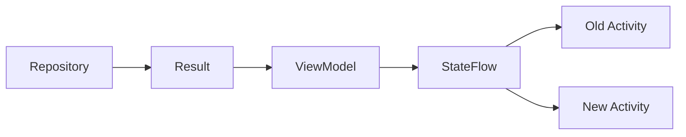

---

# 46. Result Wrapper và UX

Result Wrapper giúp application phân loại lỗi để UX phản ứng khác nhau.

Ví dụ:

```text
Network
    ↓
Retry button

Unauthorized
    ↓
Login screen

NotFound
    ↓
Empty / Not found screen

Server
    ↓
Temporary error

Validation
    ↓
Inline field error
```

Không nên:

```text
mọi lỗi
   ↓
Toast("Error")
```

---

# 47. Retry policy

Có thể thêm metadata:

```kotlin
sealed interface AppError {

    val retryable: Boolean

    data object Network :
        AppError {

        override val retryable =
            true
    }

    data object Unauthorized :
        AppError {

        override val retryable =
            false
    }
}
```

UI:

```kotlin
ErrorContent(
    showRetry =
        error.retryable
)
```

Tuy nhiên business retry policy phức tạp nên được đặt ở layer phù hợp thay vì nhồi toàn bộ vào wrapper.

---

# 48. Testing Result Wrapper

Result rất dễ test vì output rõ ràng.

Success:

```kotlin
@Test
fun getUser_success_returnsUser() =
    runTest {

        val repository =
            UserRepositoryImpl(
                api =
                    FakeUserApi(
                        shouldFail =
                            false
                    )
            )

        val result =
            repository.getUser(
                "1"
            )

        assertTrue(
            result
                is AppResult.Success
        )
    }
```

---

# 49. Test Error

```kotlin
@Test
fun getUser_networkFailure_returnsNetworkError() =
    runTest {

        val repository =
            UserRepositoryImpl(
                api =
                    FakeUserApi(
                        shouldFail =
                            true
                    )
            )

        val result =
            repository.getUser(
                "1"
            )

        assertEquals(
            AppResult.Error(
                AppError.Network
            ),
            result
        )
    }
```

---

# 50. Fake API

```kotlin
class FakeUserApi(
    private val shouldFail:
        Boolean
) : UserApi {

    override suspend fun getUser(
        id: String
    ): UserDto {

        if (shouldFail) {
            throw IOException()
        }

        return UserDto(
            id = id,
            name = "Android User"
        )
    }
}
```

Test seam:

```text
Fake API
   ↓
Repository
   ↓
AppResult
   ↓
Assertion
```

---

# 51. Fake Repository cho ViewModel

```kotlin
class FakeUserRepository :
    UserRepository {

    var result:
        AppResult<User> =
        AppResult.Success(
            User(
                id = "1",
                name = "Test"
            )
        )

    override suspend fun getUser(
        id: String
    ): AppResult<User> {

        return result
    }
}
```

Android dependency-injection guidance nêu rõ việc phụ thuộc abstraction cho phép thay production implementation bằng fake/mock trong testing.

---

# 52. Test ViewModel — Success

```kotlin
@Test
fun loadProfile_success_updatesUiState() =
    runTest {

        val repository =
            FakeUserRepository()

        repository.result =
            AppResult.Success(
                User(
                    id = "1",
                    name = "An"
                )
            )

        val viewModel =
            ProfileViewModel(
                repository
            )

        viewModel.loadProfile()

        advanceUntilIdle()

        assertTrue(
            viewModel
                .uiState
                .value
                is ProfileUiState
                    .Success
        )
    }
```

---

# 53. Test ViewModel — Error

```kotlin
@Test
fun loadProfile_networkError_updatesErrorState() =
    runTest {

        val repository =
            FakeUserRepository()

        repository.result =
            AppResult.Error(
                AppError.Network
            )

        val viewModel =
            ProfileViewModel(
                repository
            )

        viewModel.loadProfile()

        advanceUntilIdle()

        assertTrue(
            viewModel
                .uiState
                .value
                is ProfileUiState
                    .Error
        )
    }
```

---

# 54. Dependency Direction

Bài roadmap yêu cầu:

> Draw the dependency direction for this concept.

Một thiết kế:

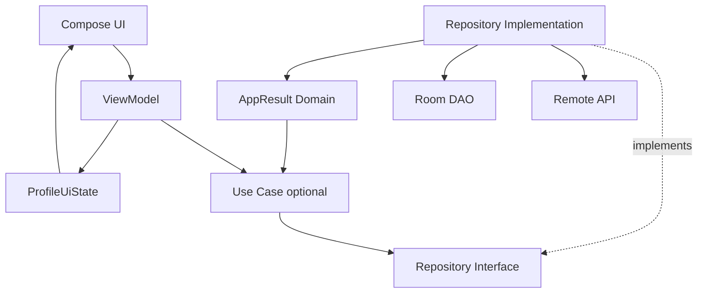

UI không phụ thuộc:

```text
Retrofit exception
Room exception
HTTP implementation
```

---

# 55. Result Wrapper + Mapper Pattern

Bài trước:

```text
DTO
 ↓
Mapper
 ↓
Domain
```

Kết hợp Result:

```text
API
 ↓
DTO
 ↓
Mapper
 ↓
Domain
 ↓
Success(Domain)
```

Nếu lỗi:

```text
API exception
 ↓
Error Mapper
 ↓
AppError
 ↓
Error(AppError)
```

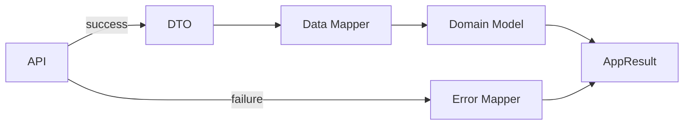

---

# 56. Result Wrapper + Observer Pattern

Bài Observer:

```text
StateFlow
 ↓
UI observes
```

Bài Result:

```text
Operation
 ↓
Result
```

Kết hợp:

```text
Repository call
      ↓
AppResult
      ↓
ViewModel
      ↓
UiState
      ↓
StateFlow
      ↓
Compose observes
```

Đây là pipeline rất phổ biến trong Android reactive architecture.

---

# 57. Result Wrapper + Factory Pattern

Factory:

```text
Factory
 ↓
Repository implementation
```

Repository:

```text
Repository
 ↓
AppResult
```

Toàn bộ:

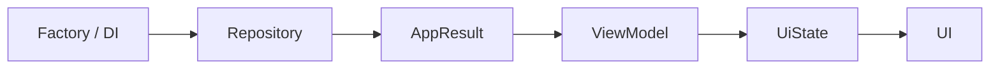

---

# 58. Khi nào nên dùng Result Wrapper?

Rất phù hợp với one-shot operations như:

```text
Login
Register
Checkout
Refresh
Upload
Download request
Save
Delete
Sync
Submit form
Fetch detail
```

Ví dụ:

```kotlin
suspend fun uploadAvatar():
    AppResult<Avatar>
```

---

# 59. Khi nào không cần?

Một function:

```kotlin
fun calculateTotal(
    items: List<Item>
): Money
```

nếu luôn có kết quả hợp lệ thì:

```text
Result<Money>
```

không cần thiết.

Tương tự:

```kotlin
fun fullName():
    String
```

không nên trở thành:

```kotlin
AppResult<String>
```

chỉ vì project có Result Wrapper.

---

# 60. Production Checklist

### Error classification

```text
Network?
HTTP?
Auth?
Validation?
Database?
Business?
```

Có phân biệt đúng không?

### Cancellation

```text
CancellationException
```

có bị swallow không? Android khuyến nghị không consume cancellation exceptions. ([Android Developers][5])

### Error leakage

```text
Throwable.message
```

có bị đưa trực tiếp cho user không?

### Retry

```text
Lỗi nào retry được?
```

### Logging

Có giữ `cause` đủ để debug nhưng không expose thông tin nhạy cảm ra UI?

### State

Loading là operation state hay screen state?

### Offline

Mất mạng có thật sự là error nếu app vẫn có cached data?

### Testing

Có test:

```text
success
network error
auth error
server error
mapping error
retry
```

không?

---

# 61. Debugging

Khi màn hình luôn hiện:

```text
"Something went wrong"
```

trace:

```text
1. API thực sự trả gì?
        ↓
2. Data source ném exception gì?
        ↓
3. Repository bắt exception nào?
        ↓
4. Error Mapper map thành gì?
        ↓
5. AppResult đang là gì?
        ↓
6. ViewModel map sang UiState gì?
        ↓
7. UI render state nào?
```

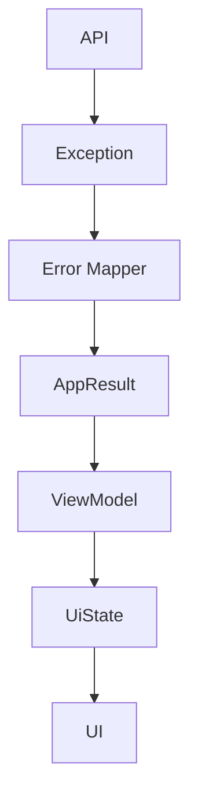

---

# 62. Bài thực hành

Xây màn hình:

```text
LoginScreen
```

Repository:

```kotlin
interface AuthRepository {

    suspend fun login(
        email: String,
        password: String
    ): AppResult<
        User,
        LoginError
    >
}
```

Error:

```text
LoginError
├── InvalidCredentials
├── Network
├── AccountLocked
└── Unknown
```

UI state:

```text
LoginUiState
├── Idle
├── Loading
├── LoggedIn
└── Error
```

Yêu cầu:

1. Tạo Result Wrapper.
2. Tạo typed `LoginError`.
3. Tạo fake repository.
4. ViewModel chuyển Result → UiState.
5. Compose render state.
6. Retry network error.
7. Không đưa `Throwable` vào Composable.
8. Test success.
9. Test invalid credentials.
10. Test network failure.

---

# 63. Bài tập refactor

## Trước

```kotlin
class ProfileViewModel(
    private val api:
        UserApi
) : ViewModel() {

    fun load() {

        viewModelScope.launch {

            try {

                val user =
                    api.getUser()

                // update UI

            } catch (
                e: Exception
            ) {

                // show error
            }
        }
    }
}
```

Các vấn đề:

```text
ViewModel biết API
ViewModel biết exception
ViewModel xử lý infrastructure errors
catch Exception quá rộng
```

Android khuyến nghị UI/ViewModel làm việc qua data/domain layer thay vì giao tiếp trực tiếp với data source. ([Android Developers][2])

---

# 64. Sau Refactor

```text
UserApi
   ↓
Repository
   ↓
Error Mapper
   ↓
AppResult<User>
   ↓
ProfileViewModel
   ↓
ProfileUiState
   ↓
Compose
```

ViewModel:

```kotlin
class ProfileViewModel(
    private val repository:
        UserRepository
) : ViewModel() {

    // screen state only
}
```

---

# 65. Folder Structure gợi ý

```text
com.example.app
│
├── core
│   └── result
│       ├── AppResult.kt
│       └── AppError.kt
│
├── data
│   ├── remote
│   │   └── UserApi.kt
│   │
│   └── repository
│       └── UserRepositoryImpl.kt
│
├── domain
│   ├── model
│   │   └── User.kt
│   │
│   └── repository
│       └── UserRepository.kt
│
└── ui
    └── profile
        ├── ProfileUiState.kt
        ├── ProfileViewModel.kt
        └── ProfileScreen.kt
```

Không bắt buộc tạo:

```text
core/result
```

nếu wrapper chỉ dùng trong một feature.

---

# 66. Artifact Portfolio

```text
result-wrapper-android/
│
├── app/
│
├── docs/
│   ├── result-flow.md
│   └── error-model.md
│
├── screenshots/
│   ├── loading.png
│   ├── success.png
│   └── error.png
│
├── tests/
│   ├── UserRepositoryTest.kt
│   └── ProfileViewModelTest.kt
│
└── README.md
```

---

# 67. README mẫu

```markdown
# Result Wrapper Android Demo

## Problem

Network exceptions were handled directly
inside ViewModels.

## Solution

Repository converts infrastructure failures
into a typed Result Wrapper.

UserApi
↓
Repository
↓
AppResult<User>
↓
ViewModel
↓
ProfileUiState
↓
Compose

## Result

AppResult
├── Success<T>
└── Error<AppError>

## UI State

ProfileUiState
├── Loading
├── Success
└── Error

## Benefits

- Clear error boundaries
- Less infrastructure leakage
- Easier unit testing
- Consistent error handling
- Better UX decisions

## Tests

- Success
- Network failure
- Unauthorized
- Not found
- Retry
```

---

# 68. Checklist hoàn thành

* [ ] Giải thích được Result Wrapper.
* [ ] Biết `Success`.
* [ ] Biết `Error`.
* [ ] Hiểu `Loading` không nhất thiết thuộc Result.
* [ ] Phân biệt Result với UI State.
* [ ] Biết `kotlin.Result<T>`.
* [ ] Biết khi nào dùng custom Result.
* [ ] Biết typed error.
* [ ] Không expose infrastructure exception lên UI.
* [ ] Có Error Mapper.
* [ ] Không swallow `CancellationException`.
* [ ] Biết rủi ro của `runCatching`.
* [ ] Biết map Result.
* [ ] Biết map Error.
* [ ] Dùng Result trong Repository.
* [ ] Map Result → UiState trong ViewModel.
* [ ] UI chỉ render UiState.
* [ ] Có fake API hoặc fake Repository.
* [ ] Test success.
* [ ] Test failure.
* [ ] Có dependency diagram.
* [ ] Có README hoặc demo portfolio.

---

# 69. Câu hỏi tự kiểm tra

### Câu 1 — Result Wrapper giải quyết vấn đề gì?

> Biểu diễn outcome của một operation một cách rõ ràng thay vì để caller phụ thuộc trực tiếp vào implementation-specific exceptions.

---

### Câu 2 — Result và UI State có giống nhau không?

Không.

```text
Result
→ operation outcome

UiState
→ trạng thái màn hình cần render
```

---

### Câu 3 — Kotlin có Result sẵn không?

Có:

```kotlin
Result<T>
```

với:

```text
Success(T)
Failure(Throwable)
```

([Kotlin][1])

---

### Câu 4 — Khi nào cần custom Result?

Khi muốn:

```text
typed error
domain error
custom metadata
application-specific semantics
```

---

### Câu 5 — Vì sao không nên catch `Throwable` rồi biến tất cả thành Error?

Vì có thể:

```text
che programming bugs
+
nuốt CancellationException
```

Android khuyến nghị catch exception cụ thể và không consume `CancellationException`. ([Android Developers][5])

---

### Câu 6 — `runCatching` cần chú ý điều gì?

`runCatching` bắt mọi `Throwable`. ([Kotlin][6])

Với suspend/coroutine code, cần bảo đảm cancellation không bị biến thành một failure thông thường.

---

### Câu 7 — Có nên dùng `Resource<Loading/Success/Error>` cho mọi màn hình?

Không.

Màn hình thực tế có thể cần:

```text
content + refreshing
content + warning
partial data
cached data
```

nên feature-specific `UiState` thường biểu đạt UX tốt hơn một generic wrapper duy nhất.

---

# 70. Sơ đồ ghi nhớ nhanh

```text
                RESULT WRAPPER

                      │
                      ▼

                Operation
                      │
              ┌───────┴───────┐
              ▼               ▼
           Success           Error
              │               │
              ▼               ▼
            Data           AppError


             TRONG ANDROID

               Remote API
                   │
                   ▼
               Repository
                   │
                   ▼
             AppResult<User>
                   │
                   ▼
                ViewModel
                   │
           ┌───────┼────────┐
           ▼       ▼        ▼
        Loading  Content   Error
           │       │        │
           └───────┼────────┘
                   ▼
                 UiState
                   │
                   ▼
                Compose
```

---

# 71. Kết hợp 4 pattern vừa học

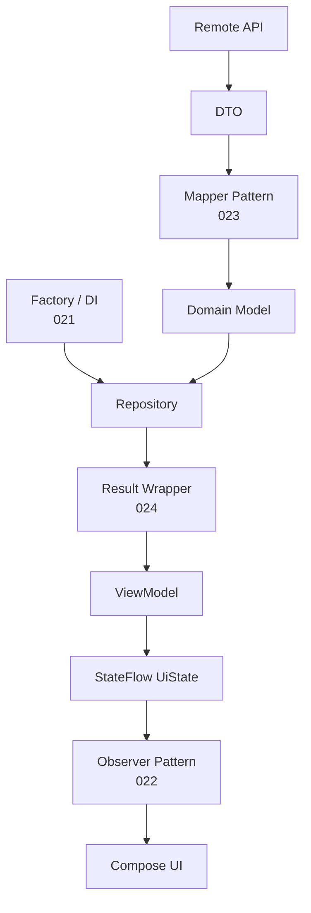

Có thể nhớ:

```text
Factory
→ Ai tạo object?

Observer
→ Ai được thông báo khi state đổi?

Mapper
→ Model A biến thành Model B thế nào?

Result Wrapper
→ Operation thành công hay thất bại?
```

---

# 72. Tổng kết

**Result Wrapper** tạo một boundary rõ ràng cho outcome:

```text
Operation
    ↓
Success
hoặc
Error
```

Trong Android architecture, một pipeline tốt có thể là:

```text
Retrofit / Room
      ↓
Repository
      ↓
AppResult<DomainModel>
      ↓
ViewModel
      ↓
UiState
      ↓
StateFlow
      ↓
Compose
```

`kotlin.Result<T>` đã cung cấp abstraction chuẩn cho `Success(T)` và `Failure(Throwable)`. ([Kotlin][1]) Khi ứng dụng cần vocabulary lỗi giàu ý nghĩa hơn như `Unauthorized`, `InvalidCredentials`, `OutOfStock` hay `PaymentDeclined`, custom typed Result có thể tạo boundary rõ hơn giữa infrastructure và application logic.

Điểm quan trọng nhất là **không đánh đồng `Result` với `UiState`**:

```text
Result
→ chuyện gì xảy ra với operation?

UiState
→ user hiện phải nhìn thấy gì?
```

Và với coroutine:

```text
Error handling
≠
catch mọi Throwable
```

cần giữ cancellation hoạt động đúng; Android hiện đặc biệt khuyến nghị không consume `CancellationException`. ([Android Developers][5])

Artifact tốt nhất cho bài **024 - Result Wrapper** là một màn hình `Login` hoặc `Profile` có đầy đủ:

```text
Fake API
   ↓
Repository
   ↓
Typed Result
   ↓
ViewModel
   ↓
Loading / Success / Error UI State
   ↓
Compose
```

kèm unit test cho **success, network error, authentication error và retry**.

[1]: https://kotlinlang.org/api/core/kotlin-stdlib/kotlin/-result/?utm_source=chatgpt.com "Result | Core API – Kotlin Programming Language"
[2]: https://developer.android.com/topic/architecture/data-layer?utm_source=chatgpt.com "Data layer | App architecture"
[3]: https://developer.android.com/topic/architecture/ui-layer?utm_source=chatgpt.com "UI layer | App architecture"
[4]: https://github.com/android/nowinandroid/blob/main/docs/ArchitectureLearningJourney.md?utm_source=chatgpt.com "nowinandroid/docs/ArchitectureLearningJourney.md at main"
[5]: https://developer.android.com/kotlin/coroutines/coroutines-best-practices?utm_source=chatgpt.com "Best practices for coroutines in Android | Kotlin"
[6]: https://kotlinlang.org/api/core/kotlin-stdlib/kotlin/run-catching.html?utm_source=chatgpt.com "runCatching | Core API – Kotlin Programming Language"
[7]: https://kotlinlang.org/api/core/kotlin-stdlib/kotlin/-result/-companion/success.html?utm_source=chatgpt.com "success | Core API – Kotlin Programming Language"
[8]: https://kotlinlang.org/api/core/kotlin-stdlib/kotlin/-result/get-or-null.html?utm_source=chatgpt.com "getOrNull | Core API – Kotlin Programming Language"
[9]: https://kotlinlang.org/api/core/kotlin-stdlib/kotlin/fold.html?utm_source=chatgpt.com "fold | Core API – Kotlin Programming Language"
[10]: https://developer.android.com/topic/architecture/data-layer/offline-first?utm_source=chatgpt.com "Build an offline-first app | App architecture"
[11]: https://developer.android.com/topic/architecture?utm_source=chatgpt.com "Guide to app architecture"

---

# Bài luyện tập

## Mục tiêu


## Đề bài


## Yêu cầu hoàn thành

- [ ] 
- [ ] 
- [ ] 

## Kết quả / lời giải


## Ghi chú
