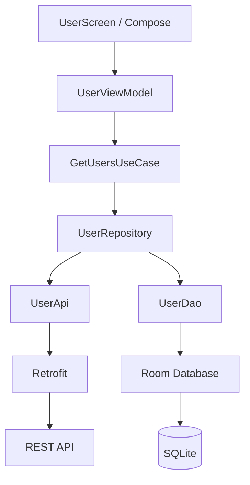
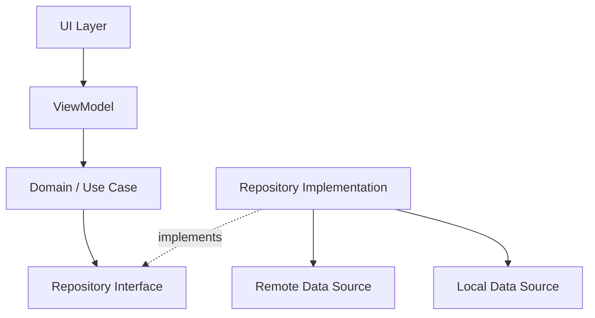
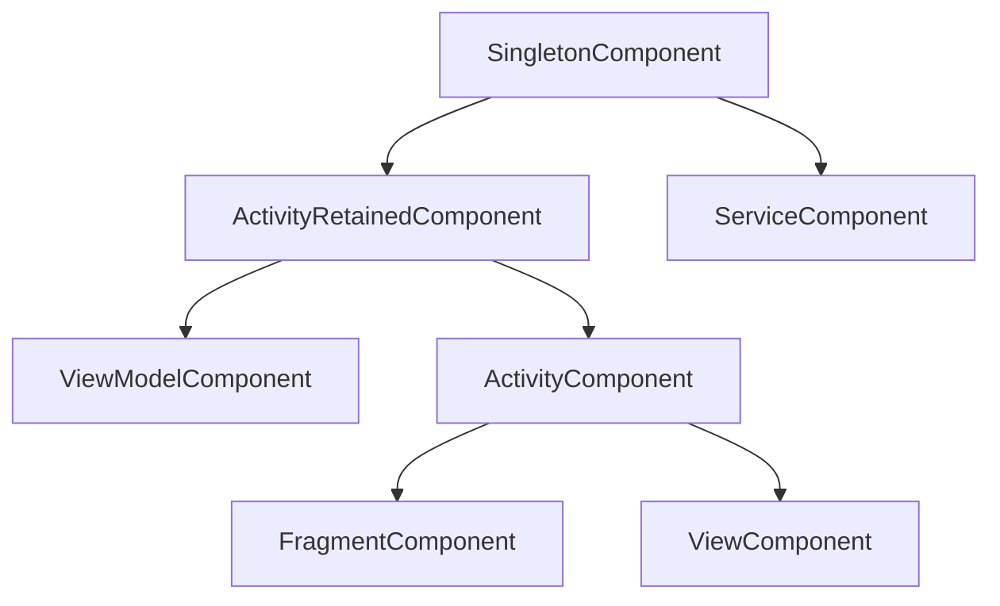
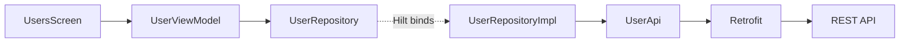
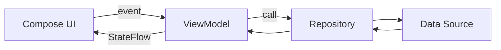
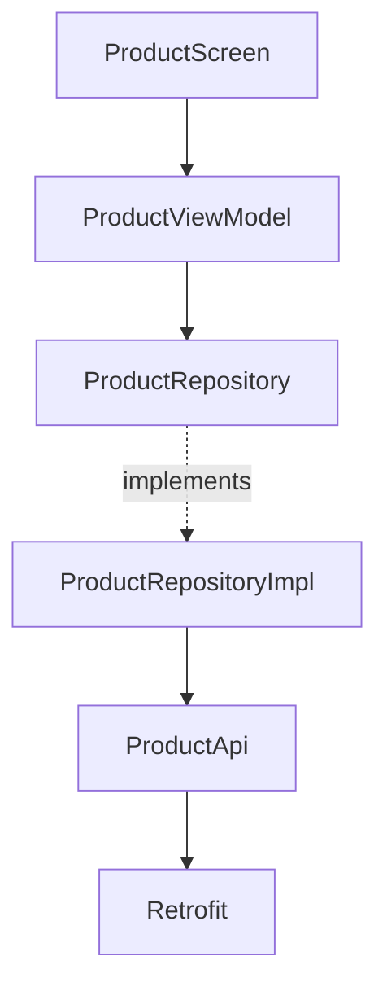
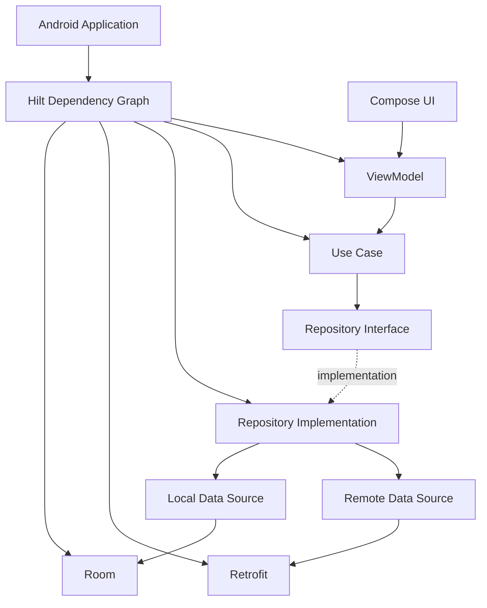

# 025 — Dependency Injection trong Android

| Thuộc tính              | Nội dung                                                    |
| ----------------------- | ----------------------------------------------------------- |
| **Học phần**            | 03 — Architecture, State and Data                           |
| **Module**              | Module 05 — Design and Architecture                         |
| **Nhóm nội dung**       | Dependency Injection                                        |
| **Nguồn roadmap**       | Design and Architecture / Dependency Injection              |
| **Loại bài**            | Architecture                                                |
| **Thứ tự trong module** | 025                                                         |
| **Thời lượng gợi ý**    | 34 phút                                                     |
| **Công nghệ liên quan** | Kotlin, ViewModel, Repository, Hilt, Dagger, Retrofit, Room |
| **Mức độ**              | Cơ bản → Trung cấp                                          |

---

## 1. Tóm tắt

**Dependency Injection — DI** là kỹ thuật trong đó một class **không tự tạo ra các dependency mà nó cần**, mà nhận chúng từ bên ngoài.

Ví dụ, thay vì `UserViewModel` tự tạo `UserRepository`, repository sẽ được truyền vào `UserViewModel`:

```kotlin
class UserViewModel(
    private val repository: UserRepository
)
```

Điểm quan trọng nhất không phải là annotation `@Inject`, `@Module` hay Hilt.

Điểm quan trọng là:

> **Class khai báo rõ nó cần gì, nhưng không chịu trách nhiệm tạo ra thứ đó.**

Điều này giúp giảm coupling, dễ thay implementation, dễ refactor và đặc biệt dễ đưa fake/mock vào khi test. Android Developers hiện khuyến nghị **Hilt** làm giải pháp DI tiêu chuẩn cho ứng dụng Android; Hilt được xây dựng trên Dagger và quản lý dependency container theo lifecycle Android. ([Android Developers][1])

---

# 2. Dependency là gì?

Giả sử ứng dụng có:

```kotlin
class UserRepository {
    fun getUsers() {
        // ...
    }
}
```

và:

```kotlin
class UserViewModel {
    private val repository = UserRepository()
}
```

`UserViewModel` đang **phụ thuộc vào** `UserRepository`.

Ta nói:

```text
UserViewModel
      │
      ▼
UserRepository
```

`UserRepository` chính là **dependency** của `UserViewModel`.

Trong ứng dụng thực tế, graph có thể dài hơn:

```text
UserScreen
    ↓
UserViewModel
    ↓
UserRepository
   ↙        ↘
Room       Retrofit
 ↓            ↓
SQLite       REST API
```

Android Developers gọi toàn bộ quan hệ giữa các class và dependency của chúng là **application graph**. ([Android Developers][2])

### Ảnh minh họa — Dependency graph trong Android


*Nguồn: Android Developers — Manual Dependency Injection.* ([Android Developers][2])

---

# 3. Vấn đề khi không dùng Dependency Injection

Giả sử ta viết:

```kotlin
class UserViewModel : ViewModel() {

    private val api = Retrofit.Builder()
        .baseUrl("https://api.example.com/")
        .build()
        .create(UserApi::class.java)

    private val repository = UserRepository(api)
}
```

`UserViewModel` đang làm quá nhiều việc:

```text
UserViewModel
 │
 ├── tạo Retrofit
 ├── tạo UserApi
 ├── tạo Repository
 └── xử lý UI State
```

Đây là coupling rất mạnh.

Nếu muốn thay:

```text
Retrofit API
```

bằng:

```text
Fake API
```

trong unit test, ta sẽ gặp khó khăn.

Ngoài ra, dependency thực sự của `UserViewModel` bị giấu bên trong implementation.

Android Developers chỉ ra rằng một lợi ích lớn của DI là dependency trở thành một phần rõ ràng của API của class, nhờ đó implementation có thể được thay thế khi test hoặc refactor. ([Android Developers][1])

---

# 4. Dependency Injection giải quyết vấn đề như thế nào?

Thay vì:

```kotlin
class UserViewModel : ViewModel() {

    private val repository = UserRepository()
}
```

ta viết:

```kotlin
class UserViewModel(
    private val repository: UserRepository
) : ViewModel()
```

Bây giờ:

```text
                 inject
                   ↓
          ┌──────────────────┐
          │ UserViewModel    │
          │                  │
          │ needs Repository │
          └────────┬─────────┘
                   │
                   ▼
             UserRepository
```

`UserViewModel`:

* biết nó cần `UserRepository`;
* không cần biết repository được tạo như thế nào;
* không cần biết repository dùng Retrofit hay fake API;
* không quản lý lifecycle của repository.

---

# 5. Inversion of Control

Dependency Injection là một cách áp dụng tư tưởng **Inversion of Control — IoC**.

Thay vì class tự quyết định:

```text
UserViewModel
      │
      │ new
      ▼
UserRepository
```

một thành phần bên ngoài chịu trách nhiệm tạo graph:

```text
DI Container
 │
 ├── tạo Retrofit
 │
 ├── tạo UserApi
 │
 ├── tạo UserRepository
 │
 └── tạo UserViewModel
```

rồi kết nối:

```text
Retrofit
   ↓
UserApi
   ↓
UserRepository
   ↓
UserViewModel
```

Android mô tả DI theo hướng object nhận dependency từ bên ngoài thay vì tự kiểm soát quá trình tạo dependency. ([Android Developers][1])

---

# 6. Constructor Injection

Đây là kiểu DI nên ưu tiên cho các class mà chúng ta tự kiểm soát constructor.

```kotlin
class UserRepository(
    private val api: UserApi
)
```

và:

```kotlin
class UserViewModel(
    private val repository: UserRepository
) : ViewModel()
```

Dependency được thể hiện trực tiếp trong constructor:

```text
UserViewModel(UserRepository)
                   │
                   ▼
          UserRepository(UserApi)
                             │
                             ▼
                          UserApi
```

Android Developers phân biệt hai cách DI phổ biến là **constructor injection** và **field/setter injection**; với Dagger/Hilt, best practice là ưu tiên constructor injection khi có thể. ([Android Developers][1])

---

# 7. Field Injection

Một số Android framework class được framework tạo ra, ví dụ:

```text
Activity
Fragment
Service
BroadcastReceiver
```

do đó chúng ta không thể tùy ý thay đổi constructor của chúng.

Khi đó Hilt có thể dùng field injection:

```kotlin
@AndroidEntryPoint
class MainActivity : ComponentActivity() {

    @Inject
    lateinit var analytics: AnalyticsTracker
}
```

Hilt hiện hỗ trợ các Android entry point như `Activity`, `Service`, `BroadcastReceiver`, cùng `Application` qua `@HiltAndroidApp` và `ViewModel` qua `@HiltViewModel`. ([Android Developers][3])

> Với class business/data thông thường, constructor injection vẫn nên được ưu tiên hơn field injection.

---

# 8. Application Graph

Một ứng dụng thực tế có thể có dependency graph như sau:



DI chịu trách nhiệm xây dựng graph này.

UI chỉ cần biết:

```text
UserScreen
    ↓
UserViewModel
```

ViewModel chỉ cần biết:

```text
UserViewModel
    ↓
GetUsersUseCase
```

Repository chỉ cần biết:

```text
UserRepository
  ↓        ↓
UserApi   UserDao
```

---

# 9. Dependency Direction trong Clean Architecture

Một cách tổ chức phổ biến:



Điểm đáng chú ý:

```text
Domain
   ↓
Repository interface

Data layer
   ↓
Repository implementation
```

UI không cần biết `Retrofit`, `Room`, SQL hay HTTP tồn tại.

---

# 10. Manual Dependency Injection

Trước khi học Hilt, nên hiểu cách DI thủ công hoạt động.

Android Developers cũng khuyến nghị học manual DI để hiểu rõ cách dependency graph được tạo trước khi để framework tự động hóa nó. ([Android Developers][2])

Ví dụ:

```kotlin
interface UserRepository {
    suspend fun getUsers(): List<User>
}
```

Implementation:

```kotlin
class UserRepositoryImpl(
    private val api: UserApi
) : UserRepository {

    override suspend fun getUsers(): List<User> {
        return api.getUsers()
    }
}
```

ViewModel:

```kotlin
class UserViewModel(
    private val repository: UserRepository
) : ViewModel()
```

Container:

```kotlin
class AppContainer {

    private val retrofit =
        Retrofit.Builder()
            .baseUrl("https://api.example.com/")
            .build()

    private val api =
        retrofit.create(UserApi::class.java)

    val userRepository: UserRepository =
        UserRepositoryImpl(api)
}
```

Application:

```kotlin
class MyApplication : Application() {

    val container = AppContainer()
}
```

Graph:

```text
Application
    │
    ▼
AppContainer
    │
    ├── Retrofit
    │      ↓
    │    UserApi
    │      ↓
    └── UserRepository
             ↓
        UserViewModel
```

Manual DI hoàn toàn hợp lệ, đặc biệt với ứng dụng nhỏ; tuy nhiên khi graph lớn, việc tự kết nối và quản lý lifetime của nhiều dependency tạo ra đáng kể boilerplate. Android khuyến nghị sử dụng Hilt khi phù hợp thay vì duy trì toàn bộ graph bằng tay. ([Android Developers][1])

---

# 11. Hilt là gì?

**Hilt** là thư viện Dependency Injection dành cho Android, được xây dựng trên **Dagger**.

Hilt cung cấp sẵn các container tương ứng với lifecycle Android, nhờ đó developer không phải tự tạo và quản lý toàn bộ Dagger component. ([Android Developers][3])

Có thể hình dung:

```text
              Hilt
               │
         xây dựng graph
               │
     ┌─────────┼──────────┐
     ▼         ▼          ▼
  ViewModel Repository  Retrofit
     │         │
     └─────────┘
```

---

# 12. Hilt hoạt động trên Dagger

```text
Dependency Injection
        │
        ▼
      Dagger
        │
        ▼
       Hilt
        │
        ▼
Android lifecycle integration
```

Dagger là DI framework tĩnh, tạo dependency graph ở compile time; Hilt chuẩn hóa cách sử dụng Dagger trong Android. ([Android Developers][1])

Hilt giúp giảm lượng code như:

```text
Component
Subcomponent
Factory
Builder
Manual lifecycle management
```

mà developer phải viết trực tiếp.

---

# 13. Thiết lập Hilt

Các tài liệu Android hiện tại sử dụng Hilt Gradle plugin cùng KSP. ([Android Developers][3])

Ví dụ cấu trúc:

```kotlin
plugins {
    id("com.google.devtools.ksp")
    id("com.google.dagger.hilt.android")
}
```

Dependency:

```kotlin
dependencies {
    implementation("com.google.dagger:hilt-android:<hilt_version>")
    ksp("com.google.dagger:hilt-android-compiler:<hilt_version>")
}
```

Nên lấy version hiện hành từ tài liệu chính thức thay vì cố định version của một bài học.

---

# 14. `@HiltAndroidApp`

Tạo custom `Application`:

```kotlin
@HiltAndroidApp
class MyApplication : Application()
```

`@HiltAndroidApp` kích hoạt code generation và tạo application-level dependency container cho ứng dụng. Container này gắn với lifecycle của `Application` và trở thành component cha của các Hilt component phía dưới. ([Android Developers][3])

Đừng quên:

```xml
<application
    android:name=".MyApplication">
</application>
```

---

# 15. `@Inject`

Ví dụ:

```kotlin
class UserRepositoryImpl @Inject constructor(
    private val api: UserApi
) : UserRepository
```

`@Inject constructor` cho Hilt biết cách tạo:

```text
UserRepositoryImpl
```

Nhưng để tạo nó, Hilt nhìn constructor và nhận ra:

```text
UserRepositoryImpl
      │
      ▼
    UserApi
```

Sau đó tiếp tục tìm cách tạo `UserApi`.

Hilt/Dagger xây dựng và kiểm tra dependency graph trong quá trình build, bao gồm việc phát hiện dependency thiếu hoặc cycle không hợp lệ. ([Android Developers][3])

---

# 16. `@HiltViewModel`

Ví dụ:

```kotlin
@HiltViewModel
class UserViewModel @Inject constructor(
    private val repository: UserRepository
) : ViewModel()
```

Graph:

```text
Hilt
 │
 ▼
UserViewModel
 │
 ▼
UserRepository
```

Hilt ViewModel sử dụng constructor injection và được cung cấp thông qua `ViewModelComponent`, nhờ đó lifecycle của dependency có thể phù hợp với lifecycle của ViewModel. ([Dagger][4])

---

# 17. `@AndroidEntryPoint`

Activity:

```kotlin
@AndroidEntryPoint
class MainActivity : ComponentActivity()
```

Nếu dùng Compose, root `ComponentActivity` có thể là Hilt entry point cho UI hierarchy; không cần đánh `@AndroidEntryPoint` lên từng composable. ([Android Developers][3])

Graph:

```text
Application
      │
      ▼
MainActivity
      │
      ▼
UserScreen
      │
      ▼
UserViewModel
```

---

# 18. Inject Repository Interface với `@Binds`

Đây là tình huống rất phổ biến.

Interface:

```kotlin
interface UserRepository {

    suspend fun getUsers(): List<User>
}
```

Implementation:

```kotlin
class UserRepositoryImpl @Inject constructor(
    private val api: UserApi
) : UserRepository {

    override suspend fun getUsers(): List<User> {
        return api.getUsers()
    }
}
```

Hilt chưa thể tự suy ra:

```text
UserRepository
       =
UserRepositoryImpl
```

Ta khai báo module:

```kotlin
@Module
@InstallIn(SingletonComponent::class)
abstract class RepositoryModule {

    @Binds
    abstract fun bindUserRepository(
        impl: UserRepositoryImpl
    ): UserRepository
}
```

`@Binds` thích hợp để chỉ cho Hilt implementation nào nên được dùng cho một interface; Android cũng khuyến nghị ưu tiên constructor injection, sau đó dùng `@Binds` cho interface và `@Provides` khi cần tự xây dựng object. ([Android Developers][5])

---

# 19. `@Provides`

Một số class ta không sở hữu constructor, chẳng hạn:

```text
Retrofit
OkHttpClient
RoomDatabase
```

Trong trường hợp đó có thể dùng `@Provides`. ([Android Developers][3])

```kotlin
@Module
@InstallIn(SingletonComponent::class)
object NetworkModule {

    @Provides
    fun provideRetrofit(): Retrofit {
        return Retrofit.Builder()
            .baseUrl("https://api.example.com/")
            .build()
    }

    @Provides
    fun provideUserApi(
        retrofit: Retrofit
    ): UserApi {
        return retrofit.create(UserApi::class.java)
    }
}
```

Graph:

```text
NetworkModule
      │
      ▼
   Retrofit
      │
      ▼
    UserApi
      │
      ▼
UserRepository
```

---

# 20. `@Binds` và `@Provides`

| Annotation           | Khi dùng                                       |
| -------------------- | ---------------------------------------------- |
| `@Inject`            | Class mình sở hữu và constructor có thể inject |
| `@Binds`             | Map interface → implementation                 |
| `@Provides`          | Tự viết logic tạo object                       |
| `@Module`            | Nhóm các binding                               |
| `@InstallIn`         | Chỉ component mà module thuộc về               |
| `@HiltAndroidApp`    | Khởi tạo Hilt ở Application                    |
| `@AndroidEntryPoint` | Android framework entry point                  |
| `@HiltViewModel`     | ViewModel do Hilt tạo                          |

---

# 21. Hilt Component Hierarchy

Hilt có các component tích hợp với lifecycle Android thay vì yêu cầu developer tự định nghĩa mọi Dagger component. ([Dagger][6])

### Ảnh minh họa — Hilt Component Hierarchy


*Nguồn: Dagger/Hilt Documentation.* ([Dagger][6])

Có thể giản lược thành:



---

# 22. Scope và Lifecycle

Dependency không nhất thiết phải sống suốt toàn bộ ứng dụng.

Hilt cung cấp scope gắn với component/lifecycle. ([Dagger][6])

| Scope                     | Lifetime điển hình                        |
| ------------------------- | ----------------------------------------- |
| `@Singleton`              | Application                               |
| `@ActivityRetainedScoped` | Giữ qua configuration change của Activity |
| `@ViewModelScoped`        | Một ViewModel                             |
| `@ActivityScoped`         | Một Activity instance                     |
| `@FragmentScoped`         | Một Fragment                              |
| `@ViewScoped`             | Một View                                  |
| `@ServiceScoped`          | Một Service                               |

Ví dụ:

```kotlin
@Singleton
class SessionManager @Inject constructor()
```

Hình dung:

```text
Application
│
├── SessionManager
│
├── Activity A
│    ├── ViewModel A
│    └── ViewModel B
│
└── Activity B
```

Nếu `SessionManager` thực sự cần dùng chung toàn app thì `@Singleton` phù hợp.

---

# 23. Không phải dependency nào cũng nên `@Singleton`

Một lỗi dễ gặp:

```kotlin
@Singleton
class Everything
```

Scope dài làm object sống lâu hơn cần thiết.

Hãy chọn lifetime theo nhu cầu:

```text
Cần toàn app?
   │
   ├─ Yes → @Singleton
   │
   └─ No
       │
       ├─ theo ViewModel → @ViewModelScoped
       ├─ theo Activity → @ActivityScoped
       └─ không cần reuse → unscoped
```

Một binding không có scope thường có thể được tạo mới khi được yêu cầu; scoped binding được chia sẻ trong lifetime của component tương ứng. ([Dagger][6])

---

# 24. Ví dụ hoàn chỉnh

Giả sử ta xây màn hình:

```text
UsersScreen
```

yêu cầu lấy user từ REST API.

## 24.1 API

```kotlin
interface UserApi {

    @GET("users")
    suspend fun getUsers(): List<UserDto>
}
```

---

## 24.2 Repository interface

```kotlin
interface UserRepository {

    suspend fun getUsers(): List<User>
}
```

---

## 24.3 Repository implementation

```kotlin
class UserRepositoryImpl @Inject constructor(
    private val api: UserApi
) : UserRepository {

    override suspend fun getUsers(): List<User> {
        return api
            .getUsers()
            .map { it.toDomain() }
    }
}
```

---

## 24.4 Repository Module

```kotlin
@Module
@InstallIn(SingletonComponent::class)
abstract class RepositoryModule {

    @Binds
    abstract fun bindUserRepository(
        repository: UserRepositoryImpl
    ): UserRepository
}
```

---

## 24.5 Network Module

```kotlin
@Module
@InstallIn(SingletonComponent::class)
object NetworkModule {

    @Provides
    @Singleton
    fun provideRetrofit(): Retrofit {
        return Retrofit.Builder()
            .baseUrl("https://api.example.com/")
            .build()
    }

    @Provides
    @Singleton
    fun provideUserApi(
        retrofit: Retrofit
    ): UserApi {
        return retrofit.create(UserApi::class.java)
    }
}
```

---

## 24.6 ViewModel

```kotlin
@HiltViewModel
class UserViewModel @Inject constructor(
    private val repository: UserRepository
) : ViewModel() {

    private val _uiState =
        MutableStateFlow<UserUiState>(
            UserUiState.Loading
        )

    val uiState =
        _uiState.asStateFlow()

    init {
        loadUsers()
    }

    private fun loadUsers() {

        viewModelScope.launch {

            _uiState.value =
                UserUiState.Loading

            runCatching {
                repository.getUsers()
            }
                .onSuccess { users ->

                    _uiState.value =
                        UserUiState.Success(users)
                }
                .onFailure { error ->

                    _uiState.value =
                        UserUiState.Error(
                            error.message
                                ?: "Unknown error"
                        )
                }
        }
    }
}
```

---

# 25. Dependency Graph của ví dụ



Hilt thực hiện phần:

```text
Hilt
 │
 ├── create Retrofit
 │
 ├── create UserApi
 │
 ├── create UserRepositoryImpl
 │
 ├── bind UserRepository
 │
 └── create UserViewModel
```

UI không cần biết bất kỳ bước nào trong số đó.

---

# 26. Dependency Injection và UI State

DI không trực tiếp quản lý UI State.

Nó giải quyết vấn đề:

```text
Ai tạo dependency?
Ai cung cấp dependency?
Dependency sống bao lâu?
```

Trong khi ViewModel quản lý:

```text
Loading
Success
Error
```

Luồng hoàn chỉnh:



DI giúp tạo:

```text
ViewModel → Repository → DataSource
```

StateFlow giúp truyền:

```text
ViewModel → UI
```

---

# 27. DI và Lifecycle

DI đặc biệt quan trọng trong Android vì object có nhiều lifetime khác nhau:

```text
Application
    │
    ├── Activity
    │      │
    │      ├── Fragment
    │      │
    │      └── ViewModel
    │
    └── Service
```

Ví dụ một dependency giữ reference tới:

```kotlin
Activity
```

nhưng lại được tạo dưới:

```kotlin
@Singleton
```

có thể tạo ra kiến trúc lifetime sai và nguy cơ giữ Activity lâu hơn cần thiết.

Vì vậy hãy suy nghĩ:

```text
Dependency này cần sống bao lâu?
```

trước khi chọn scope.

---

# 28. DI và configuration change

ViewModel thường cần tồn tại qua:

```text
rotate screen
portrait → landscape
```

Một dependency `@ViewModelScoped` có lifecycle tương ứng với ViewModel; Hilt ViewModel component tồn tại theo lifecycle ViewModel và do đó phù hợp với các dependency chỉ cần chia sẻ bên trong ViewModel đó. ([Dagger][4])

```text
Activity instance #1
       │
       │ rotate
       ▼
Activity instance #2

       │
       ▼

   ViewModel
   survives
```

Điều cần nhớ:

> DI quản lý lifecycle của dependency, nhưng không phải cơ chế lưu state qua **process death**.

Các dữ liệu cần phục hồi sau process death vẫn phải dùng những cơ chế phù hợp như `SavedStateHandle`, persistence hoặc database.

---

# 29. DI giúp testing như thế nào?

Đây là một trong những lợi ích quan trọng nhất của DI.

Production:

```text
ViewModel
   ↓
RealUserRepository
   ↓
Remote API
```

Test:

```text
ViewModel
   ↓
FakeUserRepository
```

Không cần sửa ViewModel.

Android Developers lưu ý rằng unit test cho class constructor-injected thường **không cần chạy Hilt**; có thể trực tiếp tạo class và truyền fake/mock dependency vào constructor. ([Android Developers][7])

---

# 30. Fake Repository

```kotlin
class FakeUserRepository(
    private val users: List<User>
) : UserRepository {

    override suspend fun getUsers(): List<User> {
        return users
    }
}
```

Unit test:

```kotlin
@Test
fun `load users returns success`() = runTest {

    val repository =
        FakeUserRepository(
            users = listOf(
                User(
                    id = 1,
                    name = "An"
                )
            )
        )

    val viewModel =
        UserViewModel(repository)

    // Assert UI state...
}
```

Không cần:

```text
Internet
Retrofit
Real Server
Database
```

---

# 31. Test Seam

**Test seam** là vị trí mà production implementation có thể được thay bằng test implementation.

Ví dụ:

```text
             UserRepository
             /            \
            /              \
           ▼                ▼
UserRepositoryImpl    FakeUserRepository
    Production              Test
```

Interface:

```kotlin
interface UserRepository
```

chính là seam.

---

# 32. Fake API

Ta cũng có thể inject ở level thấp hơn:

```text
UserRepositoryImpl
        │
        ▼
      UserApi
      /     \
     ▼       ▼
RealApi    FakeApi
```

```kotlin
class FakeUserApi : UserApi {

    override suspend fun getUsers(): List<UserDto> {

        return listOf(
            UserDto(
                id = 1,
                name = "Test User"
            )
        )
    }
}
```

Nhờ đó có thể test repository độc lập.

---

# 33. Hilt trong Integration/UI Test

Hilt cũng hỗ trợ thay binding và tạo component riêng cho test khi chạy integration/UI tests. ([Android Developers][7])

Ví dụ conceptual:

```text
Production graph

Retrofit
   ↓
Real API
```

có thể được thay trong test:

```text
Test graph

Fake API
   ↓
Fake response
```

Trong nhiều **unit test thuần Kotlin**, cách đơn giản hơn vẫn là:

```kotlin
val viewModel =
    UserViewModel(fakeRepository)
```

không cần dựng Hilt container.

---

# 34. Dependency Injection vs Service Locator

Hai pattern này rất dễ bị nhầm.

## Service Locator

```kotlin
class UserViewModel : ViewModel() {

    private val repository =
        ServiceLocator.userRepository
}
```

Graph:

```text
UserViewModel
      │
      ▼
ServiceLocator
      │
      ▼
Repository
```

Dependency bị giấu:

```kotlin
class UserViewModel
```

nhìn vào constructor không biết class cần repository.

Android Developers lưu ý Service Locator khiến dependency nằm bên trong implementation thay vì API surface, làm code khó test và lifetime khó quản lý hơn trong nhiều trường hợp. ([Android Developers][1])

---

## Dependency Injection

```kotlin
class UserViewModel(
    private val repository: UserRepository
)
```

Nhìn constructor lập tức biết:

```text
UserViewModel
requires
UserRepository
```

---

# 35. So sánh

| Service Locator           | Dependency Injection           |
| ------------------------- | ------------------------------ |
| Class tự tìm dependency   | Dependency được đưa vào        |
| Dependency dễ bị ẩn       | Dependency rõ trên constructor |
| Dễ phụ thuộc global state | Ít global state hơn            |
| Test setup khó hơn        | Dễ inject fake                 |
| Lifetime khó nhìn         | Scope/lifecycle rõ hơn         |
| Class phụ thuộc locator   | Class phụ thuộc abstraction    |

---

# 36. Những lỗi DI phổ biến

## 36.1 Tự `new` dependency trong ViewModel

Không nên:

```kotlin
class UserViewModel : ViewModel() {

    private val repository =
        UserRepositoryImpl(
            RetrofitApi()
        )
}
```

Nên:

```kotlin
class UserViewModel @Inject constructor(
    private val repository: UserRepository
) : ViewModel()
```

---

## 36.2 Inject Retrofit trực tiếp vào UI

Không nên:

```text
Compose
   ↓
Retrofit
```

Nên:

```text
Compose
   ↓
ViewModel
   ↓
Repository
   ↓
DataSource/API
```

---

## 36.3 Inject Repository trực tiếp vào Composable

Không nên biến UI thành:

```kotlin
@Composable
fun UserScreen(
    repository: UserRepository
)
```

nếu responsibility thực sự thuộc ViewModel.

Tốt hơn:

```text
UI
 ↓
ViewModel
 ↓
Repository
```

---

## 36.4 Tất cả đều `@Singleton`

Sai tư duy:

```text
DI = Singleton
```

Thực tế:

```text
DI
├── dependency construction
├── dependency graph
├── dependency binding
└── dependency lifecycle
```

Singleton chỉ là **một loại scope**.

---

# 37. Qualifier

Có trường hợp cùng một type nhưng nhiều implementation:

```text
OkHttpClient
├── authenticated client
└── public client
```

Khi đó Hilt hỗ trợ **qualifier** để phân biệt binding. ([Android Developers][3])

Ví dụ:

```kotlin
@Qualifier
@Retention(AnnotationRetention.BINARY)
annotation class AuthClient
```

và:

```kotlin
@Provides
@AuthClient
fun provideAuthClient(): OkHttpClient {
    return OkHttpClient.Builder()
        .build()
}
```

Inject:

```kotlin
class UserApiService @Inject constructor(
    @AuthClient
    private val client: OkHttpClient
)
```

---

# 38. Dependency Injection trong kiến trúc Android

### Ảnh minh họa — các layer Android


*Nguồn: Android Developers.* 

Trong kiến trúc hiện đại, có thể hình dung:

```text
┌─────────────────────────┐
│         UI Layer        │
│                         │
│ Compose / Activity      │
│ ViewModel               │
└────────────┬────────────┘
             │
             ▼
┌─────────────────────────┐
│      Domain Layer       │
│                         │
│ Use Cases               │
└────────────┬────────────┘
             │
             ▼
┌─────────────────────────┐
│       Data Layer        │
│                         │
│ Repository              │
│ Remote / Local Source   │
└─────────────────────────┘
```

DI **kết nối các layer**, nhưng không nên phá vỡ boundary giữa chúng.

---

# 39. Dependency Injection ảnh hưởng UX như thế nào?

DI là architecture concern nhưng cuối cùng vẫn ảnh hưởng người dùng.

Ví dụ:

```text
DI sai scope
   ↓
dependency bị recreate quá nhiều
   ↓
request lặp lại
   ↓
loading nhiều lần
   ↓
UX kém
```

Hoặc:

```text
Global state sai
   ↓
state giữa user/session bị lẫn
   ↓
dữ liệu hiển thị sai
```

Hoặc:

```text
Dependency khó fake
   ↓
test coverage thấp
   ↓
bug lọt production
   ↓
user gặp crash
```

---

# 40. DI và debugging

Khi gặp bug, hãy trace dependency graph:

```text
Screen
 ↓
ViewModel
 ↓
UseCase
 ↓
Repository
 ↓
DataSource
 ↓
API / DAO
```

Hỏi từng bước:

```text
Dependency nào được inject?
Binding nào được chọn?
Object có đúng scope không?
Có qualifier bị nhầm không?
Có fake dependency bị đưa vào production không?
```

Compile-time validation của Hilt/Dagger cũng giúp phát hiện nhiều dependency graph không hợp lệ ngay lúc build thay vì đợi runtime. ([Android Developers][3])

---

# 41. Production Checklist

Trước khi release một feature dùng DI:

* [ ] UI không trực tiếp tạo Repository.
* [ ] ViewModel không tự tạo Retrofit/Room.
* [ ] Dependency chính được constructor-injected.
* [ ] Interface → implementation binding rõ ràng.
* [ ] `@Binds` được dùng khi phù hợp.
* [ ] `@Provides` chỉ dùng khi thật sự cần tự tạo object.
* [ ] Scope phù hợp lifecycle.
* [ ] Không lạm dụng `@Singleton`.
* [ ] Không giữ Activity/Fragment context trong singleton.
* [ ] Qualifier rõ nếu cùng type có nhiều implementation.
* [ ] Có Fake Repository cho unit test.
* [ ] Error network/database được map thành UI state phù hợp.
* [ ] Rotation không tạo lại dependency ngoài ý muốn.
* [ ] Process death được xử lý bởi state/persistence phù hợp.
* [ ] Debug/release binding không bị nhầm.

---

# 42. Bài thực hành

## Yêu cầu

Refactor một màn hình:

```text
ProductScreen
```

đang có kiến trúc:

```text
ProductScreen
     ↓
Retrofit
     ↓
API
```

thành:



---

## Bước 1 — tạo Repository interface

```kotlin
interface ProductRepository {

    suspend fun getProducts(): List<Product>
}
```

---

## Bước 2 — tạo implementation

```kotlin
class ProductRepositoryImpl @Inject constructor(
    private val api: ProductApi
) : ProductRepository
```

---

## Bước 3 — inject Repository vào ViewModel

```kotlin
@HiltViewModel
class ProductViewModel @Inject constructor(
    private val repository: ProductRepository
) : ViewModel()
```

---

## Bước 4 — bind interface

```kotlin
@Module
@InstallIn(SingletonComponent::class)
abstract class RepositoryModule {

    @Binds
    abstract fun bindProductRepository(
        impl: ProductRepositoryImpl
    ): ProductRepository
}
```

---

## Bước 5 — tạo Fake Repository

```kotlin
class FakeProductRepository :
    ProductRepository {

    override suspend fun getProducts(): List<Product> {
        return listOf(
            Product(
                id = 1,
                name = "Test Product"
            )
        )
    }
}
```

---

## Bước 6 — viết unit test

```text
ProductViewModel
       ↓
FakeProductRepository
```

Không dùng:

```text
Retrofit
Internet
Real API
```

---

# 43. Artifact nên đưa vào portfolio

Có thể tạo một mini project:

```text
dependency-injection-demo/
│
├── data/
│   ├── remote/
│   │   └── ProductApi.kt
│   │
│   └── repository/
│       └── ProductRepositoryImpl.kt
│
├── domain/
│   └── repository/
│       └── ProductRepository.kt
│
├── di/
│   ├── NetworkModule.kt
│   └── RepositoryModule.kt
│
├── ui/
│   └── product/
│       ├── ProductScreen.kt
│       └── ProductViewModel.kt
│
└── test/
    └── FakeProductRepository.kt
```

README nên có:

```text
Architecture diagram
Dependency graph
Hilt modules
Fake repository
Unit test
Scope decisions
```

---

# 44. Sơ đồ tổng hợp



Điều quan trọng là:

```text
UI
↓
ViewModel
↓
Domain
↓
Repository abstraction
↓
Data implementation
```

còn Hilt đứng phía ngoài để:

```text
create
provide
bind
scope
inject
```

các dependency.

---

# 45. Câu hỏi tự kiểm tra

### Câu 1

Dependency Injection là gì?

> Một class nhận dependency từ bên ngoài thay vì tự tạo dependency đó.

### Câu 2

Tại sao constructor injection tốt?

> Dependency trở nên rõ ràng và dễ thay bằng fake/mock.

### Câu 3

`@Inject` dùng để làm gì?

> Chỉ cho Hilt/Dagger cách tạo một class thông qua constructor.

### Câu 4

`@Binds` dùng khi nào?

> Khi cần map một interface sang implementation.

### Câu 5

`@Provides` dùng khi nào?

> Khi cần tự viết logic tạo object, đặc biệt với class thư viện mà ta không sở hữu constructor.

### Câu 6

Hilt có phải là Singleton manager không?

> Không. Singleton chỉ là một scope trong dependency graph.

### Câu 7

Hilt có thay ViewModel không?

> Không. Hilt tạo và cung cấp dependency cho ViewModel.

### Câu 8

Hilt có quản lý UI State không?

> Không. UI State vẫn thuộc ViewModel/state holder.

---

# 46. Checklist hoàn thành bài

* [ ] Giải thích được dependency là gì.
* [ ] Giải thích được Dependency Injection.
* [ ] Hiểu Inversion of Control.
* [ ] Biết application graph là gì.
* [ ] Biết constructor injection.
* [ ] Biết field injection.
* [ ] Biết manual DI.
* [ ] Hiểu vai trò của Hilt.
* [ ] Biết `@HiltAndroidApp`.
* [ ] Biết `@AndroidEntryPoint`.
* [ ] Biết `@HiltViewModel`.
* [ ] Biết `@Inject`.
* [ ] Biết `@Module`.
* [ ] Biết `@InstallIn`.
* [ ] Biết `@Binds`.
* [ ] Biết `@Provides`.
* [ ] Hiểu scope và lifecycle.
* [ ] Phân biệt DI với Service Locator.
* [ ] Có Fake Repository.
* [ ] Viết được ít nhất một unit test bằng fake dependency.
* [ ] Có dependency graph trong README.

---

# 47. Ghi chú production

Khi áp dụng Dependency Injection vào production, đừng chỉ hỏi:

```text
"Hilt compile được chưa?"
```

mà hãy hỏi:

```text
Dependency này thuộc layer nào?

Ai sở hữu dependency này?

Dependency này sống bao lâu?

Nó có giữ Context không?

Có cần Singleton thật không?

Có implementation test không?

Có thể thay API bằng Fake API không?

ViewModel có đang biết quá nhiều về data layer không?

Nếu network lỗi thì UI nhận state gì?

Nếu rotate thì dependency nào còn sống?

Nếu process death thì state nào cần phục hồi?
```

DI tốt không chỉ làm code đẹp hơn.

Nó tạo ra một dependency graph:

```text
Rõ ràng
   ↓
Dễ thay thế
   ↓
Dễ test
   ↓
Dễ refactor
   ↓
Ít coupling
   ↓
Dễ maintain
```

Android Developers nhấn mạnh ba lợi ích chính của Dependency Injection là **giảm coupling/tăng khả năng tái sử dụng**, **dễ refactor** và **dễ test nhờ thay implementation của dependency**. ([Android Developers][1])

---

# 48. Ghi nhớ nhanh

```text
Dependency
    =
object mà class khác cần
```

```text
Dependency Injection
    =
đưa dependency từ bên ngoài vào class
```

```text
Hilt
    =
công cụ xây + quản lý dependency graph
cho Android
```

```text
@Inject
    =
Hilt có thể tạo class này
```

```text
@Binds
    =
Interface → Implementation
```

```text
@Provides
    =
Tôi chỉ cho Hilt cách tạo object
```

```text
Scope
    =
Object sống bao lâu?
```

và nguyên tắc quan trọng nhất:

> **Class nên nói rõ nó cần dependency nào, nhưng không nên tự chịu trách nhiệm xây dựng toàn bộ dependency graph của chính nó.**

Đó chính là nền tảng để đi tiếp sang **Hilt, Dagger, Module, Scope, Qualifier, testing và multi-module architecture**. ([Android Developers][5])

[1]: https://developer.android.com/training/dependency-injection "Dependency injection in Android  |  App architecture  |  Android Developers"
[2]: https://developer.android.com/training/dependency-injection/manual "Manual dependency injection  |  App architecture  |  Android Developers"
[3]: https://developer.android.com/training/dependency-injection/hilt-android "Dependency injection with Hilt  |  App architecture  |  Android Developers"
[4]: https://dagger.dev/hilt/view-model.html "View Models"
[5]: https://developer.android.com/training/dependency-injection/dagger-android "Using Dagger in Android apps  |  App architecture  |  Android Developers"
[6]: https://dagger.dev/hilt/components.html "Hilt Components"
[7]: https://developer.android.com/training/dependency-injection/hilt-testing "Hilt testing guide  |  App architecture  |  Android Developers"
