[](https://developer.android.com/codelabs/android-dagger?utm_source=chatgpt.com)

# 026 - Dagger

| Thuộc tính              | Nội dung                                                    |
| ----------------------- | ----------------------------------------------------------- |
| **Học phần**            | 03 - Architecture, State and Data                           |
| **Module**              | Module 05 - Design and Architecture                         |
| **Nhóm nội dung**       | Dependency Injection                                        |
| **Nguồn roadmap**       | Design and Architecture / Dependency Injection              |
| **Loại bài**            | Architecture                                                |
| **Thứ tự trong module** | 026                                                         |
| **Thời lượng gợi ý**    | 34 phút                                                     |
| **Mức độ**              | Trung cấp                                                   |
| **Artifact đề xuất**    | Mini Android app dùng Dagger + dependency graph + unit test |

> Ảnh trên là một **application dependency graph** từ tài liệu Android Developers: các object được nối với nhau theo quan hệ phụ thuộc và Dagger chịu trách nhiệm tạo/wiring các object trong graph. ([Android Developers][1])

---

## 1. Tóm tắt

**Dagger** là framework **Dependency Injection (DI) chạy chủ yếu ở compile time** dành cho Java và Android. Thay vì tìm dependency bằng reflection lúc runtime, Dagger phân tích dependency graph khi build và sinh mã Java để tạo các object cần thiết. ([Dagger][2])

Ý tưởng cốt lõi:

```text
Class cần dependency
        ↓
không tự tạo dependency
        ↓
khai báo nó cần gì
        ↓
Dagger tìm cách tạo dependency
        ↓
Dagger nối toàn bộ object thành dependency graph
```

Ví dụ:

```kotlin
class UserRepository(
    private val api: UserApi
)
```

`UserRepository` cần `UserApi`.

Thay vì:

```kotlin
class UserRepository {

    private val api = Retrofit.Builder()
        // ...
        .build()
        .create(UserApi::class.java)
}
```

ta để dependency được truyền từ bên ngoài:

```kotlin
class UserRepository @Inject constructor(
    private val api: UserApi
)
```

Dagger sẽ tìm câu trả lời cho câu hỏi:

> Muốn tạo `UserRepository` thì lấy `UserApi` ở đâu?

Đó chính là quá trình xây dựng **dependency graph**.

---

## 2. Vị trí của Dagger trong Android Architecture

Dagger **không phải kiến trúc MVVM, MVI hay Clean Architecture**.

Nó là công cụ kết nối các object của những layer đó lại với nhau.

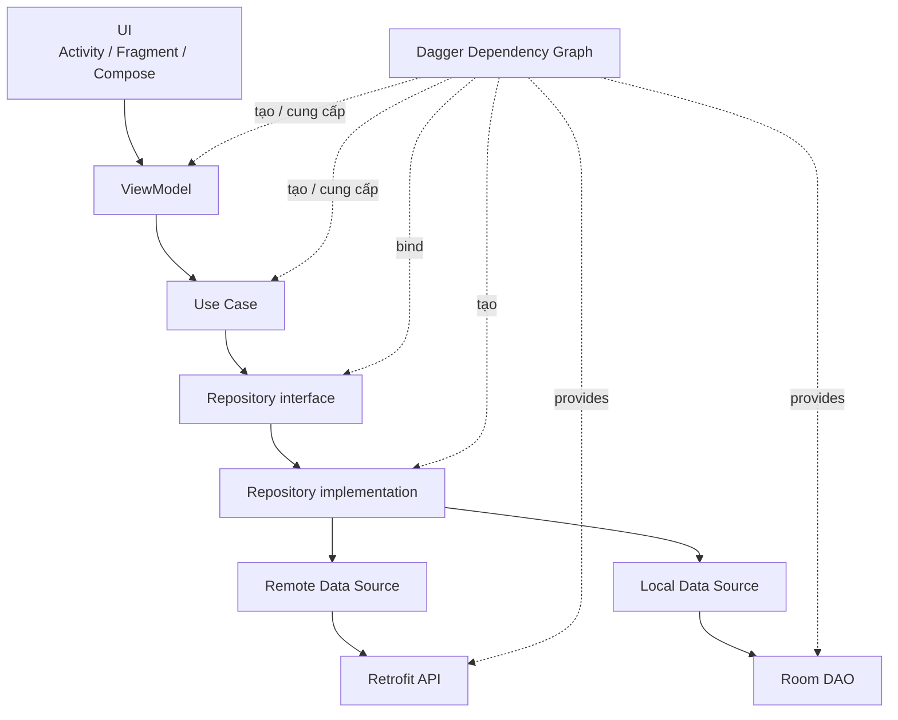

Dependency direction của architecture vẫn nên rõ ràng:

```text
UI
 ↓
Domain / Business Logic
 ↓
Repository abstraction
 ↓
Data implementation
 ↓
Network / Database
```

Dagger chỉ chịu trách nhiệm:

```text
"Tôi cần object X"

             ↓

Dagger Graph

             ↓

"Để tạo X cần Y và Z"

        ↙           ↘

       Y             Z
```

Android Developers khuyến nghị sử dụng dependency injection để quản lý dependencies và lifecycle của chúng, đặc biệt khi ứng dụng lớn dần. ([Android Developers][3])

---

# 3. Vì sao cần Dagger?

## 3.1. Vấn đề khi class tự tạo dependency

Ví dụ:

```kotlin
class LoginViewModel {

    private val repository =
        UserRepository(
            RetrofitUserApi()
        )
}
```

Ta có dependency:

```text
LoginViewModel
      │
      └── tự tạo UserRepository
                    │
                    └── tự tạo RetrofitUserApi
```

### Hậu quả

`LoginViewModel` bị **tight coupling** với:

* `UserRepository`
* Retrofit implementation
* network configuration

Muốn unit test:

```text
LoginViewModel
      ↓
UserRepository
      ↓
Real API
      ↓
Internet
```

rất khó thay API thật bằng fake.

---

# 4. Dependency Injection giải quyết như thế nào?

Thay đổi thành:

```kotlin
class LoginViewModel(
    private val repository: UserRepository
)
```

Dependency được đưa từ bên ngoài:

```text
               ┌──────────────────────┐
               │ Dependency Container │
               └──────────┬───────────┘
                          │
                          ▼
                   UserRepository
                          │
                          ▼
                  LoginViewModel
```

Khi test:

```text
FakeUserRepository
        ↓
LoginViewModel
```

Khi production:

```text
RealUserRepository
        ↓
LoginViewModel
```

Business logic không cần biết dependency đến từ đâu.

Đó cũng là lý do DI giúp tăng khả năng tái sử dụng, refactor và testing. ([Dagger][2])

---

# 5. Dagger hoạt động như thế nào?

Điểm đặc biệt của Dagger là phần lớn công việc được thực hiện trong quá trình compile.

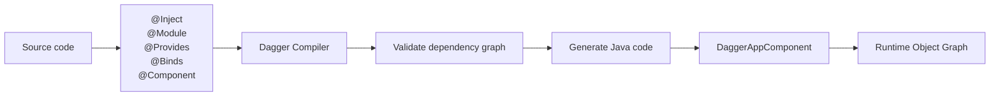

Dagger sẽ kiểm tra dependency graph trong quá trình build, bao gồm việc dependency có thể được cung cấp hay không và phát hiện những graph không hợp lệ, chẳng hạn dependency cycle. ([Android Developers][4])

Ví dụ Dagger sinh ra:

```text
AppComponent
```

thành implementation tương tự:

```text
DaggerAppComponent
```

Application sử dụng implementation được generate này để tạo graph.

---

# 6. 5 annotation quan trọng nhất của Dagger

Nếu mới học Dagger, trước tiên chỉ cần hiểu:

```text
@Inject
@Module
@Provides
@Binds
@Component
```

| Annotation      | Vai trò                              |
| --------------- | ------------------------------------ |
| `@Inject`       | Cho Dagger biết cách tạo class       |
| `@Module`       | Nhóm các quy tắc cung cấp dependency |
| `@Provides`     | Viết code tạo một dependency         |
| `@Binds`        | Mapping interface → implementation   |
| `@Component`    | Dependency container / graph         |
| `@Singleton`    | Scope một instance theo component    |
| `@Qualifier`    | Phân biệt nhiều object cùng type     |
| `@Subcomponent` | Tạo dependency graph con             |

Android Developers khuyến nghị ưu tiên **constructor injection**, dùng `@Binds` cho interface và `@Provides` khi cần cung cấp class mà project không kiểm soát việc khởi tạo. ([Android Developers][5])

---

# 7. `@Inject` — Constructor Injection

Đây là cách nên ưu tiên khi có thể.

```kotlin
class LoadUserUseCase @Inject constructor(
    private val repository: UserRepository
)
```

Dagger đọc constructor:

```text
LoadUserUseCase
       │
       ▼
requires UserRepository
```

Nếu Dagger biết tạo `UserRepository`, nó sẽ tự động tạo được `LoadUserUseCase`.

---

## Ví dụ dependency nhiều tầng

```kotlin
class UserRemoteDataSource @Inject constructor(
    private val api: UserApi
)

class UserRepositoryImpl @Inject constructor(
    private val remote: UserRemoteDataSource
)

class LoadUserUseCase @Inject constructor(
    private val repository: UserRepository
)
```

Graph:

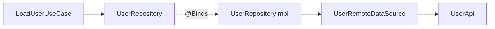

Dagger có thể lần ngược dependency tree để xác định cách tạo object. ([Android Developers][4])

---

# 8. `@Module`

Không phải class nào cũng có thể đặt:

```kotlin
@Inject constructor(...)
```

Ví dụ:

* Retrofit
* OkHttp
* Room
* interface
* class từ thư viện bên ngoài
* object cần configuration đặc biệt

Lúc này cần **Dagger Module**.

```kotlin
@Module
object NetworkModule
```

Có thể hiểu module là:

```text
NetworkModule
 ├── cách tạo Retrofit
 ├── cách tạo UserApi
 └── cách tạo network dependencies
```

---

# 9. `@Provides`

Ví dụ Retrofit không phải class của project để ta tùy ý sửa constructor.

Ta cung cấp nó:

```kotlin
@Module
object NetworkModule {

    @Provides
    @Singleton
    fun provideRetrofit(): Retrofit {
        return Retrofit.Builder()
            .baseUrl("https://api.example.com/")
            .addConverterFactory(
                MoshiConverterFactory.create()
            )
            .build()
    }
}
```

Sau đó:

```kotlin
@Provides
fun provideUserApi(
    retrofit: Retrofit
): UserApi {
    return retrofit.create(
        UserApi::class.java
    )
}
```

Graph:

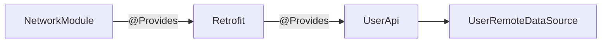

`@Provides` đặc biệt phù hợp với object từ thư viện bên ngoài hoặc object cần logic cấu hình trước khi khởi tạo. ([Android Developers][5])

---

# 10. `@Binds` — Interface → Implementation

Giả sử:

```kotlin
interface UserRepository {

    suspend fun getUser(): User
}
```

Implementation:

```kotlin
class UserRepositoryImpl @Inject constructor(
    private val api: UserApi
) : UserRepository {

    override suspend fun getUser(): User {
        return api.getUser().toDomain()
    }
}
```

Dagger vẫn chưa biết:

```text
UserRepository
       ?
       ?
       ?
UserRepositoryImpl
```

Ta khai báo binding:

```kotlin
@Module
interface RepositoryModule {

    @Binds
    fun bindUserRepository(
        impl: UserRepositoryImpl
    ): UserRepository
}
```

Bây giờ graph là:

```text
UserRepository
      ▲
      │ @Binds
      │
UserRepositoryImpl
```

`@Binds` không cần implementation method như `@Provides`; nó khai báo mapping giữa implementation và abstraction. ([Dagger][6])

---

# 11. `@Component` — trung tâm của Dagger

`Component` kết nối:

```text
@Inject constructors
        +
Modules
        +
Bindings
        ↓
Dependency Graph
```

Ví dụ:

```kotlin
@Singleton
@Component(
    modules = [
        NetworkModule::class,
        RepositoryModule::class
    ]
)
interface AppComponent {

    fun inject(
        activity: UserActivity
    )
}
```

Concept:

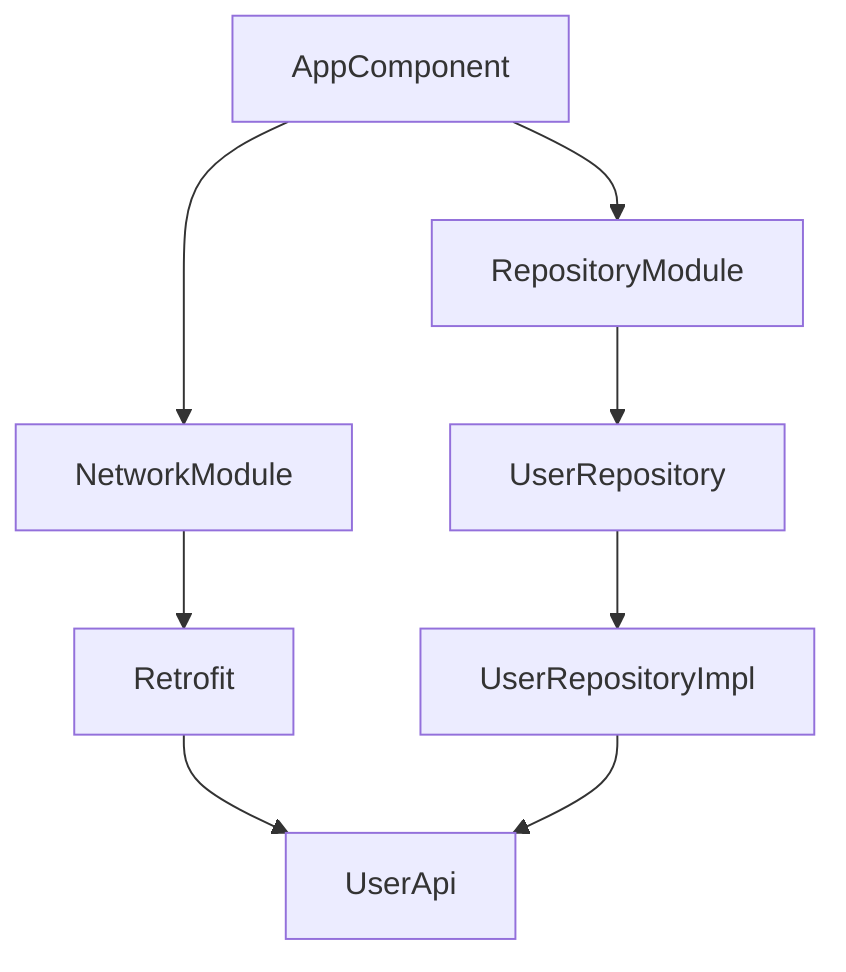

`@Component` định nghĩa graph mà Dagger sẽ generate implementation tương ứng. ([Dagger][6])

---

# 12. Application Graph

Trong Android, dependency graph cấp application thường được giữ trong `Application` để lifetime của component đi cùng application process. ([Android Developers][5])

```kotlin
class MyApplication : Application() {

    val appComponent: AppComponent by lazy {
        DaggerAppComponent.create()
    }
}
```

Graph:

```text
Android Process
│
└── MyApplication
       │
       └── AppComponent
              │
              ├── Retrofit
              ├── UserApi
              ├── UserRepository
              ├── UseCases
              └── Factories
```

Trong `AndroidManifest.xml`:

```xml
<application
    android:name=".MyApplication"
    ... >
</application>
```

---

# 13. Field Injection trong Activity

Một vấn đề đặc biệt của Android:

```text
Activity
Fragment
Service
```

thường được **Android framework tạo ra**.

Ta không thể đơn giản đổi thành:

```kotlin
class UserActivity @Inject constructor(...)
```

cho Activity thông thường.

Vì vậy pure Dagger thường dùng **field injection** cho framework class. Android Developers cũng khuyến nghị chỉ dùng field injection ở những framework class mà constructor injection không khả thi. ([Android Developers][5])

Ví dụ:

```kotlin
class UserActivity : AppCompatActivity() {

    @Inject
    lateinit var viewModelFactory: UserViewModelFactory

    override fun onCreate(
        savedInstanceState: Bundle?
    ) {
        (application as MyApplication)
            .appComponent
            .inject(this)

        super.onCreate(savedInstanceState)

        // viewModelFactory đã sẵn sàng
    }
}
```

Graph:

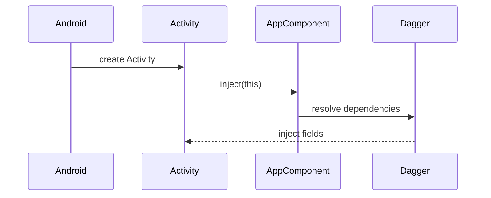

---

# 14. Dagger và ViewModel

Có một lỗi thiết kế phổ biến:

```kotlin
@Inject
lateinit var viewModel: UserViewModel
```

rồi sử dụng nó như Android `ViewModel`.

Vấn đề là **Android ViewModel cần được quản lý bởi `ViewModelStore`** để sống đúng lifecycle.

Với pure Dagger, có thể inject một `ViewModelProvider.Factory`.

```kotlin
class UserViewModel(
    private val loadUser: LoadUserUseCase
) : ViewModel()
```

Factory:

```kotlin
class UserViewModelFactory @Inject constructor(
    private val loadUser: LoadUserUseCase
) : ViewModelProvider.Factory {

    @Suppress("UNCHECKED_CAST")
    override fun <T : ViewModel> create(
        modelClass: Class<T>
    ): T {
        return UserViewModel(
            loadUser
        ) as T
    }
}
```

Activity:

```kotlin
@Inject
lateinit var viewModelFactory: UserViewModelFactory

private val viewModel: UserViewModel by viewModels {
    viewModelFactory
}
```

Luồng:

```text
Dagger
   ↓
ViewModelFactory
   ↓
ViewModelProvider
   ↓
ViewModelStore
   ↓
UserViewModel
```

Như vậy:

* **Dagger** cung cấp dependencies.
* **ViewModelProvider** quản lý lifecycle ViewModel.

---

# 15. Ví dụ hoàn chỉnh theo Android Architecture

Ta xây một màn hình:

```text
UserScreen
```

cần tải user từ server.

Kiến trúc:

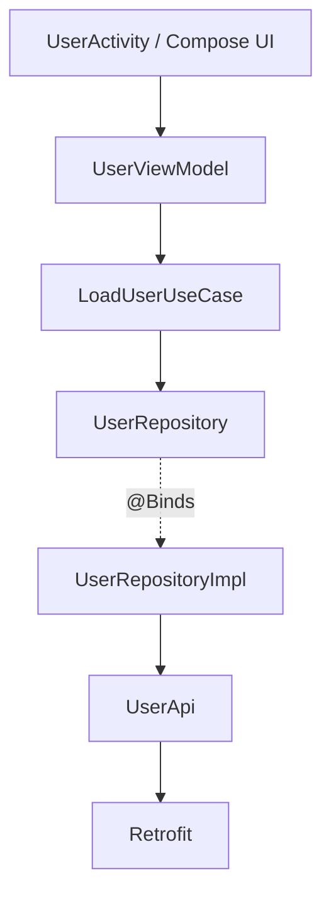

---

## 15.1. API

```kotlin
interface UserApi {

    @GET("users/me")
    suspend fun getUser(): UserDto
}
```

---

## 15.2. Repository abstraction

```kotlin
interface UserRepository {

    suspend fun getUser(): User
}
```

UI/domain chỉ biết abstraction này.

---

## 15.3. Repository implementation

```kotlin
@Singleton
class UserRepositoryImpl @Inject constructor(
    private val api: UserApi
) : UserRepository {

    override suspend fun getUser(): User {
        return api
            .getUser()
            .toDomain()
    }
}
```

---

## 15.4. Binding

```kotlin
@Module
interface RepositoryModule {

    @Binds
    fun bindUserRepository(
        impl: UserRepositoryImpl
    ): UserRepository
}
```

---

## 15.5. Use case

```kotlin
class LoadUserUseCase @Inject constructor(
    private val repository: UserRepository
) {

    suspend operator fun invoke(): User {
        return repository.getUser()
    }
}
```

---

## 15.6. UI State

```kotlin
data class UserUiState(
    val loading: Boolean = false,
    val user: User? = null,
    val error: String? = null
)
```

---

## 15.7. ViewModel

```kotlin
class UserViewModel(
    private val loadUser: LoadUserUseCase
) : ViewModel() {

    private val _uiState =
        MutableStateFlow(UserUiState())

    val uiState =
        _uiState.asStateFlow()

    fun load() {
        viewModelScope.launch {

            _uiState.value =
                UserUiState(
                    loading = true
                )

            runCatching {
                loadUser()
            }.onSuccess { user ->

                _uiState.value =
                    UserUiState(
                        user = user
                    )

            }.onFailure { error ->

                _uiState.value =
                    UserUiState(
                        error =
                            error.message
                                ?: "Unknown error"
                    )
            }
        }
    }
}
```

Điểm quan trọng:

```text
ViewModel
    ↓
UseCase
    ↓
Repository abstraction
```

ViewModel không biết:

```text
Retrofit
OkHttp
Room
Dagger
```

---

# 16. Dependency graph hoàn chỉnh

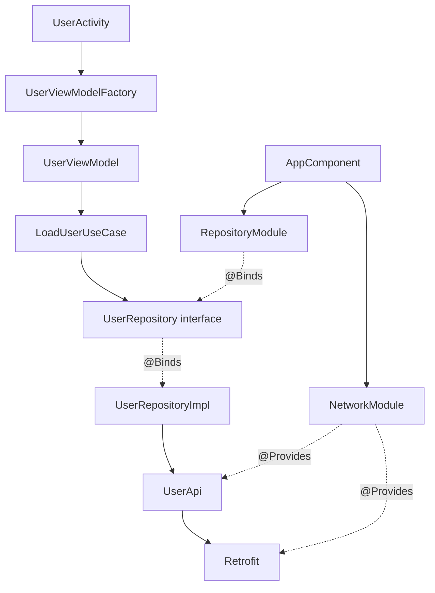

Đây chính là thứ cần hình dung khi nói:

> **Dagger builds the dependency graph.**

---

# 17. Scope là gì?

Mặc định:

```kotlin
@Inject
constructor(...)
```

không đồng nghĩa với singleton.

Nếu Dagger được yêu cầu nhiều lần:

```text
request A → instance #1
request A → instance #2
request A → instance #3
```

có thể các instance khác nhau được tạo.

---

# 18. `@Singleton`

Ví dụ Retrofit:

```kotlin
@Provides
@Singleton
fun provideRetrofit(): Retrofit
```

AppComponent cũng phải có scope tương ứng:

```kotlin
@Singleton
@Component(...)
interface AppComponent
```

Concept:

```text
AppComponent lifetime
│
├── Retrofit ───────────────┐
│                          │
├── Repository ─────────────┤ same graph
│                          │
└── Other dependency ───────┘
```

Dagger gắn scoped instances với lifetime của component chứa chúng. ([Dagger][6])

---

# 19. Scope không phải là Global Variable

Hai khái niệm dễ nhầm:

```text
Global Singleton
```

và:

```text
Scoped dependency
```

không hoàn toàn giống nhau.

Dagger scope nghĩa là:

```text
Component Instance
       │
       └── owns scoped objects
```

Component chết:

```text
Component destroyed
       ↓
references released
       ↓
objects có thể được GC
```

Đó là lý do lifetime của component rất quan trọng.

---

# 20. Subcomponent

App có thể có graph lớn:

```text
Application
    │
    ├── Login
    │
    ├── Checkout
    │
    └── Profile
```

Không nhất thiết mọi dependency sống suốt application.

Ta có thể dùng:

```text
AppComponent
     │
     └── LoginComponent
```

Ví dụ:

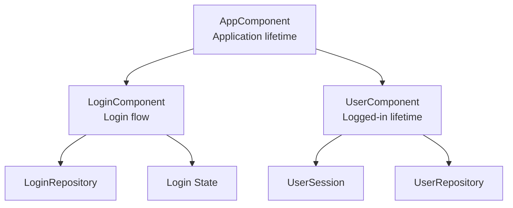

Dagger hỗ trợ **subcomponents** để xây các graph có lifetime ngắn hơn graph cha. ([Dagger][7])

---

# 21. Lifecycle rất quan trọng

Ví dụ có:

```text
AppComponent
```

sống theo:

```text
Application
```

nên Activity rotate:

```text
Activity #1
     ↓ destroyed

Activity #2
     ↓ recreated

AppComponent
     ↓
vẫn tồn tại
```

Nhưng nếu dependency nằm trong component gắn trực tiếp với Activity:

```text
ActivityComponent #1
        ↓
destroy

ActivityComponent #2
        ↓
new instances
```

Do đó:

> **Scope không nên chọn theo tên class; hãy chọn theo lifetime thực tế của dependency.**

Android Developers khuyến nghị đặt tên custom scope theo lifetime mà nó đại diện, ví dụ application, logged-user hoặc activity lifetime. ([Android Developers][5])

---

# 22. Dagger không quản lý UI State

Một điểm rất quan trọng:

```text
Dagger
≠
SavedStateHandle
≠
StateFlow
≠
ViewModel
```

Dagger quản lý:

```text
Object creation
Object dependency
Object lifetime
```

Trong khi:

```text
ViewModel
StateFlow
SavedStateHandle
```

quản lý state.

Kiến trúc đúng:

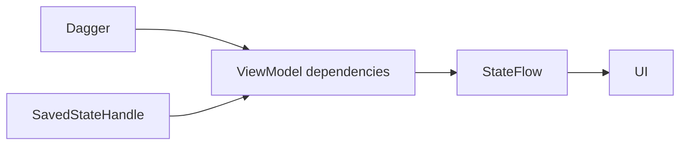

Không nên cố dùng singleton dependency để "giữ UI state qua rotate".

---

# 23. `@Qualifier`

Giả sử app có hai `OkHttpClient`.

```text
Authenticated client
Public client
```

Cả hai đều có type:

```kotlin
OkHttpClient
```

Dagger không biết cần client nào.

Có thể tạo qualifier:

```kotlin
@Qualifier
@Retention(AnnotationRetention.BINARY)
annotation class Authenticated
```

và:

```kotlin
@Qualifier
@Retention(AnnotationRetention.BINARY)
annotation class Public
```

Sau đó:

```kotlin
@Provides
@Authenticated
fun provideAuthenticatedClient(): OkHttpClient
```

và:

```kotlin
@Provides
@Public
fun providePublicClient(): OkHttpClient
```

Injection:

```kotlin
class AuthApi @Inject constructor(
    @Authenticated
    private val client: OkHttpClient
)
```

Graph:

```text
                 OkHttpClient
                   /       \
                  /         \
      @Public                @Authenticated
          ↓                        ↓
 Public API                    Private API
```

---

# 24. `Provider<T>` và `Lazy<T>`

Thông thường:

```kotlin
class A @Inject constructor(
    val b: B
)
```

Dagger tạo `B` khi cần tạo `A`.

Nhưng có thể dùng:

```kotlin
Lazy<B>
```

hoặc:

```kotlin
Provider<B>
```

Dagger hỗ trợ các wrapper này trong dependency graph. ([Dagger][6])

### `Lazy<T>`

```text
A created
│
└── B chưa tạo

A gọi lazyB.get()
│
└── B mới được tạo
```

### `Provider<T>`

```text
provider.get()
      ↓
request instance
```

Hữu ích khi dependency:

* đắt để tạo;
* không phải lúc nào cũng cần;
* cần tạo theo yêu cầu.

Nhưng không nên dùng chúng khắp nơi chỉ để che dependency graph thiết kế kém.

---

# 25. Compile-time validation

Một lợi thế rất lớn của Dagger là dependency graph được kiểm tra khi build. ([Android Developers][4])

Ví dụ:

```text
ViewModel
   ↓
Repository
   ↓
Api
```

nhưng không có binding cho `Api`.

Build sẽ thất bại thay vì chờ user mở màn hình mới crash.

Concept:

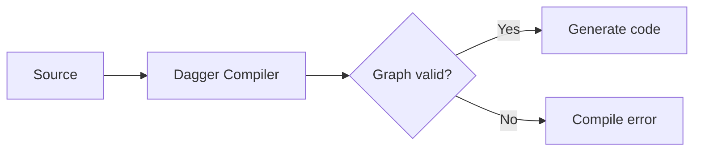

---

# 26. Những lỗi Dagger thường gặp

## `MissingBinding`

Ví dụ:

```text
UserRepository cannot be provided
```

Hãy lần theo graph:

```text
UserViewModel
 ↓
LoadUserUseCase
 ↓
UserRepository ← missing
```

Kiểm tra:

```text
Có @Inject constructor?
Có @Binds?
Có @Provides?
Module đã nằm trong Component?
```

---

## Duplicate binding

Ví dụ có hai:

```kotlin
@Provides
fun provideApi(): UserApi
```

Dagger không biết chọn binding nào.

Giải pháp thường là:

```text
@Qualifier
```

---

## Dependency cycle

Ví dụ:

```text
A
↓
B
↓
C
↓
A
```

Đây thường là tín hiệu architecture có dependency direction sai.

---

## Scope mismatch

Ví dụ:

```text
@Singleton graph
        ↓
dependency giữ Activity
```

rất dễ thành vấn đề lifecycle.

Đặc biệt cần tránh việc dependency sống ở application scope giữ reference không cần thiết đến `Activity`, `Fragment` hoặc `View`.

---

# 27. Dagger và Service Locator khác nhau như thế nào?

## Service Locator

```kotlin
class CheckoutViewModel {

    val repository =
        ServiceLocator.userRepository
}
```

Class chủ động:

```text
đi tìm dependency
```

Dependency bị ẩn.

---

## Dependency Injection

```kotlin
class CheckoutViewModel(
    private val repository: UserRepository
)
```

Class tuyên bố rõ:

```text
"Tôi cần UserRepository"
```

Dependency graph chịu trách nhiệm cung cấp nó.

```text
Service Locator

Class
 ↓
asks global container
 ↓
Dependency
```

so với:

```text
Dependency Injection

Dependency
 ↓
injected
 ↓
Class
```

Constructor injection thường làm dependency rõ và dễ test hơn.

---

# 28. Testing với Dagger

Một trong những điểm quan trọng nhất:

> Unit test của class dùng constructor injection **không bắt buộc phải chạy Dagger**.

Android Developers cũng hướng dẫn rằng với unit test, bạn có thể trực tiếp truyền fake hoặc mock dependency vào constructor. ([Android Developers][5])

---

# 29. Fake Repository

Production:

```kotlin
class UserRepositoryImpl @Inject constructor(
    private val api: UserApi
) : UserRepository
```

Test:

```kotlin
class FakeUserRepository : UserRepository {

    override suspend fun getUser(): User {
        return User(
            id = "1",
            name = "Test User"
        )
    }
}
```

Test:

```kotlin
@Test
fun loadUser_returnsUser() = runTest {

    val repository =
        FakeUserRepository()

    val useCase =
        LoadUserUseCase(repository)

    val result =
        useCase()

    assertEquals(
        "Test User",
        result.name
    )
}
```

Không cần:

```text
Retrofit
Internet
Database
Dagger graph
```

---

# 30. Test seam

Architecture:

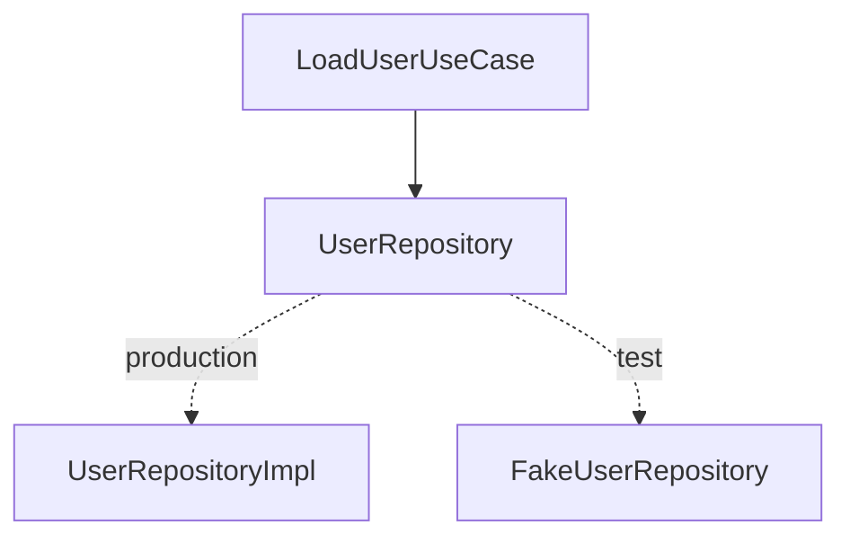

Đây chính là **test seam**.

Ta có thể thay implementation mà không sửa business logic.

---

# 31. Gradle setup

Tính đến tháng 8/2026, release được GitHub repository chính thức đánh dấu latest là **Dagger 2.60.1**. ([GitHub][8])

Ví dụ với Kotlin + KAPT:

```kotlin
plugins {
    kotlin("kapt")
}

dependencies {

    implementation(
        "com.google.dagger:dagger:2.60.1"
    )

    kapt(
        "com.google.dagger:dagger-compiler:2.60.1"
    )
}
```

Android Developers vẫn trình bày pure Dagger với `kapt` trong tài liệu Android Dagger. ([Android Developers][5])

---

## Nếu dùng Version Catalog

`libs.versions.toml`:

```toml
[versions]
dagger = "2.60.1"

[libraries]

dagger = {
    module = "com.google.dagger:dagger",
    version.ref = "dagger"
}

dagger-compiler = {
    module = "com.google.dagger:dagger-compiler",
    version.ref = "dagger"
}
```

`build.gradle.kts`:

```kotlin
dependencies {

    implementation(
        libs.dagger
    )

    kapt(
        libs.dagger.compiler
    )
}
```

---

# 32. KAPT hay KSP?

Cần phân biệt:

### Pure Dagger

Tài liệu Dagger hiện vẫn cảnh báo **KSP support của Dagger core là alpha**. ([Dagger][9])

Vì vậy đối với bài học pure Dagger này:

```text
KAPT
```

là lựa chọn dễ theo dõi và ổn định hơn.

### Hilt

Hilt hiện hỗ trợ cả KSP và KAPT trong Gradle setup chính thức. ([Dagger][10])

---

# 33. Dagger hay Hilt trong Android 2026?

Đây là phần quan trọng nếu học theo roadmap 2026.

Android Developers hiện khuyến nghị:

> **Use Hilt in your Android app.**

Hilt được xây dựng trên Dagger và chuẩn hóa việc tích hợp DI với Android framework cũng như lifecycle. ([Android Developers][11])

Quan hệ:

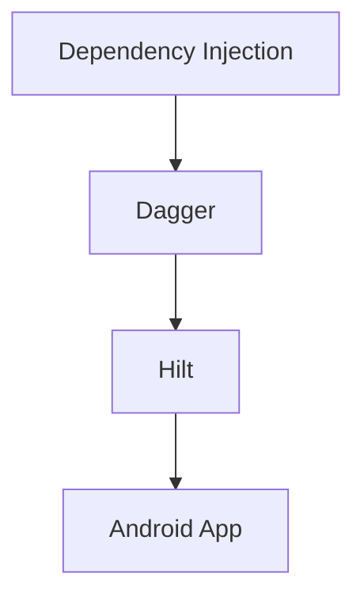

Hay:

```text
Dependency Injection
        ↓
      Dagger
        ↓
       Hilt
        ↓
Android-specific DI
```

---

# 34. So sánh Dagger và Hilt

| Dagger                            | Hilt                             |
| --------------------------------- | -------------------------------- |
| DI framework tổng quát            | Android-focused DI               |
| Tự thiết kế component hierarchy   | Có component hierarchy chuẩn     |
| Nhiều wiring Android thủ công hơn | Giảm Android boilerplate         |
| Hiểu rất sâu dependency graph     | API dễ áp dụng hơn               |
| Customization cao                 | Convention nhiều hơn             |
| `@Component`                      | component phần lớn được Hilt tạo |
| Manual field injection            | `@AndroidEntryPoint`             |
| Custom ViewModel wiring           | `@HiltViewModel`                 |

Hilt tạo sẵn nhiều Android component, scope và binding mà nếu dùng pure Dagger bạn phải quản lý thủ công. ([Android Developers][12])

---

# 35. Có còn nên học Dagger không?

**Có.**

Ngay cả khi production app sử dụng Hilt, học Dagger giúp hiểu:

```text
Dependency
Binding
Graph
Scope
Component
Module
Qualifier
Subcomponent
```

Các khái niệm này nằm ngay bên dưới Hilt.

Lộ trình hợp lý:

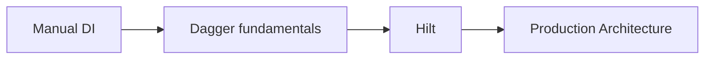

Đối với app Android mới, Hilt hiện là lựa chọn được Android Developers khuyến nghị; nhưng Dagger vẫn là nền tảng mà Hilt xây dựng phía trên. ([Android Developers][11])

---

# 36. Khi nào pure Dagger vẫn hữu ích?

Pure Dagger đáng hiểu khi:

* maintain codebase đã dùng Dagger;
* cần hiểu Hilt internals;
* component hierarchy rất đặc thù;
* dependency graph phức tạp;
* multi-module architecture lớn;
* làm library không muốn phụ thuộc hoàn toàn vào Android-specific APIs;
* cần debugging generated DI graph.

Android Developers vẫn duy trì tài liệu riêng về Dagger cho Android và multi-module Dagger. ([Android Developers][5])

---

# 37. Multi-module Architecture

Ví dụ project:

```text
app
│
├── core-network
├── core-database
├── core-domain
│
├── feature-login
├── feature-profile
└── feature-checkout
```

Graph:

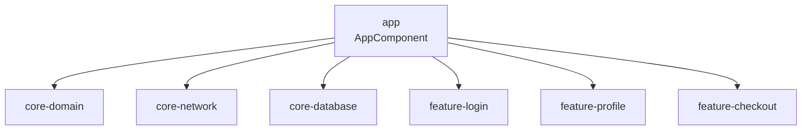

Một nguyên tắc quan trọng được Android Developers nêu cho multi-module architecture là các module ở cùng level thường không nên trực tiếp phụ thuộc lẫn nhau; shared dependency nên được đẩy về parent/shared module thích hợp. ([Android Developers][13])

---

# 38. Ảnh hưởng đến UX

Người dùng không trực tiếp thấy:

```text
@Inject
@Component
@Module
```

nhưng architecture có thể ảnh hưởng UX gián tiếp.

### DI tốt

```text
dependency rõ
 ↓
code dễ test
 ↓
ít regression
 ↓
app ổn định
 ↓
UX tốt hơn
```

Ngoài ra scope đúng giúp tránh việc tạo lại những object đắt tiền không cần thiết.

---

# 39. Ảnh hưởng đến Maintainability

Không DI:

```text
Screen
 ├── Retrofit
 ├── Repository
 ├── Database
 ├── Analytics
 └── Logger
```

Mọi thứ dính vào nhau.

DI:

```text
Screen
  ↓
ViewModel
  ↓
UseCase
  ↓
Repository interface

        Dagger
          ↓
     wiring objects
```

Khi đổi:

```text
Retrofit API A
```

sang:

```text
Retrofit API B
```

nhiều phần business logic có thể không cần thay đổi.

---

# 40. Ảnh hưởng đến Performance

Dagger generate code ở compile time và không dựa vào runtime reflection để resolve dependency graph. Đây là một trong những mục tiêu thiết kế chính của Dagger. ([GitHub][14])

Tuy nhiên:

```text
Dagger
```

không thể cứu architecture nếu bạn:

```text
@Singleton everything
```

hoặc tạo quá nhiều object đắt tiền.

Performance vẫn phụ thuộc vào:

* scope;
* initialization strategy;
* network;
* database;
* object lifetime;
* lazy initialization.

---

# 41. Production risk — Scope quá rộng

Sai:

```text
@Singleton
ActivityController(
    activity: Activity
)
```

Concept:

```text
Application
    ↓
Singleton
    ↓
Activity
    ↓
Activity không được release
```

Đây là pattern cần đặc biệt cảnh giác.

Nguyên tắc:

```text
Long-lived object
không nên giữ
short-lived UI object
```

Ví dụ:

```text
ApplicationScope
        ↓

Không giữ Activity
Không giữ Fragment
Không giữ View
```

trừ khi lifecycle được quản lý cực kỳ rõ ràng.

---

# 42. Production risk — Scope UI state sai

Sai:

```text
@Singleton
CheckoutUiState
```

User logout rồi login:

```text
old state
   ↓
singleton vẫn còn
   ↓
stale data
```

Thay vào đó UI state thường nên gắn với:

```text
ViewModel
SavedStateHandle
StateFlow
```

không phải application singleton.

---

# 43. Production risk — Giant AppComponent

Ban đầu:

```text
AppComponent
 ├── Network
 └── Database
```

sau vài năm:

```text
AppComponent
 ├── Login
 ├── Checkout
 ├── Analytics
 ├── Ads
 ├── Search
 ├── Chat
 ├── Payment
 ├── Recommendation
 ├── ...
```

Graph trở nên khó hiểu.

Có thể chia theo:

```text
Application
Feature
Session
Activity
```

hoặc module boundary phù hợp.

---

# 44. Debugging Dagger

Khi gặp compile error, đừng chỉ nhìn dòng đầu.

Hãy đọc dependency trace như graph.

Ví dụ:

```text
UserApi cannot be provided
```

Dagger có thể chỉ ra chain tương tự:

```text
UserApi
 ↓
UserRepositoryImpl
 ↓
LoadUserUseCase
 ↓
UserViewModelFactory
 ↓
UserActivity
```

Ta có thể chuyển trực tiếp thành sơ đồ:

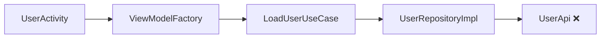

Sau đó hỏi:

> Binding đầu tiên bị thiếu nằm ở đâu?

Trong ví dụ này:

```text
UserApi
```

---

# 45. Có thể xem generated code

Dagger sinh source code thay cho rất nhiều factory/wiring boilerplate. ([GitHub][14])

Khi học Dagger, xem generated code rất hữu ích.

Bạn có thể bắt gặp những class dạng:

```text
DaggerAppComponent
UserRepositoryImpl_Factory
LoadUserUseCase_Factory
NetworkModule_ProvideRetrofitFactory
```

Nó giúp hiểu:

```text
@Inject
```

không phải "magic".

Thực tế Dagger đang tạo code tương tự:

```kotlin
val retrofit = provideRetrofit()

val api =
    provideUserApi(retrofit)

val repository =
    UserRepositoryImpl(api)

val useCase =
    LoadUserUseCase(repository)
```

---

# 46. Mental model quan trọng nhất

Có thể hình dung Dagger là compiler viết hộ đoạn:

```kotlin
val retrofit =
    Retrofit(...)

val api =
    UserApi(retrofit)

val repository =
    UserRepositoryImpl(api)

val useCase =
    LoadUserUseCase(repository)

val factory =
    UserViewModelFactory(useCase)
```

Bạn chỉ khai báo:

```text
Object cần gì?
Object được tạo thế nào?
Object sống bao lâu?
```

Dagger viết phần wiring còn lại.

---

# 47. Thực hành

## Bài thực hành: User Profile

Xây màn hình:

```text
ProfileScreen
```

với graph:

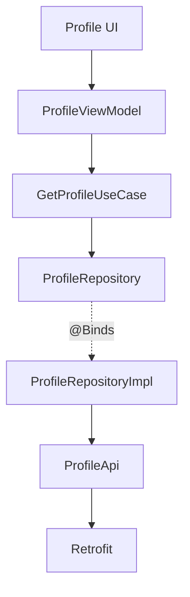

---

## Yêu cầu

### 1. Constructor Injection

Dùng:

```kotlin
@Inject constructor(...)
```

cho:

```text
GetProfileUseCase
ProfileRepositoryImpl
```

---

### 2. Module

Tạo:

```text
NetworkModule
RepositoryModule
```

---

### 3. `@Provides`

Cung cấp:

```text
Retrofit
ProfileApi
```

---

### 4. `@Binds`

Mapping:

```text
ProfileRepository
       ↓
ProfileRepositoryImpl
```

---

### 5. Component

Tạo:

```text
AppComponent
```

---

### 6. Testing

Tạo:

```text
FakeProfileRepository
```

và test:

```text
GetProfileUseCase
```

không gọi Internet.

---

# 48. Folder structure đề xuất

```text
app/
│
├── di/
│   ├── AppComponent.kt
│   ├── NetworkModule.kt
│   └── RepositoryModule.kt
│
├── data/
│   ├── remote/
│   │   └── ProfileApi.kt
│   │
│   └── repository/
│       └── ProfileRepositoryImpl.kt
│
├── domain/
│   ├── repository/
│   │   └── ProfileRepository.kt
│   │
│   └── usecase/
│       └── GetProfileUseCase.kt
│
└── presentation/
    └── profile/
        ├── ProfileActivity.kt
        ├── ProfileViewModel.kt
        ├── ProfileViewModelFactory.kt
        └── ProfileUiState.kt
```

Dependency direction:

```text
presentation
     ↓
domain
     ↑
data
```

Trong khi:

```text
di
```

là **composition root** chịu trách nhiệm ghép implementation lại.

---

# 49. Artifact nên đưa vào Portfolio

Không cần tạo app quá lớn.

Một repo nhỏ có thể đủ nếu có:

```text
dagger-profile-demo/
│
├── app/
├── screenshots/
│
├── docs/
│   └── dependency-graph.md
│
└── README.md
```

README nên có:

```markdown
# Android Dagger Demo

## Architecture

UI → ViewModel → UseCase → Repository → API

## DI

- Constructor injection
- @Binds
- @Provides
- @Component
- @Singleton

## Testing

Production:
ProfileRepositoryImpl

Test:
FakeProfileRepository
```

---

# 50. Artifact mạnh hơn cho Portfolio

Có thể thêm Mermaid graph:

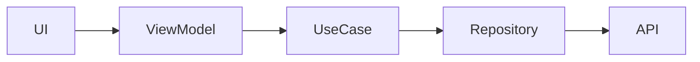

và screenshot:

```text
App chạy
+
Unit test pass
+
Dependency graph
+
README giải thích trade-off Dagger vs Hilt
```

Như vậy repo thể hiện được cả:

```text
Coding
Architecture
Testing
Documentation
```

---

# 51. Checklist hoàn thành

## Kiến thức

* [ ] Giải thích được Dependency Injection.
* [ ] Giải thích được Dagger làm gì.
* [ ] Hiểu dependency graph.
* [ ] Hiểu compile-time code generation.
* [ ] Hiểu `@Inject`.
* [ ] Hiểu `@Module`.
* [ ] Hiểu `@Provides`.
* [ ] Hiểu `@Binds`.
* [ ] Hiểu `@Component`.
* [ ] Hiểu `@Singleton`.
* [ ] Hiểu `@Qualifier`.
* [ ] Biết `Subcomponent` dùng để làm gì.

## Architecture

* [ ] UI không trực tiếp tạo Repository.
* [ ] ViewModel không biết Retrofit.
* [ ] Domain phụ thuộc abstraction.
* [ ] Data implement repository interface.
* [ ] DI wiring nằm ở composition root.

## Lifecycle

* [ ] Hiểu component lifetime.
* [ ] Không dùng singleton để giữ UI state.
* [ ] Không để application-scoped object giữ Activity/View không cần thiết.
* [ ] ViewModel vẫn được quản lý bởi ViewModelStore.

## Testing

* [ ] Có `FakeRepository`.
* [ ] Unit test không cần network.
* [ ] Biết unit test không bắt buộc chạy Dagger.

## Production

* [ ] Scope được chọn theo lifetime.
* [ ] Không `@Singleton` mọi dependency.
* [ ] Dependency graph không có cycle.
* [ ] Không tạo giant component nếu không cần.
* [ ] Biết đọc `MissingBinding`.
* [ ] Biết dùng qualifier khi có nhiều binding cùng type.

---

# 52. Câu hỏi tự kiểm tra

### Câu 1

**Dagger là gì?**

> Framework Dependency Injection sử dụng compile-time analysis và code generation để xây dựng, kiểm tra và tạo dependency graph.

---

### Câu 2

`@Inject constructor` để làm gì?

> Cho Dagger biết cách tạo instance của class và dependency mà constructor yêu cầu.

---

### Câu 3

Khi nào dùng `@Provides`?

> Khi không thể constructor inject hoặc cần logic khởi tạo đặc biệt, ví dụ Retrofit, Room hay class từ thư viện ngoài.

---

### Câu 4

Khi nào dùng `@Binds`?

> Khi muốn mapping abstraction/interface sang implementation.

```text
UserRepository
       ↓
UserRepositoryImpl
```

---

### Câu 5

`@Component` làm gì?

> Tạo boundary/container của dependency graph và kết nối bindings lại với nhau.

---

### Câu 6

`@Singleton` có nghĩa object sống vĩnh viễn không?

**Không.**

Nó được cache theo lifetime của component mang scope tương ứng.

---

### Câu 7

Dagger có giữ StateFlow sau process death không?

**Không.**

Đó không phải trách nhiệm của Dagger.

---

### Câu 8

Pure Dagger hay Hilt cho Android app mới?

Theo tài liệu Android hiện tại:

```text
Hilt
```

là lựa chọn được khuyến nghị và Hilt được xây trên Dagger. ([Android Developers][11])

---

# 53. Sơ đồ tổng kết

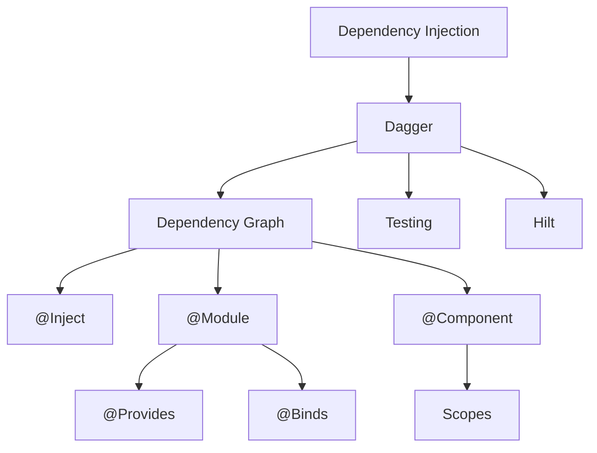

Mental model ngắn gọn:

```text
@Inject
   ↓
Class cần gì?

@Module
   ↓
Dependency đặc biệt được tạo thế nào?

@Binds
   ↓
Interface dùng implementation nào?

@Component
   ↓
Ghép tất cả thành graph

@Scope
   ↓
Object sống bao lâu?
```

---

# 54. Dagger trong Android Developer Roadmap 2026

Vị trí kiến thức nên học:

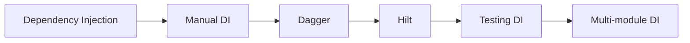

Nếu đã hiểu bài này, bước tiếp theo hợp lý nhất là **Hilt**, bởi Hilt lấy các nguyên lý Dagger vừa học và cung cấp Android-specific component/lifecycle integration với ít boilerplate hơn. Android Developers hiện coi Hilt là thư viện DI được khuyến nghị cho Android. ([Android Developers][11])

---

# 55. Tổng kết

**Dagger không phải phép thuật.**

Nó chủ yếu tự động hóa đoạn code mà nếu manual DI bạn phải tự viết:

```text
create Retrofit
      ↓
create API
      ↓
create Repository
      ↓
create UseCase
      ↓
create ViewModelFactory
      ↓
inject Screen
```

Dagger biến nó thành một **dependency graph được kiểm tra ở compile time**. ([Android Developers][4])

Điều quan trọng nhất sau bài này không phải nhớ tất cả annotation, mà phải nhìn một Android screen và trả lời được:

```text
Dependency nào đang tồn tại?

Ai phụ thuộc ai?

Ai chịu trách nhiệm tạo object?

Interface bind với implementation nào?

Object nên sống bao lâu?

Có thể thay dependency bằng fake để test không?
```

Nếu trả lời được những câu này thì anh đã nắm được phần cốt lõi của **Dagger** và có nền tảng rất tốt để chuyển sang **Hilt**.

[1]: https://developer.android.com/codelabs/android-dagger?utm_source=chatgpt.com "(Deprecated) Using Dagger in your Android app - Kotlin"
[2]: https://dagger.dev/dev-guide/?utm_source=chatgpt.com "Dagger"
[3]: https://developer.android.com/topic/architecture?utm_source=chatgpt.com "Guide to app architecture"
[4]: https://developer.android.com/training/dependency-injection/dagger-basics?utm_source=chatgpt.com "Dagger basics | App architecture"
[5]: https://developer.android.com/training/dependency-injection/dagger-android?utm_source=chatgpt.com "Using Dagger in Android apps | App architecture"
[6]: https://dagger.dev/dev-guide/basic-usage?utm_source=chatgpt.com "Basic Usage"
[7]: https://dagger.dev/dev-guide/subcomponents.html?utm_source=chatgpt.com "Subcomponents"
[8]: https://github.com/google/dagger/releases?utm_source=chatgpt.com "Releases · google/dagger"
[9]: https://dagger.dev/dev-guide/ksp.html?utm_source=chatgpt.com "Dagger KSP"
[10]: https://dagger.dev/hilt/gradle-setup.html?utm_source=chatgpt.com "Gradle Build Setup"
[11]: https://developer.android.com/training/dependency-injection?utm_source=chatgpt.com "Dependency injection in Android | App architecture"
[12]: https://developer.android.com/codelabs/android-dagger-to-hilt?utm_source=chatgpt.com "(Deprecated) Migrating your Dagger app to Hilt"
[13]: https://developer.android.com/training/dependency-injection/dagger-multi-module?utm_source=chatgpt.com "Using Dagger in multi-module apps | App architecture"
[14]: https://github.com/google/dagger?utm_source=chatgpt.com "Dagger - A fast dependency injector for Android and Java."
