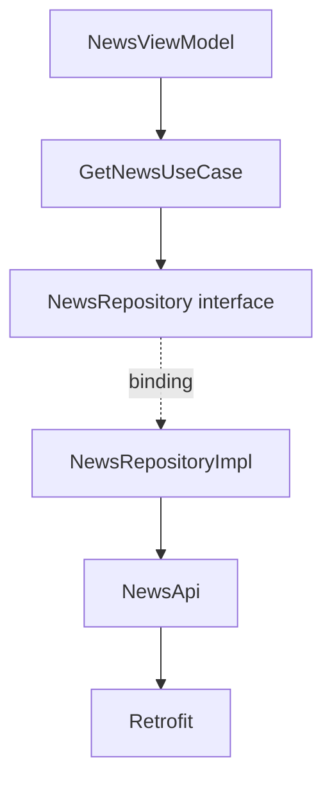
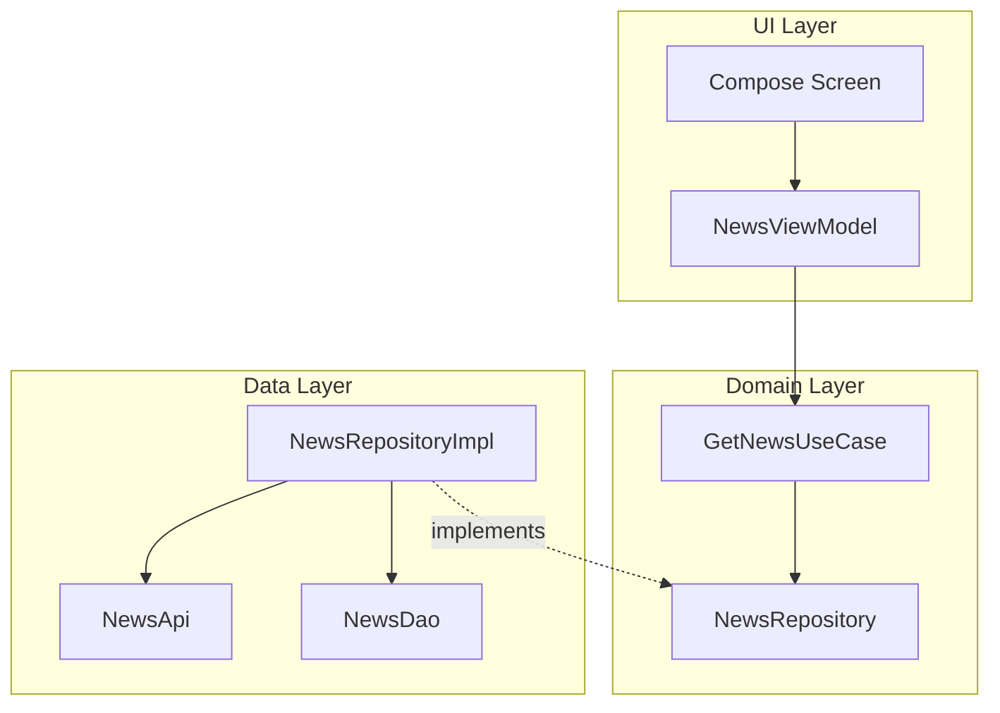
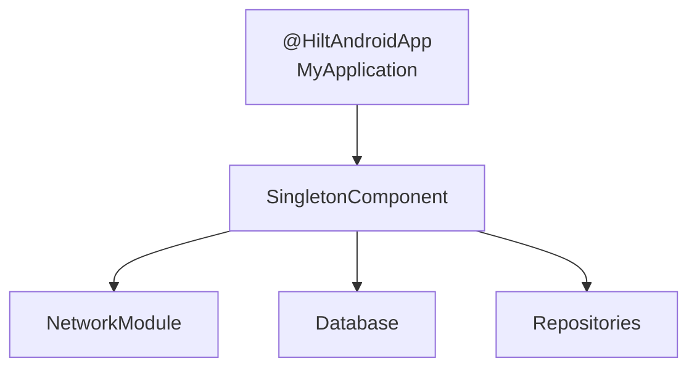
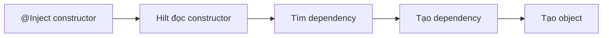
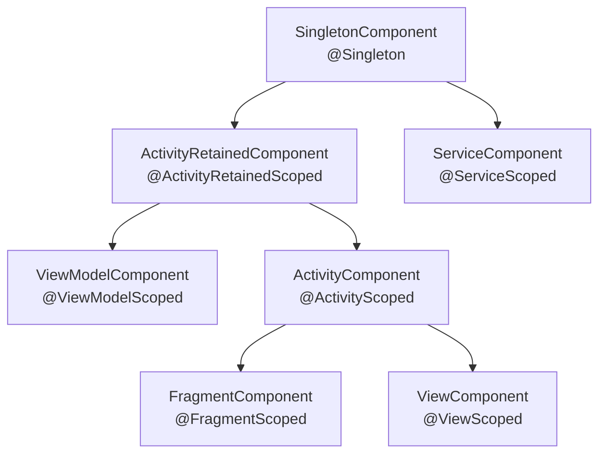
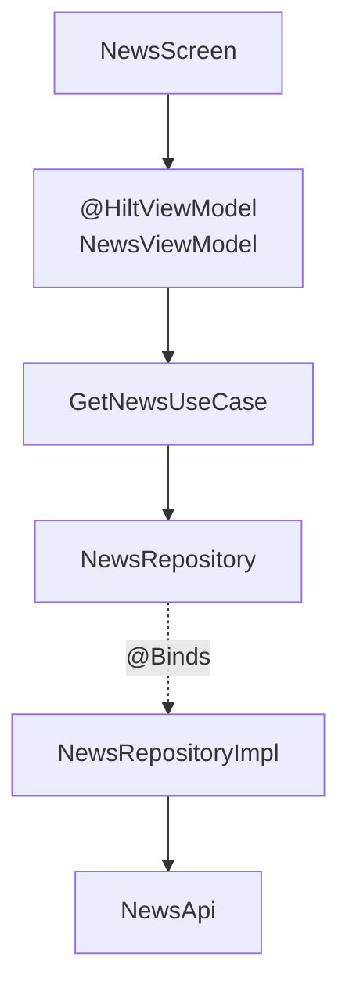
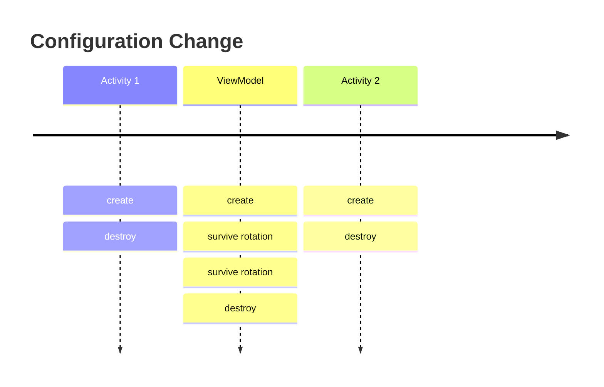
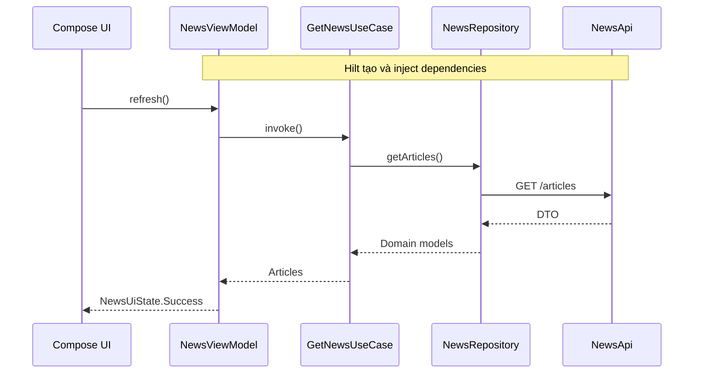
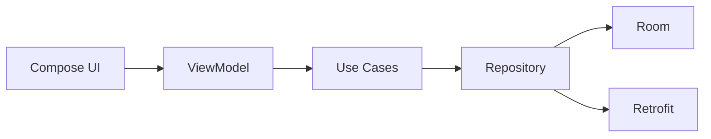
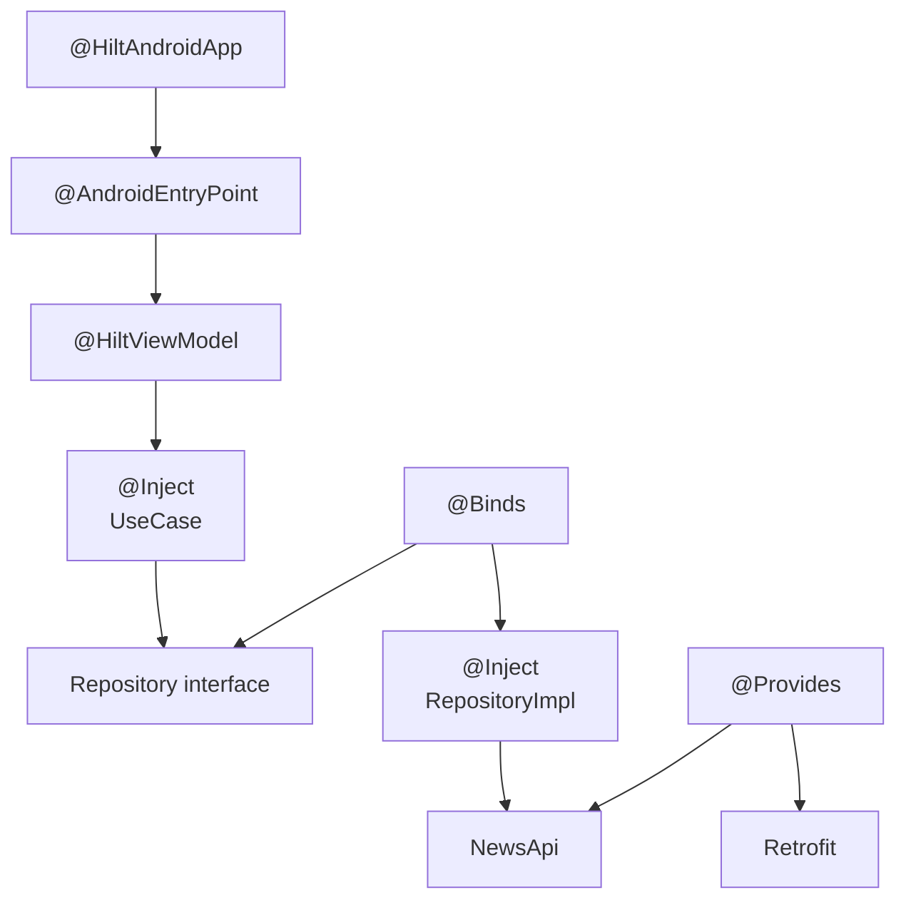

[](https://developer.android.com/codelabs/android-dagger-to-hilt?utm_source=chatgpt.com)

# 027 - Hilt

| Thông tin               | Nội dung                                       |
| ----------------------- | ---------------------------------------------- |
| **Học phần**            | 03 - Architecture, State and Data              |
| **Module**              | Module 05 - Design and Architecture            |
| **Nhóm nội dung**       | Dependency Injection                           |
| **Nguồn roadmap**       | Design and Architecture / Dependency Injection |
| **Loại bài**            | Architecture                                   |
| **Thứ tự trong module** | 027                                            |
| **Thời lượng gợi ý**    | 34 phút                                        |

---

## 1. Tóm tắt

**Hilt** là thư viện Dependency Injection được Android Developers khuyến nghị chính thức cho Android. Hilt được xây dựng trên **Dagger**, nhưng cung cấp sẵn hệ thống component, scope và integration với lifecycle Android để giảm đáng kể lượng code DI phải tự viết. ([Android Developers][1])

Nếu Dagger thuần yêu cầu developer tự thiết kế nhiều `Component`, `Subcomponent` và cách kết nối chúng với `Activity`, `ViewModel`, `Service`..., thì Hilt tạo phần lớn infrastructure đó dựa trên các annotation như:

```text
@HiltAndroidApp
@AndroidEntryPoint
@HiltViewModel
@Inject
@Module
@InstallIn
@Binds
@Provides
@Singleton
```

Hilt đặc biệt phù hợp với kiến trúc Android kiểu:

```text
Compose / Fragment
        ↓
    ViewModel
        ↓
     UseCase
        ↓
Repository interface
        ↓
Repository implementation
      ↙       ↘
    API        DAO
```

UI không cần biết `Retrofit`, `Room`, cách tạo repository hoặc cách khởi tạo use case. Hilt chịu trách nhiệm kết nối dependency graph.

---

## 2. Mục tiêu học tập

Sau bài này, bạn nên có thể:

* Giải thích được **Hilt là gì** và mối quan hệ giữa **Hilt – Dagger – Dependency Injection**.
* Hiểu dependency graph của một ứng dụng Android.
* Sử dụng được `@HiltAndroidApp`, `@AndroidEntryPoint`, `@Inject` và `@HiltViewModel`.
* Phân biệt `@Binds` với `@Provides`.
* Hiểu `@Module` và `@InstallIn`.
* Hiểu component và scope như `SingletonComponent`, `ViewModelComponent`, `ActivityComponent`.
* Biết khi nào nên dùng `@Singleton`, `@ViewModelScoped`, `@ActivityScoped`.
* Inject repository, API, DAO và use case vào ViewModel.
* Tạo **fake repository** để unit test mà không cần chạy Hilt.
* Nhận biết lỗi scope, lifecycle và dependency graph có thể ảnh hưởng production như thế nào.

---

# 3. Hilt là gì?

## 3.1. Từ Dependency Injection đến Hilt

Giả sử `NewsViewModel` cần `NewsRepository`:

```kotlin
class NewsViewModel(
    private val repository: NewsRepository
)
```

Repository lại cần API:

```kotlin
class NewsRepositoryImpl(
    private val api: NewsApi
) : NewsRepository
```

Và `NewsApi` được tạo bởi Retrofit.

Nếu không dùng DI framework, code khởi tạo có thể trở thành:

```kotlin
val retrofit = Retrofit.Builder()
    .baseUrl(BASE_URL)
    .build()

val api = retrofit.create(NewsApi::class.java)

val repository = NewsRepositoryImpl(api)

val viewModel = NewsViewModel(repository)
```

Khi ứng dụng có hàng chục repository, API, DAO, service và use case, việc tự xây dựng toàn bộ graph nhanh chóng trở nên phức tạp. Android Developers mô tả application graph chính là tập hợp các class cùng quan hệ dependency giữa chúng; DI giúp tạo và thay thế các dependency này dễ hơn.

### Ảnh minh họa application graph


Trong ví dụ chính thức của Android, nhiều `Activity` và `ViewModel` cùng phụ thuộc vào `UserManager`, `UserDataRepository` và storage. ([Android Developers][2])

---

## 3.2. Hilt giải quyết vấn đề như thế nào?

Thay vì tự viết:

```kotlin
val repository = NewsRepositoryImpl(api)
val useCase = GetNewsUseCase(repository)
val viewModel = NewsViewModel(useCase)
```

ta mô tả dependency:

```kotlin
class NewsRepositoryImpl @Inject constructor(
    private val api: NewsApi
)
```

```kotlin
class GetNewsUseCase @Inject constructor(
    private val repository: NewsRepository
)
```

```kotlin
@HiltViewModel
class NewsViewModel @Inject constructor(
    private val getNews: GetNewsUseCase
) : ViewModel()
```

Sau đó Hilt xây dựng graph:



Hilt sử dụng code generation và Dagger bên dưới để kiểm tra và xây dựng dependency graph tại compile time. Android Developers nêu Hilt kế thừa các đặc tính của Dagger như compile-time correctness, khả năng mở rộng và runtime performance. ([Android Developers][1])

---

# 4. Hilt và Dagger khác nhau như thế nào?

Hilt **không thay thế engine DI của Dagger**. Có thể hiểu đơn giản:

```text
Dependency Injection
        │
        ▼
      Dagger
        │
        │ Android-specific abstraction
        ▼
       Hilt
```

Dagger cung cấp cơ chế DI tổng quát. Hilt xây dựng một tập hợp component và scope chuẩn cho Android, tự tích hợp chúng với lifecycle của `Application`, `Activity`, `ViewModel`, `Fragment`, `View` và `Service`. Người dùng Hilt thông thường không cần tự định nghĩa hoặc tự instantiate Dagger component. ([Dagger][3])

### Minh họa component kiểu Dagger truyền thống


Với Hilt, phần infrastructure tương tự phần lớn được generate tự động.

---

# 5. Dependency direction trong ứng dụng

Một điểm quan trọng là **Hilt không phải kiến trúc của ứng dụng**.

Hilt chỉ giải quyết:

> Ai tạo object này và cung cấp dependency cho nó?

Clean Architecture, MVVM hoặc UDF vẫn quyết định:

> Layer nào được phép phụ thuộc vào layer nào?

Một cấu trúc hợp lý:



Android architecture guidance khuyến nghị ViewModel cung cấp UI state và truy cập data/domain layer thay vì để UI trực tiếp xử lý data source. ([Android Developers][4])

### Không nên

```text
Compose
   ↓
Retrofit
   ↓
REST API
```

hoặc:

```text
Activity
   ↓
Room DAO
```

### Nên

```text
Compose
   ↓
ViewModel
   ↓
UseCase
   ↓
Repository
   ↓
API / DAO
```

Hilt chỉ kết nối những object này lại.

---

# 6. Các annotation quan trọng

## 6.1. `@HiltAndroidApp`

Mọi ứng dụng Hilt cần một `Application` được annotate:

```kotlin
@HiltAndroidApp
class MyApplication : Application()
```

`@HiltAndroidApp` kích hoạt quá trình code generation và tạo application-level dependency container. ([Android Developers][1])



---

# 7. `@AndroidEntryPoint`

Android framework tự tạo nhiều object như `Activity`, vì vậy bạn không thể tự gọi constructor của chúng để truyền dependency.

Hilt giải quyết bằng entry point:

```kotlin
@AndroidEntryPoint
class MainActivity : ComponentActivity()
```

Trong app Compose hiện đại, thường chỉ cần annotate `ComponentActivity` chứa UI hierarchy; các composable không cần `@AndroidEntryPoint`. ([Android Developers][1])

Ví dụ field injection:

```kotlin
@AndroidEntryPoint
class MainActivity : ComponentActivity() {

    @Inject
    lateinit var analytics: AnalyticsManager
}
```

Tuy nhiên, đối với class do bạn sở hữu, **constructor injection thường rõ ràng hơn field injection**:

```kotlin
class AnalyticsManager @Inject constructor(
    private val service: AnalyticsService
)
```

---

# 8. Constructor Injection

Đây là trường hợp đơn giản nhất.

```kotlin
class GetNewsUseCase @Inject constructor(
    private val repository: NewsRepository
)
```

Hilt nhìn thấy:

```text
GetNewsUseCase
      │
      └── requires NewsRepository
```

Nếu Hilt biết cách tạo `NewsRepository`, graph tiếp tục được giải quyết.



---

# 9. Interface không thể constructor inject trực tiếp

Giả sử:

```kotlin
interface NewsRepository {
    suspend fun getNews(): List<Article>
}
```

Implementation:

```kotlin
class NewsRepositoryImpl @Inject constructor(
    private val api: NewsApi
) : NewsRepository {

    override suspend fun getNews(): List<Article> {
        return api.getNews()
    }
}
```

Hilt vẫn chưa biết:

```text
NewsRepository = ?
```

Ta cần khai báo binding.

---

# 10. `@Binds`

```kotlin
@Module
@InstallIn(SingletonComponent::class)
abstract class RepositoryModule {

    @Binds
    @Singleton
    abstract fun bindNewsRepository(
        impl: NewsRepositoryImpl
    ): NewsRepository
}
```

Ý nghĩa:

```text
Khi có class yêu cầu:

NewsRepository

        ↓

hãy cung cấp:

NewsRepositoryImpl
```

Android Developers khuyến nghị `@Binds` cho trường hợp cần ánh xạ một interface tới implementation mà Hilt có thể constructor-inject. ([Android Developers][1])

---

# 11. `@Provides`

Không phải object nào cũng có constructor mà bạn có thể annotate.

Ví dụ:

```text
Retrofit
OkHttpClient
RoomDatabase
third-party SDK
```

Đây là lúc sử dụng `@Provides`.

```kotlin
@Module
@InstallIn(SingletonComponent::class)
object NetworkModule {

    @Provides
    @Singleton
    fun provideRetrofit(): Retrofit {
        return Retrofit.Builder()
            .baseUrl("https://example.com/")
            .build()
    }

    @Provides
    @Singleton
    fun provideNewsApi(
        retrofit: Retrofit
    ): NewsApi {
        return retrofit.create(NewsApi::class.java)
    }
}
```

Android Developers chỉ ra `@Provides` phù hợp khi không thể dùng constructor injection, chẳng hạn type đến từ thư viện ngoài hoặc cần builder để khởi tạo. ([Android Developers][1])

---

# 12. `@Binds` hay `@Provides`?

| Trường hợp                                       | Annotation            |
| ------------------------------------------------ | --------------------- |
| Class do bạn sở hữu và constructor có thể inject | `@Inject constructor` |
| Interface → implementation                       | `@Binds`              |
| Retrofit                                         | `@Provides`           |
| Room database                                    | `@Provides`           |
| DAO lấy từ database                              | `@Provides`           |
| OkHttpClient                                     | `@Provides`           |
| Third-party SDK                                  | `@Provides`           |

Có thể nhớ:

```text
Có constructor mình kiểm soát?
        │
       Có
        ↓
@Inject constructor
        │
       Không
        ↓
    @Provides

Interface?
   │
  Có
   ↓
 @Binds
```

---

# 13. `@Module` và `@InstallIn`

Module chứa các binding mà Hilt không thể tự suy luận.

```kotlin
@Module
@InstallIn(SingletonComponent::class)
object NetworkModule
```

`@InstallIn` trả lời câu hỏi:

> Binding này thuộc component nào?

Theo tài liệu Hilt, module phải được install vào Hilt component phù hợp; component đó quyết định binding có thể được sử dụng ở đâu và sống trong phạm vi lifecycle nào. ([Dagger][5])

---

# 14. Hilt Component Hierarchy

Đây là một trong những phần quan trọng nhất của Hilt.

### Ảnh chính thức từ Dagger/Hilt


Hilt cung cấp component dựng sẵn và gắn chúng với lifecycle Android thay vì yêu cầu developer tự xây component hierarchy. ([Dagger][3])

Sơ đồ rút gọn:



Hilt cũng có các component dành cho `ViewWithFragmentBindings`; bảng component đầy đủ và hierarchy được Dagger Hilt định nghĩa chính thức. ([Dagger][3])

---

# 15. Scope và lifecycle

Scope quyết định một dependency được reuse trong bao lâu.

| Component                   | Scope                     | Lifetime điển hình                    |
| --------------------------- | ------------------------- | ------------------------------------- |
| `SingletonComponent`        | `@Singleton`              | Application process                   |
| `ActivityRetainedComponent` | `@ActivityRetainedScoped` | Qua configuration change của Activity |
| `ViewModelComponent`        | `@ViewModelScoped`        | Một ViewModel                         |
| `ActivityComponent`         | `@ActivityScoped`         | Một Activity                          |
| `FragmentComponent`         | `@FragmentScoped`         | Một Fragment                          |
| `ViewComponent`             | `@ViewScoped`             | Một View                              |
| `ServiceComponent`          | `@ServiceScoped`          | Một Service                           |

Các lifetime và scope trên được Hilt định nghĩa gắn với lifecycle của Android component tương ứng. ([Dagger][3])

---

## 15.1. Không có scope

```kotlin
class Formatter @Inject constructor()
```

Binding mặc định là **unscoped**.

Nếu dependency được yêu cầu nhiều lần, các instance mới có thể được tạo cho từng request. ([Dagger][3])

---

## 15.2. `@Singleton`

```kotlin
@Singleton
class SessionManager @Inject constructor()
```

Khi binding nằm trong `SingletonComponent`, cùng instance được reuse trong component đó.

Phù hợp với những dependency thực sự cần application lifetime, ví dụ cấu hình network hoặc database dùng chung.

---

## 15.3. `@ViewModelScoped`

```kotlin
@ViewModelScoped
class SearchSession @Inject constructor()
```

Cùng instance được chia sẻ cho các dependency bên trong **một ViewModel**, nhưng ViewModel khác có instance riêng. Hilt thiết kế `ViewModelComponent` chính xác cho lifetime này. ([Dagger][6])

---

# 16. Vì sao scope sai nguy hiểm?

Ví dụ:

```kotlin
@Singleton
class ScreenController @Inject constructor(
    private val activity: Activity
)
```

Đây là thiết kế rất đáng tránh.

Ta đang cố cho object sống gần bằng application process nhưng giữ reference tới object có lifecycle ngắn hơn.

Mô hình:

```text
Application
──────────────────────────────────────>

Activity
──────X

Singleton
──────────────────────────────────────>
        │
        └──── giữ Activity cũ
```

Từ quy tắc lifetime của Hilt có thể suy ra rằng scope quá dài cho dependency chứa state hoặc reference có lifecycle ngắn hơn làm tăng nguy cơ giữ dữ liệu không còn phù hợp và gây memory/lifecycle bug. ([Dagger][3])

Nguyên tắc nên nhớ:

> **Dependency chỉ nên sống lâu đúng bằng mức thực sự cần thiết.**

Không nên gắn `@Singleton` vào mọi thứ chỉ vì muốn “tối ưu”.

---

# 17. Inject ViewModel

Đây là use case phổ biến nhất.

```kotlin
@HiltViewModel
class NewsViewModel @Inject constructor(
    private val getNews: GetNewsUseCase
) : ViewModel()
```

Hilt generate factory cần thiết để tạo `ViewModel`, nên developer không cần tự viết `ViewModelProvider.Factory` cho ViewModel Hilt thông thường. ([Android Developers][7])

Dependency graph:



---

# 18. Hilt với Jetpack Compose

Activity:

```kotlin
@AndroidEntryPoint
class MainActivity : ComponentActivity() {

    override fun onCreate(savedInstanceState: Bundle?) {
        super.onCreate(savedInstanceState)

        setContent {
            App()
        }
    }
}
```

ViewModel:

```kotlin
@HiltViewModel
class NewsViewModel @Inject constructor(
    private val getNewsUseCase: GetNewsUseCase
) : ViewModel()
```

Screen:

```kotlin
@Composable
fun NewsRoute(
    viewModel: NewsViewModel = hiltViewModel()
) {
    val state by viewModel.uiState.collectAsStateWithLifecycle()

    NewsScreen(
        state = state,
        onRefresh = viewModel::refresh
    )
}
```

Trong Compose, Android Developers khuyến nghị ViewModel chịu trách nhiệm cung cấp UI state và tương tác với data/domain layer, trong khi UI collect state theo lifecycle. ([Android Developers][4])

---

# 19. Ví dụ hoàn chỉnh: News App

## 19.1. API

```kotlin
interface NewsApi {

    @GET("articles")
    suspend fun getArticles(): List<ArticleDto>
}
```

---

## 19.2. Repository interface

```kotlin
interface NewsRepository {

    suspend fun getArticles(): List<Article>
}
```

Interface giúp domain/ViewModel không phụ thuộc trực tiếp vào Retrofit.

---

## 19.3. Repository implementation

```kotlin
class NewsRepositoryImpl @Inject constructor(
    private val api: NewsApi
) : NewsRepository {

    override suspend fun getArticles(): List<Article> {
        return api
            .getArticles()
            .map { dto -> dto.toDomain() }
    }
}
```

---

## 19.4. Repository module

```kotlin
@Module
@InstallIn(SingletonComponent::class)
abstract class RepositoryModule {

    @Binds
    @Singleton
    abstract fun bindNewsRepository(
        impl: NewsRepositoryImpl
    ): NewsRepository
}
```

---

## 19.5. Network module

```kotlin
@Module
@InstallIn(SingletonComponent::class)
object NetworkModule {

    @Provides
    @Singleton
    fun provideRetrofit(): Retrofit {
        return Retrofit.Builder()
            .baseUrl("https://example.com/")
            .addConverterFactory(
                GsonConverterFactory.create()
            )
            .build()
    }

    @Provides
    @Singleton
    fun provideNewsApi(
        retrofit: Retrofit
    ): NewsApi {
        return retrofit.create(
            NewsApi::class.java
        )
    }
}
```

---

## 19.6. Use case

```kotlin
class GetNewsUseCase @Inject constructor(
    private val repository: NewsRepository
) {

    suspend operator fun invoke(): List<Article> {
        return repository.getArticles()
    }
}
```

---

## 19.7. UI State

```kotlin
sealed interface NewsUiState {

    data object Loading : NewsUiState

    data class Success(
        val articles: List<Article>
    ) : NewsUiState

    data class Error(
        val message: String
    ) : NewsUiState
}
```

---

## 19.8. ViewModel

```kotlin
@HiltViewModel
class NewsViewModel @Inject constructor(
    private val getNews: GetNewsUseCase
) : ViewModel() {

    private val _uiState =
        MutableStateFlow<NewsUiState>(
            NewsUiState.Loading
        )

    val uiState: StateFlow<NewsUiState> =
        _uiState.asStateFlow()

    init {
        refresh()
    }

    fun refresh() {
        viewModelScope.launch {

            _uiState.value =
                NewsUiState.Loading

            _uiState.value =
                try {
                    NewsUiState.Success(
                        getNews()
                    )
                } catch (e: Exception) {
                    NewsUiState.Error(
                        e.message ?: "Unknown error"
                    )
                }
        }
    }
}
```

---

# 20. Hilt tạo graph như thế nào?

Từ code trên Hilt có thể suy ra:

```text
NewsViewModel
      │
      ▼
GetNewsUseCase
      │
      ▼
NewsRepository
      │
   @Binds
      │
      ▼
NewsRepositoryImpl
      │
      ▼
NewsApi
      │
  @Provides
      │
      ▼
Retrofit
```

Nếu một mắt xích thiếu binding:

```text
NewsViewModel
      ↓
GetNewsUseCase
      ↓
NewsRepository
      ↓
      ?
```

build sẽ thất bại thay vì chờ đến lúc người dùng chạy screen mới phát hiện dependency không tồn tại. Đây là một lợi ích quan trọng của graph được tạo và kiểm tra thông qua Dagger/Hilt tại compile time. ([Android Developers][1])

---

# 21. Qualifier

Giả sử app có hai `OkHttpClient`:

```text
AuthenticatedClient
PublicClient
```

Nếu chỉ inject:

```kotlin
private val client: OkHttpClient
```

Hilt không thể biết bạn muốn client nào.

Ta tạo qualifier:

```kotlin
@Qualifier
@Retention(AnnotationRetention.BINARY)
annotation class AuthClient
```

```kotlin
@Qualifier
@Retention(AnnotationRetention.BINARY)
annotation class PublicClient
```

Sau đó:

```kotlin
@Provides
@AuthClient
fun provideAuthClient(): OkHttpClient {
    return OkHttpClient.Builder()
        .addInterceptor(AuthInterceptor())
        .build()
}
```

Inject:

```kotlin
class UserApiClient @Inject constructor(
    @AuthClient
    private val client: OkHttpClient
)
```

Android Developers khuyến nghị qualifier khi có nhiều binding cùng type để Hilt có thể phân biệt chính xác implementation cần inject. ([Android Developers][1])

---

# 22. Context trong Hilt

Hilt cung cấp qualifier dựng sẵn:

```kotlin
@ApplicationContext
```

và:

```kotlin
@ActivityContext
```

Ví dụ:

```kotlin
class PreferencesManager @Inject constructor(
    @ApplicationContext
    private val context: Context
)
```

Nên chọn context dựa trên lifetime cần thiết thay vì truyền `Activity` hoặc `Context` tùy tiện. Hilt cung cấp sẵn các qualifier Android này để biểu diễn rõ loại context cần dùng. ([Android Developers][1])

---

# 23. Testing — lợi ích rất lớn của Hilt

Dependency graph production:

```text
ViewModel
   ↓
Repository
   ↓
Retrofit
   ↓
Internet
```

Unit test không nên cần Internet:

```text
ViewModel
   ↓
FakeRepository
```

---

## 23.1. Fake Repository

```kotlin
class FakeNewsRepository(
    private val articles: List<Article>
) : NewsRepository {

    override suspend fun getArticles(): List<Article> {
        return articles
    }
}
```

---

## 23.2. Test UseCase trực tiếp

```kotlin
@Test
fun getNews_returnsRepositoryArticles() = runTest {

    val fakeRepository =
        FakeNewsRepository(
            articles = listOf(
                Article(
                    id = 1,
                    title = "Hilt"
                )
            )
        )

    val useCase =
        GetNewsUseCase(fakeRepository)

    val result = useCase()

    assertEquals(
        "Hilt",
        result.first().title
    )
}
```

Một điểm rất quan trọng:

> **Unit test constructor-injected class thường không cần chạy Hilt.**

Android Developers khuyến nghị tạo class trực tiếp và truyền fake/mock dependency vào constructor cho unit test. ([Android Developers][8])

---

# 24. Hilt trong integration/UI test

Khi cần test toàn graph, Hilt hỗ trợ:

```kotlin
@HiltAndroidTest
```

và:

```kotlin
HiltAndroidRule
```

Ví dụ:

```kotlin
@HiltAndroidTest
class NewsScreenTest {

    @get:Rule(order = 0)
    val hiltRule =
        HiltAndroidRule(this)

    @Before
    fun setup() {
        hiltRule.inject()
    }
}
```

Hilt có thể generate component riêng cho từng test. ([Android Developers][8])

---

# 25. Thay production dependency bằng fake

Production:

```text
NewsRepository
      ↓
NewsRepositoryImpl
```

Test:

```text
NewsRepository
      ↓
FakeNewsRepository
```

Có thể dùng:

```kotlin
@TestInstallIn
```

Ví dụ:

```kotlin
@Module
@TestInstallIn(
    components = [
        SingletonComponent::class
    ],
    replaces = [
        RepositoryModule::class
    ]
)
abstract class FakeRepositoryModule {

    @Binds
    @Singleton
    abstract fun bindNewsRepository(
        fake: FakeNewsRepository
    ): NewsRepository
}
```

Android Developers khuyến nghị `@TestInstallIn` khi muốn thay production binding cho tập test; `@UninstallModules` có thể dùng khi cần replacement riêng cho một test class. ([Android Developers][8])

---

# 26. Hilt và lifecycle

Một ViewModel có thể survive configuration change:

```text
Activity A
    │
    │ rotate
    X
    │
Activity B

      │
      └──── ViewModel vẫn tồn tại
```

Do đó:

```text
ActivityComponent
```

và:

```text
ViewModelComponent
```

không có cùng lifetime.



Hilt có `ActivityRetainedComponent` và `ViewModelComponent` để mô hình hóa các lifetime này; `ActivityRetainedComponent` tồn tại xuyên configuration change trong khi `ViewModelComponent` sống theo ViewModel tương ứng. ([Android Developers][1])

---

# 27. Hilt không quản lý UI state

Điều này rất dễ nhầm.

Hilt:

```text
quản lý OBJECT
```

StateFlow:

```text
quản lý STATE
```

ViewModel:

```text
quản lý screen state / business interaction
```

Compose:

```text
render state
```

Ví dụ:

```text
Hilt
 │
 └── tạo NewsViewModel
        │
        ├── inject GetNewsUseCase
        │
        └── ViewModel tự quản lý StateFlow
                    │
                    ▼
               Compose UI
```

Hilt không tự bảo toàn UI state khi process bị kill và cũng không thay thế `SavedStateHandle`, ViewModel hoặc state persistence strategy.

---

# 28. Luồng hoàn chỉnh trong production



Điểm quan trọng là Hilt chỉ tham gia vào **việc xây dựng object graph**. Business flow sau đó vẫn chạy qua ViewModel, use case, repository và data source bình thường.

---

# 29. Những lỗi Hilt thường gặp

### `MissingBinding`

```text
NewsRepository cannot be provided
without an @Provides-annotated method
```

Thường do quên:

```kotlin
@Binds
```

hoặc:

```kotlin
@Provides
```

---

### Quên `@HiltAndroidApp`

```kotlin
class MyApplication : Application()
```

thay vì:

```kotlin
@HiltAndroidApp
class MyApplication : Application()
```

---

### Quên `@AndroidEntryPoint`

Sai:

```kotlin
class MainActivity : ComponentActivity()
```

Đúng:

```kotlin
@AndroidEntryPoint
class MainActivity : ComponentActivity()
```

---

### Quên `@HiltViewModel`

Sai:

```kotlin
class HomeViewModel @Inject constructor(...)
```

Nên dùng:

```kotlin
@HiltViewModel
class HomeViewModel @Inject constructor(...)
```

khi ViewModel được Hilt quản lý.

---

### Scope không khớp component

Ví dụ module:

```kotlin
@InstallIn(ActivityComponent::class)
```

thì binding scoped trong module phải sử dụng scope phù hợp với component đó, chẳng hạn `@ActivityScoped`. Hilt yêu cầu scope của binding tương thích với component nơi module được install. ([Dagger][3])

---

# 30. Khi nào không cần tạo scope?

Không phải class nào cũng cần:

```kotlin
@Singleton
```

Ví dụ:

```kotlin
class FormatPriceUseCase @Inject constructor()
```

nếu object nhẹ, stateless và không cần chia sẻ instance thì có thể để unscoped.

Hilt mặc định tạo binding unscoped; scoped binding chỉ nên dùng khi có lý do lifecycle hoặc sharing rõ ràng. ([Dagger][3])

---

# 31. Ảnh hưởng đến UX và production

Hilt không trực tiếp làm giao diện đẹp hơn, nhưng kiến trúc dependency rõ ràng giúp giảm coupling giữa UI và data layer.

Ví dụ user flow:

```text
User mở News
      ↓
ViewModel
      ↓
Repository
      ↓
API lỗi
      ↓
ViewModel chuyển Error State
      ↓
UI hiển thị Retry
```

Nếu network logic bị viết thẳng trong `Activity`, việc test loading/error/retry khó hơn nhiều.

Hilt giúp wiring dependency; ViewModel và state architecture vẫn phải chịu trách nhiệm biểu diễn loading, success và error.

---

# 32. Performance

Hilt/Dagger sử dụng generated code thay vì mô hình DI runtime hoàn toàn dựa trên reflection; Android Developers nhấn mạnh Hilt được xây trên Dagger để tận dụng compile-time correctness và runtime performance của Dagger. ([Android Developers][1])

Tuy nhiên điều đó không có nghĩa:

```text
càng nhiều @Singleton càng nhanh
```

Scope phải được chọn dựa trên ownership và lifetime, không phải chỉ vì muốn reuse object.

---

# 33. Build setup hiện tại

Tài liệu Android Developers được cập nhật ngày **07/08/2026** hiện minh họa Hilt `2.57.1` cùng KSP. ([Android Developers][1])

Ví dụ Kotlin DSL:

```kotlin
plugins {
    id("com.google.devtools.ksp")
    id("com.google.dagger.hilt.android")
}

dependencies {
    implementation(
        "com.google.dagger:hilt-android:2.57.1"
    )

    ksp(
        "com.google.dagger:hilt-android-compiler:2.57.1"
    )
}
```

Ở root project:

```kotlin
plugins {
    id("com.google.dagger.hilt.android")
        version "2.57.1"
        apply false
}
```

Phiên bản library có thể tiếp tục thay đổi, vì vậy khi tạo project mới nên kiểm tra lại tài liệu chính thức thay vì copy cứng version từ tutorial cũ. ([Android Developers][1])

---

# 34. Bài thực hành

## Bài toán

Refactor một màn hình:

```text
ProductScreen
```

đang gọi API trực tiếp thành:

```text
ProductScreen
      ↓
ProductViewModel
      ↓
GetProductsUseCase
      ↓
ProductRepository
      ↓
ProductRepositoryImpl
      ↓
ProductApi
```

Sau refactor, Hilt phải chịu trách nhiệm tạo:

```text
ProductApi
ProductRepositoryImpl
GetProductsUseCase
ProductViewModel
```

UI chỉ biết:

```text
ProductUiState
```

và các action:

```text
refresh()
retry()
selectProduct()
```

---

# 35. Bài tập mở rộng

Tạo mini project:

```text
HiltNewsApp/
│
├── app/
│
├── di/
│   ├── NetworkModule.kt
│   ├── DatabaseModule.kt
│   └── RepositoryModule.kt
│
├── data/
│   ├── remote/
│   │   └── NewsApi.kt
│   ├── local/
│   │   └── NewsDao.kt
│   └── repository/
│       └── NewsRepositoryImpl.kt
│
├── domain/
│   ├── repository/
│   │   └── NewsRepository.kt
│   └── usecase/
│       └── GetNewsUseCase.kt
│
└── ui/
    └── news/
        ├── NewsScreen.kt
        ├── NewsUiState.kt
        └── NewsViewModel.kt
```

Yêu cầu thêm một:

```text
FakeNewsRepository
```

để test:

```text
Loading
Success
Error
Empty
```

---

# 36. Artifact nên đưa vào portfolio

Một artifact tốt không chỉ là:

```text
"Tôi biết Hilt."
```

Nên có repository nhỏ với:

```text
README.md
architecture diagram
dependency graph
Hilt modules
ViewModel
Repository interface
Repository implementation
FakeRepository
unit tests
screenshots
```

README có thể minh họa:



Sau đó ghi rõ:

```text
Hilt responsibilities:
- Create Retrofit
- Create API
- Create database
- Bind repository
- Inject use cases
- Inject ViewModels
```

---

# 37. Checklist hoàn thành

* [ ] Tôi giải thích được Hilt bằng ngôn ngữ của mình.
* [ ] Tôi hiểu Hilt được xây trên Dagger.
* [ ] Tôi hiểu application dependency graph.
* [ ] Tôi dùng được `@HiltAndroidApp`.
* [ ] Tôi dùng được `@AndroidEntryPoint`.
* [ ] Tôi dùng được `@HiltViewModel`.
* [ ] Tôi hiểu constructor injection.
* [ ] Tôi phân biệt được `@Binds` và `@Provides`.
* [ ] Tôi hiểu `@Module`.
* [ ] Tôi hiểu `@InstallIn`.
* [ ] Tôi hiểu `SingletonComponent`.
* [ ] Tôi hiểu `ViewModelComponent`.
* [ ] Tôi biết scope không đồng nghĩa với “càng lâu càng tốt”.
* [ ] UI không gọi trực tiếp API/DAO.
* [ ] Tôi có repository interface.
* [ ] Tôi có fake repository để test.
* [ ] Tôi hiểu unit test thường không cần khởi chạy Hilt.
* [ ] Tôi biết cách thay binding bằng `@TestInstallIn`.
* [ ] Tôi có dependency diagram trong README.
* [ ] Tôi ghi chú lifecycle và production risks.

---

# 38. Câu hỏi tự kiểm tra

1. Hilt khác Dependency Injection nói chung ở điểm nào?
2. Vì sao Hilt được xây trên Dagger?
3. `@HiltAndroidApp` có nhiệm vụ gì?
4. Khi nào cần `@AndroidEntryPoint`?
5. Vì sao `@HiltViewModel` cần thiết?
6. Khi nào dùng `@Inject constructor`?
7. Khi nào dùng `@Binds`?
8. Khi nào dùng `@Provides`?
9. `@InstallIn(SingletonComponent::class)` có ý nghĩa gì?
10. Tại sao không nên gắn `@Singleton` lên mọi dependency?
11. `ViewModelComponent` khác `ActivityComponent` về lifetime thế nào?
12. Vì sao fake repository làm code dễ test hơn?
13. Hilt có quản lý `StateFlow` không?
14. Rotate màn hình có làm `ViewModelScoped` dependency bị tạo lại ngay không?
15. Nếu có hai `OkHttpClient`, làm sao Hilt biết client nào cần inject?

---

# 39. Ghi chú production

Khi đưa Hilt vào production, cần kiểm tra cả **dependency graph lẫn application architecture**.

Một checklist hữu ích:

```text
Dependency
│
├── Có đúng implementation?
│
├── Scope có phù hợp?
│
├── Có giữ Activity/Context quá lâu?
│
├── Có qualifier khi có nhiều binding?
│
├── Có thể thay bằng fake?
│
└── Có dependency cycle?
```

Tiếp tục kiểm tra user flow:

```text
UI
 ↓
ViewModel
 ↓
UseCase
 ↓
Repository
 ↓
Network / Storage
```

Với mỗi tầng cần đặt câu hỏi:

```text
Network lỗi thì sao?
Database lỗi thì sao?
Process bị kill thì sao?
Rotate thì state nào còn?
Dependency nào cần singleton?
Dependency nào không?
Test nào bảo vệ flow này?
```

Hilt giải quyết rất tốt bài toán **object creation và dependency wiring**, nhưng không tự giải quyết network error, persistence, UI state hay process-death recovery.

---

# 40. Tổng kết

Có thể ghi nhớ toàn bộ bài Hilt bằng sơ đồ sau:



Tư duy quan trọng nhất không phải là thuộc annotation mà là hiểu:

```text
Ai cần dependency?
        ↓
Ai tạo dependency?
        ↓
Dependency sống bao lâu?
        ↓
Layer nào được phép biết dependency đó?
        ↓
Có thể thay nó bằng fake khi test không?
```

**Hilt = Dagger + Android lifecycle integration + component/scoping conventions + code generation.** Hilt giúp loại bỏ phần lớn boilerplate DI trên Android, nhưng kiến trúc sạch vẫn phụ thuộc vào cách developer chia UI, domain và data layer. ([Android Developers][1])

[1]: https://developer.android.com/training/dependency-injection/hilt-android "Dependency injection with Hilt  |  App architecture  |  Android Developers"
[2]: https://developer.android.com/codelabs/android-dagger-to-hilt "(Deprecated) Migrating your Dagger app to Hilt  |  Android Developers"
[3]: https://dagger.dev/hilt/components.html "Hilt Components"
[4]: https://developer.android.com/topic/architecture/views/recommendations-views "Recommendations for Android architecture (Views)  |  Android Developers"
[5]: https://dagger.dev/hilt/modules.html?utm_source=chatgpt.com "Modules"
[6]: https://dagger.dev/hilt/view-model.html?utm_source=chatgpt.com "View Models - Hilt"
[7]: https://developer.android.com/topic/libraries/architecture/viewmodel/viewmodel-factories?utm_source=chatgpt.com "Create ViewModels with dependencies | App architecture"
[8]: https://developer.android.com/training/dependency-injection/hilt-testing "Hilt testing guide  |  App architecture  |  Android Developers"
