[](https://blog.insert-koin.io/koin-3-4-and-koin-annotations-1-2-are-out-f6bb8d83ce3?utm_source=chatgpt.com)

# 028 - Koin

| Thông tin               | Nội dung                                       |
| ----------------------- | ---------------------------------------------- |
| **Học phần**            | 03 - Architecture, State and Data              |
| **Module**              | Module 05 - Design and Architecture            |
| **Nhóm nội dung**       | Dependency Injection                           |
| **Nguồn roadmap**       | Design and Architecture / Dependency Injection |
| **Loại bài**            | Architecture                                   |
| **Thứ tự trong module** | 028                                            |
| **Thời lượng gợi ý**    | 34 phút                                        |
| **Công nghệ**           | Kotlin, Android, Jetpack Compose, Koin         |
| **Mức độ**              | Intermediate                                   |

---

## 1. Tóm tắt

**Koin** là một framework Dependency Injection dành cho Kotlin, hỗ trợ Android, Kotlin Multiplatform, Compose và các ứng dụng Kotlin khác. Thay vì để `Activity`, `ViewModel` hoặc `Repository` tự tạo dependency của mình, ta khai báo cách tạo object trong các **Koin module**, sau đó Koin chịu trách nhiệm xây dựng object graph và cung cấp đúng dependency tại nơi cần sử dụng. ([Insert Koin][1])

Ví dụ, thay vì:

```kotlin
class UserViewModel : ViewModel() {

    private val api = Retrofit.Builder()
        // ...
        .build()
        .create(UserApi::class.java)

    private val repository = UserRepositoryImpl(api)
}
```

ta thiết kế:

```kotlin
class UserViewModel(
    private val repository: UserRepository
) : ViewModel()
```

và để Koin nối:

```text
UserViewModel
      ↓
UserRepository
      ↓
UserRepositoryImpl
      ↓
UserApi
```

Điểm quan trọng nhất không phải là `get()` hay `single { ... }`, mà là:

> **Dependency phải rõ ràng, có lifecycle hợp lý và dễ thay thế khi test.**

Google cũng coi Dependency Injection là kỹ thuật giúp cải thiện khả năng tái sử dụng, refactor và testing trong kiến trúc Android. ([Android Developers][2])

---

## 2. Koin đang ở đâu trong Android Architecture?

Trong một ứng dụng MVVM/Clean Architecture điển hình:

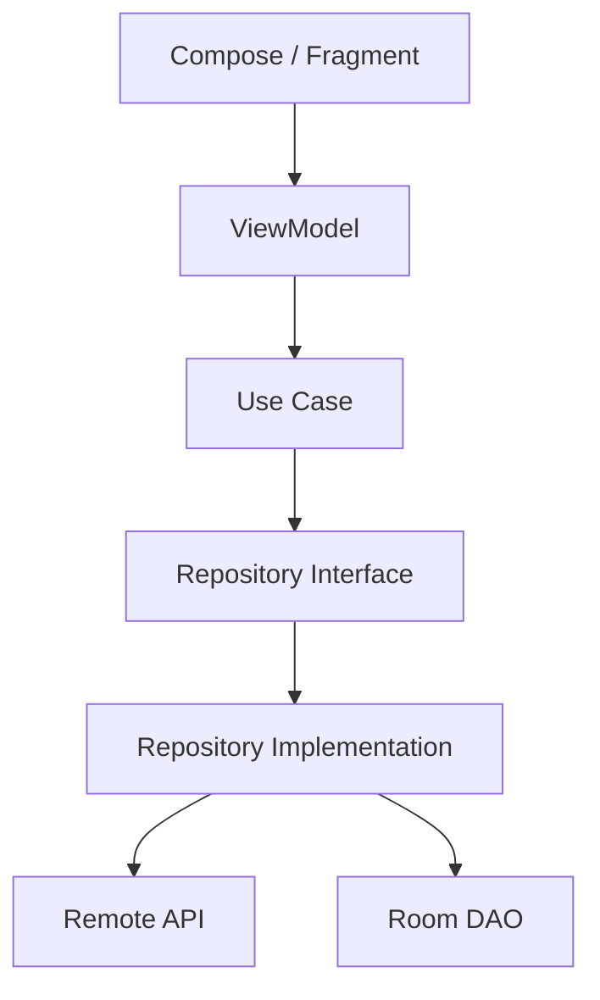

Koin **không phải một layer mới** nằm giữa `ViewModel` và `Repository`.

Vai trò của nó là **Composition Root**: nơi quyết định implementation nào được dùng để tạo object graph.

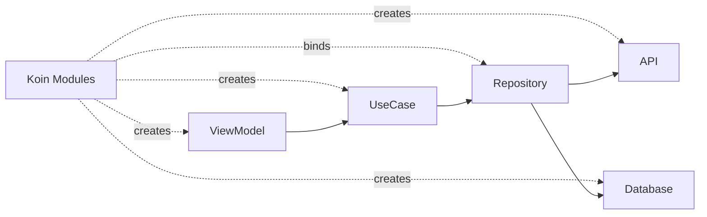

Koin module tổ chức các definition và Koin có thể resolve dependency xuyên qua các module đã được load. ([Insert Koin][3])

---

# 3. Mục tiêu học tập

Sau bài này, bạn nên:

* Giải thích được **Koin là gì** và tại sao Android app cần DI.
* Phân biệt được `single`, `factory`, `viewModel` và `scoped`.
* Biết khai báo **Koin Module**.
* Khởi tạo Koin trong Android `Application`.
* Inject Repository, UseCase và ViewModel.
* Sử dụng Koin với Jetpack Compose.
* Hiểu mối quan hệ giữa **dependency scope và Android lifecycle**.
* Không biến Koin thành một Service Locator nằm rải rác trong business logic.
* Thay implementation thật bằng Fake khi test.
* Biết kiểm tra dependency graph trước khi release.
* Hiểu khi nào nên cân nhắc Koin và khi nào Hilt có thể phù hợp hơn.

---

# 4. Koin là gì?

Có thể hiểu ngắn gọn:

> **Koin là container chịu trách nhiệm tạo, lưu giữ và cung cấp dependency cho ứng dụng Kotlin dựa trên các definition mà developer khai báo.**

Tài liệu Koin hiện hành hỗ trợ cả Kotlin DSL, annotations và tooling/compiler hướng tới kiểm tra dependency an toàn hơn. Vì vậy, mô tả cũ rằng Koin chỉ đơn thuần là một DI container "runtime-only" không còn phản ánh đầy đủ hệ sinh thái Koin hiện tại. ([Insert Koin][1])

Tại thời điểm tháng 8/2026, nhánh phát hành mới nhất của project chính là **Koin 4.2.2**. ([GitHub][4])

---

# 5. Vấn đề Koin giải quyết

Giả sử có:

```kotlin
class UserApi

class UserRepository(
    private val api: UserApi
)

class GetUserUseCase(
    private val repository: UserRepository
)

class UserViewModel(
    private val getUser: GetUserUseCase
)
```

Muốn tạo `UserViewModel`, ta phải tạo:

```text
UserApi
   ↓
UserRepository
   ↓
GetUserUseCase
   ↓
UserViewModel
```

Nếu làm thủ công:

```kotlin
val api = UserApi()

val repository = UserRepository(api)

val getUserUseCase = GetUserUseCase(repository)

val viewModel = UserViewModel(getUserUseCase)
```

Với ứng dụng nhỏ, đây không phải vấn đề.

Nhưng một app lớn có thể có:

```text
100+ ViewModels
      │
      ├── UseCases
      │
      ├── Repositories
      │
      ├── Retrofit services
      │
      ├── Room database
      │
      ├── DataStore
      │
      ├── Analytics
      │
      └── Authentication
```

Lúc này cần một cơ chế quản lý **object graph**.

---

# 6. Ba thành phần nên nhớ trong Koin

## 6.1. Definition

Definition mô tả:

> "Nếu cần object loại này thì tạo nó như thế nào?"

Ví dụ:

```kotlin
single {
    UserRepository(
        api = get()
    )
}
```

Koin cung cấp nhiều loại definition; quan trọng nhất với Android là singleton, factory, scoped và ViewModel. ([Insert Koin][5])

---

## 6.2. Module

Module là nơi gom nhiều definition:

```kotlin
val appModule = module {

    single {
        UserApi()
    }

    single {
        UserRepository(
            api = get()
        )
    }
}
```

Có thể chia thành:

```text
modules/
├── networkModule
├── databaseModule
├── repositoryModule
├── domainModule
└── viewModelModule
```

Thay vì:

```text
oneHugeAppModule.kt
```

---

## 6.3. Koin container

Sau khi load module:

```kotlin
startKoin {
    modules(appModule)
}
```

Koin biết cách xây dựng dependency graph.

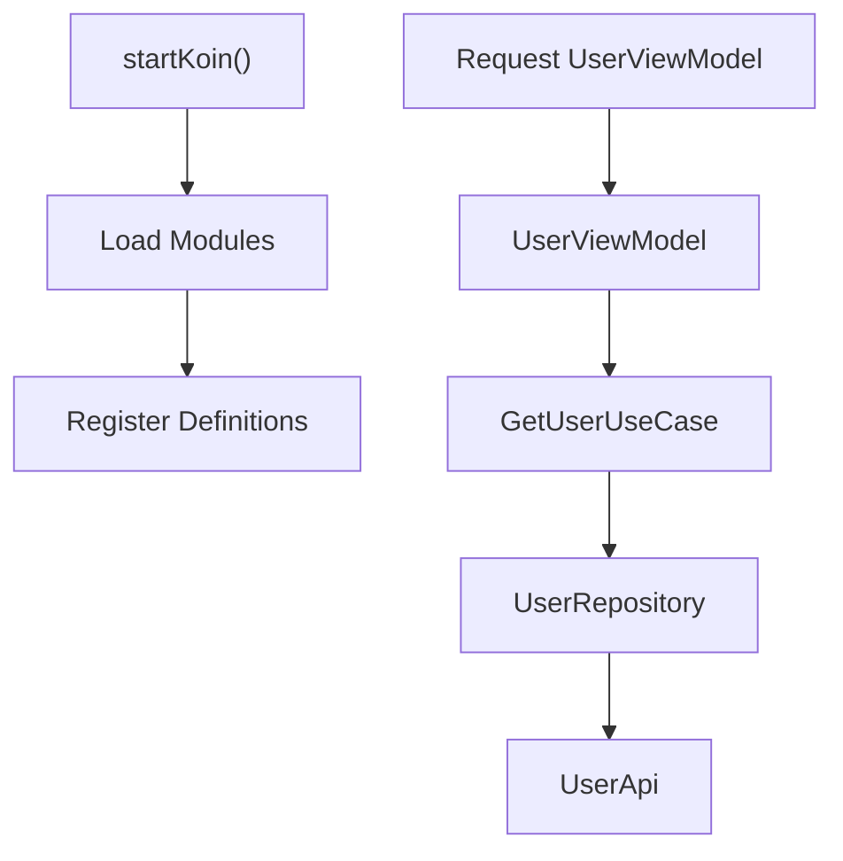

---

# 7. Cài đặt Koin

Tài liệu Koin hiện khuyến nghị sử dụng **Koin BOM** để các package Koin trong cùng project có version tương thích. ([Insert Koin][6])

Ví dụ:

```kotlin
dependencies {

    implementation(
        platform("io.insert-koin:koin-bom:4.2.2")
    )

    implementation(
        "io.insert-koin:koin-android"
    )
}
```

Nếu sử dụng Jetpack Compose:

```kotlin
dependencies {

    implementation(
        platform("io.insert-koin:koin-bom:4.2.2")
    )

    implementation(
        "io.insert-koin:koin-android"
    )

    implementation(
        "io.insert-koin:koin-androidx-compose"
    )
}
```

BOM cho phép các thư viện Koin phía dưới không phải lặp lại version. ([Insert Koin][6])

---

# 8. Khởi tạo Koin trong Android

Thông thường có thể khởi tạo trong `Application`.

```kotlin
class MyApplication : Application() {

    override fun onCreate() {
        super.onCreate()

        startKoin {

            androidContext(this@MyApplication)

            modules(
                networkModule,
                repositoryModule,
                domainModule,
                viewModelModule
            )
        }
    }
}
```

Đừng quên:

```xml
<application
    android:name=".MyApplication"
    ...>
</application>
```

Đây vẫn là một trong những cách tích hợp Android cơ bản được tài liệu Koin hướng dẫn. Koin cũng hỗ trợ tích hợp AndroidX Startup thông qua package riêng nếu kiến trúc ứng dụng cần. ([Insert Koin][7])

---

# 9. `single` — một instance dùng chung

```kotlin
val networkModule = module {

    single {
        Retrofit.Builder()
            .baseUrl(BASE_URL)
            .build()
    }
}
```

`single` phù hợp với object muốn tồn tại lâu và được dùng chung.

Ví dụ thường gặp:

```text
Retrofit
OkHttpClient
RoomDatabase
DataStore
Repository
Analytics
```

Về mặt scope, Koin mô tả `single` có lifecycle tương ứng với application/Koin container. ([Insert Koin][8])

---

# 10. `factory` — tạo instance mới

```kotlin
factory {
    ValidateEmailUseCase()
}
```

Mỗi lần dependency được resolve, factory có thể tạo instance tương ứng thay vì duy trì một singleton toàn cục. ([Insert Koin][8])

Có thể hình dung:

```text
single

get() ─┐
get() ─┼──> Object A
get() ─┘
```

Trong khi:

```text
factory

get() ──> Object A

get() ──> Object B

get() ──> Object C
```

---

# 11. `viewModel`

Đối với Android:

```kotlin
val viewModelModule = module {

    viewModel {
        UserViewModel(
            repository = get()
        )
    }
}
```

Hoặc constructor DSL:

```kotlin
val viewModelModule = module {

    viewModelOf(::UserViewModel)
}
```

Koin có hỗ trợ chuyên biệt cho AndroidX `ViewModel` và lifecycle của nó. ([Insert Koin][9])

---

# 12. Ví dụ hoàn chỉnh: Repository Pattern + Koin

Giả sử xây màn hình:

```text
UsersScreen
```

Yêu cầu:

```text
UsersScreen
    ↓
UsersViewModel
    ↓
GetUsersUseCase
    ↓
UserRepository
    ↓
UserRepositoryImpl
    ↓
UserApi
```

---

## 12.1. API

```kotlin
interface UserApi {

    suspend fun getUsers(): List<UserDto>
}
```

---

## 12.2. Repository interface

```kotlin
interface UserRepository {

    suspend fun getUsers(): List<User>
}
```

---

## 12.3. Repository implementation

```kotlin
class UserRepositoryImpl(
    private val api: UserApi
) : UserRepository {

    override suspend fun getUsers(): List<User> {

        return api
            .getUsers()
            .map { dto ->
                User(
                    id = dto.id,
                    name = dto.name
                )
            }
    }
}
```

Điểm quan trọng:

```text
RepositoryImpl cần UserApi
```

nên dependency được thể hiện ngay trong constructor:

```kotlin
class UserRepositoryImpl(
    private val api: UserApi
)
```

---

# 13. Khai báo network module

```kotlin
val networkModule = module {

    single {

        Retrofit.Builder()
            .baseUrl(BASE_URL)
            .addConverterFactory(
                GsonConverterFactory.create()
            )
            .build()
    }

    single<UserApi> {

        get<Retrofit>()
            .create(UserApi::class.java)
    }
}
```

Graph:

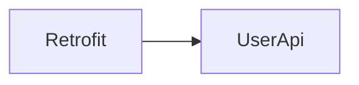

---

# 14. Repository module

```kotlin
val repositoryModule = module {

    single<UserRepository> {

        UserRepositoryImpl(
            api = get()
        )
    }
}
```

Koin hiểu:

```text
UserRepository
      ↓ bind
UserRepositoryImpl
      ↓
UserApi
```

---

# 15. Domain module

```kotlin
class GetUsersUseCase(
    private val repository: UserRepository
) {

    suspend operator fun invoke(): List<User> {
        return repository.getUsers()
    }
}
```

Module:

```kotlin
val domainModule = module {

    factory {
        GetUsersUseCase(
            repository = get()
        )
    }
}
```

---

# 16. ViewModel

```kotlin
class UsersViewModel(
    private val getUsers: GetUsersUseCase
) : ViewModel() {

    private val _state =
        MutableStateFlow(UsersUiState())

    val state =
        _state.asStateFlow()

    fun loadUsers() {

        viewModelScope.launch {

            _state.update {
                it.copy(
                    loading = true
                )
            }

            runCatching {
                getUsers()
            }.onSuccess { users ->

                _state.update {
                    it.copy(
                        loading = false,
                        users = users
                    )
                }

            }.onFailure { error ->

                _state.update {
                    it.copy(
                        loading = false,
                        error = error.message
                    )
                }
            }
        }
    }
}
```

Koin module:

```kotlin
val viewModelModule = module {

    viewModel {
        UsersViewModel(
            getUsers = get()
        )
    }
}
```

---

# 17. Object graph cuối cùng

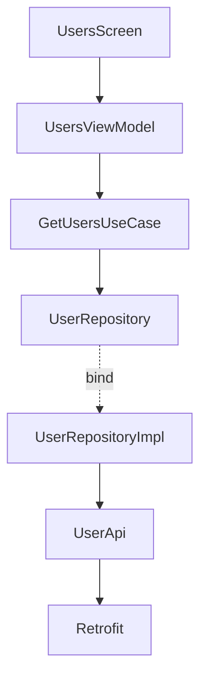

Koin chịu trách nhiệm:

```text
UsersViewModel
      │
      ▼
GetUsersUseCase
      │
      ▼
UserRepository
      │
      ▼
UserRepositoryImpl
      │
      ▼
UserApi
      │
      ▼
Retrofit
```

UI không cần biết `Retrofit` tồn tại.

---

# 18. Koin với Jetpack Compose

Trong Compose có thể lấy ViewModel bằng:

```kotlin
@Composable
fun UsersRoute(
    viewModel: UsersViewModel = koinViewModel()
) {

    val state by viewModel.state.collectAsStateWithLifecycle()

    UsersScreen(
        state = state,
        onRefresh = viewModel::loadUsers
    )
}
```

Koin cung cấp `koinViewModel()` dành cho việc retrieve ViewModel trong Compose và liên kết với lifecycle thích hợp. ([Insert Koin][10])

Architecture vẫn nên là:

```text
Composable
    ↓
ViewModel
    ↓
UseCase
    ↓
Repository
```

chứ không phải:

```text
Composable
    ↓
Retrofit
```

---

# 19. Inject dependency trực tiếp

Koin cũng có thể retrieve object trực tiếp.

Ví dụ trong Activity:

```kotlin
class MainActivity : AppCompatActivity() {

    private val analytics: Analytics by inject()
}
```

Các entry point Android có thể sử dụng những API như `by inject()`, `get()` hoặc API ViewModel tương ứng. ([Insert Koin][11])

Tuy nhiên, cần phân biệt:

## Có thể chấp nhận

```kotlin
class MainActivity : AppCompatActivity() {

    private val navigator: Navigator by inject()
}
```

## Không nên lạm dụng

```kotlin
class PaymentUseCase {

    fun execute() {

        val repository =
            GlobalContext
                .get()
                .get<PaymentRepository>()
    }
}
```

Vì dependency của `PaymentUseCase` đã trở nên **ẩn**.

Nên viết:

```kotlin
class PaymentUseCase(
    private val repository: PaymentRepository
)
```

Đây mới là constructor injection rõ ràng.

---

# 20. Constructor Injection vs Service Locator

Đây là phần rất quan trọng khi học Koin.

### Constructor Injection

```kotlin
class CheckoutViewModel(
    private val checkout: CheckoutUseCase
)
```

Nhìn class là biết ngay:

```text
CheckoutViewModel
requires
CheckoutUseCase
```

### Hidden lookup

```kotlin
class CheckoutViewModel {

    private val checkout =
        getKoin().get<CheckoutUseCase>()
}
```

Dependency đã bị giấu trong implementation.

Khi test hoặc đọc code, developer phải tìm sâu vào class mới biết nó cần gì.

---

## Nguyên tắc nên áp dụng

```text
Koin
  │
  │ build graph
  ▼
Constructor Injection
  │
  ▼
Application classes
```

Không nên:

```text
Business class
     │
     ▼
"Give me global Koin"
     │
     ▼
get()
```

---

# 21. Lifecycle và Scope

Lifecycle là một trong những vấn đề quan trọng nhất của DI trên Android.

Koin có các dạng lifecycle chính như: singleton theo app/container, factory theo request và scoped theo một scope cụ thể. Android integration bổ sung các scope gắn với Activity/Fragment và các lifecycle Android liên quan. ([Insert Koin][8])

```text
Application
│
├── singleton
│
│   Retrofit
│   Database
│   Repository
│
├── Activity
│   └── scoped objects
│
└── ViewModel
    └── UI state/business coordinator
```

---

# 22. Vì sao scope sai có thể gây leak?

Ví dụ:

```kotlin
single {
    SomeManager(
        context = get<Activity>()
    )
}
```

Ta đang cố giữ:

```text
Application lifetime object
        ↓
Activity
```

Activity có thể bị destroy khi:

```text
rotate
navigate
finish
```

nhưng singleton vẫn tồn tại.

Kết quả có nguy cơ:

```text
Singleton
   ↓
Old Activity
   ↓
View hierarchy
```

→ giữ object lâu hơn lifecycle cần thiết.

Koin cung cấp Android scopes nhằm giúp lifecycle dependency tương ứng với lifecycle Android. ([Insert Koin][12])

---

# 23. Một lưu ý đặc biệt với ViewModel

ViewModel thường sống lâu hơn `Activity`/`Fragment` instance trong các configuration change.

Vì vậy không nên thiết kế:

```text
ViewModel
   ↓
Activity scoped object
```

một cách tùy tiện.

Tài liệu Koin hiện lưu ý ViewModel mặc định được tạo từ root scope và không trực tiếp truy cập Activity/Fragment scoped dependency; điều này giúp tránh quan hệ lifecycle không an toàn. ([Insert Koin][9])

Thiết kế tốt thường là:

```text
ViewModel
   ↓
UseCase
   ↓
Repository
```

chứ không phải:

```text
ViewModel
   ↓
Activity
```

---

# 24. Koin và UI State

Koin **không quản lý UI state thay cho ViewModel**.

Vai trò nên được tách:

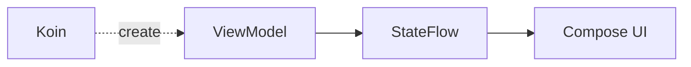

Koin:

```text
creates dependency
```

ViewModel:

```text
owns UI state
```

Compose:

```text
renders UI state
```

---

# 25. Rotate màn hình

Giả sử:

```text
Activity
 └── UsersScreen
      └── UsersViewModel
```

Rotate:

```text
Old Activity
      ↓ destroyed

UsersViewModel
      ↓ retained

New Activity
      ↓

same ViewModel state
```

Việc ViewModel sống qua configuration change là behavior của AndroidX ViewModel; Koin cung cấp integration để resolve loại component này theo lifecycle thích hợp. ([Insert Koin][9])

---

# 26. Testing — lợi ích lớn nhất của DI

Giả sử:

```kotlin
interface UserRepository {

    suspend fun getUsers(): List<User>
}
```

Production:

```kotlin
class UserRepositoryImpl(
    private val api: UserApi
) : UserRepository
```

Test:

```kotlin
class FakeUserRepository : UserRepository {

    override suspend fun getUsers(): List<User> {

        return listOf(
            User(
                id = 1,
                name = "An"
            )
        )
    }
}
```

Test ViewModel không cần Retrofit:

```kotlin
@Test
fun loadUsers_updatesState() = runTest {

    val repository =
        FakeUserRepository()

    val useCase =
        GetUsersUseCase(repository)

    val viewModel =
        UsersViewModel(useCase)

    viewModel.loadUsers()

    // assert state
}
```

Dependency graph khi production:

```text
ViewModel
   ↓
UseCase
   ↓
RealRepository
   ↓
Real API
```

Trong test:

```text
ViewModel
   ↓
UseCase
   ↓
FakeRepository
```

**Business class không thay đổi.**

Đây chính là giá trị của dependency inversion và DI.

---

# 27. Có cần Koin trong unit test không?

Không nhất thiết.

Đối với unit test nhỏ:

```kotlin
val viewModel =
    UsersViewModel(
        FakeGetUsersUseCase()
    )
```

thường đơn giản và rõ ràng hơn việc khởi động cả DI container.

Koin Test hữu ích hơn khi muốn kiểm tra:

```text
module configuration
integration wiring
dependency replacement
```

Koin cung cấp các API test để inject hoặc thay definition trong test. ([Insert Koin][13])

---

# 28. Kiểm tra dependency graph

Một lỗi nguy hiểm:

```kotlin
viewModel {
    ProfileViewModel(
        get()
    )
}
```

nhưng quên khai báo:

```kotlin
ProfileRepository
```

Dependency graph:

```text
ProfileViewModel
       ↓
ProfileRepository
       ↓
      ???
```

Nếu không kiểm tra trước, lỗi có thể chỉ xuất hiện khi flow đó được chạy.

---

## Runtime verification

Nếu không sử dụng compiler plugin, tài liệu Koin vẫn hướng dẫn có thể chạy verification test:

```kotlin
@Test
fun verifyModules() {

    appModule.verify()
}
```

để kiểm tra definition không resolve được. ([Insert Koin][14])

---

## Koin Compiler Plugin

Tooling mới hơn của Koin cho phép thực hiện dependency validation ở compile time và tài liệu hiện khuyến nghị compiler plugin cùng BOM cho setup hiện đại. ([Insert Koin][15])

---

## Không nên dùng tutorial cũ với `checkModules()`

Nếu gặp tutorial:

```kotlin
checkModules()
```

cần chú ý API này đã được Koin đánh dấu **deprecated từ Koin 4.0**. ([Insert Koin][16])

Ưu tiên:

```text
Compiler validation
```

hoặc:

```kotlin
module.verify()
```

tùy setup project. ([Insert Koin][17])

---

# 29. Module organization cho app thực tế

Không nên:

```kotlin
val appModule = module {

    // 500 lines

}
```

Nên:

```text
di/
├── NetworkModule.kt
├── DatabaseModule.kt
├── RepositoryModule.kt
├── DomainModule.kt
└── ViewModelModule.kt
```

Ví dụ:

```kotlin
val networkModule = module {
    ...
}
```

```kotlin
val databaseModule = module {
    ...
}
```

```kotlin
val repositoryModule = module {
    ...
}
```

```kotlin
val domainModule = module {
    ...
}
```

```kotlin
val viewModelModule = module {
    ...
}
```

Và:

```kotlin
startKoin {

    modules(
        networkModule,
        databaseModule,
        repositoryModule,
        domainModule,
        viewModelModule
    )
}
```

Module chính là building block để tổ chức cấu hình DI trong Koin. ([Insert Koin][3])

---

# 30. Multi-module project

App lớn có thể tổ chức:

```text
app/
│
├── feature-home/
│   └── HomeModule
│
├── feature-profile/
│   └── ProfileModule
│
├── feature-payment/
│   └── PaymentModule
│
├── core-network/
│   └── NetworkModule
│
├── core-database/
│   └── DatabaseModule
│
└── core-data/
    └── RepositoryModule
```

Dependency direction:

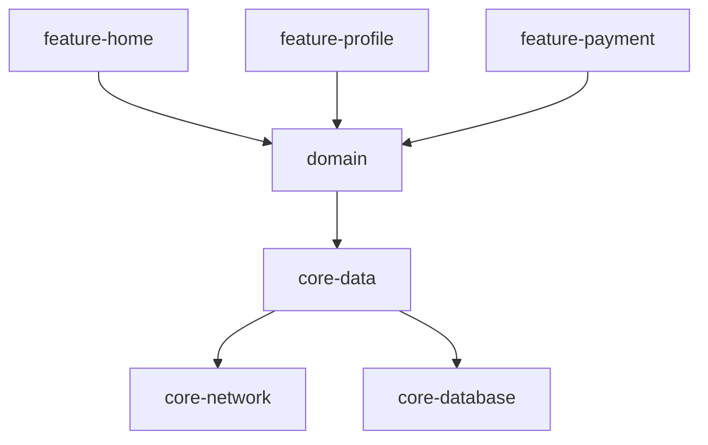

Koin wiring nằm ở ngoài các business rules thay vì biến Koin thành dependency trực tiếp của domain.

---

# 31. Koin không thay thế Clean Architecture

Sai:

```text
Koin = Architecture
```

Đúng:

```text
Clean Architecture
        +
Dependency Injection
        +
Koin
```

Koin chỉ giải bài toán:

```text
Ai tạo object?
Ai cung cấp dependency?
Object sống bao lâu?
Implementation nào được bind?
```

Nó không quyết định:

```text
business rules
UI state model
navigation
repository contract
domain boundaries
```

---

# 32. Koin vs Manual DI

### Manual DI

```kotlin
val api = UserApi()

val repository =
    UserRepositoryImpl(api)

val useCase =
    GetUsersUseCase(repository)

val viewModel =
    UsersViewModel(useCase)
```

Ưu điểm:

```text
Rất rõ
Không framework
Compile-time tự nhiên
```

Nhược điểm:

```text
Boilerplate tăng nhanh
Object graph lớn khó quản lý
Lifecycle wiring thủ công
```

Google cũng có tài liệu riêng về manual dependency injection, đặc biệt thông qua container tự quản lý trong app. ([Android Developers][18])

---

# 33. Koin vs Hilt

Đây là câu hỏi thường gặp nhất.

| Tiêu chí                        | Koin                            | Hilt                      |
| ------------------------------- | ------------------------------- | ------------------------- |
| Hệ sinh thái                    | Kotlin/KMP                      | Android                   |
| Cấu hình                        | Kotlin DSL / annotation/tooling | Annotation                |
| Android integration             | Có                              | Rất sâu                   |
| Compose                         | Có                              | Có                        |
| Multiplatform                   | Mạnh                            | Không phải mục tiêu chính |
| Object graph                    | Koin container                  | Dagger graph              |
| Learning curve                  | Thường dễ tiếp cận              | Nhiều concept hơn         |
| Official Android recommendation | Third-party                     | **Hilt**                  |

Google hiện vẫn mô tả Hilt là thư viện DI được khuyến nghị chính thức cho Android và Hilt được xây trên Dagger. ([Android Developers][19])

Điều này **không có nghĩa Koin là sai**.

Koin đặc biệt đáng cân nhắc khi:

```text
Kotlin-heavy project
Kotlin Multiplatform
Muốn DSL đơn giản
Team đã quen Koin
Architecture nhỏ/vừa
```

Hilt thường hấp dẫn hơn khi:

```text
Android-only
Google/Jetpack ecosystem
Team đã dùng Dagger
Muốn convention chuẩn hóa Android
```

---

# 34. Koin hiện đại và "runtime DI"

Một câu thường thấy trong tài liệu cũ:

> "Koin chỉ resolve dependency runtime nên mọi lỗi graph đều phải chờ app chạy."

Điều này cần cập nhật.

Koin hiện có compiler tooling hỗ trợ dependency validation ở build/compile time. Koin documentation hiện thậm chí hướng dẫn compiler plugin thay cho `verify()`/`checkModules()` trong setup sử dụng tính năng đó. ([Insert Koin][20])

Vì vậy nên phân biệt:

```text
Classic Koin DSL
      │
      └── runtime container

Koin tooling/compiler
      │
      └── compile-time validation
```

---

# 35. Sai lầm 1 — inject mọi thứ

Không cần:

```kotlin
single {
    UserMapper()
}
```

nếu class chỉ là:

```kotlin
object UserMapper
```

hoặc:

```kotlin
fun UserDto.toDomain(): User
```

DI nên giải quyết **dependency**, không phải biến mọi object thành service.

---

# 36. Sai lầm 2 — sử dụng `single` cho mọi class

Sai tư duy:

```text
Không biết lifecycle gì
        ↓
     single
```

Hãy hỏi:

```text
Object cần sống bao lâu?
```

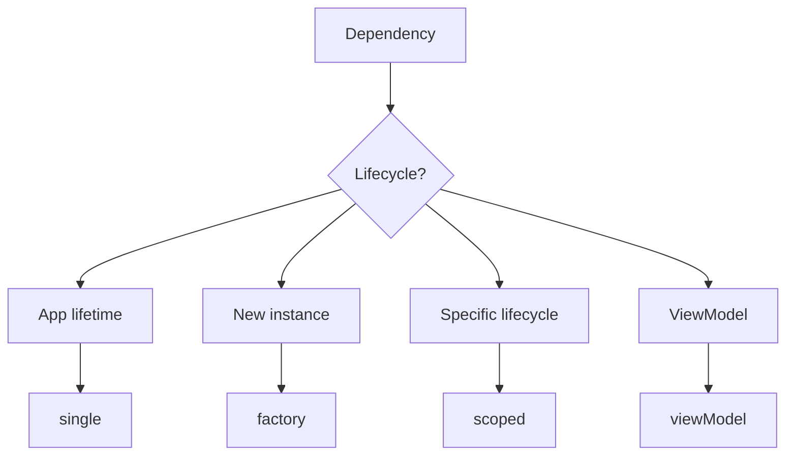

---

# 37. Sai lầm 3 — inject Android Context vào domain

Không nên:

```kotlin
class CalculatePriceUseCase(
    private val context: Context
)
```

Domain logic sẽ phụ thuộc Android framework.

Tốt hơn:

```kotlin
class CalculatePriceUseCase(
    private val taxRepository: TaxRepository
)
```

Nếu cần resource:

```text
Android resource
      ↓
Adapter/interface
      ↓
Domain
```

---

# 38. Sai lầm 4 — Repository phụ thuộc UI

Sai:

```text
Repository
   ↓
Activity
```

hoặc:

```text
Repository
   ↓
Composable
```

Dependency direction tốt hơn:

```text
UI
 ↓
ViewModel
 ↓
Domain
 ↓
Repository interface
 ↓
Data implementation
```

---

# 39. Sai lầm 5 — business logic gọi Koin trực tiếp

Không nên:

```kotlin
class LoginUseCase {

    private val repository =
        getKoin()
            .get<AuthRepository>()
}
```

Nên:

```kotlin
class LoginUseCase(
    private val repository: AuthRepository
)
```

Sau đó Koin:

```kotlin
factory {
    LoginUseCase(
        repository = get()
    )
}
```

Koin wiring chỉ tồn tại ở nơi composition.

---

# 40. Debugging Koin

Khi DI fail, kiểm tra theo thứ tự:

```text
1. Definition đã tồn tại?
       ↓
2. Module đã được load?
       ↓
3. Type/interface bind đúng?
       ↓
4. Qualifier đúng?
       ↓
5. Scope đúng?
       ↓
6. Lifecycle đúng?
       ↓
7. Dependency graph có thiếu node?
```

Ví dụ:

```text
UsersViewModel
      ↓
GetUsersUseCase
      ↓
UserRepository
      ↓
???
```

thì không nên chỉ nhìn dòng:

```kotlin
koinViewModel()
```

Mà phải lần ngược dependency graph.

Koin cũng khuyến nghị verification/compiler validation để phát hiện cấu hình dependency bị thiếu sớm hơn. ([Insert Koin][21])

---

# 41. Tác động tới UX

Koin là architecture infrastructure nên user không trực tiếp thấy:

```text
"Koin"
```

nhưng họ chịu ảnh hưởng của các quyết định DI.

Ví dụ:

```text
DI sai
 ↓
Repository không tạo được
 ↓
ViewModel crash
 ↓
Screen không mở
 ↓
UX thất bại
```

Hoặc:

```text
Sai lifecycle
 ↓
State/service bị tạo lại
 ↓
Network request chạy lại
 ↓
Loading lặp
 ↓
UX kém
```

---

# 42. Tác động tới maintainability

Không DI:

```text
Screen
 ↓
new Retrofit
 ↓
new Repository
 ↓
new Database
```

Coupling cao.

Có DI đúng:

```text
Screen
 ↓
ViewModel
 ↓
Repository interface
```

Implementation nằm ngoài:

```text
Koin Module
 ↓
UserRepository
 =
UserRepositoryImpl
```

Thay implementation dễ hơn.

---

# 43. Tác động tới testing

Không DI:

```text
ViewModel
 ↓
RealRepository
 ↓
Retrofit
```

Test ViewModel phải đụng network.

Có DI:

```text
ViewModel
 ↓
FakeRepository
```

Test:

```text
fast
deterministic
offline
```

---

# 44. Tác động tới performance

DI framework không nên được dùng như lý do để bỏ qua profiling.

Các dependency lớn như:

```text
Database
HTTP clients
ML models
Caches
SDK initialization
```

cần cân nhắc:

```text
Khi nào tạo?
Có cần singleton?
Có cần lazy init?
Có chặn startup?
```

Koin hiện cũng có các API và tooling cho startup/module loading; tuy nhiên optimization phải dựa trên profile thực tế của app thay vì giả định framework tự giải quyết mọi vấn đề. ([Insert Koin][22])

---

# 45. Production checklist

Trước release, hãy kiểm tra:

* [ ] Koin được start đúng một lần.
* [ ] Tất cả module cần thiết đã được load.
* [ ] Dependency graph được compiler/verification kiểm tra.
* [ ] Repository được bind qua interface hợp lý.
* [ ] ViewModel không giữ `Activity`/`View`.
* [ ] Singleton không giữ lifecycle object ngắn hơn.
* [ ] Không truy cập Koin global bên trong domain layer.
* [ ] Network/Database dependency có lifecycle phù hợp.
* [ ] UI state vẫn nằm trong ViewModel/state holder.
* [ ] Rotate màn hình không làm mất state không mong muốn.
* [ ] Background/foreground không tạo duplicate request.
* [ ] Fake implementation có thể thay dependency production.
* [ ] Dependency creation error được test trước release.
* [ ] Startup performance đã được profile nếu graph lớn.

---

# 46. Thực hành

## Bài thực hành: Refactor một màn hình Users

Ban đầu:

```kotlin
class UsersViewModel : ViewModel() {

    private val retrofit =
        Retrofit.Builder()
            // ...
            .build()

    private val api =
        retrofit.create(UserApi::class.java)

    private val repository =
        UserRepositoryImpl(api)
}
```

---

## Bước 1 — tạo interface

```kotlin
interface UserRepository {

    suspend fun getUsers(): List<User>
}
```

---

## Bước 2 — implementation

```kotlin
class UserRepositoryImpl(
    private val api: UserApi
) : UserRepository
```

---

## Bước 3 — constructor injection

```kotlin
class UsersViewModel(
    private val repository: UserRepository
) : ViewModel()
```

---

## Bước 4 — Koin module

```kotlin
val usersModule = module {

    single<UserRepository> {

        UserRepositoryImpl(
            api = get()
        )
    }

    viewModel {

        UsersViewModel(
            repository = get()
        )
    }
}
```

---

## Bước 5 — Fake

```kotlin
class FakeUserRepository : UserRepository {

    override suspend fun getUsers(): List<User> {

        return listOf(
            User(
                id = 1,
                name = "Test User"
            )
        )
    }
}
```

---

# 47. Sơ đồ trước và sau refactor

## Trước

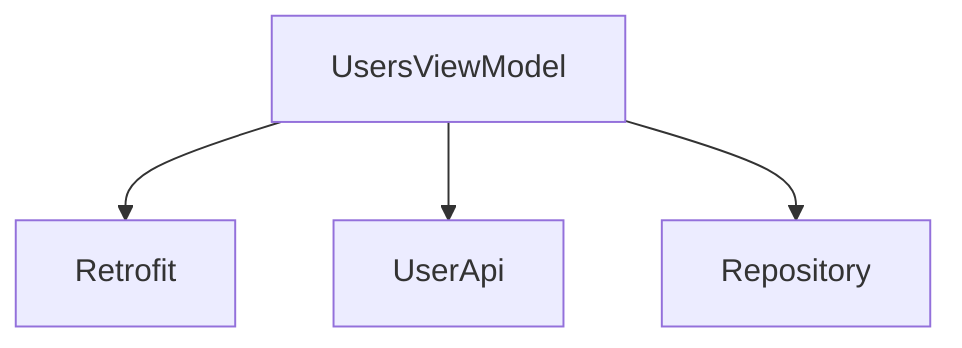

ViewModel biết quá nhiều.

---

## Sau

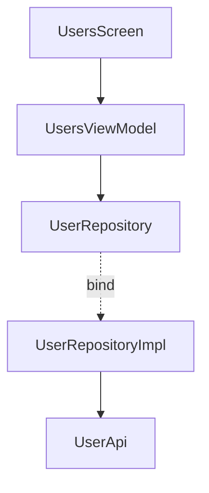

ViewModel chỉ biết abstraction cần thiết.

---

# 48. Artifact nên đưa vào portfolio

Tạo repository:

```text
android-koin-clean-architecture/
```

Cấu trúc:

```text
app/
├── ui/
│   └── users/
│       ├── UsersScreen.kt
│       ├── UsersUiState.kt
│       └── UsersViewModel.kt
│
├── domain/
│   ├── repository/
│   │   └── UserRepository.kt
│   │
│   └── usecase/
│       └── GetUsersUseCase.kt
│
├── data/
│   ├── remote/
│   │   └── UserApi.kt
│   │
│   └── repository/
│       └── UserRepositoryImpl.kt
│
└── di/
    ├── NetworkModule.kt
    ├── RepositoryModule.kt
    ├── DomainModule.kt
    └── ViewModelModule.kt
```

README nên có:

```text
Architecture
Dependency Graph
Koin Modules
Lifecycle
Fake Repository
Testing Strategy
Screenshots
```

---

# 49. README diagram cho portfolio

Có thể đặt sơ đồ sau vào README:

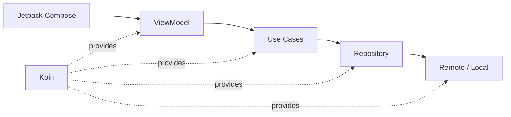

Sơ đồ này thể hiện đúng ý:

> **Koin tạo và nối object, nhưng dependency direction của architecture vẫn do chúng ta thiết kế.**

---

# 50. Bài tập

## Bài 1 — Dependency direction

Vẽ graph:

```text
ProfileScreen
ProfileViewModel
GetProfileUseCase
ProfileRepository
ProfileRepositoryImpl
ProfileApi
Room
```

Xác định:

```text
Ai phụ thuộc ai?
Koin tạo object nào?
Object nào nên single?
Object nào nên ViewModel?
```

---

## Bài 2 — Fake Repository

Tạo:

```kotlin
FakeProfileRepository
```

với dữ liệu:

```text
Name: Alex
Age: 25
```

Test:

```text
ProfileViewModel
```

không sử dụng network.

---

## Bài 3 — Detect bad architecture

Phân tích đoạn:

```kotlin
class PaymentViewModel : ViewModel() {

    private val context =
        getKoin().get<Context>()

    private val retrofit =
        getKoin().get<Retrofit>()

    private val database =
        getKoin().get<AppDatabase>()

    private val repository =
        getKoin().get<PaymentRepository>()
}
```

Liệt kê vấn đề.

Gợi ý:

```text
hidden dependencies
service locator style
ViewModel biết data infrastructure
khó test
coupling cao
```

---

# 51. Checklist hoàn thành

## Kiến thức

* [ ] Giải thích được Koin là gì.
* [ ] Hiểu dependency injection.
* [ ] Hiểu constructor injection.
* [ ] Hiểu object graph.
* [ ] Hiểu Koin module.
* [ ] Hiểu composition root.

## API

* [ ] Biết `module`.
* [ ] Biết `single`.
* [ ] Biết `factory`.
* [ ] Biết `viewModel`.
* [ ] Biết `get()`.
* [ ] Biết `by inject()`.
* [ ] Biết `koinViewModel()`.

## Architecture

* [ ] UI không truy cập API trực tiếp.
* [ ] ViewModel không tạo Repository trực tiếp.
* [ ] Domain không phụ thuộc Android framework không cần thiết.
* [ ] Repository được inject qua constructor.
* [ ] Koin không bị dùng như global service locator.

## Lifecycle

* [ ] Phân biệt `single` và `factory`.
* [ ] Biết khi nào cần scope.
* [ ] ViewModel không giữ Activity.
* [ ] Singleton không giữ View/Activity.
* [ ] Rotate không phá state ngoài ý muốn.

## Testing

* [ ] Có Fake Repository.
* [ ] Unit test chạy không cần Retrofit.
* [ ] Dependency graph được verification/compiler kiểm tra.
* [ ] Không còn dùng `checkModules()` trong code mới nếu theo Koin hiện hành. ([Insert Koin][16])

## Portfolio

* [ ] Có dependency diagram.
* [ ] Có README.
* [ ] Có screenshot.
* [ ] Có unit test.
* [ ] Có cấu trúc package rõ ràng.

---

# 52. Ghi chú production

Khi đưa Koin vào production, đừng chỉ hỏi:

```text
"Dependency có inject được không?"
```

Hãy hỏi:

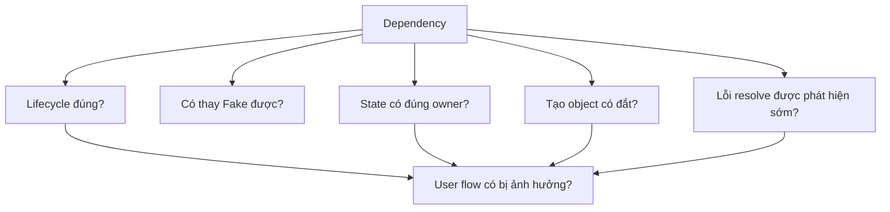

Một dependency graph tốt phải vừa:

```text
correct
+
testable
+
lifecycle-safe
+
maintainable
+
observable
```

---

# 53. Câu hỏi tự kiểm tra

1. Koin giải quyết vấn đề gì?
2. Koin có phải một architecture pattern không?
3. `single` khác `factory` như thế nào?
4. Vì sao Repository nên được inject qua constructor?
5. Vì sao không nên gọi `getKoin().get()` khắp domain layer?
6. ViewModel nên phụ thuộc Activity không?
7. Vì sao singleton giữ Activity có thể gây memory leak?
8. `koinViewModel()` có vai trò gì trong Compose?
9. Fake Repository giúp test như thế nào?
10. Koin module nên nằm ở đâu?
11. Vì sao Koin không quản lý UI State?
12. Tại sao tutorial dùng `checkModules()` có thể đã lỗi thời?
13. Koin và Hilt khác nhau về hướng tiếp cận nào?
14. Dependency Injection ảnh hưởng UX như thế nào?
15. Khi nào manual DI đủ tốt mà chưa cần framework?

---

# 54. Cheat Sheet

```text
KOIN
│
├── module
│     └── group dependency definitions
│
├── single
│     └── shared instance
│
├── factory
│     └── new instance
│
├── scoped
│     └── instance tied to scope
│
├── viewModel
│     └── AndroidX ViewModel definition
│
├── get()
│     └── resolve dependency
│
└── koinViewModel()
      └── obtain ViewModel in Compose
```

Architecture:

```text
Compose
   ↓
ViewModel
   ↓
UseCase
   ↓
Repository Interface
   ↓
Repository Implementation
   ↓
API / DAO
```

Koin:

```text
           Koin
        ↙   ↓   ↘
 ViewModel UseCase Repository
                ↓
              API/DAO
```

---

# 55. Tổng kết

**Koin không phải là nơi chứa business logic.**

Koin chỉ nên chịu trách nhiệm:

```text
create
+
bind
+
resolve
+
scope
```

Một kiến trúc tốt có thể tóm tắt bằng:

```text
UI
↓
ViewModel
↓
Domain
↓
Repository abstraction
↓
Data
```

và ở bên ngoài:

```text
Koin
↓
constructs the object graph
```

Điểm cần nhớ nhất của bài:

> **Hãy dùng Koin để nối dependency, nhưng vẫn dùng constructor injection để dependency của từng class luôn rõ ràng.**

Koin hiện hỗ trợ tốt Android, AndroidX ViewModel, Compose, scopes và Kotlin Multiplatform; đồng thời tooling mới có thể kiểm tra dependency graph sớm hơn so với cách dùng Koin cổ điển. ([Insert Koin][23])

Đối với một Android app production thuần Android, cũng nên biết rằng **Hilt vẫn là giải pháp DI được Google chính thức khuyến nghị**, còn Koin là lựa chọn third-party rất đáng học, đặc biệt trong hệ sinh thái Kotlin/KMP. ([Android Developers][19])

[1]: https://insert-koin.io/docs/intro/what-is-koin/?utm_source=chatgpt.com "What is Koin?"
[2]: https://developer.android.com/training/dependency-injection?utm_source=chatgpt.com "Dependency injection in Android | App architecture"
[3]: https://insert-koin.io/docs/reference/koin-core/modules/?utm_source=chatgpt.com "Modules"
[4]: https://github.com/InsertKoinIO/koin/releases?utm_source=chatgpt.com "Releases · InsertKoinIO/koin"
[5]: https://insert-koin.io/docs/reference/koin-core/definitions/?utm_source=chatgpt.com "Definitions"
[6]: https://insert-koin.io/docs/setup/gradle/?utm_source=chatgpt.com "Gradle Setup"
[7]: https://insert-koin.io/docs/setup/koin/?utm_source=chatgpt.com "Koin BOM (Recommended)"
[8]: https://insert-koin.io/docs/reference/koin-core/scopes/?utm_source=chatgpt.com "Scopes"
[9]: https://insert-koin.io/docs/reference/koin-android/viewmodel/?utm_source=chatgpt.com "Android ViewModel"
[10]: https://insert-koin.io/docs/reference/koin-compose/compose-viewmodel/?utm_source=chatgpt.com "ViewModel in Compose"
[11]: https://insert-koin.io/docs/reference/koin-android/entry-points/?utm_source=chatgpt.com "Android Entry Points"
[12]: https://insert-koin.io/docs/reference/koin-android/scope/?utm_source=chatgpt.com "Android Scopes"
[13]: https://insert-koin.io/docs/reference/koin-test/testing/?utm_source=chatgpt.com "Injecting in Tests"
[14]: https://insert-koin.io/docs/quickstart/junit-test/?utm_source=chatgpt.com "JUnit Tests"
[15]: https://insert-koin.io/docs/setup/?utm_source=chatgpt.com "Setup & Versions | Koin"
[16]: https://insert-koin.io/docs/4.1/reference/koin-test/checkmodules?utm_source=chatgpt.com "CheckModules - Check Koin configuration (Deprecated)"
[17]: https://insert-koin.io/docs/reference/koin-test/verify/?utm_source=chatgpt.com "Verifying your Koin configuration"
[18]: https://developer.android.com/training/dependency-injection/manual?utm_source=chatgpt.com "Manual dependency injection | App architecture"
[19]: https://developer.android.com/training/dependency-injection/hilt-android?utm_source=chatgpt.com "Dependency injection with Hilt | App architecture"
[20]: https://insert-koin.io/docs/reference/koin-compiler/compile-safety/?utm_source=chatgpt.com "Compile-Time Safety"
[21]: https://insert-koin.io/docs/reference/koin-core/troubleshooting/?utm_source=chatgpt.com "Troubleshooting"
[22]: https://insert-koin.io/docs/support/tooling/?utm_source=chatgpt.com "Dev Tools and Performance Monitoring"
[23]: https://insert-koin.io/?utm_source=chatgpt.com "Koin - The pragmatic Kotlin Injection Framework - by Kotzilla ..."
