[](https://proandroiddev.com/android-viewmodel-dependency-injection-with-kodein-249f80f083c9?utm_source=chatgpt.com)

# 029 - Kodein

| Thuộc tính              | Nội dung                                       |
| ----------------------- | ---------------------------------------------- |
| **Học phần**            | 03 - Architecture, State and Data              |
| **Module**              | Module 05 - Design and Architecture            |
| **Nhóm nội dung**       | Dependency Injection                           |
| **Nguồn roadmap**       | Design and Architecture / Dependency Injection |
| **Loại bài**            | Architecture                                   |
| **Thứ tự trong module** | 029                                            |
| **Thời lượng gợi ý**    | 34 phút                                        |

---

## 1. Tóm tắt

**Kodein-DI** là một thư viện Dependency Injection/Dependency Retrieval viết theo phong cách Kotlin. Tên KODEIN ban đầu xuất phát từ **KOtlin DEpendency INjection**. Thư viện cho phép khai báo mối quan hệ giữa interface và implementation, quản lý việc tạo object, singleton, factory, scope và truy xuất dependency từ một DI container. Kodein hoạt động trên JVM/Android cũng như các target Kotlin Multiplatform. Tài liệu hiện tại của dự án đang ở nhánh **Kodein 7.30.0**. ([Kosi Libs][1])

Trong Android, một dependency graph điển hình có thể là:

```text
Activity / Compose UI
        ↓
    ViewModel
        ↓
   Repository
    ↙      ↘
Local      Remote
DAO         API
 ↓           ↓
Room      Retrofit
```

Thay vì `Activity` tự tạo `Repository`, rồi `Repository` tự tạo API, Kodein đóng vai trò **composition root/container** để kết nối các object với nhau.

Android Developers mô tả dependency graph theo đúng hướng này: UI phụ thuộc ViewModel, ViewModel phụ thuộc Repository, Repository tiếp tục phụ thuộc các local/remote data source. ([Android Developers][2])

---

## 2. Mục tiêu học tập

Sau bài này, bạn nên có thể:

* Giải thích Kodein bằng ngôn ngữ của mình.
* Hiểu `DI`, `binding`, `instance`, `provider`, `singleton`, `factory`, `scope`.
* Phân biệt **constructor injection** với **dependency retrieval**.
* Tạo DI container cho ứng dụng Android.
* Inject `Repository` vào `ViewModel`.
* Thay implementation thật bằng Fake khi unit test.
* Hiểu ảnh hưởng của DI tới lifecycle, memory, startup và debugging.
* Biết khi nào Kodein phù hợp hơn hoặc kém phù hợp hơn Hilt/Dagger.

---

# 3. Kodein giải quyết vấn đề gì?

Giả sử có:

```kotlin
class UserViewModel {
    private val repository = UserRepository(
        UserApi()
    )
}
```

`UserViewModel` đang trực tiếp quyết định:

1. Repository nào được sử dụng.
2. API nào được sử dụng.
3. Cách khởi tạo chúng.

Điều này tạo coupling mạnh:

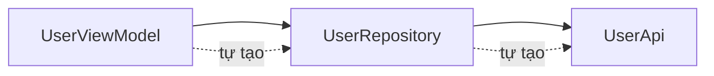

Nếu muốn unit test `UserViewModel`, rất khó thay `UserRepository` bằng `FakeUserRepository`.

Dependency Injection thay đổi thành:

```kotlin
class UserViewModel(
    private val repository: UserRepository
)
```

Bây giờ ViewModel chỉ nói:

> "Tôi cần một `UserRepository`."

Nó không cần biết repository được tạo thế nào.

Đây chính là lợi ích quan trọng của DI: dependency trở nên rõ ràng, coupling giảm và implementation có thể được thay khi test. Android Developers cũng khuyến nghị constructor injection cho những class mà chúng ta kiểm soát. ([Android Developers][3])

---

# 4. Kodein nằm ở đâu trong kiến trúc Android?

Kodein **không phải một architecture như MVVM**.

Nó là cơ chế kết nối các thành phần của architecture.

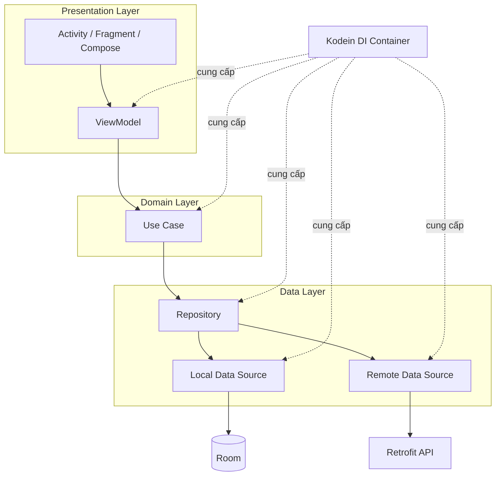

Điểm quan trọng:

```text
Business code
     │
     │ không nên phụ thuộc vào container nếu không cần thiết
     ▼
Constructor Injection

Application boundary
     │
     ▼
Kodein DI container
     │
     └── chịu trách nhiệm wiring object graph
```

Tài liệu Kodein phân biệt rõ hai cách: **injection** cung cấp dependency cho object từ bên ngoài, còn **retrieval** khiến object tự lấy dependency từ container. Injection giúp class "pure" và không phụ thuộc API Kodein; retrieval tiện hơn nhưng coupling class với Kodein-DI. ([Kosi Libs][4])

---

# 5. Khái niệm quan trọng nhất: Binding

Một **binding** mô tả:

```text
Khi ai đó yêu cầu TYPE A
            ↓
Kodein phải cung cấp object nào?
```

Ví dụ:

```kotlin
interface UserRepository

class UserRepositoryImpl : UserRepository
```

Ta muốn graph hiểu:

```text
UserRepository
      ↓
UserRepositoryImpl
```

Conceptually:

```kotlin
bind<UserRepository> {
    singleton {
        UserRepositoryImpl()
    }
}
```

Các binding được khai báo bên trong `DI { ... }`. Kodein hỗ trợ nhiều kiểu binding khác nhau như provider, singleton, eager singleton, factory và multiton. ([Kosi Libs][5])

---

# 6. Những binding quan trọng trong Kodein

## 6.1 `provider`

`provider` tạo **object mới mỗi lần yêu cầu**. ([Kosi Libs][5])

```kotlin
bindProvider<RandomGenerator> {
    RandomGenerator()
}
```

Luồng:

```text
instance()
   ↓
Object A

instance()
   ↓
Object B

instance()
   ↓
Object C
```

Phù hợp với object:

* nhẹ;
* không có state cần chia sẻ;
* cần instance mới.

---

## 6.2 `singleton`

`singleton` tạo object khi được dùng lần đầu rồi reuse nó cho các lần sau. ([Kosi Libs][5])

```kotlin
bindSingleton<UserRepository> {
    UserRepositoryImpl(instance())
}
```

```text
request #1 ──┐
request #2 ──┼──► UserRepository #1
request #3 ──┘
```

Thường phù hợp với:

```text
Retrofit
OkHttpClient
RoomDatabase
Repository stateless
Analytics
Configuration
```

Nhưng không có nghĩa **mọi object đều nên singleton**.

---

## 6.3 `factory`

Factory nhận tham số runtime và trả về instance. ([Kosi Libs][5])

```kotlin
bindFactory<String, UserSession> { userId ->
    UserSession(userId)
}
```

```text
factory("123")
      ↓
UserSession(userId = "123")
```

Rất hữu ích khi dependency cần dữ liệu chỉ có tại runtime.

---

## 6.4 `multiton`

Có thể hiểu đơn giản:

> Factory + cache theo argument.

Kodein đảm bảo với cùng argument, multiton trả lại cùng object. ([Kosi Libs][5])

```text
factory("A") → object #1
factory("A") → object #2

multiton("A") → object #1
multiton("A") → object #1
```

---

## 6.5 `instance`

Kodein cũng có thể bind một object đã tồn tại. ([Kosi Libs][5])

Ví dụ concept:

```kotlin
val config = AppConfig(...)

val di = DI {
    bind<AppConfig> {
        instance(config)
    }
}
```

---

# 7. Cài Kodein trong Android

Tài liệu Kodein 7.30.0 cung cấp core library:

```kotlin
dependencies {
    implementation("org.kodein.di:kodein-di:7.30.0")
}
```

Nếu dùng AndroidX + ViewModel, Kodein cung cấp module:

```kotlin
dependencies {
    implementation(
        "org.kodein.di:kodein-di-framework-android-x-viewmodel:7.30.0"
    )
}
```

Nếu ViewModel sử dụng `SavedStateHandle`, có module riêng dành cho trường hợp này. ([Kosi Libs][1])

> Trong project thật, nên kiểm tra lại phiên bản mới nhất trước khi khóa dependency.

---

# 8. Ví dụ hoàn chỉnh: MVVM + Repository + Kodein

Ta xây màn hình:

```text
UserScreen
   ↓
UserViewModel
   ↓
UserRepository
   ↓
UserApi
```

---

## 8.1 Repository interface

```kotlin
interface UserRepository {
    suspend fun getUser(): User
}
```

---

## 8.2 API

```kotlin
interface UserApi {
    suspend fun getUser(): User
}
```

---

## 8.3 Repository implementation

```kotlin
class UserRepositoryImpl(
    private val api: UserApi
) : UserRepository {

    override suspend fun getUser(): User {
        return api.getUser()
    }
}
```

Dependency đã được biểu diễn rõ trong constructor:

```text
UserRepositoryImpl
        │
        └── needs UserApi
```

---

# 9. ViewModel

```kotlin
class UserViewModel(
    private val repository: UserRepository
) : ViewModel() {

    private val _uiState =
        MutableStateFlow<UserUiState>(UserUiState.Loading)

    val uiState: StateFlow<UserUiState> =
        _uiState.asStateFlow()

    fun loadUser() {
        viewModelScope.launch {
            _uiState.value = try {
                val user = repository.getUser()
                UserUiState.Success(user)
            } catch (e: Exception) {
                UserUiState.Error(
                    e.message ?: "Unknown error"
                )
            }
        }
    }
}
```

Điểm đáng chú ý là:

```kotlin
class UserViewModel(
    private val repository: UserRepository
)
```

chứ không phải:

```kotlin
class UserViewModel {

    private val repository =
        DI.global.instance<UserRepository>()
}
```

Cách đầu giữ ViewModel độc lập với framework DI.

Đây cũng phù hợp với chính phân biệt injection/retrieval trong tài liệu Kodein. ([Kosi Libs][4])

---

# 10. Tạo Kodein container

Application thường là vị trí hợp lý cho application-level DI container.

Kodein Android hỗ trợ `Application` implement `DIAware` và khai báo graph bằng `DI.lazy`. ([Kosi Libs][6])

```kotlin
class MyApplication : Application(), DIAware {

    override val di by DI.lazy {

        bindSingleton<UserApi> {
            UserApiImpl()
        }

        bindSingleton<UserRepository> {
            UserRepositoryImpl(
                api = instance()
            )
        }

        bindProvider {
            UserViewModel(
                repository = instance()
            )
        }
    }
}
```

Graph lúc này:

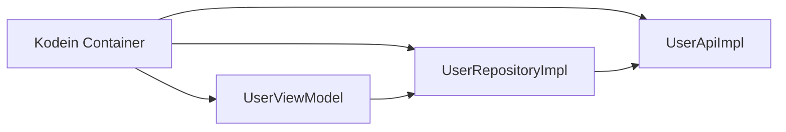

Kodein tự giải quyết dependency chain:

```text
UserViewModel
     ↓ yêu cầu
UserRepository
     ↓ yêu cầu
UserApi
```

---

# 11. Inject ViewModel vào Activity

Module AndroidX ViewModel của Kodein hỗ trợ ViewModel delegate. Tài liệu hiện tại sử dụng `closestDI()` cùng `viewModel()`. ([Kosi Libs][6])

```kotlin
class UserActivity :
    AppCompatActivity(),
    DIAware {

    override val di: DI by closestDI()

    private val viewModel: UserViewModel by viewModel()
}
```

Như vậy Activity không phải viết:

```kotlin
val api = UserApiImpl()

val repository =
    UserRepositoryImpl(api)

val viewModel =
    UserViewModel(repository)
```

---

# 12. Dependency direction

Một lỗi dễ gặp là nghĩ rằng DI làm dependency quay ngược chiều.

Không phải.

Business dependency vẫn là:

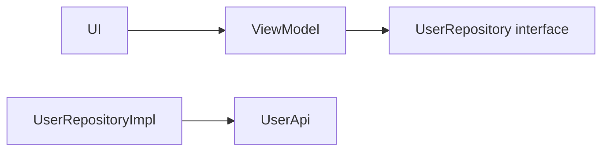

Nhưng **composition root** kết nối:

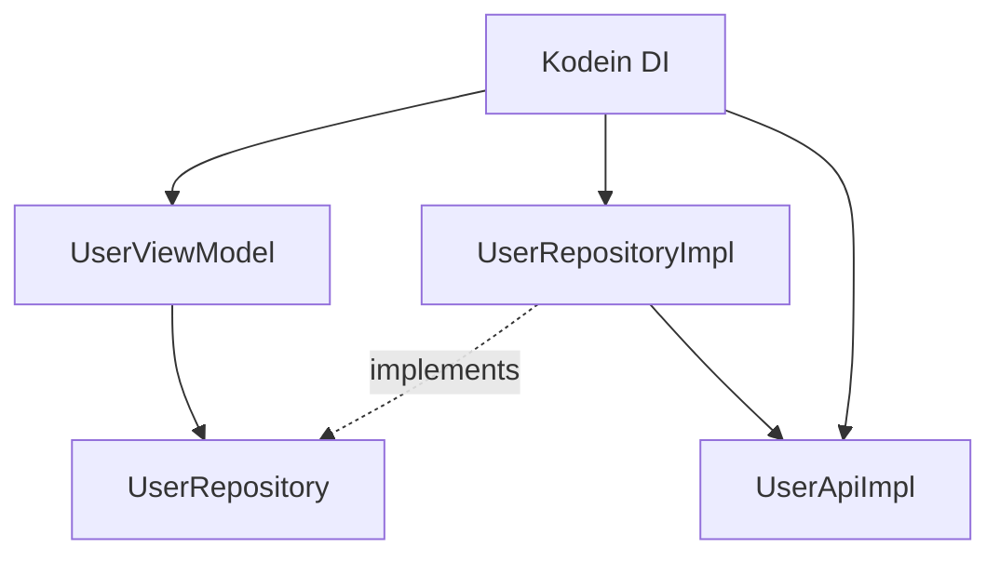

Điều ta muốn tránh:

```text
ViewModel
   ↓
Kodein
   ↓
Repository
```

ở sâu trong business logic.

Thay vào đó:

```text
Kodein
  ↓
construct ViewModel(repository)
```

---

# 13. Injection và Service Locator không giống nhau

### Constructor Injection

```kotlin
class CheckoutUseCase(
    private val repository: OrderRepository
)
```

Dependency nhìn thấy ngay trong constructor.

### Service Locator-style

```kotlin
class CheckoutUseCase {

    private val repository by di.instance<OrderRepository>()
}
```

Dependency bị lấy từ container bên trong class.

Kodein hỗ trợ dependency retrieval, nhưng chính tài liệu Kodein lưu ý retrieval khiến class phụ thuộc vào Kodein API trong khi injection giữ class độc lập với container. ([Kosi Libs][4])

Vì vậy với:

```text
ViewModel
UseCase
Repository
Domain service
```

nên ưu tiên constructor injection khi có thể.

---

# 14. Testing — lợi ích quan trọng nhất

Giả sử:

```kotlin
class ProfileViewModel(
    private val repository: ProfileRepository
)
```

Ta tạo fake:

```kotlin
class FakeProfileRepository :
    ProfileRepository {

    override suspend fun loadProfile(): Profile {
        return Profile(
            name = "An"
        )
    }
}
```

Test:

```kotlin
@Test
fun `load profile returns success`() = runTest {

    val repository =
        FakeProfileRepository()

    val viewModel =
        ProfileViewModel(repository)

    viewModel.load()

    assertTrue(
        viewModel.uiState.value
            is ProfileUiState.Success
    )
}
```

Điểm quan trọng:

```text
Unit test
   │
   ├── không cần Android
   ├── không cần Retrofit
   ├── không cần server
   └── thậm chí không cần khởi tạo Kodein
```

Đây là một trong những lý do quan trọng của constructor injection: class có thể được test trực tiếp bằng fake dependency. Android Developers cũng áp dụng cùng nguyên tắc khi hướng dẫn test class dùng DI. ([Android Developers][7])

---

# 15. Lifecycle và Scope

DI không chỉ là:

```text
"object nào được inject?"
```

Mà còn là:

```text
"object này sống bao lâu?"
```

Một cách hình dung:

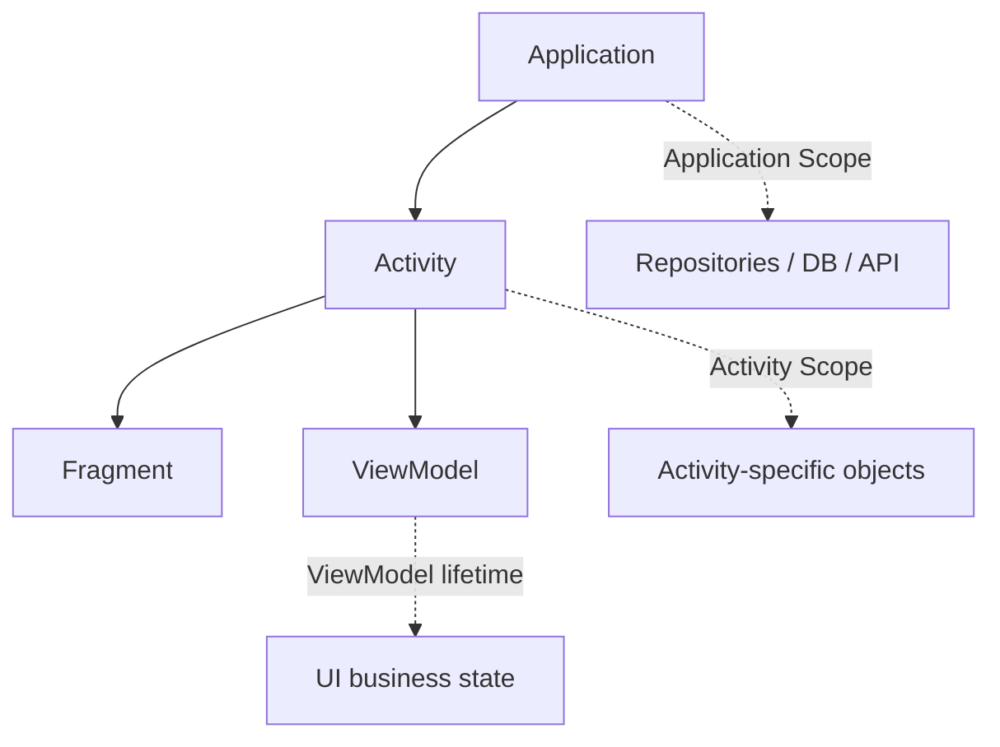

Kodein Android cung cấp các cơ chế scope như `WeakContextScope`, `ActivityRetainedScope` và `AndroidLifecycleScope`. `ActivityRetainedScope` có thể tồn tại qua Activity restart; vì vậy tài liệu đặc biệt cảnh báo không giữ reference tới Activity cũ trong object retained. ([Kosi Libs][6])

---

# 16. Rotate màn hình thì sao?

Ví dụ:

```text
Portrait
   ↓
Activity A
   ↓ rotate

Activity A destroyed
   ↓
Activity B created
```

Nếu dependency bị scope trực tiếp theo Activity:

```text
Activity A
   ↓
Controller A
```

Controller có thể mất khi configuration change.

Trong khi ViewModel sử dụng Android `ViewModelStore` có lifecycle riêng dành cho UI state.

Kodein có integration riêng cho AndroidX ViewModel và cả ViewModel sử dụng `SavedStateHandle`. ([Kosi Libs][6])

Do đó nên phân biệt:

```text
Dependency lifecycle ≠ UI state lifecycle
```

DI framework **không tự động giải quyết mọi vấn đề state restoration**.

---

# 17. SavedStateHandle

Với ViewModel:

```kotlin
class DetailViewModel(
    private val savedStateHandle: SavedStateHandle,
    private val repository: ProductRepository
) : ViewModel()
```

Kodein cung cấp AndroidX module riêng và sử dụng factory binding cho ViewModel có `SavedStateHandle`. ([Kosi Libs][6])

Conceptually:

```text
SavedStateHandle ─┐
                  ├─► DetailViewModel
Repository ───────┘
```

Điều này đặc biệt hữu ích với:

```text
productId
userId
query
navigation arguments
screen state
```

---

# 18. Kodein và Jetpack Compose

Kodein hiện có Compose integration riêng. Module đầy đủ:

```kotlin
implementation(
    "org.kodein.di:kodein-di-framework-compose:7.30.0"
)
```

Module này hỗ trợ Compose lifecycle integration và ViewModel; Kodein dùng `CompositionLocal` để đưa DI container xuống cây composable. ([Kosi Libs][8])

Mô hình:

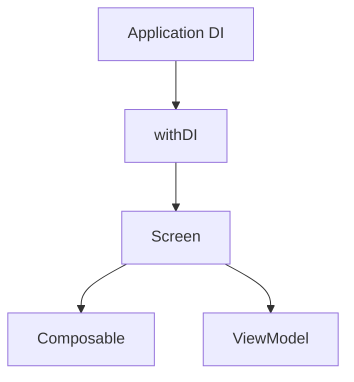

Tuy nhiên, không nên biến mọi Composable thành:

```text
Composable
    ↓
instance()
    ↓
Repository
```

Một cấu trúc rõ hơn thường vẫn là:

```text
Composable
    ↓
ViewModel
    ↓
UseCase / Repository
```

---

# 19. Kodein Module

Khi graph lớn, không nên đặt tất cả binding trong `Application`.

Có thể tư duy theo module:

```text
DI
├── networkModule
├── databaseModule
├── repositoryModule
├── domainModule
└── featureModule
```

Sơ đồ:

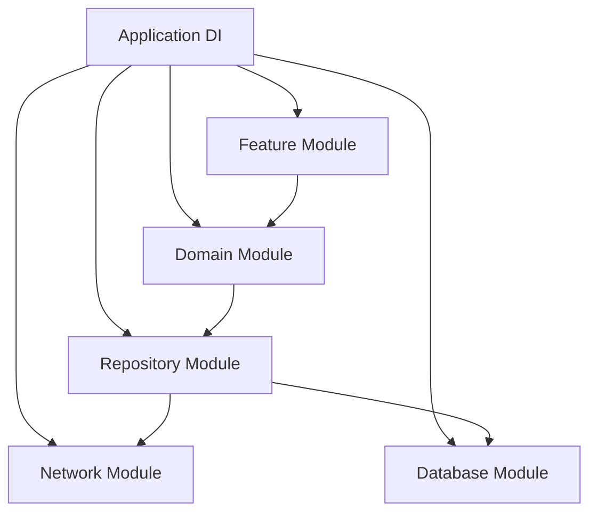

Cấu trúc này giúp composition root dễ đọc hơn và tránh một file DI hàng nghìn dòng.

---

# 20. Kodein so với Hilt

| Tiêu chí                          | Kodein                                 | Hilt                                          |
| --------------------------------- | -------------------------------------- | --------------------------------------------- |
| Phong cách                        | Kotlin DSL                             | Annotation + code generation                  |
| Container                         | `DI {}`                                | Generated components                          |
| Constructor injection             | Có thể triển khai rõ ràng              | `@Inject`                                     |
| Android integration               | Có module Android/Compose              | Thiết kế trực tiếp cho Android                |
| Multiplatform                     | Có                                     | Không phải mục tiêu chính                     |
| Missing dependency                | Có thể phát hiện khi retrieval/runtime | Dagger/Hilt cung cấp compile-time correctness |
| Boilerplate                       | DSL khá ngắn                           | Annotation nhiều hơn                          |
| Recommendation chính thức Android | Lựa chọn third-party                   | Jetpack khuyến nghị Hilt                      |

Kodein tự mô tả là Kotlin Multiplatform dependency container và cung cấp Android/Compose integration. Trong khi đó Android Developers hiện ghi rõ **Hilt là thư viện DI được Jetpack khuyến nghị cho Android**, và Hilt xây trên Dagger để hưởng compile-time correctness. ([GitHub][9])

Vì vậy:

```text
Android-only app
     ↓
Hilt thường là default choice

Kotlin Multiplatform
     ↓
Kodein đáng cân nhắc hơn
```

Điều đó không có nghĩa Kodein "tệ"; nó giải quyết bài toán với trade-off khác.

---

# 21. Runtime error cần chú ý

Kodein có thể ném:

```text
DI.NotFoundException
```

nếu yêu cầu một type chưa được bind. Tài liệu Kodein ghi rõ exception này có thể xảy ra khi injection/retrieval một binding không tồn tại. ([Kosi Libs][4])

Ví dụ:

```kotlin
class UserViewModel(
    val repository: UserRepository
)
```

nhưng quên:

```kotlin
bind<UserRepository> {
    ...
}
```

Dependency chain:

```text
UserViewModel
     ↓
UserRepository
     ↓
?????

DI.NotFoundException
```

Đây là loại lỗi cần đưa vào checklist testing trước release.

---

# 22. Circular dependency

Một dependency graph xấu:

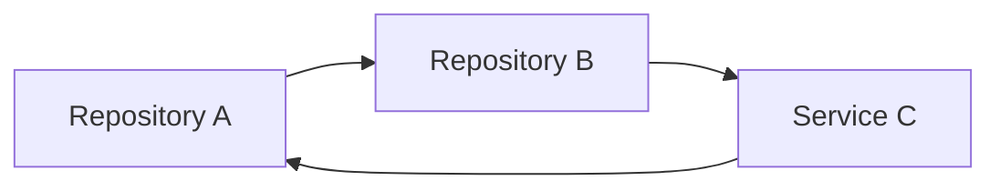

tạo vòng:

```text
A → B → C → A
```

Nếu xuất hiện tình trạng này, thường nên xem lại architecture thay vì cố ép DI container xử lý.

Có thể cần:

```text
A → Interface X ← C
```

hoặc đưa logic chung vào:

```text
UseCase / Domain Service
```

---

# 23. Performance

Kodein singleton mặc định đồng bộ hóa quá trình khởi tạo để đảm bảo chỉ có một instance được tạo. Tài liệu lưu ý synchronization có chi phí và có thể ảnh hưởng startup; Kodein có `sync = false`, nhưng khi tắt synchronization thì có khả năng nhiều instance được tạo, nên chỉ dùng khi hiểu rõ trade-off. ([Kosi Libs][5])

Không nên tối ưu kiểu:

```kotlin
singleton(sync = false)
```

chỉ vì thấy "false nhanh hơn".

Trước tiên hãy đo:

```text
App startup
   ↓
Profiler / benchmark
   ↓
xác định bottleneck
   ↓
mới tối ưu DI
```

---

# 24. Memory leak

Sai:

```text
Application Singleton
        ↓
Activity
        ↓
View
```

Nếu singleton giữ reference Activity:

```kotlin
class AnalyticsManager(
    private val activity: Activity
)
```

thì Activity có thể không được garbage collect.

Đúng hơn:

```text
Application Singleton
        ↓
Application Context
```

hoặc scope dependency đúng theo lifecycle của Activity.

Kodein cũng cảnh báo đặc biệt với retained scope rằng không được giữ Activity đã bị recreate. ([Kosi Libs][6])

---

# 25. R8 / ProGuard

Production build cần chú ý thêm R8.

Tài liệu Android của Kodein 7.30 hiện cảnh báo việc tối ưu type information có thể dẫn đến runtime exception và cung cấp các keep rule dành cho trường hợp này. ([Kosi Libs][6])

Do đó release checklist nên có:

```text
Debug build OK
      ↓
Release build
      ↓
R8 / minify
      ↓
Smoke test DI graph
      ↓
Launch các màn hình quan trọng
```

Đừng chỉ test:

```text
debug.apk
```

mà bỏ qua:

```text
release.apk / release.aab
```

---

# 26. Debugging Kodein

Khi gặp:

```text
DI.NotFoundException
```

hãy kiểm tra theo thứ tự:

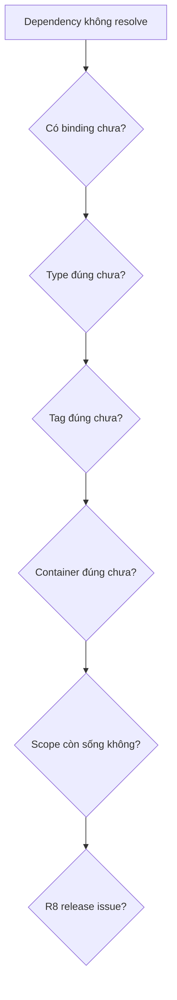

Đặc biệt kiểm tra:

```text
UserRepository
```

và:

```text
UserRepositoryImpl
```

là hai type khác nhau đối với container nếu binding không khai báo quan hệ tương ứng.

---

# 27. Anti-pattern cần tránh

## ❌ Inject container vào mọi nơi

```kotlin
class UserRepository(
    private val di: DI
)
```

rồi:

```kotlin
val api by di.instance<UserApi>()
```

Repository đã bị coupling với Kodein.

---

## ✅ Inject dependency thật

```kotlin
class UserRepositoryImpl(
    private val api: UserApi
)
```

Graph trở nên rõ ràng:

```text
UserRepositoryImpl
        ↓
      UserApi
```

---

# 28. Ví dụ kiến trúc hoàn chỉnh

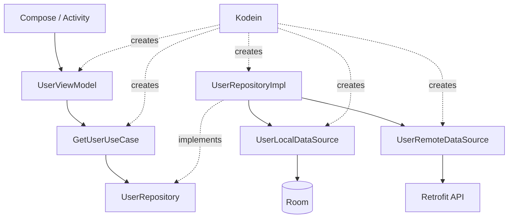

Điểm quan trọng nhất là:

```text
Architecture quyết định dependency direction.

Kodein chỉ chịu trách nhiệm wiring dependency graph.
```

---

# 29. Thực hành

## Bài thực hành: `Profile`

Tạo:

```text
ProfileScreen
     ↓
ProfileViewModel
     ↓
GetProfileUseCase
     ↓
ProfileRepository
     ↓
ProfileApi
```

Yêu cầu:

```text
ProfileRepository
        ↑
        │
ProfileRepositoryImpl
```

Sau đó khai báo:

```text
Kodein Container
├── ProfileApi
├── ProfileRepository
├── GetProfileUseCase
└── ProfileViewModel
```

Cuối cùng viết:

```text
FakeProfileRepository
```

để test ViewModel mà không gọi Internet.

---

# 30. Bài tập refactor

Cho đoạn code:

```kotlin
class ProductViewModel : ViewModel() {

    private val retrofit =
        Retrofit.Builder()
            .baseUrl("...")
            .build()

    private val api =
        retrofit.create(ProductApi::class.java)

    private val repository =
        ProductRepositoryImpl(api)
}
```

Refactor thành:

```text
ProductViewModel
      ↓
ProductRepository
```

và:

```text
Kodein
├── Retrofit
├── ProductApi
├── ProductRepository
└── ProductViewModel
```

Sau refactor, `ProductViewModel` không được import:

```text
Retrofit
Kodein
Room
OkHttp
```

---

# 31. Artifact portfolio nên tạo

Một mini project có cấu trúc:

```text
app/
├── di/
│   ├── NetworkModule.kt
│   ├── RepositoryModule.kt
│   └── ViewModelModule.kt
│
├── data/
│   ├── remote/
│   ├── local/
│   └── repository/
│
├── domain/
│   ├── repository/
│   └── usecase/
│
└── presentation/
    └── profile/
        ├── ProfileScreen.kt
        ├── ProfileViewModel.kt
        └── ProfileUiState.kt
```

README nên có dependency graph:

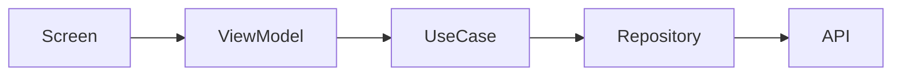

và ghi rõ:

```text
DI framework: Kodein
Pattern: MVVM
State: StateFlow
Testing: FakeRepository
```

---

# 32. Checklist hoàn thành

* [ ] Giải thích được Kodein là gì.
* [ ] Hiểu DI container.
* [ ] Hiểu binding.
* [ ] Phân biệt `provider` và `singleton`.
* [ ] Hiểu `factory`.
* [ ] Hiểu dependency retrieval.
* [ ] Biết ưu tiên constructor injection cho business class.
* [ ] Inject được Repository vào ViewModel.
* [ ] Tạo được FakeRepository.
* [ ] Viết unit test không cần khởi tạo DI framework.
* [ ] Biết dependency scope ảnh hưởng lifecycle thế nào.
* [ ] Không giữ Activity trong application singleton.
* [ ] Test cả release build khi bật R8.
* [ ] Biết Hilt là lựa chọn được Jetpack khuyến nghị cho Android-only app. ([Android Developers][3])

---

# 33. Câu hỏi tự kiểm tra

### Câu 1

Kodein giải quyết vấn đề gì?

**Đáp án ngắn:**

```text
Tạo và kết nối dependency graph.
```

### Câu 2

Tại sao constructor injection tốt cho testing?

```text
ViewModel(repository)
          ↑
      FakeRepository
```

Không cần database, API hay DI container thật.

### Câu 3

`provider` khác `singleton` thế nào?

```text
provider
request → NEW object

singleton
request → SAME object
```

### Câu 4

Kodein có thay MVVM không?

Không.

```text
MVVM
= cách tổ chức architecture

Kodein
= cách kết nối dependencies
```

### Câu 5

Có nên gọi `instance()` ở tất cả Repository và UseCase?

Không nên nếu constructor injection có thể giải quyết rõ ràng hơn.

### Câu 6

DI có tự giải quyết rotate/background/process death không?

Không.

DI quản lý dependency graph và có thể quản lý scope; UI state vẫn phải được thiết kế đúng bằng ViewModel, `SavedStateHandle`, persistence hoặc state restoration thích hợp.

---

# 34. Ghi chú production

Khi dùng Kodein trong app thực tế, nên kiểm tra theo chuỗi:

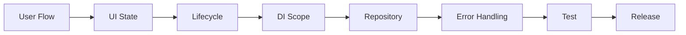

Đặc biệt hãy tự hỏi:

```text
Dependency này cần sống bao lâu?

Có đang giữ Context/Activity sai scope không?

Rotate có tạo lại object không?

Process death có làm mất state không?

Network error được chuyển thành UI state thế nào?

Có FakeRepository để unit test không?

Nếu quên binding thì test nào phát hiện?

Release + R8 đã được smoke test chưa?
```

---

# 35. Kết luận

**Kodein không phải nơi chứa business logic.**

Nó là nơi kết nối:

```text
UI
 ↓
ViewModel
 ↓
UseCase
 ↓
Repository
 ↓
Data Source
```

Thứ cần nhớ nhất:

```text
             Kodein
                │
        creates / connects
                │
                ▼
ViewModel → UseCase → Repository → API
```

Một codebase tốt không phải codebase gọi `di.instance()` ở khắp nơi. Một codebase tốt là codebase mà dependency **rõ ràng trong constructor**, business code dễ test và DI container chỉ tập trung vào việc **wiring object graph**. Chính tài liệu Kodein cũng phân biệt constructor-style injection như cách giữ class độc lập với container, trong khi retrieval tiện hơn nhưng tạo coupling với API Kodein. ([Kosi Libs][4])

Trong Android hiện đại, **Hilt vẫn là lựa chọn được Jetpack chính thức khuyến nghị** cho ứng dụng Android thuần; Kodein đặc biệt đáng học để hiểu DI container kiểu Kotlin DSL và có giá trị khi kiến trúc hướng tới Kotlin Multiplatform. ([Android Developers][3])

[1]: https://kosi-libs.org/kodein/7.30/getting-started.html "Getting started with Kodein-DI :: Kodein Open Source Initiative Documentation"
[2]: https://developer.android.com/training/dependency-injection/manual?utm_source=chatgpt.com "Manual dependency injection | App architecture"
[3]: https://developer.android.com/training/dependency-injection?utm_source=chatgpt.com "Dependency injection in Android | App architecture"
[4]: https://kosi-libs.org/kodein/7.30/core/injection-retrieval.html "Dependency injection & retrieval :: Kodein Open Source Initiative Documentation"
[5]: https://kosi-libs.org/kodein/7.30/core/bindings.html "Bindings: Declaring dependencies :: Kodein Open Source Initiative Documentation"
[6]: https://kosi-libs.org/kodein/7.30/framework/android.html "Kodein-DI on Android :: Kodein Open Source Initiative Documentation"
[7]: https://developer.android.com/training/dependency-injection/hilt-testing?utm_source=chatgpt.com "Hilt testing guide | App architecture"
[8]: https://kosi-libs.org/kodein/7.30/framework/compose.html "Kodein-DI and Compose (Android, Desktop, & Web) :: Kodein Open Source Initiative Documentation"
[9]: https://github.com/kosi-libs/Kodein/blob/main/README.md "Kodein/README.md at main · kosi-libs/Kodein · GitHub"
