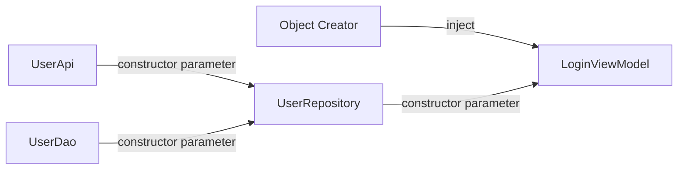
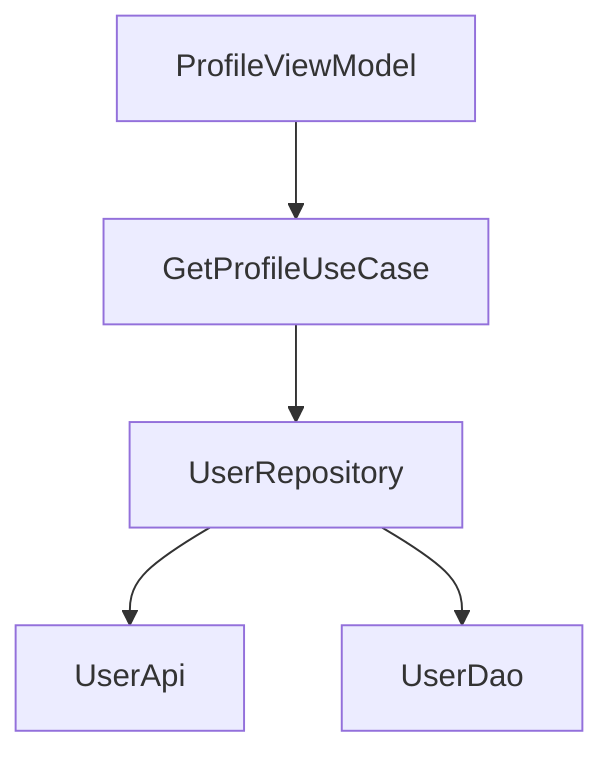
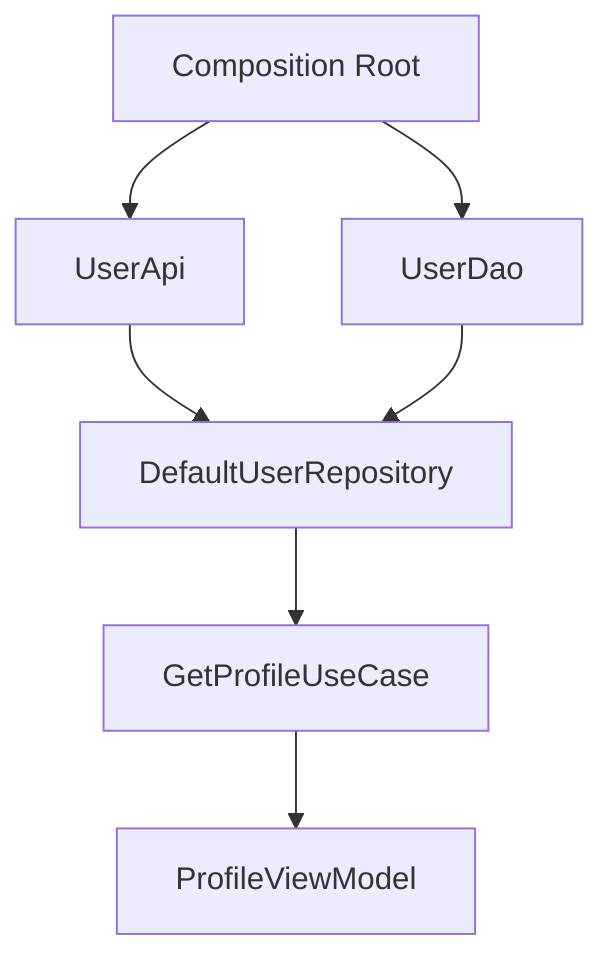
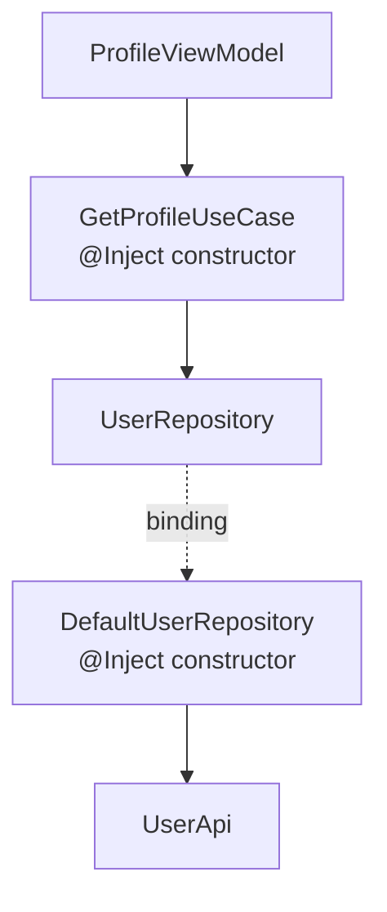
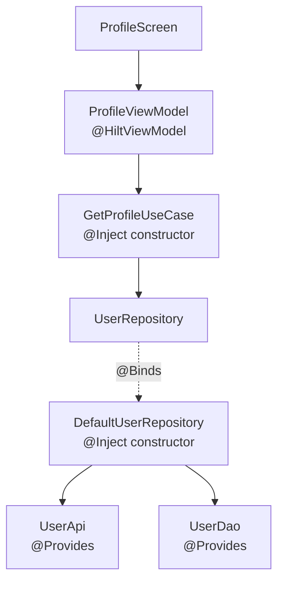
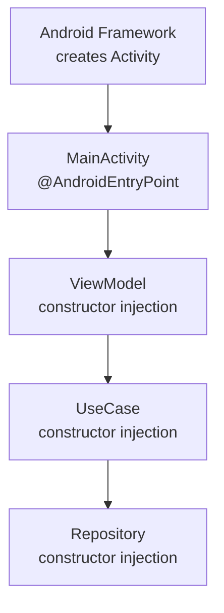
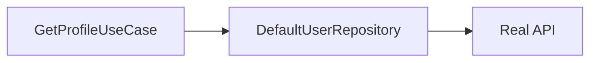
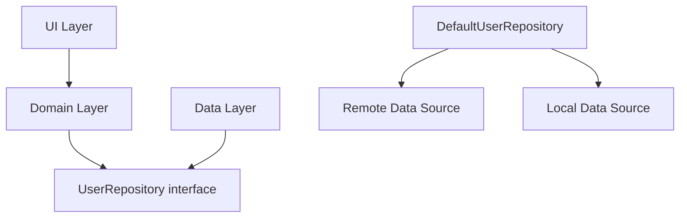
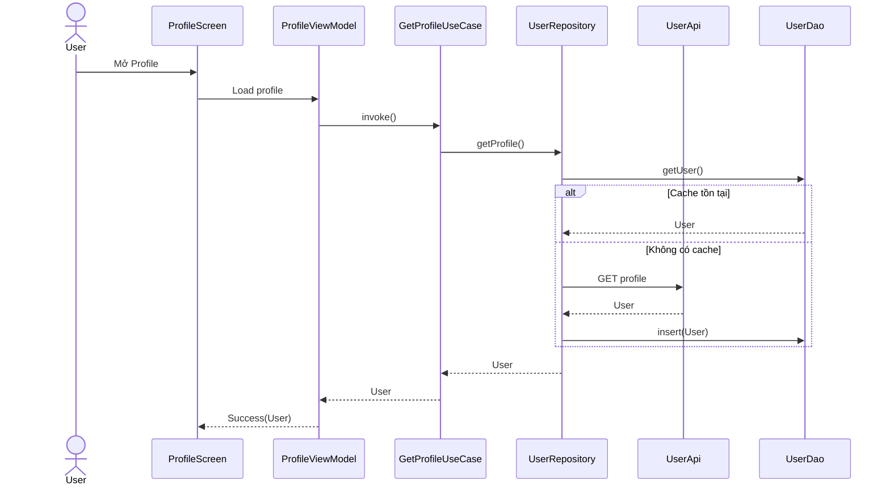
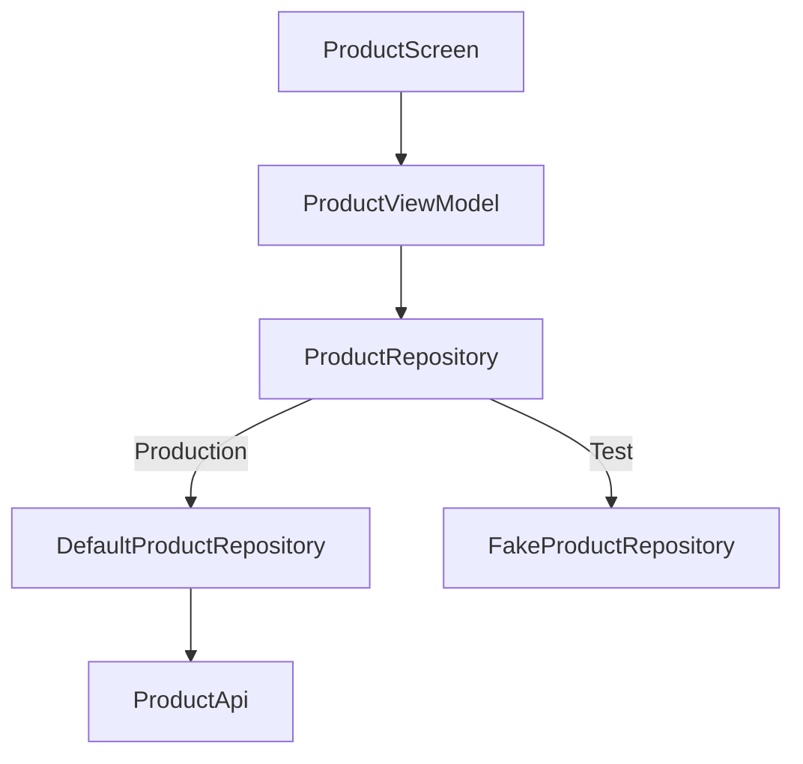

[](https://developer.android.com/training/dependency-injection/manual?utm_source=chatgpt.com)

# 030 - Constructor Injection

| Thuộc tính              | Nội dung                                       |
| ----------------------- | ---------------------------------------------- |
| **Học phần**            | 03 - Architecture, State and Data              |
| **Module**              | Module 05 - Design and Architecture            |
| **Nhóm nội dung**       | Dependency Injection                           |
| **Nguồn roadmap**       | Design and Architecture / Dependency Injection |
| **Loại bài**            | Architecture                                   |
| **Thứ tự trong module** | 030                                            |
| **Thời lượng gợi ý**    | 34 phút                                        |

---

## 1. Tóm tắt

**Constructor Injection** là kỹ thuật Dependency Injection trong đó một class **nhận các dependency cần thiết thông qua constructor**, thay vì tự tạo chúng bên trong class hoặc đi lấy chúng từ một global object/service locator.

Android Developers xác định Constructor Injection là một trong hai cách DI chính trên Android: dependency được truyền trực tiếp vào constructor của object. Cách này làm dependency trở thành một phần rõ ràng của API của class, giúp dễ thay implementation và dễ đưa fake/test double vào khi kiểm thử. ([Android Developers][1])

Ví dụ đơn giản:

```kotlin
class UserRepository(
    private val api: UserApi
)
```

`UserRepository` không cần biết cách tạo `UserApi`.

Nó chỉ tuyên bố:

> "Muốn tạo tôi thì hãy cung cấp cho tôi một `UserApi`."

Đây chính là ý tưởng cốt lõi của Constructor Injection.

---

## 2. Mục tiêu học tập

Sau bài này, bạn nên:

* Giải thích được **Constructor Injection** bằng ngôn ngữ của mình.
* Phân biệt:

  * class tự tạo dependency;
  * Service Locator;
  * Constructor Injection;
  * Field Injection.
* Biết áp dụng Constructor Injection cho:

  * Repository;
  * Use Case;
  * ViewModel;
  * Data Source;
  * service/helper class.
* Hiểu vì sao Constructor Injection giúp:

  * giảm coupling;
  * dependency rõ ràng hơn;
  * refactor an toàn hơn;
  * test dễ hơn.
* Biết kết hợp Constructor Injection với **Hilt**.
* Biết trường hợp nào **không thể constructor-inject trực tiếp**, chẳng hạn một số Android framework component hoặc class của thư viện bên thứ ba.
* Viết được unit test dùng `FakeRepository`.

Android Developers khuyến nghị DI để tăng khả năng tái sử dụng, giảm coupling, hỗ trợ refactoring và giúp test bằng các implementation thay thế. ([Android Developers][1])

---

# 3. Constructor Injection là gì?

Giả sử chúng ta có:

```kotlin
class LoginViewModel
```

`LoginViewModel` cần truy cập dữ liệu người dùng.

Một thiết kế không tốt có thể là:

```kotlin
class LoginViewModel {

    private val repository = UserRepository()
}
```

Có vấn đề gì?

`LoginViewModel` vừa:

1. xử lý logic login;
2. vừa quyết định cách tạo `UserRepository`.

Hai trách nhiệm đã bị trộn vào nhau.

---

## 3.1 Sử dụng Constructor Injection

Thay vào đó:

```kotlin
class LoginViewModel(
    private val repository: UserRepository
)
```

Việc tạo dependency được đưa ra ngoài:

```kotlin
val repository = UserRepository(...)
val viewModel = LoginViewModel(repository)
```

Class chỉ sử dụng dependency.

Nó **không chịu trách nhiệm tạo dependency**.

Android Developers minh họa cùng nguyên tắc bằng ví dụ `Car` nhận `Engine` từ constructor thay vì tự tạo `Engine`. ([Android Developers][1])

---

# 4. Tư duy quan trọng: "Declare, Don't Locate"

Có thể ghi nhớ Constructor Injection bằng công thức:

```text
Class cần dependency
        ↓
Khai báo dependency trong constructor
        ↓
Bên ngoài chịu trách nhiệm cung cấp dependency
```

Không nên:

```kotlin
class CheckoutViewModel {

    private val repository =
        ServiceLocator.checkoutRepository
}
```

Nên:

```kotlin
class CheckoutViewModel(
    private val repository: CheckoutRepository
)
```

Service Locator khiến dependency bị giấu trong implementation của class. Android Developers lưu ý rằng kiểu này làm dependency khó nhìn thấy từ API bên ngoài và khiến testing/lifetime management khó hơn. ([Android Developers][1])

---

# 5. Sơ đồ Constructor Injection



Tương ứng với:

```kotlin
class LoginViewModel(
    private val repository: UserRepository
)

class UserRepository(
    private val api: UserApi,
    private val dao: UserDao
)
```

Dependency graph:

```text
LoginViewModel
      │
      ▼
UserRepository
   ┌──┴──┐
   ▼     ▼
UserApi UserDao
```

Android gọi toàn bộ quan hệ giữa các object kiểu này là **application graph**. Một class phụ thuộc vào class khác sẽ tạo thành một cạnh trong dependency graph. ([Android Developers][2])

---

# 6. Ví dụ thực tế trong Android

Xét màn hình Profile:

```text
ProfileScreen
     │
     ▼
ProfileViewModel
     │
     ▼
GetProfileUseCase
     │
     ▼
UserRepository
   ┌───────┴───────┐
   ▼               ▼
UserApi           UserDao
   │               │
Network           Room
```

Đây là một cấu trúc rất phù hợp với Constructor Injection.

---

## 6.1 Data layer

Định nghĩa repository abstraction:

```kotlin
interface UserRepository {

    suspend fun getProfile(): User
}
```

Implementation:

```kotlin
class DefaultUserRepository(
    private val api: UserApi,
    private val dao: UserDao
) : UserRepository {

    override suspend fun getProfile(): User {
        val cached = dao.getUser()

        if (cached != null) {
            return cached
        }

        val user = api.getProfile()

        dao.insert(user)

        return user
    }
}
```

Dependency rất rõ:

```text
DefaultUserRepository cần:
├── UserApi
└── UserDao
```

Không cần mở code bên trong class vẫn có thể biết nó cần gì.

---

# 7. Constructor Injection trong Domain Layer

Giả sử có Use Case:

```kotlin
class GetProfileUseCase(
    private val repository: UserRepository
) {

    suspend operator fun invoke(): User {
        return repository.getProfile()
    }
}
```

Dependency graph tiếp tục hình thành:



Điểm quan trọng:

> Layer phía trên biết abstraction cần dùng, nhưng không cần biết dependency được tạo ra bằng cách nào.

---

# 8. Constructor Injection trong ViewModel

Android Developers hiện khuyến nghị ViewModel nhận dependency thông qua constructor. Nếu không dùng Hilt thì một ViewModel có constructor dependency cần cơ chế factory để framework tạo ViewModel đúng scope; với Hilt, factory cần thiết được sinh tự động cho `@HiltViewModel`. ([Android Developers][3])

Ví dụ:

```kotlin
class ProfileViewModel(
    private val getProfile: GetProfileUseCase
) : ViewModel()
```

Sau đó:

```text
ProfileViewModel
       │
constructor
       ▼
GetProfileUseCase
       │
constructor
       ▼
UserRepository
```

Đây là một **dependency chain**.

---

# 9. Manual Constructor Injection

Không bắt buộc phải dùng Hilt để hiểu Constructor Injection.

Ta hoàn toàn có thể làm bằng tay.

---

## 9.1 Tạo dependency

```kotlin
val api = UserApiImpl()

val dao = UserDaoImpl()

val repository = DefaultUserRepository(
    api = api,
    dao = dao
)

val useCase = GetProfileUseCase(
    repository = repository
)
```

Sau đó:

```kotlin
val viewModel = ProfileViewModel(
    getProfile = useCase
)
```

Luồng tạo object:



Android Developers dùng mô hình tương tự trong tài liệu Manual DI: repository nhận local/remote data source qua constructor, rồi các object phía ngoài chịu trách nhiệm ghép dependency graph. ([Android Developers][2])

---

# 10. Composition Root

Một khái niệm rất hữu ích khi học DI là:

**Composition Root**

Đây là nơi dependency graph được lắp ráp.

Ví dụ thủ công:

```kotlin
class AppContainer {

    private val api = UserApiImpl()

    private val dao = UserDaoImpl()

    val userRepository: UserRepository =
        DefaultUserRepository(
            api = api,
            dao = dao
        )
}
```

Sau đó:

```kotlin
class MyApplication : Application() {

    val appContainer = AppContainer()
}
```

Android Developers cũng trình bày `AppContainer` đặt trong `Application` như một bước tiến từ việc tạo dependency rải rác trong Activity. ([Android Developers][2])

---

# 11. Constructor Injection với Hilt

Trong project thực tế lớn hơn, việc tự nối hàng chục hoặc hàng trăm object sẽ tạo nhiều boilerplate.

Hilt tự động hóa phần này.

Hilt hiện là thư viện DI được Android khuyến nghị và được xây dựng trên Dagger. ([Android Developers][1])

---

## 11.1 `@Inject constructor`

Thay:

```kotlin
class GetProfileUseCase(
    private val repository: UserRepository
)
```

có thể khai báo:

```kotlin
class GetProfileUseCase @Inject constructor(
    private val repository: UserRepository
)
```

Ý nghĩa:

```text
Hilt:
"Tôi được phép dùng constructor này
để tạo GetProfileUseCase."
```

Hilt xem các parameter của constructor được đánh dấu `@Inject` chính là dependencies mà nó phải tìm cách cung cấp. ([Android Developers][4])

---

# 12. Hilt dependency graph

Ví dụ:

```kotlin
class GetProfileUseCase @Inject constructor(
    private val repository: UserRepository
)
```

```kotlin
class DefaultUserRepository @Inject constructor(
    private val api: UserApi
) : UserRepository
```

Graph mong muốn:



Tuy nhiên Hilt chưa biết:

```text
UserRepository
      ↓
DefaultUserRepository
```

vì `UserRepository` là interface.

---

# 13. Constructor Injection không tạo được interface

Không thể viết:

```kotlin
interface UserRepository @Inject constructor()
```

Interface không có constructor.

Vì vậy cần binding.

```kotlin
@Module
@InstallIn(SingletonComponent::class)
abstract class RepositoryModule {

    @Binds
    abstract fun bindUserRepository(
        repository: DefaultUserRepository
    ): UserRepository
}
```

Trong khi implementation vẫn dùng Constructor Injection:

```kotlin
class DefaultUserRepository @Inject constructor(
    private val api: UserApi
) : UserRepository
```

Android Developers chỉ rõ rằng interface không thể constructor-inject; với Hilt, `@Binds` có thể ánh xạ một implementation đã constructor-inject sang interface tương ứng. ([Android Developers][4])

---

# 14. Khi nào dùng `@Inject constructor` và khi nào dùng `@Provides`?

## Trường hợp 1 — Class do mình sở hữu

Ví dụ:

```kotlin
class TokenManager @Inject constructor(
    private val storage: TokenStorage
)
```

Rất phù hợp với Constructor Injection.

---

## Trường hợp 2 — Interface

```kotlin
interface UserRepository
```

Cần binding:

```kotlin
@Binds
abstract fun bindUserRepository(
    impl: DefaultUserRepository
): UserRepository
```

---

## Trường hợp 3 — Class của thư viện bên ngoài

Ví dụ như:

```text
Retrofit
OkHttpClient
RoomDatabase
```

Bạn không sửa constructor của chúng để thêm:

```kotlin
@Inject
```

Nên thường cung cấp chúng từ Hilt module bằng `@Provides`. Đây cũng là trường hợp được tài liệu Hilt nêu rõ cho các type mà ứng dụng không sở hữu hoặc phải được tạo bằng builder. ([Android Developers][4])

Ví dụ:

```kotlin
@Module
@InstallIn(SingletonComponent::class)
object NetworkModule {

    @Provides
    fun provideApi(): UserApi {
        return createUserApi()
    }
}
```

---

# 15. Một graph Hilt hoàn chỉnh



Có thể nhìn graph thành ba nhóm:

```text
Constructor Injection
├── ProfileViewModel
├── GetProfileUseCase
└── DefaultUserRepository

Binding
└── UserRepository -> DefaultUserRepository

Provider
├── Retrofit / UserApi
└── Room / UserDao
```

---

# 16. ViewModel với Hilt

Ví dụ:

```kotlin
@HiltViewModel
class ProfileViewModel @Inject constructor(
    private val getProfile: GetProfileUseCase
) : ViewModel()
```

Compose:

```kotlin
@Composable
fun ProfileRoute(
    viewModel: ProfileViewModel = hiltViewModel()
) {
    ProfileScreen(
        state = viewModel.uiState
    )
}
```

Hilt sẽ tạo factory để ViewModel được tạo đúng cách thay vì UI tự gọi:

```kotlin
ProfileViewModel(
    GetProfileUseCase(
        DefaultUserRepository(...)
    )
)
```

Android Developers xác nhận khi dùng Hilt, factory cho `@HiltViewModel` được generated để tạo ViewModel cùng dependency của nó. ([Android Developers][3])

---

# 17. Tại sao không Constructor Injection trực tiếp vào Activity?

Có một điểm rất quan trọng.

Ta không thường làm:

```kotlin
class MainActivity(
    private val repository: UserRepository
) : ComponentActivity()
```

Bởi Activity và một số Android framework component được **Android framework khởi tạo**, chứ ứng dụng không trực tiếp gọi constructor theo cách bình thường.

Android Developers nêu rõ đây là lý do constructor injection không áp dụng trực tiếp cho một số framework classes như Activity và Fragment; tại boundary đó field injection hoặc cơ chế do Hilt cung cấp được sử dụng. ([Android Developers][1])

Ví dụ Hilt:

```kotlin
@AndroidEntryPoint
class MainActivity : ComponentActivity()
```

Trong khi phần business/data của app vẫn ưu tiên constructor injection:

```kotlin
class Repository @Inject constructor(...)

class UseCase @Inject constructor(...)

@HiltViewModel
class ViewModel @Inject constructor(...)
```

---

# 18. Boundary nên nhìn như thế nào?



Tư duy nên là:

```text
Android framework boundary
        │
        ▼
Activity / Service
        │
        ▼
ViewModel
        │
        ▼
UseCase
        │
        ▼
Repository
```

Càng đi sâu vào code do mình kiểm soát, Constructor Injection càng phù hợp.

Dagger cũng khuyến nghị ưu tiên constructor injection khi có thể, thay vì members/field injection. ([Dagger][5])

---

# 19. Constructor Injection và Lifecycle

Constructor Injection **không tự quyết định lifetime** của dependency.

Ví dụ:

```kotlin
class Repository @Inject constructor()
```

không tự động có nghĩa Repository là Singleton.

Lifetime phụ thuộc vào:

```text
Ai tạo object?
Container nào giữ object?
Scope nào được sử dụng?
```

Với Hilt, generated components có lifecycle riêng; chẳng hạn `ViewModelComponent` tồn tại theo ViewModel và `ActivityComponent` theo Activity. Mặc định các binding không scope có thể tạo instance mới mỗi lần được yêu cầu. ([Android Developers][4])

Đây là sự phân biệt quan trọng:

```text
Constructor Injection
        │
        └── "dependency đi vào object bằng cách nào?"

Scope
        │
        └── "dependency sống bao lâu?"
```

Hai khái niệm liên quan nhưng không giống nhau.

---

# 20. Constructor Injection và Configuration Change

Ví dụ rotate màn hình:

```text
Activity A
   │
   X destroyed

configuration change

Activity B
```

Nếu business state nằm trong `ViewModel`, Android có cơ chế giữ ViewModel qua configuration change.

Vì vậy cấu trúc hợp lý thường là:

```text
Activity / Compose
        │
        ▼
ViewModel
        │
        ▼
UseCase
        │
        ▼
Repository
```

thay vì UI tự giữ và tự tạo toàn bộ dependency graph.

Với Hilt, `ActivityRetainedComponent` được thiết kế để sống qua configuration changes, còn component của ViewModel tồn tại theo lifetime của ViewModel. ([Android Developers][4])

---

# 21. Constructor Injection và UI State

Ví dụ:

```kotlin
sealed interface ProfileUiState {

    data object Loading : ProfileUiState

    data class Success(
        val user: User
    ) : ProfileUiState

    data class Error(
        val message: String
    ) : ProfileUiState
}
```

ViewModel:

```kotlin
class ProfileViewModel(
    private val getProfile: GetProfileUseCase
) : ViewModel()
```

Điều quan trọng là:

```text
ViewModel quản lý state
       │
       │ sử dụng
       ▼
UseCase
       │
       ▼
Repository
```

UI không cần biết:

```text
Retrofit
Room
database
token
cache
```

UI chỉ quan tâm:

```text
Loading
Success
Error
```

---

# 22. Lợi ích lớn nhất: Testing

Đây là nơi Constructor Injection thể hiện giá trị rất rõ.

Giả sử:

```kotlin
class GetProfileUseCase(
    private val repository: UserRepository
)
```

Production:

```text
UserRepository
        ↓
DefaultUserRepository
        ↓
Real API
```

Test:

```text
UserRepository
        ↓
FakeUserRepository
```

Không phải sửa `GetProfileUseCase`.

Android Developers cũng nhấn mạnh DI cho phép truyền fake/mock implementation vào ViewModel hoặc class đang test thay vì bắt class phụ thuộc trực tiếp vào implementation thật. ([Android Developers][2])

---

# 23. Viết Fake Repository

```kotlin
class FakeUserRepository(
    private val user: User
) : UserRepository {

    override suspend fun getProfile(): User {
        return user
    }
}
```

Test:

```kotlin
@Test
fun `getProfile returns repository user`() = runTest {

    val expected = User(
        id = 1,
        name = "An"
    )

    val repository = FakeUserRepository(expected)

    val useCase = GetProfileUseCase(repository)

    val result = useCase()

    assertEquals(expected, result)
}
```

Dependency graph trong production:



Trong test:


Code `GetProfileUseCase` hoàn toàn không thay đổi.

---

# 24. Test ViewModel

Giả sử:

```kotlin
class ProfileViewModel(
    private val repository: UserRepository
)
```

Có thể inject:

```kotlin
val repository = FakeUserRepository(
    user = testUser
)

val viewModel = ProfileViewModel(repository)
```

Thay vì cần:

```text
Retrofit
Internet
Real database
Production server
Authentication thật
```

Test trở nên cô lập hơn.

---

# 25. So sánh các cách quản lý dependency

| Cách                         | Dependency rõ ràng | Test dễ |   Coupling |
| ---------------------------- | -----------------: | ------: | ---------: |
| Tự `new` dependency          |                  ❌ |       ❌ |        Cao |
| Global singleton             |                  ❌ |     Khó |        Cao |
| Service Locator              |                 ⚠️ | Khó hơn | Trung bình |
| Field Injection              |                 ⚠️ |     Khá | Trung bình |
| Constructor Injection        |                  ✅ |       ✅ |       Thấp |
| Constructor Injection + Hilt |                  ✅ |       ✅ |       Thấp |

---

# 26. Anti-pattern: dependency ẩn

### Không tốt

```kotlin
class PaymentManager {

    private val api =
        App.instance.network.paymentApi

    private val database =
        App.instance.database
}
```

Nhìn vào:

```kotlin
PaymentManager()
```

ta tưởng class không cần gì.

Nhưng thực tế:

```text
PaymentManager
├── PaymentApi
├── Database
└── Application singleton
```

Dependencies bị ẩn.

---

## Nên

```kotlin
class PaymentManager(
    private val api: PaymentApi,
    private val database: PaymentDatabase
)
```

Chỉ nhìn constructor đã biết:

```text
PaymentManager cần:
├── PaymentApi
└── PaymentDatabase
```

Đây chính là một trong các giá trị lớn nhất của Constructor Injection: dependencies trở thành một phần có thể kiểm tra của API surface. ([Android Developers][1])

---

# 27. Constructor có quá nhiều dependency thì sao?

Ví dụ:

```kotlin
class CheckoutViewModel(
    private val cartRepository: CartRepository,
    private val userRepository: UserRepository,
    private val paymentRepository: PaymentRepository,
    private val addressRepository: AddressRepository,
    private val analytics: Analytics,
    private val validator: Validator,
    private val formatter: Formatter,
    private val navigator: Navigator
)
```

Constructor Injection không phải nguyên nhân gây ra vấn đề.

Nó **làm vấn đề kiến trúc đang tồn tại trở nên nhìn thấy được**.

Constructor quá lớn có thể là dấu hiệu class đang làm quá nhiều việc.

Có thể refactor:

```text
CheckoutViewModel
        │
        ├── LoadCheckoutUseCase
        ├── SubmitOrderUseCase
        └── CheckoutAnalytics
```

thay vì để ViewModel trực tiếp biết mọi repository.

---

# 28. Constructor Injection không có nghĩa là "inject mọi thứ"

Không nên biến:

```kotlin
class FormatNameUseCase
```

thành:

```kotlin
class FormatNameUseCase @Inject constructor(
    private val stringBuilderFactory: StringBuilderFactory,
    private val whitespaceProvider: WhitespaceProvider
)
```

chỉ để nói rằng đang dùng DI.

Dependency Injection hữu ích nhất cho các collaborator thực sự như:

```text
Repository
API
DAO
UseCase
Clock
Analytics
Dispatcher abstraction
Storage
Feature flags
```

Mục tiêu vẫn là thiết kế đơn giản.

---

# 29. Dependency direction trong Clean Architecture

Ví dụ:



Ở đây Constructor Injection giúp **nối các object**, nhưng Dependency Inversion giúp xác định **layer nào được phép biết layer nào**.

Hai khái niệm hỗ trợ lẫn nhau nhưng không phải một.

---

# 30. Production flow hoàn chỉnh

Ví dụ người dùng mở Profile:



Constructor Injection chịu trách nhiệm giúp các object:

```text
VM
UC
Repository
API
DAO
```

được nối với nhau mà từng class không phải tự đi tìm dependency.

---

# 31. Tác động đến UX

Constructor Injection không trực tiếp làm giao diện đẹp hơn.

Nhưng ảnh hưởng gián tiếp đến UX rất đáng kể:

```text
Constructor Injection
       ↓
Separation of Concerns
       ↓
Dễ test
       ↓
Ít regression hơn
       ↓
State/error handling rõ hơn
       ↓
Ứng dụng ổn định hơn
```

Ví dụ khi network lỗi, ta có thể test riêng:

```text
FakeRepository → IOException
```

và xác minh ViewModel chuyển:

```text
Loading → Error
```

không cần thực sự làm server lỗi.

---

# 32. Debugging

Khi có lỗi:

```text
Profile không load được
```

với dependency graph rõ ràng:

```text
ProfileScreen
     ↓
ProfileViewModel
     ↓
GetProfileUseCase
     ↓
UserRepository
     ├── UserApi
     └── UserDao
```

developer có thể lần theo dependency chain.

Ngược lại global state:

```text
ProfileViewModel
    ↓
App.instance
    ↓
ServiceLocator
    ↓
???
```

sẽ khiến việc xác định nguồn object khó hơn.

Dagger/Hilt còn xây dựng và kiểm tra dependency graph khi build; Hilt documentation mô tả việc Dagger kiểm tra missing dependency và dependency cycle trong quá trình generate graph. ([Android Developers][4])

---

# 33. Những lỗi thường gặp

## 33.1 Tự tạo dependency bên trong class

```kotlin
class UserRepository {

    private val api = UserApi()
}
```

Nên:

```kotlin
class UserRepository(
    private val api: UserApi
)
```

---

## 33.2 Constructor Injection nhưng vẫn dùng global state

```kotlin
class UserRepository(
    private val api: UserApi
) {

    private val database =
        Global.database
}
```

Dependency vẫn chưa hoàn toàn explicit.

---

## 33.3 Inject implementation thay vì abstraction ở nơi cần thay thế implementation

```kotlin
class ViewModel(
    private val repository: DefaultUserRepository
)
```

Có thể linh hoạt hơn với:

```kotlin
class ViewModel(
    private val repository: UserRepository
)
```

đặc biệt khi cần fake/test implementation.

---

## 33.4 Cho UI biết quá nhiều dependency

Không nên:

```text
ProfileScreen
├── Repository
├── API
├── DAO
└── Database
```

Nên:

```text
ProfileScreen
      ↓
ProfileViewModel
```

---

# 34. Bài thực hành

## Bài toán

Refactor màn hình:

```text
ProductScreen
```

hiện đang trực tiếp sử dụng API.

### Trước

```kotlin
class ProductViewModel : ViewModel() {

    private val api = ProductApi()

    fun loadProducts() {
        // ...
    }
}
```

---

## Bước 1 — tạo Repository abstraction

```kotlin
interface ProductRepository {

    suspend fun getProducts(): List<Product>
}
```

---

## Bước 2 — tạo implementation

```kotlin
class DefaultProductRepository(
    private val api: ProductApi
) : ProductRepository {

    override suspend fun getProducts(): List<Product> {
        return api.getProducts()
    }
}
```

---

## Bước 3 — inject Repository

```kotlin
class ProductViewModel(
    private val repository: ProductRepository
) : ViewModel()
```

---

## Bước 4 — tạo fake

```kotlin
class FakeProductRepository : ProductRepository {

    override suspend fun getProducts(): List<Product> {
        return listOf(
            Product(
                id = 1,
                name = "Keyboard"
            )
        )
    }
}
```

---

## Bước 5 — viết test

```kotlin
@Test
fun `loadProducts returns products`() = runTest {

    val repository =
        FakeProductRepository()

    val viewModel =
        ProductViewModel(repository)

    // Act

    // Assert state
}
```

Kết quả cuối cùng:



---

# 35. Bài tập mở rộng với Hilt

Chuyển implementation thành:

```kotlin
class DefaultProductRepository @Inject constructor(
    private val api: ProductApi
) : ProductRepository
```

ViewModel:

```kotlin
@HiltViewModel
class ProductViewModel @Inject constructor(
    private val repository: ProductRepository
) : ViewModel()
```

Binding:

```kotlin
@Module
@InstallIn(SingletonComponent::class)
abstract class ProductModule {

    @Binds
    abstract fun bindProductRepository(
        implementation: DefaultProductRepository
    ): ProductRepository
}
```

Mục tiêu là hiểu:

```text
@Inject constructor
       │
       ├── khai báo cách tạo concrete class
       │
@Binds
       │
       ├── chọn implementation cho interface
       │
@Provides
       │
       └── tạo dependency không thể constructor-inject
```

---

# 36. Artifact nên đưa vào portfolio

Một artifact nhỏ nhưng đủ tốt có thể có cấu trúc:

```text
constructor-injection-demo/
│
├── data/
│   ├── ProductRepository.kt
│   └── DefaultProductRepository.kt
│
├── domain/
│   └── GetProductsUseCase.kt
│
├── ui/
│   └── ProductViewModel.kt
│
├── di/
│   └── ProductModule.kt
│
└── test/
    ├── FakeProductRepository.kt
    └── ProductViewModelTest.kt
```

README nên có:

```markdown
# Constructor Injection Demo

## Architecture

ProductScreen
↓
ProductViewModel
↓
GetProductsUseCase
↓
ProductRepository
↓
API

## Concepts demonstrated

- Constructor Injection
- Dependency Inversion
- Hilt @Inject
- @Binds
- Fake Repository
- Unit Testing
```

Đây là artifact tốt hơn chỉ chụp screenshot UI vì nó thể hiện trực tiếp khả năng thiết kế architecture.

---

# 37. Checklist hoàn thành

### Kiến thức

* [ ] Giải thích được Constructor Injection.
* [ ] Biết dependency là gì.
* [ ] Biết dependency graph là gì.
* [ ] Phân biệt DI với Service Locator.
* [ ] Phân biệt Constructor Injection với Field Injection.
* [ ] Hiểu Composition Root.

### Android

* [ ] Inject Repository vào Use Case.
* [ ] Inject Use Case vào ViewModel.
* [ ] Biết vì sao Activity không thường constructor-inject trực tiếp.
* [ ] Biết ViewModel có dependency cần factory nếu DI thủ công.
* [ ] Biết Hilt giải quyết phần tạo ViewModel.

### Hilt

* [ ] Biết `@Inject constructor`.
* [ ] Biết `@Binds`.
* [ ] Biết `@Provides`.
* [ ] Biết interface không constructor-inject trực tiếp.
* [ ] Biết third-party class thường cần provider.

### Testing

* [ ] Có `FakeRepository`.
* [ ] Test được Use Case.
* [ ] Test được ViewModel.
* [ ] Không cần gọi real API trong unit test.

### Production

* [ ] Dependency không bị giấu trong global state.
* [ ] Scope phù hợp lifecycle.
* [ ] Network/storage error được đưa thành UI state.
* [ ] Dependency graph không có cycle.
* [ ] Constructor không phình quá lớn do class làm quá nhiều việc.

---

# 38. Câu hỏi tự kiểm tra

1. Constructor Injection khác Service Locator ở điểm nào?
2. Tại sao:

```kotlin
class Repository(
    private val api: Api
)
```

dễ test hơn:

```kotlin
class Repository {
    private val api = RealApi()
}
```

3. `@Inject constructor` có tạo Singleton không?
4. Vì sao interface cần `@Binds`?
5. Vì sao `Retrofit` thường dùng `@Provides`?
6. Tại sao Activity không thường dùng Constructor Injection trực tiếp?
7. Constructor có 10 dependency cảnh báo điều gì về thiết kế?
8. Fake Repository giúp test ViewModel như thế nào?
9. Constructor Injection liên quan nhưng khác Dependency Inversion ở đâu?
10. Khi rotate màn hình, lifetime của dependency nên được quản lý bởi phần nào?

---

# 39. Ghi nhớ nhanh

```text
Constructor Injection
        =
Class nhận dependency
qua constructor
```

Ví dụ:

```kotlin
class ViewModel(
    private val repository: Repository
)
```

Thay vì:

```kotlin
class ViewModel {

    private val repository =
        Repository()
}
```

Với Hilt:

```kotlin
class UseCase @Inject constructor(
    private val repository: Repository
)
```

Ba annotation rất dễ nhớ:

```text
@Inject
   ↓
"Tạo class của tôi bằng constructor này"

@Binds
   ↓
"Interface này dùng implementation nào?"

@Provides
   ↓
"Object đặc biệt này phải tạo như thế nào?"
```

---

# 40. Tổng kết

**Constructor Injection** là một trong những kỹ thuật nền tảng nhất của Dependency Injection trong Android. Dependency được đưa vào constructor thay vì bị tạo hoặc tìm kiếm bên trong class, nhờ đó quan hệ giữa các object trở nên rõ ràng, dễ thay thế và dễ kiểm thử. Android Developers xem Constructor Injection là một trong các hình thức DI chính và Hilt là giải pháp DI được khuyến nghị cho Android hiện nay. ([Android Developers][1])

Trong kiến trúc Android điển hình:

```text
Compose / Activity
        ↓
ViewModel
        ↓
Use Case
        ↓
Repository
       ↙ ↘
     API  DAO
```

hãy ưu tiên **Constructor Injection cho những class mà ứng dụng kiểm soát việc tạo**, đặc biệt là ViewModel, Use Case, Repository và Data Source. Với Android framework boundary, interface và third-party object, Hilt cung cấp các cơ chế bổ sung như `@AndroidEntryPoint`, `@Binds` và `@Provides`. ([Android Developers][4])

> **Quy tắc ghi nhớ:** một class nên nói rõ **nó cần gì**, nhưng không nên tự quyết định **dependency đó được tạo ở đâu và bằng cách nào**.

[1]: https://developer.android.com/training/dependency-injection "Dependency injection in Android  |  App architecture  |  Android Developers"
[2]: https://developer.android.com/training/dependency-injection/manual "Manual dependency injection  |  App architecture  |  Android Developers"
[3]: https://developer.android.com/topic/libraries/architecture/viewmodel/viewmodel-factories "Create ViewModels with dependencies  |  App architecture  |  Android Developers"
[4]: https://developer.android.com/training/dependency-injection/hilt-android "Dependency injection with Hilt  |  App architecture  |  Android Developers"
[5]: https://dagger.dev/dev-guide/android.html "dagger.android"
