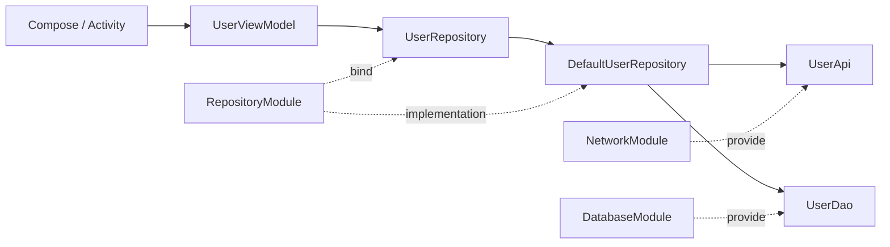
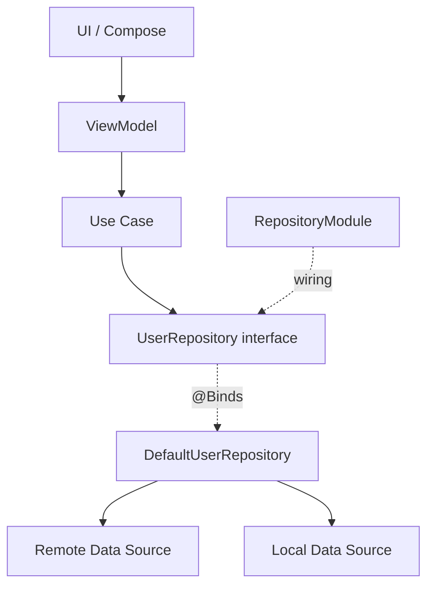
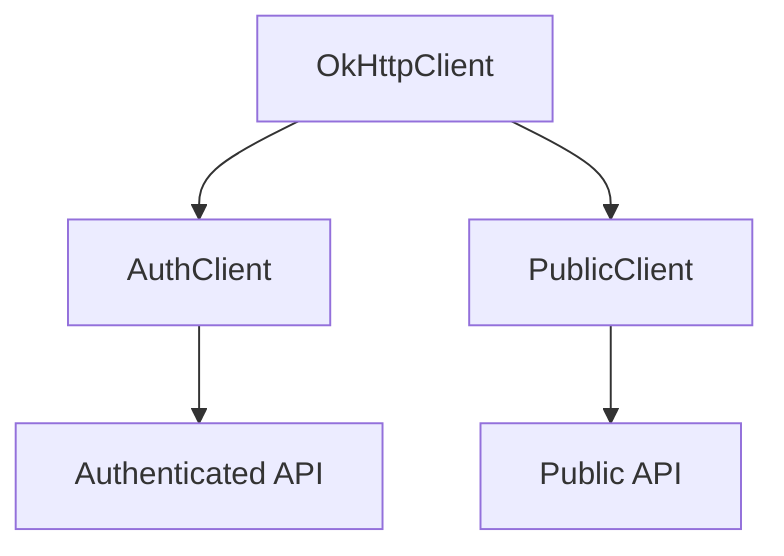
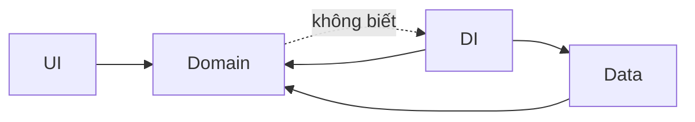

# 031 - Module Binding

[](https://developer.android.com/training/dependency-injection/manual?utm_source=chatgpt.com)

> **Ảnh minh họa:** application graph trong Android: UI → ViewModel → Repository → local/remote data source. Module Binding là một trong các cơ chế giúp Hilt/Dagger biết **object nào phải được tạo để thỏa mãn từng dependency trong graph này**. Android khuyến nghị dùng Hilt cho Dependency Injection trong ứng dụng Android. ([Android Developers][1])

| Thuộc tính              | Nội dung                                                   |
| ----------------------- | ---------------------------------------------------------- |
| **Học phần**            | 03 - Architecture, State and Data                          |
| **Module**              | Module 05 - Design and Architecture                        |
| **Nhóm nội dung**       | Dependency Injection                                       |
| **Nguồn roadmap**       | Design and Architecture / Dependency Injection             |
| **Loại bài**            | Architecture                                               |
| **Thứ tự trong module** | 031                                                        |
| **Thời lượng gợi ý**    | 34 phút                                                    |
| **Trọng tâm**           | Hilt/Dagger `@Module`, `@Binds`, `@Provides`, `@InstallIn` |

---

## 1. Tóm tắt

**Module Binding** là cách khai báo cho Dependency Injection framework biết:

> **Khi code yêu cầu type `X`, Hilt/Dagger phải lấy hoặc tạo object nào để cung cấp `X`?**

Trong Dagger, một **module** là class được đánh dấu `@Module` và chứa các binding như `@Provides` hoặc `@Binds`. Với Hilt, module còn cần `@InstallIn` để xác định binding thuộc Hilt component nào. ([Dagger][2])

Ví dụ:

```kotlin
interface UserRepository

class DefaultUserRepository @Inject constructor(
    private val api: UserApi
) : UserRepository
```

Hilt biết cách tạo:

```text
DefaultUserRepository
```

nhờ `@Inject constructor`.

Nhưng khi một ViewModel yêu cầu:

```kotlin
UserRepository
```

Hilt chưa tự biết:

```text
UserRepository
        ↓
DefaultUserRepository
```

Ta phải **bind** interface với implementation:

```kotlin
@Module
@InstallIn(SingletonComponent::class)
abstract class RepositoryModule {

    @Binds
    abstract fun bindUserRepository(
        impl: DefaultUserRepository
    ): UserRepository
}
```

Android Developers mô tả `@Binds` chính là cách chỉ cho Hilt biết implementation nào được sử dụng khi một interface được yêu cầu. ([Android Developers][3])

---

# 2. Mục tiêu học tập

Sau bài này, bạn nên có thể:

* Giải thích **Module Binding** bằng dependency graph.
* Hiểu sự khác nhau giữa:

  * Constructor Injection
  * `@Binds`
  * `@Provides`
* Biết vai trò của:

  * `@Module`
  * `@InstallIn`
  * `@Binds`
  * `@Provides`
  * Scope
  * Qualifier
* Bind interface với implementation.
* Cung cấp object không thể constructor-inject.
* Chọn đúng Hilt component cho binding.
* Thay production binding bằng fake trong test.
* Phát hiện các lỗi như:

  * Missing binding
  * Duplicate binding
  * Wrong scope
  * Wrong component
* Thiết kế UI không phụ thuộc trực tiếp vào data implementation.

---

# 3. Module Binding nằm ở đâu trong Dependency Injection?

Có thể hình dung DI bằng một graph:



Module không phải business logic.

Nó chủ yếu là **wiring layer**:

```text
Application code
     │
     │ yêu cầu abstraction
     ▼
UserRepository
     │
     │ Module Binding
     ▼
DefaultUserRepository
     │
     ├── UserApi
     └── UserDao
```

Dagger mô hình hóa dependency injection dưới dạng directed graph gồm các binding, dependency key và entry point; nếu một key không có binding thì graph bị thiếu dependency, còn nhiều binding cho cùng key có thể dẫn tới duplicate binding. ([Dagger][2])

---

# 4. Không nhầm Hilt Module với Gradle Module

Đây là hai khái niệm hoàn toàn khác nhau.

| Khái niệm          | Ví dụ                                 | Vai trò                     |
| ------------------ | ------------------------------------- | --------------------------- |
| Gradle module      | `:app`, `:feature-home`, `:core-data` | Chia cấu trúc project/build |
| Hilt/Dagger module | `NetworkModule`, `RepositoryModule`   | Khai báo dependency binding |

Android Developers cũng lưu ý rõ rằng **Hilt modules khác Gradle modules**. ([Android Developers][3])

Ví dụ:

```text
Android Project

:app
:data
:domain
:feature-home
```

Bên trong `:data` lại có thể tồn tại:

```text
RepositoryModule.kt
NetworkModule.kt
DatabaseModule.kt
```

---

# 5. Constructor Injection trước, Module Binding sau

Một nguyên tắc quan trọng là:

> Nếu class do bạn sở hữu và có thể constructor-inject rõ ràng, hãy ưu tiên constructor injection.

Hilt module đặc biệt cần thiết khi type không thể constructor-inject, chẳng hạn interface hoặc class của thư viện mà bạn không kiểm soát. Android Developers nêu chính các trường hợp này khi giới thiệu Hilt modules. ([Android Developers][3])

## Constructor Injection

```kotlin
class DefaultUserRepository @Inject constructor(
    private val api: UserApi,
    private val dao: UserDao
)
```

Dependency hoàn toàn rõ:

```text
DefaultUserRepository
├── UserApi
└── UserDao
```

Không cần viết:

```kotlin
@Provides
fun provideUserRepository(...)
```

nếu không có lý do đặc biệt.

---

# 6. Khi nào cần Module Binding?

Ba tình huống phổ biến:

```mermaid
flowchart TD
    A[Cần dependency] --> B{Có thể @Inject constructor?}

    B -->|Có| C[Constructor Injection]
    B -->|Không| D{Interface → Implementation?}

    D -->|Có| E[@Binds]
    D -->|Không| F[@Provides]

    F --> G[Builder / Factory / third-party object]
```

Hilt documentation mô tả `@Binds` cho interface binding, còn `@Provides` phù hợp khi Hilt không thể constructor-inject type — ví dụ object phải được tạo qua builder hoặc class từ thư viện bên ngoài. ([Android Developers][3])

---

# 7. `@Module`

`@Module` nói với Dagger/Hilt:

> Class này chứa các quy tắc tạo/bind dependency.

Ví dụ:

```kotlin
@Module
@InstallIn(SingletonComponent::class)
abstract class RepositoryModule
```

Trong Dagger semantics, các method `@Provides` và `@Binds` nằm trong `@Module` chính là các binding của module đó. ([Dagger][2])

---

# 8. `@Binds`

## 8.1 Trường hợp điển hình

Ta có abstraction:

```kotlin
interface UserRepository {
    suspend fun getUser(): User
}
```

Implementation:

```kotlin
class DefaultUserRepository @Inject constructor(
    private val api: UserApi
) : UserRepository {

    override suspend fun getUser(): User {
        return api.getUser()
    }
}
```

ViewModel chỉ phụ thuộc abstraction:

```kotlin
@HiltViewModel
class UserViewModel @Inject constructor(
    private val repository: UserRepository
) : ViewModel()
```

Nhưng Hilt cần biết:

```text
UserRepository = DefaultUserRepository
```

Ta tạo binding:

```kotlin
@Module
@InstallIn(SingletonComponent::class)
abstract class RepositoryModule {

    @Binds
    abstract fun bindUserRepository(
        impl: DefaultUserRepository
    ): UserRepository
}
```

Trong `@Binds`, **return type** là type được yêu cầu và **parameter type** là implementation Hilt phải dùng. ([Android Developers][3])

---

## 8.2 Đọc `@Binds` bằng tiếng Việt

Đoạn:

```kotlin
@Binds
abstract fun bindUserRepository(
    impl: DefaultUserRepository
): UserRepository
```

có thể đọc thành:

> Khi ai đó cần `UserRepository`, hãy cung cấp `DefaultUserRepository`.

Dagger mô tả logic của `@Binds` như một identity binding: một implementation đã có trong graph được expose dưới một key/type khác, thường là abstraction của nó. ([Dagger][2])

---

# 9. `@Provides`

Không phải object nào cũng có thể dùng:

```kotlin
@Inject constructor(...)
```

Ví dụ điển hình:

```text
Retrofit
OkHttpClient
RoomDatabase
third-party SDK
Builder-created object
```

Android Developers dùng chính Retrofit, OkHttp và Room như ví dụ về những type thường phải cung cấp thông qua `@Provides`. ([Android Developers][3])

Ví dụ:

```kotlin
@Module
@InstallIn(SingletonComponent::class)
object NetworkModule {

    @Provides
    @Singleton
    fun provideUserApi(
        retrofit: Retrofit
    ): UserApi {
        return retrofit.create(UserApi::class.java)
    }
}
```

Một method `@Provides` cho Hilt ba thông tin:

```text
parameters  → dependency cần để tạo object
return type → object được cung cấp
body        → cách tạo object
```

Đây cũng chính là semantics mà Hilt documentation mô tả cho `@Provides`. ([Android Developers][3])

---

# 10. `@Binds` hay `@Provides`?

| Tình huống                               | Nên dùng              |
| ---------------------------------------- | --------------------- |
| `Interface -> Implementation`            | `@Binds`              |
| Implementation có `@Inject constructor`  | `@Binds`              |
| Class từ library ngoài                   | `@Provides`           |
| Cần builder                              | `@Provides`           |
| Cần gọi factory                          | `@Provides`           |
| Cần logic tạo object                     | `@Provides`           |
| Class của bạn và constructor inject được | `@Inject constructor` |

Ví dụ:

```text
UserRepository
      │
      │ @Binds
      ▼
DefaultUserRepository
```

Nhưng:

```text
Retrofit.Builder()
      │
      │ @Provides
      ▼
Retrofit
```

`@Binds` và `@Provides` đều tạo binding, nhưng `@Provides` có function body thực hiện logic tạo object, còn `@Binds` chỉ liên kết một type với implementation tương ứng. ([Dagger][2])

---

# 11. `@InstallIn`

Với Hilt, viết:

```kotlin
@Module
```

chưa đủ.

Bạn còn phải xác định module thuộc component nào:

```kotlin
@InstallIn(SingletonComponent::class)
```

Android Developers định nghĩa `@InstallIn` là cách chỉ ra Hilt component mà module được cài đặt vào; binding sau đó khả dụng trong component đó và các vị trí phù hợp trong hierarchy. ([Android Developers][3])

Ví dụ:

```kotlin
@Module
@InstallIn(SingletonComponent::class)
abstract class RepositoryModule
```

---

# 12. Component và lifecycle

Một binding không chỉ trả lời:

> Object nào?

Nó còn liên quan tới:

> Object sống trong phạm vi nào?

Một số Hilt component quan trọng:

| Component                   | Scope thường đi cùng      | Phạm vi           |
| --------------------------- | ------------------------- | ----------------- |
| `SingletonComponent`        | `@Singleton`              | Application       |
| `ActivityRetainedComponent` | `@ActivityRetainedScoped` | Activity retained |
| `ViewModelComponent`        | `@ViewModelScoped`        | ViewModel         |
| `ActivityComponent`         | `@ActivityScoped`         | Activity          |
| `FragmentComponent`         | `@FragmentScoped`         | Fragment          |
| `ServiceComponent`          | `@ServiceScoped`          | Service           |

Hilt gắn component với lifecycle Android; `ActivityRetainedComponent` đặc biệt tồn tại qua configuration changes, trong khi `ActivityComponent` gắn với một Activity instance. ([Dagger][4])

---

## Ví dụ

```kotlin
@Module
@InstallIn(SingletonComponent::class)
abstract class RepositoryModule {

    @Binds
    @Singleton
    abstract fun bindRepository(
        impl: DefaultUserRepository
    ): UserRepository
}
```

Ý nghĩa:

```text
Application
│
├── SingletonComponent
│       │
│       └── UserRepository
│            ↓
│       DefaultUserRepository
│
├── Activity A
│
└── Activity B
```

Hai consumer trong cùng application graph có thể nhận cùng instance khi binding được scope đúng với `SingletonComponent`. Ngược lại, binding mặc định là **unscoped**, tức framework có thể tạo instance mới cho mỗi lần binding được yêu cầu. ([Dagger][4])

---

# 13. `@InstallIn` không đồng nghĩa với scope

Đây là lỗi hiểu rất phổ biến.

```kotlin
@Module
@InstallIn(SingletonComponent::class)
object NetworkModule {

    @Provides
    fun provideApi(): UserApi {
        ...
    }
}
```

Không có nghĩa `UserApi` tự động là singleton.

Nếu muốn binding scoped:

```kotlin
@Provides
@Singleton
fun provideApi(): UserApi
```

Hilt/Dagger mặc định coi binding là unscoped; module được cài vào một component **không tự động biến mọi binding thành scoped binding**. ([Dagger][4])

---

# 14. Scope phải phù hợp component

Không nên viết:

```kotlin
@Module
@InstallIn(ActivityComponent::class)
object WrongModule {

    @Provides
    @Singleton
    fun provideSomething(): Something {
        ...
    }
}
```

Binding nằm trong `ActivityComponent` phải dùng scope tương thích với component đó, chẳng hạn `@ActivityScoped`; tài liệu Hilt yêu cầu scope của binding phải tương ứng với scope component nơi module được cài đặt. ([Dagger][4])

Đúng hơn:

```kotlin
@Module
@InstallIn(ActivityComponent::class)
object ActivityModule {

    @Provides
    @ActivityScoped
    fun provideSomething(): Something {
        return Something()
    }
}
```

---

# 15. Module Binding và Clean Architecture

Một kiến trúc tốt thường là:



Điểm quan trọng:

```text
ViewModel
   ↓
UserRepository
```

thay vì:

```text
ViewModel
   ↓
DefaultUserRepository
```

Như vậy consumer phụ thuộc abstraction, còn quyết định implementation được chuyển sang DI graph.

Đây là lý do DI làm việc thay implementation trong test thuận lợi hơn; Android documentation cũng nhấn mạnh DI giúp thay dependency production bằng fake/mock khi test. ([Android Developers][5])

---

# 16. Ví dụ hoàn chỉnh: User Profile

Giả sử app có màn hình:

```text
ProfileScreen
```

Yêu cầu:

```text
Load user
    ↓
Repository
    ↓
API
```

## 16.1 Domain abstraction

```kotlin
interface UserRepository {

    suspend fun getUser(
        id: String
    ): User
}
```

---

## 16.2 Data implementation

```kotlin
class DefaultUserRepository @Inject constructor(
    private val api: UserApi
) : UserRepository {

    override suspend fun getUser(
        id: String
    ): User {
        return api.getUser(id)
    }
}
```

---

## 16.3 Repository binding

```kotlin
@Module
@InstallIn(SingletonComponent::class)
abstract class RepositoryModule {

    @Binds
    abstract fun bindUserRepository(
        impl: DefaultUserRepository
    ): UserRepository
}
```

Graph lúc này:

```mermaid
flowchart LR
    VM[ProfileViewModel] --> I[UserRepository]
    I -->|@Binds| R[DefaultUserRepository]
    R --> API[UserApi]
```

---

## 16.4 Network binding

```kotlin
@Module
@InstallIn(SingletonComponent::class)
object NetworkModule {

    @Provides
    @Singleton
    fun provideUserApi(
        retrofit: Retrofit
    ): UserApi {
        return retrofit.create(UserApi::class.java)
    }
}
```

---

## 16.5 ViewModel

```kotlin
@HiltViewModel
class ProfileViewModel @Inject constructor(
    private val repository: UserRepository
) : ViewModel() {

    fun loadUser(id: String) {
        viewModelScope.launch {
            val user = repository.getUser(id)

            // Update UI state
        }
    }
}
```

Dependency direction:

```text
ProfileScreen
      ↓
ProfileViewModel
      ↓
UserRepository
      ↑
      │ @Binds
DefaultUserRepository
      ↓
UserApi
```

---

# 17. Một Module Binding tốt giúp UI không biết data source

Không nên:

```kotlin
class ProfileViewModel(
    private val retrofit: Retrofit,
    private val database: AppDatabase
)
```

ViewModel lúc này biết quá nhiều chi tiết infrastructure.

Tốt hơn:

```kotlin
class ProfileViewModel @Inject constructor(
    private val repository: UserRepository
)
```

Sau đó:

```text
UI
 ↓
ViewModel
 ↓
Repository interface
 ↓
Repository implementation
 ↓
API / Database
```

Module Binding nằm ở ranh giới:

```text
interface
    ↕
implementation
```

chứ không nằm trong UI.

---

# 18. Multiple Binding và `@Qualifier`

Giả sử app có:

```text
OkHttpClient A → API thông thường
OkHttpClient B → API cần authentication
```

Nếu cả hai đều chỉ có type:

```kotlin
OkHttpClient
```

DI container phải có cách phân biệt.

Hilt hỗ trợ **Qualifier** để tạo các binding khác nhau cho cùng một type. Android Developers cũng khuyến nghị khi đã qualifier một dependency có nhiều biến thể thì nên qualifier tất cả các cách cung cấp dependency đó để tránh chọn nhầm binding. ([Android Developers][3])

Ví dụ:

```kotlin
@Qualifier
@Retention(AnnotationRetention.BINARY)
annotation class AuthClient

@Qualifier
@Retention(AnnotationRetention.BINARY)
annotation class PublicClient
```

Binding:

```kotlin
@Module
@InstallIn(SingletonComponent::class)
object NetworkModule {

    @AuthClient
    @Provides
    fun provideAuthClient(): OkHttpClient {
        return OkHttpClient.Builder()
            .build()
    }

    @PublicClient
    @Provides
    fun providePublicClient(): OkHttpClient {
        return OkHttpClient.Builder()
            .build()
    }
}
```

Consumer:

```kotlin
class UserRemoteDataSource @Inject constructor(
    @AuthClient
    private val client: OkHttpClient
)
```

Graph:



---

# 19. Lỗi Missing Binding

Ví dụ:

```kotlin
interface UserRepository
```

ViewModel:

```kotlin
class UserViewModel @Inject constructor(
    repository: UserRepository
)
```

Nhưng quên:

```kotlin
@Binds
```

Graph:

```text
UserViewModel
     ↓
UserRepository
     ↓
     ❌ ???
```

Dagger không tìm thấy binding tương ứng với key `UserRepository`.

Trong dependency graph terminology của Dagger, một key không có binding là **missing binding**. ([Dagger][2])

Cách kiểm tra:

```text
UserRepository
      │
      ├── Có @Inject constructor?
      │
      ├── Có @Binds?
      │
      ├── Có @Provides?
      │
      └── Module có @InstallIn đúng không?
```

---

# 20. Lỗi Duplicate Binding

Ví dụ:

```kotlin
@Binds
abstract fun bindA(
    impl: RepositoryA
): UserRepository
```

và:

```kotlin
@Binds
abstract fun bindB(
    impl: RepositoryB
): UserRepository
```

Cả hai đều cung cấp:

```text
UserRepository
```

Graph:

```text
           RepositoryA
          /
UserRepository
          \
           RepositoryB
```

DI container không có đủ thông tin để chọn.

Trong semantics của Dagger, một key có nhiều binding phù hợp có thể trở thành **duplicate binding**. ([Dagger][2])

Một giải pháp là qualifier:

```text
@Remote UserRepository

@Local UserRepository
```

---

# 21. Module Binding và state

Module Binding không trực tiếp quản lý:

```text
Loading
Success
Error
```

nhưng **scope của dependency** có thể ảnh hưởng đến state.

Ví dụ một object chứa cache:

```kotlin
class SessionCache {
    var user: User? = null
}
```

Nếu cần tồn tại toàn application:

```text
SingletonComponent
```

có thể phù hợp hơn một Activity-level component.

Nếu binding chỉ cần sống cùng ViewModel:

```text
ViewModelComponent
```

có thể phù hợp hơn.

Hilt component lifecycle quyết định lifetime tối đa của scoped binding; `ViewModelComponent` tồn tại cùng ViewModel và `ActivityRetainedComponent` sống qua configuration changes. ([Dagger][4])

---

# 22. Rotation và lifecycle

Giả sử binding:

```text
ActivityComponent
```

Activity bị recreate khi configuration thay đổi:

```text
Activity A
   ↓
destroy

Activity B
   ↓
create
```

Activity component tương ứng cũng thay đổi.

Trong khi `ActivityRetainedComponent` được Hilt thiết kế để tồn tại qua configuration changes. ([Dagger][4])

Do đó trước khi chọn scope hãy hỏi:

```text
Dependency cần sống bao lâu?
```

Không nên mặc định:

```text
mọi thứ = @Singleton
```

Dagger documentation thậm chí lưu ý scoping có chi phí về generated code và runtime, vì vậy chỉ nên scope khi lifecycle/correctness thực sự yêu cầu. ([Dagger][4])

---

# 23. Module Binding và Testing

Đây là một trong những giá trị lớn nhất của abstraction.

Production:

```text
UserRepository
      ↓
DefaultUserRepository
```

Test:

```text
UserRepository
      ↓
FakeUserRepository
```

Unit test với constructor injection thường thậm chí không cần khởi động Hilt; bạn có thể instantiate class trực tiếp và truyền fake dependency vào constructor. Android Hilt testing guide khuyến nghị chính cách này cho unit tests. ([Android Developers][5])

---

## Fake Repository

```kotlin
class FakeUserRepository : UserRepository {

    override suspend fun getUser(
        id: String
    ): User {
        return User(
            id = id,
            name = "Test User"
        )
    }
}
```

Test:

```kotlin
@Test
fun loadUser_returnsUser() = runTest {

    val repository = FakeUserRepository()

    val viewModel = ProfileViewModel(
        repository = repository
    )

    viewModel.loadUser("1")

    // assert state
}
```

Graph test:

```text
ProfileViewModel
      ↓
UserRepository
      ↓
FakeUserRepository
```

Không cần:

```text
Retrofit
Internet
Server thật
Database thật
```

---

# 24. Thay Hilt Binding trong integration/UI test

Với Hilt test, production module có thể được thay bằng test module.

Production:

```kotlin
@Module
@InstallIn(SingletonComponent::class)
abstract class RepositoryModule {

    @Binds
    abstract fun bindRepository(
        impl: DefaultUserRepository
    ): UserRepository
}
```

Test:

```kotlin
@Module
@TestInstallIn(
    components = [SingletonComponent::class],
    replaces = [RepositoryModule::class]
)
abstract class FakeRepositoryModule {

    @Binds
    abstract fun bindRepository(
        fake: FakeUserRepository
    ): UserRepository
}
```

Hilt testing documentation hỗ trợ trực tiếp `@TestInstallIn` để thay production module cho toàn bộ test source set; với một test riêng lẻ có thể dùng `@UninstallModules` hoặc `@BindValue` tùy trường hợp. ([Android Developers][5])

Graph production:

```text
UserRepository
      ↓
DefaultUserRepository
```

Graph test:

```text
UserRepository
      ↓
FakeUserRepository
```

UI không thay đổi.

ViewModel không thay đổi.

Use case không thay đổi.

Đây chính là **test seam** mà bài thực hành yêu cầu.

---

# 25. Service Locator so với Module Binding

Một kiểu code dễ tạo hidden dependency:

```kotlin
object ServiceLocator {

    val repository =
        DefaultUserRepository(...)
}
```

Consumer:

```kotlin
class UserViewModel {

    private val repository =
        ServiceLocator.repository
}
```

Dependency bị giấu bên trong class:

```text
UserViewModel
     │
     └── tự đi tìm dependency
```

Constructor injection rõ hơn:

```kotlin
class UserViewModel @Inject constructor(
    private val repository: UserRepository
)
```

```text
UserViewModel(repository)
```

Chỉ nhìn constructor đã biết dependency của class là gì. DI cũng giúp việc swap implementation bằng fake dễ dàng hơn. ([Dagger][6])

---

# 26. Cấu trúc project đề xuất

Ví dụ:

```text
com.example.app
│
├── ui/
│   └── profile/
│       ├── ProfileScreen.kt
│       └── ProfileViewModel.kt
│
├── domain/
│   ├── model/
│   │   └── User.kt
│   │
│   └── repository/
│       └── UserRepository.kt
│
├── data/
│   ├── repository/
│   │   └── DefaultUserRepository.kt
│   │
│   ├── remote/
│   │   └── UserApi.kt
│   │
│   └── local/
│       └── UserDao.kt
│
└── di/
    ├── RepositoryModule.kt
    ├── NetworkModule.kt
    └── DatabaseModule.kt
```

Dependency direction:



`di/` là nơi wiring implementation với abstraction.

---

# 27. Anti-pattern: Module quá lớn

Không nên tạo:

```text
AppModule.kt
```

chứa tất cả:

```text
Retrofit
Room
Repositories
Analytics
Preferences
Dispatchers
Managers
UseCases
...
```

Trong project lớn, dễ đọc hơn nếu module phản ánh nhóm responsibility:

```text
NetworkModule
DatabaseModule
RepositoryModule
AnalyticsModule
DispatcherModule
```

Dagger cũng khuyến khích module có mục đích/binding rõ ràng vì modules là đơn vị cấu hình và thay thế dependency. ([Dagger][6])

---

# 28. Anti-pattern: dùng `@Provides` cho mọi thứ

Ví dụ dư thừa:

```kotlin
@Module
@InstallIn(SingletonComponent::class)
object RepositoryModule {

    @Provides
    fun provideRepository(
        api: UserApi
    ): DefaultUserRepository {
        return DefaultUserRepository(api)
    }
}
```

Trong khi có thể đơn giản:

```kotlin
class DefaultUserRepository @Inject constructor(
    private val api: UserApi
)
```

Sau đó chỉ cần binding abstraction nếu cần:

```kotlin
@Binds
abstract fun bindRepository(
    impl: DefaultUserRepository
): UserRepository
```

Hilt modules chủ yếu giải quyết những type Hilt **không thể** constructor-inject trực tiếp, thay vì thay thế constructor injection một cách không cần thiết. ([Android Developers][3])

---

# 29. Anti-pattern: mọi dependency đều `@Singleton`

Ví dụ:

```text
Formatter          @Singleton
Validator          @Singleton
Mapper             @Singleton
UseCase            @Singleton
SmallHelper        @Singleton
```

không phải lúc nào cũng cần.

Binding không scope thường đủ với các object:

* Stateless.
* Rẻ để tạo.
* Không yêu cầu identity.
* Không cần giữ state giữa consumer.

Dagger/Hilt mặc định để binding unscoped và khuyến nghị dùng scoping có chủ đích thay vì áp dụng tự động cho mọi dependency. ([Dagger][4])

---

# 30. Debug dependency graph

Khi Hilt báo lỗi compile, có thể đọc graph theo hướng:

```text
Ai đang yêu cầu dependency?
         ↓
Type được yêu cầu là gì?
         ↓
Hilt có binding type đó không?
         ↓
Implementation có thể tạo được không?
         ↓
Dependency của implementation có đầy đủ không?
```

Ví dụ:

```text
ProfileViewModel
       ↓
UserRepository
       ↓
DefaultUserRepository
       ↓
UserApi
       ↓
Retrofit
```

Nếu:

```text
Retrofit ❌
```

thì toàn graph phía trên cũng không thể được tạo.

---

# 31. Quy trình chọn binding

Có thể dùng decision tree sau:

```mermaid
flowchart TD
    A[Dependency X] --> B{Bạn sở hữu class X?}

    B -->|Có| C{Constructor có thể inject?}
    B -->|Không| F[@Provides]

    C -->|Có| D[@Inject constructor]
    C -->|Không| F

    D --> E{Consumer yêu cầu interface?}

    E -->|Có| G[@Binds interface → implementation]
    E -->|Không| H[Không cần module binding]

    F --> I{Có nhiều binding cùng type?}

    G --> I

    I -->|Có| J[Thêm @Qualifier]
    I -->|Không| K[Chọn @InstallIn + scope phù hợp]
```

---

# 32. Module Binding ảnh hưởng UX như thế nào?

Người dùng không nhìn thấy:

```text
@Binds
@Provides
@Module
```

nhưng họ nhìn thấy hậu quả của kiến trúc:

```text
Binding sai
   ↓
dependency graph sai
   ↓
build lỗi / runtime behavior sai
```

hoặc:

```text
scope sai
   ↓
state/cache không sống đúng lifecycle
   ↓
dữ liệu reset hoặc giữ lâu hơn dự kiến
```

hoặc:

```text
implementation khó thay
   ↓
test yếu
   ↓
regression khó phát hiện
   ↓
UX production dễ lỗi hơn
```

Vì vậy Module Binding chủ yếu tác động gián tiếp đến **maintainability, testability, lifecycle correctness và release reliability**. Hilt được Android thiết kế để chuẩn hóa DI, quản lý container theo lifecycle và hỗ trợ thay binding trong test. ([Android Developers][3])

---

# 33. Thực hành

## Bài thực hành: Profile Feature

Tạo:

```text
ProfileScreen
ProfileViewModel
UserRepository
DefaultUserRepository
FakeUserRepository
RepositoryModule
```

Yêu cầu dependency:

```mermaid
flowchart TD
    PS[ProfileScreen]
    VM[ProfileViewModel]
    RI[UserRepository]
    R[DefaultUserRepository]
    API[UserApi]

    PS --> VM
    VM --> RI
    RI -->|@Binds| R
    R --> API
```

### Bước 1

Tạo:

```kotlin
interface UserRepository
```

### Bước 2

Tạo:

```kotlin
class DefaultUserRepository @Inject constructor(...)
```

### Bước 3

Bind:

```kotlin
@Binds
abstract fun bindRepository(
    impl: DefaultUserRepository
): UserRepository
```

### Bước 4

Inject vào:

```kotlin
ProfileViewModel
```

### Bước 5

Tạo:

```text
FakeUserRepository
```

### Bước 6

Unit test ViewModel mà không gọi API thật.

---

# 34. Bài tập

Refactor một screen đang có dependency kiểu:

```kotlin
val repository =
    DefaultUserRepository(
        UserApi(...)
    )
```

thành:

```text
UI
 ↓
ViewModel
 ↓
Repository interface
 ↓
Module Binding
 ↓
Repository implementation
 ↓
Data source
```

### Yêu cầu

Có ít nhất:

```text
1 interface
1 implementation
1 @Inject constructor
1 @Binds
1 @Provides
1 Hilt component
1 fake implementation
1 unit test
```

---

# 35. Artifact đưa vào portfolio

Có thể tạo mini project:

```text
hilt-module-binding-demo/
│
├── README.md
├── app/
├── screenshots/
│   └── profile.png
└── docs/
    └── dependency-graph.md
```

README nên có:

```text
# Hilt Module Binding Demo

## Architecture

UI
↓
ViewModel
↓
Repository
↓
API

## DI

UserRepository
    ↓ @Binds
DefaultUserRepository

Retrofit
    ↓ @Provides
UserApi

## Testing

Production:
UserRepository → DefaultUserRepository

Test:
UserRepository → FakeUserRepository
```

Đây là artifact nhỏ nhưng thể hiện được:

* Architecture.
* Dependency inversion.
* Hilt.
* Testing.
* Lifecycle/scoping.
* Debugging dependency graph.

---

# 36. Checklist hoàn thành

## Kiến thức

* [ ] Giải thích được Module Binding.
* [ ] Phân biệt Hilt module với Gradle module.
* [ ] Hiểu dependency graph.
* [ ] Biết khi nào ưu tiên constructor injection.
* [ ] Biết khi nào dùng `@Binds`.
* [ ] Biết khi nào dùng `@Provides`.
* [ ] Hiểu `@InstallIn`.
* [ ] Hiểu scope không tự xuất hiện chỉ vì module được install.
* [ ] Biết dùng qualifier khi có nhiều binding cùng type.

## Code

* [ ] Có một interface.
* [ ] Có một implementation.
* [ ] Implementation dùng constructor injection.
* [ ] Interface được bind bằng `@Binds`.
* [ ] Có ít nhất một dependency dùng `@Provides`.
* [ ] UI không truy cập trực tiếp API/database.

## Testing

* [ ] Có `FakeRepository`.
* [ ] Có ViewModel unit test.
* [ ] Không cần network thật cho unit test.
* [ ] Hiểu `@TestInstallIn`.
* [ ] Biết production binding có thể được thay bằng fake binding. ([Android Developers][5])

## Production

* [ ] Scope phản ánh đúng lifetime.
* [ ] Không `@Singleton` mọi object.
* [ ] Không duplicate binding.
* [ ] Không hidden Service Locator.
* [ ] Network/storage error được chuyển thành UI state phù hợp.
* [ ] Có test bảo vệ user flow chính.

---

# 37. Ghi nhớ nhanh

```text
@Inject constructor
    │
    ├── Class của mình
    └── Hilt tự tạo được
```

```text
@Binds
    │
    └── Interface
          ↓
       Implementation
```

```text
@Provides
    │
    ├── Third-party class
    ├── Builder
    ├── Factory
    └── Custom creation logic
```

```text
@InstallIn
    │
    └── Binding thuộc component nào?
```

```text
@Singleton / @ViewModelScoped / ...
    │
    └── Instance sống bao lâu?
```

Đây là mô hình cốt lõi của Hilt module binding theo tài liệu Android/Dagger hiện tại. ([Android Developers][3])

---

# 38. Câu hỏi tự kiểm tra

1. Vì sao Hilt không tự tạo được một interface?

2. `@Binds` khác `@Provides` ở đâu?

3. Nếu class có `@Inject constructor`, có nhất thiết phải tạo `@Provides` không?

4. Trong đoạn:

```kotlin
@Binds
abstract fun bindRepository(
    impl: DefaultRepository
): Repository
```

type nào là abstraction?

5. `@InstallIn(SingletonComponent::class)` có tự động làm dependency thành singleton không?

6. Nếu có hai binding:

```text
OkHttpClient
OkHttpClient
```

làm sao phân biệt?

7. Binding nào nên sống cùng ViewModel?

8. Vì sao `ActivityRetainedComponent` khác `ActivityComponent` khi rotate?

9. Làm sao thay:

```text
DefaultUserRepository
```

bằng:

```text
FakeUserRepository
```

trong test?

10. Nếu Hilt báo `MissingBinding`, bạn sẽ lần graph từ đâu?

---

# 39. Tổng kết

**Module Binding** là phần nối các node trong Dependency Injection graph:

```mermaid
flowchart LR
    Consumer --> Interface
    Interface -->|@Binds| Implementation
    Implementation --> Dependency
    Dependency -->|@Provides| ExternalObject
```

Trong Android với Hilt:

```text
@Module
    ↓
nơi khai báo binding

@Binds
    ↓
interface → implementation

@Provides
    ↓
cách tạo object

@InstallIn
    ↓
binding thuộc Hilt component nào

Scope
    ↓
instance sống bao lâu

Qualifier
    ↓
phân biệt nhiều binding cùng type
```

Điểm quan trọng nhất không phải thuộc annotation, mà là có thể nhìn một class và trả lời được:

> **Dependency của class này đến từ đâu, implementation nào đang được bind, object sống trong lifecycle nào, và làm thế nào thay nó bằng fake khi test?**

Đó chính là tư duy cần có khi sử dụng Module Binding trong kiến trúc Android production. Hilt hiện là hướng Dependency Injection được Android Developers khuyến nghị cho Android, còn Dagger cung cấp cơ chế graph/binding nền tảng phía dưới. ([Android Developers][3])

[1]: https://developer.android.com/training/dependency-injection?utm_source=chatgpt.com "Dependency injection in Android | App architecture"
[2]: https://dagger.dev/semantics/ "Dagger Core Semantics"
[3]: https://developer.android.com/training/dependency-injection/hilt-android "Dependency injection with Hilt  |  App architecture  |  Android Developers"
[4]: https://dagger.dev/hilt/components.html "Hilt Components"
[5]: https://developer.android.com/training/dependency-injection/hilt-testing "Hilt testing guide  |  App architecture  |  Android Developers"
[6]: https://dagger.dev/dev-guide/ "Dagger"

---

# Bài luyện tập

## Mục tiêu


## Đề bài


## Yêu cầu hoàn thành

- [ ] 
- [ ] 
- [ ] 

## Kết quả / lời giải


## Ghi chú
