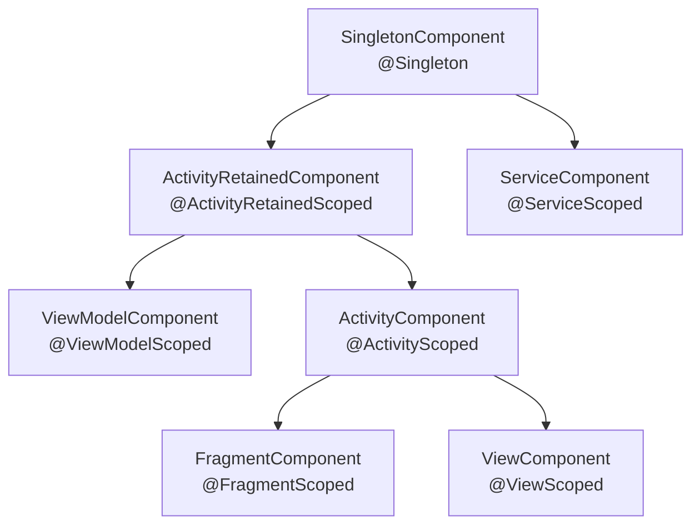
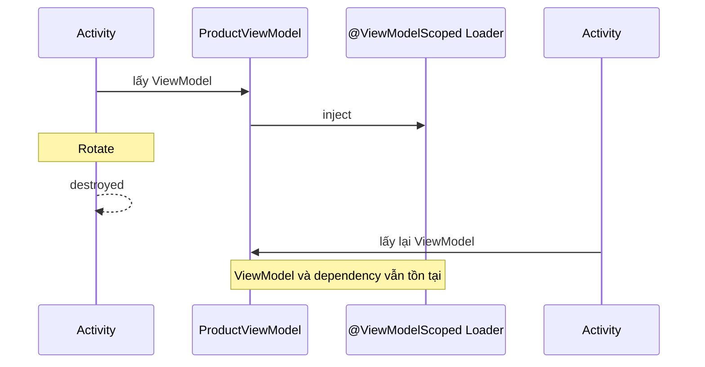
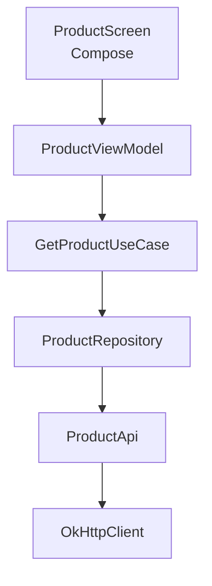
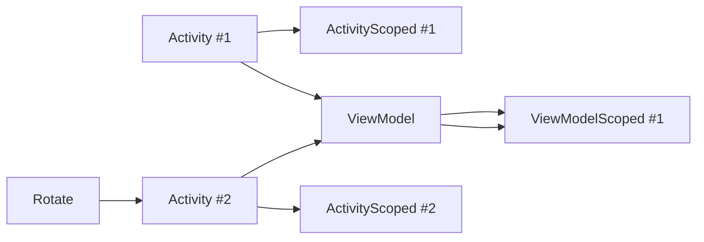
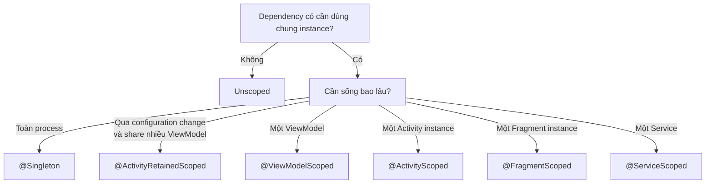
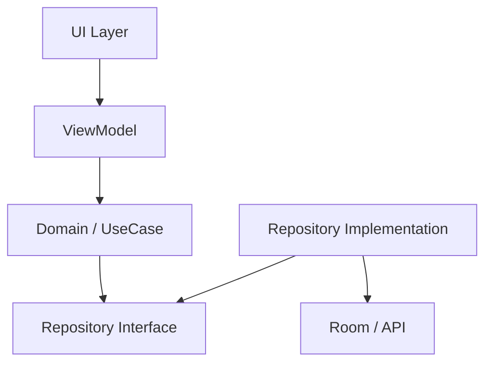
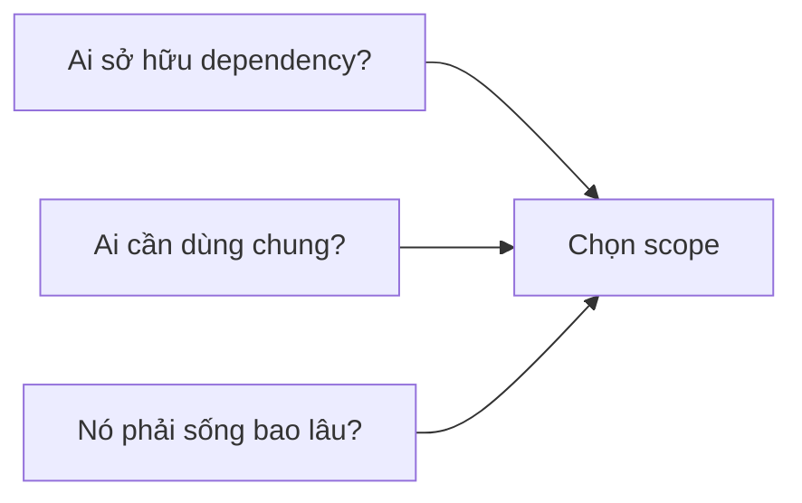
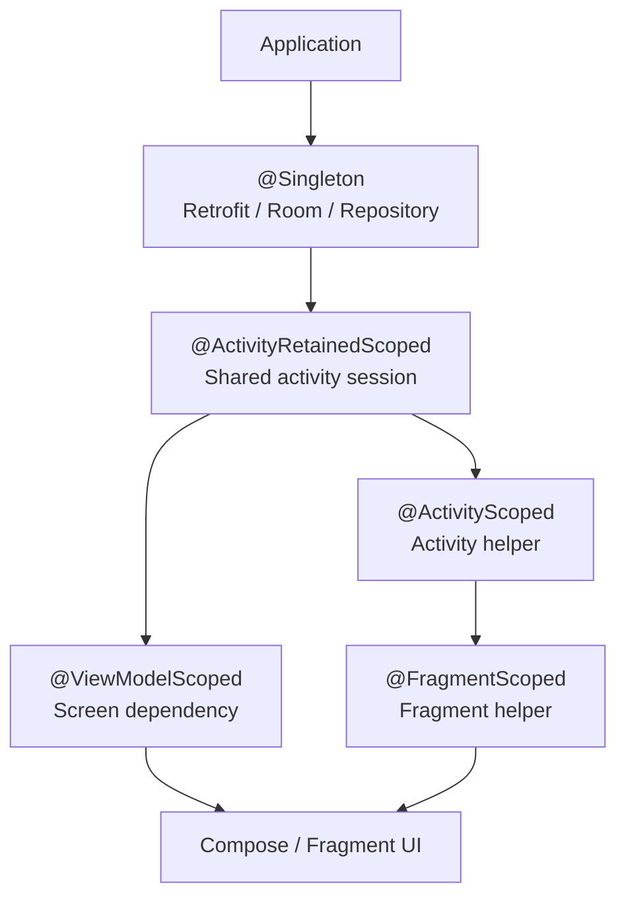

# 032 - Scope Management

| Thuộc tính              | Nội dung                                           |
| ----------------------- | -------------------------------------------------- |
| **Học phần**            | 03 - Architecture, State and Data                  |
| **Module**              | Module 05 - Design and Architecture                |
| **Nhóm nội dung**       | Dependency Injection                               |
| **Nguồn roadmap**       | Design and Architecture / Dependency Injection     |
| **Loại bài**            | Architecture                                       |
| **Thứ tự trong module** | 032                                                |
| **Thời lượng gợi ý**    | 34 phút                                            |
| **Mức độ**              | Trung cấp                                          |
| **Trọng tâm**           | DI Scope, Lifecycle, Hilt Component, State, Memory |

---

## 1. Tóm tắt

**Scope Management** trong Dependency Injection là việc quyết định:

> **Một dependency được tạo ra khi nào, được dùng chung cho những đối tượng nào và bị hủy khi nào.**

Trong Android, vấn đề này đặc biệt quan trọng vì `Application`, `Activity`, `ViewModel`, `Fragment`, `Service`... có **vòng đời khác nhau**.

Hilt giải quyết vấn đề bằng một hệ thống component được gắn trực tiếp với lifecycle của Android. Mặc định, binding của Hilt là **unscoped**: mỗi lần dependency được yêu cầu, Hilt có thể tạo một instance mới. Khi gắn scope, Hilt giữ lại một instance cho mỗi instance của component tương ứng. ([Android Developers][1])

Ví dụ:

```text
Retrofit
    ↓
Repository
    ↓
ViewModel
    ↓
Compose UI
```

Ta cần quyết định:

* `Retrofit` có nên tồn tại toàn ứng dụng?
* `Repository` có cần dùng chung không?
* một object chứa state chỉ nên sống cùng `ViewModel`?
* object của màn hình có nên biến mất khi Activity bị đóng?

Đó chính là **Scope Management**.

---

## 2. Mục tiêu học tập

Sau bài này, anh nên có thể:

* Giải thích được **DI Scope** là gì.
* Phân biệt:

  * `Unscoped`
  * `@Singleton`
  * `@ActivityRetainedScoped`
  * `@ViewModelScoped`
  * `@ActivityScoped`
  * `@FragmentScoped`
  * `@ServiceScoped`
  * `@ViewScoped`
* Hiểu quan hệ giữa **scope và Android lifecycle**.
* Biết vì sao scope quá lớn có thể giữ object trong bộ nhớ lâu không cần thiết.
* Biết vì sao scope quá nhỏ có thể tạo lại object và làm mất state.
* Chọn scope phù hợp cho Repository, Session, Cache, Analytics, ViewModel helper...
* Viết test với fake dependency mà không cần Hilt cho unit test.
* Nhận biết các lỗi scope thường gặp trong production.

---

# 3. Scope Management là gì?

Giả sử có:

```kotlin
class UserRepository @Inject constructor(
    private val api: UserApi
)
```

và:

```kotlin
class ProfileViewModel @Inject constructor(
    private val repository: UserRepository
)
```

Nếu không có scope:

```text
ProfileViewModel
        │
        ▼
new UserRepository()
```

Một nơi khác yêu cầu `UserRepository`:

```text
SettingsViewModel
        │
        ▼
new UserRepository()
```

Ta có thể nhận được hai instance khác nhau.

Hilt định nghĩa rằng binding mặc định là **unscoped**. Khi một binding được scope vào component, một instance duy nhất của binding đó được tái sử dụng trong phạm vi **instance của component đó**. ([Android Developers][1])

---

## 4. Scope không đồng nghĩa với `CoroutineScope`

Đây là hai khái niệm dễ nhầm.

### Dependency Injection Scope

Quản lý:

```text
Object được tạo bao nhiêu lần?
        ↓
Ai được dùng chung object?
        ↓
Object sống bao lâu?
```

Ví dụ:

```kotlin
@Singleton
class UserRepository @Inject constructor(...)
```

### CoroutineScope

Quản lý:

```text
Coroutine chạy trong lifecycle nào?
        ↓
Khi nào coroutine bị cancel?
```

Ví dụ:

```kotlin
viewModelScope.launch {
    repository.loadUser()
}
```

Do đó:

```text
DI Scope
    ≠
CoroutineScope
```

---

# 5. Hilt Component Hierarchy

Đây là phần quan trọng nhất khi học Scope Management.


*Nguồn hình: tài liệu chính thức Dagger/Hilt.* Hilt cung cấp sẵn hệ thống component tích hợp với lifecycle Android thay vì yêu cầu developer tự định nghĩa component như cách sử dụng Dagger truyền thống. ([Dagger][2])

Có thể hình dung đơn giản:



Dependency ở component con có thể sử dụng binding từ component cha. Ví dụ binding thuộc `SingletonComponent` có thể được sử dụng bởi Activity, ViewModel hoặc Fragment ở phía dưới hierarchy. ([Dagger][2])

---

# 6. Scope và Android Lifecycle

Hiểu lifecycle là nền tảng để chọn scope đúng.


*Nguồn hình: Android Developers.*

Activity đi qua các callback như:

```text
onCreate()
   ↓
onStart()
   ↓
onResume()
   ↓
onPause()
   ↓
onStop()
   ↓
onDestroy()
```

Khi configuration change như xoay màn hình xảy ra, Activity có thể bị destroy rồi tạo lại. ViewModel lại được thiết kế để tồn tại qua configuration change. ([Android Developers][3])

Vì vậy:

```text
ActivityScoped object
        │
rotate
        ▼
Activity destroyed
        │
        ▼
object destroyed
        │
        ▼
new Activity
        │
        ▼
new object
```

Trong khi:

```text
ActivityRetainedScoped
        │
rotate
        ▼
Activity destroyed/recreated
        │
        ▼
same retained component
        │
        ▼
same scoped object
```

Hilt xác định `ActivityRetainedComponent` tồn tại xuyên configuration change: nó được tạo ở lần `Activity#onCreate()` đầu tiên và chỉ bị hủy sau lần `Activity#onDestroy()` cuối cùng của Activity tương ứng. ([Android Developers][1])

---

# 7. Các scope quan trọng

## 7.1 Unscoped

Không annotation:

```kotlin
class PriceFormatter @Inject constructor()
```

Mặc định:

```text
request
   ↓
new PriceFormatter

request
   ↓
new PriceFormatter

request
   ↓
new PriceFormatter
```

Hilt mặc định coi binding là unscoped. ([Android Developers][1])

### Phù hợp cho

Các object:

* lightweight;
* stateless;
* rẻ để khởi tạo;
* không cần chia sẻ instance.

Ví dụ:

```kotlin
class CurrencyFormatter @Inject constructor() {

    fun format(value: Double): String {
        return "$%.2f".format(value)
    }
}
```

Không nhất thiết phải biến mọi class thành singleton.

---

# 8. `@Singleton`

```kotlin
@Singleton
class UserRepository @Inject constructor(
    private val api: UserApi
)
```

Scope này gắn với:

```text
SingletonComponent
        │
        ▼
Application/process lifetime
```

Hilt liên kết `@Singleton` với `SingletonComponent`; component này được tạo cùng Application-level graph và sống trong vòng đời process của ứng dụng. ([Dagger][2])

### Thường phù hợp với

```text
Application
 ├── Room Database
 ├── OkHttpClient
 ├── Retrofit
 ├── Analytics
 └── App-level Repository
```

Ví dụ:

```kotlin
@Module
@InstallIn(SingletonComponent::class)
object NetworkModule {

    @Provides
    @Singleton
    fun provideApi(): UserApi {
        return Retrofit.Builder()
            .baseUrl("https://example.com/")
            .build()
            .create(UserApi::class.java)
    }
}
```

---

# 9. `@ActivityScoped`

Một dependency được dùng chung trong **một Activity instance**:

```kotlin
@ActivityScoped
class CheckoutTracker @Inject constructor()
```

Quan hệ:

```text
Activity A
 ├── Fragment A
 │      └── CheckoutTracker #1
 │
 └── Fragment B
        └── CheckoutTracker #1
```

Nhưng:

```text
Activity B
     ↓
CheckoutTracker #2
```

Hilt quy định `ActivityComponent` tương ứng với `@ActivityScoped`; scoped object chỉ tồn tại trong lifetime của Activity component tương ứng. ([Dagger][2])

---

## 9.1 Khi xoay màn hình

```text
Activity #1
    │
    └── CheckoutTracker #1

ROTATE

Activity #1 destroyed
CheckoutTracker #1 destroyed

Activity #2 created
    │
    └── CheckoutTracker #2
```

Đây chính là lý do không nên dùng `@ActivityScoped` cho state cần sống qua configuration change.

---

# 10. `@ActivityRetainedScoped`

Scope này hữu ích khi dependency cần tồn tại qua việc Activity được recreate do configuration change.

```kotlin
@ActivityRetainedScoped
class UserSessionCache @Inject constructor()
```

```text
Activity #1
    │
    ▼
UserSessionCache #1

        ROTATE

Activity #2
    │
    ▼
UserSessionCache #1
```

Hilt cung cấp `ActivityRetainedComponent` cho lifecycle này. ([Android Developers][1])

### Phù hợp khi

Dependency:

* cần chia sẻ giữa nhiều ViewModel trong cùng Activity;
* cần sống qua rotate;
* không cần sống toàn process.

---

# 11. `@ViewModelScoped`

Đây là một scope rất quan trọng trong kiến trúc Android hiện đại.

```kotlin
@ViewModelScoped
class ProductLoader @Inject constructor(
    private val repository: ProductRepository
)
```

```kotlin
@HiltViewModel
class ProductViewModel @Inject constructor(
    private val loader: ProductLoader
) : ViewModel()
```

Hilt tạo Hilt ViewModel thông qua `ViewModelComponent`; dependency đánh dấu `@ViewModelScoped` có một instance duy nhất trong dependency graph của ViewModel đó. Một ViewModel khác sẽ nhận instance khác. ([Android Developers][4])

Ví dụ:

```text
ProductViewModel
 ├── ProductLoader #1
 └── RecommendationUseCase
         │
         └── ProductLoader #1
```

Nhưng:

```text
CartViewModel
     │
     └── ProductLoader #2
```

---

## 11.1 ViewModelScoped và rotation

ViewModel sống qua configuration change, nên dependency nằm trong `ViewModelComponent` cũng sống cùng ViewModel tương ứng. ([Android Developers][4])



---

# 12. `@FragmentScoped`

Dependency gắn với một **Fragment instance**:

```kotlin
@FragmentScoped
class ScreenAnalytics @Inject constructor()
```

Có thể hình dung:

```text
Activity
 │
 ├── Fragment A
 │      └── ScreenAnalytics #1
 │
 └── Fragment B
        └── ScreenAnalytics #2
```

Điểm quan trọng:

> `@FragmentScoped` không có nghĩa tất cả Fragment dùng chung một instance.

Mỗi Fragment instance có component riêng, vì vậy scoped dependency cũng theo component của Fragment đó. Hilt định nghĩa `FragmentComponent` và scope tương ứng trong component hierarchy. ([Dagger][2])

---

# 13. `@ServiceScoped`

```kotlin
@ServiceScoped
class LocationSession @Inject constructor()
```

Dependency tồn tại cùng Service:

```text
Service.onCreate()
       │
       ▼
LocationSession created
       │
       │
       ▼
Service running
       │
       ▼
Service.onDestroy()
       │
       ▼
LocationSession eligible for cleanup
```

`ServiceComponent` tương ứng với `@ServiceScoped`. ([Android Developers][1])

---

# 14. Bảng tổng hợp Scope

| Scope                     | Component                   | Lifetime điển hình                            | Ví dụ                |
| ------------------------- | --------------------------- | --------------------------------------------- | -------------------- |
| Unscoped                  | bất kỳ                      | mỗi lần request                               | formatter, mapper    |
| `@Singleton`              | `SingletonComponent`        | application process                           | Retrofit, Room       |
| `@ActivityRetainedScoped` | `ActivityRetainedComponent` | Activity logical lifecycle, qua config change | shared session/cache |
| `@ViewModelScoped`        | `ViewModelComponent`        | ViewModel                                     | screen loader        |
| `@ActivityScoped`         | `ActivityComponent`         | Activity instance                             | activity coordinator |
| `@FragmentScoped`         | `FragmentComponent`         | Fragment instance                             | fragment helper      |
| `@ViewScoped`             | View component              | View instance                                 | view helper          |
| `@ServiceScoped`          | `ServiceComponent`          | Service instance                              | service session      |

Các component, scope và lifetime này là những component chuẩn được Hilt cung cấp. ([Dagger][2])

---

# 15. Quy tắc quan trọng: Scope phải phù hợp `@InstallIn`

Ví dụ đúng:

```kotlin
@Module
@InstallIn(SingletonComponent::class)
object NetworkModule {

    @Singleton
    @Provides
    fun provideApi(): UserApi {
        // ...
    }
}
```

Bởi vì:

```text
SingletonComponent
        ↕
@Singleton
```

Tương tự:

```text
ActivityComponent
        ↕
@ActivityScoped
```

Hilt yêu cầu scope của binding phù hợp với scope của component nơi module được cài đặt. ([Dagger][2])

---

# 16. Ví dụ hoàn chỉnh trong ứng dụng Android

Giả sử xây dựng:

```text
E-commerce App
```

Có màn hình:

```text
ProductScreen
```

Architecture:



Một cách chia scope hợp lý:

```text
@Singleton
OkHttpClient
    │
@Singleton
Retrofit
    │
@Singleton
ProductRepository
    │
unscoped
GetProductUseCase
    │
@ViewModelScoped
ProductLoader
    │
ProductViewModel
```

Không phải tất cả dependency đều cần scope.

---

# 17. Data Layer

Đầu tiên tạo interface:

```kotlin
interface ProductRepository {

    suspend fun getProduct(id: String): Product
}
```

Implementation:

```kotlin
class ProductRepositoryImpl @Inject constructor(
    private val api: ProductApi
) : ProductRepository {

    override suspend fun getProduct(id: String): Product {
        return api.getProduct(id)
    }
}
```

Bind implementation:

```kotlin
@Module
@InstallIn(SingletonComponent::class)
abstract class RepositoryModule {

    @Binds
    @Singleton
    abstract fun bindProductRepository(
        implementation: ProductRepositoryImpl
    ): ProductRepository
}
```

---

# 18. Domain Layer

```kotlin
class GetProductUseCase @Inject constructor(
    private val repository: ProductRepository
) {

    suspend operator fun invoke(id: String): Product {
        return repository.getProduct(id)
    }
}
```

Không nhất thiết:

```kotlin
@Singleton
class GetProductUseCase ...
```

Nếu UseCase:

* không có mutable state;
* nhẹ;
* rẻ để tạo;

thì unscoped thường đơn giản hơn.

Android Developers cũng khuyến nghị giảm thiểu scoped binding và chỉ sử dụng khi việc giữ cùng instance thực sự cần thiết, cần synchronization hoặc object đã được đo là tốn kém khi tạo. ([Android Developers][1])

---

# 19. ViewModel Layer

```kotlin
@HiltViewModel
class ProductViewModel @Inject constructor(
    private val getProduct: GetProductUseCase
) : ViewModel() {

    private val _state =
        MutableStateFlow<ProductUiState>(ProductUiState.Loading)

    val state: StateFlow<ProductUiState> =
        _state.asStateFlow()
}
```

Dependency direction:

```text
UI
 ↓
ViewModel
 ↓
UseCase
 ↓
Repository interface
 ↓
Repository implementation
 ↓
API
```

UI không biết:

```text
Retrofit
Room
OkHttp
DAO
```

---

# 20. Scope Management và State

Một nguyên tắc quan trọng:

```text
State cần sống bao lâu?
        ↓
Dependency nên sống tương ứng
```

Ví dụ:

### State chỉ dành cho một ViewModel

```text
Search cache
Filter state
Pagination state
```

Có thể cân nhắc:

```text
@ViewModelScoped
```

---

### State cần chia sẻ giữa nhiều ViewModel của Activity

```text
Checkout session
Wizard state
Temporary selected account
```

Có thể cân nhắc:

```text
@ActivityRetainedScoped
```

Tài liệu Hilt cũng chỉ rõ: nếu một instance phải được chia sẻ giữa nhiều ViewModel, nên xem xét `@ActivityRetainedScoped` hoặc `@Singleton` thay vì `@ViewModelScoped`. ([Android Developers][4])

---

### State toàn ứng dụng

Ví dụ:

```text
Authentication session
Global analytics
App database
```

Có thể cân nhắc:

```text
@Singleton
```

Nhưng dữ liệu quan trọng không nên chỉ phụ thuộc vào object trong RAM vì Android có thể kết thúc toàn bộ process khi cần bộ nhớ. ([Android Developers][3])

---

# 21. Scope không phải cơ chế persistence

Đây là điểm rất quan trọng.

```text
@Singleton
        ≠
persistent forever
```

`@Singleton` chỉ có nghĩa đại ý:

```text
một instance trong SingletonComponent
```

Nếu Android kill process:

```text
Application
    ↓
SingletonComponent
    ↓
Singleton objects

        PROCESS KILLED

tất cả mất
```

Android có thể kill process của ứng dụng để giải phóng RAM; khi process mất thì toàn bộ object nằm trong process cũng mất. ([Android Developers][3])

Vì vậy dữ liệu quan trọng cần:

```text
Room
DataStore
SavedStateHandle
Backend
File
```

chứ không chỉ:

```kotlin
@Singleton
class UserSession
```

---

# 22. Lỗi phổ biến: biến mọi thứ thành Singleton

Ví dụ:

```kotlin
@Singleton
class ProductScreenCache
```

nhưng cache chỉ dành cho:

```text
ProductScreen
```

Kết quả:

```text
Screen đóng
    │
    ▼
Cache vẫn tồn tại
    │
    ▼
Memory giữ lâu hơn cần thiết
```

Tài liệu Android cảnh báo rằng scoped binding giữ object trong bộ nhớ cho đến khi component bị destroy, vì vậy nên hạn chế scope nếu không thật sự cần. ([Android Developers][1])

---

# 23. Lỗi phổ biến: scope quá ngắn

Ví dụ ta có:

```kotlin
class CheckoutSession @Inject constructor()
```

nhưng không scope.

Có thể xảy ra:

```text
CheckoutViewModel
       │
       └── CheckoutSession #1

PaymentUseCase
       │
       └── CheckoutSession #2
```

Nếu cả hai phải chia sẻ:

```text
selectedAddress
coupon
paymentMethod
```

thì kết quả có thể không nhất quán.

Trong trường hợp đó cần xem lại scope phù hợp.

---

# 24. Lỗi phổ biến: giữ `Activity` trong Singleton

Ví dụ nguy hiểm:

```kotlin
@Singleton
class AnalyticsManager @Inject constructor(
    private val activity: Activity
)
```

Về mặt lifetime:

```text
Singleton
  lifetime
     │
     │       Activity
     │       lifetime
     │        ─────
     │
     └──────────────────
```

Object lifetime dài lại giữ reference tới object lifetime ngắn.

Thiết kế nên ưu tiên context phù hợp:

```kotlin
class AnalyticsManager @Inject constructor(
    @ApplicationContext
    private val context: Context
)
```

Hilt cung cấp qualifier `@ApplicationContext` và `@ActivityContext` để phân biệt hai loại Context. ([Android Developers][1])

---

# 25. Scope và dependency direction

Một dependency scope dài không nên vô tình phụ thuộc vào object scope ngắn.

Ví dụ thiết kế đáng nghi:

```text
Singleton Repository
       ↓
ActivityScoped Coordinator
```

Có thể hình dung:

```text
Long-lived
     ↓
Short-lived
```

Thường architecture nên đi theo hướng:

```text
Activity object
      ↓
Singleton Repository
```

chứ không phải ngược lại.

---

# 26. Scope và Compose

Trong Compose:

```text
Composable
   ↓
ViewModel
   ↓
UseCase
   ↓
Repository
```

Hilt không yêu cầu đánh `@AndroidEntryPoint` lên từng composable; Activity gốc có thể là entry point, còn ViewModel có thể lấy qua Hilt integration. ([Android Developers][1])

Ví dụ:

```kotlin
@AndroidEntryPoint
class MainActivity : ComponentActivity()
```

```kotlin
@Composable
fun ProductRoute(
    viewModel: ProductViewModel = hiltViewModel()
) {
    // ...
}
```

Navigation Compose có thể gắn ViewModel vào navigation destination tương ứng. ([Android Developers][4])

---

# 27. Scope và configuration change

Một mental model rất hữu ích:



Như vậy:

```text
ActivityScoped
      ↓
bị recreate

ViewModelScoped
      ↓
có thể sống qua configuration change
```

vì ViewModel tồn tại qua configuration changes trong trường hợp Activity được recreate theo cơ chế thông thường. ([Android Developers][4])

---

# 28. Scope Decision Tree

Có thể sử dụng sơ đồ sau khi thiết kế dependency:



Sau đó hỏi thêm:

```text
Object có state?
Object có expensive to create?
Object có cần synchronization?
Object có đang giữ Context/View?
Object có thực sự cần reuse?
```

---

# 29. Ví dụ lựa chọn scope

## Retrofit

```text
Expensive-ish setup
Shared across app
Stateless client
```

Thường:

```kotlin
@Singleton
```

---

## Room Database

```text
Shared across app
Database connection/resources
```

Thường:

```kotlin
@Singleton
```

---

## Repository

Không có luật rằng repository **bắt buộc** phải là Singleton.

Cần hỏi:

```text
Repository có cache/state không?
        ↓
Có cần share dữ liệu đó không?
        ↓
Share trong phạm vi nào?
```

Ví dụ app-wide repository có thể dùng:

```kotlin
@Singleton
```

---

## Mapper

```kotlin
class ProductMapper @Inject constructor()
```

Nếu chỉ biến đổi:

```text
DTO → Domain
```

thì thường không cần scope.

---

## Formatter

```kotlin
class DateFormatter @Inject constructor()
```

Nếu lightweight:

```text
Unscoped
```

có thể là đủ.

---

# 30. Ví dụ mini app thực hành

## Yêu cầu

Tạo:

```text
Product Detail App
```

Architecture:

```text
ProductScreen
      ↓
ProductViewModel
      ↓
GetProductUseCase
      ↓
ProductRepository
      ↓
FakeProductApi
```

---

## Repository

```kotlin
interface ProductRepository {

    suspend fun getProduct(id: Int): Product
}
```

---

## Production implementation

```kotlin
class ProductRepositoryImpl @Inject constructor(
    private val api: ProductApi
) : ProductRepository {

    override suspend fun getProduct(id: Int): Product {
        return api.getProduct(id)
    }
}
```

---

## Module

```kotlin
@Module
@InstallIn(SingletonComponent::class)
abstract class ProductModule {

    @Binds
    @Singleton
    abstract fun bindProductRepository(
        impl: ProductRepositoryImpl
    ): ProductRepository
}
```

---

# 31. Tạo test seam

Đây là yêu cầu quan trọng trong bài.

```kotlin
class FakeProductRepository : ProductRepository {

    override suspend fun getProduct(id: Int): Product {
        return Product(
            id = id,
            name = "Fake Product"
        )
    }
}
```

Unit test:

```kotlin
@Test
fun `load product returns product`() = runTest {

    val repository = FakeProductRepository()

    val useCase = GetProductUseCase(repository)

    val result = useCase(1)

    assertEquals(
        "Fake Product",
        result.name
    )
}
```

Với constructor injection, unit test thông thường không cần dựng Hilt container; có thể gọi constructor trực tiếp và truyền fake/mock dependency. Đây cũng là hướng dẫn chính thức trong Hilt testing guide. ([Android Developers][5])

---

# 32. Test scope bằng instance identity

Một bài test hữu ích:

```kotlin
@Inject
lateinit var repositoryA: ProductRepository

@Inject
lateinit var repositoryB: ProductRepository
```

Nếu binding là scoped phù hợp:

```kotlin
assertSame(
    repositoryA,
    repositoryB
)
```

Nếu unscoped và implementation tạo mới:

```text
repositoryA !== repositoryB
```

Nhờ vậy anh có thể kiểm tra assumption:

```text
"Dependency này có thực sự đang được share không?"
```

---

# 33. Scope Management và Testing

DI mang lại một lợi ích rất lớn:

```text
Production
    ↓
Real Repository
    ↓
Real API
```

Test:

```text
Test
 ↓
Fake Repository
 ↓
Fake data
```

Hilt hỗ trợ tạo component riêng cho từng integration/UI test và cho phép thay thế binding của production trong test. ([Android Developers][5])

---

# 34. Scope Management và debugging

Khi gặp bug khó hiểu, hãy log identity:

```kotlin
Log.d(
    "DI",
    "repository=${System.identityHashCode(repository)}"
)
```

Sau đó thử:

```text
Open screen
Rotate
Navigate
Back
Open again
```

Quan sát:

```text
Instance có đổi không?
```

Ví dụ:

```text
Before rotate
Repository: 183723

After rotate
Repository: 183723
```

hoặc:

```text
Before rotate
Tracker: 381921

After rotate
Tracker: 912378
```

Từ đó xác định dependency thực tế đang có lifetime như mong muốn hay không.

---

# 35. Scope bug có thể ảnh hưởng UX như thế nào?

Scope nghe giống vấn đề kiến trúc, nhưng cuối cùng có thể tác động trực tiếp đến user.

Ví dụ:

```text
CheckoutSession
      ↓
scope sai
      ↓
instance mới
      ↓
coupon mất
      ↓
user phải nhập lại
```

Hoặc:

```text
Screen cache
     ↓
Singleton
     ↓
old state retained
     ↓
user B thấy state user A
```

Vì vậy scope có thể ảnh hưởng đến:

```text
UX
│
├── state consistency
├── navigation
├── login session
├── memory
├── performance
└── reliability
```

---

# 36. Scope và memory

Hilt lưu scoped binding cho tới khi component tương ứng bị destroy. Vì thế scope càng dài thì object càng có khả năng ở trong RAM lâu hơn. Android Developers khuyến nghị chỉ scope khi việc reuse instance thực sự cần thiết hoặc object tốn kém để tạo. ([Android Developers][1])

Có thể hình dung:

```text
@Singleton
━━━━━━━━━━━━━━━━━━━━━━━━━━━━━━

@ActivityRetainedScoped
       ━━━━━━━━━━━━━━━

@ActivityScoped
       ━━━━━━━

@ViewModelScoped
          ━━━━━━━━━

unscoped
           ●   ●   ●
```

---

# 37. Service Locator và hidden global state

Code như:

```kotlin
object ServiceLocator {

    val repository =
        ProductRepositoryImpl(...)
}
```

tạo dependency ngầm:

```text
ViewModel
    │
    └── ServiceLocator.repository
```

Constructor injection rõ ràng hơn:

```kotlin
class ProductViewModel @Inject constructor(
    private val repository: ProductRepository
)
```

Dependency graph trở thành:

```text
ProductViewModel
      │
      ▼
ProductRepository
```

Từ đó:

* dependency rõ ràng;
* dễ fake;
* dễ test;
* lifecycle có thể được DI container quản lý.

Hilt được Android khuyến nghị như giải pháp chuẩn cho dependency injection và cung cấp container/lifecycle integration cho Android components. ([Android Developers][6])

---

# 38. Anti-pattern: Stateful Singleton không cần thiết

Ví dụ:

```kotlin
@Singleton
class ProductScreenState {

    var selectedTab = 0

}
```

State này thật ra thuộc:

```text
ProductScreen
```

nhưng lại được lưu ở:

```text
Application scope
```

Có nguy cơ:

```text
Product screen
      │
      ▼
state survives longer
      │
      ▼
open screen again
      │
      ▼
unexpected old state
```

Tốt hơn có thể đặt state tại:

```text
ViewModel
```

hoặc UI state holder phù hợp.

---

# 39. Anti-pattern: Scope theo "cảm giác"

Không nên:

```text
"Repository thì luôn Singleton"
```

hoặc:

```text
"UseCase thì luôn Singleton"
```

Hãy hỏi:

```text
Object này cần sống bao lâu?
        ↓
Có state?
        ↓
State cần share với ai?
        ↓
Có expensive to recreate?
        ↓
Scope nhỏ nhất đáp ứng yêu cầu là gì?
```

---

# 40. Nguyên tắc chọn scope

Một quy tắc dễ nhớ:

> **Prefer the narrowest scope that correctly represents the required lifetime.**

Có thể hiểu:

```text
Không cần share
    ↓
Unscoped

Cần share trong ViewModel
    ↓
ViewModelScoped

Cần share trong Activity
    ↓
ActivityScoped

Cần toàn app
    ↓
Singleton
```

Không nên bắt đầu từ:

```text
@Singleton everything
```

---

# 41. Scope Management trong Clean Architecture

Ví dụ:



DI container chịu trách nhiệm ghép:

```text
Repository interface
         ↓
Repository implementation
```

Ví dụ:

```kotlin
@Binds
abstract fun bindRepository(
    impl: ProductRepositoryImpl
): ProductRepository
```

Scope quyết định:

```text
implementation instance sống bao lâu
```

chứ không thay đổi dependency direction của architecture.

---

# 42. Thực hành

## Bài 1 — Vẽ dependency graph

Tạo:

```text
LoginScreen
     ↓
LoginViewModel
     ↓
LoginUseCase
     ↓
AuthRepository
     ↓
AuthApi
```

Sau đó đánh dấu:

```text
AuthApi            @Singleton
AuthRepository     @Singleton
LoginUseCase       Unscoped
LoginViewModel     ViewModel lifecycle
```

Giải thích lý do cho từng lựa chọn.

---

## Bài 2 — Kiểm tra rotation

Tạo:

```kotlin
@ActivityScoped
class InstanceTracker @Inject constructor() {

    val id = UUID.randomUUID().toString()

}
```

Hiển thị:

```kotlin
Text(
    text = tracker.id
)
```

Rotate màn hình.

Quan sát:

```text
ID trước rotate
vs
ID sau rotate
```

Sau đó đổi:

```kotlin
@ActivityRetainedScoped
```

và kiểm tra lại.

---

## Bài 3 — ViewModel Scope

Tạo:

```kotlin
@ViewModelScoped
class SearchSession @Inject constructor() {

    val id = UUID.randomUUID().toString()

}
```

Inject vào hai dependency khác nhau của cùng ViewModel.

Kiểm tra:

```text
instance id có giống nhau không?
```

---

# 43. Bài tập chính

Refactor một screen từ:

```text
Activity
 ├── Retrofit
 ├── API
 ├── Database
 ├── Repository
 ├── Business logic
 └── UI
```

thành:

```text
UI
 ↓
ViewModel
 ↓
UseCase
 ↓
Repository
 ↓
Data Source
```

Sau đó xác định scope cho từng dependency.

Ví dụ:

```text
Retrofit
    @Singleton

Room
    @Singleton

Repository
    @Singleton

UseCase
    Unscoped

ViewModel helper
    @ViewModelScoped
```

---

# 44. Artifact nên đưa vào portfolio

Anh có thể tạo một folder:

```text
scope-management-demo/
│
├── data/
│   ├── ProductApi.kt
│   ├── ProductRepository.kt
│   └── ProductRepositoryImpl.kt
│
├── domain/
│   └── GetProductUseCase.kt
│
├── ui/
│   ├── ProductScreen.kt
│   └── ProductViewModel.kt
│
├── di/
│   ├── NetworkModule.kt
│   └── RepositoryModule.kt
│
├── test/
│   └── FakeProductRepository.kt
│
└── README.md
```

README nên có:

```text
Dependency graph
Scope table
Why each scope was chosen
Rotation test
Fake repository test
Known trade-offs
```

---

# 45. Production Checklist

### Architecture

* [ ] Dependency direction rõ ràng.
* [ ] UI không trực tiếp tạo Repository.
* [ ] Không sử dụng Service Locator không cần thiết.
* [ ] Constructor injection được ưu tiên.

### Scope

* [ ] Mỗi scoped dependency đều có lý do.
* [ ] Không biến mọi dependency thành `@Singleton`.
* [ ] Stateful dependency có lifetime đúng.
* [ ] Object lifetime dài không giữ reference UI lifetime ngắn.

### Lifecycle

* [ ] Kiểm tra rotate.
* [ ] Kiểm tra background/foreground.
* [ ] Kiểm tra navigation back.
* [ ] Kiểm tra Activity recreation.
* [ ] Không nhầm process lifetime với persistence.

### State

* [ ] UI state đặt đúng layer.
* [ ] State cần survive rotation được xử lý phù hợp.
* [ ] Persistent state được lưu vào storage phù hợp.

### Testing

* [ ] Repository có interface/test seam.
* [ ] Có fake repository.
* [ ] Unit test không phụ thuộc Android framework nếu không cần.
* [ ] Có integration test nếu DI graph quan trọng.

### Memory

* [ ] Singleton không giữ Activity/View.
* [ ] Không giữ object lớn lâu hơn cần thiết.
* [ ] Scope lớn được dùng có chủ đích.

---

# 46. Câu hỏi tự kiểm tra

### Câu 1

`@Singleton` nghĩa là object tồn tại vĩnh viễn?

**Không.**

Nó tồn tại trong lifetime của Hilt `SingletonComponent`, tức về thực tế gắn với process/Application graph. Process có thể bị Android kết thúc. ([Dagger][2])

---

### Câu 2

Dependency không có scope thì sao?

Binding mặc định là unscoped; dependency có thể được tạo mới khi được request. ([Android Developers][1])

---

### Câu 3

`@ActivityScoped` có sống qua rotate không?

Không theo cùng instance component cũ. Activity instance có thể bị destroy và recreate khi configuration change. ([Android Developers][3])

---

### Câu 4

Muốn dependency sống cùng ViewModel?

Dùng:

```kotlin
@ViewModelScoped
```

khi việc chia sẻ cùng instance trong dependency graph của ViewModel là cần thiết. ([Android Developers][4])

---

### Câu 5

Muốn chia sẻ dependency giữa nhiều ViewModel của cùng Activity?

Có thể cân nhắc:

```kotlin
@ActivityRetainedScoped
```

Nếu cần rộng hơn nữa:

```kotlin
@Singleton
```

Đây cũng là hướng dẫn trong tài liệu Hilt đối với dependency cần được chia sẻ giữa nhiều ViewModel. ([Android Developers][4])

---

# 47. Mental Model cần nhớ

Có thể ghi nhớ Scope Management bằng công thức:

```text
Scope
 =
Instance Sharing
 +
Lifetime
 +
Ownership
```

hay:



---

# 48. Sơ đồ tổng kết



Mental model cuối cùng:

```text
Application
│
├── Singleton
│
│
├── Activity Retained
│     │
│     ├── ViewModel
│     │
│     └── Activity
│           │
│           └── Fragment
│
└── Service
```

Hilt cung cấp hierarchy này để dependency lifetime có thể gắn một cách chuẩn hóa với lifecycle Android. ([Dagger][2])

---

# 49. Checklist hoàn thành bài

* [ ] Giải thích được Scope Management.
* [ ] Phân biệt scope và CoroutineScope.
* [ ] Hiểu unscoped binding.
* [ ] Hiểu `@Singleton`.
* [ ] Hiểu `@ActivityRetainedScoped`.
* [ ] Hiểu `@ViewModelScoped`.
* [ ] Hiểu `@ActivityScoped`.
* [ ] Hiểu `@FragmentScoped`.
* [ ] Hiểu `@ServiceScoped`.
* [ ] Biết scope nào sống qua configuration change.
* [ ] Biết `@Singleton` không phải persistent storage.
* [ ] Biết tránh Activity/View reference trong long-lived dependency.
* [ ] Có fake repository.
* [ ] Có dependency diagram.
* [ ] Có demo kiểm tra rotate.
* [ ] Có README hoặc screenshot để đưa vào portfolio.

---

# 50. Tổng kết

**Scope Management không đơn giản chỉ là thêm `@Singleton` vào dependency.** Bản chất của nó là xác định đúng **ownership và lifetime của object**.

Luồng suy nghĩ nên là:

```text
Dependency này làm gì?
        ↓
Có state không?
        ↓
Có cần cùng instance không?
        ↓
Ai cần share instance?
        ↓
Nó cần sống bao lâu?
        ↓
Chọn scope nhỏ nhất đáp ứng yêu cầu
```

Trong một Android app được thiết kế tốt:

```text
UI
 ↓
ViewModel
 ↓
Domain
 ↓
Repository
 ↓
Data Source
```

còn Hilt chịu trách nhiệm:

```text
create
  +
inject
  +
share
  +
destroy
```

theo component/lifecycle tương ứng. Hilt được thiết kế để cung cấp các container Android chuẩn và quản lý lifecycle của dependency tự động, trong khi scoped binding chỉ nên được sử dụng khi việc giữ cùng instance thật sự mang lại giá trị. ([Android Developers][1])

> **Quy tắc quan trọng nhất:**
> Scope dependency theo **lifetime mà nghiệp vụ thực sự cần**, không theo tên class và cũng không theo thói quen "`@Singleton` cho chắc".

[1]: https://developer.android.com/training/dependency-injection/hilt-android "Dependency injection with Hilt  |  App architecture  |  Android Developers"
[2]: https://dagger.dev/hilt/components.html "Hilt Components"
[3]: https://developer.android.com/guide/components/activities/activity-lifecycle "The activity lifecycle  |  App architecture  |  Android Developers"
[4]: https://developer.android.com/training/dependency-injection/hilt-jetpack "Use Hilt with other Jetpack libraries  |  App architecture  |  Android Developers"
[5]: https://developer.android.com/training/dependency-injection/hilt-testing "Hilt testing guide  |  App architecture  |  Android Developers"
[6]: https://developer.android.com/training/dependency-injection?utm_source=chatgpt.com "Dependency injection in Android | App architecture"
