[](https://developer.android.com/kotlin/flow?hl=zh-tw&utm_source=chatgpt.com)

# 033 - Flow

| Thuộc tính              | Nội dung                                                       |
| ----------------------- | -------------------------------------------------------------- |
| **Học phần**            | 03 - Architecture, State and Data                              |
| **Module**              | Module 05 - Design and Architecture                            |
| **Nhóm nội dung**       | Reactive State                                                 |
| **Nguồn roadmap**       | Design and Architecture / Reactive State                       |
| **Loại bài**            | Async                                                          |
| **Thứ tự trong module** | 033                                                            |
| **Thời lượng gợi ý**    | 34 phút                                                        |
| **Công nghệ chính**     | Kotlin Coroutines, Flow, StateFlow, Jetpack Compose, ViewModel |

---

## 1. Tóm tắt

**Flow** là API xử lý **luồng dữ liệu bất đồng bộ** của Kotlin Coroutines. Thay vì một `suspend function` chỉ trả về một kết quả, `Flow<T>` có thể phát ra nhiều giá trị theo thời gian. Đây là mô hình rất phù hợp với Android khi dữ liệu liên tục thay đổi như dữ liệu Room, trạng thái UI, nội dung từ repository hoặc kết quả tìm kiếm. ([Android Developers][1])

Ví dụ:

```text
Suspend function

request()
   │
   └──────> Result


Flow

observe()
   │
   ├──────> Value 1
   ├────────────> Value 2
   ├──────────────────> Value 3
   └────────────────────────> ...
```

Trong kiến trúc Android hiện đại, một luồng phổ biến là:

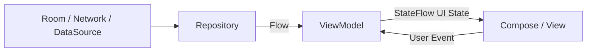

Android khuyến nghị các pipeline tạo UI state sử dụng API bất đồng bộ như Coroutines và Flow ở đầu vào, rồi xuất trạng thái quan sát được như `StateFlow` hoặc Compose `State` để UI phản ứng khi dữ liệu thay đổi. ([Android Developers][2])

---

## 2. Mục tiêu học tập

Sau bài này, bạn có thể:

* giải thích `Flow<T>` bằng ngôn ngữ của mình;
* phân biệt `suspend function` và `Flow`;
* hiểu **Producer → Operator → Consumer**;
* hiểu **cold Flow** và **hot Flow**;
* tạo Flow bằng `flow {}`;
* phát dữ liệu bằng `emit()`;
* thu thập dữ liệu bằng `collect()`;
* sử dụng các operator phổ biến như:

  * `map`;
  * `filter`;
  * `combine`;
  * `debounce`;
  * `distinctUntilChanged`;
  * `mapLatest`;
* chuyển công việc khỏi Main thread bằng `flowOn`;
* xử lý lỗi bằng `catch`;
* triển khai retry bằng `retry` hoặc `retryWhen`;
* hiểu cơ chế cancellation;
* sử dụng `StateFlow` để quản lý UI state;
* sử dụng `stateIn()` và `shareIn()`;
* collect Flow an toàn theo Android Lifecycle;
* sử dụng Flow với Jetpack Compose;
* viết unit test cho Flow;
* đưa một ví dụ Flow hoàn chỉnh vào portfolio.

---

# 3. Flow là gì?

Kotlin định nghĩa Flow như một stream có khả năng phát ra nhiều giá trị bất đồng bộ theo thời gian. Một Flow thường gồm ba thành phần: **producer**, các **intermediary/operator**, và **consumer**. ([Android Developers][1])

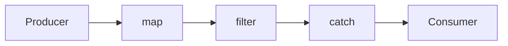

Ví dụ:

```kotlin
val numbers: Flow<Int> = flow {
    emit(1)
    emit(2)
    emit(3)
}
```

Ở đây:

```text
flow { }  = Producer
emit()    = phát dữ liệu
Flow<Int> = stream chứa Int
```

Collector:

```kotlin
numbers.collect { value ->
    println(value)
}
```

Kết quả:

```text
1
2
3
```

`collect()` là một terminal operator; khi gọi nó, Flow mới thực sự bắt đầu được thu thập. ([Android Developers][1])

---

# 4. Tại sao Android cần Flow?

Giả sử ứng dụng có màn hình chat.

Server có thể gửi:

```text
10:00 → Message A
10:01 → Message B
10:03 → Message C
10:04 → Message D
```

Một hàm:

```kotlin
suspend fun getMessages(): List<Message>
```

chỉ trả về:

```text
List<Message>
```

tại **một thời điểm**.

Trong khi:

```kotlin
fun observeMessages(): Flow<List<Message>>
```

có thể liên tục phát dữ liệu:

```text
[A]

[A, B]

[A, B, C]

[A, B, C, D]
```

Đó là lý do Flow phù hợp với các nguồn dữ liệu sống hoặc thay đổi theo thời gian. Android cũng tích hợp Flow với nhiều thư viện Jetpack; chẳng hạn DAO của Room có thể trả về `Flow`, và khi bảng liên quan thay đổi, một giá trị mới có thể được phát ra cho collector. ([Android Developers][1])

---

# 5. Suspend Function và Flow

## 5.1 Suspend function

```kotlin
suspend fun getUser(): User
```

Mô hình:

```text
Request
   │
   ▼
Waiting
   │
   ▼
User
```

Phù hợp với:

* tải profile một lần;
* POST dữ liệu;
* đăng nhập;
* upload file;
* gửi form.

---

## 5.2 Flow

```kotlin
fun observeUsers(): Flow<List<User>>
```

Mô hình:

```text
Time ─────────────────────────────>

        UserList #1
              UserList #2
                       UserList #3
```

Phù hợp với:

* Room database;
* trạng thái kết nối;
* search query;
* location;
* sensor;
* realtime messages;
* UI state;
* stream từ repository.

---

## 5.3 So sánh

| Đặc điểm     | `suspend`              | `Flow`           |
| ------------ | ---------------------- | ---------------- |
| Số kết quả   | Thường 1               | 0 → nhiều        |
| Bất đồng bộ  | Có                     | Có               |
| Stream       | Không                  | Có               |
| Operator     | Không theo kiểu stream | Có               |
| Cancellation | Coroutine              | Coroutine        |
| Ví dụ        | Login API              | Observe database |
| Reactive UI  | Có thể                 | Rất phù hợp      |

---

# 6. Producer → Intermediary → Consumer

Đây là mô hình quan trọng nhất của Flow. Android Developers mô tả stream với producer, intermediary và consumer. Trong Android, repository thường đóng vai trò producer dữ liệu UI, còn UI cuối cùng là consumer. ([Android Developers][1])

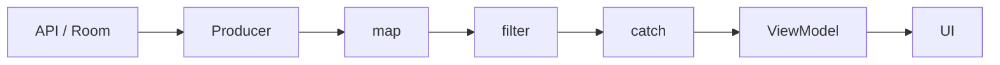

### Producer

```kotlin
flow {
    emit(...)
}
```

### Intermediary

```kotlin
.map { ... }
.filter { ... }
.catch { ... }
```

### Consumer

```kotlin
.collect { ... }
```

---

# 7. Tạo Flow

Cách cơ bản nhất:

```kotlin
fun numbers(): Flow<Int> = flow {
    emit(1)
    emit(2)
    emit(3)
}
```

Hoặc dữ liệu phát theo thời gian:

```kotlin
fun counterFlow(): Flow<Int> = flow {
    repeat(5) { index ->
        emit(index)
        delay(1000)
    }
}
```

Timeline:

```text
0s       1s       2s       3s       4s

0 ------ 1 ------ 2 ------ 3 ------ 4
```

`flow {}` tạo một **cold Flow** và `emit()` phát giá trị cho collector. ([Kotlin][3])

---

# 8. Cold Flow

Flow tạo bằng:

```kotlin
flow { }
```

thông thường là **cold**.

Điều quan trọng:

> Producer chưa chạy chỉ vì bạn đã tạo Flow.

Ví dụ:

```kotlin
val myFlow = flow {
    println("Started")
    emit(1)
}
```

Ở đây chưa in:

```text
Started
```

Cho tới khi:

```kotlin
myFlow.collect {
    println(it)
}
```

Kotlin mô tả cold Flow giống như một “công thức”: phần producer chỉ bắt đầu khi có collector. ([Kotlin][3])

---

## 8.1 Hai collector của cold Flow

```kotlin
val flow = flow {
    println("Request API")
    emit(api.getData())
}
```

Nếu:

```kotlin
flow.collect { ... }
flow.collect { ... }
```

có thể dẫn tới:

```text
Request API
Request API
```

Mỗi terminal collection có thể kích hoạt producer riêng. Android khuyến nghị cân nhắc `shareIn()` nếu cần chia sẻ cùng một upstream cho nhiều consumer. ([Android Developers][1])

---

# 9. Hot Flow

Khác với cold Flow, hot Flow có thể tồn tại độc lập với từng collector.

Hai kiểu quan trọng:

```text
StateFlow
SharedFlow
```

Kotlin mô tả:

* `StateFlow`: giữ **state mới nhất**;
* `SharedFlow`: broadcast các emission tới nhiều subscriber. ([Kotlin][3])

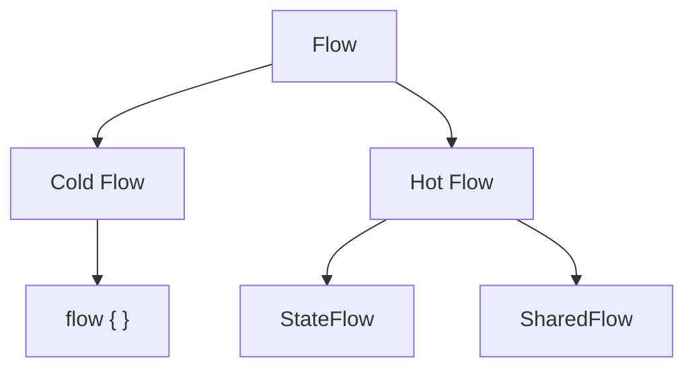

---

# 10. Các operator quan trọng

Flow mạnh ở khả năng xây dựng pipeline.

```text
Flow
 ↓
map
 ↓
filter
 ↓
combine
 ↓
catch
 ↓
collect
```

---

## 10.1 `map`

Biến đổi mỗi giá trị.

```kotlin
flowOf(1, 2, 3)
    .map { it * 10 }
    .collect {
        println(it)
    }
```

Kết quả:

```text
10
20
30
```

---

## 10.2 `filter`

```kotlin
flowOf(1, 2, 3, 4, 5)
    .filter { it % 2 == 0 }
    .collect {
        println(it)
    }
```

Kết quả:

```text
2
4
```

---

# 11. Lazy execution

Các intermediate operator như:

```kotlin
map
filter
onEach
catch
```

không tự bắt đầu collection.

Ví dụ:

```kotlin
val result = repository.users
    .filter { it.isNotEmpty() }
    .map { users ->
        users.sortedBy { it.name }
    }
```

Chưa có collector:

```text
Không thực thi pipeline.
```

Khi:

```kotlin
result.collect { users ->
    ...
}
```

pipeline mới hoạt động. Android documentation mô tả các intermediate operator là lazy và terminal operator như `collect` kích hoạt Flow. ([Android Developers][1])

---

# 12. Flow và Thread

Một hiểu nhầm phổ biến là:

```text
Flow = background thread
```

Điều này **không đúng**.

Cold Flow mặc định chạy trong coroutine context của collector. Nếu cần đổi context cho upstream, sử dụng `flowOn()`. ([Android Developers][1])

---

# 13. `flowOn`

Ví dụ có tác vụ CPU nặng:

```kotlin
fun processImages(): Flow<Image> =
    images
        .map { image ->
            heavyImageProcessing(image)
        }
        .flowOn(Dispatchers.Default)
```

Luồng:

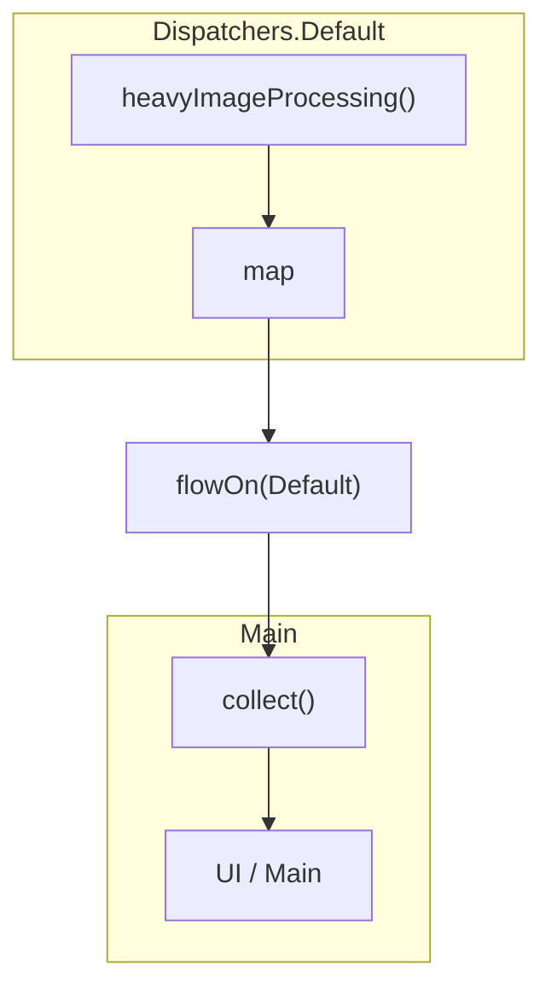

`flowOn()` chỉ thay đổi coroutine context của **upstream phía trên nó**, không chuyển toàn bộ pipeline. ([Android Developers][1])

---

## 13.1 I/O

Ví dụ DataSource:

```kotlin
class UserRemoteDataSource(
    private val api: UserApi,
    private val ioDispatcher: CoroutineDispatcher = Dispatchers.IO
) {

    fun observeUsers(): Flow<List<User>> = flow {
        emit(api.getUsers())
    }.flowOn(ioDispatcher)
}
```

Android Developers cũng minh họa việc dùng dispatcher tối ưu cho I/O ở data source và `flowOn` để di chuyển upstream khỏi Main. ([Android Developers][1])

---

# 14. Flow trong Repository

Ví dụ kiến trúc:

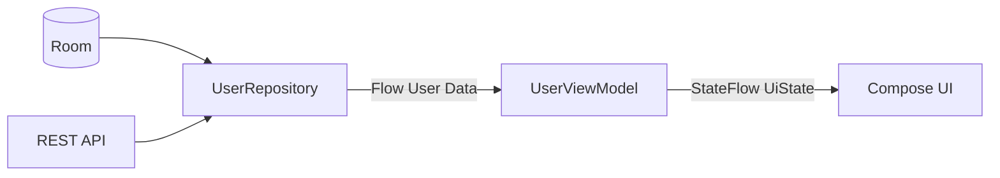

Repository:

```kotlin
class UserRepository(
    private val userDao: UserDao
) {

    fun observeUsers(): Flow<List<User>> {
        return userDao.observeUsers()
    }
}
```

DAO:

```kotlin
@Dao
interface UserDao {

    @Query("SELECT * FROM users ORDER BY name")
    fun observeUsers(): Flow<List<UserEntity>>
}
```

Room có thể dùng Flow để thông báo thay đổi dữ liệu cho tầng phía trên. ([Android Developers][1])

---

# 15. Chuyển Entity thành Domain Model

Repository thường không nên đẩy database entity thẳng lên UI.

```kotlin
fun observeUsers(): Flow<List<User>> =
    userDao.observeUsers()
        .map { entities ->
            entities.map { entity ->
                entity.toDomain()
            }
        }
```

Pipeline:

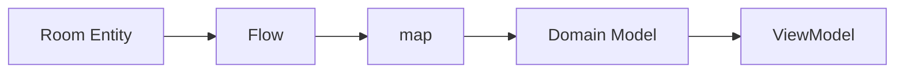

---

# 16. StateFlow

`StateFlow` là hot Flow chuyên dùng cho **state** và luôn chứa một giá trị hiện tại. Collector mới nhận được state gần nhất rồi tiếp tục nhận các cập nhật sau đó. ([Android Developers][4])

Ví dụ:

```kotlin
private val _uiState =
    MutableStateFlow(UserUiState())

val uiState: StateFlow<UserUiState> = _uiState
```

Update:

```kotlin
_uiState.value = UserUiState(
    isLoading = false,
    users = users
)
```

---

## 16.1 Backing property

Nên:

```kotlin
private val _uiState = MutableStateFlow(UserUiState())

val uiState: StateFlow<UserUiState> = _uiState
```

Không nên expose:

```kotlin
val uiState = MutableStateFlow(UserUiState())
```

vì code bên ngoài ViewModel có thể sửa state.

---

# 17. Flow → StateFlow bằng `stateIn`

Một pattern rất quan trọng:

```kotlin
val uiState: StateFlow<UserUiState> =
    repository.observeUsers()
        .map { users ->
            UserUiState(
                users = users,
                isLoading = false
            )
        }
        .stateIn(
            scope = viewModelScope,
            started = SharingStarted.WhileSubscribed(5_000),
            initialValue = UserUiState(
                isLoading = true
            )
        )
```

Android documentation hiện minh họa chính pattern `Flow → stateIn → StateFlow` trong ViewModel; `WhileSubscribed(5_000)` có thể duy trì subscription ngắn hạn khi UI biến mất, hữu ích trong các lần thay đổi cấu hình nhanh. ([Android Developers][5])

---

## Sơ đồ

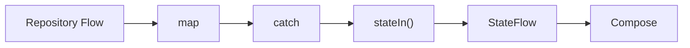

---

# 18. UI State

Thay vì:

```kotlin
val users: StateFlow<List<User>>
val loading: StateFlow<Boolean>
val error: StateFlow<String?>
```

có thể gom thành:

```kotlin
data class UserUiState(
    val users: List<User> = emptyList(),
    val isLoading: Boolean = true,
    val errorMessage: String? = null
)
```

Sau đó:

```kotlin
val uiState: StateFlow<UserUiState>
```

Pattern này phù hợp với mô hình **Unidirectional Data Flow** của Android: ViewModel expose state xuống UI, UI gửi event ngược lên ViewModel. Android Architecture Guide nhấn mạnh việc expose UI state bằng observable holder như `StateFlow` để UI phản ứng với thay đổi state. ([Android Developers][2])

---

# 19. Unidirectional Data Flow

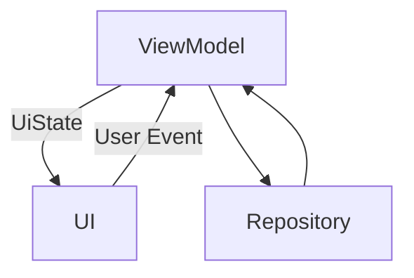

Có thể hình dung:

```text
            State
ViewModel ───────────► UI
   ▲                   │
   │                   │
   └───────────────────┘
          Event
```

Điểm quan trọng là state có hướng đi rõ ràng, UI tập trung vào render state và gửi intent/event về state holder.

---

# 20. Flow + Jetpack Compose

Trong Compose, Android hiện khuyến nghị thu thập Flow theo lifecycle bằng:

```kotlin
collectAsStateWithLifecycle()
```

Ví dụ:

```kotlin
@Composable
fun UserScreen(
    viewModel: UserViewModel
) {

    val uiState by viewModel.uiState
        .collectAsStateWithLifecycle()

    UserContent(
        state = uiState
    )
}
```

`collectAsStateWithLifecycle()` chuyển Flow thành Compose `State` và quản lý subscription theo Lifecycle; mặc định collection hoạt động từ trạng thái `STARTED` và dừng ở `STOPPED`. ([Android Developers][5])

---

# 21. Lifecycle cực kỳ quan trọng

Một lỗi phổ biến:

```kotlin
lifecycleScope.launch {
    viewModel.uiState.collect {
        render(it)
    }
}
```

Nếu collector cập nhật UI, cách này có thể tiếp tục xử lý emission khi view không còn visible. Android khuyến cáo dùng lifecycle-aware collection thay vì collect trực tiếp kiểu trên. ([Android Developers][4])

---

# 22. Views: `repeatOnLifecycle`

Với Activity/Fragment:

```kotlin
lifecycleScope.launch {

    repeatOnLifecycle(
        Lifecycle.State.STARTED
    ) {

        viewModel.uiState.collect { state ->
            render(state)
        }
    }
}
```

Cơ chế:

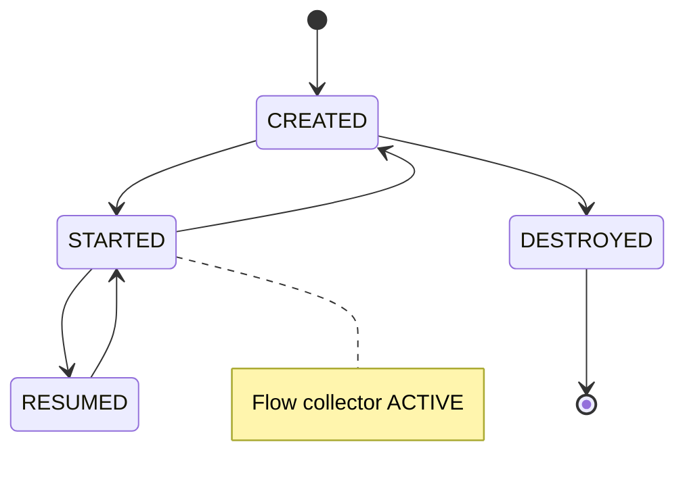

Khi Lifecycle đi vào `STARTED`, block collection được chạy; khi rời trạng thái này về `STOPPED`, collection tương ứng được hủy và có thể được khởi động lại khi Lifecycle active trở lại. ([Android Developers][4])

---

# 23. Cancellation

Flow kế thừa cancellation của Kotlin Coroutines.

Ví dụ:

```kotlin
viewModelScope.launch {
    repository.observeUsers()
        .collect { users ->
            ...
        }
}
```

Khi ViewModel bị clear:

```text
ViewModel cleared
        │
        ▼
viewModelScope cancelled
        │
        ▼
collector cancelled
        │
        ▼
upstream Flow stopped
```

`viewModelScope` tự động bị cancel khi ViewModel được clear. ([Android Developers][5])

---

# 24. Xử lý Exception bằng `catch`

Ví dụ:

```kotlin
repository.observeUsers()
    .catch { exception ->
        emit(emptyList())
    }
    .collect { users ->
        ...
    }
```

`catch` có thể xử lý exception từ upstream và thậm chí phát fallback value xuống downstream. ([Android Developers][1])

---

## 24.1 UI state

```kotlin
val uiState =
    repository.observeUsers()
        .map<List<User>, UserUiState> { users ->
            UserUiState.Success(users)
        }
        .catch { error ->
            emit(
                UserUiState.Error(
                    error.message ?: "Unknown error"
                )
            )
        }
```

Pipeline:

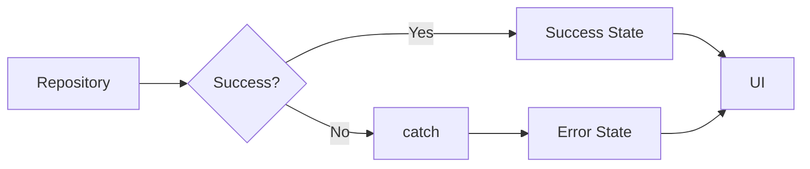

---

# 25. Retry

Đối với lỗi mạng tạm thời, có thể retry upstream.

```kotlin
repository.observeUsers()
    .retry(3) { error ->
        error is IOException
    }
```

`retry()` thu thập lại upstream khi exception phù hợp predicate và còn số lần retry. Cancellation exception không được coi là lỗi cần retry. ([Kotlin][6])

---

# 26. `retryWhen`

Khi cần kiểm soát phức tạp hơn:

```kotlin
.retryWhen { cause, attempt ->

    if (
        cause is IOException &&
        attempt < 3
    ) {

        delay(
            1000L * (attempt + 1)
        )

        true

    } else {

        false
    }
}
```

Timeline ví dụ:

```text
Request
  │
  └─ X

wait 1s

Retry #1
  │
  └─ X

wait 2s

Retry #2
  │
  └──── Success
```

`retryWhen` cung cấp cả exception và số lần attempt để quyết định có retry hay không. ([Kotlin][7])

---

# 27. Không retry mọi lỗi

Không nên:

```kotlin
.retry(Long.MAX_VALUE)
```

cho tất cả exception.

Ví dụ:

```text
401 Unauthorized
403 Forbidden
400 Bad Request
```

thường không được giải quyết chỉ bằng việc gửi cùng request vô hạn lần.

Nên giới hạn predicate theo loại lỗi có khả năng tạm thời:

```kotlin
.retry(3) {
    it is IOException
}
```

---

# 28. Search bằng Flow

Một use case rất mạnh của Flow:

```text
User typing
    ↓
Query Flow
    ↓
debounce
    ↓
distinctUntilChanged
    ↓
API search
```

---

# 29. `debounce`

Ví dụ người dùng nhập:

```text
a
an
and
andr
andro
android
```

Không nên request API mỗi ký tự.

```kotlin
searchQuery
    .debounce(300)
```

`debounce` loại bỏ những giá trị nhanh chóng bị một giá trị mới thay thế trong khoảng timeout và giữ emission mới nhất khi stream ổn định đủ lâu. ([Kotlin][8])

Timeline:

```text
a ---- an ---- and ---- android ---------------->

          debounce 300 ms

                            │
                            ▼
                         android
```

---

# 30. `distinctUntilChanged`

```kotlin
searchQuery
    .distinctUntilChanged()
```

Ví dụ:

```text
android
android
android
kotlin
kotlin
```

trở thành:

```text
android
kotlin
```

`distinctUntilChanged()` lọc các giá trị liên tiếp tương đương nhau. `StateFlow` vốn đã có hành vi tương đương cho state emission nên áp dụng operator này trực tiếp lên `StateFlow` không mang thêm tác dụng. ([Kotlin][9])

---

# 31. `mapLatest`

Search API:

```kotlin
searchQuery
    .debounce(300)
    .distinctUntilChanged()
    .mapLatest { query ->
        repository.search(query)
    }
```

Nếu:

```text
Request "andro"
```

chưa xong nhưng người dùng nhập:

```text
android
```

thì computation trước trong `mapLatest` được cancel và xử lý giá trị mới. ([Kotlin][10])

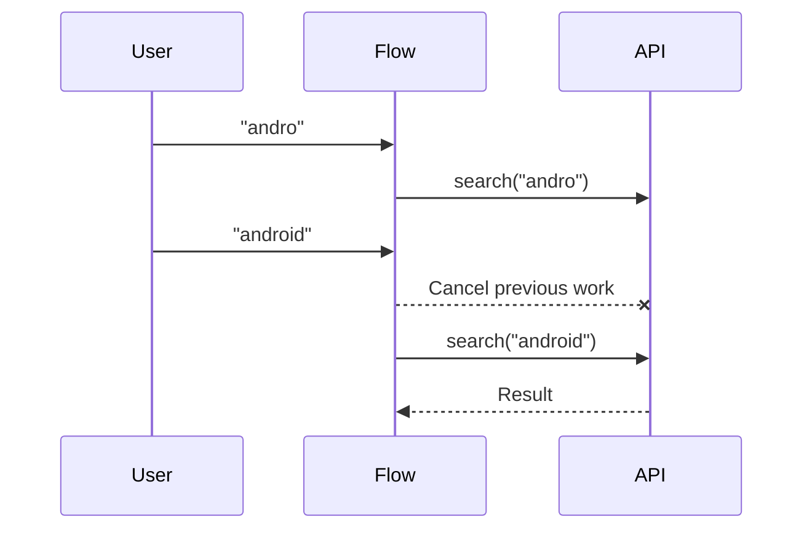

---

# 32. `collectLatest`

Tương tự ở consumer:

```kotlin
flow.collectLatest { value ->
    renderExpensiveResult(value)
}
```

Nếu Flow phát một giá trị mới trước khi action trước hoàn tất, action trước bị cancel và action mới bắt đầu. ([Kotlin][11])

---

# 33. `combine`

Giả sử UI state phụ thuộc vào:

```text
User
+
Settings
+
Messages
```

Có thể:

```kotlin
combine(
    userFlow,
    settingsFlow,
    messagesFlow
) { user, settings, messages ->

    HomeUiState(
        user = user,
        settings = settings,
        messages = messages
    )
}
```

`combine` xây giá trị mới bằng **giá trị mới nhất từ mỗi Flow** sau khi các nguồn cần thiết đã emission. ([Kotlin][12])

---

## Sơ đồ

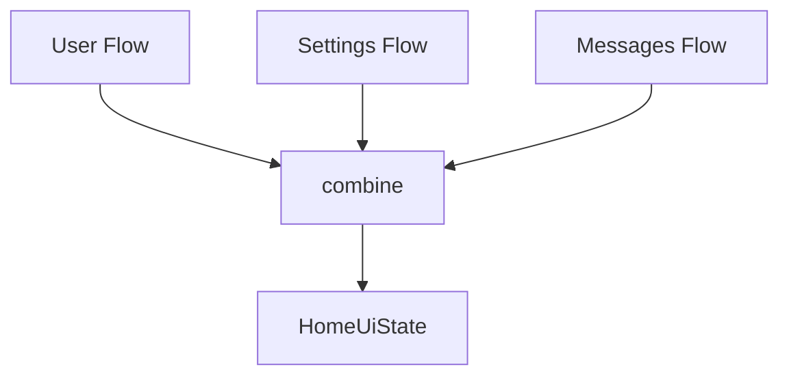

---

# 34. StateFlow và SharedFlow

| `StateFlow`                       | `SharedFlow`                 |
| --------------------------------- | ---------------------------- |
| Đại diện state                    | Broadcast stream             |
| Có current value                  | Không bắt buộc current state |
| Phải có initial value             | Có nhiều cấu hình replay     |
| Collector mới nhận state gần nhất | Phụ thuộc `replay`           |
| Hợp với UI state                  | Hợp với shared emissions     |

Android mô tả `StateFlow` và `SharedFlow` là Flow API phục vụ state update và nhiều consumer; `SharedFlow` là tổng quát hơn trong khi `StateFlow` tập trung vào trạng thái hiện tại. ([Android Developers][4])

---

# 35. `shareIn`

Cold Flow:

```text
Collector A ──► Producer A
Collector B ──► Producer B
```

Sau `shareIn()`:

```text
                ┌── Collector A
Producer ───────┤
                └── Collector B
```

Ví dụ:

```kotlin
val sharedNews =
    repository.observeNews()
        .shareIn(
            scope = applicationScope,
            started = SharingStarted.WhileSubscribed(),
            replay = 1
        )
```

`shareIn()` chuyển cold Flow thành một `SharedFlow` được chia sẻ, tránh việc mỗi collector nhất thiết tạo một upstream instance riêng. ([Android Developers][4])

---

# 36. `stateIn` và `shareIn`

```text
Cold Flow
   │
   ├── stateIn()
   │      │
   │      └── StateFlow
   │
   └── shareIn()
          │
          └── SharedFlow
```

### Khi cần UI state

```kotlin
stateIn()
```

### Khi cần chia sẻ emission

```kotlin
shareIn()
```

---

# 37. Ví dụ kiến trúc hoàn chỉnh

## Repository

```kotlin
class UserRepository(
    private val dao: UserDao
) {

    fun observeUsers(): Flow<List<User>> {
        return dao.observeUsers()
            .map { entities ->
                entities.map {
                    it.toDomain()
                }
            }
    }
}
```

---

## UI State

```kotlin
sealed interface UserUiState {

    data object Loading : UserUiState

    data class Success(
        val users: List<User>
    ) : UserUiState

    data class Error(
        val message: String
    ) : UserUiState
}
```

---

## ViewModel

```kotlin
class UserViewModel(
    repository: UserRepository
) : ViewModel() {

    val uiState: StateFlow<UserUiState> =
        repository.observeUsers()
            .map<List<User>, UserUiState> { users ->
                UserUiState.Success(users)
            }
            .catch { throwable ->
                emit(
                    UserUiState.Error(
                        throwable.message
                            ?: "Đã xảy ra lỗi"
                    )
                )
            }
            .stateIn(
                scope = viewModelScope,
                started =
                    SharingStarted
                        .WhileSubscribed(5_000),
                initialValue =
                    UserUiState.Loading
            )
}
```

---

## Compose

```kotlin
@Composable
fun UserRoute(
    viewModel: UserViewModel
) {

    val uiState by viewModel.uiState
        .collectAsStateWithLifecycle()

    when (val state = uiState) {

        UserUiState.Loading -> {
            CircularProgressIndicator()
        }

        is UserUiState.Success -> {
            UserList(state.users)
        }

        is UserUiState.Error -> {
            Text(state.message)
        }
    }
}
```

Đây là pattern rất gần với hướng kiến trúc Android hiện tại: ViewModel tạo screen-level state, chuyển Flow thành StateFlow và Compose thu thập state theo lifecycle. ([Android Developers][5])

---

# 38. Sơ đồ kiến trúc hoàn chỉnh

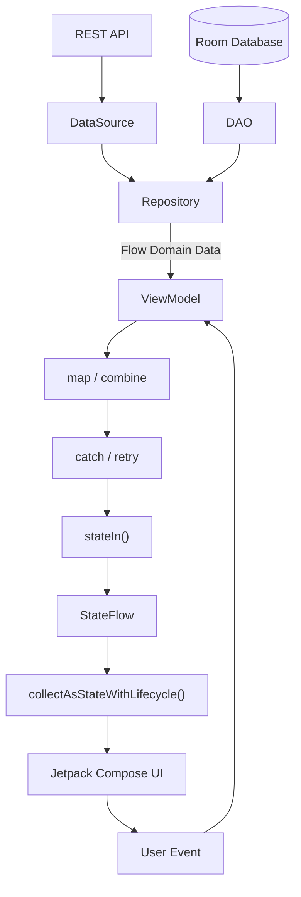

---

# 39. Flow và trạng thái màn hình

Một màn hình production thường có ít nhất:

```text
Loading
Success
Error
```

Có thể thêm:

```text
Empty
Refreshing
Offline
```

Ví dụ:

```kotlin
sealed interface FeedUiState {

    data object Loading : FeedUiState

    data object Empty : FeedUiState

    data class Content(
        val posts: List<Post>
    ) : FeedUiState

    data class Error(
        val message: String
    ) : FeedUiState
}
```

UI chỉ cần:

```kotlin
when (state) {

    Loading -> ...

    Empty -> ...

    is Content -> ...

    is Error -> ...
}
```

---

# 40. Logging state transition

Một kỹ thuật debug hữu ích:

```kotlin
repository.observeUsers()
    .onEach {
        Log.d(
            "UserFlow",
            "Received ${it.size} users"
        )
    }
```

Hoặc log UI state:

```kotlin
uiState
    .onEach { state ->
        Log.d(
            "UserState",
            "State = $state"
        )
    }
```

Mục tiêu là có thể nhìn thấy:

```text
Loading
   ↓
Success
   ↓
Loading
   ↓
Error
   ↓
Retry
   ↓
Success
```

---

# 41. Debug pipeline

Ví dụ:

```kotlin
repository.observeUsers()

    .onStart {
        Log.d(TAG, "Flow started")
    }

    .onEach {
        Log.d(TAG, "Users = ${it.size}")
    }

    .catch {
        Log.e(TAG, "Flow error", it)
    }

    .onCompletion {
        Log.d(TAG, "Flow completed")
    }
```

Điều này đặc biệt hữu ích khi tìm lỗi:

```text
Flow không chạy?

Flow chạy nhiều lần?

Collector biến mất?

Network request bị gọi 2 lần?

Flow bị cancel?

Exception nằm upstream hay downstream?
```

---

# 42. Sai lầm: tạo nhiều network request

Ví dụ:

```kotlin
fun users() = flow {
    emit(api.getUsers())
}
```

Ba collector trên cold Flow có thể tạo ba lần producer execution. Cold Flow thực thi producer mỗi lần được terminally collected; đây chính là trường hợp nên cân nhắc `shareIn` hoặc đặt việc chia sẻ ở đúng scope. ([Android Developers][1])

---

# 43. Sai lầm: block Main thread

Không nên:

```kotlin
flow {
    emit(
        veryHeavyCpuCalculation()
    )
}
```

rồi collect trên Main mà không chuyển upstream.

Nên:

```kotlin
flow {
    emit(
        veryHeavyCpuCalculation()
    )
}
.flowOn(Dispatchers.Default)
```

`flowOn` thay context cho upstream và giúp giữ downstream/UI collector ở context thích hợp. ([Android Developers][1])

---

# 44. Sai lầm: collect không theo Lifecycle

Không nên đối với collector cập nhật View:

```kotlin
lifecycleScope.launch {

    flow.collect {
        updateUi(it)
    }
}
```

Nên:

```kotlin
lifecycleScope.launch {

    repeatOnLifecycle(
        Lifecycle.State.STARTED
    ) {

        flow.collect {
            updateUi(it)
        }
    }
}
```

Android cảnh báo việc collect UI Flow trực tiếp bằng `launch` hoặc `launchIn` có thể tiếp tục xử lý event khi View không visible; `repeatOnLifecycle` giải quyết vấn đề đó. ([Android Developers][4])

---

# 45. Sai lầm: `MutableStateFlow` public

Không nên:

```kotlin
val uiState =
    MutableStateFlow(...)
```

UI có thể:

```kotlin
viewModel.uiState.value = ...
```

Khi đó quyền sở hữu state bị phá vỡ.

Nên:

```kotlin
private val _uiState =
    MutableStateFlow(...)

val uiState: StateFlow<UiState> =
    _uiState
```

Pattern backing property cũng được Android sử dụng trong ví dụ chính thức về `StateFlow`. ([Android Developers][4])

---

# 46. Sai lầm: dùng Flow cho mọi thứ

Không phải mọi async operation đều cần Flow.

Ví dụ login:

```kotlin
suspend fun login(
    username: String,
    password: String
): User
```

thường tự nhiên hơn:

```kotlin
fun login(...): Flow<User>
```

Nếu operation chỉ có:

```text
request → response
```

thì `suspend` thường đơn giản hơn.

Flow hữu ích khi bản chất dữ liệu là:

```text
value
value
value
value
...
```

---

# 47. Sai lầm: nhầm Event với State

State:

```text
User list
Current profile
Search query
Selected tab
Loading state
```

Event:

```text
Show Snackbar
Open screen
Click
Refresh request
```

Không nên mặc định coi tất cả event là persistent state.

Hãy xác định:

```text
Đây là trạng thái cần giữ?

hay

Đây là một sự kiện xảy ra?
```

trước khi chọn `StateFlow`, `SharedFlow` hay một API phù hợp khác.

---

# 48. Testing Flow

Android Developers khuyến nghị hai hướng chính:

1. nếu subject **consume Flow**, thay producer bằng fake có thể điều khiển;
2. nếu subject **expose Flow**, thu thập và assertion các emission của Flow. ([Android Developers][13])

---

# 49. Fake Repository

```kotlin
class FakeUserRepository :
    UserRepositoryContract {

    override fun observeUsers():
        Flow<List<User>> {

        return flowOf(
            listOf(
                User(
                    id = 1,
                    name = "An"
                )
            )
        )
    }
}
```

---

# 50. Test emission đầu tiên

```kotlin
@Test
fun users_are_emitted() = runTest {

    val repository =
        FakeUserRepository()

    val users =
        repository
            .observeUsers()
            .first()

    assertEquals(
        1,
        users.size
    )
}
```

`first()` đợi emission đầu tiên rồi gửi cancellation tới producer. ([Android Developers][13])

---

# 51. Test nhiều emission

```kotlin
@Test
fun flow_emits_expected_values() =
    runTest {

        val result =
            flowOf(
                1,
                2,
                3
            ).toList()

        assertEquals(
            listOf(
                1,
                2,
                3
            ),
            result
        )
    }
```

`toList()` phù hợp với finite Flow; với infinite Flow cần giới hạn số emission hoặc thu thập liên tục theo chiến lược test phù hợp. ([Android Developers][13])

---

# 52. Kiểm thử state transition

Ví dụ mong đợi:

```text
Loading
   ↓
Success(users)
```

Test:

```kotlin
@Test
fun uiState_loads_users() =
    runTest {

        val viewModel =
            UserViewModel(
                fakeRepository
            )

        val values =
            viewModel.uiState
                .take(2)
                .toList()

        assertEquals(
            UserUiState.Loading,
            values[0]
        )

        assertTrue(
            values[1]
                is UserUiState.Success
        )
    }
```

Việc test `StateFlow` tạo bằng `stateIn()` cần chú ý đến sharing policy và collector; Android có hướng dẫn riêng cho trường hợp này. ([Android Developers][13])

---

# 53. Bài thực hành

## Mini project: Reactive User List

### Yêu cầu

Tạo app:

```text
Room
 ↓
Repository
 ↓
Flow<List<User>>
 ↓
ViewModel
 ↓
StateFlow<UserUiState>
 ↓
Compose
```

---

## Bước 1 — Entity

```kotlin
@Entity
data class UserEntity(

    @PrimaryKey
    val id: Long,

    val name: String
)
```

---

## Bước 2 — DAO

```kotlin
@Dao
interface UserDao {

    @Query(
        "SELECT * FROM UserEntity"
    )
    fun observeUsers():
        Flow<List<UserEntity>>
}
```

---

## Bước 3 — Repository

```kotlin
class UserRepository(
    private val dao: UserDao
) {

    fun observeUsers():
        Flow<List<User>> {

        return dao
            .observeUsers()
            .map { entities ->

                entities.map {
                    User(
                        id = it.id,
                        name = it.name
                    )
                }
            }
    }
}
```

---

## Bước 4 — UI State

```kotlin
sealed interface UserUiState {

    data object Loading :
        UserUiState

    data class Success(
        val users: List<User>
    ) : UserUiState

    data class Error(
        val message: String
    ) : UserUiState
}
```

---

## Bước 5 — ViewModel

```kotlin
class UserViewModel(
    repository: UserRepository
) : ViewModel() {

    val uiState =
        repository
            .observeUsers()

            .map<
                List<User>,
                UserUiState
            > {
                UserUiState.Success(it)
            }

            .catch {
                emit(
                    UserUiState.Error(
                        it.message
                            ?: "Unknown error"
                    )
                )
            }

            .stateIn(
                viewModelScope,
                SharingStarted
                    .WhileSubscribed(
                        5_000
                    ),
                UserUiState.Loading
            )
}
```

---

## Bước 6 — Compose

```kotlin
@Composable
fun UserScreen(
    viewModel: UserViewModel
) {

    val state by
        viewModel.uiState
            .collectAsStateWithLifecycle()

    when (
        val current = state
    ) {

        UserUiState.Loading ->
            CircularProgressIndicator()

        is UserUiState.Success ->
            UserList(
                current.users
            )

        is UserUiState.Error ->
            ErrorMessage(
                current.message
            )
    }
}
```

---

# 54. Bài tập mở rộng — Search Flow

Xây dựng:

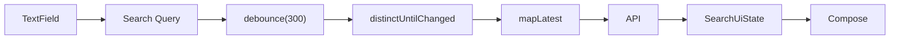

Skeleton:

```kotlin
private val searchQuery =
    MutableStateFlow("")

val searchResult =
    searchQuery

        .debounce(300)

        .distinctUntilChanged()

        .mapLatest { query ->

            if (query.isBlank()) {
                emptyList()
            } else {
                repository.search(query)
            }
        }
```

---

# 55. Bài tập chính

Hãy refactor một tác vụ chạy lâu hiện tại thành Flow hoặc coroutine pipeline sao cho:

1. công việc nặng không block Main thread;
2. task có thể bị cancel;
3. lỗi được chuyển thành UI state;
4. nếu là lỗi mạng tạm thời, retry có giới hạn;
5. state transition được log;
6. UI thu thập Flow theo lifecycle;
7. có unit test cho ít nhất một emission.

---

# 56. Artifact portfolio

Một artifact tốt cho bài này có thể là repository:

```text
flow-demo/
│
├── data/
│   ├── UserDao.kt
│   ├── UserEntity.kt
│   └── UserRepository.kt
│
├── ui/
│   ├── UserUiState.kt
│   ├── UserViewModel.kt
│   └── UserScreen.kt
│
├── test/
│   └── UserViewModelTest.kt
│
└── README.md
```

README nên có:

```text
Kotlin Flow
StateFlow
Flow operators
Room Flow
ViewModel
Compose
Lifecycle
Error handling
Cancellation
Testing
```

---

# 57. Sơ đồ nên đưa vào README

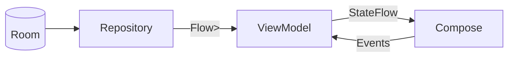

---

# 58. Checklist production

Trước khi merge tính năng dùng Flow, hãy kiểm tra:

### Architecture

* [ ] Flow được tạo ở layer phù hợp.
* [ ] Repository không phụ thuộc UI.
* [ ] ViewModel sở hữu screen UI state.
* [ ] UI không trực tiếp sửa state của ViewModel.
* [ ] State đi xuống, event đi lên.

### Threading

* [ ] Không chạy CPU-heavy operation trên Main.
* [ ] I/O sử dụng dispatcher phù hợp.
* [ ] Hiểu rõ phạm vi ảnh hưởng của `flowOn`.

### Lifecycle

* [ ] Compose dùng lifecycle-aware collection.
* [ ] Views dùng `repeatOnLifecycle` khi cập nhật UI.
* [ ] Collector được hủy đúng scope.
* [ ] Không giữ coroutine thừa sau khi ViewModel bị clear.

### Error

* [ ] Có `catch` ở layer thích hợp.
* [ ] Error được biểu diễn rõ trong UI state.
* [ ] Retry chỉ dùng cho lỗi phù hợp.
* [ ] Retry có giới hạn/backoff nếu cần.

### Performance

* [ ] Cold Flow không vô tình tạo nhiều request giống nhau.
* [ ] Xem xét `shareIn` khi nhiều subscriber cần chung upstream.
* [ ] Xem xét `debounce` đối với search/input nhanh.
* [ ] Xem xét latest-style operator khi kết quả cũ không còn giá trị.

### Testing

* [ ] Có fake producer/repository.
* [ ] Test emission đầu tiên.
* [ ] Test success.
* [ ] Test error.
* [ ] Test nhiều emission nếu cần.
* [ ] Kiểm tra đặc biệt khi `StateFlow` dùng `stateIn`.

---

# 59. Những câu hỏi cần trả lời khi đưa Flow vào production

### User flow nào bị ảnh hưởng?

Ví dụ:

```text
Search
Chat
Feed
Profile
Notifications
Database synchronization
```

### State có bị mất khi rotate không?

Nếu screen state được giữ bởi ViewModel + StateFlow:

```text
Activity recreated
      ↓
ViewModel survives configuration change
      ↓
UI re-collects state
```

ViewModel phù hợp cho screen-level state cần tồn tại qua configuration change, nhưng process death là vấn đề khác và state cần khôi phục có thể phải dùng cơ chế lưu state thích hợp như `SavedStateHandle`.

---

### App background thì sao?

Hãy kiểm tra:

```text
Collector có cần chạy?

Upstream có cần tiếp tục?

Có tốn network không?

Có tốn battery không?
```

Android Architecture Guide yêu cầu pipeline tạo UI state nên lifecycle-aware và không tiếp tục tiêu thụ tài nguyên khi UI không active nếu không có lý do rõ ràng. ([Android Developers][2])

---

### Network error thì sao?

Thiết kế rõ:

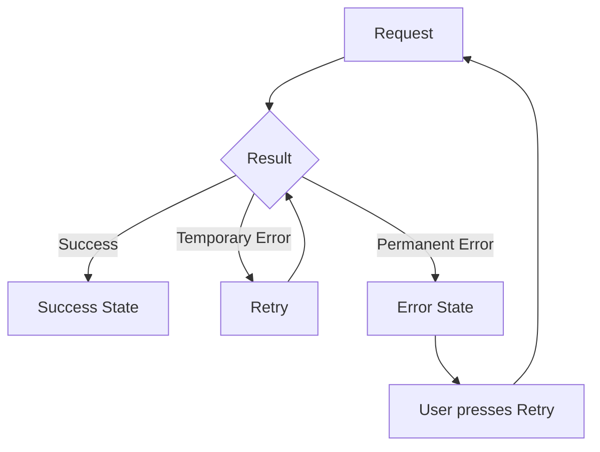

---

# 60. Flow Mental Model

Hãy nhớ Flow bằng công thức:

```text
Producer
    │
    ▼
Flow
    │
    ▼
Operators
    │
    ▼
State
    │
    ▼
Collector
    │
    ▼
UI
```

Trong Android:

```text
Room / Network
      │
      ▼
Repository
      │
      │ Flow
      ▼
ViewModel
      │
      │ StateFlow
      ▼
Compose
```

---

# 61. Tóm tắt nhanh

```text
Flow
│
├── Stream dữ liệu bất đồng bộ
│
├── Cold Flow
│   └── flow {}
│
├── Hot Flow
│   ├── StateFlow
│   └── SharedFlow
│
├── Producer
│   └── emit()
│
├── Operators
│   ├── map
│   ├── filter
│   ├── combine
│   ├── debounce
│   ├── mapLatest
│   ├── flowOn
│   ├── retry
│   └── catch
│
├── Consumer
│   └── collect()
│
├── Android
│   ├── Room
│   ├── Repository
│   ├── ViewModel
│   ├── StateFlow
│   ├── repeatOnLifecycle
│   └── collectAsStateWithLifecycle
│
└── Testing
    ├── Fake Flow
    ├── first()
    ├── take()
    └── toList()
```

---

# 62. Checklist hoàn thành bài

* [ ] Giải thích được `Flow` là gì.
* [ ] Phân biệt được `Flow` và `suspend function`.
* [ ] Hiểu Producer → Operator → Consumer.
* [ ] Hiểu cold Flow.
* [ ] Hiểu hot Flow.
* [ ] Viết được `flow {}`.
* [ ] Sử dụng được `emit()`.
* [ ] Sử dụng được `collect()`.
* [ ] Sử dụng được `map`.
* [ ] Sử dụng được `filter`.
* [ ] Hiểu `combine`.
* [ ] Hiểu `debounce`.
* [ ] Hiểu latest-style cancellation.
* [ ] Biết dùng `flowOn`.
* [ ] Biết xử lý `catch`.
* [ ] Biết triển khai retry có giới hạn.
* [ ] Hiểu cancellation.
* [ ] Hiểu `StateFlow`.
* [ ] Hiểu `SharedFlow`.
* [ ] Biết dùng `stateIn()`.
* [ ] Biết khi nào xem xét `shareIn()`.
* [ ] Biết collect theo Lifecycle.
* [ ] Biết dùng `collectAsStateWithLifecycle()`.
* [ ] Có unit test cho Flow.
* [ ] Có sơ đồ kiến trúc.
* [ ] Có mini project để đưa vào portfolio.

---

# 63. Kết luận

**Flow không chỉ là API để chạy code bất đồng bộ.** Trong Android Architecture, Flow là một trong những công cụ quan trọng để xây dựng **pipeline dữ liệu reactive** từ Data Layer đến ViewModel rồi tới UI. Android hiện khuyến nghị kết hợp Coroutines/Flow cho đầu vào bất đồng bộ, observable state như StateFlow cho UI state và lifecycle-aware collection ở UI. ([Android Developers][2])

Mental model quan trọng nhất của bài:

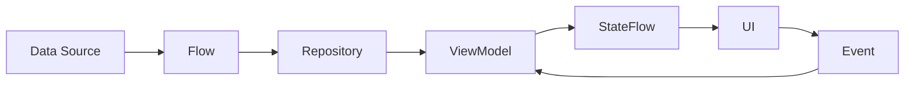

Nếu nắm chắc đường đi:

```text
Data
→ Flow
→ Transformation
→ StateFlow
→ Lifecycle-aware collection
→ UI
```

thì các bài tiếp theo về **StateFlow, SharedFlow, reactive UI state, UDF và MVI** sẽ dễ hiểu hơn rất nhiều.

[1]: https://developer.android.com/kotlin/flow "Kotlin flows on Android  |  Android Developers"
[2]: https://developer.android.com/topic/architecture/ui-layer/state-production "UI State production  |  App architecture  |  Android Developers"
[3]: https://kotlinlang.org/docs/coroutines-flow.html "Flows | Kotlin Documentation"
[4]: https://developer.android.com/kotlin/flow/stateflow-and-sharedflow "StateFlow and SharedFlow  |  Kotlin  |  Android Developers"
[5]: https://developer.android.com/topic/libraries/architecture/coroutines "Use Kotlin coroutines with lifecycle-aware components  |  App architecture  |  Android Developers"
[6]: https://kotlinlang.org/api/kotlinx.coroutines/kotlinx-coroutines-core/kotlinx.coroutines.flow/retry.html?utm_source=chatgpt.com "retry - kotlinx.coroutines.flow"
[7]: https://kotlinlang.org/api/kotlinx.coroutines/kotlinx-coroutines-core/kotlinx.coroutines.flow/retry-when.html?utm_source=chatgpt.com "retryWhen | kotlinx.coroutines"
[8]: https://kotlinlang.org/api/kotlinx.coroutines/kotlinx-coroutines-core/kotlinx.coroutines.flow/debounce.html?utm_source=chatgpt.com "debounce | kotlinx.coroutines"
[9]: https://kotlinlang.org/api/kotlinx.coroutines/kotlinx-coroutines-core/kotlinx.coroutines.flow/distinct-until-changed.html?utm_source=chatgpt.com "distinctUntilChanged - kotlinx.coroutines.flow"
[10]: https://kotlinlang.org/api/kotlinx.coroutines/kotlinx-coroutines-core/kotlinx.coroutines.flow/map-latest.html?utm_source=chatgpt.com "mapLatest | kotlinx.coroutines"
[11]: https://kotlinlang.org/api/kotlinx.coroutines/kotlinx-coroutines-core/kotlinx.coroutines.flow/collect-latest.html?utm_source=chatgpt.com "collectLatest | kotlinx.coroutines"
[12]: https://kotlinlang.org/api/kotlinx.coroutines/kotlinx-coroutines-core/kotlinx.coroutines.flow/combine.html?utm_source=chatgpt.com "combine | kotlinx.coroutines"
[13]: https://developer.android.com/kotlin/flow/test "Testing Kotlin flows on Android  |  Android Developers"

---

# Bài luyện tập

## Mục tiêu


## Đề bài


## Yêu cầu hoàn thành

- [ ] 
- [ ] 
- [ ] 

## Kết quả / lời giải


## Ghi chú
