[](https://reactivex.io/documentation/scheduler.html?utm_source=chatgpt.com)

# 034 - RxJava

| Thuộc tính              | Nội dung                                 |
| ----------------------- | ---------------------------------------- |
| **Học phần**            | 03 - Architecture, State and Data        |
| **Module**              | Module 05 - Design and Architecture      |
| **Nhóm nội dung**       | Reactive State                           |
| **Nguồn roadmap**       | Design and Architecture / Reactive State |
| **Loại bài**            | Async                                    |
| **Thứ tự trong module** | 034                                      |
| **Thời lượng gợi ý**    | 34 phút                                  |
| **Công nghệ chính**     | RxJava 3, RxAndroid                      |
| **Ngôn ngữ ví dụ**      | Kotlin                                   |

---

## 1. Tóm tắt

**RxJava** là thư viện triển khai mô hình **Reactive Extensions** trên JVM, cho phép biểu diễn dữ liệu, sự kiện và các tác vụ bất đồng bộ dưới dạng **stream** rồi xử lý chúng bằng một chuỗi operator như `map`, `filter`, `flatMap`, `debounce`, `zip`, `retry`...

Thay vì viết nhiều callback lồng nhau:

```text
Request
   ↓
Callback
   ↓
Callback
   ↓
Callback
   ↓
Update UI
```

ta có thể mô tả luồng xử lý theo kiểu khai báo:

```text
Source
   ↓
Operator
   ↓
Operator
   ↓
Scheduler
   ↓
Observer
```

RxJava được thiết kế để compose các chương trình bất đồng bộ và event-based bằng observable sequences. ([GitHub][1])

Trong Android, RxJava thường xuất hiện ở:

* network request;
* database;
* search realtime;
* form validation;
* polling;
* xử lý nhiều API đồng thời;
* debounce input;
* retry request;
* cache + network;
* ViewModel;
* reactive state;
* legacy Android project sử dụng RxJava/RxAndroid.

> **Lưu ý cho Android 2026:** bài này sử dụng **RxJava 3**. Repository RxAndroid hiện cung cấp Android bindings cho RxJava 3 và đặc biệt cung cấp `Scheduler` để đưa công việc về Android main thread. RxJava 4 đang được phát triển với ngày phát hành dự kiến 30/11/2026 và repository của RxJava ghi rõ khả năng tương thích Android của 4.x còn phụ thuộc API level/desugaring. ([GitHub][2])

---

## 2. Mục tiêu học tập

Sau bài này, bạn có thể:

* giải thích Reactive Programming và RxJava;
* phân biệt `Observable`, `Flowable`, `Single`, `Maybe`, `Completable`;
* hiểu `Observer`, `Subscriber`, `Disposable`;
* sử dụng các operator phổ biến;
* hiểu `subscribeOn()` và `observeOn()`;
* chuyển network/database operation khỏi Main Thread;
* đưa kết quả trở lại UI thread;
* hủy subscription đúng lifecycle;
* xử lý error, timeout và retry;
* hiểu khái niệm backpressure;
* sử dụng RxJava trong Repository/ViewModel;
* test RxJava pipeline;
* nhận biết các lỗi RxJava thường gặp trong production.

---

# 3. Reactive Programming là gì?

Reactive Programming có thể hiểu đơn giản là:

> **Không liên tục hỏi dữ liệu đã thay đổi chưa; hãy đăng ký và phản ứng khi dữ liệu thay đổi.**

Ví dụ một ô tìm kiếm.

Người dùng gõ:

```text
a
an
and
andro
android
```

Cách imperative có thể gọi API sau **mỗi** lần `TextWatcher` thay đổi.

Reactive approach có thể mô hình hóa:

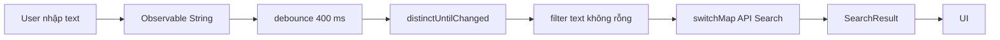

Khi đó, UI không cần quản lý thủ công hàng loạt callback.

---

## 3.1 ReactiveX nhìn dữ liệu như một stream

Ví dụ:

```text
1 ---- 2 ---- 3 ---- 4 ---- 5 ---->
```

Ta áp dụng:

```text
filter { x % 2 == 0 }
```

kết quả:

```text
----- 2 --------- 4 ----------->
```

Sau đó:

```text
map { x * 10 }
```

kết quả:

```text
----- 20 -------- 40 ---------->
```

ReactiveX gọi những phép biến đổi này là **operators**. Observable được tạo, biến đổi rồi subscribe để consumer phản ứng với dữ liệu. ([reactivex.io][3])

---

# 4. Marble Diagram

RxJava thường mô tả stream bằng **Marble Diagram**.

Mỗi hình tròn đại diện cho một event/value.

Ví dụ operator `map`:


*Nguồn hình: ReactiveX — Map Operator.*

Có thể hiểu:

```text
Input

● ---- ● ---- ● ---- ●
       │
       ▼
      map
       │
       ▼
◆ ---- ◆ ---- ◆ ---- ◆

Output
```

`map()` không thay đổi số lượng event mà biến đổi giá trị của từng event.

Ví dụ:

```kotlin
Observable.just(1, 2, 3)
    .map { it * 10 }
    .subscribe { value ->
        println(value)
    }
```

Kết quả:

```text
10
20
30
```

---

# 5. Kiến trúc cơ bản của RxJava

Một pipeline RxJava thường gồm bốn thành phần:

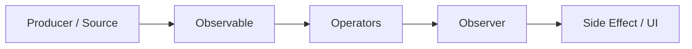

Ví dụ:

```kotlin
Observable.just(1, 2, 3, 4, 5)
    .filter { it % 2 == 0 }
    .map { it * 10 }
    .subscribe(
        { value ->
            println(value)
        },
        { error ->
            error.printStackTrace()
        }
    )
```

Pipeline:

```text
1 2 3 4 5
    │
    ▼
filter even
    │
    ▼
2 4
    │
    ▼
map × 10
    │
    ▼
20 40
    │
    ▼
Observer
```

---

# 6. Observable và Observer

## 6.1 Observable

`Observable` là nguồn có thể phát:

```text
onNext(value)
onNext(value)
onNext(value)
...
onComplete()
```

hoặc:

```text
onNext(value)
onError(error)
```

Sau terminal event:

```text
onComplete
```

hoặc:

```text
onError
```

stream kết thúc.

---

## 6.2 Observer

Observer nhận notification từ Observable.

```kotlin
val observer = object : Observer<Int> {

    override fun onSubscribe(d: Disposable) {
        println("Subscribed")
    }

    override fun onNext(value: Int) {
        println("Value = $value")
    }

    override fun onError(e: Throwable) {
        println("Error = ${e.message}")
    }

    override fun onComplete() {
        println("Completed")
    }
}
```

Subscribe:

```kotlin
Observable.just(1, 2, 3)
    .subscribe(observer)
```

Luồng:

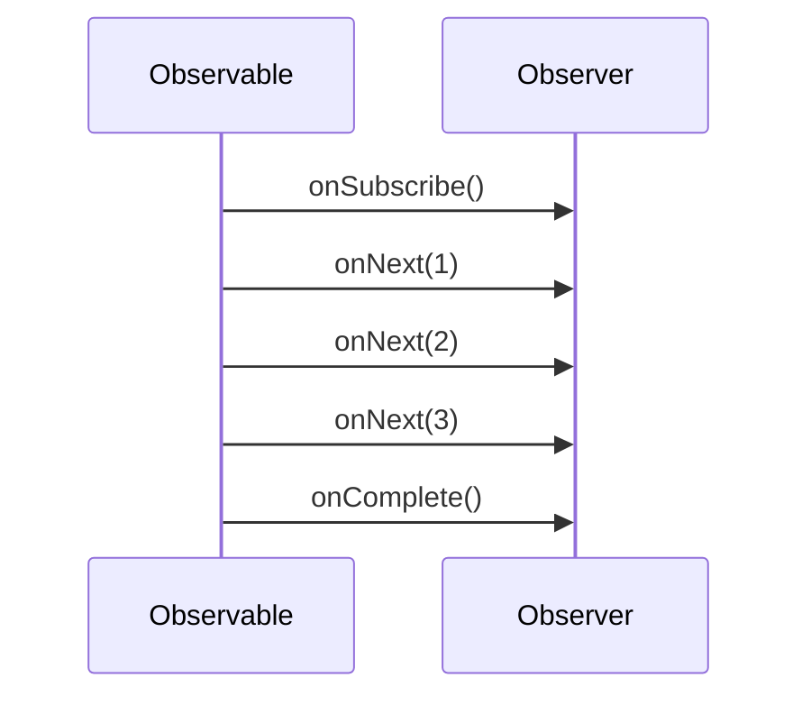

---

# 7. Các Reactive Type quan trọng

RxJava không chỉ có `Observable`.

| Type            |  Số value | Kết thúc               |
| --------------- | --------: | ---------------------- |
| `Observable<T>` | 0 → nhiều | complete/error         |
| `Flowable<T>`   | 0 → nhiều | complete/error         |
| `Single<T>`     |    đúng 1 | success/error          |
| `Maybe<T>`      |  0 hoặc 1 | success/complete/error |
| `Completable`   |         0 | complete/error         |

---

## 7.1 Observable

Thích hợp với stream nhiều phần tử.

```kotlin
fun observeUsers(): Observable<User>
```

Ví dụ:

```text
User A
   ↓
User B
   ↓
User C
   ↓
Complete
```

---

## 7.2 Single

Một operation trả về **đúng một giá trị hoặc error**. Đây là contract chính thức của `Single`. ([reactivex.io][4])

Rất phù hợp với API:

```kotlin
fun getUser(id: Long): Single<User>
```

Luồng:

```text
subscribe
    │
    ├── onSuccess(User)
    │
    └── onError(Throwable)
```

Ví dụ:

```kotlin
api.getUser(10)
    .subscribe(
        { user ->
            showUser(user)
        },
        { error ->
            showError(error)
        }
    )
```

---

## 7.3 Maybe

Dùng khi kết quả có thể tồn tại hoặc không.

```kotlin
fun findUser(id: Long): Maybe<User>
```

Có ba trường hợp:

```text
User tồn tại
    → onSuccess(User)

Không tồn tại
    → onComplete()

Có lỗi
    → onError()
```

Ví dụ thường gặp:

```text
Room Database
      ↓
findById()
      ↓
Maybe<User>
```

---

## 7.4 Completable

Operation không cần trả dữ liệu.

Ví dụ:

```kotlin
fun deleteUser(id: Long): Completable
```

Chỉ quan tâm:

```text
Success → onComplete()
Failure → onError()
```

---

## 7.5 Flowable

`Flowable` dùng cho stream có khả năng cần **backpressure**.

Ví dụ producer:

```text
100000 event / giây
```

nhưng consumer chỉ xử lý:

```text
100 event / giây
```

Nếu không kiểm soát:

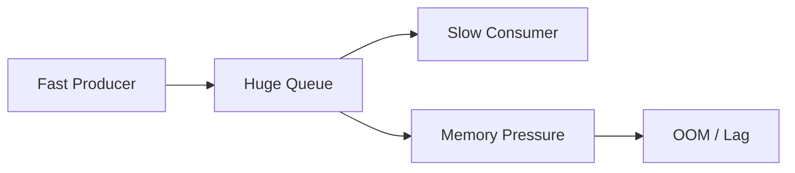

ReactiveX cung cấp các chiến lược như buffer, drop, latest hoặc sampling cho những trường hợp producer nhanh hơn consumer. ([reactivex.io][5])

---

# 8. Tạo Observable

## 8.1 `just()`

```kotlin
Observable.just("Android", "Kotlin", "RxJava")
```

Stream:

```text
Android → Kotlin → RxJava → complete
```

---

## 8.2 `fromIterable()`

```kotlin
val languages = listOf(
    "Kotlin",
    "Java",
    "Python"
)

Observable.fromIterable(languages)
```

---

## 8.3 `range()`

```kotlin
Observable.range(1, 5)
```

Sinh:

```text
1 2 3 4 5
```

---

## 8.4 `fromCallable()`

Hữu ích khi wrap operation đồng bộ.

```kotlin
Single.fromCallable {
    database.loadUsers()
}
```

Sau đó có thể chuyển operation sang background thread:

```kotlin
Single.fromCallable {
    database.loadUsers()
}
.subscribeOn(Schedulers.io())
```

---

# 9. Operators

Sức mạnh lớn nhất của RxJava nằm ở việc **compose operator**.

Có thể chia operator thành:

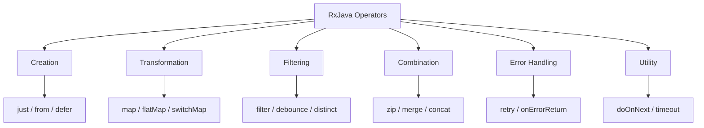

---

# 10. `map()`

`map()` biến:

```text
T → R
```

Ví dụ:

```kotlin
Observable.just(
    User("An"),
    User("Bình")
)
.map { user ->
    user.name
}
```

Kết quả:

```text
An
Bình
```

---

# 11. `flatMap()`

`flatMap` dùng khi mỗi item tạo ra **một reactive source khác** rồi merge chúng thành một stream. ([reactivex.io][6])


*Nguồn hình: ReactiveX — FlatMap Operator.*

Ví dụ:

```kotlin
api.getUser(userId)
    .flatMap { user ->
        api.getPosts(user.id)
    }
```

Luồng:

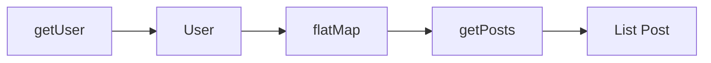

---

## 11.1 `map` hay `flatMap`?

### map

```text
T
↓
R
```

Ví dụ:

```kotlin
.map { user ->
    user.name
}
```

### flatMap

```text
T
↓
Single<R>
```

Ví dụ:

```kotlin
.flatMap { user ->
    api.getProfile(user.id)
}
```

---

# 12. `concatMap`, `flatMap`, `switchMap`

Đây là nhóm operator rất quan trọng.

## `flatMap`

Cho phép các inner stream chạy và merge kết quả.

```text
Request A ─────────► Result A
Request B ───► Result B
Request C ──────► Result C
```

Order có thể thay đổi.

---

## `concatMap`

Chờ stream trước xong mới xử lý stream sau.

```text
A ─────► done
             B ─────► done
                           C ─────► done
```

Dùng khi **thứ tự quan trọng**.

ReactiveX mô tả `concatMap` là biến thể giữ emissions theo thứ tự thay vì interleave như `flatMap`. ([reactivex.io][6])

---

## `switchMap`

Khi request mới xuất hiện, bỏ kết quả từ request cũ.

```text
Search "a"
────────────X

Search "an"
    ────────────X

Search "android"
           ───────────────► Result
```

Rất phù hợp với:

```text
Search-as-you-type
```

---

# 13. `debounce()`

Khi người dùng gõ:

```text
a
an
and
andr
andro
android
```

không nên gọi API sáu lần.

Ta dùng:

```kotlin
queryObservable
    .debounce(400, TimeUnit.MILLISECONDS)
```

`debounce` loại các item bị theo sau quá nhanh bởi một item mới. ([reactivex.io][7])


*Nguồn hình: ReactiveX — Debounce Operator.*

Pipeline search thường là:

```kotlin
queryObservable
    .debounce(400, TimeUnit.MILLISECONDS)
    .map { it.trim() }
    .filter { it.length >= 2 }
    .distinctUntilChanged()
    .switchMapSingle { query ->
        api.search(query)
    }
```

Sơ đồ:

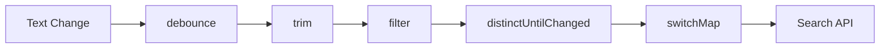

---

# 14. Scheduler — phần cực kỳ quan trọng

RxJava **không có nghĩa là code tự động chạy background thread**.

Ta phải quyết định scheduler phù hợp.

Một số scheduler thường gặp:

| Scheduler                        | Mục đích                              |
| -------------------------------- | ------------------------------------- |
| `Schedulers.io()`                | network, file, database, blocking I/O |
| `Schedulers.computation()`       | CPU-intensive computation             |
| `Schedulers.single()`            | một worker thread tuần tự             |
| `Schedulers.trampoline()`        | queue trên thread hiện tại            |
| `AndroidSchedulers.mainThread()` | Android UI thread                     |

RxAndroid cung cấp scheduler cho Android main thread/Looper. ([GitHub][2])

---

# 15. `subscribeOn()` và `observeOn()`

Đây là một trong những phần dễ nhầm nhất của RxJava.


*Nguồn hình: ReactiveX — Scheduler.* ([reactivex.io][8])

## `subscribeOn()`

Quyết định nơi **upstream/source** bắt đầu hoạt động.

```kotlin
.subscribeOn(Schedulers.io())
```

Ví dụ:

```text
API / DB
   ↓
IO Thread
```

---

## `observeOn()`

Quyết định thread mà **downstream phía sau operator** tiếp tục chạy.

```kotlin
.observeOn(AndroidSchedulers.mainThread())
```

Ví dụ:

```text
IO thread
    │
    ▼
observeOn(Main)
    │
    ▼
UI thread
```

---

## Pipeline Android điển hình

```kotlin
api.getUser()
    .subscribeOn(Schedulers.io())
    .observeOn(AndroidSchedulers.mainThread())
    .subscribe(
        { user ->
            render(user)
        },
        { error ->
            showError(error)
        }
    )
```

Sơ đồ:

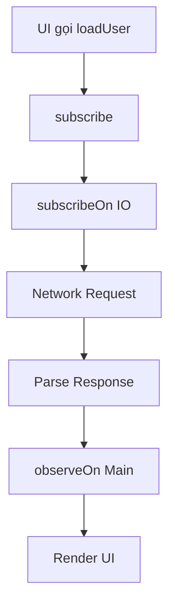

---

# 16. Ví dụ sai — chạy tác vụ nặng trên Main Thread

```kotlin
Single.fromCallable {
    heavyCalculation()
}
.subscribe { result ->
    showResult(result)
}
```

Nếu subscribe được gọi trên main thread, operation có thể chạy trên main thread.

Hậu quả:

```text
Main Thread
   │
   ├── UI drawing
   ├── input event
   └── heavyCalculation()
             │
             ▼
           BLOCK
             │
             ▼
        UI giật / ANR
```

---

# 17. Sửa bằng Scheduler

```kotlin
Single.fromCallable {
    heavyCalculation()
}
.subscribeOn(Schedulers.computation())
.observeOn(AndroidSchedulers.mainThread())
.subscribe(
    { result ->
        showResult(result)
    },
    { error ->
        showError(error)
    }
)
```

Luồng:

```text
Main Thread
     │
     ▼
subscribe()
     │
     ▼
Computation Thread
     │
heavyCalculation()
     │
     ▼
Main Thread
     │
     ▼
showResult()
```

---

# 18. Disposable

Khi subscribe:

```kotlin
val disposable =
    api.getUser()
        .subscribe(
            { user -> },
            { error -> }
        )
```

ta nhận một:

```text
Disposable
```

Có thể gọi:

```kotlin
disposable.dispose()
```

để ngắt subscription.

`Single` của RxJava cũng hỗ trợ dừng running subscription thông qua `Disposable`. ([reactivex.io][4])

---

# 19. CompositeDisposable

Trong Android screen thường có nhiều subscription:

```text
subscription A
subscription B
subscription C
subscription D
```

Thay vì dispose riêng:

```kotlin
private val disposables = CompositeDisposable()
```

Thêm subscription:

```kotlin
disposables.add(
    repository.loadUser()
        .subscribe(
            { user -> },
            { error -> }
        )
)
```

Hoặc Kotlin:

```kotlin
repository.loadUser()
    .subscribe(
        { user -> },
        { error -> }
    )
    .also(disposables::add)
```

Sau đó:

```kotlin
override fun onCleared() {
    disposables.clear()
}
```

---

# 20. RxJava và Lifecycle

RxJava stream thông thường **không tự động lifecycle-aware** như `LiveData`.

Android documentation mô tả `LiveData` là lifecycle-aware, còn một observable thông thường không có đặc tính đó mặc định. ([Android Developers][9])

Nếu Activity chết nhưng subscription vẫn giữ Activity:

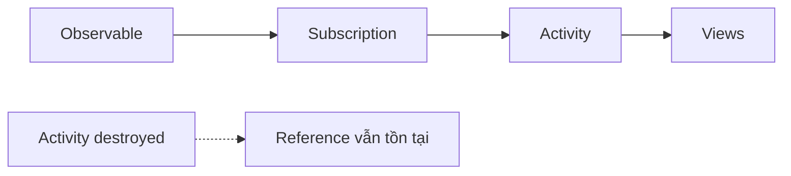

Có nguy cơ:

```text
Memory Leak
```

hoặc callback về một UI không còn tồn tại.

---

# 21. RxJava trong ViewModel

Một cách tổ chức an toàn hơn:

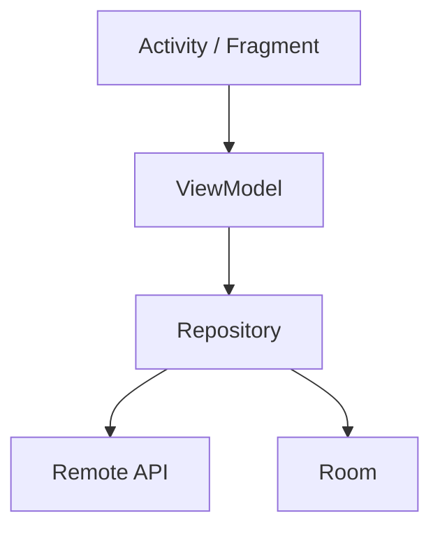

Subscription dài hơn có thể được quản lý trong `ViewModel`.

```kotlin
class UserViewModel(
    private val repository: UserRepository
) : ViewModel() {

    private val disposables = CompositeDisposable()

    fun loadUser(id: Long) {

        repository.getUser(id)
            .subscribeOn(Schedulers.io())
            .observeOn(AndroidSchedulers.mainThread())
            .subscribe(
                { user ->
                    // update state
                },
                { error ->
                    // update error state
                }
            )
            .also(disposables::add)
    }

    override fun onCleared() {
        disposables.clear()
    }
}
```

---

# 22. Repository với RxJava

Repository có thể trả:

```kotlin
interface UserRepository {

    fun getUser(id: Long): Single<User>

    fun observeUsers(): Observable<List<User>>

    fun saveUser(user: User): Completable

    fun findUser(id: Long): Maybe<User>
}
```

Điểm quan trọng là UI không cần biết dữ liệu đến từ:

```text
Retrofit
Room
Cache
File
```

Kiến trúc:

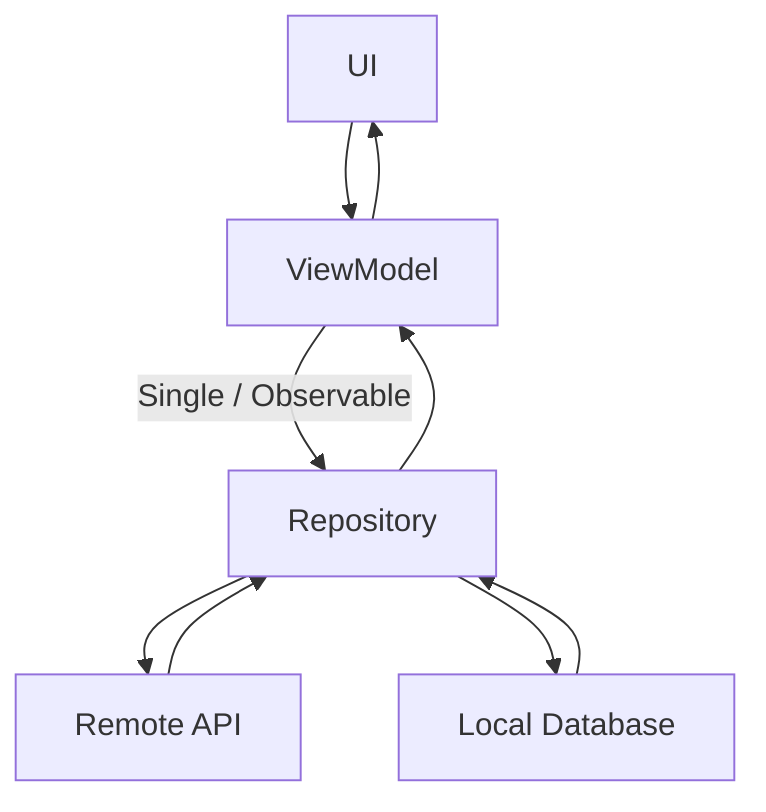

---

# 23. Ví dụ Network + RxJava

Giả sử service:

```kotlin
interface UserApi {

    @GET("users/{id}")
    fun getUser(
        @Path("id") id: Long
    ): Single<User>
}
```

Repository:

```kotlin
class UserRepository(
    private val api: UserApi
) {

    fun getUser(id: Long): Single<User> {
        return api.getUser(id)
    }
}
```

ViewModel:

```kotlin
repository.getUser(1)
    .subscribeOn(Schedulers.io())
    .observeOn(AndroidSchedulers.mainThread())
    .subscribe(
        { user ->
            showUser(user)
        },
        { error ->
            showError(error)
        }
    )
```

---

# 24. Error Handling

Một Rx stream có ba đường quan trọng:

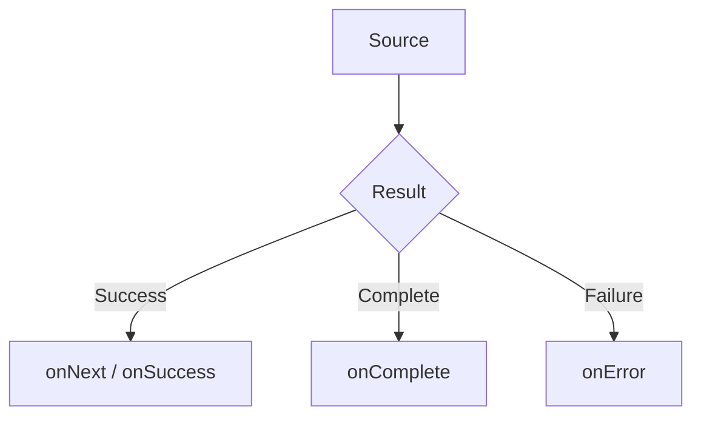

Không nên bỏ qua:

```kotlin
onError
```

---

## 24.1 `onErrorReturnItem`

Fallback đơn giản:

```kotlin
repository.getUser()
    .onErrorReturnItem(defaultUser)
```

---

## 24.2 `onErrorReturn`

```kotlin
repository.getUser()
    .onErrorReturn { error ->

        if (error is IOException) {
            cachedUser
        } else {
            throw error
        }
    }
```

---

## 24.3 `onErrorResumeNext`

Có thể chuyển sang source khác.

```text
Network
   │
   ├─ success → network data
   │
   └─ error
        │
        ▼
      Cache
```

ReactiveX mô tả nhóm Catch/onError resume là cách intercept `onError` và tiếp tục bằng một item hoặc sequence khác. ([reactivex.io][10])

---

# 25. Retry

Ví dụ:

```kotlin
api.getUser()
    .retry(2)
```

Ý tưởng:

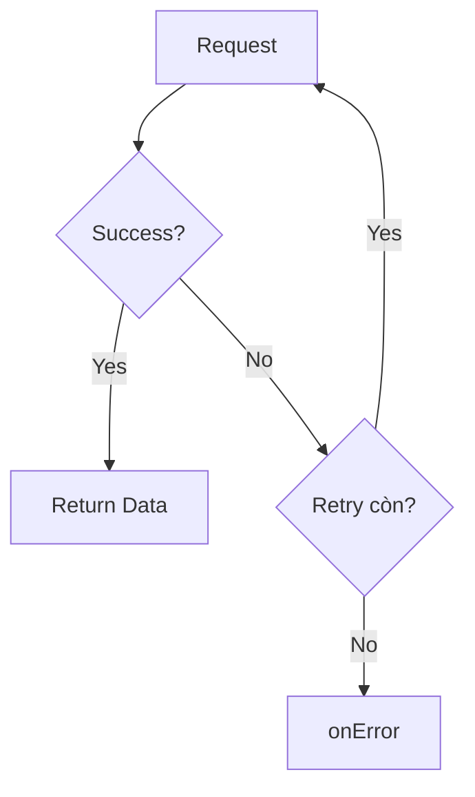

`retry` hoạt động bằng cách resubscribe vào source khi source báo lỗi. ([reactivex.io][11])

---

## Không retry vô hạn một cách mù quáng

Không nên:

```kotlin
api.getUser()
    .retry()
```

với mọi loại lỗi.

Ví dụ:

```text
HTTP 401
```

retry liên tục thường không giải quyết được.

Nên phân loại:

```text
IOException
Timeout
5xx
```

và:

```text
401
403
400
```

khác nhau.

---

# 26. Timeout

Network có thể treo quá lâu.

```kotlin
api.getUser()
    .timeout(10, TimeUnit.SECONDS)
```

ReactiveX định nghĩa `timeout` là kết thúc stream bằng error nếu source không phát item trong khoảng thời gian quy định. ([reactivex.io][12])

Pipeline production có thể là:

```text
API
 ↓
timeout
 ↓
retry
 ↓
error mapping
 ↓
UI state
```

---

# 27. Kết hợp nhiều API bằng `zip`

Giả sử profile screen cần:

```text
User
Posts
Friends
```

Có thể chạy ba request và combine:

```kotlin
Single.zip(
    api.getUser(),
    api.getPosts(),
    api.getFriends()
) { user, posts, friends ->

    Profile(
        user = user,
        posts = posts,
        friends = friends
    )
}
```

Sơ đồ:

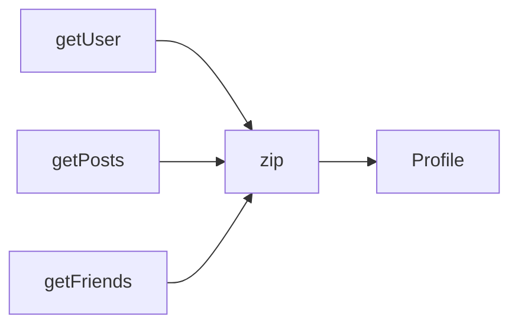

`zip` kết hợp các item theo vị trí tương ứng từ nhiều source để tạo một output mới. ([reactivex.io][13])

---

# 28. `merge` và `concat`

## merge

```text
A ──1────3─────
B ────2────4───

merge

────1─2─3─4────
```

Có thể interleave.

---

## concat

```text
A: 1 2 3
B: 4 5 6
```

Kết quả:

```text
1 2 3 4 5 6
```

Source thứ hai được nối sau source thứ nhất; ReactiveX định nghĩa `concat` theo nguyên tắc không interleave emissions giữa các source. ([reactivex.io][14])

---

# 29. Cache + Network

Một pattern thường gặp:

```text
Cache
  +
Network
```

Ví dụ UX mong muốn:

```text
1. Hiển thị cache ngay
2. Gọi network
3. Network trả về
4. Update database
5. UI nhận dữ liệu mới
```

Sơ đồ:

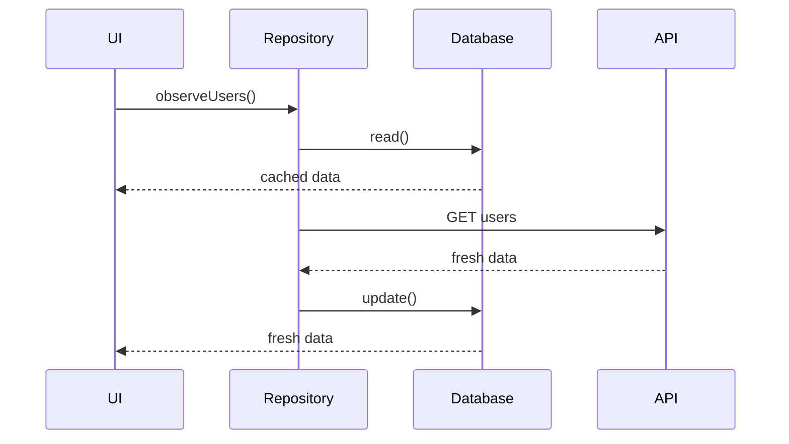

RxJava rất phù hợp với kiểu pipeline này vì nhiều source có thể được compose thành một luồng.

---

# 30. Hot Observable và Cold Observable

## Cold Observable

Mỗi subscriber có producer riêng.

```text
Subscriber A ─→ Source A
Subscriber B ─→ Source B
```

Ví dụ:

```kotlin
Observable.range(1, 5)
```

Mỗi subscriber nhận lại:

```text
1 2 3 4 5
```

---

## Hot Observable

Nhiều subscriber nghe cùng một nguồn event.

```text
             ┌─ Subscriber A
Event Source ┼─ Subscriber B
             └─ Subscriber C
```

Ví dụ:

```text
UI events
WebSocket
sensor
shared events
```

---

# 31. Subject

`Subject` vừa có thể:

```text
Observer
```

vừa có thể:

```text
Observable
```

Sơ đồ:

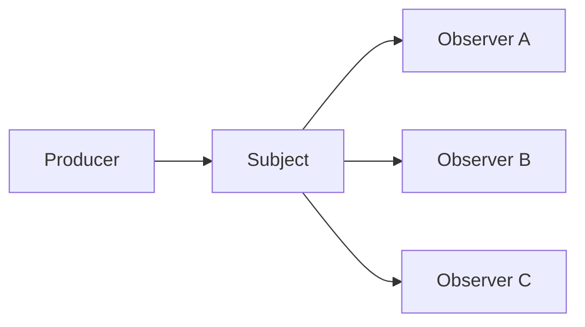

Một số loại:

```text
PublishSubject
BehaviorSubject
ReplaySubject
AsyncSubject
```

Tuy nhiên không nên biến mọi state trong app thành Subject vì rất dễ tạo global mutable event bus khó debug.

---

# 32. Reactive State

RxJava có thể biểu diễn UI state.

Ví dụ:

```kotlin
sealed interface UserUiState {

    data object Loading : UserUiState

    data class Success(
        val user: User
    ) : UserUiState

    data class Error(
        val message: String
    ) : UserUiState
}
```

Pipeline:

```text
User Action
    ↓
Loading
    ↓
Repository
    ↓
Success / Error
    ↓
UI
```

Sơ đồ:

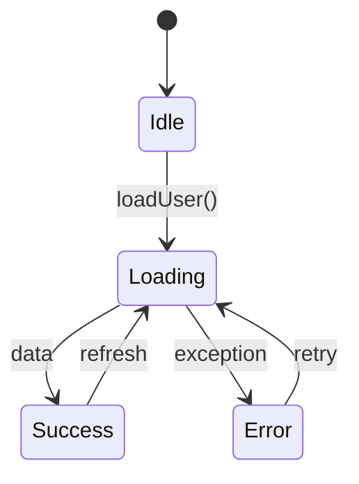

---

# 33. RxJava với Jetpack Compose

Android Compose hiện có integration cho **RxJava 3** thông qua `subscribeAsState()`, biến reactive stream thành Compose `State`. ([Android Developers][15])

Ví dụ ý tưởng:

```kotlin
val state by observable.subscribeAsState(initial = UiState.Loading)
```

Sau đó Compose đọc:

```kotlin
when (state) {

    is UiState.Loading -> {
        CircularProgressIndicator()
    }

    is UiState.Success -> {
        UserContent(...)
    }

    is UiState.Error -> {
        ErrorContent(...)
    }
}
```

Luồng:

```text
Rx Observable
      ↓
subscribeAsState()
      ↓
Compose State
      ↓
Recomposition
```

---

# 34. RxJava với Paging

Paging 3 vẫn hỗ trợ reactive stream bằng:

```text
Flow
LiveData
Flowable
Observable
```

và có `RxPagingSource` cho RxJava. ([Android Developers][16])

Ví dụ:

```text
Database / API
      ↓
RxPagingSource
      ↓
Pager
      ↓
Flowable<PagingData<User>>
      ↓
UI
```

Điều này đặc biệt hữu ích khi duy trì codebase Android hiện đã sử dụng RxJava.

---

# 35. Logging một Rx pipeline

Reactive pipeline dài rất dễ khó debug.

Có thể dùng:

```kotlin
repository.getUser()
    .doOnSubscribe {
        Log.d("RX", "subscribe")
    }
    .doOnSuccess {
        Log.d("RX", "success")
    }
    .doOnError {
        Log.e("RX", "error", it)
    }
    .doFinally {
        Log.d("RX", "finished")
    }
```

Ví dụ log:

```text
RX: subscribe
RX: loading user id=42
RX: success
RX: finished
```

---

# 36. Logging state transition

Thay vì chỉ log:

```text
API error
```

nên log theo state:

```text
Idle
 ↓
Loading
 ↓
Success
```

hoặc:

```text
Idle
 ↓
Loading
 ↓
Error(IOException)
 ↓
Retry
 ↓
Loading
 ↓
Success
```

Sơ đồ:

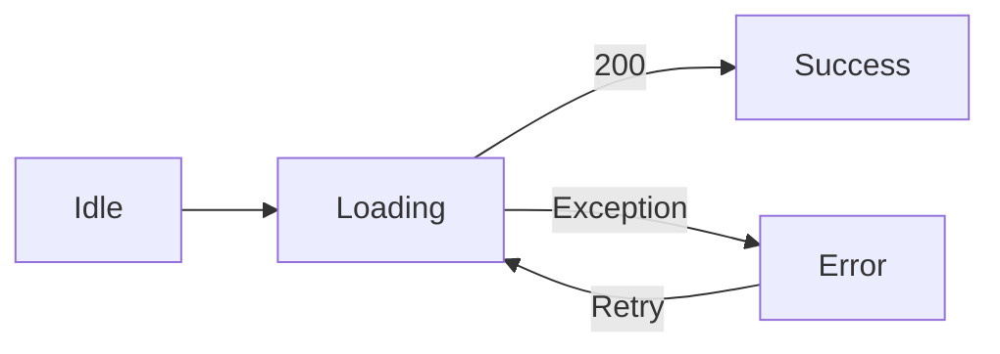

Điều này giúp debug production dễ hơn rất nhiều.

---

# 37. Testing RxJava

RxJava hỗ trợ test observer.

Ví dụ:

```kotlin
repository.getUser(1)
    .test()
    .assertValue(expectedUser)
    .assertComplete()
    .assertNoErrors()
```

---

## Kiểm tra error

```kotlin
repository.getUser(1)
    .test()
    .assertError(IOException::class.java)
```

---

## Kiểm tra nhiều value

```kotlin
Observable.just(1, 2, 3)
    .test()
    .assertValues(1, 2, 3)
    .assertComplete()
```

---

# 38. Test operator theo thời gian

Các operator như:

```text
debounce
delay
interval
timeout
```

không nên test bằng:

```kotlin
Thread.sleep(...)
```

Thay vào đó có thể dùng:

```text
TestScheduler
```

Ý tưởng:

```text
virtual time = 0
      ↓
advance 500 ms
      ↓
trigger scheduled event
      ↓
assert
```

Sơ đồ:

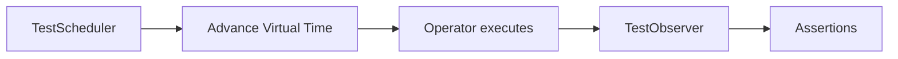

---

# 39. Lỗi phổ biến 1 — quên `onError`

Không nên:

```kotlin
observable.subscribe {
    showData(it)
}
```

nếu source có khả năng error nhưng architecture không có nơi xử lý lỗi thích hợp.

Nên thiết kế rõ:

```text
Success path
Error path
Cancellation path
```

---

# 40. Lỗi phổ biến 2 — Memory Leak

```text
Activity destroyed
       ↓
Subscription vẫn chạy
       ↓
Subscription giữ Activity
       ↓
Activity không GC
       ↓
Memory Leak
```

Giải pháp:

```text
Disposable
CompositeDisposable
ViewModel lifecycle
```

---

# 41. Lỗi phổ biến 3 — sai Scheduler

Sai:

```text
Network
↓
Main Thread
```

hoặc:

```text
Network
↓
IO Thread
↓
renderView()
↓
IO Thread
```

Cả hai đều nguy hiểm.

Mục tiêu:

```text
Network / DB
     ↓
Background Thread
     ↓
Result
     ↓
Main Thread
     ↓
UI
```

---

# 42. Lỗi phổ biến 4 — Rx chain quá phức tạp

Ví dụ:

```kotlin
source
    .flatMap(...)
    .zipWith(...)
    .switchMap(...)
    .flatMap(...)
    .retryWhen(...)
    .onErrorResumeNext(...)
    .concatMap(...)
    .share()
    .replay(1)
```

Nếu developer không thể giải thích được:

```text
value xuất phát ở đâu
thread nào đang chạy
error đi đâu
subscription bị cancel khi nào
```

thì pipeline đã quá phức tạp.

Nên tách:

```text
UseCase
Repository
Function
Named transformer
```

---

# 43. Lỗi phổ biến 5 — Nested Subscribe

Không nên:

```kotlin
api.getUser()
    .subscribe { user ->

        api.getPosts(user.id)
            .subscribe { posts ->

                showPosts(posts)
            }
    }
```

Đây gần như quay lại:

```text
Callback Hell
```

Dùng:

```kotlin
api.getUser()
    .flatMap { user ->
        api.getPosts(user.id)
    }
    .subscribe { posts ->
        showPosts(posts)
    }
```

---

# 44. RxJava so với Kotlin Flow

Trong Android hiện đại, bạn cũng thường gặp:

```text
Kotlin Coroutines
Flow
StateFlow
SharedFlow
```

Không nên hiểu bài này thành:

```text
RxJava luôn tốt hơn Flow
```

hay:

```text
Flow luôn tốt hơn RxJava
```

Thay vào đó hãy hiểu kiến trúc.

| RxJava            | Kotlin                                 |
| ----------------- | -------------------------------------- |
| `Observable`      | `Flow`                                 |
| `Single`          | `suspend fun` trả một value            |
| `BehaviorSubject` | thường tương đương vai trò `StateFlow` |
| `PublishSubject`  | thường gần vai trò `SharedFlow`        |
| `map`             | `map`                                  |
| `flatMap`         | nhóm `flatMap*`                        |
| `switchMap`       | `flatMapLatest`                        |
| `subscribe`       | `collect`                              |
| `Disposable`      | `Job`/cancellation                     |
| `Scheduler`       | `CoroutineDispatcher`                  |

RxJava vẫn đáng học vì:

* nhiều Android codebase production dùng RxJava;
* Java codebase dễ gặp RxJava;
* Retrofit/Room/Paging vẫn có integration;
* kiến thức reactive operators chuyển sang Flow khá tốt.

---

# 45. Ví dụ hoàn chỉnh — Search User

## Yêu cầu

Người dùng nhập username.

Ta muốn:

1. chờ người dùng ngừng gõ 400 ms;
2. bỏ query trùng;
3. query phải từ 2 ký tự;
4. gọi API ở IO;
5. request mới thay request cũ;
6. render UI ở Main Thread;
7. log lỗi;
8. có thể dispose khi screen biến mất.

---

## Pipeline

```kotlin
private val disposables = CompositeDisposable()

fun observeSearch(
    queries: Observable<String>
) {

    queries
        .map { query ->
            query.trim()
        }
        .debounce(
            400,
            TimeUnit.MILLISECONDS
        )
        .filter { query ->
            query.length >= 2
        }
        .distinctUntilChanged()
        .switchMapSingle { query ->

            repository.searchUsers(query)
                .subscribeOn(Schedulers.io())

        }
        .observeOn(AndroidSchedulers.mainThread())
        .subscribe(
            { users ->

                renderUsers(users)

            },
            { error ->

                showError(error)

            }
        )
        .also(disposables::add)
}
```

---

## Sơ đồ hoạt động

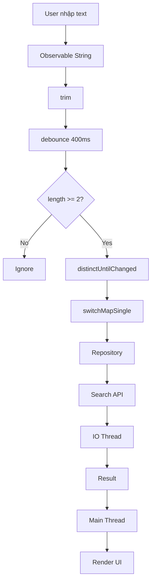

---

# 46. Thực hành

## Bài thực hành: Long-running Task

Tạo một màn hình:

```text
Load Users
```

Khi người dùng nhấn:

```text
[ LOAD USERS ]
```

app thực hiện tác vụ giả lập mất khoảng vài giây.

Yêu cầu:

```text
Main Thread
     │
     ▼
Button Click
     │
     ▼
RxJava
     │
     ▼
Background Thread
     │
     ▼
Load Data
     │
     ▼
Main Thread
     │
     ▼
Render
```

---

## Bước 1 — Repository

```kotlin
class UserRepository {

    fun loadUsers(): Single<List<String>> {

        return Single.fromCallable {

            Thread.sleep(2_000)

            listOf(
                "An",
                "Bình",
                "Cường"
            )
        }
    }
}
```

---

## Bước 2 — ViewModel

```kotlin
class UserViewModel(
    private val repository: UserRepository
) : ViewModel() {

    private val disposables = CompositeDisposable()

    fun loadUsers() {

        repository.loadUsers()
            .subscribeOn(Schedulers.io())
            .observeOn(AndroidSchedulers.mainThread())
            .doOnSubscribe {
                Log.d("UserFlow", "Loading")
            }
            .subscribe(
                { users ->

                    Log.d(
                        "UserFlow",
                        "Success: $users"
                    )

                },
                { error ->

                    Log.e(
                        "UserFlow",
                        "Error",
                        error
                    )
                }
            )
            .also(disposables::add)
    }

    override fun onCleared() {
        disposables.clear()
    }
}
```

---

# 47. Bài tập

## Bài tập chính

Refactor một long-running task để nó không chạy trên Main Thread.

Yêu cầu có đủ:

* `Single` hoặc `Observable`;
* `subscribeOn`;
* `observeOn`;
* loading state;
* success state;
* error state;
* cancellation/dispose;
* logging;
* retry hợp lý.

---

## Yêu cầu nâng cao

Thêm:

```text
timeout = 5 giây
retry = tối đa 2 lần
```

và giải thích:

```text
Network error
      ↓
Retry 1
      ↓
Retry 2
      ↓
Error State
```

---

# 48. Artifact cho Portfolio

Bạn có thể tạo mini-project:

```text
RxSearchDemo/
│
├── data/
│   ├── UserApi.kt
│   └── UserRepository.kt
│
├── presentation/
│   ├── SearchViewModel.kt
│   └── SearchScreen.kt
│
├── test/
│   └── SearchViewModelTest.kt
│
└── README.md
```

README nên có:

```text
# RxJava Search Demo

## Architecture

UI
 ↓
ViewModel
 ↓
Repository
 ↓
API

## Reactive Pipeline

Text Input
 ↓
debounce
 ↓
distinctUntilChanged
 ↓
switchMap
 ↓
API
 ↓
UI

## Threading

API → IO Scheduler
UI → Main Thread

## Error Handling

timeout
retry
error state

## Lifecycle

CompositeDisposable
```

---

# 49. Production Checklist

Trước khi đưa RxJava code vào production, cần kiểm tra:

### Threading

* [ ] Network không chạy Main Thread.
* [ ] Database operation không block Main Thread.
* [ ] CPU-intensive work sử dụng scheduler phù hợp.
* [ ] UI update quay về Main Thread.

### Lifecycle

* [ ] Subscription được dispose đúng lúc.
* [ ] Không giữ reference Activity/Fragment lâu hơn lifecycle.
* [ ] Không callback vào View đã destroyed.

### Error

* [ ] Có `onError`.
* [ ] Error được map sang UI state.
* [ ] Timeout được xử lý.
* [ ] Retry có giới hạn.
* [ ] Không retry lỗi không thể recover.

### State

* [ ] Có Loading.
* [ ] Có Success.
* [ ] Có Error.
* [ ] Refresh được xử lý.
* [ ] Rotate/background không làm state mất ngoài ý muốn.

### Performance

* [ ] Không tạo subscription không cần thiết.
* [ ] Không buffer stream vô hạn.
* [ ] High-frequency stream có debounce/sample/backpressure nếu cần.
* [ ] Không tạo pipeline quá phức tạp.

### Testing

* [ ] Có success test.
* [ ] Có error test.
* [ ] Có retry test nếu sử dụng retry.
* [ ] Có cancellation test khi cần.
* [ ] Operator thời gian được test bằng virtual scheduler thay vì sleep dài.

---

# 50. Checklist hoàn thành bài

* [ ] Giải thích được Reactive Programming.
* [ ] Giải thích được RxJava.
* [ ] Hiểu Observable và Observer.
* [ ] Phân biệt `Observable`, `Flowable`, `Single`, `Maybe`, `Completable`.
* [ ] Biết dùng `map`.
* [ ] Biết dùng `flatMap`.
* [ ] Biết sự khác nhau giữa `flatMap`, `concatMap`, `switchMap`.
* [ ] Biết dùng `debounce`.
* [ ] Hiểu `subscribeOn`.
* [ ] Hiểu `observeOn`.
* [ ] Biết chuyển tác vụ khỏi Main Thread.
* [ ] Biết dùng `Disposable`.
* [ ] Biết dùng `CompositeDisposable`.
* [ ] Hiểu lifecycle risk.
* [ ] Biết xử lý error.
* [ ] Biết dùng timeout/retry hợp lý.
* [ ] Hiểu backpressure cơ bản.
* [ ] Biết cách test RxJava stream.
* [ ] Có mini-project hoặc artifact để đưa vào portfolio.

---

# 51. Câu hỏi phỏng vấn nhanh

### 1. RxJava là gì?

RxJava là implementation của Reactive Extensions trên JVM, dùng observable sequences và operators để compose các luồng dữ liệu, event và tác vụ bất đồng bộ. ([GitHub][1])

### 2. `Single` khác `Observable` thế nào?

`Single<T>` trả đúng một value thành công hoặc một error, trong khi `Observable<T>` có thể phát nhiều value trước khi complete hoặc error. ([reactivex.io][4])

### 3. `subscribeOn()` làm gì?

Chỉ định scheduler nơi quá trình subscription/upstream được thực hiện.

### 4. `observeOn()` làm gì?

Chuyển downstream phía sau operator đó sang scheduler được chỉ định.

### 5. Network nên dùng scheduler nào?

Thông thường:

```kotlin
Schedulers.io()
```

### 6. Update Android View nên chạy ở đâu?

```kotlin
AndroidSchedulers.mainThread()
```

RxAndroid cung cấp scheduler Android Main Thread/Looper cho mục đích này. ([GitHub][2])

### 7. `flatMap` và `switchMap` khác nhau thế nào?

`flatMap` có thể giữ nhiều inner stream cùng hoạt động; `switchMap` chuyển sang source mới nhất và ngừng mirror source trước đó. ([reactivex.io][6])

### 8. Khi nào dùng `debounce`?

Các event tần suất cao như search input để chỉ xử lý sau khi nguồn tạm ngừng phát event trong một khoảng thời gian. ([reactivex.io][7])

### 9. `Disposable` dùng để làm gì?

Dùng để hủy/dispose subscription đang chạy.

### 10. Vì sao phải quan tâm lifecycle?

Nếu subscription sống lâu hơn Activity/Fragment và còn giữ reference UI, có thể gây callback sai lifecycle hoặc memory leak.

---

# 52. Mental Model cần nhớ

Nếu chỉ nhớ một sơ đồ sau bài này, hãy nhớ:

```mermaid
flowchart LR
    A[Event / Data Source]

    A --> B[Observable / Single / Flowable]

    B --> C[Operators]

    C --> D[subscribeOn Background]

    D --> E[Async Work]

    E --> F[Error / Retry / Timeout]

    F --> G[observeOn Main]

    G --> H[Observer]

    H --> I[UI State]

    I --> J[Disposable / Lifecycle]
```

Tóm gọn thành:

```text
SOURCE
  ↓
STREAM
  ↓
TRANSFORM
  ↓
BACKGROUND WORK
  ↓
ERROR HANDLING
  ↓
MAIN THREAD
  ↓
UI STATE
  ↓
DISPOSE
```

Đó là mental model quan trọng nhất khi sử dụng **RxJava trong Android**.

[1]: https://github.com/reactivex/rxjava "GitHub - ReactiveX/RxJava: RxJava – Reactive Extensions for the JVM – a library for composing asynchronous and event-based programs using observable sequences for the Java VM. · GitHub"
[2]: https://github.com/reactivex/rxandroid "GitHub - ReactiveX/RxAndroid: RxJava bindings for Android · GitHub"
[3]: https://reactivex.io/documentation?utm_source=chatgpt.com "ReactiveX - Documentation"
[4]: https://reactivex.io/RxJava/3.x/javadoc/3.1.3/io/reactivex/rxjava3/core/Single.html "Single (RxJava Javadoc 3.1.3)"
[5]: https://reactivex.io/documentation/operators/backpressure.html?utm_source=chatgpt.com "backpressure operators"
[6]: https://reactivex.io/documentation/operators/flatmap.html "ReactiveX - FlatMap operator"
[7]: https://reactivex.io/documentation/operators/debounce.html "ReactiveX - Debounce operator"
[8]: https://reactivex.io/documentation/scheduler.html?utm_source=chatgpt.com "Scheduler"
[9]: https://developer.android.com/topic/libraries/architecture/livedata?utm_source=chatgpt.com "LiveData overview | Views"
[10]: https://reactivex.io/documentation/operators/catch.html?utm_source=chatgpt.com "Catch operator"
[11]: https://reactivex.io/documentation/operators/retry.html?utm_source=chatgpt.com "Retry operator"
[12]: https://reactivex.io/documentation/operators/timeout.html?utm_source=chatgpt.com "Timeout operator"
[13]: https://reactivex.io/documentation/operators/zip.html?utm_source=chatgpt.com "Zip operator"
[14]: https://reactivex.io/documentation/operators/concat.html?utm_source=chatgpt.com "Concat operator"
[15]: https://developer.android.com/develop/ui/compose/state "State and Jetpack Compose  |  Android Developers"
[16]: https://developer.android.com/topic/libraries/architecture/views/paging/v3-paged-data-views "Load and display paged data (Views)  |  Android Developers"
