[](https://codeandcore.com/technologies/rxkotlin/?utm_source=chatgpt.com)

# 035 — RxKotlin

| Thuộc tính              | Nội dung                                 |
| ----------------------- | ---------------------------------------- |
| **Học phần**            | 03 — Architecture, State and Data        |
| **Module**              | Module 05 — Design and Architecture      |
| **Nhóm nội dung**       | Reactive State                           |
| **Nguồn roadmap**       | Design and Architecture / Reactive State |
| **Loại bài**            | Async / Reactive Programming             |
| **Thứ tự trong module** | 035                                      |
| **Thời lượng gợi ý**    | 34 phút                                  |
| **Công nghệ chính**     | Kotlin, RxJava 3, RxKotlin, RxAndroid    |
| **Mức độ**              | Intermediate                             |

---

## 1. Tóm tắt

**RxKotlin** là tập hợp các extension function và tiện ích giúp sử dụng **RxJava bằng Kotlin** ngắn gọn và tự nhiên hơn. RxKotlin **không phải một reactive engine riêng thay thế RxJava**; phần xử lý stream, scheduler, operator và subscription cốt lõi vẫn đến từ RxJava. ([GitHub][1])

Ví dụ, thay vì phải viết nhiều boilerplate khi tạo `Observable`, subscribe hoặc quản lý `Disposable`, RxKotlin cung cấp các extension như:

```kotlin
toObservable()
subscribeBy()
addTo()
```

Repository chính thức mô tả RxKotlin là một thư viện nhẹ bổ sung các extension thuận tiện cho RxJava và chuẩn hóa một số cách sử dụng RxJava với Kotlin. ([GitHub][1])

> **Điểm cần hiểu:** học RxKotlin thực chất là học cách viết **RxJava theo phong cách Kotlin idiomatic**.

Trong Android, chúng ta thường gặp bộ ba:

```text
RxJava
   +
RxKotlin
   +
RxAndroid
```

Trong đó:

* **RxJava**: reactive engine, Observable, Single, operators, Scheduler...
* **RxKotlin**: Kotlin extensions cho RxJava.
* **RxAndroid**: tích hợp Android, đặc biệt là Scheduler cho main/UI thread. ([GitHub][2])

---

# 2. Vị trí của RxKotlin trong Android Architecture

RxKotlin thường nằm trong luồng xử lý dữ liệu giữa:

```text
UI
 ↓
ViewModel
 ↓
UseCase / Repository
 ↓
API / Database / Cache
```

Ví dụ:

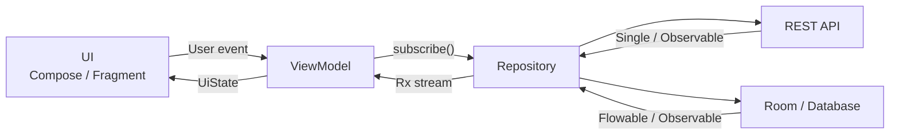

RxJava được thiết kế để xây dựng các chương trình bất đồng bộ và hướng sự kiện thông qua các observable sequence và operator để kết hợp các sequence đó. ([GitHub][3])

---

# 3. Mục tiêu học tập

Sau bài này, anh nên có thể:

* [ ] Giải thích được **RxJava khác RxKotlin như thế nào**.
* [ ] Hiểu Observable → Operator → Observer/Subscriber.
* [ ] Phân biệt `Observable`, `Flowable`, `Single`, `Maybe`, `Completable`.
* [ ] Dùng `subscribeOn()` và `observeOn()` đúng mục đích.
* [ ] Đưa network/database work khỏi Main Thread.
* [ ] Quản lý subscription bằng `Disposable` và `CompositeDisposable`.
* [ ] Hủy công việc khi lifecycle phù hợp.
* [ ] Sử dụng các operator như `map`, `flatMap`, `switchMap`, `zip`, `debounce`.
* [ ] Xử lý error, retry và loading state.
* [ ] Log được state transition.
* [ ] Viết unit test cho reactive pipeline.
* [ ] Biết khi nào nên dùng RxKotlin và khi nào nên ưu tiên Kotlin Flow.

---

# 4. RxJava, RxKotlin và RxAndroid khác nhau thế nào?

## 4.1 RxJava

RxJava là implementation của Reactive Extensions trên JVM. Nó cung cấp các reactive type và operator để xây dựng pipeline xử lý event/data bất đồng bộ. ([GitHub][3])

Ví dụ:

```kotlin
Observable
    .just(1, 2, 3)
    .map { it * 2 }
    .subscribe { println(it) }
```

Kết quả:

```text
2
4
6
```

---

## 4.2 RxKotlin

RxKotlin bổ sung syntax thân thiện với Kotlin.

Ví dụ danh sách Kotlin:

```kotlin
val names = listOf(
    "An",
    "Khanh",
    "Android",
    "Kotlin"
)
```

Với RxKotlin:

```kotlin
names
    .toObservable()
    .filter { it.length >= 6 }
    .subscribeBy(
        onNext = {
            println(it)
        },
        onError = {
            it.printStackTrace()
        },
        onComplete = {
            println("Done")
        }
    )
```

`toObservable()` và `subscribeBy()` là ví dụ điển hình của các tiện ích RxKotlin. ([GitHub][1])

---

## 4.3 RxAndroid

RxAndroid cung cấp integration với Android, đặc biệt là:

```kotlin
AndroidSchedulers.mainThread()
```

để đưa notification của stream trở về UI thread. Repository RxAndroid chính thức mô tả nó là Android-specific binding của RxJava và cung cấp Scheduler cho main thread hoặc một `Looper` cụ thể. ([GitHub][2])

Ví dụ:

```kotlin
repository.loadUsers()
    .subscribeOn(Schedulers.io())
    .observeOn(AndroidSchedulers.mainThread())
    .subscribeBy(
        onSuccess = { users ->
            showUsers(users)
        }
    )
```

---

# 5. Mô hình Reactive cơ bản

Một pipeline Rx thường có dạng:

```text
Source
  ↓
Operator
  ↓
Operator
  ↓
Operator
  ↓
Subscriber
```

Hay:

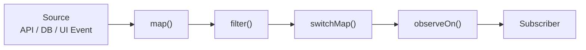

RxJava gọi phía trước operator là **upstream** và phía sau về phía consumer là **downstream**. ([GitHub][3])

Ví dụ:

```kotlin
usersObservable
    .filter { it.active }
    .map { it.name }
    .subscribeBy(
        onNext = { name ->
            println(name)
        }
    )
```

Luồng dữ liệu:

```text
User
 ↓
filter(active)
 ↓
map(User → String)
 ↓
name
 ↓
Subscriber
```

---

# 6. Reactive Types quan trọng

RxJava không chỉ có `Observable`.

## 6.1 Observable<T>

Có thể phát:

```text
0..N items
```

Ví dụ:

```kotlin
Observable.just(
    "Android",
    "Kotlin",
    "RxJava"
)
```

Mô hình:

```text
──── Android ─── Kotlin ─── RxJava ─── Complete
```

Phù hợp với:

* UI event;
* search result;
* database change;
* sensor event;
* stream nhiều giá trị.

---

# 7. Single<T>

`Single<T>` biểu diễn:

```text
1 giá trị
OR
1 lỗi
```

`onSuccess` và `onError` là hai kết quả loại trừ nhau. ([ReactiveX][4])

Rất phù hợp với API request:

```kotlin
fun getProfile(): Single<User>
```

Luồng:

```text
Request
   ↓
┌───────────────┐
│               │
User          Error
```

Ví dụ:

```kotlin
userRepository
    .getUser(10)
    .subscribeBy(
        onSuccess = { user ->
            println(user.name)
        },
        onError = { error ->
            println(error.message)
        }
    )
```

---

# 8. Maybe<T>

`Maybe<T>` biểu diễn:

```text
0 hoặc 1 item
```

Thích hợp cho:

```text
Tìm user trong cache
```

Có thể:

```text
User tồn tại
      ↓
onSuccess(User)
```

hoặc:

```text
Không tồn tại
      ↓
onComplete()
```

hoặc:

```text
Database error
      ↓
onError()
```

Ví dụ:

```kotlin
fun findCachedUser(
    id: Long
): Maybe<User>
```

---

# 9. Completable

Không trả dữ liệu.

Chỉ có:

```text
Complete
hoặc
Error
```

Ví dụ:

```kotlin
fun deleteUser(
    user: User
): Completable
```

Sử dụng:

```kotlin
repository
    .deleteUser(user)
    .subscribeBy(
        onComplete = {
            println("Deleted")
        },
        onError = {
            println("Delete failed")
        }
    )
```

---

# 10. Flowable<T> và Backpressure

`Flowable` dùng cho stream `0..N` có hỗ trợ **backpressure**, trong khi `Observable` không cung cấp backpressure. RxJava mô tả backpressure như một cơ chế flow control giúp downstream thể hiện khả năng xử lý bao nhiêu item và tránh producer nhanh làm consumer bị quá tải. ([GitHub][3])

Ví dụ:

```text
Sensor:
10000 events/s

        ↓

Consumer:
100 events/s
```

Nếu không kiểm soát:

```text
Producer
████████████████████████

Consumer
██
```

có thể dẫn tới:

```text
buffer tăng
   ↓
memory tăng
   ↓
performance giảm
```

Với loại dữ liệu có nguy cơ này:

```kotlin
Flowable<SensorData>
```

có thể phù hợp hơn.

---

# 11. Operator — sức mạnh chính của Reactive Programming

Ảnh marble diagram ở đầu bài minh họa cách các item chạy qua các operator như `map`, `flatMap`, `concat` và `merge`.

Một operator có thể:

```text
Transform
Filter
Combine
Delay
Retry
Throttle
Switch
Aggregate
```

---

## 11.1 map()

Chuyển:

```text
T → R
```

Ví dụ:

```kotlin
Observable.just(
    User("An"),
    User("Khanh")
)
    .map { user ->
        user.name
    }
```

Luồng:

```text
User("An")      → map → "An"
User("Khanh")   → map → "Khanh"
```

---

# 12. filter()

Chỉ giữ item thỏa điều kiện.

```kotlin
users
    .toObservable()
    .filter { user ->
        user.active
    }
```

Ví dụ:

```text
A(active)
B(inactive)
C(active)
```

sau:

```text
filter(active)
```

còn:

```text
A
C
```

---

# 13. flatMap()

`flatMap()` thường dùng khi:

```text
item
 ↓
async operation
 ↓
new stream
```

Ví dụ:

```text
userId
 ↓
getUser()
 ↓
User
```

Code:

```kotlin
Observable.just(10L)
    .flatMapSingle { id ->
        repository.getUser(id)
    }
```

Một use case thực tế:

```text
Login
 ↓
Token
 ↓
Get Profile
 ↓
Profile
```

```kotlin
authRepository
    .login(username, password)
    .flatMap { token ->
        userRepository.getProfile(token)
    }
```

---

# 14. switchMap() — cực kỳ quan trọng cho Search

Giả sử user nhập:

```text
a
an
and
andr
andro
android
```

Nếu mỗi chuỗi tạo một API request:

```text
a       → request #1
an      → request #2
and     → request #3
andr    → request #4
android → request #5
```

Các request cũ có thể trở nên vô nghĩa.

Ta muốn:

```text
query mới
   ↓
bỏ stream cũ
   ↓
chỉ quan tâm request mới
```

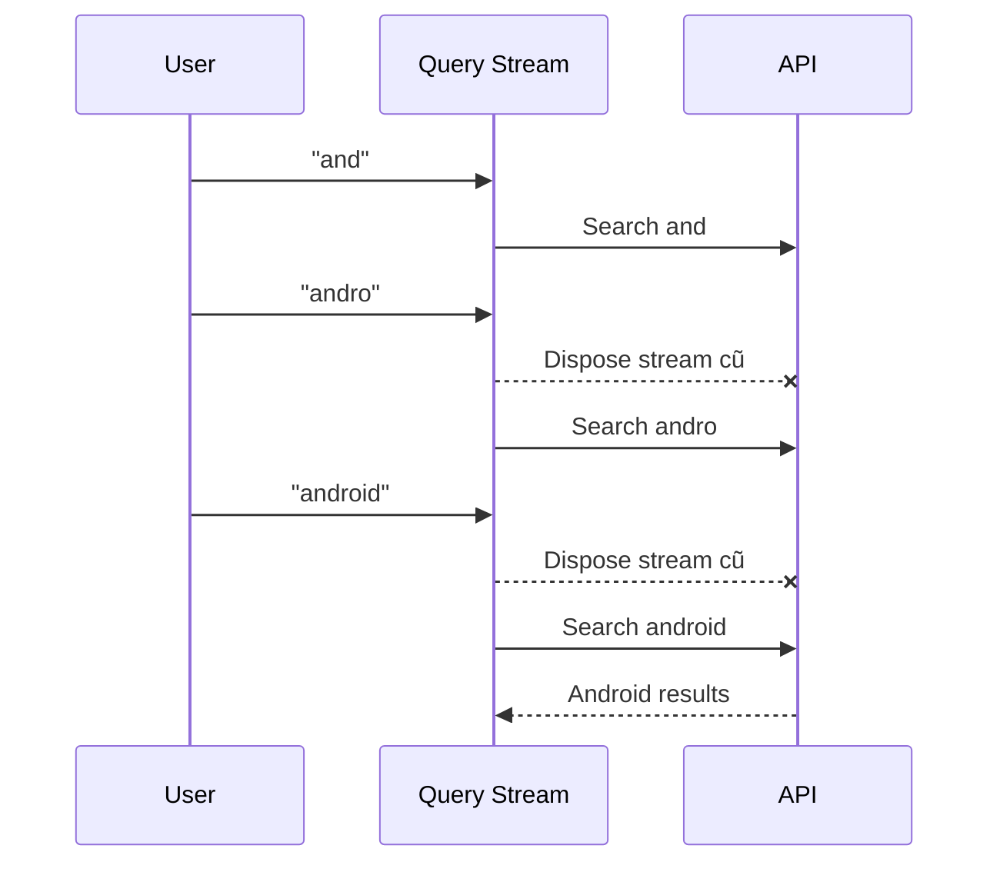

Đây là một trong những pattern reactive rất hữu ích cho:

* search;
* autocomplete;
* filter;
* location query;
* realtime form validation.

---

# 15. debounce()

Không gọi API ngay sau mỗi phím.

Ví dụ:

```text
User typing
A
AN
AND
ANDR
ANDRO
ANDROID

         300ms không nhập
                ↓
            Search
```

Code:

```kotlin
queryObservable
    .debounce(
        300,
        TimeUnit.MILLISECONDS
    )
    .distinctUntilChanged()
```

Pipeline thường gặp:

```kotlin
queryObservable
    .debounce(300, TimeUnit.MILLISECONDS)
    .map { it.trim() }
    .filter { it.length >= 2 }
    .distinctUntilChanged()
    .switchMapSingle { query ->
        repository.search(query)
    }
```

---

# 16. combineLatest()

Giả sử màn hình đăng ký có:

```text
Email
Password
Confirm Password
```

Mỗi input là một stream.

Ta muốn:

```text
Email valid
AND
Password valid
AND
Confirmation valid

        ↓

Enable "Register"
```

Sơ đồ:

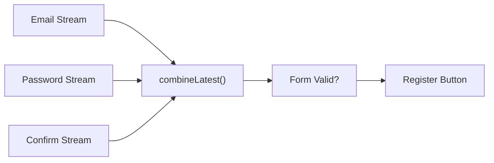

---

# 17. Scheduler — chạy việc ở thread nào?

Đây là một phần quan trọng nhất khi sử dụng RxJava trên Android.

Hai operator dễ nhầm:

```kotlin
subscribeOn()
observeOn()
```

---

## 17.1 subscribeOn()

Xác định Scheduler nơi subscription/upstream bắt đầu thực thi.

Ví dụ:

```kotlin
.subscribeOn(
    Schedulers.io()
)
```

Thường dùng cho:

```text
Network
Database I/O
File I/O
```

---

## 17.2 observeOn()

Chuyển downstream sang Scheduler khác.

Trên Android:

```kotlin
.observeOn(
    AndroidSchedulers.mainThread()
)
```

RxAndroid cung cấp `AndroidSchedulers.mainThread()` để schedule công việc trên Android main thread. ([GitHub][2])

---

## 17.3 Luồng hoàn chỉnh

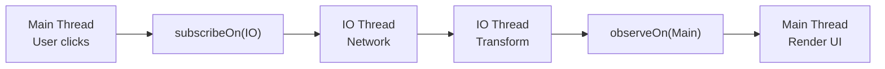

Code:

```kotlin
repository
    .getUsers()
    .subscribeOn(
        Schedulers.io()
    )
    .observeOn(
        AndroidSchedulers.mainThread()
    )
    .subscribeBy(
        onSuccess = { users ->
            render(users)
        },
        onError = { error ->
            showError(error)
        }
    )
```

---

# 18. Sai lầm: chạy task nặng trên Main Thread

Không nên:

```kotlin
repository
    .loadLargeFile()
    .subscribeBy {
        // ...
    }
```

nếu source thực hiện I/O đồng bộ trên thread hiện tại.

Ta cần chủ động xác định execution context:

```kotlin
repository
    .loadLargeFile()
    .subscribeOn(
        Schedulers.io()
    )
```

Mục tiêu là tránh:

```text
Main Thread
    ↓
Network / disk / CPU nặng
    ↓
UI không phản hồi
    ↓
Jank / ANR risk
```

---

# 19. Ví dụ hoàn chỉnh — Search User bằng RxKotlin

Giả sử màn hình:

```text
┌──────────────────────────┐
│ Search users...          │
├──────────────────────────┤
│ 👤 Alice                 │
│ 👤 Alex                  │
│ 👤 Alan                  │
└──────────────────────────┘
```

---

## 19.1 API

```kotlin
interface UserApi {

    fun searchUsers(
        query: String
    ): Single<List<User>>
}
```

---

## 19.2 Repository

```kotlin
class UserRepository(
    private val api: UserApi
) {

    fun search(
        query: String
    ): Single<List<User>> {
        return api.searchUsers(query)
    }
}
```

---

## 19.3 State

```kotlin
sealed interface SearchUiState {

    data object Idle : SearchUiState

    data object Loading : SearchUiState

    data class Success(
        val users: List<User>
    ) : SearchUiState

    data class Error(
        val message: String
    ) : SearchUiState
}
```

---

# 20. State transition

Mỗi search có thể đi qua:

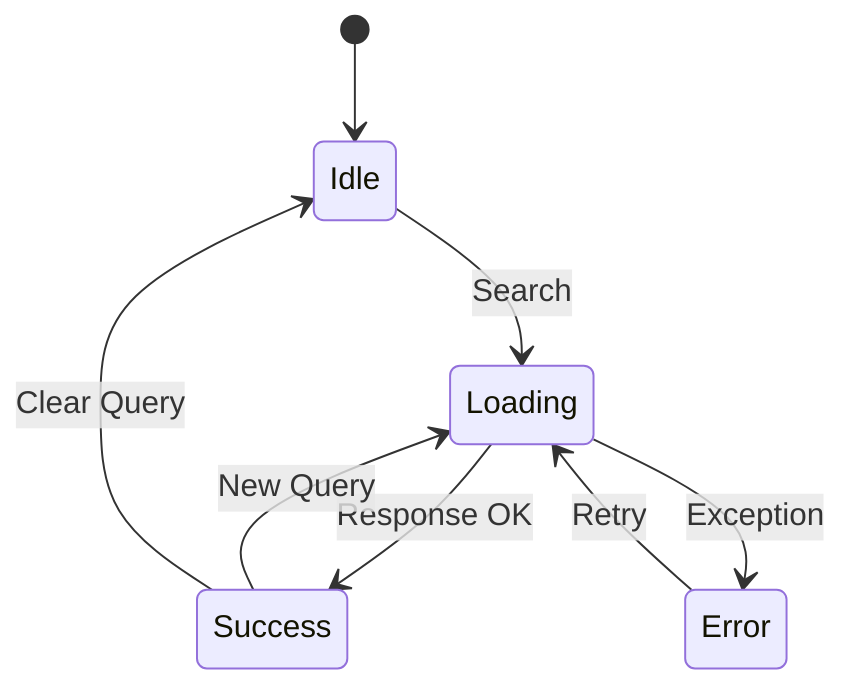

Đây chính là mối liên hệ giữa:

```text
RxKotlin
   +
Reactive State
```

---

# 21. ViewModel với RxKotlin

```kotlin
class SearchViewModel(
    private val repository: UserRepository
) : ViewModel() {

    private val disposables =
        CompositeDisposable()

    private val querySubject =
        PublishSubject.create<String>()

    private val stateSubject =
        BehaviorSubject.createDefault<SearchUiState>(
            SearchUiState.Idle
        )

    val state: Observable<SearchUiState> =
        stateSubject.hide()

    init {
        observeSearch()
    }

    private fun observeSearch() {

        querySubject
            .map { query ->
                query.trim()
            }
            .debounce(
                300,
                TimeUnit.MILLISECONDS
            )
            .distinctUntilChanged()
            .filter { query ->
                query.length >= 2
            }
            .switchMap { query ->

                repository
                    .search(query)
                    .toObservable()
                    .map<SearchUiState> { users ->
                        SearchUiState.Success(users)
                    }
                    .onErrorReturn { error ->
                        SearchUiState.Error(
                            error.message
                                ?: "Unknown error"
                        )
                    }
                    .startWithItem(
                        SearchUiState.Loading
                    )
            }
            .subscribeOn(
                Schedulers.io()
            )
            .subscribeBy(
                onNext = { state ->
                    stateSubject.onNext(state)
                },
                onError = { error ->
                    stateSubject.onNext(
                        SearchUiState.Error(
                            error.message
                                ?: "Unknown error"
                        )
                    )
                }
            )
            .addTo(disposables)
    }

    fun onQueryChanged(
        query: String
    ) {
        querySubject.onNext(query)
    }

    override fun onCleared() {
        disposables.clear()
        super.onCleared()
    }
}
```

RxKotlin cung cấp `addTo()` để thêm `Disposable` vào `CompositeDisposable`. ([GitHub][5])

---

# 22. Disposable là gì?

Khi gọi:

```kotlin
observable.subscribe(...)
```

ta thường nhận lại:

```kotlin
Disposable
```

Nó đại diện cho connection/subscription đang tồn tại.

Có thể:

```kotlin
disposable.dispose()
```

để dispose resource/subscription đó. API RxJava yêu cầu `dispose()` có tính idempotent, tức gọi nhiều lần vẫn phải an toàn. ([ReactiveX][6])

Sơ đồ:

```text
Observable
    │
    │ subscribe()
    ▼
Subscriber
    │
    │
 Disposable
    │
    │ dispose()
    ▼
Subscription disposed
```

---

# 23. CompositeDisposable

Trong một ViewModel có thể có nhiều subscription:

```text
Load Profile
Search
Observe Notifications
Sync Messages
Save Draft
```

Không muốn:

```kotlin
disposable1.dispose()
disposable2.dispose()
disposable3.dispose()
...
```

Ta dùng:

```kotlin
private val disposables =
    CompositeDisposable()
```

RxJava cung cấp `CompositeDisposable` như container quản lý nhiều `Disposable`. ([ReactiveX][7])

Với RxKotlin:

```kotlin
repository
    .getUsers()
    .subscribeBy(
        onSuccess = {
            // ...
        }
    )
    .addTo(disposables)
```

Khi ViewModel chết:

```kotlin
override fun onCleared() {
    disposables.clear()
}
```

Android `ViewModel` tồn tại qua configuration change và chỉ được clear khi scope của nó thực sự kết thúc; `onCleared()` là hook để dọn những dependency/work có lifecycle tương ứng. ([Android Developers][8])

---

# 24. Lifecycle và Configuration Change

Giả sử user rotate điện thoại.

Không nên gắn một network subscription dài trực tiếp vào một `Activity` rồi để callback giữ reference tới Activity cũ.

Luồng nguy hiểm:

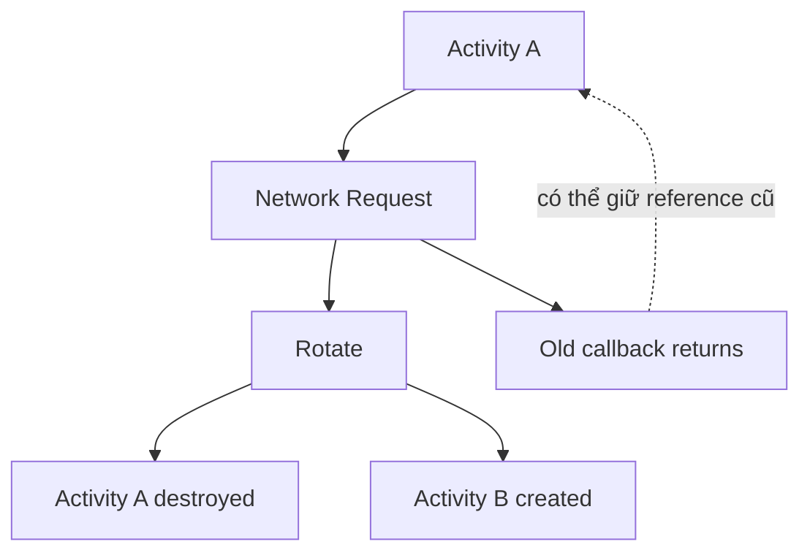

Một screen-level `ViewModel` phù hợp hơn để chứa state/business logic và có thể tồn tại qua configuration change. Đây cũng là vai trò được Android architecture guidance dành cho `ViewModel`. ([Android Developers][8])

---

# 25. `clear()` và `dispose()` khác nhau

Với `CompositeDisposable`:

### `clear()`

Dispose các subscription đang chứa nhưng container vẫn có thể được dùng lại.

### `dispose()`

Dispose subscription và làm chính container trở thành disposed.

Ví dụ trong ViewModel thường có thể dùng:

```kotlin
override fun onCleared() {
    disposables.dispose()
}
```

vì ViewModel sẽ không được tái sử dụng sau `onCleared()`.

---

# 26. Cancellation không có nghĩa mọi công việc đều bị giết tức thì

Đây là điểm rất dễ hiểu nhầm.

```kotlin
disposable.dispose()
```

có nghĩa là dispose/cancel connection theo contract của source.

Nhưng khả năng công việc underlying bị interrupt thực sự phụ thuộc vào resource/source. RxJava có các `Disposable` adapter chẳng hạn `fromFuture()`, trong đó việc dispose có thể dẫn tới `Future.cancel(...)`; vì vậy cancellation behavior cần được hiểu ở integration cụ thể thay vì giả định mọi operation đều bị dừng ngay lập tức. ([ReactiveX][6])

---

# 27. Error Handling

Reactive stream có error channel riêng.

Ví dụ:

```kotlin
repository
    .getUsers()
    .subscribeBy(
        onSuccess = { users ->
            // Success
        },
        onError = { error ->
            // Error
        }
    )
```

Không nên:

```text
Network error
    ↓
Crash app
```

Mà nên:

```text
Network error
    ↓
map error
    ↓
UiState.Error
    ↓
render error
```

---

# 28. Error → UI State

```kotlin
repository
    .getUsers()
    .map<SearchUiState> { users ->
        SearchUiState.Success(users)
    }
    .onErrorReturn { throwable ->

        SearchUiState.Error(
            message = throwable.message
                ?: "Không tải được dữ liệu"
        )
    }
```

Sơ đồ:

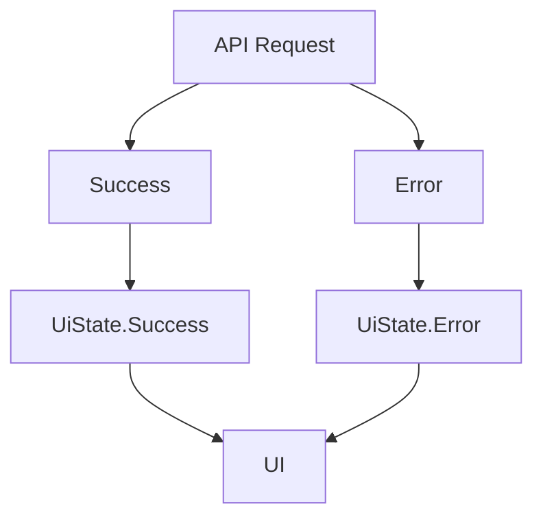

---

# 29. Retry

Ví dụ đơn giản:

```kotlin
repository
    .getUsers()
    .retry(3)
```

Có nghĩa:

```text
Request
 ↓
Fail
 ↓
Retry
 ↓
Fail
 ↓
Retry
 ↓
Success
```

Tuy nhiên không nên retry vô điều kiện mọi lỗi.

Ví dụ:

```text
HTTP 401
```

thường không nên liên tục retry.

Trong khi:

```text
temporary network timeout
```

có thể là ứng viên phù hợp hơn.

---

# 30. Retry với delay/backoff

Một chiến lược thực tế hơn:

```text
attempt 1
 ↓ fail

wait 1s
 ↓

attempt 2
 ↓ fail

wait 2s
 ↓

attempt 3
```

Tư duy:

```text
delay = base × 2^retryCount
```

Đây gọi là:

```text
Exponential Backoff
```

Cần kết hợp thêm:

```text
max retry
error classification
network state
server response
```

để tránh request storm.

---

# 31. Logging Reactive Pipeline

Reactive chain dài có thể khó debug.

Các operator hữu ích gồm:

```kotlin
doOnSubscribe
doOnNext
doOnSuccess
doOnError
doOnComplete
doFinally
```

Ví dụ:

```kotlin
repository
    .getUsers()
    .doOnSubscribe {
        Log.d(
            "UserStream",
            "START"
        )
    }
    .doOnSuccess { users ->
        Log.d(
            "UserStream",
            "SUCCESS size=${users.size}"
        )
    }
    .doOnError { error ->
        Log.e(
            "UserStream",
            "ERROR",
            error
        )
    }
    .doFinally {
        Log.d(
            "UserStream",
            "END"
        )
    }
```

Log mong muốn:

```text
UserStream START

UserStream SUCCESS size=12

UserStream END
```

hoặc:

```text
UserStream START

UserStream ERROR SocketTimeoutException

UserStream END
```

---

# 32. Log State Transition

Thay vì chỉ log network:

```text
API request started
```

hãy log state:

```text
Idle
 ↓
Loading
 ↓
Success
```

Ví dụ:

```kotlin
private fun updateState(
    state: SearchUiState
) {

    Log.d(
        "SearchState",
        "state=$state"
    )

    stateSubject.onNext(state)
}
```

Nhờ vậy khi bug xảy ra:

```text
Loading → Loading → Loading
```

anh dễ phát hiện stream không phát success/error.

---

# 33. Repository pattern với Rx

Architecture:

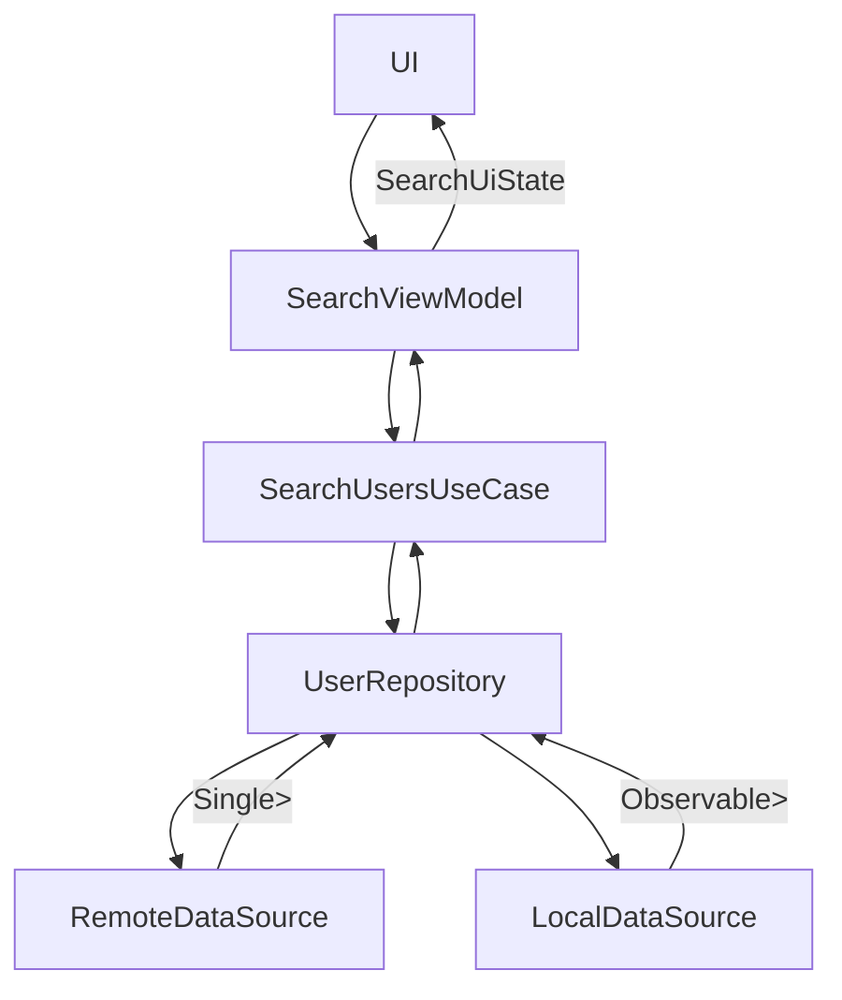

Điều quan trọng là UI không cần biết dữ liệu đến từ:

```text
Retrofit
Room
Cache
File
```

Nó chỉ quan tâm:

```text
UiState
```

---

# 34. Cache + Network bằng Rx

Ví dụ:

```text
Check cache
   ↓
Có?
 ┌─┴─┐
Yes No
 │    │
 ▼    ▼
Cache API
      │
      ▼
     Save
```

Có thể biểu diễn:

```kotlin
repository
    .loadFromCache()
    .switchIfEmpty(
        repository
            .loadFromNetwork()
            .flatMapMaybe { user ->

                repository
                    .saveToCache(user)
                    .andThen(
                        Maybe.just(user)
                    )
            }
    )
```

Đây là ví dụ cho điểm mạnh của reactive programming:

```text
Complex async workflow

↓

Composable pipeline
```

---

# 35. Testing RxKotlin

Một lợi thế lớn của reactive pipeline là có thể test emission trực tiếp thay vì cần render UI.

RxJava cung cấp các test utility như `TestObserver` và `TestScheduler` cho việc kiểm thử stream và time-based operation. ([ReactiveX][9])

Ví dụ:

```kotlin
@Test
fun `active users are returned`() {

    val source = Observable.just(
        User("A", true),
        User("B", false),
        User("C", true)
    )

    val observer = source
        .filter {
            it.active
        }
        .test()

    observer.assertValues(
        User("A", true),
        User("C", true)
    )

    observer.assertComplete()
}
```

---

# 36. Testing Error

```kotlin
@Test
fun `network error is emitted`() {

    val error =
        IOException("Network error")

    val observable =
        Observable.error<User>(error)

    observable
        .test()
        .assertError(error)
}
```

---

# 37. Testing `debounce()` không nên đợi thật 300 ms

Nếu test:

```kotlin
.debounce(
    300,
    TimeUnit.MILLISECONDS
)
```

không nên:

```kotlin
Thread.sleep(300)
```

Thay vào đó dùng:

```kotlin
TestScheduler
```

Concept:

```text
Virtual time
```

```text
0 ms
 │
 │ advance 299 ms
 ▼
No emission

advance 1 ms
 ▼

Emission
```

Nhờ đó test chạy nhanh và deterministic.

---

# 38. Inject Scheduler để dễ test

Không nên hard-code scheduler khắp business logic:

```kotlin
Schedulers.io()
```

Có thể tạo abstraction:

```kotlin
interface SchedulerProvider {

    val io: Scheduler

    val computation: Scheduler

    val main: Scheduler
}
```

Production:

```kotlin
class AppSchedulerProvider :
    SchedulerProvider {

    override val io =
        Schedulers.io()

    override val computation =
        Schedulers.computation()

    override val main =
        AndroidSchedulers.mainThread()
}
```

Test:

```kotlin
class TestSchedulerProvider(
    private val scheduler: TestScheduler
) : SchedulerProvider {

    override val io = scheduler

    override val computation = scheduler

    override val main = scheduler
}
```

Giúp code:

```text
Production Scheduler
          ↕
SchedulerProvider
          ↕
Test Scheduler
```

---

# 39. RxKotlin vs Kotlin Flow

Đây là phần **rất quan trọng trong Android Developer Roadmap 2026**.

Android architecture guidance hiện tại khuyến nghị ViewModel tương tác với data/domain layer bằng **Kotlin Flow cho stream dữ liệu và suspend functions cho action**, đồng thời khuyến nghị coroutine/Flow cho kiến trúc Android hiện đại. ([Android Developers][10])

Vì vậy:

> **RxKotlin vẫn đáng học**, đặc biệt để đọc, duy trì và refactor những codebase Android sử dụng RxJava; nhưng với một Android project mới hoàn toàn, Kotlin Coroutines + Flow hiện phù hợp hơn với hướng dẫn chính thức của Android. ([Android Developers][10])

So sánh:

| RxKotlin / RxJava                    | Kotlin Flow                    |
| ------------------------------------ | ------------------------------ |
| `Observable<T>`                      | `Flow<T>`                      |
| `Flowable<T>`                        | `Flow<T>`                      |
| `Single<T>`                          | `suspend fun(): T`             |
| `Completable`                        | `suspend fun(): Unit`          |
| `map()`                              | `map()`                        |
| `filter()`                           | `filter()`                     |
| `flatMapLatest()` / switch semantics | `flatMapLatest()`              |
| `debounce()`                         | `debounce()`                   |
| `subscribe()`                        | `collect()`                    |
| `Disposable`                         | `Job` / coroutine cancellation |
| `Schedulers.io()`                    | `Dispatchers.IO`               |
| `AndroidSchedulers.mainThread()`     | `Dispatchers.Main`             |

---

# 40. Vì sao vẫn phải học RxKotlin năm 2026?

Có ba tình huống đặc biệt quan trọng.

### 1. Legacy Android codebase

Nhiều hệ thống đã được thiết kế quanh:

```text
Retrofit
+
RxJava
+
RxKotlin
+
RxAndroid
```

Không thể đổi toàn bộ sang Flow trong một lần.

### 2. Library/API đang trả Rx type

Ví dụ:

```kotlin
Single<Response>
```

hoặc:

```kotlin
Observable<Event>
```

Anh cần biết reactive semantics để sử dụng đúng.

### 3. Phỏng vấn Android

Những câu như:

```text
Observable vs Flowable?

subscribeOn vs observeOn?

flatMap vs switchMap?

Disposable dùng để làm gì?

Backpressure là gì?
```

là các câu hỏi kiểm tra khả năng hiểu concurrency/reactive programming chứ không chỉ syntax.

---

# 41. Trạng thái RxKotlin năm 2026

Repository chính thức hiện xác định:

* RxKotlin **3.x** dành cho RxJava **3.x** và được ghi là active.
* RxKotlin 2.x ở maintenance mode.
* RxKotlin 1.x đã end-of-life.
* maintainers khuyên khai báo version RxJava mong muốn một cách rõ ràng vì dependency RxJava trong RxKotlin không phải lúc nào cũng được cập nhật theo mỗi minor/patch release. ([GitHub][1])

Ngoài ra, repository RxKotlin ghi từ tháng 10/2023 rằng dự án không nhận contribution mới do thiếu maintainer capacity. Vì vậy khi đánh giá một project mới, cần cân nhắc cả maintenance status của ecosystem chứ không chỉ API. ([GitHub][1])

---

# 42. RxJava 3 hay RxJava 4?

Tại thời điểm **10/08/2026**, repository RxJava đang ghi lịch dự kiến cho RxJava **4.0.0 vào 30/11/2026**; tài liệu RxKotlin hiện vẫn hướng RxKotlin 3.x tới RxJava 3.x. Repository RxJava cũng ghi Android compatibility của 4.x phụ thuộc API level/desugaring. Vì vậy bài học này sử dụng **RxJava 3 + RxKotlin 3**, phù hợp với ecosystem RxKotlin hiện tại. ([GitHub][1])

---

# 43. Dependency

Theo repository chính thức, dependency RxKotlin 3 có dạng: ([GitHub][1])

```kotlin
dependencies {

    implementation(
        "io.reactivex.rxjava3:rxkotlin:<version>"
    )

    implementation(
        "io.reactivex.rxjava3:rxjava:<version>"
    )
}
```

Nếu là Android và cần main-thread Scheduler:

```kotlin
implementation(
    "io.reactivex.rxjava3:rxandroid:3.0.2"
)
```

`3.0.2` là release RxAndroid 3 được repository chính thức công bố với artifact `io.reactivex.rxjava3:rxandroid`. ([GitHub][11])

> Không nên copy một version RxKotlin bất kỳ từ tutorial cũ. Hãy kiểm tra dependency compatibility của project trước khi upgrade.

---

# 44. Sai lầm thường gặp

## Sai lầm 1 — Nghĩ RxKotlin thay thế RxJava

Sai:

```text
RxJava OR RxKotlin
```

Đúng:

```text
RxJava
   ↑
RxKotlin extensions
```

RxKotlin được xây dựng để bổ sung Kotlin convenience cho RxJava. ([GitHub][1])

---

## Sai lầm 2 — Quên dispose

```kotlin
observable.subscribe(...)
```

nhưng không giữ `Disposable`.

Có thể dẫn tới:

```text
Screen gone
    ↓
stream vẫn tồn tại
    ↓
callback / resource tiếp tục sống
```

---

## Sai lầm 3 — Chạy network trên Main Thread

Sai:

```text
UI thread
   ↓
network
```

Đúng:

```text
Main
 ↓
subscribeOn(IO)
 ↓
Network
 ↓
observeOn(Main)
 ↓
UI
```

---

## Sai lầm 4 — Nested subscribe

Không nên:

```kotlin
userRepository
    .getUser()
    .subscribe { user ->

        postRepository
            .getPosts(user.id)
            .subscribe { posts ->

            }
    }
```

Thay bằng composition:

```kotlin
userRepository
    .getUser()
    .flatMap { user ->
        postRepository
            .getPosts(user.id)
    }
    .subscribeBy(
        onSuccess = { posts ->
            // ...
        }
    )
```

Reactive programming mạnh nhất khi **compose stream**, không phải tạo callback mới bên trong callback.

---

# 45. Sai lầm 5 — Retry vô hạn

Nguy hiểm:

```kotlin
.retry()
```

Có thể trở thành:

```text
Fail
 ↓
Retry
 ↓
Fail
 ↓
Retry
 ↓
Fail
 ↓
...
```

Dẫn tới:

```text
battery usage
network spam
server load
bad UX
```

Nên có:

```text
Max retry
+
Backoff
+
Error classification
```

---

# 46. Sai lầm 6 — Một chain quá dài

Ví dụ:

```kotlin
source
    .map(...)
    .filter(...)
    .flatMap(...)
    .map(...)
    .zipWith(...)
    .flatMap(...)
    .retryWhen(...)
    .observeOn(...)
    .doOnNext(...)
    .subscribe(...)
```

Nếu business logic quá phức tạp, hãy tách:

```text
Repository
UseCase
Mapper
ErrorMapper
StateReducer
```

thay vì biến Rx chain thành nơi chứa toàn bộ logic ứng dụng.

---

# 47. Ảnh hưởng tới UX

RxKotlin/RxJava được dùng đúng có thể hỗ trợ:

```text
Search responsive
      +
Cancel stale request
      +
Debounce typing
      +
Background I/O
      +
Explicit loading/error states
```

→ UX mượt hơn.

Ngược lại dùng sai:

```text
Wrong Scheduler
      ↓
UI freeze

Missing dispose
      ↓
resource leak

Wrong operator
      ↓
stale response

Infinite retry
      ↓
network storm
```

---

# 48. Production architecture đề xuất

Nếu đang bảo trì app RxJava:

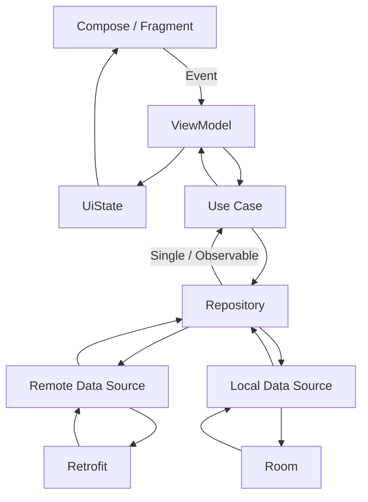

Mục tiêu là giữ:

```text
UI
```

không phụ thuộc trực tiếp vào:

```text
Retrofit
Room
Scheduler details
```

---

# 49. Lifecycle production checklist

Trước khi merge một feature RxJava/RxKotlin, hỏi:

### Subscription

* Subscription được tạo ở đâu?
* Ai sở hữu `Disposable`?
* Nó được dispose khi nào?

### Lifecycle

* Rotate screen có tạo request trùng không?
* Fragment view bị destroy nhưng stream còn chạy không?
* State có nằm trong screen-level ViewModel không?

Android documentation hiện xem `ViewModel` là screen-level state holder và nó tồn tại qua configuration change; `onCleared()` được gọi khi ViewModel kết thúc lifecycle. ([Android Developers][8])

### Threading

* I/O có chạy trên Main Thread không?
* UI update có trở về Main Thread không?
* Có dùng Scheduler không cần thiết không?

### Error

* Network timeout → gì?
* Unauthorized → gì?
* Empty result → gì?
* Server error → gì?

### Retry

* Retry tối đa bao nhiêu?
* Có delay/backoff không?
* Error nào không được retry?

---

# 50. Bài thực hành

## Mini project — Reactive User Search

### Yêu cầu

Tạo một màn hình:

```text
┌──────────────────────────────┐
│ Search                       │
│ ┌──────────────────────────┐ │
│ │ android                  │ │
│ └──────────────────────────┘ │
│                              │
│      Loading...              │
│                              │
│ Android Developer            │
│ Android Team                 │
│ Android Samples              │
└──────────────────────────────┘
```

Pipeline:

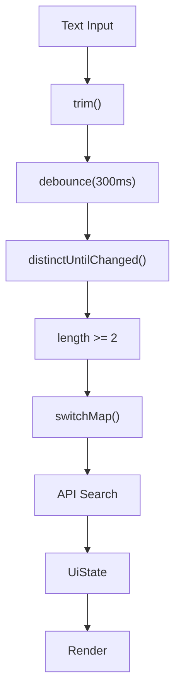

---

# 51. Yêu cầu kỹ thuật

Anh cần triển khai:

```text
Query
 ↓
debounce
 ↓
distinctUntilChanged
 ↓
switchMap
 ↓
Repository
 ↓
Loading / Success / Error
```

Và bắt buộc có:

* `subscribeOn()`;
* `observeOn()` nếu UI trực tiếp consume Rx stream;
* `CompositeDisposable`;
* error state;
* retry có giới hạn;
* state logging;
* unit test.

---

# 52. Bài tập 1 — Move work off Main Thread

Cho:

```kotlin
fun calculateLargeReport():
    Single<Report>
```

Code ban đầu:

```kotlin
calculateLargeReport()
    .subscribeBy {
        render(it)
    }
```

Hãy sửa thành:

```text
Heavy work
 ↓
background
 ↓
result
 ↓
main thread
 ↓
UI
```

Gợi ý:

```kotlin
calculateLargeReport()
    .subscribeOn(
        Schedulers.computation()
    )
    .observeOn(
        AndroidSchedulers.mainThread()
    )
```

---

# 53. Bài tập 2 — Cancellation

Tạo:

```kotlin
Observable.interval(
    1,
    TimeUnit.SECONDS
)
```

Log:

```text
tick 0
tick 1
tick 2
tick 3
```

Sau khi screen kết thúc:

```kotlin
dispose()
```

Kiểm tra:

```text
Không còn tick mới
```

---

# 54. Bài tập 3 — Retry

Giả lập:

```text
Request #1 → Error
Request #2 → Error
Request #3 → Success
```

Sau đó log:

```text
Request 1
Retry 1

Request 2
Retry 2

Request 3
Success
```

---

# 55. Bài tập 4 — State transition

Log chính xác:

```text
Idle
 ↓
Loading
 ↓
Success
```

và:

```text
Idle
 ↓
Loading
 ↓
Error
 ↓
Loading
 ↓
Success
```

---

# 56. Testing checklist

Tối thiểu có test cho:

```text
Success
Error
Empty
Retry
Debounce
Cancellation/disposal
State transition
```

Ví dụ:

```text
Given
API returns users

When
search("android")

Then
Loading
Success(users)
```

---

# 57. Artifact đưa vào Portfolio

Một artifact tốt cho bài này có thể là repository:

```text
rxkotlin-search-demo/
│
├── data/
│   ├── UserApi.kt
│   └── UserRepository.kt
│
├── domain/
│   └── SearchUsersUseCase.kt
│
├── ui/
│   ├── SearchUiState.kt
│   ├── SearchViewModel.kt
│   └── SearchScreen.kt
│
├── rx/
│   └── SchedulerProvider.kt
│
├── test/
│   └── SearchViewModelTest.kt
│
└── README.md
```

README nên có:

```text
Architecture diagram
Reactive pipeline
Scheduler strategy
Disposable strategy
Error strategy
Tests
Screenshots
```

---

# 58. Sơ đồ tổng hợp RxKotlin

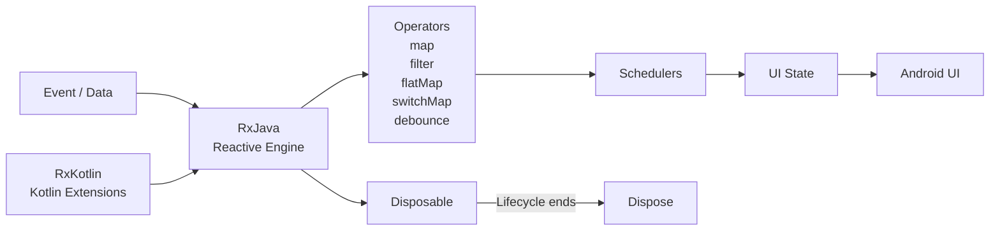

Có thể ghi nhớ:

```text
RxJava
    =
Reactive engine

RxKotlin
    =
Kotlin-friendly extensions

RxAndroid
    =
Android threading integration
```

---

# 59. RxKotlin Mental Model

Khi nhìn một đoạn code như:

```kotlin
query
    .debounce(300, TimeUnit.MILLISECONDS)
    .distinctUntilChanged()
    .switchMapSingle {
        repository.search(it)
    }
    .subscribeOn(Schedulers.io())
    .observeOn(AndroidSchedulers.mainThread())
    .subscribeBy(...)
    .addTo(disposables)
```

hãy đọc từ trên xuống:

```text
1. Có stream query

2. Đợi user ngừng gõ

3. Bỏ query trùng

4. Query mới → bỏ search cũ

5. Gọi repository

6. Làm I/O ở background

7. Trả kết quả về main thread

8. Consume result

9. Gắn subscription vào lifecycle container
```

Nếu đọc được như vậy thì anh đã hiểu RxKotlin ở mức thực hành.

---

# 60. Câu hỏi phỏng vấn nhanh

### Câu 1

**RxKotlin khác RxJava thế nào?**

> RxJava cung cấp reactive runtime, type và operator. RxKotlin bổ sung extension/helper để dùng RxJava tự nhiên hơn trong Kotlin. ([GitHub][1])

### Câu 2

**RxAndroid dùng để làm gì?**

> Bổ sung Android-specific bindings cho RxJava, nổi bật là Scheduler cho Android main thread. ([GitHub][2])

### Câu 3

**Single khác Observable?**

```text
Single:
exactly one success value OR error

Observable:
0..N values
```

`Single` có `onSuccess` hoặc `onError` và hai terminal outcome này loại trừ nhau. ([ReactiveX][4])

### Câu 4

**Observable khác Flowable?**

```text
Observable
→ không backpressure

Flowable
→ có backpressure
```

([GitHub][3])

### Câu 5

**subscribeOn và observeOn?**

```text
subscribeOn
→ upstream/subscription execution

observeOn
→ đổi Scheduler cho downstream
```

### Câu 6

**CompositeDisposable để làm gì?**

> Gom nhiều `Disposable` để quản lý resource/subscription tập trung. ([ReactiveX][7])

### Câu 7

**flatMap và switchMap khác gì?**

```text
flatMap
→ giữ các inner streams

switchMap
→ chuyển sang stream mới nhất
```

Search/autocomplete là ví dụ điển hình cho switch semantics.

---

# 61. Checklist hoàn thành

## Kiến thức

* [ ] Tôi giải thích được RxKotlin là gì.
* [ ] Tôi phân biệt được RxJava, RxKotlin và RxAndroid.
* [ ] Tôi hiểu Observable → Operator → Subscriber.
* [ ] Tôi hiểu `Observable`.
* [ ] Tôi hiểu `Single`.
* [ ] Tôi hiểu `Maybe`.
* [ ] Tôi hiểu `Completable`.
* [ ] Tôi hiểu `Flowable`.
* [ ] Tôi giải thích được backpressure.

## Operator

* [ ] Tôi dùng được `map()`.
* [ ] Tôi dùng được `filter()`.
* [ ] Tôi hiểu `flatMap()`.
* [ ] Tôi hiểu switch semantics.
* [ ] Tôi dùng được `debounce()`.
* [ ] Tôi hiểu `combineLatest()`.

## Threading

* [ ] Tôi hiểu `subscribeOn()`.
* [ ] Tôi hiểu `observeOn()`.
* [ ] Tôi biết đưa I/O khỏi Main Thread.
* [ ] Tôi biết trả UI work về main thread.

## Lifecycle

* [ ] Tôi hiểu `Disposable`.
* [ ] Tôi dùng được `CompositeDisposable`.
* [ ] Tôi dispose subscription đúng lifecycle.
* [ ] Tôi kiểm tra behavior khi rotate/background.

## Reliability

* [ ] Có loading state.
* [ ] Có error state.
* [ ] Có retry policy.
* [ ] Không retry vô hạn.
* [ ] Có logging.
* [ ] Có state transition log.

## Testing

* [ ] Test success.
* [ ] Test error.
* [ ] Test empty.
* [ ] Test retry.
* [ ] Test time-based operator bằng virtual scheduler khi phù hợp.

## Portfolio

* [ ] Có app demo.
* [ ] Có architecture diagram.
* [ ] Có reactive pipeline diagram.
* [ ] Có unit test.
* [ ] Có README giải thích cancellation và retry.

---

# 62. Ghi chú production

Trước khi đưa một RxKotlin feature vào production, hãy tự hỏi:

```text
User event nào tạo stream?

Stream thuộc lifecycle của ai?

Ai giữ Disposable?

Stream được dispose khi nào?

Task nào chạy background?

Task nào chạy main thread?

Request cũ có cần cancel khi request mới tới?

Network error biến thành UI state nào?

Retry bao nhiêu lần?

Có backoff không?

Rotate có tạo request trùng không?

Background/foreground có ảnh hưởng stream không?

Có test success/error/retry không?

Có log đủ để debug production không?
```

---

# 63. Kết luận

RxKotlin không phải một công nghệ tách biệt khỏi RxJava mà là lớp tiện ích giúp **ReactiveX trở nên Kotlin-friendly hơn**. RxKotlin 3.x hiện nhắm tới RxJava 3.x. ([GitHub][1])

Mental model quan trọng nhất của bài:

```text
Event / Data
     ↓
Observable / Single / Flowable
     ↓
Operators
     ↓
Schedulers
     ↓
State
     ↓
UI
```

và song song:

```text
Subscription
     ↓
Disposable
     ↓
Lifecycle ends
     ↓
Dispose
```

Trong Android hiện đại năm 2026, **Coroutines + Flow là hướng được Android documentation khuyến nghị cho kiến trúc mới**, nhưng RxKotlin/RxJava vẫn là kiến thức rất hữu ích để làm việc với các codebase reactive hiện hữu, thư viện sử dụng Rx và các bài toán stream/composition. ([Android Developers][10])

> **Hoàn thành bài 035 khi anh có thể nhìn một Rx chain và trả lời ngay bốn câu:** dữ liệu đến từ đâu, biến đổi thế nào, chạy trên thread nào và subscription chết khi nào.

[1]: https://github.com/ReactiveX/RxKotlin "GitHub - ReactiveX/RxKotlin: RxJava bindings for Kotlin · GitHub"
[2]: https://github.com/reactivex/rxandroid?utm_source=chatgpt.com "ReactiveX/RxAndroid: RxJava bindings for Android"
[3]: https://github.com/ReactiveX/RxJava?ref=blog.fps.hu "GitHub - ReactiveX/RxJava at blog.fps.hu · GitHub"
[4]: https://reactivex.io/RxJava/3.x/javadoc/3.1.3/io/reactivex/rxjava3/core/Single.html?utm_source=chatgpt.com "Single (RxJava Javadoc 3.1.3)"
[5]: https://github.com/ReactiveX/RxKotlin?utm_source=chatgpt.com "ReactiveX/RxKotlin: RxJava bindings for Kotlin - GitHub"
[6]: https://reactivex.io/RxJava/3.x/javadoc/3.1.3/io/reactivex/rxjava3/disposables/Disposable.html?utm_source=chatgpt.com "Disposable (RxJava Javadoc 3.1.3)"
[7]: https://reactivex.io/RxJava/3.x/javadoc/3.1.11/io/reactivex/rxjava3/disposables/CompositeDisposable.html?utm_source=chatgpt.com "CompositeDisposable (RxJava Javadoc 3.1.11)"
[8]: https://developer.android.com/topic/libraries/architecture/viewmodel "ViewModel overview  |  App architecture  |  Android Developers"
[9]: https://reactivex.io/RxJava/3.x/javadoc/3.1.8/?utm_source=chatgpt.com "Overview (RxJava Javadoc 3.1.8)"
[10]: https://developer.android.com/topic/architecture/views/recommendations-views "Recommendations for Android architecture (Views)  |  Android Developers"
[11]: https://github.com/ReactiveX/RxAndroid/releases?utm_source=chatgpt.com "Releases · ReactiveX/RxAndroid"
